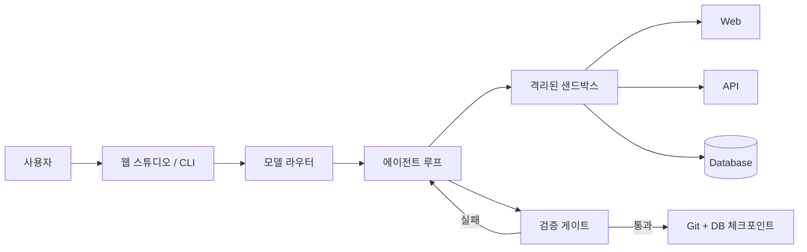

# b-studio

[](https://github.com/dj258255/b-studio/actions/workflows/ci.yml)

> 여러 코딩 에이전트를 독립 작업 공간에서 실행하고 진행 상태·토큰·미리보기·diff·검증 결과를 한눈에 비교하는 AI 개발 환경(ADE)

b-studio는 한 에이전트를 IDE에 붙이는 도구가 아니라, 여러 에이전트 작업을 운영하는 제어 화면입니다. 작업 난도와 위험도에 맞는 모델을 고르고, 독립 Git 작업 공간과 샌드박스에서 실행되는 Plan → Code → Run → Verify 단계를 실시간으로 보여 줍니다. 사용자는 후보별 토큰·비용·변경 내용·실행 화면을 비교한 뒤 검증을 통과한 결과만 선택합니다.


## 핵심 특징

- **ADE 작업 보드**: 여러 세션의 계획·도구 호출·서비스 상태·로그·미리보기·diff·검증 결과를 한 화면에서 추적합니다.
- **독립 작업 공간**: 후보마다 전용 Git 복제본·브랜치·샌드박스를 사용해 병렬 작업이 서로의 파일과 실행 환경을 덮지 않게 합니다.
- **작업별 모델·토큰 운용**: 단순 작업은 비용·지연을, 고위험 작업은 품질을 더 반영해 모델을 고르고 요청·세션·사용자별 토큰 한도를 적용합니다.
- **멀티 모델과 Agent Fleet**: Anthropic·OpenAI 호환 API·Gemini를 공통 도구 계약으로 실행하고, 필요한 작업만 2~4개 후보로 펼쳐 결과를 비교합니다.
- **작업 그래프**: 서로 기다릴 필요가 없는 작업을 동시 실행 수·재시도·실패 전파 규칙으로 병렬 처리합니다. 검증 게이트의 테스트·화면 확인과 작업 분해의 레인 실행이 이 그래프를 씁니다.
- **작업 분해**: 한 요청을 모델이 작업·쓰기 범위·의존 관계로 나누면 스튜디오가 검증합니다. 계획은 사람이 승인해야 레인이 실행됩니다. 이어진 작업은 한 세션에서 차례로, 독립 레인은 다른 세션에서 동시에 돌리고, 작업마다 쓰기 범위를 실행기에서 걸어 레인끼리 변경이 겹치지 않게 합니다. 결과는 새 세션에서 같은 게이트로 다시 적용해 합친 뒤 검증합니다.
- **실제 서버 런타임**: 브라우저 모의 환경이 아니라 Docker 또는 Kubernetes에서 실제 개발 서버를 실행합니다.
- **검증 게이트**: 모델의 완료 선언 대신 서비스 재시작, HTTP 준비 상태, OpenAPI 호환성으로 완료를 판정합니다.
- **편집기와 무관한 검증**: 에이전트 도구를 거치지 않고 편집기·명령으로 바꾼 현재 변경도 `studio verify`로 에이전트와 같은 게이트(재시작·준비 판정·화면·테스트·리뷰)에 넣어 확인합니다. 이 명령은 판정만 하고 체크포인트는 만들지 않습니다. 계약 비교는 현재 코드를 기준으로 잡히므로 스튜디오 세션에서만 의미가 있습니다.
- **안전한 체크포인트**: 검증을 통과한 변경과 데이터베이스 상태만 남기고, 실패하거나 취소한 변경은 되돌립니다.
- **정책과 격리**: 자원 한도, 네트워크 허용 목록, 시크릿 가림, 사내 API 정책 프록시를 프로젝트 설정으로 적용합니다.
- **팀 워크플로 강제**: `studio.yaml`에 단계·테스트 명령·화면 확인·보호 경로·승인·배포 조건을 선언합니다. 검증 게이트가 재시작·계약·화면·테스트·리뷰를 직접 실행하고, 필수 단계를 모두 통과한 변경만 체크포인트로 남깁니다. 통과한 단계는 커밋 트레일러로 기록돼 배포 조건과 대조합니다. Pi 확장은 같은 정책 코드로 Pi 내장 도구 호출을 먼저 막고 다음 행동을 안내합니다.
- **로컬 또는 API 실행**: API 키뿐 아니라 개인 PC에 로그인된 `claude` CLI 계정으로도 실행할 수 있습니다.

## 빠른 시작

### 준비물

- Node.js 22 이상
- pnpm 10.29.3
- Docker Desktop 또는 Colima
- 에이전트를 실행하려면 `ANTHROPIC_API_KEY` 또는 로그인된 Claude Code CLI

### 설치와 실행

```bash
git clone https://github.com/dj258255/b-studio.git
cd b-studio
corepack enable
pnpm install
pnpm studio up examples/orders
```

준비가 끝나면 터미널에 웹 미리보기와 OpenAPI 주소가 표시됩니다. `Ctrl+C`를 누르면 b-studio가 컨테이너와 샌드박스 전용 볼륨을 정리합니다.

웹 스튜디오는 별도 터미널에서 실행합니다.

```bash
# 모델 호출 없이 UI와 전체 흐름 확인
pnpm studio:demo

# 이 PC의 Claude Code 로그인 사용
pnpm studio:local
```

기본 주소는 `http://127.0.0.1:3000`입니다.

### CLI로 에이전트 실행

```bash
# Anthropic API
ANTHROPIC_API_KEY=... pnpm studio agent examples/orders "주문 목록에 상태 필터를 추가해 줘"

# 개인 PC의 Claude Code 로그인
pnpm studio agent examples/orders "주문 목록에 상태 필터를 추가해 줘" \
  --backend claude-code
```

계약을 의도적으로 깨는 작업은 요청 내용에 그 의도가 드러나야 하며 `--allow-breaking`도 함께 지정해야 합니다.

```bash
pnpm studio agent examples/orders \
  "더 이상 쓰지 않는 legacy 필드를 삭제해 줘" \
  --allow-breaking
```

설치, 인증, 첫 실행에서 막히면 [시작하기](docs/getting-started.md)를 확인하세요.

## 작동 방식



1. `@b-studio/spec`이 `studio.yaml`과 `compose.yaml`의 일관성을 확인합니다.
2. `@b-studio/sandbox`가 서비스별 격리 환경과 edge 프록시를 만듭니다.
3. `@b-studio/agent`가 제한된 파일·명령·HTTP 도구로 작업합니다.
4. 검증 게이트가 바뀐 서비스를 재시작하고 준비 상태와 API 계약을 확인합니다.
5. 통과한 파일과 DB 상태만 체크포인트로 저장합니다.

구조와 경계는 [아키텍처 문서](docs/architecture.md), 선택의 근거는 [ADR](docs/decisions.md)에 정리되어 있습니다.

## 프로젝트 구성

```text
b-studio/
├── apps/
│   ├── cli/                  # studio up · agent · deploy · auth
│   └── studio/               # Next.js 웹 스튜디오
├── packages/
│   ├── spec/                 # studio.yaml 스키마와 로더
│   ├── sandbox/              # Docker/Kubernetes 샌드박스와 정책 경계
│   └── agent/                # 에이전트 루프, 도구, 모델, 검증 게이트
├── templates/                # Next.js · Spring Boot · FastAPI 원본
├── examples/orders/          # web + api + PostgreSQL 예제
├── config/                   # 모델 레지스트리 예시
└── docs/                     # 사용자·운영·설계 문서
```

## 주요 명령

| 명령 | 용도 |
|---|---|
| `pnpm studio up <path>` | 프로젝트를 샌드박스에서 실행 |
| `pnpm studio agent <path> "<request>"` | 에이전트에게 변경 요청 |
| `pnpm studio deploy <path>` | 운영 이미지를 만들고 고정 주소로 전환 |
| `pnpm studio deploy <path> --status` | 현재 배포와 릴리스 상태 확인 |
| `pnpm studio deploy <path> --rollback <id>` | 이전 릴리스로 롤백 |
| `pnpm studio auth token <name>` | 웹 스튜디오 token 모드용 토큰 생성 |
| `pnpm test` | 단위 테스트 실행 |
| `pnpm typecheck` | 전체 워크스페이스 타입 검사 |

전체 옵션과 운영 절차는 [운영 가이드](docs/operations.md)에 있습니다.

## `studio.yaml` 최소 예시

```yaml
version: 1
name: orders

services:
  web:
    source: managed
    template: nextjs
    path: web
    port: 3000
    preview: browser
    ready: { path: /, timeoutSeconds: 300 }

  api:
    source: managed
    template: spring-boot
    path: api
    port: 8080
    preview: openapi
    ready: { path: /actuator/health/readiness, timeoutSeconds: 900 }
    contract: { extract: /v3/api-docs }

databases:
  db: { engine: postgres, database: app, user: app }

resources:
  web: { memory: 1g, cpus: 2 }
  api: { memory: 1536m, cpus: 2 }
  db: { memory: 256m }
```

managed/external 서비스, 네트워크 정책, 시크릿, 스냅샷, 배포 설정은 [`studio.yaml` 레퍼런스](docs/configuration.md)를 참고하세요.

## 일정과 작업 방식

커밋 기록(2026-09-10 ~ 09-17)을 영역별로 묶으면 다음 순서로 쌓였습니다.

| 단계 | 기간 | 산출물 |
|---|---|---|
| 런타임 코어·샌드박스 | 09-10 | pnpm 워크스페이스, `studio.yaml` 스키마, 로컬 Docker 샌드박스, Next.js·Spring Boot·FastAPI 템플릿, `studio up` 명령 (PR 없이 커밋, c733cc8 ~ 4499334) |
| 에이전트 루프·검증 게이트 | 09-10 ~ 09-11 | 샌드박스 파일 반영 확인, 로컬 로그인 계정으로 에이전트 실행, 세션 브랜치로 PR을 올리는 흐름 (PR #3, #4) |
| 체크포인트 | 09-10 ~ 09-11 | 검증을 통과한 변경만 Git 커밋으로 남기고 실패·취소는 되돌리는 체크포인트, 같은 시점의 PostgreSQL 덤프를 함께 남기는 DB 브랜치 (PR #2, #6) |
| 정책·격리 | 09-11 ~ 09-12 | 자원 한도, 네트워크 격리와 edge 프록시, 시크릿 주입·가림, 사내 API 정책 프록시, gVisor·Kubernetes 제공자, 자유 텍스트 속 개인정보 마스킹, egress 경로·메서드 규칙 (PR #7~#12, #35, #36, #38) |
| 배포 | 09-11 ~ 09-12 | 운영 이미지 빌드와 무중단 배포, 체크포인트를 운영에 올리는 배포 탭, PR CI와 스튜디오 컨테이너 이미지 (PR #27, #28, #29) |
| 멀티 모델·Fleet | 09-13 | 여러 모델을 같은 도구 계약으로 묶는 라우터, 같은 요청을 독립 브랜치와 샌드박스에서 병렬로 돌리는 Agent Fleet |
| 작업 분해·워크플로 강제 | 09-15 ~ 09-16 | 도구 호출 전 실행 정책 적용, 검증 게이트의 워크플로 단계 강제와 배포 차단, 헤드리스 브라우저 화면 확인, 작업을 레인으로 나눠 병렬 실행하고 사람이 계획을 승인한 뒤 통합 결과를 같은 게이트로 재검증 |

이슈와 PR로 남긴 정도는 시기마다 달랐습니다. 09-10부터 09-12까지는 PR 38개가 병합돼 커밋과 PR이 거의 1대1로 붙었습니다. 09-13 이후 멀티 모델 라우터, Agent Fleet, 워크플로 강제, 작업 분해 같은 기능은 PR 없이 main에 바로 커밋했습니다. 화면 문법 정리 작업은 이슈 #39와 PR #40으로 2026-09-24에 병합됐습니다.

설계 판단은 [ADR](docs/decisions.md)에 51개로 적었습니다. 샌드박스 제공자를 추상화한 이유(ADR-006), 완료를 플랫폼이 판정하게 한 이유(ADR-010), 워크플로 단계를 게이트가 직접 실행해야 통과로 인정한 이유(ADR-049)처럼 판단마다 근거를 남겼습니다. 기존 ADR은 지우지 않고 판단이 바뀌면 새 ADR에서 대체 관계를 밝히는 규칙을 [기여 가이드](CONTRIBUTING.md)에 정해 뒀습니다.

예상 작업 시간이나 마감을 미리 적어 두고 실제와 비교하는 기록은 남기지 않았습니다. 위 단계 구분은 커밋 기록을 나중에 묶어 다시 구성한 것입니다.

2026-09-24부터는 새 기능·개선을 "착수 명세" 이슈로 시작해 문제·선택지·완료 조건·예상 시간을 먼저 적습니다. PR에서는 [템플릿](.github/pull_request_template.md)의 "예상과 실제" 표로 예상과 실제를 비교합니다. 현재 단계와 다음 계획은 [로드맵](ROADMAP.md)에서 봅니다.

## 구현 상태

| 영역 | 상태 |
|---|---|
| 프로젝트 명세 · Docker 샌드박스 · CLI | 완료 |
| Plan → Code → Run → Verify 에이전트 루프 | 완료 |
| 웹 스튜디오 · 미리보기 · API 탐색기 · 로그 | 완료 |
| Git/DB 체크포인트 · 세션 복구 · 원격 저장소 연동 | 완료 |
| 자원 한도 · 네트워크 격리 · 시크릿 · 정책 프록시 | 완료 |
| gVisor · Kubernetes 제공자 | 구현 및 로컬 클러스터 검증 |
| 멀티 모델 라우터 · Agent Fleet | 완료 |
| 병렬 Task Graph · 의존성·재시도·실패 전파 | 완료 |
| 워크플로 강제: 테스트·화면 확인(HTTP·헤드리스 브라우저)·리뷰, 필수 단계 대조, 배포 조건 | 완료. 배포 API 전 과정 E2E 확인 |
| 작업 분해: 계획 검증 · 레인 병렬 실행 · 쓰기 범위 · 통합 재검증 | 완료. 파일 삭제는 통합하지 않음 |
| Pi 정책 확장 (Pi 내장 도구 차단·안내, Pi 0.73.1 로더로 확인) | 완료. Pi 경로는 체크포인트를 만들지 않음 |

검증 범위와 알려진 한계는 [검증 기록](docs/verification.md)에 구분해 적었습니다.

## 문서

- [문서 안내](docs/README.md)
- [로드맵](ROADMAP.md)
- [변경 기록](CHANGELOG.md)
- [시작하기](docs/getting-started.md)
- [`studio.yaml` 설정](docs/configuration.md)
- [아키텍처](docs/architecture.md)
- [운영과 배포](docs/operations.md)
- [실행 정책과 도구 호출 통제](docs/execution-policy.md)
- [검증 기록과 한계](docs/verification.md)
- [설계 결정 기록](docs/decisions.md)
- [트러블슈팅](docs/troubleshooting.md)
- [기여 가이드](CONTRIBUTING.md)
- [보안 정책](SECURITY.md)
- [GitHub Wiki](https://github.com/dj258255/b-studio/wiki)

## 개발

```bash
pnpm install
pnpm test
pnpm typecheck
pnpm --filter @b-studio/studio lint
pnpm --filter @b-studio/studio build
```

기능 변경에는 관련 테스트와 문서 수정을 함께 포함해 주세요. 샌드박스·네트워크·시크릿·인증 경계를 바꾸는 변경은 [보안 정책](SECURITY.md)과 관련 ADR도 확인해야 합니다.

## 라이선스

현재 저장소에는 별도 라이선스가 선언되어 있지 않습니다. 사용·배포 조건이 필요하면 저장소 소유자에게 문의해 주세요.
