# b-studio

[](https://github.com/dj258255/b-studio/actions/workflows/ci.yml)

> 사내 API와 정책 위에서 **프론트엔드와 백엔드를 함께 만들고, 바로 실행해 확인하는 AI 앱 빌더**

`studio.yaml` 한 파일로 서비스를 정의하면, `pnpm studio up` 한 번으로 **Next.js 16 + Spring Boot 4.1 + PostgreSQL 17**이 격리된 샌드박스에서 함께 뜹니다. 준비 상태 판정, 로그 스트리밍, 미리보기 URL과 OpenAPI 계약 주소 안내, 종료 시 정리까지 CLI가 처리합니다.

`pnpm studio agent`는 요청을 Claude에게 맡깁니다. 에이전트가 "끝났다"고 해도 **스튜디오가 직접 바뀐 서비스를 재시작하고, 준비 상태와 API 계약을 확인해 통과해야만** 완료로 봅니다. API 키가 없어도 **본인 PC의 `claude` CLI에 로그인한 계정으로** 같은 흐름을 실행할 수 있습니다(개인 PC 전용).


| 단계 | 상태 |
|---|---|
| 1. 런타임 코어 (프로젝트 명세 · 샌드박스 · 템플릿 · CLI) | ✅ 완료 |
| 2. 에이전트 루프 (Plan → Code → Run → Verify) | ✅ 구현 · 스크립트 모델과 실제 모델(로컬 로그인 계정)로 실제 Docker에서 검증 (API 키 경로는 인증 정보 필요) |
| 3. 웹 스튜디오 (대화 · 미리보기 · API 탐색기 · 로그) | ✅ 구현 · 데모 모드와 로컬 로그인 계정 모드로 실제 브라우저에서 검증 |
| 4. 세션 체크포인트 (통과한 변경만 남기기 · 되돌리기) | ✅ 구현 · 데모 모드로 실제 브라우저에서 검증 |
| 5. 로컬 로그인 계정으로 실행 (API 키 없이 개인 PC에서) | ✅ 구현 · CLI와 웹 스튜디오에서 실제 모델로 검증 |
| 6. 원격 저장소 연동 (세션 브랜치 · 덮어쓰지 않는 푸시 · PR) | ✅ 구현 · 실제 git 원격과 Gitea PR API로 브라우저에서 검증 (GitHub·GitLab API는 가짜 서버 테스트) |
| 7. DB 브랜치 (체크포인트마다 DB 상태를 함께 저장·복원) | ✅ 구현 · 데모 시나리오로 실제 Docker에서 검증 |
| 8. 자원 한도와 사용량 표시 | ✅ 구현 · 실제 Docker와 브라우저에서 검증 |
| 9. 데이터 보호 · 정책 프록시 · 격리 강화 | 📋 계획 |

---

## 왜 만들었나

토스는 사내 어드민을 AI로 만드는 도구 **TOI studio**를 공개했습니다([AI가 만든 코드가 어드민이 되기까지](https://toss.tech/article/52885)). 반년 만에 프로젝트 439개, 페이지 2,418개가 만들어졌습니다. 핵심은 두 가지였습니다.

1. **정책은 플랫폼이 강제한다.** API를 등록하면 서버 프록시가 마스킹, 감사 로그, 암호화를 자동으로 적용합니다.
2. **화면은 AI가 만들고 브라우저에서 바로 보여 준다.** esbuild-wasm과 가상 파일 시스템으로 첫 화면을 47초에서 1.3초로 줄였습니다.

다만 TOI의 브라우저 런타임은 **클라이언트에서만 도는 React SPA**에 맞춘 구조입니다. 이 프로젝트의 요구사항은 달랐습니다.

| 요구사항 | TOI 방식으로 어려운 이유 |
|---|---|
| Next.js 같은 **서버 런타임이 필요한 프레임워크** 지원 | RSC, SSR, Server Action, Route Handler는 Node 서버와 네이티브 컴파일러(SWC/Turbopack)가 필요함 |
| **백엔드(Spring, Python)까지 생성** | 브라우저에서 JVM과 DB를 돌릴 수 없음 |
| 사내 도구로 **사내망에서 운영** | 외부 SaaS 샌드박스에 코드와 데이터를 보낼 수 없는 환경이 있음 |

그래서 **실제 Linux 환경에서 실제 `next dev`와 `gradlew bootRun`을 실행하는 서버 샌드박스**를 기반으로 설계했습니다. 선택지 비교와 근거는 [설계 결정 기록](docs/decisions.md)에 정리했습니다.

## 아키텍처

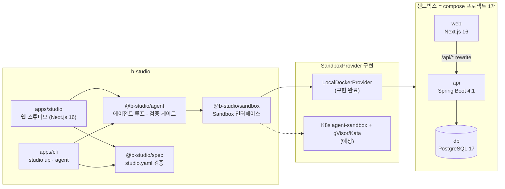

### `studio up`이 하는 일

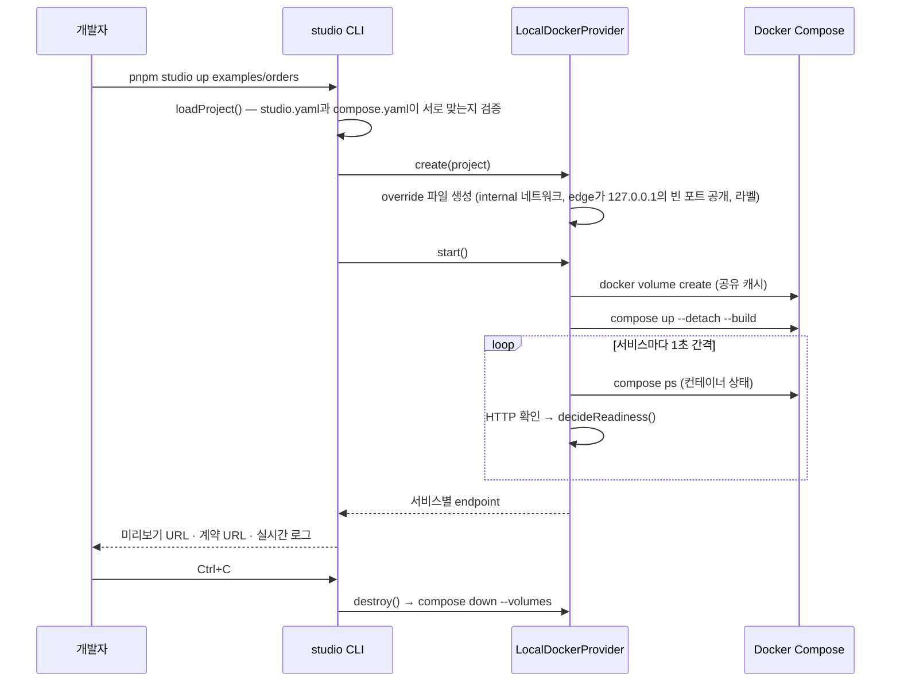

## 핵심 설계 결정

| 결정 | 이유 | 기록 |
|---|---|---|
| 브라우저 번들러 대신 **서버 샌드박스** | Next.js 서버 기능과 백엔드까지 로컬과 똑같이 실행하기 위해 | [ADR-001](docs/decisions.md#adr-001-미리보기-런타임-브라우저-번들러-대신-서버-샌드박스) |
| **구조는 통합, 작업 화면은 분리** | 프론트·백엔드·풀스택·기존 API 연동을 하나의 모델로 표현하기 위해 | [ADR-002](docs/decisions.md#adr-002-프로젝트-모델-구조는-통합-작업-화면은-분리) |
| 계약(OpenAPI)은 **코드에서 추출하는 선택 사항** | 백엔드 개발자의 코드 우선 작업 방식과 Next.js 단일 서비스 풀스택을 존중하기 위해 | [ADR-003](docs/decisions.md#adr-003-계약은-코드에서-추출하는-선택-사항) |
| **compose + OpenAPI 표준 위에 얇은 `studio.yaml`** | 도구를 쓰지 않아도 `docker compose up`으로 똑같이 돌아가게 하기 위해 | [ADR-004](docs/decisions.md#adr-004-새-dsl을-만들지-않는다-compose--openapi-위의-얇은-층) |
| **샌드박스 제공자 추상화**, 로컬 Docker부터 | 사내 Kubernetes·강한 격리 런타임으로 구현만 바꾸기 위해 | [ADR-006](docs/decisions.md#adr-006-샌드박스-제공자를-추상화하고-로컬-docker부터-구현) |
| **직접 작성한 루프 + 스튜디오 검증 게이트** | 모델이 "끝났다"고 해도 재시작·준비 판정·계약 비교를 통과해야 완료로 보기 위해 | [ADR-010](docs/decisions.md#adr-010-에이전트-루프-직접-작성한-루프와-스튜디오-검증-게이트) |
| **bash 대신 행동별 도구** | 경로 제한, 덮어쓰기 충돌 방지, 바뀐 파일 기록을 강제하기 위해 | [ADR-011](docs/decisions.md#adr-011-도구-설계-bash-하나-대신-행동별-도구) |
| **계약 호환 깨짐은 기본 차단** | 요청하지 않은 필드 삭제·타입 변경이 운영 중인 화면을 깨뜨리지 않게 하기 위해 | [ADR-013](docs/decisions.md#adr-013-계약-호환-정책-기본은-차단-요청이-명시할-때만-허용) |
| **재시작 전 파일 반영 확인** | 파일 공유 캐시 때문에 게이트가 옛 코드를 검증하는 일을 막기 위해 | [ADR-014](docs/decisions.md#adr-014-재시작-전에-샌드박스가-바뀐-파일을-보는지-확인한다) |
| **Next.js 단일 앱 + Server-Sent Events** | 오래 걸리는 샌드박스·에이전트 작업의 진행 상황을 한 프로세스에서 실시간으로 보내기 위해 | [ADR-015](docs/decisions.md#adr-015-스튜디오-서버-nextjs-단일-앱과-server-sent-events) |
| **내 폴더 세션은 폴더 밖 Git 저장소(`--git-dir`)로 체크포인트를 남기고, 요청 전과 이어서 작업하기 전에 폴더의 수정을 체크포인트로 저장** | IDE와 에이전트가 같은 파일을 쓰게 하면서 사용자 저장소의 기록·설정을 건드리지 않고, 실패한 요청의 되돌리기가 사람이 고친 파일을 지우지 않게 하기 위해 | [ADR-041](docs/decisions.md#adr-041-내-폴더에서-바로-작업-체크포인트-저장소는-폴더-밖에-두고-사람의-수정은-먼저-남긴다) |
| **작업 복사본을 Git 체크포인트로 관리** | "완료로 인정하지 않음"을 넘어 실패한 변경이 실제로 남지 않게 하기 위해 | [ADR-018](docs/decisions.md#adr-018-세션-체크포인트-검증을-통과한-변경만-남긴다) |
| **로컬 로그인 계정 모드는 명시적으로 켜고, 기본 도구를 모두 끔** | 로그인 흐름 없이 본인 PC에서만 쓰고, 모델이 샌드박스와 작업 공간 규칙을 우회하지 못하게 하기 위해 | [ADR-019](docs/decisions.md#adr-019-로컬-로그인-계정으로-실행-api-키-없이-개인-pc에서만) |
| **코드 탭은 에이전트의 쓰기 도구 결과·요청 완료·체크포인트 이벤트로 다시 불러오고, 읽기는 에이전트 작업 공간 규칙과 시크릿 가림을 그대로 씀** | 요청이 끝나기 전에 무엇을 바꾸는지 보여 주되, 새 이벤트나 파일 감시 없이 두 실행 모드에서 똑같이 동작하고 생성물·`.env`·시크릿이 화면으로 새지 않게 하기 위해 | [ADR-034](docs/decisions.md#adr-034-실시간-코드-보기-에이전트-이벤트로-다시-불러오고-읽기는-작업-공간-규칙을-따른다) |
| **원격 미리보기는 `<서비스>--<세션>--<토큰>.<도메인>` 호스트로 받아 경로 그대로 넘기고, Host·Origin을 샌드박스 쪽 주소로 바꿈** | 경로 접두사 프록시는 앱의 절대 경로 자원과 HMR을 깨뜨리고, 서비스 포트를 공개하면 루프백 공개 원칙이 무너지므로. 템플릿의 개발 출처 허용을 고치지 않고 다른 PC에서 미리보기를 열기 위해 | [ADR-033](docs/decisions.md#adr-033-원격-미리보기-호스트-이름으로-나누는-게이트웨이가-경로를-그대로-넘긴다) |
| **모노레포 하위 폴더는 명시하면 저장소 전체를 복제하고, 경로 변환은 체크포인트 저장소가 맡음** | 체크포인트 커밋을 그대로 저장소의 PR로 넘기면서 서비스 재시작·게이트는 프로젝트 기준 경로를 그대로 쓰고, 우연히 상위 저장소가 있는 폴더가 원격에 연결되지 않게 하기 위해 | [ADR-032](docs/decisions.md#adr-032-모노레포-하위-폴더-저장소-전체를-복제하고-경로는-프로젝트-기준으로-바꾼다) |
| **조작 계층(헤더·탭·대화)만 유리로 띄우고 읽는 영역은 불투명하게, 고대비·강제 색상·투명도 줄이기 설정에는 대체 스타일** | Liquid Glass의 깊이감을 주면서 로그·diff·게이트 결과의 가독성을 지키고, 브라우저마다 다르게 보이는 굴절 효과 대신 널리 지원되는 흐림만 쓰기 위해 | [ADR-031](docs/decisions.md#adr-031-화면-디자인-조작-계층만-유리로-띄우고-읽는-영역은-불투명하게-둔다) |
| **리뷰어 커밋은 병합 커밋 하나로 가져와 검증 게이트로 확인하고, 통과한 뒤에만 원격 상태로 기록** | 리베이스하면 체크포인트 커밋 ID에 묶인 DB 덤프를 잃고, 검증 전에 원격 상태를 기록하면 되돌린 뒤 올릴 때 리뷰어 커밋을 덮어쓸 수 있어서 | [ADR-030](docs/decisions.md#adr-030-원격-변경-가져오기-리뷰어-커밋을-병합-커밋으로-가져와-게이트로-확인한다) |
| **세션 상태를 작업 복사본의 `.git` 아래에 남기고, 서버가 다시 시작되면 남은 샌드박스를 지운 뒤 새 샌드박스로 이어서 작업** | 컨테이너를 다시 붙잡으면 포트 전달·로그 구독·진행 중이던 루프를 되살릴 수 없어서. 체크포인트와 DB 덤프가 이미 디스크에 있어 같은 시점을 다시 만들 수 있기 때문에 | [ADR-029](docs/decisions.md#adr-029-세션-복구-세션-상태를-작업-복사본에-남기고-새-샌드박스로-이어서-작업한다) |
| **Kubernetes에서는 세션마다 네임스페이스, compose 서비스마다 agent-sandbox `Sandbox`, edge는 기본 런타임** | compose와 같은 서비스 이름 연결과 요청 IP 기반 정책을 유지하면서 클러스터의 RuntimeClass·NetworkPolicy로 격리하고, gVisor Pod로는 열리지 않는 port-forward를 edge로 받기 위해 | [ADR-028](docs/decisions.md#adr-028-kubernetes-제공자-서비스마다-agent-sandbox-sandbox를-둔다) |
| **컨테이너 런타임은 운영자가 환경 변수로 고르고, gVisor는 `--network=host`로 모든 서비스와 edge에 적용** | 에이전트 코드가 호스트 커널을 직접 쓰지 않게 하되, 프로젝트가 격리 수준을 낮출 수 없게 하고 서비스 이름으로 하는 연결을 유지하기 위해 | [ADR-027](docs/decisions.md#adr-027-격리-강화-운영자가-고르는-컨테이너-런타임과-gvisor) |
| **사내 API는 edge의 별칭으로만 부르고, 요청 IP로 호출한 서비스를 확인하고, 스튜디오 쪽 호출은 edge 안에서 실행** | 인증 값과 운영 개인정보를 샌드박스 코드·모델 대화에서 떼어 놓고, 스튜디오용 포트로 서비스가 권한을 사칭하지 못하게 하기 위해 | [ADR-026](docs/decisions.md#adr-026-정책-프록시-사내-api는-edge를-거쳐서만-부른다) |
| **시크릿 값은 compose 프로세스 환경으로만 넘기고, 나오는 모든 출력에서 가리고, 파일에 들어가면 커밋 거부** | 에이전트는 명령 출력·로그·응답을 모델에게 그대로 보내고 체크포인트는 PR로 올라가므로, 한 번의 `printenv`나 파일 쓰기로 값이 대화 기록과 저장소에 영구히 남지 않게 하기 위해 | [ADR-025](docs/decisions.md#adr-025-시크릿-주입과-가림-값은-보이지-않게-넣고-새는-경로를-막는다) |
| **모든 서비스를 internal 네트워크에 두고 edge 컨테이너 하나로만 출입** | 연결 문자열을 숨기는 것만으로는 에이전트 코드가 운영 DB·사내망에 닿는 경로를 막을 수 없어서. 패키지 저장소처럼 허용한 호스트만 HTTP(S) 프록시로 통과시키고 모두 감사 로그로 남기기 위해 | [ADR-024](docs/decisions.md#adr-024-네트워크-격리-샌드박스의-출입구를-하나로-만든다) |
| **측정으로 정한 컨테이너 한도와 판단용 사용량 표시** | 한 세션이 VM 자원을 다 쓰지 않게 하고, 메모리 부족 종료를 코드 문제로 오해하지 않게 하기 위해 | [ADR-023](docs/decisions.md#adr-023-자원-한도와-사용량-한도를-걸고-판단에-필요한-수치만-보여-준다) |
| **체크포인트마다 DB 덤프, 되돌릴 때 같은 시점으로 복원** | 파일만 되돌리면 이미 적용된 마이그레이션이 남아 코드와 스키마가 달라지기 때문에 | [ADR-022](docs/decisions.md#adr-022-데이터베이스-브랜치-체크포인트마다-db-상태를-함께-남긴다) |
| **입력 파일 해시로 찾는 스냅샷 볼륨, 측정으로 켤 볼륨 결정** | 도구의 설치 단계는 그대로 두어 결과를 틀리게 만들지 않으면서, 실제 병목에만 기동 비용을 줄이기 위해 | [ADR-021](docs/decisions.md#adr-021-기동-최적화-입력-파일-해시로-찾는-스냅샷-볼륨) |
| **원본 저장소를 복제한 세션 브랜치 + 마지막으로 올린 커밋 기준 lease 푸시** | 체크포인트를 그대로 PR로 넘기고, 되돌린 기록은 반영하되 리뷰어 커밋은 덮어쓰지 않기 위해 | [ADR-020](docs/decisions.md#adr-020-원격-저장소-연동-세션-브랜치와-덮어쓰지-않는-푸시) |

## 프로젝트 구조

```
b-studio/
├─ packages/
│  ├─ spec/           studio.yaml 스키마(zod 4)와 로더. compose 파일과 서로 맞는지 검증
│  ├─ sandbox/        Sandbox/SandboxProvider 인터페이스, 준비 판정, 파일 반영 확인, LocalDockerProvider
│  └─ agent/          에이전트 루프, 도구, 작업 공간 안전장치, 검증 게이트, 계약 비교, Claude·스크립트 클라이언트, 로컬 CLI 실행기, 체크포인트·원격 저장소 연동
├─ apps/
│  ├─ cli/            studio up · studio agent — 샌드박스 수명 주기, 에이전트 실행, 로그 스트리밍
│  └─ studio/         웹 스튜디오 (Next.js 16) — 세션 관리자, SSE, 대화 · 미리보기 · API 탐색기 · 로그
├─ templates/         새 서비스의 원본 (각각 개발용 Dockerfile과 lockfile 포함)
│  ├─ nextjs-web/     Next.js 16.3 · React 19 · Tailwind 4
│  ├─ spring-boot-api/ Spring Boot 4.1 · Java 25 · JPA · Flyway · springdoc 3.1
│  └─ fastapi-api/    FastAPI 0.141 · Python 3.14 · SQLAlchemy · uv
├─ examples/
│  └─ orders/         web + api + db 예제 프로젝트
└─ docs/
   ├─ decisions.md    설계 결정 기록 (ADR)
   └─ troubleshooting.md  실행하며 발견하고 해결한 문제
```

## 실행 방법

**필요한 것:** Node.js 22 이상, pnpm 10, Docker (Compose v2)

```bash
pnpm install
pnpm test                          # 단위 테스트
pnpm typecheck                     # 패키지 전체 타입 체크
pnpm studio up examples/orders     # 샌드박스 기동 (Ctrl+C로 종료하면 정리)
pnpm e2e:agent                     # 스크립트 모델로 에이전트 루프 전체를 실제 Docker에서 검증 (API 키 불필요)
pnpm bench:boot examples/orders 3  # 샌드박스를 세 번 띄워 기동 단계별 시간 측정
pnpm studio:demo                   # 웹 스튜디오를 데모 모드로 실행 (http://127.0.0.1:3000, API 키 불필요)

# Claude API 인증 정보가 있을 때
export ANTHROPIC_API_KEY=...
pnpm studio agent examples/orders "주문에 배송 메모 필드 추가해줘"
pnpm studio agent examples/orders "메모 필드를 응답에서 제거해줘" --allow-breaking   # 호환 깨짐을 명시적으로 허용

# API 키 없이, 이 PC의 claude CLI에 로그인한 계정으로 (개인 PC 전용)
pnpm studio agent examples/orders "현재 서버 시각을 돌려주는 GET /api/time 엔드포인트를 추가해줘" --backend claude-code
pnpm studio:local                  # 웹 스튜디오를 로컬 로그인 계정 모드로 실행
```

**원본 프로젝트가 Git 저장소면** 세션이 커밋된 상태를 복제해 `b-studio/<프로젝트>-<세션>` 브랜치에서 시작합니다. 기록 탭에서 체크포인트를 원격 브랜치로 올리고 PR을 만들 수 있습니다.

```bash
export B_STUDIO_PROJECTS_DIR=~/work/projects   # 프로젝트 폴더들이 있는 곳. 폴더가 Git 저장소 루트면 원격 연동이 켜짐 (모노레포 하위 폴더는 studio.yaml의 repository.monorepo)
export B_STUDIO_GITHUB_TOKEN=...               # PR을 API로 만들 때. GitLab은 B_STUDIO_GITLAB_TOKEN, Gitea는 B_STUDIO_GITEA_TOKEN
export B_STUDIO_GIT_PROVIDER=gitlab            # 사내 호스트는 주소만으로 종류를 알 수 없으므로 지정 (github | gitlab | gitea)
export B_STUDIO_GIT_AUTHOR_NAME=... B_STUDIO_GIT_AUTHOR_EMAIL=...   # 저장소가 커밋 작성자를 검사할 때
```

**대화 입력칸에서 만들기와 질문을 고릅니다.** 질문은 에이전트가 파일·로그·API 계약을 읽고 답하거나 계획을 세울 뿐 파일을 바꾸지 않으며, 검증 게이트와 체크포인트도 돌지 않습니다. 답 아래의 "이대로 만들기"를 누르면 같은 대화를 이어받아 만들기 요청을 보냅니다.

**개인 PC에서는 프로젝트를 복사하지 않고 내 폴더에서 바로 작업할 수 있습니다.** 홈 화면의 프로젝트마다 "복사본"과 "내 폴더"를 고릅니다. 내 폴더를 고르면 에이전트가 바꾼 파일이 IDE에 바로 보이고, IDE에서 고친 파일도 샌드박스의 개발 서버가 바로 반영합니다. 파일 공유 계층이 전달하지 않는 새 파일·삭제 알림은 스튜디오가 서비스 컨테이너에 대신 전달합니다. 체크포인트 저장소와 세션 상태는 `B_STUDIO_SESSIONS_DIR` 아래에 따로 두어 폴더의 `.git`(커밋, 브랜치, 설정)을 건드리지 않습니다. 요청을 보내거나 중지한 세션을 이어서 작업하기 전에 폴더에서 바뀐 파일을 "직접 수정" 체크포인트로 남겨, 실패한 요청을 되돌려도 사람이 고친 파일은 남습니다. 에이전트가 서버의 폴더를 바로 바꾸므로 인증을 켠 서버(`B_STUDIO_AUTH`가 none이 아님)에서는 쓸 수 없고, 같은 폴더로 두 세션을 동시에 띄우지 않습니다. 이 모드에는 세션 브랜치와 PR 연동이 없어, 커밋은 평소처럼 IDE나 git으로 합니다.

`studio.yaml`에 시크릿을 선언한 프로젝트는 값을 스튜디오 서버 쪽에 넣어야 샌드박스가 뜹니다. 프로젝트 폴더의 `.env`는 읽지 않습니다.

```bash
export B_STUDIO_SECRET_PAYMENT_API_KEY=...          # 시크릿 하나씩 (환경 변수가 파일보다 우선)
export B_STUDIO_SECRETS_FILE=~/.config/b-studio/orders.env   # 또는 KEY=VALUE 파일 (저장소 밖에 둘 것)
```

샌드박스를 gVisor로 한 번 더 격리하려면 Docker 데몬에 `runsc`를 등록하고 런타임 이름을 넘깁니다. `/etc/docker/daemon.json`에 다음처럼 적습니다. `--network=host`를 빼면 gVisor 안에서 서비스 이름(`db`, `b-studio-edge`)을 풀지 못합니다.

```json
{ "runtimes": { "runsc": { "path": "/usr/local/bin/runsc", "runtimeArgs": ["--network=host"] } } }
```

```bash
export B_STUDIO_CONTAINER_RUNTIME=runsc   # 데몬에 없는 런타임이면 샌드박스를 만들기 전에 등록된 런타임 목록과 함께 거부
```

샌드박스를 Kubernetes 클러스터에 띄우려면 클러스터에 [agent-sandbox](https://github.com/kubernetes-sigs/agent-sandbox)를 설치하고 제공자를 바꿉니다. 소스를 hostPath로 마운트하므로 kind 같은 단일 노드 개발 클러스터용입니다.

```bash
export B_STUDIO_SANDBOX_PROVIDER=kubernetes
export B_STUDIO_KUBECONFIG=~/.kube/b-studio.yaml          # 비우면 kubectl 기본값
export B_STUDIO_KUBECTL=/usr/local/bin/kubectl             # 선택. 비우면 PATH의 kubectl
export B_STUDIO_K8S_RUNTIME_CLASS=gvisor                   # 서비스 Pod에 걸 RuntimeClass (선택)
export B_STUDIO_K8S_HOST_PATHS=~/.cache/b-studio=/b-studio  # 호스트 경로=노드 경로 (kind extraMounts와 같게)
export B_STUDIO_K8S_KIND_CLUSTER=b-studio                   # build 서비스 이미지를 kind load로 올림 (또는 B_STUDIO_K8S_REGISTRY)
```

다른 PC의 브라우저에서 미리보기를 열려면 원격 미리보기 게이트웨이를 켭니다. `*.<도메인>`이 스튜디오 서버를 가리키도록 와일드카드 DNS를 준비해야 하고, TLS가 필요하면 앞단 리버스 프록시에서 처리합니다. 로컬에서는 `*.localhost`가 루프백으로 풀리므로 `preview.localhost`로 확인할 수 있습니다.

```bash
export B_STUDIO_PREVIEW_DOMAIN=preview.studio.internal   # 미리보기 주소: http://<서비스>--<세션>--<토큰>.preview.studio.internal:4100
export B_STUDIO_PREVIEW_PORT=4100                        # 게이트웨이 포트 (기본 4100)
export B_STUDIO_PREVIEW_BIND=0.0.0.0                     # 기본은 127.0.0.1. 다른 PC에 공개할 때만 바꿈
```

세션마다 모델 토큰에 한도를 두려면 스튜디오 서버에 한도를 정합니다. 에이전트가 고칠 수 있는 `studio.yaml`에는 두지 않습니다.

```bash
export B_STUDIO_SESSION_TOKEN_LIMIT=2_000_000   # 입력·출력·캐시 읽기·캐시 쓰기 토큰의 합. 넘는 순간 처리 중인 요청을 멈춰 되돌리고, 새 요청을 받지 않음
```

세션 한도만 두면 한도에 도달한 사람이 새 세션을 만들어 계속 쓸 수 있습니다. 사람 단위로도 막으려면 기간 한도를 정합니다. 사용량은 세션을 만든 사람이 아니라 **요청을 보낸 사람**에게 붙고, 기간이 바뀌면 처음부터 셉니다.

```bash
export B_STUDIO_USER_TOKEN_LIMIT=5_000_000   # 한 사람이 한 기간에 쓸 수 있는 토큰 합계
export B_STUDIO_USER_TOKEN_WINDOW=day        # day(기본) | month. 서버가 있는 곳의 날짜로 끊음
export B_STUDIO_USAGE_DIR=~/.cache/b-studio/usage   # 사람별 사용량을 두는 곳 (기본값)
```

대화 헤더에는 세션 합계와 함께 "내 한도 (오늘) … 중 … 사용"이 보이고, 한도에 도달하면 입력이 막힙니다. 자기 사용량은 `GET /api/usage`로도 볼 수 있습니다(부른 사람 자신의 값만 돌려줍니다).


여러 사람이 쓰는 서버에 띄우면 인증을 켭니다. 로그인한 사람은 모든 세션을 볼 수 있고, 세션을 바꾸는 일(요청, 취소, 중지, 되돌리기, 올리기, API 탐색기 호출)은 만든 사람과 관리자만 할 수 있습니다. 설정이 틀리면 인증을 끄는 대신 모든 요청을 거부합니다.

```bash
export B_STUDIO_AUTH=token                                   # none(기본) | token | proxy
export B_STUDIO_AUTH_SECRET=$(openssl rand -hex 32)          # token: 세션 쿠키 서명 키 (32자 이상)
pnpm studio auth token alice                                 # 접근 토큰과, 아래에 넣을 "alice:sha256:<해시>" 한 줄을 만든다
export B_STUDIO_AUTH_TOKENS="alice:sha256:<해시>,bob:sha256:<해시>"   # 평문 토큰(24자 이상)도 받지만 해시를 권합니다
export B_STUDIO_AUTH_ADMINS=alice                            # 다른 사람의 세션도 바꿀 수 있는 사람
export B_STUDIO_AUTH_SESSION_HOURS=12                        # 로그인 유지 시간 (기본 12)

# 사내 SSO 프록시(oauth2-proxy 등) 뒤에 둘 때
export B_STUDIO_AUTH=proxy
export B_STUDIO_AUTH_PROXY_SECRET=$(openssl rand -hex 32)    # 프록시가 x-b-studio-proxy-secret 헤더로 함께 보내야 하는 값
export B_STUDIO_AUTH_USER_HEADER=x-forwarded-email           # 프록시가 사용자를 넣는 헤더 (기본 x-forwarded-user)

export B_STUDIO_AUTH_STATE_DIR=~/.cache/b-studio/auth        # 로그아웃·무효화 기록을 두는 곳 (기본값)
```

**로그인은 이름과 접근 토큰으로 합니다.** 로그아웃하면 그 로그인 세션을 서버에도 무효로 남겨, 복사해 둔 쿠키로도 들어오지 못합니다. 한 사람의 쿠키가 새어 나갔으면 관리자가 그 사람의 로그인을 모두 무효로 만듭니다(서명 키를 바꾸지 않아도 됩니다).

```bash
curl -X POST http://studio.corp.example/api/auth/revoke -b "$관리자_쿠키" \
  -H 'content-type: application/json' -H 'origin: http://studio.corp.example' -d '{"user":"alice"}'
```

로그인에 연속으로 실패하면 그 계정을 잠깐 잠급니다. 세 번까지는 그대로 401이고, 네 번째 실패부터 5초·10초·20초…로 늘어나 최대 15분입니다(최대 잠금은 15분이고, 마지막 실패 뒤 한 시간이 지나면 처음부터 셉니다). 잠긴 동안에는 맞는 토큰을 보내도 429로 답합니다. 요청을 보낸 주소가 아니라 계정에 붙여 세므로, 주소를 바꿔 가며 시도해도 잠금이 풀리지 않습니다.

**인증을 켜면 미리보기 게이트웨이도 로그인을 확인합니다.** 스튜디오가 로그인한 사람에게 1분짜리 1회용 티켓을 주고, 게이트웨이가 그 티켓을 미리보기 호스트 전용 쿠키로 바꿉니다. 주소의 토큰만 아는 사람은 미리보기를 열 수 없고, 로그아웃하면 미리보기 쿠키도 함께 거부됩니다. 이 쿠키는 `SameSite=Lax`라서 **미리보기 도메인이 스튜디오 주소와 같은 사이트여야 합니다**(예: 스튜디오 `studio.corp.example`, 미리보기 `preview.corp.example`). 로컬에서 확인할 때는 스튜디오를 `http://preview.localhost:3000`으로 여세요.

만든 앱은 운영 이미지로 빌드해 같은 Docker 호스트에 배포할 수 있습니다. 스튜디오에서는 배포 탭에서 최신 체크포인트를 배포하거나 이전 릴리스로 되돌리고, 터미널에서는 CLI를 씁니다. managed 서비스 폴더에 운영용 `Dockerfile`이 있어야 합니다(템플릿과 예제에 들어 있음). 새 릴리스가 준비되면 고정 주소를 무중단으로 바꾸고, DB 같은 부가 서비스는 데이터를 유지한 채 그대로 둡니다.

```bash
pnpm studio deploy examples/orders                    # 운영 이미지를 빌드해 배포하고 고정 주소(127.0.0.1)를 새 릴리스로 전환
pnpm studio deploy examples/orders --status           # 운영 주소, 컨테이너 상태, 릴리스 기록
pnpm studio deploy examples/orders --rollback <릴리스> # 이미지를 남긴 이전 릴리스로 빌드 없이 되돌리기 (DB 마이그레이션은 되돌리지 않음)
pnpm studio deploy examples/orders --remove           # 배포 지우기. --volumes를 더하면 DB 볼륨까지
export B_STUDIO_DEPLOYS_DIR=~/.cache/b-studio/deploys  # 배포 상태를 두는 곳 (기본값)
```

스튜디오 서버도 컨테이너 이미지로 띄울 수 있습니다. 샌드박스와 운영 배포는 호스트의 Docker 데몬이 만들기 때문에 세 가지를 맞춰야 합니다.
- Docker 소켓을 넘깁니다.
- 세션·배포 폴더를 **호스트와 같은 경로로** 마운트합니다. 샌드박스의 소스 마운트 경로를 호스트 데몬이 풀기 때문입니다.
- `--network host`로 띄웁니다. 샌드박스와 운영 주소가 호스트의 `127.0.0.1`에만 공개되기 때문입니다.

이미지는 기본으로 호스트 루프백(`127.0.0.1:3000`)에만 열리고, 프로젝트는 `/projects`에서 읽습니다. 다른 PC에 공개하려면 인증(`B_STUDIO_AUTH`)을 켜고 `HOSTNAME=0.0.0.0`을 줍니다.

```bash
docker build -f apps/studio/Dockerfile -t b-studio-studio .   # 저장소 루트에서
docker run -d --name b-studio --network host \
  -v /var/run/docker.sock:/var/run/docker.sock \
  -v /srv/b-studio:/srv/b-studio \
  -v /srv/projects:/projects:ro \
  -e B_STUDIO_SESSIONS_DIR=/srv/b-studio/sessions \
  -e B_STUDIO_DEPLOYS_DIR=/srv/b-studio/deploys \
  -e ANTHROPIC_API_KEY=... \
  b-studio-studio
```

푸시는 스튜디오 서버의 git 인증(SSH 에이전트, credential helper)을 그대로 씁니다. 토큰이 없으면 PR 작성 페이지 링크만 보여 줍니다. 설계 근거는 [ADR-020](docs/decisions.md#adr-020-원격-저장소-연동-세션-브랜치와-덮어쓰지-않는-푸시)에 있습니다.

로컬 로그인 계정 모드는 **사내 공유 서버에 배포하는 용도가 아닙니다.** Agent SDK 정책상 제3자 제품이 claude.ai 로그인을 제공할 수 없으므로, 스튜디오는 로그인 화면을 만들지 않고 이미 로그인된 본인 PC의 CLI만 사용합니다. 여러 사람이 쓰는 서버에서는 조직의 API 키로 기본(`api`) 모드를 쓰세요. 근거는 [ADR-019](docs/decisions.md#adr-019-로컬-로그인-계정으로-실행-api-키-없이-개인-pc에서만)에 있습니다.

실제 출력 (일부):

```
studio │ orders 샌드박스를 시작합니다 (studio-orders-9fbfc3)
web    │ 이미지를 빌드하고 시작합니다
api    │ 이미지를 빌드하고 시작합니다
web    │ 준비 확인: UND_ERR_SOCKET (컨테이너 running)
web    │ 준비 확인: HTTP 200 (컨테이너 running)
web    │ 준비 완료 → http://127.0.0.1:32768
api    │ ... Started ApiApplication in 2.402 seconds
api    │ 준비 확인: HTTP 200 (컨테이너 running)
api    │ 준비 완료 → http://127.0.0.1:32769

  web          browser  http://127.0.0.1:32768
  api          openapi  http://127.0.0.1:32769  계약: http://127.0.0.1:32769/v3/api-docs

studio │ Ctrl+C로 종료합니다
```

## 스튜디오 화면

`pnpm studio:demo`로 웹 스튜디오를 열면 프로젝트마다 샌드박스 세션을 시작할 수 있습니다. 왼쪽에는 샌드박스에서 실제로 돌고 있는 서비스가, 오른쪽에는 에이전트와의 대화가 보입니다.

화면은 조작 계층(세션 헤더, 탭 막대, 대화)만 반투명 유리로 띄우고, 미리보기·로그·diff·게이트 결과처럼 오래 읽는 영역은 불투명 패널로 둡니다. 운영체제의 다크 모드를 따릅니다. 고대비·강제 색상 설정에서는 불투명한 화면이나 실제 테두리로 바뀌고, 투명도 줄이기 설정에도 같은 대체 스타일을 넣었습니다([ADR-031](docs/decisions.md#adr-031-화면-디자인-조작-계층만-유리로-띄우고-읽는-영역은-불투명하게-둔다)).

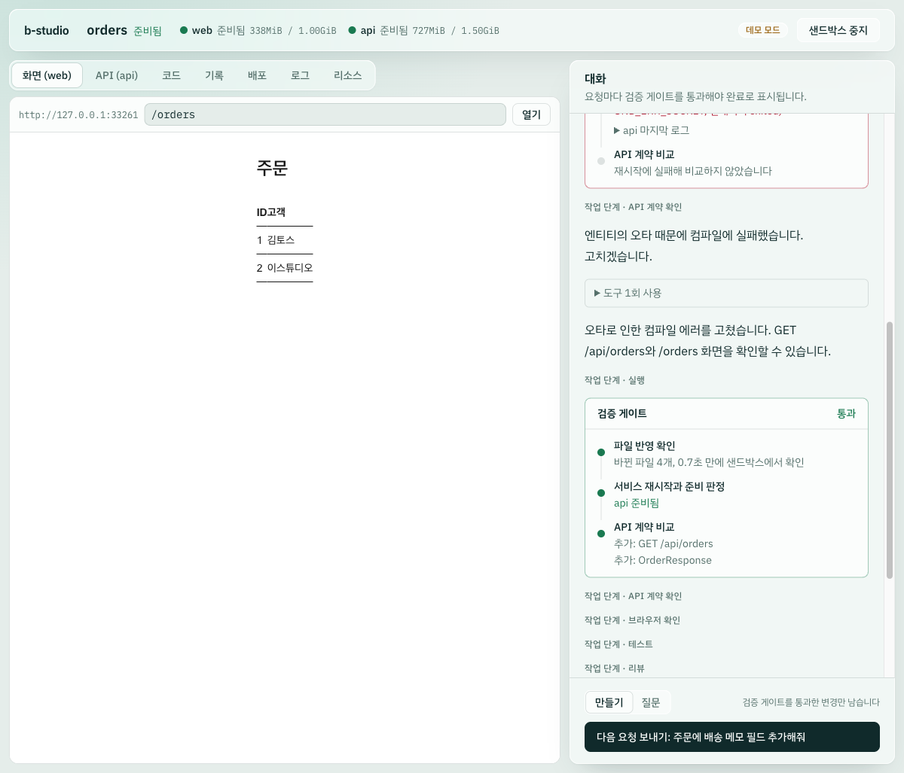

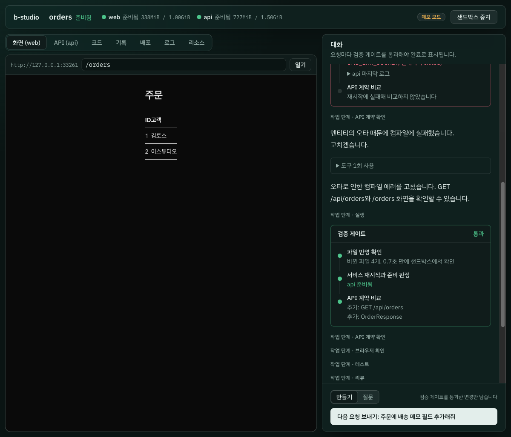

| 영역 | 하는 일 |
|---|---|
| 화면 (web) | 샌드박스의 Next.js 앱을 iframe으로 보여 줍니다. 서비스가 재시작돼 포트가 바뀌어도 입력한 경로를 유지한 채 새 주소를 따라갑니다 |
| API (api) | 실행 중인 서버에서 추출한 OpenAPI로 엔드포인트와 스키마를 보여 주고, 스튜디오 서버를 거쳐 요청을 보냅니다 |
| 코드 | 샌드박스에서 도는 프로젝트 파일을 봅니다. 마지막 체크포인트 이후 추가·수정·삭제한 파일을 먼저 보여 주고 파일마다 변경 내용을 볼 수 있습니다. 에이전트가 파일을 쓰거나 고치면 요청이 끝나기 전에 바로 반영하고, 그 파일로 따라갑니다. 생성물과 `.env`는 에이전트 작업 공간과 같은 규칙으로 빼고, 시크릿 값은 가려서 보여 줍니다. 파일 내용과 diff는 언어에 맞춰 문법을 강조하고 운영체제의 다크 모드를 따릅니다. 파일 이름·경로로 목록을 좁힐 수 있고, 서비스 안에서 명령이 만든 파일도 바로 반영합니다 |
| 기록 | 검증을 통과한 요청마다 남은 체크포인트와 변경 내역을 보고, 이전 시점으로 되돌립니다 |
| 로그 | web, api, db 로그를 서비스별로 걸러 봅니다 |
| 리소스 | 컨테이너별 CPU·메모리와 한도 대비 사용률, 종료 이유(메모리 부족 종료 포함), 로그에서 뽑은 최근 단계를 5초마다 보여 줍니다 |
| 대화 | 요청, 에이전트 답변, 도구 사용 기록, **검증 게이트** 결과가 순서대로 쌓입니다. 처리 중인 요청은 샌드박스를 그대로 둔 채 취소해 변경을 되돌릴 수 있고, 요청마다와 세션 전체의 모델 토큰 사용량을 보여 줍니다. 에이전트 답변의 표·목록·코드 블록은 서식대로 그리고, 답변 속 HTML은 글자로 둡니다. 운영자가 세션 토큰 한도를 정하면 사용량을 한도와 함께 보여 주고, 도달하면 요청을 멈추고 새 요청을 받지 않습니다 |


위 화면은 체크포인트 기능을 넣기 전의 모습입니다. 게이트가 호환 깨짐을 막았는데도 변경이 남아 있어서 미리보기의 배송 메모가 비어 보였습니다. 지금은 **게이트를 통과하지 못한 변경을 자동으로 되돌리고, 바뀐 서비스를 이전 상태로 재시작합니다**([ADR-018](docs/decisions.md#adr-018-세션-체크포인트-검증을-통과한-변경만-남긴다)).


> 데모 모드는 Claude API 대신 미리 적어 둔 스크립트로 실행합니다. 준비된 요청만 순서대로 실행하고, 다른 요청은 거절합니다.

## `studio.yaml`

실행 방법은 표준 `compose.yaml`에 두고, `studio.yaml`에는 스튜디오에만 필요한 정보만 적습니다.

```yaml
version: 1
name: orders

services:
  web:
    source: managed        # 스튜디오가 코드를 만들고 샌드박스에서 실행
    template: nextjs
    path: web
    port: 3000
    preview: browser       # iframe 미리보기
    ready: { path: /, timeoutSeconds: 300 }

  api:
    source: managed
    template: spring-boot
    path: api
    port: 8080
    preview: openapi       # API 탐색기
    ready: { path: /actuator/health/readiness, timeoutSeconds: 900 }
    contract: { extract: /v3/api-docs }   # 실행 중인 서버에서 OpenAPI 추출
    # 키 파일 내용이 같으면 이전 세션의 볼륨을 복사해 시작 (Gradle 설정 캐시 재사용)
    snapshots:
      - volume: api-gradle-project
        key: [build.gradle, settings.gradle, gradle.properties, gradle/wrapper/gradle-wrapper.properties, Dockerfile.dev]

  # 이미 운영 중인 사내 API는 등록만 한다 (TOI 방식). 샌드박스에서는 http://legacy-users/로 부르고 edge가 정책을 적용한다
  # legacy-users:
  #   source: external
  #   baseUrl: https://users.internal.example.com
  #   policy:
  #     allow:                                  # 적지 않으면 모든 호출자에게 GET·HEAD만
  #       - { callers: [api, studio], methods: [GET], paths: ["/api/users/*"] }
  #     mask: [phone, residentNumber]           # 응답 JSON에서 가릴 필드
  #     auth: { header: Authorization, secret: LEGACY_USERS_TOKEN, prefix: "Bearer " }

# 체크포인트마다 DB 상태를 저장해, 파일을 되돌릴 때 스키마와 데이터도 같은 시점으로 되돌린다
databases:
  db: { engine: postgres, database: app, user: app }   # compose의 부가 서비스 이름

# 컨테이너 한도 (한도 없이 잰 최대치의 약 2배)
resources:
  api: { memory: 1536m, cpus: 2 }
  web: { memory: 1g, cpus: 2 }
  db: { memory: 256m }

# 샌드박스는 외부로 나갈 수 없고, HTTP(S)는 패키지 저장소만 허용한다. 더 필요한 호스트만 적는다
# network:
#   egress: [api.slack.com, "*.internal-mirror.example.com"]

# 시크릿은 이름과 받을 서비스만 적는다. 값은 스튜디오 서버의 환경 변수나 시크릿 파일에서 읽고, 출력에서 가린다
# secrets:
#   PAYMENT_API_KEY: { services: [api], description: 결제 대행사 테스트 키 }
#   LEGACY_USERS_TOKEN: {}   # 사내 API 인증(policy.auth)에만 쓰면 services를 비워 edge에만 넣는다

# 모노레포의 하위 폴더면 상위 Git 저장소 전체를 복제해 세션 브랜치로 작업하고 PR을 만든다 (기본은 꺼짐)
# repository:
#   monorepo: true

# 운영 배포 (studio deploy). Dockerfile은 compose build.context 기준이고 기본값은 Dockerfile. 포트를 적지 않으면 첫 배포 때 빈 포트를 골라 기억한다
# deploy:
#   services:
#     web: { port: 8300 }
#     api: { dockerfile: Dockerfile, port: 8301 }
```

`loadProject()`는 명세만 검사하지 않고 **두 파일이 서로 맞는지도** 검증합니다. managed 서비스가 compose에 없거나, external 서비스가 compose에 들어 있으면 필드 경로와 함께 에러를 알려 줍니다.

## 검증 결과

로컬 환경(macOS, colima, Docker 27)에서 직접 실행해 확인한 내용입니다.

| 항목 | 결과 |
|---|---|
| 웹 `/` | HTTP 200 |
| 웹 `/api/ping` → Next rewrite → Spring | `{"message":"pong"}` |
| API readiness | `{"status":"UP"}` |
| OpenAPI 계약 추출 | `/v3/api-docs`에서 OpenAPI 3.1.0, `paths: ['/api/ping']` |
| 포트 공개 범위 | 서비스는 포트를 공개하지 않고, edge 컨테이너가 `127.0.0.1`의 빈 포트에만 공개 (같은 네트워크에서 접근 불가) |
| Ctrl+C 신호가 여러 번 들어올 때 | 정리가 끝까지 완료됨 (tsx와 node에 SIGINT를 동시에 보내 재현) |
| 종료 후 정리 | 컨테이너 0개, 샌드박스 볼륨 0개. 공유 캐시 볼륨(Gradle, pnpm)은 유지 |
| 두 번째 기동 | 처음에는 늦어도 43초 안에 준비. 단계별로 측정해 병목(api의 Gradle 기동·설정)을 찾은 뒤 **13.4초 → 10.9초** (`pnpm bench:boot`, 3회 10.8~10.9초) |
| 단위 테스트 / 타입 체크 | 225개 통과 / 패키지 5개 통과 |

### 에이전트 루프 (`pnpm e2e:agent`, 실제 Docker 샌드박스)

모델 대신 **미리 적어 둔 턴을 돌려주는 스크립트 모델**로 실행했습니다. 이 검증은 도구, 파일 변경, 서비스 재시작, 준비 판정, 계약 비교, 피드백이 실제로 맞물리는지를 확인합니다. Claude가 코드를 얼마나 잘 쓰는지는 이 검증의 범위가 아닙니다.

| 시나리오 | 결과 |
|---|---|
| A. 주문 목록 API와 화면. **일부러 오타를 넣어 컴파일 에러** | 게이트 1차 **실패**(컴파일 에러 로그 전달) → 수정 → 2차 통과. 계약에 `GET /api/orders`, `OrderResponse` 추가. `/orders` 화면에 시드 데이터 렌더링 (4턴, 33.5초) |
| B. 배송 메모 필드 추가 (Flyway V2 + 엔티티 + 응답 + 화면) | 한 번에 통과. 계약 변경은 `OrderResponse.memo` 추가 하나. 화면에 메모 렌더링 (2턴, 14.0초) |
| C. 요청하지 않은 필드 삭제 | api는 정상 기동했지만 `OrderResponse.memo` 삭제를 **호환 깨짐으로 차단** (2턴, 10.0초) |

### 웹 스튜디오 (데모 모드, Playwright로 실제 브라우저 조작)

| 확인 항목 | 결과 |
|---|---|
| 세션 시작 → 준비 | 두 서비스 모두 10초 안에 준비 (의존성 캐시가 채워진 상태) |
| A. 주문 목록 | 게이트 실패(api 컴파일 에러 로그 포함) → 수정 → 통과, 미리보기 `/orders`에 주문 표 렌더링 |
| B. 배송 메모 | 게이트 통과, 계약에 `OrderResponse.memo` 추가, 미리보기에 배송 메모 열 렌더링 |
| C. 필드 삭제 | 게이트가 호환 깨짐으로 차단, "완료하지 못함" 표시 |
| API 탐색기 | `GET /api/orders` HTTP 200, 재시작 후 계약을 다시 불러와 스키마에 `memo` 반영 |
| 재시작 중 미리보기 | 포트가 32796에서 32799로 바뀐 뒤에도 입력한 경로 `/orders` 유지 |
| 미리보기 HMR | WebSocket 핸드셰이크 `101 Switching Protocols`, 준비 후 브라우저 콘솔 에러 0개 |
| 프록시 입력 검증 | `//` 경로 400, 허용하지 않은 메서드 400, 없는 서비스 404, 데모 순서 위반 409 |
| 세션 중지 | 컨테이너 0개, 볼륨 0개. 공유 캐시와 작업 복사본은 유지 |

### 세션 체크포인트 (데모 모드, 실제 브라우저 · Git · 샌드박스 확인)

| 확인 항목 | 결과 |
|---|---|
| 세션 시작 | `5c79494 세션 시작` 체크포인트 (파일 37개). 샌드박스가 만든 `node_modules` 등은 기록에 들어가지 않음 |
| A. 주문 목록 (게이트 1회 실패 후 통과) | `f6c3cb7` 커밋, 남은 변경 0개 |
| B. 배송 메모 | `668fb7d` 커밋, 미리보기에 배송 메모 표시 |
| C. 필드 삭제 (게이트 차단) | **새 커밋 없음.** `OrderController.java` 변경을 되돌리고 api 재시작 → 미리보기 배송 메모와 계약의 `memo` 유지 |
| "세션 시작"으로 되돌리기 | 9초. 주문 관련 파일 삭제, web·api 재시작, `/orders` 404, 계약은 `/api/ping`만 남음, 데모 다음 요청이 첫 요청으로 돌아감 |
| 사용자 전역 커밋 훅 | 모든 커밋을 거부하는 전역 훅이 있어도 체크포인트 커밋이 남음 (단위 테스트) |
| 다시 연결 | 새로고침해도 체크포인트 목록이 중복되지 않고 콘솔 에러 0개 (버그 수정 후) |

### 로컬 로그인 계정 모드 (실제 모델 · 실제 Docker · 실제 브라우저)

본인 PC의 `claude` CLI(2.1.267, Claude Max 구독)로 실행했습니다. 모델은 계정 기본값인 Claude Opus 5였습니다.


| 확인 항목 | 결과 |
|---|---|
| 사전 확인 | 프롬프트를 보내지 않고 약 4초 만에 로그인 확인. 화면과 로그에는 구독 종류만 남기고 이메일·조직은 남기지 않음 |
| CLI: `GET /api/time` 추가 | 6턴. 모델은 b-studio 도구(`list_files`, `get_contract`, `read_file`, `write_file`, `restart_service`, `http_request`)만 호출. 바뀐 파일은 `TimeController.java` 하나, 게이트 통과, 계약 변경은 `GET /api/time` 추가 하나. SDK 추정 토큰: 입력 949 · 출력 1,542 · 캐시 읽기 19,881 · 캐시 쓰기 5,318. 종료 후 컨테이너·볼륨 0개 |
| 스튜디오: 첫 화면에 제목 추가 | 5턴, web 재시작 후 게이트 통과, 체크포인트 `de7393d` |
| 스튜디오: "방금 추가한 제목" 아래 부제목 + 에이전트가 앞서 물어본 예시 제목 삭제 | 5턴, 이전 대화를 이어받아 두 가지를 모두 처리, 체크포인트 `80ce2d9`. 미리보기 HTML에 제목과 부제목이 있고 예시 제목은 없음 |
| 대화 이어받기 | 로컬 세션 파일 2개. 두 번째 파일에 첫 요청 기록이 들어 있고, 첫 파일에는 두 번째 요청이 없음 (실행마다 갈라서 이어받음) |
| 실행 환경 표시 | 헤더 "로컬 Claude Agent", 대화에 "로컬 Claude Agent (CLI 2.1.267)에서 claude-opus-5 모델로 실행합니다 (Claude Max 구독)" |
| 첫 화면 안내 문구 | 모드별 문구 표시. 검증 중 로컬 모드에도 "API 키가 있어야 합니다"가 남아 있던 것을 발견해 수정 |
| 브라우저 콘솔 | 에러 10개, 모두 web 재시작 전 포트로 미리보기 앱이 HMR을 다시 연결하려던 것. 스튜디오 코드의 에러는 0개 ([트러블슈팅 11](docs/troubleshooting.md#11-서비스를-재시작할-때마다-브라우저-콘솔에-hmr-연결-실패가-쌓임)) |

### 자원 한도와 사용량 (실제 Docker · 실제 브라우저)

Docker VM은 메모리 6GiB, CPU 4개입니다.


| 확인 항목 | 결과 |
|---|---|
| 한도 없이 잰 사용량 | api 최대 726MiB(컨테이너 안 JVM 3개: Gradle 래퍼 155MiB, Gradle 데몬 410MiB, 앱 226MiB), web 최대 548MiB·CPU 147%, db 48MiB. 세션 하나가 준비 후 약 1.1GiB |
| 한도 적용 | 세션 스냅샷과 리소스 탭에 api 1.50GiB·CPU 200%, web 1.00GiB·CPU 200%, db 256MiB로 표시 |
| 한도를 건 기동 | 12.0초, 11.0초 (한도 없을 때 10.9초) |
| 한도 안에서 데모 요청 A | 21초, 게이트 통과. 이후 api 654MiB, web 282MiB, db 46MiB |
| api 한도 300MiB | 5.5초 만에 기동 실패. **종료 코드는 1이지만** 메모리 부족 종료(`OOMKilled`)로 판정해 "메모리 한도를 넘어 종료됨"으로 표시. 로그는 "Gradle build daemon disappeared unexpectedly" |
| api 한도 150MiB | 5.7초 만에 기동 실패. 종료 코드 137, 메모리 부족 종료로 표시. 한 서비스 실패 뒤 나머지 서비스 확인도 멈춰 확인 스크립트가 9초 만에 끝남 ([트러블슈팅 14](docs/troubleshooting.md#14-한-서비스가-기동에-실패해도-다른-서비스의-준비-확인이-끝나지-않음)) |
| 리소스 탭 | 컨테이너 3개, 메모리 합계, 한도 대비 사용률 막대, 최근 단계("앱 기동 완료", "DB 연결 받는 중", "개발 서버 준비"). 콘솔 에러 0개 |

종료 코드만 봤다면 300MiB 경우의 원인을 알 수 없었습니다. 컨테이너 안에서 Gradle 데몬이 커널에 종료되고 래퍼는 코드 1로 끝났기 때문입니다. 그래서 종료 코드가 아니라 `OOMKilled`로 판정합니다.

### DB 브랜치 (데모 모드 · 실제 Docker · 세션 API와 이벤트 스트림으로 확인)

데모 시나리오 A(주문 목록, V1) → B(배송 메모, V2) → C(호환 깨짐으로 차단) → A로 되돌리기를 실행하고, DB를 직접 조회했습니다.

| 확인 항목 | 결과 |
|---|---|
| 되돌리기 전(문제 재현) | 작업 복사본에는 V1만 남는데 DB의 Flyway 기록은 1, 2와 `memo` 열이 그대로 남음 |
| 체크포인트별 덤프 | 세션 시작, A, B마다 1개. 차단된 C는 체크포인트도 덤프도 없음 |
| C 되돌리기 | DB가 B 덤프와 같아 건드리지 않음 (비교 129~163ms) |
| A로 되돌리기 | DB를 0.5~0.6초 만에 다시 만듦. Flyway 기록 1만, `memo` 열 없음, 주문 2건 유지. api는 지운 파일 때문에 한 번 더 재시작한 뒤 준비, `GET /api/orders` 200 ([트러블슈팅 13](docs/troubleshooting.md#13-되돌린-뒤-api가-지운-파일을-찾다가-기동하지-못함)) |
| 되돌리기 전체 시간 | 18.4~21.7초 (Gradle 설정 세 가지) |

### 원격 저장소 연동 (데모 모드 · 실제 git 원격 · 실제 브라우저)

`examples/orders`를 Git 저장소로 만들고, 로컬에 띄운 Gitea 1.27.3을 `origin`으로 두고 확인했습니다. Gitea는 GitHub와 같은 모양의 PR API를 제공해서 실제 HTTP 호출과 PR 화면까지 확인할 수 있습니다.


| 확인 항목 | 결과 |
|---|---|
| 세션 시작 | 원본 `main`의 `d5e09aa`에서 `b-studio/orders-b7575d1f` 브랜치 생성, 23초 만에 준비. 체크포인트 목록은 "세션 시작 (main 브랜치)"에서 끝남 |
| 자격 증명 노출 | 원본 `origin` 주소에 토큰을 넣었지만 화면에는 `127.0.0.1:3300/dev/orders`만 표시. 세션 스냅샷 JSON과 스튜디오 서버 로그에서 토큰 문자열 0건 |
| 체크포인트 커밋 본문 | 시나리오 A에 게이트 결과(연산·스키마 추가), "검증 게이트 재시도: 1회", 에이전트 요약. 호환 깨짐으로 차단된 C는 커밋 없음 |
| 올리고 PR 만들기 | 1.7초. 원격 세션 브랜치가 `60f3c90`이 되고 PR #1 생성. 제목 "[b-studio] 주문 목록 API와 화면을 만들어줘 외 1건", 본문에 요청별 커밋·파일·검증 결과 |
| 되돌린 뒤 다시 올리기 | A로 되돌리자(13초) "원격 브랜치와 기록이 다릅니다" 안내. 올리기 0.6초, 원격 브랜치와 PR #1의 head가 `30f8bd4`로 바뀌고 PR은 열린 상태 유지 |
| 리뷰어가 같은 브랜치에 올린 뒤 올리기 | HTTP 409와 "덮어쓰지 않았습니다" 안내. 원격 브랜치는 리뷰어 커밋 `80a2123` 그대로 |
| 단위 테스트 | 실제 git으로 복제·올리기·lease 거부·origin 없는 원본·세션 이전 기록 거부, 가짜 서버로 GitHub·GitLab·Gitea PR API |

### 네트워크 격리 (실제 Docker · 실제 브라우저)


| 확인 항목 | 결과 |
|---|---|
| 격리 전(문제 재현) | web 컨테이너에서 `1.1.1.1:443`, 패키지 저장소, 게이트웨이 `172.19.0.1:15432`(같은 Docker VM에서 도는 다른 프로젝트의 Postgres)에 TCP 연결됨 |
| 직접 외부 연결 | `1.1.1.1:443`은 `ENETUNREACH`, 외부 이름 풀이는 `EAI_AGAIN`, 두 게이트웨이의 15432 포트는 시간 초과·`ENETUNREACH` |
| edge 프록시 | `registry.npmjs.org:443`은 200. `example.com`, 5432 포트, IP 직접 접속, 풀리지 않는 이름은 403 |
| 도구가 프록시를 따르는지 | `pnpm view is-number version` → `7.0.0`. JVM `HttpClient`로 Maven Central 200, `example.com`은 "Tunnel failed, got: 403". 서비스끼리 `db:5432`는 직접 연결 |
| 기동 시간 (`pnpm bench:boot`, 3회) | 14.3초, 13.0초, 12.9초 (격리 전 10.8~10.9초). `compose up`이 edge 준비를 기다리며 4.2~4.4초로 늘어남 |
| 막힌 다운로드 피드백 | web의 corepack 저장소를 허용하지 않은 `registry.npmmirror.com`으로 바꾸고 재시작하자 4.7초 만에 실패. 게이트 보고에 "막힌 외부 접속 (studio.yaml network.egress에 없는 호스트): registry.npmmirror.com:443" |
| 스튜디오 데모 요청 A | 게이트 1차 실패(의도한 컴파일 에러) → 통과, 4턴. web·api를 재시작한 뒤에도 edge 포트(33020, 33021)가 그대로라 미리보기 주소가 바뀌지 않음 |
| 미리보기 HMR | 미리보기 앱이 edge 포트로 `[HMR] connected`. web 재시작 중에만 WebSocket 연결 실패 2건, 이후 같은 포트로 다시 연결 |
| 로그·리소스 탭 | 로그 탭에 `b-studio-edge` 필터와 감사 로그(허용 17건, 거부 0건). 리소스 탭에 컨테이너 4개, edge 20MiB / 128MiB |
| 세션 중지 | 세션 컨테이너 0개, 볼륨 0개. 같은 VM의 다른 프로젝트 컨테이너는 그대로 |

첫 실행에서는 web이 edge보다 먼저 떠 3초 만에 종료됐고([트러블슈팅 15](docs/troubleshooting.md#15-네트워크를-격리하자-web이-기동-3초-만에-종료됨)), 화면을 찍다가 로그 중복도 발견했습니다([트러블슈팅 16](docs/troubleshooting.md#16-서비스를-재시작하면-로그-탭에-같은-줄이-두-번-쌓임)). 설계 근거는 [ADR-024](docs/decisions.md#adr-024-네트워크-격리-샌드박스의-출입구를-하나로-만든다)에 있습니다.

### 시크릿 주입과 가림 (실제 Docker · 에이전트 도구 · Git)

예제 복사본의 `studio.yaml`에 `PAYMENT_API_KEY: { services: [api] }`를 선언하고, 서버 환경 변수로 테스트 값을 넣어 확인했습니다.

| 확인 항목 | 결과 |
|---|---|
| 값이 없을 때 | 샌드박스를 만들기 전에 거부. 메시지는 "PAYMENT_API_KEY: 값이 없습니다. B_STUDIO_SECRET_PAYMENT_API_KEY 환경 변수나 B_STUDIO_SECRETS_FILE 파일에 넣으세요" |
| override 파일 | `PAYMENT_API_KEY: null`만 있고 값은 없음 |
| 주입 범위 | api 컨테이너 환경 변수에 값이 들어감(`raw` exec로 확인). 선언하지 않은 web에는 없음 |
| 명령 출력 | `printenv PAYMENT_API_KEY` → `[PAYMENT_API_KEY 가림]` |
| 로그 | 앱이 값을 표준 출력에 쓰면 `docker logs` 원본에는 값이 있고, 스튜디오 로그 구독에서는 `payment key=[PAYMENT_API_KEY 가림]` |
| 에이전트 도구 | `run_in_service`의 `echo "$PAYMENT_API_KEY" \| base64` 출력이 처음에는 **그대로 새어 나감** → 수정 후 `[PAYMENT_API_KEY 가림]Qo=` ([트러블슈팅 17](docs/troubleshooting.md#17-base64로-인코딩한-시크릿-값은-가려지지-않음)) |
| 명령으로 파일에 쓴 값 | 호스트 파일에는 값이 있지만 `read_file` 결과는 `payment.key=[PAYMENT_API_KEY 가림]`, 검증 게이트가 `leak.properties (PAYMENT_API_KEY)`로 실패 |
| 체크포인트 커밋 | "시크릿 값이 들어 있어 체크포인트를 남기지 않았습니다: api/src/main/resources/leak2.properties (PAYMENT_API_KEY)". 에러 메시지에 값 없음 |
| 기동 | 12.8초 (시크릿 없이 잰 12.9~14.3초와 차이 없음) |

설계 근거는 [ADR-025](docs/decisions.md#adr-025-시크릿-주입과-가림-값은-보이지-않게-넣고-새는-경로를-막는다)에 있습니다.

### 정책 프록시 (실제 Docker · 에이전트 도구 · 실제 브라우저)


Docker 호스트에 가짜 사내 API를 띄웠습니다. 이 API는 받은 인증 헤더를 로그에 남기고, 이름·전화번호·주민번호와 받은 인증 헤더를 담은 JSON을 돌려줍니다. 예제 복사본에는 `legacy-users`를 `allow: [web, studio] GET /api/users/*`, `mask: [phone, residentNumber]`, `auth: LEGACY_USERS_TOKEN`으로 등록했습니다.

| 확인 항목 | 결과 |
|---|---|
| web → `http://legacy-users/api/users/1` | 200. `phone`·`residentNumber`는 `[가림]`, API가 되돌려 보낸 인증 헤더는 `Bearer [LEGACY_USERS_TOKEN 가림]` |
| 인증 주입 | 사내 API 로그에 실제 토큰이 붙은 요청 3건. web 컨테이너 환경에는 토큰이 없고 edge에만 있음 |
| 허용하지 않은 호출 | web의 POST, web의 `/api/admin/users`, 허용 목록에 없는 api 서비스(JVM `HttpClient`)는 403. 사내 API 로그에는 허용한 GET 3건만 있음 |
| 직접 접근 | web에서 `host.docker.internal:18081`로 직접 부르면 `EAI_AGAIN` |
| API 탐색기 경로 (studio) | GET 200, 가린 필드 2개, 192ms(`docker exec` 포함). DELETE는 403 |
| 스튜디오 화면 | "사내 API (legacy-users)" 탭에 샌드박스 안의 주소, 허용 규칙 "web, studio: GET /api/users/*", 가리는 필드, 인증 안내가 표시됨. `GET /api/users/7`은 HTTP 200과 "정책 통과. 필드 2개를 가렸습니다"를 보여 주고 본문의 `phone`·`residentNumber`는 `[가림]`. edge 감사 기록에 `caller: studio, via: explorer` 한 줄 |
| 에이전트 도구 `call_external_api` | 결과에 `policy: 2 field value(s) masked by b-studio policy` |
| 감사 기록 | edge 로그에 7줄: web 허용 1·거부 2, api 거부 1, studio(explorer) 허용 1·거부 1, studio(agent) 허용 1. 스튜디오 로그 스트림에서 토큰 0건 |
| 기동 | 14.1초 |

설계 근거는 [ADR-026](docs/decisions.md#adr-026-정책-프록시-사내-api는-edge를-거쳐서만-부른다)에 있습니다.

### gVisor 런타임 (격리된 Docker-in-Docker · 실제 override)

개발 PC의 Docker 데몬에서는 다른 프로젝트의 컨테이너도 돌고 있어 건드리지 않았습니다. 대신 격리된 Docker-in-Docker 데몬(Docker 27.5.1)에 runsc(release-20260817.0)를 등록했습니다. 그 위에서 `buildOverride`가 만든 override로 edge와 Next web을 띄웠습니다.

| 확인 항목 | 결과 |
|---|---|
| 런타임 등록 확인 | 데몬에 없는 런타임을 요청하면 샌드박스를 만들기 전에 거부하고 등록된 런타임 목록을 알려 줌 (단위 테스트) |
| 기본 네트워크 모드의 runsc | 서비스 이름으로 연결하면 `bad address`, IP로는 연결됨 → `--network=host`로 등록하면 이름으로 연결됨 ([트러블슈팅 18](docs/troubleshooting.md#18-gvisorrunsc에서-서비스-이름을-풀지-못함)) |
| 격리 확인 | 컨테이너 안 커널이 web·edge 모두 `4.19.0-gvisor` (runc는 `6.8.0-50-generic`). internal 네트워크의 외부 차단 유지 |
| 기동 | runsc 처음 26~30초, 다시 띄울 때 6초. runc 4초. Next `Ready in`은 runsc 444~529ms, runc 220~236ms |
| edge 프록시 | runsc에서도 pnpm 설치가 프록시를 거침 (허용 369건, 거부 0건) |
| 파일 수정 후 미리보기 | 폴링 없이 40초 동안 옛 화면. Next 폴링(`watchOptions.pollIntervalMs=1000`)을 켜면 6초부터 계속 404, 대기 CPU 0.04% → 16.73%. 컨테이너를 다시 만들면 5초 뒤 새 화면 ([트러블슈팅 19](docs/troubleshooting.md#19-gvisor에서-파일을-고쳐도-미리보기가-바뀌지-않음)) |

설계 근거는 [ADR-027](docs/decisions.md#adr-027-격리-강화-운영자가-고르는-컨테이너-런타임과-gvisor)에 있습니다.

### Kubernetes 제공자 (kind · agent-sandbox · gVisor)

kind v0.32.0(Kubernetes v1.36.1)에 gVisor RuntimeClass와 agent-sandbox v1.0.2를 설치했습니다. 그 위에서 web 서비스 하나와 시크릿 하나를 선언한 프로젝트를 `B_STUDIO_SANDBOX_PROVIDER=kubernetes`로 띄웠습니다.

| 확인 항목 | 결과 |
|---|---|
| 설계 전 실험 | runsc 등록, gVisor Pod의 클러스터 DNS, `Sandbox`의 `service: true`로 이름 연결, kindnet의 NetworkPolicy 적용, Pod 삭제 뒤 2초 만에 재생성. port-forward는 runc Pod만 동작하고 gVisor Pod는 "connection refused inside namespace"로 실패해 edge를 runc로 둠 |
| 기동 | 35.8초 (이미지 빌드·`kind load`, Secret·Sandbox 적용, edge 대기, pnpm 설치 포함) |
| 격리·시크릿 | web Pod 커널 `4.19.0-gvisor`, `exec` 출력은 `[PAYMENT_API_KEY 가림]` |
| 네트워크 | web Pod에서 `1.1.1.1:443`에 직접 연결하면 시간 초과, edge 프록시로 `example.com`에 연결하면 403, pnpm 설치는 프록시를 거침 (허용 370건) |
| 미리보기 | 기동 직후와 web 재시작 뒤 모두 같은 주소로 요청 12번 12/12 |
| 파일 수정과 재시작 | 반영 확인 94ms, 재시작 17.2초 뒤 바뀐 화면 |
| 실측 중 발견 | edge보다 먼저 뜬 web이 이름을 풀지 못해 종료 ([트러블슈팅 20](docs/troubleshooting.md#20-kubernetes에서-web이-edge-이름을-풀지-못해-기동-14초-만에-종료됨)). 준비 확인을 받은 port-forward가 3번에 2번꼴로 멈춤. 가설 다섯 개를 실측으로 배제한 뒤 원인을 찾음 ([트러블슈팅 21](docs/troubleshooting.md#21-kubernetes-미리보기-요청이-3번에-2번꼴로-멈춤)) |
| 정리 | 네임스페이스 삭제 10.4초, 실험 클러스터와 빌드 이미지 삭제 |

설계 근거는 [ADR-028](docs/decisions.md#adr-028-kubernetes-제공자-서비스마다-agent-sandbox-sandbox를-둔다)에 있습니다.

### 세션 복구 (데모 모드 · 실제 Docker · 세션 API와 이벤트 스트림)

orders 예제로 세션을 만들고 요청 하나를 끝냈습니다. 그다음 두 번째 요청 도중 스튜디오 프로세스 그룹을 SIGKILL로 강제 종료했습니다.

| 확인 항목 | 결과 |
|---|---|
| 강제 종료 직후 | 샌드박스 컨테이너 4개가 남음. 작업 복사본에 끝내지 못한 변경 4개 |
| 재시작 뒤 정리 | 세션이 중지 상태로 남고, 남은 컨테이너·볼륨·네트워크가 1.1초 만에 0개. 공유 캐시 볼륨은 유지 |
| 이어서 작업 | 27.1초 만에 새 샌드박스로 준비. 체크포인트 2개 유지, 끝내지 못한 변경 4개 버림, 끊긴 요청은 오류로 닫힘 |
| DB | 마지막 체크포인트의 덤프로 복원(526ms). 강제 종료 전 체크포인트 시점과 `pg_dump` 해시가 같음 |
| 열어 둔 이벤트 구독 | 끊기지 않고 새 세션의 스냅샷과 `resumed` 이벤트를 받음 |
| 끊겼던 요청 다시 보내기 | 완료, 체크포인트 3개 |
| 같은 프로세스에서 중지 뒤 이어서 작업 | 새 샌드박스로 준비, 버린 변경 없음, DB 해시가 같음 |
| Ctrl+C 종료 | 처음에는 샌드박스가 남음([트러블슈팅 23](docs/troubleshooting.md#23-스튜디오를-ctrlc로-끄면-샌드박스가-남음)). 고친 뒤 스튜디오는 59ms 만에 끝나고 771ms 뒤 샌드박스 0개, 다시 켜면 중지 상태로 복구 |
| 브라우저 화면 (Playwright) | 홈의 최근 세션 목록, 중지된 세션의 대화 기록, "이어서 작업"과 "샌드박스 중지" 버튼으로 새 샌드박스를 띄우고 지움. 처음에는 복구한 세션이 "빌드 중"·"확인 중"으로 보여 고침([트러블슈팅 24](docs/troubleshooting.md#24-복구한-세션-화면이-아직-진행-중인-것처럼-보임)) |

설계 근거는 [ADR-029](docs/decisions.md#adr-029-세션-복구-세션-상태를-작업-복사본에-남기고-새-샌드박스로-이어서-작업한다)에 있습니다.

### 원격 변경 가져오기 (데모 모드 · 실제 Docker · 로컬 bare 원격)

orders 예제를 독립 Git 저장소로 만들고, 리뷰어가 세션 브랜치에 커밋을 올리는 상황을 재현했습니다.

| 확인 항목 | 결과 |
|---|---|
| 리뷰어 커밋이 있을 때 올리기 | 덮어쓰지 않고 "원격 변경을 가져온 뒤 다시 올리세요"로 거부 |
| 충돌 | 1.4초 만에 충돌 파일(`OrderController.java`)을 알리고 작업 복사본은 그대로 |
| 병합 | 리뷰어 커밋 3개를 8.6초 만에 가져옴. 게이트가 바뀐 web만 재시작해 통과, 체크포인트 하나로 기록, 미리보기에 새 화면 |
| 가져온 뒤 올리기 | 강제 푸시 없이 이어 붙임 |
| 검증 실패 | 컴파일되지 않는 리뷰어 코드는 28.6초 만에 되돌림. 최신 체크포인트와 DB `pg_dump` 해시가 가져오기 전과 같고, 원격은 덮어쓰지 않음 |
| 브라우저 화면 (Playwright) | 대화에 충돌·병합·검증 실패 결과와 가져온 커밋, 게이트 카드가 보임. 기록 탭에 "원격 변경 가져오기" 버튼, 체크포인트 목록에는 병합 커밋 하나만 보임 |
| 실측 중 발견 | 게이트가 새 폴더에 만든 파일을 옛 코드로 통과시켜 오타가 커밋됨. 상위 폴더 목록이 약 19초 늦게 바뀌는 것을 실측하고 반영 확인을 고침 ([트러블슈팅 25](docs/troubleshooting.md#25-새-폴더에-만든-파일을-게이트가-옛-코드로-통과시킴)). 재실측에서 첫 게이트가 13.3초 기다린 뒤 오타를 잡음 |

설계 근거는 [ADR-030](docs/decisions.md#adr-030-원격-변경-가져오기-리뷰어-커밋을-병합-커밋으로-가져와-게이트로-확인한다)에 있습니다.

### 모노레포 하위 폴더 (데모 모드 · 실제 Docker · 로컬 bare 원격)

`apps/orders`와 `packages/shared`가 있는 저장소를 만들고, orders의 `studio.yaml`에 `repository.monorepo: true`를 넣어 확인했습니다.

| 확인 항목 | 결과 |
|---|---|
| 세션 시작 | 저장소 전체를 복제하고 하위 폴더 `apps/orders`에서 서비스를 띄움. 체크포인트 파일은 프로젝트 기준 경로 |
| 요청과 게이트 | 게이트가 오타를 잡은 뒤 통과. 체크포인트 파일과 diff 경로가 `api/...`처럼 프로젝트 기준 |
| 올리기 | 원격에는 `apps/orders/api/...`처럼 저장소 루트 기준 경로로 올라감 |
| 되돌리기 | 파일 4개를 프로젝트 기준으로 돌려주고 web·api 재시작, DB 복원 496ms |
| 이어서 작업 | 중지 뒤에도 하위 폴더 프로젝트로 다시 기동 |

설계 근거는 [ADR-032](docs/decisions.md#adr-032-모노레포-하위-폴더-저장소-전체를-복제하고-경로는-프로젝트-기준으로-바꾼다)에 있습니다.

### 실시간 코드 보기 (데모 모드 · 실제 Docker · Playwright)

코드 탭을 연 채 첫 데모 요청을 보냈습니다.

| 시점 | 결과 |
|---|---|
| 요청 전 | 모든 파일 39개, 바뀐 파일 0개 |
| 요청을 보내고 1.8초 뒤 (게이트 확인 중) | 바뀐 파일 5개. 따라가기가 에이전트가 방금 쓴 `web/app/orders/page.tsx`를 열어 새 내용을 줄 번호와 함께 보여 줌 |
| 요청 완료 (약 26초) | 체크포인트로 저장돼 바뀐 파일 0개, 모든 파일 44개 |
| 두 번째 요청 처리 중 | 바뀐 파일 4개를 "수정"·"추가"로 구분하고, 고른 파일의 체크포인트 이후 diff를 보여 줌. 완료 뒤 0개 |
| 콘솔 | 오류 없음 |

설계 근거는 [ADR-034](docs/decisions.md#adr-034-실시간-코드-보기-에이전트-이벤트로-다시-불러오고-읽기는-작업-공간-규칙을-따른다)에 있습니다.

### 요청 취소와 토큰 사용량 (데모 모드·로컬 로그인 계정 모드 · 실제 Docker)

데모 모드 실측의 처음 두 번의 실행에서 문제 두 개를 발견해 고쳤고([트러블슈팅 26](docs/troubleshooting.md#26-되돌리기로-폴더가-통째로-사라지면-web이-turbopack-오류로-종료됨), [27](docs/troubleshooting.md#27-요청을-취소하면-게이트-실패가-한-번-기록됨)), 세 번째 실행에서 확인 14개가 모두 통과했습니다. 로컬 로그인 계정 모드의 실제 모델 실측은 확인 10개가 모두 통과했습니다.

| 확인 | 결과 |
|---|---|
| 요청을 보내자마자 취소 | 0.36초 뒤 취소로 끝남. 바뀐 파일 없음, 체크포인트와 다음 데모 요청 그대로 |
| 게이트가 api를 다시 띄우는 중에 취소 | 파일 5개를 되돌리고 web·api 모두 다시 준비(취소부터 27.4초). 끊긴 게이트는 실패로 기록되지 않음 |
| 취소 뒤 상태 | `git status` 비어 있음, 되돌린 화면 `/orders`와 `GET /api/orders` 모두 404 |
| 같은 요청을 다시 보냄 | 28.0초 만에 완료하고 체크포인트를 남김 |
| 잘못된 취소 | 처리 중인 요청이 없거나 이미 끝난 요청이면 409, 되돌리는 중에 다시 누르면 202 |
| 브라우저 (Playwright) | "요청 취소" → "변경 되돌리고 취소" → "요청을 취소하는 중" 순서로 바뀌고, 끝나면 게이트 "중단됨"과 되돌림 결과를 보여 준 뒤 같은 요청을 다시 보낼 수 있음. 스튜디오 코드의 콘솔 오류 0개 |
| 로컬 로그인 계정 모드: 토큰 | 실제 모델 요청(4턴)의 입력 984, 출력 633, 캐시 읽기 13,287, 캐시 쓰기 14,690 토큰을 요청 결과와 세션 합계에 표시. 다음 요청을 보내면 합계가 두 요청의 합과 같음 |
| 로컬 로그인 계정 모드: 취소 | 에이전트가 파일을 쓴 직후 취소하자 13.8초 만에 파일을 되돌리고 끝남. 취소 뒤 도구 호출 0개, 다음 요청은 취소 전 대화를 이어받음 |

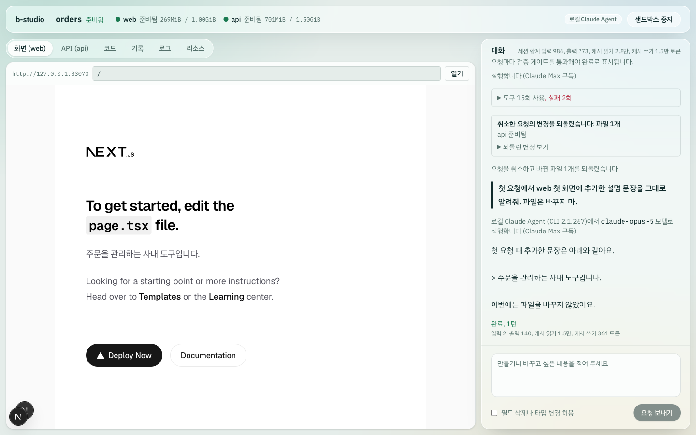

설계 근거는 [ADR-035](docs/decisions.md#adr-035-요청-취소와-토큰-사용량-샌드박스는-그대로-두고-요청만-되돌리며-합계는-서버가-센다)에 있습니다.

### 코드 문법 강조 (데모 모드 · 실제 Docker · Playwright)

| 확인 | 결과 |
|---|---|
| 첫 화면 번들 | 첫 화면에서 받은 스크립트 44개에 Shiki가 들어 있지 않고, 코드 탭에서 파일을 열 때 받음 |
| 테마 | 같은 토큰이 밝은 테마와 다크 모드에서 다른 색으로 보이고, 테마를 바꿔도 다시 강조하지 않음 |
| 큰 파일 | 1,500줄을 한 번에 강조하면 화면이 1.16초 멈췄음. 100줄씩 나눈 뒤 가장 긴 작업은 1,500줄 103ms, 2,500줄 115ms |
| diff | 바꾸기 전과 바꾼 뒤 코드를 따로 강조하고, 추가·삭제 줄 배경은 그대로 둠 |

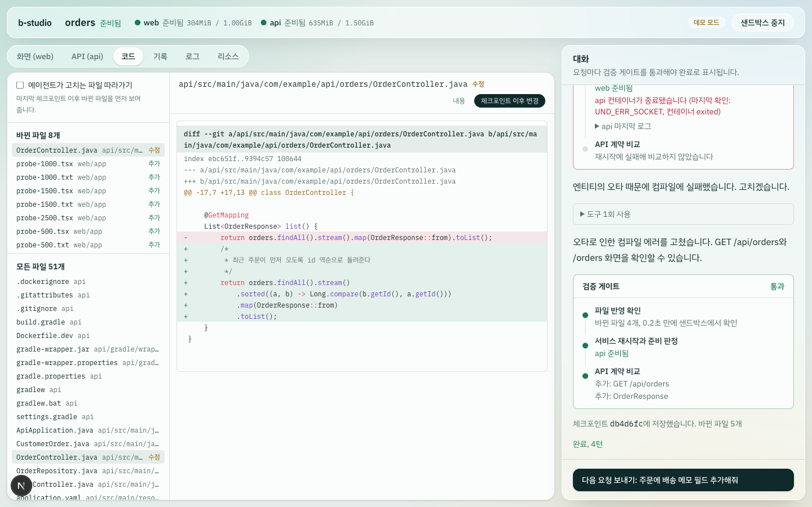

설계 근거는 [ADR-036](docs/decisions.md#adr-036-코드-문법-강조-shiki를-처음-볼-때-불러오고-색은-css-변수로-테마를-따른다)에 있습니다.

### 답변 마크다운 (로컬 로그인 계정 모드 · 실제 모델 · Playwright)

실제 모델에게 파일은 바꾸지 말고 표·목록·코드 블록으로 프로젝트를 설명해 달라고 요청했습니다(4턴, 바꾼 파일 없음).

| 확인 | 결과 |
|---|---|
| 모델이 보낸 답 | 표(머리글과 3행), 굵게 3개, 목록 3개, `bash`·`java` 코드 블록 2개 |
| 화면 | 표 1개(머리글 이름·기술·역할, 본문 3행), 목록 항목 3개, 굵게 3개, 인라인 코드 12개, 코드 블록 2개(강조된 줄 9개). `**`, `\|---\|`, 코드 블록 울타리 같은 기호가 글자로 남지 않음 |
| 안전 | 답변 영역에 `script`·`img`·`iframe` 요소 0개. HTML, `javascript:` 링크, 외부 이미지는 단위 테스트로 확인 |
| 콘솔 | 오류·경고 0개 |

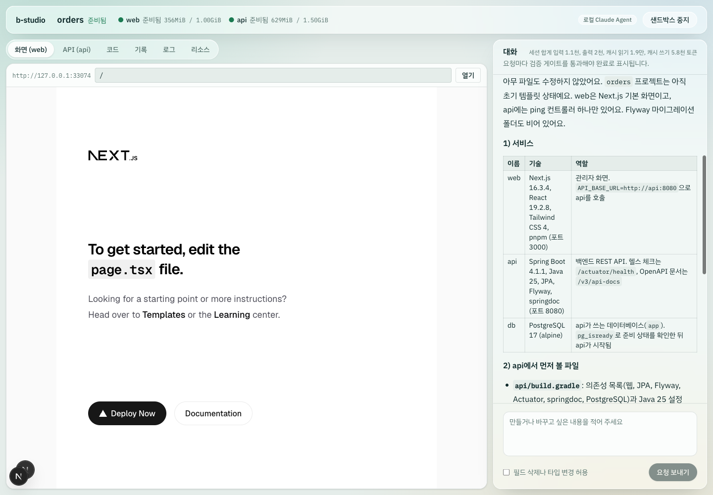

설계 근거는 [ADR-037](docs/decisions.md#adr-037-답변-마크다운-요소로-그리되-html과-외부-요청은-막는다)에 있습니다.

### 세션 토큰 한도 (로컬 로그인 계정 모드 · 실제 모델 · 실제 Docker)

`B_STUDIO_SESSION_TOKEN_LIMIT=20000`으로 스튜디오를 띄워 파일을 고치는 요청을 보냈습니다. 확인 8개가 모두 통과했습니다.

| 확인 | 결과 |
|---|---|
| 한도를 넘을 때 | 4턴 뒤 턴을 끝내며 사용량 29,641 토큰이 오자 곧바로 멈추고, 5.6초 만에 바꾼 파일 1개를 되돌림. 게이트 결과는 기록되지 않음 |
| 멈춘 뒤 | 작업 복사본과 체크포인트가 요청 전과 같고 서비스 모두 준비. 한도를 넘은 양 9,641 토큰 |
| 다음 요청 | 409로 거부하고 기록에 남기지 않음 |

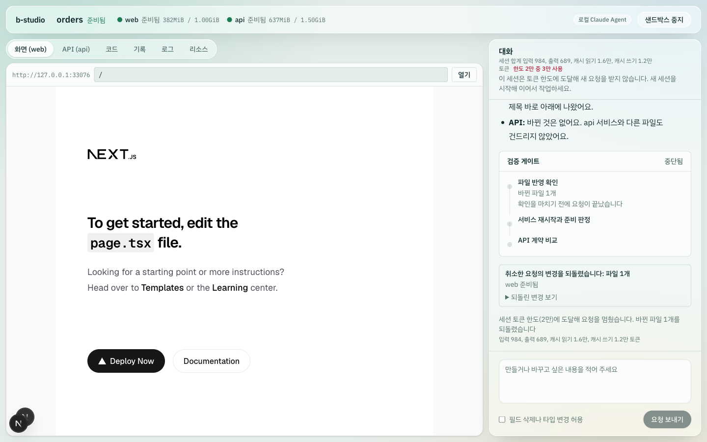

설계 근거는 [ADR-038](docs/decisions.md#adr-038-세션-토큰-한도-운영자가-서버에서-정하고-넘는-순간-요청을-멈춘다)에 있습니다.

### 코드 탭 찾기와 변경 감시 (데모 모드 · 실제 Docker · Playwright)

| 확인 | 결과 |
|---|---|
| 샌드박스만 도는 20초 | 개발 서버가 생성물을 써도 알림 0개 |
| 서비스 컨테이너 안에서 명령으로 파일 생성 | 0.56초 뒤 알림. 파일 목록 39개 → 40개, "추가"로 표시되고 내용을 읽을 수 있음. 에이전트 이벤트 0개 |
| 명령으로 파일 삭제 | 0.56초 뒤 알림, 목록에서 사라짐 |
| 데모 요청 하나 처리 (에이전트 쓰기 6번, 38.2초) | 알림은 2개로 모이고 요청은 그대로 완료 |
| 대화 기록 | 알림은 기록과 세션 파일에 쌓이지 않고 스냅샷 번호만 남음 |
| 브라우저 (Playwright) | "order"로 찾으면 "모든 파일 44개 중 5개". 코드 탭을 연 채 컨테이너 안에서 파일을 만들자 새로고침 없이 1.09초 뒤 목록에 나타나고, 열면 "추가"와 문법 강조가 보임. 콘솔 오류·경고 0개 |

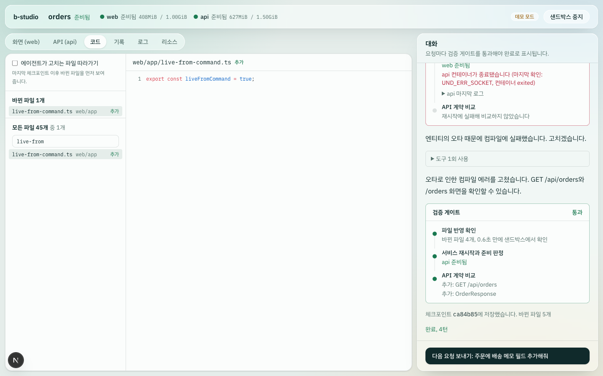

설계 근거는 [ADR-039](docs/decisions.md#adr-039-코드-탭-찾기와-변경-감시-서버가-작업-복사본을-감시하고-알림은-기록에-쌓지-않는다)에 있습니다.

### 스튜디오 인증 (데모 모드 · 실제 Docker · HTTP · Playwright)

스튜디오를 설정 오류, proxy 모드, token 모드로 차례로 띄워 HTTP 확인 15개가 모두 통과했고, token 모드 화면은 브라우저로 따로 확인했습니다.

| 확인 | 결과 |
|---|---|
| 설정 오류 | `B_STUDIO_AUTH=token`인데 서명 키가 없으면 화면·API 모두 500 |
| proxy 모드 | 맞는 비밀 값과 사용자 헤더만 통과. 비밀 값이 없거나 틀리거나, 내부 사용자 헤더를 꾸미면 401 |
| token 모드 로그인 | 로그인 전 화면은 돌아올 경로와 함께 `/login`으로, API는 401. 틀린 토큰은 0.83초 뒤 401. 쿠키는 `HttpOnly`·`SameSite=Lax`·12시간이고, 한 글자를 바꾸면 401 |
| 다른 출처 | 로그인 쿠키가 있어도 `Origin`이 다른 세션 만들기는 403 |
| 권한 | alice가 만든 세션을 bob은 볼 수 있지만 요청·중지·되돌리기·서비스 API 호출은 403. alice의 요청은 기록에 보낸 사람이 남고, 관리자 carol은 그 요청을 취소함 |
| 브라우저 (Playwright) | 틀린 토큰은 "토큰이 맞지 않습니다". bob으로 로그인하면 원래 세션 화면으로 돌아와 "읽기 전용, 만든 사람 alice"가 보이고 샌드박스 중지·다음 요청 버튼이 꺼짐. 로그아웃하면 로그인 화면. 콘솔 오류는 틀린 토큰 요청의 401 하나 |

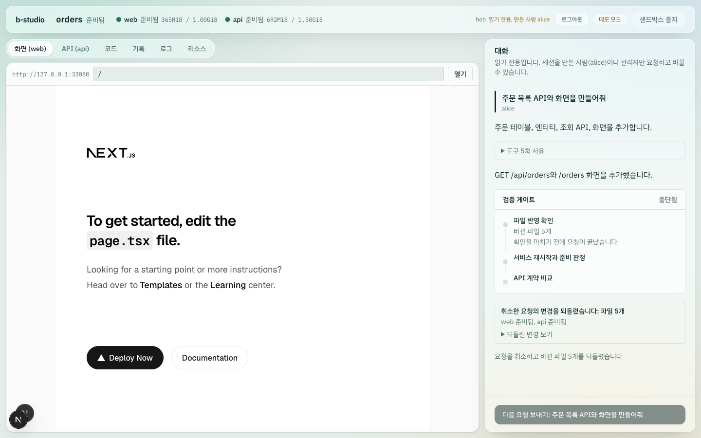

설계 근거는 [ADR-040](docs/decisions.md#adr-040-스튜디오-인증-proxyts와-라우트에서-두-번-확인하고-세션을-바꾸는-일은-만든-사람과-관리자만-한다)에 있습니다.

### 같은 프로젝트의 동시 세션 (데모 모드 · 실제 Docker)

같은 프로젝트로 두 세션을 함께 띄우면 뒤에 뜨는 api 빌드가 Gradle 캐시 잠금을 얻지 못해 실패했습니다([트러블슈팅 36](docs/troubleshooting.md#36-같은-프로젝트로-두-세션을-동시에-띄우면-api-빌드가-실패함)). Gradle 홈을 샌드박스 전용으로 분리하고, 의존성 캐시는 이미지에 구워 읽기 전용으로 공유하도록 바꿨습니다. 확인 4개가 모두 통과했습니다.

| 확인 | 결과 |
|---|---|
| 첫 세션 | 23.5초에 준비 |
| 같은 프로젝트의 두 번째 세션 | 33.4초에 준비. 두 api가 모두 `running`(종료 코드 0, OOM 아님) — 예전에는 여기서 빌드가 실패했습니다 |
| 볼륨 | 샌드박스마다 자기 `api-gradle-home`을 쓰고, 공유 쓰기 볼륨은 쓰지 않음 |
| 두 세션의 서비스 | 양쪽 web 화면 200, api 계약 200 |
| 이미지에 구운 캐시 | jar 131개(`jakarta.activation-api`, `postgresql` 포함), 잠금 파일 0개, 배포판 2개. 네트워크를 끊은 컨테이너에서도 `compileJava`까지 진행(의존성 오프라인 해결) |

**대가도 측정했습니다.** 샌드박스마다 Gradle 홈을 새로 채우므로 api 준비가 13.9초 → 21.1초로 느려졌고(2회차 기준, 같은 PC에서 변경 전후 각 2회 측정), 두 샌드박스를 동시에 띄우면 6GiB VM의 가용 메모리가 101MB까지 내려갔습니다. 설계 근거와 고치는 동안 실패한 네 번의 시도는 [ADR-008](docs/decisions.md#adr-008-볼륨을-샌드박스-전용과-공유-캐시로-나눈다)과 트러블슈팅 36에 적었습니다.

### 사람별 토큰 한도 (token 모드 · 실제 모델 · 운영 빌드 · Playwright)

사람 한도를 3천으로 낮춰 두고 alice·bob 두 계정으로 확인했습니다. API 확인 5개가 모두 통과했습니다.

| 확인 | 결과 |
|---|---|
| 처음 상태 | `GET /api/usage`가 `{used: 0, limit: 3000, window: "day", period: "2026-09-12"}` |
| 실행 중 초과 | 한도를 넘는 순간 요청이 멈추고 "오늘 쓸 수 있는 토큰 한도(3천)에 도달해 질문을 멈췄습니다" — 세션 한도가 아니라 사람 한도로 알림 |
| 새 세션에서도 거부 | 같은 세션과 **새 세션 모두** 409, 문구는 "…기간이 바뀐 뒤에 다시 요청하세요". 세션 한도와 달리 새 세션으로 우회되지 않음 |
| 사람별 집계 | 기록 파일에 `2026-09-12` 기간의 alice만 쌓임(45,630 토큰), bob은 0. 파일 권한 600 |
| 다른 사람 | bob의 사용량은 0이고 한도로 막히지 않음. 단 이 세션에서는 소유권 때문에 403이라, "bob이 실제로 요청을 보낸다"까지는 확인하지 못함 |

화면은 사용량 파일을 미리 채워 두 상태를 확인했습니다(모델을 쓰지 않는 데모 모드).

| 상태 | 결과 |
|---|---|
| 80% 이상 (2.9천/3천) | 헤더에 "내 한도 (오늘) 3천 중 2.9천 사용"이 경고 색(`rgb(154, 99, 16)`)으로 표시되고 전송은 가능 |
| 한도 도달 (3.3천/3천) | 같은 문구가 실패 색(`rgb(180, 35, 58)`)으로 바뀌고, 안내가 "오늘 쓸 수 있는 토큰 한도에 도달해 새 요청을 받지 않습니다. 기간이 바뀐 뒤에 다시 요청하세요."로 바뀌며 전송 버튼이 꺼짐. 콘솔 오류 0개 |

검증 중에 화면 버그 하나를 찾아 고쳤습니다. 개인 한도 표시를 세션 사용량 블록 안에 넣어 두어, **세션 토큰이 0이고 세션 한도가 없으면 내 한도가 전혀 보이지 않았습니다.** 또 한도에 도달해도 이유 없이 버튼만 꺼져 있어 안내 문구를 더했습니다. 설계 근거는 [ADR-038](docs/decisions.md#adr-038-세션-토큰-한도-운영자가-서버에서-정하고-넘는-순간-요청을-멈춘다)에 있습니다.

### 답변의 수식과 각주 (로컬 로그인 계정 모드 · 실제 모델 · 운영 빌드 · Playwright)

먼저 지금 상태를 그려 보고 확인한 것이 있습니다. **각주는 원래부터 그려지고 있었고**(`remark-gfm`이 함께 켬), "지원하지 않는다"고 적어 둔 문서가 사실과 달랐습니다. 대신 각주 링크가 새 탭으로 열리고 묶음 제목의 숨김 클래스가 지워져 "Footnotes"가 글자로 보이는 문제를 찾아 고쳤습니다.

수식은 처음에 금액(`$100`)을 지키려고 인라인(달러 하나)을 껐지만, 실제 모델 답변이 인라인 수식을 달러 하나로 쓰는 것을 보고 결정을 바꿨습니다.

| 확인 | 결과 |
|---|---|
| 실제 모델 답변 (질문 모드, 25.2초) | 1,405자에 블록 수식 표기 4개(=2블록), 인라인 달러 16개, 각주 참조 2개. 체크포인트 1개(파일 변경 없음) |
| 화면의 수식 | `.katex` 10개, 블록 수식 2개, MathML `annotation` 10개(`p_i`, `q_i`, `\text{total} = …`) |
| 글꼴 | `KaTeX_Main-Regular`·`KaTeX_Size2-Regular`·`KaTeX_Math-Italic` woff2가 200으로 받아지고 3종 로드됨 (CDN 아님) |
| 각주 | 번호 링크에 `target` 없음(같은 화면에서 이동), 되돌아가기 링크 1개 |
| 각주 묶음 제목 | `sr-only` 유지 — `position: absolute`, 1×1px, `clip-path: inset(50%)`, `overflow: hidden`. 낭독기에는 "각주"로 읽히고 눈에는 보이지 않음 |
| 금액 표기 | 답변 화면에 `$숫자` 형태가 수식으로 바뀐 흔적 없음. 콘솔 오류 0개 |

단위 테스트로는 블록·인라인 수식의 MathML, 금액(`$100 … $5`)과 코드 블록(`$1 $2`)이 글자로 남는 것, 숫자로 시작하는 인라인 수식(`$2x$`)은 금액과 구분할 수 없어 그리지 않는 것, 문법이 틀린 수식이 답변을 깨뜨리지 않는 것을 확인했습니다. 설계 근거는 [ADR-037](docs/decisions.md#adr-037-답변-마크다운-요소로-그리되-html과-외부-요청은-막는다)에 있습니다.

### 코드 탭의 큰 저장소와 내용 찾기 (데모 모드 · 운영 빌드 · 실제 Docker · Playwright)

데모 세션의 작업 폴더에 파일을 1,200개 넣어(전체 1,244개) 목록·찾기를 확인했습니다. 생성물 폴더, `.env`, 256KB를 넘는 파일, 널 바이트가 든 파일도 함께 두었습니다. API 확인 5개가 모두 통과했습니다.

| 확인 | 결과 |
|---|---|
| 목록 쪽 넘기기 | 전체 1,244개를 세고 500개씩 보냄. 첫 쪽 응답 20ms, 두 쪽이 겹치지 않고, 마지막 쪽은 남은 1개만 |
| 빼는 경로 | `node_modules`와 `.env`로 시작하는 파일은 목록에 없음 |
| 경로로 좁히기 | `generated/file-01`은 100개, 없는 이름은 0개 |
| 내용으로 찾기 | 0.2초. 표시 문자열이 든 파일 1개와 줄 번호(2줄)를 돌려주고, 256KB 초과 파일·널 바이트 파일·생성물·`.env`는 건너뜀 |
| 결과 상한 | 60개 파일이 맞는 검색어는 50개까지만 주고 알림. 한 글자와 빈 검색어는 400 |

브라우저(Playwright, Chromium)에서도 같은 세션을 확인했습니다.

| 확인 | 결과 |
|---|---|
| 목록 | 머리말에 "모든 파일 1,244개", 첫 쪽 500개 |
| 더 보기 | "더 보기 (744개 남음)"을 누르면 1,000개로 늘어남 |
| 내용 찾기 | 맞은 줄이 줄 번호와 함께 표시되고 맞은 글자가 강조됨. 누르면 그 파일이 열림 |
| 큰 파일 강조 | 1,500줄(122KB) 파일을 열 때 화면 스레드가 가장 오래 멈춘 시간 114ms, 토큰 16,500개, 1,500줄 렌더링 |
| 읽기 상한 | 280KB 파일은 "파일이 너무 큽니다 (280029 bytes)"로 이유를 알려 줌 (콘솔 오류는 이 요청의 400 하나) |

설계 근거는 [ADR-046](docs/decisions.md#adr-046-코드-탭-목록은-서버에서-좁혀-쪽-단위로-보내고-내용-찾기도-서버가-한다)에 있습니다.

### 인증 보강 (token 모드 · 운영 빌드 · 실제 Docker · Playwright)

운영 빌드로 띄운 스튜디오에 세 사람(해시 토큰 2명, 평문 토큰 1명)을 두고 HTTP로 10개를 확인했습니다. 모두 통과했습니다.

| 확인 | 결과 |
|---|---|
| 로그인 | 이름 없이 보내면 400, 남의 토큰은 0.51초 뒤 401. 해시 토큰과 평문 토큰 모두 200 |
| 계정 잠금 | 실패 3회까지 401, 4회째부터 잠금. 잠긴 동안은 맞는 토큰도 `Retry-After: 5`와 함께 429. 다른 계정은 그대로 로그인되고, 5초 뒤 다시 로그인됨 |
| 없는 이름 | 없는 이름 4회까지 401, 5회째 429. 같은 시간에 실제 계정은 200 |
| 로그아웃 | 복사해 둔 쿠키로 API는 401, 화면은 `/login`으로 307. 같은 사람의 다른 로그인은 유지. 기록 파일에 세션 1건, 권한 600 |
| 관리자 무효화 | 관리자가 아니면 403, 없는 사용자는 400. 무효화하면 그 사람의 기존 쿠키가 401이 되고 다른 사람은 200. 다시 로그인하면 200 |
| 미리보기 주소만 아는 경우 | 페이지 401, HMR 웹소켓 401 |
| 티켓 | 다른 서비스 호스트에 쓰면 403, 같은 티켓을 다시 쓰면 403. 맞는 호스트에서는 302와 `HttpOnly; SameSite=Lax` 쿠키(Max-Age 43,183초 — 남은 로그인 시간) |
| 쿠키로 열기 | 페이지 200(HTML), HMR 웹소켓 101. 같은 쿠키로 다른 서비스 호스트는 401 |
| 다른 사람 | 만든 사람이 아니어도 로그인했으면 티켓 200, 로그인하지 않으면 401 |
| 로그아웃 뒤 미리보기 | 이미 받은 미리보기 쿠키로도 페이지 401, 웹소켓 401 |

브라우저(Playwright, Chromium)에서는 스튜디오를 미리보기와 같은 사이트 주소(`http://preview.localhost:3100`)로 열어 확인했습니다.

| 확인 | 결과 |
|---|---|
| 로그인 화면 | 이름과 접근 토큰을 넣어 로그인하면 첫 화면으로 돌아옴 |
| 미리보기 | iframe이 `/__b-studio/preview-access?ticket=…` 주소로 열리고, 미리보기 호스트의 첫 화면으로 바뀌어 앱이 그려짐 |
| 로그아웃 뒤 | 같은 미리보기 주소가 401과 "스튜디오에서 미리보기를 다시 여세요" 안내. 콘솔 오류는 이 401 하나 |

미리보기 접근 쿠키의 `SameSite` 동작은 따로 실험해 정했습니다(Chromium).

| 스튜디오 주소 | `SameSite=Lax` | `SameSite=None; Secure` | `None; Secure; Partitioned` |
|---|---|---|---|
| `preview.localhost` (미리보기와 같은 사이트) | 전달됨 | 전달됨 | 전달됨 |
| `127.0.0.1` | 전달 안 됨 | 전달됨 | 전달됨 |
| `studio.localhost` | 전달 안 됨 | 전달됨 | 전달됨 |

그래서 쿠키는 `SameSite=Lax`로 두고, 미리보기 도메인을 스튜디오와 같은 사이트로 두도록 문서에 적었습니다. 설계 근거는 [ADR-045](docs/decisions.md#adr-045-인증-보강-로그아웃을-서버에-남기고-토큰은-해시로-두며-미리보기는-1회용-티켓으로-연다)에 있습니다.

### 내 폴더에서 바로 작업 (데모 모드 · 실제 Docker · Playwright)

사용자 저장소가 있는 폴더(커밋 1개, 무시하는 로그 파일, 커밋하지 않은 초안)를 만들고, IDE가 하듯 스크립트로 파일을 쓰고 지우며 확인했습니다. 확인 31개가 모두 통과했습니다.

| 확인 | 결과 |
|---|---|
| 세션 만들기 | 복사 없이 0.23초. 같은 폴더로 두 번째 세션은 409 |
| 사용자 저장소 | 기동부터 이어서 작업까지 커밋·브랜치·`.git/config`가 그대로이고 `b-studio` 설정 항목이 없음. 세션 상태와 체크포인트 저장소는 세션 폴더에 있음 |
| IDE 수정 반영 | 새 파일은 0.75초 뒤 코드 화면에 추가로 표시. web 재시작 없이 새 화면 폴더는 1.00초, 그 화면을 다시 고치면 0.36초, 화면 파일을 지우면 0.92초 뒤 404, 다시 만들면 0.94초, 화면 폴더를 지우면 0.92초 뒤 404 |
| 요청 전 직접 수정 | 요청마다 폴더에서 바뀐 파일을 "직접 수정" 체크포인트로 먼저 남김. 게이트가 막은 요청을 되돌려도 요청 전에 쓴 파일, 무시한 파일, 초안은 남고, 처리 중에 쓴 파일은 함께 되돌아감 |
| 중지와 이어서 작업 | 중지하면 샌드박스만 지우고 폴더는 남음. 스튜디오를 다시 시작해도 세션을 찾고, 중지한 동안 고친 파일은 버리지 않고 체크포인트로 남김. DB 덤프 지문이 중지 전과 같음 |
| 인증을 켠 서버 | 세션 만들기 403, 관리자여도 이어서 작업 403, 홈에 선택지 없음 |
| 브라우저 (Playwright) | 홈에서 기본은 복사본이고, 내 폴더를 누르면 폴더 경로와 안내가 보임. 같은 폴더로 시작하면 실행 중인 세션을 알려 줌. 세션 헤더에 "내 폴더" 표시, 대화에 직접 수정 체크포인트 4개, 미리보기에서 IDE로 만든 `/ide-live` 화면이 열림. 되돌리기 확인에 "체크포인트에 없는 폴더의 수정이 내 폴더에서 사라집니다"가 보임. 콘솔 오류는 같은 폴더로 시작한 요청의 409 하나 |

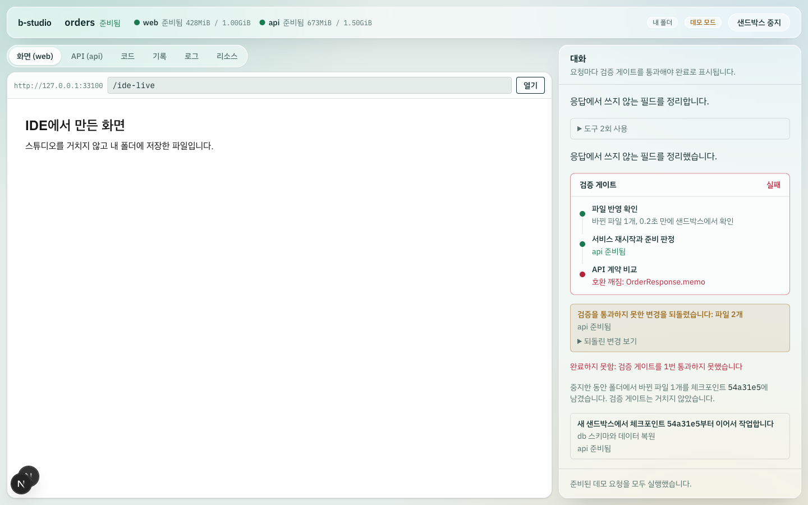

설계 근거는 [ADR-041](docs/decisions.md#adr-041-내-폴더에서-바로-작업-체크포인트-저장소는-폴더-밖에-두고-사람의-수정은-먼저-남긴다), 새 파일·삭제 알림을 전달하게 된 과정은 [트러블슈팅 29](docs/troubleshooting.md#29-내-폴더에서-ide로-만든-새-화면이-미리보기에-뜨지-않음)에 있습니다.

### 질문 모드 (데모 모드·로컬 로그인 계정 모드 · 실제 모델 · 실제 Docker · Playwright)

| 확인 | 결과 |
|---|---|
| 데모 질문 (확인 9개 통과) | 질문 두 개가 각각 1.33초에 답함. 게이트·체크포인트·되돌리기 없음, 작업 복사본 변경 0개, 데모 요청 순서 유지. 이어서 보낸 만들기 요청은 체크포인트를 남김. 모르는 `intent`는 400, 준비되지 않은 데모 질문은 409 |
| 실제 모델 질문 (확인 4개 통과) | "서버 현재 시각 GET 엔드포인트를 추가하려면 어디를 바꿔야 해? 계획만"에 22.0초, 4턴. 도구는 파일 목록·계약·코드 읽기뿐이고 작업 복사본은 그대로 |
| 이대로 만들기 | "앞에서 정리한 계획대로 만들어줘"가 43.5초, 3턴에 계획에 적힌 `TimeController.java`를 만들고 게이트를 통과. 계약에 `GET /api/time` 추가(호환 유지) |
| 브라우저 (Playwright) | 요청에 질문 표시, "답변 완료, 2턴", 질문 탭의 안내와 준비된 질문 버튼. "이대로 만들기"를 누르면 만들기 탭으로 바뀌고 12.0초 뒤 요청 완료, 버튼이 사라짐. 답의 표가 대화 폭(392px) 안에 두 열(232px, 159px)로 들어감 |

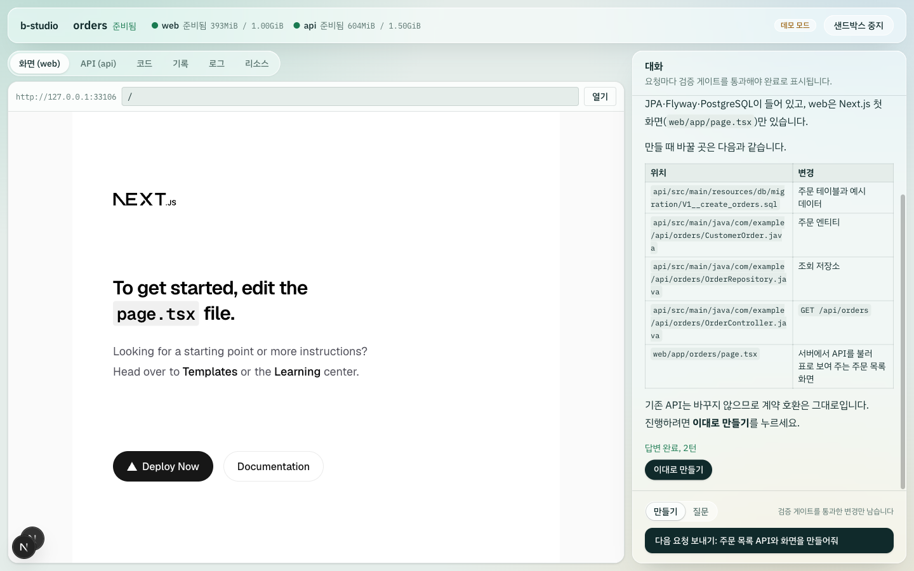

설계 근거는 [ADR-042](docs/decisions.md#adr-042-질문-모드-같은-대화와-도구-목록을-쓰고-바꾸는-도구는-실행기에서-막는다)에 있습니다.

### 운영 배포 (실제 Docker · CLI · 운영 주소로 트래픽)

orders 예제에 데모 요청 1(주문 목록)을 적용한 폴더를 `studio deploy`로 배포했습니다.
- 이어서 배송 메모를 넣은 두 번째 배포, 컴파일되지 않는 배포, 되돌리기, 프록시 재시작, 삭제를 차례로 실행했습니다.
- 빌드 캐시가 없는 첫 실행은 17개, 실패 기록 확인을 더한 두 번째 실행은 18개가 모두 통과했습니다.
- 전환하는 동안에는 운영 주소의 web `/`와 api 준비 확인 경로로 50ms 간격으로 요청을 보냈습니다.

| 확인 | 첫 실행 (빌드 캐시 없음) | 두 번째 실행 |
|---|---|---|
| CLI 첫 배포 | 77.1초 (web 빌드 14.8초, api 빌드 48.6초) | 13.4초 |
| 두 번째 배포 (배송 메모) | 32.9초, 요청 1,052건 중 실패 0 | 11.9초, 396건 중 실패 0 |
| 빌드 실패 (컴파일 오류) | 운영 주소 그대로, 요청 실패 0, 실패한 릴리스의 이미지·컨테이너 없음 | 같음. 기록은 "api 운영 이미지를 빌드하지 못했습니다"와 컴파일 에러 줄 |
| 되돌리기 (빌드 없음) | 11.5초, 380건 중 실패 0 | 11.3초, 376건 중 실패 0 |
| 프록시 컨테이너 재시작 | 0.64초 뒤 다시 응답 | 0.62초 |

- **데이터:**
  - 첫 릴리스 때 DB에 직접 넣은 행이 두 번째 배포와 되돌리기 뒤에도 남았습니다.
  - 되돌린 첫 릴리스(`memo` 없음)는 `memo` 열이 추가된 스키마에서도 떴습니다.
- **rewrites:** 운영 주소의 web `/api/orders`가 빌드 인자로 정한 `rewrites`를 거쳐 api의 주문 목록을 돌려줬습니다. 빌드 인자 없이 만든 이미지는 404였습니다([트러블슈팅 31](docs/troubleshooting.md#31-운영-이미지의-web에서-api-요청이-404가-됨)).
- **삭제:** 볼륨을 남기는 삭제는 컨테이너만 지우고 `bsd-orders-base_db-data`를 남겼습니다. `--volumes`는 볼륨과 운영 이미지까지 지웠습니다.
- **FastAPI 템플릿:** 운영 이미지가 UID 10001로 떠서 `/openapi.json`에 200을 줬습니다.

스튜디오의 배포 탭은 데모 모드 세션에서 확인했습니다.
- API로 확인한 9개가 모두 통과했습니다.
- 브라우저에서도 배포와 되돌리기 확인 화면을 조작해 봤습니다.

| 확인 | 결과 |
|---|---|
| 체크포인트 배포 | 요청 1의 체크포인트를 꺼내 43.1초에 배포. 진행 줄 137줄이 이벤트로 오고, 운영 주소에 주문 화면. 기록에는 진행 줄 없이 결과만 남음 |
| 두 번째 배포 | 최신 체크포인트를 29.6초에 배포, 운영 주소로 보낸 요청 960건 중 실패 0. 배포 중 다시 배포하면 409 |
| 되돌리기와 오류 | 첫 릴리스로 11.5초. 잘못된 릴리스 이름은 400, 없는 릴리스는 실패 이벤트로 대화에 남음 |
| 브라우저 (Playwright) | 배포 탭에 운영 주소와 운영 중·이전 릴리스, 이전 릴리스마다 되돌리기 버튼. "최신 체크포인트 배포"를 누르면 진행 줄이 실시간으로 쌓이고 14.1초 뒤 새 릴리스가 운영 중으로 바뀜. 되돌리기 확인에 "DB 마이그레이션은 되돌리지 않습니다". 콘솔 오류 0개 |

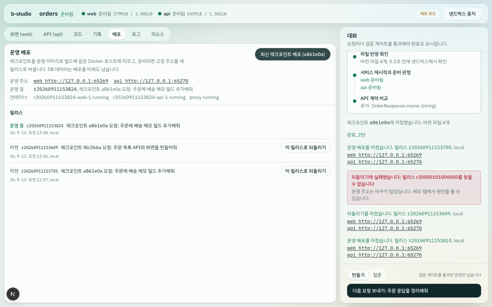

설계 근거는 [ADR-043](docs/decisions.md#adr-043-운영-배포-릴리스마다-compose-프로젝트를-띄우고-고정-주소의-프록시로-무중단-전환한다)에 있습니다.

### 스튜디오 컨테이너 이미지 (데모 모드 · 실제 Docker · colima)

`apps/studio/Dockerfile`로 만든 이미지(603MB)를 띄우고, 세션부터 배포까지 API로 확인했습니다.
- 띄운 방식: 호스트 Docker 소켓, `--network host`, 세션·배포 폴더를 같은 경로로 마운트
- 처음 두 번은 세션 생성과 체크포인트 내보내기가 실패해 고쳤습니다([트러블슈팅 33](docs/troubleshooting.md#33-컨테이너로-띄운-스튜디오가-세션을-만들지-못함-not-in-a-git-directory), [34](docs/troubleshooting.md#34-컨테이너로-띄운-스튜디오에서-체크포인트-배포가-바로-실패함)).
- 고친 이미지에서는 7개가 모두 통과했습니다.

| 확인 | 결과 |
|---|---|
| 이미지 | 빌드 28초(베이스 이미지를 받아 둔 상태), 코드만 바꾼 재빌드 16~19초. Docker CLI 28.5.2, Compose 2.40.3, buildx 0.29.1, Git 2.39.5, Node 22.23.2 |
| token 모드 | healthy까지 5.3초. `/api/health` 200, `/api/projects` 401, `/`는 로그인으로 307 |
| 데모 모드 기동 | healthy까지 5.2초. `/projects`에 마운트한 orders를 읽음 |
| 세션 | 17.5초에 준비. 컨테이너 안의 docker CLI가 호스트 데몬에 샌드박스 컨테이너 4개를 만들고, 미리보기 200 |
| 데모 요청 1 | 23.6초에 게이트 통과, 체크포인트가 남고 미리보기 `/orders`에 주문 화면 |
| 중지 후 배포 | 세션을 중지해 샌드박스를 0개로 정리한 뒤 체크포인트를 배포. 빌드 캐시를 지운 뒤 첫 배포 78.2초(진행 줄 194줄), 다음 배포 12.5초(94줄). 운영 주소의 `/orders`와 web을 거친 `/api/orders` 200 |
| 운영 주소 접근 | VM 안에서는 배포 직후 200. macOS에서는 첫 요청이 연결 실패였고 1.5초 뒤부터 200이어서, 배포가 아니라 colima가 새 포트를 macOS로 전달하는 지연으로 봄 |
| 메모리·정리 | 샌드박스를 띄운 동안 VM 가용 메모리 905MB, 배포 뒤 1,566MB. dbtower 컨테이너 5개 유지. 끝난 뒤 남은 컨테이너·볼륨·운영 이미지 0 |

CI 워크플로는 로컬에서 actionlint로 확인했고, PR에서 실제로 돈 결과는 이 PR의 체크에 남습니다. 설계 근거는 [ADR-044](docs/decisions.md#adr-044-ci와-스튜디오-이미지-호스트-docker-소켓을-쓰고-세션배포-폴더는-같은-경로로-마운트한다)에 있습니다.

### 원격 미리보기 게이트웨이 (데모 모드 · 실제 Docker · `preview.localhost`)

`B_STUDIO_PREVIEW_DOMAIN=preview.localhost`로 스튜디오를 띄우고, 게이트웨이(포트 4100)에 호스트 이름으로 요청했습니다.

| 확인 항목 | 결과 |
|---|---|
| 미리보기 주소 | 서비스가 준비되면 `http://web--<세션>--<토큰>.preview.localhost:4100`이 서비스 상태에 실림 |
| 페이지와 자원 | `/orders` 200, 페이지가 가리키는 `/_next/static/...js`도 같은 호스트로 200 |
| HMR | `/_next/hmr` 웹소켓 핸드셰이크 101. 템플릿 설정은 그대로 |
| 거부 | 틀린 토큰과 중지된 세션은 404 |
| 재시작·이어서 작업 | 서비스를 재시작하거나 새 샌드박스로 이어서 작업해도 같은 주소가 동작 |
| 브라우저 (Playwright) | 미리보기 iframe이 게이트웨이 주소로 열리고, 그 안에서 주문 목록 화면이 보임. 콘솔에 게이트웨이 주소로 `[HMR] connected` |

설계 근거는 [ADR-033](docs/decisions.md#adr-033-원격-미리보기-호스트-이름으로-나누는-게이트웨이가-경로를-그대로-넘긴다)에 있습니다.

### 화면 디자인 (Playwright · Chromium)

데모 세션 화면을 열고 미디어 설정을 바꿔 가며 세션 헤더의 계산된 스타일과 스크린샷을 확인했습니다.

| 설정 | 결과 |
|---|---|
| 기본 (밝은 테마) | 헤더 배경 `rgba(255, 255, 255, 0.55)`, `backdrop-filter: blur(24px) saturate(1.7)`. 빛이 번진 바탕 위에 헤더·탭 막대·대화 시트가 떠 있고 미리보기와 게이트 카드는 불투명 |
| `prefers-color-scheme: dark` | 바탕 `#0a1413`, 어두운 유리와 어두운 게이트 카드. 통과·실패 색을 밝게 조정 |
| `prefers-contrast: more` | 헤더 배경 `rgb(251, 253, 252)`, `blur(0px)`. 유리 표면이 모두 불투명 패널 |
| `forced-colors: active` | 헤더에 실제 테두리 1px. 헤더·탭·칩·시트·카드의 경계가 시스템 색으로 보임 |
| 콘솔 | 스튜디오 화면에서 오류 없음 |

설계 근거는 [ADR-031](docs/decisions.md#adr-031-화면-디자인-조작-계층만-유리로-띄우고-읽는-영역은-불투명하게-둔다)에 있습니다.

### 아직 검증하지 못한 것과 알려진 한계

- **API 키 경로의 실제 실행**: 실제 모델 실행은 로컬 로그인 계정 모드로만 확인했습니다. `AnthropicModelClient`로 API를 직접 호출하는 경로는 API 키가 없어서, 샌드박스를 띄우기 전에 안내 메시지를 내고 멈추는 것까지만 확인했습니다.
- **로컬 로그인 계정 모드는 개인 PC 전용**: 공유 서버 배포용이 아니며, 대화 기록이 로컬 CLI의 세션 파일(`~/.claude/projects/` 아래)에 남습니다. 로그인하지 않은 상태의 안내 문구는 가짜 SDK로만 확인했습니다.
- **CLI는 자동 되돌리기를 하지 않음**: 체크포인트는 스튜디오 세션의 작업 복사본에만 적용합니다. `studio agent`는 사용자 프로젝트 폴더를 직접 다루므로 `reset`을 실행하지 않습니다.
- **실제 GitHub·GitLab에서 PR 생성은 검증하지 않음**: 실제 서버로는 Gitea만 확인했습니다. GitHub·GitLab API는 요청 형태와 응답 처리를 가짜 서버 테스트로 확인했습니다.
- **원격 변경 가져오기의 범위**: 충돌은 스튜디오 안에서 해결하지 않으며 PR이나 원격 브랜치에서 해결해야 합니다. 로컬 bare 저장소로만 실측했고 GitHub·GitLab 원격으로는 확인하지 않았습니다. 올린 뒤 되돌린 세션에서 원격 변경만 옮겨 오는 경로는 단위 테스트로만 확인했습니다. 가져오는 도중 서버가 멈추면 검증하지 않은 병합 커밋이 남을 수 있습니다. 반영 확인 규칙을 바꾼 Kubernetes 제공자는 kind로 다시 실측하지 않았습니다.
- **모노레포 하위 폴더의 범위**: `studio.yaml`에서 `repository.monorepo`를 켠 프로젝트만 상위 저장소로 시작합니다. 저장소 전체를 복제하므로 큰 저장소는 세션마다 복제 시간과 디스크가 듭니다. 에이전트 도구는 프로젝트 폴더 밖(공용 패키지)을 고치지 못합니다. 로컬 bare 원격으로만 실측했습니다.
- **DB 브랜치의 한계**: Postgres만 지원하고, 덤프를 한 번에 256MB까지 다룹니다. 되돌림 결과 문구는 이벤트 스트림으로 확인했고 브라우저 화면으로는 확인하지 않았습니다.
- **같은 프로젝트의 동시 세션**: 이제 같은 프로젝트로 두 세션을 함께 띄울 수 있습니다([트러블슈팅 36](docs/troubleshooting.md#36-같은-프로젝트로-두-세션을-동시에-띄우면-api-빌드가-실패함)). 대신 Gradle 홈을 샌드박스마다 새로 채우느라 api 준비가 13.9초에서 21.1초로 느려졌고, 6GiB VM에서 두 샌드박스를 동시에 띄우면 가용 메모리가 101MB까지 내려갔습니다. 예전 설치에는 쓰이지 않는 `b-studio-cache-gradle` 볼륨이 남습니다(`docker volume rm b-studio-cache-gradle`로 지웁니다).
- **세션 복구의 범위**: 서버가 멈추면 진행 중이던 요청은 이어지지 않고 마지막 체크포인트부터 다시 시작합니다. 세션 파일은 스튜디오 서버의 로컬 디스크에 있어 여러 서버가 세션을 나눠 갖지 못합니다. 강제 종료와 이어서 작업은 Docker 제공자로만 실측했고, Kubernetes 제공자의 정리 명령은 단위 테스트로만 확인했습니다. API 키 모드와 로컬 로그인 계정 모드에서 대화를 이어받는 것은 실제 모델로 확인하지 않았습니다.
- **Kubernetes 제공자의 범위**: 소스를 hostPath로 마운트하므로 kind 같은 단일 노드 개발 클러스터에서만 동작합니다. 기동 가속용 스냅샷 볼륨이 없고, 전용 볼륨은 emptyDir라 Pod를 다시 만들면 의존성 설치가 다시 돕니다. CPU·메모리 사용량은 metrics-server가 없어 표시하지 않습니다. edge Pod는 port-forward를 받기 위해 gVisor 없이 돌고, compose의 `depends_on` 중 edge를 기다리는 것 말고는 순서를 보장하지 않습니다.
- **gVisor 격리의 범위**: 개발 PC의 Docker 데몬에는 등록하지 않고, 격리된 Docker-in-Docker 데몬에서 edge와 Next web만 띄워 확인했습니다. api(JVM)와 db(Postgres)는 아직 gVisor에서 띄워 보지 않았습니다. runsc는 서비스 이름 풀이 때문에 `--network=host`로 등록해야 하고, 이 모드는 네트워크 경로의 격리를 줄입니다. gVisor 안에서는 파일 변경 알림이 오지 않아, 미리보기는 요청이 끝나고 서비스를 다시 띄울 때 바뀝니다.
- **정책 프록시의 범위**: 가림은 필드 이름 기준이라 다른 이름의 필드나 자유 텍스트 안의 개인정보는 가리지 못합니다. 가릴 필드가 있는 API의 JSON이 아닌 응답은 넘기지 않고, 본문은 5MB까지, HTTP(S) API만 다룹니다. 실제 사내망 API가 아니라 Docker 호스트의 가짜 API로 확인했습니다.
- **시크릿 가림의 범위**: 문자열 일치(원래 값, URL 인코딩, base64)로 찾으므로 값을 쪼개거나 다른 방식으로 바꾸면 가려지지 않습니다. Docker 호스트에서는 `docker inspect`·`docker logs`로 값이 보입니다. 게이트의 시크릿 실패 문구와 세션 시작 거부 문구는 스튜디오 화면이 아니라 코드 경로와 API 매핑으로만 확인했습니다.
- **화면 디자인의 범위**: Chromium(Playwright)으로만 확인했고 Safari·Firefox에서는 열어 보지 않았습니다. `prefers-reduced-transparency`는 흉내 내지 못해 확인하지 않았고, 흐림 효과의 렌더링 비용도 측정하지 않았습니다.
- **코드 보기의 범위**: 읽기 전용입니다. 목록은 파일 20,000개까지 세어 500개씩 나눠 보내고, 내용 찾기는 파일 하나를 256KB까지만 읽어 50개 파일·파일마다 5줄까지 보여 줍니다. 목록을 새로 받을 때마다 폴더를 다시 훑습니다(캐시 없음). 강조는 여전히 화면 스레드에서 100줄씩 돌아갑니다. 워커로 옮기려 했지만 번들러가 워커를 컴파일하지 않아 되돌렸습니다([트러블슈팅 35](docs/troubleshooting.md#35-문법-강조를-워커로-옮기려다-워커가-컴파일되지-않는-것을-확인함)). 파일 변경 감시는 macOS에서만 실측했고, Linux에서는 폴더가 아주 많으면 inotify 감시 한도에 걸릴 수 있습니다. 로컬 로그인 계정 모드에서는 실제 모델로 확인하지 않았습니다.
- **요청 취소와 토큰 표시의 범위**: 로컬 로그인 계정 모드는 Claude Code가 턴을 끝낼 때만 사용량을 알려 주므로, 턴 도중 취소한 요청의 토큰은 합계에 들어가지 않고 처리 중 표시도 첫 턴이 끝난 뒤 나타납니다. API 키 모드의 토큰 표시는 API 키가 없어 단위 테스트로만 확인했습니다. 금액은 표시하지 않습니다. 폴더를 지우는 되돌리기는 반영 확인이 목록 지연을 기다려 약 15초 더 걸립니다.
- **코드 강조의 범위**: Chromium(Playwright)과 개발 서버(`next dev`)로만 쟀습니다. 강조는 화면 스레드에서 100줄씩 돌아, 큰 파일을 여는 동안 조각마다 약 0.1초씩 입력이 늦을 수 있습니다. 언어는 확장자와 알려진 파일 이름으로만 고릅니다.
- **답변 마크다운의 범위**: GFM(표·취소선·작업 목록·각주)과 수식을 그립니다. 수식은 `$…$`(인라인)와 `$$…$$`(블록)를 모두 그리고, **숫자로 시작하는 것은 금액으로 보아 글자로 남깁니다**(`$100`, `$5`). 그래서 `$2x$`처럼 숫자로 시작하는 인라인 수식은 수식으로 그려지지 않습니다. 문법이 틀린 수식은 그 자리를 원문으로 보여 줍니다. 답변 속 이미지는 불러오지 않습니다.
- **토큰 한도의 범위**: 로컬 로그인 계정 모드는 턴을 끝낼 때만 사용량을 알려 주므로 한도를 넘은 뒤에 멈추고, 넘은 만큼은 이미 쓴 토큰입니다. 캐시 읽기도 다른 토큰과 똑같이 세는 토큰 수 한도이며 금액 한도가 아닙니다. 사람별 한도는 서버의 로컬 파일에 쌓으므로 서버를 여러 대로 나누면 공유되지 않고, 팀 단위 한도는 없습니다. 인증을 끈 개인 PC에서는 모두 같은 사용자로 세어집니다. API 키 모드에서는 실제 모델로 확인하지 않았습니다.
- **스튜디오 인증의 범위**: 로그아웃과 무효화 기록은 스튜디오 서버의 로컬 파일이라, 서버를 여러 대로 나눠 띄우면 공유되지 않습니다. 계정 잠금은 그 계정의 로그인을 일부러 막는 데도 쓸 수 있어 최대 15분에서 멈추고, 이미 로그인한 쿠키는 잠금과 무관하게 동작합니다. 접근 토큰 해시는 SHA-256 한 번이라 토큰을 사람이 고르면 안 됩니다(`studio auth token`으로 만듭니다). 권한은 세션 단위(만든 사람, 관리자)뿐이고 사람·팀 단위 토큰 한도는 없습니다. 샌드박스 서비스 포트는 이 인증을 거치지 않습니다(루프백에만 열림). proxy 모드는 헤더를 직접 넣어 확인했고 실제 SSO 프록시(oauth2-proxy 등) 뒤에서는 띄워 보지 않았습니다.
- **운영 배포의 범위**: 스튜디오와 같은 Docker 호스트에만 배포하고, 운영 주소는 127.0.0.1에만 공개합니다. 다른 PC에서 쓰려면 앞단 리버스 프록시와 TLS가 필요합니다. 운영 설정(DB 비밀번호 등)은 개발용 compose의 값을 그대로 쓰고, 되돌리기는 DB 스키마를 되돌리지 않습니다. 배포 도중 스튜디오 서버가 멈추면 만들던 릴리스 컨테이너가 남을 수 있습니다(운영 주소는 바뀌지 않음). 운영 빌드와 릴리스는 샌드박스와 같은 Docker 호스트의 메모리를 나눠 씁니다. 6GiB colima VM에서 샌드박스를 띄운 채 배포하자, 메모리 한도가 없던 다른 컨테이너(MySQL)가 메모리 부족으로 종료된 것을 검증 중에 확인했습니다. Spring Boot·Next.js는 orders 예제로 배포까지, FastAPI 템플릿은 운영 이미지 실행까지만 확인했습니다.
- **내 폴더 세션의 범위**: 인증을 끈 개인 PC에서만 쓰고, 세션 브랜치와 PR 연동이 없습니다. 요청을 처리하는 동안 폴더에서 고친 파일은 요청이 실패하거나 취소되면 함께 되돌아갑니다. IDE의 새 파일·삭제를 개발 서버에 전달하는 동작은 macOS의 colima(sshfs)와 Docker 제공자로만 실측했고, Linux의 Docker, Kubernetes 제공자, gVisor 런타임에서는 재지 않았습니다. 브라우저에서 실제 IDE(VS Code 등)를 열어 확인하지 않고, 스크립트가 파일을 쓰고 지우는 방식으로 확인했습니다.
- **스튜디오 컨테이너 이미지의 범위**: macOS의 colima(Docker 데몬이 VM 안에 있고 폴더는 sshfs로 공유)에서만 띄워 봤고, Linux 호스트의 Docker에서는 확인하지 않았습니다. Docker 소켓을 넘기므로 컨테이너는 호스트 root 권한과 같고, 컨테이너 안의 Git은 모든 폴더를 안전하다고 봅니다. 이미지를 레지스트리에 올리지 않습니다. 원격 저장소로 푸시할 SSH 키나 credential helper는 운영자가 넣어야 하는데, 컨테이너에서 푸시하는 경로는 실행해 보지 않았습니다. 데모 모드로만 띄웠고, API 키 모드의 모델 호출은 이미지에서도 확인하지 않았습니다.
- **원격 미리보기의 범위**: 게이트웨이는 루프백 바인드와 `preview.localhost`로 같은 PC에서만 실측했고, 다른 PC·실제 와일드카드 DNS·TLS 리버스 프록시·Kubernetes 제공자로는 확인하지 않았습니다. 인증을 켜면 로그인한 사람만 열 수 있지만, 접근 쿠키가 `SameSite=Lax`라서 미리보기 도메인이 스튜디오 주소와 다른 사이트면 브라우저가 쿠키를 보내지 않아 iframe에서 열리지 않습니다(Chromium으로 실측, Safari·Firefox는 확인하지 않음). 인증을 끈 개인 PC에서는 예전처럼 주소의 토큰만으로 열립니다.
- **네트워크 격리의 범위**: 외부로는 허용한 호스트의 HTTP(S)만 나갈 수 있고, 허용은 호스트 단위라 경로·메서드를 가리지 않습니다. 프록시 설정을 따르지 않는 도구는 이름 풀이부터 실패하며 감사 로그에도 남지 않습니다. 사용자 compose의 `JAVA_TOOL_OPTIONS`와 프록시 변수는 override 값으로 덮어씁니다. FastAPI 템플릿(uv)의 프록시 경유 설치는 실행해 보지 않았습니다.

## 트러블슈팅

실행하면서 발견한 문제와 해결 과정은 [docs/troubleshooting.md](docs/troubleshooting.md)에 정리했습니다.

- **검증 게이트가 컴파일 에러가 있는 코드를 통과시킨 문제**: colima sshfs에서 디렉터리 목록과 파일 속성이 약 20초 늦게 반영되는 것을 실측으로 확인하고, 재시작 전 동기화 지점으로 해결
- **"//"로 시작하는 경로가 다른 호스트를 가리키는 문제**: 에이전트 도구, API 탐색기 프록시, `studio.yaml` 경로에서 origin 비교로 차단
- **미리보기 HMR 연결이 계속 실패한 문제**: Next.js 16의 개발용 요청 출처 제한을 문서로 확인하고 `allowedDevOrigins`로 해결
- **Ctrl+C 한 번에 신호가 여러 번 들어와 정리가 중간에 끊길 수 있는 문제**: `process.once` 대신 멱등한 정리 함수로 해결
- **Next dev 첫 요청 컴파일 때문에 준비 확인이 시간 초과되는 현상**: 기동 중 에러와 진짜 실패를 구분하는 판정 규칙으로 해결
- **캐시를 공유해도 두 번째 기동이 빨라지지 않은 문제**: "`node_modules` 재설치가 원인"이라는 가설을 측정으로 뒤집음. 실제 병목은 api의 Gradle 기동·설정이었고, 이득이 측정된 볼륨에만 스냅샷을 켜 13.4초 → 10.9초
- **재시작할 때마다 콘솔에 HMR 연결 실패가 쌓이는 현상**: 에러의 origin을 확인해 스튜디오가 아니라 이전 포트에 남은 미리보기 앱의 재연결임을 확인. 네트워크 격리 이후 edge가 포트를 유지해 재시작 중 2건만 남음
- **체크포인트로 되돌린 뒤 DB 스키마가 코드와 달라지는 문제**: 데모 시나리오로 재현하고, 체크포인트마다 DB 덤프를 남겨 해결
- **되돌린 뒤 api가 지운 파일을 찾다가 기동하지 못한 문제**: 설정 캐시·스냅샷·파일 공유 지연을 차례로 의심했다가 틀렸고, 스택 트레이스로 새 컨테이너의 디렉터리 목록 문제임을 확정해 조건부 재시도로 해결
- **게이트가 새 폴더에 만든 파일을 옛 코드로 통과시킨 문제**: 원격 변경 가져오기 실측에서 오타가 체크포인트로 커밋된 것을 발견. 반영 확인이 파일이 든 폴더 목록만 봐서, 상위 폴더 목록이 약 19초 늦게 바뀌는 동안 빌드 도구가 새 폴더를 찾지 못한다는 것을 실측으로 확인하고, 모든 상위 폴더 목록을 확인하도록 고침
- **스튜디오를 Ctrl+C로 끄면 샌드박스가 남은 문제**: 세션 복구 실측에서 발견. Next 소스에서 dev 서버가 자식 프로세스를 100ms 뒤 강제 종료하는 것을 확인하고, 정리 명령을 새 프로세스 그룹으로 띄워 해결
- **복구한 세션 화면이 진행 중처럼 보인 문제**: API 실측은 모두 통과했지만 브라우저로 열어 보니 서비스가 "빌드 중", 끊긴 게이트가 "확인 중"으로 남아, 서비스 `stopped` 상태와 요청 종료 시 중단 확정으로 해결
- **Kubernetes 미리보기 요청이 3번에 2번꼴로 멈춘 문제**: keep-alive, 옛 Pod IP, kubectl 버전 차이, RST 종료를 차례로 실측해 배제하고, 중간에 끊긴 요청을 받은 port-forward만 망가진다는 것을 비교 실측으로 확인해 준비 확인 뒤 같은 포트로 다시 열어 해결
- **Kubernetes에서 web이 edge 이름을 풀지 못해 종료된 문제**: Pod가 동시에 떠 헤드리스 Service 이름이 아직 없던 것을 로그로 확인하고, edge 대기 init 컨테이너로 해결
- **gVisor에서 서비스 이름을 풀지 못하고 파일 변경 알림이 오지 않은 문제**: 격리된 Docker-in-Docker에서 네트워크 모드와 inotify를 비교해 `--network=host`로 등록하고, 폴링 대신 게이트의 재시작으로 반영
- **base64로 인코딩한 시크릿 값이 가려지지 않은 문제**: 실제 샌드박스에서 `| base64` 한 번으로 가림이 우회되는 것을 확인하고, 앞에 붙는 바이트 수마다 값만으로 정해지는 base64 구간을 함께 가려 해결
- **재시작하면 로그 탭에 같은 줄이 두 번 쌓인 문제**: 격리 검증 화면에서 재시작하지 않은 edge의 줄이 반복되는 것을 보고, 로그 재구독의 `--tail`이 원인임을 찾아 이미 받은 줄을 건너뛰게 해결
- **네트워크를 격리하자 web이 3초 만에 종료된 문제**: 인터넷 없이 띄우는 사전 실험으로 web만 corepack 다운로드가 필요함을 확인했고, 연결 거부 대상이 edge 프록시였다는 로그로 기동 순서 문제임을 찾아 healthcheck와 `depends_on`으로 해결
- **되돌리기로 폴더가 사라지면 web이 Turbopack 오류로 종료된 문제**: 요청 취소 실측에서 발견. 재현 실험으로 반영 확인은 0.1~1.4초에 통과하지만 상위 폴더 목록에는 지운 폴더가 15~16초 남는 것을 측정했고(곧바로 다시 띄우면 3번 중 1번 실패), 사라진 폴더까지 확인 대상에 넣어 3번 모두 한 번에 기동
- **요청을 취소하면 게이트 실패가 한 번 기록된 문제**: 세션 기록 순서에서 취소 뒤에 게이트 실패 결과가 오는 것을 확인하고, 취소로 끊긴 재시작을 실패로 바꾸지 않게 해결
- **스튜디오 standalone 결과물에 예제 프로젝트와 테스트 파일이 들어간 문제**: 빌드 경고 10건을 따라가 실행할 때 정해지는 경로의 파일 접근이 저장소 전체를 추적하게 만든 것을 확인하고, `turbopackIgnore`와 추적 제외로 경고 0건, 소스·테스트 복사본 0개
- **컨테이너로 띄운 스튜디오가 세션을 만들지 못한 문제**: "not in a git directory"라는 메시지를 그대로 믿지 않고 같은 마운트에서 명령을 하나씩 재현해, root로 도는 Git이 호스트 사용자 소유 저장소를 거부하는 것(`safe.directory`)을 확인. Git 2.39에서는 경로 접두사 허용이 무시되는 것까지 재 보고 이미지 설정으로 해결
- **컨테이너에서 체크포인트 배포가 0.5초 만에 실패한 문제**: root로 도는 GNU tar가 `git archive`에 기록된 소유자로 chown하려다 마운트한 폴더에서 거부되는 것을 재현하고 `--no-same-owner`로 해결
- **큰 파일을 열면 코드 강조가 화면을 1초 넘게 멈춘 문제**: 요소 수와 인라인 CSS를 줄이는 두 가설이 모두 효과가 없었고, 같은 내용의 평문 파일로 기준을 잰 뒤 Chrome 트레이스로 토큰화와 렌더링을 한 작업에서 하는 것이 원인임을 확정. 문법 상태를 넘기며 100줄씩 나눠 가장 긴 작업을 1,161ms에서 103ms로 줄임

## 로드맵

- [x] **런타임 코어**: 프로젝트 명세, 샌드박스 추상화, 로컬 Docker 제공자, 템플릿 3종, CLI
- [x] **에이전트 루프**: "필드 하나 추가해줘" → Flyway 마이그레이션, 엔티티, API, 화면을 한 번에 수정 → 재시작 → OpenAPI 대조 검증 (스크립트 모델로 Docker 검증 완료, Claude API 실행 확인은 인증 정보 필요)
- [x] **웹 스튜디오**: 대화, 미리보기 iframe, API 탐색기, 로그 (데모 모드로 브라우저 검증 완료)
- [x] **세션 체크포인트와 되돌리기**: 게이트를 통과한 변경만 커밋하고, 실패한 변경은 되돌리고, 이전 시점으로 복원
- [x] **로컬 로그인 계정으로 실행**: API 키 없이 본인 PC의 `claude` CLI 계정으로 같은 게이트를 거쳐 실행 (CLI와 웹 스튜디오에서 실제 모델로 검증)
- [x] **원격 저장소 연동**: 세션 브랜치로 올리기, 덮어쓰지 않는 푸시, GitHub·GitLab·Gitea PR (Gitea로 브라우저 검증)
- [x] **DB 브랜치**: 체크포인트마다 DB 상태를 남겨, 파일을 되돌릴 때 스키마와 데이터도 같은 시점으로 복원
- [x] **네트워크 격리**: 모든 서비스를 internal 네트워크에 두고, edge 컨테이너 하나로 포트를 공개하고 허용한 호스트의 HTTP(S)만 통과시켜 운영 DB·사내망 접근 차단 (감사 로그, 막힌 접속을 게이트가 보고)
- [x] **시크릿 주입과 가림**: 서버 쪽에서 읽은 값을 파일에 남기지 않고 주입, 로그·명령 출력·도구 결과에서 원래 값·URL 인코딩·base64 형태를 가리고, 값이 들어간 파일은 게이트 실패와 커밋 거부
- [x] **정책 프록시**: 등록한 사내 API를 edge로만 부르고, 서비스·studio 단위 허용 규칙, 응답 JSON 필드 가림, 인증 헤더 주입, 호출마다 감사 기록
- [x] **자원 한도와 사용량 표시**: 측정으로 정한 서비스별 메모리·CPU 한도, 리소스 탭(CPU·메모리·종료 이유·최근 단계), 메모리 부족 종료 판정, 에이전트용 `service_stats` 도구
- [x] **gVisor 런타임**: 운영자가 고른 Docker 런타임(runsc)을 모든 서비스와 edge에 적용하고, 샌드박스를 만들기 전에 등록 여부 확인, 세션 헤더에 격리 표시
- [x] **Kubernetes 제공자**: 세션마다 네임스페이스, compose 서비스마다 agent-sandbox `Sandbox`, RuntimeClass(gVisor)와 NetworkPolicy로 격리, edge로 port-forward (kind로 검증, 단일 노드 클러스터용)
- [x] **세션 복구**: 세션 상태를 작업 복사본에 저장하고, 서버가 다시 시작되면 남은 샌드박스를 정리하고, 같은 세션을 새 샌드박스에서 마지막 체크포인트와 DB 상태로 이어서 작업
- [x] **원격 변경 가져오기**: 리뷰어가 세션 브랜치에 올린 커밋을 병합 커밋으로 가져와 검증 게이트로 확인하고, 충돌하거나 검증에 실패하면 가져오기 전 상태로 둠
- [x] **모노레포 하위 폴더**: `repository.monorepo`로 켜면 상위 저장소 전체를 복제해 세션 브랜치로 작업하고, 체크포인트·되돌리기·diff는 프로젝트 기준 경로로 다룸
- [x] **실시간 코드 보기**: 코드 탭에서 파일과 체크포인트 이후 변경을 보고, 에이전트가 파일을 쓰는 순간 반영하며 그 파일로 따라감
- [x] **요청 취소와 토큰 사용량**: 샌드박스를 그대로 두고 처리 중인 요청만 멈춰 파일·DB·서비스를 마지막 체크포인트로 되돌리고, 요청마다와 세션 합계 모델 토큰을 화면에 표시
- [x] **코드 문법 강조**: 코드 탭과 diff를 VS Code와 같은 문법 정의(Shiki)로 강조하고, 다크 모드를 따르며, 처음 볼 때만 불러옴
- [x] **답변 마크다운**: 에이전트 답변의 표·목록·인용·코드 블록을 서식대로 그리고, HTML은 글자로, 외부 이미지는 대체 글로 보여 줌
- [x] **세션 토큰 한도**: 운영자가 서버에서 정한 한도를 넘는 순간 처리 중인 요청을 멈춰 되돌리고, 도달한 세션은 새 요청을 거부
- [x] **코드 탭 찾기와 변경 감시**: 파일 목록을 이름·경로로 좁히고, 서비스 안에서 명령이 만든 파일도 에이전트 이벤트 없이 바로 반영
- [x] **스튜디오 인증**: 접근 토큰 로그인(서명 쿠키) 또는 사내 SSO 프록시, proxy.ts와 라우트의 이중 확인, 다른 출처의 상태 변경 거부, 세션을 바꾸는 일은 만든 사람과 관리자만
- [x] **운영 배포**: 운영 Dockerfile로 이미지를 만들어 같은 Docker 호스트에 릴리스마다 띄우고, 준비되면 고정 주소의 프록시를 무중단으로 전환. DB 데이터 유지, 빌드 없는 되돌리기
- [x] **사람별 토큰 한도**: 세션 한도 위에 사람·기간 단위 한도를 두어, 새 세션을 만들어도 그 기간에는 더 쓰지 못하게 하고 요청을 보낸 사람에게 사용량을 붙임
- [x] **답변의 수식과 각주**: `$$…$$` 수식을 KaTeX로 그리고(스타일·글꼴은 함께 묶어 CDN 없이), 각주는 같은 답변 안에서 이동하도록 고침
- [x] **코드 탭의 큰 저장소와 내용 찾기**: 파일 목록을 서버에서 좁혀 500개씩 보내고 "더 보기"로 이어 받으며, 파일 내용으로도 찾아 줄 번호와 함께 보여 줌
- [x] **인증 보강**: 로그아웃과 관리자 무효화를 서버 기록으로 확정, 접근 토큰을 해시로 보관, 계정별 로그인 실패 제한, 미리보기 게이트웨이의 1회용 티켓과 호스트 전용 쿠키
- [x] **CI와 스튜디오 이미지**: PR마다 타입 검사·단위 테스트·lint·스튜디오 운영 빌드와 운영 Dockerfile 4종 빌드. 스튜디오를 컨테이너로 띄워 호스트 Docker에 샌드박스와 운영 배포를 만듦
- [x] **질문 모드**: 파일을 바꾸지 않고 코드·로그·계약을 읽어 답하거나 계획을 세우고, "이대로 만들기"로 같은 대화를 이어받아 만들기 요청을 보냄
- [x] **내 폴더에서 바로 작업**: 복사본과 내 폴더를 골라 IDE와 에이전트가 같은 파일을 쓰고, 체크포인트는 폴더 밖 저장소에 남기며, 사람이 고친 파일은 되돌리기 전에 체크포인트로 저장
- [x] **원격 미리보기**: 서비스·세션·토큰을 호스트 이름에 담은 게이트웨이가 HTTP와 HMR 웹소켓을 경로 그대로 넘겨, 다른 PC의 브라우저에서도 미리보기를 엶
- [x] **화면 디자인**: 조작 계층만 유리로 띄우는 Liquid Glass 스타일, 다크 모드, 고대비·강제 색상·투명도 줄이기 대체 스타일
- [x] **기동 최적화**: 단계별 측정으로 병목을 찾고, 입력 파일 해시별 스냅샷 볼륨과 Gradle 캐시로 준비 시간 13.4초 → 10.9초

## 기술 스택

| 영역 | 사용 기술 |
|---|---|
| 스튜디오 코어 | TypeScript, Node.js 22, pnpm workspace, zod 4, yaml, Vitest 5, tsx |
| AI | Claude Opus 5 (`claude-opus-5`), Anthropic TypeScript SDK 0.124 — adaptive thinking, 스트리밍, 프롬프트 캐시, strict 도구, server-side fallback |
| 로컬 실행 | Claude Agent SDK 0.3.267 — 프로세스 안 MCP 서버로 b-studio 도구 제공, 기본 도구·사용자 설정 비활성화, 스트리밍 입력, 세션 fork |
| 저장소 연동 | Git (clone, `--force-with-lease`), GitHub REST API, GitLab REST API, Gitea API |
| 웹 스튜디오 | Next.js 16 App Router, React 19, Tailwind CSS 4, Server-Sent Events, IBM Plex Sans KR |
| 샌드박스 | Docker Compose v2 (override 파일, external 볼륨, 루프백 포트 공개) |
| 템플릿 | Next.js 16.3, React 19, Tailwind 4 / Spring Boot 4.1, Java 25, Gradle 9, Flyway, springdoc-openapi 3.1 / FastAPI, Python 3.14, uv |
| 데이터 | PostgreSQL 17 |

## 참고 자료

- [AI가 만든 코드가 어드민이 되기까지 — 토스 테크](https://toss.tech/article/52885)
- [WebContainers 상용 라이선스](https://webcontainers.io/enterprise) · [Next.js Turbopack wasm 바인딩 이슈 #70522](https://github.com/vercel/next.js/issues/70522)
- [Sandpack/Nodebox FAQ](https://sandpack.codesandbox.io/docs/resources/faq)
- [Replit 개발/운영 DB 분리](https://docs.replit.com/features/data-and-storage/development-and-production)
- [Kubernetes agent-sandbox](https://github.com/kubernetes-sigs/agent-sandbox)
- [Vercel Sandbox](https://vercel.com/docs/sandbox)
