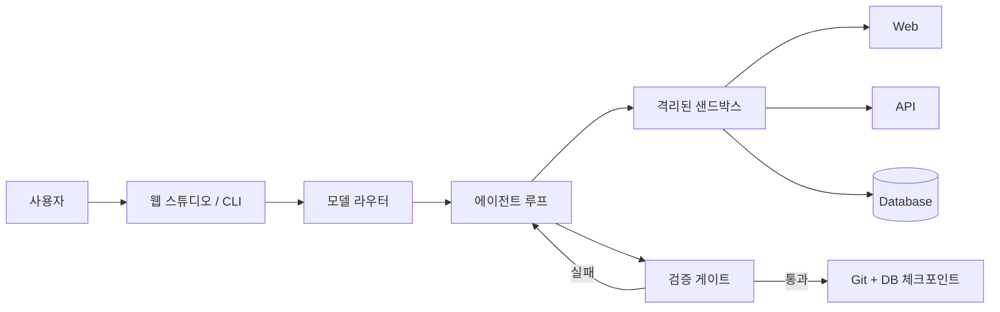

# b-studio

[](https://github.com/dj258255/b-studio/actions/workflows/ci.yml)

> 사내 API와 정책 위에서 프론트엔드와 백엔드를 함께 만들고, 실제 실행 결과로 검증하는 AI 앱 빌더

b-studio는 `studio.yaml`로 정의한 서비스를 격리된 샌드박스에 띄우고, AI가 바꾼 코드를 재시작·준비 상태·OpenAPI 계약으로 검증합니다. Next.js 화면뿐 아니라 Spring Boot·FastAPI 백엔드와 PostgreSQL까지 한 작업 흐름에서 다룹니다.


## 핵심 특징

- **실제 서버 런타임**: 브라우저 모의 환경이 아니라 Docker 또는 Kubernetes에서 실제 개발 서버를 실행합니다.
- **검증 게이트**: 모델의 완료 선언 대신 서비스 재시작, HTTP 준비 상태, OpenAPI 호환성으로 완료를 판정합니다.
- **안전한 체크포인트**: 검증을 통과한 변경과 데이터베이스 상태만 남기고, 실패하거나 취소한 변경은 되돌립니다.
- **정책과 격리**: 자원 한도, 네트워크 허용 목록, 시크릿 가림, 사내 API 정책 프록시를 프로젝트 설정으로 적용합니다.
- **로컬 또는 API 실행**: API 키뿐 아니라 개인 PC에 로그인된 `claude` CLI 계정으로도 실행할 수 있습니다.
- **멀티 모델과 Agent Fleet**: Anthropic·OpenAI 호환 API·Gemini를 공통 도구 계약으로 실행하고, 2~4개의 독립 결과를 비교할 수 있습니다.

## 빠른 시작

### 준비물

- Node.js 22 이상
- pnpm 10.29.3
- Docker Desktop 또는 Colima
- 에이전트를 실행하려면 `ANTHROPIC_API_KEY` 또는 로그인된 Claude Code CLI

### 설치와 실행

```bash
git clone https://github.com/dj258255/b-studio.git
cd b-studio
corepack enable
pnpm install
pnpm studio up examples/orders
```

준비가 끝나면 터미널에 웹 미리보기와 OpenAPI 주소가 표시됩니다. `Ctrl+C`를 누르면 b-studio가 컨테이너와 샌드박스 전용 볼륨을 정리합니다.

웹 스튜디오는 별도 터미널에서 실행합니다.

```bash
# 모델 호출 없이 UI와 전체 흐름 확인
pnpm studio:demo

# 이 PC의 Claude Code 로그인 사용
pnpm studio:local
```

기본 주소는 `http://127.0.0.1:3000`입니다.

### CLI로 에이전트 실행

```bash
# Anthropic API
ANTHROPIC_API_KEY=... pnpm studio agent examples/orders "주문 목록에 상태 필터를 추가해 줘"

# 개인 PC의 Claude Code 로그인
pnpm studio agent examples/orders "주문 목록에 상태 필터를 추가해 줘" \
  --backend claude-code
```

계약을 의도적으로 깨는 작업은 요청 내용에 그 의도가 드러나야 하며 `--allow-breaking`도 함께 지정해야 합니다.

```bash
pnpm studio agent examples/orders \
  "더 이상 쓰지 않는 legacy 필드를 삭제해 줘" \
  --allow-breaking
```

설치, 인증, 첫 실행에서 막히면 [시작하기](docs/getting-started.md)를 확인하세요.

## 작동 방식



1. `@b-studio/spec`이 `studio.yaml`과 `compose.yaml`의 일관성을 확인합니다.
2. `@b-studio/sandbox`가 서비스별 격리 환경과 edge 프록시를 만듭니다.
3. `@b-studio/agent`가 제한된 파일·명령·HTTP 도구로 작업합니다.
4. 검증 게이트가 바뀐 서비스를 재시작하고 준비 상태와 API 계약을 확인합니다.
5. 통과한 파일과 DB 상태만 체크포인트로 저장합니다.

구조와 경계는 [아키텍처 문서](docs/architecture.md), 선택의 근거는 [ADR](docs/decisions.md)에 정리되어 있습니다.

## 프로젝트 구성

```text
b-studio/
├── apps/
│   ├── cli/                  # studio up · agent · deploy · auth
│   └── studio/               # Next.js 웹 스튜디오
├── packages/
│   ├── spec/                 # studio.yaml 스키마와 로더
│   ├── sandbox/              # Docker/Kubernetes 샌드박스와 정책 경계
│   └── agent/                # 에이전트 루프, 도구, 모델, 검증 게이트
├── templates/                # Next.js · Spring Boot · FastAPI 원본
├── examples/orders/          # web + api + PostgreSQL 예제
├── config/                   # 모델 레지스트리 예시
└── docs/                     # 사용자·운영·설계 문서
```

## 주요 명령

| 명령 | 용도 |
|---|---|
| `pnpm studio up <path>` | 프로젝트를 샌드박스에서 실행 |
| `pnpm studio agent <path> "<request>"` | 에이전트에게 변경 요청 |
| `pnpm studio deploy <path>` | 운영 이미지를 만들고 고정 주소로 전환 |
| `pnpm studio deploy <path> --status` | 현재 배포와 릴리스 상태 확인 |
| `pnpm studio deploy <path> --rollback <id>` | 이전 릴리스로 롤백 |
| `pnpm studio auth token <name>` | 웹 스튜디오 token 모드용 토큰 생성 |
| `pnpm test` | 단위 테스트 실행 |
| `pnpm typecheck` | 전체 워크스페이스 타입 검사 |

전체 옵션과 운영 절차는 [운영 가이드](docs/operations.md)에 있습니다.

## `studio.yaml` 최소 예시

```yaml
version: 1
name: orders

services:
  web:
    source: managed
    template: nextjs
    path: web
    port: 3000
    preview: browser
    ready: { path: /, timeoutSeconds: 300 }

  api:
    source: managed
    template: spring-boot
    path: api
    port: 8080
    preview: openapi
    ready: { path: /actuator/health/readiness, timeoutSeconds: 900 }
    contract: { extract: /v3/api-docs }

databases:
  db: { engine: postgres, database: app, user: app }

resources:
  web: { memory: 1g, cpus: 2 }
  api: { memory: 1536m, cpus: 2 }
  db: { memory: 256m }
```

managed/external 서비스, 네트워크 정책, 시크릿, 스냅샷, 배포 설정은 [`studio.yaml` 레퍼런스](docs/configuration.md)를 참고하세요.

## 구현 상태

| 영역 | 상태 |
|---|---|
| 프로젝트 명세 · Docker 샌드박스 · CLI | 완료 |
| Plan → Code → Run → Verify 에이전트 루프 | 완료 |
| 웹 스튜디오 · 미리보기 · API 탐색기 · 로그 | 완료 |
| Git/DB 체크포인트 · 세션 복구 · 원격 저장소 연동 | 완료 |
| 자원 한도 · 네트워크 격리 · 시크릿 · 정책 프록시 | 완료 |
| gVisor · Kubernetes 제공자 | 구현 및 로컬 클러스터 검증 |
| 멀티 모델 라우터 · Agent Fleet | 완료 |

검증 범위와 알려진 한계는 [검증 기록](docs/verification.md)에 구분해 적었습니다.

## 문서

- [문서 안내](docs/README.md)
- [시작하기](docs/getting-started.md)
- [`studio.yaml` 설정](docs/configuration.md)
- [아키텍처](docs/architecture.md)
- [운영과 배포](docs/operations.md)
- [검증 기록과 한계](docs/verification.md)
- [설계 결정 기록](docs/decisions.md)
- [트러블슈팅](docs/troubleshooting.md)
- [기여 가이드](CONTRIBUTING.md)
- [보안 정책](SECURITY.md)
- [GitHub Wiki](https://github.com/dj258255/b-studio/wiki)

## 개발

```bash
pnpm install
pnpm test
pnpm typecheck
pnpm --filter @b-studio/studio lint
pnpm --filter @b-studio/studio build
```

기능 변경에는 관련 테스트와 문서 수정을 함께 포함해 주세요. 샌드박스·네트워크·시크릿·인증 경계를 바꾸는 변경은 [보안 정책](SECURITY.md)과 관련 ADR도 확인해야 합니다.

## 라이선스

현재 저장소에는 별도 라이선스가 선언되어 있지 않습니다. 사용·배포 조건이 필요하면 저장소 소유자에게 문의해 주세요.
