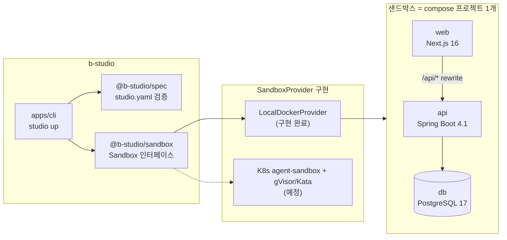
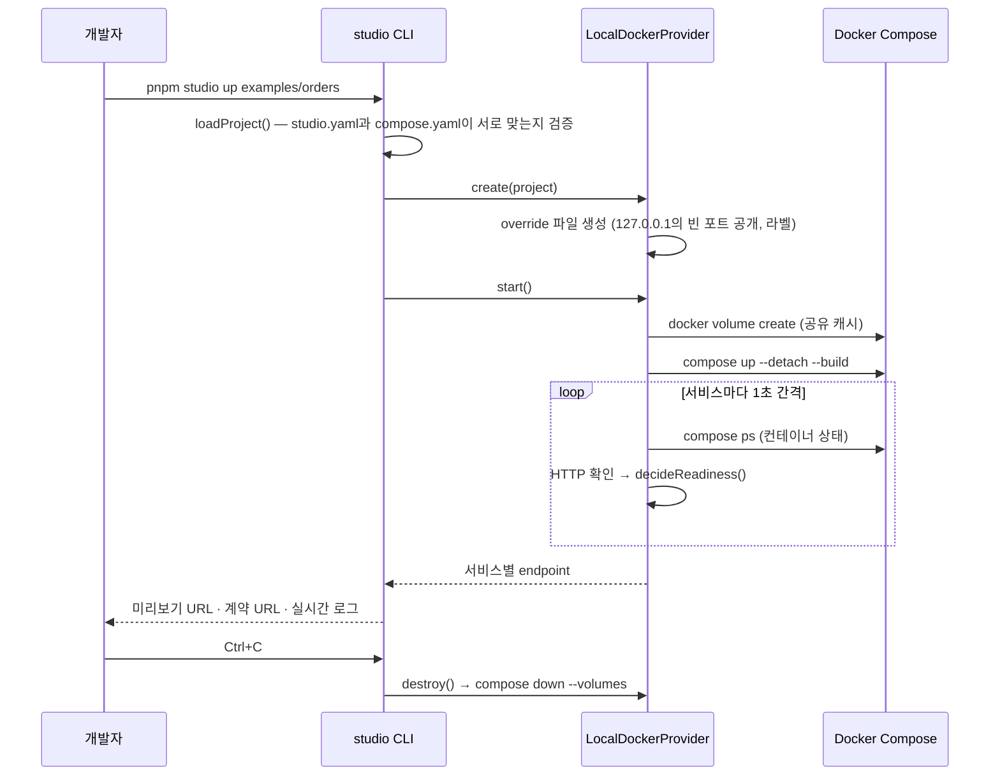

# b-studio

> 사내 API와 정책 위에서 **프론트엔드와 백엔드를 함께 만들고, 바로 실행해 확인하는 AI 앱 빌더**

`studio.yaml` 한 파일로 서비스를 정의하면, `pnpm studio up` 한 번으로 **Next.js 16 + Spring Boot 4.1 + PostgreSQL 17**이 격리된 샌드박스에서 함께 뜹니다. 준비 상태 판정, 로그 스트리밍, 미리보기 URL과 OpenAPI 계약 주소 안내, 종료 시 정리까지 CLI가 처리합니다.

| 단계 | 상태 |
|---|---|
| 1. 런타임 코어 (프로젝트 명세 · 샌드박스 · 템플릿 · CLI) | ✅ 완료 |
| 2. 에이전트 루프 (Plan → Code → Run → Verify) | ⏳ 다음 단계 |
| 3. 스튜디오 UI · DB 브랜치 · 정책 프록시 | 📋 계획 |

---

## 왜 만들었나

토스는 사내 어드민을 AI로 만드는 도구 **TOI studio**를 공개했습니다([AI가 만든 코드가 어드민이 되기까지](https://toss.tech/article/52885)). 반년 만에 프로젝트 439개, 페이지 2,418개가 만들어졌습니다. 핵심은 두 가지였습니다.

1. **정책은 플랫폼이 강제한다.** API를 등록하면 서버 프록시가 마스킹, 감사 로그, 암호화를 자동으로 적용합니다.
2. **화면은 AI가 만들고 브라우저에서 바로 보여 준다.** esbuild-wasm과 가상 파일 시스템으로 첫 화면을 47초에서 1.3초로 줄였습니다.

다만 TOI의 브라우저 런타임은 **클라이언트에서만 도는 React SPA**에 맞춘 구조입니다. 이 프로젝트의 요구사항은 달랐습니다.

| 요구사항 | TOI 방식으로 어려운 이유 |
|---|---|
| Next.js 같은 **서버 런타임이 필요한 프레임워크** 지원 | RSC, SSR, Server Action, Route Handler는 Node 서버와 네이티브 컴파일러(SWC/Turbopack)가 필요함 |
| **백엔드(Spring, Python)까지 생성** | 브라우저에서 JVM과 DB를 돌릴 수 없음 |
| 사내 도구로 **사내망에서 운영** | 외부 SaaS 샌드박스에 코드와 데이터를 보낼 수 없는 환경이 있음 |

그래서 **실제 Linux 환경에서 실제 `next dev`와 `gradlew bootRun`을 실행하는 서버 샌드박스**를 기반으로 설계했습니다. 선택지 비교와 근거는 [설계 결정 기록](docs/decisions.md)에 정리했습니다.

## 아키텍처



### `studio up`이 하는 일



## 핵심 설계 결정

| 결정 | 이유 | 기록 |
|---|---|---|
| 브라우저 번들러 대신 **서버 샌드박스** | Next.js 서버 기능과 백엔드까지 로컬과 똑같이 실행하기 위해 | [ADR-001](docs/decisions.md#adr-001-미리보기-런타임-브라우저-번들러-대신-서버-샌드박스) |
| **구조는 통합, 작업 화면은 분리** | 프론트·백엔드·풀스택·기존 API 연동을 하나의 모델로 표현하기 위해 | [ADR-002](docs/decisions.md#adr-002-프로젝트-모델-구조는-통합-작업-화면은-분리) |
| 계약(OpenAPI)은 **코드에서 추출하는 선택 사항** | 백엔드 개발자의 코드 우선 작업 방식과 Next.js 단일 서비스 풀스택을 존중하기 위해 | [ADR-003](docs/decisions.md#adr-003-계약은-코드에서-추출하는-선택-사항) |
| **compose + OpenAPI 표준 위에 얇은 `studio.yaml`** | 도구를 쓰지 않아도 `docker compose up`으로 똑같이 돌아가게 하기 위해 | [ADR-004](docs/decisions.md#adr-004-새-dsl을-만들지-않는다-compose--openapi-위의-얇은-층) |
| **샌드박스 제공자 추상화**, 로컬 Docker부터 | 사내 Kubernetes·강한 격리 런타임으로 구현만 바꾸기 위해 | [ADR-006](docs/decisions.md#adr-006-샌드박스-제공자를-추상화하고-로컬-docker부터-구현) |

## 프로젝트 구조

```
b-studio/
├─ packages/
│  ├─ spec/           studio.yaml 스키마(zod 4)와 로더. compose 파일과 서로 맞는지 검증
│  └─ sandbox/        Sandbox/SandboxProvider 인터페이스, 준비 판정, LocalDockerProvider
├─ apps/
│  └─ cli/            studio up — 기동, 준비 확인, 로그 스트리밍, 종료 시 정리
├─ templates/         새 서비스의 원본 (각각 개발용 Dockerfile과 lockfile 포함)
│  ├─ nextjs-web/     Next.js 16.3 · React 19 · Tailwind 4
│  ├─ spring-boot-api/ Spring Boot 4.1 · Java 25 · JPA · Flyway · springdoc 3.1
│  └─ fastapi-api/    FastAPI 0.141 · Python 3.14 · SQLAlchemy · uv
├─ examples/
│  └─ orders/         web + api + db 예제 프로젝트
└─ docs/
   ├─ decisions.md    설계 결정 기록 (ADR)
   └─ troubleshooting.md  실행하며 발견하고 해결한 문제
```

## 실행 방법

**필요한 것:** Node.js 22 이상, pnpm 10, Docker (Compose v2)

```bash
pnpm install
pnpm test                          # 단위 테스트
pnpm typecheck                     # 패키지 전체 타입 체크
pnpm studio up examples/orders     # 샌드박스 기동 (Ctrl+C로 종료하면 정리)
```

실제 출력 (일부):

```
studio │ orders 샌드박스를 시작합니다 (studio-orders-9fbfc3)
web    │ 이미지를 빌드하고 시작합니다
api    │ 이미지를 빌드하고 시작합니다
web    │ 준비 확인: UND_ERR_SOCKET (컨테이너 running)
web    │ 준비 확인: HTTP 200 (컨테이너 running)
web    │ 준비 완료 → http://127.0.0.1:32768
api    │ ... Started ApiApplication in 2.402 seconds
api    │ 준비 확인: HTTP 200 (컨테이너 running)
api    │ 준비 완료 → http://127.0.0.1:32769

  web          browser  http://127.0.0.1:32768
  api          openapi  http://127.0.0.1:32769  계약: http://127.0.0.1:32769/v3/api-docs

studio │ Ctrl+C로 종료합니다
```

## `studio.yaml`

실행 방법은 표준 `compose.yaml`에 두고, `studio.yaml`에는 스튜디오에만 필요한 정보만 적습니다.

```yaml
version: 1
name: orders

services:
  web:
    source: managed        # 스튜디오가 코드를 만들고 샌드박스에서 실행
    template: nextjs
    path: web
    port: 3000
    preview: browser       # iframe 미리보기
    ready: { path: /, timeoutSeconds: 300 }

  api:
    source: managed
    template: spring-boot
    path: api
    port: 8080
    preview: openapi       # API 탐색기
    ready: { path: /actuator/health/readiness, timeoutSeconds: 900 }
    contract: { extract: /v3/api-docs }   # 실행 중인 서버에서 OpenAPI 추출

  # 이미 운영 중인 API는 등록만 한다 (TOI 방식)
  # legacy-users:
  #   source: external
  #   baseUrl: https://users.internal.example.com
```

`loadProject()`는 명세만 검사하지 않고 **두 파일이 서로 맞는지도** 검증합니다. managed 서비스가 compose에 없거나, external 서비스가 compose에 들어 있으면 필드 경로와 함께 에러를 알려 줍니다.

## 검증 결과

로컬 환경(macOS, colima, Docker 27)에서 직접 실행해 확인한 내용입니다.

| 항목 | 결과 |
|---|---|
| 웹 `/` | HTTP 200 |
| 웹 `/api/ping` → Next rewrite → Spring | `{"message":"pong"}` |
| API readiness | `{"status":"UP"}` |
| OpenAPI 계약 추출 | `/v3/api-docs`에서 OpenAPI 3.1.0, `paths: ['/api/ping']` |
| 포트 공개 범위 | `127.0.0.1`의 빈 포트에만 공개 (같은 네트워크에서 접근 불가) |
| Ctrl+C 신호가 여러 번 들어올 때 | 정리가 끝까지 완료됨 (tsx와 node에 SIGINT를 동시에 보내 재현) |
| 종료 후 정리 | 컨테이너 0개, 샌드박스 볼륨 0개. 공유 캐시 볼륨(Gradle, pnpm)은 유지 |
| 두 번째 기동 | 늦어도 43초 안에 두 서비스 모두 준비 완료 |
| 단위 테스트 / 타입 체크 | 19개 통과 / 패키지 3개 통과 |

## 트러블슈팅

실행하면서 발견한 문제와 해결 과정은 [docs/troubleshooting.md](docs/troubleshooting.md)에 정리했습니다.

- **Ctrl+C 한 번에 신호가 여러 번 들어와 정리가 중간에 끊길 수 있는 문제**: `process.once` 대신 멱등한 정리 함수로 해결
- **Next dev 첫 요청 컴파일 때문에 준비 확인이 시간 초과되는 현상**: 기동 중 에러와 진짜 실패를 구분하는 판정 규칙으로 해결
- **캐시를 공유해도 두 번째 기동이 크게 빨라지지 않는 이유**: 샌드박스 전용 `node_modules` 볼륨이 원인이며, lockfile 해시 기반 스냅샷을 다음 과제로 정함

## 로드맵

- [x] **런타임 코어**: 프로젝트 명세, 샌드박스 추상화, 로컬 Docker 제공자, 템플릿 3종, CLI
- [ ] **에이전트 루프**: "필드 하나 추가해줘" → Flyway 마이그레이션, 엔티티, API, 화면을 한 번에 수정 → 재시작 → OpenAPI 대조 검증
- [ ] **스튜디오 UI**: 채팅, 미리보기 iframe, API 탐색기, 로그 타임라인
- [ ] **데이터**: 세션별 DB 브랜치, 운영 DB 접근 차단, 시크릿 주입
- [ ] **정책 프록시**: 사내 API 등록, 마스킹, 감사 로그, 서비스 단위 권한
- [ ] **격리 강화**: Kubernetes agent-sandbox + gVisor/Kata 제공자
- [ ] **기동 최적화**: lockfile 해시별로 의존성 설치가 끝난 스냅샷 재사용

## 기술 스택

| 영역 | 사용 기술 |
|---|---|
| 스튜디오 코어 | TypeScript, Node.js 22, pnpm workspace, zod 4, yaml, Vitest 5, tsx |
| 샌드박스 | Docker Compose v2 (override 파일, external 볼륨, 루프백 포트 공개) |
| 템플릿 | Next.js 16.3, React 19, Tailwind 4 / Spring Boot 4.1, Java 25, Gradle 9, Flyway, springdoc-openapi 3.1 / FastAPI, Python 3.14, uv |
| 데이터 | PostgreSQL 17 |

## 참고 자료

- [AI가 만든 코드가 어드민이 되기까지 — 토스 테크](https://toss.tech/article/52885)
- [WebContainers 상용 라이선스](https://webcontainers.io/enterprise) · [Next.js Turbopack wasm 바인딩 이슈 #70522](https://github.com/vercel/next.js/issues/70522)
- [Sandpack/Nodebox FAQ](https://sandpack.codesandbox.io/docs/resources/faq)
- [Replit 개발/운영 DB 분리](https://docs.replit.com/features/data-and-storage/development-and-production)
- [Kubernetes agent-sandbox](https://github.com/kubernetes-sigs/agent-sandbox)
- [Vercel Sandbox](https://vercel.com/docs/sandbox)
