# b-studio

> 사내 API와 정책 위에서 **프론트엔드와 백엔드를 함께 만들고, 바로 실행해 확인하는 AI 앱 빌더**

`studio.yaml` 한 파일로 서비스를 정의하면, `pnpm studio up` 한 번으로 **Next.js 16 + Spring Boot 4.1 + PostgreSQL 17**이 격리된 샌드박스에서 함께 뜹니다. 준비 상태 판정, 로그 스트리밍, 미리보기 URL과 OpenAPI 계약 주소 안내, 종료 시 정리까지 CLI가 처리합니다.

`pnpm studio agent`는 요청을 Claude에게 맡깁니다. 에이전트가 "끝났다"고 해도 **스튜디오가 직접 바뀐 서비스를 재시작하고, 준비 상태와 API 계약을 확인해 통과해야만** 완료로 봅니다. API 키가 없어도 **본인 PC의 `claude` CLI에 로그인한 계정으로** 같은 흐름을 실행할 수 있습니다(개인 PC 전용).

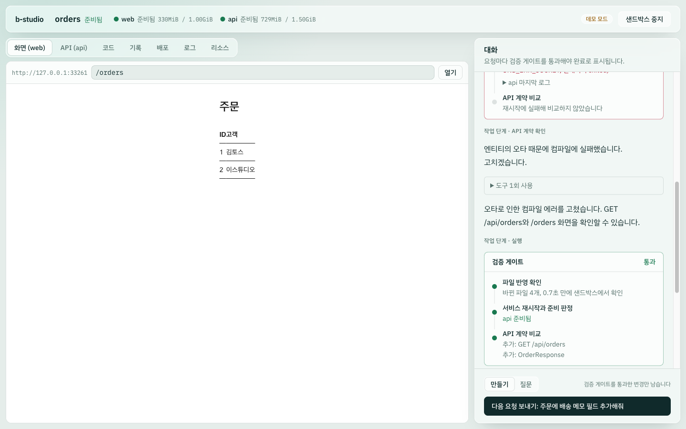

| 단계 | 상태 |
|---|---|
| 1. 런타임 코어 (프로젝트 명세 · 샌드박스 · 템플릿 · CLI) | ✅ 완료 |
| 2. 에이전트 루프 (Plan → Code → Run → Verify) | ✅ 구현 · 스크립트 모델과 실제 모델(로컬 로그인 계정)로 실제 Docker에서 검증 (API 키 경로는 인증 정보 필요) |
| 3. 웹 스튜디오 (대화 · 미리보기 · API 탐색기 · 로그) | ✅ 구현 · 데모 모드와 로컬 로그인 계정 모드로 실제 브라우저에서 검증 |
| 4. 세션 체크포인트 (통과한 변경만 남기기 · 되돌리기) | ✅ 구현 · 데모 모드로 실제 브라우저에서 검증 |
| 5. 로컬 로그인 계정으로 실행 (API 키 없이 개인 PC에서) | ✅ 구현 · CLI와 웹 스튜디오에서 실제 모델로 검증 |
| 6. 원격 저장소 연동 (세션 브랜치 · 덮어쓰지 않는 푸시 · PR) | ✅ 구현 · 실제 git 원격과 Gitea PR API로 브라우저에서 검증 (GitHub·GitLab API는 가짜 서버 테스트) |
| 7. DB 브랜치 (체크포인트마다 DB 상태를 함께 저장·복원) | ✅ 구현 · 데모 시나리오로 실제 Docker에서 검증 |
| 8. 자원 한도와 사용량 표시 | ✅ 구현 · 실제 Docker와 브라우저에서 검증 |
| 9. 데이터 보호 · 정책 프록시 · 격리 강화 | 📋 계획 |

---

## 왜 만들었나

토스는 사내 어드민을 AI로 만드는 도구 **TOI studio**를 공개했습니다([AI가 만든 코드가 어드민이 되기까지](https://toss.tech/article/52885)). 반년 만에 프로젝트 439개, 페이지 2,418개가 만들어졌습니다. 핵심은 두 가지였습니다.

1. **정책은 플랫폼이 강제한다.** API를 등록하면 서버 프록시가 마스킹, 감사 로그, 암호화를 자동으로 적용합니다.
2. **화면은 AI가 만들고 브라우저에서 바로 보여 준다.** esbuild-wasm과 가상 파일 시스템으로 첫 화면을 47초에서 1.3초로 줄였습니다.

다만 TOI의 브라우저 런타임은 **클라이언트에서만 도는 React SPA**에 맞춘 구조입니다. 이 프로젝트의 요구사항은 달랐습니다.

| 요구사항 | TOI 방식으로 어려운 이유 |
|---|---|
| Next.js 같은 **서버 런타임이 필요한 프레임워크** 지원 | RSC, SSR, Server Action, Route Handler는 Node 서버와 네이티브 컴파일러(SWC/Turbopack)가 필요함 |
| **백엔드(Spring, Python)까지 생성** | 브라우저에서 JVM과 DB를 돌릴 수 없음 |
| 사내 도구로 **사내망에서 운영** | 외부 SaaS 샌드박스에 코드와 데이터를 보낼 수 없는 환경이 있음 |

그래서 **실제 Linux 환경에서 실제 `next dev`와 `gradlew bootRun`을 실행하는 서버 샌드박스**를 기반으로 설계했습니다. 선택지 비교와 근거는 [설계 결정 기록](docs/decisions.md)에 정리했습니다.

## 아키텍처

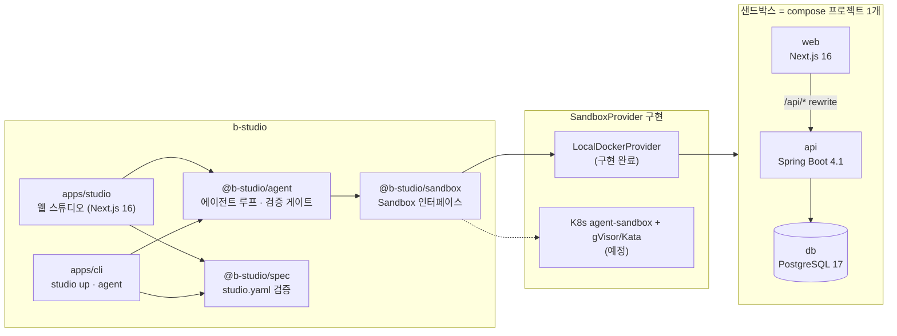

### `studio up`이 하는 일

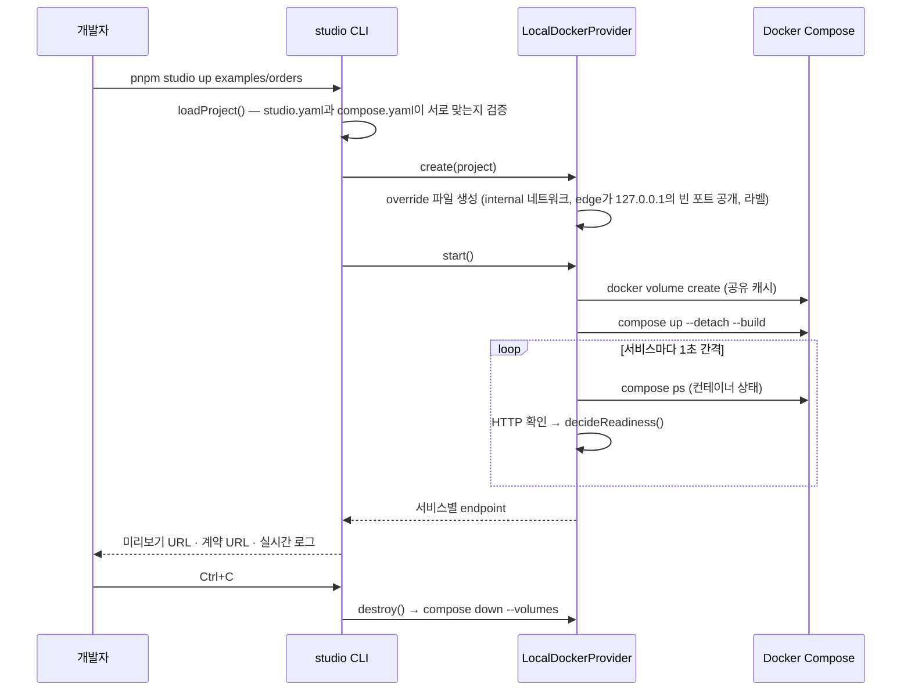

## 핵심 설계 결정

| 결정 | 이유 | 기록 |
|---|---|---|
| 브라우저 번들러 대신 **서버 샌드박스** | Next.js 서버 기능과 백엔드까지 로컬과 똑같이 실행하기 위해 | [ADR-001](docs/decisions.md#adr-001-미리보기-런타임-브라우저-번들러-대신-서버-샌드박스) |
| **구조는 통합, 작업 화면은 분리** | 프론트·백엔드·풀스택·기존 API 연동을 하나의 모델로 표현하기 위해 | [ADR-002](docs/decisions.md#adr-002-프로젝트-모델-구조는-통합-작업-화면은-분리) |
| 계약(OpenAPI)은 **코드에서 추출하는 선택 사항** | 백엔드 개발자의 코드 우선 작업 방식과 Next.js 단일 서비스 풀스택을 존중하기 위해 | [ADR-003](docs/decisions.md#adr-003-계약은-코드에서-추출하는-선택-사항) |
| **compose + OpenAPI 표준 위에 얇은 `studio.yaml`** | 도구를 쓰지 않아도 `docker compose up`으로 똑같이 돌아가게 하기 위해 | [ADR-004](docs/decisions.md#adr-004-새-dsl을-만들지-않는다-compose--openapi-위의-얇은-층) |
| **샌드박스 제공자 추상화**, 로컬 Docker부터 | 사내 Kubernetes·강한 격리 런타임으로 구현만 바꾸기 위해 | [ADR-006](docs/decisions.md#adr-006-샌드박스-제공자를-추상화하고-로컬-docker부터-구현) |
| **직접 작성한 루프 + 스튜디오 검증 게이트** | 모델이 "끝났다"고 해도 재시작·준비 판정·계약 비교를 통과해야 완료로 보기 위해 | [ADR-010](docs/decisions.md#adr-010-에이전트-루프-직접-작성한-루프와-스튜디오-검증-게이트) |
| **bash 대신 행동별 도구** | 경로 제한, 덮어쓰기 충돌 방지, 바뀐 파일 기록을 강제하기 위해 | [ADR-011](docs/decisions.md#adr-011-도구-설계-bash-하나-대신-행동별-도구) |
| **계약 호환 깨짐은 기본 차단** | 요청하지 않은 필드 삭제·타입 변경이 운영 중인 화면을 깨뜨리지 않게 하기 위해 | [ADR-013](docs/decisions.md#adr-013-계약-호환-정책-기본은-차단-요청이-명시할-때만-허용) |
| **재시작 전 파일 반영 확인** | 파일 공유 캐시 때문에 게이트가 옛 코드를 검증하는 일을 막기 위해 | [ADR-014](docs/decisions.md#adr-014-재시작-전에-샌드박스가-바뀐-파일을-보는지-확인한다) |
| **Next.js 단일 앱 + Server-Sent Events** | 오래 걸리는 샌드박스·에이전트 작업의 진행 상황을 한 프로세스에서 실시간으로 보내기 위해 | [ADR-015](docs/decisions.md#adr-015-스튜디오-서버-nextjs-단일-앱과-server-sent-events) |
| **작업 복사본을 Git 체크포인트로 관리** | "완료로 인정하지 않음"을 넘어 실패한 변경이 실제로 남지 않게 하기 위해 | [ADR-018](docs/decisions.md#adr-018-세션-체크포인트-검증을-통과한-변경만-남긴다) |
| **로컬 로그인 계정 모드는 명시적으로 켜고, 기본 도구를 모두 끔** | 로그인 흐름 없이 본인 PC에서만 쓰고, 모델이 샌드박스와 작업 공간 규칙을 우회하지 못하게 하기 위해 | [ADR-019](docs/decisions.md#adr-019-로컬-로그인-계정으로-실행-api-키-없이-개인-pc에서만) |
| **컨테이너 런타임은 운영자가 환경 변수로 고르고, gVisor는 `--network=host`로 모든 서비스와 edge에 적용** | 에이전트 코드가 호스트 커널을 직접 쓰지 않게 하되, 프로젝트가 격리 수준을 낮출 수 없게 하고 서비스 이름으로 하는 연결을 유지하기 위해 | [ADR-027](docs/decisions.md#adr-027-격리-강화-운영자가-고르는-컨테이너-런타임과-gvisor) |
| **사내 API는 edge의 별칭으로만 부르고, 요청 IP로 호출한 서비스를 확인하고, 스튜디오 쪽 호출은 edge 안에서 실행** | 인증 값과 운영 개인정보를 샌드박스 코드·모델 대화에서 떼어 놓고, 스튜디오용 포트로 서비스가 권한을 사칭하지 못하게 하기 위해 | [ADR-026](docs/decisions.md#adr-026-정책-프록시-사내-api는-edge를-거쳐서만-부른다) |
| **시크릿 값은 compose 프로세스 환경으로만 넘기고, 나오는 모든 출력에서 가리고, 파일에 들어가면 커밋 거부** | 에이전트는 명령 출력·로그·응답을 모델에게 그대로 보내고 체크포인트는 PR로 올라가므로, 한 번의 `printenv`나 파일 쓰기로 값이 대화 기록과 저장소에 영구히 남지 않게 하기 위해 | [ADR-025](docs/decisions.md#adr-025-시크릿-주입과-가림-값은-보이지-않게-넣고-새는-경로를-막는다) |
| **모든 서비스를 internal 네트워크에 두고 edge 컨테이너 하나로만 출입** | 연결 문자열을 숨기는 것만으로는 에이전트 코드가 운영 DB·사내망에 닿는 경로를 막을 수 없어서. 패키지 저장소처럼 허용한 호스트만 HTTP(S) 프록시로 통과시키고 모두 감사 로그로 남기기 위해 | [ADR-024](docs/decisions.md#adr-024-네트워크-격리-샌드박스의-출입구를-하나로-만든다) |
| **측정으로 정한 컨테이너 한도와 판단용 사용량 표시** | 한 세션이 VM 자원을 다 쓰지 않게 하고, 메모리 부족 종료를 코드 문제로 오해하지 않게 하기 위해 | [ADR-023](docs/decisions.md#adr-023-자원-한도와-사용량-한도를-걸고-판단에-필요한-수치만-보여-준다) |
| **체크포인트마다 DB 덤프, 되돌릴 때 같은 시점으로 복원** | 파일만 되돌리면 이미 적용된 마이그레이션이 남아 코드와 스키마가 달라지기 때문에 | [ADR-022](docs/decisions.md#adr-022-데이터베이스-브랜치-체크포인트마다-db-상태를-함께-남긴다) |
| **입력 파일 해시로 찾는 스냅샷 볼륨, 측정으로 켤 볼륨 결정** | 도구의 설치 단계는 그대로 두어 결과를 틀리게 만들지 않으면서, 실제 병목에만 기동 비용을 줄이기 위해 | [ADR-021](docs/decisions.md#adr-021-기동-최적화-입력-파일-해시로-찾는-스냅샷-볼륨) |
| **원본 저장소를 복제한 세션 브랜치 + 마지막으로 올린 커밋 기준 lease 푸시** | 체크포인트를 그대로 PR로 넘기고, 되돌린 기록은 반영하되 리뷰어 커밋은 덮어쓰지 않기 위해 | [ADR-020](docs/decisions.md#adr-020-원격-저장소-연동-세션-브랜치와-덮어쓰지-않는-푸시) |

## 프로젝트 구조

```
b-studio/
├─ packages/
│  ├─ spec/           studio.yaml 스키마(zod 4)와 로더. compose 파일과 서로 맞는지 검증
│  ├─ sandbox/        Sandbox/SandboxProvider 인터페이스, 준비 판정, 파일 반영 확인, LocalDockerProvider
│  └─ agent/          에이전트 루프, 도구, 작업 공간 안전장치, 검증 게이트, 계약 비교, Claude·스크립트 클라이언트, 로컬 CLI 실행기, 체크포인트·원격 저장소 연동
├─ apps/
│  ├─ cli/            studio up · studio agent — 샌드박스 수명 주기, 에이전트 실행, 로그 스트리밍
│  └─ studio/         웹 스튜디오 (Next.js 16) — 세션 관리자, SSE, 대화 · 미리보기 · API 탐색기 · 로그
├─ templates/         새 서비스의 원본 (각각 개발용 Dockerfile과 lockfile 포함)
│  ├─ nextjs-web/     Next.js 16.3 · React 19 · Tailwind 4
│  ├─ spring-boot-api/ Spring Boot 4.1 · Java 25 · JPA · Flyway · springdoc 3.1
│  └─ fastapi-api/    FastAPI 0.141 · Python 3.14 · SQLAlchemy · uv
├─ examples/
│  └─ orders/         web + api + db 예제 프로젝트
└─ docs/
   ├─ decisions.md    설계 결정 기록 (ADR)
   └─ troubleshooting.md  실행하며 발견하고 해결한 문제
```

## 실행 방법

**필요한 것:** Node.js 22 이상, pnpm 10, Docker (Compose v2)

```bash
pnpm install
pnpm test                          # 단위 테스트
pnpm typecheck                     # 패키지 전체 타입 체크
pnpm studio up examples/orders     # 샌드박스 기동 (Ctrl+C로 종료하면 정리)
pnpm e2e:agent                     # 스크립트 모델로 에이전트 루프 전체를 실제 Docker에서 검증 (API 키 불필요)
pnpm bench:boot examples/orders 3  # 샌드박스를 세 번 띄워 기동 단계별 시간 측정
pnpm studio:demo                   # 웹 스튜디오를 데모 모드로 실행 (http://127.0.0.1:3000, API 키 불필요)

# Claude API 인증 정보가 있을 때
export ANTHROPIC_API_KEY=...
pnpm studio agent examples/orders "주문에 배송 메모 필드 추가해줘"
pnpm studio agent examples/orders "메모 필드를 응답에서 제거해줘" --allow-breaking   # 호환 깨짐을 명시적으로 허용

# API 키 없이, 이 PC의 claude CLI에 로그인한 계정으로 (개인 PC 전용)
pnpm studio agent examples/orders "현재 서버 시각을 돌려주는 GET /api/time 엔드포인트를 추가해줘" --backend claude-code
pnpm studio:local                  # 웹 스튜디오를 로컬 로그인 계정 모드로 실행
```

**원본 프로젝트가 Git 저장소면** 세션이 커밋된 상태를 복제해 `b-studio/<프로젝트>-<세션>` 브랜치에서 시작합니다. 기록 탭에서 체크포인트를 원격 브랜치로 올리고 PR을 만들 수 있습니다.

```bash
export B_STUDIO_PROJECTS_DIR=~/work/projects   # 프로젝트 폴더들이 있는 곳. 각 폴더가 Git 저장소면 원격 연동이 켜짐
export B_STUDIO_GITHUB_TOKEN=...               # PR을 API로 만들 때. GitLab은 B_STUDIO_GITLAB_TOKEN, Gitea는 B_STUDIO_GITEA_TOKEN
export B_STUDIO_GIT_PROVIDER=gitlab            # 사내 호스트는 주소만으로 종류를 알 수 없으므로 지정 (github | gitlab | gitea)
export B_STUDIO_GIT_AUTHOR_NAME=... B_STUDIO_GIT_AUTHOR_EMAIL=...   # 저장소가 커밋 작성자를 검사할 때
```

`studio.yaml`에 시크릿을 선언한 프로젝트는 값을 스튜디오 서버 쪽에 넣어야 샌드박스가 뜹니다. 프로젝트 폴더의 `.env`는 읽지 않습니다.

```bash
export B_STUDIO_SECRET_PAYMENT_API_KEY=...          # 시크릿 하나씩 (환경 변수가 파일보다 우선)
export B_STUDIO_SECRETS_FILE=~/.config/b-studio/orders.env   # 또는 KEY=VALUE 파일 (저장소 밖에 둘 것)
```

샌드박스를 gVisor로 한 번 더 격리하려면 Docker 데몬에 `runsc`를 등록하고 런타임 이름을 넘깁니다. `/etc/docker/daemon.json`에 다음처럼 적습니다. `--network=host`를 빼면 gVisor 안에서 서비스 이름(`db`, `b-studio-edge`)을 풀지 못합니다.

```json
{ "runtimes": { "runsc": { "path": "/usr/local/bin/runsc", "runtimeArgs": ["--network=host"] } } }
```

```bash
export B_STUDIO_CONTAINER_RUNTIME=runsc   # 데몬에 없는 런타임이면 샌드박스를 만들기 전에 등록된 런타임 목록과 함께 거부
```

푸시는 스튜디오 서버의 git 인증(SSH 에이전트, credential helper)을 그대로 씁니다. 토큰이 없으면 PR 작성 페이지 링크만 보여 줍니다. 설계 근거는 [ADR-020](docs/decisions.md#adr-020-원격-저장소-연동-세션-브랜치와-덮어쓰지-않는-푸시)에 있습니다.

로컬 로그인 계정 모드는 **사내 공유 서버에 배포하는 용도가 아닙니다.** Agent SDK 정책상 제3자 제품이 claude.ai 로그인을 제공할 수 없으므로, 스튜디오는 로그인 화면을 만들지 않고 이미 로그인된 본인 PC의 CLI만 사용합니다. 여러 사람이 쓰는 서버에서는 조직의 API 키로 기본(`api`) 모드를 쓰세요. 근거는 [ADR-019](docs/decisions.md#adr-019-로컬-로그인-계정으로-실행-api-키-없이-개인-pc에서만)에 있습니다.

실제 출력 (일부):

```
studio │ orders 샌드박스를 시작합니다 (studio-orders-9fbfc3)
web    │ 이미지를 빌드하고 시작합니다
api    │ 이미지를 빌드하고 시작합니다
web    │ 준비 확인: UND_ERR_SOCKET (컨테이너 running)
web    │ 준비 확인: HTTP 200 (컨테이너 running)
web    │ 준비 완료 → http://127.0.0.1:32768
api    │ ... Started ApiApplication in 2.402 seconds
api    │ 준비 확인: HTTP 200 (컨테이너 running)
api    │ 준비 완료 → http://127.0.0.1:32769

  web          browser  http://127.0.0.1:32768
  api          openapi  http://127.0.0.1:32769  계약: http://127.0.0.1:32769/v3/api-docs

studio │ Ctrl+C로 종료합니다
```

## 스튜디오 화면

`pnpm studio:demo`로 웹 스튜디오를 열면 프로젝트마다 샌드박스 세션을 시작할 수 있습니다. 왼쪽에는 샌드박스에서 실제로 돌고 있는 서비스가, 오른쪽에는 에이전트와의 대화가 보입니다.

| 영역 | 하는 일 |
|---|---|
| 화면 (web) | 샌드박스의 Next.js 앱을 iframe으로 보여 줍니다. 서비스가 재시작돼 포트가 바뀌어도 입력한 경로를 유지한 채 새 주소를 따라갑니다 |
| API (api) | 실행 중인 서버에서 추출한 OpenAPI로 엔드포인트와 스키마를 보여 주고, 스튜디오 서버를 거쳐 요청을 보냅니다 |
| 기록 | 검증을 통과한 요청마다 남은 체크포인트와 변경 내역을 보고, 이전 시점으로 되돌립니다 |
| 로그 | web, api, db 로그를 서비스별로 걸러 봅니다 |
| 리소스 | 컨테이너별 CPU·메모리와 한도 대비 사용률, 종료 이유(메모리 부족 종료 포함), 로그에서 뽑은 최근 단계를 5초마다 보여 줍니다 |
| 대화 | 요청, 에이전트 답변, 도구 사용 기록, **검증 게이트** 결과가 순서대로 쌓입니다 |

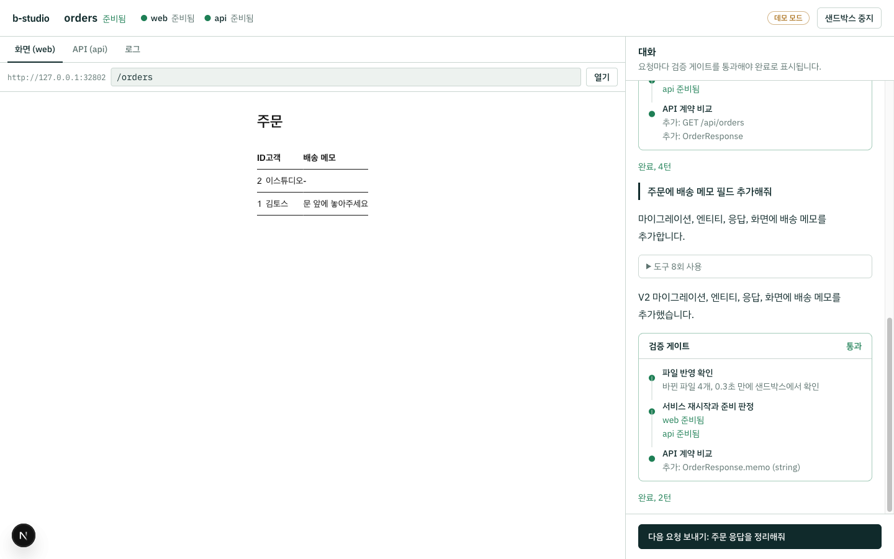

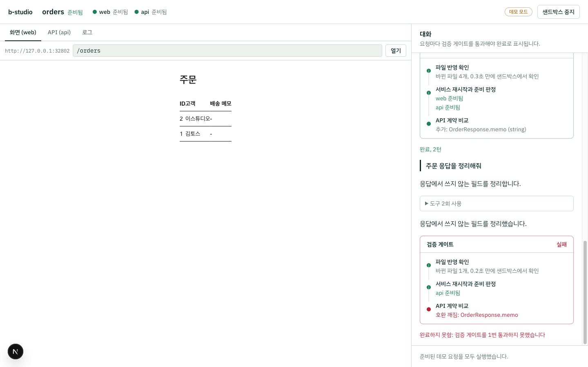

위 화면은 체크포인트 기능을 넣기 전의 모습입니다. 게이트가 호환 깨짐을 막았는데도 변경이 남아 있어서 미리보기의 배송 메모가 비어 보였습니다. 지금은 **게이트를 통과하지 못한 변경을 자동으로 되돌리고, 바뀐 서비스를 이전 상태로 재시작합니다**([ADR-018](docs/decisions.md#adr-018-세션-체크포인트-검증을-통과한-변경만-남긴다)).

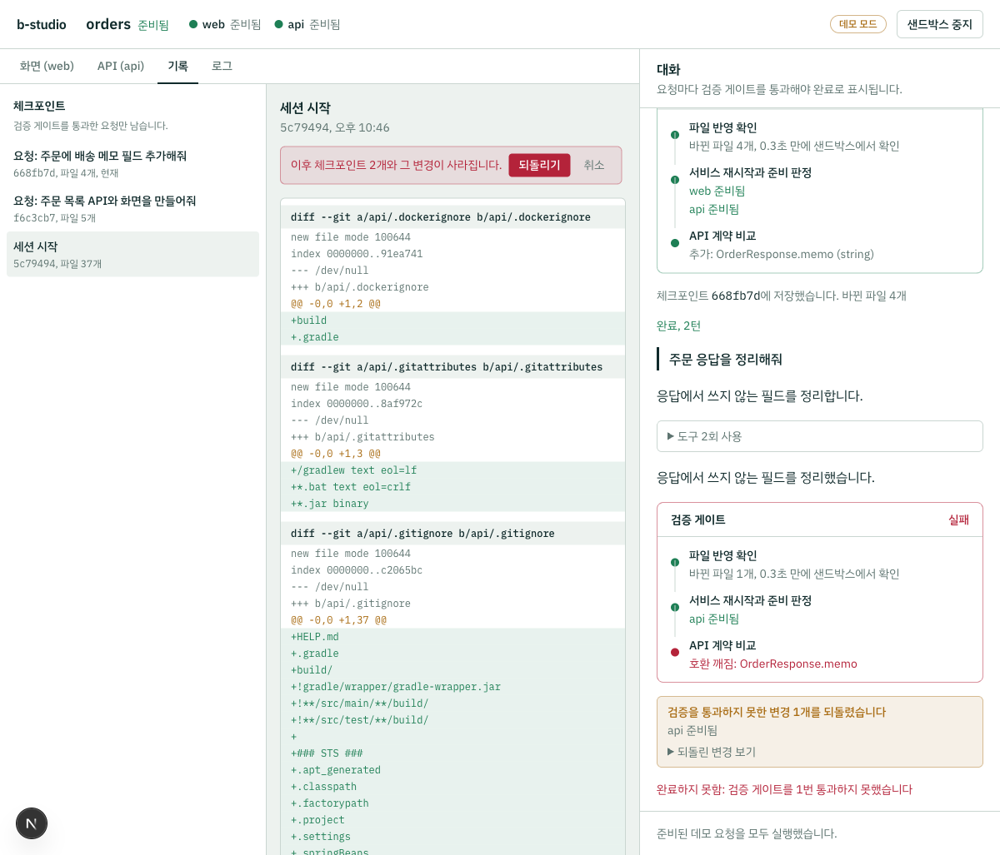

> 데모 모드는 Claude API 대신 미리 적어 둔 스크립트로 실행합니다. 준비된 요청만 순서대로 실행하고, 다른 요청은 거절합니다.

## `studio.yaml`

실행 방법은 표준 `compose.yaml`에 두고, `studio.yaml`에는 스튜디오에만 필요한 정보만 적습니다.

```yaml
version: 1
name: orders

services:
  web:
    source: managed        # 스튜디오가 코드를 만들고 샌드박스에서 실행
    template: nextjs
    path: web
    port: 3000
    preview: browser       # iframe 미리보기
    ready: { path: /, timeoutSeconds: 300 }

  api:
    source: managed
    template: spring-boot
    path: api
    port: 8080
    preview: openapi       # API 탐색기
    ready: { path: /actuator/health/readiness, timeoutSeconds: 900 }
    contract: { extract: /v3/api-docs }   # 실행 중인 서버에서 OpenAPI 추출
    # 키 파일 내용이 같으면 이전 세션의 볼륨을 복사해 시작 (Gradle 설정 캐시 재사용)
    snapshots:
      - volume: api-gradle-project
        key: [build.gradle, settings.gradle, gradle.properties, gradle/wrapper/gradle-wrapper.properties, Dockerfile.dev]

  # 이미 운영 중인 사내 API는 등록만 한다 (TOI 방식). 샌드박스에서는 http://legacy-users/로 부르고 edge가 정책을 적용한다
  # legacy-users:
  #   source: external
  #   baseUrl: https://users.internal.example.com
  #   policy:
  #     allow:                                  # 적지 않으면 모든 호출자에게 GET·HEAD만
  #       - { callers: [api, studio], methods: [GET], paths: ["/api/users/*"] }
  #     mask: [phone, residentNumber]           # 응답 JSON에서 가릴 필드
  #     auth: { header: Authorization, secret: LEGACY_USERS_TOKEN, prefix: "Bearer " }

# 체크포인트마다 DB 상태를 저장해, 파일을 되돌릴 때 스키마와 데이터도 같은 시점으로 되돌린다
databases:
  db: { engine: postgres, database: app, user: app }   # compose의 부가 서비스 이름

# 컨테이너 한도 (한도 없이 잰 최대치의 약 2배)
resources:
  api: { memory: 1536m, cpus: 2 }
  web: { memory: 1g, cpus: 2 }
  db: { memory: 256m }

# 샌드박스는 외부로 나갈 수 없고, HTTP(S)는 패키지 저장소만 허용한다. 더 필요한 호스트만 적는다
# network:
#   egress: [api.slack.com, "*.internal-mirror.example.com"]

# 시크릿은 이름과 받을 서비스만 적는다. 값은 스튜디오 서버의 환경 변수나 시크릿 파일에서 읽고, 출력에서 가린다
# secrets:
#   PAYMENT_API_KEY: { services: [api], description: 결제 대행사 테스트 키 }
#   LEGACY_USERS_TOKEN: {}   # 사내 API 인증(policy.auth)에만 쓰면 services를 비워 edge에만 넣는다
```

`loadProject()`는 명세만 검사하지 않고 **두 파일이 서로 맞는지도** 검증합니다. managed 서비스가 compose에 없거나, external 서비스가 compose에 들어 있으면 필드 경로와 함께 에러를 알려 줍니다.

## 검증 결과

로컬 환경(macOS, colima, Docker 27)에서 직접 실행해 확인한 내용입니다.

| 항목 | 결과 |
|---|---|
| 웹 `/` | HTTP 200 |
| 웹 `/api/ping` → Next rewrite → Spring | `{"message":"pong"}` |
| API readiness | `{"status":"UP"}` |
| OpenAPI 계약 추출 | `/v3/api-docs`에서 OpenAPI 3.1.0, `paths: ['/api/ping']` |
| 포트 공개 범위 | 서비스는 포트를 공개하지 않고, edge 컨테이너가 `127.0.0.1`의 빈 포트에만 공개 (같은 네트워크에서 접근 불가) |
| Ctrl+C 신호가 여러 번 들어올 때 | 정리가 끝까지 완료됨 (tsx와 node에 SIGINT를 동시에 보내 재현) |
| 종료 후 정리 | 컨테이너 0개, 샌드박스 볼륨 0개. 공유 캐시 볼륨(Gradle, pnpm)은 유지 |
| 두 번째 기동 | 처음에는 늦어도 43초 안에 준비. 단계별로 측정해 병목(api의 Gradle 기동·설정)을 찾은 뒤 **13.4초 → 10.9초** (`pnpm bench:boot`, 3회 10.8~10.9초) |
| 단위 테스트 / 타입 체크 | 174개 통과 / 패키지 5개 통과 |

### 에이전트 루프 (`pnpm e2e:agent`, 실제 Docker 샌드박스)

모델 대신 **미리 적어 둔 턴을 돌려주는 스크립트 모델**로 실행했습니다. 이 검증은 도구, 파일 변경, 서비스 재시작, 준비 판정, 계약 비교, 피드백이 실제로 맞물리는지를 확인합니다. Claude가 코드를 얼마나 잘 쓰는지는 이 검증의 범위가 아닙니다.

| 시나리오 | 결과 |
|---|---|
| A. 주문 목록 API와 화면. **일부러 오타를 넣어 컴파일 에러** | 게이트 1차 **실패**(컴파일 에러 로그 전달) → 수정 → 2차 통과. 계약에 `GET /api/orders`, `OrderResponse` 추가. `/orders` 화면에 시드 데이터 렌더링 (4턴, 33.5초) |
| B. 배송 메모 필드 추가 (Flyway V2 + 엔티티 + 응답 + 화면) | 한 번에 통과. 계약 변경은 `OrderResponse.memo` 추가 하나. 화면에 메모 렌더링 (2턴, 14.0초) |
| C. 요청하지 않은 필드 삭제 | api는 정상 기동했지만 `OrderResponse.memo` 삭제를 **호환 깨짐으로 차단** (2턴, 10.0초) |

### 웹 스튜디오 (데모 모드, Playwright로 실제 브라우저 조작)

| 확인 항목 | 결과 |
|---|---|
| 세션 시작 → 준비 | 두 서비스 모두 10초 안에 준비 (의존성 캐시가 채워진 상태) |
| A. 주문 목록 | 게이트 실패(api 컴파일 에러 로그 포함) → 수정 → 통과, 미리보기 `/orders`에 주문 표 렌더링 |
| B. 배송 메모 | 게이트 통과, 계약에 `OrderResponse.memo` 추가, 미리보기에 배송 메모 열 렌더링 |
| C. 필드 삭제 | 게이트가 호환 깨짐으로 차단, "완료하지 못함" 표시 |
| API 탐색기 | `GET /api/orders` HTTP 200, 재시작 후 계약을 다시 불러와 스키마에 `memo` 반영 |
| 재시작 중 미리보기 | 포트가 32796에서 32799로 바뀐 뒤에도 입력한 경로 `/orders` 유지 |
| 미리보기 HMR | WebSocket 핸드셰이크 `101 Switching Protocols`, 준비 후 브라우저 콘솔 에러 0개 |
| 프록시 입력 검증 | `//` 경로 400, 허용하지 않은 메서드 400, 없는 서비스 404, 데모 순서 위반 409 |
| 세션 중지 | 컨테이너 0개, 볼륨 0개. 공유 캐시와 작업 복사본은 유지 |

### 세션 체크포인트 (데모 모드, 실제 브라우저 · Git · 샌드박스 확인)

| 확인 항목 | 결과 |
|---|---|
| 세션 시작 | `5c79494 세션 시작` 체크포인트 (파일 37개). 샌드박스가 만든 `node_modules` 등은 기록에 들어가지 않음 |
| A. 주문 목록 (게이트 1회 실패 후 통과) | `f6c3cb7` 커밋, 남은 변경 0개 |
| B. 배송 메모 | `668fb7d` 커밋, 미리보기에 배송 메모 표시 |
| C. 필드 삭제 (게이트 차단) | **새 커밋 없음.** `OrderController.java` 변경을 되돌리고 api 재시작 → 미리보기 배송 메모와 계약의 `memo` 유지 |
| "세션 시작"으로 되돌리기 | 9초. 주문 관련 파일 삭제, web·api 재시작, `/orders` 404, 계약은 `/api/ping`만 남음, 데모 다음 요청이 첫 요청으로 돌아감 |
| 사용자 전역 커밋 훅 | 모든 커밋을 거부하는 전역 훅이 있어도 체크포인트 커밋이 남음 (단위 테스트) |
| 다시 연결 | 새로고침해도 체크포인트 목록이 중복되지 않고 콘솔 에러 0개 (버그 수정 후) |

### 로컬 로그인 계정 모드 (실제 모델 · 실제 Docker · 실제 브라우저)

본인 PC의 `claude` CLI(2.1.267, Claude Max 구독)로 실행했습니다. 모델은 계정 기본값인 Claude Opus 5였습니다.

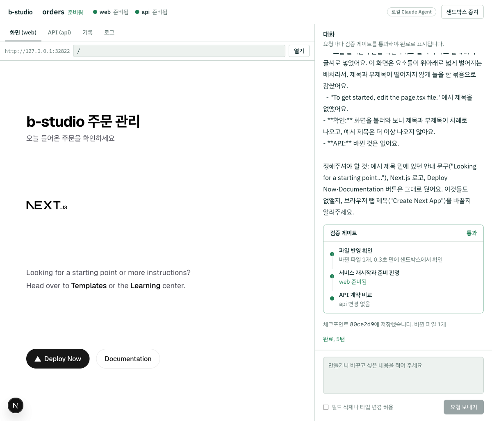

| 확인 항목 | 결과 |
|---|---|
| 사전 확인 | 프롬프트를 보내지 않고 약 4초 만에 로그인 확인. 화면과 로그에는 구독 종류만 남기고 이메일·조직은 남기지 않음 |
| CLI: `GET /api/time` 추가 | 6턴. 모델은 b-studio 도구(`list_files`, `get_contract`, `read_file`, `write_file`, `restart_service`, `http_request`)만 호출. 바뀐 파일은 `TimeController.java` 하나, 게이트 통과, 계약 변경은 `GET /api/time` 추가 하나. SDK 추정 토큰: 입력 949 · 출력 1,542 · 캐시 읽기 19,881 · 캐시 쓰기 5,318. 종료 후 컨테이너·볼륨 0개 |
| 스튜디오: 첫 화면에 제목 추가 | 5턴, web 재시작 후 게이트 통과, 체크포인트 `de7393d` |
| 스튜디오: "방금 추가한 제목" 아래 부제목 + 에이전트가 앞서 물어본 예시 제목 삭제 | 5턴, 이전 대화를 이어받아 두 가지를 모두 처리, 체크포인트 `80ce2d9`. 미리보기 HTML에 제목과 부제목이 있고 예시 제목은 없음 |
| 대화 이어받기 | 로컬 세션 파일 2개. 두 번째 파일에 첫 요청 기록이 들어 있고, 첫 파일에는 두 번째 요청이 없음 (실행마다 갈라서 이어받음) |
| 실행 환경 표시 | 헤더 "로컬 Claude Agent", 대화에 "로컬 Claude Agent (CLI 2.1.267)에서 claude-opus-5 모델로 실행합니다 (Claude Max 구독)" |
| 첫 화면 안내 문구 | 모드별 문구 표시. 검증 중 로컬 모드에도 "API 키가 있어야 합니다"가 남아 있던 것을 발견해 수정 |
| 브라우저 콘솔 | 에러 10개, 모두 web 재시작 전 포트로 미리보기 앱이 HMR을 다시 연결하려던 것. 스튜디오 코드의 에러는 0개 ([트러블슈팅 11](docs/troubleshooting.md#11-서비스를-재시작할-때마다-브라우저-콘솔에-hmr-연결-실패가-쌓임)) |

### 자원 한도와 사용량 (실제 Docker · 실제 브라우저)

Docker VM은 메모리 6GiB, CPU 4개입니다.

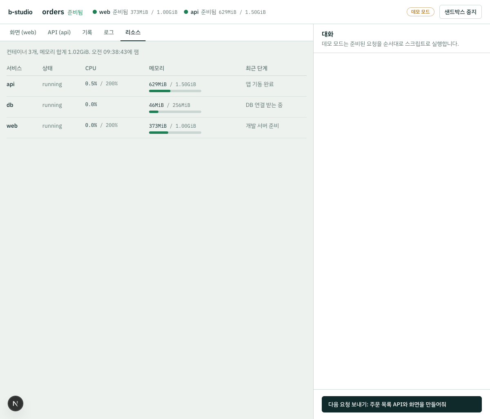

| 확인 항목 | 결과 |
|---|---|
| 한도 없이 잰 사용량 | api 최대 726MiB(컨테이너 안 JVM 3개: Gradle 래퍼 155MiB, Gradle 데몬 410MiB, 앱 226MiB), web 최대 548MiB·CPU 147%, db 48MiB. 세션 하나가 준비 후 약 1.1GiB |
| 한도 적용 | 세션 스냅샷과 리소스 탭에 api 1.50GiB·CPU 200%, web 1.00GiB·CPU 200%, db 256MiB로 표시 |
| 한도를 건 기동 | 12.0초, 11.0초 (한도 없을 때 10.9초) |
| 한도 안에서 데모 요청 A | 21초, 게이트 통과. 이후 api 654MiB, web 282MiB, db 46MiB |
| api 한도 300MiB | 5.5초 만에 기동 실패. **종료 코드는 1이지만** 메모리 부족 종료(`OOMKilled`)로 판정해 "메모리 한도를 넘어 종료됨"으로 표시. 로그는 "Gradle build daemon disappeared unexpectedly" |
| api 한도 150MiB | 5.7초 만에 기동 실패. 종료 코드 137, 메모리 부족 종료로 표시. 한 서비스 실패 뒤 나머지 서비스 확인도 멈춰 확인 스크립트가 9초 만에 끝남 ([트러블슈팅 14](docs/troubleshooting.md#14-한-서비스가-기동에-실패해도-다른-서비스의-준비-확인이-끝나지-않음)) |
| 리소스 탭 | 컨테이너 3개, 메모리 합계, 한도 대비 사용률 막대, 최근 단계("앱 기동 완료", "DB 연결 받는 중", "개발 서버 준비"). 콘솔 에러 0개 |

종료 코드만 봤다면 300MiB 경우의 원인을 알 수 없었습니다. 컨테이너 안에서 Gradle 데몬이 커널에 종료되고 래퍼는 코드 1로 끝났기 때문입니다. 그래서 종료 코드가 아니라 `OOMKilled`로 판정합니다.

### DB 브랜치 (데모 모드 · 실제 Docker · 세션 API와 이벤트 스트림으로 확인)

데모 시나리오 A(주문 목록, V1) → B(배송 메모, V2) → C(호환 깨짐으로 차단) → A로 되돌리기를 실행하고, DB를 직접 조회했습니다.

| 확인 항목 | 결과 |
|---|---|
| 되돌리기 전(문제 재현) | 작업 복사본에는 V1만 남는데 DB의 Flyway 기록은 1, 2와 `memo` 열이 그대로 남음 |
| 체크포인트별 덤프 | 세션 시작, A, B마다 1개. 차단된 C는 체크포인트도 덤프도 없음 |
| C 되돌리기 | DB가 B 덤프와 같아 건드리지 않음 (비교 129~163ms) |
| A로 되돌리기 | DB를 0.5~0.6초 만에 다시 만듦. Flyway 기록 1만, `memo` 열 없음, 주문 2건 유지. api는 지운 파일 때문에 한 번 더 재시작한 뒤 준비, `GET /api/orders` 200 ([트러블슈팅 13](docs/troubleshooting.md#13-되돌린-뒤-api가-지운-파일을-찾다가-기동하지-못함)) |
| 되돌리기 전체 시간 | 18.4~21.7초 (Gradle 설정 세 가지) |

### 원격 저장소 연동 (데모 모드 · 실제 git 원격 · 실제 브라우저)

`examples/orders`를 Git 저장소로 만들고, 로컬에 띄운 Gitea 1.27.3을 `origin`으로 두고 확인했습니다. Gitea는 GitHub와 같은 모양의 PR API를 제공해서 실제 HTTP 호출과 PR 화면까지 확인할 수 있습니다.

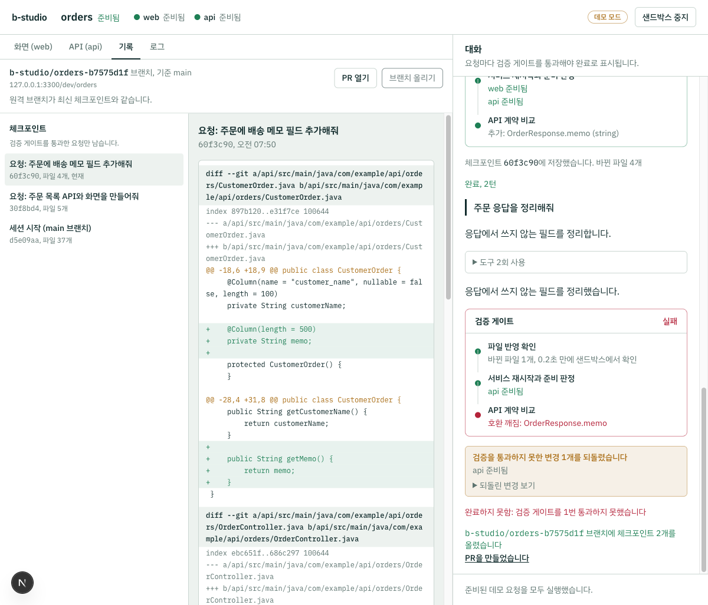

| 확인 항목 | 결과 |
|---|---|
| 세션 시작 | 원본 `main`의 `d5e09aa`에서 `b-studio/orders-b7575d1f` 브랜치 생성, 23초 만에 준비. 체크포인트 목록은 "세션 시작 (main 브랜치)"에서 끝남 |
| 자격 증명 노출 | 원본 `origin` 주소에 토큰을 넣었지만 화면에는 `127.0.0.1:3300/dev/orders`만 표시. 세션 스냅샷 JSON과 스튜디오 서버 로그에서 토큰 문자열 0건 |
| 체크포인트 커밋 본문 | 시나리오 A에 게이트 결과(연산·스키마 추가), "검증 게이트 재시도: 1회", 에이전트 요약. 호환 깨짐으로 차단된 C는 커밋 없음 |
| 올리고 PR 만들기 | 1.7초. 원격 세션 브랜치가 `60f3c90`이 되고 PR #1 생성. 제목 "[b-studio] 주문 목록 API와 화면을 만들어줘 외 1건", 본문에 요청별 커밋·파일·검증 결과 |
| 되돌린 뒤 다시 올리기 | A로 되돌리자(13초) "원격 브랜치와 기록이 다릅니다" 안내. 올리기 0.6초, 원격 브랜치와 PR #1의 head가 `30f8bd4`로 바뀌고 PR은 열린 상태 유지 |
| 리뷰어가 같은 브랜치에 올린 뒤 올리기 | HTTP 409와 "덮어쓰지 않았습니다" 안내. 원격 브랜치는 리뷰어 커밋 `80a2123` 그대로 |
| 단위 테스트 | 실제 git으로 복제·올리기·lease 거부·origin 없는 원본·세션 이전 기록 거부, 가짜 서버로 GitHub·GitLab·Gitea PR API |

### 네트워크 격리 (실제 Docker · 실제 브라우저)

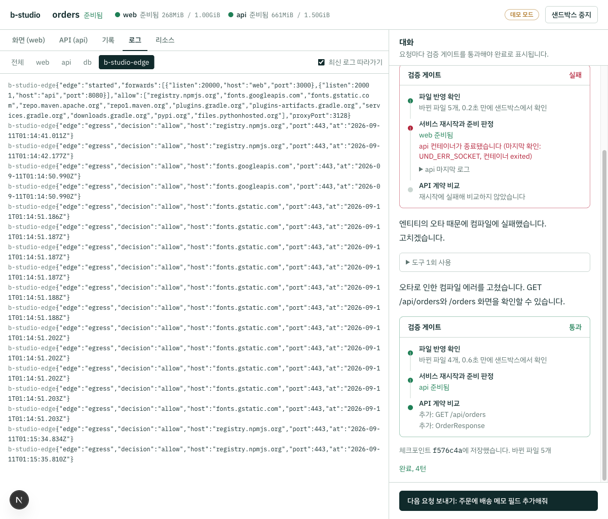

| 확인 항목 | 결과 |
|---|---|
| 격리 전(문제 재현) | web 컨테이너에서 `1.1.1.1:443`, 패키지 저장소, 게이트웨이 `172.19.0.1:15432`(같은 Docker VM에서 도는 다른 프로젝트의 Postgres)에 TCP 연결됨 |
| 직접 외부 연결 | `1.1.1.1:443`은 `ENETUNREACH`, 외부 이름 풀이는 `EAI_AGAIN`, 두 게이트웨이의 15432 포트는 시간 초과·`ENETUNREACH` |
| edge 프록시 | `registry.npmjs.org:443`은 200. `example.com`, 5432 포트, IP 직접 접속, 풀리지 않는 이름은 403 |
| 도구가 프록시를 따르는지 | `pnpm view is-number version` → `7.0.0`. JVM `HttpClient`로 Maven Central 200, `example.com`은 "Tunnel failed, got: 403". 서비스끼리 `db:5432`는 직접 연결 |
| 기동 시간 (`pnpm bench:boot`, 3회) | 14.3초, 13.0초, 12.9초 (격리 전 10.8~10.9초). `compose up`이 edge 준비를 기다리며 4.2~4.4초로 늘어남 |
| 막힌 다운로드 피드백 | web의 corepack 저장소를 허용하지 않은 `registry.npmmirror.com`으로 바꾸고 재시작하자 4.7초 만에 실패. 게이트 보고에 "막힌 외부 접속 (studio.yaml network.egress에 없는 호스트): registry.npmmirror.com:443" |
| 스튜디오 데모 요청 A | 게이트 1차 실패(의도한 컴파일 에러) → 통과, 4턴. web·api를 재시작한 뒤에도 edge 포트(33020, 33021)가 그대로라 미리보기 주소가 바뀌지 않음 |
| 미리보기 HMR | 미리보기 앱이 edge 포트로 `[HMR] connected`. web 재시작 중에만 WebSocket 연결 실패 2건, 이후 같은 포트로 다시 연결 |
| 로그·리소스 탭 | 로그 탭에 `b-studio-edge` 필터와 감사 로그(허용 17건, 거부 0건). 리소스 탭에 컨테이너 4개, edge 20MiB / 128MiB |
| 세션 중지 | 세션 컨테이너 0개, 볼륨 0개. 같은 VM의 다른 프로젝트 컨테이너는 그대로 |

첫 실행에서는 web이 edge보다 먼저 떠 3초 만에 종료됐고([트러블슈팅 15](docs/troubleshooting.md#15-네트워크를-격리하자-web이-기동-3초-만에-종료됨)), 화면을 찍다가 로그 중복도 발견했습니다([트러블슈팅 16](docs/troubleshooting.md#16-서비스를-재시작하면-로그-탭에-같은-줄이-두-번-쌓임)). 설계 근거는 [ADR-024](docs/decisions.md#adr-024-네트워크-격리-샌드박스의-출입구를-하나로-만든다)에 있습니다.

### 시크릿 주입과 가림 (실제 Docker · 에이전트 도구 · Git)

예제 복사본의 `studio.yaml`에 `PAYMENT_API_KEY: { services: [api] }`를 선언하고, 서버 환경 변수로 테스트 값을 넣어 확인했습니다.

| 확인 항목 | 결과 |
|---|---|
| 값이 없을 때 | 샌드박스를 만들기 전에 거부. 메시지는 "PAYMENT_API_KEY: 값이 없습니다. B_STUDIO_SECRET_PAYMENT_API_KEY 환경 변수나 B_STUDIO_SECRETS_FILE 파일에 넣으세요" |
| override 파일 | `PAYMENT_API_KEY: null`만 있고 값은 없음 |
| 주입 범위 | api 컨테이너 환경 변수에 값이 들어감(`raw` exec로 확인). 선언하지 않은 web에는 없음 |
| 명령 출력 | `printenv PAYMENT_API_KEY` → `[PAYMENT_API_KEY 가림]` |
| 로그 | 앱이 값을 표준 출력에 쓰면 `docker logs` 원본에는 값이 있고, 스튜디오 로그 구독에서는 `payment key=[PAYMENT_API_KEY 가림]` |
| 에이전트 도구 | `run_in_service`의 `echo "$PAYMENT_API_KEY" \| base64` 출력이 처음에는 **그대로 새어 나감** → 수정 후 `[PAYMENT_API_KEY 가림]Qo=` ([트러블슈팅 17](docs/troubleshooting.md#17-base64로-인코딩한-시크릿-값은-가려지지-않음)) |
| 명령으로 파일에 쓴 값 | 호스트 파일에는 값이 있지만 `read_file` 결과는 `payment.key=[PAYMENT_API_KEY 가림]`, 검증 게이트가 `leak.properties (PAYMENT_API_KEY)`로 실패 |
| 체크포인트 커밋 | "시크릿 값이 들어 있어 체크포인트를 남기지 않았습니다: api/src/main/resources/leak2.properties (PAYMENT_API_KEY)". 에러 메시지에 값 없음 |
| 기동 | 12.8초 (시크릿 없이 잰 12.9~14.3초와 차이 없음) |

설계 근거는 [ADR-025](docs/decisions.md#adr-025-시크릿-주입과-가림-값은-보이지-않게-넣고-새는-경로를-막는다)에 있습니다.

### 정책 프록시 (실제 Docker · 에이전트 도구 · 실제 브라우저)

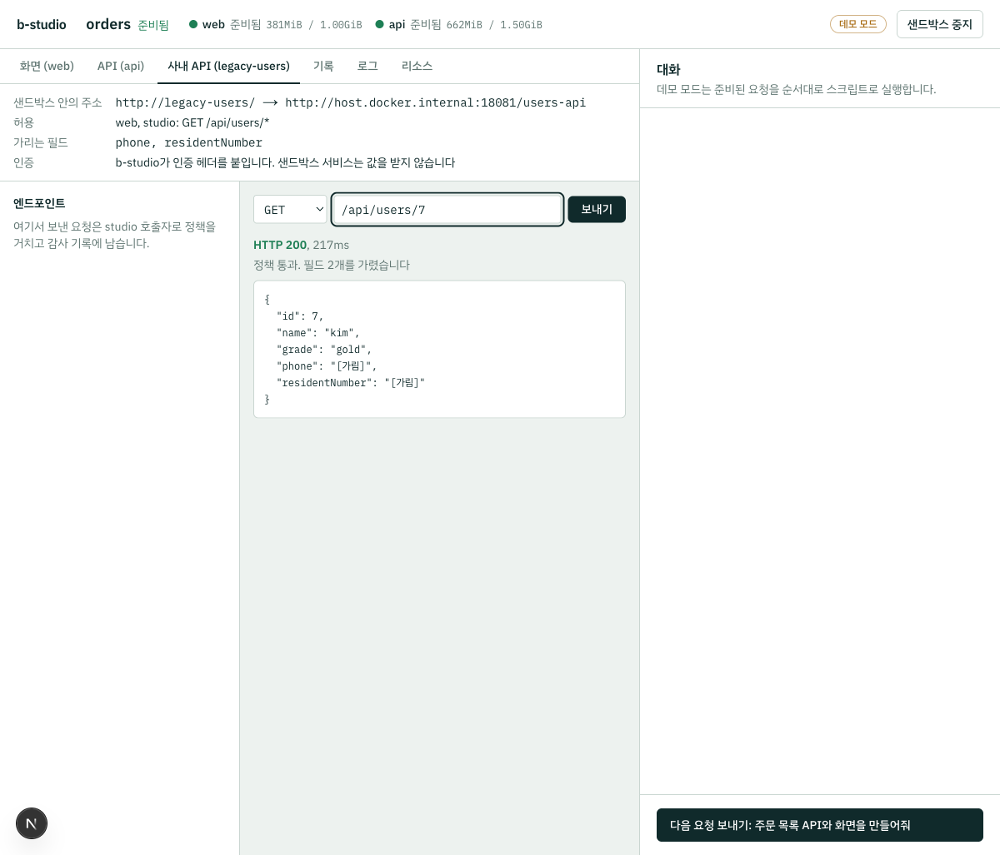

Docker 호스트에 가짜 사내 API를 띄웠습니다. 이 API는 받은 인증 헤더를 로그에 남기고, 이름·전화번호·주민번호와 받은 인증 헤더를 담은 JSON을 돌려줍니다. 예제 복사본에는 `legacy-users`를 `allow: [web, studio] GET /api/users/*`, `mask: [phone, residentNumber]`, `auth: LEGACY_USERS_TOKEN`으로 등록했습니다.

| 확인 항목 | 결과 |
|---|---|
| web → `http://legacy-users/api/users/1` | 200. `phone`·`residentNumber`는 `[가림]`, API가 되돌려 보낸 인증 헤더는 `Bearer [LEGACY_USERS_TOKEN 가림]` |
| 인증 주입 | 사내 API 로그에 실제 토큰이 붙은 요청 3건. web 컨테이너 환경에는 토큰이 없고 edge에만 있음 |
| 허용하지 않은 호출 | web의 POST, web의 `/api/admin/users`, 허용 목록에 없는 api 서비스(JVM `HttpClient`)는 403. 사내 API 로그에는 허용한 GET 3건만 있음 |
| 직접 접근 | web에서 `host.docker.internal:18081`로 직접 부르면 `EAI_AGAIN` |
| API 탐색기 경로 (studio) | GET 200, 가린 필드 2개, 192ms(`docker exec` 포함). DELETE는 403 |
| 스튜디오 화면 | "사내 API (legacy-users)" 탭에 샌드박스 안의 주소, 허용 규칙 "web, studio: GET /api/users/*", 가리는 필드, 인증 안내가 표시됨. `GET /api/users/7`은 HTTP 200과 "정책 통과. 필드 2개를 가렸습니다"를 보여 주고 본문의 `phone`·`residentNumber`는 `[가림]`. edge 감사 기록에 `caller: studio, via: explorer` 한 줄 |
| 에이전트 도구 `call_external_api` | 결과에 `policy: 2 field value(s) masked by b-studio policy` |
| 감사 기록 | edge 로그에 7줄: web 허용 1·거부 2, api 거부 1, studio(explorer) 허용 1·거부 1, studio(agent) 허용 1. 스튜디오 로그 스트림에서 토큰 0건 |
| 기동 | 14.1초 |

설계 근거는 [ADR-026](docs/decisions.md#adr-026-정책-프록시-사내-api는-edge를-거쳐서만-부른다)에 있습니다.

### gVisor 런타임 (격리된 Docker-in-Docker · 실제 override)

개발 PC의 Docker 데몬에서는 다른 프로젝트의 컨테이너도 돌고 있어 건드리지 않았습니다. 대신 격리된 Docker-in-Docker 데몬(Docker 27.5.1)에 runsc(release-20260817.0)를 등록했습니다. 그 위에서 `buildOverride`가 만든 override로 edge와 Next web을 띄웠습니다.

| 확인 항목 | 결과 |
|---|---|
| 런타임 등록 확인 | 데몬에 없는 런타임을 요청하면 샌드박스를 만들기 전에 거부하고 등록된 런타임 목록을 알려 줌 (단위 테스트) |
| 기본 네트워크 모드의 runsc | 서비스 이름으로 연결하면 `bad address`, IP로는 연결됨 → `--network=host`로 등록하면 이름으로 연결됨 ([트러블슈팅 18](docs/troubleshooting.md#18-gvisorrunsc에서-서비스-이름을-풀지-못함)) |
| 격리 확인 | 컨테이너 안 커널이 web·edge 모두 `4.19.0-gvisor` (runc는 `6.8.0-50-generic`). internal 네트워크의 외부 차단 유지 |
| 기동 | runsc 처음 26~30초, 다시 띄울 때 6초. runc 4초. Next `Ready in`은 runsc 444~529ms, runc 220~236ms |
| edge 프록시 | runsc에서도 pnpm 설치가 프록시를 거침 (허용 369건, 거부 0건) |
| 파일 수정 후 미리보기 | 폴링 없이 40초 동안 옛 화면. Next 폴링(`watchOptions.pollIntervalMs=1000`)을 켜면 6초부터 계속 404, 대기 CPU 0.04% → 16.73%. 컨테이너를 다시 만들면 5초 뒤 새 화면 ([트러블슈팅 19](docs/troubleshooting.md#19-gvisor에서-파일을-고쳐도-미리보기가-바뀌지-않음)) |

설계 근거는 [ADR-027](docs/decisions.md#adr-027-격리-강화-운영자가-고르는-컨테이너-런타임과-gvisor)에 있습니다.

### 아직 검증하지 못한 것과 알려진 한계

- **API 키 경로의 실제 실행**: 실제 모델 실행은 로컬 로그인 계정 모드로만 확인했습니다. `AnthropicModelClient`로 API를 직접 호출하는 경로는 API 키가 없어서, 샌드박스를 띄우기 전에 안내 메시지를 내고 멈추는 것까지만 확인했습니다.
- **로컬 로그인 계정 모드는 개인 PC 전용**: 공유 서버 배포용이 아니며, 대화 기록이 로컬 CLI의 세션 파일(`~/.claude/projects/` 아래)에 남습니다. 로그인하지 않은 상태의 안내 문구는 가짜 SDK로만 확인했습니다.
- **CLI는 자동 되돌리기를 하지 않음**: 체크포인트는 스튜디오 세션의 작업 복사본에만 적용합니다. `studio agent`는 사용자 프로젝트 폴더를 직접 다루므로 `reset`을 실행하지 않습니다.
- **실제 GitHub·GitLab에서 PR 생성은 검증하지 않음**: 실제 서버로는 Gitea만 확인했습니다. GitHub·GitLab API는 요청 형태와 응답 처리를 가짜 서버 테스트로 확인했습니다.
- **리뷰어 커밋과 갈라졌을 때 해결 기능 없음**: 스튜디오는 덮어쓰지 않고 멈추며, 원격 커밋을 세션으로 가져오거나 리베이스하는 기능은 아직 없습니다.
- **모노레포 하위 폴더 프로젝트는 원격 연동이 꺼짐**: Git 저장소 루트에 있는 프로젝트만 세션 브랜치로 시작합니다.
- **DB 브랜치의 한계**: Postgres만 지원하고, 덤프를 한 번에 256MB까지 다룹니다. 되돌림 결과 문구는 이벤트 스트림으로 확인했고 브라우저 화면으로는 확인하지 않았습니다.
- **세션은 서버 메모리에만 있음**: 스튜디오 서버를 재시작하면 세션 목록이 사라집니다. 띄워 둔 샌드박스는 종료 신호를 받을 때 정리합니다.
- **gVisor 격리의 범위**: 개발 PC의 Docker 데몬에는 등록하지 않고, 격리된 Docker-in-Docker 데몬에서 edge와 Next web만 띄워 확인했습니다. api(JVM)와 db(Postgres)는 아직 gVisor에서 띄워 보지 않았습니다. runsc는 서비스 이름 풀이 때문에 `--network=host`로 등록해야 하고, 이 모드는 네트워크 경로의 격리를 줄입니다. gVisor 안에서는 파일 변경 알림이 오지 않아, 미리보기는 요청이 끝나고 서비스를 다시 띄울 때 바뀝니다.
- **정책 프록시의 범위**: 가림은 필드 이름 기준이라 다른 이름의 필드나 자유 텍스트 안의 개인정보는 가리지 못합니다. 가릴 필드가 있는 API의 JSON이 아닌 응답은 넘기지 않고, 본문은 5MB까지, HTTP(S) API만 다룹니다. 실제 사내망 API가 아니라 Docker 호스트의 가짜 API로 확인했습니다.
- **시크릿 가림의 범위**: 문자열 일치(원래 값, URL 인코딩, base64)로 찾으므로 값을 쪼개거나 다른 방식으로 바꾸면 가려지지 않습니다. Docker 호스트에서는 `docker inspect`·`docker logs`로 값이 보입니다. 게이트의 시크릿 실패 문구와 세션 시작 거부 문구는 스튜디오 화면이 아니라 코드 경로와 API 매핑으로만 확인했습니다.
- **원격 미리보기**: edge가 포트를 루프백에만 열어, 다른 PC의 브라우저에서는 미리보기를 열 수 없습니다.
- **네트워크 격리의 범위**: 외부로는 허용한 호스트의 HTTP(S)만 나갈 수 있고, 허용은 호스트 단위라 경로·메서드를 가리지 않습니다. 프록시 설정을 따르지 않는 도구는 이름 풀이부터 실패하며 감사 로그에도 남지 않습니다. 사용자 compose의 `JAVA_TOOL_OPTIONS`와 프록시 변수는 override 값으로 덮어씁니다. FastAPI 템플릿(uv)의 프록시 경유 설치는 실행해 보지 않았습니다.

## 트러블슈팅

실행하면서 발견한 문제와 해결 과정은 [docs/troubleshooting.md](docs/troubleshooting.md)에 정리했습니다.

- **검증 게이트가 컴파일 에러가 있는 코드를 통과시킨 문제**: colima sshfs에서 디렉터리 목록과 파일 속성이 약 20초 늦게 반영되는 것을 실측으로 확인하고, 재시작 전 동기화 지점으로 해결
- **"//"로 시작하는 경로가 다른 호스트를 가리키는 문제**: 에이전트 도구, API 탐색기 프록시, `studio.yaml` 경로에서 origin 비교로 차단
- **미리보기 HMR 연결이 계속 실패한 문제**: Next.js 16의 개발용 요청 출처 제한을 문서로 확인하고 `allowedDevOrigins`로 해결
- **Ctrl+C 한 번에 신호가 여러 번 들어와 정리가 중간에 끊길 수 있는 문제**: `process.once` 대신 멱등한 정리 함수로 해결
- **Next dev 첫 요청 컴파일 때문에 준비 확인이 시간 초과되는 현상**: 기동 중 에러와 진짜 실패를 구분하는 판정 규칙으로 해결
- **캐시를 공유해도 두 번째 기동이 빨라지지 않은 문제**: "`node_modules` 재설치가 원인"이라는 가설을 측정으로 뒤집음. 실제 병목은 api의 Gradle 기동·설정이었고, 이득이 측정된 볼륨에만 스냅샷을 켜 13.4초 → 10.9초
- **재시작할 때마다 콘솔에 HMR 연결 실패가 쌓이는 현상**: 에러의 origin을 확인해 스튜디오가 아니라 이전 포트에 남은 미리보기 앱의 재연결임을 확인
- **체크포인트로 되돌린 뒤 DB 스키마가 코드와 달라지는 문제**: 데모 시나리오로 재현하고, 체크포인트마다 DB 덤프를 남겨 해결
- **되돌린 뒤 api가 지운 파일을 찾다가 기동하지 못한 문제**: 설정 캐시·스냅샷·파일 공유 지연을 차례로 의심했다가 틀렸고, 스택 트레이스로 새 컨테이너의 디렉터리 목록 문제임을 확정해 조건부 재시도로 해결
- **base64로 인코딩한 시크릿 값이 가려지지 않은 문제**: 실제 샌드박스에서 `| base64` 한 번으로 가림이 우회되는 것을 확인하고, 앞에 붙는 바이트 수마다 값만으로 정해지는 base64 구간을 함께 가려 해결
- **재시작하면 로그 탭에 같은 줄이 두 번 쌓인 문제**: 격리 검증 화면에서 재시작하지 않은 edge의 줄이 반복되는 것을 보고, 로그 재구독의 `--tail`이 원인임을 찾아 이미 받은 줄을 건너뛰게 해결
- **네트워크를 격리하자 web이 3초 만에 종료된 문제**: 인터넷 없이 띄우는 사전 실험으로 web만 corepack 다운로드가 필요함을 확인했고, 연결 거부 대상이 edge 프록시였다는 로그로 기동 순서 문제임을 찾아 healthcheck와 `depends_on`으로 해결

## 로드맵

- [x] **런타임 코어**: 프로젝트 명세, 샌드박스 추상화, 로컬 Docker 제공자, 템플릿 3종, CLI
- [x] **에이전트 루프**: "필드 하나 추가해줘" → Flyway 마이그레이션, 엔티티, API, 화면을 한 번에 수정 → 재시작 → OpenAPI 대조 검증 (스크립트 모델로 Docker 검증 완료, Claude API 실행 확인은 인증 정보 필요)
- [x] **웹 스튜디오**: 대화, 미리보기 iframe, API 탐색기, 로그 (데모 모드로 브라우저 검증 완료)
- [x] **세션 체크포인트와 되돌리기**: 게이트를 통과한 변경만 커밋하고, 실패한 변경은 되돌리고, 이전 시점으로 복원
- [x] **로컬 로그인 계정으로 실행**: API 키 없이 본인 PC의 `claude` CLI 계정으로 같은 게이트를 거쳐 실행 (CLI와 웹 스튜디오에서 실제 모델로 검증)
- [x] **원격 저장소 연동**: 세션 브랜치로 올리기, 덮어쓰지 않는 푸시, GitHub·GitLab·Gitea PR (Gitea로 브라우저 검증)
- [x] **DB 브랜치**: 체크포인트마다 DB 상태를 남겨, 파일을 되돌릴 때 스키마와 데이터도 같은 시점으로 복원
- [x] **네트워크 격리**: 모든 서비스를 internal 네트워크에 두고, edge 컨테이너 하나로 포트를 공개하고 허용한 호스트의 HTTP(S)만 통과시켜 운영 DB·사내망 접근 차단 (감사 로그, 막힌 접속을 게이트가 보고)
- [x] **시크릿 주입과 가림**: 서버 쪽에서 읽은 값을 파일에 남기지 않고 주입, 로그·명령 출력·도구 결과에서 원래 값·URL 인코딩·base64 형태를 가리고, 값이 들어간 파일은 게이트 실패와 커밋 거부
- [x] **정책 프록시**: 등록한 사내 API를 edge로만 부르고, 서비스·studio 단위 허용 규칙, 응답 JSON 필드 가림, 인증 헤더 주입, 호출마다 감사 기록
- [x] **자원 한도와 사용량 표시**: 측정으로 정한 서비스별 메모리·CPU 한도, 리소스 탭(CPU·메모리·종료 이유·최근 단계), 메모리 부족 종료 판정, 에이전트용 `service_stats` 도구
- [x] **gVisor 런타임**: 운영자가 고른 Docker 런타임(runsc)을 모든 서비스와 edge에 적용하고, 샌드박스를 만들기 전에 등록 여부 확인, 세션 헤더에 격리 표시
- [ ] **Kubernetes 제공자**: agent-sandbox `Sandbox` 리소스와 RuntimeClass(gVisor/Kata)로 샌드박스를 띄우는 제공자
- [x] **기동 최적화**: 단계별 측정으로 병목을 찾고, 입력 파일 해시별 스냅샷 볼륨과 Gradle 캐시로 준비 시간 13.4초 → 10.9초

## 기술 스택

| 영역 | 사용 기술 |
|---|---|
| 스튜디오 코어 | TypeScript, Node.js 22, pnpm workspace, zod 4, yaml, Vitest 5, tsx |
| AI | Claude Opus 5 (`claude-opus-5`), Anthropic TypeScript SDK 0.124 — adaptive thinking, 스트리밍, 프롬프트 캐시, strict 도구, server-side fallback |
| 로컬 실행 | Claude Agent SDK 0.3.267 — 프로세스 안 MCP 서버로 b-studio 도구 제공, 기본 도구·사용자 설정 비활성화, 스트리밍 입력, 세션 fork |
| 저장소 연동 | Git (clone, `--force-with-lease`), GitHub REST API, GitLab REST API, Gitea API |
| 웹 스튜디오 | Next.js 16 App Router, React 19, Tailwind CSS 4, Server-Sent Events, IBM Plex Sans KR |
| 샌드박스 | Docker Compose v2 (override 파일, external 볼륨, 루프백 포트 공개) |
| 템플릿 | Next.js 16.3, React 19, Tailwind 4 / Spring Boot 4.1, Java 25, Gradle 9, Flyway, springdoc-openapi 3.1 / FastAPI, Python 3.14, uv |
| 데이터 | PostgreSQL 17 |

## 참고 자료

- [AI가 만든 코드가 어드민이 되기까지 — 토스 테크](https://toss.tech/article/52885)
- [WebContainers 상용 라이선스](https://webcontainers.io/enterprise) · [Next.js Turbopack wasm 바인딩 이슈 #70522](https://github.com/vercel/next.js/issues/70522)
- [Sandpack/Nodebox FAQ](https://sandpack.codesandbox.io/docs/resources/faq)
- [Replit 개발/운영 DB 분리](https://docs.replit.com/features/data-and-storage/development-and-production)
- [Kubernetes agent-sandbox](https://github.com/kubernetes-sigs/agent-sandbox)
- [Vercel Sandbox](https://vercel.com/docs/sandbox)
