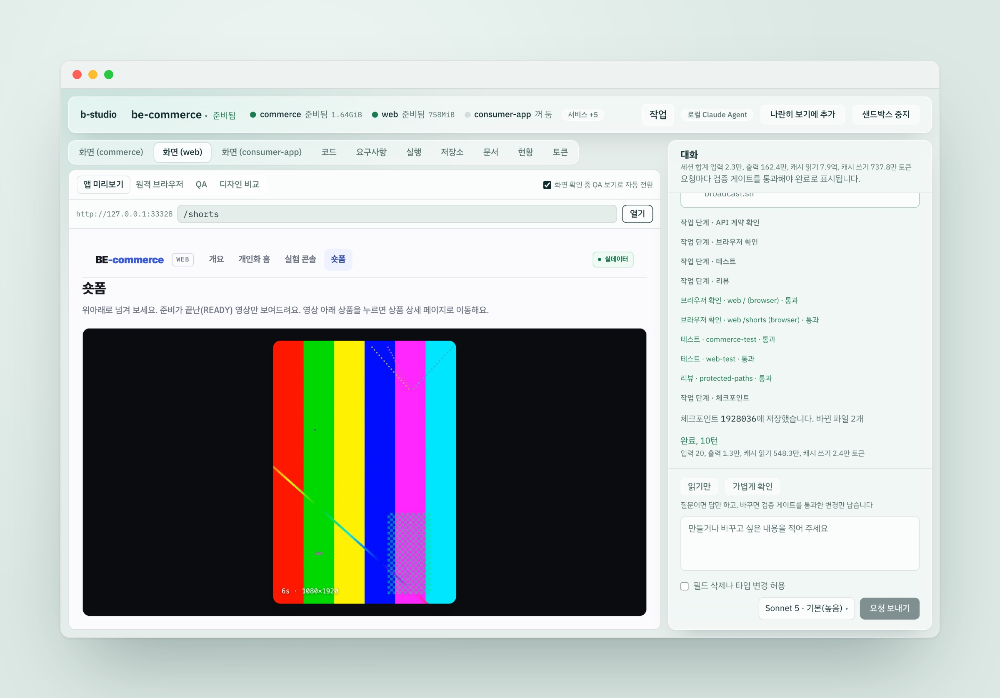
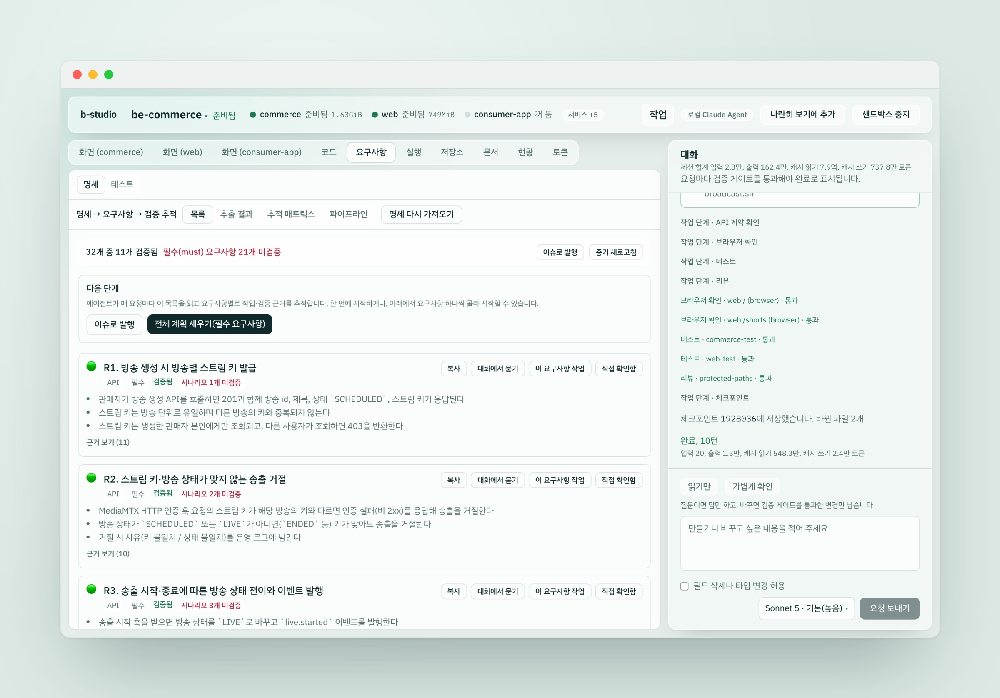
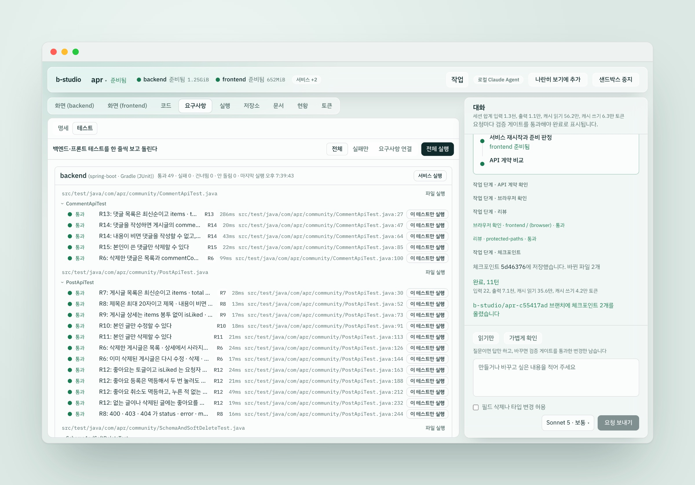
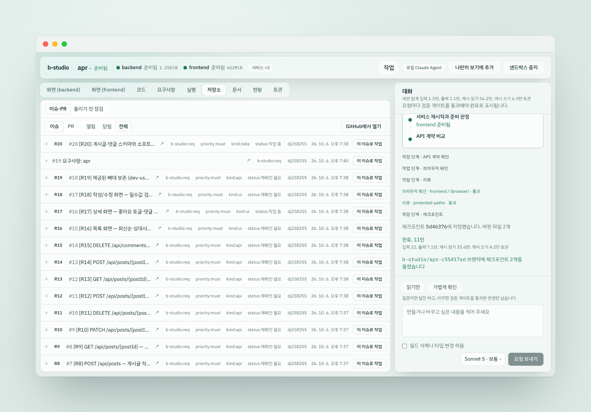
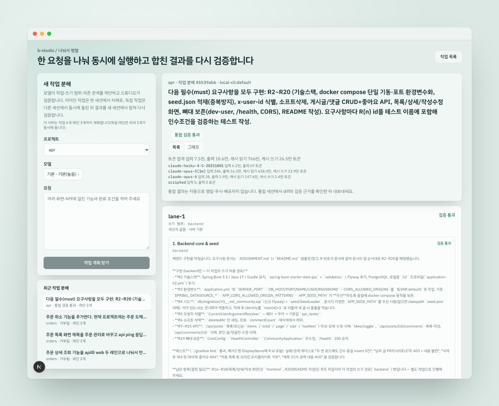
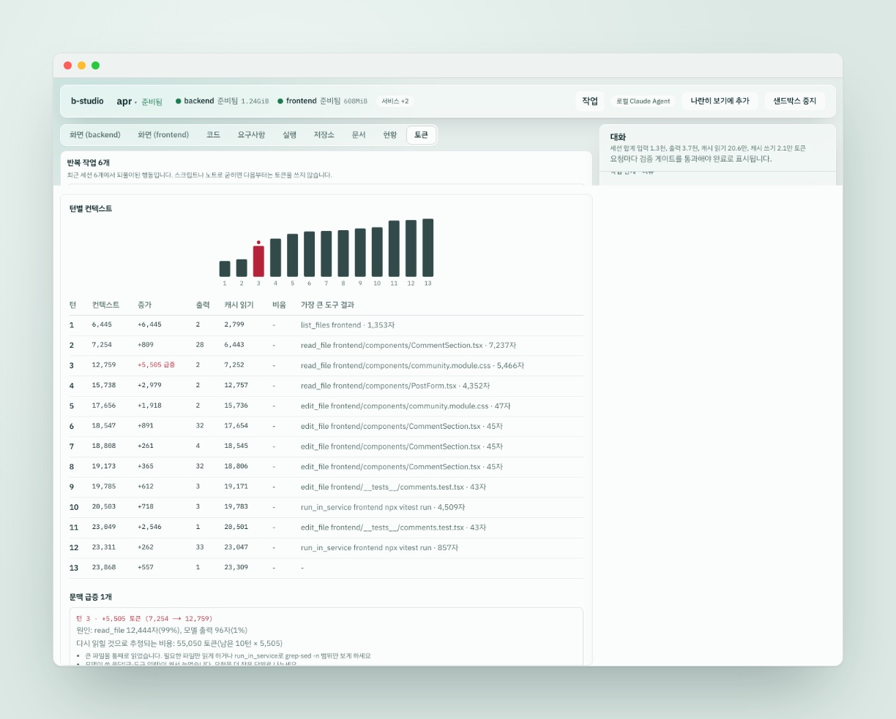
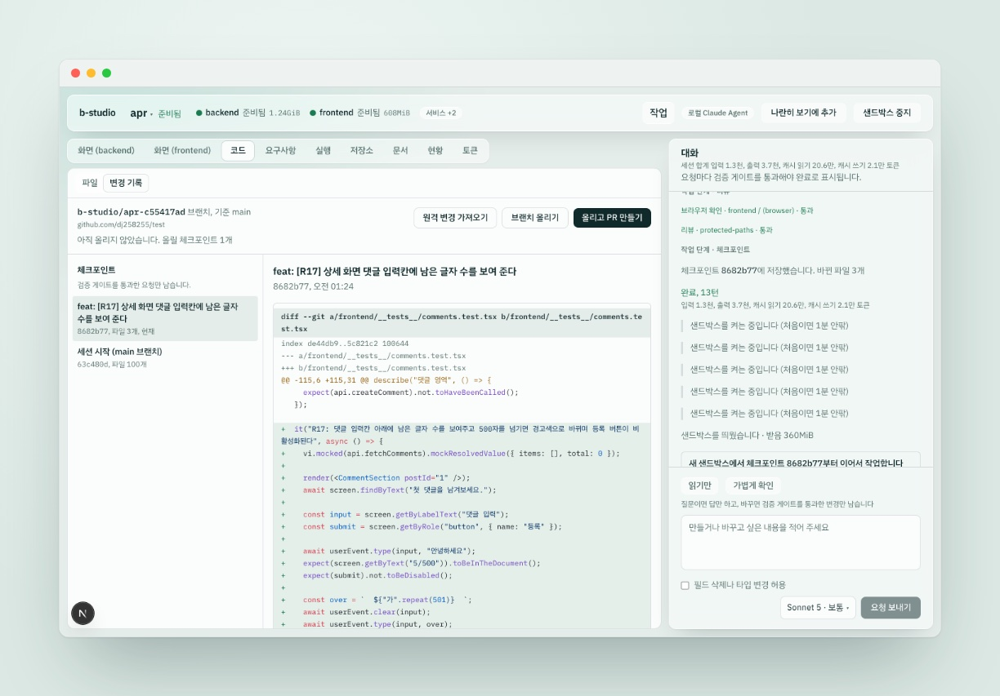
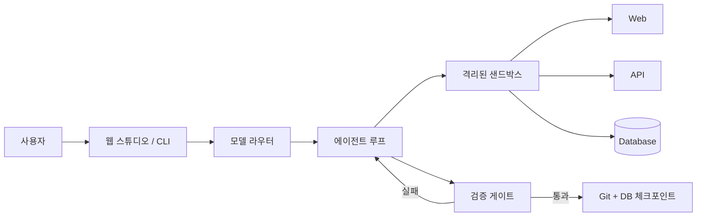

# b-studio

[](https://github.com/dj258255/b-studio/actions/workflows/ci.yml)

> 에이전트의 완료 선언을 믿지 않는 멀티에이전트 개발 런타임. 후보마다 독립 Git 작업 공간과 샌드박스에서 실행하고 재시작·API 계약·화면·테스트로 검증한 변경만 체크포인트로 남깁니다.

틀린 코드도 결과 파일을 만듭니다. 에이전트는 이를 완료라고 보고합니다. 그래서 b-studio는 완료 판정과 성공 판정을 분리합니다. 에이전트가 끝났다고 말하면 플랫폼이 서비스를 다시 띄우고 준비 상태·API 계약·실제 브라우저 화면·테스트로 확인한 뒤에야 변경을 남깁니다. 코드를 직접 편집하는 IDE를 대체하는 도구가 아니라 여러 에이전트 작업을 운영하는 제어 계층입니다.

<picture>
  <source media="(prefers-color-scheme: dark)" srcset="docs/images/studio-hero-dark.jpg">
  
</picture>

## 핵심 설계 세 가지

### 완료는 플랫폼이 판정합니다

검증 게이트가 바뀐 서비스를 재시작하고 HTTP 준비 상태, OpenAPI 계약, 실제 Chromium 화면, 테스트, 리뷰를 직접 실행합니다. 모델의 자기 보고는 판정에 쓰지 않습니다. 통과한 단계는 커밋 트레일러로 남아 배포 조건과 대조됩니다. 에이전트를 거치지 않고 편집기로 바꾼 변경도 `studio verify`로 같은 게이트에 넣을 수 있습니다.

### 후보마다 전용 작업 공간을 받습니다

후보마다 전용 Git 복제본·브랜치·샌드박스(Docker 또는 Kubernetes)를 받아 병렬 작업이 서로의 파일과 실행 환경을 덮지 않습니다. 자원 한도, 네트워크 허용 목록, 시크릿 가림, 보호 경로, 사내 API 정책 프록시를 `studio.yaml` 한 곳에서 겁니다. 작업 분해의 레인은 선언한 쓰기 범위를 실행기에서 강제합니다.

### 통과한 변경만 남습니다

게이트를 통과한 파일과 그 시점의 데이터베이스 상태만 체크포인트로 저장합니다. 실패하거나 취소한 변경은 되돌립니다. Git 커밋과 PostgreSQL 덤프를 같은 시점으로 묶어 두므로 세션이 죽어도 마지막으로 검증된 상태로 복구합니다.

## 실제로 재 보니

기능이 나아졌다는 주장은 같은 과제를 반복 실행한 결과로만 합니다. 가설은 실행 전에 이슈에 먼저 적습니다. 성공 비교는 Fisher 정확 검정으로 판정합니다. 실험 아홉 번의 질문과 결과는 [실험 기록](docs/experiments/README.md)에 모두 있습니다. 여기서는 방향을 바꾼 네 가지만 추립니다.

게이트를 통과한 실패가 있었습니다. 엮인 과제를 레인으로 나눠 병렬 실행하니 4/9만 성공했습니다. 실패 5건은 전부 레인 경계의 필드 불일치였고 다섯 건 모두 각자의 게이트는 통과한 상태였습니다([E1](docs/experiments/2026-09-29-e1-isolated-parallel-baseline.md)). 레인이 API 계약을 먼저 게시하게 바꾸자 9/9가 됐습니다(계약 공유 17/18 대 비공유 9/18, p = 0.007, [E2](docs/experiments/2026-09-29-e2-coordination-strategies.md) · ADR-059).

토큰을 2배 쓰는 이유를 호출 단위로 추적했습니다. 같은 과제에서 b-studio는 그냥 Claude Code보다 성공 1건당 토큰을 2배 썼습니다(약 44만 대 22만, [E3](docs/experiments/2026-09-29-e3-baseline-budget-escalation.md)). 호출마다 기록해 나눠 보니 고정 문맥은 오히려 1/6이었습니다. 추가분의 78%가 도구 결과를 다시 읽는 양이었습니다([E6](docs/experiments/2026-09-30-e6-token-breakdown.md)). 게이트와 겹치는 자가 확인을 줄이자 성공률 유지(9/9) 상태에서 41% 내려왔습니다(24.9만, p = 0.164라 9쌍으로는 경향까지만, [E7](docs/experiments/2026-09-30-e7-lean-self-check.md) · ADR-064).

가설이 기각되자 기본값을 껐습니다. 계획은 큰 모델, 실행은 작은 모델로 나누면 30% 싸질 것이라고 이슈에 먼저 적고 돌렸습니다. 결과는 반대로 성공 1건당 $1.49, Sonnet 단독($0.23)의 538% 비용이었습니다(9쌍 중 8쌍에서 분리가 비쌈, p = 0.008, [E8](docs/experiments/2026-09-30-e8-plan-execute-split.md)). 계획을 "요청 범위의 최소 변경"으로 좁히자 $0.30까지 돌아왔지만 여전히 단독보다 27% 비쌌습니다([E9](docs/experiments/2026-10-01-e9-narrow-plan.md)). 작은 과제의 기본값은 끈 채로 뒀습니다(ADR-075).

명세 문서 하나로 Spring Boot + Next.js + PostgreSQL 게시판을 b-studio 화면만으로 끝까지 만들었습니다. 요구사항 20개 추출, 이슈 20개 발행, 레인 3개 통합, 테스트 87개 통과, PR 생성과 자동 리뷰 2라운드, 병합 뒤 새 세션의 화면 확인까지 한 바퀴입니다. 걸린 마찰 70건을 번호 붙여 기록했습니다. 오해였던 1건을 뺀 69건을 PR 45개로 고쳤습니다([검증 기록](docs/verification.md#명세-기반-풀스택-도그푸딩)).

## 그 밖의 기능

작업 보드에서 여러 세션의 계획·도구 호출·로그·미리보기·diff를 함께 봅니다. 한 요청을 레인으로 나눠 병렬 실행한 뒤 통합 결과를 같은 게이트로 재검증합니다(작업 분해, 계획은 사람이 승인). Agent Fleet은 같은 요청을 2~4개 후보로 펼쳐 비교합니다. 모델 라우터는 Anthropic·OpenAI 호환·Gemini와 구독 CLI(Claude Code·Codex·Command Code·OpenCode)를 하나의 도구 계약으로 묶습니다. 토큰은 요청·세션·사용자별 한도와 턴별 문맥 분석, 비용 보고서로 관리합니다. 명세는 요구사항(EARS·시나리오)으로 추출해 이슈 발행, 추적 매트릭스, 올리기 전 점검, PR 생성과 자동 리뷰로 잇습니다. GitHub·Gitea 이슈·PR을 보는 저장소 탭, 운영 이미지 배포와 롤백, macOS 데스크톱 앱도 있습니다. 영역별 상태와 검증 범위는 [구현 상태와 일정](docs/status.md)에 따로 적었습니다.

| | |
|---|---|
|  |  |
|  |  |
|  |  |

## 빠른 시작

### 준비물

- Node.js 22 이상
- pnpm 10.29.3
- Docker Desktop 또는 Colima
- 에이전트를 실행하려면 `ANTHROPIC_API_KEY` 또는 로그인된 Claude Code CLI

### 설치와 실행

```bash
git clone https://github.com/dj258255/b-studio.git
cd b-studio
corepack enable
pnpm install
pnpm studio up examples/orders
```

준비가 끝나면 터미널에 웹 미리보기와 OpenAPI 주소가 표시됩니다. `Ctrl+C`를 누르면 b-studio가 컨테이너와 샌드박스 전용 볼륨을 정리합니다.

웹 스튜디오는 별도 터미널에서 실행합니다.

```bash
# 모델 호출 없이 UI와 전체 흐름 확인
pnpm studio:demo

# 이 PC의 Claude Code 로그인 사용
pnpm studio:local
```

기본 주소는 `http://127.0.0.1:3000`입니다.

### 한 번에 켜기

웹 스튜디오를 한 명령으로 켜고 끕니다. Docker가 꺼져 있으면 colima를 켜고 준비되면 브라우저를 엽니다. 이미 떠 있으면 새로 띄우지 않고 브라우저만 엽니다.

```bash
pnpm studio launch              # 이 PC의 Claude Code로 (기본)
pnpm studio launch --mode demo  # 모델 없이 화면·흐름만
pnpm studio stop                # launch가 띄운 스튜디오를 멈춘다
```

`launch`는 백그라운드로 띄웁니다(로그 `~/.cache/b-studio/launch/studio.log`, PID `studio.pid`). `--port`로 포트를 바꿉니다. `--no-open`을 주면 브라우저를 열지 않습니다.

프로그램이 이 출력을 읽어야 하면 `--json`을 붙입니다. 브라우저를 열지 않고 준비되면 stdout에 한 줄 JSON만 씁니다(진행 안내는 stderr).

```bash
pnpm studio launch --json   # {"url":"http://127.0.0.1:3000","port":3000,"mode":"claude-code","pid":12345,"started":true}
pnpm studio stop --json     # {"stopped":true}
```

### 데스크톱 앱 (macOS)

터미널 대신 더블클릭으로 켜고 싶으면 얇은 Electron 껍데기를 설치합니다. 화면은 서버가 주는 웹 그대로라 스튜디오를 고쳐도(`git pull`) 앱을 다시 만들 필요가 없습니다([ADR-062](docs/decisions.md#adr-062-데스크톱은-얇은-electron-껍데기로-두고-웹-스튜디오를-본체로-남긴다)).

```bash
pnpm desktop:install   # 빌드 + ~/Applications/b-studio.app 설치 + 설정 파일 쓰기
```

- 앱을 열면 저장소에서 스튜디오 서버를 스스로 켜고(이미 떠 있으면 그대로 씁니다) 창을 띄웁니다. 서버가 뜨는 동안에는 진행 안내를 보여 줍니다.
- 창 위 도구 막대: 뒤로·앞으로·새로고침·주소 입력창·"브라우저에서 열기". 주소창에는 `127.0.0.1:3000`, `3100`(미리보기 포트), `/sessions/…` 같은 상대 경로를 넣을 수 있습니다.
- 이 PC 주소만 앱 안에서 열리고 외부 주소(예: PR 링크)는 기본 브라우저로 넘어갑니다.
- 앱을 닫으면 앱이 켠 서버만 끕니다. 사람이 따로 켠 서버는 그대로 둡니다.
- 서명을 하지 않으므로 처음 한 번은 Finder에서 우클릭 → 열기로 열어야 합니다.
- 개발 중에는 서버를 끄고 `pnpm desktop:dev`로 앱만 띄워 볼 수 있습니다.
- Dock·Finder 아이콘은 `apps/desktop/build/icon.svg` 하나에서 나옵니다. 모양을 고쳤으면 `pnpm desktop:icon`으로 macOS 아이콘(`.icns`)과 창 아이콘, 스튜디오 favicon을 함께 다시 굽습니다(macOS 도구만 씁니다).

### CLI로 에이전트 실행

```bash
# Anthropic API
ANTHROPIC_API_KEY=... pnpm studio agent examples/orders "주문 목록에 상태 필터를 추가해 줘"

# 개인 PC의 Claude Code 로그인
pnpm studio agent examples/orders "주문 목록에 상태 필터를 추가해 줘" \
  --backend claude-code
```

계약을 의도적으로 깨는 작업은 요청 내용에 그 의도가 드러나야 하며 `--allow-breaking`도 함께 지정해야 합니다.

```bash
pnpm studio agent examples/orders \
  "더 이상 쓰지 않는 legacy 필드를 삭제해 줘" \
  --allow-breaking
```

설치, 인증, 첫 실행에서 막히면 [시작하기](docs/getting-started.md)를 확인하세요.

## 작동 방식


```mermaid
flowchart LR
  U[사용자] --> UI[웹 스튜디오 / CLI]
  UI --> R[모델 라우터]
  R --> A[에이전트 루프]
  A --> S[격리된 샌드박스]
  S --> W[Web]
  S --> B[API]
  S --> D[(Database)]
  A --> G[검증 게이트]
  G -->|통과| C[Git + DB 체크포인트]
  G -->|실패| A
```

1. `@b-studio/spec`이 `studio.yaml`과 `compose.yaml`의 일관성을 확인합니다.
2. `@b-studio/sandbox`가 서비스별 격리 환경과 edge 프록시를 만듭니다.
3. `@b-studio/agent`가 제한된 파일·명령·HTTP 도구로 작업합니다.
4. 검증 게이트가 바뀐 서비스를 재시작하고 준비 상태와 API 계약을 확인합니다.
5. 통과한 파일과 DB 상태만 체크포인트로 저장합니다.

구조와 경계는 [아키텍처 문서](docs/architecture.md), 선택의 근거는 [ADR](docs/decisions.md)에 정리되어 있습니다.

## 프로젝트 구성

```text
b-studio/
├── apps/
│   ├── cli/                  # studio up · agent · deploy · auth
│   ├── desktop/              # 웹 스튜디오를 감싸는 얇은 Electron 껍데기 (macOS)
│   └── studio/               # Next.js 웹 스튜디오
├── packages/
│   ├── spec/                 # studio.yaml 스키마와 로더
│   ├── sandbox/              # Docker/Kubernetes 샌드박스와 정책 경계
│   └── agent/                # 에이전트 루프, 도구, 모델, 검증 게이트
├── templates/                # Next.js · Spring Boot · FastAPI 원본
├── examples/orders/          # web + api + PostgreSQL 예제
├── config/                   # 모델 레지스트리 예시
└── docs/                     # 사용자·운영·설계 문서
```

## 주요 명령

| 명령 | 용도 |
|---|---|
| `pnpm studio up <path>` | 프로젝트를 샌드박스에서 실행 |
| `pnpm studio agent <path> "<request>"` | 에이전트에게 변경 요청 |
| `pnpm studio deploy <path>` | 운영 이미지를 만들고 고정 주소로 전환 |
| `pnpm studio deploy <path> --status` | 현재 배포와 릴리스 상태 확인 |
| `pnpm studio deploy <path> --rollback <id>` | 이전 릴리스로 롤백 |
| `pnpm studio auth token <name>` | 웹 스튜디오 token 모드용 토큰 생성 |
| `pnpm desktop:install` | 데스크톱 앱을 빌드해 `~/Applications/b-studio.app`에 설치 (macOS) |
| `pnpm desktop:dev` | 데스크톱 앱을 개발 모드로 실행(서버는 따로 켜 둠) |
| `pnpm desktop:icon` | 원본 SVG에서 데스크톱 아이콘(`.icns`·창 아이콘)과 스튜디오 favicon을 다시 굽기 (macOS) |
| `pnpm test` | 단위 테스트 실행 |
| `pnpm typecheck` | 전체 워크스페이스 타입 검사 |

전체 옵션과 운영 절차는 [운영 가이드](docs/operations.md)에 있습니다.

## `studio.yaml` 최소 예시

```yaml
version: 1
name: orders

services:
  web:
    source: managed
    template: nextjs
    path: web
    port: 3000
    preview: browser
    ready: { path: /, timeoutSeconds: 300 }

  api:
    source: managed
    template: spring-boot
    path: api
    port: 8080
    preview: openapi
    ready: { path: /actuator/health/readiness, timeoutSeconds: 900 }
    contract: { extract: /v3/api-docs }

databases:
  db: { engine: postgres, database: app, user: app }

resources:
  web: { memory: 1g, cpus: 2 }
  api: { memory: 1536m, cpus: 2 }
  db: { memory: 256m }
```

managed/external 서비스, 네트워크 정책, 시크릿, 스냅샷, 배포 설정은 [`studio.yaml` 레퍼런스](docs/configuration.md)를 참고하세요.

## 문서

- [문서 안내](docs/README.md)
- [로드맵](ROADMAP.md)
- [변경 기록](CHANGELOG.md)
- [구현 상태와 일정](docs/status.md)
- [공구함 — AI에게 코딩을 맡기려고 만든 장치들](docs/toolkit.md)
- [실험 기록](docs/experiments/README.md)
- [시작하기](docs/getting-started.md)
- [`studio.yaml` 설정](docs/configuration.md)
- [아키텍처](docs/architecture.md)
- [운영과 배포](docs/operations.md)
- [실행 정책과 도구 호출 통제](docs/execution-policy.md)
- [검증 기록과 한계](docs/verification.md)
- [설계 결정 기록](docs/decisions.md)
- [트러블슈팅](docs/troubleshooting.md)
- [기여 가이드](CONTRIBUTING.md)
- [보안 정책](SECURITY.md)
- [GitHub Wiki](https://github.com/dj258255/b-studio/wiki)

## 개발

```bash
pnpm install
pnpm test
pnpm typecheck
pnpm --filter @b-studio/studio lint
pnpm --filter @b-studio/studio build
```

기능 변경에는 테스트와 문서 수정을 함께 넣어 주세요. 샌드박스·네트워크·시크릿·인증 경계를 바꾸는 변경은 [보안 정책](SECURITY.md)과 관련 ADR도 확인해야 합니다.

## 라이선스

[MIT 라이선스](LICENSE)로 공개합니다. 사용·수정·배포할 수 있고 저작권 표시와 라이선스 문구를 함께 남기면 됩니다. 소프트웨어는 보증 없이 "있는 그대로" 제공됩니다.
