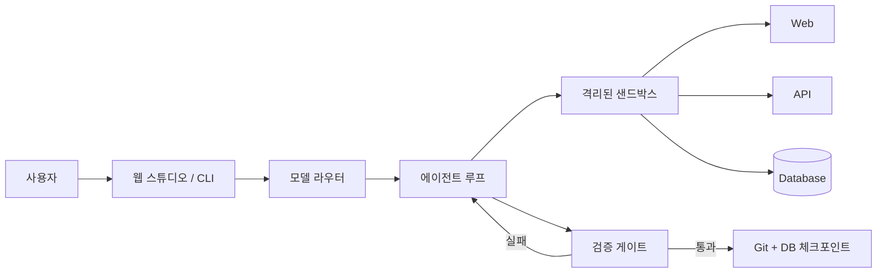

# b-studio

[](https://github.com/dj258255/b-studio/actions/workflows/ci.yml)

> 에이전트의 완료 선언을 믿지 않는 멀티에이전트 개발 런타임. 후보마다 독립 Git 작업 공간과 샌드박스에서 실행하고 재시작·API 계약·화면·테스트로 검증한 변경만 체크포인트로 남깁니다.

- 에이전트는 틀린 코드로도 결과 파일만 생기면 완료라고 보고합니다.
- 그래서 b-studio는 완료 판정과 성공 판정을 분리합니다.
  - → 에이전트가 끝났다고 말하면 플랫폼이 서비스를 다시 띄우고 준비 상태·API 계약·실제 브라우저 화면·테스트로 확인한 뒤에야 변경을 남깁니다.
- IDE를 대신하려는 도구는 아닙니다. 여러 에이전트의 작업을 운영하는 제어 계층입니다.

<picture>
  <source media="(prefers-color-scheme: dark)" srcset="docs/images/studio-hero-dark.jpg">
  
</picture>

## 핵심 설계 세 가지

### 완료는 플랫폼이 판정합니다

- 검증 게이트가 바뀐 서비스를 재시작하고 HTTP 준비 상태, OpenAPI 계약, 실제 Chromium 화면, 테스트, 리뷰를 직접 실행합니다.
- 모델의 자기 보고는 판정에 쓰지 않습니다.
- 통과한 단계는 커밋 트레일러로 남아 배포 조건과 대조됩니다.
- 에이전트를 거치지 않고 편집기로 바꾼 변경도 `studio verify`로 같은 게이트에 넣을 수 있습니다.

### 후보마다 전용 작업 공간을 받습니다

- 후보마다 전용 Git 복제본·브랜치·샌드박스(Docker 또는 Kubernetes)를 받아 병렬 작업이 서로의 파일과 실행 환경을 덮지 않습니다.
- 자원 한도, 네트워크 허용 목록, 시크릿 가림, 보호 경로, 사내 API 정책 프록시를 `studio.yaml` 한 곳에서 겁니다.
- 작업을 레인으로 나누면 레인마다 선언한 쓰기 범위를 실행기가 강제합니다.

### 통과한 변경만 남습니다

- 게이트를 통과한 파일과 그 시점의 데이터베이스 상태만 체크포인트로 저장합니다.
- 실패하거나 취소한 변경은 되돌립니다.
- Git 커밋과 PostgreSQL 덤프를 같은 시점으로 묶어 두므로 세션이 죽어도 마지막으로 검증된 상태로 복구합니다.

## 핵심 결과

기능이 나아졌다는 주장은 같은 과제를 반복 실행한 결과로만 합니다. 가설은 실행 전에 이슈에 먼저 적고 성공 비교는 Fisher 정확 검정으로 판정합니다.

- 실험 열두 번의 질문과 결과는 모두 [실험 기록](docs/experiments/README.md)에 있습니다.
- 아래 표는 그중 판단이 갈렸던 문제를 어려운 순서로 적었습니다.
  - → 위쪽일수록 실험하거나 실제 환경에서 재현하지 않으면 고를 수 없었던 문제입니다.
  - → 아래로 갈수록 기반 지식으로 답이 좁혀집니다.

| 문제 | 무엇이 충돌했나 | 고른 것과 그 대가 | 근거 |
|---|---|---|---|
| **엮인 작업의 병렬화**<br>인터페이스로 묶인 두 작업(api 응답 ↔ web 화면)을 레인으로 나눠 병렬 실행하면 통합에서 맞물리는가 | 병렬 속도 ↔ 레인 경계에서 생기는 통합 실패 | 격리 병렬 **4/9**(실패 5건 모두 레인 경계의 필드 불일치, 5건 다 **각자 게이트는 통과한 거짓 성공**). 계약을 먼저 게시하는 전략으로 **9/9**. 계약 공유 17/18 대 비공유 9/18(**p = 0.007**) | [E1](docs/experiments/2026-09-29-e1-isolated-parallel-baseline.md) · [E2](docs/experiments/2026-09-29-e2-coordination-strategies.md) · [ADR-059](docs/decisions.md#adr-059-계약으로-엮인-병렬-작업은-계약을-먼저-게시하고s2-조율은-켤-때만-한다) |
| **샌드박스 포트·DNS: 실제 환경에서만 드러난 제약**<br>포트가 비었는지 호스트에서 확인했는데 실제 바인드는 공유 VM 안에서 일어났다. 403 하나로는 정책 위반인지 상류 DNS 장애인지 구별이 안 됐다 | 확인의 단순함 ↔ 정확함(바인드가 실제로 일어나는 자리를 보기). 보안 경계 유지(사설 주소 재바인딩 방어) ↔ 장애 원인 구분 | 포트는 40000~59999 대역을 먼저 시도하고 충돌하면 세트 전체를 재시도(최대 3회) — **재시도가 실제 방어선**. DNS 조회 실패는 403 대신 502 + 전용 헤더로 나누고 감사 로그 `decision`을 `error`로 분리. 벤치는 environment가 연달아 2회 실패하면 멈춰, **18회 중 14회·약 5시간** 반복된 사고를 다음부터 막음 | [ADR-121](docs/decisions.md#adr-121-미리-고를-호스트-포트는-4000059999-대역에서-먼저-찾고-그래도-충돌하면-전부-다시-뽑아-재시도한다) · [ADR-124](docs/decisions.md#adr-124-네트워크-상류-장애dns-실패와-정책-거부를-구별하고-벤치는-environment-연속-실패에서-멈춘다) |
| **토큰 2배의 원인**<br>같은 과제에서 b-studio가 그냥 Claude Code보다 토큰을 2배 쓴다. 고정 문맥 때문인가, 반복 읽기 때문인가 | 신뢰성(게이트·자가 확인이 많을수록 안전) ↔ 토큰 비용 | 호출 단위로 쪼개 보니 고정 문맥은 오히려 **1/6**, 추가분의 **78%가 도구 결과 재읽기**(32.7%가 게이트와 겹치는 `run_in_service` 확인). 겹치는 자가 확인을 줄이자(lean) 성공률은 9/9 그대로 지키면서 토큰 **−41%**(24.9만, p = 0.164라 9쌍으로는 경향까지만) | [E3](docs/experiments/2026-09-29-e3-baseline-budget-escalation.md) · [E6](docs/experiments/2026-09-30-e6-token-breakdown.md) · [E7](docs/experiments/2026-09-30-e7-lean-self-check.md) · [ADR-064](docs/decisions.md#adr-064-에이전트는-게이트가-하는-확인을-되풀이하지-않는다자가-확인-lean을-기본으로) |
| **계획-실행 분리 기각**<br>계획은 큰 모델, 실행은 작은 모델로 나누면 비용이 줄어드는가 | "모델을 나누면 싸진다"는 통념 ↔ 작은 과제에서 생기는 계획 오버헤드 | 분리 시 성공 1건당 **$1.49**, Sonnet 단독($0.23)의 **538%**(9쌍 중 8쌍에서 분리가 비쌈, p = 0.008). 계획을 "요청 범위의 최소 변경"으로 좁혀도 $0.30으로 Sonnet 단독보다 **27% 비쌈**(계획 고정비 43%) 그래서 작은 과제에서는 기본값을 꺼 둔다 | [E8](docs/experiments/2026-09-30-e8-plan-execute-split.md) · [E9](docs/experiments/2026-10-01-e9-narrow-plan.md) · [ADR-075](docs/decisions.md#adr-075-계획은-큰-모델로-한-번-세우고-실행은-작은-모델로-한다) |
| **자동 모델 선택 기각**<br>claude-code의 자동 모델 선택(auto)이 Sonnet 고정보다 싼가 | auto가 Sonnet 고정보다 쌀 거라고 봤다 ↔ 위험 판정은 요청의 의도가 아니라 단어만 본다 | auto **8/9·$0.446**, Sonnet **7/9·$0.234**(**+91%**, 성공률 차이는 p = 1.0). 비용 차는 전부 한 과제(order-summary)에서 나왔고 원인은 샘플 값 "결제 완료(PAID)"의 "결제"가 위험 키워드에 걸려 3번 모두 처음부터 Opus를 고른 것이었다(과제 안에서 모델을 바꾼 횟수는 0회). 그래서 결제 도메인에는 auto를 권하지 않고 Sonnet 고정을 기본으로 둔다 | [E10](docs/experiments/2026-10-07-e10-cli-auto-router.md) |
| **게시판 topology 기각**<br>레인끼리 서로 읽는 조율 게시판(mesh)을 중앙만 거치게(star) 좁히면, 성공을 지키면서 통신을 줄일 수 있는가 | "읽기 경로를 끊으면 통신이 준다"는 가설 ↔ 실제로 읽는 시점 | mesh **7/9** 대 star **5/9**(p = 0.620, 유의하지 않음). mesh의 읽기 바이트 중앙값이 **0** — 계약을 게시하기 전에 이미 읽어서 쳐낼 통신이 거의 없었다. 결과를 가른 건 게시판 구조(topology)보다 읽는 시점이었다. 그래서 S2(계약 먼저)를 기본으로 둔다 | [E11](docs/experiments/2026-10-05-e11-board-topology.md) · [ADR-059](docs/decisions.md#adr-059-계약으로-엮인-병렬-작업은-계약을-먼저-게시하고s2-조율은-켤-때만-한다) |
| **레인마다 다른 CLI를 섞으면 무엇이 깨지나**<br>api 레인은 Claude Code, web 레인은 Command Code로 돌리면 게시판으로 계약을 주고받아 통합까지 가는가 | Claude 구독 사용량 절감 ↔ 레인마다 같은 도구 계약이 있다는 전제 | 혼합 **4/9** 대 Claude 단독 **9/9**(p = 0.029). Claude 토큰은 30%로 줄었지만, Command Code 실행기가 게시판 도구를 받지 못해 web 레인이 계약을 읽지 못했다(게시판 사용 0/9, 인수 검사 실패 4건). 실행기 배선을 고치고 혼합 조건만 다시 잰다 | [E12](docs/experiments/2026-10-07-e12-mixed-runtime-board.md) |

아래 둘은 기반 지식으로 답이 좁혀집니다. 다만 그 지식이 실제 결정에 쓰였는지는 수치로 남겼습니다.

| 문제 | 근거 지식 | 적용과 대가 | 근거 |
|---|---|---|---|
| **완료 선언과 검증 분리**<br>에이전트의 "끝났다"는 보고를 완료 조건으로 쓸 수 있는가 | 자동화의 완료 보고와 결과 정합성은 분리해야 한다 | 모델 호출을 인터페이스로 분리하고 `end_turn` 뒤 게이트가 재시작·계약·화면·테스트·리뷰를 직접 실행한 다음에만 체크포인트. 실행 수단이 없는 필수 단계는 설정을 불러올 때 거부해 "0건 실패"가 "검사 안 함"처럼 보이지 않게 함. 대가는 요청마다 선언한 테스트를 전부 다시 돌리느라 게이트가 느려진다는 것 | [ADR-010](docs/decisions.md#adr-010-에이전트-루프-직접-작성한-루프와-스튜디오-검증-게이트) · [ADR-049](docs/decisions.md#adr-049-워크플로-강제-필수-단계는-게이트가-직접-실행해-통과-기록을-남겨야-완료다) |
| **체크포인트는 Git+DB 묶음**<br>검증 통과 변경만 남기고 실패분은 되돌리려면 무엇을 단위로 묶나 | Git 커밋을 체크포인트로 쓰는 버전 관리 패턴 + 같은 시점 스냅숏으로 상태 일관성 유지 | 통과 시 커밋, 실패 시 `reset --hard`+`clean -fd`로 되돌리고 같은 시점 PostgreSQL 덤프를 같이 저장. 사용자 전역 훅·서명 설정과 부딪히지 않도록 전용 커밋 설정을 둠. 대가는 되돌리기가 이후 체크포인트를 지우는 작업이라 화면에서 한 번 더 확인받는 것 | [ADR-018](docs/decisions.md#adr-018-세션-체크포인트-검증을-통과한-변경만-남긴다) |

- 명세 문서 하나로 Spring Boot + Next.js + PostgreSQL 게시판을 b-studio 화면만으로 끝까지 만들었습니다.
  - → 요구사항 20개 추출, 이슈 20개 발행, 레인 3개 통합, PR 생성과 자동 리뷰, 병합 뒤 새 세션의 화면 확인까지 한 바퀴를 두 번 돌렸습니다.
  - → 둘째 바퀴는 첫 바퀴가 병합된 main에서 요청 1건을 다시 PR까지 보낸 것입니다.
- 두 바퀴에서 걸린 마찰 84건을 번호 붙여 기록했습니다.
  - → 오해였던 1건을 뺀 83건을 b-studio PR 53개(#299~#387, #409·410·413·415·417·421·425·427)와 실행 환경 업그레이드 1건(lima·colima)으로 고쳤습니다.
- 테스트는 끝까지 91개 통과(백엔드 49·프론트 42)로 늘었습니다([검증 기록](docs/verification.md#명세-기반-풀스택-도그푸딩)).

## 그 밖의 기능

영역별 상태와 검증 범위는 [구현 상태와 일정](docs/status.md)에 따로 적었습니다.

| 영역 | 무엇을 하나 |
|---|---|
| 작업 보드 | 여러 세션의 계획·도구 호출·로그·미리보기·diff를 함께 본다 |
| 작업 분해 | 한 요청을 레인으로 나눠 병렬 실행하고 통합 결과를 같은 게이트로 다시 검증한다. 계획은 사람이 승인한다 |
| Agent Fleet | 같은 요청을 2~4개 후보로 펼쳐 비교한다 |
| 모델·런타임 | Anthropic·OpenAI 호환·Gemini API와 구독 CLI(Claude Code·Codex·Command Code·OpenCode·Gemini CLI)를 하나의 도구 계약으로 묶는다. 레인마다 다른 CLI를 붙일 수 있다 |
| 토큰 | 요청·세션·사용자별 한도, 턴별 문맥 분석, 비용 보고서 |
| 요구사항 | 명세에서 요구사항(EARS·시나리오)을 뽑아 이슈 발행, 추적 매트릭스, 올리기 전 점검, PR 생성과 자동 리뷰로 잇는다 |
| 저장소 | GitHub·Gitea 이슈·PR을 개발 화면에서 본다 |
| 실행 환경 | 샌드박스 로그·자원, 사용자가 직접 띄운 서비스를 보기만 하는 "내 환경", 설정한 프로젝트의 운영 이미지 배포와 롤백 |
| 앱 | 웹 스튜디오, CLI, macOS 데스크톱 앱 |


## 빠른 시작

준비물은 Node.js 22 이상, pnpm 10.29.3, Docker Desktop 또는 Colima입니다. 에이전트를 실행하려면 `ANTHROPIC_API_KEY` 또는 로그인된 Claude Code CLI가 필요합니다.

```bash
git clone https://github.com/dj258255/b-studio.git
cd b-studio
corepack enable
pnpm install
pnpm studio up examples/orders
```

준비가 끝나면 터미널에 웹 미리보기와 OpenAPI 주소가 표시됩니다. `Ctrl+C`를 누르면 컨테이너와 샌드박스 전용 볼륨을 정리합니다.

웹 스튜디오는 `pnpm studio launch` 한 명령으로 켜고 끕니다(모델 호출 없이 보려면 `--mode demo`). CLI로 바로 요청하려면 `pnpm studio agent examples/orders "<요청>"`을 씁니다.

데스크톱 앱(macOS), `--json` 출력, 계약을 깨는 요청(`--allow-breaking`), 인증 방식은 [시작하기](docs/getting-started.md)에 정리했습니다.

## 작동 방식


```mermaid
flowchart LR
  U[사용자] --> UI[웹 스튜디오 / CLI]
  UI --> R[모델 라우터]
  R --> A[에이전트 루프]
  A --> S[격리된 샌드박스]
  S --> W[Web]
  S --> B[API]
  S --> D[(Database)]
  A --> G[검증 게이트]
  G -->|통과| C[Git + DB 체크포인트]
  G -->|실패| A
```

1. `@b-studio/spec`이 `studio.yaml`과 `compose.yaml`의 일관성을 확인합니다.
2. `@b-studio/sandbox`가 서비스별 격리 환경과 edge 프록시를 만듭니다.
3. `@b-studio/agent`가 제한된 파일·명령·HTTP 도구로 작업합니다.
4. 검증 게이트가 바뀐 서비스를 재시작하고 준비 상태와 API 계약을 확인합니다.
5. 통과한 파일과 DB 상태만 체크포인트로 저장합니다.

구조와 경계는 [아키텍처 문서](docs/architecture.md), 선택의 근거는 [ADR](docs/decisions.md)에 정리되어 있습니다.

## 저장소 구조

| 경로 | 무엇 | 왜 여기에 |
|---|---|---|
| `apps/cli/` | `studio up`·`agent`·`deploy`·`auth` 명령 | 터미널 진입점을 한 곳에 묶는다 |
| `apps/studio/` | Next.js 웹 스튜디오(세션·미리보기·토큰·저장소 탭)와 `bench/` 실험 하네스 | 화면과 실험 벤치가 같은 모델·게이트 코드를 호출해 같이 둔다 |
| `apps/desktop/` | 웹 스튜디오를 감싸는 얇은 Electron 껍데기(macOS) | 화면은 서버가 주는 웹 그대로라 빌드 자산만 분리한다([ADR-062](docs/decisions.md#adr-062-데스크톱은-얇은-electron-껍데기로-두고-웹-스튜디오를-본체로-남긴다)) |
| `packages/spec/` | `studio.yaml` 스키마와 compose 교차 검증 | CLI·웹이 같은 로더를 공유해야 한다 |
| `packages/sandbox/` | Docker/Kubernetes 샌드박스, edge 프록시, 정책 경계 | 격리 실행이라는 한 책임을 독립 패키지로 둔다 |
| `packages/agent/` | 에이전트 루프, 도구, 모델 라우터, 검증 게이트, 체크포인트 | 신뢰 장치의 본체. CLI·웹 모두 이 패키지를 부른다([공구함](docs/toolkit.md)) |
| `templates/` | Next.js·Spring Boot·FastAPI 원본 | managed 서비스를 만들 때 복사하는 뼈대. 워크스페이스 밖에 둬 템플릿 자체 의존성과 섞이지 않는다 |
| `examples/orders/` | web + api + PostgreSQL 예제 프로젝트 | 모든 실험·E2E·도그푸딩이 쓰는 공통 과제 |
| `config/` | 모델 레지스트리 예시 | 공급자·단가 설정을 코드 밖에 둔다 |
| `docs/` | 사용자·운영·설계 문서, ADR, 실험 보고서 | 코드와 같은 저장소에서 같이 버전이 올라간다 |
| `wiki/` | GitHub Wiki에 게시할 원본 | 제품 동작의 기준은 `docs/`이고 Wiki는 그 요약이다 |

## 주요 명령

| 명령 | 용도 |
|---|---|
| `pnpm studio up <path>` | 프로젝트를 샌드박스에서 실행 |
| `pnpm studio agent <path> "<request>"` | 에이전트에게 변경 요청 |
| `pnpm studio deploy <path>` | 운영 이미지를 만들고 고정 주소로 전환 |
| `pnpm studio deploy <path> --status` | 현재 배포와 릴리스 상태 확인 |
| `pnpm studio deploy <path> --rollback <id>` | 이전 릴리스로 롤백 |
| `pnpm studio auth token <name>` | 웹 스튜디오 token 모드용 토큰 생성 |
| `pnpm desktop:install` | 데스크톱 앱을 빌드해 `~/Applications/b-studio.app`에 설치 (macOS) |
| `pnpm desktop:dev` | 데스크톱 앱을 개발 모드로 실행(서버는 따로 켜 둠) |
| `pnpm desktop:icon` | 원본 SVG에서 데스크톱 아이콘(`.icns`·창 아이콘)과 스튜디오 favicon을 다시 굽기 (macOS) |
| `pnpm test` | 단위 테스트 실행 |
| `pnpm typecheck` | 전체 워크스페이스 타입 검사 |

전체 옵션과 운영 절차는 [운영 가이드](docs/operations.md)에 있습니다.

## `studio.yaml` 최소 예시

```yaml
version: 1
name: orders

services:
  web:
    source: managed
    template: nextjs
    path: web
    port: 3000
    preview: browser
    ready: { path: /, timeoutSeconds: 300 }

  api:
    source: managed
    template: spring-boot
    path: api
    port: 8080
    preview: openapi
    ready: { path: /actuator/health/readiness, timeoutSeconds: 900 }
    contract: { extract: /v3/api-docs }

databases:
  db: { engine: postgres, database: app, user: app }

resources:
  web: { memory: 1g, cpus: 2 }
  api: { memory: 1536m, cpus: 2 }
  db: { memory: 256m }
```

managed/external 서비스, 네트워크 정책, 시크릿, 스냅샷, 배포 설정은 [`studio.yaml` 레퍼런스](docs/configuration.md)를 참고하세요.

## 지금 어디까지 왔나

| 알고 싶은 것 | 확인하는 곳 |
|---|---|
| 지금 어디까지 왔는가 | [구현 상태와 일정](docs/status.md) — 영역별 완료 상태, [로드맵](ROADMAP.md) — 마일스톤별 완료 조건·예상과 실제 |
| 무엇을 만들기로 했는가 | GitHub Issue(배경·선택지·완료 조건) |
| 무엇을 바꿨는가 · 왜 그렇게 골랐는가 | GitHub PR 본문과 [설계 결정 기록(ADR)](docs/decisions.md) |
| 실제로 무엇을 확인했는가 | [검증 기록](docs/verification.md), [실험 기록](docs/experiments/README.md) |
| 사용자에게 무엇이 나갔는가 | [변경 기록](CHANGELOG.md) |
| 무엇이 아직 열려 있는가 | [트러블슈팅](docs/troubleshooting.md), [검증 기록의 알려진 한계](docs/verification.md#알려진-한계) |

## 한계와 확인하지 못한 것

- 실제 계정으로 확인한 구독 백엔드는 Claude Code·Command Code뿐입니다. Codex는 계정 한도로, OpenCode·Gemini는 로그인 가능한 계정이 없어 실제 모델 호출까지는 확인하지 못했습니다(도구 경계만 주입 프로세스로 확인, [구현 상태](docs/status.md)).
- `concurrency_check`(동시 요청 확인)는 가짜 요청 함수 단위 테스트로만 확인했고 실제 Docker 샌드박스에서는 아직 돌리지 않았습니다.
- Kubernetes 검증은 로컬 kind 기준입니다. 관리형 클러스터에서는 아직 확인하지 않았습니다.
- 배포 롤백은 데이터베이스 마이그레이션을 되돌리지 않습니다.
- API 키를 쓰는 실제 외부 공급자 경로는 자격 증명이 있는 환경에서 아직 돌려 보지 않았습니다.

전체 목록과 각 항목의 조건은 [검증 기록의 알려진 한계](docs/verification.md#알려진-한계)에 있습니다.

## 문서

- [문서 안내](docs/README.md)
- [로드맵](ROADMAP.md)
- [변경 기록](CHANGELOG.md)
- [구현 상태와 일정](docs/status.md)
- [공구함 — AI에게 코딩을 맡기려고 만든 장치들](docs/toolkit.md)
- [실험 기록](docs/experiments/README.md)
- [시작하기](docs/getting-started.md)
- [`studio.yaml` 설정](docs/configuration.md)
- [아키텍처](docs/architecture.md)
- [운영과 배포](docs/operations.md)
- [실행 정책과 도구 호출 통제](docs/execution-policy.md)
- [검증 기록과 한계](docs/verification.md)
- [설계 결정 기록](docs/decisions.md)
- [트러블슈팅](docs/troubleshooting.md)
- [기여 가이드](CONTRIBUTING.md)
- [보안 정책](SECURITY.md)
- [GitHub Wiki](https://github.com/dj258255/b-studio/wiki)

## 개발

```bash
pnpm install
pnpm test
pnpm typecheck
pnpm --filter @b-studio/studio lint
pnpm --filter @b-studio/studio build
```

기능 변경에는 테스트와 문서 수정을 함께 넣어 주세요. 샌드박스·네트워크·시크릿·인증 경계를 바꾸는 변경은 [보안 정책](SECURITY.md)과 관련 ADR도 확인해야 합니다.

## 라이선스

[MIT 라이선스](LICENSE)로 공개합니다. 사용·수정·배포할 수 있고 저작권 표시와 라이선스 문구를 함께 남기면 됩니다. 소프트웨어는 보증 없이 "있는 그대로" 제공됩니다.
