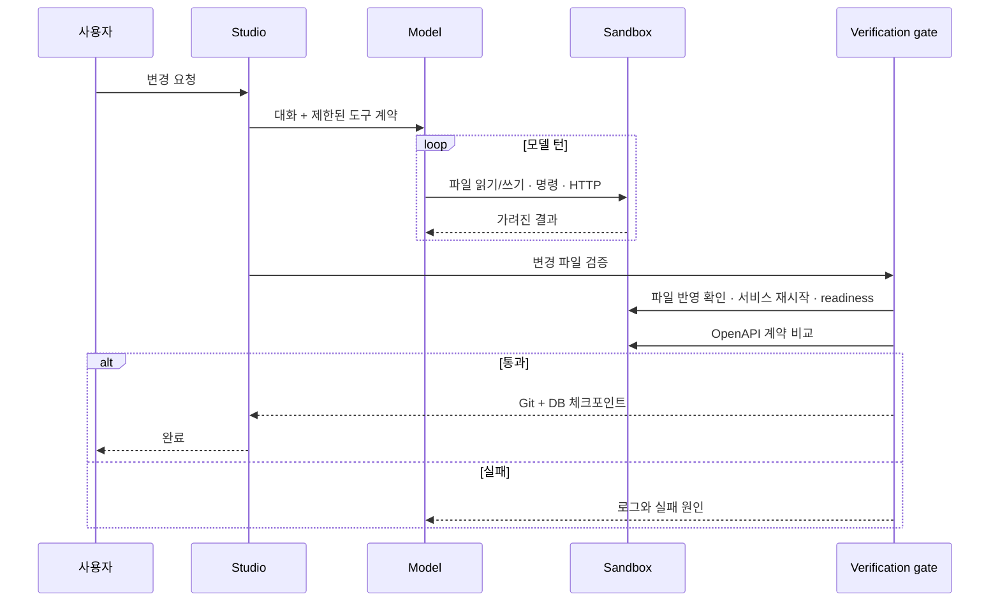

# 아키텍처

b-studio는 여러 코딩 에이전트의 독립 작업 공간, 진행 상태, 토큰 사용량, 실행 화면과 diff를 한곳에서 조율하는 **AI 개발 환경(ADE)**입니다. 코드를 직접 편집하는 IDE를 대체하기보다, 어떤 모델이 어느 단계에 있고 어떤 결과를 선택할지 판단하는 제어 계층에 집중합니다.

핵심 원칙은 **모델이 코드를 쓰고, 플랫폼이 실행 결과를 판정한다**는 것입니다. 모델의 자연어 답변은 완료 조건이 아니며, 샌드박스와 검증 게이트가 최종 판단을 맡습니다.

## 컴포넌트

```mermaid
flowchart TB
  subgraph Entry[사용자 접점]
    CLI[apps/cli]
    UI[apps/studio]
  end
  subgraph Core[코어 패키지]
    SPEC[@b-studio/spec]
    AGENT[@b-studio/agent + Pi bridge]
    SANDBOX[@b-studio/sandbox]
    ROUTER[Model Router]
  end
  subgraph Runtime[격리 실행 환경]
    EDGE[edge proxy]
    WEB[managed web]
    API[managed api]
    DB[(PostgreSQL)]
  end
  CLI --> SPEC
  UI --> SPEC
  CLI --> AGENT
  UI --> ROUTER --> AGENT
  AGENT --> SANDBOX
  SANDBOX --> EDGE
  EDGE --> WEB
  EDGE --> API
  API --> DB
```

| 영역 | 책임 |
|---|---|
| `apps/cli` | 프로젝트 기동, 단일 에이전트 요청, 배포, 인증 토큰 생성 |
| `apps/studio` | 세션·대화·미리보기·API·로그 UI, 복구, Fleet 비교 |
| `packages/spec` | `studio.yaml` 스키마와 compose 교차 검증 |
| `packages/sandbox` | Docker/Kubernetes 제공자, 준비 판정, 네트워크·시크릿·DB·배포 |
| `packages/agent` | 모델 클라이언트, 제한된 도구, 워크플로 정책, 검증 게이트, Git 체크포인트와 원격 연동 |

## 요청 수명 주기



직접 만든 루프와 로컬 Claude Code 러너는 같은 `VerificationGate`로 완료를 판정합니다. 게이트는 모델이 턴을 끝낼 때마다 다음 순서로 돕니다.

```text
run (바뀐 서비스 재시작·준비 판정)
 → contract_check (OpenAPI 호환성)
 → browser_check · test (studio.yaml에 선언한 것만, 작업 그래프로 동시에. 화면 확인은 HTTP 또는 헤드리스 Chromium)
 → review (보호 경로·변경 파일 수를 전체 diff에서 다시 확인)
 → 필수 단계 대조 → checkpoint
```

앞 단계가 실패하면 뒤 단계는 돌리지 않고 실패 결과를 모델에게 돌려줍니다. 통과한 단계는 `AgentResult.passedStages`로 남고 체크포인트 커밋 본문 끝에 `Workflow-Passed:` 트레일러로 기록됩니다. 배포는 이 트레일러를 실행 중인 세션의 `releaseRequires`와 대조합니다.

Pi 확장은 이 게이트 밖에서 동작하는 안내·조기 차단 계층입니다. 같은 정책 코드(`checkToolPolicy`)로 Pi 내장 도구 호출을 판정하지만 체크포인트를 만들지 않습니다.

## 샌드박스 경계

- managed 서비스는 프로젝트마다 분리된 실행 환경에서 동작합니다.
- 서비스 포트는 edge를 통해 루프백의 빈 포트로만 공개합니다.
- 샌드박스 네트워크는 기본적으로 외부 통신을 막고, 허용된 HTTP(S) 호스트만 프록시합니다.
- 시크릿은 설정 파일에 값을 넣지 않고 서버 환경 또는 별도 시크릿 파일에서 읽습니다.
- 명령 출력, 로그, HTTP 응답은 모델과 UI에 전달하기 전에 시크릿을 가립니다.
- 서비스별 메모리와 CPU 상한을 적용할 수 있습니다.

## 상태와 복구

세션마다 별도 작업 복사본과 체크포인트 기록을 둡니다. 검증을 통과하면 파일 변경과 PostgreSQL 덤프를 같은 시점으로 저장합니다. 프로세스가 비정상 종료되면 남은 샌드박스를 정리하고 마지막 체크포인트에서 새 샌드박스를 만들어 이어서 작업합니다.

로컬 폴더를 직접 다루는 세션은 사용자 저장소의 `.git`을 수정하지 않도록 별도 Git 디렉터리를 사용합니다. 원격 저장소 세션은 브랜치를 분리하고, 마지막으로 올린 커밋을 기준으로 lease를 확인해 리뷰어의 변경을 덮어쓰지 않습니다.

## 병렬 작업과 작업 그래프

병렬 실행은 두 방식으로 나눕니다.

| 방식 | 용도 | 격리와 완료 조건 |
|---|---|---|
| Agent Fleet | 같은 요청을 여러 모델로 비교 | 후보마다 별도 Git 작업 복제본·브랜치·샌드박스. 검증 통과 후보만 사람이 선택 |
| Task Graph | 서로 기다릴 필요가 없는 작업을 동시 실행 수 안에서 처리 | 의존 작업이 통과해야 다음 노드를 실행하고, 실패한 노드의 후속 작업은 `skipped`로 기록. 노드별 재시도 횟수를 결과에 남긴다 |
| 작업 분해 | 한 요청을 여러 작업으로 나눠 동시에 처리 | 실행 전에 사람이 계획을 승인. 이어진 작업은 한 세션(레인)에서 차례로, 레인끼리는 다른 세션에서 동시에. 작업마다 쓰기 범위를 실행기에서 걸고, 통합 결과를 새 세션에서 게이트로 다시 검증 |

`runTaskGraph`를 쓰는 곳은 두 군데입니다. 검증 게이트는 `studio.yaml`의 `tests`와 `pageChecks`를 동시 실행 수 2로 함께 돌리고, 테스트마다 선언한 `maxAttempts`만큼 다시 시도합니다. 작업 분해는 레인을 최대 3개까지 동시에 돌립니다. 실행 함수를 주입받는 구조라 특정 큐나 메신저에 묶이지 않습니다.

```text
재시작·계약 통과
 ├─ page: web /      ─┐
 ├─ test: web-lint   ─┼─ review ─ 필수 단계 대조 ─ checkpoint
 └─ test: api-unit   ─┘
```

### 작업 분해 흐름

```text
요청 ─ 계획(모델 JSON) ─ planLanes 검증 ─ 사람 승인 ─┬─ lane-1 세션: a1 → a2  (쓰기 범위 web/a)
                                                      └─ lane-2 세션: b        (쓰기 범위 web/b)
                                                                  │ 모두 게이트 통과
                                                                  ▼
                                                   레인 파일을 메모리로 옮기고 레인 세션 종료
                                                                  ▼
                                                   통합 세션: 같은 루프·게이트로 파일 재적용 ─ 체크포인트
```

- 계획이 형식·의존성·순환·경로·레인 수(3)·작업 수(6) 검사를 통과하면 곧바로 실행하지 않고 `awaiting_approval`로 멈춥니다. 사람이 `POST /api/task-plans/[id]/approval`로 승인해야 레인이 돌고, 거부하면 어떤 레인 세션도 만들지 않고 `rejected`로 남깁니다. 승인을 건너뛰는 옵션·환경 변수·기본값은 없습니다.
- 승인 대기(`awaiting_approval`)는 진행 중인 실행이 아니므로 서버가 다시 떠도 유지돼 승인을 기다립니다. 재시작 때 계획 중·레인 실행 중·통합 중(`planning`·`running`·`integrating`)이던 계획은 레인이 끝나지 않았으면 실패로 남습니다.
- 레인이 끝나는 시점에 작업 폴더와 바꾼 파일을 계획에 남기므로, 레인이 모두 끝나 통합만 남은 계획은 재시작 뒤에도 `interrupted`로 남아 `POST /api/task-plans/[id]/resume`로 통합만 다시 시작할 수 있습니다. 레인은 다시 돌리지 않고, 서버가 뜨자마자 자동으로 시작하지도 않습니다.
- 계획은 형식·의존성·순환·경로·레인 수(3)·작업 수(6)를 검사하고, **병렬 레인의 쓰기 범위가 겹치면 실행하지 않습니다.** 틀린 계획을 한 작업으로 몰래 바꾸지 않습니다.
- 쓰기 범위는 `studio.yaml` 정책 위에 더합니다(`scopedExecutionPolicy`). 정책을 통째로 바꾸면 금지 명령·보호 경로가 빠지기 때문입니다.
- 통합은 git 병합 대신 레인 결과 파일을 새 세션에서 `write_file`로 다시 적용합니다. 모델을 부르지 않고 같은 루프·게이트를 지나므로, 합친 결과도 재기동·계약·화면·테스트·리뷰를 다시 통과해야 체크포인트가 됩니다.
- 체크포인트에 레인 범위 밖 파일이 있거나(명령으로 만든 파일 등) 레인이 지운 파일이 있으면 통합하지 않습니다.
- 통합 샌드박스를 띄우기 전에 레인 세션을 내려, 동시에 뜨는 샌드박스를 레인 수 이하로 둡니다.
- 자동 병합·푸시·배포는 하지 않습니다. 통합 세션의 체크포인트는 기존 PR·배포 조건 흐름으로 넘깁니다.

## 확장 지점

- `SandboxProvider`: Local Docker와 Kubernetes 구현을 교체할 수 있습니다.
- `ModelClient`: Anthropic, OpenAI 호환 API, Gemini, 로컬 Claude Code를 같은 루프에서 사용합니다.
- `studio.yaml`: compose와 OpenAPI를 대체하지 않고 스튜디오 전용 정책만 덧붙입니다.

각 선택의 검토 과정과 트레이드오프는 [설계 결정 기록](decisions.md)을 참고하세요.
