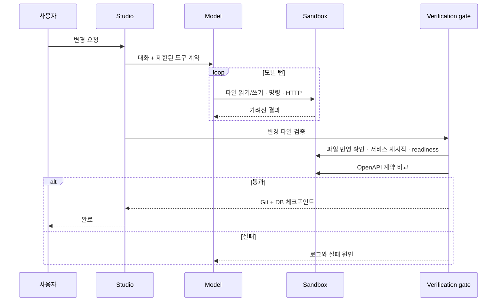

# 아키텍처

b-studio는 여러 코딩 에이전트의 독립 작업 공간, 진행 상태, 토큰 사용량, 실행 화면과 diff를 한곳에서 조율하는 **AI 개발 환경(ADE)**입니다. 코드를 직접 편집하는 IDE를 대체하기보다, 어떤 모델이 어느 단계에 있고 어떤 결과를 선택할지 판단하는 제어 계층에 집중합니다.

핵심 원칙은 **모델이 코드를 쓰고, 플랫폼이 실행 결과를 판정한다**는 것입니다. 모델의 자연어 답변은 완료 조건이 아니며, 샌드박스와 검증 게이트가 최종 판단을 맡습니다.

## 컴포넌트

```mermaid
flowchart TB
  subgraph Entry[사용자 접점]
    CLI[apps/cli]
    UI[apps/studio]
  end
  subgraph Core[코어 패키지]
    SPEC[@b-studio/spec]
    AGENT[@b-studio/agent]
    SANDBOX[@b-studio/sandbox]
    ROUTER[Model Router]
  end
  subgraph Runtime[격리 실행 환경]
    EDGE[edge proxy]
    WEB[managed web]
    API[managed api]
    DB[(PostgreSQL)]
  end
  CLI --> SPEC
  UI --> SPEC
  CLI --> AGENT
  UI --> ROUTER --> AGENT
  AGENT --> SANDBOX
  SANDBOX --> EDGE
  EDGE --> WEB
  EDGE --> API
  API --> DB
```

| 영역 | 책임 |
|---|---|
| `apps/cli` | 프로젝트 기동, 단일 에이전트 요청, 배포, 인증 토큰 생성 |
| `apps/studio` | 세션·대화·미리보기·API·로그 UI, 복구, Fleet 비교 |
| `packages/spec` | `studio.yaml` 스키마와 compose 교차 검증 |
| `packages/sandbox` | Docker/Kubernetes 제공자, 준비 판정, 네트워크·시크릿·DB·배포 |
| `packages/agent` | 모델 클라이언트, 제한된 도구, 검증 게이트, Git 체크포인트와 원격 연동 |

## 요청 수명 주기



## 샌드박스 경계

- managed 서비스는 프로젝트마다 분리된 실행 환경에서 동작합니다.
- 서비스 포트는 edge를 통해 루프백의 빈 포트로만 공개합니다.
- 샌드박스 네트워크는 기본적으로 외부 통신을 막고, 허용된 HTTP(S) 호스트만 프록시합니다.
- 시크릿은 설정 파일에 값을 넣지 않고 서버 환경 또는 별도 시크릿 파일에서 읽습니다.
- 명령 출력, 로그, HTTP 응답은 모델과 UI에 전달하기 전에 시크릿을 가립니다.
- 서비스별 메모리와 CPU 상한을 적용할 수 있습니다.

## 상태와 복구

세션마다 별도 작업 복사본과 체크포인트 기록을 둡니다. 검증을 통과하면 파일 변경과 PostgreSQL 덤프를 같은 시점으로 저장합니다. 프로세스가 비정상 종료되면 남은 샌드박스를 정리하고 마지막 체크포인트에서 새 샌드박스를 만들어 이어서 작업합니다.

로컬 폴더를 직접 다루는 세션은 사용자 저장소의 `.git`을 수정하지 않도록 별도 Git 디렉터리를 사용합니다. 원격 저장소 세션은 브랜치를 분리하고, 마지막으로 올린 커밋을 기준으로 lease를 확인해 리뷰어의 변경을 덮어쓰지 않습니다.

## 확장 지점

- `SandboxProvider`: Local Docker와 Kubernetes 구현을 교체할 수 있습니다.
- `ModelClient`: Anthropic, OpenAI 호환 API, Gemini, 로컬 Claude Code를 같은 루프에서 사용합니다.
- `studio.yaml`: compose와 OpenAPI를 대체하지 않고 스튜디오 전용 정책만 덧붙입니다.

각 선택의 검토 과정과 트레이드오프는 [설계 결정 기록](decisions.md)을 참고하세요.
