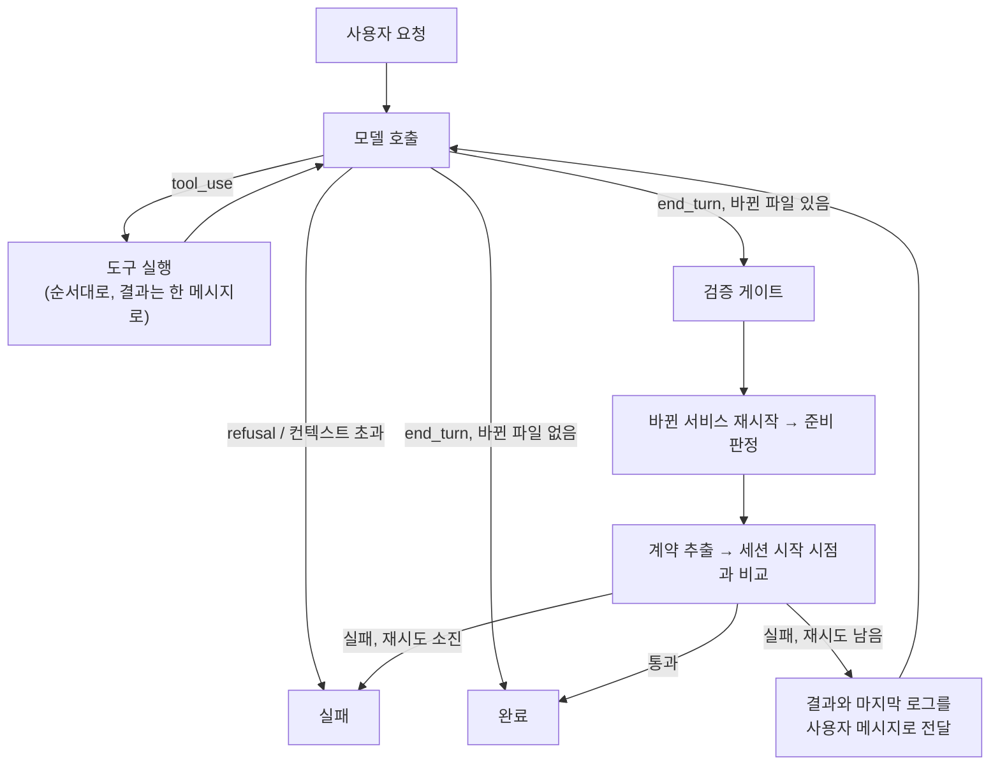

# 설계 결정 기록 (ADR)

결정마다 **맥락 → 검토한 선택지 → 결정 → 감수한 트레이드오프** 순서로 적었습니다. 외부 제품의 수치와 사실은 2026년 9월에 공개 자료로 확인한 내용이고, 문서 끝에 출처를 모았습니다.

- [ADR-001 미리보기 런타임: 브라우저 번들러 대신 서버 샌드박스](#adr-001-미리보기-런타임-브라우저-번들러-대신-서버-샌드박스)
- [ADR-002 프로젝트 모델: 구조는 통합, 작업 화면은 분리](#adr-002-프로젝트-모델-구조는-통합-작업-화면은-분리)
- [ADR-003 계약은 코드에서 추출하는 선택 사항](#adr-003-계약은-코드에서-추출하는-선택-사항)
- [ADR-004 새 DSL을 만들지 않는다: compose + OpenAPI 위의 얇은 층](#adr-004-새-dsl을-만들지-않는다-compose--openapi-위의-얇은-층)
- [ADR-005 첫 대상은 사내 도구, 백엔드는 Spring 우선](#adr-005-첫-대상은-사내-도구-백엔드는-spring-우선)
- [ADR-006 샌드박스 제공자를 추상화하고 로컬 Docker부터 구현](#adr-006-샌드박스-제공자를-추상화하고-로컬-docker부터-구현)
- [ADR-007 서비스 준비 판정 규칙](#adr-007-서비스-준비-판정-규칙)
- [ADR-008 볼륨을 샌드박스 전용과 공유 캐시로 나눈다](#adr-008-볼륨을-샌드박스-전용과-공유-캐시로-나눈다)
- [ADR-009 포트는 루프백의 빈 포트에만 공개한다](#adr-009-포트는-루프백의-빈-포트에만-공개한다)
- [ADR-010 에이전트 루프: 직접 작성한 루프와 스튜디오 검증 게이트](#adr-010-에이전트-루프-직접-작성한-루프와-스튜디오-검증-게이트)
- [ADR-011 도구 설계: bash 하나 대신 행동별 도구](#adr-011-도구-설계-bash-하나-대신-행동별-도구)
- [ADR-012 모델 설정과 프롬프트 (Claude Opus 5)](#adr-012-모델-설정과-프롬프트-claude-opus-5)
- [ADR-013 계약 호환 정책: 기본은 차단, 요청이 명시할 때만 허용](#adr-013-계약-호환-정책-기본은-차단-요청이-명시할-때만-허용)
- [ADR-014 재시작 전에 샌드박스가 바뀐 파일을 보는지 확인한다](#adr-014-재시작-전에-샌드박스가-바뀐-파일을-보는지-확인한다)
- [ADR-015 스튜디오 서버: Next.js 단일 앱과 Server-Sent Events](#adr-015-스튜디오-서버-nextjs-단일-앱과-server-sent-events)
- [ADR-016 세션마다 작업 복사본, API 키 없는 데모 모드](#adr-016-세션마다-작업-복사본-api-키-없는-데모-모드)
- [ADR-017 미리보기와 API 탐색기의 네트워크 경계](#adr-017-미리보기와-api-탐색기의-네트워크-경계)
- [ADR-018 세션 체크포인트: 검증을 통과한 변경만 남긴다](#adr-018-세션-체크포인트-검증을-통과한-변경만-남긴다)
- [ADR-019 로컬 로그인 계정으로 실행: API 키 없이 개인 PC에서만](#adr-019-로컬-로그인-계정으로-실행-api-키-없이-개인-pc에서만)
- [ADR-020 원격 저장소 연동: 세션 브랜치와 덮어쓰지 않는 푸시](#adr-020-원격-저장소-연동-세션-브랜치와-덮어쓰지-않는-푸시)
- [ADR-021 기동 최적화: 입력 파일 해시로 찾는 스냅샷 볼륨](#adr-021-기동-최적화-입력-파일-해시로-찾는-스냅샷-볼륨)
- [ADR-022 데이터베이스 브랜치: 체크포인트마다 DB 상태를 함께 남긴다](#adr-022-데이터베이스-브랜치-체크포인트마다-db-상태를-함께-남긴다)
- [ADR-023 자원 한도와 사용량: 한도를 걸고, 판단에 필요한 수치만 보여 준다](#adr-023-자원-한도와-사용량-한도를-걸고-판단에-필요한-수치만-보여-준다)
- [ADR-024 네트워크 격리: 샌드박스의 출입구를 하나로 만든다](#adr-024-네트워크-격리-샌드박스의-출입구를-하나로-만든다)
- [ADR-025 시크릿 주입과 가림: 값은 보이지 않게 넣고, 새는 경로를 막는다](#adr-025-시크릿-주입과-가림-값은-보이지-않게-넣고-새는-경로를-막는다)
- [ADR-026 정책 프록시: 사내 API는 edge를 거쳐서만 부른다](#adr-026-정책-프록시-사내-api는-edge를-거쳐서만-부른다)
- [ADR-027 격리 강화: 운영자가 고르는 컨테이너 런타임과 gVisor](#adr-027-격리-강화-운영자가-고르는-컨테이너-런타임과-gvisor)
- [ADR-028 Kubernetes 제공자: 서비스마다 agent-sandbox Sandbox를 둔다](#adr-028-kubernetes-제공자-서비스마다-agent-sandbox-sandbox를-둔다)
- [ADR-029 세션 복구: 세션 상태를 작업 복사본에 남기고 새 샌드박스로 이어서 작업한다](#adr-029-세션-복구-세션-상태를-작업-복사본에-남기고-새-샌드박스로-이어서-작업한다)
- [ADR-030 원격 변경 가져오기: 리뷰어 커밋을 병합 커밋으로 가져와 게이트로 확인한다](#adr-030-원격-변경-가져오기-리뷰어-커밋을-병합-커밋으로-가져와-게이트로-확인한다)
- [ADR-031 화면 디자인: 조작 계층만 유리로 띄우고 읽는 영역은 불투명하게 둔다](#adr-031-화면-디자인-조작-계층만-유리로-띄우고-읽는-영역은-불투명하게-둔다)
- [ADR-032 모노레포 하위 폴더: 저장소 전체를 복제하고 경로는 프로젝트 기준으로 바꾼다](#adr-032-모노레포-하위-폴더-저장소-전체를-복제하고-경로는-프로젝트-기준으로-바꾼다)
- [ADR-033 원격 미리보기: 호스트 이름으로 나누는 게이트웨이가 경로를 그대로 넘긴다](#adr-033-원격-미리보기-호스트-이름으로-나누는-게이트웨이가-경로를-그대로-넘긴다)
- [ADR-034 실시간 코드 보기: 에이전트 이벤트로 다시 불러오고, 읽기는 작업 공간 규칙을 따른다](#adr-034-실시간-코드-보기-에이전트-이벤트로-다시-불러오고-읽기는-작업-공간-규칙을-따른다)
- [ADR-035 요청 취소와 토큰 사용량: 샌드박스는 그대로 두고 요청만 되돌리며, 합계는 서버가 센다](#adr-035-요청-취소와-토큰-사용량-샌드박스는-그대로-두고-요청만-되돌리며-합계는-서버가-센다)
- [ADR-036 코드 문법 강조: Shiki를 처음 볼 때 불러오고, 색은 CSS 변수로 테마를 따른다](#adr-036-코드-문법-강조-shiki를-처음-볼-때-불러오고-색은-css-변수로-테마를-따른다)
- [ADR-037 답변 마크다운: 요소로 그리되 HTML과 외부 요청은 막는다](#adr-037-답변-마크다운-요소로-그리되-html과-외부-요청은-막는다)
- [ADR-038 세션 토큰 한도: 운영자가 서버에서 정하고, 넘는 순간 요청을 멈춘다](#adr-038-세션-토큰-한도-운영자가-서버에서-정하고-넘는-순간-요청을-멈춘다)
- [ADR-039 코드 탭 찾기와 변경 감시: 서버가 작업 복사본을 감시하고, 알림은 기록에 쌓지 않는다](#adr-039-코드-탭-찾기와-변경-감시-서버가-작업-복사본을-감시하고-알림은-기록에-쌓지-않는다)
- [ADR-040 스튜디오 인증: proxy.ts와 라우트에서 두 번 확인하고, 세션을 바꾸는 일은 만든 사람과 관리자만 한다](#adr-040-스튜디오-인증-proxyts와-라우트에서-두-번-확인하고-세션을-바꾸는-일은-만든-사람과-관리자만-한다)
- [ADR-041 내 폴더에서 바로 작업: 체크포인트 저장소는 폴더 밖에 두고, 사람의 수정은 먼저 남긴다](#adr-041-내-폴더에서-바로-작업-체크포인트-저장소는-폴더-밖에-두고-사람의-수정은-먼저-남긴다)
- [ADR-042 질문 모드: 같은 대화와 도구 목록을 쓰고, 바꾸는 도구는 실행기에서 막는다](#adr-042-질문-모드-같은-대화와-도구-목록을-쓰고-바꾸는-도구는-실행기에서-막는다)
- [ADR-043 운영 배포: 릴리스마다 compose 프로젝트를 띄우고, 고정 주소의 프록시로 무중단 전환한다](#adr-043-운영-배포-릴리스마다-compose-프로젝트를-띄우고-고정-주소의-프록시로-무중단-전환한다)
- [ADR-044 CI와 스튜디오 이미지: 호스트 Docker 소켓을 쓰고, 세션·배포 폴더는 같은 경로로 마운트한다](#adr-044-ci와-스튜디오-이미지-호스트-docker-소켓을-쓰고-세션배포-폴더는-같은-경로로-마운트한다)
- [ADR-045 인증 보강: 로그아웃을 서버에 남기고, 토큰은 해시로 두며, 미리보기는 1회용 티켓으로 연다](#adr-045-인증-보강-로그아웃을-서버에-남기고-토큰은-해시로-두며-미리보기는-1회용-티켓으로-연다)
- [ADR-046 코드 탭: 목록은 서버에서 좁혀 쪽 단위로 보내고, 내용 찾기도 서버가 한다](#adr-046-코드-탭-목록은-서버에서-좁혀-쪽-단위로-보내고-내용-찾기도-서버가-한다)

---

## ADR-001 미리보기 런타임: 브라우저 번들러 대신 서버 샌드박스

### 맥락
AI가 만든 코드를 사용자가 몇 초 안에 볼 수 있어야 합니다. 토스 TOI는 이 문제를 **브라우저 안에서** 풀었습니다.
- 경로를 키로 쓰는 4계층 가상 파일 시스템
- Web Worker에서 도는 esbuild-wasm
- `packageSetHash`(엔트리 목록 + yarn.lock 해시)로 미리 번들링해 S3에 올린 import map
- 빌드와 실행이 모두 성공했을 때만 iframe을 교체하는 방식

이 방식으로 첫 화면을 47초에서 1.3초로 줄였습니다. 하지만 이 프로젝트는 **Next.js 같은 서버 프레임워크와 백엔드까지** 실행해야 합니다.

### 검토한 선택지

| 방식 | 사례 | Next.js | 현업 적용 시 문제 |
|---|---|---|---|
| A. 브라우저 번들러 (esbuild-wasm) | 토스 TOI | ❌ | 클라이언트 React SPA만 가능. RSC, SSR, Server Action 불가 |
| B. 브라우저 안의 Node (WebContainers) | bolt.new | ⚠️ | Turbopack이 wasm 바인딩을 지원하지 않아 Next 16 기본 설정으로는 `next dev`가 실패함 (`turbo.createProject is not supported by the wasm bindings`). napi 네이티브 모듈 불가. 상용 서비스는 유료 라이선스 필요 |
| B'. Nodebox | Sandpack 2 | ⚠️ | Node 18 수준 호환, napi 불가, 사내 npm 지원은 개발 중 |
| **C. 서버 샌드박스** | Lovable (Fly.io), v0 (2026년 2월 샌드박스 런타임으로 전환) | ✅ | 컴퓨팅 비용, 콜드 스타트 |

### 결정
**C. 실제 Linux 환경에서 실제 개발 서버를 실행한다.** 프레임워크와 언어 제한이 없고, 로컬 개발 환경과 동작이 같습니다.

### 감수한 트레이드오프와 대응
- **콜드 스타트**: 의존성 캐시를 공유하고([ADR-008](#adr-008-볼륨을-샌드박스-전용과-공유-캐시로-나눈다)), 이후에는 lockfile 해시별로 설치가 끝난 스냅샷을 재사용할 계획입니다. TOI의 `packageSetHash` 아이디어를 서버 환경에 옮긴 것입니다.
- **비용과 운영 부담**: 제공자를 추상화해서([ADR-006](#adr-006-샌드박스-제공자를-추상화하고-로컬-docker부터-구현)) 규모와 보안 요구에 맞는 구현을 고를 수 있게 했습니다.
- TOI의 "성공한 번들만 반영" 원칙은 **헬스체크를 통과한 서버로만 트래픽을 넘기는 방식**으로 옮길 수 있습니다. 준비 판정([ADR-007](#adr-007-서비스-준비-판정-규칙))이 그 기반입니다.

---

## ADR-002 프로젝트 모델: 구조는 통합, 작업 화면은 분리

### 맥락
사용자마다 원하는 작업 방식이 다릅니다.
- 이미 있는 백엔드에 **화면만** 붙이고 싶은 사람 (TOI의 경우)
- **백엔드만** 만들지만 화면에서 테스트하며 개발하고 싶은 사람
- 프론트와 백엔드를 **함께** 만들고 싶은 사람

### 검토한 선택지
1. **제품을 프론트용과 백엔드용으로 나눈다**: 각 제품은 단순하지만, 나중에 합치려면 프로젝트·권한·배포 모델을 옮겨야 합니다. 또 "필드 하나 추가"처럼 DB, API, 화면을 한 번에 바꾸는 AI의 핵심 장점을 잃습니다.
2. **항상 풀스택으로 강제한다**: 백엔드만 만드는 사람에게 방해가 되고, 이미 레포와 배포 주기가 나뉜 조직에 맞지 않습니다.
3. **구조는 하나로, 작업 화면은 목적별로**

### 결정
**3번.** 프로젝트는 `서비스 목록 + (선택적) 계약`이고, 서비스는 `source: managed | external`로 구분합니다.

| 사용자 상황 | 서비스 구성 |
|---|---|
| 기존 백엔드에 화면만 | `web`(managed) + `api`(external) |
| 백엔드만 | `api`(managed) |
| 풀스택 | `web` + `api` (둘 다 managed) |
| 백엔드로 시작해 나중에 화면 추가 | `web` 서비스만 추가하면 됨. 프로젝트를 옮기지 않음 |

### 판단 기준
**되돌리기 비용**을 봤습니다. 내부 모델을 나누는 결정은 되돌리기 어렵고, 화면을 나누는 결정은 UI만 바꾸면 됩니다. 불확실할 때는 되돌리기 어려운 쪽을 유연하게 두었습니다.

---

## ADR-003 계약은 코드에서 추출하는 선택 사항

### 맥락
처음에는 OpenAPI 계약을 프론트와 백엔드 사이의 중심에 두려고 했습니다. 목 서버, 에이전트 검증 기준, 팀 간 경계 역할을 모두 할 수 있기 때문입니다. 그런데 다시 검토해 보니 현실과 맞지 않는 부분이 있었습니다.
- Spring(springdoc)과 FastAPI 개발자는 **코드부터 짜고 OpenAPI를 뽑아냅니다.**
- Next.js 풀스택은 Server Action과 Route Handler로 **서비스 하나 안에서** 끝나는 경우가 많습니다.
- REST가 아닌 GraphQL, gRPC, tRPC도 있습니다.

### 결정
- 계약은 **없어도 되는 선택 사항**입니다.
- 사람이 먼저 쓰는 파일이 아니라 **실행 중인 서버에서 추출해 변경 전후를 비교하는 결과물**로 다룹니다. (`contract.extract: /v3/api-docs`)
- 서비스 하나짜리 풀스택 프로젝트도 정식으로 지원합니다.

---

## ADR-004 새 DSL을 만들지 않는다: compose + OpenAPI 위의 얇은 층

### 맥락
사내 도구라도 **"이 도구를 그만 쓰면 코드를 그대로 가져갈 수 있는가"**가 도입 조건이 됩니다.

### 결정
- 실행: 표준 **Docker Compose** 파일
- 계약: 표준 **OpenAPI**
- `studio.yaml`: 스튜디오에만 필요한 정보(managed/external 구분, 미리보기 종류, 준비 확인 경로, 계약 추출 경로)만 담습니다.

`examples/orders`는 스튜디오 없이 `docker compose up`으로도 똑같이 실행됩니다. 스튜디오가 필요한 설정(포트 공개, 라벨)은 사용자 파일을 고치지 않고 **임시 override 파일**로 덧씌웁니다.

로더는 두 파일이 서로 맞는지 검증합니다. managed 서비스는 compose에 반드시 있어야 하고, external 서비스는 compose에 있으면 안 됩니다. compose에만 있는 서비스(예: `db`)는 샌드박스와 함께 뜨고 함께 사라지는 부가 서비스로 취급합니다.

---

## ADR-005 첫 대상은 사내 도구, 백엔드는 Spring 우선

### 맥락
범용 AI 앱 빌더는 Replit, Lovable, v0와 정면으로 경쟁하게 됩니다. TOI 사례를 보면 진짜 가치는 코드 생성보다 **"정책이 자동으로 적용되는 플랫폼"**에 있었습니다.

### 결정
- **사내 도구**를 첫 대상으로 정했습니다. 사내망 설치, 개인정보 마스킹, 감사 로그가 차별점이 됩니다.
- 백엔드 템플릿은 **Spring Boot**를 먼저 만들고 **FastAPI**도 제공합니다.

### 템플릿 원칙
런타임은 어떤 프레임워크든 실행할 수 있게 열어 두되, AI가 쓰는 스택은 **검증된 템플릿**으로 제한합니다. "모든 프레임워크 호환"과 "모든 프레임워크에서 좋은 품질"은 다른 문제이기 때문입니다.

---

## ADR-006 샌드박스 제공자를 추상화하고 로컬 Docker부터 구현

### 맥락
사내 도구는 운영 환경이 회사마다 다릅니다. 관리형 서비스를 쓸 수 있는 곳도 있고, 사내망 Kubernetes만 허용하는 곳도 있습니다.

| 제공자 | 격리 | 자체 운영 |
|---|---|---|
| Vercel Sandbox | Firecracker microVM | ❌ |
| E2B | Firecracker | ✅ |
| Northflank | Kata / gVisor | ✅ (BYOC) |
| Kubernetes agent-sandbox | gVisor / Kata, 웜 풀 | ✅ (오픈소스) |

### 결정
`SandboxProvider.create(project) → Sandbox` 인터페이스를 두고, 첫 구현은 **`LocalDockerProvider`**로 했습니다.
- 외부 계정 없이 개발할 수 있습니다.
- compose 기반이라 사내 서버 한 대 운영에도 그대로 쓸 수 있습니다.
- 인터페이스(`start`, `restart`, `endpoint`, `state`, `logs`, `exec`, `destroy`)는 원격 microVM 구현에서도 그대로 성립하도록 파일 시스템 경로에 의존하지 않게 설계했습니다.

### 감수한 트레이드오프
로컬 Docker는 **컨테이너 수준의 격리**입니다. 사내 운영에서 신뢰할 수 없는 생성 코드를 돌리려면 gVisor/Kata 기반 제공자로 바꿔야 하고, 로드맵에 넣었습니다.

---

## ADR-007 서비스 준비 판정 규칙

### 맥락
준비 판정은 **"미리보기가 언제 뜨는가"**와 **"에이전트가 언제 실패를 알게 되는가"**를 결정합니다. 실제 실행에서 관찰한 기동 과정은 이랬습니다.

```
UND_ERR_SOCKET (포트는 열렸지만 서버 준비 전)
→ TIMEOUT      (Next dev가 첫 요청을 컴파일하는 중)
→ HTTP 200
```

### 결정 (`packages/sandbox/src/readiness.ts`)

| 상황 | 판정 | 이유 |
|---|---|---|
| 기대한 상태 코드를 **연속 2번** 받음 | ready | 기동 직후 잠깐 성공했다가 흔들리는 경우를 걸러냄 |
| 컨테이너가 `exited` / `dead` | **즉시** failed | 컴파일 에러가 나면 15분 타임아웃을 기다리지 않고 몇 초 만에 결과를 받음 |
| 연결 거부, 소켓 에러, 타임아웃, 503, `restarting` | waiting | 기동 중에 흔한 상태 |
| 서비스별 `timeoutSeconds` 초과 | failed | 마지막 확인 결과(`HTTP 503, 컨테이너 running` 등)를 실패 이유에 담아 에이전트가 읽을 수 있게 함 |

판정 함수는 확인 기록 배열만 받는 **순수 함수**라서 Docker 없이 단위 테스트 6개로 검증했습니다.

---

## ADR-008 볼륨을 샌드박스 전용과 공유 캐시로 나눈다

### 맥락
샌드박스는 매번 새로 만들고 지우지만, 매번 Gradle 배포판과 의존성을 다시 받으면 기동이 몇 분씩 걸립니다.

### 결정

| 종류 | compose 선언 | 수명 | 예시 |
|---|---|---|---|
| 샌드박스 전용 | 일반 named volume | `destroy()` 때 삭제 | `node_modules`, `.next`, Gradle `build`, DB 데이터 |
| 공유 캐시 | `external: true` + 고정 이름 | 샌드박스를 지워도 유지 | `b-studio-cache-gradle`, `b-studio-cache-pnpm` |

compose는 external 볼륨을 만들어 주지 않으므로, 로더가 external 볼륨을 모아 두고 제공자가 기동 전에 `docker volume create`로 만듭니다(이미 있으면 그대로 둠).

### 나중에 고친 것: Gradle 캐시는 공유하면 안 됐다 (2026-09)
처음에는 "Gradle과 pnpm 캐시는 여러 프로세스가 동시에 써도 안전하다"고 적어 두고 Gradle 홈 전체를 공유했습니다. **Gradle 쪽은 사실이 아니었습니다.** 같은 프로젝트로 두 샌드박스를 띄우면 뒤에 뜨는 쪽이 캐시 잠금을 얻지 못해 빌드가 실패하는 것을 실측으로 확인했습니다([트러블슈팅 36](troubleshooting.md#36-같은-프로젝트로-두-세션을-동시에-띄우면-api-빌드가-실패함)).

- **Gradle 홈은 샌드박스 전용 볼륨으로 옮겼습니다.** 잠금이 샌드박스마다 따로 걸립니다.
- **공유는 이미지에 구운 읽기 전용 의존성 캐시로 대체했습니다**(`GRADLE_RO_DEP_CACHE`). Gradle은 이 캐시를 잠금 없이 읽습니다. 쓰기 공유 볼륨이 없어져 씨 뿌리기 경쟁도 사라졌습니다.
- **Gradle 배포판도 이미지에 넣습니다.** 샌드박스는 네트워크가 격리돼 있어 실행 중에 배포판을 받을 수 없습니다. compose가 붙이는 빈 볼륨은 첫 마운트 때 이미지의 그 경로 내용으로 채워지는 것을 따로 실측해 확인했습니다.
- **캐시를 굽는 태스크는 `downloadDependencies`입니다.** `dependencies` 리포트 태스크는 메타데이터만 받아, 실행할 때 jar을 다시 내려받으려 합니다.
- **감수한 비용**: 기동이 느려졌습니다(api 준비 13.9초 → 21.1초). 샌드박스마다 Gradle 홈을 새로 채우기 때문입니다. 같은 프로젝트로 두 세션을 띄울 수 있게 된 대가로 받아들였습니다. pnpm 캐시는 그대로 공유합니다.
- 이미 쓰던 설치에는 `b-studio-cache-gradle` 볼륨이 쓰이지 않는 상태로 남습니다. `docker volume rm b-studio-cache-gradle`로 지울 수 있습니다.

### 결과와 한계
Gradle 다운로드는 사라졌지만 두 번째 기동도 "늦어도 43초 안에 준비" 수준으로, 극적으로 빨라지지는 않았습니다. `node_modules`가 샌드박스마다 새로 설치되기 때문입니다. 자세한 분석은 [troubleshooting.md](troubleshooting.md#3-공유-캐시를-써도-두-번째-기동이-크게-빨라지지-않음)에 있습니다.

---

## ADR-009 포트는 루프백의 빈 포트에만 공개한다

### 결정
override 파일에서 managed 서비스 포트를 `127.0.0.1::<컨테이너 포트>` 형식으로 공개합니다.
- **빈 포트 자동 할당**: 샌드박스 여러 개를 동시에 띄워도 포트가 겹치지 않습니다. 할당된 포트는 `docker compose port`로 조회합니다.
- **루프백에만 공개**: 같은 네트워크의 다른 PC에서 샌드박스에 접근할 수 없습니다. 사내 도구의 기본값으로 필요합니다.
- 사용자의 `compose.yaml`에는 `ports`를 적지 않습니다. 템플릿을 그대로 여러 샌드박스에서 재사용하기 위해서입니다.

---

## ADR-010 에이전트 루프: 직접 작성한 루프와 스튜디오 검증 게이트

### 맥락
에이전트가 "끝났다"고 말하는 것만으로는 완료로 볼 수 없습니다. 서버가 실제로 뜨는지, API 계약을 깨지 않았는지는 **플랫폼이 직접 확인**해야 합니다. 또 이 확인 흐름은 API 키 없이도 반복해서 검증할 수 있어야 합니다.

### 검토한 선택지

| 방식 | 장점 | 이 프로젝트에 맞지 않는 점 |
|---|---|---|
| SDK Tool Runner (beta) | 루프를 직접 쓰지 않아도 됨 | 턴이 끝난 뒤 검증하고, 실패하면 결과를 넣어 루프를 재개하는 흐름을 훅으로 끼워 넣어야 함 |
| Managed Agents | Anthropic이 루프와 샌드박스를 운영 | 코드가 **우리 샌드박스**(사내망 Docker/Kubernetes)에서 실행돼야 하는 요구와 충돌 |
| **직접 작성한 루프** | 게이트·재시도·종료 조건을 코드로 명확히 표현, 모델 호출을 인터페이스로 분리 가능 | `pause_turn`, `refusal`, `max_tokens` 처리를 직접 유지해야 함 |

### 결정
`runAgent()`가 모델 호출을 `ModelClient` 인터페이스로 받습니다.
- `AnthropicModelClient`: 실제 Claude API
- `ScriptedModelClient`: 미리 적은 턴을 돌려주는 테스트 더블. **루프·도구·게이트·샌드박스가 맞물리는지** 검증하는 용도이고, 모델의 코딩 능력을 검증하지는 않습니다.



게이트는 매번 전체를 다시 확인하지 않습니다. **지난 게이트 이후 바뀐 파일**과 **지난번에 준비에 실패한 서비스의 파일**만 대상으로 삼습니다. 작업 공간이 쓰기마다 버전을 올리고, 게이트는 마지막으로 확인한 버전을 기억합니다.

---

## ADR-011 도구 설계: bash 하나 대신 행동별 도구

### 맥락
bash 도구 하나면 모델이 거의 모든 일을 할 수 있지만, 스튜디오는 불투명한 명령 문자열만 보게 됩니다. 사내 도구에서는 **어떤 파일을 바꿨는지 기록하고, 위험한 경로를 막고, 사람의 수정을 덮어쓰지 않는 것**이 필요합니다.

### 결정

| 도구 | 강제하는 규칙 |
|---|---|
| `list_files`, `read_file` | 프로젝트 루트 밖, 심볼릭 링크 탈출, `.git`·`node_modules`·`build`·`.env` 접근 차단 |
| `write_file`, `edit_file` | 위 규칙 + **읽은 뒤 파일이 바뀌었으면 쓰기 거부**(내용 해시 비교) + 바뀐 파일 기록. `edit_file`은 정확히 한 곳만 일치해야 수정 |
| `run_in_service` | 명령을 **인자 배열**로 받아 셸을 거치지 않음, 3분 타임아웃 |
| `restart_service`, `service_logs`, `http_request` | 실행 확인용. 재시작 실패 시 최근 로그를 함께 반환 |
| `get_contract` | OpenAPI 원문 대신 **연산·스키마 요약**을 반환해 토큰을 아낌 |

- 모든 도구는 `strict: true`이고 **모든 필드를 필수**로 둡니다. "없음"은 빈 문자열처럼 명시적인 값으로 표현합니다.
- 도구 출력이 3만 자를 넘으면 앞뒤를 남기고 **잘랐다는 표시를 넣습니다.** 조용히 자르지 않습니다.
- 도구 실패는 루프를 멈추지 않고 `is_error: true` 결과로 모델에게 돌려줍니다.

---

## ADR-012 모델 설정과 프롬프트 (Claude Opus 5)

### 요청 설정

| 설정 | 값 | 이유 |
|---|---|---|
| 모델 | `claude-opus-5` | 긴 에이전트 작업과 코딩에 가장 강한 Opus |
| thinking | `{ type: "adaptive" }` | Opus 5의 기본값이지만 의도를 명시 |
| effort | 기본 `high`, CLI `--effort`로 조정 | 비용과 품질의 기준점. 작업별로 낮춰 측정할 수 있게 열어 둠 |
| 전송 | 스트리밍 후 `finalMessage()`, `max_tokens` 64K | 긴 응답이 HTTP 타임아웃에 걸리지 않게 함 |
| 거절 대응 | `fallbacks: "default"` + `server-side-fallback-2026-07-01` | 안전 분류기가 거절하면 서버가 권장 모델로 다시 실행. 그래도 `stop_reason: "refusal"`이면 실패로 끝냄 |
| 프롬프트 캐시 | 시스템 프롬프트에 캐시 지점 + 요청 전체 자동 캐시 | 도구와 시스템 프롬프트는 프로젝트마다 고정. 시각 같은 가변 값을 넣지 않음 |
| 사전 확인 | `models.retrieve()` | 수십 초 걸리는 샌드박스를 띄우기 전에 인증과 모델 권한을 토큰 소비 없이 확인 |

### 프롬프트 튜닝
Opus 5 마이그레이션 가이드의 권고를 반영했습니다.
- **"작업을 검증하라"는 지시를 넣지 않았습니다.** 이 모델은 시키지 않아도 스스로 검증하므로, 검증은 프롬프트가 아니라 게이트가 강제합니다.
- 응답과 파일이 길어지고 범위를 넓히는 경향이 있어 **간결함과 범위 규칙**을 명시했습니다. "요청하지 않은 리팩터링, 이름 변경, 기능, 테스트, 파일을 추가하지 않는다" 같은 규칙입니다.
- 프레임워크 버전이 학습 시점보다 새로울 수 있으므로, Next.js는 **컨테이너 안의 버전별 문서**(`node_modules/next/dist/docs`)를 읽도록 안내합니다. Next.js 16이 생성한 `AGENTS.md`도 같은 원칙을 요구합니다.
- DB 스키마는 **새 Flyway 마이그레이션으로만** 바꾸고, 기존 마이그레이션은 수정하지 않습니다.

---

## ADR-013 계약 호환 정책: 기본은 차단, 요청이 명시할 때만 허용

### 결정
세션을 시작할 때 OpenAPI 계약을 저장해 두고, 게이트마다 현재 계약과 비교합니다.

| 변경 | 판정 |
|---|---|
| 연산 추가, 스키마 추가, **선택** 필드 추가 | 호환 |
| 연산·스키마·필드 삭제, 필드 타입 변경, 기존 필드 필수화, **필수** 필드 신규 추가 | **호환 깨짐** |

- 호환을 깨는 변경은 기본적으로 게이트를 통과하지 못합니다. 요청이 삭제나 변경을 명시할 때만 `--allow-breaking`으로 허용합니다.
- 결과는 호환 깨짐을 먼저, 그다음 대상 이름의 **코드포인트 순**으로 정렬합니다. 실행 환경의 로케일에 따라 순서가 달라지지 않게 하기 위해서입니다.

---

## ADR-014 재시작 전에 샌드박스가 바뀐 파일을 보는지 확인한다

### 맥락
로컬 Docker 제공자는 프로젝트 폴더를 컨테이너에 바인드 마운트합니다. macOS의 colima 기본 설정은 sshfs 마운트이고, Lima 문서에 따르면 sshfs 캐시는 **기본으로 켜져 있으며 호스트의 변경이 제때 반영되지 않을 수 있습니다.**

실제로 에이전트 e2e에서 검증 게이트가 **컴파일 에러가 있는 코드를 "준비 완료"로 통과시켰습니다.** 방금 쓴 파일을 VM 쪽에서 아직 보지 못한 상태로 서비스를 재시작해, 옛 코드가 빌드된 것으로 판단했습니다. 경위와 측정값은 [troubleshooting.md](troubleshooting.md)에 있습니다. 게이트가 틀린 결과를 통과시키는 것은 게이트가 없는 것보다 위험합니다.

### 검토한 선택지

| 방식 | 문제 |
|---|---|
| 재시작 전에 정해진 시간만큼 대기 | 느리고, 캐시 시간보다 짧으면 여전히 틀림 |
| virtiofs 같은 다른 마운트를 쓰라고 안내 | 사용자 환경을 강제할 수 없고, 다른 OS·원격 샌드박스에는 해당하지 않음 |
| 마운트 대신 파일을 복사해 넣기 | 표준 compose 파일만으로 똑같이 실행된다는 원칙([ADR-004](#adr-004-새-dsl을-만들지-않는다-compose--openapi-위의-얇은-층))이 깨짐 |
| **동기화 지점 `Sandbox.sync(files)`** | 확인 한 번마다 약간의 비용 |

### 결정
재시작하기 전에 **샌드박스 쪽에서 바뀐 파일이 보일 때까지** 기다립니다.
- **확인 기준 두 가지**: 디렉터리 목록(readdir)에 이름이 보이는지와, 내용의 sha256이 호스트와 같은지를 함께 확인합니다. 빌드 도구는 목록과 파일 속성으로 변경을 감지하기 때문에, 경로로 파일을 직접 열어 보는 것만으로는 부족합니다. 목록은 파일이 든 폴더만이 아니라 **프로젝트 루트까지 모든 상위 폴더**에서 확인합니다. 새 폴더를 만들면 그 폴더의 목록은 바로 보이지만 상위 폴더 목록은 약 19초 늦게 바뀌어, 빌드 도구가 새 폴더를 찾지 못했기 때문입니다([트러블슈팅 25](troubleshooting.md#25-새-폴더에-만든-파일을-게이트가-옛-코드로-통과시킴)).
- **확인 방법(로컬 Docker)**: busybox 컨테이너가 같은 프로젝트 폴더를 읽기 전용으로 붙여 250ms 간격으로 확인하고, 기본 60초 안에 반영되지 않으면 실패합니다. 파일 경로는 셸 문자열에 끼워 넣지 않고 위치 인자로 넘깁니다.
- **서비스 컨테이너가 아닌 별도 컨테이너로 확인하는 이유**: 컴파일 에러로 서비스가 죽어 있어도 확인할 수 있어야 하고, 같은 VM 마운트를 공유하므로 서비스와 같은 상태를 보게 됩니다.
- **호출 위치**: 검증 게이트와 `restart_service` 도구가 재시작 전에 호출합니다. 확인에 실패하면 재시작하지 않고 게이트를 실패로 처리합니다.
- **원격 제공자**: 같은 메서드를 "업로드 완료 보장"으로 구현하면 됩니다.

### 감수한 트레이드오프
확인 한 번에 컨테이너를 하나 실행하는 비용이 듭니다. 캐시 지연이 없는 환경에서는 첫 확인에서 바로 통과합니다.

### 보완: 반영 확인만으로 막지 못한 경우
폴더는 남고 파일 하나만 지워진 되돌리기에서, 반영 확인은 통과했는데 새로 뜬 서비스의 빌드 도구가 지운 파일을 디렉터리 목록에서 보고 읽다가 실패했습니다. 그래서 재시작이 실패하고 **로그가 이번 변경에서 지운 파일을 "없다"고 가리킬 때만** 3초 뒤 한 번 더 재시작합니다. 무관한 실패는 다시 시도하지 않습니다. 경위는 [트러블슈팅 13](troubleshooting.md#13-되돌린-뒤-api가-지운-파일을-찾다가-기동하지-못함)에 있습니다.

---

## ADR-015 스튜디오 서버: Next.js 단일 앱과 Server-Sent Events

### 맥락
스튜디오 서버가 하는 일은 두 가지예요.
- **오래 걸리는 작업**: 샌드박스 기동과 에이전트 실행은 수십 초에서 수 분이 걸리고, 서버에서 `docker` 명령을 직접 실행해야 합니다.
- **실시간 전달**: 서비스 상태, 로그, 에이전트 진행 상황을 브라우저에 계속 보내야 합니다.

요청마다 짧게 실행되는 서버리스 환경은 맞지 않습니다. 사내 서버 한 대에서 도는 Node 프로세스를 전제로 했습니다.

### 검토한 선택지

| 방식 | 판단 |
|---|---|
| 별도 백엔드(Express 등) + SPA | 배포 단위와 타입 공유 경로가 둘로 늘어남 |
| **Next.js 16 App Router 단일 앱** | Route Handler로 REST와 스트리밍, Server Component로 첫 화면을 한 프로세스에서 처리 |
| WebSocket | 양방향이 필요하지 않음. 서버 → 브라우저는 스트림, 브라우저 → 서버는 일반 POST면 충분 |
| **Server-Sent Events** | 브라우저가 스스로 다시 연결하고, 일반 HTTP라 프록시와 잘 맞음 |

### 결정
- 세션 관리자는 **프로세스 메모리 안의 싱글톤**입니다. 개발 서버의 HMR로 모듈이 다시 로드돼도 실행 중인 샌드박스를 잃지 않도록 `globalThis`에 둡니다.
- 이벤트 스트림은 연결되면 **스냅샷부터 지금까지의 기록을 다시 보내고**, 화면 쪽 리듀서는 스냅샷을 받으면 상태를 초기화합니다. 그래서 다시 연결해도 채팅 기록이 중복되지 않습니다.
- 단, 스냅샷에 이미 반영된 상태를 바꾸는 이벤트(체크포인트 추가 등)는 **같은 이벤트를 두 번 받아도 결과가 같게** 처리해야 합니다. 이 원칙을 놓쳐 체크포인트 목록이 중복된 적이 있습니다([트러블슈팅 10](troubleshooting.md#10-다시-연결하면-체크포인트-목록이-중복됨)).
- 로그는 양이 많아서 채팅·상태 기록과 **따로 최근 1,000줄만** 둡니다. 로그가 쌓여 대화 기록이 밀려나지 않게 하기 위해서입니다.
- 서버가 종료 신호를 받으면 띄워 둔 샌드박스를 정리합니다.

### 감수한 트레이드오프
서버 프로세스를 재시작하면 세션 상태가 사라지고, 여러 서버로 나눠 운영할 수 없습니다. 사용자가 늘면 세션 저장소와 샌드박스 작업자를 분리해야 합니다.

---

## ADR-016 세션마다 작업 복사본, API 키 없는 데모 모드

### 결정
- **작업 복사본**: 세션을 시작하면 프로젝트를 `~/.cache/b-studio/sessions/<프로젝트>-<세션>`으로 복사하고 그 복사본으로 샌드박스를 띄웁니다. 에이전트가 원본을 바꾸지 않게 하고, colima가 마운트하는 홈 디렉터리 아래에 두기 위해서입니다. Git 연동 전까지 결과는 복사본에 남습니다.
- **데모 모드** (`B_STUDIO_MODE=demo`): Claude API 대신 e2e와 같은 스크립트 시나리오로 실행합니다.
- **데모 모드는 준비된 요청만 순서대로 실행**하고, 다른 요청은 409로 거절하면서 다음 요청을 안내합니다. 스크립트가 임의의 요청을 처리하는 것처럼 보이면 시연이 거짓말이 되기 때문입니다.

---

## ADR-017 미리보기와 API 탐색기의 네트워크 경계

### 결정
- **포트는 루프백에만 공개**합니다([ADR-009](#adr-009-포트는-루프백의-빈-포트에만-공개한다)). 미리보기 iframe은 같은 PC의 브라우저가 `127.0.0.1:<포트>`로 직접 엽니다.
- **API 탐색기 요청은 스튜디오 서버를 거칩니다.** 서버는 메서드를 허용 목록으로 제한하고, 세션에 없는 서비스로의 요청을 거절합니다.
- **`//`로 시작하는 경로를 막습니다.** `new URL("//evil.example/x", base)`는 다른 호스트를 가리킵니다. 그래서 요청 URL의 origin이 서비스 주소와 같은지 비교합니다. 같은 검사를 에이전트의 `http_request` 도구와 `studio.yaml`의 경로 필드에도 적용했습니다.
- **재시작하면 포트가 바뀝니다.** 에이전트 루프가 서비스 상태 이벤트(`onServiceStatus`)를 밖으로 전달해서 화면이 새 주소를 따라가게 하고, 요청이 끝날 때마다 미리보기와 계약을 다시 불러옵니다.

### 한계
다른 PC의 브라우저는 루프백 포트에 접근할 수 없어서 미리보기 iframe을 열 수 없습니다. 원격 사용자를 지원하려면 스튜디오 서버가 미리보기까지 리버스 프록시해야 합니다.

---

## ADR-018 세션 체크포인트: 검증을 통과한 변경만 남긴다

### 맥락
검증 게이트는 호환을 깨는 변경을 **완료로 인정하지 않을 뿐, 적용된 변경을 되돌리지 않았습니다.** 그래서 차단된 요청 뒤에도 작업 복사본과 샌드박스에는 변경이 남아, 미리보기의 배송 메모가 비어 보였습니다. "완료로 인정하지 않는다"와 "적용되지 않았다"는 다른 상태입니다.

### 검토한 선택지

| 방식 | 문제 |
|---|---|
| 에이전트가 쓴 파일의 원래 내용을 기억해 복원 | 삭제, 이름 변경, 여러 요청에 걸친 복원을 직접 구현해야 하고, 이전 시점으로 돌아가기 어려움 |
| 요청마다 작업 폴더 전체 복사 | 프로젝트 크기만큼 매번 복사하고, 무엇이 바뀌었는지 보여 주기 어려움 |
| **작업 복사본을 Git 저장소로 관리** | 커밋이 곧 체크포인트이고, `git diff`로 변경 내역을 보여 주고, `reset`으로 복원. 개발자가 이미 아는 모델 |

### 결정
- **세션 시작**: 작업 복사본에서 `git init`을 실행하고(이미 저장소면 그대로 씀) "세션 시작" 체크포인트를 남깁니다.
- **요청이 게이트를 통과하면** `요청: <요청 내용>`으로 커밋합니다.
- **통과하지 못하거나 에러가 나면** 버린 변경을 patch로 보관한 뒤 `reset --hard`와 `clean -fd`로 되돌립니다. 그리고 바뀐 파일이 속한 서비스를 파일 반영 확인([ADR-014](#adr-014-재시작-전에-샌드박스가-바뀐-파일을-보는지-확인한다))과 함께 재시작해, 샌드박스도 이전 상태로 맞춥니다.
- **이전 체크포인트로 되돌리기**: SHA 형식을 검사하고, 이 세션 기록의 조상 커밋(`merge-base --is-ancestor`)으로만 허용합니다. 되돌린 뒤에는 대화에도 그 사실을 남겨, 다음 요청이 사라진 변경을 전제로 하지 않게 합니다.
- **저장소에만 적용하는 설정**: `core.hooksPath`는 빈 폴더, `commit.gpgsign`은 false, 커밋 사용자는 전용 이름으로 둡니다. 체크포인트는 스튜디오 내부 기록이라, 사용자의 전역 커밋 훅이나 서명 설정이 커밋을 막거나 입력을 기다리며 멈추면 안 되기 때문입니다.
- **생성물 제외**: 샌드박스가 만드는 `node_modules`, `.next`, `build` 등은 사용자의 `.gitignore`를 고치지 않고 `.git/info/exclude`로 제외합니다.
- **실행 방식**: git은 셸을 거치지 않고 인자 배열로 실행합니다.

### 감수한 트레이드오프
- 되돌리기는 이후 체크포인트를 지우는 작업이라, 브라우저 확인 창 대신 화면 안에서 한 번 더 확인받습니다.
- CLI `studio agent`는 사용자 프로젝트 폴더를 직접 다루므로 자동 되돌리기를 적용하지 않았습니다. 사용자 저장소에서 `reset --hard`가 실행되는 위험이 더 크기 때문입니다.
- 원격 저장소 푸시와 PR 생성은 아직 없습니다.

---

## ADR-019 로컬 로그인 계정으로 실행: API 키 없이 개인 PC에서만

### 맥락
API 키를 발급받기 전에도 개발자가 자기 PC에서 에이전트를 직접 돌려 보고 싶어 합니다. 이런 PC에는 이미 `claude` CLI가 설치돼 있고 개인 구독으로 로그인돼 있는 경우가 많습니다.

제약도 분명합니다. Agent SDK 문서는 다음과 같이 안내합니다.

> Unless previously approved, Anthropic does not allow third party developers to offer claude.ai login or rate limits for their products, including agents built on the Claude Agent SDK. Use the API key authentication methods described in the Quickstart instead.

그래서 **스튜디오가 로그인을 제공하거나, 여러 사람이 한 사람의 구독을 나눠 쓰게 만들면 안 됩니다.** 가능한 범위는 "개발자 본인 PC에서, 본인이 이미 로그인한 CLI를 그대로 쓰는 것"입니다.

### 검토한 선택지

| 방식 | 판단 |
|---|---|
| 스튜디오에 로그인 화면을 넣고 토큰 보관 | 위 정책에 어긋나고, 공유 서버에서는 한 구독을 여러 사람이 쓰게 됨 |
| `claude -p`를 서브프로세스로 호출하고 JSON 출력 파싱 | 모델이 쓰는 도구를 우리 규칙으로 제한하기 어렵고, 턴이 끝날 때마다 게이트를 끼우기 어려움 |
| **Agent SDK로 로컬 CLI를 실행하고, b-studio 도구를 프로세스 안 MCP 서버로 제공** | 로그인 흐름 없이 기존 설치를 그대로 쓰고, 기본 도구를 끈 채 우리 도구만 허용할 수 있음 |

### 결정
- **명시적으로 켤 때만 씁니다.** 스튜디오는 `B_STUDIO_MODE=claude-code`(`pnpm studio:local`), CLI는 `--backend claude-code`입니다. 기본값은 계속 `api`이고, 모르는 값은 오류로 거절해 오타 때문에 다른 모드로 조용히 넘어가지 않게 했습니다.
- **로그인 흐름을 만들지 않습니다.** 요청마다 먼저 `accountInfo()`로 이미 로그인돼 있는지만 확인합니다. 프롬프트를 보내지 않으므로 사용량을 쓰지 않고, 실측 약 4초가 걸렸습니다. 응답의 이메일과 조직 이름은 화면이나 로그에 남기지 않습니다.
- **Claude Code의 기본 동작을 모두 끕니다.**

  | 옵션 | 값 | 이유 |
  |---|---|---|
  | `tools` | `[]` | 기본 도구(Bash, Read, Edit 등)를 끔. 모델이 호스트 셸이나 파일에 직접 접근하지 못함 |
  | `mcpServers`, `allowedTools` | b-studio 도구 9개만 | 작업 공간 규칙([ADR-011](#adr-011-도구-설계-bash-하나-대신-행동별-도구))과 샌드박스를 거쳐서만 작업 |
  | `permissionMode` | `dontAsk` | 허용 목록 밖의 도구는 묻지 않고 거부. 서버에서 사람의 승인을 기다리며 멈추지 않음 |
  | `settingSources`, `strictMcpConfig` | `[]`, `true` | 사용자 전역 설정의 훅·플러그인·MCP 서버와 `CLAUDE.md`가 에이전트 동작을 바꾸지 않게 함 |
  | `systemPrompt` | b-studio 프롬프트 | 기본 도구를 끈 상태에 맞춘 프롬프트로 교체 |

- **완료 판정은 같은 검증 게이트가 합니다.** 게이트를 `VerificationGate`로 루프에서 분리해 두 실행 방식이 함께 씁니다. SDK의 `result` 메시지를 "모델이 턴을 끝냈다"는 신호로 보고 게이트를 돌리며, 실패하면 결과를 스트리밍 입력으로 같은 대화에 넣습니다.
- **도구는 순서대로 실행합니다.** CLI는 도구를 동시에 부를 수 있어서, MCP 핸들러를 직렬 큐로 감싸 직접 만든 루프와 같은 순서를 보장합니다.
- **대화는 실행마다 갈라서 이어받습니다.** 다음 요청은 이전 세션을 `resume`하되 `forkSession: true`로 새 세션을 만듭니다. 예외로 끝난 실행은 저장한 세션 ID를 바꾸지 않으므로 다음 요청의 기준이 되지 않습니다. API 루프가 예외 때 이번 실행분을 대화에서 지우는 것과 같은 효과입니다. 체크포인트로 되돌린 사실은 다음 요청 앞에 붙여 알립니다.
- **도구 스키마는 한 곳에서만 정의합니다.** `buildTools`의 JSON 스키마를 MCP 도구가 요구하는 zod 형태로 옮기고, 지원하지 않는 형태는 바로 오류를 냅니다.
- **화면 표기는 "로컬 Claude Agent"입니다.** 같은 문서의 브랜딩 가이드가 제품 안에서 "Claude Code"라는 이름을 쓰지 않도록 합니다. 명령 이름과 로그인 안내처럼 설치된 CLI를 가리키는 곳만 `claude`를 그대로 씁니다.
- **Next.js 번들에서 SDK를 뺍니다.** SDK는 자기 패키지 위치를 기준으로 플랫폼별 실행 파일을 찾으므로 `serverExternalPackages`에 넣었습니다.

### 감수한 트레이드오프
- **개인 PC 전용입니다.** 사내 공유 서버에 배포할 때는 조직의 API 키로 `api` 모드를 써야 합니다. 스튜디오 개발 서버와 `next start`는 `127.0.0.1`에만 바인드합니다.
- 대화 기록이 로컬 CLI의 세션 파일(`~/.claude/projects/` 아래)에 남습니다.
- 모델은 넘기지 않으면 로그인한 계정의 기본값을 씁니다. 토큰 수는 SDK가 알려 주는 `modelUsage` 기준 추정치입니다.
- 로그인하지 않은 상태의 `accountInfo()` 응답은 직접 확인하지 못했습니다. 구독 종류, API 키 출처, 토큰 출처가 모두 비어 있으면 로그인이 필요하다고 안내합니다.

---

## ADR-020 원격 저장소 연동: 세션 브랜치와 덮어쓰지 않는 푸시

### 맥락
체크포인트는 작업 복사본 안에만 있어서, 결과를 팀에 넘기려면 사람이 파일을 옮겨야 했습니다. 사내 도구에서 만든 변경도 결국 **코드 리뷰(PR/MR)와 CI를 거쳐** 기준 브랜치에 들어가야 합니다.

### 검토한 선택지

| 방식 | 판단 |
|---|---|
| 세션이 끝나면 변경을 patch 파일로 내려받기 | 리뷰 도구와 CI를 거치지 않고, 요청별 기록과 검증 결과가 사라짐 |
| 지금처럼 폴더를 복사하고, 내보낼 때 원본 저장소에 커밋을 다시 적용 | 복사본 기록이 원본 기록과 이어지지 않아 cherry-pick과 충돌 처리가 필요함 |
| **원본 저장소를 복제해 세션 브랜치에서 작업** | 체크포인트 커밋이 곧 PR 커밋. 기준 브랜치에서 갈라져 있어 그대로 리뷰할 수 있음 |

### 결정
- **세션 시작**: 프로젝트 폴더가 커밋이 있는 Git 저장소의 루트면, 지금 체크아웃한 브랜치를 `git clone --branch`로 복제하고 `b-studio/<프로젝트>-<세션>` 브랜치를 만듭니다. 저장소가 아니면 지금처럼 복사한 뒤 `git init`하며, 원격 연동은 없습니다.
- **커밋된 상태에서만 시작합니다.** 원본의 커밋하지 않은 변경은 세션에 넣지 않고 개수만 화면에 알립니다. PR은 "어느 커밋에서 갈라졌는지"로 설명할 수 있어야 하기 때문입니다.
- **올릴 곳**: 원본의 `origin` 주소입니다. `origin`이 없으면 원본 저장소 자체에 세션 브랜치를 올립니다. 원본의 체크아웃 브랜치와 작업 트리는 건드리지 않습니다.
- **세션 정보는 저장소 설정에 둡니다.** 시작 커밋, 기준 브랜치, 세션 브랜치, 마지막으로 올린 커밋, PR 주소를 `b-studio.*` 설정으로 남깁니다. 스튜디오 서버를 재시작해도 작업 복사본만 있으면 상태를 되찾을 수 있습니다.
- **기록 범위**: 체크포인트 목록은 세션 시작 커밋에서 끝납니다. 원본 저장소의 이전 커밋으로는 되돌리지 않습니다.
- **검증 결과를 커밋 본문에 남깁니다.** 게이트 결과, 재시도 횟수, 에이전트 요약을 본문에 넣고, PR 본문은 이 커밋들만으로 만듭니다. 서버 메모리 없이 같은 PR을 다시 만들 수 있고, `git log`만으로도 요청마다 무엇을 확인했는지 볼 수 있습니다. 에이전트 요약의 마크다운 제목(`#`)이 커밋 정리 규칙에 지워지지 않도록 `--cleanup=whitespace`로 커밋합니다.
- **덮어쓰지 않는 푸시**: `--force-with-lease=refs/heads/<세션 브랜치>:<마지막으로 올린 커밋>`으로 올립니다. 처음 올릴 때는 기대값이 비어 있어 "원격에 같은 이름의 브랜치가 없어야 한다"는 뜻이 됩니다. 원격 변경을 가져오는 기능을 넣으면서 기대값을 "마지막으로 확인한 원격 끝 커밋"으로 바꿨습니다([ADR-030](#adr-030-원격-변경-가져오기-리뷰어-커밋을-병합-커밋으로-가져와-게이트로-확인한다)).
  - 되돌리기 뒤에는 원격 브랜치를 새 기록으로 맞출 수 있어야 하므로 강제 푸시가 필요합니다.
  - 그래도 리뷰어가 같은 브랜치에 올린 커밋은 덮어쓰면 안 됩니다. 원격이 마지막으로 올린 상태와 다르면 거부합니다.
  - 기대값을 원격 추적 브랜치(`origin/*`)에 맡기지 않고 직접 기록한 커밋으로 넘깁니다. 복제한 저장소의 `origin/*`는 실제 원격이 아니라 원본 폴더의 브랜치를 가리키기 때문입니다.
- **자격 증명**: 스튜디오 서버의 git 설정(SSH 에이전트, credential helper)을 그대로 씁니다. 비밀번호나 호스트 키 확인을 기다리며 멈추지 않도록 `GIT_TERMINAL_PROMPT=0`과 `ssh -o BatchMode=yes`로 실행하고, 오류 메시지 속 주소의 자격 증명은 지웁니다. 화면에는 자격 증명을 뺀 주소만 보냅니다.
- **PR 만들기**: 호스트에 맞는 토큰(`B_STUDIO_GITHUB_TOKEN`, `B_STUDIO_GITLAB_TOKEN`, `B_STUDIO_GITEA_TOKEN`)이 있으면 API로 만들고, 같은 브랜치로 열린 PR이 이미 있으면 그 PR을 돌려줍니다. 토큰이 없으면 PR 작성 페이지 링크를 보여 줍니다. 사내 호스트는 주소만으로 종류를 알 수 없으므로 `B_STUDIO_GIT_PROVIDER`로 정합니다.
- **부분 실패**: 브랜치를 올린 뒤 PR 생성이 실패하면 푸시 결과는 그대로 두고 실패 이유를 알립니다. 사용자는 작성 페이지에서 직접 만들 수 있습니다.
- **체크포인트 작성자**: 기본은 `b-studio`이고, 사내 저장소가 작성자 이메일을 검사하면 `B_STUDIO_GIT_AUTHOR_NAME`, `B_STUDIO_GIT_AUTHOR_EMAIL`로 바꿉니다.

### 감수한 트레이드오프
- 체크포인트 커밋은 저장소 훅을 건너뜁니다([ADR-018](#adr-018-세션-체크포인트-검증을-통과한-변경만-남긴다)). 린트나 테스트 훅이 하던 확인은 PR의 CI가 대신해야 합니다.
- 모노레포 하위 폴더에 있는 프로젝트와 Git LFS는 아직 지원하지 않습니다.
- 세션 도중 기준 브랜치가 앞서 나가도 리베이스하지 않습니다. 충돌은 PR에서 해결합니다.
- API로 만든 PR의 작성자는 스튜디오 서버에 넣은 토큰의 주인입니다. 스튜디오 로그인([ADR-040](#adr-040-스튜디오-인증-proxyts와-라우트에서-두-번-확인하고-세션을-바꾸는-일은-만든-사람과-관리자만-한다))을 켜도 PR 작성자는 바뀌지 않습니다.

---

## ADR-021 기동 최적화: 입력 파일 해시로 찾는 스냅샷 볼륨

### 맥락
공유 캐시([ADR-008](#adr-008-볼륨을-샌드박스-전용과-공유-캐시로-나눈다))로 다운로드는 사라졌지만, 샌드박스마다 새로 만드는 볼륨 때문에 설치와 빌드 도구 준비가 매번 반복됐습니다. 토스 TOI는 `packageSetHash`로 설치가 끝난 상태를 재사용합니다. 같은 방식을 그대로 가져오기 전에 **어느 단계가 실제로 오래 걸리는지 먼저 쟀습니다**(`pnpm bench:boot`, 측정값은 [troubleshooting.md](troubleshooting.md#3-공유-캐시를-써도-두-번째-기동이-크게-빨라지지-않음)).

측정해 보니 준비 시간은 **늦게 뜨는 서비스(api)가 정하고**, api에서는 의존성 설치가 아니라 Gradle 기동·설정과 컴파일이 대부분이었습니다. `node_modules`만 재사용하면 web은 빨라져도 프로젝트 전체 준비 시간은 그대로였습니다.

### 검토한 선택지

| 방식 | 판단 |
|---|---|
| lockfile 해시별로 설치를 끝낸 **이미지** 빌드 | 소스를 마운트하는 개발 이미지 구조와 맞지 않고, 이미지 빌드 자체가 오래 걸림 |
| 해시가 같으면 스냅샷 볼륨을 **여러 샌드박스가 그대로 공유** | 복사 비용은 없지만, 에이전트가 의존성을 바꾸면 공유 볼륨이 망가져 다른 세션에 퍼짐 |
| **해시가 같으면 스냅샷을 샌드박스 볼륨으로 복사** | 복사 비용이 들지만 세션끼리 격리됨. 비용은 볼륨마다 재서 이득이 있을 때만 켬 |

### 결정
- **스냅샷은 출발점일 뿐, 정답이 아닙니다.** 스냅샷으로 볼륨을 채워도 서비스의 설치 단계(`pnpm install --frozen-lockfile`, Gradle)는 그대로 돌아 lockfile·빌드 스크립트와 맞는지 도구가 다시 확인합니다. 키 계산이 틀리거나 스냅샷이 오래돼도 결과가 틀려지지 않고 느려질 뿐입니다.
- **선언**: `studio.yaml`의 서비스에 `snapshots: [{ volume, key }]`로 적습니다. 로더는 볼륨이 compose에 있는지, 공유 캐시(external)가 아닌지, 서비스가 실제로 마운트하는지, 키 파일이 서비스 폴더 안인지 확인합니다.
- **키**: 프로젝트 이름, 서비스, 볼륨 이름, 키 파일의 경로·길이·내용을 합친 sha256입니다. 프로젝트를 키에 넣어, lockfile이 같은 다른 프로젝트로 설치 결과가 넘어가지 않게 했습니다.
- **채우기**: `compose up` 전에 스냅샷이 있으면 이 샌드박스의 볼륨(`<샌드박스>_<볼륨>`)을 compose 라벨과 함께 미리 만들고 복사합니다. compose 라벨을 붙여야 compose가 자기 볼륨으로 알아보고 `down --volumes` 때 함께 지웁니다(측정 3회 뒤 남은 샌드박스 볼륨 0개). 복사는 이미지 빌드(`compose build`)와 동시에 해서 기다리는 시간을 줄입니다.
- **켤지는 측정으로 정합니다.** 예제 프로젝트에서는 Gradle 프로젝트 `.gradle`만 켰습니다. `node_modules`는 공유 pnpm 저장소에서 연결하는 시간(약 3초)과 459MB 볼륨을 복사하는 시간(처음 읽을 때 2.4초)이 비슷한데, 복사가 `compose up` 전에 끝나야 해서 오히려 늦은 서비스까지 기다리게 만들었습니다.
- **저장**: 스냅샷이 없었으면 **모든 서비스가 준비된 직후, 에이전트가 도구를 쓰기 전에** 볼륨을 복사해 둡니다. 에이전트가 바꾼 의존성이 다음 세션의 출발점이 되지 않게 하기 위해서입니다.
- **깨진 스냅샷 방지**: 복사가 끝난 뒤에만 표시 파일을 남기고, 표시 파일이 없는 스냅샷은 쓰지 않고 지웁니다. 같은 스튜디오 서버에서 두 세션이 같은 스냅샷을 동시에 만들지 않게 막습니다.
- **정리**: lockfile을 바꿀 때마다 스냅샷이 쌓이므로 같은 자리(프로젝트·서비스·볼륨)에서는 최근 2개만 남깁니다.
- **실패해도 기동은 계속합니다.** 스냅샷 복사나 저장에 실패하면 알림만 남기고 빈 볼륨으로 평소처럼 설치합니다.
- **Gradle**: 템플릿의 `gradle.properties`로 빌드 캐시(공유 `GRADLE_USER_HOME`에 저장)와 설정 캐시(프로젝트 `.gradle`에 저장, 스냅샷으로 재사용)를 켰습니다. 설정 캐시와 맞지 않는 플러그인이 있어도 빌드를 막지 않도록 문제는 경고로만 남깁니다. 되돌린 뒤 api가 뜨지 못한 문제에서 설정 캐시와 스냅샷을 의심해 끄고 실험했지만 원인이 아니었습니다([트러블슈팅 13](troubleshooting.md#13-되돌린-뒤-api가-지운-파일을-찾다가-기동하지-못함)).

### 감수한 트레이드오프
- 스냅샷이 없는 첫 기동은 저장하는 복사 시간만큼 느려집니다.
- 스냅샷은 볼륨 복사라 디스크를 씁니다(`node_modules` 하나에 459MB). 지우려면 `docker volume rm $(docker volume ls -q --filter label=b-studio.snapshot)`을 실행합니다.
- 스튜디오 서버 여러 대가 같은 Docker를 쓰면 동시 저장을 막지 못합니다. 이때도 표시 파일 확인과 도구의 설치 단계 덕분에 틀린 결과로 시작하지는 않습니다.

---

## ADR-022 데이터베이스 브랜치: 체크포인트마다 DB 상태를 함께 남긴다

### 맥락
체크포인트 되돌리기([ADR-018](#adr-018-세션-체크포인트-검증을-통과한-변경만-남긴다))는 **파일만** 되돌렸습니다. 데모 시나리오로 재현해 보니, 배송 메모(V2 마이그레이션)를 추가한 뒤 그 전 체크포인트로 되돌리면 작업 복사본에는 V1만 남는데 DB에는 V2 적용 기록과 `memo` 열이 그대로 남았습니다. Flyway는 "DB 버전(2)이 코드의 최신 마이그레이션(1)보다 새롭다"는 경고만 남기고 기동해, **코드와 스키마가 다른 상태로 작업이 이어졌습니다.** 같은 요청을 다시 하면 이미 있는 열을 추가하는 마이그레이션이 충돌할 수 있습니다.

### 검토한 선택지

| 방식 | 판단 |
|---|---|
| 마이그레이션마다 되돌리는 스크립트(Flyway undo) | 사용자 코드에 되돌리기 스크립트를 강제하고, 지운 데이터는 복원하지 못함 |
| DB 볼륨 복사 | Postgres를 멈춰야 하고, 이미지마다 데이터 경로가 달라 compose 파일을 더 알아야 함 |
| Postgres 템플릿 DB (`CREATE DATABASE ... TEMPLATE`) | 빠르지만 원본 DB에 연결이 없어야 하고, 체크포인트 수만큼 DB가 쌓임 |
| **체크포인트마다 `pg_dump`, 되돌릴 때 다시 만들고 넣기** | 엔진 표준 도구만 쓰고, 개발 DB 크기에서는 빠르며, 체크포인트와 파일 하나로 묶임 |

### 결정
- **선언**: `studio.yaml`의 `databases`에 compose 부가 서비스 이름과 엔진·DB 이름·사용자를 적습니다. 이름은 SQL 문에 들어가므로 식별자만 허용합니다. 로더는 compose `depends_on`으로 이 DB에 기대는 서비스를 찾아 둡니다.
- **저장 시점**: 세션 시작 직후(서비스가 마이그레이션까지 마친 뒤)와 요청이 게이트를 통과해 체크포인트를 만든 직후입니다.
- **되돌리는 시점**: 게이트를 통과하지 못한 요청을 되돌릴 때는 마지막 체크포인트 상태로, 체크포인트를 복원할 때는 그 시점 상태로 맞춥니다.
- **같으면 건드리지 않습니다.** 지금 덤프가 저장된 덤프와 같으면 되돌리지 않고 서비스도 재시작하지 않습니다. 최신 `pg_dump`는 덤프마다 무작위 키로 `\restrict`, `\unrestrict` 줄을 넣으므로 비교할 때 이 줄을 뺍니다.
- **되돌리는 방법**: `DROP DATABASE ... WITH (FORCE)`로 남은 커넥션을 끊고 다시 만든 뒤 덤프를 `psql`의 표준 입력으로 넣습니다. DB에 기대는 서비스는 파일이 바뀌지 않았어도 커넥션을 새로 맺도록 재시작합니다.
- **데이터만 바꾼 요청**: 파일은 그대로여도 DB가 체크포인트와 다르면 빈 커밋으로 체크포인트를 남깁니다. 그러지 않으면 다음 되돌리기에서 그 데이터가 사라집니다.
- **저장 위치**: 작업 복사본의 `.git/b-studio/databases/<서비스>/<체크포인트>.sql`입니다. 에이전트 도구는 `.git`에 접근할 수 없고, 덤프는 커밋과 PR에 들어가지 않습니다.
- 명령은 셸을 거치지 않고 인자 배열로 실행합니다. 저장이나 복원에 실패해도 작업은 계속하고, 결과를 로그와 대화에 남깁니다.

### 감수한 트레이드오프
- 개발용 크기를 전제로 합니다. 덤프를 문자열로 주고받아 한 번에 256MB까지만 다룹니다. 큰 데이터에는 템플릿 DB나 볼륨 스냅샷이 필요합니다.
- DB 사용자에게 데이터베이스를 지우고 만들 권한이 있어야 합니다.
- 지금은 Postgres만 지원합니다. MySQL은 `mysqldump`와 같은 구조로 넣을 수 있습니다.
- 샌드박스 밖의 공유 DB는 되돌리지 않습니다. 샌드박스에서 공유·운영 DB에 접근하는 것 자체는 네트워크 격리로 막아야 합니다.

---

## ADR-023 자원 한도와 사용량: 한도를 걸고, 판단에 필요한 수치만 보여 준다

### 맥락
샌드박스 컨테이너에는 한도가 없었습니다. 한도 없이 예제 프로젝트를 띄워 잰 사용량입니다(Docker VM: 메모리 6GiB, CPU 4개).

| 컨테이너 | 최대 메모리 | 준비 후 메모리 | 최대 CPU |
|---|---|---|---|
| api | 726MiB | 726MiB | 193% |
| web | 548MiB (기동 중) | 356MiB | 147% |
| db | 48MiB | 46MiB | 2% |

- api 컨테이너 안에는 **JVM이 3개** 떠 있었습니다(RSS 기준 Gradle 래퍼 155MiB, Gradle 데몬 410MiB, 앱 226MiB). 한도가 없으면 JVM의 기본 힙 크기도 VM 전체 메모리를 기준으로 잡힙니다.
- 세션 하나가 준비 후 약 1.1GiB를 쓰고, 기동 중에는 CPU를 3개 넘게 씁니다. 한 세션이 VM 자원을 다 쓰면 다른 세션까지 느려지거나 멈춥니다.
- 사용자와 에이전트는 서비스가 빌드 중인지 멈췄는지, 메모리가 모자라 죽었는지 구분할 수 없었습니다. 메모리 부족 종료를 코드 문제로 오해하면 에이전트가 엉뚱한 곳을 고칩니다.

### 결정
- **선언**: `studio.yaml`의 `resources`에 compose 서비스별로 `memory`(docker 표기)와 `cpus`를 적습니다. managed 서비스뿐 아니라 DB 같은 부가 서비스에도 걸 수 있습니다.
- **적용**: override 파일에 `deploy.resources.limits`로만 넣습니다. 서비스 단위 `cpus` 키는 compose가 `deploy.resources.limits`와 함께 쓰지 못하게 해(실제로 설정이 거부됨) 한 가지 형식만 씁니다. 사용자 compose의 `reservations`는 그대로 남습니다.
- **예제 한도**: 한도 없이 잰 최대치의 약 2배로 정했습니다(api 1536m·CPU 2, web 1g·CPU 2, db 256m).
- **사용량 수집**: `Sandbox.stats()`가 `docker inspect`로 상태·종료 코드·메모리 부족 종료 여부·한도를 읽고, 실행 중인 컨테이너만 `docker stats --no-stream`으로 CPU와 메모리를 잽니다. `docker stats`의 한도 표기는 한도가 없으면 VM 전체 메모리를 보여 주므로 한도는 inspect 값을 씁니다.
- **스튜디오**: 샌드박스가 준비되면 5초마다 재고, 최신 값만 스냅샷에 둡니다. 대화 기록 버퍼에는 쌓지 않습니다. 헤더에는 서비스별 메모리를, "리소스" 탭에는 CPU, 메모리와 한도 대비 사용률, 종료 이유, 로그에서 뽑은 최근 단계(Gradle 태스크, 의존성 설치 등)를 보여 줍니다.
- **에이전트**: `service_stats` 도구로 모든 컨테이너의 사용량을 볼 수 있습니다. 검증 게이트는 재시작이 실패하면 메모리 부족 종료인지 먼저 확인하고, 그렇다면 "메모리 한도를 넘어 종료됐다"를 원인으로 앞세웁니다.
- **판정은 종료 코드가 아니라 `OOMKilled`로 합니다.** api 한도를 300MiB로 걸어 보니, 컨테이너 안의 Gradle 데몬이 커널에 종료되고 래퍼는 **종료 코드 1**로 끝났습니다. 150MiB에서는 종료 코드가 137이었습니다. 종료 코드만으로는 첫 경우를 알아볼 수 없어서, 컨테이너 안의 프로세스가 메모리 한도로 종료됐는지를 알려 주는 `OOMKilled`를 씁니다.
- **보여 주지 않는 것**: JVM 힙·GC·스레드 같은 세부 수치입니다. 필요한 프로젝트만 Actuator를 켜서 API 탐색기로 봅니다.

### 감수한 트레이드오프
- 한도가 낮으면 기동이나 빌드가 실패합니다. 측정으로 정하고, 리소스 탭에서 한도 대비 사용률을 계속 보게 했습니다.
- CPU 한도는 빌드를 느리게 만들 수 있습니다.
- 5초마다 docker 명령을 세 번(`compose ps`, `inspect`, `stats`) 실행합니다.
- 최근 단계는 로그 패턴으로 추정하므로, 템플릿 밖의 도구 출력은 알아보지 못합니다.

---

## ADR-024 네트워크 격리: 샌드박스의 출입구를 하나로 만든다

### 맥락
샌드박스 서비스는 compose 기본 네트워크에 붙어 있었습니다. 예제 프로젝트의 web 컨테이너 안에서 직접 연결해 본 결과입니다.

| 대상 | 결과 |
|---|---|
| `1.1.1.1:443`, DNS | 연결됨 |
| `registry.npmjs.org:443`, `repo.maven.apache.org:443` | 연결됨 |
| 네트워크 게이트웨이 `172.19.0.1:15432` | **연결됨.** 같은 Docker VM에서 도는 다른 프로젝트의 Postgres가 공개한 포트 (TCP 연결만 확인) |

api 컨테이너도 같았습니다. 에이전트가 쓴 코드나 실행한 명령은 인터넷, 사내망, 호스트에 공개된 DB에 그대로 닿을 수 있었습니다. 운영 DB에 접근하지 못하게 하려면 연결 문자열을 숨기는 것만으로는 부족하고, 네트워크 경로 자체를 막아야 합니다.

compose의 `internal: true` 네트워크는 외부로 나가는 경로가 없습니다. 하지만 직접 확인해 보니 **그 네트워크에 있는 컨테이너는 포트를 공개할 수 없었습니다**(`compose port`가 "no port 8080/tcp"). 이러면 미리보기, API 탐색기, 준비 확인이 모두 끊깁니다. 서비스가 인터넷 없이 뜨는지도 따로 실험했습니다. api는 공유 Gradle 캐시로 떴고, web은 corepack이 pnpm을 받지 못해 실패했습니다([트러블슈팅 15](troubleshooting.md#15-네트워크를-격리하자-web이-기동-3초-만에-종료됨)).

### 결정
- **모든 compose 서비스를 internal 네트워크에만 붙입니다.** override의 `networks`가 사용자 compose의 기본 네트워크를 대체하므로 DB 같은 부가 서비스도 포함됩니다. 서비스끼리는 이전처럼 서비스 이름으로 연결합니다.
- **edge 컨테이너 하나만 internal 네트워크와 외부용 네트워크에 함께 붙입니다.** Node 표준 모듈만 쓴 스크립트(`packages/sandbox/edge/edge.mjs`)를 `node:22-bookworm-slim`에서 돌리며, 하는 일은 두 가지입니다.
  1. **들어오는 연결:** managed 서비스마다 edge 포트를 하나씩 루프백의 빈 포트로 공개하고, 들어온 TCP 연결을 서비스로 넘깁니다. `Sandbox.endpoint()`는 이 포트를 돌려줍니다.
  2. **나가는 연결:** 3128 포트의 HTTP 프록시(CONNECT와 평문 HTTP)가 허용 목록에 있는 호스트의 80·443 포트만 통과시킵니다. 문자열 규칙은 호스트 전체를 열고, 객체 규칙은 평문 HTTP의 메서드와 경로까지 맞아야 통과시킵니다. IP로 직접 접속하면 이름으로 판단할 수 없어 거부합니다. 허용한 이름이 사설·루프백·링크 로컬 주소로 풀려도 거부합니다(DNS 재바인딩). IPv6 경로가 없는 Docker 네트워크가 많아 IPv4 주소를 먼저 씁니다.
- **스크립트는 파일로 마운트하지 않고 compose 설정에 넣습니다.** 원격 Docker 호스트에서도 그대로 돌게 하기 위해서입니다. compose는 `command` 안의 `$`도 변수로 치환하므로 `$$`로 바꿔 적습니다.
- **허용 목록:** 기본값은 템플릿이 의존성을 받는 저장소(npm, Maven Central, Gradle 플러그인·배포, PyPI)와 Next 템플릿의 `next/font/google`이 쓰는 Google Fonts입니다. 프로젝트는 `studio.yaml`의 `network.egress`에 호스트 문자열이나 `{ host, methods, paths }` 객체를 더합니다. IP와 포트는 스키마에서 거부합니다.
- **도구가 프록시를 쓰게 합니다.** `HTTP(S)_PROXY`, `ALL_PROXY`와 소문자 변수, 서비스 이름을 담은 `NO_PROXY`를 넣습니다. JVM(Gradle, Spring 앱)은 이 환경 변수를 읽지 않으므로 `JAVA_TOOL_OPTIONS`로 `http(s).proxyHost`와 `http.nonProxyHosts`를 넘깁니다.
- **기동 순서:** edge에 3128 포트 확인 `healthcheck`를 두고, 모든 서비스가 `depends_on: service_healthy`로 기다립니다.
- **감사와 피드백:** edge는 허용·거부를 JSON 한 줄로 남기고, 평문 HTTP에서는 메서드와 경로도 함께 남깁니다. 이 로그는 로그 탭에 `b-studio-edge` 서비스로 보입니다. 검증 게이트는 재시작이 실패하면 그사이 막힌 접속을 모아 "studio.yaml network.egress에 없는 호스트"로 알립니다. 의존성 다운로드가 막혀 실패했을 때 에이전트가 코드를 고치려 들지 않게 하기 위해서입니다. 시스템 프롬프트에도 격리 사실을 적었습니다.
- 스튜디오의 보조 컨테이너(파일 반영 확인, 스냅샷 복사)는 `--network none`으로 돌립니다. edge에는 메모리 128MiB, CPU 0.5개 한도를 겁니다.

### 검증 결과
예제 프로젝트를 실제 샌드박스로 띄우고 web 컨테이너 안에서 확인했습니다.

| 확인 | 결과 |
|---|---|
| 직접 `1.1.1.1:443` | `ENETUNREACH` |
| 직접 `registry.npmjs.org:443`, 이름 풀이 | `EAI_AGAIN` (컨테이너 안에서 외부 이름을 풀지 못함) |
| 게이트웨이 `172.19.0.1:15432`, `172.20.0.1:15432` | 시간 초과, `ENETUNREACH` |
| 프록시 `registry.npmjs.org:443` | `200 Connection Established` |
| 프록시 `example.com:443`, `registry.npmjs.org:5432`, `172.20.0.1:15432`, 풀리지 않는 이름 | 모두 `403` |
| 서비스끼리 `db:5432` | 연결됨 |
| web `pnpm view is-number version` | `7.0.0` (프록시 경유) |
| api JVM `HttpClient` | Maven Central 200, `example.com`은 "Tunnel failed, got: 403" |
| 기동 | 12.8초, web `/` 200, api health·OpenAPI 200 |
| edge 감사 로그 | 결정 14건. 확인용 요청 외에 web이 `fonts.googleapis.com`에 4번 나가려다 거부된 기록이 있어 기본 허용 목록에 Google Fonts를 넣음 |
| edge 메모리 | 18MiB (한도 128MiB) |
| FastAPI 템플릿(uv) | 임시 FastAPI 샌드박스 준비 6.3초, `/health` 200. uv 설치 중 `files.pythonhosted.org:443` `CONNECT` 허용 로그 50건 |
| 경로·메서드 egress 규칙 | `GET http://detectportal.firefox.com/success.txt`는 200과 `success`, 같은 경로 `POST`와 `/blocked` GET은 403. 같은 호스트 HTTPS는 `CONNECT`라 403 |
| 세밀 규칙 감사 로그 | 같은 실행에서 egress 로그 54줄(허용 51, 거부 3). 거부 3건은 `method`와 `path` 또는 `CONNECT` 이유를 포함 |

### 감수한 트레이드오프
- HTTP(S)가 아닌 외부 연결(외부 DB, SMTP 등)은 허용 목록에 넣어도 쓸 수 없습니다. 필요하면 정책 프록시 단계에서 등록형으로 다룹니다.
- HTTPS는 암호화된 `CONNECT` 터널이라 edge가 경로와 메서드를 볼 수 없습니다. 그래서 `{ host, methods, paths }` 객체 규칙은 평문 HTTP에만 적용하고, HTTPS가 필요하면 호스트 문자열로 전체 호스트를 열거나 등록형 정책 프록시를 씁니다.
- `HTTP_PROXY`, `HTTPS_PROXY`, `ALL_PROXY` 계열을 모두 무시하는 도구는 edge 감사 로그에 남기 전에 Docker internal 네트워크에서 이름 풀이·연결이 실패합니다.
- 프록시 설정을 따르지 않는 도구는 이름 풀이부터 실패합니다. 이 경우 edge를 거치지 않으므로 감사 로그에도 남지 않습니다.
- 사용자 compose에 `JAVA_TOOL_OPTIONS`나 프록시 변수가 이미 있으면 override 값이 덮어씁니다. JVM은 시작할 때마다 "Picked up JAVA_TOOL_OPTIONS" 한 줄을 로그에 남깁니다.
- 샌드박스마다 컨테이너가 하나 늘고, 기동이 edge 준비를 기다립니다.

---

## ADR-025 시크릿 주입과 가림: 값은 보이지 않게 넣고, 새는 경로를 막는다

### 맥락
- 샌드박스 서비스가 결제 대행사 키 같은 값을 받을 방법이 없었습니다. 예제는 개발 DB 비밀번호를 `compose.yaml`에 그대로 적습니다. 개발용 DB라면 괜찮지만, 외부 API 키는 저장소에 넣을 수 없습니다.
- 에이전트 도구는 명령 출력, 서비스 로그, HTTP 응답, 파일 내용을 모델에게 그대로 보냅니다. 값이 컨테이너 환경 변수에 있으면 `printenv` 한 번으로 모델 대화 기록, 스튜디오 화면, 체크포인트 커밋 본문에 남을 수 있습니다.
- 체크포인트는 원격 저장소의 PR로 올라갑니다. 파일에 값이 들어가면 저장소 기록에 영구히 남습니다.
- 작업 공간은 이미 `.env` 파일 접근을 막고 있었지만, 이것만으로는 위 경로를 막지 못합니다.

### 결정
- **선언:** `studio.yaml`의 `secrets`에 환경 변수 이름과 받을 compose 서비스만 적습니다. 로더가 서비스가 compose에 있는지 확인합니다.
- **값의 출처:** 스튜디오 서버의 환경 변수 `B_STUDIO_SECRET_<이름>`이나 `B_STUDIO_SECRETS_FILE`(KEY=VALUE 파일)입니다. 에이전트가 읽고 커밋하는 프로젝트 폴더에서는 읽지 않습니다. 값이 없거나 8자보다 짧으면 샌드박스를 만들기 전에 이름과 이유만 담아 거부합니다(스튜디오 API는 400).
- **주입:** override에는 `PAYMENT_API_KEY: null`처럼 이름만 쓰고, 값은 `docker compose` 명령의 프로세스 환경으로만 넘깁니다. compose가 값이 빈 항목을 자기 환경에서 채우는 것은 `docker compose config`로 확인했습니다. 임시 디렉터리의 override 파일에도 값이 남지 않습니다. 선언한 서비스에만 넣습니다.
- **가림:** 원래 값, URL 인코딩, base64 형태를 `[이름 가림]`으로 바꿉니다. base64는 앞에 붙는 바이트 수(0~2)마다 값만으로 정해지는 구간을 씁니다([트러블슈팅 17](troubleshooting.md#17-base64로-인코딩한-시크릿-값은-가려지지-않음)). 적용하는 곳은 다음과 같습니다.
  - `Sandbox.logs()`와 `exec()` 출력. 스튜디오 로그 탭, CLI, 검증 게이트, 에이전트 도구가 모두 여기를 거칩니다.
  - compose 오류 메시지.
  - 에이전트 도구 `read_file`, `http_request`, `get_contract`의 결과.
- **가리지 않는 곳:** DB 브랜치의 `pg_dump`는 `raw`로 받습니다. 가리면 복원할 데이터가 바뀌고, 이 출력은 파일로만 옮겨져 사람이나 모델에게 보이지 않습니다.
- **새는 경로 막기:** 명령으로 환경 변수를 파일에 쓰면 출력 가림을 거치지 않습니다. 이 경로는 두 곳에서 막습니다.
  - 검증 게이트가 바뀐 파일에서 값을 찾으면 실패시켜 에이전트가 고치게 합니다.
  - 체크포인트 커밋은 명령이 만든 파일까지 포함해, 커밋할 모든 파일과 메시지를 한 번 더 확인하고 거부합니다. 스튜디오는 이때 그 요청의 변경을 되돌립니다.
- **에이전트에게 알리기:** 시스템 프롬프트에 시크릿 이름과 받는 서비스를 적고, 코드에서 환경 변수로 읽으라고 합니다.

### 검증 결과
예제 복사본에 `PAYMENT_API_KEY`를 선언하고 실제 샌드박스에서 확인했습니다.

| 확인 | 결과 |
|---|---|
| 값이 없을 때 | 샌드박스를 만들기 전에 이름과 넣는 방법만 담아 거부 |
| override 파일 / 컨테이너 | 파일에는 이름만 있음. api 컨테이너에는 값이 들어가고, 선언하지 않은 web에는 없음 |
| `exec` 출력, 로그 구독, `read_file` | `[PAYMENT_API_KEY 가림]`. `docker logs` 원본에는 값이 남음 |
| `\| base64` 출력 | 처음 구현에서는 새어 나감 → base64 구간을 가리도록 고친 뒤 `[PAYMENT_API_KEY 가림]Qo=` |
| 명령으로 파일에 쓴 값 | 검증 게이트 실패, 체크포인트 커밋 거부 (메시지에 값 없음) |

### 감수한 트레이드오프
- 값은 컨테이너 설정에 들어가므로 Docker 호스트에 접근할 수 있는 사람은 `docker inspect`와 `docker logs`로 볼 수 있습니다. 가림은 스튜디오가 사람과 모델에게 보여 주는 경로에 적용됩니다.
- 문자열 일치로 찾기 때문에, 값을 쪼개거나 다른 인코딩(hex, 뒤집기 등)으로 바꾸면 가려지지 않습니다. 실수로 새는 경로를 막는 장치이며, 에이전트가 작정하고 우회하는 것까지 막지는 못합니다. 그 수준의 방어는 값을 샌드박스에 넣지 않고 정책 프록시가 요청에 붙이는 방식으로 다룹니다.
- 8자보다 짧은 값은 받지 않습니다.
- 가린 내용을 보고 `edit_file`을 하면 바꿀 문자열을 찾지 못하므로, 값이 들어간 줄은 에이전트가 고칠 수 없습니다.

---

## ADR-026 정책 프록시: 사내 API는 edge를 거쳐서만 부른다

### 맥락
- TOI 방식으로 등록한 사내 API(`source: external`)는 명세에만 있었고, 어디서도 쓰이지 않았습니다. 네트워크 격리([ADR-024](#adr-024-네트워크-격리-샌드박스의-출입구를-하나로-만든다)) 뒤로는 샌드박스에서 사내 API에 닿을 방법도 없습니다.
- 사내 API를 부르려면 인증 값이 필요합니다. 값을 서비스에 시크릿으로 넣으면 에이전트가 만든 코드가 그 값을 다루게 됩니다. 응답에 든 운영 개인정보도 개발 샌드박스, 모델 대화 기록, 화면으로 흘러갑니다.
- 어떤 서비스가 어떤 API를 어떤 메서드로 부를 수 있는지 정할 방법이 없었습니다. 누가 무엇을 불렀는지도 기록되지 않았습니다.

### 결정
- **호출 경로:** 등록한 API 이름을 edge 컨테이너의 internal 네트워크 별칭으로 둡니다. 서비스 코드는 `http://legacy-users/api/users/1`처럼 부르고, edge가 `baseUrl`로 보냅니다. 프록시 환경 변수의 예외(`NO_PROXY`, JVM `nonProxyHosts`)에도 이 이름을 넣습니다. 사내 API가 Docker 호스트에서 돌 때를 위해 edge에만 `host.docker.internal:host-gateway`를 둡니다.
- **호출자 식별:** 요청이 온 IP를 compose 서비스 이름을 풀어 얻은 주소와 비교합니다. 재시작하면 IP가 바뀌므로 요청마다 풀고, 알 수 없는 IP는 거부합니다. 설계 전 실험에서 edge가 본 요청 IP와 서비스 이름을 푼 IP가 같았고, 서비스 컨테이너에서는 사내 API 주소를 풀지도 못했습니다.
- **스튜디오 쪽 호출** (에이전트 도구 `call_external_api`, API 탐색기): edge에 스튜디오용 포트를 열지 않습니다. 그 포트에는 샌드박스 서비스도 internal 네트워크로 접속할 수 있어, studio를 사칭해 서비스 단위 권한을 우회할 수 있기 때문입니다. 대신 `docker compose exec`로 edge 컨테이너 안에서 같은 정책 코드를 호출자 `studio`로 실행합니다. 네트워크 위치, 인증 시크릿, 가림이 서비스의 호출과 같습니다.
- **정책** (`studio.yaml`의 `policy`):
  - `allow`: 호출자(compose 서비스 이름 또는 `studio`), 메서드, 경로 패턴(`*` 한 구간, `**` 여러 구간)을 적습니다. 적지 않으면 모든 호출자에게 GET·HEAD만 허용합니다. 경로는 URL 해석으로 `..`를 정리한 뒤 비교합니다.
  - `mask`: 응답 JSON에서 값을 가릴 필드 이름입니다(대소문자 무시, 어느 깊이든). 가릴 규칙이 있으면 압축하지 않은 응답을 요청합니다. JSON이 아니거나, 해석할 수 없거나, 5MB를 넘는 응답은 넘기지 않습니다(닫힌 쪽으로 실패).
  - `maskPatterns`: 필드 이름이 아니라 **값의 형태**로 가립니다. `memo`·`description`처럼 자유 텍스트에 섞여 들어온 개인정보는 필드 이름으로 가릴 수 없기 때문입니다. 정해 둔 이름 `phone`, `email`, `residentNumber`, `card`만 받고 **임의 정규식은 받지 않습니다**. `studio.yaml`은 에이전트가 고칠 수 있는 파일이라, 자유 정규식을 허용하면 ReDoS를 심을 수 있고 사람이 검토하기도 어렵습니다. 겹치는 숫자열이 서로를 자르지 않도록 residentNumber → card → phone → email 고정 순서로 적용하고, 가린 곳 수는 `mask`와 합쳐 감사 기록의 한 칸(`masked`)에 기록합니다(로그와 화면이 다른 수를 말하지 않게).
  - `auth`: edge가 붙이는 인증 헤더입니다. 값은 `secrets`에 선언한 시크릿이며 edge 컨테이너 환경에만 들어갑니다. API가 받은 인증 값을 응답에 되돌려 보내도 가립니다.
- **감사 기록:** 허용과 거부마다 edge가 `{"edge":"api", caller, via, target, method, path, decision, status, masked}` 한 줄을 남깁니다. 스튜디오 쪽 호출도 edge 본 프로세스의 표준 출력에 쓰므로 한곳에 모이고, 로그 탭의 `b-studio-edge`에서 봅니다.
- **명세 검사:** 로더가 다음을 확인합니다.
  - 정책의 호출자가 compose 서비스나 `studio`인지
  - 인증 시크릿이 선언됐는지
  - `baseUrl`이 http(s)이고 자격 증명을 담지 않았는지
- **화면과 에이전트:**
  - 미리보기에 "사내 API" 탭을 추가합니다. 허용 규칙, 가리는 필드, 가리는 값 형태, 인증 여부, API 탐색기를 보여 줍니다.
  - 시스템 프롬프트에 등록한 API와 접근 규칙을 적습니다.

### 검증 결과
Docker 호스트의 가짜 사내 API를 예제 복사본에 등록했습니다. 정책은 `allow: [web, studio] GET /api/users/*`, `mask: [phone, residentNumber]`, `auth`입니다.

| 확인 | 결과 |
|---|---|
| web의 허용한 호출 | 200, 두 필드와 되돌아온 인증 값이 가려짐. 사내 API에는 실제 토큰이 도착 |
| 허용하지 않은 메서드·경로·서비스 | 403, 사내 API에 요청이 가지 않음 |
| 서비스에서 사내 API 직접 호출 | 이름을 풀지 못함 (`EAI_AGAIN`) |
| 토큰 위치 | edge 컨테이너 환경에만 있음, web에는 없음 |
| studio 호출 (API 탐색기, 에이전트 도구) | 같은 정책 적용. GET 192ms, DELETE 403 |
| 감사 기록 | 7번의 호출이 모두 한 줄씩 남음, 스튜디오 로그 스트림에 토큰 0건 |

값 형태 가림(`maskPatterns`)은 따로 쟀습니다. `mask: [phone]`과 `maskPatterns: [phone, residentNumber, card, email]`을 함께 적고, 가짜 API가 자유 텍스트 `memo`에 전화·주민번호·카드번호·메일 주소를 담아 돌려주게 했습니다(studio 호출자 경로).

| 확인 | 결과 |
|---|---|
| 필드와 값 형태 동시 적용 | 200, 가린 곳 5곳(필드 1곳 + 자유 텍스트 4곳) |
| 자유 텍스트 | `[phone 가림]`, `[residentNumber 가림]`, `[card 가림]`, `[email 가림]`. 필드 가림은 `[가림]`으로 구분됨 |
| 오탐 | 주문번호 `20260912-0001`, 금액 `12500`, 수량 `4321` 보존 |
| 화면 | 사내 API 탭에 가리는 필드와 가리는 값 형태가 함께 표시, API 탐색기는 "정책 통과. 5곳을 가렸습니다" |

### 감수한 트레이드오프
- 가림은 필드 이름과 정해 둔 값 형태(전화·메일·주민번호·카드) 기준입니다. 사번·계좌번호처럼 조직마다 형태가 다른 값은 필드 이름으로 적어야 하고, 임의 정규식은 받지 않습니다.
- 가릴 필드가 있는 API의 JSON이 아닌 응답(HTML 오류 페이지 등)은 넘기지 않습니다.
- 요청과 응답 본문을 5MB까지 메모리에 모아 처리하므로 스트리밍 응답은 쓸 수 없습니다.
- 스튜디오 쪽 호출은 요청마다 `docker exec`와 Node 시작 시간이 더해집니다(실측 GET 192ms).
- 호출자 식별은 같은 네트워크 안의 IP를 믿습니다. 다른 서비스의 IP를 가로채려면 Docker 네트워크를 바꿀 권한이 필요하다고 보고, 그 수준의 격리는 제공자 교체([ADR-006](#adr-006-샌드박스-제공자를-추상화하고-로컬-docker부터-구현))로 다룹니다.
- HTTP(S) API만 다룹니다. gRPC 스트리밍이나 사내 DB 직접 연결은 대상이 아닙니다.

---

## ADR-027 격리 강화: 운영자가 고르는 컨테이너 런타임과 gVisor

### 맥락
- 샌드박스 컨테이너는 runc로 돌아 호스트 커널을 함께 씁니다. 에이전트가 만든 코드나 실행한 명령이 커널 취약점을 건드리면, 같은 Docker 호스트의 다른 샌드박스와 컨테이너에 닿을 수 있습니다. 네트워크 격리([ADR-024](#adr-024-네트워크-격리-샌드박스의-출입구를-하나로-만든다))와 시크릿 가림([ADR-025](#adr-025-시크릿-주입과-가림-값은-보이지-않게-넣고-새는-경로를-막는다))은 이 경로를 막지 못합니다.
- gVisor(`runsc`)는 컨테이너의 시스템 호출을 사용자 공간 커널에서 처리합니다. Docker 런타임으로 등록하면 compose 서비스에 `runtime`만 지정해 쓸 수 있습니다.
- 개발 PC의 Docker 데몬(colima)에서는 다른 프로젝트의 컨테이너도 돌고 있습니다. 런타임을 등록하려면 데몬을 다시 시작해야 하므로, **격리된 Docker-in-Docker 데몬에만** runsc를 등록해 실험했습니다.

### 결정
- **런타임은 운영자가 정합니다.** 스튜디오 서버와 CLI의 환경 변수 `B_STUDIO_CONTAINER_RUNTIME`으로 받아 `LocalDockerProvider({ runtime })`에 넘깁니다. 프로젝트가 격리 수준을 낮추지 못하도록 `studio.yaml`에는 두지 않습니다.
- **모든 compose 서비스와 edge에 같은 런타임을 겁니다.** edge는 샌드박스 네트워크에서 서비스의 요청을 직접 받으므로 서비스와 같이 격리합니다. 스튜디오가 고정 스크립트로만 쓰는 보조 컨테이너(파일 반영 확인, 스냅샷 복사)는 데몬 기본값으로 둡니다.
- **샌드박스를 만들기 전에 확인합니다.** `docker info`에 요청한 런타임이 없으면 compose를 실행하기 전에, 등록된 런타임 목록과 함께 거부합니다.
- **runsc는 `--network=host`로 등록하도록 안내합니다.** 기본 네트워크 모드에서는 서비스 이름을 풀지 못했습니다([트러블슈팅 18](troubleshooting.md#18-gvisorrunsc에서-서비스-이름을-풀지-못함)).
- **gVisor에서는 파일 감시 대신 재시작으로 반영합니다.** gVisor 안에서는 호스트 쪽 수정의 inotify 이벤트가 오지 않아 개발 서버의 즉시 반영이 동작하지 않습니다. Next의 폴링 설정(`watchOptions.pollIntervalMs`)을 켜면 수정은 감지하지만 페이지가 404가 되고, 대기 중에도 CPU를 씁니다. 그래서 폴링은 켜지 않습니다. 대신 검증 게이트가 요청마다 바뀐 서비스를 다시 띄울 때 미리보기에 반영합니다([트러블슈팅 19](troubleshooting.md#19-gvisor에서-파일을-고쳐도-미리보기가-바뀌지-않음)).
- **화면에 격리 수준을 표시합니다.** 런타임을 지정하면 세션 헤더에 "gVisor 격리" 배지가 나오고, 미리보기가 재시작 때 바뀐다는 점을 함께 안내합니다.

### 검증 결과
격리된 Docker-in-Docker 데몬(Docker 27.5.1, runsc release-20260817.0)에 `runsc --network=host`를 등록했습니다. 그 위에서 `buildOverride`가 만든 실제 override로 edge와 Next web을 띄웠습니다. api(JVM)와 db(Postgres)는 개발 PC의 디스크 여유(약 5GB) 때문에 이 실험에서 뺐습니다.

| 확인 | runsc | runc |
|---|---|---|
| 컨테이너 안 커널 (`uname -r`) | web·edge 모두 `4.19.0-gvisor` | `6.8.0-50-generic` |
| 준비까지 | 처음 30초, 다시 띄울 때 6초 | 4초 |
| Next `Ready in` | 444~529ms | 220~236ms |
| edge 프록시를 거친 의존성 설치 | 처음 기동에 pnpm 11.4초, 외부 접속 허용 369건·거부 0건 | 같은 동작 |
| 서비스 이름 연결 / internal 네트워크 외부 차단 | 됨 / 차단 유지 | 됨 / 차단 유지 |
| 바인드 마운트 파일의 호스트 수정 | 내용과 새 파일은 보이지만 **inotify 이벤트 0건** | 이벤트 5건 |
| `page.tsx` 수정 후 화면 (2초 간격, 40초) | 폴링 없음: 끝까지 옛 화면 / `pollIntervalMs=1000`: 6초부터 계속 404 | 10초 안에 새 화면 |
| 대기 중 web CPU | 폴링 없음 0.04%, 폴링 16.73% | |
| 수정 후 컨테이너 재생성 | 5초 뒤 새 화면 | |

### 감수한 트레이드오프
- gVisor 문서에 따르면 `--network=host`는 호스트에 대한 격리를 줄입니다. 시스템 호출은 gVisor가 처리하지만, 패킷은 컨테이너 네트워크 네임스페이스의 커널이 처리합니다.
- 기동과 개발 서버 준비가 느려집니다(위 표).
- 파일을 고친 즉시 미리보기가 바뀌지 않습니다. 요청이 끝나고 서비스를 다시 띄울 때 바뀝니다.
- runsc 설치와 Docker 데몬 등록은 운영자가 합니다. 중첩 가상화 제약 등으로 gVisor를 돌릴 수 없는 호스트에서는 쓸 수 없습니다.
- JVM과 Postgres를 gVisor에서 띄운 결과는 아직 없습니다.

---

## ADR-028 Kubernetes 제공자: 서비스마다 agent-sandbox Sandbox를 둔다

### 맥락
- 로컬 Docker 제공자는 개발 PC나 서버 한 대를 위한 구현입니다([ADR-006](#adr-006-샌드박스-제공자를-추상화하고-로컬-docker부터-구현)). 여러 사람이 쓰는 사내 운영에서는 클러스터에 샌드박스를 나눠 띄우고, 격리 런타임을 노드에서 관리하는 편이 낫습니다.
- kubernetes-sigs/agent-sandbox(v1.0.2)는 격리된 싱글턴 워크로드를 `Sandbox` 리소스로 다룹니다. `podTemplate`, 안정적인 이름을 주는 `service`, `runtimeClassName`을 지원합니다.
- 실행 정의는 계속 표준 `compose.yaml`이어야 합니다([ADR-004](#adr-004-새-dsl을-만들지-않는다-compose--openapi-위의-얇은-층)).

### 설계 전 실험
kind v0.32.0(Kubernetes v1.36.1, containerd v2.3.1)에 agent-sandbox v1.0.2를 설치하고 확인했습니다. 실험 클러스터는 확인 뒤 지웠습니다.

| 확인 | 결과 |
|---|---|
| gVisor 등록 | containerd는 v2.3.1이지만 kind가 만든 설정은 `version = 2`였습니다. `io.containerd.grpc.v1.cri` 경로에 runsc를 등록하고 RuntimeClass `gvisor`를 만들었습니다 |
| gVisor Pod | 커널 `4.19.0-gvisor`, 클러스터 DNS 동작. Docker와 달리 기본 네트워크 모드로도 이름을 풀었습니다 |
| `Sandbox`의 `service: true` | 헤드리스 Service가 생기고, 다른 Pod에서 `http://web:8080`으로 응답했습니다 |
| NetworkPolicy (kindnet) | 네임스페이스 안과 DNS만 허용하자 `1.1.1.1:443`이 차단되고, 네임스페이스 안 연결은 유지됐습니다 |
| `kubectl port-forward` | runc Pod는 2초 만에 응답했습니다. gVisor Pod는 "failed to connect to localhost:8080 inside namespace ...: connection refused"로 실패했습니다 |
| Pod 삭제 | 컨트롤러가 Pod를 다시 만들어 2초 뒤 준비됐습니다 |
| Secret 환경 변수, `exec -i` 표준 입력 | gVisor Pod 안에서 동작했습니다 |
| hostPath (kind `extraMounts`) | 호스트에서 고친 파일이 Pod 안에서 곧바로 보였습니다 |

### 결정
- **세션은 네임스페이스 하나, compose 서비스마다 같은 이름의 `Sandbox`(`service: true`)를 둡니다.** edge도 `b-studio-edge` Sandbox로 둡니다. compose에서처럼 서비스 이름으로 연결하고, 정책 프록시([ADR-026](#adr-026-정책-프록시-사내-api는-edge를-거쳐서만-부른다))도 요청 IP로 호출한 서비스를 그대로 알아봅니다. 등록한 사내 API 이름은 edge를 가리키는 Service로 만듭니다.
- **compose 해석은 `docker compose config --format json`에 맡깁니다.** 변수 치환, 상대 경로, 짧은 문법을 정규화한 결과만 번역합니다.
- **격리:** 서비스 Pod에는 운영자가 고른 RuntimeClass를 겁니다. **edge는 기본 런타임으로 둡니다.** port-forward가 gVisor Pod의 포트를 보지 못해 미리보기를 공개할 수 없기 때문입니다. edge에서는 b-studio 코드만 돕니다.
- **네트워크:** NetworkPolicy `sandbox-isolation`은 네임스페이스 안과 DNS만 허용합니다. `edge-egress`는 edge만 밖으로 나가게 합니다. 어느 호스트를 허용할지는 edge가 판단합니다([ADR-024](#adr-024-네트워크-격리-샌드박스의-출입구를-하나로-만든다)).
- **미리보기와 준비 확인:** edge Pod로 `kubectl port-forward`를 루프백에 열고, 끊기면 다시 엽니다. 서비스를 재시작해도 edge는 그대로라 포트가 유지됩니다.
- **재시작:** Pod를 지우면 컨트롤러가 다시 만듭니다. 소스는 hostPath로 마운트돼 새 Pod가 바뀐 코드로 뜹니다.
- **시크릿:** `b-studio-secrets` Secret은 kubectl 표준 입력으로만 만들고 `secretKeyRef`로 넣습니다. 사내 API 인증 시크릿은 edge에만 넣습니다.
- **이미지:** build 서비스는 호스트 Docker로 빌드한 뒤 kind 클러스터에 올리거나(`kind load`) 레지스트리에 푸시합니다.
- **볼륨:** 바인드 마운트는 설정한 호스트 경로=노드 경로 매핑으로 hostPath가 됩니다. external(공유 캐시)은 노드의 `/var/lib/b-studio/cache/<이름>`, 나머지는 emptyDir입니다. 매핑에 없는 바인드 경로는 적용 전에 거부합니다.
- **상태:** Pod 상태, 재시작 여부, 직전 종료의 `OOMKilled`를 읽습니다. CPU·메모리 사용량은 metrics-server가 필요해 비워 둡니다.
- **기동 순서:** 서비스 Pod마다 busybox init 컨테이너가 edge 프록시에 연결될 때까지 기다립니다. compose `depends_on`에 해당하며, 없으면 edge보다 먼저 뜬 서비스가 edge 이름을 풀지 못하고 종료했습니다([트러블슈팅 20](troubleshooting.md#20-kubernetes에서-web이-edge-이름을-풀지-못해-기동-14초-만에-종료됨)).
- **port-forward 다시 열기:** 요청이 중간에 끊긴 kubectl port-forward는 살아 있어도 이후 일부 요청이 멈춥니다. 그래서 기동과 재시작의 준비 확인이 끝나면 같은 로컬 포트로 다시 엽니다. kubectl이 스트림 생성 에러를 내면 그때도 다시 엽니다([트러블슈팅 21](troubleshooting.md#21-kubernetes-미리보기-요청이-3번에-2번꼴로-멈춤)).
- **선택:** `B_STUDIO_SANDBOX_PROVIDER=kubernetes`와 설정 환경 변수로 고르며, 스튜디오와 CLI가 같은 함수를 씁니다. 샌드박스를 만들기 전에 agent-sandbox CRD와 RuntimeClass가 있는지 확인합니다.

### 검증 결과
kind 클러스터에 gVisor RuntimeClass와 agent-sandbox v1.0.2를 설치했습니다. web 서비스 하나와 시크릿 하나를 선언한 프로젝트를 `providerFromEnv()`로 만든 제공자로 띄웠습니다.

| 확인 | 결과 |
|---|---|
| 기동 | 35.8초 만에 준비. 이미지 빌드와 `kind load`, Secret·Sandbox 적용, edge 대기, pnpm 설치를 포함합니다(클러스터 준비 37초는 별도) |
| 서비스 격리 | web Pod 안 커널 `4.19.0-gvisor` |
| 시크릿 | `exec` 출력은 `[PAYMENT_API_KEY 가림]`, 컨테이너 안 값은 24자 |
| 네트워크 | web Pod에서 `1.1.1.1:443`에 직접 연결하면 시간 초과(NetworkPolicy). edge 프록시로 `example.com`에 연결하면 403 |
| 외부 접속 기록 | pnpm 설치는 프록시로 10.4초(허용 370건). `egressDenials()`가 example.com 거부를 찾음 |
| 미리보기 | 기동 직후 요청 12번 12/12. web 재시작 뒤에도 같은 주소로 12/12 |
| 파일 수정과 재시작 | 반영 확인 94ms, 재시작 17.2초 뒤 바뀐 화면 |
| 로그와 상태 | 로그 430줄(edge, web). Pod 상태와 edge 한도(128MiB, CPU 0.5) |
| 정리 | 네임스페이스 삭제 10.4초 |

실측 중에 두 문제를 발견해 고쳤습니다. 서비스가 edge보다 먼저 떠 종료한 문제(트러블슈팅 20)와, 준비 확인을 받은 port-forward가 멈춘 문제(트러블슈팅 21)입니다.

### 감수한 트레이드오프
- port-forward를 다시 여는 1초 남짓 동안에는 미리보기 요청이 실패할 수 있습니다.
- 소스를 hostPath로 마운트하므로 단일 노드 개발 클러스터(kind 등)에서만 동작합니다. 다중 노드 클러스터에서는 소스를 동기화할 방식이 따로 필요합니다.
- 기동 가속용 스냅샷 볼륨([ADR-021](#adr-021-기동-최적화-입력-파일-해시로-찾는-스냅샷-볼륨))이 없습니다. 전용 볼륨은 emptyDir라 Pod를 다시 만들면 설치 단계가 다시 돕니다(공유 캐시로 내려받기는 줄어듭니다).
- edge는 gVisor 격리를 받지 않습니다.
- 리소스 탭에 CPU·메모리 사용량이 나오지 않습니다.
- compose `depends_on` 순서를 보장하지 않고, 먼저 뜬 서비스가 실패하면 컨테이너 재시작에 맡깁니다.

---

## ADR-029 세션 복구: 세션 상태를 작업 복사본에 남기고 새 샌드박스로 이어서 작업한다

### 맥락
- 세션은 스튜디오 서버 메모리에만 있었습니다. 서버를 다시 시작하면 세션 목록과 대화가 사라졌습니다. 종료 신호를 받지 못하고 멈추면(프로세스 강제 종료 등) 띄워 둔 샌드박스 컨테이너도 그대로 남았습니다.
- 작업 복사본과 체크포인트(Git), 체크포인트마다 저장한 DB 덤프는 이미 디스크에 있습니다([ADR-018](#adr-018-세션-체크포인트-검증을-통과한-변경만-남긴다), [ADR-022](#adr-022-데이터베이스-브랜치-체크포인트마다-db-상태를-함께-남긴다)). 사라지는 것은 대화, 화면 기록, 샌드박스입니다.
- 남은 컨테이너를 다음 프로세스가 다시 붙잡을 수도 있습니다. 하지만 포트 전달(Kubernetes port-forward), 로그 구독, 진행 중이던 에이전트 루프는 프로세스와 함께 사라집니다.

### 결정
- **세션 상태를 작업 복사본의 `.git/b-studio/session.json`에 남깁니다.** DB 덤프와 같은 위치라 에이전트 도구가 접근할 수 없고 커밋에도 들어가지 않습니다. 담는 내용은 다음과 같습니다.
  - 스냅샷
  - 화면을 다시 그리는 이벤트 기록(최근 2,000개, 로그·사용량·서비스 상태는 뺌)
  - 대화, 데모 진행 위치, 로컬 Claude Code 세션 id
  - 샌드박스 id와 제공자 이름
  
  이벤트가 오면 500ms 동안 모았다가 임시 파일에 쓰고 이름을 바꿉니다. 중지할 때는 바로 씁니다.
- **대화는 요청이 끝난 시점까지만 저장합니다.** 요청 도중의 대화에는 결과가 없는 도구 호출이 있어, 그대로 이어 붙이면 다음 API 요청이 실패합니다.
- **남은 샌드박스는 다시 붙잡지 않고 지웁니다.** 서버가 시작되면 세션 파일을 읽어, 중지되지 않은 세션의 샌드박스를 제공자의 `cleanup(id)`으로 지웁니다.
  - Docker는 compose 파일 없이 `docker compose --project-name <id> down --volumes --remove-orphans`를 실행합니다. 공유 캐시 볼륨은 external이라 이 명령으로 지워지지 않고 남습니다.
  - Kubernetes는 세션 네임스페이스를 지웁니다.
- **지우기 전에 두 가지를 확인합니다.**
  - id가 제공자가 만드는 형식(`studio-<프로젝트>-<16진수 6자리>`)이 아니면 명령을 실행하지 않습니다.
  - 세션 파일을 마지막으로 쓴 프로세스(pid)가 살아 있으면, 같은 폴더를 쓰는 다른 스튜디오의 세션으로 보고 건드리지 않습니다.
- **이어서 작업하면 같은 세션 id로 새 샌드박스를 띄웁니다.**
  - 체크포인트에 없는 변경(끝내지 못한 요청이 남긴 변경)은 버립니다.
  - 마지막 체크포인트의 DB 덤프로 복원하고 의존 서비스를 다시 띄웁니다.
  - 버린 파일과 샌드박스가 바뀌었다는 사실을 대화에 남겨 다음 요청이 알게 합니다.
  - 끝내지 못한 요청과 되돌리기는 기록에서 오류로 닫습니다.
- **열려 있던 화면은 그대로 이어집니다.** 새 세션이 이벤트 구독 목록을 넘겨받고 스냅샷부터 다시 보냅니다.
- **모드가 다르면 이어서 작업하지 않습니다.** 세션을 만든 모드(api, claude-code, demo)와 지금 서버의 모드가 다르면 409로 안내합니다.
- **종료 신호를 받으면 정리를 기다리지 않고 정리 명령을 따로 띄웁니다.** next dev는 신호를 넘긴 자식 프로세스를 100ms 뒤 강제 종료합니다([트러블슈팅 23](troubleshooting.md#23-스튜디오를-ctrlc로-끄면-샌드박스가-남음)). 그래서 제공자가 돌려주는 정리 명령(`cleanupCommand`)을 새 프로세스 그룹으로 띄우고, 마지막 상태만 동기식으로 기록합니다. 세션 상태는 중지로 바꾸지 않습니다. 따로 띄운 정리가 실패해도 다음 실행의 복구가 다시 정리합니다.

### 검증 결과
데모 모드로 orders 예제 세션을 만들고 요청 하나를 끝냈습니다. 그다음 두 번째 요청 도중 스튜디오 프로세스 그룹을 SIGKILL로 강제 종료했습니다. 샌드박스는 로컬 Docker 제공자로 띄웠습니다.

| 확인 | 결과 |
|---|---|
| 강제 종료 직후 | 컨테이너 4개가 남았습니다. 작업 복사본에는 끝내지 못한 변경 4개(수정 3, 새 마이그레이션 1)가 있었습니다 |
| 재시작 뒤 정리 | 세션이 중지 상태로 보였습니다. 남은 컨테이너·볼륨·네트워크가 1.1초 만에 0개가 됐고, 공유 캐시 볼륨은 남았습니다 |
| 이어서 작업 | 27.1초 만에 새 샌드박스로 준비됐습니다. 체크포인트 2개는 그대로였고, 끝내지 못한 변경 4개는 버렸고, 끊긴 요청은 오류로 닫혔습니다 |
| 데이터베이스 | 마지막 체크포인트의 덤프로 복원(526ms)한 뒤 api를 다시 띄웠습니다. 강제 종료 전 체크포인트 시점과 `pg_dump` 해시가 같았습니다 |
| 열어 둔 이벤트 구독 | 끊기지 않고 새 세션의 `starting` 스냅샷, `resumed` 이벤트, 준비 완료를 받았습니다 |
| 끊겼던 요청 다시 보내기 | 완료됐고 체크포인트가 3개가 됐습니다 |
| 같은 프로세스에서 중지 뒤 이어서 작업 | 새 샌드박스로 준비됐고, 버린 변경은 없었고, DB 해시가 같았습니다 |
| 거부 | 중지된 세션에 요청하면 409, 기동 중에 이어서 작업을 다시 요청해도 409 |
| Ctrl+C(SIGINT) 종료 | 처음에는 샌드박스가 남았습니다([트러블슈팅 23](troubleshooting.md#23-스튜디오를-ctrlc로-끄면-샌드박스가-남음)). 고친 뒤에는 스튜디오가 59ms 만에 끝났고, 771ms 뒤 샌드박스가 0개였고, 다시 켜면 중지 상태로 복구됐습니다 |
| 브라우저 화면 | Playwright로 홈의 최근 세션 목록, 중지된 세션의 대화 기록, "이어서 작업"과 "샌드박스 중지" 버튼을 확인했습니다. 처음에는 복구한 세션의 서비스가 "빌드 중", 끊긴 게이트가 "확인 중"으로 보여 고쳤습니다([트러블슈팅 24](troubleshooting.md#24-복구한-세션-화면이-아직-진행-중인-것처럼-보임)) |

### 감수한 트레이드오프
- 서버가 멈추면 진행 중이던 요청은 이어지지 않고 마지막 체크포인트로 돌아갑니다.
- 로그와 서비스 상태는 남기지 않습니다. 새 샌드박스는 빌드 캐시가 있어도 처음부터 기동합니다.
- 세션 파일은 스튜디오 서버의 로컬 디스크에 있습니다. 여러 서버가 세션을 나눠 갖는 구성은 다루지 않고, pid 확인도 같은 PC의 프로세스만 구분합니다.
- 제공자를 바꾼 뒤 서버를 다시 시작하면 이전 제공자의 샌드박스는 정리하지 못합니다. 이 경우 세션 화면에 알립니다.

---

## ADR-030 원격 변경 가져오기: 리뷰어 커밋을 병합 커밋으로 가져와 게이트로 확인한다

### 맥락
- 세션 브랜치는 PR로 리뷰합니다. 리뷰어가 같은 브랜치에 커밋을 올리면 스튜디오는 덮어쓰지 않고 올리기를 거부했습니다([ADR-020](#adr-020-원격-저장소-연동-세션-브랜치와-덮어쓰지-않는-푸시)). 그런데 그 커밋을 세션으로 가져올 방법이 없어, 세션을 계속 쓰려면 사람이 작업 복사본에서 git을 직접 다뤄야 했습니다.
- 체크포인트마다 DB 덤프를 커밋 ID로 저장합니다([ADR-022](#adr-022-데이터베이스-브랜치-체크포인트마다-db-상태를-함께-남긴다)). 체크포인트 커밋의 ID가 바뀌면 그 시점의 DB 상태를 찾지 못합니다.
- 체크포인트에는 검증 게이트를 통과한 변경만 남깁니다([ADR-018](#adr-018-세션-체크포인트-검증을-통과한-변경만-남긴다)). 리뷰어 커밋은 샌드박스에서 실제로 뜨는지 확인된 적이 없습니다.

### 검토한 선택지

| 방식 | 판단 |
|---|---|
| 세션 커밋을 원격 브랜치 위로 리베이스 | 기록은 한 줄로 이어지지만, 체크포인트 커밋 ID가 모두 바뀌어 DB 덤프와 연결이 끊김 |
| 가져오지 않고 강제로 덮어쓰기 | 리뷰어 커밋이 사라짐 |
| **원격 끝 커밋을 병합 커밋 하나로 가져오기** | 기존 체크포인트 ID와 덤프가 그대로 유지됨. 병합 커밋이 새 체크포인트가 되고 원격 끝을 포함하므로, 다음에 올리면 이어 붙이기가 됨 |

### 결정
- **병합 커밋으로 가져옵니다.** 원격 세션 브랜치를 `refs/b-studio/remote`로 받은 뒤 `merge --no-ff --no-commit`으로 합칩니다. 가져온 커밋 목록(짧은 ID, 제목, 작성자)은 커밋 본문에 넣습니다.
- **체크포인트 목록과 PR 본문은 첫 번째 부모만 따라갑니다.** 리뷰어 커밋은 체크포인트로 보이지 않고 병합 커밋 하나로만 보입니다. 바뀐 파일과 diff도 첫 번째 부모와 비교합니다.
- **올린 뒤 되돌린 세션에서는 원격에만 있는 커밋의 변경만 옮깁니다.** 이 경우 병합하면 사용자가 버린 체크포인트가 원격 기록을 따라 다시 들어오기 때문입니다.
  - 마지막으로 확인한 원격 상태부터 원격 끝까지를 `cherry-pick --no-commit`으로 옮겨 커밋 하나로 남깁니다.
  - 다음 올리기는 원격 브랜치를 새 기록으로 맞춥니다. 리뷰어 변경은 내용으로 남습니다.
  - 옮길 구간에 병합 커밋이 있으면 옮기지 않습니다.
- **충돌하면 아무것도 바꾸지 않습니다.** 병합이나 옮기기를 중단하고 가져오기 전 커밋으로 되돌린 뒤, 충돌한 파일을 알립니다. 충돌은 PR이나 원격 브랜치에서 해결합니다.
- **가져온 변경도 검증 게이트를 거칩니다.**
  - 가져오기 전에 계약 비교 기준을 잡습니다. 가져온 뒤에는 바뀐 파일의 서비스를 재시작해 준비 판정, 계약 비교, 시크릿 확인을 합니다.
  - 리뷰어가 의도한 API 변경은 막지 않고 결과에 보여 줍니다(`allowBreaking`).
  - 통과하지 못하면 파일과 DB를 가져오기 전 체크포인트로 되돌리고 서비스를 다시 띄웁니다.
  - 통과하면 병합 커밋 시점의 DB를 덤프로 남기고, 가져온 사실을 모델에게 알립니다.
- **원격 상태는 검증을 통과한 뒤에만 기록합니다.** 올릴 때의 lease 기대값을 "마지막으로 확인한 원격 끝 커밋"(`b-studio.remote`)으로 바꿨습니다. 가져온 결과를 받아들이기 전에 이 값을 바꾸면, 검증에 실패해 되돌린 뒤 올릴 때 리뷰어 커밋을 덮어쓰게 됩니다. 그래서 가져온 체크포인트가 지금 기록에 있는지 확인한 뒤에 기록합니다.

### 검증 결과
orders 예제를 독립 Git 저장소로 만들고, 로컬 bare 저장소를 원격으로 둔 뒤 데모 모드로 확인했습니다. 리뷰어 역할은 원격 세션 브랜치를 따로 복제해 커밋을 올렸습니다.

| 확인 | 결과 |
|---|---|
| 리뷰어 커밋이 있을 때 올리기 | "원격 변경을 가져온 뒤 다시 올리세요"로 거부 |
| 충돌 (리뷰어와 요청 2가 `OrderController.java`의 같은 줄을 고침) | 1.4초 만에 충돌 파일을 알림. 최신 체크포인트와 작업 트리는 그대로, 체크포인트 3개 유지 |
| 병합 (충돌 커밋을 되돌리는 커밋과 새 화면 커밋까지 3개) | 8.6초. 바뀐 파일은 `web/app/reviewed/page.tsx` 하나라 게이트가 web만 재시작해 통과했고, 체크포인트 "원격 커밋 3개 가져오기" 하나가 생김. 미리보기 `/reviewed` 200 |
| 가져온 뒤 올리기 | 강제 푸시 없이 이어 붙임. 원격 브랜치가 리뷰어 커밋을 포함 |
| 검증 실패 (리뷰어가 컴파일되지 않는 Java 파일을 올림) | 28.6초. 게이트에서 api 준비 실패 → 가져오기 전 체크포인트로 되돌리고 api를 다시 띄워 준비됨. 최신 체크포인트와 DB `pg_dump` 해시가 가져오기 전과 같음 |
| 검증 실패 뒤 올리기 | 여전히 거부. 원격 브랜치는 리뷰어 커밋 그대로 |
| 브라우저 화면 (Playwright) | 대화에 충돌·병합·검증 실패 결과와 가져온 커밋 목록, 게이트 카드가 보임. 기록 탭에 "원격 변경 가져오기" 버튼이 있고, 체크포인트 목록에는 병합 커밋 하나와 새 화면 파일 1개의 diff만 보임 |

같은 실측에서 게이트가 새 폴더의 파일을 옛 코드로 통과시키는 문제를 발견해 고쳤습니다([트러블슈팅 25](troubleshooting.md#25-새-폴더에-만든-파일을-게이트가-옛-코드로-통과시킴)). 올린 뒤 되돌린 세션에서 원격 변경만 옮겨 오는 경로는 단위 테스트로만 확인했습니다.

### 감수한 트레이드오프
- 세션 브랜치 기록에 병합 커밋이 남습니다. PR을 squash로 병합하면 기준 브랜치에는 드러나지 않습니다.
- 되돌린 세션에서 옮긴 리뷰어 변경은 원래 커밋 ID를 잃습니다. 다음 올리기는 원격 브랜치를 강제로 새 기록으로 맞춥니다.
- 충돌은 스튜디오 안에서 해결하지 않습니다.
- 가져오기 도중 스튜디오 서버가 멈추면 병합 커밋이 검증 없이 남을 수 있습니다. 세션 복구는 이 작업을 오류로 표시하지만 병합을 되돌리지는 않습니다.

---

## ADR-031 화면 디자인: 조작 계층만 유리로 띄우고 읽는 영역은 불투명하게 둔다

### 맥락
- 스튜디오 화면은 헤어라인 테두리로 나눈 평평한 패널이었습니다. Liquid Glass 느낌의 화면을 요청받았습니다.
- Apple은 Liquid Glass를 "주변을 반사하고 굴절하는 반투명 소재"로 소개하고, 콘텐츠 위에 떠 있는 조작 계층(탭 막대, 사이드바, 툴바, 버튼)에 씁니다.
- 출시 뒤 글자가 배경과 겹치는 곳의 가독성 비판이 이어졌습니다. Apple은 불투명도를 높이는 Tinted 옵션을 추가했습니다(iOS 26.1).
- 스튜디오에는 로그, diff, 게이트 결과처럼 오래 읽는 텍스트가 많습니다.
- 웹에서 흐림(`backdrop-filter`)은 주요 브라우저가 지원합니다. 굴절 효과를 내는 SVG 필터(`backdrop-filter: url()`)는 Chromium에서만 동작합니다.

### 검토한 선택지

| 방식 | 판단 |
|---|---|
| 모든 패널을 유리로 | 로그·diff·게이트 결과가 배경과 겹쳐 읽기 어려워짐. 흐림 표면이 많아 합성 비용도 커짐 |
| SVG 필터로 굴절까지 재현 | Chromium에서만 보이고 Safari·Firefox에서는 무시됨 |
| **조작 계층만 흐림 유리, 읽는 영역은 불투명** | 깊이감은 주면서 가독성을 지키고, 브라우저마다 같은 모습 |

### 결정
- **조작 계층만 유리로 둡니다.** 세션 헤더, 탭 막대, 대화 시트, 홈의 목록 시트가 해당합니다. 미리보기 iframe, 로그, diff, API 응답, 게이트 카드, 입력창은 불투명 패널로 둡니다.
- **흐림은 최상위 표면에만 겁니다.** 흐림을 겹치면 두 번 흐려지고 합성 비용이 늘기 때문입니다. 안쪽 칩과 보조 버튼은 흐림 없이 반투명 채움과 윗면 하이라이트만 줍니다(`glass-soft`).
- **테두리는 box-shadow로 그립니다.** 그래서 기존 `border` 유틸리티와 부딪치지 않습니다.
- **굴절 효과는 넣지 않습니다.**
- **배경**: 고정 레이어에 빛 번짐(radial-gradient) 세 개를 둡니다. 유리가 유리로 보이게 하려는 것입니다. 스크롤할 때 다시 그리지 않고 움직이지도 않습니다.
- **대체 스타일**
  - `prefers-reduced-transparency: reduce`와 `prefers-contrast: more`에서는 흐림 없는 불투명 패널로 바꿉니다.
  - 흐림을 지원하지 않는 브라우저에서도 불투명하게 둡니다.
  - `forced-colors: active`는 box-shadow를 지우므로 실제 테두리를 그립니다.
- **다크 모드**: 색 토큰을 CSS 변수로 옮기고 `prefers-color-scheme: dark`에서 바꿉니다. 어두운 유리는 밝은 유리보다 불투명도를 높였습니다.
- **그대로 둔 것**: 글꼴(IBM Plex Sans KR, IBM Plex Mono)과 상태 색의 역할(통과, 실패, 확인 중)은 그대로입니다.

### 검증 결과
Playwright(Chromium)로 데모 세션 화면을 열고 미디어 설정을 바꿔 세션 헤더의 계산된 스타일과 스크린샷을 확인했습니다.

| 설정 | 결과 |
|---|---|
| 기본 | 배경 `rgba(255, 255, 255, 0.55)`, `blur(24px) saturate(1.7)`, 테두리 없음 |
| `prefers-color-scheme: dark` | 바탕 변수 `#0a1413`, 어두운 유리와 게이트 카드 |
| `prefers-contrast: more` | 배경 `rgb(251, 253, 252)`, `blur(0px)` |
| `forced-colors: active` | 실제 테두리 1px, 시스템 색 |

`prefers-reduced-transparency`는 Playwright에서 흉내 내지 못해 확인하지 않았습니다. 같은 규칙으로 묶은 `prefers-contrast: more`만 확인했습니다. Safari·Firefox와 렌더링 비용도 확인하지 않았습니다.

### 감수한 트레이드오프
- 흐림은 GPU 합성 비용이 들어 저사양 기기에서 느려질 수 있습니다. 흐림 표면을 헤더, 탭 막대, 대화, 목록으로 제한했습니다.
- 가독성을 우선해 유리 효과를 약하게 두었습니다. 굴절이나 움직임이 있는 Apple의 효과와는 거리가 있습니다.
- 미리보기 앱은 자기 스타일을 쓰므로, 운영체제 다크 모드를 따르는 앱이면 미리보기도 함께 어두워집니다.

---

## ADR-032 모노레포 하위 폴더: 저장소 전체를 복제하고 경로는 프로젝트 기준으로 바꾼다

### 맥락
- 원격 연동([ADR-020](#adr-020-원격-저장소-연동-세션-브랜치와-덮어쓰지-않는-푸시))은 Git 저장소 루트에 있는 프로젝트만 지원했습니다. 하위 폴더 프로젝트는 복사본으로 시작해 체크포인트를 PR로 넘길 수 없었습니다.
- 사내에서는 여러 앱과 공용 패키지를 저장소 하나에 두는 모노레포가 흔합니다.
- git은 저장소 루트 기준 경로를 씁니다. 반면 서비스 재시작, 검증 게이트, 에이전트 도구는 프로젝트 폴더 기준 경로를 씁니다.

### 검토한 선택지

| 방식 | 판단 |
|---|---|
| 하위 폴더만 복사하고 내보낼 때 원본 저장소에 커밋을 다시 적용 | 세션 기록이 저장소 기록과 이어지지 않아 cherry-pick과 충돌 처리가 필요함 |
| 하위 폴더만 sparse checkout | 복제는 가벼워지지만, compose 빌드가 공용 패키지처럼 프로젝트 밖 폴더를 쓰면 기동하지 못함 |
| **저장소 전체를 복제하고 경로 변환을 체크포인트 저장소에 모음** | 체크포인트 커밋이 그대로 저장소의 PR 커밋이 되고, 나머지 코드는 프로젝트 기준 경로를 그대로 씀 |

### 결정
- **명시해야 켭니다.** `studio.yaml`에 `repository.monorepo: true`를 적어야 합니다. 기본으로 켜면 우연히 상위 저장소가 있는 폴더도 저장소 전체를 복제하고 원격이 연결됩니다. b-studio 저장소 안의 예제가 그런 경우로, 실제 GitHub 저장소가 원격으로 잡힙니다.
- **저장소 전체를 복제합니다.** 세션 작업 복사본은 저장소 루트입니다. 샌드박스, 에이전트 도구, 게이트는 그 안의 프로젝트 폴더를 루트로 씁니다.
- **경로 변환은 체크포인트 저장소가 맡습니다.** git 명령의 범위를 `-- <하위 폴더>`로 좁히고, diff 계열에는 `--relative=<하위 폴더>`를 붙여 프로젝트 기준 경로를 돌려줍니다. 경로 기준을 맞춘 기능은 다음과 같습니다. 이 기능들을 쓰는 서비스 재시작과 게이트 코드는 바꾸지 않았습니다.
  - 상태 확인, 커밋, 버리기, 되돌리기
  - 바뀐 파일, diff
  - 원격 변경 가져오기
- **하위 폴더 경로는 저장소 설정(`b-studio.subdir`)에 둡니다.** 서버를 다시 시작하거나 이어서 작업할 때 작업 복사본만으로 프로젝트 폴더를 찾기 위해서입니다.
- **원본의 커밋하지 않은 변경은 프로젝트 폴더 안의 것만 셉니다.** 다른 팀 폴더의 변경은 이 세션과 관계가 없기 때문입니다.

### 검증 결과
`apps/orders`(orders 예제에 `repository.monorepo: true`를 넣음)와 `packages/shared`가 있는 저장소를 만들고, 로컬 bare 저장소를 원격으로 두었습니다. `B_STUDIO_PROJECTS_DIR`을 `apps`로 지정하고 데모 모드로 확인했습니다.

| 확인 | 결과 |
|---|---|
| 세션 시작 | 하위 폴더 `apps/orders`를 인식하고 저장소 전체를 복제함(`packages/shared` 포함). 시작 체크포인트 파일은 `api/...`처럼 프로젝트 기준 |
| 요청 1 | 게이트가 오타로 실패한 뒤 고친 코드로 통과하고 새 API를 확인함. 체크포인트 파일 5개와 diff 경로가 프로젝트 기준 |
| 올리기 | 원격 세션 브랜치의 `apps/orders/api/src/main/java/.../OrderController.java`에 올라감 |
| 되돌리기 (요청 2 뒤 요청 1 체크포인트로) | 파일 4개가 프로젝트 기준. web 준비, api는 지운 파일 때문에 한 번 더 재시작해 준비. DB 복원 496ms |
| 중지 뒤 이어서 작업 | 하위 폴더 프로젝트로 다시 기동, 최신 체크포인트 유지 |

### 감수한 트레이드오프
- 저장소가 크면 세션마다 복제 시간과 디스크가 듭니다.
- 체크포인트는 프로젝트 폴더의 변경만 담습니다. 에이전트 도구는 프로젝트 폴더를 벗어나지 못하므로 공용 패키지를 고치는 요청은 처리하지 못합니다.
- 원격 변경 가져오기는 저장소 전체를 병합하지만, 게이트가 확인하는 파일은 프로젝트 폴더 안의 것뿐입니다.

---

## ADR-033 원격 미리보기: 호스트 이름으로 나누는 게이트웨이가 경로를 그대로 넘긴다

### 맥락
- 샌드박스 서비스 포트는 루프백에만 공개합니다([ADR-009](#adr-009-포트는-루프백의-빈-포트에만-공개한다)). 스튜디오를 서버에 띄워도 다른 PC의 브라우저는 미리보기 iframe을 열 수 없었습니다. API 탐색기와 계약 조회는 이미 스튜디오 서버를 거쳐 원격에서도 동작합니다.
- 미리보기는 요청 하나가 아니라 HTML, `/_next/...` 같은 절대 경로 자원, HMR 웹소켓까지 원래 주소 구조로 오가야 합니다.
- 샌드박스의 Next dev 서버는 허용하지 않은 출처의 개발용 요청을 막고, 템플릿은 `127.0.0.1`만 허용합니다([트러블슈팅 6](troubleshooting.md#6-미리보기-iframe의-hmr-websocket-연결이-계속-실패함)).
- 이 결정 당시 스튜디오에는 사용자 인증이 없었습니다. 인증은 [ADR-040](#adr-040-스튜디오-인증-proxyts와-라우트에서-두-번-확인하고-세션을-바꾸는-일은-만든-사람과-관리자만-한다)에서 추가했습니다.

### 검토한 선택지

| 방식 | 판단 |
|---|---|
| 서비스 포트를 모든 인터페이스에 공개 | 같은 네트워크 누구나 샌드박스에 접근하고, 포트가 재시작마다 바뀜 |
| 스튜디오 경로 아래로 프록시 (`/preview/<세션>/<서비스>/...`) | 앱의 절대 경로 자원과 HMR 주소가 접두사를 몰라 깨짐. 앱마다 basePath를 바꿔야 함 |
| **서비스·세션마다 호스트 이름을 주는 게이트웨이** | 앱이 자기 출처의 루트에서 도는 것처럼 보여 경로를 바꾸지 않아도 됨. 와일드카드 DNS가 필요 |

### 결정
- **호스트 이름**: `<서비스>--<세션>--<토큰>.<B_STUDIO_PREVIEW_DOMAIN>` 호스트로 받은 요청을 해당 서비스의 루프백 주소로 **경로 그대로** 넘깁니다. HTTP 요청과 웹소켓 업그레이드를 모두 중계합니다.
- **헤더를 샌드박스 쪽 주소로 바꿉니다.** `Host`, `Origin`, `Referer`를 서비스의 루프백 주소로 바꿔, 샌드박스 앱이 보기에 같은 출처 요청이 되게 합니다. 템플릿의 `allowedDevOrigins`를 고치지 않아도 됩니다. 서비스가 자기 주소로 리다이렉트하면 미리보기 주소로 돌려놓습니다.
- **토큰**: 세션마다 128비트 토큰을 주소에 넣고 시간 차로 추측하지 못하게 비교합니다. 준비된 세션의 managed 서비스로만 넘기고, 나머지는 404로 답합니다. 토큰은 세션 파일에 저장해 이어서 작업해도 같은 주소를 씁니다.
- **켜는 조건**: `B_STUDIO_PREVIEW_DOMAIN`을 정했을 때만 켭니다. 포트는 `B_STUDIO_PREVIEW_PORT`(기본 4100)입니다. 바인드 주소는 기본이 `127.0.0.1`이고, 다른 PC에 공개하려면 운영자가 `B_STUDIO_PREVIEW_BIND`를 명시합니다.
- **화면**: 서비스가 준비되면 미리보기 주소를 서비스 상태에 싣고, 미리보기 iframe은 이 주소를 씁니다. 서비스가 재시작해 루프백 포트가 바뀌어도 미리보기 주소는 그대로입니다.
- **제공자와 무관합니다.** 게이트웨이는 제공자의 `endpoint()`가 돌려주는 주소로 넘기므로 Docker(edge 포트)와 Kubernetes(port-forward) 모두에 같은 코드를 씁니다.

### 검증 결과
`B_STUDIO_PREVIEW_DOMAIN=preview.localhost`, 포트 4100, 루프백 바인드로 데모 스튜디오를 띄워 orders 세션을 확인했습니다.

| 확인 | 결과 |
|---|---|
| 서비스 상태 | web에 `http://web--<세션>--<토큰 32자>.preview.localhost:4100` 주소가 실림 |
| 페이지 | 게이트웨이로 `/orders`를 받아 200(13,247바이트), 시드 데이터가 보임 |
| 절대 경로 자원 | 페이지가 가리키는 `/_next/static/...js`를 같은 호스트로 받아 200, `application/javascript` |
| 토큰 | 틀린 토큰은 404 |
| HMR | Turbopack HMR 경로(`/_next/hmr`) 웹소켓 핸드셰이크가 `101 Switching Protocols`. 템플릿의 `allowedDevOrigins`는 바꾸지 않음 |
| 서비스 재시작 (요청 2) | 같은 미리보기 주소에서 배송 메모 열이 추가된 화면 |
| 중지 | 중지된 세션의 주소는 404 |
| 이어서 작업 | 새 샌드박스로 바뀐 뒤에도 같은 주소로 200 |
| 브라우저 (Playwright) | 세션 화면의 미리보기 iframe `src`가 게이트웨이 주소이고, iframe 안에서 `/orders`로 옮기면 배송 메모까지 든 주문 목록이 보임. 브라우저 콘솔에 게이트웨이 주소로 `[HMR] connected`가 찍힘 |

다른 PC, 실제 와일드카드 DNS, TLS 리버스 프록시, Kubernetes 제공자에서는 확인하지 않았습니다.

### 감수한 트레이드오프
- 와일드카드 DNS(`*.<도메인>`)와, 필요하면 TLS를 앞단 리버스 프록시에서 운영자가 준비해야 합니다. 게이트웨이는 HTTP만 받습니다.
- 토큰을 아는 사람은 누구나 미리보기를 볼 수 있습니다. 게이트웨이는 나중에 추가한 스튜디오 인증([ADR-040](#adr-040-스튜디오-인증-proxyts와-라우트에서-두-번-확인하고-세션을-바꾸는-일은-만든-사람과-관리자만-한다))도 거치지 않습니다.
- 게이트웨이는 스튜디오 서버 프로세스 안에서 돌기 때문에, 스튜디오 서버가 멈추면 미리보기도 멈춥니다.

---

## ADR-034 실시간 코드 보기: 에이전트 이벤트로 다시 불러오고, 읽기는 작업 공간 규칙을 따른다

### 맥락
- 미리보기와 대화만으로는 요청이 끝나기 전까지 에이전트가 어떤 코드를 쓰는지 볼 수 없었습니다. 기록 탭은 체크포인트 단위의 diff만 보여 줍니다.
- 에이전트의 파일 쓰기는 API 모드와 로컬 Claude Agent 모드 모두 같은 도구(`write_file`, `edit_file`)를 거치고, 도구 호출과 결과가 이미 이벤트 스트림으로 화면에 옵니다.
- 프로젝트 파일에는 생성물과 `.env`가 섞여 있고, 시크릿 값이 파일에 들어갈 수도 있습니다.

### 결정
- **코드 탭**: 파일 목록, 줄 번호가 붙은 파일 내용, 마지막 체크포인트 이후 추가·수정·삭제한 파일과 파일별 diff를 보여 줍니다.
- **다시 불러오는 시점은 기존 이벤트에서 계산합니다.** 새 이벤트를 만들지 않습니다. 시점은 다음과 같습니다.
  - 성공한 `write_file`·`edit_file` 도구 결과
  - 요청 완료
  - 최신 체크포인트가 바뀔 때
  - 세션 상태가 바뀔 때
- **따라가기(기본 켬)**: 에이전트가 가장 최근에 성공적으로 쓴 파일을 엽니다. 사용자가 파일을 직접 고르면 따라가기를 끕니다.
- **읽기는 에이전트 작업 공간(`Workspace`)으로 합니다.** 에이전트와 같은 규칙이 적용됩니다.
  - 프로젝트 밖 경로, 심볼릭 링크 탈출, 생성물, `.env`를 막습니다. 규칙을 어긴 요청은 400으로 답합니다.
  - 256KB가 넘는 파일은 열지 않습니다.
  - 내용과 diff의 시크릿 값은 에이전트 도구 결과처럼 가립니다.
- **바뀐 파일과 diff는 체크포인트 저장소(`git status`, `git diff`)에서 가져옵니다.** 그래서 모노레포 하위 폴더에서도 프로젝트 기준 경로로 보입니다.

### 검증 결과
데모 모드 세션에서 Playwright(Chromium)로 코드 탭을 연 채 첫 요청을 보냈습니다.

| 시점 | 결과 |
|---|---|
| 요청 전 | 모든 파일 39개, 바뀐 파일 0개 |
| 요청을 보내고 1.8초 뒤 (게이트 확인 중) | 바뀐 파일 5개(모두 추가). 따라가기가 에이전트가 방금 쓴 `web/app/orders/page.tsx`를 열어 새 내용을 줄 번호와 함께 보여 주고 "방금 에이전트가 고침"을 표시 |
| 요청 완료 (약 26초) | 체크포인트로 저장돼 바뀐 파일 0개, 모든 파일 44개 |
| 두 번째 요청을 보내고 1.8초 뒤 | 바뀐 파일 4개: 기존 파일 3개는 "수정", 새 마이그레이션은 "추가". `OrderController.java`를 골라 "체크포인트 이후 변경"을 누르면 `record OrderResponse` 줄의 diff가 보임. 12.3초 뒤 완료되자 바뀐 파일 0개 |
| 콘솔 | 오류 없음 |

### 감수한 트레이드오프
- 파일 시스템을 감시하지 않습니다. 서비스 안에서 명령이 만든 파일(포매터, 코드 생성기)은 다음에 다시 불러올 때 보입니다.
- 읽기 전용입니다. 사람이 직접 고치는 편집기는 게이트·체크포인트·에이전트와의 충돌 규칙을 따로 정해야 해서 넣지 않았습니다.
- 목록은 파일 500개까지 보여 줍니다.

---

## ADR-035 요청 취소와 토큰 사용량: 샌드박스는 그대로 두고 요청만 되돌리며, 합계는 서버가 센다

### 맥락
- 처리 중인 요청을 멈추는 방법은 "샌드박스 중지"뿐이었습니다. 요청이 잘못된 방향으로 가고 있어도 샌드박스를 내리고 이어서 작업(새 샌드박스 기동)을 해야 했습니다.
- 에이전트 루프와 로컬 Claude Agent 러너는 요청마다 토큰을 셌지만 CLI에만 출력했습니다. 스튜디오 화면에서는 요청이 토큰을 얼마나 쓰는지 알 수 없었습니다.

### 결정
**요청 취소**
- 요청마다 `AbortController`를 두고, 세션 중지 신호와 `AbortSignal.any`로 묶어 모델 호출·도구·검증 게이트에 넘깁니다. 샌드박스 중지는 지금처럼 모든 작업을 멈춥니다.
- 취소하면 게이트를 통과하지 못한 요청과 같은 되돌리기 경로로 파일과 DB를 마지막 체크포인트로 맞춥니다. 게이트나 도구가 다시 띄우던 서비스가 중간에 끊겼을 수 있으므로, 준비 상태가 아닌 서비스도 함께 다시 띄웁니다.
- 취소를 받는 시점을 정했습니다.
  - 에이전트가 끝나 체크포인트를 남기기 시작하면 받지 않습니다(409). 결과가 반만 저장되지 않게 하기 위해서입니다.
  - 취소를 받은 직후 에이전트가 먼저 끝나도 되돌립니다.
  - 되돌리는 동안 같은 요청을 다시 취소하면 받아들입니다(202).
- 취소로 끊긴 재시작과 게이트 결과는 실패로 보고하지 않습니다([트러블슈팅 27](troubleshooting.md#27-요청을-취소하면-게이트-실패가-한-번-기록됨)).
- 로컬 Claude Agent 모드는 SDK의 `abortController`로 멈추고, 이미 시작한 도구 호출이 끝나기를 기다린 뒤 되돌립니다. 되돌린 뒤에 늦게 끝난 쓰기가 파일을 남기지 않게 하기 위해서입니다. 다음 요청은 취소한 실행을 버리고 그 전 대화에서 갈라져 이어받습니다.
- 데모 모드에서 취소한 요청은 다음 시나리오로 넘어가지 않아, 같은 요청을 다시 보낼 수 있습니다.
- 화면에서는 "요청 취소" → "변경 되돌리고 취소"로 두 번 눌러야 합니다. 되돌리는 동작이라 실수로 누르지 않게 했습니다.

**토큰 사용량**
- 이번 요청의 누적 토큰을 `tokens` 이벤트로 보냅니다. 처리 중인 요청, 요청 결과, 대화 헤더(세션 합계)에 입력·출력·캐시 토큰을 "1.2만"처럼 줄여 보여 줍니다.
  - API 키 모드는 모델 응답마다 보냅니다.
  - 로컬 로그인 계정 모드는 Claude Code가 턴을 끝낼 때(result 메시지)마다 보냅니다. SDK가 사용량을 그때만 알려 줍니다.
- 세션 합계는 서버가 스냅샷에 두고, 이벤트에 **그 시점의 합계**를 함께 싣습니다. 화면은 더하지 않고 받은 값으로 바꿉니다. 다시 연결하면 서버가 스냅샷 위에 기록을 재생하므로, 화면에서 더하면 두 번 세게 됩니다.
- 취소하거나 실패한 요청도 그때까지 받은 토큰을 합계에 넣습니다. 요청 도중 서버가 멈춰도 세션 파일에 남도록 응답마다 합계를 바꿉니다.
- 금액은 보여 주지 않습니다. 모델별 단가를 코드에 두면 가격이 바뀔 때 틀린 금액을 보여 주고, 로컬 로그인 계정 모드는 토큰 단위로 과금되지 않습니다.
- 데모 모드는 모델을 부르지 않으므로 토큰 이벤트를 남기지 않습니다.

### 검증 결과
**데모 모드 · 실제 Docker · 세션 API와 이벤트 스트림.** 실측에서 문제 두 개를 발견해 고쳤고([트러블슈팅 26](troubleshooting.md#26-되돌리기로-폴더가-통째로-사라지면-web이-turbopack-오류로-종료됨), [27](troubleshooting.md#27-요청을-취소하면-게이트-실패가-한-번-기록됨)), 세 번째 실행에서 확인 14개가 모두 통과했습니다.

| 확인 | 결과 |
|---|---|
| 처리 중인 요청이 없을 때, 끝난 요청 id로 취소 | 409 |
| 요청을 보내자마자 취소 | 0.36초 뒤 취소로 끝남. 도구 호출 0회, 바뀐 파일 없음. 체크포인트·다음 데모 요청·작업 복사본이 요청 전과 같음 |
| 게이트가 api를 다시 띄우는 중(게이트 시작 14.0초 뒤)에 취소 | 파일 5개를 되돌리고 web·api 모두 다시 준비. 취소부터 끝까지 27.4초(지운 폴더가 목록에서 사라지기를 기다리는 시간 포함). 끊긴 게이트의 결과 이벤트 0개 |
| 연달아 보낸 취소 두 번 | 202, 202 |
| 취소 뒤 상태 | 서비스 모두 준비, 체크포인트 1개 그대로, `git status` 비어 있음, 코드 탭 API의 바뀐 파일 0개, 되돌린 화면 `/orders`와 `GET /api/orders` 모두 404 |
| 같은 요청을 다시 보냄 | 28.0초 만에 완료, 체크포인트 2개, `/orders` 200 |
| 세션 파일 | 요청 결과 기록이 취소, 취소, 완료 순서로 남음 |
| 토큰 | 데모 모드라 토큰 이벤트 0개 |

**데모 모드 · Playwright(Chromium).** 같은 세션을 첫 체크포인트로 되돌린 뒤 화면에서 요청을 보내고, 게이트가 확인 중일 때 취소했습니다.

| 확인 | 결과 |
|---|---|
| 처리 중 | 입력 영역 위에 "에이전트가 작업하는 중"과 "요청 취소" 버튼 |
| "요청 취소"를 누름 | "계속 진행"과 "변경 되돌리고 취소"로 바뀌고 아직 취소 요청을 보내지 않음 |
| "변경 되돌리고 취소"를 누름 | "요청을 취소하는 중. 바뀐 파일을 되돌리고 서비스를 확인합니다"로 바뀌고 버튼이 사라짐 |
| 끝난 뒤 | 게이트 "중단됨 · 확인을 마치기 전에 요청이 끝났습니다", 되돌림 상자 "취소한 요청의 변경을 되돌렸습니다: 파일 5개 · web 준비됨, api 준비됨", 결과 "요청을 취소하고 바뀐 파일 5개를 되돌렸습니다". 다음 데모 요청 버튼이 같은 요청으로 다시 켜짐 |
| 세션 기록 | 게이트 시작 → 취소 중 → 되돌림 → 요청 끝(취소). 게이트 결과 이벤트 없음 |
| 콘솔 | 오류 7개 모두 web 재시작 중 미리보기 앱의 HMR 재연결([트러블슈팅 11](troubleshooting.md#11-서비스를-재시작할-때마다-브라우저-콘솔에-hmr-연결-실패가-쌓임)). 스튜디오 코드의 오류 0개 |

**로컬 로그인 계정 모드 · 실제 모델 · 실제 Docker · 세션 API와 이벤트 스트림.** 한 세션에서 요청 세 개를 이어서 보냈고, 확인 10개가 모두 통과했습니다.

| 요청 | 결과 |
|---|---|
| A: 첫 화면 제목 아래에 설명 한 줄 추가 | 4턴, 20.1초, 게이트 통과. 토큰 이벤트 1개(턴을 끝낼 때): 입력 984, 출력 633, 캐시 읽기 13,287, 캐시 쓰기 14,690. 요청 결과와 세션 합계가 이 값과 같음 |
| B: `GET /api/time`과 첫 화면 표시 추가, 첫 파일을 쓴 직후 취소 | `TimeController.java`를 만든 뒤 취소. 13.8초 만에 파일 1개를 되돌리고 취소로 끝남. 취소 1초 뒤부터 새 도구 호출 0개, `git status` 비어 있음, 서비스 모두 준비. 턴을 끝내기 전에 취소해 토큰 이벤트 0개, 세션 합계는 A 그대로 |
| C: "첫 요청에서 추가한 문장을 알려줘" (파일은 바꾸지 않음) | 완료. 답에 "주문을 관리하는 사내 도구입니다."를 그대로 인용해, 취소한 B를 버리고 A의 대화에서 이어받았음을 확인. 세션 합계는 입력 986, 출력 773, 캐시 읽기 27,977, 캐시 쓰기 15,051로 A와 C의 합 |
| 세션 파일 | 토큰 합계가 스냅샷과 같게 남음 |

### 감수한 트레이드오프
- 취소해도 이미 모델에 보낸 호출의 토큰은 돌아오지 않습니다.
- 로컬 로그인 계정 모드는 턴을 끝낼 때만 사용량을 알 수 있습니다. 턴 도중 취소한 요청이 쓴 토큰은 합계에 들어가지 않고(실측 B), 처리 중 표시도 첫 턴이 끝난 뒤에 나타납니다.
- 폴더를 지우는 되돌리기는 반영 확인이 파일 공유 목록 지연을 기다려 약 15초 더 걸립니다([트러블슈팅 26](troubleshooting.md#26-되돌리기로-폴더가-통째로-사라지면-web이-turbopack-오류로-종료됨)).

---

## ADR-036 코드 문법 강조: Shiki를 처음 볼 때 불러오고, 색은 CSS 변수로 테마를 따른다

### 맥락
- 코드 탭과 diff(대화의 되돌림, 기록 탭)는 색 없는 평문이라 코드 구조를 읽기 어려웠습니다.
- 템플릿이 다루는 언어가 여럿입니다. Next.js의 TSX, Spring Boot의 Java·Gradle, FastAPI의 Python, SQL 마이그레이션, YAML 설정이 한 세션에 섞입니다.
- 화면은 운영체제의 다크 모드를 따르고 강제 색상 설정도 지원합니다([ADR-031](#adr-031-화면-디자인-조작-계층만-유리로-띄우고-읽는-영역은-불투명하게-둔다)).
- 코드 탭은 에이전트가 파일을 쓸 때마다 내용을 다시 받습니다([ADR-034](#adr-034-실시간-코드-보기-에이전트-이벤트로-다시-불러오고-읽기는-작업-공간-규칙을-따른다)).

### 결정
- **Shiki를 씁니다.** VS Code와 같은 TextMate 문법이라 언어별 강조가 정확하고, 문법과 테마를 따로 불러올 수 있습니다.
- **WASM이 필요 없는 JavaScript 정규식 엔진을 씁니다.** 브라우저 정규식으로 옮기지 못하는 드문 패턴은 건너뜁니다(`forgiving`). 확장자 표에 넣은 32개 문법이 모두 이 엔진으로 불러와지는 것을 테스트로 고정했습니다.
- **처음 강조할 때 불러옵니다.** Shiki 코어·엔진·테마를 동적 `import`로 불러와 첫 화면 번들에 넣지 않고, 문법은 파일 확장자로 고른 것만 받습니다.
- **밝은·어두운 테마 색을 토큰에 함께 받고 CSS가 고릅니다.** `defaultColor: false`로 토큰마다 `--shiki-light`, `--shiki-dark` 변수를 받고, `.code-token`이 `prefers-color-scheme`에 맞는 쪽을 씁니다. 테마가 바뀌어도 다시 강조하지 않습니다.
- **HTML 문자열을 넣지 않고 토큰을 React 요소로 그립니다.** 에이전트가 쓴 코드를 `dangerouslySetInnerHTML`로 넣지 않습니다.
- **diff는 바꾸기 전과 바꾼 뒤를 따로 강조합니다.**
  - 파일마다 문맥 줄과 삭제 줄, 문맥 줄과 추가 줄을 각각 이어 붙여 강조해 여러 줄 주석 같은 문맥을 지킵니다. 줄 배경과 +/- 표시는 추가·삭제 색을 그대로 둡니다.
  - 훙크 안에서는 첫 글자로만 줄 종류를 정합니다. 전에는 줄 앞부분만 보고 색을 정해서, 지운 SQL 주석(`--- …`)을 파일 머리말 색으로 칠했습니다.
- **100줄씩 나눠 강조하고, 조각 사이에 브라우저에 차례를 넘깁니다.** 한 번에 강조하면 1,500줄 파일에서 화면이 1.16초 멈췄습니다([트러블슈팅 28](troubleshooting.md#28-큰-파일을-열면-코드-강조가-화면을-1초-넘게-멈춤)).
  - 조각마다 Shiki가 돌려주는 문법 상태(`grammarState`)를 다음 조각에 넘깁니다. 조각 경계를 넘는 여러 줄 주석과 문자열도 한 번에 강조한 결과와 같습니다.
  - 조각을 끝낼 때마다 그 줄까지 화면에 반영하고, 이미 그린 줄은 다시 그리지 않도록 줄 컴포넌트를 `memo`로 둡니다.
  - 파일이 바뀌면 남은 조각을 멈춥니다. 압축한 코드처럼 2,000자가 넘는 줄은 토큰화하지 않습니다.
- **아직 강조하지 않은 줄과 모르는 언어는 평문으로 보여 줍니다.** 줄 수로 강조를 끄는 제한은 두지 않습니다. 파일 크기는 작업 공간 규칙(256KB)이 이미 막습니다.
- **색이 같은 이웃 토큰과 공백은 합치고, 색 조합마다 CSS 클래스를 한 번만 만듭니다.** 그리는 요소 수와 요소마다의 인라인 스타일을 줄입니다. 다만 이 두 가지만으로는 화면이 멈추는 시간이 줄지 않았습니다(트러블슈팅 28).

### 검증 결과
데모 세션을 띄워 Playwright(Chromium)로 코드 탭을 열었습니다. 스튜디오는 사용자가 실행하는 방식과 같은 `next dev`로 띄웠습니다.

| 확인 | 결과 |
|---|---|
| 번들 | 첫 화면에서 받은 스크립트 44개 중 Shiki 코어가 든 것은 0개. 코드 탭에서 파일을 열자 스크립트 9개를 더 받았고, 그중 1개에 Shiki 코어가 들어 있음. 첫 Java 파일은 누른 뒤 0.14초 만에 강조됨 |
| 테마 | 같은 `export` 토큰의 글자색이 밝은 테마 `rgb(215, 58, 73)`, 다크 모드 `rgb(249, 117, 131)`. 테마를 바꿔도 다시 강조하지 않음 |
| 조밀한 코드(줄마다 80자, 토큰 15개)의 가장 긴 작업 | 500줄 109ms, 1,000줄 90ms, 1,500줄 103ms, 2,500줄 115ms. 나누기 전에는 500줄 462ms, 1,000줄 849ms, 1,500줄 1,161ms |
| 끝까지 강조하는 시간 | 500줄 0.60초, 1,000줄 0.98초, 1,500줄 1.57초, 2,500줄 2.89초. 첫 조각은 0.42~0.55초에 보임 |
| 조각으로 나눈 결과 | 경계를 넘는 여러 줄 주석과 템플릿 문자열이 든 1,505줄에서 한 번에 강조한 결과와 토큰·색이 모두 같음(Node). 단위 테스트로도 고정 |

### 감수한 트레이드오프
- 강조는 여전히 화면 스레드에서 돕니다. 조각 하나가 약 0.1초 걸려, 큰 파일을 여는 동안 입력이 조금씩 늦을 수 있습니다. Web Worker로 옮기지 않았습니다.
- 큰 파일은 아래쪽 줄이 늦게 강조됩니다(2,500줄에서 약 2.9초).
- 테마는 GitHub Light·Dark로 고정했습니다. 앱 색과 맞춘 전용 테마는 만들지 않았습니다.
- 언어는 확장자와 알려진 파일 이름(`Dockerfile`, `Makefile`, `gradlew` 등)으로만 고릅니다. 첫 줄의 `#!`로 언어를 알아내지 않습니다.

---

## ADR-037 답변 마크다운: 요소로 그리되 HTML과 외부 요청은 막는다

### 맥락
- 에이전트 답변은 마크다운(굵게, 목록, 인용, 표, 코드 블록)으로 오는데 화면은 평문으로 보여 줬습니다. 로컬 로그인 계정 모드 실측 화면에서도 인용 기호 `>`가 그대로 보였습니다.
- 답변은 모델이 만든 글이라 믿을 수 없는 입력입니다. 모델이 읽은 프로젝트 파일이나 사내 API 응답의 글이 답변에 섞일 수 있습니다.

### 결정
- **react-markdown과 remark-gfm으로 그립니다.** HTML 문자열을 만들어 넣지 않고 React 요소로 그리므로 글자는 React가 이스케이프합니다. 표와 취소선은 GFM으로 지원합니다.
- **답변 속 HTML은 글자로 남깁니다.** 마크다운의 HTML 노드를 글자 노드로 바꿔 요소로 만들지도, 버리지도 않습니다. 버리면 백틱 없이 쓴 `List<OrderResponse>` 같은 제네릭 타입이 답변에서 사라집니다.
- **링크는 새 탭으로 열고, `javascript:` 같은 주소는 react-markdown의 기본 주소 변환으로 지웁니다.**
- **외부 이미지는 불러오지 않고 대체 글만 보여 줍니다.** 답변에 이미지 주소를 넣는 것만으로 사용자 브라우저가 밖으로 요청을 보내지 않게 하기 위해서입니다.
- **코드 블록은 코드 탭과 같은 강조를 씁니다.** 언어 이름(`ts`, `bash`, `shell` 등)을 문법으로 바꾸고, 강조가 끝나기 전에는 원문을 보여 줍니다.
- 사용자가 보낸 요청은 지금처럼 입력한 그대로 보여 줍니다.
- 컴포넌트 테스트가 Next.js 경로 별칭(`@/`)을 풀도록 루트에 Vitest 설정을 두었습니다. `@b-studio/*` 패키지와 겹치지 않게 `@/`로 시작할 때만 바꿉니다.

### 검증 결과
- **단위 테스트**: 굵게·목록·인용·인라인 코드·표가 요소로 그려짐, `<script>`와 ``가 요소가 되지 않고 `List<OrderResponse>`가 글자로 남음, `javascript:` 링크의 주소가 지워짐, 외부 이미지는 대체 글만 남음, 코드 블록이 강조 전에도 원문을 줄 단위로 보여 줌, 코드 블록 언어 이름과 별칭.
- **로컬 로그인 계정 모드 · 실제 모델 · Playwright(Chromium)**: 파일은 바꾸지 말고 표·목록·코드 블록으로 프로젝트를 설명해 달라고 요청했습니다(4턴, 바꾼 파일 없음).

| 확인 | 결과 |
|---|---|
| 모델이 보낸 답 | 표(머리글과 3행), 굵게 3개, 목록 3개, `bash`·`java` 코드 블록 2개. 코드 블록 안에 `Map<String, String>` |
| 화면 | 표 1개(머리글 이름·기술·역할, 본문 3행), 목록 항목 3개, 굵게 3개, 인라인 코드 12개, 코드 블록 2개(강조된 줄 9개). `**`, 표 구분선, 코드 블록 울타리가 글자로 남지 않음 |
| 안전 | 답변 영역에 `script`·`img`·`iframe` 요소 0개 |
| 콘솔 | 오류·경고 0개 |

### 감수한 트레이드오프
- 답변 속 이미지는 보이지 않습니다. 필요하면 링크로 열어야 합니다.
- 답변 항목마다 마크다운을 파싱합니다. 아주 긴 대화에서의 렌더링 비용은 재지 않았습니다.

### 나중에 더한 것: 수식과 각주 (2026-09)
- **각주는 처음부터 그려지고 있었습니다.** `remark-gfm`이 각주를 함께 켜기 때문입니다. 문서에 "지원하지 않는다"고 적어 둔 것이 사실과 달랐고, 실제로 그려 보고 고쳤습니다. 대신 두 가지 문제가 드러났습니다.
  - 각주 번호 링크가 같은 답변 안(`#user-content-fn-1`)을 가리키는데도 새 탭으로 열렸습니다. 이제 `#`으로 시작하는 링크는 새 탭으로 열지 않습니다.
  - 각주 묶음의 제목은 화면에서 숨기는 클래스(`sr-only`)를 달고 오는데, 제목을 문단으로 바꾸면서 그 클래스를 지워 "Footnotes"라는 영어 글자가 그대로 보였습니다. 이제 원래 클래스를 지우지 않고, 제목 글자도 "각주"로 바꿉니다.
- **수식은 `$…$`(인라인)와 `$$…$$`(블록)를 모두 그립니다**(`remark-math` + `rehype-katex`).
  - 처음에는 금액("$100 … $5")이 수식이 되는 것을 막으려고 인라인(달러 하나)을 껐습니다. 그런데 실제 모델 답변을 받아 보니 인라인 수식을 `$n$`, `$p_i$`, `$q_i$`처럼 **달러 하나로** 적었습니다(한 답변에 34개). 끈 채로 두면 그 부분이 전부 글자로 남아 답변이 깨져 보입니다.
  - 그래서 인라인을 켜고, **숫자로 시작하는 수식만 금액으로 보아 원문 글자로 되돌립니다.** 글자를 미리 바꾸면 코드 블록의 `$1`까지 망가지므로 파싱한 뒤 문서 나무에서 되돌립니다.
  - 되돌릴 때는 노드 종류만 바꾸면 안 됩니다. 수식 노드가 들고 온 변환 정보(`data`의 `span.math-inline`)가 남아 있으면 수식이 다시 만들어지는 것을 실측으로 확인하고, 그 정보까지 지웁니다.
- **KaTeX 기본 출력을 그대로 씁니다.** `output: 'html'`로 두면 보이는 수식만 남고 MathML이 사라져 화면 낭독기가 읽을 것이 없어지는 것을 실제 출력으로 확인했습니다.
- **스타일과 글꼴은 패키지에서 묶습니다.** 샌드박스와 사내망은 밖으로 나가지 못하므로 CDN을 쓰지 않습니다.
- **문법이 틀린 수식은 답변을 깨뜨리지 않습니다**(`throwOnError: false`). 그 자리에 원문을 남깁니다.

---

## ADR-038 세션 토큰 한도: 운영자가 서버에서 정하고, 넘는 순간 요청을 멈춘다

### 맥락
- 요청과 세션의 토큰 사용량은 보이지만([ADR-035](#adr-035-요청-취소와-토큰-사용량-샌드박스는-그대로-두고-요청만-되돌리며-합계는-서버가-센다)), 많이 써도 막는 장치가 없었습니다.
- 에이전트는 게이트가 실패하면 고치고 다시 확인하기를 되풀이합니다. 고치지 못하는 요청은 재시도 한도까지 토큰을 계속 씁니다.
- 사내 도구 플랫폼에서는 비용 상한을 쓰는 사람이 아니라 운영자가 정해야 합니다.

### 결정
- **한도는 스튜디오 서버의 환경 변수 `B_STUDIO_SESSION_TOKEN_LIMIT`로 정합니다.** 프로젝트의 `studio.yaml`에 두지 않습니다. `studio.yaml`은 에이전트가 고칠 수 있는 작업 복사본 안에 있어서, 에이전트가 스스로 한도를 올릴 수 있기 때문입니다.
- **잘못 적은 값은 세션을 만들기 전에 거부합니다.** `20만` 같은 오타가 조용히 "한도 없음"이 되면 비용이 새므로, 양의 정수가 아니면 500으로 답하고 샌드박스를 만들지 않습니다. `2_000_000`처럼 밑줄은 허용합니다.
- **화면에 보이는 네 값(입력, 출력, 캐시 읽기, 캐시 쓰기)의 합으로 잽니다.** 사용자가 보는 숫자와 한도를 같은 기준으로 비교할 수 있게 했습니다.
- **넘는 순간 처리 중인 요청을 멈추고 되돌립니다.** 사용자 취소와 같은 경로(파일·DB를 마지막 체크포인트로)를 쓰고, 멈춘 이유를 "세션 토큰 한도에 도달해 요청을 멈췄습니다"로 구분해 알립니다. 반쯤 된 변경을 체크포인트로 남기지 않습니다.
- **한도에 도달한 세션은 새 요청을 받지 않습니다(409).** 화면은 대화 헤더에 "한도 N 중 M 사용"을 보여 주고 80%부터 경고 색, 도달하면 실패 색으로 바꾸며, 보내기 버튼을 끄고 새 세션을 시작하라고 안내합니다.
- **이어서 작업하는 세션도 지금 서버의 한도를 따릅니다.** 세션 파일에 남은 옛 한도가 아니라 이어서 작업할 때의 환경 변수를 씁니다.

### 검증 결과
- **단위 테스트**: 네 값의 합, 한도 값 해석(비어 있음·밑줄·`20만`·0·음수), 멈춘 이유가 화면 상태에 들어가고 요청이 끝나면 풀리는 것.
- **로컬 로그인 계정 모드 · 실제 모델 · 실제 Docker · 세션 API와 이벤트 스트림**: `B_STUDIO_SESSION_TOKEN_LIMIT=20000`으로 스튜디오를 띄워 확인 8개가 모두 통과했습니다.

| 확인 | 결과 |
|---|---|
| 세션 스냅샷 | `tokenLimit` 20,000 |
| 요청: 첫 화면 제목 아래 설명 한 줄 추가 | 에이전트가 4턴 동안 `read_file`·`edit_file`·`http_request`를 부른 뒤 턴을 끝내자 사용량 29,641 토큰(입력 984, 출력 689, 캐시 읽기 16,258, 캐시 쓰기 11,710)이 옴 |
| 멈춤 | 사용량 이벤트 바로 뒤에 한도 사유의 "멈추는 중" 이벤트, 게이트는 시작했지만 결과 이벤트 0개. 5.6초 뒤 "세션 토큰 한도(2만)에 도달해 요청을 멈췄습니다. 바뀐 파일 1개를 되돌렸습니다" |
| 멈춘 뒤 상태 | `git status` 비어 있음, 체크포인트 1개 그대로, web·api 준비. 한도를 넘은 양 9,641 토큰 |
| 다음 요청 | 409 "이 세션은 토큰 한도(2만)에 도달해 새 요청을 받지 않습니다. 새 세션을 시작해 이어서 작업하세요", 기록에 요청이 남지 않음 |
| 세션 파일 | 한도 20,000과 합계 29,641이 남음 |
| 화면 (Playwright) | 대화 헤더의 "한도 2만 중 3만 사용"이 실패 색, 안내 "이 세션은 토큰 한도에 도달해 새 요청을 받지 않습니다", 글을 입력해도 보내기 버튼 비활성화, 한도 사유의 결과 문구. 콘솔 오류·경고 0개 |

### 감수한 트레이드오프
- 로컬 로그인 계정 모드는 턴을 끝낼 때만 사용량을 알려 주므로 한도를 넘은 뒤에야 멈춥니다. 넘은 만큼은 이미 쓴 토큰입니다.
- 거의 끝난 요청도 한도를 넘으면 되돌립니다. 그 요청에 쓴 토큰은 결과 없이 쓰인 셈입니다.
- 캐시 읽기는 요금이 훨씬 싸지만 다른 토큰과 똑같이 셉니다. 금액이 아니라 토큰 수 한도입니다.
- 한도는 세션마다입니다. 사람·팀·기간 단위 한도는 두지 않았습니다. 인증은 [ADR-040](#adr-040-스튜디오-인증-proxyts와-라우트에서-두-번-확인하고-세션을-바꾸는-일은-만든-사람과-관리자만-한다)에서 추가했지만 사람별 한도는 아직 없습니다.

---

### 나중에 더한 것: 사람별 한도 (2026-09)
- **세션 한도만으로는 새지 않습니다.** 세션 한도에 도달한 사람은 새 세션을 만들어 계속 쓸 수 있었습니다. 그래서 사람 단위 한도를 따로 뒀습니다(`B_STUDIO_USER_TOKEN_LIMIT`).
- **기간으로 끊어 셉니다**(`B_STUDIO_USER_TOKEN_WINDOW`, 기본 하루). 서버가 있는 곳의 날짜로 끊어, 운영자가 보는 날짜와 같게 합니다.
- **사용량은 요청을 보낸 사람에게 붙입니다.** 세션을 만든 사람이 아니라 그 요청의 발신자입니다. 한 세션을 여러 사람이 쓸 수 있기 때문입니다.
- **합계는 서버 파일 한 곳에 모읍니다**(`B_STUDIO_USAGE_DIR`). 세션 파일은 세션 하나만 담아 사람 단위 합계를 둘 수 없습니다. 무효화 기록과 같은 방식(임시 파일 교체, 쓰기 직렬화, 수정 시각 캐시)을 씁니다.
- **토큰 이벤트는 실행 누적값을 주므로 늘어난 만큼만 더합니다.** 누적값이 줄어드는 경우에도 음수를 더하지 않습니다.
- **막는 지점은 두 곳입니다.** 새 요청을 받을 때 거부하고, 처리 중에 한도를 넘으면 세션 한도와 같은 경로로 멈춰 되돌립니다. 멈춘 이유는 "세션 한도"와 "사람 한도"를 구분해 알립니다. 사람 한도는 새 세션을 만들어도 풀리지 않기 때문입니다.
- **개인 사용량은 세션 스냅샷에 담지 않습니다.** 스냅샷은 그 세션을 보는 모든 사람에게 방송되므로, 자기 사용량만 돌려주는 경로(`GET /api/usage`)를 따로 두고 화면이 그 값을 받아 옵니다.
- **감수한 것**: 기록이 서버 로컬 파일이라 서버를 여러 대로 나누면 공유되지 않습니다. 금액이 아니라 토큰 수 한도이고, 팀 단위 한도는 없습니다. 인증을 끈 개인 PC에서는 모두 같은 사용자로 세어집니다.

## ADR-039 코드 탭 찾기와 변경 감시: 서버가 작업 복사본을 감시하고, 알림은 기록에 쌓지 않는다

### 맥락
- 코드 탭은 에이전트의 쓰기 도구, 요청 완료, 체크포인트 때만 다시 불러왔습니다([ADR-034](#adr-034-실시간-코드-보기-에이전트-이벤트로-다시-불러오고-읽기는-작업-공간-규칙을-따른다)). 서비스 안에서 명령(코드 생성기, 포매터, 마이그레이션 도구)이 만든 파일은 다음 이벤트가 올 때까지 보이지 않았습니다. ADR-034에서 감수한 트레이드오프를 이 결정으로 바꿉니다.
- 파일 목록은 500개까지 보여 주지만 찾는 기능이 없었습니다.
- 샌드박스가 도는 동안 개발 서버와 빌드 도구는 생성물 폴더(`.next`, `build`, `.gradle`)를 계속 씁니다.

### 결정
- **스튜디오 서버가 작업 복사본을 재귀 `fs.watch`로 감시합니다.** 작업 복사본은 호스트 폴더이고 서비스 컨테이너가 마운트해 쓰므로, 컨테이너 안에서 생긴 변경도 호스트에서 잡힙니다. 샌드박스가 준비되면 시작하고 샌드박스를 중지하면 닫습니다.
- **생성물 폴더와 `.env`는 무시합니다.** 코드 탭이 빼는 경로 규칙을 감시와 같은 모듈(`file-watch.ts`)로 옮겨 한 곳에서 씁니다.
- **변경은 0.5초 동안 모아 한 번만 알립니다.** 알림에는 번호(`fileRevision`)만 싣고, 코드 탭은 번호가 바뀌면 목록과 연 파일을 다시 받습니다.
- **알림은 대화 기록에 쌓지 않습니다.** 자원 사용량처럼 스냅샷의 최신 번호만 둡니다. 자주 오는 알림이 대화 기록 한도(5,000개)를 밀어내거나 세션 파일 저장을 늘리지 않게 하기 위해서입니다.
- **파일 찾기는 브라우저에서 합니다.** 이미 받은 목록을 경로의 일부로 좁히므로 서버 요청이 늘지 않습니다.

### 검증 결과
- **단위 테스트**: 생성물·`.env` 경로 판정, 실제 임시 폴더에서 한꺼번에 만든 파일을 모아 알리고 `node_modules`·`.env.local` 변경은 알리지 않음, 닫은 뒤 생긴 변경은 알리지 않음(macOS에서 5번 반복해 모두 통과).
- **데모 모드 · 실제 Docker · 세션 API와 이벤트 스트림**: 확인 6개가 모두 통과했습니다.

| 확인 | 결과 |
|---|---|
| 샌드박스만 도는 20초 | web·api 개발 서버가 도는 동안 알림 0개 |
| web 컨테이너 안에서 `sh -c 'printf … > /app/app/generated-by-command.ts'` | 명령 뒤 0.56초에 알림(번호 1). 파일 목록 39개 → 40개, 바뀐 파일에 "추가", 내용 읽기 성공. 에이전트 이벤트 0개 |
| 같은 파일을 `rm` | 0.56초 뒤 알림(번호 2), 목록과 바뀐 파일에서 사라짐 |
| 데모 요청 1 처리 (에이전트 쓰기 6번, 게이트 재시작 포함 38.2초) | 알림 2개, 요청은 완료 |
| 세션 파일 | 기록의 이벤트 종류에 파일 변경 알림이 없고, 스냅샷 번호는 4 |
| 브라우저 (Playwright) | "order"로 찾으면 제목이 "모든 파일 44개 중 5개"로 바뀌고 주문 관련 파일 5개만 남음. 맞는 파일이 없으면 안내 문구. 코드 탭을 연 채 컨테이너 안에서 파일을 만들자 명령 뒤 1.09초에 새로고침 없이 목록에 나타나고, 열면 "추가"와 문법 강조가 보임. 콘솔 오류·경고 0개 |

### 감수한 트레이드오프
- 감시는 스튜디오 서버가 도는 macOS(FSEvents)에서만 실측했습니다. Linux의 재귀 감시는 폴더마다 inotify 감시를 걸어, 폴더가 아주 많으면 커널 감시 한도에 걸릴 수 있습니다.
- 에이전트가 쓴 파일도 감시에 잡혀 코드 탭이 한 번 더 다시 불러올 수 있습니다.
- 찾기는 받은 목록(500개) 안에서만 하고, 파일 내용은 검색하지 않습니다.
- Kubernetes 제공자도 hostPath로 같은 폴더를 마운트하지만 kind로 실측하지 않았습니다.

---

## ADR-040 스튜디오 인증: proxy.ts와 라우트에서 두 번 확인하고, 세션을 바꾸는 일은 만든 사람과 관리자만 한다

### 맥락
- 스튜디오는 사내 코드, 시크릿을 넣은 샌드박스, 인증 헤더를 붙여 부르는 사내 API를 다룹니다. 그런데 로그인이 없어서 스튜디오 주소에 닿는 사람은 누구나 세션을 보고, 요청을 보내고, API 탐색기로 사내 API를 부를 수 있었습니다.
- 개인 PC에서는 루프백(127.0.0.1)에 띄워 막았지만, 여러 사람이 쓰는 서버(API 키 모드)에 올리면 막을 방법이 없었습니다.
- 라우트가 요청 출처를 확인하지 않고 본문을 형식과 상관없이 JSON으로 읽어서, 다른 사이트가 사용자의 브라우저로 스튜디오 API에 POST를 보내는 것을 막을 장치도 없었습니다(코드로 확인).

### 결정
- **운영자가 `B_STUDIO_AUTH`로 방식을 고릅니다.**
  - `none`(기본): 지금처럼 인증 없음. 루프백에 띄운 개인 PC용입니다.
  - `token`: 운영자가 사람마다 준 접근 토큰(`B_STUDIO_AUTH_TOKENS`)으로 로그인하면, HMAC-SHA256으로 서명한 세션 쿠키(`HttpOnly`, `SameSite=Lax`, 기본 12시간)를 줍니다. 서버에 세션 저장소를 두지 않습니다.
  - `proxy`: 사내 SSO 프록시(oauth2-proxy 등)가 넣은 사용자 헤더를 믿습니다. 스튜디오 포트로 바로 들어와 헤더를 꾸미지 못하도록, 프록시만 아는 값(`B_STUDIO_AUTH_PROXY_SECRET`)이 `x-b-studio-proxy-secret` 헤더로 함께 와야 합니다.
- **설정이 틀리면 인증을 끄는 대신 모든 요청을 500으로 막습니다.** 서명 키와 프록시 값이 32자 미만이거나, 토큰이 24자 미만이거나, 같은 토큰을 두 사람이 쓰거나, 이름에 쓸 수 없는 글자가 있으면 거부합니다.
- **두 번 확인합니다.** Next.js 인증 가이드가 권하는 방식입니다.
  - `proxy.ts`(Next.js 16에서 Middleware의 새 이름)가 모든 화면과 API 앞에서 사용자를 확인합니다. 브라우저가 보낸 내부 사용자 헤더(`x-b-studio-user`)는 지우고, 확인한 사용자만 넣어 넘깁니다. 로그인하지 않은 화면은 돌아올 경로와 함께 로그인으로 보내고, API는 401로 답합니다.
  - 모든 라우트(16개)와 화면이 그 헤더로 사용자를 다시 확인합니다. `proxy.ts`를 거치지 않은 요청은 사용자 헤더가 없어 거부되므로, 경로 설정을 빠뜨려도 닫힌 쪽으로 실패합니다.
  - `proxy.ts`의 판단(`decideRequest`)은 Next.js 요청 객체에 기대지 않는 함수로 두어 단위 테스트로 확인합니다. 무거운 서버 모듈을 불러오지 않습니다.
- **상태를 바꾸는 API 요청은 출처를 확인합니다.** `Origin`이 스튜디오 호스트와 다르면 인증 방식과 상관없이 403으로 거부합니다.
- **보기는 로그인한 누구나 하고, 바꾸기는 만든 사람과 관리자(`B_STUDIO_AUTH_ADMINS`)만 합니다.**
  - 세션에 만든 사람을 기록합니다.
  - 요청 보내기, 취소, 중지, 이어서 작업, 되돌리기, 원격에 올리기, 원격 변경 가져오기, API 탐색기 호출(샌드박스 서비스, 사내 API)을 권한 확인 대상에 넣었습니다.
  - 화면은 권한이 없으면 버튼을 끄고 읽기 전용이라고 안내합니다. 요청마다 보낸 사람을 대화에 남깁니다.
- **토큰 로그인은 추측을 어렵게 합니다.** 틀린 토큰은 0.5초 뒤에 답하고, 토큰 비교는 걸린 시간으로 알아내지 못하게 모든 사용자와 끝까지 비교합니다. 로그인 뒤 돌아갈 경로는 다른 사이트 주소(`//…`, `https://…`)를 첫 화면으로 바꿉니다.

### 검증 결과
- **단위 테스트 (12개)**: 설정 거부 규칙, 서명 쿠키의 위조·서명 키 불일치·만료·목록에서 빠진 사용자, 토큰 비교, token 모드가 내부 사용자 헤더를 무시함, proxy 모드의 비밀 값 확인, 만든 사람·관리자 권한, 출처 판정, 로그인 뒤 돌아갈 경로, 요청별 판단(로그인으로 보냄·401·403·500).
- **데모 모드 · 실제 Docker · HTTP와 브라우저로 확인**: 스튜디오를 설정 오류, proxy 모드, token 모드로 차례로 띄워 HTTP 확인 15개가 모두 통과했습니다. token 모드 화면은 Playwright(Chromium)로 따로 확인했습니다.

| 확인 | 결과 |
|---|---|
| `B_STUDIO_AUTH=token`인데 서명 키 없음 | 화면·API 모두 500, 메시지에 `B_STUDIO_AUTH_SECRET` |
| proxy 모드 | 맞는 비밀 값과 사용자 헤더만 200. 비밀 값 없음·틀림·사용자 없음·내부 사용자 헤더를 꾸밈은 모두 401. 로그인하지 않은 화면은 "사내 SSO 프록시를 거쳐 접속하세요"로 401 |
| token 모드, 로그인 전 | `/sessions/abc?tab=code`는 307로 `/login?next=%2Fsessions%2Fabc%3Ftab%3Dcode`, API는 401, 내부 사용자 헤더를 꾸며도 401 |
| 로그인 | 틀린 토큰은 0.83초 뒤 401. 맞는 토큰은 `HttpOnly`·`SameSite=Lax`·`Path=/`·`Max-Age=43200` 쿠키. 쿠키 한 글자를 바꾸면 401 |
| 다른 출처 | 로그인한 쿠키가 있어도 `Origin: https://evil.example`인 세션 만들기는 403 |
| 권한 | alice가 만든 세션을 bob은 스냅샷·파일·이벤트 스트림으로 볼 수 있지만, 요청·중지·되돌리기·서비스 API 호출은 403. alice는 요청을 보낼 수 있고 기록에 보낸 사람 alice가 남음. 관리자 carol은 alice의 요청을 취소함 |
| 로그아웃 | 쿠키를 지우라는 응답(만료일 1970년). 복사해 둔 쿠키로 다시 부르면 200 (서명 쿠키의 트레이드오프) |
| 브라우저 (Playwright) | 로그인하지 않고 세션 주소를 열면 `/login?next=%2Fsessions%2F<세션>`. 틀린 토큰은 0.81초 뒤 "토큰이 맞지 않습니다". bob으로 로그인하면 세션 화면으로 돌아와 헤더에 "읽기 전용, 만든 사람 alice"가 보이고, 샌드박스 중지와 다음 요청 버튼이 꺼지며, 대화에 읽기 전용 안내와 보낸 사람 alice가 보임. 로그아웃하면 `/login`. 콘솔 오류는 틀린 토큰 요청의 401 하나 |

### 감수한 트레이드오프
- 서명 쿠키라 로그아웃은 브라우저의 쿠키를 지울 뿐입니다. 복사해 둔 쿠키는 만료 전까지 유효하고, 모두 무효로 하려면 서명 키를 바꿔야 합니다. 토큰 목록에서 뺀 사용자의 쿠키는 스튜디오를 다시 시작한 뒤부터 거부됩니다.
- 토큰 모드의 토큰은 환경 변수에 평문으로 둡니다. 비밀번호 해시와 계정 잠금은 없으므로, 조직 규모에서는 proxy 모드로 사내 SSO를 쓰는 것을 권합니다.
- 미리보기 게이트웨이([ADR-033](#adr-033-원격-미리보기-호스트-이름으로-나누는-게이트웨이가-경로를-그대로-넘긴다))와 루프백의 서비스 포트는 이 인증을 거치지 않고, 미리보기 주소의 128비트 토큰으로만 막습니다.
- 권한은 세션 단위(만든 사람, 관리자)뿐입니다. 프로젝트·팀 단위 권한과 사람별 토큰 한도는 두지 않았습니다.
- CLI(`studio agent`, `studio up`)는 웹 스튜디오를 거치지 않으므로 대상이 아닙니다.

---

## ADR-041 내 폴더에서 바로 작업: 체크포인트 저장소는 폴더 밖에 두고, 사람의 수정은 먼저 남긴다

### 맥락
- 세션은 프로젝트를 `~/.cache/b-studio/sessions/` 아래로 복사하거나 복제해서 작업합니다([ADR-016](#adr-016-세션마다-작업-복사본-api-키-없는-데모-모드), [ADR-018](#adr-018-세션-체크포인트-검증을-통과한-변경만-남긴다)). 원본은 안전하지만, 개인 PC에서 IDE로 함께 고치려면 복사본 폴더를 따로 열어야 했습니다. 결과도 PR이나 복사본에서 옮겨 와야 했습니다.
- 개인 PC 사용자는 에이전트가 고친 파일을 IDE에서 바로 보고, IDE에서 고친 파일이 미리보기에 바로 반영되기를 원했습니다.
- 원본 폴더를 그대로 쓰면 두 가지가 부딪힙니다(코드로 확인).
  - 체크포인트가 폴더의 `.git`을 쓰므로 사용자 저장소에 커밋이 쌓이고, 훅 경로·작성자 설정이 바뀝니다.
  - 실패한 요청을 되돌리는 `reset --hard`와 `clean -fd`가 사람이 고친 파일까지 지웁니다.

### 검토한 선택지

| 방식 | 문제 |
|---|---|
| 사용자 저장소에 세션 브랜치를 만들어 커밋 | 사용자가 체크아웃한 브랜치를 바꿔야 하고, 커밋·훅·서명 설정이 사용자 저장소에 섞임. 커밋하지 않은 사용자 변경과 부딪힘 |
| `git worktree`로 작업 트리를 하나 더 만듦 | 결국 다른 폴더라 IDE에서 원래 폴더로 보지 못함. Git 저장소가 아닌 폴더에는 쓸 수 없음 |
| 복사본과 원본을 양쪽으로 동기화 | 동기화 지연과 충돌 처리를 새로 만들어야 하고, 두 폴더가 어긋난 순간을 설명하기 어려움 |
| **폴더 밖 Git 저장소(`--git-dir` + `--work-tree`)** | 사용자 폴더는 작업 트리로만 쓰고 기록은 세션 폴더에 둠. 체크포인트·DB 브랜치·되돌리기 코드를 그대로 씀 |

### 결정
- **세션을 시작할 때 복사본과 내 폴더를 고릅니다.** 기본은 복사본입니다.
- **체크포인트 저장소를 폴더 밖에 둡니다.**
  - `CheckpointStore`에 `gitDir` 옵션을 넣었습니다. 모든 git 명령을 `--git-dir <세션 폴더>/.git --work-tree <내 폴더>`로 실행하고, 훅 경로·작성자·생성물 제외 목록도 그 저장소에만 씁니다.
  - Git은 작업 트리 안의 `.git`을 추적하지 않으므로, 되돌리기(`reset --hard`, `clean -fd`)가 사용자 저장소를 건드리지 않습니다. 사용자의 `.gitignore`에 든 파일도 지우지 않습니다. 둘 다 적용 전에 임시 저장소로 실험해 확인했습니다.
  - 세션 상태(`session.json`)와 DB 덤프도 세션 폴더의 `.git` 아래에 둡니다. 서버를 다시 시작하면 세션 폴더만 읽어 내 폴더 세션을 찾습니다.
- **사람의 수정은 되돌리기 전에 남깁니다.**
  - 요청을 시작하기 전에 폴더에서 바뀐 파일을 "직접 수정" 체크포인트로 남기고 DB 상태도 저장합니다. 사람이 의도한 변경이므로 검증 게이트는 거치지 않고, 바뀐 파일 목록을 모델에게 알려 다시 읽게 합니다.
  - 시크릿 값이 든 파일이 있어 남기지 못하면, 되돌리지 않고 요청을 시작하지 않습니다.
  - 중지한 세션을 이어서 작업할 때는 남은 변경을 버리지 않고 체크포인트로 남깁니다. 복사본 모드는 끝내지 못한 요청의 변경이라 버리지만, 내 폴더는 멈춘 동안 IDE에서 고친 파일일 수 있기 때문입니다. DB는 그 앞 체크포인트의 덤프를 불러와 새 체크포인트의 상태로 저장합니다.
- **IDE에서 만들거나 지운 파일은 서비스 컨테이너에 대신 알립니다.** colima의 파일 공유는 호스트의 수정 알림만 전달하고 생성·삭제 알림은 전달하지 않았습니다. 그래서 Next 개발 서버가 새 화면을 찾지 못하고 지운 화면을 계속 보여 줬습니다. 스튜디오의 폴더 감시가 바뀐 경로를 보면, 그 경로를 마운트한 컨테이너 안에서 알림을 만듭니다. 새 폴더는 옆 이름으로 옮겼다가 되돌리고, 새 파일과 지운 경로는 부모 폴더에 숨긴 임시 폴더를 만들었다 지웁니다. 요청을 처리하는 중에는 게이트와 부딪히지 않게 알리지 않습니다([트러블슈팅 29](troubleshooting.md#29-내-폴더에서-ide로-만든-새-화면이-미리보기에-뜨지-않음)).
- **같은 폴더는 한 세션만 씁니다.** 한 세션의 되돌리기가 다른 세션의 변경을 지우므로, 중지하지 않은 세션이나 만드는 중인 세션이 그 폴더를 쓰고 있으면 409로 거부합니다.
- **인증을 끈 개인 PC에서만 씁니다.** 인증을 켠 서버에서는 여러 사람이 서버의 프로젝트 폴더를 바로 바꾸게 됩니다. 그래서 세션 만들기와 이어서 작업하기를 403으로 거부하고, 홈 화면에 선택지를 보이지 않습니다([ADR-040](#adr-040-스튜디오-인증-proxyts와-라우트에서-두-번-확인하고-세션을-바꾸는-일은-만든-사람과-관리자만-한다)).
- **세션 브랜치와 PR 연동은 복사본 모드에만 둡니다.** 내 폴더의 커밋은 사용자가 평소처럼 합니다.

### 검증 결과
- **단위 테스트:**
  - 폴더 밖 저장소가 사용자 저장소의 기록·설정·초안·무시한 파일을 건드리지 않음
  - 로컬 폴더 세션의 상태 파일 위치
  - 직접 수정 체크포인트가 화면 기록에 한 번만 쌓임
  - 변경 알림 계획(새 폴더 이동, 부모 폴더 알림, 마운트 폴더 제외)과 알림 스크립트
  - 새로 만든 경로 감시
- **데모 모드 · 실제 Docker:** 사용자 저장소가 있는 폴더로 확인 31개가 모두 통과했습니다. 측정값은 README의 검증 결과에 있습니다.
  - 세션 만들기 0.23초
  - 사용자 저장소의 커밋·브랜치·설정 불변
  - 요청 전 직접 수정 보존
  - 게이트 실패 되돌리기
  - 중지한 동안의 수정 보존과 DB 덤프 지문 일치
  - 인증을 켠 서버에서 403
  - IDE의 새 화면·수정·삭제가 web 재시작 없이 0.36~1.00초에 반영
- **브라우저 (Playwright):** 홈의 복사본/내 폴더 선택과 같은 폴더 안내, 세션 헤더 표시, 대화의 직접 수정 체크포인트, 미리보기의 IDE로 만든 화면, 내 폴더용 되돌리기 경고를 확인했습니다. 콘솔 오류는 일부러 보낸 409 하나였습니다.

### 감수한 트레이드오프
- 요청을 처리하는 동안 폴더에서 고친 파일은, 요청이 실패하거나 취소되면 에이전트의 변경과 함께 되돌아갑니다. 같은 시점의 변경을 누가 했는지 구분할 수 없어서입니다. 처리 중에는 대화 머리말에 안내하고, 되돌린 변경은 대화의 "되돌린 변경 보기"에 patch로 남습니다.
- 이전 체크포인트로 되돌리면 체크포인트에 없는 폴더의 수정도 사라집니다. 되돌리기 확인 문구에 적었습니다.
- 직접 수정 체크포인트는 게이트를 거치지 않으므로, 폴더에서 깨진 코드를 저장한 채 요청하면 그 상태가 체크포인트가 됩니다.
- 체크포인트 저장소가 폴더의 파일을 Git 객체로 한 벌 더 들고 있어, 생성물을 뺀 폴더 크기만큼 디스크를 씁니다.
- 새 폴더 알림은 폴더를 컨테이너 안에서 잠깐 옮기는 방식이라, 그 순간(명령 0.05초) IDE에서 폴더가 사라졌다 돌아온 것으로 보일 수 있습니다. 새 파일과 지운 경로는 사용자 파일을 옮기지 않습니다.
- 변경 알림은 Docker 제공자에만 넣었습니다. Kubernetes 제공자와 gVisor 런타임에서는 넣거나 재지 않았습니다.

---

## ADR-042 질문 모드: 같은 대화와 도구 목록을 쓰고, 바꾸는 도구는 실행기에서 막는다

### 맥락
- 지금까지 모든 요청은 "만들기"였습니다. 코드를 묻거나 계획만 세우려 해도 에이전트가 파일을 바꿀 수 있었습니다. 요청이 끝나면 검증 게이트와 체크포인트도 돌았습니다.
- 비슷한 제품은 바꾸지 않고 묻는 모드를 따로 둡니다. 2026년 9월 공개 문서 기준입니다.
  - Lovable의 Plan 모드(이전 이름 Chat 모드)는 코드를 바꾸지 않고 계획을 세운 뒤, "Implement the plan"을 누르면 실행 모드로 넘어갑니다.
  - Cursor의 Ask 모드는 코드베이스를 읽기만 합니다.

### 검토한 선택지

| 방식 | 문제 |
|---|---|
| 질문용 시스템 프롬프트와 읽기 도구만 넘김 | 모드마다 프롬프트 캐시가 갈림. 만들기 대화에 남은 쓰기 도구 호출이 이번 요청의 도구 목록에 없게 됨 |
| 질문을 별도 대화로 처리 | 세운 계획이 만들기 요청으로 이어지지 않아 다시 설명해야 함 |
| **같은 대화·시스템 프롬프트·도구 목록을 쓰고, 요청 앞에 안내를 붙이고, 실행기에서 막음** | 모델이 막힌 도구를 부르면 한 번의 도구 호출을 낭비함 |

### 결정
- **요청마다 만들기(`build`)와 질문(`ask`)을 고릅니다.** 기본은 만들기입니다.
- **시스템 프롬프트와 도구 목록은 두 모드가 같습니다.**
  - 질문은 요청 앞에 `[b-studio question mode]` 안내를 붙여, 파일을 바꾸지 말고 답과 계획만 내라고 알립니다.
  - 실제로 막는 곳은 도구 실행기입니다. 파일 쓰기·수정, 서비스 안 명령 실행, 서비스 재시작, GET·HEAD가 아닌 서비스·사내 API 호출을 거부합니다.
- **질문은 되돌릴 변경이 없으므로 무거운 단계를 뺍니다.**
  - 계약 기준 수집, 검증 게이트, 체크포인트, 되돌리기, 내 폴더의 직접 수정 저장을 하지 않습니다.
  - 취소도 한 번 더 묻지 않습니다.
- **질문도 같은 대화에 남깁니다.**
  - API 키 모드는 같은 대화 배열을, 로컬 로그인 계정 모드는 같은 세션을 이어받습니다.
  - 답 아래의 "이대로 만들기"는 "앞에서 정리한 계획대로 만들어줘"라는 만들기 요청을 보내고, 모델이 앞의 계획을 이어받습니다. 데모 모드에서는 다음 준비된 요청을 보냅니다.
- **데모 시나리오에 준비된 질문을 둡니다.** 데모 모드는 준비된 질문에만 답하고, 질문은 데모 순서를 넘기지 않습니다.
- **세션 토큰 한도는 질문에도 똑같이 적용합니다.**

### 검증 결과
- **단위 테스트:**
  - 읽기 전용 실행기가 쓰기·수정·명령·재시작 도구와 POST 요청을 거부함
  - 직접 만든 루프와 로컬 실행기 모두 질문에서 계약 조회·게이트 없이 끝나고 파일이 그대로임
  - 질문도 대화에 남음
  - 화면 상태의 질문 표시
- **데모 모드 · 실제 Docker:** 확인 9개가 모두 통과했습니다.
  - 질문 두 개(코드 읽기, 코드·계약 읽기)가 각각 1.33초에 답했습니다. 게이트·체크포인트·되돌리기 이벤트가 없었고, 작업 복사본 변경은 0개였으며, 데모 요청 순서는 그대로였습니다.
  - 질문 뒤 만들기 요청은 체크포인트를 남겼습니다.
  - 모르는 `intent`는 400, 준비되지 않은 데모 질문은 409였습니다.
- **로컬 로그인 계정 모드 · 실제 모델 · 실제 Docker:** 확인 4개가 모두 통과했습니다.
  - "서버 현재 시각 GET 엔드포인트를 추가하려면 어디를 바꿔야 해? 계획만"이라는 질문에 22.0초, 4턴 만에 답했습니다. 도구는 파일 목록·계약·코드 읽기뿐이었고, 작업 복사본은 그대로였습니다.
  - 이어서 보낸 "앞에서 정리한 계획대로 만들어줘"는 43.5초, 3턴 만에 끝났습니다.
    - 모델이 질문의 계획에 적은 `TimeController.java`를 만들었습니다.
    - 게이트가 통과했고, 계약에는 `GET /api/time` 추가(호환 유지)가 기록됐습니다.
    - 모델은 답을 받지 못한 결정(경로, 시간대)을 계획에 적은 기본안으로 만들었다고 요약했습니다.
- **브라우저 (Playwright):**
  - 질문 표시, 질문 탭의 안내와 준비된 질문 버튼, "이대로 만들기" 뒤 만들기 요청 완료(12.0초)를 확인했습니다.
  - 확인하다가 답의 표가 대화 폭을 넘는 문제를 찾아 고쳤습니다([트러블슈팅 30](troubleshooting.md#30-답변의-표에서-긴-경로가-다른-열을-대화-밖으로-밀어냄)).

### 감수한 트레이드오프
- GET 요청도 서버 상태를 바꾸도록 잘못 만든 API라면 막지 못합니다.
- 모델이 안내를 무시하고 막힌 도구를 부르면, 거부 결과를 받는 데 도구 호출 한 번을 씁니다.
- 질문은 체크포인트를 남기지 않으므로 기록 탭에는 보이지 않고 대화에만 남습니다.

---

## ADR-043 운영 배포: 릴리스마다 compose 프로젝트를 띄우고, 고정 주소의 프록시로 무중단 전환한다

### 맥락
- 샌드박스는 소스를 마운트한 개발 서버입니다.
  - 재시작하면 포트가 바뀌고, 세션을 중지하면 DB와 함께 사라집니다.
  - 만든 앱을 실제로 쓰려면 운영 빌드, 고정 주소, 유지되는 데이터, 되돌리기가 필요했습니다.
- 템플릿에는 개발용 `Dockerfile.dev`만 있어서, 운영 이미지를 만드는 방법이 정해져 있지 않았습니다.

### 검토한 선택지

| 방식 | 문제 |
|---|---|
| 샌드박스를 그대로 운영 주소로 씀 | 개발 서버와 소스 마운트로 돌고, 세션을 중지하면 함께 사라짐 |
| compose 프로젝트 하나를 새 이미지로 `up` | 컨테이너를 다시 만드는 동안 요청이 끊기고, 새 버전이 뜨지 않을 때 이전 버전은 이미 내려가 있음 |
| 스튜디오 서버가 운영 요청을 직접 프록시 | 스튜디오를 다시 시작하거나 멈추면 운영 요청도 끊김 |
| **릴리스마다 compose 프로젝트 + 기반 스택 + 프록시 컨테이너(Caddy)** | 전환하는 동안 두 릴리스가 함께 떠 메모리를 더 씀. 관리할 컨테이너가 늘어남 |

### 결정
- **운영 이미지는 서비스 폴더의 `Dockerfile`로 만듭니다.** 템플릿에 운영용 Dockerfile을 넣었습니다.
  - Next.js: `output: "standalone"` 서버를 `node` 사용자로 실행합니다.
  - Spring Boot: bootJar를 JRE 이미지에서 전용 사용자로 실행합니다.
  - FastAPI: `uv sync --no-dev` 후 `fastapi run`을 전용 사용자로 실행합니다.
  - 의존성 설치는 BuildKit 캐시 마운트로 다시 씁니다.
- **빌드 인자는 Dockerfile이 `ARG`로 선언한 이름만 넘깁니다.**
  - compose `environment`에 같은 이름의 값이 있으면 넘깁니다.
  - Next.js의 `rewrites`처럼 빌드할 때 정해지는 값을 compose에 두 번 적지 않게 하고, 선언하지 않은 값(DB 비밀번호 등)은 이미지 기록에 남기지 않습니다.
- **부가 서비스(DB)는 기반 스택에 둡니다.** 릴리스를 바꿔도 내리지 않고, 데이터 폴더는 이미지의 익명 볼륨이 아니라 이름 붙인 볼륨에 둡니다.
- **릴리스마다 compose 프로젝트를 띄웁니다.**
  - 이미지 태그와 프로젝트 이름에 릴리스 ID를 씁니다.
  - 서비스끼리는 그 릴리스의 네트워크에서 이름으로 부르므로, 전환 중에도 다른 릴리스와 섞이지 않습니다.
  - DB는 서비스가 뜨기 전에 릴리스 네트워크에 서비스 이름으로 붙입니다.
- **전환은 순서대로 확인하며 진행합니다.**
  1. 새 릴리스를 `studio.yaml`의 준비 확인으로 검사합니다.
  2. 고정 포트의 Caddy 프록시 설정을 바꿔 `caddy reload`로 전환합니다.
  3. 프록시를 거쳐 다시 확인합니다. 여기서 실패하면 이전 릴리스로 되돌립니다.
  4. 이전 릴리스로 들어온 요청이 끝나도록 3초 기다린 뒤 이전 릴리스를 내립니다.
- **빌드나 준비 확인이 실패하면 운영 주소를 바꾸지 않습니다.** 새 릴리스와 이미지를 치우고 기록만 남깁니다.
- **되돌리기는 빌드하지 않습니다.**
  - 이전 릴리스 두 개의 이미지를 남기고, 같은 전환 절차로 되돌립니다.
  - 데이터베이스 마이그레이션은 되돌리지 않습니다.
- **운영 주소는 127.0.0.1의 고정 포트입니다.** `studio.yaml`의 `deploy.services.<이름>.port`를 쓰고, 없으면 첫 배포 때 고른 빈 포트를 기억합니다.
- **같은 프로젝트는 한 번에 한 곳에서만 배포합니다.** 잠금 파일로 막습니다.
- **스튜디오의 배포 탭은 작업 폴더가 아니라 체크포인트를 배포합니다.**
  - 체크포인트 커밋을 `git archive`로 꺼내 빌드하므로, 게이트를 통과한 상태 그대로 운영 이미지가 됩니다. 작업 중이던 파일이나 무시한 파일은 들어가지 않습니다.
  - 샌드박스와 따로 돌고, 진행 줄은 세션 이벤트로 보내되 대화 기록에는 쌓지 않습니다. 결과(릴리스, 운영 주소, 실패 이유)만 기록에 남깁니다.
  - 배포와 되돌리기는 세션을 만든 사람과 관리자만 합니다. 운영 상태는 로그인한 누구나 봅니다.

### 검증 결과
- **단위 테스트:**
  - 기반 스택 계획(부가 서비스만, 데이터 폴더 볼륨)
  - 릴리스 계획(운영 이미지, 개발 마운트 제외, 시크릿 자리, `$` 이스케이프)
  - 빌드 인자 선택, Caddyfile, 릴리스 정리와 기록 줄이기
  - 빌드 출력 요약, `deploy` 스펙 검증
- **실제 Docker · CLI:** 두 번 실행해 모두 통과했습니다(빌드 캐시 없는 17개, 실패 기록 확인을 더한 18개). 측정값은 README에 있습니다.
  - 두 번째 배포와 되돌리기가 전환되는 동안, 운영 주소로 보낸 요청이 모두 성공했습니다(1,052건, 380건 / 396건, 376건).
  - 컴파일되지 않는 배포는 운영 주소를 바꾸지 않았고, 새 릴리스의 이미지와 컨테이너를 남기지 않았습니다.
  - DB에 넣은 행이 배포와 되돌리기 뒤에도 남았고, 되돌린 이전 코드는 늘어난 스키마에서 떴습니다.
  - 프록시 컨테이너를 다시 시작하자 0.62~0.64초 뒤 같은 릴리스로 응답했습니다.
- **빌드 인자:** 빌드 인자 없이 만든 web 이미지는 실행할 때 넣은 `API_BASE_URL`로 `/api`를 넘기지 못했습니다(404, 매니페스트의 rewrites 비어 있음). 빌드 인자로 만든 이미지는 넘겼습니다([트러블슈팅 31](troubleshooting.md#31-운영-이미지의-web에서-api-요청이-404가-됨)).
- **스튜디오 배포 탭 (데모 모드 · 실제 Docker):** 확인 9개가 모두 통과했습니다.
  - 체크포인트 배포 43.1초, 진행 줄 137줄
  - 두 번째 배포 29.6초, 요청 960건 중 실패 0, 배포 중 재요청 409
  - 되돌리기 11.5초, 잘못된 입력 400, 없는 릴리스는 실패 이벤트
  - 진행 줄은 기록에 없음
  - 브라우저에서 배포 버튼으로 진행 줄이 실시간으로 쌓이고, 14.1초 뒤 릴리스 목록이 바뀌었습니다.

### 감수한 트레이드오프
- 배포 대상은 스튜디오와 같은 Docker 호스트뿐입니다. 여러 서버나 Kubernetes에는 배포하지 않습니다.
- 운영 주소를 루프백에만 공개하므로, 다른 PC에서 쓰려면 앞단에 리버스 프록시와 TLS를 둬야 합니다.
- 되돌려도 DB 스키마는 그대로라서, 이전 코드가 늘어난 스키마에서 동작해야 합니다.
- 운영 설정(DB 비밀번호 등)은 개발용 compose의 값을 그대로 씁니다.
- 배포 기록은 스튜디오 서버의 로컬 파일에 둡니다.

## ADR-044 CI와 스튜디오 이미지: 호스트 Docker 소켓을 쓰고, 세션·배포 폴더는 같은 경로로 마운트한다

### 맥락
- 스튜디오를 서버에 띄우려면 저장소를 받아 `pnpm install`과 개발 서버를 돌려야 했습니다. 운영용 빌드와 실행 방법이 정해져 있지 않았습니다.
- 단위 테스트, 타입 검사, 스튜디오 빌드는 로컬에서만 돌렸습니다. PR에서 이를 자동으로 확인하는 장치가 없었습니다.
- 템플릿의 운영 Dockerfile 3종은 배포 실검증 때만 빌드했습니다. 템플릿을 고치다 이미지가 깨져도 알 수 없었습니다.

### 검토한 선택지

| 방식 | 문제 |
|---|---|
| 이미지 안에 Docker 데몬(Docker-in-Docker) | privileged 컨테이너가 필요함. 샌드박스, 운영 배포, 이미지 캐시가 호스트가 아니라 스튜디오 컨테이너 안의 데몬에 묶여, 스튜디오를 바꾸거나 다시 만들 때 운영 앱도 함께 다뤄야 함 |
| 호스트 소켓 마운트 + 기본(bridge) 네트워크 | 샌드박스 edge와 운영 프록시가 호스트의 `127.0.0.1`에만 포트를 공개함. 컨테이너의 `127.0.0.1`은 호스트와 달라 준비 확인과 API 탐색기가 닿지 않음 |
| **호스트 소켓 마운트 + host 네트워크 + 같은 경로 마운트** | 소켓 접근은 호스트 root 권한과 같음. 세션·배포 폴더의 경로를 호스트와 맞춰야 함 |

### 결정
- **스튜디오 이미지는 Next standalone 서버만 담습니다.**
  - 빌드 단계에서는 스튜디오와 워크스페이스 패키지 의존성만 설치합니다(`--filter "@b-studio/studio..."`).
  - 실행 단계에는 `server.js`, 정적 파일, git, tar, openssh-client를 넣습니다. docker CLI와 compose·buildx 플러그인은 `docker:28-cli` 이미지에서 복사합니다.
  - 추적 기준을 저장소 루트로 두고, 실행할 때 정해지는 경로의 파일 접근은 추적에서 뺐습니다([트러블슈팅 32](troubleshooting.md#32-스튜디오-standalone-결과물에-예제-프로젝트와-소스테스트-파일이-들어감)).
- **샌드박스와 운영 배포는 호스트의 Docker 데몬이 만듭니다.**
  - Docker 소켓을 마운트하고 `--network host`로 띄웁니다.
  - compose의 소스 마운트 경로는 호스트 데몬이 풀기 때문에, 세션·배포 폴더는 호스트와 같은 경로로 마운트합니다. edge 스크립트는 override에 내용으로 들어가고, 운영 프록시 설정은 `docker exec`의 표준 입력으로 넣으므로 컨테이너 안에만 있는 파일을 마운트하지 않습니다.
  - host 네트워크라서 기본 바인드 주소는 `127.0.0.1`입니다. 다른 PC에 공개할 때는 인증을 켜고 바꿉니다.
- **root로 실행합니다.** 소켓의 그룹 ID는 호스트마다 다릅니다. 이 때문에 생기는 두 가지 문제는 이미지와 코드에서 막았습니다.
  - Git이 호스트 사용자 소유의 저장소를 거부하는 문제: 이미지에 `safe.directory = *`를 넣었습니다([트러블슈팅 33](troubleshooting.md#33-컨테이너로-띄운-스튜디오가-세션을-만들지-못함-not-in-a-git-directory)).
  - tar가 체크포인트를 꺼낼 때 소유자를 바꾸려다 실패하는 문제: `--no-same-owner`로 꺼냅니다([트러블슈팅 34](troubleshooting.md#34-컨테이너로-띄운-스튜디오에서-체크포인트-배포가-바로-실패함)).
- **`/api/health`는 로그인 없이 엽니다.** 서버 프로세스가 요청을 받는지만 알리고 Docker 연결은 확인하지 않습니다. 이미지에 curl이 없어 `HEALTHCHECK`는 node의 `fetch`로 부릅니다.
- **CI는 PR과 main 푸시마다 두 작업을 돌립니다.**
  - 확인 작업: 잠금 파일 그대로 설치, 타입 검사, 단위 테스트, 스튜디오 lint, 스튜디오 운영 빌드
  - 이미지 작업: 스튜디오와 템플릿 3종의 Dockerfile을 빌드만 합니다(레지스트리에 올리지 않음). 층 캐시는 이미지마다 GitHub Actions 캐시에 따로 둡니다.

### 검증 결과
- **standalone 결과물:** 빌드 경고 10건이 0건이 됐고, `node_modules` 밖의 소스·테스트 파일과 `examples/`가 빠졌습니다. 결과물의 `server.js`로 `/api/health`, `/api/projects`, `/`가 정상 응답했습니다.
- **이미지 (colima · 데모 모드):** 7개 확인이 모두 통과했습니다. 측정값은 README에 있습니다.
  - token 모드에서 `/api/health`만 로그인 없이 200, 나머지 API는 401
  - 컨테이너 안의 docker CLI로 호스트 데몬에 샌드박스를 만들어 17.5초에 준비, 데모 요청 1이 게이트를 통과해 체크포인트를 남김
  - 세션을 중지한 뒤 체크포인트를 운영 배포(빌드 캐시를 지운 뒤 78.2초, 다음 배포 12.5초). 운영 주소의 화면과 rewrites가 200
- **처음 실행에서 드러난 문제:** Git 소유권 거부와 tar 소유자 변경 실패를 재현으로 확인하고 고쳤습니다(트러블슈팅 33, 34).
- **CI:** 로컬에서 actionlint를 통과했습니다. PR에서 실제로 돈 결과가 병합 조건입니다.

### 감수한 트레이드오프
- Docker 소켓을 넘긴 컨테이너는 호스트 root 권한과 같으므로, 스튜디오 컨테이너 자체의 격리는 기대하지 않습니다. 샌드박스 격리(internal 네트워크, gVisor)는 그대로입니다.
- 컨테이너 안의 Git은 모든 폴더를 안전하다고 봅니다.
- 이미지를 레지스트리에 게시하지 않으므로 운영자가 직접 빌드합니다.
- 로컬 로그인 계정 모드(개인 PC 전용)와 내 폴더 세션은 이미지에서 쓰는 경로로 보지 않습니다.

## ADR-045 인증 보강: 로그아웃을 서버에 남기고, 토큰은 해시로 두며, 미리보기는 1회용 티켓으로 연다

### 맥락
[ADR-040](#adr-040-스튜디오-인증-proxyts와-라우트에서-두-번-확인하고-세션을-바꾸는-일은-만든-사람과-관리자만-한다)에서 감수한 것들이 여러 사람이 쓰는 서버에서는 그대로 위험이었습니다.
- 세션 쿠키가 서명만으로 동작해, 로그아웃해도 복사해 둔 쿠키가 만료 전까지 살아 있었습니다. 모두 끊으려면 서명 키를 바꿔 전원을 다시 로그인시켜야 했습니다.
- 접근 토큰을 환경 변수에 평문으로 뒀습니다. 서버의 환경 변수를 볼 수 있으면 그대로 남의 계정이 됩니다.
- 틀린 토큰에 0.5초 지연만 있고 잠금이 없어, 자동화된 대입을 지연 말고는 막지 못했습니다.
- 미리보기 게이트웨이는 주소에 든 128비트 토큰만 확인했습니다. 주소를 받은 사람은 로그인하지 않아도 미리보기를 볼 수 있었습니다.

### 검토한 선택지

| 문제 | 다른 방법 | 고른 방법 |
|---|---|---|
| 로그아웃 | 서버에 로그인 세션 저장소를 둔다 | 서명 쿠키는 그대로 두고, 로그아웃한 세션 ID와 사용자별 기준 시각만 파일에 남긴다. 확인은 요청마다 하지만 기록은 로그아웃할 때만 쓴다 |
| 토큰 보관 | bcrypt·Argon2 같은 비밀번호 해시 | 토큰은 사람이 고른 값이 아니라 192비트 임의 값이라 SHA-256 한 번으로 충분하다. 로그인마다 느린 해시를 돌리지 않는다 |
| 실패 제한 | 요청 주소(IP) 기준 | 계정 기준으로 센다. 주소를 바꿔 가며 시도해도 같은 계정의 잠금이 풀리지 않는다(OWASP 권고) |
| 미리보기 | 주소의 토큰을 더 자주 바꾼다 | 스튜디오가 1회용 티켓을 주고 게이트웨이가 호스트 전용 쿠키로 바꾼다. 주소만으로는 열리지 않고, 로그아웃하면 함께 끊긴다 |

### 결정
- **세션 쿠키에 세션 ID와 발급 시각을 넣습니다.** 로그인할 때마다 새 ID를 만듭니다(권한이 바뀌는 순간 세션 ID를 새로 만들라는 OWASP 권고).
  - 로그아웃하면 그 세션 ID를 쿠키 만료 시각까지 거부 목록에 남깁니다.
  - 관리자는 `/api/auth/revoke`로 한 사람의 기준 시각을 남겨, 그 시각까지 발급한 그 사람의 쿠키를 모두 거부합니다. 서명 키를 바꾸지 않아도 됩니다.
  - 세션 ID가 없는 이전 형식의 쿠키는 받지 않습니다. 무효화할 수 없는 쿠키를 남기지 않기 위해서입니다.
- **기록은 파일 하나에 둡니다.** `proxy.ts`는 Node.js 런타임에서 돌므로 파일을 직접 읽습니다.
  - 요청마다 파일 상태만 보고, 바뀌었을 때만 다시 읽습니다. 라우트와 메모리를 나눠 쓴다고 가정하지 않습니다.
  - 쓰기는 임시 파일을 옮겨 바꾸고, 만료된 세션 ID는 쓸 때 지웁니다.
  - 기록을 읽지 못하면 인증을 건너뛰지 않고 500으로 막습니다.
- **접근 토큰은 `이름:sha256:<해시>` 형식으로 둘 수 있습니다.** `studio auth token <이름>`이 토큰과 넣을 줄을 만들어 줍니다. 평문도 그대로 받지만, 평문과 해시가 섞여 있어도 같은 토큰을 두 사람이 쓰는지 확인합니다.
- **로그인은 이름과 토큰을 함께 받습니다.** 실패를 계정에 붙여 세기 위해서입니다.
  - 세 번까지는 401, 네 번째 실패부터 5초에서 두 배씩 늘려 최대 15분 잠급니다. 마지막 실패 뒤 한 시간이 지나면 처음부터 셉니다.
  - 잠긴 동안에는 토큰을 확인하지 않고 429와 `Retry-After`로 답합니다.
  - 토큰 목록에 없는 이름은 한 묶음으로 셉니다. 없는 이름을 대량으로 보내도 실제 계정의 기록을 밀어내지 못합니다.
- **미리보기 게이트웨이는 인증을 켜면 접근을 확인합니다.**
  - 스튜디오가 로그인한 사람에게 1분짜리 1회용 티켓을 서명해 줍니다. 티켓에는 미리보기 호스트, 사람, 로그인 세션 ID가 들어갑니다.
  - 게이트웨이는 티켓을 확인해 그 호스트 전용 쿠키(`HttpOnly`, `SameSite=Lax`)로 바꾸고, 쓴 티켓을 기억해 다시 쓰지 못하게 합니다.
  - 쿠키가 없거나 맞지 않으면 페이지와 웹소켓 모두 401입니다. 이 쿠키는 샌드박스 앱에 넘기지 않습니다.
  - 서명 키는 세션 쿠키와 같은 값을 쓰지 않도록 운영자 비밀 값에서 용도별로 만듭니다.
  - 쿠키가 `SameSite=Lax`라서 미리보기 도메인은 스튜디오 주소와 같은 사이트여야 합니다. Chromium으로 실측해 확인했습니다(검증 결과).

### 검증 결과
- **단위 테스트:** 인증 관련 4개 파일 29개(설정·해시 토큰·세션 ID·무효화·티켓과 쿠키 서명, 무효화 기록 파일, 실패 제한, 게이트웨이 접근 확인). 저장소 전체는 300개입니다.
- **token 모드 · 운영 빌드 · 실제 Docker:** HTTP 확인 10개가 모두 통과했습니다. 측정값은 README에 있습니다.
  - 실패 4회째부터 잠금, 잠긴 동안 맞는 토큰도 429(`Retry-After: 5`), 다른 계정은 영향 없음
  - 로그아웃·관리자 무효화한 쿠키는 401, 같은 사람의 다른 로그인과 다른 사람은 유지
  - 미리보기: 주소만으로는 페이지·웹소켓 401, 티켓은 다른 호스트·재사용 403, 쿠키로 열면 페이지 200과 HMR 101
- **브라우저(Playwright, Chromium):** 스튜디오를 미리보기와 같은 사이트 주소로 열어 로그인 → 미리보기 iframe이 티켓 주소로 열려 앱이 그려지고, 로그아웃 뒤 같은 주소는 401이었습니다.
- **쿠키 실험:** 부모 페이지와 미리보기 호스트를 바꿔 가며 쟀습니다. `SameSite=Lax`는 같은 사이트일 때만 전달됐고, `None; Secure`와 `Partitioned`는 다른 사이트에서도 전달됐습니다. 다른 브라우저에서는 재지 않아, 더 안전한 `Lax`를 두고 같은 사이트를 요구하는 쪽을 골랐습니다.

### 감수한 트레이드오프
- 무효화 기록은 스튜디오 서버의 로컬 파일이라, 서버를 여러 대로 나눠 띄우면 공유되지 않습니다(세션 파일도 마찬가지입니다).
- 계정 잠금은 그 계정의 로그인을 일부러 막는 데도 쓸 수 있습니다. 잠금을 15분에서 멈추고, 잠겨도 이미 로그인한 쿠키는 그대로 동작하게 두었습니다.
- 토큰 해시는 사전 대입을 늦추지 않습니다. 토큰을 사람이 고르지 못하게 CLI로만 만들고, 값이 새면 토큰을 바꿔야 합니다.
- 미리보기 도메인이 스튜디오와 다른 사이트면 인증을 켠 미리보기를 iframe에서 열 수 없습니다(브라우저가 쿠키를 보내지 않습니다).
- 미리보기 쿠키는 세션 단위가 아니라 호스트 단위라, 세션을 볼 수 있는 사람은 그 세션의 미리보기도 볼 수 있습니다.

## ADR-046 코드 탭: 목록은 서버에서 좁혀 쪽 단위로 보내고, 내용 찾기도 서버가 한다

### 맥락
- 코드 탭은 에이전트 도구와 같은 작업 공간 함수(`Workspace.list`)로 파일 목록을 받았습니다. 이 함수의 한도는 500개입니다.
  - 파일이 500개를 넘는 프로젝트는 나머지를 아예 볼 수 없었고, 화면에는 "파일이 많아 목록을 줄였습니다"만 나왔습니다.
  - 찾기는 받아 온 목록 안에서 경로만 비교했습니다. 파일 내용으로는 찾을 수 없었습니다.
- 그 한도는 모델에게 보내는 도구 결과의 크기를 정하는 값이라, 화면을 위해 올리면 프롬프트가 커집니다.

### 검토한 선택지

| 방식 | 문제 |
|---|---|
| `Workspace.list`의 한도를 올린다 | 에이전트 도구 결과가 함께 커져 프롬프트 비용과 캐시에 영향이 간다 |
| 목록 전체(수만 개)를 한 번에 보내고 브라우저에서 걸러 낸다 | 2만 개면 수백 KB를 매번 보내고, 화면에서 목록을 다 그리기도 어렵다 |
| 내용 찾기를 브라우저에서 한다 | 파일마다 내용을 받아야 한다. 시크릿 가림도 서버에서만 할 수 있다 |
| **화면용 목록·찾기를 서버에 따로 둔다** | 목록을 받을 때마다 폴더를 다시 훑는다(캐시 없음) |

### 결정
- **화면용 파일 훑기를 따로 뒀습니다**(`lib/server/code-files.ts`). 에이전트 도구의 한도는 그대로 500개입니다.
  - 상한은 20,000개이고, 생성물 폴더(`node_modules`, `.next`, `build`, `.gradle`, `.venv`, `__pycache__`, `.git`)와 `.env`는 코드 탭의 기존 규칙(`isDeniedPath`)으로 뺍니다.
  - 폴더마다 이름 순으로 훑어 순서가 항상 같습니다. 쪽을 넘겨도 같은 파일이 두 번 오지 않습니다.
  - 심볼릭 링크는 폴더로도 파일로도 보지 않아 루트 밖으로 나가지 않습니다.
- **목록은 서버에서 좁혀 500개씩 보냅니다.** 화면은 조건에 맞는 전체 수를 함께 받아 "더 보기"로 이어서 받습니다.
- **내용 찾기는 서버가 합니다.**
  - 두 글자 이상만 받습니다. 파일 하나는 256KB까지 읽고, 널 바이트가 있으면 바이너리로 보고 건너뜁니다.
  - 결과는 50개 파일까지, 파일마다 5줄까지 보여 주고 상한에 걸리면 알립니다.
  - 줄이 아주 길면 맞은 자리 주변만 남겨 보냅니다. 줄을 고르는 규칙은 화면·서버가 함께 쓰는 순수 함수로 두어 테스트합니다.
  - 도구 결과와 같게 시크릿 값을 가려서 보내고, 가리면서 자리가 바뀌면 맞은 자리를 다시 찾습니다.
- **강조는 화면 스레드에 그대로 둡니다.** 워커로 옮기려 했지만 번들러가 워커 진입점을 컴파일하지 않아 되돌렸습니다([트러블슈팅 35](troubleshooting.md#35-문법-강조를-워커로-옮기려다-워커가-컴파일되지-않는-것을-확인함)).

### 감수한 트레이드오프
- 목록을 받을 때마다 폴더를 다시 훑습니다. 파일이 아주 많은 저장소에서는 목록 요청이 느려질 수 있어, 실제 시간을 재어 README에 적었습니다.
- 내용 찾기는 단순 문자열 비교입니다. 정규식과 대소문자 구분은 없습니다.
- 파일 2만 개를 넘는 저장소는 여전히 일부만 셉니다.
- 찾은 줄을 눌러도 파일을 열기만 하고 그 줄로 스크롤하지는 않습니다.

---

## 출처

- 토스 테크, [AI가 만든 코드가 어드민이 되기까지](https://toss.tech/article/52885)
- StackBlitz, [WebContainers Commercial Usage](https://webcontainers.io/enterprise)
- vercel/next.js, [`next dev --turbo` fails in WASM #70522](https://github.com/vercel/next.js/issues/70522) · stackblitz/webcontainer-core [#2065](https://github.com/stackblitz/webcontainer-core/issues/2065)
- CodeSandbox, [Sandpack FAQ (Nodebox)](https://sandpack.codesandbox.io/docs/resources/faq)
- Beam, [How Lovable and Bolt Work](https://www.beam.cloud/blog/agentic-apps)
- Vercel, [Vercel Sandbox](https://vercel.com/docs/sandbox) · [Pricing and quotas](https://vercel.com/docs/sandbox/pricing)
- kubernetes-sigs, [agent-sandbox](https://github.com/kubernetes-sigs/agent-sandbox)
- Replit, [Development and production databases](https://docs.replit.com/features/data-and-storage/development-and-production)
- Upstash, [Best Sandbox Providers for AI Agents](https://upstash.com/blog/best-sandbox-providers-for-ai-agents)
- Anthropic, [Agent SDK overview](https://code.claude.com/docs/en/agent-sdk/overview) (인증 정책, 브랜딩 가이드)
- Apple Newsroom, [Apple introduces a delightful and elegant new software design](https://www.apple.com/newsroom/2025/06/apple-introduces-a-delightful-and-elegant-new-software-design/) · Apple Developer, [Meet Liquid Glass (WWDC25)](https://developer.apple.com/videos/play/wwdc2025/219/)
- Nielsen Norman Group, [Liquid Glass](https://www.nngroup.com/articles/liquid-glass/) · MacRumors, [iOS 26.1: reduce Liquid Glass effects](https://www.macrumors.com/how-to/ios-26-1-reduce-liquid-glass-effects/)
- Shiki, [Dual Themes](https://shiki.style/guide/dual-themes) · [RegExp Engines](https://shiki.style/guide/regex-engines) · [Fine-grained Bundle](https://shiki.style/guide/bundles)
- remarkjs, [react-markdown: Security](https://github.com/remarkjs/react-markdown#security)
- Lovable, [Brainstorm in Plan mode](https://docs.lovable.dev/features/plan-mode) · [Chat mode & Follow-up questions](https://lovable.dev/blog/chat-mode-and-questions) · Cursor, [Ask mode](https://cursor.com/help/ai-features/ask-mode)
- Next.js, [output (standalone, outputFileTracingRoot, outputFileTracingExcludes)](https://nextjs.org/docs/app/api-reference/config/next-config-js/output) · Git, [git-config: safe.directory](https://git-scm.com/docs/git-config#Documentation/git-config.txt-safedirectory) · [Git 2.46.0 릴리스 노트](https://github.com/git/git/blob/master/Documentation/RelNotes/2.46.0.adoc)
- Next.js, [Authentication](https://nextjs.org/docs/app/guides/authentication) (Proxy의 낙관적 확인과 데이터 접근 계층) · [proxy.js](https://nextjs.org/docs/app/api-reference/file-conventions/proxy)
- MDN, [backdrop-filter](https://developer.mozilla.org/en-US/docs/Web/CSS/backdrop-filter) · [prefers-reduced-transparency](https://developer.mozilla.org/en-US/docs/Web/CSS/Reference/At-rules/@media/prefers-reduced-transparency) · [forced-colors](https://developer.mozilla.org/en-US/docs/Web/CSS/@media/forced-colors) · WebKit, [bug 245510](https://bugs.webkit.org/show_bug.cgi?id=245510)
