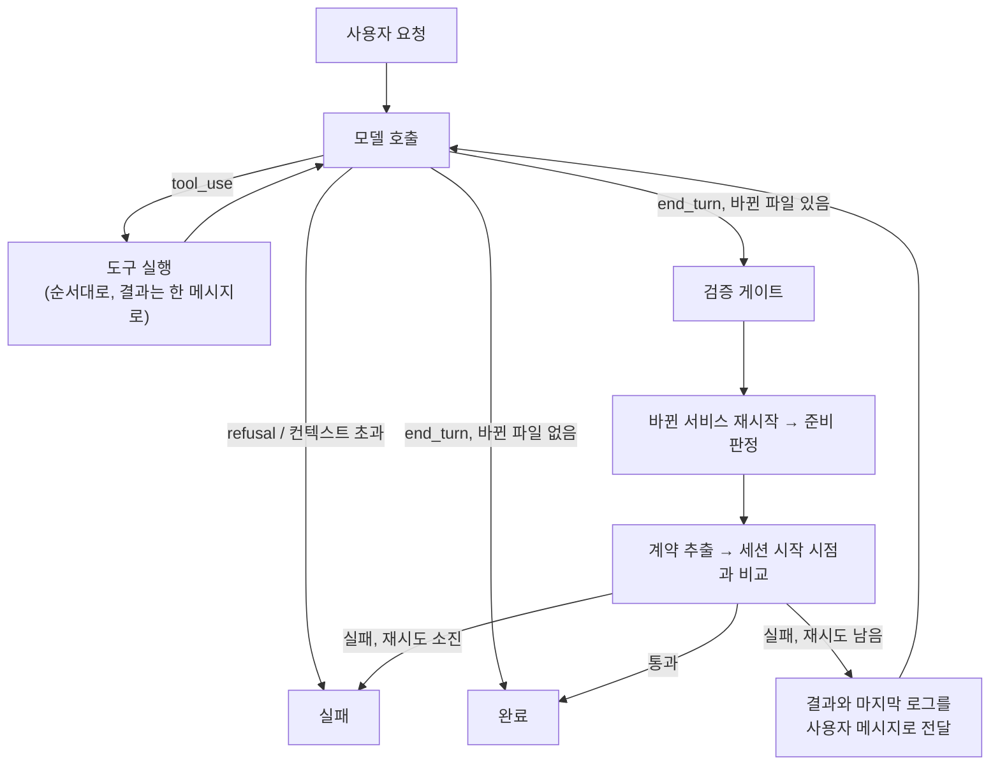

# 설계 결정 기록 (ADR)

결정마다 **맥락 → 검토한 선택지 → 결정 → 감수한 트레이드오프** 순서로 적었습니다. 외부 제품의 수치와 사실은 2026년 9월에 공개 자료로 확인한 내용이고, 문서 끝에 출처를 모았습니다.

- [ADR-001 미리보기 런타임: 브라우저 번들러 대신 서버 샌드박스](#adr-001-미리보기-런타임-브라우저-번들러-대신-서버-샌드박스)
- [ADR-002 프로젝트 모델: 구조는 통합, 작업 화면은 분리](#adr-002-프로젝트-모델-구조는-통합-작업-화면은-분리)
- [ADR-003 계약은 코드에서 추출하는 선택 사항](#adr-003-계약은-코드에서-추출하는-선택-사항)
- [ADR-004 새 DSL을 만들지 않는다: compose + OpenAPI 위의 얇은 층](#adr-004-새-dsl을-만들지-않는다-compose--openapi-위의-얇은-층)
- [ADR-005 첫 대상은 사내 도구, 백엔드는 Spring 우선](#adr-005-첫-대상은-사내-도구-백엔드는-spring-우선)
- [ADR-006 샌드박스 제공자를 추상화하고 로컬 Docker부터 구현](#adr-006-샌드박스-제공자를-추상화하고-로컬-docker부터-구현)
- [ADR-007 서비스 준비 판정 규칙](#adr-007-서비스-준비-판정-규칙)
- [ADR-008 볼륨을 샌드박스 전용과 공유 캐시로 나눈다](#adr-008-볼륨을-샌드박스-전용과-공유-캐시로-나눈다)
- [ADR-009 포트는 루프백의 빈 포트에만 공개한다](#adr-009-포트는-루프백의-빈-포트에만-공개한다)
- [ADR-010 에이전트 루프: 직접 작성한 루프와 스튜디오 검증 게이트](#adr-010-에이전트-루프-직접-작성한-루프와-스튜디오-검증-게이트)
- [ADR-011 도구 설계: bash 하나 대신 행동별 도구](#adr-011-도구-설계-bash-하나-대신-행동별-도구)
- [ADR-012 모델 설정과 프롬프트 (Claude Opus 5)](#adr-012-모델-설정과-프롬프트-claude-opus-5)
- [ADR-013 계약 호환 정책: 기본은 차단, 요청이 명시할 때만 허용](#adr-013-계약-호환-정책-기본은-차단-요청이-명시할-때만-허용)
- [ADR-014 재시작 전에 샌드박스가 바뀐 파일을 보는지 확인한다](#adr-014-재시작-전에-샌드박스가-바뀐-파일을-보는지-확인한다)
- [ADR-015 스튜디오 서버: Next.js 단일 앱과 Server-Sent Events](#adr-015-스튜디오-서버-nextjs-단일-앱과-server-sent-events)
- [ADR-016 세션마다 작업 복사본, API 키 없는 데모 모드](#adr-016-세션마다-작업-복사본-api-키-없는-데모-모드)
- [ADR-017 미리보기와 API 탐색기의 네트워크 경계](#adr-017-미리보기와-api-탐색기의-네트워크-경계)
- [ADR-018 세션 체크포인트: 검증을 통과한 변경만 남긴다](#adr-018-세션-체크포인트-검증을-통과한-변경만-남긴다)
- [ADR-019 로컬 로그인 계정으로 실행: API 키 없이 개인 PC에서만](#adr-019-로컬-로그인-계정으로-실행-api-키-없이-개인-pc에서만)
- [ADR-020 원격 저장소 연동: 세션 브랜치와 덮어쓰지 않는 푸시](#adr-020-원격-저장소-연동-세션-브랜치와-덮어쓰지-않는-푸시)
- [ADR-021 기동 최적화: 입력 파일 해시로 찾는 스냅샷 볼륨](#adr-021-기동-최적화-입력-파일-해시로-찾는-스냅샷-볼륨)
- [ADR-022 데이터베이스 브랜치: 체크포인트마다 DB 상태를 함께 남긴다](#adr-022-데이터베이스-브랜치-체크포인트마다-db-상태를-함께-남긴다)
- [ADR-023 자원 한도와 사용량: 한도를 걸고, 판단에 필요한 수치만 보여 준다](#adr-023-자원-한도와-사용량-한도를-걸고-판단에-필요한-수치만-보여-준다)
- [ADR-024 네트워크 격리: 샌드박스의 출입구를 하나로 만든다](#adr-024-네트워크-격리-샌드박스의-출입구를-하나로-만든다)
- [ADR-025 시크릿 주입과 가림: 값은 보이지 않게 넣고, 새는 경로를 막는다](#adr-025-시크릿-주입과-가림-값은-보이지-않게-넣고-새는-경로를-막는다)
- [ADR-026 정책 프록시: 사내 API는 edge를 거쳐서만 부른다](#adr-026-정책-프록시-사내-api는-edge를-거쳐서만-부른다)
- [ADR-027 격리 강화: 운영자가 고르는 컨테이너 런타임과 gVisor](#adr-027-격리-강화-운영자가-고르는-컨테이너-런타임과-gvisor)

---

## ADR-001 미리보기 런타임: 브라우저 번들러 대신 서버 샌드박스

### 맥락
AI가 만든 코드를 사용자가 몇 초 안에 볼 수 있어야 합니다. 토스 TOI는 이 문제를 **브라우저 안에서** 풀었습니다.
- 경로를 키로 쓰는 4계층 가상 파일 시스템
- Web Worker에서 도는 esbuild-wasm
- `packageSetHash`(엔트리 목록 + yarn.lock 해시)로 미리 번들링해 S3에 올린 import map
- 빌드와 실행이 모두 성공했을 때만 iframe을 교체하는 방식

이 방식으로 첫 화면을 47초에서 1.3초로 줄였습니다. 하지만 이 프로젝트는 **Next.js 같은 서버 프레임워크와 백엔드까지** 실행해야 합니다.

### 검토한 선택지

| 방식 | 사례 | Next.js | 현업 적용 시 문제 |
|---|---|---|---|
| A. 브라우저 번들러 (esbuild-wasm) | 토스 TOI | ❌ | 클라이언트 React SPA만 가능. RSC, SSR, Server Action 불가 |
| B. 브라우저 안의 Node (WebContainers) | bolt.new | ⚠️ | Turbopack이 wasm 바인딩을 지원하지 않아 Next 16 기본 설정으로는 `next dev`가 실패함 (`turbo.createProject is not supported by the wasm bindings`). napi 네이티브 모듈 불가. 상용 서비스는 유료 라이선스 필요 |
| B'. Nodebox | Sandpack 2 | ⚠️ | Node 18 수준 호환, napi 불가, 사내 npm 지원은 개발 중 |
| **C. 서버 샌드박스** | Lovable (Fly.io), v0 (2026년 2월 샌드박스 런타임으로 전환) | ✅ | 컴퓨팅 비용, 콜드 스타트 |

### 결정
**C. 실제 Linux 환경에서 실제 개발 서버를 실행한다.** 프레임워크와 언어 제한이 없고, 로컬 개발 환경과 동작이 같습니다.

### 감수한 트레이드오프와 대응
- **콜드 스타트**: 의존성 캐시를 공유하고([ADR-008](#adr-008-볼륨을-샌드박스-전용과-공유-캐시로-나눈다)), 이후에는 lockfile 해시별로 설치가 끝난 스냅샷을 재사용할 계획입니다. TOI의 `packageSetHash` 아이디어를 서버 환경에 옮긴 것입니다.
- **비용과 운영 부담**: 제공자를 추상화해서([ADR-006](#adr-006-샌드박스-제공자를-추상화하고-로컬-docker부터-구현)) 규모와 보안 요구에 맞는 구현을 고를 수 있게 했습니다.
- TOI의 "성공한 번들만 반영" 원칙은 **헬스체크를 통과한 서버로만 트래픽을 넘기는 방식**으로 옮길 수 있습니다. 준비 판정([ADR-007](#adr-007-서비스-준비-판정-규칙))이 그 기반입니다.

---

## ADR-002 프로젝트 모델: 구조는 통합, 작업 화면은 분리

### 맥락
사용자마다 원하는 작업 방식이 다릅니다.
- 이미 있는 백엔드에 **화면만** 붙이고 싶은 사람 (TOI의 경우)
- **백엔드만** 만들지만 화면에서 테스트하며 개발하고 싶은 사람
- 프론트와 백엔드를 **함께** 만들고 싶은 사람

### 검토한 선택지
1. **제품을 프론트용과 백엔드용으로 나눈다**: 각 제품은 단순하지만, 나중에 합치려면 프로젝트·권한·배포 모델을 옮겨야 합니다. 또 "필드 하나 추가"처럼 DB, API, 화면을 한 번에 바꾸는 AI의 핵심 장점을 잃습니다.
2. **항상 풀스택으로 강제한다**: 백엔드만 만드는 사람에게 방해가 되고, 이미 레포와 배포 주기가 나뉜 조직에 맞지 않습니다.
3. **구조는 하나로, 작업 화면은 목적별로**

### 결정
**3번.** 프로젝트는 `서비스 목록 + (선택적) 계약`이고, 서비스는 `source: managed | external`로 구분합니다.

| 사용자 상황 | 서비스 구성 |
|---|---|
| 기존 백엔드에 화면만 | `web`(managed) + `api`(external) |
| 백엔드만 | `api`(managed) |
| 풀스택 | `web` + `api` (둘 다 managed) |
| 백엔드로 시작해 나중에 화면 추가 | `web` 서비스만 추가하면 됨. 프로젝트를 옮기지 않음 |

### 판단 기준
**되돌리기 비용**을 봤습니다. 내부 모델을 나누는 결정은 되돌리기 어렵고, 화면을 나누는 결정은 UI만 바꾸면 됩니다. 불확실할 때는 되돌리기 어려운 쪽을 유연하게 두었습니다.

---

## ADR-003 계약은 코드에서 추출하는 선택 사항

### 맥락
처음에는 OpenAPI 계약을 프론트와 백엔드 사이의 중심에 두려고 했습니다. 목 서버, 에이전트 검증 기준, 팀 간 경계 역할을 모두 할 수 있기 때문입니다. 그런데 다시 검토해 보니 현실과 맞지 않는 부분이 있었습니다.
- Spring(springdoc)과 FastAPI 개발자는 **코드부터 짜고 OpenAPI를 뽑아냅니다.**
- Next.js 풀스택은 Server Action과 Route Handler로 **서비스 하나 안에서** 끝나는 경우가 많습니다.
- REST가 아닌 GraphQL, gRPC, tRPC도 있습니다.

### 결정
- 계약은 **없어도 되는 선택 사항**입니다.
- 사람이 먼저 쓰는 파일이 아니라 **실행 중인 서버에서 추출해 변경 전후를 비교하는 결과물**로 다룹니다. (`contract.extract: /v3/api-docs`)
- 서비스 하나짜리 풀스택 프로젝트도 정식으로 지원합니다.

---

## ADR-004 새 DSL을 만들지 않는다: compose + OpenAPI 위의 얇은 층

### 맥락
사내 도구라도 **"이 도구를 그만 쓰면 코드를 그대로 가져갈 수 있는가"**가 도입 조건이 됩니다.

### 결정
- 실행: 표준 **Docker Compose** 파일
- 계약: 표준 **OpenAPI**
- `studio.yaml`: 스튜디오에만 필요한 정보(managed/external 구분, 미리보기 종류, 준비 확인 경로, 계약 추출 경로)만 담습니다.

`examples/orders`는 스튜디오 없이 `docker compose up`으로도 똑같이 실행됩니다. 스튜디오가 필요한 설정(포트 공개, 라벨)은 사용자 파일을 고치지 않고 **임시 override 파일**로 덧씌웁니다.

로더는 두 파일이 서로 맞는지 검증합니다. managed 서비스는 compose에 반드시 있어야 하고, external 서비스는 compose에 있으면 안 됩니다. compose에만 있는 서비스(예: `db`)는 샌드박스와 함께 뜨고 함께 사라지는 부가 서비스로 취급합니다.

---

## ADR-005 첫 대상은 사내 도구, 백엔드는 Spring 우선

### 맥락
범용 AI 앱 빌더는 Replit, Lovable, v0와 정면으로 경쟁하게 됩니다. TOI 사례를 보면 진짜 가치는 코드 생성보다 **"정책이 자동으로 적용되는 플랫폼"**에 있었습니다.

### 결정
- **사내 도구**를 첫 대상으로 정했습니다. 사내망 설치, 개인정보 마스킹, 감사 로그가 차별점이 됩니다.
- 백엔드 템플릿은 **Spring Boot**를 먼저 만들고 **FastAPI**도 제공합니다.

### 템플릿 원칙
런타임은 어떤 프레임워크든 실행할 수 있게 열어 두되, AI가 쓰는 스택은 **검증된 템플릿**으로 제한합니다. "모든 프레임워크 호환"과 "모든 프레임워크에서 좋은 품질"은 다른 문제이기 때문입니다.

---

## ADR-006 샌드박스 제공자를 추상화하고 로컬 Docker부터 구현

### 맥락
사내 도구는 운영 환경이 회사마다 다릅니다. 관리형 서비스를 쓸 수 있는 곳도 있고, 사내망 Kubernetes만 허용하는 곳도 있습니다.

| 제공자 | 격리 | 자체 운영 |
|---|---|---|
| Vercel Sandbox | Firecracker microVM | ❌ |
| E2B | Firecracker | ✅ |
| Northflank | Kata / gVisor | ✅ (BYOC) |
| Kubernetes agent-sandbox | gVisor / Kata, 웜 풀 | ✅ (오픈소스) |

### 결정
`SandboxProvider.create(project) → Sandbox` 인터페이스를 두고, 첫 구현은 **`LocalDockerProvider`**로 했습니다.
- 외부 계정 없이 개발할 수 있습니다.
- compose 기반이라 사내 서버 한 대 운영에도 그대로 쓸 수 있습니다.
- 인터페이스(`start`, `restart`, `endpoint`, `state`, `logs`, `exec`, `destroy`)는 원격 microVM 구현에서도 그대로 성립하도록 파일 시스템 경로에 의존하지 않게 설계했습니다.

### 감수한 트레이드오프
로컬 Docker는 **컨테이너 수준의 격리**입니다. 사내 운영에서 신뢰할 수 없는 생성 코드를 돌리려면 gVisor/Kata 기반 제공자로 바꿔야 하고, 로드맵에 넣었습니다.

---

## ADR-007 서비스 준비 판정 규칙

### 맥락
준비 판정은 **"미리보기가 언제 뜨는가"**와 **"에이전트가 언제 실패를 알게 되는가"**를 결정합니다. 실제 실행에서 관찰한 기동 과정은 이랬습니다.

```
UND_ERR_SOCKET (포트는 열렸지만 서버 준비 전)
→ TIMEOUT      (Next dev가 첫 요청을 컴파일하는 중)
→ HTTP 200
```

### 결정 (`packages/sandbox/src/readiness.ts`)

| 상황 | 판정 | 이유 |
|---|---|---|
| 기대한 상태 코드를 **연속 2번** 받음 | ready | 기동 직후 잠깐 성공했다가 흔들리는 경우를 걸러냄 |
| 컨테이너가 `exited` / `dead` | **즉시** failed | 컴파일 에러가 나면 15분 타임아웃을 기다리지 않고 몇 초 만에 결과를 받음 |
| 연결 거부, 소켓 에러, 타임아웃, 503, `restarting` | waiting | 기동 중에 흔한 상태 |
| 서비스별 `timeoutSeconds` 초과 | failed | 마지막 확인 결과(`HTTP 503, 컨테이너 running` 등)를 실패 이유에 담아 에이전트가 읽을 수 있게 함 |

판정 함수는 확인 기록 배열만 받는 **순수 함수**라서 Docker 없이 단위 테스트 6개로 검증했습니다.

---

## ADR-008 볼륨을 샌드박스 전용과 공유 캐시로 나눈다

### 맥락
샌드박스는 매번 새로 만들고 지우지만, 매번 Gradle 배포판과 의존성을 다시 받으면 기동이 몇 분씩 걸립니다.

### 결정

| 종류 | compose 선언 | 수명 | 예시 |
|---|---|---|---|
| 샌드박스 전용 | 일반 named volume | `destroy()` 때 삭제 | `node_modules`, `.next`, Gradle `build`, DB 데이터 |
| 공유 캐시 | `external: true` + 고정 이름 | 샌드박스를 지워도 유지 | `b-studio-cache-gradle`, `b-studio-cache-pnpm` |

compose는 external 볼륨을 만들어 주지 않으므로, 로더가 external 볼륨을 모아 두고 제공자가 기동 전에 `docker volume create`로 만듭니다(이미 있으면 그대로 둠). Gradle과 pnpm 캐시는 여러 프로세스가 동시에 써도 안전해서 샌드박스끼리 공유할 수 있습니다.

### 결과와 한계
Gradle 다운로드는 사라졌지만 두 번째 기동도 "늦어도 43초 안에 준비" 수준으로, 극적으로 빨라지지는 않았습니다. `node_modules`가 샌드박스마다 새로 설치되기 때문입니다. 자세한 분석은 [troubleshooting.md](troubleshooting.md#3-공유-캐시를-써도-두-번째-기동이-크게-빨라지지-않음)에 있습니다.

---

## ADR-009 포트는 루프백의 빈 포트에만 공개한다

### 결정
override 파일에서 managed 서비스 포트를 `127.0.0.1::<컨테이너 포트>` 형식으로 공개합니다.
- **빈 포트 자동 할당**: 샌드박스 여러 개를 동시에 띄워도 포트가 겹치지 않습니다. 할당된 포트는 `docker compose port`로 조회합니다.
- **루프백에만 공개**: 같은 네트워크의 다른 PC에서 샌드박스에 접근할 수 없습니다. 사내 도구의 기본값으로 필요합니다.
- 사용자의 `compose.yaml`에는 `ports`를 적지 않습니다. 템플릿을 그대로 여러 샌드박스에서 재사용하기 위해서입니다.

---

## ADR-010 에이전트 루프: 직접 작성한 루프와 스튜디오 검증 게이트

### 맥락
에이전트가 "끝났다"고 말하는 것만으로는 완료로 볼 수 없습니다. 서버가 실제로 뜨는지, API 계약을 깨지 않았는지는 **플랫폼이 직접 확인**해야 합니다. 또 이 확인 흐름은 API 키 없이도 반복해서 검증할 수 있어야 합니다.

### 검토한 선택지

| 방식 | 장점 | 이 프로젝트에 맞지 않는 점 |
|---|---|---|
| SDK Tool Runner (beta) | 루프를 직접 쓰지 않아도 됨 | 턴이 끝난 뒤 검증하고, 실패하면 결과를 넣어 루프를 재개하는 흐름을 훅으로 끼워 넣어야 함 |
| Managed Agents | Anthropic이 루프와 샌드박스를 운영 | 코드가 **우리 샌드박스**(사내망 Docker/Kubernetes)에서 실행돼야 하는 요구와 충돌 |
| **직접 작성한 루프** | 게이트·재시도·종료 조건을 코드로 명확히 표현, 모델 호출을 인터페이스로 분리 가능 | `pause_turn`, `refusal`, `max_tokens` 처리를 직접 유지해야 함 |

### 결정
`runAgent()`가 모델 호출을 `ModelClient` 인터페이스로 받습니다.
- `AnthropicModelClient`: 실제 Claude API
- `ScriptedModelClient`: 미리 적은 턴을 돌려주는 테스트 더블. **루프·도구·게이트·샌드박스가 맞물리는지** 검증하는 용도이고, 모델의 코딩 능력을 검증하지는 않습니다.



게이트는 매번 전체를 다시 확인하지 않습니다. **지난 게이트 이후 바뀐 파일**과 **지난번에 준비에 실패한 서비스의 파일**만 대상으로 삼습니다. 작업 공간이 쓰기마다 버전을 올리고, 게이트는 마지막으로 확인한 버전을 기억합니다.

---

## ADR-011 도구 설계: bash 하나 대신 행동별 도구

### 맥락
bash 도구 하나면 모델이 거의 모든 일을 할 수 있지만, 스튜디오는 불투명한 명령 문자열만 보게 됩니다. 사내 도구에서는 **어떤 파일을 바꿨는지 기록하고, 위험한 경로를 막고, 사람의 수정을 덮어쓰지 않는 것**이 필요합니다.

### 결정

| 도구 | 강제하는 규칙 |
|---|---|
| `list_files`, `read_file` | 프로젝트 루트 밖, 심볼릭 링크 탈출, `.git`·`node_modules`·`build`·`.env` 접근 차단 |
| `write_file`, `edit_file` | 위 규칙 + **읽은 뒤 파일이 바뀌었으면 쓰기 거부**(내용 해시 비교) + 바뀐 파일 기록. `edit_file`은 정확히 한 곳만 일치해야 수정 |
| `run_in_service` | 명령을 **인자 배열**로 받아 셸을 거치지 않음, 3분 타임아웃 |
| `restart_service`, `service_logs`, `http_request` | 실행 확인용. 재시작 실패 시 최근 로그를 함께 반환 |
| `get_contract` | OpenAPI 원문 대신 **연산·스키마 요약**을 반환해 토큰을 아낌 |

- 모든 도구는 `strict: true`이고 **모든 필드를 필수**로 둡니다. "없음"은 빈 문자열처럼 명시적인 값으로 표현합니다.
- 도구 출력이 3만 자를 넘으면 앞뒤를 남기고 **잘랐다는 표시를 넣습니다.** 조용히 자르지 않습니다.
- 도구 실패는 루프를 멈추지 않고 `is_error: true` 결과로 모델에게 돌려줍니다.

---

## ADR-012 모델 설정과 프롬프트 (Claude Opus 5)

### 요청 설정

| 설정 | 값 | 이유 |
|---|---|---|
| 모델 | `claude-opus-5` | 긴 에이전트 작업과 코딩에 가장 강한 Opus |
| thinking | `{ type: "adaptive" }` | Opus 5의 기본값이지만 의도를 명시 |
| effort | 기본 `high`, CLI `--effort`로 조정 | 비용과 품질의 기준점. 작업별로 낮춰 측정할 수 있게 열어 둠 |
| 전송 | 스트리밍 후 `finalMessage()`, `max_tokens` 64K | 긴 응답이 HTTP 타임아웃에 걸리지 않게 함 |
| 거절 대응 | `fallbacks: "default"` + `server-side-fallback-2026-07-01` | 안전 분류기가 거절하면 서버가 권장 모델로 다시 실행. 그래도 `stop_reason: "refusal"`이면 실패로 끝냄 |
| 프롬프트 캐시 | 시스템 프롬프트에 캐시 지점 + 요청 전체 자동 캐시 | 도구와 시스템 프롬프트는 프로젝트마다 고정. 시각 같은 가변 값을 넣지 않음 |
| 사전 확인 | `models.retrieve()` | 수십 초 걸리는 샌드박스를 띄우기 전에 인증과 모델 권한을 토큰 소비 없이 확인 |

### 프롬프트 튜닝
Opus 5 마이그레이션 가이드의 권고를 반영했습니다.
- **"작업을 검증하라"는 지시를 넣지 않았습니다.** 이 모델은 시키지 않아도 스스로 검증하므로, 검증은 프롬프트가 아니라 게이트가 강제합니다.
- 응답과 파일이 길어지고 범위를 넓히는 경향이 있어 **간결함과 범위 규칙**을 명시했습니다. "요청하지 않은 리팩터링, 이름 변경, 기능, 테스트, 파일을 추가하지 않는다" 같은 규칙입니다.
- 프레임워크 버전이 학습 시점보다 새로울 수 있으므로, Next.js는 **컨테이너 안의 버전별 문서**(`node_modules/next/dist/docs`)를 읽도록 안내합니다. Next.js 16이 생성한 `AGENTS.md`도 같은 원칙을 요구합니다.
- DB 스키마는 **새 Flyway 마이그레이션으로만** 바꾸고, 기존 마이그레이션은 수정하지 않습니다.

---

## ADR-013 계약 호환 정책: 기본은 차단, 요청이 명시할 때만 허용

### 결정
세션을 시작할 때 OpenAPI 계약을 저장해 두고, 게이트마다 현재 계약과 비교합니다.

| 변경 | 판정 |
|---|---|
| 연산 추가, 스키마 추가, **선택** 필드 추가 | 호환 |
| 연산·스키마·필드 삭제, 필드 타입 변경, 기존 필드 필수화, **필수** 필드 신규 추가 | **호환 깨짐** |

- 호환을 깨는 변경은 기본적으로 게이트를 통과하지 못합니다. 요청이 삭제나 변경을 명시할 때만 `--allow-breaking`으로 허용합니다.
- 결과는 호환 깨짐을 먼저, 그다음 대상 이름의 **코드포인트 순**으로 정렬합니다. 실행 환경의 로케일에 따라 순서가 달라지지 않게 하기 위해서입니다.

---

## ADR-014 재시작 전에 샌드박스가 바뀐 파일을 보는지 확인한다

### 맥락
로컬 Docker 제공자는 프로젝트 폴더를 컨테이너에 바인드 마운트합니다. macOS의 colima 기본 설정은 sshfs 마운트이고, Lima 문서에 따르면 sshfs 캐시는 **기본으로 켜져 있으며 호스트의 변경이 제때 반영되지 않을 수 있습니다.**

실제로 에이전트 e2e에서 검증 게이트가 **컴파일 에러가 있는 코드를 "준비 완료"로 통과시켰습니다.** 방금 쓴 파일을 VM 쪽에서 아직 보지 못한 상태로 서비스를 재시작해, 옛 코드가 빌드된 것으로 판단했습니다. 경위와 측정값은 [troubleshooting.md](troubleshooting.md)에 있습니다. 게이트가 틀린 결과를 통과시키는 것은 게이트가 없는 것보다 위험합니다.

### 검토한 선택지

| 방식 | 문제 |
|---|---|
| 재시작 전에 정해진 시간만큼 대기 | 느리고, 캐시 시간보다 짧으면 여전히 틀림 |
| virtiofs 같은 다른 마운트를 쓰라고 안내 | 사용자 환경을 강제할 수 없고, 다른 OS·원격 샌드박스에는 해당하지 않음 |
| 마운트 대신 파일을 복사해 넣기 | 표준 compose 파일만으로 똑같이 실행된다는 원칙([ADR-004](#adr-004-새-dsl을-만들지-않는다-compose--openapi-위의-얇은-층))이 깨짐 |
| **동기화 지점 `Sandbox.sync(files)`** | 확인 한 번마다 약간의 비용 |

### 결정
재시작하기 전에 **샌드박스 쪽에서 바뀐 파일이 보일 때까지** 기다립니다.
- **확인 기준 두 가지**: 디렉터리 목록(readdir)에 파일 이름이 보이는지와, 내용의 sha256이 호스트와 같은지를 함께 확인합니다. 빌드 도구는 목록과 파일 속성으로 변경을 감지하기 때문에, 경로로 파일을 직접 열어 보는 것만으로는 부족합니다.
- **확인 방법(로컬 Docker)**: busybox 컨테이너가 같은 프로젝트 폴더를 읽기 전용으로 붙여 250ms 간격으로 확인하고, 기본 60초 안에 반영되지 않으면 실패합니다. 파일 경로는 셸 문자열에 끼워 넣지 않고 위치 인자로 넘깁니다.
- **서비스 컨테이너가 아닌 별도 컨테이너로 확인하는 이유**: 컴파일 에러로 서비스가 죽어 있어도 확인할 수 있어야 하고, 같은 VM 마운트를 공유하므로 서비스와 같은 상태를 보게 됩니다.
- **호출 위치**: 검증 게이트와 `restart_service` 도구가 재시작 전에 호출합니다. 확인에 실패하면 재시작하지 않고 게이트를 실패로 처리합니다.
- **원격 제공자**: 같은 메서드를 "업로드 완료 보장"으로 구현하면 됩니다.

### 감수한 트레이드오프
확인 한 번에 컨테이너를 하나 실행하는 비용이 듭니다. 캐시 지연이 없는 환경에서는 첫 확인에서 바로 통과합니다.

### 보완: 반영 확인만으로 막지 못한 경우
폴더는 남고 파일 하나만 지워진 되돌리기에서, 반영 확인은 통과했는데 새로 뜬 서비스의 빌드 도구가 지운 파일을 디렉터리 목록에서 보고 읽다가 실패했습니다. 그래서 재시작이 실패하고 **로그가 이번 변경에서 지운 파일을 "없다"고 가리킬 때만** 3초 뒤 한 번 더 재시작합니다. 무관한 실패는 다시 시도하지 않습니다. 경위는 [트러블슈팅 13](troubleshooting.md#13-되돌린-뒤-api가-지운-파일을-찾다가-기동하지-못함)에 있습니다.

---

## ADR-015 스튜디오 서버: Next.js 단일 앱과 Server-Sent Events

### 맥락
스튜디오 서버가 하는 일은 두 가지예요.
- **오래 걸리는 작업**: 샌드박스 기동과 에이전트 실행은 수십 초에서 수 분이 걸리고, 서버에서 `docker` 명령을 직접 실행해야 합니다.
- **실시간 전달**: 서비스 상태, 로그, 에이전트 진행 상황을 브라우저에 계속 보내야 합니다.

요청마다 짧게 실행되는 서버리스 환경은 맞지 않습니다. 사내 서버 한 대에서 도는 Node 프로세스를 전제로 했습니다.

### 검토한 선택지

| 방식 | 판단 |
|---|---|
| 별도 백엔드(Express 등) + SPA | 배포 단위와 타입 공유 경로가 둘로 늘어남 |
| **Next.js 16 App Router 단일 앱** | Route Handler로 REST와 스트리밍, Server Component로 첫 화면을 한 프로세스에서 처리 |
| WebSocket | 양방향이 필요하지 않음. 서버 → 브라우저는 스트림, 브라우저 → 서버는 일반 POST면 충분 |
| **Server-Sent Events** | 브라우저가 스스로 다시 연결하고, 일반 HTTP라 프록시와 잘 맞음 |

### 결정
- 세션 관리자는 **프로세스 메모리 안의 싱글톤**입니다. 개발 서버의 HMR로 모듈이 다시 로드돼도 실행 중인 샌드박스를 잃지 않도록 `globalThis`에 둡니다.
- 이벤트 스트림은 연결되면 **스냅샷부터 지금까지의 기록을 다시 보내고**, 화면 쪽 리듀서는 스냅샷을 받으면 상태를 초기화합니다. 그래서 다시 연결해도 채팅 기록이 중복되지 않습니다.
- 단, 스냅샷에 이미 반영된 상태를 바꾸는 이벤트(체크포인트 추가 등)는 **같은 이벤트를 두 번 받아도 결과가 같게** 처리해야 합니다. 이 원칙을 놓쳐 체크포인트 목록이 중복된 적이 있습니다([트러블슈팅 10](troubleshooting.md#10-다시-연결하면-체크포인트-목록이-중복됨)).
- 로그는 양이 많아서 채팅·상태 기록과 **따로 최근 1,000줄만** 둡니다. 로그가 쌓여 대화 기록이 밀려나지 않게 하기 위해서입니다.
- 서버가 종료 신호를 받으면 띄워 둔 샌드박스를 정리합니다.

### 감수한 트레이드오프
서버 프로세스를 재시작하면 세션 상태가 사라지고, 여러 서버로 나눠 운영할 수 없습니다. 사용자가 늘면 세션 저장소와 샌드박스 작업자를 분리해야 합니다.

---

## ADR-016 세션마다 작업 복사본, API 키 없는 데모 모드

### 결정
- **작업 복사본**: 세션을 시작하면 프로젝트를 `~/.cache/b-studio/sessions/<프로젝트>-<세션>`으로 복사하고 그 복사본으로 샌드박스를 띄웁니다. 에이전트가 원본을 바꾸지 않게 하고, colima가 마운트하는 홈 디렉터리 아래에 두기 위해서입니다. Git 연동 전까지 결과는 복사본에 남습니다.
- **데모 모드** (`B_STUDIO_MODE=demo`): Claude API 대신 e2e와 같은 스크립트 시나리오로 실행합니다.
- **데모 모드는 준비된 요청만 순서대로 실행**하고, 다른 요청은 409로 거절하면서 다음 요청을 안내합니다. 스크립트가 임의의 요청을 처리하는 것처럼 보이면 시연이 거짓말이 되기 때문입니다.

---

## ADR-017 미리보기와 API 탐색기의 네트워크 경계

### 결정
- **포트는 루프백에만 공개**합니다([ADR-009](#adr-009-포트는-루프백의-빈-포트에만-공개한다)). 미리보기 iframe은 같은 PC의 브라우저가 `127.0.0.1:<포트>`로 직접 엽니다.
- **API 탐색기 요청은 스튜디오 서버를 거칩니다.** 서버는 메서드를 허용 목록으로 제한하고, 세션에 없는 서비스로의 요청을 거절합니다.
- **`//`로 시작하는 경로를 막습니다.** `new URL("//evil.example/x", base)`는 다른 호스트를 가리킵니다. 그래서 요청 URL의 origin이 서비스 주소와 같은지 비교합니다. 같은 검사를 에이전트의 `http_request` 도구와 `studio.yaml`의 경로 필드에도 적용했습니다.
- **재시작하면 포트가 바뀝니다.** 에이전트 루프가 서비스 상태 이벤트(`onServiceStatus`)를 밖으로 전달해서 화면이 새 주소를 따라가게 하고, 요청이 끝날 때마다 미리보기와 계약을 다시 불러옵니다.

### 한계
다른 PC의 브라우저는 루프백 포트에 접근할 수 없어서 미리보기 iframe을 열 수 없습니다. 원격 사용자를 지원하려면 스튜디오 서버가 미리보기까지 리버스 프록시해야 합니다.

---

## ADR-018 세션 체크포인트: 검증을 통과한 변경만 남긴다

### 맥락
검증 게이트는 호환을 깨는 변경을 **완료로 인정하지 않을 뿐, 적용된 변경을 되돌리지 않았습니다.** 그래서 차단된 요청 뒤에도 작업 복사본과 샌드박스에는 변경이 남아, 미리보기의 배송 메모가 비어 보였습니다. "완료로 인정하지 않는다"와 "적용되지 않았다"는 다른 상태입니다.

### 검토한 선택지

| 방식 | 문제 |
|---|---|
| 에이전트가 쓴 파일의 원래 내용을 기억해 복원 | 삭제, 이름 변경, 여러 요청에 걸친 복원을 직접 구현해야 하고, 이전 시점으로 돌아가기 어려움 |
| 요청마다 작업 폴더 전체 복사 | 프로젝트 크기만큼 매번 복사하고, 무엇이 바뀌었는지 보여 주기 어려움 |
| **작업 복사본을 Git 저장소로 관리** | 커밋이 곧 체크포인트이고, `git diff`로 변경 내역을 보여 주고, `reset`으로 복원. 개발자가 이미 아는 모델 |

### 결정
- **세션 시작**: 작업 복사본에서 `git init`을 실행하고(이미 저장소면 그대로 씀) "세션 시작" 체크포인트를 남깁니다.
- **요청이 게이트를 통과하면** `요청: <요청 내용>`으로 커밋합니다.
- **통과하지 못하거나 에러가 나면** 버린 변경을 patch로 보관한 뒤 `reset --hard`와 `clean -fd`로 되돌립니다. 그리고 바뀐 파일이 속한 서비스를 파일 반영 확인([ADR-014](#adr-014-재시작-전에-샌드박스가-바뀐-파일을-보는지-확인한다))과 함께 재시작해, 샌드박스도 이전 상태로 맞춥니다.
- **이전 체크포인트로 되돌리기**: SHA 형식을 검사하고, 이 세션 기록의 조상 커밋(`merge-base --is-ancestor`)으로만 허용합니다. 되돌린 뒤에는 대화에도 그 사실을 남겨, 다음 요청이 사라진 변경을 전제로 하지 않게 합니다.
- **저장소에만 적용하는 설정**: `core.hooksPath`는 빈 폴더, `commit.gpgsign`은 false, 커밋 사용자는 전용 이름으로 둡니다. 체크포인트는 스튜디오 내부 기록이라, 사용자의 전역 커밋 훅이나 서명 설정이 커밋을 막거나 입력을 기다리며 멈추면 안 되기 때문입니다.
- **생성물 제외**: 샌드박스가 만드는 `node_modules`, `.next`, `build` 등은 사용자의 `.gitignore`를 고치지 않고 `.git/info/exclude`로 제외합니다.
- **실행 방식**: git은 셸을 거치지 않고 인자 배열로 실행합니다.

### 감수한 트레이드오프
- 되돌리기는 이후 체크포인트를 지우는 작업이라, 브라우저 확인 창 대신 화면 안에서 한 번 더 확인받습니다.
- CLI `studio agent`는 사용자 프로젝트 폴더를 직접 다루므로 자동 되돌리기를 적용하지 않았습니다. 사용자 저장소에서 `reset --hard`가 실행되는 위험이 더 크기 때문입니다.
- 원격 저장소 푸시와 PR 생성은 아직 없습니다.

---

## ADR-019 로컬 로그인 계정으로 실행: API 키 없이 개인 PC에서만

### 맥락
API 키를 발급받기 전에도 개발자가 자기 PC에서 에이전트를 직접 돌려 보고 싶어 합니다. 이런 PC에는 이미 `claude` CLI가 설치돼 있고 개인 구독으로 로그인돼 있는 경우가 많습니다.

제약도 분명합니다. Agent SDK 문서는 다음과 같이 안내합니다.

> Unless previously approved, Anthropic does not allow third party developers to offer claude.ai login or rate limits for their products, including agents built on the Claude Agent SDK. Use the API key authentication methods described in the Quickstart instead.

그래서 **스튜디오가 로그인을 제공하거나, 여러 사람이 한 사람의 구독을 나눠 쓰게 만들면 안 됩니다.** 가능한 범위는 "개발자 본인 PC에서, 본인이 이미 로그인한 CLI를 그대로 쓰는 것"입니다.

### 검토한 선택지

| 방식 | 판단 |
|---|---|
| 스튜디오에 로그인 화면을 넣고 토큰 보관 | 위 정책에 어긋나고, 공유 서버에서는 한 구독을 여러 사람이 쓰게 됨 |
| `claude -p`를 서브프로세스로 호출하고 JSON 출력 파싱 | 모델이 쓰는 도구를 우리 규칙으로 제한하기 어렵고, 턴이 끝날 때마다 게이트를 끼우기 어려움 |
| **Agent SDK로 로컬 CLI를 실행하고, b-studio 도구를 프로세스 안 MCP 서버로 제공** | 로그인 흐름 없이 기존 설치를 그대로 쓰고, 기본 도구를 끈 채 우리 도구만 허용할 수 있음 |

### 결정
- **명시적으로 켤 때만 씁니다.** 스튜디오는 `B_STUDIO_MODE=claude-code`(`pnpm studio:local`), CLI는 `--backend claude-code`입니다. 기본값은 계속 `api`이고, 모르는 값은 오류로 거절해 오타 때문에 다른 모드로 조용히 넘어가지 않게 했습니다.
- **로그인 흐름을 만들지 않습니다.** 요청마다 먼저 `accountInfo()`로 이미 로그인돼 있는지만 확인합니다. 프롬프트를 보내지 않으므로 사용량을 쓰지 않고, 실측 약 4초가 걸렸습니다. 응답의 이메일과 조직 이름은 화면이나 로그에 남기지 않습니다.
- **Claude Code의 기본 동작을 모두 끕니다.**

  | 옵션 | 값 | 이유 |
  |---|---|---|
  | `tools` | `[]` | 기본 도구(Bash, Read, Edit 등)를 끔. 모델이 호스트 셸이나 파일에 직접 접근하지 못함 |
  | `mcpServers`, `allowedTools` | b-studio 도구 9개만 | 작업 공간 규칙([ADR-011](#adr-011-도구-설계-bash-하나-대신-행동별-도구))과 샌드박스를 거쳐서만 작업 |
  | `permissionMode` | `dontAsk` | 허용 목록 밖의 도구는 묻지 않고 거부. 서버에서 사람의 승인을 기다리며 멈추지 않음 |
  | `settingSources`, `strictMcpConfig` | `[]`, `true` | 사용자 전역 설정의 훅·플러그인·MCP 서버와 `CLAUDE.md`가 에이전트 동작을 바꾸지 않게 함 |
  | `systemPrompt` | b-studio 프롬프트 | 기본 도구를 끈 상태에 맞춘 프롬프트로 교체 |

- **완료 판정은 같은 검증 게이트가 합니다.** 게이트를 `VerificationGate`로 루프에서 분리해 두 실행 방식이 함께 씁니다. SDK의 `result` 메시지를 "모델이 턴을 끝냈다"는 신호로 보고 게이트를 돌리며, 실패하면 결과를 스트리밍 입력으로 같은 대화에 넣습니다.
- **도구는 순서대로 실행합니다.** CLI는 도구를 동시에 부를 수 있어서, MCP 핸들러를 직렬 큐로 감싸 직접 만든 루프와 같은 순서를 보장합니다.
- **대화는 실행마다 갈라서 이어받습니다.** 다음 요청은 이전 세션을 `resume`하되 `forkSession: true`로 새 세션을 만듭니다. 예외로 끝난 실행은 저장한 세션 ID를 바꾸지 않으므로 다음 요청의 기준이 되지 않습니다. API 루프가 예외 때 이번 실행분을 대화에서 지우는 것과 같은 효과입니다. 체크포인트로 되돌린 사실은 다음 요청 앞에 붙여 알립니다.
- **도구 스키마는 한 곳에서만 정의합니다.** `buildTools`의 JSON 스키마를 MCP 도구가 요구하는 zod 형태로 옮기고, 지원하지 않는 형태는 바로 오류를 냅니다.
- **화면 표기는 "로컬 Claude Agent"입니다.** 같은 문서의 브랜딩 가이드가 제품 안에서 "Claude Code"라는 이름을 쓰지 않도록 합니다. 명령 이름과 로그인 안내처럼 설치된 CLI를 가리키는 곳만 `claude`를 그대로 씁니다.
- **Next.js 번들에서 SDK를 뺍니다.** SDK는 자기 패키지 위치를 기준으로 플랫폼별 실행 파일을 찾으므로 `serverExternalPackages`에 넣었습니다.

### 감수한 트레이드오프
- **개인 PC 전용입니다.** 사내 공유 서버에 배포할 때는 조직의 API 키로 `api` 모드를 써야 합니다. 스튜디오 개발 서버와 `next start`는 `127.0.0.1`에만 바인드합니다.
- 대화 기록이 로컬 CLI의 세션 파일(`~/.claude/projects/` 아래)에 남습니다.
- 모델은 넘기지 않으면 로그인한 계정의 기본값을 씁니다. 토큰 수는 SDK가 알려 주는 `modelUsage` 기준 추정치입니다.
- 로그인하지 않은 상태의 `accountInfo()` 응답은 직접 확인하지 못했습니다. 구독 종류, API 키 출처, 토큰 출처가 모두 비어 있으면 로그인이 필요하다고 안내합니다.

---

## ADR-020 원격 저장소 연동: 세션 브랜치와 덮어쓰지 않는 푸시

### 맥락
체크포인트는 작업 복사본 안에만 있어서, 결과를 팀에 넘기려면 사람이 파일을 옮겨야 했습니다. 사내 도구에서 만든 변경도 결국 **코드 리뷰(PR/MR)와 CI를 거쳐** 기준 브랜치에 들어가야 합니다.

### 검토한 선택지

| 방식 | 판단 |
|---|---|
| 세션이 끝나면 변경을 patch 파일로 내려받기 | 리뷰 도구와 CI를 거치지 않고, 요청별 기록과 검증 결과가 사라짐 |
| 지금처럼 폴더를 복사하고, 내보낼 때 원본 저장소에 커밋을 다시 적용 | 복사본 기록이 원본 기록과 이어지지 않아 cherry-pick과 충돌 처리가 필요함 |
| **원본 저장소를 복제해 세션 브랜치에서 작업** | 체크포인트 커밋이 곧 PR 커밋. 기준 브랜치에서 갈라져 있어 그대로 리뷰할 수 있음 |

### 결정
- **세션 시작**: 프로젝트 폴더가 커밋이 있는 Git 저장소의 루트면, 지금 체크아웃한 브랜치를 `git clone --branch`로 복제하고 `b-studio/<프로젝트>-<세션>` 브랜치를 만듭니다. 저장소가 아니면 지금처럼 복사한 뒤 `git init`하며, 원격 연동은 없습니다.
- **커밋된 상태에서만 시작합니다.** 원본의 커밋하지 않은 변경은 세션에 넣지 않고 개수만 화면에 알립니다. PR은 "어느 커밋에서 갈라졌는지"로 설명할 수 있어야 하기 때문입니다.
- **올릴 곳**: 원본의 `origin` 주소입니다. `origin`이 없으면 원본 저장소 자체에 세션 브랜치를 올립니다. 원본의 체크아웃 브랜치와 작업 트리는 건드리지 않습니다.
- **세션 정보는 저장소 설정에 둡니다.** 시작 커밋, 기준 브랜치, 세션 브랜치, 마지막으로 올린 커밋, PR 주소를 `b-studio.*` 설정으로 남깁니다. 스튜디오 서버를 재시작해도 작업 복사본만 있으면 상태를 되찾을 수 있습니다.
- **기록 범위**: 체크포인트 목록은 세션 시작 커밋에서 끝납니다. 원본 저장소의 이전 커밋으로는 되돌리지 않습니다.
- **검증 결과를 커밋 본문에 남깁니다.** 게이트 결과, 재시도 횟수, 에이전트 요약을 본문에 넣고, PR 본문은 이 커밋들만으로 만듭니다. 서버 메모리 없이 같은 PR을 다시 만들 수 있고, `git log`만으로도 요청마다 무엇을 확인했는지 볼 수 있습니다. 에이전트 요약의 마크다운 제목(`#`)이 커밋 정리 규칙에 지워지지 않도록 `--cleanup=whitespace`로 커밋합니다.
- **덮어쓰지 않는 푸시**: `--force-with-lease=refs/heads/<세션 브랜치>:<마지막으로 올린 커밋>`으로 올립니다. 처음 올릴 때는 기대값이 비어 있어 "원격에 같은 이름의 브랜치가 없어야 한다"는 뜻이 됩니다.
  - 되돌리기 뒤에는 원격 브랜치를 새 기록으로 맞출 수 있어야 하므로 강제 푸시가 필요합니다.
  - 그래도 리뷰어가 같은 브랜치에 올린 커밋은 덮어쓰면 안 됩니다. 원격이 마지막으로 올린 상태와 다르면 거부합니다.
  - 기대값을 원격 추적 브랜치(`origin/*`)에 맡기지 않고 직접 기록한 커밋으로 넘깁니다. 복제한 저장소의 `origin/*`는 실제 원격이 아니라 원본 폴더의 브랜치를 가리키기 때문입니다.
- **자격 증명**: 스튜디오 서버의 git 설정(SSH 에이전트, credential helper)을 그대로 씁니다. 비밀번호나 호스트 키 확인을 기다리며 멈추지 않도록 `GIT_TERMINAL_PROMPT=0`과 `ssh -o BatchMode=yes`로 실행하고, 오류 메시지 속 주소의 자격 증명은 지웁니다. 화면에는 자격 증명을 뺀 주소만 보냅니다.
- **PR 만들기**: 호스트에 맞는 토큰(`B_STUDIO_GITHUB_TOKEN`, `B_STUDIO_GITLAB_TOKEN`, `B_STUDIO_GITEA_TOKEN`)이 있으면 API로 만들고, 같은 브랜치로 열린 PR이 이미 있으면 그 PR을 돌려줍니다. 토큰이 없으면 PR 작성 페이지 링크를 보여 줍니다. 사내 호스트는 주소만으로 종류를 알 수 없으므로 `B_STUDIO_GIT_PROVIDER`로 정합니다.
- **부분 실패**: 브랜치를 올린 뒤 PR 생성이 실패하면 푸시 결과는 그대로 두고 실패 이유를 알립니다. 사용자는 작성 페이지에서 직접 만들 수 있습니다.
- **체크포인트 작성자**: 기본은 `b-studio`이고, 사내 저장소가 작성자 이메일을 검사하면 `B_STUDIO_GIT_AUTHOR_NAME`, `B_STUDIO_GIT_AUTHOR_EMAIL`로 바꿉니다.

### 감수한 트레이드오프
- 체크포인트 커밋은 저장소 훅을 건너뜁니다([ADR-018](#adr-018-세션-체크포인트-검증을-통과한-변경만-남긴다)). 린트나 테스트 훅이 하던 확인은 PR의 CI가 대신해야 합니다.
- 모노레포 하위 폴더에 있는 프로젝트와 Git LFS는 아직 지원하지 않습니다.
- 세션 도중 기준 브랜치가 앞서 나가도 리베이스하지 않습니다. 충돌은 PR에서 해결합니다.
- 스튜디오에 사용자 인증이 아직 없어, API로 만든 PR의 작성자는 토큰의 주인입니다.

---

## ADR-021 기동 최적화: 입력 파일 해시로 찾는 스냅샷 볼륨

### 맥락
공유 캐시([ADR-008](#adr-008-볼륨을-샌드박스-전용과-공유-캐시로-나눈다))로 다운로드는 사라졌지만, 샌드박스마다 새로 만드는 볼륨 때문에 설치와 빌드 도구 준비가 매번 반복됐습니다. 토스 TOI는 `packageSetHash`로 설치가 끝난 상태를 재사용합니다. 같은 방식을 그대로 가져오기 전에 **어느 단계가 실제로 오래 걸리는지 먼저 쟀습니다**(`pnpm bench:boot`, 측정값은 [troubleshooting.md](troubleshooting.md#3-공유-캐시를-써도-두-번째-기동이-크게-빨라지지-않음)).

측정해 보니 준비 시간은 **늦게 뜨는 서비스(api)가 정하고**, api에서는 의존성 설치가 아니라 Gradle 기동·설정과 컴파일이 대부분이었습니다. `node_modules`만 재사용하면 web은 빨라져도 프로젝트 전체 준비 시간은 그대로였습니다.

### 검토한 선택지

| 방식 | 판단 |
|---|---|
| lockfile 해시별로 설치를 끝낸 **이미지** 빌드 | 소스를 마운트하는 개발 이미지 구조와 맞지 않고, 이미지 빌드 자체가 오래 걸림 |
| 해시가 같으면 스냅샷 볼륨을 **여러 샌드박스가 그대로 공유** | 복사 비용은 없지만, 에이전트가 의존성을 바꾸면 공유 볼륨이 망가져 다른 세션에 퍼짐 |
| **해시가 같으면 스냅샷을 샌드박스 볼륨으로 복사** | 복사 비용이 들지만 세션끼리 격리됨. 비용은 볼륨마다 재서 이득이 있을 때만 켬 |

### 결정
- **스냅샷은 출발점일 뿐, 정답이 아닙니다.** 스냅샷으로 볼륨을 채워도 서비스의 설치 단계(`pnpm install --frozen-lockfile`, Gradle)는 그대로 돌아 lockfile·빌드 스크립트와 맞는지 도구가 다시 확인합니다. 키 계산이 틀리거나 스냅샷이 오래돼도 결과가 틀려지지 않고 느려질 뿐입니다.
- **선언**: `studio.yaml`의 서비스에 `snapshots: [{ volume, key }]`로 적습니다. 로더는 볼륨이 compose에 있는지, 공유 캐시(external)가 아닌지, 서비스가 실제로 마운트하는지, 키 파일이 서비스 폴더 안인지 확인합니다.
- **키**: 프로젝트 이름, 서비스, 볼륨 이름, 키 파일의 경로·길이·내용을 합친 sha256입니다. 프로젝트를 키에 넣어, lockfile이 같은 다른 프로젝트로 설치 결과가 넘어가지 않게 했습니다.
- **채우기**: `compose up` 전에 스냅샷이 있으면 이 샌드박스의 볼륨(`<샌드박스>_<볼륨>`)을 compose 라벨과 함께 미리 만들고 복사합니다. compose 라벨을 붙여야 compose가 자기 볼륨으로 알아보고 `down --volumes` 때 함께 지웁니다(측정 3회 뒤 남은 샌드박스 볼륨 0개). 복사는 이미지 빌드(`compose build`)와 동시에 해서 기다리는 시간을 줄입니다.
- **켤지는 측정으로 정합니다.** 예제 프로젝트에서는 Gradle 프로젝트 `.gradle`만 켰습니다. `node_modules`는 공유 pnpm 저장소에서 연결하는 시간(약 3초)과 459MB 볼륨을 복사하는 시간(처음 읽을 때 2.4초)이 비슷한데, 복사가 `compose up` 전에 끝나야 해서 오히려 늦은 서비스까지 기다리게 만들었습니다.
- **저장**: 스냅샷이 없었으면 **모든 서비스가 준비된 직후, 에이전트가 도구를 쓰기 전에** 볼륨을 복사해 둡니다. 에이전트가 바꾼 의존성이 다음 세션의 출발점이 되지 않게 하기 위해서입니다.
- **깨진 스냅샷 방지**: 복사가 끝난 뒤에만 표시 파일을 남기고, 표시 파일이 없는 스냅샷은 쓰지 않고 지웁니다. 같은 스튜디오 서버에서 두 세션이 같은 스냅샷을 동시에 만들지 않게 막습니다.
- **정리**: lockfile을 바꿀 때마다 스냅샷이 쌓이므로 같은 자리(프로젝트·서비스·볼륨)에서는 최근 2개만 남깁니다.
- **실패해도 기동은 계속합니다.** 스냅샷 복사나 저장에 실패하면 알림만 남기고 빈 볼륨으로 평소처럼 설치합니다.
- **Gradle**: 템플릿의 `gradle.properties`로 빌드 캐시(공유 `GRADLE_USER_HOME`에 저장)와 설정 캐시(프로젝트 `.gradle`에 저장, 스냅샷으로 재사용)를 켰습니다. 설정 캐시와 맞지 않는 플러그인이 있어도 빌드를 막지 않도록 문제는 경고로만 남깁니다. 되돌린 뒤 api가 뜨지 못한 문제에서 설정 캐시와 스냅샷을 의심해 끄고 실험했지만 원인이 아니었습니다([트러블슈팅 13](troubleshooting.md#13-되돌린-뒤-api가-지운-파일을-찾다가-기동하지-못함)).

### 감수한 트레이드오프
- 스냅샷이 없는 첫 기동은 저장하는 복사 시간만큼 느려집니다.
- 스냅샷은 볼륨 복사라 디스크를 씁니다(`node_modules` 하나에 459MB). 지우려면 `docker volume rm $(docker volume ls -q --filter label=b-studio.snapshot)`을 실행합니다.
- 스튜디오 서버 여러 대가 같은 Docker를 쓰면 동시 저장을 막지 못합니다. 이때도 표시 파일 확인과 도구의 설치 단계 덕분에 틀린 결과로 시작하지는 않습니다.

---

## ADR-022 데이터베이스 브랜치: 체크포인트마다 DB 상태를 함께 남긴다

### 맥락
체크포인트 되돌리기([ADR-018](#adr-018-세션-체크포인트-검증을-통과한-변경만-남긴다))는 **파일만** 되돌렸습니다. 데모 시나리오로 재현해 보니, 배송 메모(V2 마이그레이션)를 추가한 뒤 그 전 체크포인트로 되돌리면 작업 복사본에는 V1만 남는데 DB에는 V2 적용 기록과 `memo` 열이 그대로 남았습니다. Flyway는 "DB 버전(2)이 코드의 최신 마이그레이션(1)보다 새롭다"는 경고만 남기고 기동해, **코드와 스키마가 다른 상태로 작업이 이어졌습니다.** 같은 요청을 다시 하면 이미 있는 열을 추가하는 마이그레이션이 충돌할 수 있습니다.

### 검토한 선택지

| 방식 | 판단 |
|---|---|
| 마이그레이션마다 되돌리는 스크립트(Flyway undo) | 사용자 코드에 되돌리기 스크립트를 강제하고, 지운 데이터는 복원하지 못함 |
| DB 볼륨 복사 | Postgres를 멈춰야 하고, 이미지마다 데이터 경로가 달라 compose 파일을 더 알아야 함 |
| Postgres 템플릿 DB (`CREATE DATABASE ... TEMPLATE`) | 빠르지만 원본 DB에 연결이 없어야 하고, 체크포인트 수만큼 DB가 쌓임 |
| **체크포인트마다 `pg_dump`, 되돌릴 때 다시 만들고 넣기** | 엔진 표준 도구만 쓰고, 개발 DB 크기에서는 빠르며, 체크포인트와 파일 하나로 묶임 |

### 결정
- **선언**: `studio.yaml`의 `databases`에 compose 부가 서비스 이름과 엔진·DB 이름·사용자를 적습니다. 이름은 SQL 문에 들어가므로 식별자만 허용합니다. 로더는 compose `depends_on`으로 이 DB에 기대는 서비스를 찾아 둡니다.
- **저장 시점**: 세션 시작 직후(서비스가 마이그레이션까지 마친 뒤)와 요청이 게이트를 통과해 체크포인트를 만든 직후입니다.
- **되돌리는 시점**: 게이트를 통과하지 못한 요청을 되돌릴 때는 마지막 체크포인트 상태로, 체크포인트를 복원할 때는 그 시점 상태로 맞춥니다.
- **같으면 건드리지 않습니다.** 지금 덤프가 저장된 덤프와 같으면 되돌리지 않고 서비스도 재시작하지 않습니다. 최신 `pg_dump`는 덤프마다 무작위 키로 `\restrict`, `\unrestrict` 줄을 넣으므로 비교할 때 이 줄을 뺍니다.
- **되돌리는 방법**: `DROP DATABASE ... WITH (FORCE)`로 남은 커넥션을 끊고 다시 만든 뒤 덤프를 `psql`의 표준 입력으로 넣습니다. DB에 기대는 서비스는 파일이 바뀌지 않았어도 커넥션을 새로 맺도록 재시작합니다.
- **데이터만 바꾼 요청**: 파일은 그대로여도 DB가 체크포인트와 다르면 빈 커밋으로 체크포인트를 남깁니다. 그러지 않으면 다음 되돌리기에서 그 데이터가 사라집니다.
- **저장 위치**: 작업 복사본의 `.git/b-studio/databases/<서비스>/<체크포인트>.sql`입니다. 에이전트 도구는 `.git`에 접근할 수 없고, 덤프는 커밋과 PR에 들어가지 않습니다.
- 명령은 셸을 거치지 않고 인자 배열로 실행합니다. 저장이나 복원에 실패해도 작업은 계속하고, 결과를 로그와 대화에 남깁니다.

### 감수한 트레이드오프
- 개발용 크기를 전제로 합니다. 덤프를 문자열로 주고받아 한 번에 256MB까지만 다룹니다. 큰 데이터에는 템플릿 DB나 볼륨 스냅샷이 필요합니다.
- DB 사용자에게 데이터베이스를 지우고 만들 권한이 있어야 합니다.
- 지금은 Postgres만 지원합니다. MySQL은 `mysqldump`와 같은 구조로 넣을 수 있습니다.
- 샌드박스 밖의 공유 DB는 되돌리지 않습니다. 샌드박스에서 공유·운영 DB에 접근하는 것 자체는 네트워크 격리로 막아야 합니다.

---

## ADR-023 자원 한도와 사용량: 한도를 걸고, 판단에 필요한 수치만 보여 준다

### 맥락
샌드박스 컨테이너에는 한도가 없었습니다. 한도 없이 예제 프로젝트를 띄워 잰 사용량입니다(Docker VM: 메모리 6GiB, CPU 4개).

| 컨테이너 | 최대 메모리 | 준비 후 메모리 | 최대 CPU |
|---|---|---|---|
| api | 726MiB | 726MiB | 193% |
| web | 548MiB (기동 중) | 356MiB | 147% |
| db | 48MiB | 46MiB | 2% |

- api 컨테이너 안에는 **JVM이 3개** 떠 있었습니다(RSS 기준 Gradle 래퍼 155MiB, Gradle 데몬 410MiB, 앱 226MiB). 한도가 없으면 JVM의 기본 힙 크기도 VM 전체 메모리를 기준으로 잡힙니다.
- 세션 하나가 준비 후 약 1.1GiB를 쓰고, 기동 중에는 CPU를 3개 넘게 씁니다. 한 세션이 VM 자원을 다 쓰면 다른 세션까지 느려지거나 멈춥니다.
- 사용자와 에이전트는 서비스가 빌드 중인지 멈췄는지, 메모리가 모자라 죽었는지 구분할 수 없었습니다. 메모리 부족 종료를 코드 문제로 오해하면 에이전트가 엉뚱한 곳을 고칩니다.

### 결정
- **선언**: `studio.yaml`의 `resources`에 compose 서비스별로 `memory`(docker 표기)와 `cpus`를 적습니다. managed 서비스뿐 아니라 DB 같은 부가 서비스에도 걸 수 있습니다.
- **적용**: override 파일에 `deploy.resources.limits`로만 넣습니다. 서비스 단위 `cpus` 키는 compose가 `deploy.resources.limits`와 함께 쓰지 못하게 해(실제로 설정이 거부됨) 한 가지 형식만 씁니다. 사용자 compose의 `reservations`는 그대로 남습니다.
- **예제 한도**: 한도 없이 잰 최대치의 약 2배로 정했습니다(api 1536m·CPU 2, web 1g·CPU 2, db 256m).
- **사용량 수집**: `Sandbox.stats()`가 `docker inspect`로 상태·종료 코드·메모리 부족 종료 여부·한도를 읽고, 실행 중인 컨테이너만 `docker stats --no-stream`으로 CPU와 메모리를 잽니다. `docker stats`의 한도 표기는 한도가 없으면 VM 전체 메모리를 보여 주므로 한도는 inspect 값을 씁니다.
- **스튜디오**: 샌드박스가 준비되면 5초마다 재고, 최신 값만 스냅샷에 둡니다. 대화 기록 버퍼에는 쌓지 않습니다. 헤더에는 서비스별 메모리를, "리소스" 탭에는 CPU, 메모리와 한도 대비 사용률, 종료 이유, 로그에서 뽑은 최근 단계(Gradle 태스크, 의존성 설치 등)를 보여 줍니다.
- **에이전트**: `service_stats` 도구로 모든 컨테이너의 사용량을 볼 수 있습니다. 검증 게이트는 재시작이 실패하면 메모리 부족 종료인지 먼저 확인하고, 그렇다면 "메모리 한도를 넘어 종료됐다"를 원인으로 앞세웁니다.
- **판정은 종료 코드가 아니라 `OOMKilled`로 합니다.** api 한도를 300MiB로 걸어 보니, 컨테이너 안의 Gradle 데몬이 커널에 종료되고 래퍼는 **종료 코드 1**로 끝났습니다. 150MiB에서는 종료 코드가 137이었습니다. 종료 코드만으로는 첫 경우를 알아볼 수 없어서, 컨테이너 안의 프로세스가 메모리 한도로 종료됐는지를 알려 주는 `OOMKilled`를 씁니다.
- **보여 주지 않는 것**: JVM 힙·GC·스레드 같은 세부 수치입니다. 필요한 프로젝트만 Actuator를 켜서 API 탐색기로 봅니다.

### 감수한 트레이드오프
- 한도가 낮으면 기동이나 빌드가 실패합니다. 측정으로 정하고, 리소스 탭에서 한도 대비 사용률을 계속 보게 했습니다.
- CPU 한도는 빌드를 느리게 만들 수 있습니다.
- 5초마다 docker 명령을 세 번(`compose ps`, `inspect`, `stats`) 실행합니다.
- 최근 단계는 로그 패턴으로 추정하므로, 템플릿 밖의 도구 출력은 알아보지 못합니다.

---

## ADR-024 네트워크 격리: 샌드박스의 출입구를 하나로 만든다

### 맥락
샌드박스 서비스는 compose 기본 네트워크에 붙어 있었습니다. 예제 프로젝트의 web 컨테이너 안에서 직접 연결해 본 결과입니다.

| 대상 | 결과 |
|---|---|
| `1.1.1.1:443`, DNS | 연결됨 |
| `registry.npmjs.org:443`, `repo.maven.apache.org:443` | 연결됨 |
| 네트워크 게이트웨이 `172.19.0.1:15432` | **연결됨.** 같은 Docker VM에서 도는 다른 프로젝트의 Postgres가 공개한 포트 (TCP 연결만 확인) |

api 컨테이너도 같았습니다. 에이전트가 쓴 코드나 실행한 명령은 인터넷, 사내망, 호스트에 공개된 DB에 그대로 닿을 수 있었습니다. 운영 DB에 접근하지 못하게 하려면 연결 문자열을 숨기는 것만으로는 부족하고, 네트워크 경로 자체를 막아야 합니다.

compose의 `internal: true` 네트워크는 외부로 나가는 경로가 없습니다. 하지만 직접 확인해 보니 **그 네트워크에 있는 컨테이너는 포트를 공개할 수 없었습니다**(`compose port`가 "no port 8080/tcp"). 이러면 미리보기, API 탐색기, 준비 확인이 모두 끊깁니다. 서비스가 인터넷 없이 뜨는지도 따로 실험했습니다. api는 공유 Gradle 캐시로 떴고, web은 corepack이 pnpm을 받지 못해 실패했습니다([트러블슈팅 15](troubleshooting.md#15-네트워크를-격리하자-web이-기동-3초-만에-종료됨)).

### 결정
- **모든 compose 서비스를 internal 네트워크에만 붙입니다.** override의 `networks`가 사용자 compose의 기본 네트워크를 대체하므로 DB 같은 부가 서비스도 포함됩니다. 서비스끼리는 이전처럼 서비스 이름으로 연결합니다.
- **edge 컨테이너 하나만 internal 네트워크와 외부용 네트워크에 함께 붙입니다.** Node 표준 모듈만 쓴 스크립트(`packages/sandbox/edge/edge.mjs`)를 `node:22-bookworm-slim`에서 돌리며, 하는 일은 두 가지입니다.
  1. **들어오는 연결:** managed 서비스마다 edge 포트를 하나씩 루프백의 빈 포트로 공개하고, 들어온 TCP 연결을 서비스로 넘깁니다. `Sandbox.endpoint()`는 이 포트를 돌려줍니다.
  2. **나가는 연결:** 3128 포트의 HTTP 프록시(CONNECT와 평문 HTTP)가 허용 목록에 있는 호스트의 80·443 포트만 통과시킵니다. IP로 직접 접속하면 이름으로 판단할 수 없어 거부합니다. 허용한 이름이 사설·루프백·링크 로컬 주소로 풀려도 거부합니다(DNS 재바인딩). IPv6 경로가 없는 Docker 네트워크가 많아 IPv4 주소를 먼저 씁니다.
- **스크립트는 파일로 마운트하지 않고 compose 설정에 넣습니다.** 원격 Docker 호스트에서도 그대로 돌게 하기 위해서입니다. compose는 `command` 안의 `$`도 변수로 치환하므로 `$$`로 바꿔 적습니다.
- **허용 목록:** 기본값은 템플릿이 의존성을 받는 저장소(npm, Maven Central, Gradle 플러그인·배포, PyPI)와 Next 템플릿의 `next/font/google`이 쓰는 Google Fonts입니다. 프로젝트는 `studio.yaml`의 `network.egress`에 호스트 이름만 더합니다. IP와 포트는 스키마에서 거부합니다.
- **도구가 프록시를 쓰게 합니다.** `HTTP(S)_PROXY`와 소문자 변수, 서비스 이름을 담은 `NO_PROXY`를 넣습니다. JVM(Gradle, Spring 앱)은 이 환경 변수를 읽지 않으므로 `JAVA_TOOL_OPTIONS`로 `http(s).proxyHost`와 `http.nonProxyHosts`를 넘깁니다.
- **기동 순서:** edge에 3128 포트 확인 `healthcheck`를 두고, 모든 서비스가 `depends_on: service_healthy`로 기다립니다.
- **감사와 피드백:** edge는 허용·거부를 JSON 한 줄로 남기고, 이 로그는 로그 탭에 `b-studio-edge` 서비스로 보입니다. 검증 게이트는 재시작이 실패하면 그사이 막힌 접속을 모아 "studio.yaml network.egress에 없는 호스트"로 알립니다. 의존성 다운로드가 막혀 실패했을 때 에이전트가 코드를 고치려 들지 않게 하기 위해서입니다. 시스템 프롬프트에도 격리 사실을 적었습니다.
- 스튜디오의 보조 컨테이너(파일 반영 확인, 스냅샷 복사)는 `--network none`으로 돌립니다. edge에는 메모리 128MiB, CPU 0.5개 한도를 겁니다.

### 검증 결과
예제 프로젝트를 실제 샌드박스로 띄우고 web 컨테이너 안에서 확인했습니다.

| 확인 | 결과 |
|---|---|
| 직접 `1.1.1.1:443` | `ENETUNREACH` |
| 직접 `registry.npmjs.org:443`, 이름 풀이 | `EAI_AGAIN` (컨테이너 안에서 외부 이름을 풀지 못함) |
| 게이트웨이 `172.19.0.1:15432`, `172.20.0.1:15432` | 시간 초과, `ENETUNREACH` |
| 프록시 `registry.npmjs.org:443` | `200 Connection Established` |
| 프록시 `example.com:443`, `registry.npmjs.org:5432`, `172.20.0.1:15432`, 풀리지 않는 이름 | 모두 `403` |
| 서비스끼리 `db:5432` | 연결됨 |
| web `pnpm view is-number version` | `7.0.0` (프록시 경유) |
| api JVM `HttpClient` | Maven Central 200, `example.com`은 "Tunnel failed, got: 403" |
| 기동 | 12.8초, web `/` 200, api health·OpenAPI 200 |
| edge 감사 로그 | 결정 14건. 확인용 요청 외에 web이 `fonts.googleapis.com`에 4번 나가려다 거부된 기록이 있어 기본 허용 목록에 Google Fonts를 넣음 |
| edge 메모리 | 18MiB (한도 128MiB) |

### 감수한 트레이드오프
- HTTP(S)가 아닌 외부 연결(외부 DB, SMTP 등)은 허용 목록에 넣어도 쓸 수 없습니다. 필요하면 정책 프록시 단계에서 등록형으로 다룹니다.
- 허용은 호스트 단위라서, 허용한 호스트로는 경로와 메서드에 상관없이 보낼 수 있습니다(예: 패키지 저장소에 올리기).
- 프록시 설정을 따르지 않는 도구는 이름 풀이부터 실패합니다. 이 경우 edge를 거치지 않으므로 감사 로그에도 남지 않습니다.
- 사용자 compose에 `JAVA_TOOL_OPTIONS`나 프록시 변수가 이미 있으면 override 값이 덮어씁니다. JVM은 시작할 때마다 "Picked up JAVA_TOOL_OPTIONS" 한 줄을 로그에 남깁니다.
- 샌드박스마다 컨테이너가 하나 늘고, 기동이 edge 준비를 기다립니다.

---

## ADR-025 시크릿 주입과 가림: 값은 보이지 않게 넣고, 새는 경로를 막는다

### 맥락
- 샌드박스 서비스가 결제 대행사 키 같은 값을 받을 방법이 없었습니다. 예제는 개발 DB 비밀번호를 `compose.yaml`에 그대로 적습니다. 개발용 DB라면 괜찮지만, 외부 API 키는 저장소에 넣을 수 없습니다.
- 에이전트 도구는 명령 출력, 서비스 로그, HTTP 응답, 파일 내용을 모델에게 그대로 보냅니다. 값이 컨테이너 환경 변수에 있으면 `printenv` 한 번으로 모델 대화 기록, 스튜디오 화면, 체크포인트 커밋 본문에 남을 수 있습니다.
- 체크포인트는 원격 저장소의 PR로 올라갑니다. 파일에 값이 들어가면 저장소 기록에 영구히 남습니다.
- 작업 공간은 이미 `.env` 파일 접근을 막고 있었지만, 이것만으로는 위 경로를 막지 못합니다.

### 결정
- **선언:** `studio.yaml`의 `secrets`에 환경 변수 이름과 받을 compose 서비스만 적습니다. 로더가 서비스가 compose에 있는지 확인합니다.
- **값의 출처:** 스튜디오 서버의 환경 변수 `B_STUDIO_SECRET_<이름>`이나 `B_STUDIO_SECRETS_FILE`(KEY=VALUE 파일)입니다. 에이전트가 읽고 커밋하는 프로젝트 폴더에서는 읽지 않습니다. 값이 없거나 8자보다 짧으면 샌드박스를 만들기 전에 이름과 이유만 담아 거부합니다(스튜디오 API는 400).
- **주입:** override에는 `PAYMENT_API_KEY: null`처럼 이름만 쓰고, 값은 `docker compose` 명령의 프로세스 환경으로만 넘깁니다. compose가 값이 빈 항목을 자기 환경에서 채우는 것은 `docker compose config`로 확인했습니다. 임시 디렉터리의 override 파일에도 값이 남지 않습니다. 선언한 서비스에만 넣습니다.
- **가림:** 원래 값, URL 인코딩, base64 형태를 `[이름 가림]`으로 바꿉니다. base64는 앞에 붙는 바이트 수(0~2)마다 값만으로 정해지는 구간을 씁니다([트러블슈팅 17](troubleshooting.md#17-base64로-인코딩한-시크릿-값은-가려지지-않음)). 적용하는 곳은 다음과 같습니다.
  - `Sandbox.logs()`와 `exec()` 출력. 스튜디오 로그 탭, CLI, 검증 게이트, 에이전트 도구가 모두 여기를 거칩니다.
  - compose 오류 메시지.
  - 에이전트 도구 `read_file`, `http_request`, `get_contract`의 결과.
- **가리지 않는 곳:** DB 브랜치의 `pg_dump`는 `raw`로 받습니다. 가리면 복원할 데이터가 바뀌고, 이 출력은 파일로만 옮겨져 사람이나 모델에게 보이지 않습니다.
- **새는 경로 막기:** 명령으로 환경 변수를 파일에 쓰면 출력 가림을 거치지 않습니다. 이 경로는 두 곳에서 막습니다.
  - 검증 게이트가 바뀐 파일에서 값을 찾으면 실패시켜 에이전트가 고치게 합니다.
  - 체크포인트 커밋은 명령이 만든 파일까지 포함해, 커밋할 모든 파일과 메시지를 한 번 더 확인하고 거부합니다. 스튜디오는 이때 그 요청의 변경을 되돌립니다.
- **에이전트에게 알리기:** 시스템 프롬프트에 시크릿 이름과 받는 서비스를 적고, 코드에서 환경 변수로 읽으라고 합니다.

### 검증 결과
예제 복사본에 `PAYMENT_API_KEY`를 선언하고 실제 샌드박스에서 확인했습니다.

| 확인 | 결과 |
|---|---|
| 값이 없을 때 | 샌드박스를 만들기 전에 이름과 넣는 방법만 담아 거부 |
| override 파일 / 컨테이너 | 파일에는 이름만 있음. api 컨테이너에는 값이 들어가고, 선언하지 않은 web에는 없음 |
| `exec` 출력, 로그 구독, `read_file` | `[PAYMENT_API_KEY 가림]`. `docker logs` 원본에는 값이 남음 |
| `\| base64` 출력 | 처음 구현에서는 새어 나감 → base64 구간을 가리도록 고친 뒤 `[PAYMENT_API_KEY 가림]Qo=` |
| 명령으로 파일에 쓴 값 | 검증 게이트 실패, 체크포인트 커밋 거부 (메시지에 값 없음) |

### 감수한 트레이드오프
- 값은 컨테이너 설정에 들어가므로 Docker 호스트에 접근할 수 있는 사람은 `docker inspect`와 `docker logs`로 볼 수 있습니다. 가림은 스튜디오가 사람과 모델에게 보여 주는 경로에 적용됩니다.
- 문자열 일치로 찾기 때문에, 값을 쪼개거나 다른 인코딩(hex, 뒤집기 등)으로 바꾸면 가려지지 않습니다. 실수로 새는 경로를 막는 장치이며, 에이전트가 작정하고 우회하는 것까지 막지는 못합니다. 그 수준의 방어는 값을 샌드박스에 넣지 않고 정책 프록시가 요청에 붙이는 방식으로 다룹니다.
- 8자보다 짧은 값은 받지 않습니다.
- 가린 내용을 보고 `edit_file`을 하면 바꿀 문자열을 찾지 못하므로, 값이 들어간 줄은 에이전트가 고칠 수 없습니다.

---

## ADR-026 정책 프록시: 사내 API는 edge를 거쳐서만 부른다

### 맥락
- TOI 방식으로 등록한 사내 API(`source: external`)는 명세에만 있었고, 어디서도 쓰이지 않았습니다. 네트워크 격리([ADR-024](#adr-024-네트워크-격리-샌드박스의-출입구를-하나로-만든다)) 뒤로는 샌드박스에서 사내 API에 닿을 방법도 없습니다.
- 사내 API를 부르려면 인증 값이 필요합니다. 값을 서비스에 시크릿으로 넣으면 에이전트가 만든 코드가 그 값을 다루게 됩니다. 응답에 든 운영 개인정보도 개발 샌드박스, 모델 대화 기록, 화면으로 흘러갑니다.
- 어떤 서비스가 어떤 API를 어떤 메서드로 부를 수 있는지 정할 방법이 없었습니다. 누가 무엇을 불렀는지도 기록되지 않았습니다.

### 결정
- **호출 경로:** 등록한 API 이름을 edge 컨테이너의 internal 네트워크 별칭으로 둡니다. 서비스 코드는 `http://legacy-users/api/users/1`처럼 부르고, edge가 `baseUrl`로 보냅니다. 프록시 환경 변수의 예외(`NO_PROXY`, JVM `nonProxyHosts`)에도 이 이름을 넣습니다. 사내 API가 Docker 호스트에서 돌 때를 위해 edge에만 `host.docker.internal:host-gateway`를 둡니다.
- **호출자 식별:** 요청이 온 IP를 compose 서비스 이름을 풀어 얻은 주소와 비교합니다. 재시작하면 IP가 바뀌므로 요청마다 풀고, 알 수 없는 IP는 거부합니다. 설계 전 실험에서 edge가 본 요청 IP와 서비스 이름을 푼 IP가 같았고, 서비스 컨테이너에서는 사내 API 주소를 풀지도 못했습니다.
- **스튜디오 쪽 호출** (에이전트 도구 `call_external_api`, API 탐색기): edge에 스튜디오용 포트를 열지 않습니다. 그 포트에는 샌드박스 서비스도 internal 네트워크로 접속할 수 있어, studio를 사칭해 서비스 단위 권한을 우회할 수 있기 때문입니다. 대신 `docker compose exec`로 edge 컨테이너 안에서 같은 정책 코드를 호출자 `studio`로 실행합니다. 네트워크 위치, 인증 시크릿, 가림이 서비스의 호출과 같습니다.
- **정책** (`studio.yaml`의 `policy`):
  - `allow`: 호출자(compose 서비스 이름 또는 `studio`), 메서드, 경로 패턴(`*` 한 구간, `**` 여러 구간)을 적습니다. 적지 않으면 모든 호출자에게 GET·HEAD만 허용합니다. 경로는 URL 해석으로 `..`를 정리한 뒤 비교합니다.
  - `mask`: 응답 JSON에서 값을 가릴 필드 이름입니다(대소문자 무시, 어느 깊이든). 가릴 필드가 있으면 압축하지 않은 응답을 요청합니다. JSON이 아니거나, 해석할 수 없거나, 5MB를 넘는 응답은 넘기지 않습니다(닫힌 쪽으로 실패).
  - `auth`: edge가 붙이는 인증 헤더입니다. 값은 `secrets`에 선언한 시크릿이며 edge 컨테이너 환경에만 들어갑니다. API가 받은 인증 값을 응답에 되돌려 보내도 가립니다.
- **감사 기록:** 허용과 거부마다 edge가 `{"edge":"api", caller, via, target, method, path, decision, status, masked}` 한 줄을 남깁니다. 스튜디오 쪽 호출도 edge 본 프로세스의 표준 출력에 쓰므로 한곳에 모이고, 로그 탭의 `b-studio-edge`에서 봅니다.
- **명세 검사:** 로더가 다음을 확인합니다.
  - 정책의 호출자가 compose 서비스나 `studio`인지
  - 인증 시크릿이 선언됐는지
  - `baseUrl`이 http(s)이고 자격 증명을 담지 않았는지
- **화면과 에이전트:**
  - 미리보기에 "사내 API" 탭을 추가합니다. 허용 규칙, 가리는 필드, 인증 여부, API 탐색기를 보여 줍니다.
  - 시스템 프롬프트에 등록한 API와 접근 규칙을 적습니다.

### 검증 결과
Docker 호스트의 가짜 사내 API를 예제 복사본에 등록했습니다. 정책은 `allow: [web, studio] GET /api/users/*`, `mask: [phone, residentNumber]`, `auth`입니다.

| 확인 | 결과 |
|---|---|
| web의 허용한 호출 | 200, 두 필드와 되돌아온 인증 값이 가려짐. 사내 API에는 실제 토큰이 도착 |
| 허용하지 않은 메서드·경로·서비스 | 403, 사내 API에 요청이 가지 않음 |
| 서비스에서 사내 API 직접 호출 | 이름을 풀지 못함 (`EAI_AGAIN`) |
| 토큰 위치 | edge 컨테이너 환경에만 있음, web에는 없음 |
| studio 호출 (API 탐색기, 에이전트 도구) | 같은 정책 적용. GET 192ms, DELETE 403 |
| 감사 기록 | 7번의 호출이 모두 한 줄씩 남음, 스튜디오 로그 스트림에 토큰 0건 |

### 감수한 트레이드오프
- 가림은 필드 이름 기준입니다. 다른 이름의 필드나 자유 텍스트 안에 든 개인정보는 가리지 못합니다.
- 가릴 필드가 있는 API의 JSON이 아닌 응답(HTML 오류 페이지 등)은 넘기지 않습니다.
- 요청과 응답 본문을 5MB까지 메모리에 모아 처리하므로 스트리밍 응답은 쓸 수 없습니다.
- 스튜디오 쪽 호출은 요청마다 `docker exec`와 Node 시작 시간이 더해집니다(실측 GET 192ms).
- 호출자 식별은 같은 네트워크 안의 IP를 믿습니다. 다른 서비스의 IP를 가로채려면 Docker 네트워크를 바꿀 권한이 필요하다고 보고, 그 수준의 격리는 제공자 교체([ADR-006](#adr-006-샌드박스-제공자를-추상화하고-로컬-docker부터-구현))로 다룹니다.
- HTTP(S) API만 다룹니다. gRPC 스트리밍이나 사내 DB 직접 연결은 대상이 아닙니다.

---

## ADR-027 격리 강화: 운영자가 고르는 컨테이너 런타임과 gVisor

### 맥락
- 샌드박스 컨테이너는 runc로 돌아 호스트 커널을 함께 씁니다. 에이전트가 만든 코드나 실행한 명령이 커널 취약점을 건드리면, 같은 Docker 호스트의 다른 샌드박스와 컨테이너에 닿을 수 있습니다. 네트워크 격리([ADR-024](#adr-024-네트워크-격리-샌드박스의-출입구를-하나로-만든다))와 시크릿 가림([ADR-025](#adr-025-시크릿-주입과-가림-값은-보이지-않게-넣고-새는-경로를-막는다))은 이 경로를 막지 못합니다.
- gVisor(`runsc`)는 컨테이너의 시스템 호출을 사용자 공간 커널에서 처리합니다. Docker 런타임으로 등록하면 compose 서비스에 `runtime`만 지정해 쓸 수 있습니다.
- 개발 PC의 Docker 데몬(colima)에서는 다른 프로젝트의 컨테이너도 돌고 있습니다. 런타임을 등록하려면 데몬을 다시 시작해야 하므로, **격리된 Docker-in-Docker 데몬에만** runsc를 등록해 실험했습니다.

### 결정
- **런타임은 운영자가 정합니다.** 스튜디오 서버와 CLI의 환경 변수 `B_STUDIO_CONTAINER_RUNTIME`으로 받아 `LocalDockerProvider({ runtime })`에 넘깁니다. 프로젝트가 격리 수준을 낮추지 못하도록 `studio.yaml`에는 두지 않습니다.
- **모든 compose 서비스와 edge에 같은 런타임을 겁니다.** edge는 샌드박스 네트워크에서 서비스의 요청을 직접 받으므로 서비스와 같이 격리합니다. 스튜디오가 고정 스크립트로만 쓰는 보조 컨테이너(파일 반영 확인, 스냅샷 복사)는 데몬 기본값으로 둡니다.
- **샌드박스를 만들기 전에 확인합니다.** `docker info`에 요청한 런타임이 없으면 compose를 실행하기 전에, 등록된 런타임 목록과 함께 거부합니다.
- **runsc는 `--network=host`로 등록하도록 안내합니다.** 기본 네트워크 모드에서는 서비스 이름을 풀지 못했습니다([트러블슈팅 18](troubleshooting.md#18-gvisorrunsc에서-서비스-이름을-풀지-못함)).
- **gVisor에서는 파일 감시 대신 재시작으로 반영합니다.** gVisor 안에서는 호스트 쪽 수정의 inotify 이벤트가 오지 않아 개발 서버의 즉시 반영이 동작하지 않습니다. Next의 폴링 설정(`watchOptions.pollIntervalMs`)을 켜면 수정은 감지하지만 페이지가 404가 되고, 대기 중에도 CPU를 씁니다. 그래서 폴링은 켜지 않습니다. 대신 검증 게이트가 요청마다 바뀐 서비스를 다시 띄울 때 미리보기에 반영합니다([트러블슈팅 19](troubleshooting.md#19-gvisor에서-파일을-고쳐도-미리보기가-바뀌지-않음)).
- **화면에 격리 수준을 표시합니다.** 런타임을 지정하면 세션 헤더에 "gVisor 격리" 배지가 나오고, 미리보기가 재시작 때 바뀐다는 점을 함께 안내합니다.

### 검증 결과
격리된 Docker-in-Docker 데몬(Docker 27.5.1, runsc release-20260817.0)에 `runsc --network=host`를 등록했습니다. 그 위에서 `buildOverride`가 만든 실제 override로 edge와 Next web을 띄웠습니다. api(JVM)와 db(Postgres)는 개발 PC의 디스크 여유(약 5GB) 때문에 이 실험에서 뺐습니다.

| 확인 | runsc | runc |
|---|---|---|
| 컨테이너 안 커널 (`uname -r`) | web·edge 모두 `4.19.0-gvisor` | `6.8.0-50-generic` |
| 준비까지 | 처음 30초, 다시 띄울 때 6초 | 4초 |
| Next `Ready in` | 444~529ms | 220~236ms |
| edge 프록시를 거친 의존성 설치 | 처음 기동에 pnpm 11.4초, 외부 접속 허용 369건·거부 0건 | 같은 동작 |
| 서비스 이름 연결 / internal 네트워크 외부 차단 | 됨 / 차단 유지 | 됨 / 차단 유지 |
| 바인드 마운트 파일의 호스트 수정 | 내용과 새 파일은 보이지만 **inotify 이벤트 0건** | 이벤트 5건 |
| `page.tsx` 수정 후 화면 (2초 간격, 40초) | 폴링 없음: 끝까지 옛 화면 / `pollIntervalMs=1000`: 6초부터 계속 404 | 10초 안에 새 화면 |
| 대기 중 web CPU | 폴링 없음 0.04%, 폴링 16.73% | |
| 수정 후 컨테이너 재생성 | 5초 뒤 새 화면 | |

### 감수한 트레이드오프
- gVisor 문서에 따르면 `--network=host`는 호스트에 대한 격리를 줄입니다. 시스템 호출은 gVisor가 처리하지만, 패킷은 컨테이너 네트워크 네임스페이스의 커널이 처리합니다.
- 기동과 개발 서버 준비가 느려집니다(위 표).
- 파일을 고친 즉시 미리보기가 바뀌지 않습니다. 요청이 끝나고 서비스를 다시 띄울 때 바뀝니다.
- runsc 설치와 Docker 데몬 등록은 운영자가 합니다. 중첩 가상화 제약 등으로 gVisor를 돌릴 수 없는 호스트에서는 쓸 수 없습니다.
- JVM과 Postgres를 gVisor에서 띄운 결과는 아직 없습니다.

---

## 출처

- 토스 테크, [AI가 만든 코드가 어드민이 되기까지](https://toss.tech/article/52885)
- StackBlitz, [WebContainers Commercial Usage](https://webcontainers.io/enterprise)
- vercel/next.js, [`next dev --turbo` fails in WASM #70522](https://github.com/vercel/next.js/issues/70522) · stackblitz/webcontainer-core [#2065](https://github.com/stackblitz/webcontainer-core/issues/2065)
- CodeSandbox, [Sandpack FAQ (Nodebox)](https://sandpack.codesandbox.io/docs/resources/faq)
- Beam, [How Lovable and Bolt Work](https://www.beam.cloud/blog/agentic-apps)
- Vercel, [Vercel Sandbox](https://vercel.com/docs/sandbox) · [Pricing and quotas](https://vercel.com/docs/sandbox/pricing)
- kubernetes-sigs, [agent-sandbox](https://github.com/kubernetes-sigs/agent-sandbox)
- Replit, [Development and production databases](https://docs.replit.com/features/data-and-storage/development-and-production)
- Upstash, [Best Sandbox Providers for AI Agents](https://upstash.com/blog/best-sandbox-providers-for-ai-agents)
- Anthropic, [Agent SDK overview](https://code.claude.com/docs/en/agent-sdk/overview) (인증 정책, 브랜딩 가이드)
