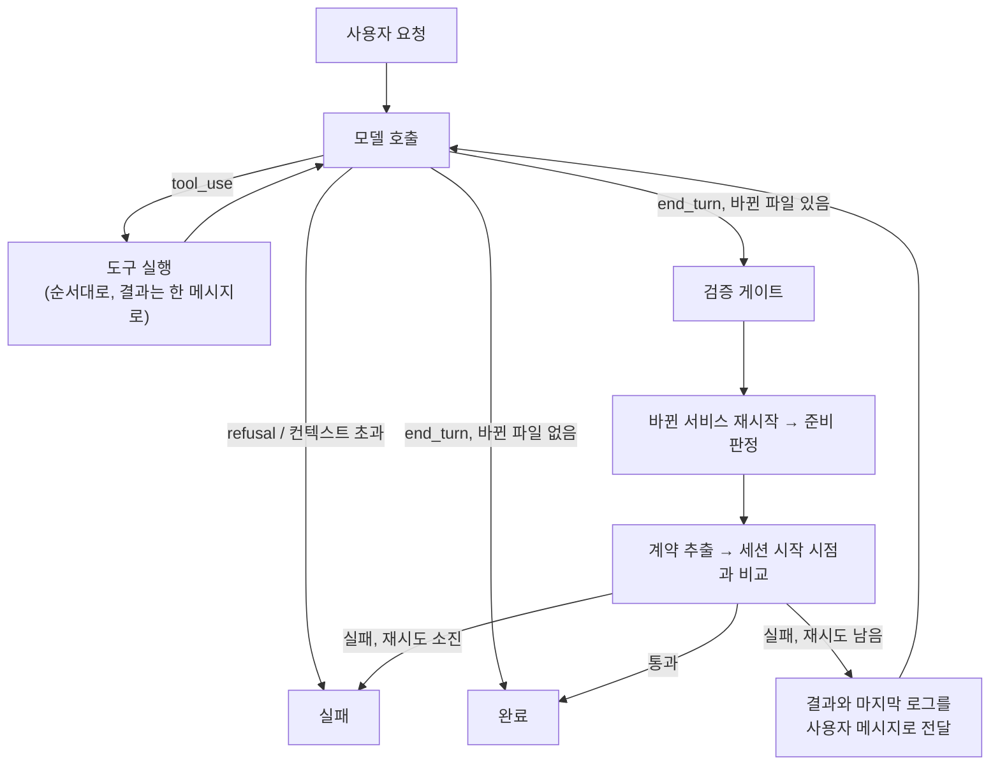

# 설계 결정 기록 (ADR)

결정마다 **맥락 → 검토한 선택지 → 결정 → 감수한 트레이드오프** 순서로 적었습니다. 외부 제품의 수치와 사실은 2026년 9월에 공개 자료로 확인한 내용이고, 문서 끝에 출처를 모았습니다.

- [ADR-001 미리보기 런타임: 브라우저 번들러 대신 서버 샌드박스](#adr-001-미리보기-런타임-브라우저-번들러-대신-서버-샌드박스)
- [ADR-002 프로젝트 모델: 구조는 통합, 작업 화면은 분리](#adr-002-프로젝트-모델-구조는-통합-작업-화면은-분리)
- [ADR-003 계약은 코드에서 추출하는 선택 사항](#adr-003-계약은-코드에서-추출하는-선택-사항)
- [ADR-004 새 DSL을 만들지 않는다: compose + OpenAPI 위의 얇은 층](#adr-004-새-dsl을-만들지-않는다-compose--openapi-위의-얇은-층)
- [ADR-005 첫 대상은 사내 도구, 백엔드는 Spring 우선](#adr-005-첫-대상은-사내-도구-백엔드는-spring-우선)
- [ADR-006 샌드박스 제공자를 추상화하고 로컬 Docker부터 구현](#adr-006-샌드박스-제공자를-추상화하고-로컬-docker부터-구현)
- [ADR-007 서비스 준비 판정 규칙](#adr-007-서비스-준비-판정-규칙)
- [ADR-008 볼륨을 샌드박스 전용과 공유 캐시로 나눈다](#adr-008-볼륨을-샌드박스-전용과-공유-캐시로-나눈다)
- [ADR-009 포트는 루프백의 빈 포트에만 공개한다](#adr-009-포트는-루프백의-빈-포트에만-공개한다)
- [ADR-010 에이전트 루프: 직접 작성한 루프와 스튜디오 검증 게이트](#adr-010-에이전트-루프-직접-작성한-루프와-스튜디오-검증-게이트)
- [ADR-011 도구 설계: bash 하나 대신 행동별 도구](#adr-011-도구-설계-bash-하나-대신-행동별-도구)
- [ADR-012 모델 설정과 프롬프트 (Claude Opus 5)](#adr-012-모델-설정과-프롬프트-claude-opus-5)
- [ADR-013 계약 호환 정책: 기본은 차단, 요청이 명시할 때만 허용](#adr-013-계약-호환-정책-기본은-차단-요청이-명시할-때만-허용)
- [ADR-014 재시작 전에 샌드박스가 바뀐 파일을 보는지 확인한다](#adr-014-재시작-전에-샌드박스가-바뀐-파일을-보는지-확인한다)
- [ADR-015 스튜디오 서버: Next.js 단일 앱과 Server-Sent Events](#adr-015-스튜디오-서버-nextjs-단일-앱과-server-sent-events)
- [ADR-016 세션마다 작업 복사본, API 키 없는 데모 모드](#adr-016-세션마다-작업-복사본-api-키-없는-데모-모드)
- [ADR-017 미리보기와 API 탐색기의 네트워크 경계](#adr-017-미리보기와-api-탐색기의-네트워크-경계)
- [ADR-018 세션 체크포인트: 검증을 통과한 변경만 남긴다](#adr-018-세션-체크포인트-검증을-통과한-변경만-남긴다)
- [ADR-019 로컬 로그인 계정으로 실행: API 키 없이 개인 PC에서만](#adr-019-로컬-로그인-계정으로-실행-api-키-없이-개인-pc에서만)

---

## ADR-001 미리보기 런타임: 브라우저 번들러 대신 서버 샌드박스

### 맥락
AI가 만든 코드를 사용자가 몇 초 안에 볼 수 있어야 합니다. 토스 TOI는 이 문제를 **브라우저 안에서** 풀었습니다.
- 경로를 키로 쓰는 4계층 가상 파일 시스템
- Web Worker에서 도는 esbuild-wasm
- `packageSetHash`(엔트리 목록 + yarn.lock 해시)로 미리 번들링해 S3에 올린 import map
- 빌드와 실행이 모두 성공했을 때만 iframe을 교체하는 방식

이 방식으로 첫 화면을 47초에서 1.3초로 줄였습니다. 하지만 이 프로젝트는 **Next.js 같은 서버 프레임워크와 백엔드까지** 실행해야 합니다.

### 검토한 선택지

| 방식 | 사례 | Next.js | 현업 적용 시 문제 |
|---|---|---|---|
| A. 브라우저 번들러 (esbuild-wasm) | 토스 TOI | ❌ | 클라이언트 React SPA만 가능. RSC, SSR, Server Action 불가 |
| B. 브라우저 안의 Node (WebContainers) | bolt.new | ⚠️ | Turbopack이 wasm 바인딩을 지원하지 않아 Next 16 기본 설정으로는 `next dev`가 실패함 (`turbo.createProject is not supported by the wasm bindings`). napi 네이티브 모듈 불가. 상용 서비스는 유료 라이선스 필요 |
| B'. Nodebox | Sandpack 2 | ⚠️ | Node 18 수준 호환, napi 불가, 사내 npm 지원은 개발 중 |
| **C. 서버 샌드박스** | Lovable (Fly.io), v0 (2026년 2월 샌드박스 런타임으로 전환) | ✅ | 컴퓨팅 비용, 콜드 스타트 |

### 결정
**C. 실제 Linux 환경에서 실제 개발 서버를 실행한다.** 프레임워크와 언어 제한이 없고, 로컬 개발 환경과 동작이 같습니다.

### 감수한 트레이드오프와 대응
- **콜드 스타트**: 의존성 캐시를 공유하고([ADR-008](#adr-008-볼륨을-샌드박스-전용과-공유-캐시로-나눈다)), 이후에는 lockfile 해시별로 설치가 끝난 스냅샷을 재사용할 계획입니다. TOI의 `packageSetHash` 아이디어를 서버 환경에 옮긴 것입니다.
- **비용과 운영 부담**: 제공자를 추상화해서([ADR-006](#adr-006-샌드박스-제공자를-추상화하고-로컬-docker부터-구현)) 규모와 보안 요구에 맞는 구현을 고를 수 있게 했습니다.
- TOI의 "성공한 번들만 반영" 원칙은 **헬스체크를 통과한 서버로만 트래픽을 넘기는 방식**으로 옮길 수 있습니다. 준비 판정([ADR-007](#adr-007-서비스-준비-판정-규칙))이 그 기반입니다.

---

## ADR-002 프로젝트 모델: 구조는 통합, 작업 화면은 분리

### 맥락
사용자마다 원하는 작업 방식이 다릅니다.
- 이미 있는 백엔드에 **화면만** 붙이고 싶은 사람 (TOI의 경우)
- **백엔드만** 만들지만 화면에서 테스트하며 개발하고 싶은 사람
- 프론트와 백엔드를 **함께** 만들고 싶은 사람

### 검토한 선택지
1. **제품을 프론트용과 백엔드용으로 나눈다**: 각 제품은 단순하지만, 나중에 합치려면 프로젝트·권한·배포 모델을 옮겨야 합니다. 또 "필드 하나 추가"처럼 DB, API, 화면을 한 번에 바꾸는 AI의 핵심 장점을 잃습니다.
2. **항상 풀스택으로 강제한다**: 백엔드만 만드는 사람에게 방해가 되고, 이미 레포와 배포 주기가 나뉜 조직에 맞지 않습니다.
3. **구조는 하나로, 작업 화면은 목적별로**

### 결정
**3번.** 프로젝트는 `서비스 목록 + (선택적) 계약`이고, 서비스는 `source: managed | external`로 구분합니다.

| 사용자 상황 | 서비스 구성 |
|---|---|
| 기존 백엔드에 화면만 | `web`(managed) + `api`(external) |
| 백엔드만 | `api`(managed) |
| 풀스택 | `web` + `api` (둘 다 managed) |
| 백엔드로 시작해 나중에 화면 추가 | `web` 서비스만 추가하면 됨. 프로젝트를 옮기지 않음 |

### 판단 기준
**되돌리기 비용**을 봤습니다. 내부 모델을 나누는 결정은 되돌리기 어렵고, 화면을 나누는 결정은 UI만 바꾸면 됩니다. 불확실할 때는 되돌리기 어려운 쪽을 유연하게 두었습니다.

---

## ADR-003 계약은 코드에서 추출하는 선택 사항

### 맥락
처음에는 OpenAPI 계약을 프론트와 백엔드 사이의 중심에 두려고 했습니다. 목 서버, 에이전트 검증 기준, 팀 간 경계 역할을 모두 할 수 있기 때문입니다. 그런데 다시 검토해 보니 현실과 맞지 않는 부분이 있었습니다.
- Spring(springdoc)과 FastAPI 개발자는 **코드부터 짜고 OpenAPI를 뽑아냅니다.**
- Next.js 풀스택은 Server Action과 Route Handler로 **서비스 하나 안에서** 끝나는 경우가 많습니다.
- REST가 아닌 GraphQL, gRPC, tRPC도 있습니다.

### 결정
- 계약은 **없어도 되는 선택 사항**입니다.
- 사람이 먼저 쓰는 파일이 아니라 **실행 중인 서버에서 추출해 변경 전후를 비교하는 결과물**로 다룹니다. (`contract.extract: /v3/api-docs`)
- 서비스 하나짜리 풀스택 프로젝트도 정식으로 지원합니다.

---

## ADR-004 새 DSL을 만들지 않는다: compose + OpenAPI 위의 얇은 층

### 맥락
사내 도구라도 **"이 도구를 그만 쓰면 코드를 그대로 가져갈 수 있는가"**가 도입 조건이 됩니다.

### 결정
- 실행: 표준 **Docker Compose** 파일
- 계약: 표준 **OpenAPI**
- `studio.yaml`: 스튜디오에만 필요한 정보(managed/external 구분, 미리보기 종류, 준비 확인 경로, 계약 추출 경로)만 담습니다.

`examples/orders`는 스튜디오 없이 `docker compose up`으로도 똑같이 실행됩니다. 스튜디오가 필요한 설정(포트 공개, 라벨)은 사용자 파일을 고치지 않고 **임시 override 파일**로 덧씌웁니다.

로더는 두 파일이 서로 맞는지 검증합니다. managed 서비스는 compose에 반드시 있어야 하고, external 서비스는 compose에 있으면 안 됩니다. compose에만 있는 서비스(예: `db`)는 샌드박스와 함께 뜨고 함께 사라지는 부가 서비스로 취급합니다.

---

## ADR-005 첫 대상은 사내 도구, 백엔드는 Spring 우선

### 맥락
범용 AI 앱 빌더는 Replit, Lovable, v0와 정면으로 경쟁하게 됩니다. TOI 사례를 보면 진짜 가치는 코드 생성보다 **"정책이 자동으로 적용되는 플랫폼"**에 있었습니다.

### 결정
- **사내 도구**를 첫 대상으로 정했습니다. 사내망 설치, 개인정보 마스킹, 감사 로그가 차별점이 됩니다.
- 백엔드 템플릿은 **Spring Boot**를 먼저 만들고 **FastAPI**도 제공합니다.

### 템플릿 원칙
런타임은 어떤 프레임워크든 실행할 수 있게 열어 두되, AI가 쓰는 스택은 **검증된 템플릿**으로 제한합니다. "모든 프레임워크 호환"과 "모든 프레임워크에서 좋은 품질"은 다른 문제이기 때문입니다.

---

## ADR-006 샌드박스 제공자를 추상화하고 로컬 Docker부터 구현

### 맥락
사내 도구는 운영 환경이 회사마다 다릅니다. 관리형 서비스를 쓸 수 있는 곳도 있고, 사내망 Kubernetes만 허용하는 곳도 있습니다.

| 제공자 | 격리 | 자체 운영 |
|---|---|---|
| Vercel Sandbox | Firecracker microVM | ❌ |
| E2B | Firecracker | ✅ |
| Northflank | Kata / gVisor | ✅ (BYOC) |
| Kubernetes agent-sandbox | gVisor / Kata, 웜 풀 | ✅ (오픈소스) |

### 결정
`SandboxProvider.create(project) → Sandbox` 인터페이스를 두고, 첫 구현은 **`LocalDockerProvider`**로 했습니다.
- 외부 계정 없이 개발할 수 있습니다.
- compose 기반이라 사내 서버 한 대 운영에도 그대로 쓸 수 있습니다.
- 인터페이스(`start`, `restart`, `endpoint`, `state`, `logs`, `exec`, `destroy`)는 원격 microVM 구현에서도 그대로 성립하도록 파일 시스템 경로에 의존하지 않게 설계했습니다.

### 감수한 트레이드오프
로컬 Docker는 **컨테이너 수준의 격리**입니다. 사내 운영에서 신뢰할 수 없는 생성 코드를 돌리려면 gVisor/Kata 기반 제공자로 바꿔야 하고, 로드맵에 넣었습니다.

---

## ADR-007 서비스 준비 판정 규칙

### 맥락
준비 판정은 **"미리보기가 언제 뜨는가"**와 **"에이전트가 언제 실패를 알게 되는가"**를 결정합니다. 실제 실행에서 관찰한 기동 과정은 이랬습니다.

```
UND_ERR_SOCKET (포트는 열렸지만 서버 준비 전)
→ TIMEOUT      (Next dev가 첫 요청을 컴파일하는 중)
→ HTTP 200
```

### 결정 (`packages/sandbox/src/readiness.ts`)

| 상황 | 판정 | 이유 |
|---|---|---|
| 기대한 상태 코드를 **연속 2번** 받음 | ready | 기동 직후 잠깐 성공했다가 흔들리는 경우를 걸러냄 |
| 컨테이너가 `exited` / `dead` | **즉시** failed | 컴파일 에러가 나면 15분 타임아웃을 기다리지 않고 몇 초 만에 결과를 받음 |
| 연결 거부, 소켓 에러, 타임아웃, 503, `restarting` | waiting | 기동 중에 흔한 상태 |
| 서비스별 `timeoutSeconds` 초과 | failed | 마지막 확인 결과(`HTTP 503, 컨테이너 running` 등)를 실패 이유에 담아 에이전트가 읽을 수 있게 함 |

판정 함수는 확인 기록 배열만 받는 **순수 함수**라서 Docker 없이 단위 테스트 6개로 검증했습니다.

---

## ADR-008 볼륨을 샌드박스 전용과 공유 캐시로 나눈다

### 맥락
샌드박스는 매번 새로 만들고 지우지만, 매번 Gradle 배포판과 의존성을 다시 받으면 기동이 몇 분씩 걸립니다.

### 결정

| 종류 | compose 선언 | 수명 | 예시 |
|---|---|---|---|
| 샌드박스 전용 | 일반 named volume | `destroy()` 때 삭제 | `node_modules`, `.next`, Gradle `build`, DB 데이터 |
| 공유 캐시 | `external: true` + 고정 이름 | 샌드박스를 지워도 유지 | `b-studio-cache-gradle`, `b-studio-cache-pnpm` |

compose는 external 볼륨을 만들어 주지 않으므로, 로더가 external 볼륨을 모아 두고 제공자가 기동 전에 `docker volume create`로 만듭니다(이미 있으면 그대로 둠). Gradle과 pnpm 캐시는 여러 프로세스가 동시에 써도 안전해서 샌드박스끼리 공유할 수 있습니다.

### 결과와 한계
Gradle 다운로드는 사라졌지만 두 번째 기동도 "늦어도 43초 안에 준비" 수준으로, 극적으로 빨라지지는 않았습니다. `node_modules`가 샌드박스마다 새로 설치되기 때문입니다. 자세한 분석은 [troubleshooting.md](troubleshooting.md#3-공유-캐시를-써도-두-번째-기동이-크게-빨라지지-않음)에 있습니다.

---

## ADR-009 포트는 루프백의 빈 포트에만 공개한다

### 결정
override 파일에서 managed 서비스 포트를 `127.0.0.1::<컨테이너 포트>` 형식으로 공개합니다.
- **빈 포트 자동 할당**: 샌드박스 여러 개를 동시에 띄워도 포트가 겹치지 않습니다. 할당된 포트는 `docker compose port`로 조회합니다.
- **루프백에만 공개**: 같은 네트워크의 다른 PC에서 샌드박스에 접근할 수 없습니다. 사내 도구의 기본값으로 필요합니다.
- 사용자의 `compose.yaml`에는 `ports`를 적지 않습니다. 템플릿을 그대로 여러 샌드박스에서 재사용하기 위해서입니다.

---

## ADR-010 에이전트 루프: 직접 작성한 루프와 스튜디오 검증 게이트

### 맥락
에이전트가 "끝났다"고 말하는 것만으로는 완료로 볼 수 없습니다. 서버가 실제로 뜨는지, API 계약을 깨지 않았는지는 **플랫폼이 직접 확인**해야 합니다. 또 이 확인 흐름은 API 키 없이도 반복해서 검증할 수 있어야 합니다.

### 검토한 선택지

| 방식 | 장점 | 이 프로젝트에 맞지 않는 점 |
|---|---|---|
| SDK Tool Runner (beta) | 루프를 직접 쓰지 않아도 됨 | 턴이 끝난 뒤 검증하고, 실패하면 결과를 넣어 루프를 재개하는 흐름을 훅으로 끼워 넣어야 함 |
| Managed Agents | Anthropic이 루프와 샌드박스를 운영 | 코드가 **우리 샌드박스**(사내망 Docker/Kubernetes)에서 실행돼야 하는 요구와 충돌 |
| **직접 작성한 루프** | 게이트·재시도·종료 조건을 코드로 명확히 표현, 모델 호출을 인터페이스로 분리 가능 | `pause_turn`, `refusal`, `max_tokens` 처리를 직접 유지해야 함 |

### 결정
`runAgent()`가 모델 호출을 `ModelClient` 인터페이스로 받습니다.
- `AnthropicModelClient`: 실제 Claude API
- `ScriptedModelClient`: 미리 적은 턴을 돌려주는 테스트 더블. **루프·도구·게이트·샌드박스가 맞물리는지** 검증하는 용도이고, 모델의 코딩 능력을 검증하지는 않습니다.



게이트는 매번 전체를 다시 확인하지 않습니다. **지난 게이트 이후 바뀐 파일**과 **지난번에 준비에 실패한 서비스의 파일**만 대상으로 삼습니다. 작업 공간이 쓰기마다 버전을 올리고, 게이트는 마지막으로 확인한 버전을 기억합니다.

---

## ADR-011 도구 설계: bash 하나 대신 행동별 도구

### 맥락
bash 도구 하나면 모델이 거의 모든 일을 할 수 있지만, 스튜디오는 불투명한 명령 문자열만 보게 됩니다. 사내 도구에서는 **어떤 파일을 바꿨는지 기록하고, 위험한 경로를 막고, 사람의 수정을 덮어쓰지 않는 것**이 필요합니다.

### 결정

| 도구 | 강제하는 규칙 |
|---|---|
| `list_files`, `read_file` | 프로젝트 루트 밖, 심볼릭 링크 탈출, `.git`·`node_modules`·`build`·`.env` 접근 차단 |
| `write_file`, `edit_file` | 위 규칙 + **읽은 뒤 파일이 바뀌었으면 쓰기 거부**(내용 해시 비교) + 바뀐 파일 기록. `edit_file`은 정확히 한 곳만 일치해야 수정 |
| `run_in_service` | 명령을 **인자 배열**로 받아 셸을 거치지 않음, 3분 타임아웃 |
| `restart_service`, `service_logs`, `http_request` | 실행 확인용. 재시작 실패 시 최근 로그를 함께 반환 |
| `get_contract` | OpenAPI 원문 대신 **연산·스키마 요약**을 반환해 토큰을 아낌 |

- 모든 도구는 `strict: true`이고 **모든 필드를 필수**로 둡니다. "없음"은 빈 문자열처럼 명시적인 값으로 표현합니다.
- 도구 출력이 3만 자를 넘으면 앞뒤를 남기고 **잘랐다는 표시를 넣습니다.** 조용히 자르지 않습니다.
- 도구 실패는 루프를 멈추지 않고 `is_error: true` 결과로 모델에게 돌려줍니다.

---

## ADR-012 모델 설정과 프롬프트 (Claude Opus 5)

### 요청 설정

| 설정 | 값 | 이유 |
|---|---|---|
| 모델 | `claude-opus-5` | 긴 에이전트 작업과 코딩에 가장 강한 Opus |
| thinking | `{ type: "adaptive" }` | Opus 5의 기본값이지만 의도를 명시 |
| effort | 기본 `high`, CLI `--effort`로 조정 | 비용과 품질의 기준점. 작업별로 낮춰 측정할 수 있게 열어 둠 |
| 전송 | 스트리밍 후 `finalMessage()`, `max_tokens` 64K | 긴 응답이 HTTP 타임아웃에 걸리지 않게 함 |
| 거절 대응 | `fallbacks: "default"` + `server-side-fallback-2026-07-01` | 안전 분류기가 거절하면 서버가 권장 모델로 다시 실행. 그래도 `stop_reason: "refusal"`이면 실패로 끝냄 |
| 프롬프트 캐시 | 시스템 프롬프트에 캐시 지점 + 요청 전체 자동 캐시 | 도구와 시스템 프롬프트는 프로젝트마다 고정. 시각 같은 가변 값을 넣지 않음 |
| 사전 확인 | `models.retrieve()` | 수십 초 걸리는 샌드박스를 띄우기 전에 인증과 모델 권한을 토큰 소비 없이 확인 |

### 프롬프트 튜닝
Opus 5 마이그레이션 가이드의 권고를 반영했습니다.
- **"작업을 검증하라"는 지시를 넣지 않았습니다.** 이 모델은 시키지 않아도 스스로 검증하므로, 검증은 프롬프트가 아니라 게이트가 강제합니다.
- 응답과 파일이 길어지고 범위를 넓히는 경향이 있어 **간결함과 범위 규칙**을 명시했습니다. "요청하지 않은 리팩터링, 이름 변경, 기능, 테스트, 파일을 추가하지 않는다" 같은 규칙입니다.
- 프레임워크 버전이 학습 시점보다 새로울 수 있으므로, Next.js는 **컨테이너 안의 버전별 문서**(`node_modules/next/dist/docs`)를 읽도록 안내합니다. Next.js 16이 생성한 `AGENTS.md`도 같은 원칙을 요구합니다.
- DB 스키마는 **새 Flyway 마이그레이션으로만** 바꾸고, 기존 마이그레이션은 수정하지 않습니다.

---

## ADR-013 계약 호환 정책: 기본은 차단, 요청이 명시할 때만 허용

### 결정
세션을 시작할 때 OpenAPI 계약을 저장해 두고, 게이트마다 현재 계약과 비교합니다.

| 변경 | 판정 |
|---|---|
| 연산 추가, 스키마 추가, **선택** 필드 추가 | 호환 |
| 연산·스키마·필드 삭제, 필드 타입 변경, 기존 필드 필수화, **필수** 필드 신규 추가 | **호환 깨짐** |

- 호환을 깨는 변경은 기본적으로 게이트를 통과하지 못합니다. 요청이 삭제나 변경을 명시할 때만 `--allow-breaking`으로 허용합니다.
- 결과는 호환 깨짐을 먼저, 그다음 대상 이름의 **코드포인트 순**으로 정렬합니다. 실행 환경의 로케일에 따라 순서가 달라지지 않게 하기 위해서입니다.

---

## ADR-014 재시작 전에 샌드박스가 바뀐 파일을 보는지 확인한다

### 맥락
로컬 Docker 제공자는 프로젝트 폴더를 컨테이너에 바인드 마운트합니다. macOS의 colima 기본 설정은 sshfs 마운트이고, Lima 문서에 따르면 sshfs 캐시는 **기본으로 켜져 있으며 호스트의 변경이 제때 반영되지 않을 수 있습니다.**

실제로 에이전트 e2e에서 검증 게이트가 **컴파일 에러가 있는 코드를 "준비 완료"로 통과시켰습니다.** 방금 쓴 파일을 VM 쪽에서 아직 보지 못한 상태로 서비스를 재시작해, 옛 코드가 빌드된 것으로 판단했습니다. 경위와 측정값은 [troubleshooting.md](troubleshooting.md)에 있습니다. 게이트가 틀린 결과를 통과시키는 것은 게이트가 없는 것보다 위험합니다.

### 검토한 선택지

| 방식 | 문제 |
|---|---|
| 재시작 전에 정해진 시간만큼 대기 | 느리고, 캐시 시간보다 짧으면 여전히 틀림 |
| virtiofs 같은 다른 마운트를 쓰라고 안내 | 사용자 환경을 강제할 수 없고, 다른 OS·원격 샌드박스에는 해당하지 않음 |
| 마운트 대신 파일을 복사해 넣기 | 표준 compose 파일만으로 똑같이 실행된다는 원칙([ADR-004](#adr-004-새-dsl을-만들지-않는다-compose--openapi-위의-얇은-층))이 깨짐 |
| **동기화 지점 `Sandbox.sync(files)`** | 확인 한 번마다 약간의 비용 |

### 결정
재시작하기 전에 **샌드박스 쪽에서 바뀐 파일이 보일 때까지** 기다립니다.
- **확인 기준 두 가지**: 디렉터리 목록(readdir)에 파일 이름이 보이는지와, 내용의 sha256이 호스트와 같은지를 함께 확인합니다. 빌드 도구는 목록과 파일 속성으로 변경을 감지하기 때문에, 경로로 파일을 직접 열어 보는 것만으로는 부족합니다.
- **확인 방법(로컬 Docker)**: busybox 컨테이너가 같은 프로젝트 폴더를 읽기 전용으로 붙여 250ms 간격으로 확인하고, 기본 60초 안에 반영되지 않으면 실패합니다. 파일 경로는 셸 문자열에 끼워 넣지 않고 위치 인자로 넘깁니다.
- **서비스 컨테이너가 아닌 별도 컨테이너로 확인하는 이유**: 컴파일 에러로 서비스가 죽어 있어도 확인할 수 있어야 하고, 같은 VM 마운트를 공유하므로 서비스와 같은 상태를 보게 됩니다.
- **호출 위치**: 검증 게이트와 `restart_service` 도구가 재시작 전에 호출합니다. 확인에 실패하면 재시작하지 않고 게이트를 실패로 처리합니다.
- **원격 제공자**: 같은 메서드를 "업로드 완료 보장"으로 구현하면 됩니다.

### 감수한 트레이드오프
확인 한 번에 컨테이너를 하나 실행하는 비용이 듭니다. 캐시 지연이 없는 환경에서는 첫 확인에서 바로 통과합니다.

---

## ADR-015 스튜디오 서버: Next.js 단일 앱과 Server-Sent Events

### 맥락
스튜디오 서버가 하는 일은 두 가지예요.
- **오래 걸리는 작업**: 샌드박스 기동과 에이전트 실행은 수십 초에서 수 분이 걸리고, 서버에서 `docker` 명령을 직접 실행해야 합니다.
- **실시간 전달**: 서비스 상태, 로그, 에이전트 진행 상황을 브라우저에 계속 보내야 합니다.

요청마다 짧게 실행되는 서버리스 환경은 맞지 않습니다. 사내 서버 한 대에서 도는 Node 프로세스를 전제로 했습니다.

### 검토한 선택지

| 방식 | 판단 |
|---|---|
| 별도 백엔드(Express 등) + SPA | 배포 단위와 타입 공유 경로가 둘로 늘어남 |
| **Next.js 16 App Router 단일 앱** | Route Handler로 REST와 스트리밍, Server Component로 첫 화면을 한 프로세스에서 처리 |
| WebSocket | 양방향이 필요하지 않음. 서버 → 브라우저는 스트림, 브라우저 → 서버는 일반 POST면 충분 |
| **Server-Sent Events** | 브라우저가 스스로 다시 연결하고, 일반 HTTP라 프록시와 잘 맞음 |

### 결정
- 세션 관리자는 **프로세스 메모리 안의 싱글톤**입니다. 개발 서버의 HMR로 모듈이 다시 로드돼도 실행 중인 샌드박스를 잃지 않도록 `globalThis`에 둡니다.
- 이벤트 스트림은 연결되면 **스냅샷부터 지금까지의 기록을 다시 보내고**, 화면 쪽 리듀서는 스냅샷을 받으면 상태를 초기화합니다. 그래서 다시 연결해도 채팅 기록이 중복되지 않습니다.
- 단, 스냅샷에 이미 반영된 상태를 바꾸는 이벤트(체크포인트 추가 등)는 **같은 이벤트를 두 번 받아도 결과가 같게** 처리해야 합니다. 이 원칙을 놓쳐 체크포인트 목록이 중복된 적이 있습니다([트러블슈팅 10](troubleshooting.md#10-다시-연결하면-체크포인트-목록이-중복됨)).
- 로그는 양이 많아서 채팅·상태 기록과 **따로 최근 1,000줄만** 둡니다. 로그가 쌓여 대화 기록이 밀려나지 않게 하기 위해서입니다.
- 서버가 종료 신호를 받으면 띄워 둔 샌드박스를 정리합니다.

### 감수한 트레이드오프
서버 프로세스를 재시작하면 세션 상태가 사라지고, 여러 서버로 나눠 운영할 수 없습니다. 사용자가 늘면 세션 저장소와 샌드박스 작업자를 분리해야 합니다.

---

## ADR-016 세션마다 작업 복사본, API 키 없는 데모 모드

### 결정
- **작업 복사본**: 세션을 시작하면 프로젝트를 `~/.cache/b-studio/sessions/<프로젝트>-<세션>`으로 복사하고 그 복사본으로 샌드박스를 띄웁니다. 에이전트가 원본을 바꾸지 않게 하고, colima가 마운트하는 홈 디렉터리 아래에 두기 위해서입니다. Git 연동 전까지 결과는 복사본에 남습니다.
- **데모 모드** (`B_STUDIO_MODE=demo`): Claude API 대신 e2e와 같은 스크립트 시나리오로 실행합니다.
- **데모 모드는 준비된 요청만 순서대로 실행**하고, 다른 요청은 409로 거절하면서 다음 요청을 안내합니다. 스크립트가 임의의 요청을 처리하는 것처럼 보이면 시연이 거짓말이 되기 때문입니다.

---

## ADR-017 미리보기와 API 탐색기의 네트워크 경계

### 결정
- **포트는 루프백에만 공개**합니다([ADR-009](#adr-009-포트는-루프백의-빈-포트에만-공개한다)). 미리보기 iframe은 같은 PC의 브라우저가 `127.0.0.1:<포트>`로 직접 엽니다.
- **API 탐색기 요청은 스튜디오 서버를 거칩니다.** 서버는 메서드를 허용 목록으로 제한하고, 세션에 없는 서비스로의 요청을 거절합니다.
- **`//`로 시작하는 경로를 막습니다.** `new URL("//evil.example/x", base)`는 다른 호스트를 가리킵니다. 그래서 요청 URL의 origin이 서비스 주소와 같은지 비교합니다. 같은 검사를 에이전트의 `http_request` 도구와 `studio.yaml`의 경로 필드에도 적용했습니다.
- **재시작하면 포트가 바뀝니다.** 에이전트 루프가 서비스 상태 이벤트(`onServiceStatus`)를 밖으로 전달해서 화면이 새 주소를 따라가게 하고, 요청이 끝날 때마다 미리보기와 계약을 다시 불러옵니다.

### 한계
다른 PC의 브라우저는 루프백 포트에 접근할 수 없어서 미리보기 iframe을 열 수 없습니다. 원격 사용자를 지원하려면 스튜디오 서버가 미리보기까지 리버스 프록시해야 합니다.

---

## ADR-018 세션 체크포인트: 검증을 통과한 변경만 남긴다

### 맥락
검증 게이트는 호환을 깨는 변경을 **완료로 인정하지 않을 뿐, 적용된 변경을 되돌리지 않았습니다.** 그래서 차단된 요청 뒤에도 작업 복사본과 샌드박스에는 변경이 남아, 미리보기의 배송 메모가 비어 보였습니다. "완료로 인정하지 않는다"와 "적용되지 않았다"는 다른 상태입니다.

### 검토한 선택지

| 방식 | 문제 |
|---|---|
| 에이전트가 쓴 파일의 원래 내용을 기억해 복원 | 삭제, 이름 변경, 여러 요청에 걸친 복원을 직접 구현해야 하고, 이전 시점으로 돌아가기 어려움 |
| 요청마다 작업 폴더 전체 복사 | 프로젝트 크기만큼 매번 복사하고, 무엇이 바뀌었는지 보여 주기 어려움 |
| **작업 복사본을 Git 저장소로 관리** | 커밋이 곧 체크포인트이고, `git diff`로 변경 내역을 보여 주고, `reset`으로 복원. 개발자가 이미 아는 모델 |

### 결정
- **세션 시작**: 작업 복사본에서 `git init`을 실행하고(이미 저장소면 그대로 씀) "세션 시작" 체크포인트를 남깁니다.
- **요청이 게이트를 통과하면** `요청: <요청 내용>`으로 커밋합니다.
- **통과하지 못하거나 에러가 나면** 버린 변경을 patch로 보관한 뒤 `reset --hard`와 `clean -fd`로 되돌립니다. 그리고 바뀐 파일이 속한 서비스를 파일 반영 확인([ADR-014](#adr-014-재시작-전에-샌드박스가-바뀐-파일을-보는지-확인한다))과 함께 재시작해, 샌드박스도 이전 상태로 맞춥니다.
- **이전 체크포인트로 되돌리기**: SHA 형식을 검사하고, 이 세션 기록의 조상 커밋(`merge-base --is-ancestor`)으로만 허용합니다. 되돌린 뒤에는 대화에도 그 사실을 남겨, 다음 요청이 사라진 변경을 전제로 하지 않게 합니다.
- **저장소에만 적용하는 설정**: `core.hooksPath`는 빈 폴더, `commit.gpgsign`은 false, 커밋 사용자는 전용 이름으로 둡니다. 체크포인트는 스튜디오 내부 기록이라, 사용자의 전역 커밋 훅이나 서명 설정이 커밋을 막거나 입력을 기다리며 멈추면 안 되기 때문입니다.
- **생성물 제외**: 샌드박스가 만드는 `node_modules`, `.next`, `build` 등은 사용자의 `.gitignore`를 고치지 않고 `.git/info/exclude`로 제외합니다.
- **실행 방식**: git은 셸을 거치지 않고 인자 배열로 실행합니다.

### 감수한 트레이드오프
- 되돌리기는 이후 체크포인트를 지우는 작업이라, 브라우저 확인 창 대신 화면 안에서 한 번 더 확인받습니다.
- CLI `studio agent`는 사용자 프로젝트 폴더를 직접 다루므로 자동 되돌리기를 적용하지 않았습니다. 사용자 저장소에서 `reset --hard`가 실행되는 위험이 더 크기 때문입니다.
- 원격 저장소 푸시와 PR 생성은 아직 없습니다.

---

## ADR-019 로컬 로그인 계정으로 실행: API 키 없이 개인 PC에서만

### 맥락
API 키를 발급받기 전에도 개발자가 자기 PC에서 에이전트를 직접 돌려 보고 싶어 합니다. 이런 PC에는 이미 `claude` CLI가 설치돼 있고 개인 구독으로 로그인돼 있는 경우가 많습니다.

제약도 분명합니다. Agent SDK 문서는 다음과 같이 안내합니다.

> Unless previously approved, Anthropic does not allow third party developers to offer claude.ai login or rate limits for their products, including agents built on the Claude Agent SDK. Use the API key authentication methods described in the Quickstart instead.

그래서 **스튜디오가 로그인을 제공하거나, 여러 사람이 한 사람의 구독을 나눠 쓰게 만들면 안 됩니다.** 가능한 범위는 "개발자 본인 PC에서, 본인이 이미 로그인한 CLI를 그대로 쓰는 것"입니다.

### 검토한 선택지

| 방식 | 판단 |
|---|---|
| 스튜디오에 로그인 화면을 넣고 토큰 보관 | 위 정책에 어긋나고, 공유 서버에서는 한 구독을 여러 사람이 쓰게 됨 |
| `claude -p`를 서브프로세스로 호출하고 JSON 출력 파싱 | 모델이 쓰는 도구를 우리 규칙으로 제한하기 어렵고, 턴이 끝날 때마다 게이트를 끼우기 어려움 |
| **Agent SDK로 로컬 CLI를 실행하고, b-studio 도구를 프로세스 안 MCP 서버로 제공** | 로그인 흐름 없이 기존 설치를 그대로 쓰고, 기본 도구를 끈 채 우리 도구만 허용할 수 있음 |

### 결정
- **명시적으로 켤 때만 씁니다.** 스튜디오는 `B_STUDIO_MODE=claude-code`(`pnpm studio:local`), CLI는 `--backend claude-code`입니다. 기본값은 계속 `api`이고, 모르는 값은 오류로 거절해 오타 때문에 다른 모드로 조용히 넘어가지 않게 했습니다.
- **로그인 흐름을 만들지 않습니다.** 요청마다 먼저 `accountInfo()`로 이미 로그인돼 있는지만 확인합니다. 프롬프트를 보내지 않으므로 사용량을 쓰지 않고, 실측 약 4초가 걸렸습니다. 응답의 이메일과 조직 이름은 화면이나 로그에 남기지 않습니다.
- **Claude Code의 기본 동작을 모두 끕니다.**

  | 옵션 | 값 | 이유 |
  |---|---|---|
  | `tools` | `[]` | 기본 도구(Bash, Read, Edit 등)를 끔. 모델이 호스트 셸이나 파일에 직접 접근하지 못함 |
  | `mcpServers`, `allowedTools` | b-studio 도구 9개만 | 작업 공간 규칙([ADR-011](#adr-011-도구-설계-bash-하나-대신-행동별-도구))과 샌드박스를 거쳐서만 작업 |
  | `permissionMode` | `dontAsk` | 허용 목록 밖의 도구는 묻지 않고 거부. 서버에서 사람의 승인을 기다리며 멈추지 않음 |
  | `settingSources`, `strictMcpConfig` | `[]`, `true` | 사용자 전역 설정의 훅·플러그인·MCP 서버와 `CLAUDE.md`가 에이전트 동작을 바꾸지 않게 함 |
  | `systemPrompt` | b-studio 프롬프트 | 기본 도구를 끈 상태에 맞춘 프롬프트로 교체 |

- **완료 판정은 같은 검증 게이트가 합니다.** 게이트를 `VerificationGate`로 루프에서 분리해 두 실행 방식이 함께 씁니다. SDK의 `result` 메시지를 "모델이 턴을 끝냈다"는 신호로 보고 게이트를 돌리며, 실패하면 결과를 스트리밍 입력으로 같은 대화에 넣습니다.
- **도구는 순서대로 실행합니다.** CLI는 도구를 동시에 부를 수 있어서, MCP 핸들러를 직렬 큐로 감싸 직접 만든 루프와 같은 순서를 보장합니다.
- **대화는 실행마다 갈라서 이어받습니다.** 다음 요청은 이전 세션을 `resume`하되 `forkSession: true`로 새 세션을 만듭니다. 예외로 끝난 실행은 저장한 세션 ID를 바꾸지 않으므로 다음 요청의 기준이 되지 않습니다. API 루프가 예외 때 이번 실행분을 대화에서 지우는 것과 같은 효과입니다. 체크포인트로 되돌린 사실은 다음 요청 앞에 붙여 알립니다.
- **도구 스키마는 한 곳에서만 정의합니다.** `buildTools`의 JSON 스키마를 MCP 도구가 요구하는 zod 형태로 옮기고, 지원하지 않는 형태는 바로 오류를 냅니다.
- **화면 표기는 "로컬 Claude Agent"입니다.** 같은 문서의 브랜딩 가이드가 제품 안에서 "Claude Code"라는 이름을 쓰지 않도록 합니다. 명령 이름과 로그인 안내처럼 설치된 CLI를 가리키는 곳만 `claude`를 그대로 씁니다.
- **Next.js 번들에서 SDK를 뺍니다.** SDK는 자기 패키지 위치를 기준으로 플랫폼별 실행 파일을 찾으므로 `serverExternalPackages`에 넣었습니다.

### 감수한 트레이드오프
- **개인 PC 전용입니다.** 사내 공유 서버에 배포할 때는 조직의 API 키로 `api` 모드를 써야 합니다. 스튜디오 개발 서버와 `next start`는 `127.0.0.1`에만 바인드합니다.
- 대화 기록이 로컬 CLI의 세션 파일(`~/.claude/projects/` 아래)에 남습니다.
- 모델은 넘기지 않으면 로그인한 계정의 기본값을 씁니다. 토큰 수는 SDK가 알려 주는 `modelUsage` 기준 추정치입니다.
- 로그인하지 않은 상태의 `accountInfo()` 응답은 직접 확인하지 못했습니다. 구독 종류, API 키 출처, 토큰 출처가 모두 비어 있으면 로그인이 필요하다고 안내합니다.

---

## 출처

- 토스 테크, [AI가 만든 코드가 어드민이 되기까지](https://toss.tech/article/52885)
- StackBlitz, [WebContainers Commercial Usage](https://webcontainers.io/enterprise)
- vercel/next.js, [`next dev --turbo` fails in WASM #70522](https://github.com/vercel/next.js/issues/70522) · stackblitz/webcontainer-core [#2065](https://github.com/stackblitz/webcontainer-core/issues/2065)
- CodeSandbox, [Sandpack FAQ (Nodebox)](https://sandpack.codesandbox.io/docs/resources/faq)
- Beam, [How Lovable and Bolt Work](https://www.beam.cloud/blog/agentic-apps)
- Vercel, [Vercel Sandbox](https://vercel.com/docs/sandbox) · [Pricing and quotas](https://vercel.com/docs/sandbox/pricing)
- kubernetes-sigs, [agent-sandbox](https://github.com/kubernetes-sigs/agent-sandbox)
- Replit, [Development and production databases](https://docs.replit.com/features/data-and-storage/development-and-production)
- Upstash, [Best Sandbox Providers for AI Agents](https://upstash.com/blog/best-sandbox-providers-for-ai-agents)
- Anthropic, [Agent SDK overview](https://code.claude.com/docs/en/agent-sdk/overview) (인증 정책, 브랜딩 가이드)
