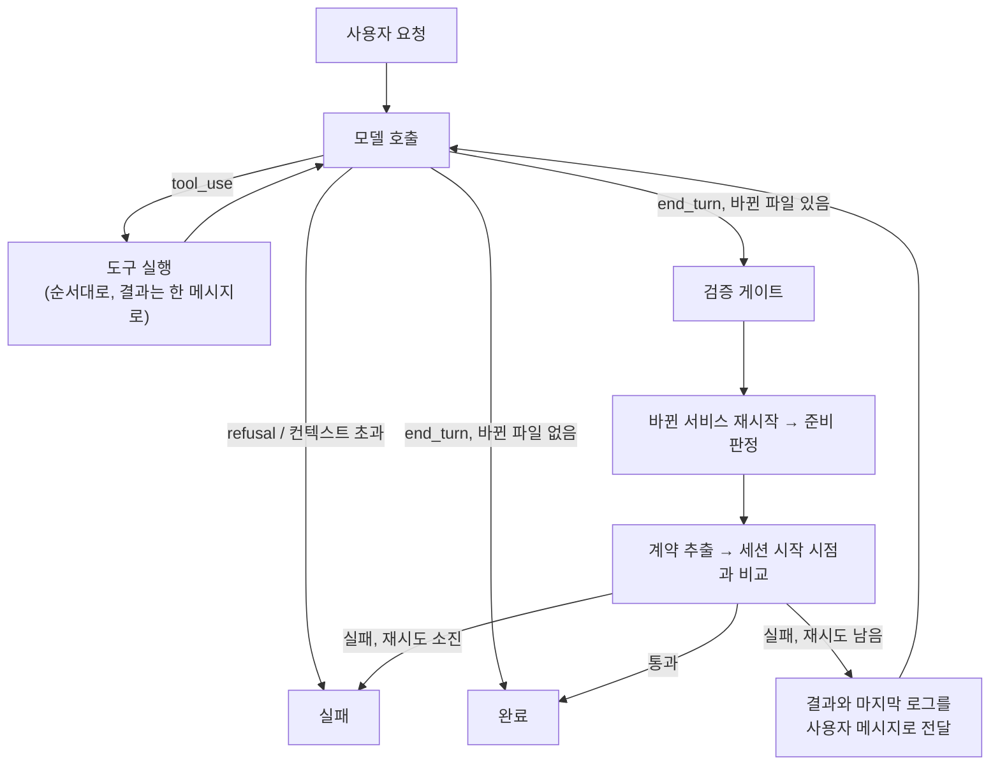

# 설계 결정 기록 (ADR)

결정마다 **맥락 → 검토한 선택지 → 결정 → 감수한 트레이드오프** 순서로 적었습니다. 외부 제품의 수치와 사실은 2026년 9월에 공개 자료로 확인한 내용이고, 문서 끝에 출처를 모았습니다.

[문서 홈](README.md) · [아키텍처](architecture.md) · [검증 기록](verification.md) · [트러블슈팅](troubleshooting.md)

## 주제별 빠른 찾기

| 주제 | ADR |
|---|---|
| 프로젝트 모델과 런타임 | 001–009, 021, 028, 032, 044 |
| 에이전트와 검증 게이트 | 010–014, 034–039, 042, 047–048, 053–060 |
| 웹 스튜디오와 세션 | 015–020, 029–031, 033, 040–041, 045–046, 052, 126 |
| 데이터·자원·보안 | 022–027, 038, 040, 045, 126 |
| 운영 배포 | 020, 030, 032–033, 043–045 |
| 토큰 경제·모델 전략 | 047–048, 055, 063–065, 075, 089, 091, 150 |
| 조율·작업 분해 | 051, 059, 068–069, 071, 116–117, 119 |
| 요구사항·추적성·PR 리뷰 | 072, 079–081, 090, 092, 098, 103, 107, 110–111, 114–115, 122–123, 125, 155 |
| 도그푸딩에서 드러난 마찰 수정 | 095–096, 099, 101–102, 106, 108–109, 112–113 |
| 멀티 CLI·백엔드 | 089, 091, 093, 117–120 |
| 실제 환경에서만 드러난 제약(네트워크·포트) | 024–027, 033, 121, 124 |

아래 목록은 번호순 전체 색인입니다. 기존 결정을 대체할 때는 원문을 지우지 않고 새 ADR에서 대체 관계를 기록합니다.

- [ADR-001 미리보기 런타임: 브라우저 번들러 대신 서버 샌드박스](#adr-001-미리보기-런타임-브라우저-번들러-대신-서버-샌드박스)
- [ADR-002 프로젝트 모델: 구조는 통합, 작업 화면은 분리](#adr-002-프로젝트-모델-구조는-통합-작업-화면은-분리)
- [ADR-003 계약은 코드에서 추출하는 선택 사항](#adr-003-계약은-코드에서-추출하는-선택-사항)
- [ADR-004 새 DSL을 만들지 않는다: compose + OpenAPI 위의 얇은 층](#adr-004-새-dsl을-만들지-않는다-compose--openapi-위의-얇은-층)
- [ADR-005 첫 대상은 사내 도구, 백엔드는 Spring 우선](#adr-005-첫-대상은-사내-도구-백엔드는-spring-우선)
- [ADR-006 샌드박스 제공자를 추상화하고 로컬 Docker부터 구현](#adr-006-샌드박스-제공자를-추상화하고-로컬-docker부터-구현)
- [ADR-007 서비스 준비 판정 규칙](#adr-007-서비스-준비-판정-규칙)
- [ADR-008 볼륨을 샌드박스 전용과 공유 캐시로 나눈다](#adr-008-볼륨을-샌드박스-전용과-공유-캐시로-나눈다)
- [ADR-009 포트는 루프백의 빈 포트에만 공개한다](#adr-009-포트는-루프백의-빈-포트에만-공개한다)
- [ADR-010 에이전트 루프: 직접 작성한 루프와 스튜디오 검증 게이트](#adr-010-에이전트-루프-직접-작성한-루프와-스튜디오-검증-게이트)
- [ADR-011 도구 설계: bash 하나 대신 행동별 도구](#adr-011-도구-설계-bash-하나-대신-행동별-도구)
- [ADR-012 모델 설정과 프롬프트 (Claude Opus 5)](#adr-012-모델-설정과-프롬프트-claude-opus-5)
- [ADR-013 계약 호환 정책: 기본은 차단, 요청이 명시할 때만 허용](#adr-013-계약-호환-정책-기본은-차단-요청이-명시할-때만-허용)
- [ADR-014 재시작 전에 샌드박스가 바뀐 파일을 보는지 확인한다](#adr-014-재시작-전에-샌드박스가-바뀐-파일을-보는지-확인한다)
- [ADR-015 스튜디오 서버: Next.js 단일 앱과 Server-Sent Events](#adr-015-스튜디오-서버-nextjs-단일-앱과-server-sent-events)
- [ADR-016 세션마다 작업 복사본, API 키 없는 데모 모드](#adr-016-세션마다-작업-복사본-api-키-없는-데모-모드)
- [ADR-017 미리보기와 API 탐색기의 네트워크 경계](#adr-017-미리보기와-api-탐색기의-네트워크-경계)
- [ADR-018 세션 체크포인트: 검증을 통과한 변경만 남긴다](#adr-018-세션-체크포인트-검증을-통과한-변경만-남긴다)
- [ADR-019 로컬 로그인 계정으로 실행: API 키 없이 개인 PC에서만](#adr-019-로컬-로그인-계정으로-실행-api-키-없이-개인-pc에서만)
- [ADR-020 원격 저장소 연동: 세션 브랜치와 덮어쓰지 않는 푸시](#adr-020-원격-저장소-연동-세션-브랜치와-덮어쓰지-않는-푸시)
- [ADR-021 기동 최적화: 입력 파일 해시로 찾는 스냅샷 볼륨](#adr-021-기동-최적화-입력-파일-해시로-찾는-스냅샷-볼륨)
- [ADR-022 데이터베이스 브랜치: 체크포인트마다 DB 상태를 함께 남긴다](#adr-022-데이터베이스-브랜치-체크포인트마다-db-상태를-함께-남긴다)
- [ADR-023 자원 한도와 사용량: 한도를 걸고, 판단에 필요한 수치만 보여 준다](#adr-023-자원-한도와-사용량-한도를-걸고-판단에-필요한-수치만-보여-준다)
- [ADR-024 네트워크 격리: 샌드박스의 출입구를 하나로 만든다](#adr-024-네트워크-격리-샌드박스의-출입구를-하나로-만든다)
- [ADR-025 시크릿 주입과 가림: 값은 보이지 않게 넣고, 새는 경로를 막는다](#adr-025-시크릿-주입과-가림-값은-보이지-않게-넣고-새는-경로를-막는다)
- [ADR-026 정책 프록시: 사내 API는 edge를 거쳐서만 부른다](#adr-026-정책-프록시-사내-api는-edge를-거쳐서만-부른다)
- [ADR-027 격리 강화: 운영자가 고르는 컨테이너 런타임과 gVisor](#adr-027-격리-강화-운영자가-고르는-컨테이너-런타임과-gvisor)
- [ADR-028 Kubernetes 제공자: 서비스마다 agent-sandbox Sandbox를 둔다](#adr-028-kubernetes-제공자-서비스마다-agent-sandbox-sandbox를-둔다)
- [ADR-029 세션 복구: 세션 상태를 작업 복사본에 남기고 새 샌드박스로 이어서 작업한다](#adr-029-세션-복구-세션-상태를-작업-복사본에-남기고-새-샌드박스로-이어서-작업한다)
- [ADR-030 원격 변경 가져오기: 리뷰어 커밋을 병합 커밋으로 가져와 게이트로 확인한다](#adr-030-원격-변경-가져오기-리뷰어-커밋을-병합-커밋으로-가져와-게이트로-확인한다)
- [ADR-031 화면 디자인: 조작 계층만 유리로 띄우고 읽는 영역은 불투명하게 둔다](#adr-031-화면-디자인-조작-계층만-유리로-띄우고-읽는-영역은-불투명하게-둔다)
- [ADR-032 모노레포 하위 폴더: 저장소 전체를 복제하고 경로는 프로젝트 기준으로 바꾼다](#adr-032-모노레포-하위-폴더-저장소-전체를-복제하고-경로는-프로젝트-기준으로-바꾼다)
- [ADR-033 원격 미리보기: 호스트 이름으로 나누는 게이트웨이가 경로를 그대로 넘긴다](#adr-033-원격-미리보기-호스트-이름으로-나누는-게이트웨이가-경로를-그대로-넘긴다)
- [ADR-034 실시간 코드 보기: 에이전트 이벤트로 다시 불러오고, 읽기는 작업 공간 규칙을 따른다](#adr-034-실시간-코드-보기-에이전트-이벤트로-다시-불러오고-읽기는-작업-공간-규칙을-따른다)
- [ADR-035 요청 취소와 토큰 사용량: 샌드박스는 그대로 두고 요청만 되돌리며, 합계는 서버가 센다](#adr-035-요청-취소와-토큰-사용량-샌드박스는-그대로-두고-요청만-되돌리며-합계는-서버가-센다)
- [ADR-036 코드 문법 강조: Shiki를 처음 볼 때 불러오고, 색은 CSS 변수로 테마를 따른다](#adr-036-코드-문법-강조-shiki를-처음-볼-때-불러오고-색은-css-변수로-테마를-따른다)
- [ADR-037 답변 마크다운: 요소로 그리되 HTML과 외부 요청은 막는다](#adr-037-답변-마크다운-요소로-그리되-html과-외부-요청은-막는다)
- [ADR-038 세션 토큰 한도: 운영자가 서버에서 정하고, 넘는 순간 요청을 멈춘다](#adr-038-세션-토큰-한도-운영자가-서버에서-정하고-넘는-순간-요청을-멈춘다)
- [ADR-039 코드 탭 찾기와 변경 감시: 서버가 작업 복사본을 감시하고, 알림은 기록에 쌓지 않는다](#adr-039-코드-탭-찾기와-변경-감시-서버가-작업-복사본을-감시하고-알림은-기록에-쌓지-않는다)
- [ADR-040 스튜디오 인증: proxy.ts와 라우트에서 두 번 확인하고, 세션을 바꾸는 일은 만든 사람과 관리자만 한다](#adr-040-스튜디오-인증-proxyts와-라우트에서-두-번-확인하고-세션을-바꾸는-일은-만든-사람과-관리자만-한다)
- [ADR-041 내 폴더에서 바로 작업: 체크포인트 저장소는 폴더 밖에 두고, 사람의 수정은 먼저 남긴다](#adr-041-내-폴더에서-바로-작업-체크포인트-저장소는-폴더-밖에-두고-사람의-수정은-먼저-남긴다)
- [ADR-042 질문 모드: 같은 대화와 도구 목록을 쓰고, 바꾸는 도구는 실행기에서 막는다](#adr-042-질문-모드-같은-대화와-도구-목록을-쓰고-바꾸는-도구는-실행기에서-막는다)
- [ADR-043 운영 배포: 릴리스마다 compose 프로젝트를 띄우고, 고정 주소의 프록시로 무중단 전환한다](#adr-043-운영-배포-릴리스마다-compose-프로젝트를-띄우고-고정-주소의-프록시로-무중단-전환한다)
- [ADR-044 CI와 스튜디오 이미지: 호스트 Docker 소켓을 쓰고, 세션·배포 폴더는 같은 경로로 마운트한다](#adr-044-ci와-스튜디오-이미지-호스트-docker-소켓을-쓰고-세션배포-폴더는-같은-경로로-마운트한다)
- [ADR-045 인증 보강: 로그아웃을 서버에 남기고, 토큰은 해시로 두며, 미리보기는 1회용 티켓으로 연다](#adr-045-인증-보강-로그아웃을-서버에-남기고-토큰은-해시로-두며-미리보기는-1회용-티켓으로-연다)
- [ADR-046 코드 탭: 목록은 서버에서 좁혀 쪽 단위로 보내고, 내용 찾기도 서버가 한다](#adr-046-코드-탭-목록은-서버에서-좁혀-쪽-단위로-보내고-내용-찾기도-서버가-한다)
- [ADR-047 멀티 모델 라우터: 공통 도구 계약 위에서 검증된 작업당 비용을 고른다](#adr-047-멀티-모델-라우터-공통-도구-계약-위에서-검증된-작업당-비용을-고른다)
- [ADR-048 Agent Fleet: 같은 요청을 독립 세션에서 병렬로 실행하고 사람이 고른다](#adr-048-agent-fleet-같은-요청을-독립-세션에서-병렬로-실행하고-사람이-고른다)
- [ADR-049 워크플로 강제: 필수 단계는 게이트가 직접 실행해 통과 기록을 남겨야 완료다](#adr-049-워크플로-강제-필수-단계는-게이트가-직접-실행해-통과-기록을-남겨야-완료다)
- [ADR-050 화면 확인: HTTP 확인을 기본으로 두고 헤드리스 브라우저 모드를 더한다](#adr-050-화면-확인-http-확인을-기본으로-두고-헤드리스-브라우저-모드를-더한다)
- [ADR-051 작업 분해: 이어진 작업은 한 세션에서, 독립 레인은 병렬로 돌리고 통합 결과를 다시 검증한다](#adr-051-작업-분해-이어진-작업은-한-세션에서-독립-레인은-병렬로-돌리고-통합-결과를-다시-검증한다)
- [ADR-052 미리보기 QA: 서버 소유 브라우저 화면을 중계하고 입력을 되돌려 보낸다](#adr-052-미리보기-qa-서버-소유-브라우저-화면을-중계하고-입력을-되돌려-보낸다)
- [ADR-053 시각 비교: 디자인 이미지를 저장소에 두고 결정론적으로 비교한다](#adr-053-시각-비교-디자인-이미지를-저장소에-두고-결정론적으로-비교한다)
- [ADR-054 디자인(Figma) 연동: REST API와 서버 토큰을 쓰고 이미지는 모델에 넘기지 않는다](#adr-054-디자인figma-연동-rest-api와-서버-토큰을-쓰고-이미지는-모델에-넘기지-않는다)
- [ADR-055 도구 결과에 예산을 두고 토큰 사용을 턴 단위로 보인다](#adr-055-도구-결과에-예산을-두고-토큰-사용을-턴-단위로-보인다)
- [ADR-056 에이전트의 되묻기: 실행을 붙잡지 않고 질문하고 멈춘다](#adr-056-에이전트의-되묻기-실행을-붙잡지-않고-질문하고-멈춘다)
- [ADR-057 실행 중 지시: 다음 모델 호출 직전에만 넣고, 도구 호출 도중에는 끼어들지 않는다](#adr-057-실행-중-지시-다음-모델-호출-직전에만-넣고-도구-호출-도중에는-끼어들지-않는다)
- [ADR-058 게이트의 동시성 확인: 선언적 동시 요청과 결과 불변식으로 한다](#adr-058-게이트의-동시성-확인-선언적-동시-요청과-결과-불변식으로-한다)
- [ADR-059 계약으로 엮인 병렬 작업은 계약을 먼저 게시하고(S2), 조율은 켤 때만 한다](#adr-059-계약으로-엮인-병렬-작업은-계약을-먼저-게시하고s2-조율은-켤-때만-한다)
- [ADR-061 PR 미리보기: 누락은 보이되 PR 생성은 막지 않는다](#adr-061-pr-미리보기-누락은-보이되-pr-생성은-막지-않는다)
- [ADR-062 데스크톱은 얇은 Electron 껍데기로 두고 웹 스튜디오를 본체로 남긴다](#adr-062-데스크톱은-얇은-electron-껍데기로-두고-웹-스튜디오를-본체로-남긴다)
- [ADR-063 가볍게 확인은 시간을 줄이는 기능이고, 토큰은 줄이지 않는다](#adr-063-가볍게-확인은-시간을-줄이는-기능이고-토큰은-줄이지-않는다)
- [ADR-064 에이전트는 게이트가 하는 확인을 되풀이하지 않는다(자가 확인 lean을 기본으로)](#adr-064-에이전트는-게이트가-하는-확인을-되풀이하지-않는다자가-확인-lean을-기본으로)
- [ADR-065 보낸 요청은 요청 단위 작업 목록 하나로 본다](#adr-065-보낸-요청은-요청-단위-작업-목록-하나로-본다)
- [ADR-066 첫 화면은 마지막 프로젝트의 개발 화면이다](#adr-066-첫-화면은-마지막-프로젝트의-개발-화면이다)
- [ADR-067 아무 폴더나 프로젝트로 연다: 스택을 알아내 실행 설정을 만들고 git 추적에서 뺀다](#adr-067-아무-폴더나-프로젝트로-연다-스택을-알아내-실행-설정을-만들고-git-추적에서-뺀다)
- [ADR-068 대화는 한 명이 처리하고, 나눌 만하면 에이전트가 제안한다](#adr-068-대화는-한-명이-처리하고-나눌-만하면-에이전트가-제안한다)
- [ADR-069 넘긴 작업도 대화 안에서 보고, 방식은 어디서도 고르게 하지 않는다](#adr-069-넘긴-작업도-대화-안에서-보고-방식은-어디서도-고르게-하지-않는다)
- [ADR-070 새로 시작 화면을 없애고 개발 화면 머리에 프로젝트 메뉴를 둔다](#adr-070-새로-시작-화면을-없애고-개발-화면-머리에-프로젝트-메뉴를-둔다)
- [ADR-071 나란히 보기: 집중 모드·칸별 탭·모두에게 보내기로 다시 짠다](#adr-071-나란히-보기-집중-모드칸별-탭모두에게-보내기로-다시-짠다)
- [ADR-072 개발 화면에서 GitHub 이슈·PR을 보고 이슈로 바로 작업한다](#adr-072-개발-화면에서-github-이슈pr을-보고-이슈로-바로-작업한다)
- [ADR-073 폴더를 열 때 기존 compose의 DB·Redis·Kafka 같은 부가 서비스를 함께 가져온다](#adr-073-폴더를-열-때-기존-compose의-dbrediskafka-같은-부가-서비스를-함께-가져온다)
- [ADR-074 PR을 만든 뒤 AI 리뷰를 최대 두 라운드 돌리고 지적을 고친 뒤 사람에게 넘긴다](#adr-074-pr을-만든-뒤-ai-리뷰를-최대-두-라운드-돌리고-지적을-고친-뒤-사람에게-넘긴다)
- [ADR-075 계획은 큰 모델로 한 번 세우고 실행은 작은 모델로 한다](#adr-075-계획은-큰-모델로-한-번-세우고-실행은-작은-모델로-한다)
- [ADR-076 세션 브랜치가 main보다 뒤처지면 병합으로 따라잡고 다시 검증한다](#adr-076-세션-브랜치가-main보다-뒤처지면-병합으로-따라잡고-다시-검증한다)
- [ADR-077 반복 행동을 스크립트로 굳히기](#adr-077-반복-행동을-스크립트로-굳히기)
- [ADR-078 검증 게이트가 로딩에서 멈춘 화면·실패한 데이터 요청·동적 경로 404를 잡는다](#adr-078-검증-게이트가-로딩에서-멈춘-화면실패한-데이터-요청동적-경로-404를-잡는다)
- [ADR-079 명세를 요구사항으로 나누고 요구사항마다 검증 근거를 추적한다](#adr-079-명세를-요구사항으로-나누고-요구사항마다-검증-근거를-추적한다)
- [ADR-080 제출 준비 점검표로 요구사항·테스트·README·시드·비밀 값·커밋 기록을 확인한다](#adr-080-제출-준비-점검표로-요구사항테스트readme시드비밀-값커밋-기록을-확인한다)
- [ADR-081 저장소 탭에서 이슈·PR 상세를 열어 체크리스트·CI·리뷰까지 확인한다](#adr-081-저장소-탭에서-이슈pr-상세를-열어-체크리스트ci리뷰까지-확인한다)
- [ADR-082 명세 탭이 참조 파일을 따라가 읽고 모호한 점에 추천 값을 채운다](#adr-082-명세-탭이-참조-파일을-따라가-읽고-모호한-점에-추천-값을-채운다)
- [ADR-083 세션에서 띄울 서비스를 고르고, 부가 서비스는 기대는 것만 기본으로 켠다](#adr-083-세션에서-띄울-서비스를-고르고-부가-서비스는-기대는-것만-기본으로-켠다)
- [ADR-084 테스트 탭에서 백엔드·프론트 테스트를 한 줄씩 보고 돌린다](#adr-084-테스트-탭에서-백엔드프론트-테스트를-한-줄씩-보고-돌린다)
- [ADR-085 폴더 열기를 경로 입력 대신 폴더 선택 창·탐색 모달로 바꾼다](#adr-085-폴더-열기를-경로-입력-대신-폴더-선택-창탐색-모달로-바꾼다)
- [ADR-086 기본 egress에 GitHub 릴리스 호스트를 연다(Gradle 배포판)](#adr-086-기본-egress에-github-릴리스-호스트를-연다gradle-배포판)
- [ADR-087 개발 화면 탭을 일곱 개로 묶고 올리기 전 점검을 저장소 탭으로 옮긴다](#adr-087-개발-화면-탭을-일곱-개로-묶고-올리기-전-점검을-저장소-탭으로-옮긴다)
- [ADR-088 폴더 열기가 만드는 compose는 서비스 폴더 대신 프로젝트 루트 전체를 마운트한다](#adr-088-폴더-열기가-만드는-compose는-서비스-폴더-대신-프로젝트-루트-전체를-마운트한다)
- [ADR-089 로컬 Claude Agent의 모델 목록을 하드코딩 표 대신 Claude Agent SDK가 보고하는 값으로 만든다](#adr-089-로컬-claude-agent의-모델-목록을-하드코딩-표-대신-claude-agent-sdk가-보고하는-값으로-만든다)
- [ADR-090 요구사항을 EARS·시나리오로 정밀하게 쓰고 id·개정·추적 매트릭스를 관리한다](#adr-090-요구사항을-ears시나리오로-정밀하게-쓰고-id개정추적-매트릭스를-관리한다)
- [ADR-091 CLI 백엔드 자동 모델 선택](#adr-091-cli-백엔드-자동-모델-선택)
- [ADR-092 요구사항을 GitHub 이슈로 발행하고 상태를 한 방향으로 맞춘다](#adr-092-요구사항을-github-이슈로-발행하고-상태를-한-방향으로-맞춘다)
- [ADR-093 구독 CLI 계정 연결: 터미널 없이 로그인 상태를 보고 시작한다](#adr-093-구독-cli-계정-연결-터미널-없이-로그인-상태를-보고-시작한다)
- [ADR-094 조사(research) 채팅 모드와 "문서" 탭으로 연구 → 문서화 → 요구사항을 한 세션 안에서 잇는다](#adr-094-조사research-채팅-모드와-문서-탭으로-연구--문서화--요구사항을-한-세션-안에서-잇는다)
- [ADR-095 폴더 열기가 프론트엔드의 백엔드 주소를 자동으로 연결하고, 검증 게이트가 그 연결이 실패하면 잡는다](#adr-095-폴더-열기가-프론트엔드의-백엔드-주소를-자동으로-연결하고-검증-게이트가-그-연결이-실패하면-잡는다)
- [ADR-096 문서 저장은 검증 게이트 없이 바로 체크포인트로 남기고, 작업 분해는 프로젝트 원본이 아니라 세션의 체크포인트에서 시작한다](#adr-096-문서-저장은-검증-게이트-없이-바로-체크포인트로-남기고-작업-분해는-프로젝트-원본이-아니라-세션의-체크포인트에서-시작한다)
- [ADR-097 요구사항 추출·추천 호출에 경과 시간·취소·제한 시간·저장 안 한 결과 되찾기를 더한다](#adr-097-요구사항-추출추천-호출에-경과-시간취소제한-시간저장-안-한-결과-되찾기를-더한다)
- [ADR-098 문서 템플릿을 측정 가능한 판단 기록으로 바꾸고, 모호한 표현 린트와 "현황" 탭을 더한다](#adr-098-문서-템플릿을-측정-가능한-판단-기록으로-바꾸고-모호한-표현-린트와-현황-탭을-더한다)
- [ADR-099 체크포인트로 되돌리기 전에 작업 복사본의 커밋하지 않은 변경을 지키고 백업한다](#adr-099-체크포인트로-되돌리기-전에-작업-복사본의-커밋하지-않은-변경을-지키고-백업한다)
- [ADR-100 설계 먼저, 구현은 따로: 설계 승인을 서버가 강제하고, 검토가 구현과 같은 모델 계열이면 "성공"으로 세지 않는다](#adr-100-설계-먼저-구현은-따로-설계-승인을-서버가-강제하고-검토가-구현과-같은-모델-계열이면-성공으로-세지-않는다)
- [ADR-101 등록한 폴더 프로젝트에 "생성 파일 다시 만들기"와 "원격 main 받아오기"를 더한다](#adr-101-등록한-폴더-프로젝트에-생성-파일-다시-만들기와-원격-main-받아오기를-더한다)
- [ADR-102 Spring 백엔드+Next.js 프런트엔드 도그푸딩에서 드러난 세 가지 어긋남을 고친다](#adr-102-spring-백엔드nextjs-프런트엔드-도그푸딩에서-드러난-세-가지-어긋남을-고친다)
- [ADR-103 문서 요구사항은 README·docs 매칭으로, 자동으로 확인할 수 없는 요구사항은 사람의 "직접 확인함"으로도 검증됨을 매긴다](#adr-103-문서-요구사항은-readmedocs-매칭으로-자동으로-확인할-수-없는-요구사항은-사람의-직접-확인함으로도-검증됨을-매긴다)
- [ADR-104 첫 화면의 세션 되살리기는 "이어서 열기"를 눌러야 켜고, 참조 JSON이 너무 크면 구조만 요약한다](#adr-104-첫-화면의-세션-되살리기는-이어서-열기를-눌러야-켜고-참조-json이-너무-크면-구조만-요약한다)
- [ADR-105 테스트 탭 실행 결과를 세션 상태 폴더에 남겨 서버 재시작에도 잃지 않는다](#adr-105-테스트-탭-실행-결과를-세션-상태-폴더에-남겨-서버-재시작에도-잃지-않는다)
- [ADR-106 요구사항 탭 도그푸딩에서 드러난 여섯 가지 마찰을 고친다](#adr-106-요구사항-탭-도그푸딩에서-드러난-여섯-가지-마찰을-고친다)
- [ADR-107 PR 생성도 이슈 발행과 같은 토큰을 찾고, "올리기 전 점검"에서도 바로 올릴 수 있게 한다](#adr-107-pr-생성도-이슈-발행과-같은-토큰을-찾고-올리기-전-점검에서도-바로-올릴-수-있게-한다)
- [ADR-108 로컬 폴더 모드 도그푸딩: 서버를 띄우기 전 의존성을 설치하고, 뜬 뒤 코드가 바뀌면 화면에 알린다](#adr-108-로컬-폴더-모드-도그푸딩-서버를-띄우기-전-의존성을-설치하고-뜬-뒤-코드가-바뀌면-화면에-알린다)
- [ADR-109 재연결은 기록 재생이 아니라 지금 스냅샷이 이기게 하고, 서비스가 뜨는 중에도 사이드카의 마지막 테스트 결과를 보여준다](#adr-109-재연결은-기록-재생이-아니라-지금-스냅샷이-이기게-하고-서비스가-뜨는-중에도-사이드카의-마지막-테스트-결과를-보여준다)
- [ADR-110 작업 분해 통합 세션의 PR 초안 품질을 고친다: 기본 연결 이슈·토큰·문서 체크포인트·제목·미리보기 유지](#adr-110-작업-분해-통합-세션의-pr-초안-품질을-고친다-기본-연결-이슈토큰문서-체크포인트제목미리보기-유지)
- [ADR-111 AI 리뷰를 한국어로 고정하고, 고침 커밋 제목을 지적 요약으로 바꾸고, 사람이 지적을 직접 닫을 수 있게 한다](#adr-111-ai-리뷰를-한국어로-고정하고-고침-커밋-제목을-지적-요약으로-바꾸고-사람이-지적을-직접-닫을-수-있게-한다)
- [ADR-112 도그푸딩에서 드러난 두 가지 마찰을 고친다: 원격 main 받아오기의 참조 잠금 경합과 생성 파일에 새는 내부 ADR 번호](#adr-112-도그푸딩에서-드러난-두-가지-마찰을-고친다-원격-main-받아오기의-참조-잠금-경합과-생성-파일에-새는-내부-adr-번호)
- [ADR-113 미리보기 앱 탭의 주소 입력칸이 앱 안의 클라이언트 쪽 이동을 따라가게 한다: 로컬 프록시에 위치 알림 스크립트를 심는다](#adr-113-미리보기-앱-탭의-주소-입력칸이-앱-안의-클라이언트-쪽-이동을-따라가게-한다-로컬-프록시에-위치-알림-스크립트를-심는다)
- [ADR-114 추적 매트릭스가 요구사항 목록과 같은 증거·평가를 쓰게 한다](#adr-114-추적-매트릭스가-요구사항-목록과-같은-증거평가를-쓰게-한다)
- [ADR-115 PR 초안의 기본 연결 이슈·제목 범위를 이 세션이 실제로 건드린 요구사항으로 좁힌다(ADR-110 일부 개정)](#adr-115-pr-초안의-기본-연결-이슈제목-범위를-이-세션이-실제로-건드린-요구사항으로-좁힌다adr-110-일부-개정)
- [ADR-116 S3 게시판의 읽기 타이밍 경쟁은 배리어가 아니라 재시도 안내로 고친다](#adr-116-s3-게시판의-읽기-타이밍-경쟁은-배리어가-아니라-재시도-안내로-고친다)
- [ADR-117 작업 분해 레인마다 다른 백엔드·모델을 고르게 한다](#adr-117-작업-분해-레인마다-다른-백엔드모델을-고르게-한다)
- [ADR-118 Gemini CLI 백엔드: 헤드리스 JSON 호출 + 도구 블록리스트, 세션 이어받기는 최선 추정](#adr-118-gemini-cli-백엔드-헤드리스-json-호출--도구-블록리스트-세션-이어받기는-최선-추정)
- [ADR-119 게시판을 MCP로 열어 계획 밖 에이전트도 참여하게 한다](#adr-119-게시판을-mcp로-열어-계획-밖-에이전트도-참여하게-한다)
- [ADR-120 OpenCode 백엔드 되살리기: 멈춰 있던 브랜치가 이미 main에 들어가 있던 것을 확인하고 문서를 맞춘다](#adr-120-opencode-백엔드-되살리기-멈춰-있던-브랜치가-이미-main에-들어가-있던-것을-확인하고-문서를-맞춘다)
- [ADR-121 미리 고를 호스트 포트는 40000~59999 대역에서 먼저 찾고, 그래도 충돌하면 전부 다시 뽑아 재시도한다](#adr-121-미리-고를-호스트-포트는-4000059999-대역에서-먼저-찾고-그래도-충돌하면-전부-다시-뽑아-재시도한다)
- [ADR-122 "올리기 전 점검"이 실제 사용에서 낸 오탐 두 건을 고친다: 추적 안 되는 생성 파일의 비밀 값, 커밋 하나의 "독차지" 경고](#adr-122-올리기-전-점검이-실제-사용에서-낸-오탐-두-건을-고친다-추적-안-되는-생성-파일의-비밀-값-커밋-하나의-독차지-경고)
- [ADR-123 요구사항 추적 이슈 표를 PR 만들 때 다시 쓰고, 관련 줄을 하나로 합친다](#adr-123-요구사항-추적-이슈-표를-pr-만들-때-다시-쓰고-관련-줄을-하나로-합친다)
- [ADR-124 네트워크 상류 장애(DNS 실패)와 정책 거부를 구별하고, 벤치는 environment 연속 실패에서 멈춘다](#adr-124-네트워크-상류-장애dns-실패와-정책-거부를-구별하고-벤치는-environment-연속-실패에서-멈춘다)
- [ADR-125 이미 열린 PR에 다시 export할 때 본문을 다시 쓰고, 새 커밋만큼 AI 리뷰를 이어 돈다](#adr-125-이미-열린-pr에-다시-export할-때-본문을-다시-쓰고-새-커밋만큼-ai-리뷰를-이어-돈다)
- [ADR-126 실행 탭에 "내 환경" 관찰 탭을 더한다: 사용자가 직접 띄운 서비스는 보되 건드리지 않는다](#adr-126-실행-탭에-내-환경-관찰-탭을-더한다-사용자가-직접-띄운-서비스는-보되-건드리지-않는다)
- [ADR-127 QA 탭에 탐색형 QA를 더한다: 모델이 접근성 트리로 화면을 보고 스스로 조작하되, 완료 선언만으로 통과시키지 않는다](#adr-127-qa-탭에-탐색형-qa를-더한다-모델이-접근성-트리로-화면을-보고-스스로-조작하되-완료-선언만으로-통과시키지-않는다)
- [ADR-128 폴더 열기 감지를 실제 저장소 구조에 맞춘다: Gradle·Maven 래퍼를 상위 폴더까지 찾고, 모노레포 앱 폴더를 두 단계까지 본다](#adr-128-폴더-열기-감지를-실제-저장소-구조에-맞춘다-gradlemaven-래퍼를-상위-폴더까지-찾고-모노레포-앱-폴더를-두-단계까지-본다)
- [ADR-129 CLI 러너(Command Code·OpenCode·Gemini)에 레인 조율 게시판을 연결하고, CLI 레인 사용량을 모델별로 집계한다](#adr-129-cli-러너command-codeopencodegemini에-레인-조율-게시판을-연결하고-cli-레인-사용량을-모델별로-집계한다)
- [ADR-130 폴더 열기 감지가 프런트엔드의 백엔드 주소를 공개 변수뿐 아니라 서버 쪽 변수(SPRING_API 등)에서도 찾아 컨테이너 사이 주소로 채운다](#adr-130-폴더-열기-감지가-프런트엔드의-백엔드-주소를-공개-변수뿐-아니라-서버-쪽-변수spring_api-등에서도-찾아-컨테이너-사이-주소로-채운다)
- [ADR-131 실행 실패로 되돌릴 때 DB도 마지막 덤프 시점으로 되돌리고, 턴 상한은 설정할 수 있게 하며 걸리면 게이트를 한 번 더 본다](#adr-131-실행-실패로-되돌릴-때-db도-마지막-덤프-시점으로-되돌리고-턴-상한은-설정할-수-있게-하며-걸리면-게이트를-한-번-더-본다)
- [ADR-132 되살린 변경을 쓰지 않은 요청도 검증 게이트를 거치게 하고, 체크포인트 저장 지점에 마지막 방어선을 둔다](#adr-132-되살린-변경을-쓰지-않은-요청도-검증-게이트를-거치게-하고-체크포인트-저장-지점에-마지막-방어선을-둔다)
- [ADR-133 폴더 열기 감지가 서비스마다 테스트 명령을 찾아 workflow.tests에 기본으로 넣고, 체크포인트 제목이 요구사항 id·조사만 남은 조각이 되지 않게 한다](#adr-133-폴더-열기-감지가-서비스마다-테스트-명령을-찾아-workflowtests에-기본으로-넣고-체크포인트-제목이-요구사항-id조사만-남은-조각이-되지-않게-한다)
- [ADR-134 Gradle 테스트 서비스에 Mockito javaagent init 스크립트를 compose configs:로 심어, 컨테이너 안에서 inline mock maker의 JVM self-attach를 우회한다](#adr-134-gradle-테스트-서비스에-mockito-javaagent-init-스크립트를-compose-configs로-심어-컨테이너-안에서-inline-mock-maker의-jvm-self-attach를-우회한다)
- [ADR-135 게이트가 다루지 않는 서비스에 생긴 테스트·화면 변경을 경고로 드러내고, 체크포인트 본문에 확인 범위를 남긴다](#adr-135-게이트가-다루지-않는-서비스에-생긴-테스트화면-변경을-경고로-드러내고-체크포인트-본문에-확인-범위를-남긴다)
- [ADR-136 compose·studio.yaml이 바뀌면 그 파일이 속한 서비스 폴더를 찾는 대신 managed 서비스를 전부 다시 띄운다](#adr-136-composestudioyaml이-바뀌면-그-파일이-속한-서비스-폴더를-찾는-대신-managed-서비스를-전부-다시-띄운다)
- [ADR-137 studio.yaml에 서비스별 systemPackages를 선언하면 생성 Dockerfile이 빌드 때 OS 패키지를 설치한다](#adr-137-studioyaml에-서비스별-systempackages를-선언하면-생성-dockerfile이-빌드-때-os-패키지를-설치한다)
- [ADR-138 검증 게이트의 test 단계가 메모리 한도 초과 종료를 코드 실패와 구분해 서비스를 되살리고, Gradle 테스트 JVM의 힙·메타스페이스에 상한을 건다](#adr-138-검증-게이트의-test-단계가-메모리-한도-초과-종료를-코드-실패와-구분해-서비스를-되살리고-gradle-테스트-jvm의-힙메타스페이스에-상한을-건다)
- [ADR-139 studio.yaml 서비스에 includes를 더해, 서비스 폴더 밖이지만 같은 빌드에 포함되는 경로도 재시작·게이트 대상으로 본다](#adr-139-studioyaml-서비스에-includes를-더해-서비스-폴더-밖이지만-같은-빌드에-포함되는-경로도-재시작게이트-대상으로-본다)
- [ADR-140 browser_check가 같은 출처 리소스 실패·콘솔 오류에 더해 `<video>`·`<audio>`·``의 로드·재생 실패를 진단 신호로 모은다](#adr-140-browser_check가-같은-출처-리소스-실패콘솔-오류에-더해-videoaudioimg의-로드재생-실패를-진단-신호로-모은다)
- [ADR-141 체크포인트 밖(생성 파일, ADR-067)의 내용을 체크포인트 sha별 사이드카 스냅샷으로 따로 보관해 되돌리기·복원에 쓴다](#adr-141-체크포인트-밖생성-파일-adr-067의-내용을-체크포인트-sha별-사이드카-스냅샷으로-따로-보관해-되돌리기복원에-쓴다)
- [ADR-142 claude-code 러너가 일시적 네트워크 오류에서 바로 실패하지 않고, 같은 세션을 resume으로 이어받아 재시도한다](#adr-142-claude-code-러너가-일시적-네트워크-오류에서-바로-실패하지-않고-같은-세션을-resume으로-이어받아-재시도한다)
- [ADR-143 세션 상태(ready)와 실제 컨테이너 상태를 분리해 보고, 모델을 부르기 전에 ensureInfra로 확인·복구한다](#adr-143-세션-상태ready와-실제-컨테이너-상태를-분리해-보고-모델을-부르기-전에-ensureinfra로-확인복구한다)
- [ADR-144 형식이 틀린 studio.yaml을 검증 게이트와 쓰기 도구에서 즉시 알리고, 조용한 옛 설정 전환에는 경고를 남긴다](#adr-144-형식이-틀린-studioyaml을-검증-게이트와-쓰기-도구에서-즉시-알리고-조용한-옛-설정-전환에는-경고를-남긴다)
- [ADR-145 테스트 보고서 수거가 includes 서브프로젝트 경로까지 glob하게 하고, 그 경로를 셸 명령에 넣기 전에 허용 문자로 좁힌다](#adr-145-테스트-보고서-수거가-includes-서브프로젝트-경로까지-glob하게-하고-그-경로를-셸-명령에-넣기-전에-허용-문자로-좁힌다)
- [ADR-147 요구사항 id만 단 통과 테스트의 검증됨 판정은 그대로 두고, includes 테스트 발견 누락을 고치고 시나리오 미검증을 요구사항 카드에 보여준다](#adr-147-요구사항-id만-단-통과-테스트의-검증됨-판정은-그대로-두고-includes-테스트-발견-누락을-고치고-시나리오-미검증을-요구사항-카드에-보여준다)
- [ADR-150 백업 되살리기는 끝날 때까지 running을 잡고, 화면에는 시작 이벤트(backup_restore_started)를 더한다](#adr-150-백업-되살리기는-끝날-때까지-running을-잡고-화면에는-시작-이벤트backup_restore_started를-더한다)
- [ADR-151 로컬 CLI 러너가 이어받는 대화에 자동 압축 기준 창(200,000 토큰)을 두고, 압축을 이벤트로 남긴다](#adr-151-로컬-cli-러너가-이어받는-대화에-자동-압축-기준-창200000-토큰을-두고-압축을-이벤트로-남긴다)
- [ADR-152 요구사항의 검증 상태는 마지막 체크포인트 기준이라 에이전트 실행 중에도 그 체크포인트의 테스트 기록을 근거로 인정하고, 내보내기 점검은 그대로 둔다](#adr-152-요구사항의-검증-상태는-마지막-체크포인트-기준이라-에이전트-실행-중에도-그-체크포인트의-테스트-기록을-근거로-인정하고-내보내기-점검은-그대로-둔다)
- [ADR-153 게이트 보고서 수거는 이번 게이트가 통과시킨 test 체크의 서비스만 새 체크포인트의 근거로 찍고, 돌리지 않은 서비스의 이전 근거는 넘기지 않는다](#adr-153-게이트-보고서-수거는-이번-게이트가-통과시킨-test-체크의-서비스만-새-체크포인트의-근거로-찍고-돌리지-않은-서비스의-이전-근거는-넘기지-않는다)
- [ADR-154 게이트 자동 화면 확인은 바뀐 파일을 import하는 page까지 거슬러 찾아 연다](#adr-154-게이트-자동-화면-확인은-바뀐-파일을-import하는-page까지-거슬러-찾아-연다)
- [ADR-155 시나리오가 있는 요구사항은 시나리오가 전부 확인돼야 테스트·게이트 근거만으로 검증됨이 되고, 시나리오 id만 단 테스트도 부모 요구사항의 근거로 센다(ADR-147 결정 2 대체)](#adr-155-시나리오가-있는-요구사항은-시나리오가-전부-확인돼야-테스트게이트-근거만으로-검증됨이-되고-시나리오-id만-단-테스트도-부모-요구사항의-근거로-센다adr-147-결정-2-대체)
- [ADR-156 테스트 근거의 기준 체크포인트는 문서 체크포인트를 건너뛴 가장 최근 체크포인트다](#adr-156-테스트-근거의-기준-체크포인트는-문서-체크포인트를-건너뛴-가장-최근-체크포인트다)
- [ADR-157 요구사항 문서의 검증 기록은 에이전트 실행이 바꿀 수 없다, 게이트가 실행 전 문서와 견주고 문서를 지키는 안전망은 되돌려 적는다](#adr-157-요구사항-문서의-검증-기록은-에이전트-실행이-바꿀-수-없다-게이트가-실행-전-문서와-견주고-문서를-지키는-안전망은-되돌려-적는다)
- [ADR-158 서비스 컨테이너에서 작업 복사본의 .git은 쓸 수 없고 b-studio 상태 폴더는 보이지 않는다, 컨테이너 마운트에서 .git을 가린다](#adr-158-서비스-컨테이너에서-작업-복사본의-git은-쓸-수-없고-b-studio-상태-폴더는-보이지-않는다-컨테이너-마운트에서-git을-가린다)
- [ADR-159 자동 화면 확인의 sample 값은 같은 실행에서 바로 반영하고 나머지 설정은 실행 시작 때 고정한다](#adr-159-자동-화면-확인의-sample-값은-같은-실행에서-바로-반영하고-나머지-설정은-실행-시작-때-고정한다)
- [ADR-160 탐색형 QA는 모델의 성공 주장은 믿지 않되 발견한 문제는 결과에 남기고 점검을 마치지 못한 실행은 통과로 두지 않는다](#adr-160-탐색형-qa는-모델의-성공-주장은-믿지-않되-발견한-문제는-결과에-남기고-점검을-마치지-못한-실행은-통과로-두지-않는다)
- [ADR-161 화면에 글자가 보이는지는 에이전트의 계산이 아니라 게이트가 DOM에서 잰다](#adr-161-화면에-글자가-보이는지는-에이전트의-계산이-아니라-게이트가-dom에서-잰다)

---

## ADR-001 미리보기 런타임: 브라우저 번들러 대신 서버 샌드박스

### 맥락
AI가 만든 코드를 사용자가 몇 초 안에 볼 수 있어야 합니다. 토스 TOI는 이 문제를 **브라우저 안에서** 풀었습니다.
- 경로를 키로 쓰는 4계층 가상 파일 시스템
- Web Worker에서 도는 esbuild-wasm
- `packageSetHash`(엔트리 목록 + yarn.lock 해시)로 미리 번들링해 S3에 올린 import map
- 빌드와 실행이 모두 성공했을 때만 iframe을 교체하는 방식

이 방식으로 첫 화면을 47초에서 1.3초로 줄였습니다. 하지만 이 프로젝트는 **Next.js 같은 서버 프레임워크와 백엔드까지** 실행해야 합니다.

### 검토한 선택지

| 방식 | 사례 | Next.js | 현업 적용 시 문제 |
|---|---|---|---|
| A. 브라우저 번들러 (esbuild-wasm) | 토스 TOI | ❌ | 클라이언트 React SPA만 가능. RSC, SSR, Server Action 불가 |
| B. 브라우저 안의 Node (WebContainers) | bolt.new | ⚠️ | Turbopack이 wasm 바인딩을 지원하지 않아 Next 16 기본 설정으로는 `next dev`가 실패함 (`turbo.createProject is not supported by the wasm bindings`). napi 네이티브 모듈 불가. 상용 서비스는 유료 라이선스 필요 |
| B'. Nodebox | Sandpack 2 | ⚠️ | Node 18 수준 호환, napi 불가, 사내 npm 지원은 개발 중 |
| **C. 서버 샌드박스** | Lovable (Fly.io), v0 (2026년 2월 샌드박스 런타임으로 전환) | ✅ | 컴퓨팅 비용, 콜드 스타트 |

### 결정
**C. 실제 Linux 환경에서 실제 개발 서버를 실행한다.** 프레임워크와 언어 제한이 없고, 로컬 개발 환경과 동작이 같습니다.

### 감수한 트레이드오프와 대응
- **콜드 스타트**: 의존성 캐시를 공유하고([ADR-008](#adr-008-볼륨을-샌드박스-전용과-공유-캐시로-나눈다)), 이후에는 lockfile 해시별로 설치가 끝난 스냅샷을 재사용할 계획입니다. TOI의 `packageSetHash` 아이디어를 서버 환경에 옮긴 것입니다.
- **비용과 운영 부담**: 제공자를 추상화해서([ADR-006](#adr-006-샌드박스-제공자를-추상화하고-로컬-docker부터-구현)) 규모와 보안 요구에 맞는 구현을 고를 수 있게 했습니다.
- TOI의 "성공한 번들만 반영" 원칙은 **헬스체크를 통과한 서버로만 트래픽을 넘기는 방식**으로 옮길 수 있습니다. 준비 판정([ADR-007](#adr-007-서비스-준비-판정-규칙))이 그 기반입니다.

---

## ADR-002 프로젝트 모델: 구조는 통합, 작업 화면은 분리

### 맥락
사용자마다 원하는 작업 방식이 다릅니다.
- 이미 있는 백엔드에 **화면만** 붙이고 싶은 사람 (TOI의 경우)
- **백엔드만** 만들지만 화면에서 테스트하며 개발하고 싶은 사람
- 프론트와 백엔드를 **함께** 만들고 싶은 사람

### 검토한 선택지
1. **제품을 프론트용과 백엔드용으로 나눈다**: 각 제품은 단순하지만, 나중에 합치려면 프로젝트·권한·배포 모델을 옮겨야 합니다. 또 "필드 하나 추가"처럼 DB, API, 화면을 한 번에 바꾸는 AI의 핵심 장점을 잃습니다.
2. **항상 풀스택으로 강제한다**: 백엔드만 만드는 사람에게 방해가 되고, 이미 레포와 배포 주기가 나뉜 조직에 맞지 않습니다.
3. **구조는 하나로, 작업 화면은 목적별로**

### 결정
**3번.** 프로젝트는 `서비스 목록 + (선택적) 계약`이고, 서비스는 `source: managed | external`로 구분합니다.

| 사용자 상황 | 서비스 구성 |
|---|---|
| 기존 백엔드에 화면만 | `web`(managed) + `api`(external) |
| 백엔드만 | `api`(managed) |
| 풀스택 | `web` + `api` (둘 다 managed) |
| 백엔드로 시작해 나중에 화면 추가 | `web` 서비스만 추가하면 됨. 프로젝트를 옮기지 않음 |

### 판단 기준
**되돌리기 비용**을 봤습니다. 내부 모델을 나누는 결정은 되돌리기 어렵고, 화면을 나누는 결정은 UI만 바꾸면 됩니다. 불확실할 때는 되돌리기 어려운 쪽을 유연하게 두었습니다.

---

## ADR-003 계약은 코드에서 추출하는 선택 사항

### 맥락
처음에는 OpenAPI 계약을 프론트와 백엔드 사이의 중심에 두려고 했습니다. 목 서버, 에이전트 검증 기준, 팀 간 경계 역할을 모두 할 수 있기 때문입니다. 그런데 다시 검토해 보니 현실과 맞지 않는 부분이 있었습니다.
- Spring(springdoc)과 FastAPI 개발자는 **코드부터 짜고 OpenAPI를 뽑아냅니다.**
- Next.js 풀스택은 Server Action과 Route Handler로 **서비스 하나 안에서** 끝나는 경우가 많습니다.
- REST가 아닌 GraphQL, gRPC, tRPC도 있습니다.

### 결정
- 계약은 **없어도 되는 선택 사항**입니다.
- 사람이 먼저 쓰는 파일이 아니라 **실행 중인 서버에서 추출해 변경 전후를 비교하는 결과물**로 다룹니다. (`contract.extract: /v3/api-docs`)
- 서비스 하나짜리 풀스택 프로젝트도 정식으로 지원합니다.

---

## ADR-004 새 DSL을 만들지 않는다: compose + OpenAPI 위의 얇은 층

### 맥락
사내 도구라도 **"이 도구를 그만 쓰면 코드를 그대로 가져갈 수 있는가"**가 도입 조건이 됩니다.

### 결정
- 실행: 표준 **Docker Compose** 파일
- 계약: 표준 **OpenAPI**
- `studio.yaml`: 스튜디오에만 필요한 정보(managed/external 구분, 미리보기 종류, 준비 확인 경로, 계약 추출 경로)만 담습니다.

`examples/orders`는 스튜디오 없이 `docker compose up`으로도 똑같이 실행됩니다. 스튜디오가 필요한 설정(포트 공개, 라벨)은 사용자 파일을 고치지 않고 **임시 override 파일**로 덧씌웁니다.

로더는 두 파일이 서로 맞는지 검증합니다. managed 서비스는 compose에 반드시 있어야 하고, external 서비스는 compose에 있으면 안 됩니다. compose에만 있는 서비스(예: `db`)는 샌드박스와 함께 뜨고 함께 사라지는 부가 서비스로 취급합니다.

---

## ADR-005 첫 대상은 사내 도구, 백엔드는 Spring 우선

### 맥락
범용 AI 앱 빌더는 Replit, Lovable, v0와 정면으로 경쟁하게 됩니다. TOI 사례를 보면 진짜 가치는 코드 생성보다 **"정책이 자동으로 적용되는 플랫폼"**에 있었습니다.

### 결정
- **사내 도구**를 첫 대상으로 정했습니다. 사내망 설치, 개인정보 마스킹, 감사 로그가 차별점이 됩니다.
- 백엔드 템플릿은 **Spring Boot**를 먼저 만들고 **FastAPI**도 제공합니다.

### 템플릿 원칙
런타임은 어떤 프레임워크든 실행할 수 있게 열어 두되, AI가 쓰는 스택은 **검증된 템플릿**으로 제한합니다. "모든 프레임워크 호환"과 "모든 프레임워크에서 좋은 품질"은 다른 문제이기 때문입니다.

---

## ADR-006 샌드박스 제공자를 추상화하고 로컬 Docker부터 구현

### 맥락
사내 도구는 운영 환경이 회사마다 다릅니다. 관리형 서비스를 쓸 수 있는 곳도 있고, 사내망 Kubernetes만 허용하는 곳도 있습니다.

| 제공자 | 격리 | 자체 운영 |
|---|---|---|
| Vercel Sandbox | Firecracker microVM | ❌ |
| E2B | Firecracker | ✅ |
| Northflank | Kata / gVisor | ✅ (BYOC) |
| Kubernetes agent-sandbox | gVisor / Kata, 웜 풀 | ✅ (오픈소스) |

### 결정
`SandboxProvider.create(project) → Sandbox` 인터페이스를 두고, 첫 구현은 **`LocalDockerProvider`**로 했습니다.
- 외부 계정 없이 개발할 수 있습니다.
- compose 기반이라 사내 서버 한 대 운영에도 그대로 쓸 수 있습니다.
- 인터페이스(`start`, `restart`, `endpoint`, `state`, `logs`, `exec`, `destroy`)는 원격 microVM 구현에서도 그대로 성립하도록 파일 시스템 경로에 의존하지 않게 설계했습니다.

### 감수한 트레이드오프
로컬 Docker는 **컨테이너 수준의 격리**입니다. 사내 운영에서 신뢰할 수 없는 생성 코드를 돌리려면 gVisor/Kata 기반 제공자로 바꿔야 하고, 로드맵에 넣었습니다.

---

## ADR-007 서비스 준비 판정 규칙

### 맥락
준비 판정은 **"미리보기가 언제 뜨는가"**와 **"에이전트가 언제 실패를 알게 되는가"**를 결정합니다. 실제 실행에서 관찰한 기동 과정은 이랬습니다.

```
UND_ERR_SOCKET (포트는 열렸지만 서버 준비 전)
→ TIMEOUT      (Next dev가 첫 요청을 컴파일하는 중)
→ HTTP 200
```

### 결정 (`packages/sandbox/src/readiness.ts`)

| 상황 | 판정 | 이유 |
|---|---|---|
| 기대한 상태 코드를 **연속 2번** 받음 | ready | 기동 직후 잠깐 성공했다가 흔들리는 경우를 걸러냄 |
| 컨테이너가 `exited` / `dead` | **즉시** failed | 컴파일 에러가 나면 15분 타임아웃을 기다리지 않고 몇 초 만에 결과를 받음 |
| 연결 거부, 소켓 에러, 타임아웃, 503, `restarting` | waiting | 기동 중에 흔한 상태 |
| 서비스별 `timeoutSeconds` 초과 | failed | 마지막 확인 결과(`HTTP 503, 컨테이너 running` 등)를 실패 이유에 담아 에이전트가 읽을 수 있게 함 |

판정 함수는 확인 기록 배열만 받는 **순수 함수**라서 Docker 없이 단위 테스트 6개로 검증했습니다.

---

## ADR-008 볼륨을 샌드박스 전용과 공유 캐시로 나눈다

### 맥락
샌드박스는 매번 새로 만들고 지우지만, 매번 Gradle 배포판과 의존성을 다시 받으면 기동이 몇 분씩 걸립니다.

### 결정

| 종류 | compose 선언 | 수명 | 예시 |
|---|---|---|---|
| 샌드박스 전용 | 일반 named volume | `destroy()` 때 삭제 | `node_modules`, `.next`, Gradle `build`, DB 데이터 |
| 공유 캐시 | `external: true` + 고정 이름 | 샌드박스를 지워도 유지 | `b-studio-cache-gradle`, `b-studio-cache-pnpm` |

compose는 external 볼륨을 만들어 주지 않으므로, 로더가 external 볼륨을 모아 두고 제공자가 기동 전에 `docker volume create`로 만듭니다(이미 있으면 그대로 둠).

### 나중에 고친 것: Gradle 캐시는 공유하면 안 됐다 (2026-09)
처음에는 "Gradle과 pnpm 캐시는 여러 프로세스가 동시에 써도 안전하다"고 적어 두고 Gradle 홈 전체를 공유했습니다. **Gradle 쪽은 사실이 아니었습니다.** 같은 프로젝트로 두 샌드박스를 띄우면 뒤에 뜨는 쪽이 캐시 잠금을 얻지 못해 빌드가 실패하는 것을 실측으로 확인했습니다([트러블슈팅 36](troubleshooting.md#36-같은-프로젝트로-두-세션을-동시에-띄우면-api-빌드가-실패함)).

- **Gradle 홈은 샌드박스 전용 볼륨으로 옮겼습니다.** 잠금이 샌드박스마다 따로 걸립니다.
- **공유는 이미지에 구운 읽기 전용 의존성 캐시로 대체했습니다**(`GRADLE_RO_DEP_CACHE`). Gradle은 이 캐시를 잠금 없이 읽습니다. 쓰기 공유 볼륨이 없어져 씨 뿌리기 경쟁도 사라졌습니다.
- **Gradle 배포판도 이미지에 넣습니다.** 샌드박스는 네트워크가 격리돼 있어 실행 중에 배포판을 받을 수 없습니다. compose가 붙이는 빈 볼륨은 첫 마운트 때 이미지의 그 경로 내용으로 채워지는 것을 따로 실측해 확인했습니다.
- **캐시를 굽는 태스크는 `downloadDependencies`입니다.** `dependencies` 리포트 태스크는 메타데이터만 받아, 실행할 때 jar을 다시 내려받으려 합니다.
- **감수한 비용**: 기동이 느려졌습니다(api 준비 13.9초 → 21.1초). 샌드박스마다 Gradle 홈을 새로 채우기 때문입니다. 같은 프로젝트로 두 세션을 띄울 수 있게 된 대가로 받아들였습니다. pnpm 캐시는 그대로 공유합니다.
- 이미 쓰던 설치에는 `b-studio-cache-gradle` 볼륨이 쓰이지 않는 상태로 남습니다. `docker volume rm b-studio-cache-gradle`로 지울 수 있습니다.

### 결과와 한계
Gradle 다운로드는 사라졌지만 두 번째 기동도 "늦어도 43초 안에 준비" 수준으로, 극적으로 빨라지지는 않았습니다. `node_modules`가 샌드박스마다 새로 설치되기 때문입니다. 자세한 분석은 [troubleshooting.md](troubleshooting.md#3-공유-캐시를-써도-두-번째-기동이-크게-빨라지지-않음)에 있습니다.

---

## ADR-009 포트는 루프백의 빈 포트에만 공개한다

### 결정
override 파일에서 managed 서비스 포트를 `127.0.0.1::<컨테이너 포트>` 형식으로 공개합니다.
- **빈 포트 자동 할당**: 샌드박스 여러 개를 동시에 띄워도 포트가 겹치지 않습니다. 할당된 포트는 `docker compose port`로 조회합니다.
- **루프백에만 공개**: 같은 네트워크의 다른 PC에서 샌드박스에 접근할 수 없습니다. 사내 도구의 기본값으로 필요합니다.
- 사용자의 `compose.yaml`에는 `ports`를 적지 않습니다. 템플릿을 그대로 여러 샌드박스에서 재사용하기 위해서입니다.

---

## ADR-010 에이전트 루프: 직접 작성한 루프와 스튜디오 검증 게이트

### 맥락
에이전트가 "끝났다"고 말하는 것만으로는 완료로 볼 수 없습니다. 서버가 실제로 뜨는지, API 계약을 깨지 않았는지는 **플랫폼이 직접 확인**해야 합니다. 또 이 확인 흐름은 API 키 없이도 반복해서 검증할 수 있어야 합니다.

### 검토한 선택지

| 방식 | 장점 | 이 프로젝트에 맞지 않는 점 |
|---|---|---|
| SDK Tool Runner (beta) | 루프를 직접 쓰지 않아도 됨 | 턴이 끝난 뒤 검증하고, 실패하면 결과를 넣어 루프를 재개하는 흐름을 훅으로 끼워 넣어야 함 |
| Managed Agents | Anthropic이 루프와 샌드박스를 운영 | 코드가 **우리 샌드박스**(사내망 Docker/Kubernetes)에서 실행돼야 하는 요구와 충돌 |
| **직접 작성한 루프** | 게이트·재시도·종료 조건을 코드로 명확히 표현, 모델 호출을 인터페이스로 분리 가능 | `pause_turn`, `refusal`, `max_tokens` 처리를 직접 유지해야 함 |

### 결정
`runAgent()`가 모델 호출을 `ModelClient` 인터페이스로 받습니다.
- `AnthropicModelClient`: 실제 Claude API
- `ScriptedModelClient`: 미리 적은 턴을 돌려주는 테스트 더블. **루프·도구·게이트·샌드박스가 맞물리는지** 검증하는 용도이고, 모델의 코딩 능력을 검증하지는 않습니다.


```mermaid
flowchart TD
  U["사용자 요청"] --> M["모델 호출"]
  M -->|tool_use| T["도구 실행<br/>(순서대로, 결과는 한 메시지로)"] --> M
  M -->|refusal / 컨텍스트 초과| F["실패"]
  M -->|end_turn, 바뀐 파일 없음| D["완료"]
  M -->|end_turn, 바뀐 파일 있음| G["검증 게이트"]
  G --> R["바뀐 서비스 재시작 → 준비 판정"]
  R --> C["계약 추출 → 세션 시작 시점과 비교"]
  C -->|통과| D
  C -->|실패, 재시도 남음| FB["결과와 마지막 로그를<br/>사용자 메시지로 전달"] --> M
  C -->|실패, 재시도 소진| F
```

게이트는 매번 전체를 다시 확인하지 않습니다. **지난 게이트 이후 바뀐 파일**과 **지난번에 준비에 실패한 서비스의 파일**만 대상으로 삼습니다. 작업 공간이 쓰기마다 버전을 올리고, 게이트는 마지막으로 확인한 버전을 기억합니다.

---

## ADR-011 도구 설계: bash 하나 대신 행동별 도구

### 맥락
bash 도구 하나면 모델이 거의 모든 일을 할 수 있지만, 스튜디오는 불투명한 명령 문자열만 보게 됩니다. 사내 도구에서는 **어떤 파일을 바꿨는지 기록하고, 위험한 경로를 막고, 사람의 수정을 덮어쓰지 않는 것**이 필요합니다.

### 결정

| 도구 | 강제하는 규칙 |
|---|---|
| `list_files`, `read_file` | 프로젝트 루트 밖, 심볼릭 링크 탈출, `.git`·`node_modules`·`build`·`.env` 접근 차단 |
| `write_file`, `edit_file` | 위 규칙 + **읽은 뒤 파일이 바뀌었으면 쓰기 거부**(내용 해시 비교) + 바뀐 파일 기록. `edit_file`은 정확히 한 곳만 일치해야 수정 |
| `run_in_service` | 명령을 **인자 배열**로 받아 셸을 거치지 않음, 3분 타임아웃 |
| `restart_service`, `service_logs`, `http_request` | 실행 확인용. 재시작 실패 시 최근 로그를 함께 반환 |
| `get_contract` | OpenAPI 원문 대신 **연산·스키마 요약**을 반환해 토큰을 아낌 |

- 모든 도구는 `strict: true`이고 **모든 필드를 필수**로 둡니다. "없음"은 빈 문자열처럼 명시적인 값으로 표현합니다.
- 도구 출력이 3만 자를 넘으면 앞뒤를 남기고 **잘랐다는 표시를 넣습니다.** 조용히 자르지 않습니다.
- 도구 실패는 루프를 멈추지 않고 `is_error: true` 결과로 모델에게 돌려줍니다.

---

## ADR-012 모델 설정과 프롬프트 (Claude Opus 5)

### 요청 설정

| 설정 | 값 | 이유 |
|---|---|---|
| 모델 | `claude-opus-5` | 긴 에이전트 작업과 코딩에 가장 강한 Opus |
| thinking | `{ type: "adaptive" }` | Opus 5의 기본값이지만 의도를 명시 |
| effort | 기본 `high`, CLI `--effort`로 조정 | 비용과 품질의 기준점. 작업별로 낮춰 측정할 수 있게 열어 둠 |
| 전송 | 스트리밍 후 `finalMessage()`, `max_tokens` 64K | 긴 응답이 HTTP 타임아웃에 걸리지 않게 함 |
| 거절 대응 | `fallbacks: "default"` + `server-side-fallback-2026-07-01` | 안전 분류기가 거절하면 서버가 권장 모델로 다시 실행. 그래도 `stop_reason: "refusal"`이면 실패로 끝냄 |
| 프롬프트 캐시 | 시스템 프롬프트에 캐시 지점 + 요청 전체 자동 캐시 | 도구와 시스템 프롬프트는 프로젝트마다 고정. 시각 같은 가변 값을 넣지 않음 |
| 사전 확인 | `models.retrieve()` | 수십 초 걸리는 샌드박스를 띄우기 전에 인증과 모델 권한을 토큰 소비 없이 확인 |

### 프롬프트 튜닝
Opus 5 마이그레이션 가이드의 권고를 반영했습니다.
- **"작업을 검증하라"는 지시를 넣지 않았습니다.** 이 모델은 시키지 않아도 스스로 검증하므로, 검증은 프롬프트가 아니라 게이트가 강제합니다.
- 응답과 파일이 길어지고 범위를 넓히는 경향이 있어 **간결함과 범위 규칙**을 명시했습니다. "요청하지 않은 리팩터링, 이름 변경, 기능, 테스트, 파일을 추가하지 않는다" 같은 규칙입니다.
- 프레임워크 버전이 학습 시점보다 새로울 수 있으므로, Next.js는 **컨테이너 안의 버전별 문서**(`node_modules/next/dist/docs`)를 읽도록 안내합니다. Next.js 16이 생성한 `AGENTS.md`도 같은 원칙을 요구합니다.
- DB 스키마는 **새 Flyway 마이그레이션으로만** 바꾸고, 기존 마이그레이션은 수정하지 않습니다.

---

## ADR-013 계약 호환 정책: 기본은 차단, 요청이 명시할 때만 허용

### 결정
세션을 시작할 때 OpenAPI 계약을 저장해 두고, 게이트마다 현재 계약과 비교합니다.

| 변경 | 판정 |
|---|---|
| 연산 추가, 스키마 추가, **선택** 필드 추가 | 호환 |
| 연산·스키마·필드 삭제, 필드 타입 변경, 기존 필드 필수화, **필수** 필드 신규 추가 | **호환 깨짐** |

- 호환을 깨는 변경은 기본적으로 게이트를 통과하지 못합니다. 요청이 삭제나 변경을 명시할 때만 `--allow-breaking`으로 허용합니다.
- 결과는 호환 깨짐을 먼저, 그다음 대상 이름의 **코드포인트 순**으로 정렬합니다. 실행 환경의 로케일에 따라 순서가 달라지지 않게 하기 위해서입니다.

---

## ADR-014 재시작 전에 샌드박스가 바뀐 파일을 보는지 확인한다

### 맥락
로컬 Docker 제공자는 프로젝트 폴더를 컨테이너에 바인드 마운트합니다. macOS의 colima 기본 설정은 sshfs 마운트이고, Lima 문서에 따르면 sshfs 캐시는 **기본으로 켜져 있으며 호스트의 변경이 제때 반영되지 않을 수 있습니다.**

실제로 에이전트 e2e에서 검증 게이트가 **컴파일 에러가 있는 코드를 "준비 완료"로 통과시켰습니다.** 방금 쓴 파일을 VM 쪽에서 아직 보지 못한 상태로 서비스를 재시작해, 옛 코드가 빌드된 것으로 판단했습니다. 경위와 측정값은 [troubleshooting.md](troubleshooting.md)에 있습니다. 게이트가 틀린 결과를 통과시키는 것은 게이트가 없는 것보다 위험합니다.

### 검토한 선택지

| 방식 | 문제 |
|---|---|
| 재시작 전에 정해진 시간만큼 대기 | 느리고, 캐시 시간보다 짧으면 여전히 틀림 |
| virtiofs 같은 다른 마운트를 쓰라고 안내 | 사용자 환경을 강제할 수 없고, 다른 OS·원격 샌드박스에는 해당하지 않음 |
| 마운트 대신 파일을 복사해 넣기 | 표준 compose 파일만으로 똑같이 실행된다는 원칙([ADR-004](#adr-004-새-dsl을-만들지-않는다-compose--openapi-위의-얇은-층))이 깨짐 |
| **동기화 지점 `Sandbox.sync(files)`** | 확인 한 번마다 약간의 비용 |

### 결정
재시작하기 전에 **샌드박스 쪽에서 바뀐 파일이 보일 때까지** 기다립니다.
- **확인 기준 두 가지**: 디렉터리 목록(readdir)에 이름이 보이는지와, 내용의 sha256이 호스트와 같은지를 함께 확인합니다. 빌드 도구는 목록과 파일 속성으로 변경을 감지하기 때문에, 경로로 파일을 직접 열어 보는 것만으로는 부족합니다. 목록은 파일이 든 폴더만이 아니라 **프로젝트 루트까지 모든 상위 폴더**에서 확인합니다. 새 폴더를 만들면 그 폴더의 목록은 바로 보이지만 상위 폴더 목록은 약 19초 늦게 바뀌어, 빌드 도구가 새 폴더를 찾지 못했기 때문입니다([트러블슈팅 25](troubleshooting.md#25-새-폴더에-만든-파일을-게이트가-옛-코드로-통과시킴)).
- **확인 방법(로컬 Docker)**: busybox 컨테이너가 같은 프로젝트 폴더를 읽기 전용으로 붙여 250ms 간격으로 확인하고, 기본 60초 안에 반영되지 않으면 실패합니다. 파일 경로는 셸 문자열에 끼워 넣지 않고 위치 인자로 넘깁니다.
- **서비스 컨테이너가 아닌 별도 컨테이너로 확인하는 이유**: 컴파일 에러로 서비스가 죽어 있어도 확인할 수 있어야 하고, 같은 VM 마운트를 공유하므로 서비스와 같은 상태를 보게 됩니다.
- **호출 위치**: 검증 게이트와 `restart_service` 도구가 재시작 전에 호출합니다. 확인에 실패하면 재시작하지 않고 게이트를 실패로 처리합니다.
- **원격 제공자**: 같은 메서드를 "업로드 완료 보장"으로 구현하면 됩니다.

### 감수한 트레이드오프
확인 한 번에 컨테이너를 하나 실행하는 비용이 듭니다. 캐시 지연이 없는 환경에서는 첫 확인에서 바로 통과합니다.

### 보완: 반영 확인만으로 막지 못한 경우
폴더는 남고 파일 하나만 지워진 되돌리기에서, 반영 확인은 통과했는데 새로 뜬 서비스의 빌드 도구가 지운 파일을 디렉터리 목록에서 보고 읽다가 실패했습니다. 그래서 재시작이 실패하고 **로그가 이번 변경에서 지운 파일을 "없다"고 가리킬 때만** 3초 뒤 한 번 더 재시작합니다. 무관한 실패는 다시 시도하지 않습니다. 경위는 [트러블슈팅 13](troubleshooting.md#13-되돌린-뒤-api가-지운-파일을-찾다가-기동하지-못함)에 있습니다.

---

## ADR-015 스튜디오 서버: Next.js 단일 앱과 Server-Sent Events

### 맥락
스튜디오 서버가 하는 일은 두 가지예요.
- **오래 걸리는 작업**: 샌드박스 기동과 에이전트 실행은 수십 초에서 수 분이 걸리고, 서버에서 `docker` 명령을 직접 실행해야 합니다.
- **실시간 전달**: 서비스 상태, 로그, 에이전트 진행 상황을 브라우저에 계속 보내야 합니다.

요청마다 짧게 실행되는 서버리스 환경은 맞지 않습니다. 사내 서버 한 대에서 도는 Node 프로세스를 전제로 했습니다.

### 검토한 선택지

| 방식 | 판단 |
|---|---|
| 별도 백엔드(Express 등) + SPA | 배포 단위와 타입 공유 경로가 둘로 늘어남 |
| **Next.js 16 App Router 단일 앱** | Route Handler로 REST와 스트리밍, Server Component로 첫 화면을 한 프로세스에서 처리 |
| WebSocket | 양방향이 필요하지 않음. 서버 → 브라우저는 스트림, 브라우저 → 서버는 일반 POST면 충분 |
| **Server-Sent Events** | 브라우저가 스스로 다시 연결하고, 일반 HTTP라 프록시와 잘 맞음 |

### 결정
- 세션 관리자는 **프로세스 메모리 안의 싱글톤**입니다. 개발 서버의 HMR로 모듈이 다시 로드돼도 실행 중인 샌드박스를 잃지 않도록 `globalThis`에 둡니다.
- 이벤트 스트림은 연결되면 **스냅샷부터 지금까지의 기록을 다시 보내고**, 화면 쪽 리듀서는 스냅샷을 받으면 상태를 초기화합니다. 그래서 다시 연결해도 채팅 기록이 중복되지 않습니다.
- 단, 스냅샷에 이미 반영된 상태를 바꾸는 이벤트(체크포인트 추가 등)는 **같은 이벤트를 두 번 받아도 결과가 같게** 처리해야 합니다. 이 원칙을 놓쳐 체크포인트 목록이 중복된 적이 있습니다([트러블슈팅 10](troubleshooting.md#10-다시-연결하면-체크포인트-목록이-중복됨)).
- 로그는 양이 많아서 채팅·상태 기록과 **따로 최근 1,000줄만** 둡니다. 로그가 쌓여 대화 기록이 밀려나지 않게 하기 위해서입니다.
- 서버가 종료 신호를 받으면 띄워 둔 샌드박스를 정리합니다.

### 감수한 트레이드오프
서버 프로세스를 재시작하면 세션 상태가 사라지고, 여러 서버로 나눠 운영할 수 없습니다. 사용자가 늘면 세션 저장소와 샌드박스 작업자를 분리해야 합니다.

---

## ADR-016 세션마다 작업 복사본, API 키 없는 데모 모드

### 결정
- **작업 복사본**: 세션을 시작하면 프로젝트를 `~/.cache/b-studio/sessions/<프로젝트>-<세션>`으로 복사하고 그 복사본으로 샌드박스를 띄웁니다. 에이전트가 원본을 바꾸지 않게 하고, colima가 마운트하는 홈 디렉터리 아래에 두기 위해서입니다. Git 연동 전까지 결과는 복사본에 남습니다.
- **데모 모드** (`B_STUDIO_MODE=demo`): Claude API 대신 e2e와 같은 스크립트 시나리오로 실행합니다.
- **데모 모드는 준비된 요청만 순서대로 실행**하고, 다른 요청은 409로 거절하면서 다음 요청을 안내합니다. 스크립트가 임의의 요청을 처리하는 것처럼 보이면 시연이 거짓말이 되기 때문입니다.

---

## ADR-017 미리보기와 API 탐색기의 네트워크 경계

### 결정
- **포트는 루프백에만 공개**합니다([ADR-009](#adr-009-포트는-루프백의-빈-포트에만-공개한다)). 미리보기 iframe은 같은 PC의 브라우저가 `127.0.0.1:<포트>`로 직접 엽니다.
- **API 탐색기 요청은 스튜디오 서버를 거칩니다.** 서버는 메서드를 허용 목록으로 제한하고, 세션에 없는 서비스로의 요청을 거절합니다.
- **`//`로 시작하는 경로를 막습니다.** `new URL("//evil.example/x", base)`는 다른 호스트를 가리킵니다. 그래서 요청 URL의 origin이 서비스 주소와 같은지 비교합니다. 같은 검사를 에이전트의 `http_request` 도구와 `studio.yaml`의 경로 필드에도 적용했습니다.
- **재시작하면 포트가 바뀝니다.** 에이전트 루프가 서비스 상태 이벤트(`onServiceStatus`)를 밖으로 전달해서 화면이 새 주소를 따라가게 하고, 요청이 끝날 때마다 미리보기와 계약을 다시 불러옵니다.

### 한계
다른 PC의 브라우저는 루프백 포트에 접근할 수 없어서 미리보기 iframe을 열 수 없습니다. 원격 사용자를 지원하려면 스튜디오 서버가 미리보기까지 리버스 프록시해야 합니다.

---

## ADR-018 세션 체크포인트: 검증을 통과한 변경만 남긴다

### 맥락
검증 게이트는 호환을 깨는 변경을 **완료로 인정하지 않을 뿐, 적용된 변경을 되돌리지 않았습니다.** 그래서 차단된 요청 뒤에도 작업 복사본과 샌드박스에는 변경이 남아, 미리보기의 배송 메모가 비어 보였습니다. "완료로 인정하지 않는다"와 "적용되지 않았다"는 다른 상태입니다.

### 검토한 선택지

| 방식 | 문제 |
|---|---|
| 에이전트가 쓴 파일의 원래 내용을 기억해 복원 | 삭제, 이름 변경, 여러 요청에 걸친 복원을 직접 구현해야 하고, 이전 시점으로 돌아가기 어려움 |
| 요청마다 작업 폴더 전체 복사 | 프로젝트 크기만큼 매번 복사하고, 무엇이 바뀌었는지 보여 주기 어려움 |
| **작업 복사본을 Git 저장소로 관리** | 커밋이 곧 체크포인트이고, `git diff`로 변경 내역을 보여 주고, `reset`으로 복원. 개발자가 이미 아는 모델 |

### 결정
- **세션 시작**: 작업 복사본에서 `git init`을 실행하고(이미 저장소면 그대로 씀) "세션 시작" 체크포인트를 남깁니다.
- **요청이 게이트를 통과하면** `요청: <요청 내용>`으로 커밋합니다.
- **통과하지 못하거나 에러가 나면** 버린 변경을 patch로 보관한 뒤 `reset --hard`와 `clean -fd`로 되돌립니다. 그리고 바뀐 파일이 속한 서비스를 파일 반영 확인([ADR-014](#adr-014-재시작-전에-샌드박스가-바뀐-파일을-보는지-확인한다))과 함께 재시작해, 샌드박스도 이전 상태로 맞춥니다.
- **이전 체크포인트로 되돌리기**: SHA 형식을 검사하고, 이 세션 기록의 조상 커밋(`merge-base --is-ancestor`)으로만 허용합니다. 되돌린 뒤에는 대화에도 그 사실을 남겨, 다음 요청이 사라진 변경을 전제로 하지 않게 합니다.
- **저장소에만 적용하는 설정**: `core.hooksPath`는 빈 폴더, `commit.gpgsign`은 false, 커밋 사용자는 전용 이름으로 둡니다. 체크포인트는 스튜디오 내부 기록이라, 사용자의 전역 커밋 훅이나 서명 설정이 커밋을 막거나 입력을 기다리며 멈추면 안 되기 때문입니다.
- **생성물 제외**: 샌드박스가 만드는 `node_modules`, `.next`, `build` 등은 사용자의 `.gitignore`를 고치지 않고 `.git/info/exclude`로 제외합니다.
- **실행 방식**: git은 셸을 거치지 않고 인자 배열로 실행합니다.

### 감수한 트레이드오프
- 되돌리기는 이후 체크포인트를 지우는 작업이라, 브라우저 확인 창 대신 화면 안에서 한 번 더 확인받습니다.
- CLI `studio agent`는 사용자 프로젝트 폴더를 직접 다루므로 자동 되돌리기를 적용하지 않았습니다. 사용자 저장소에서 `reset --hard`가 실행되는 위험이 더 크기 때문입니다.
- 원격 저장소 푸시와 PR 생성은 아직 없습니다.

---

## ADR-019 로컬 로그인 계정으로 실행: API 키 없이 개인 PC에서만

### 맥락
API 키를 발급받기 전에도 개발자가 자기 PC에서 에이전트를 직접 돌려 보고 싶어 합니다. 이런 PC에는 이미 `claude` CLI가 설치돼 있고 개인 구독으로 로그인돼 있는 경우가 많습니다.

제약도 분명합니다. Agent SDK 문서는 다음과 같이 안내합니다.

> Unless previously approved, Anthropic does not allow third party developers to offer claude.ai login or rate limits for their products, including agents built on the Claude Agent SDK. Use the API key authentication methods described in the Quickstart instead.

그래서 **스튜디오가 로그인을 제공하거나, 여러 사람이 한 사람의 구독을 나눠 쓰게 만들면 안 됩니다.** 가능한 범위는 "개발자 본인 PC에서, 본인이 이미 로그인한 CLI를 그대로 쓰는 것"입니다.

### 검토한 선택지

| 방식 | 판단 |
|---|---|
| 스튜디오에 로그인 화면을 넣고 토큰 보관 | 위 정책에 어긋나고, 공유 서버에서는 한 구독을 여러 사람이 쓰게 됨 |
| `claude -p`를 서브프로세스로 호출하고 JSON 출력 파싱 | 모델이 쓰는 도구를 우리 규칙으로 제한하기 어렵고, 턴이 끝날 때마다 게이트를 끼우기 어려움 |
| **Agent SDK로 로컬 CLI를 실행하고, b-studio 도구를 프로세스 안 MCP 서버로 제공** | 로그인 흐름 없이 기존 설치를 그대로 쓰고, 기본 도구를 끈 채 우리 도구만 허용할 수 있음 |

### 결정
- **명시적으로 켤 때만 씁니다.** 스튜디오는 `B_STUDIO_MODE=claude-code`(`pnpm studio:local`), CLI는 `--backend claude-code`입니다. 기본값은 계속 `api`이고, 모르는 값은 오류로 거절해 오타 때문에 다른 모드로 조용히 넘어가지 않게 했습니다.
- **로그인 흐름을 만들지 않습니다.** 요청마다 먼저 `accountInfo()`로 이미 로그인돼 있는지만 확인합니다. 프롬프트를 보내지 않으므로 사용량을 쓰지 않고, 실측 약 4초가 걸렸습니다. 응답의 이메일과 조직 이름은 화면이나 로그에 남기지 않습니다.
- **Claude Code의 기본 동작을 모두 끕니다.**

  | 옵션 | 값 | 이유 |
  |---|---|---|
  | `tools` | `[]` | 기본 도구(Bash, Read, Edit 등)를 끔. 모델이 호스트 셸이나 파일에 직접 접근하지 못함 |
  | `mcpServers`, `allowedTools` | b-studio 도구 9개만 | 작업 공간 규칙([ADR-011](#adr-011-도구-설계-bash-하나-대신-행동별-도구))과 샌드박스를 거쳐서만 작업 |
  | `permissionMode` | `dontAsk` | 허용 목록 밖의 도구는 묻지 않고 거부. 서버에서 사람의 승인을 기다리며 멈추지 않음 |
  | `settingSources`, `strictMcpConfig` | `[]`, `true` | 사용자 전역 설정의 훅·플러그인·MCP 서버와 `CLAUDE.md`가 에이전트 동작을 바꾸지 않게 함 |
  | `systemPrompt` | b-studio 프롬프트 | 기본 도구를 끈 상태에 맞춘 프롬프트로 교체 |

- **완료 판정은 같은 검증 게이트가 합니다.** 게이트를 `VerificationGate`로 루프에서 분리해 두 실행 방식이 함께 씁니다. SDK의 `result` 메시지를 "모델이 턴을 끝냈다"는 신호로 보고 게이트를 돌리며, 실패하면 결과를 스트리밍 입력으로 같은 대화에 넣습니다.
- **도구는 순서대로 실행합니다.** CLI는 도구를 동시에 부를 수 있어서, MCP 핸들러를 직렬 큐로 감싸 직접 만든 루프와 같은 순서를 보장합니다.
- **대화는 실행마다 갈라서 이어받습니다.** 다음 요청은 이전 세션을 `resume`하되 `forkSession: true`로 새 세션을 만듭니다. 예외로 끝난 실행은 저장한 세션 ID를 바꾸지 않으므로 다음 요청의 기준이 되지 않습니다. API 루프가 예외 때 이번 실행분을 대화에서 지우는 것과 같은 효과입니다. 체크포인트로 되돌린 사실은 다음 요청 앞에 붙여 알립니다.
- **도구 스키마는 한 곳에서만 정의합니다.** `buildTools`의 JSON 스키마를 MCP 도구가 요구하는 zod 형태로 옮기고, 지원하지 않는 형태는 바로 오류를 냅니다.
- **화면 표기는 "로컬 Claude Agent"입니다.** 같은 문서의 브랜딩 가이드가 제품 안에서 "Claude Code"라는 이름을 쓰지 않도록 합니다. 명령 이름과 로그인 안내처럼 설치된 CLI를 가리키는 곳만 `claude`를 그대로 씁니다.
- **Next.js 번들에서 SDK를 뺍니다.** SDK는 자기 패키지 위치를 기준으로 플랫폼별 실행 파일을 찾으므로 `serverExternalPackages`에 넣었습니다.

### 감수한 트레이드오프
- **개인 PC 전용입니다.** 사내 공유 서버에 배포할 때는 조직의 API 키로 `api` 모드를 써야 합니다. 스튜디오 개발 서버와 `next start`는 `127.0.0.1`에만 바인드합니다.
- 대화 기록이 로컬 CLI의 세션 파일(`~/.claude/projects/` 아래)에 남습니다.
- 모델은 넘기지 않으면 로그인한 계정의 기본값을 씁니다. 토큰 수는 SDK가 알려 주는 `modelUsage` 기준 추정치입니다.
- 로그인하지 않은 상태의 `accountInfo()` 응답은 직접 확인하지 못했습니다. 구독 종류, API 키 출처, 토큰 출처가 모두 비어 있으면 로그인이 필요하다고 안내합니다.

---

## ADR-020 원격 저장소 연동: 세션 브랜치와 덮어쓰지 않는 푸시

### 맥락
체크포인트는 작업 복사본 안에만 있어서, 결과를 팀에 넘기려면 사람이 파일을 옮겨야 했습니다. 사내 도구에서 만든 변경도 결국 **코드 리뷰(PR/MR)와 CI를 거쳐** 기준 브랜치에 들어가야 합니다.

### 검토한 선택지

| 방식 | 판단 |
|---|---|
| 세션이 끝나면 변경을 patch 파일로 내려받기 | 리뷰 도구와 CI를 거치지 않고, 요청별 기록과 검증 결과가 사라짐 |
| 지금처럼 폴더를 복사하고, 내보낼 때 원본 저장소에 커밋을 다시 적용 | 복사본 기록이 원본 기록과 이어지지 않아 cherry-pick과 충돌 처리가 필요함 |
| **원본 저장소를 복제해 세션 브랜치에서 작업** | 체크포인트 커밋이 곧 PR 커밋. 기준 브랜치에서 갈라져 있어 그대로 리뷰할 수 있음 |

### 결정
- **세션 시작**: 프로젝트 폴더가 커밋이 있는 Git 저장소의 루트면, 지금 체크아웃한 브랜치를 `git clone --branch`로 복제하고 `b-studio/<프로젝트>-<세션>` 브랜치를 만듭니다. 저장소가 아니면 지금처럼 복사한 뒤 `git init`하며, 원격 연동은 없습니다.
- **커밋된 상태에서만 시작합니다.** 원본의 커밋하지 않은 변경은 세션에 넣지 않고 개수만 화면에 알립니다. PR은 "어느 커밋에서 갈라졌는지"로 설명할 수 있어야 하기 때문입니다.
- **올릴 곳**: 원본의 `origin` 주소입니다. `origin`이 없으면 원본 저장소 자체에 세션 브랜치를 올립니다. 원본의 체크아웃 브랜치와 작업 트리는 건드리지 않습니다.
- **세션 정보는 저장소 설정에 둡니다.** 시작 커밋, 기준 브랜치, 세션 브랜치, 마지막으로 올린 커밋, PR 주소를 `b-studio.*` 설정으로 남깁니다. 스튜디오 서버를 재시작해도 작업 복사본만 있으면 상태를 되찾을 수 있습니다.
- **기록 범위**: 체크포인트 목록은 세션 시작 커밋에서 끝납니다. 원본 저장소의 이전 커밋으로는 되돌리지 않습니다.
- **검증 결과를 커밋 본문에 남깁니다.** 게이트 결과, 재시도 횟수, 에이전트 요약을 본문에 넣고, PR 본문은 이 커밋들만으로 만듭니다. 서버 메모리 없이 같은 PR을 다시 만들 수 있고, `git log`만으로도 요청마다 무엇을 확인했는지 볼 수 있습니다. 에이전트 요약의 마크다운 제목(`#`)이 커밋 정리 규칙에 지워지지 않도록 `--cleanup=whitespace`로 커밋합니다.
- **덮어쓰지 않는 푸시**: `--force-with-lease=refs/heads/<세션 브랜치>:<마지막으로 올린 커밋>`으로 올립니다. 처음 올릴 때는 기대값이 비어 있어 "원격에 같은 이름의 브랜치가 없어야 한다"는 뜻이 됩니다. 원격 변경을 가져오는 기능을 넣으면서 기대값을 "마지막으로 확인한 원격 끝 커밋"으로 바꿨습니다([ADR-030](#adr-030-원격-변경-가져오기-리뷰어-커밋을-병합-커밋으로-가져와-게이트로-확인한다)).
  - 되돌리기 뒤에는 원격 브랜치를 새 기록으로 맞출 수 있어야 하므로 강제 푸시가 필요합니다.
  - 그래도 리뷰어가 같은 브랜치에 올린 커밋은 덮어쓰면 안 됩니다. 원격이 마지막으로 올린 상태와 다르면 거부합니다.
  - 기대값을 원격 추적 브랜치(`origin/*`)에 맡기지 않고 직접 기록한 커밋으로 넘깁니다. 복제한 저장소의 `origin/*`는 실제 원격이 아니라 원본 폴더의 브랜치를 가리키기 때문입니다.
- **자격 증명**: 스튜디오 서버의 git 설정(SSH 에이전트, credential helper)을 그대로 씁니다. 비밀번호나 호스트 키 확인을 기다리며 멈추지 않도록 `GIT_TERMINAL_PROMPT=0`과 `ssh -o BatchMode=yes`로 실행하고, 오류 메시지 속 주소의 자격 증명은 지웁니다. 화면에는 자격 증명을 뺀 주소만 보냅니다.
- **PR 만들기**: 호스트에 맞는 토큰(`B_STUDIO_GITHUB_TOKEN`, `B_STUDIO_GITLAB_TOKEN`, `B_STUDIO_GITEA_TOKEN`)이 있으면 API로 만들고, 같은 브랜치로 열린 PR이 이미 있으면 그 PR을 돌려줍니다. 토큰이 없으면 PR 작성 페이지 링크를 보여 줍니다. 사내 호스트는 주소만으로 종류를 알 수 없으므로 `B_STUDIO_GIT_PROVIDER`로 정합니다.
- **부분 실패**: 브랜치를 올린 뒤 PR 생성이 실패하면 푸시 결과는 그대로 두고 실패 이유를 알립니다. 사용자는 작성 페이지에서 직접 만들 수 있습니다.
- **체크포인트 작성자**: 기본은 `b-studio`이고, 사내 저장소가 작성자 이메일을 검사하면 `B_STUDIO_GIT_AUTHOR_NAME`, `B_STUDIO_GIT_AUTHOR_EMAIL`로 바꿉니다.

### 감수한 트레이드오프
- 체크포인트 커밋은 저장소 훅을 건너뜁니다([ADR-018](#adr-018-세션-체크포인트-검증을-통과한-변경만-남긴다)). 린트나 테스트 훅이 하던 확인은 PR의 CI가 대신해야 합니다.
- 모노레포 하위 폴더에 있는 프로젝트와 Git LFS는 아직 지원하지 않습니다.
- 세션 도중 기준 브랜치가 앞서 나가도 리베이스하지 않습니다. 충돌은 PR에서 해결합니다.
- API로 만든 PR의 작성자는 스튜디오 서버에 넣은 토큰의 주인입니다. 스튜디오 로그인([ADR-040](#adr-040-스튜디오-인증-proxyts와-라우트에서-두-번-확인하고-세션을-바꾸는-일은-만든-사람과-관리자만-한다))을 켜도 PR 작성자는 바뀌지 않습니다.

---

## ADR-021 기동 최적화: 입력 파일 해시로 찾는 스냅샷 볼륨

### 맥락
공유 캐시([ADR-008](#adr-008-볼륨을-샌드박스-전용과-공유-캐시로-나눈다))로 다운로드는 사라졌지만, 샌드박스마다 새로 만드는 볼륨 때문에 설치와 빌드 도구 준비가 매번 반복됐습니다. 토스 TOI는 `packageSetHash`로 설치가 끝난 상태를 재사용합니다. 같은 방식을 그대로 가져오기 전에 **어느 단계가 실제로 오래 걸리는지 먼저 쟀습니다**(`pnpm bench:boot`, 측정값은 [troubleshooting.md](troubleshooting.md#3-공유-캐시를-써도-두-번째-기동이-크게-빨라지지-않음)).

측정해 보니 준비 시간은 **늦게 뜨는 서비스(api)가 정하고**, api에서는 의존성 설치가 아니라 Gradle 기동·설정과 컴파일이 대부분이었습니다. `node_modules`만 재사용하면 web은 빨라져도 프로젝트 전체 준비 시간은 그대로였습니다.

### 검토한 선택지

| 방식 | 판단 |
|---|---|
| lockfile 해시별로 설치를 끝낸 **이미지** 빌드 | 소스를 마운트하는 개발 이미지 구조와 맞지 않고, 이미지 빌드 자체가 오래 걸림 |
| 해시가 같으면 스냅샷 볼륨을 **여러 샌드박스가 그대로 공유** | 복사 비용은 없지만, 에이전트가 의존성을 바꾸면 공유 볼륨이 망가져 다른 세션에 퍼짐 |
| **해시가 같으면 스냅샷을 샌드박스 볼륨으로 복사** | 복사 비용이 들지만 세션끼리 격리됨. 비용은 볼륨마다 재서 이득이 있을 때만 켬 |

### 결정
- **스냅샷은 출발점일 뿐, 정답이 아닙니다.** 스냅샷으로 볼륨을 채워도 서비스의 설치 단계(`pnpm install --frozen-lockfile`, Gradle)는 그대로 돌아 lockfile·빌드 스크립트와 맞는지 도구가 다시 확인합니다. 키 계산이 틀리거나 스냅샷이 오래돼도 결과가 틀려지지 않고 느려질 뿐입니다.
- **선언**: `studio.yaml`의 서비스에 `snapshots: [{ volume, key }]`로 적습니다. 로더는 볼륨이 compose에 있는지, 공유 캐시(external)가 아닌지, 서비스가 실제로 마운트하는지, 키 파일이 서비스 폴더 안인지 확인합니다.
- **키**: 프로젝트 이름, 서비스, 볼륨 이름, 키 파일의 경로·길이·내용을 합친 sha256입니다. 프로젝트를 키에 넣어, lockfile이 같은 다른 프로젝트로 설치 결과가 넘어가지 않게 했습니다.
- **채우기**: `compose up` 전에 스냅샷이 있으면 이 샌드박스의 볼륨(`<샌드박스>_<볼륨>`)을 compose 라벨과 함께 미리 만들고 복사합니다. compose 라벨을 붙여야 compose가 자기 볼륨으로 알아보고 `down --volumes` 때 함께 지웁니다(측정 3회 뒤 남은 샌드박스 볼륨 0개). 복사는 이미지 빌드(`compose build`)와 동시에 해서 기다리는 시간을 줄입니다.
- **켤지는 측정으로 정합니다.** 예제 프로젝트에서는 Gradle 프로젝트 `.gradle`만 켰습니다. `node_modules`는 공유 pnpm 저장소에서 연결하는 시간(약 3초)과 459MB 볼륨을 복사하는 시간(처음 읽을 때 2.4초)이 비슷한데, 복사가 `compose up` 전에 끝나야 해서 오히려 늦은 서비스까지 기다리게 만들었습니다.
- **저장**: 스냅샷이 없었으면 **모든 서비스가 준비된 직후, 에이전트가 도구를 쓰기 전에** 볼륨을 복사해 둡니다. 에이전트가 바꾼 의존성이 다음 세션의 출발점이 되지 않게 하기 위해서입니다.
- **깨진 스냅샷 방지**: 복사가 끝난 뒤에만 표시 파일을 남기고, 표시 파일이 없는 스냅샷은 쓰지 않고 지웁니다. 같은 스튜디오 서버에서 두 세션이 같은 스냅샷을 동시에 만들지 않게 막습니다.
- **정리**: lockfile을 바꿀 때마다 스냅샷이 쌓이므로 같은 자리(프로젝트·서비스·볼륨)에서는 최근 2개만 남깁니다.
- **실패해도 기동은 계속합니다.** 스냅샷 복사나 저장에 실패하면 알림만 남기고 빈 볼륨으로 평소처럼 설치합니다.
- **Gradle**: 템플릿의 `gradle.properties`로 빌드 캐시(공유 `GRADLE_USER_HOME`에 저장)와 설정 캐시(프로젝트 `.gradle`에 저장, 스냅샷으로 재사용)를 켰습니다. 설정 캐시와 맞지 않는 플러그인이 있어도 빌드를 막지 않도록 문제는 경고로만 남깁니다. 되돌린 뒤 api가 뜨지 못한 문제에서 설정 캐시와 스냅샷을 의심해 끄고 실험했지만 원인이 아니었습니다([트러블슈팅 13](troubleshooting.md#13-되돌린-뒤-api가-지운-파일을-찾다가-기동하지-못함)).

### 감수한 트레이드오프
- 스냅샷이 없는 첫 기동은 저장하는 복사 시간만큼 느려집니다.
- 스냅샷은 볼륨 복사라 디스크를 씁니다(`node_modules` 하나에 459MB). 지우려면 `docker volume rm $(docker volume ls -q --filter label=b-studio.snapshot)`을 실행합니다.
- 스튜디오 서버 여러 대가 같은 Docker를 쓰면 동시 저장을 막지 못합니다. 이때도 표시 파일 확인과 도구의 설치 단계 덕분에 틀린 결과로 시작하지는 않습니다.

---

## ADR-022 데이터베이스 브랜치: 체크포인트마다 DB 상태를 함께 남긴다

### 맥락
체크포인트 되돌리기([ADR-018](#adr-018-세션-체크포인트-검증을-통과한-변경만-남긴다))는 **파일만** 되돌렸습니다. 데모 시나리오로 재현해 보니, 배송 메모(V2 마이그레이션)를 추가한 뒤 그 전 체크포인트로 되돌리면 작업 복사본에는 V1만 남는데 DB에는 V2 적용 기록과 `memo` 열이 그대로 남았습니다. Flyway는 "DB 버전(2)이 코드의 최신 마이그레이션(1)보다 새롭다"는 경고만 남기고 기동해, **코드와 스키마가 다른 상태로 작업이 이어졌습니다.** 같은 요청을 다시 하면 이미 있는 열을 추가하는 마이그레이션이 충돌할 수 있습니다.

### 검토한 선택지

| 방식 | 판단 |
|---|---|
| 마이그레이션마다 되돌리는 스크립트(Flyway undo) | 사용자 코드에 되돌리기 스크립트를 강제하고, 지운 데이터는 복원하지 못함 |
| DB 볼륨 복사 | Postgres를 멈춰야 하고, 이미지마다 데이터 경로가 달라 compose 파일을 더 알아야 함 |
| Postgres 템플릿 DB (`CREATE DATABASE ... TEMPLATE`) | 빠르지만 원본 DB에 연결이 없어야 하고, 체크포인트 수만큼 DB가 쌓임 |
| **체크포인트마다 `pg_dump`, 되돌릴 때 다시 만들고 넣기** | 엔진 표준 도구만 쓰고, 개발 DB 크기에서는 빠르며, 체크포인트와 파일 하나로 묶임 |

### 결정
- **선언**: `studio.yaml`의 `databases`에 compose 부가 서비스 이름과 엔진·DB 이름·사용자를 적습니다. 이름은 SQL 문에 들어가므로 식별자만 허용합니다. 로더는 compose `depends_on`으로 이 DB에 기대는 서비스를 찾아 둡니다.
- **저장 시점**: 세션 시작 직후(서비스가 마이그레이션까지 마친 뒤)와 요청이 게이트를 통과해 체크포인트를 만든 직후입니다.
- **되돌리는 시점**: 게이트를 통과하지 못한 요청을 되돌릴 때는 마지막 체크포인트 상태로, 체크포인트를 복원할 때는 그 시점 상태로 맞춥니다.
- **같으면 건드리지 않습니다.** 지금 덤프가 저장된 덤프와 같으면 되돌리지 않고 서비스도 재시작하지 않습니다. 최신 `pg_dump`는 덤프마다 무작위 키로 `\restrict`, `\unrestrict` 줄을 넣으므로 비교할 때 이 줄을 뺍니다. 비교는 덤프를 문자열로 올리지 않고 줄 단위로 읽어 해시만 견줍니다.
- **되돌리는 방법**: `DROP DATABASE ... WITH (FORCE)`로 남은 커넥션을 끊고 다시 만든 뒤 덤프 파일을 그대로 `psql`의 표준 입력으로 흘려 넣습니다. DB에 기대는 서비스는 파일이 바뀌지 않았어도 커넥션을 새로 맺도록 재시작합니다.
- **데이터만 바꾼 요청**: 파일은 그대로여도 DB가 체크포인트와 다르면 빈 커밋으로 체크포인트를 남깁니다. 그러지 않으면 다음 되돌리기에서 그 데이터가 사라집니다.
- **저장 위치**: 작업 복사본의 `.git/b-studio/databases/<서비스>/<체크포인트>.sql`입니다. 에이전트 도구는 `.git`에 접근할 수 없고, 덤프는 커밋과 PR에 들어가지 않습니다.
- **덤프는 파일로만 흘립니다.** 명령의 표준 출력·입력을 파일에 직접 연결하고, 덤프 내용을 메모리 문자열로 올리지 않습니다. 개발용 DB라도 데이터가 쌓이면 문자열 버퍼 상한(256MB)에 걸려 저장 자체가 실패했기 때문입니다. 먼저 임시 파일에 쓰고 다 받은 뒤 이름을 바꿔, 중간에 끊긴 덤프가 체크포인트 파일로 남지 않게 합니다. 임시 파일 이름에는 만든 프로세스의 pid를 넣어, 다음 저장 때 **이미 없는 프로세스가 남긴 것만** 치웁니다(진행 중인 덤프는 건드리지 않습니다).
- 명령은 셸을 거치지 않고 인자 배열로 실행합니다. 저장이나 복원에 실패해도 작업은 계속하고, 결과를 로그와 대화에 남깁니다.

### 감수한 트레이드오프
- 덤프 크기에 상한은 없앴지만(288MiB 덤프로 실측) 공짜는 아닙니다. 체크포인트마다 덤프 하나가 디스크에 쌓이고, 저장·비교·복원마다 그 크기를 읽고 씁니다. 아주 큰 데이터에는 여전히 템플릿 DB나 볼륨 스냅샷이 유리합니다.
- DB 사용자에게 데이터베이스를 지우고 만들 권한이 있어야 합니다.
- 지금은 Postgres만 지원합니다. MySQL은 `mysqldump`와 같은 구조로 넣을 수 있습니다.
- 샌드박스 밖의 공유 DB는 되돌리지 않습니다. 샌드박스에서 공유·운영 DB에 접근하는 것 자체는 네트워크 격리로 막아야 합니다.

---

## ADR-023 자원 한도와 사용량: 한도를 걸고, 판단에 필요한 수치만 보여 준다

### 맥락
샌드박스 컨테이너에는 한도가 없었습니다. 한도 없이 예제 프로젝트를 띄워 잰 사용량입니다(Docker VM: 메모리 6GiB, CPU 4개).

| 컨테이너 | 최대 메모리 | 준비 후 메모리 | 최대 CPU |
|---|---|---|---|
| api | 726MiB | 726MiB | 193% |
| web | 548MiB (기동 중) | 356MiB | 147% |
| db | 48MiB | 46MiB | 2% |

- api 컨테이너 안에는 **JVM이 3개** 떠 있었습니다(RSS 기준 Gradle 래퍼 155MiB, Gradle 데몬 410MiB, 앱 226MiB). 한도가 없으면 JVM의 기본 힙 크기도 VM 전체 메모리를 기준으로 잡힙니다.
- 세션 하나가 준비 후 약 1.1GiB를 쓰고, 기동 중에는 CPU를 3개 넘게 씁니다. 한 세션이 VM 자원을 다 쓰면 다른 세션까지 느려지거나 멈춥니다.
- 사용자와 에이전트는 서비스가 빌드 중인지 멈췄는지, 메모리가 모자라 죽었는지 구분할 수 없었습니다. 메모리 부족 종료를 코드 문제로 오해하면 에이전트가 엉뚱한 곳을 고칩니다.

### 결정
- **선언**: `studio.yaml`의 `resources`에 compose 서비스별로 `memory`(docker 표기)와 `cpus`를 적습니다. managed 서비스뿐 아니라 DB 같은 부가 서비스에도 걸 수 있습니다.
- **적용**: override 파일에 `deploy.resources.limits`로만 넣습니다. 서비스 단위 `cpus` 키는 compose가 `deploy.resources.limits`와 함께 쓰지 못하게 해(실제로 설정이 거부됨) 한 가지 형식만 씁니다. 사용자 compose의 `reservations`는 그대로 남습니다.
- **예제 한도**: 한도 없이 잰 최대치의 약 2배로 정했습니다(api 1536m·CPU 2, web 1g·CPU 2, db 256m).
- **사용량 수집**: `Sandbox.stats()`가 `docker inspect`로 상태·종료 코드·메모리 부족 종료 여부·한도를 읽고, 실행 중인 컨테이너만 `docker stats --no-stream`으로 CPU와 메모리를 잽니다. `docker stats`의 한도 표기는 한도가 없으면 VM 전체 메모리를 보여 주므로 한도는 inspect 값을 씁니다.
- **스튜디오**: 샌드박스가 준비되면 5초마다 재고, 최신 값만 스냅샷에 둡니다. 대화 기록 버퍼에는 쌓지 않습니다. 헤더에는 서비스별 메모리를, "리소스" 탭에는 CPU, 메모리와 한도 대비 사용률, 종료 이유, 로그에서 뽑은 최근 단계(Gradle 태스크, 의존성 설치 등)를 보여 줍니다.
- **에이전트**: `service_stats` 도구로 모든 컨테이너의 사용량을 볼 수 있습니다. 검증 게이트는 재시작이 실패하면 메모리 부족 종료인지 먼저 확인하고, 그렇다면 "메모리 한도를 넘어 종료됐다"를 원인으로 앞세웁니다.
- **판정은 종료 코드가 아니라 `OOMKilled`로 합니다.** api 한도를 300MiB로 걸어 보니, 컨테이너 안의 Gradle 데몬이 커널에 종료되고 래퍼는 **종료 코드 1**로 끝났습니다. 150MiB에서는 종료 코드가 137이었습니다. 종료 코드만으로는 첫 경우를 알아볼 수 없어서, 컨테이너 안의 프로세스가 메모리 한도로 종료됐는지를 알려 주는 `OOMKilled`를 씁니다.
- **보여 주지 않는 것**: JVM 힙·GC·스레드 같은 세부 수치입니다. 필요한 프로젝트만 Actuator를 켜서 API 탐색기로 봅니다.

### 감수한 트레이드오프
- 한도가 낮으면 기동이나 빌드가 실패합니다. 측정으로 정하고, 리소스 탭에서 한도 대비 사용률을 계속 보게 했습니다.
- CPU 한도는 빌드를 느리게 만들 수 있습니다.
- 5초마다 docker 명령을 세 번(`compose ps`, `inspect`, `stats`) 실행합니다.
- 최근 단계는 로그 패턴으로 추정하므로, 템플릿 밖의 도구 출력은 알아보지 못합니다.

---

## ADR-024 네트워크 격리: 샌드박스의 출입구를 하나로 만든다

### 맥락
샌드박스 서비스는 compose 기본 네트워크에 붙어 있었습니다. 예제 프로젝트의 web 컨테이너 안에서 직접 연결해 본 결과입니다.

| 대상 | 결과 |
|---|---|
| `1.1.1.1:443`, DNS | 연결됨 |
| `registry.npmjs.org:443`, `repo.maven.apache.org:443` | 연결됨 |
| 네트워크 게이트웨이 `172.19.0.1:15432` | **연결됨.** 같은 Docker VM에서 도는 다른 프로젝트의 Postgres가 공개한 포트 (TCP 연결만 확인) |

api 컨테이너도 같았습니다. 에이전트가 쓴 코드나 실행한 명령은 인터넷, 사내망, 호스트에 공개된 DB에 그대로 닿을 수 있었습니다. 운영 DB에 접근하지 못하게 하려면 연결 문자열을 숨기는 것만으로는 부족하고, 네트워크 경로 자체를 막아야 합니다.

compose의 `internal: true` 네트워크는 외부로 나가는 경로가 없습니다. 하지만 직접 확인해 보니 **그 네트워크에 있는 컨테이너는 포트를 공개할 수 없었습니다**(`compose port`가 "no port 8080/tcp"). 이러면 미리보기, API 탐색기, 준비 확인이 모두 끊깁니다. 서비스가 인터넷 없이 뜨는지도 따로 실험했습니다. api는 공유 Gradle 캐시로 떴고, web은 corepack이 pnpm을 받지 못해 실패했습니다([트러블슈팅 15](troubleshooting.md#15-네트워크를-격리하자-web이-기동-3초-만에-종료됨)).

### 결정
- **모든 compose 서비스를 internal 네트워크에만 붙입니다.** override의 `networks`가 사용자 compose의 기본 네트워크를 대체하므로 DB 같은 부가 서비스도 포함됩니다. 서비스끼리는 이전처럼 서비스 이름으로 연결합니다.
- **edge 컨테이너 하나만 internal 네트워크와 외부용 네트워크에 함께 붙입니다.** Node 표준 모듈만 쓴 스크립트(`packages/sandbox/edge/edge.mjs`)를 `node:22-bookworm-slim`에서 돌리며, 하는 일은 두 가지입니다.
  1. **들어오는 연결:** managed 서비스마다 edge 포트를 하나씩 루프백의 빈 포트로 공개하고, 들어온 TCP 연결을 서비스로 넘깁니다. `Sandbox.endpoint()`는 이 포트를 돌려줍니다.
  2. **나가는 연결:** 3128 포트의 HTTP 프록시(CONNECT와 평문 HTTP)가 허용 목록에 있는 호스트의 80·443 포트만 통과시킵니다. 문자열 규칙은 호스트 전체를 열고, 객체 규칙은 평문 HTTP의 메서드와 경로까지 맞아야 통과시킵니다. 경로에 퍼센트 인코딩된 구분자(`%2f`, `%5c`, 이중 인코딩 `%25`)가 있으면 거부합니다. edge가 본 경로와 상위 서버가 풀어서 해석할 경로가 달라져 검사 자체가 성립하지 않기 때문입니다. IP로 직접 접속하면 이름으로 판단할 수 없어 거부합니다. 허용한 이름이 사설·루프백·링크 로컬 주소로 풀려도 거부합니다(DNS 재바인딩). IPv6 경로가 없는 Docker 네트워크가 많아 IPv4 주소를 먼저 씁니다.
- **스크립트는 파일로 마운트하지 않고 compose 설정에 넣습니다.** 원격 Docker 호스트에서도 그대로 돌게 하기 위해서입니다. compose는 `command` 안의 `$`도 변수로 치환하므로 `$$`로 바꿔 적습니다.
- **허용 목록:** 기본값은 템플릿이 의존성을 받는 저장소(npm, Maven Central, Gradle 플러그인·배포, PyPI)와 Next 템플릿의 `next/font/google`이 쓰는 Google Fonts입니다. 프로젝트는 `studio.yaml`의 `network.egress`에 호스트 문자열이나 `{ host, methods, paths }` 객체를 더합니다. 객체에서 `methods`와 `paths`를 적지 않으면 `GET`·`HEAD`와 모든 경로가 기본값입니다. IP와 포트는 스키마에서 거부합니다.
- **도구가 프록시를 쓰게 합니다.** `HTTP(S)_PROXY`, `ALL_PROXY`와 소문자 변수, 서비스 이름을 담은 `NO_PROXY`를 넣습니다. JVM(Gradle, Spring 앱)은 이 환경 변수를 읽지 않으므로 `JAVA_TOOL_OPTIONS`로 `http(s).proxyHost`와 `http.nonProxyHosts`를 넘깁니다.
- **기동 순서:** edge에 3128 포트 확인 `healthcheck`를 두고, 모든 서비스가 `depends_on: service_healthy`로 기다립니다.
- **감사와 피드백:** edge는 허용·거부를 JSON 한 줄로 남기고, 평문 HTTP에서는 메서드와 경로도 함께 남깁니다. 이 로그는 로그 탭에 `b-studio-edge` 서비스로 보입니다. 검증 게이트는 재시작이 실패하면 그사이 막힌 접속을 모아 "studio.yaml network.egress에 없는 호스트"로 알립니다. 의존성 다운로드가 막혀 실패했을 때 에이전트가 코드를 고치려 들지 않게 하기 위해서입니다. 시스템 프롬프트에도 격리 사실을 적었습니다.
- 스튜디오의 보조 컨테이너(파일 반영 확인, 스냅샷 복사)는 `--network none`으로 돌립니다. edge에는 메모리 128MiB, CPU 0.5개 한도를 겁니다.

### 검증 결과
예제 프로젝트를 실제 샌드박스로 띄우고 web 컨테이너 안에서 확인했습니다.

| 확인 | 결과 |
|---|---|
| 직접 `1.1.1.1:443` | `ENETUNREACH` |
| 직접 `registry.npmjs.org:443`, 이름 풀이 | `EAI_AGAIN` (컨테이너 안에서 외부 이름을 풀지 못함) |
| 게이트웨이 `172.19.0.1:15432`, `172.20.0.1:15432` | 시간 초과, `ENETUNREACH` |
| 프록시 `registry.npmjs.org:443` | `200 Connection Established` |
| 프록시 `example.com:443`, `registry.npmjs.org:5432`, `172.20.0.1:15432`, 풀리지 않는 이름 | 모두 `403` |
| 서비스끼리 `db:5432` | 연결됨 |
| web `pnpm view is-number version` | `7.0.0` (프록시 경유) |
| api JVM `HttpClient` | Maven Central 200, `example.com`은 "Tunnel failed, got: 403" |
| 기동 | 12.8초, web `/` 200, api health·OpenAPI 200 |
| edge 감사 로그 | 결정 14건. 확인용 요청 외에 web이 `fonts.googleapis.com`에 4번 나가려다 거부된 기록이 있어 기본 허용 목록에 Google Fonts를 넣음 |
| edge 메모리 | 18MiB (한도 128MiB) |
| FastAPI 템플릿(uv) | 임시 FastAPI 샌드박스 준비 6.3초, `/health` 200. uv 설치 중 `files.pythonhosted.org:443` `CONNECT` 허용 로그 50건 |
| 경로·메서드 egress 규칙 | `GET http://detectportal.firefox.com/success.txt`는 200과 `success`, 같은 경로 `POST`와 `/blocked` GET은 403. 같은 호스트 HTTPS는 `CONNECT`라 403 |
| 세밀 규칙 감사 로그 | 같은 실행에서 egress 로그 54줄(허용 51, 거부 3). 거부 3건은 `method`와 `path` 또는 `CONNECT` 이유를 포함 |

### 감수한 트레이드오프
- HTTP(S)가 아닌 외부 연결(외부 DB, SMTP 등)은 허용 목록에 넣어도 쓸 수 없습니다. 필요하면 정책 프록시 단계에서 등록형으로 다룹니다.
- HTTPS는 암호화된 `CONNECT` 터널이라 edge가 경로와 메서드를 볼 수 없습니다. 그래서 `{ host, methods, paths }` 객체 규칙은 평문 HTTP에만 적용하고, HTTPS가 필요하면 호스트 문자열로 전체 호스트를 열거나 등록형 정책 프록시를 씁니다.
- 경로 규칙을 쓰는 요청은 퍼센트 인코딩된 구분자가 있으면 거부합니다. 상위 서버가 인코딩을 몇 번 푸는지 edge가 알 수 없어서(`%252F`는 한 번 풀면 `%2F`, 두 번 풀면 `/`), 세는 대신 막습니다. 그래서 경로에 인코딩된 `/`가 정말 필요한 API는 객체 규칙으로 다룰 수 없고 호스트 전체를 열어야 합니다.
- `HTTP_PROXY`, `HTTPS_PROXY`, `ALL_PROXY` 계열을 모두 무시하는 도구는 edge 감사 로그에 남기 전에 Docker internal 네트워크에서 이름 풀이·연결이 실패합니다.
- 프록시 설정을 따르지 않는 도구는 이름 풀이부터 실패합니다. 이 경우 edge를 거치지 않으므로 감사 로그에도 남지 않습니다.
- 사용자 compose에 `JAVA_TOOL_OPTIONS`나 프록시 변수가 이미 있으면 override 값이 덮어씁니다. JVM은 시작할 때마다 "Picked up JAVA_TOOL_OPTIONS" 한 줄을 로그에 남깁니다.
- 샌드박스마다 컨테이너가 하나 늘고, 기동이 edge 준비를 기다립니다.

---

## ADR-025 시크릿 주입과 가림: 값은 보이지 않게 넣고, 새는 경로를 막는다

### 맥락
- 샌드박스 서비스가 결제 대행사 키 같은 값을 받을 방법이 없었습니다. 예제는 개발 DB 비밀번호를 `compose.yaml`에 그대로 적습니다. 개발용 DB라면 괜찮지만, 외부 API 키는 저장소에 넣을 수 없습니다.
- 에이전트 도구는 명령 출력, 서비스 로그, HTTP 응답, 파일 내용을 모델에게 그대로 보냅니다. 값이 컨테이너 환경 변수에 있으면 `printenv` 한 번으로 모델 대화 기록, 스튜디오 화면, 체크포인트 커밋 본문에 남을 수 있습니다.
- 체크포인트는 원격 저장소의 PR로 올라갑니다. 파일에 값이 들어가면 저장소 기록에 영구히 남습니다.
- 작업 공간은 이미 `.env` 파일 접근을 막고 있었지만, 이것만으로는 위 경로를 막지 못합니다.

### 결정
- **선언:** `studio.yaml`의 `secrets`에 환경 변수 이름과 받을 compose 서비스만 적습니다. 로더가 서비스가 compose에 있는지 확인합니다.
- **값의 출처:** 스튜디오 서버의 환경 변수 `B_STUDIO_SECRET_<이름>`이나 `B_STUDIO_SECRETS_FILE`(KEY=VALUE 파일)입니다. 에이전트가 읽고 커밋하는 프로젝트 폴더에서는 읽지 않습니다. 값이 없거나 8자보다 짧으면 샌드박스를 만들기 전에 이름과 이유만 담아 거부합니다(스튜디오 API는 400).
- **주입:** override에는 `PAYMENT_API_KEY: null`처럼 이름만 쓰고, 값은 `docker compose` 명령의 프로세스 환경으로만 넘깁니다. compose가 값이 빈 항목을 자기 환경에서 채우는 것은 `docker compose config`로 확인했습니다. 임시 디렉터리의 override 파일에도 값이 남지 않습니다. 선언한 서비스에만 넣습니다.
- **가림:** 원래 값, URL 인코딩, base64 형태를 `[이름 가림]`으로 바꿉니다. base64는 앞에 붙는 바이트 수(0~2)마다 값만으로 정해지는 구간을 씁니다([트러블슈팅 17](troubleshooting.md#17-base64로-인코딩한-시크릿-값은-가려지지-않음)). 적용하는 곳은 다음과 같습니다.
  - `Sandbox.logs()`와 `exec()` 출력. 스튜디오 로그 탭, CLI, 검증 게이트, 에이전트 도구가 모두 여기를 거칩니다.
  - compose 오류 메시지.
  - 에이전트 도구 `read_file`, `http_request`, `get_contract`의 결과.
- **가리지 않는 곳:** DB 브랜치의 `pg_dump`는 `raw`로 받습니다. 가리면 복원할 데이터가 바뀌고, 이 출력은 파일로만 옮겨져 사람이나 모델에게 보이지 않습니다.
- **새는 경로 막기:** 명령으로 환경 변수를 파일에 쓰면 출력 가림을 거치지 않습니다. 이 경로는 두 곳에서 막습니다.
  - 검증 게이트가 바뀐 파일에서 값을 찾으면 실패시켜 에이전트가 고치게 합니다.
  - 체크포인트 커밋은 명령이 만든 파일까지 포함해, 커밋할 모든 파일과 메시지를 한 번 더 확인하고 거부합니다. 스튜디오는 이때 그 요청의 변경을 되돌립니다.
- **에이전트에게 알리기:** 시스템 프롬프트에 시크릿 이름과 받는 서비스를 적고, 코드에서 환경 변수로 읽으라고 합니다.

### 검증 결과
예제 복사본에 `PAYMENT_API_KEY`를 선언하고 실제 샌드박스에서 확인했습니다.

| 확인 | 결과 |
|---|---|
| 값이 없을 때 | 샌드박스를 만들기 전에 이름과 넣는 방법만 담아 거부 |
| override 파일 / 컨테이너 | 파일에는 이름만 있음. api 컨테이너에는 값이 들어가고, 선언하지 않은 web에는 없음 |
| `exec` 출력, 로그 구독, `read_file` | `[PAYMENT_API_KEY 가림]`. `docker logs` 원본에는 값이 남음 |
| `\| base64` 출력 | 처음 구현에서는 새어 나감 → base64 구간을 가리도록 고친 뒤 `[PAYMENT_API_KEY 가림]Qo=` |
| 명령으로 파일에 쓴 값 | 검증 게이트 실패, 체크포인트 커밋 거부 (메시지에 값 없음) |

### 감수한 트레이드오프
- 값은 컨테이너 설정에 들어가므로 Docker 호스트에 접근할 수 있는 사람은 `docker inspect`와 `docker logs`로 볼 수 있습니다. 가림은 스튜디오가 사람과 모델에게 보여 주는 경로에 적용됩니다.
- 문자열 일치로 찾기 때문에, 값을 쪼개거나 다른 인코딩(hex, 뒤집기 등)으로 바꾸면 가려지지 않습니다. 실수로 새는 경로를 막는 장치이며, 에이전트가 작정하고 우회하는 것까지 막지는 못합니다. 그 수준의 방어는 값을 샌드박스에 넣지 않고 정책 프록시가 요청에 붙이는 방식으로 다룹니다.
- 8자보다 짧은 값은 받지 않습니다.
- 가린 내용을 보고 `edit_file`을 하면 바꿀 문자열을 찾지 못하므로, 값이 들어간 줄은 에이전트가 고칠 수 없습니다.

---

## ADR-026 정책 프록시: 사내 API는 edge를 거쳐서만 부른다

### 맥락
- TOI 방식으로 등록한 사내 API(`source: external`)는 명세에만 있었고, 어디서도 쓰이지 않았습니다. 네트워크 격리([ADR-024](#adr-024-네트워크-격리-샌드박스의-출입구를-하나로-만든다)) 뒤로는 샌드박스에서 사내 API에 닿을 방법도 없습니다.
- 사내 API를 부르려면 인증 값이 필요합니다. 값을 서비스에 시크릿으로 넣으면 에이전트가 만든 코드가 그 값을 다루게 됩니다. 응답에 든 운영 개인정보도 개발 샌드박스, 모델 대화 기록, 화면으로 흘러갑니다.
- 어떤 서비스가 어떤 API를 어떤 메서드로 부를 수 있는지 정할 방법이 없었습니다. 누가 무엇을 불렀는지도 기록되지 않았습니다.

### 결정
- **호출 경로:** 등록한 API 이름을 edge 컨테이너의 internal 네트워크 별칭으로 둡니다. 서비스 코드는 `http://legacy-users/api/users/1`처럼 부르고, edge가 `baseUrl`로 보냅니다. 프록시 환경 변수의 예외(`NO_PROXY`, JVM `nonProxyHosts`)에도 이 이름을 넣습니다. 사내 API가 Docker 호스트에서 돌 때를 위해 edge에만 `host.docker.internal:host-gateway`를 둡니다.
- **호출자 식별:** 요청이 온 IP를 compose 서비스 이름을 풀어 얻은 주소와 비교합니다. 재시작하면 IP가 바뀌므로 요청마다 풀고, 알 수 없는 IP는 거부합니다. 설계 전 실험에서 edge가 본 요청 IP와 서비스 이름을 푼 IP가 같았고, 서비스 컨테이너에서는 사내 API 주소를 풀지도 못했습니다.
- **스튜디오 쪽 호출** (에이전트 도구 `call_external_api`, API 탐색기): edge에 스튜디오용 포트를 열지 않습니다. 그 포트에는 샌드박스 서비스도 internal 네트워크로 접속할 수 있어, studio를 사칭해 서비스 단위 권한을 우회할 수 있기 때문입니다. 대신 `docker compose exec`로 edge 컨테이너 안에서 같은 정책 코드를 호출자 `studio`로 실행합니다. 네트워크 위치, 인증 시크릿, 가림이 서비스의 호출과 같습니다.
- **정책** (`studio.yaml`의 `policy`):
  - `allow`: 호출자(compose 서비스 이름 또는 `studio`), 메서드, 경로 패턴(`*` 한 구간, `**` 여러 구간)을 적습니다. 적지 않으면 모든 호출자에게 GET·HEAD만 허용합니다. 경로는 URL 해석으로 `..`를 정리한 뒤 비교합니다. 퍼센트 인코딩된 구분자(`%2f`, `%5c`, 이중 인코딩 `%25`)는 URL 해석이 정리하지 못하므로, 그런 경로는 규칙을 견줄 수 없다고 보고 거부합니다(`CONNECT` 터널과 같은 원칙).
  - `mask`: 응답 JSON에서 값을 가릴 필드 이름입니다(대소문자 무시, 어느 깊이든). 가릴 규칙이 있으면 압축하지 않은 응답을 요청합니다. JSON이 아니거나, 해석할 수 없거나, 5MB를 넘는 응답은 넘기지 않습니다(닫힌 쪽으로 실패).
  - `maskPatterns`: 필드 이름이 아니라 **값의 형태**로 가립니다. `memo`·`description`처럼 자유 텍스트에 섞여 들어온 개인정보는 필드 이름으로 가릴 수 없기 때문입니다. 정해 둔 이름 `phone`, `email`, `residentNumber`, `card`만 받고 **임의 정규식은 받지 않습니다**. `studio.yaml`은 에이전트가 고칠 수 있는 파일이라, 자유 정규식을 허용하면 ReDoS를 심을 수 있고 사람이 검토하기도 어렵습니다. 겹치는 숫자열이 서로를 자르지 않도록 residentNumber → card → phone → email 고정 순서로 적용하고, 가린 곳 수는 `mask`와 합쳐 감사 기록의 한 칸(`masked`)에 기록합니다(로그와 화면이 다른 수를 말하지 않게).
  - `auth`: edge가 붙이는 인증 헤더입니다. 값은 `secrets`에 선언한 시크릿이며 edge 컨테이너 환경에만 들어갑니다. API가 받은 인증 값을 응답에 되돌려 보내도 가립니다.
- **감사 기록:** 허용과 거부마다 edge가 `{"edge":"api", caller, via, target, method, path, decision, status, masked}` 한 줄을 남깁니다. 스튜디오 쪽 호출도 edge 본 프로세스의 표준 출력에 쓰므로 한곳에 모이고, 로그 탭의 `b-studio-edge`에서 봅니다.
- **명세 검사:** 로더가 다음을 확인합니다.
  - 정책의 호출자가 compose 서비스나 `studio`인지
  - 인증 시크릿이 선언됐는지
  - `baseUrl`이 http(s)이고 자격 증명을 담지 않았는지
- **화면과 에이전트:**
  - 미리보기에 "사내 API" 탭을 추가합니다. 허용 규칙, 가리는 필드, 가리는 값 형태, 인증 여부, API 탐색기를 보여 줍니다.
  - 시스템 프롬프트에 등록한 API와 접근 규칙을 적습니다.

### 검증 결과
Docker 호스트의 가짜 사내 API를 예제 복사본에 등록했습니다. 정책은 `allow: [web, studio] GET /api/users/*`, `mask: [phone, residentNumber]`, `auth`입니다.

| 확인 | 결과 |
|---|---|
| web의 허용한 호출 | 200, 두 필드와 되돌아온 인증 값이 가려짐. 사내 API에는 실제 토큰이 도착 |
| 허용하지 않은 메서드·경로·서비스 | 403, 사내 API에 요청이 가지 않음 |
| 서비스에서 사내 API 직접 호출 | 이름을 풀지 못함 (`EAI_AGAIN`) |
| 토큰 위치 | edge 컨테이너 환경에만 있음, web에는 없음 |
| studio 호출 (API 탐색기, 에이전트 도구) | 같은 정책 적용. GET 192ms, DELETE 403 |
| 감사 기록 | 7번의 호출이 모두 한 줄씩 남음, 스튜디오 로그 스트림에 토큰 0건 |

값 형태 가림(`maskPatterns`)은 따로 쟀습니다. `mask: [phone]`과 `maskPatterns: [phone, residentNumber, card, email]`을 함께 적고, 가짜 API가 자유 텍스트 `memo`에 전화·주민번호·카드번호·메일 주소를 담아 돌려주게 했습니다(studio 호출자 경로).

| 확인 | 결과 |
|---|---|
| 필드와 값 형태 동시 적용 | 200, 가린 곳 5곳(필드 1곳 + 자유 텍스트 4곳) |
| 자유 텍스트 | `[phone 가림]`, `[residentNumber 가림]`, `[card 가림]`, `[email 가림]`. 필드 가림은 `[가림]`으로 구분됨 |
| 오탐 | 주문번호 `20260912-0001`, 금액 `12500`, 수량 `4321` 보존 |
| 화면 | 사내 API 탭에 가리는 필드와 가리는 값 형태가 함께 표시, API 탐색기는 "정책 통과. 5곳을 가렸습니다" |

### 감수한 트레이드오프
- 경로에 인코딩된 구분자가 든 요청은 허용 규칙과 무관하게 거부합니다. 규칙을 적지 않은 정책(기본 `GET`·`HEAD`)에서도 막습니다. 감사 기록에 남는 경로와 상위 서버가 실제로 부르는 경로가 달라지면 기록을 믿을 수 없기 때문입니다.
- 가림은 필드 이름과 정해 둔 값 형태(전화·메일·주민번호·카드) 기준입니다. 사번·계좌번호처럼 조직마다 형태가 다른 값은 필드 이름으로 적어야 하고, 임의 정규식은 받지 않습니다.
- 가릴 필드가 있는 API의 JSON이 아닌 응답(HTML 오류 페이지 등)은 넘기지 않습니다.
- 요청과 응답 본문을 5MB까지 메모리에 모아 처리하므로 스트리밍 응답은 쓸 수 없습니다.
- 스튜디오 쪽 호출은 요청마다 `docker exec`와 Node 시작 시간이 더해집니다(실측 GET 192ms).
- 호출자 식별은 같은 네트워크 안의 IP를 믿습니다. 다른 서비스의 IP를 가로채려면 Docker 네트워크를 바꿀 권한이 필요하다고 보고, 그 수준의 격리는 제공자 교체([ADR-006](#adr-006-샌드박스-제공자를-추상화하고-로컬-docker부터-구현))로 다룹니다.
- HTTP(S) API만 다룹니다. gRPC 스트리밍이나 사내 DB 직접 연결은 대상이 아닙니다.

---

## ADR-027 격리 강화: 운영자가 고르는 컨테이너 런타임과 gVisor

### 맥락
- 샌드박스 컨테이너는 runc로 돌아 호스트 커널을 함께 씁니다. 에이전트가 만든 코드나 실행한 명령이 커널 취약점을 건드리면, 같은 Docker 호스트의 다른 샌드박스와 컨테이너에 닿을 수 있습니다. 네트워크 격리([ADR-024](#adr-024-네트워크-격리-샌드박스의-출입구를-하나로-만든다))와 시크릿 가림([ADR-025](#adr-025-시크릿-주입과-가림-값은-보이지-않게-넣고-새는-경로를-막는다))은 이 경로를 막지 못합니다.
- gVisor(`runsc`)는 컨테이너의 시스템 호출을 사용자 공간 커널에서 처리합니다. Docker 런타임으로 등록하면 compose 서비스에 `runtime`만 지정해 쓸 수 있습니다.
- 개발 PC의 Docker 데몬(colima)에서는 다른 프로젝트의 컨테이너도 돌고 있습니다. 런타임을 등록하려면 데몬을 다시 시작해야 하므로, **격리된 Docker-in-Docker 데몬에만** runsc를 등록해 실험했습니다.

### 결정
- **런타임은 운영자가 정합니다.** 스튜디오 서버와 CLI의 환경 변수 `B_STUDIO_CONTAINER_RUNTIME`으로 받아 `LocalDockerProvider({ runtime })`에 넘깁니다. 프로젝트가 격리 수준을 낮추지 못하도록 `studio.yaml`에는 두지 않습니다.
- **모든 compose 서비스와 edge에 같은 런타임을 겁니다.** edge는 샌드박스 네트워크에서 서비스의 요청을 직접 받으므로 서비스와 같이 격리합니다. 스튜디오가 고정 스크립트로만 쓰는 보조 컨테이너(파일 반영 확인, 스냅샷 복사)는 데몬 기본값으로 둡니다.
- **샌드박스를 만들기 전에 확인합니다.** `docker info`에 요청한 런타임이 없으면 compose를 실행하기 전에, 등록된 런타임 목록과 함께 거부합니다.
- **runsc는 `--network=host`로 등록하도록 안내합니다.** 기본 네트워크 모드에서는 서비스 이름을 풀지 못했습니다([트러블슈팅 18](troubleshooting.md#18-gvisorrunsc에서-서비스-이름을-풀지-못함)).
- **gVisor에서는 파일 감시 대신 재시작으로 반영합니다.** gVisor 안에서는 호스트 쪽 수정의 inotify 이벤트가 오지 않아 개발 서버의 즉시 반영이 동작하지 않습니다. Next의 폴링 설정(`watchOptions.pollIntervalMs`)을 켜면 수정은 감지하지만 페이지가 404가 되고, 대기 중에도 CPU를 씁니다. 그래서 폴링은 켜지 않습니다. 대신 검증 게이트가 요청마다 바뀐 서비스를 다시 띄울 때 미리보기에 반영합니다([트러블슈팅 19](troubleshooting.md#19-gvisor에서-파일을-고쳐도-미리보기가-바뀌지-않음)).
- **화면에 격리 수준을 표시합니다.** 런타임을 지정하면 세션 헤더에 "gVisor 격리" 배지가 나오고, 미리보기가 재시작 때 바뀐다는 점을 함께 안내합니다.

### 검증 결과
격리된 Docker-in-Docker 데몬(Docker 27.5.1, runsc release-20260817.0)에 `runsc --network=host`를 등록했습니다. 그 위에서 `buildOverride`가 만든 실제 override로 edge와 Next web을 띄웠습니다. api(JVM)와 db(Postgres)는 개발 PC의 디스크 여유(약 5GB) 때문에 이 실험에서 뺐습니다.

| 확인 | runsc | runc |
|---|---|---|
| 컨테이너 안 커널 (`uname -r`) | web·edge 모두 `4.19.0-gvisor` | `6.8.0-50-generic` |
| 준비까지 | 처음 30초, 다시 띄울 때 6초 | 4초 |
| Next `Ready in` | 444~529ms | 220~236ms |
| edge 프록시를 거친 의존성 설치 | 처음 기동에 pnpm 11.4초, 외부 접속 허용 369건·거부 0건 | 같은 동작 |
| 서비스 이름 연결 / internal 네트워크 외부 차단 | 됨 / 차단 유지 | 됨 / 차단 유지 |
| 바인드 마운트 파일의 호스트 수정 | 내용과 새 파일은 보이지만 **inotify 이벤트 0건** | 이벤트 5건 |
| `page.tsx` 수정 후 화면 (2초 간격, 40초) | 폴링 없음: 끝까지 옛 화면 / `pollIntervalMs=1000`: 6초부터 계속 404 | 10초 안에 새 화면 |
| 대기 중 web CPU | 폴링 없음 0.04%, 폴링 16.73% | |
| 수정 후 컨테이너 재생성 | 5초 뒤 새 화면 | |

### 감수한 트레이드오프
- gVisor 문서에 따르면 `--network=host`는 호스트에 대한 격리를 줄입니다. 시스템 호출은 gVisor가 처리하지만, 패킷은 컨테이너 네트워크 네임스페이스의 커널이 처리합니다.
- 기동과 개발 서버 준비가 느려집니다(위 표).
- 파일을 고친 즉시 미리보기가 바뀌지 않습니다. 요청이 끝나고 서비스를 다시 띄울 때 바뀝니다.
- runsc 설치와 Docker 데몬 등록은 운영자가 합니다. 중첩 가상화 제약 등으로 gVisor를 돌릴 수 없는 호스트에서는 쓸 수 없습니다.
- JVM과 Postgres를 gVisor에서 띄운 결과는 아직 없습니다.

---

## ADR-028 Kubernetes 제공자: 서비스마다 agent-sandbox Sandbox를 둔다

### 맥락
- 로컬 Docker 제공자는 개발 PC나 서버 한 대를 위한 구현입니다([ADR-006](#adr-006-샌드박스-제공자를-추상화하고-로컬-docker부터-구현)). 여러 사람이 쓰는 사내 운영에서는 클러스터에 샌드박스를 나눠 띄우고, 격리 런타임을 노드에서 관리하는 편이 낫습니다.
- kubernetes-sigs/agent-sandbox(v1.0.2)는 격리된 싱글턴 워크로드를 `Sandbox` 리소스로 다룹니다. `podTemplate`, 안정적인 이름을 주는 `service`, `runtimeClassName`을 지원합니다.
- 실행 정의는 계속 표준 `compose.yaml`이어야 합니다([ADR-004](#adr-004-새-dsl을-만들지-않는다-compose--openapi-위의-얇은-층)).

### 설계 전 실험
kind v0.32.0(Kubernetes v1.36.1, containerd v2.3.1)에 agent-sandbox v1.0.2를 설치하고 확인했습니다. 실험 클러스터는 확인 뒤 지웠습니다.

| 확인 | 결과 |
|---|---|
| gVisor 등록 | containerd는 v2.3.1이지만 kind가 만든 설정은 `version = 2`였습니다. `io.containerd.grpc.v1.cri` 경로에 runsc를 등록하고 RuntimeClass `gvisor`를 만들었습니다 |
| gVisor Pod | 커널 `4.19.0-gvisor`, 클러스터 DNS 동작. Docker와 달리 기본 네트워크 모드로도 이름을 풀었습니다 |
| `Sandbox`의 `service: true` | 헤드리스 Service가 생기고, 다른 Pod에서 `http://web:8080`으로 응답했습니다 |
| NetworkPolicy (kindnet) | 네임스페이스 안과 DNS만 허용하자 `1.1.1.1:443`이 차단되고, 네임스페이스 안 연결은 유지됐습니다 |
| `kubectl port-forward` | runc Pod는 2초 만에 응답했습니다. gVisor Pod는 "failed to connect to localhost:8080 inside namespace ...: connection refused"로 실패했습니다 |
| Pod 삭제 | 컨트롤러가 Pod를 다시 만들어 2초 뒤 준비됐습니다 |
| Secret 환경 변수, `exec -i` 표준 입력 | gVisor Pod 안에서 동작했습니다 |
| hostPath (kind `extraMounts`) | 호스트에서 고친 파일이 Pod 안에서 곧바로 보였습니다 |

### 결정
- **세션은 네임스페이스 하나, compose 서비스마다 같은 이름의 `Sandbox`(`service: true`)를 둡니다.** edge도 `b-studio-edge` Sandbox로 둡니다. compose에서처럼 서비스 이름으로 연결하고, 정책 프록시([ADR-026](#adr-026-정책-프록시-사내-api는-edge를-거쳐서만-부른다))도 요청 IP로 호출한 서비스를 그대로 알아봅니다. 등록한 사내 API 이름은 edge를 가리키는 Service로 만듭니다.
- **compose 해석은 `docker compose config --format json`에 맡깁니다.** 변수 치환, 상대 경로, 짧은 문법을 정규화한 결과만 번역합니다.
- **격리:** 서비스 Pod에는 운영자가 고른 RuntimeClass를 겁니다. **edge는 기본 런타임으로 둡니다.** port-forward가 gVisor Pod의 포트를 보지 못해 미리보기를 공개할 수 없기 때문입니다. edge에서는 b-studio 코드만 돕니다.
- **네트워크:** NetworkPolicy `sandbox-isolation`은 네임스페이스 안과 DNS만 허용합니다. `edge-egress`는 edge만 밖으로 나가게 합니다. 어느 호스트를 허용할지는 edge가 판단합니다([ADR-024](#adr-024-네트워크-격리-샌드박스의-출입구를-하나로-만든다)).
- **미리보기와 준비 확인:** edge Pod로 `kubectl port-forward`를 루프백에 열고, 끊기면 다시 엽니다. 서비스를 재시작해도 edge는 그대로라 포트가 유지됩니다.
- **재시작:** Pod를 지우면 컨트롤러가 다시 만듭니다. 소스는 hostPath로 마운트돼 새 Pod가 바뀐 코드로 뜹니다.
- **시크릿:** `b-studio-secrets` Secret은 kubectl 표준 입력으로만 만들고 `secretKeyRef`로 넣습니다. 사내 API 인증 시크릿은 edge에만 넣습니다.
- **이미지:** build 서비스는 호스트 Docker로 빌드한 뒤 kind 클러스터에 올리거나(`kind load`) 레지스트리에 푸시합니다.
- **볼륨:** 바인드 마운트는 설정한 호스트 경로=노드 경로 매핑으로 hostPath가 됩니다. external(공유 캐시)은 노드의 `/var/lib/b-studio/cache/<이름>`, 나머지는 emptyDir입니다. 매핑에 없는 바인드 경로는 적용 전에 거부합니다.
- **상태:** Pod 상태, 재시작 여부, 직전 종료의 `OOMKilled`를 읽습니다. CPU·메모리 사용량은 metrics-server가 필요해 비워 둡니다.
- **기동 순서:** 서비스 Pod마다 busybox init 컨테이너가 edge 프록시에 연결될 때까지 기다립니다. compose `depends_on`에 해당하며, 없으면 edge보다 먼저 뜬 서비스가 edge 이름을 풀지 못하고 종료했습니다([트러블슈팅 20](troubleshooting.md#20-kubernetes에서-web이-edge-이름을-풀지-못해-기동-14초-만에-종료됨)).
- **port-forward 다시 열기:** 요청이 중간에 끊긴 kubectl port-forward는 살아 있어도 이후 일부 요청이 멈춥니다. 그래서 기동과 재시작의 준비 확인이 끝나면 같은 로컬 포트로 다시 엽니다. kubectl이 스트림 생성 에러를 내면 그때도 다시 엽니다([트러블슈팅 21](troubleshooting.md#21-kubernetes-미리보기-요청이-3번에-2번꼴로-멈춤)).
- **선택:** `B_STUDIO_SANDBOX_PROVIDER=kubernetes`와 설정 환경 변수로 고르며, 스튜디오와 CLI가 같은 함수를 씁니다. 샌드박스를 만들기 전에 agent-sandbox CRD와 RuntimeClass가 있는지 확인합니다.

### 검증 결과
kind 클러스터에 gVisor RuntimeClass와 agent-sandbox v1.0.2를 설치했습니다. web 서비스 하나와 시크릿 하나를 선언한 프로젝트를 `providerFromEnv()`로 만든 제공자로 띄웠습니다.

| 확인 | 결과 |
|---|---|
| 기동 | 35.8초 만에 준비. 이미지 빌드와 `kind load`, Secret·Sandbox 적용, edge 대기, pnpm 설치를 포함합니다(클러스터 준비 37초는 별도) |
| 서비스 격리 | web Pod 안 커널 `4.19.0-gvisor` |
| 시크릿 | `exec` 출력은 `[PAYMENT_API_KEY 가림]`, 컨테이너 안 값은 24자 |
| 네트워크 | web Pod에서 `1.1.1.1:443`에 직접 연결하면 시간 초과(NetworkPolicy). edge 프록시로 `example.com`에 연결하면 403 |
| 외부 접속 기록 | pnpm 설치는 프록시로 10.4초(허용 370건). `egressDenials()`가 example.com 거부를 찾음 |
| 미리보기 | 기동 직후 요청 12번 12/12. web 재시작 뒤에도 같은 주소로 12/12 |
| 파일 수정과 재시작 | 반영 확인 94ms, 재시작 17.2초 뒤 바뀐 화면 |
| 로그와 상태 | 로그 430줄(edge, web). Pod 상태와 edge 한도(128MiB, CPU 0.5) |
| 정리 | 네임스페이스 삭제 10.4초 |

실측 중에 두 문제를 발견해 고쳤습니다. 서비스가 edge보다 먼저 떠 종료한 문제(트러블슈팅 20)와, 준비 확인을 받은 port-forward가 멈춘 문제(트러블슈팅 21)입니다.

### 감수한 트레이드오프
- port-forward를 다시 여는 1초 남짓 동안에는 미리보기 요청이 실패할 수 있습니다.
- 소스를 hostPath로 마운트하므로 단일 노드 개발 클러스터(kind 등)에서만 동작합니다. 다중 노드 클러스터에서는 소스를 동기화할 방식이 따로 필요합니다.
- 기동 가속용 스냅샷 볼륨([ADR-021](#adr-021-기동-최적화-입력-파일-해시로-찾는-스냅샷-볼륨))이 없습니다. 전용 볼륨은 emptyDir라 Pod를 다시 만들면 설치 단계가 다시 돕니다(공유 캐시로 내려받기는 줄어듭니다).
- edge는 gVisor 격리를 받지 않습니다.
- 리소스 탭에 CPU·메모리 사용량이 나오지 않습니다.
- compose `depends_on` 순서를 보장하지 않고, 먼저 뜬 서비스가 실패하면 컨테이너 재시작에 맡깁니다.

---

## ADR-029 세션 복구: 세션 상태를 작업 복사본에 남기고 새 샌드박스로 이어서 작업한다

### 맥락
- 세션은 스튜디오 서버 메모리에만 있었습니다. 서버를 다시 시작하면 세션 목록과 대화가 사라졌습니다. 종료 신호를 받지 못하고 멈추면(프로세스 강제 종료 등) 띄워 둔 샌드박스 컨테이너도 그대로 남았습니다.
- 작업 복사본과 체크포인트(Git), 체크포인트마다 저장한 DB 덤프는 이미 디스크에 있습니다([ADR-018](#adr-018-세션-체크포인트-검증을-통과한-변경만-남긴다), [ADR-022](#adr-022-데이터베이스-브랜치-체크포인트마다-db-상태를-함께-남긴다)). 사라지는 것은 대화, 화면 기록, 샌드박스입니다.
- 남은 컨테이너를 다음 프로세스가 다시 붙잡을 수도 있습니다. 하지만 포트 전달(Kubernetes port-forward), 로그 구독, 진행 중이던 에이전트 루프는 프로세스와 함께 사라집니다.

### 결정
- **세션 상태를 작업 복사본의 `.git/b-studio/session.json`에 남깁니다.** DB 덤프와 같은 위치라 에이전트 도구가 접근할 수 없고 커밋에도 들어가지 않습니다. 담는 내용은 다음과 같습니다.
  - 스냅샷
  - 화면을 다시 그리는 이벤트 기록(최근 2,000개, 로그·사용량·서비스 상태는 뺌)
  - 대화, 데모 진행 위치, 로컬 Claude Code 세션 id
  - 샌드박스 id와 제공자 이름
  
  이벤트가 오면 500ms 동안 모았다가 임시 파일에 쓰고 이름을 바꿉니다. 중지할 때는 바로 씁니다.
- **대화는 요청이 끝난 시점까지만 저장합니다.** 요청 도중의 대화에는 결과가 없는 도구 호출이 있어, 그대로 이어 붙이면 다음 API 요청이 실패합니다.
- **남은 샌드박스는 다시 붙잡지 않고 지웁니다.** 서버가 시작되면 세션 파일을 읽어, 중지되지 않은 세션의 샌드박스를 제공자의 `cleanup(id)`으로 지웁니다.
  - Docker는 compose 파일 없이 `docker compose --project-name <id> down --volumes --remove-orphans`를 실행합니다. 공유 캐시 볼륨은 external이라 이 명령으로 지워지지 않고 남습니다.
  - Kubernetes는 세션 네임스페이스를 지웁니다.
- **지우기 전에 두 가지를 확인합니다.**
  - id가 제공자가 만드는 형식(`studio-<프로젝트>-<16진수 6자리>`)이 아니면 명령을 실행하지 않습니다.
  - 세션 파일을 마지막으로 쓴 프로세스(pid)가 살아 있으면, 같은 폴더를 쓰는 다른 스튜디오의 세션으로 보고 건드리지 않습니다.
- **이어서 작업하면 같은 세션 id로 새 샌드박스를 띄웁니다.**
  - 체크포인트에 없는 변경(끝내지 못한 요청이 남긴 변경)은 버립니다.
  - 마지막 체크포인트의 DB 덤프로 복원하고 의존 서비스를 다시 띄웁니다.
  - 버린 파일과 샌드박스가 바뀌었다는 사실을 대화에 남겨 다음 요청이 알게 합니다.
  - 끝내지 못한 요청과 되돌리기는 기록에서 오류로 닫습니다.
- **열려 있던 화면은 그대로 이어집니다.** 새 세션이 이벤트 구독 목록을 넘겨받고 스냅샷부터 다시 보냅니다.
- **모드가 다르면 이어서 작업하지 않습니다.** 세션을 만든 모드(api, claude-code, demo)와 지금 서버의 모드가 다르면 409로 안내합니다.
- **종료 신호를 받으면 정리를 기다리지 않고 정리 명령을 따로 띄웁니다.** next dev는 신호를 넘긴 자식 프로세스를 100ms 뒤 강제 종료합니다([트러블슈팅 23](troubleshooting.md#23-스튜디오를-ctrlc로-끄면-샌드박스가-남음)). 그래서 제공자가 돌려주는 정리 명령(`cleanupCommand`)을 새 프로세스 그룹으로 띄우고, 마지막 상태만 동기식으로 기록합니다. 세션 상태는 중지로 바꾸지 않습니다. 따로 띄운 정리가 실패해도 다음 실행의 복구가 다시 정리합니다.

### 검증 결과
데모 모드로 orders 예제 세션을 만들고 요청 하나를 끝냈습니다. 그다음 두 번째 요청 도중 스튜디오 프로세스 그룹을 SIGKILL로 강제 종료했습니다. 샌드박스는 로컬 Docker 제공자로 띄웠습니다.

| 확인 | 결과 |
|---|---|
| 강제 종료 직후 | 컨테이너 4개가 남았습니다. 작업 복사본에는 끝내지 못한 변경 4개(수정 3, 새 마이그레이션 1)가 있었습니다 |
| 재시작 뒤 정리 | 세션이 중지 상태로 보였습니다. 남은 컨테이너·볼륨·네트워크가 1.1초 만에 0개가 됐고, 공유 캐시 볼륨은 남았습니다 |
| 이어서 작업 | 27.1초 만에 새 샌드박스로 준비됐습니다. 체크포인트 2개는 그대로였고, 끝내지 못한 변경 4개는 버렸고, 끊긴 요청은 오류로 닫혔습니다 |
| 데이터베이스 | 마지막 체크포인트의 덤프로 복원(526ms)한 뒤 api를 다시 띄웠습니다. 강제 종료 전 체크포인트 시점과 `pg_dump` 해시가 같았습니다 |
| 열어 둔 이벤트 구독 | 끊기지 않고 새 세션의 `starting` 스냅샷, `resumed` 이벤트, 준비 완료를 받았습니다 |
| 끊겼던 요청 다시 보내기 | 완료됐고 체크포인트가 3개가 됐습니다 |
| 같은 프로세스에서 중지 뒤 이어서 작업 | 새 샌드박스로 준비됐고, 버린 변경은 없었고, DB 해시가 같았습니다 |
| 거부 | 중지된 세션에 요청하면 409, 기동 중에 이어서 작업을 다시 요청해도 409 |
| Ctrl+C(SIGINT) 종료 | 처음에는 샌드박스가 남았습니다([트러블슈팅 23](troubleshooting.md#23-스튜디오를-ctrlc로-끄면-샌드박스가-남음)). 고친 뒤에는 스튜디오가 59ms 만에 끝났고, 771ms 뒤 샌드박스가 0개였고, 다시 켜면 중지 상태로 복구됐습니다 |
| 브라우저 화면 | Playwright로 홈의 최근 세션 목록, 중지된 세션의 대화 기록, "이어서 작업"과 "샌드박스 중지" 버튼을 확인했습니다. 처음에는 복구한 세션의 서비스가 "빌드 중", 끊긴 게이트가 "확인 중"으로 보여 고쳤습니다([트러블슈팅 24](troubleshooting.md#24-복구한-세션-화면이-아직-진행-중인-것처럼-보임)) |

### 감수한 트레이드오프
- 서버가 멈추면 진행 중이던 요청은 이어지지 않고 마지막 체크포인트로 돌아갑니다.
- 로그와 서비스 상태는 남기지 않습니다. 새 샌드박스는 빌드 캐시가 있어도 처음부터 기동합니다.
- 세션 파일은 스튜디오 서버의 로컬 디스크에 있습니다. 여러 서버가 세션을 나눠 갖는 구성은 다루지 않고, pid 확인도 같은 PC의 프로세스만 구분합니다.
- 제공자를 바꾼 뒤 서버를 다시 시작하면 이전 제공자의 샌드박스는 정리하지 못합니다. 이 경우 세션 화면에 알립니다.

---

## ADR-030 원격 변경 가져오기: 리뷰어 커밋을 병합 커밋으로 가져와 게이트로 확인한다

### 맥락
- 세션 브랜치는 PR로 리뷰합니다. 리뷰어가 같은 브랜치에 커밋을 올리면 스튜디오는 덮어쓰지 않고 올리기를 거부했습니다([ADR-020](#adr-020-원격-저장소-연동-세션-브랜치와-덮어쓰지-않는-푸시)). 그런데 그 커밋을 세션으로 가져올 방법이 없어, 세션을 계속 쓰려면 사람이 작업 복사본에서 git을 직접 다뤄야 했습니다.
- 체크포인트마다 DB 덤프를 커밋 ID로 저장합니다([ADR-022](#adr-022-데이터베이스-브랜치-체크포인트마다-db-상태를-함께-남긴다)). 체크포인트 커밋의 ID가 바뀌면 그 시점의 DB 상태를 찾지 못합니다.
- 체크포인트에는 검증 게이트를 통과한 변경만 남깁니다([ADR-018](#adr-018-세션-체크포인트-검증을-통과한-변경만-남긴다)). 리뷰어 커밋은 샌드박스에서 실제로 뜨는지 확인된 적이 없습니다.

### 검토한 선택지

| 방식 | 판단 |
|---|---|
| 세션 커밋을 원격 브랜치 위로 리베이스 | 기록은 한 줄로 이어지지만, 체크포인트 커밋 ID가 모두 바뀌어 DB 덤프와 연결이 끊김 |
| 가져오지 않고 강제로 덮어쓰기 | 리뷰어 커밋이 사라짐 |
| **원격 끝 커밋을 병합 커밋 하나로 가져오기** | 기존 체크포인트 ID와 덤프가 그대로 유지됨. 병합 커밋이 새 체크포인트가 되고 원격 끝을 포함하므로, 다음에 올리면 이어 붙이기가 됨 |

### 결정
- **병합 커밋으로 가져옵니다.** 원격 세션 브랜치를 `refs/b-studio/remote`로 받은 뒤 `merge --no-ff --no-commit`으로 합칩니다. 가져온 커밋 목록(짧은 ID, 제목, 작성자)은 커밋 본문에 넣습니다.
- **체크포인트 목록과 PR 본문은 첫 번째 부모만 따라갑니다.** 리뷰어 커밋은 체크포인트로 보이지 않고 병합 커밋 하나로만 보입니다. 바뀐 파일과 diff도 첫 번째 부모와 비교합니다.
- **올린 뒤 되돌린 세션에서는 원격에만 있는 커밋의 변경만 옮깁니다.** 이 경우 병합하면 사용자가 버린 체크포인트가 원격 기록을 따라 다시 들어오기 때문입니다.
  - 마지막으로 확인한 원격 상태부터 원격 끝까지를 `cherry-pick --no-commit`으로 옮겨 커밋 하나로 남깁니다.
  - 다음 올리기는 원격 브랜치를 새 기록으로 맞춥니다. 리뷰어 변경은 내용으로 남습니다.
  - 옮길 구간에 병합 커밋이 있으면 옮기지 않습니다.
- **충돌하면 아무것도 바꾸지 않습니다.** 병합이나 옮기기를 중단하고 가져오기 전 커밋으로 되돌린 뒤, 충돌한 파일을 알립니다. 충돌은 PR이나 원격 브랜치에서 해결합니다.
- **가져온 변경도 검증 게이트를 거칩니다.**
  - 가져오기 전에 계약 비교 기준을 잡습니다. 가져온 뒤에는 바뀐 파일의 서비스를 재시작해 준비 판정, 계약 비교, 시크릿 확인을 합니다.
  - 리뷰어가 의도한 API 변경은 막지 않고 결과에 보여 줍니다(`allowBreaking`).
  - 통과하지 못하면 파일과 DB를 가져오기 전 체크포인트로 되돌리고 서비스를 다시 띄웁니다.
  - 통과하면 병합 커밋 시점의 DB를 덤프로 남기고, 가져온 사실을 모델에게 알립니다.
- **원격 상태는 검증을 통과한 뒤에만 기록합니다.** 올릴 때의 lease 기대값을 "마지막으로 확인한 원격 끝 커밋"(`b-studio.remote`)으로 바꿨습니다. 가져온 결과를 받아들이기 전에 이 값을 바꾸면, 검증에 실패해 되돌린 뒤 올릴 때 리뷰어 커밋을 덮어쓰게 됩니다. 그래서 가져온 체크포인트가 지금 기록에 있는지 확인한 뒤에 기록합니다.

### 검증 결과
orders 예제를 독립 Git 저장소로 만들고, 로컬 bare 저장소를 원격으로 둔 뒤 데모 모드로 확인했습니다. 리뷰어 역할은 원격 세션 브랜치를 따로 복제해 커밋을 올렸습니다.

| 확인 | 결과 |
|---|---|
| 리뷰어 커밋이 있을 때 올리기 | "원격 변경을 가져온 뒤 다시 올리세요"로 거부 |
| 충돌 (리뷰어와 요청 2가 `OrderController.java`의 같은 줄을 고침) | 1.4초 만에 충돌 파일을 알림. 최신 체크포인트와 작업 트리는 그대로, 체크포인트 3개 유지 |
| 병합 (충돌 커밋을 되돌리는 커밋과 새 화면 커밋까지 3개) | 8.6초. 바뀐 파일은 `web/app/reviewed/page.tsx` 하나라 게이트가 web만 재시작해 통과했고, 체크포인트 "원격 커밋 3개 가져오기" 하나가 생김. 미리보기 `/reviewed` 200 |
| 가져온 뒤 올리기 | 강제 푸시 없이 이어 붙임. 원격 브랜치가 리뷰어 커밋을 포함 |
| 검증 실패 (리뷰어가 컴파일되지 않는 Java 파일을 올림) | 28.6초. 게이트에서 api 준비 실패 → 가져오기 전 체크포인트로 되돌리고 api를 다시 띄워 준비됨. 최신 체크포인트와 DB `pg_dump` 해시가 가져오기 전과 같음 |
| 검증 실패 뒤 올리기 | 여전히 거부. 원격 브랜치는 리뷰어 커밋 그대로 |
| 브라우저 화면 (Playwright) | 대화에 충돌·병합·검증 실패 결과와 가져온 커밋 목록, 게이트 카드가 보임. 기록 탭에 "원격 변경 가져오기" 버튼이 있고, 체크포인트 목록에는 병합 커밋 하나와 새 화면 파일 1개의 diff만 보임 |

같은 실측에서 게이트가 새 폴더의 파일을 옛 코드로 통과시키는 문제를 발견해 고쳤습니다([트러블슈팅 25](troubleshooting.md#25-새-폴더에-만든-파일을-게이트가-옛-코드로-통과시킴)). 올린 뒤 되돌린 세션에서 원격 변경만 옮겨 오는 경로는 단위 테스트로만 확인했습니다.

### 감수한 트레이드오프
- 세션 브랜치 기록에 병합 커밋이 남습니다. PR을 squash로 병합하면 기준 브랜치에는 드러나지 않습니다.
- 되돌린 세션에서 옮긴 리뷰어 변경은 원래 커밋 ID를 잃습니다. 다음 올리기는 원격 브랜치를 강제로 새 기록으로 맞춥니다.
- 충돌은 스튜디오 안에서 해결하지 않습니다.
- 가져오기 도중 스튜디오 서버가 멈추면 병합 커밋이 검증 없이 남을 수 있습니다. 세션 복구는 이 작업을 오류로 표시하지만 병합을 되돌리지는 않습니다.

---

## ADR-031 화면 디자인: 조작 계층만 유리로 띄우고 읽는 영역은 불투명하게 둔다

### 맥락
- 스튜디오 화면은 헤어라인 테두리로 나눈 평평한 패널이었습니다. Liquid Glass 느낌의 화면을 요청받았습니다.
- Apple은 Liquid Glass를 "주변을 반사하고 굴절하는 반투명 소재"로 소개하고, 콘텐츠 위에 떠 있는 조작 계층(탭 막대, 사이드바, 툴바, 버튼)에 씁니다.
- 출시 뒤 글자가 배경과 겹치는 곳의 가독성 비판이 이어졌습니다. Apple은 불투명도를 높이는 Tinted 옵션을 추가했습니다(iOS 26.1).
- 스튜디오에는 로그, diff, 게이트 결과처럼 오래 읽는 텍스트가 많습니다.
- 웹에서 흐림(`backdrop-filter`)은 주요 브라우저가 지원합니다. 굴절 효과를 내는 SVG 필터(`backdrop-filter: url()`)는 Chromium에서만 동작합니다.

### 검토한 선택지

| 방식 | 판단 |
|---|---|
| 모든 패널을 유리로 | 로그·diff·게이트 결과가 배경과 겹쳐 읽기 어려워짐. 흐림 표면이 많아 합성 비용도 커짐 |
| SVG 필터로 굴절까지 재현 | Chromium에서만 보이고 Safari·Firefox에서는 무시됨 |
| **조작 계층만 흐림 유리, 읽는 영역은 불투명** | 깊이감은 주면서 가독성을 지키고, 브라우저마다 같은 모습 |

### 결정
- **조작 계층만 유리로 둡니다.** 세션 헤더, 탭 막대, 대화 시트, 홈의 목록 시트가 해당합니다. 미리보기 iframe, 로그, diff, API 응답, 게이트 카드, 입력창은 불투명 패널로 둡니다.
- **흐림은 최상위 표면에만 겁니다.** 흐림을 겹치면 두 번 흐려지고 합성 비용이 늘기 때문입니다. 안쪽 칩과 보조 버튼은 흐림 없이 반투명 채움과 윗면 하이라이트만 줍니다(`glass-soft`).
- **테두리는 box-shadow로 그립니다.** 그래서 기존 `border` 유틸리티와 부딪치지 않습니다.
- **굴절 효과는 넣지 않습니다.**
- **배경**: 고정 레이어에 빛 번짐(radial-gradient) 세 개를 둡니다. 유리가 유리로 보이게 하려는 것입니다. 스크롤할 때 다시 그리지 않고 움직이지도 않습니다.
- **대체 스타일**
  - `prefers-reduced-transparency: reduce`와 `prefers-contrast: more`에서는 흐림 없는 불투명 패널로 바꿉니다.
  - 흐림을 지원하지 않는 브라우저에서도 불투명하게 둡니다.
  - `forced-colors: active`는 box-shadow를 지우므로 실제 테두리를 그립니다.
- **다크 모드**: 색 토큰을 CSS 변수로 옮기고 `prefers-color-scheme: dark`에서 바꿉니다. 어두운 유리는 밝은 유리보다 불투명도를 높였습니다.
- **그대로 둔 것**: 글꼴(IBM Plex Sans KR, IBM Plex Mono)과 상태 색의 역할(통과, 실패, 확인 중)은 그대로입니다.

### 검증 결과
Playwright(Chromium)로 데모 세션 화면을 열고 미디어 설정을 바꿔 세션 헤더의 계산된 스타일과 스크린샷을 확인했습니다.

| 설정 | 결과 |
|---|---|
| 기본 | 배경 `rgba(255, 255, 255, 0.55)`, `blur(24px) saturate(1.7)`, 테두리 없음 |
| `prefers-color-scheme: dark` | 바탕 변수 `#0a1413`, 어두운 유리와 게이트 카드 |
| `prefers-contrast: more` | 배경 `rgb(251, 253, 252)`, `blur(0px)` |
| `forced-colors: active` | 실제 테두리 1px, 시스템 색 |

`prefers-reduced-transparency`는 Playwright에서 흉내 내지 못해 확인하지 않았습니다. 같은 규칙으로 묶은 `prefers-contrast: more`만 확인했습니다. Safari·Firefox와 렌더링 비용도 확인하지 않았습니다.

### 감수한 트레이드오프
- 흐림은 GPU 합성 비용이 들어 저사양 기기에서 느려질 수 있습니다. 흐림 표면을 헤더, 탭 막대, 대화, 목록으로 제한했습니다.
- 가독성을 우선해 유리 효과를 약하게 두었습니다. 굴절이나 움직임이 있는 Apple의 효과와는 거리가 있습니다.
- 미리보기 앱은 자기 스타일을 쓰므로, 운영체제 다크 모드를 따르는 앱이면 미리보기도 함께 어두워집니다.

### 보강 (2026-09-16): 토큰으로 위계를 정리하고 작업대에 규칙을 다시 적용한다

#### 맥락
- 흔한 AI 화면 문법 20가지를 기준으로 실제 스크린샷과 코드 사용처를 진단했습니다. 실제로 해당한 것은 4가지입니다. 과한 그라데이션(약하게), 깊이 체계 없는 그림자, 기능과 무관한 유리(일부), 역할과 맞지 않는 둥근 모서리입니다.
- 바탕 빛 번짐이 3개(청록·하늘·호박)였습니다.
- `shadow-sm`이 검은 주 버튼, 선택 탭, 불투명 미리보기 패널에 붙어 있었고, 유리 표면마다 `--glass-shadow`가 또 붙어 그림자가 깊이를 뜻하지 않았습니다.
- 같은 역할의 주 버튼이 세션 화면은 pill, 작업대는 `rounded-xl`이었습니다.
- 작업 분해(ADR-051)·Agent Fleet(ADR-048) 작업대는 ADR-031 뒤에 만들어져 레인 결과·통합 결과·후보 카드·승인 카드까지 모든 섹션이 유리였습니다. ADR-031이 "로그·결과가 배경과 겹쳐 읽기 어려워진다"며 버린 "모든 패널을 유리로" 선택지와 같은 상태였습니다.
- 홈의 모드 안내 문단(오래 읽는 글)이 유리였습니다. 홈 목록 시트는 ADR-031이 조작 계층으로 명시한 곳이라 대상이 아니었습니다.

#### 결정
- 모서리 3단계 토큰을 둡니다. `--radius-panel` 12px(패널), `--radius-control` 8px(버튼·입력·탭·세그먼트·선택 행)입니다. 상태 칩·작은 배지·점·진행 막대만 `rounded-full`이고, 안쪽 상자와 지표 타일은 `rounded-md`(6px)입니다.
- 여백이 있는 묶음의 안쪽 반지름은 "바깥 반지름 − 여백"으로 맞춥니다. 탭 막대(여백 4px)는 12px 안에 8px 탭, 세그먼트(여백 2px)는 8px 안에 6px 버튼입니다.
- 그림자는 `shadow-sm`을 모두 걷습니다. 선택 상태는 `bg-panel`과 `ring-1 ring-line`으로 표시하고, 그림자는 떠 있는 유리 표면의 `--glass-shadow`만 남깁니다.
- 바탕 번짐은 청록 1개로 줄이고 세기를 밝은 테마 0.26→0.18, 어두운 테마 0.26→0.16으로 낮춥니다.
- 유리 규칙을 작업대에 다시 적용합니다. 레인·통합·후보 결과 카드, 실행 승인·통합 재시도 카드, 빈 상태 카드는 불투명 패널(`border border-line bg-panel`)입니다. 입력 폼·목록 시트·결과 머리는 유리입니다. 통과·대기·승자를 알리는 `ring-2`는 그대로 둡니다.
- 홈 모드 안내 문단은 불투명 패널로 바꿉니다.
- 이용약관·개인정보처리방침 페이지는 두지 않습니다. 자체 설치형 개발 도구라 운영 주체가 설치자이며, 공통 약관을 스튜디오가 대신 정할 수 없습니다.

#### 검증 결과 (표)

| 확인 | 결과 |
|---|---|
| 변경 범위 | `className` 문자열만 바꿨습니다. `hover:`·`disabled:` 개수가 세션 화면 37·16, 홈·로그인 7·3, 작업대 12·7로 변경 전후 같고, 작업대의 `ring-2` 4개·`opacity` 8개도 같습니다 |
| 빌드된 CSS | `.rounded-panel{border-radius:var(--radius-panel)}`, `.rounded-control{border-radius:var(--radius-control)}`가 생성됐습니다 |
| 세션 화면(데모 세션, Playwright Chromium) | 12개 항목 통과. 헤더·탭 막대·미리보기 패널·대화 시트 12px, 탭 막대 여백 4px·안쪽 탭 8px로 곡선 일치, 주 버튼·미리보기 패널 `box-shadow: none`, Tab 이동 14곳 포커스 외곽선, 390px에서 페이지 `scrollWidth` 390 |
| 홈·로그인 | 15개 통과. 모드 안내 문단 `backdrop-filter: none`·불투명, 목록 시트·로그인 폼 시트 `blur(24px)` 유지, 세그먼트 여백 2.00px입니다. 로그인 버튼 포커스는 빈 입력에서 비활성이라 코드로 확인했습니다(외곽선을 덮는 클래스 없음) |
| 작업대(기록된 작업 분해 3개·Fleet 1개) | 20개 통과. 결과 카드 `backdrop-filter: none`·1px 테두리·12px, 통합 카드와 승자 카드에 통과색 2px 링, 폼·목록 시트 `blur(24px)` 유지입니다. "이 결과 선택" 버튼은 기록에서 승자가 정해져 있어 렌더되지 않아 확인하지 못했습니다 |
| 대비(렌더링 픽셀 실측) | 유리 탭 막대 위 선택 안 된 탭 4.70:1, 홈 불투명 모드 안내 문단 4.66:1, 작업대 불투명 레인 카드 안 흐린 글자 5.17:1 |

#### 감수한 트레이드오프
- 유리 탭 막대 위 선택 안 된 탭 대비가 4.70:1로 기준 4.5:1에 가깝습니다. 청록 번짐이 탭 막대 왼쪽을 덮기 때문이며(오른쪽 탭은 4.82:1), 번짐을 지금보다 진하게 하면 기준 아래로 내려갈 수 있습니다.
- 어두운 테마에서 홈 모드 안내 문단의 경계선 대비가 1.47:1로 옅습니다. 조작 요소가 아닌 읽는 글이라 비텍스트 대비 기준(3:1) 대상은 아니지만 경계는 약하게 보입니다.
- `hover:bg-ground`로 강조하는 목록 행 버튼(파일·줄·엔드포인트 목록)은 컨트롤이 아니라 목록 항목으로 보고 4px `rounded`를 그대로 뒀습니다.
- 작업 분해·Fleet e2e는 이 변경에 돌리지 않았습니다. 둘 다 Docker 샌드박스를 띄우고 Fleet은 여러 개를 동시에 띄우며, 변경이 className 문자열뿐이라 동작이 바뀔 수 없음을 diff 필터로 확인했습니다.
- Safari·Firefox와 흐림 렌더링 비용은 이번에도 확인하지 않았습니다.

---

## ADR-032 모노레포 하위 폴더: 저장소 전체를 복제하고 경로는 프로젝트 기준으로 바꾼다

### 맥락
- 원격 연동([ADR-020](#adr-020-원격-저장소-연동-세션-브랜치와-덮어쓰지-않는-푸시))은 Git 저장소 루트에 있는 프로젝트만 지원했습니다. 하위 폴더 프로젝트는 복사본으로 시작해 체크포인트를 PR로 넘길 수 없었습니다.
- 사내에서는 여러 앱과 공용 패키지를 저장소 하나에 두는 모노레포가 흔합니다.
- git은 저장소 루트 기준 경로를 씁니다. 반면 서비스 재시작, 검증 게이트, 에이전트 도구는 프로젝트 폴더 기준 경로를 씁니다.

### 검토한 선택지

| 방식 | 판단 |
|---|---|
| 하위 폴더만 복사하고 내보낼 때 원본 저장소에 커밋을 다시 적용 | 세션 기록이 저장소 기록과 이어지지 않아 cherry-pick과 충돌 처리가 필요함 |
| 하위 폴더만 sparse checkout | 복제는 가벼워지지만, compose 빌드가 공용 패키지처럼 프로젝트 밖 폴더를 쓰면 기동하지 못함 |
| **저장소 전체를 복제하고 경로 변환을 체크포인트 저장소에 모음** | 체크포인트 커밋이 그대로 저장소의 PR 커밋이 되고, 나머지 코드는 프로젝트 기준 경로를 그대로 씀 |

### 결정
- **명시해야 켭니다.** `studio.yaml`에 `repository.monorepo: true`를 적어야 합니다. 기본으로 켜면 우연히 상위 저장소가 있는 폴더도 저장소 전체를 복제하고 원격이 연결됩니다. b-studio 저장소 안의 예제가 그런 경우로, 실제 GitHub 저장소가 원격으로 잡힙니다.
- **저장소 전체를 복제합니다.** 세션 작업 복사본은 저장소 루트입니다. 샌드박스, 에이전트 도구, 게이트는 그 안의 프로젝트 폴더를 루트로 씁니다.
- **경로 변환은 체크포인트 저장소가 맡습니다.** git 명령의 범위를 `-- <하위 폴더>`로 좁히고, diff 계열에는 `--relative=<하위 폴더>`를 붙여 프로젝트 기준 경로를 돌려줍니다. 경로 기준을 맞춘 기능은 다음과 같습니다. 이 기능들을 쓰는 서비스 재시작과 게이트 코드는 바꾸지 않았습니다.
  - 상태 확인, 커밋, 버리기, 되돌리기
  - 바뀐 파일, diff
  - 원격 변경 가져오기
- **하위 폴더 경로는 저장소 설정(`b-studio.subdir`)에 둡니다.** 서버를 다시 시작하거나 이어서 작업할 때 작업 복사본만으로 프로젝트 폴더를 찾기 위해서입니다.
- **원본의 커밋하지 않은 변경은 프로젝트 폴더 안의 것만 셉니다.** 다른 팀 폴더의 변경은 이 세션과 관계가 없기 때문입니다.

### 검증 결과
`apps/orders`(orders 예제에 `repository.monorepo: true`를 넣음)와 `packages/shared`가 있는 저장소를 만들고, 로컬 bare 저장소를 원격으로 두었습니다. `B_STUDIO_PROJECTS_DIR`을 `apps`로 지정하고 데모 모드로 확인했습니다.

| 확인 | 결과 |
|---|---|
| 세션 시작 | 하위 폴더 `apps/orders`를 인식하고 저장소 전체를 복제함(`packages/shared` 포함). 시작 체크포인트 파일은 `api/...`처럼 프로젝트 기준 |
| 요청 1 | 게이트가 오타로 실패한 뒤 고친 코드로 통과하고 새 API를 확인함. 체크포인트 파일 5개와 diff 경로가 프로젝트 기준 |
| 올리기 | 원격 세션 브랜치의 `apps/orders/api/src/main/java/.../OrderController.java`에 올라감 |
| 되돌리기 (요청 2 뒤 요청 1 체크포인트로) | 파일 4개가 프로젝트 기준. web 준비, api는 지운 파일 때문에 한 번 더 재시작해 준비. DB 복원 496ms |
| 중지 뒤 이어서 작업 | 하위 폴더 프로젝트로 다시 기동, 최신 체크포인트 유지 |

### 감수한 트레이드오프
- 저장소가 크면 세션마다 복제 시간과 디스크가 듭니다.
- 체크포인트는 프로젝트 폴더의 변경만 담습니다. 에이전트 도구는 프로젝트 폴더를 벗어나지 못하므로 공용 패키지를 고치는 요청은 처리하지 못합니다.
- 원격 변경 가져오기는 저장소 전체를 병합하지만, 게이트가 확인하는 파일은 프로젝트 폴더 안의 것뿐입니다.

---

## ADR-033 원격 미리보기: 호스트 이름으로 나누는 게이트웨이가 경로를 그대로 넘긴다

### 맥락
- 샌드박스 서비스 포트는 루프백에만 공개합니다([ADR-009](#adr-009-포트는-루프백의-빈-포트에만-공개한다)). 스튜디오를 서버에 띄워도 다른 PC의 브라우저는 미리보기 iframe을 열 수 없었습니다. API 탐색기와 계약 조회는 이미 스튜디오 서버를 거쳐 원격에서도 동작합니다.
- 미리보기는 요청 하나가 아니라 HTML, `/_next/...` 같은 절대 경로 자원, HMR 웹소켓까지 원래 주소 구조로 오가야 합니다.
- 샌드박스의 Next dev 서버는 허용하지 않은 출처의 개발용 요청을 막고, 템플릿은 `127.0.0.1`만 허용합니다([트러블슈팅 6](troubleshooting.md#6-미리보기-iframe의-hmr-websocket-연결이-계속-실패함)).
- 이 결정 당시 스튜디오에는 사용자 인증이 없었습니다. 인증은 [ADR-040](#adr-040-스튜디오-인증-proxyts와-라우트에서-두-번-확인하고-세션을-바꾸는-일은-만든-사람과-관리자만-한다)에서 추가했습니다.

### 검토한 선택지

| 방식 | 판단 |
|---|---|
| 서비스 포트를 모든 인터페이스에 공개 | 같은 네트워크 누구나 샌드박스에 접근하고, 포트가 재시작마다 바뀜 |
| 스튜디오 경로 아래로 프록시 (`/preview/<세션>/<서비스>/...`) | 앱의 절대 경로 자원과 HMR 주소가 접두사를 몰라 깨짐. 앱마다 basePath를 바꿔야 함 |
| **서비스·세션마다 호스트 이름을 주는 게이트웨이** | 앱이 자기 출처의 루트에서 도는 것처럼 보여 경로를 바꾸지 않아도 됨. 와일드카드 DNS가 필요 |

### 결정
- **호스트 이름**: `<서비스>--<세션>--<토큰>.<B_STUDIO_PREVIEW_DOMAIN>` 호스트로 받은 요청을 해당 서비스의 루프백 주소로 **경로 그대로** 넘깁니다. HTTP 요청과 웹소켓 업그레이드를 모두 중계합니다.
- **헤더를 샌드박스 쪽 주소로 바꿉니다.** `Host`, `Origin`, `Referer`를 서비스의 루프백 주소로 바꿔, 샌드박스 앱이 보기에 같은 출처 요청이 되게 합니다. 템플릿의 `allowedDevOrigins`를 고치지 않아도 됩니다. 서비스가 자기 주소로 리다이렉트하면 미리보기 주소로 돌려놓습니다.
- **토큰**: 세션마다 128비트 토큰을 주소에 넣고 시간 차로 추측하지 못하게 비교합니다. 준비된 세션의 managed 서비스로만 넘기고, 나머지는 404로 답합니다. 토큰은 세션 파일에 저장해 이어서 작업해도 같은 주소를 씁니다.
- **켜는 조건**: `B_STUDIO_PREVIEW_DOMAIN`을 정했을 때만 켭니다. 포트는 `B_STUDIO_PREVIEW_PORT`(기본 4100)입니다. 바인드 주소는 기본이 `127.0.0.1`이고, 다른 PC에 공개하려면 운영자가 `B_STUDIO_PREVIEW_BIND`를 명시합니다.
- **화면**: 서비스가 준비되면 미리보기 주소를 서비스 상태에 싣고, 미리보기 iframe은 이 주소를 씁니다. 서비스가 재시작해 루프백 포트가 바뀌어도 미리보기 주소는 그대로입니다.
- **제공자와 무관합니다.** 게이트웨이는 제공자의 `endpoint()`가 돌려주는 주소로 넘기므로 Docker(edge 포트)와 Kubernetes(port-forward) 모두에 같은 코드를 씁니다.

### 검증 결과
`B_STUDIO_PREVIEW_DOMAIN=preview.localhost`, 포트 4100, 루프백 바인드로 데모 스튜디오를 띄워 orders 세션을 확인했습니다.

| 확인 | 결과 |
|---|---|
| 서비스 상태 | web에 `http://web--<세션>--<토큰 32자>.preview.localhost:4100` 주소가 실림 |
| 페이지 | 게이트웨이로 `/orders`를 받아 200(13,247바이트), 시드 데이터가 보임 |
| 절대 경로 자원 | 페이지가 가리키는 `/_next/static/...js`를 같은 호스트로 받아 200, `application/javascript` |
| 토큰 | 틀린 토큰은 404 |
| HMR | Turbopack HMR 경로(`/_next/hmr`) 웹소켓 핸드셰이크가 `101 Switching Protocols`. 템플릿의 `allowedDevOrigins`는 바꾸지 않음 |
| 서비스 재시작 (요청 2) | 같은 미리보기 주소에서 배송 메모 열이 추가된 화면 |
| 중지 | 중지된 세션의 주소는 404 |
| 이어서 작업 | 새 샌드박스로 바뀐 뒤에도 같은 주소로 200 |
| 브라우저 (Playwright) | 세션 화면의 미리보기 iframe `src`가 게이트웨이 주소이고, iframe 안에서 `/orders`로 옮기면 배송 메모까지 든 주문 목록이 보임. 브라우저 콘솔에 게이트웨이 주소로 `[HMR] connected`가 찍힘 |

다른 PC, 실제 와일드카드 DNS, TLS 리버스 프록시, Kubernetes 제공자에서는 확인하지 않았습니다.

### 감수한 트레이드오프
- 와일드카드 DNS(`*.<도메인>`)와, 필요하면 TLS를 앞단 리버스 프록시에서 운영자가 준비해야 합니다. 게이트웨이는 HTTP만 받습니다.
- 토큰을 아는 사람은 누구나 미리보기를 볼 수 있습니다. 게이트웨이는 나중에 추가한 스튜디오 인증([ADR-040](#adr-040-스튜디오-인증-proxyts와-라우트에서-두-번-확인하고-세션을-바꾸는-일은-만든-사람과-관리자만-한다))도 거치지 않습니다.
- 게이트웨이는 스튜디오 서버 프로세스 안에서 돌기 때문에, 스튜디오 서버가 멈추면 미리보기도 멈춥니다.

---

## ADR-034 실시간 코드 보기: 에이전트 이벤트로 다시 불러오고, 읽기는 작업 공간 규칙을 따른다

### 맥락
- 미리보기와 대화만으로는 요청이 끝나기 전까지 에이전트가 어떤 코드를 쓰는지 볼 수 없었습니다. 기록 탭은 체크포인트 단위의 diff만 보여 줍니다.
- 에이전트의 파일 쓰기는 API 모드와 로컬 Claude Agent 모드 모두 같은 도구(`write_file`, `edit_file`)를 거치고, 도구 호출과 결과가 이미 이벤트 스트림으로 화면에 옵니다.
- 프로젝트 파일에는 생성물과 `.env`가 섞여 있고, 시크릿 값이 파일에 들어갈 수도 있습니다.

### 결정
- **코드 탭**: 파일 목록, 줄 번호가 붙은 파일 내용, 마지막 체크포인트 이후 추가·수정·삭제한 파일과 파일별 diff를 보여 줍니다.
- **다시 불러오는 시점은 기존 이벤트에서 계산합니다.** 새 이벤트를 만들지 않습니다. 시점은 다음과 같습니다.
  - 성공한 `write_file`·`edit_file` 도구 결과
  - 요청 완료
  - 최신 체크포인트가 바뀔 때
  - 세션 상태가 바뀔 때
- **따라가기(기본 켬)**: 에이전트가 가장 최근에 성공적으로 쓴 파일을 엽니다. 사용자가 파일을 직접 고르면 따라가기를 끕니다.
- **읽기는 에이전트 작업 공간(`Workspace`)으로 합니다.** 에이전트와 같은 규칙이 적용됩니다.
  - 프로젝트 밖 경로, 심볼릭 링크 탈출, 생성물, `.env`를 막습니다. 규칙을 어긴 요청은 400으로 답합니다.
  - 256KB가 넘는 파일은 열지 않습니다.
  - 내용과 diff의 시크릿 값은 에이전트 도구 결과처럼 가립니다.
- **바뀐 파일과 diff는 체크포인트 저장소(`git status`, `git diff`)에서 가져옵니다.** 그래서 모노레포 하위 폴더에서도 프로젝트 기준 경로로 보입니다.

### 검증 결과
데모 모드 세션에서 Playwright(Chromium)로 코드 탭을 연 채 첫 요청을 보냈습니다.

| 시점 | 결과 |
|---|---|
| 요청 전 | 모든 파일 39개, 바뀐 파일 0개 |
| 요청을 보내고 1.8초 뒤 (게이트 확인 중) | 바뀐 파일 5개(모두 추가). 따라가기가 에이전트가 방금 쓴 `web/app/orders/page.tsx`를 열어 새 내용을 줄 번호와 함께 보여 주고 "방금 에이전트가 고침"을 표시 |
| 요청 완료 (약 26초) | 체크포인트로 저장돼 바뀐 파일 0개, 모든 파일 44개 |
| 두 번째 요청을 보내고 1.8초 뒤 | 바뀐 파일 4개: 기존 파일 3개는 "수정", 새 마이그레이션은 "추가". `OrderController.java`를 골라 "체크포인트 이후 변경"을 누르면 `record OrderResponse` 줄의 diff가 보임. 12.3초 뒤 완료되자 바뀐 파일 0개 |
| 콘솔 | 오류 없음 |

### 감수한 트레이드오프
- 파일 시스템을 감시하지 않습니다. 서비스 안에서 명령이 만든 파일(포매터, 코드 생성기)은 다음에 다시 불러올 때 보입니다.
- 읽기 전용입니다. 사람이 직접 고치는 편집기는 게이트·체크포인트·에이전트와의 충돌 규칙을 따로 정해야 해서 넣지 않았습니다.
- 목록은 파일 500개까지 보여 줍니다.

---

## ADR-035 요청 취소와 토큰 사용량: 샌드박스는 그대로 두고 요청만 되돌리며, 합계는 서버가 센다

### 맥락
- 처리 중인 요청을 멈추는 방법은 "샌드박스 중지"뿐이었습니다. 요청이 잘못된 방향으로 가고 있어도 샌드박스를 내리고 이어서 작업(새 샌드박스 기동)을 해야 했습니다.
- 에이전트 루프와 로컬 Claude Agent 러너는 요청마다 토큰을 셌지만 CLI에만 출력했습니다. 스튜디오 화면에서는 요청이 토큰을 얼마나 쓰는지 알 수 없었습니다.

### 결정
**요청 취소**
- 요청마다 `AbortController`를 두고, 세션 중지 신호와 `AbortSignal.any`로 묶어 모델 호출·도구·검증 게이트에 넘깁니다. 샌드박스 중지는 지금처럼 모든 작업을 멈춥니다.
- 취소하면 게이트를 통과하지 못한 요청과 같은 되돌리기 경로로 파일과 DB를 마지막 체크포인트로 맞춥니다. 게이트나 도구가 다시 띄우던 서비스가 중간에 끊겼을 수 있으므로, 준비 상태가 아닌 서비스도 함께 다시 띄웁니다.
- 취소를 받는 시점을 정했습니다.
  - 에이전트가 끝나 체크포인트를 남기기 시작하면 받지 않습니다(409). 결과가 반만 저장되지 않게 하기 위해서입니다.
  - 취소를 받은 직후 에이전트가 먼저 끝나도 되돌립니다.
  - 되돌리는 동안 같은 요청을 다시 취소하면 받아들입니다(202).
- 취소로 끊긴 재시작과 게이트 결과는 실패로 보고하지 않습니다([트러블슈팅 27](troubleshooting.md#27-요청을-취소하면-게이트-실패가-한-번-기록됨)).
- 로컬 Claude Agent 모드는 SDK의 `abortController`로 멈추고, 이미 시작한 도구 호출이 끝나기를 기다린 뒤 되돌립니다. 되돌린 뒤에 늦게 끝난 쓰기가 파일을 남기지 않게 하기 위해서입니다. 다음 요청은 취소한 실행을 버리고 그 전 대화에서 갈라져 이어받습니다.
- 데모 모드에서 취소한 요청은 다음 시나리오로 넘어가지 않아, 같은 요청을 다시 보낼 수 있습니다.
- 화면에서는 "요청 취소" → "변경 되돌리고 취소"로 두 번 눌러야 합니다. 되돌리는 동작이라 실수로 누르지 않게 했습니다.

**토큰 사용량**
- 이번 요청의 누적 토큰을 `tokens` 이벤트로 보냅니다. 처리 중인 요청, 요청 결과, 대화 헤더(세션 합계)에 입력·출력·캐시 토큰을 "1.2만"처럼 줄여 보여 줍니다.
  - API 키 모드는 모델 응답마다 보냅니다.
  - 로컬 로그인 계정 모드는 Claude Code가 턴을 끝낼 때(result 메시지)마다 보냅니다. SDK가 사용량을 그때만 알려 줍니다.
- 세션 합계는 서버가 스냅샷에 두고, 이벤트에 **그 시점의 합계**를 함께 싣습니다. 화면은 더하지 않고 받은 값으로 바꿉니다. 다시 연결하면 서버가 스냅샷 위에 기록을 재생하므로, 화면에서 더하면 두 번 세게 됩니다.
- 취소하거나 실패한 요청도 그때까지 받은 토큰을 합계에 넣습니다. 요청 도중 서버가 멈춰도 세션 파일에 남도록 응답마다 합계를 바꿉니다.
- 금액은 보여 주지 않습니다. 모델별 단가를 코드에 두면 가격이 바뀔 때 틀린 금액을 보여 주고, 로컬 로그인 계정 모드는 토큰 단위로 과금되지 않습니다.
- 데모 모드는 모델을 부르지 않으므로 토큰 이벤트를 남기지 않습니다.

### 검증 결과
**데모 모드 · 실제 Docker · 세션 API와 이벤트 스트림.** 실측에서 문제 두 개를 발견해 고쳤고([트러블슈팅 26](troubleshooting.md#26-되돌리기로-폴더가-통째로-사라지면-web이-turbopack-오류로-종료됨), [27](troubleshooting.md#27-요청을-취소하면-게이트-실패가-한-번-기록됨)), 세 번째 실행에서 확인 14개가 모두 통과했습니다.

| 확인 | 결과 |
|---|---|
| 처리 중인 요청이 없을 때, 끝난 요청 id로 취소 | 409 |
| 요청을 보내자마자 취소 | 0.36초 뒤 취소로 끝남. 도구 호출 0회, 바뀐 파일 없음. 체크포인트·다음 데모 요청·작업 복사본이 요청 전과 같음 |
| 게이트가 api를 다시 띄우는 중(게이트 시작 14.0초 뒤)에 취소 | 파일 5개를 되돌리고 web·api 모두 다시 준비. 취소부터 끝까지 27.4초(지운 폴더가 목록에서 사라지기를 기다리는 시간 포함). 끊긴 게이트의 결과 이벤트 0개 |
| 연달아 보낸 취소 두 번 | 202, 202 |
| 취소 뒤 상태 | 서비스 모두 준비, 체크포인트 1개 그대로, `git status` 비어 있음, 코드 탭 API의 바뀐 파일 0개, 되돌린 화면 `/orders`와 `GET /api/orders` 모두 404 |
| 같은 요청을 다시 보냄 | 28.0초 만에 완료, 체크포인트 2개, `/orders` 200 |
| 세션 파일 | 요청 결과 기록이 취소, 취소, 완료 순서로 남음 |
| 토큰 | 데모 모드라 토큰 이벤트 0개 |

**데모 모드 · Playwright(Chromium).** 같은 세션을 첫 체크포인트로 되돌린 뒤 화면에서 요청을 보내고, 게이트가 확인 중일 때 취소했습니다.

| 확인 | 결과 |
|---|---|
| 처리 중 | 입력 영역 위에 "에이전트가 작업하는 중"과 "요청 취소" 버튼 |
| "요청 취소"를 누름 | "계속 진행"과 "변경 되돌리고 취소"로 바뀌고 아직 취소 요청을 보내지 않음 |
| "변경 되돌리고 취소"를 누름 | "요청을 취소하는 중. 바뀐 파일을 되돌리고 서비스를 확인합니다"로 바뀌고 버튼이 사라짐 |
| 끝난 뒤 | 게이트 "중단됨 · 확인을 마치기 전에 요청이 끝났습니다", 되돌림 상자 "취소한 요청의 변경을 되돌렸습니다: 파일 5개 · web 준비됨, api 준비됨", 결과 "요청을 취소하고 바뀐 파일 5개를 되돌렸습니다". 다음 데모 요청 버튼이 같은 요청으로 다시 켜짐 |
| 세션 기록 | 게이트 시작 → 취소 중 → 되돌림 → 요청 끝(취소). 게이트 결과 이벤트 없음 |
| 콘솔 | 오류 7개 모두 web 재시작 중 미리보기 앱의 HMR 재연결([트러블슈팅 11](troubleshooting.md#11-서비스를-재시작할-때마다-브라우저-콘솔에-hmr-연결-실패가-쌓임)). 스튜디오 코드의 오류 0개 |

**로컬 로그인 계정 모드 · 실제 모델 · 실제 Docker · 세션 API와 이벤트 스트림.** 한 세션에서 요청 세 개를 이어서 보냈고, 확인 10개가 모두 통과했습니다.

| 요청 | 결과 |
|---|---|
| A: 첫 화면 제목 아래에 설명 한 줄 추가 | 4턴, 20.1초, 게이트 통과. 토큰 이벤트 1개(턴을 끝낼 때): 입력 984, 출력 633, 캐시 읽기 13,287, 캐시 쓰기 14,690. 요청 결과와 세션 합계가 이 값과 같음 |
| B: `GET /api/time`과 첫 화면 표시 추가, 첫 파일을 쓴 직후 취소 | `TimeController.java`를 만든 뒤 취소. 13.8초 만에 파일 1개를 되돌리고 취소로 끝남. 취소 1초 뒤부터 새 도구 호출 0개, `git status` 비어 있음, 서비스 모두 준비. 턴을 끝내기 전에 취소해 토큰 이벤트 0개, 세션 합계는 A 그대로 |
| C: "첫 요청에서 추가한 문장을 알려줘" (파일은 바꾸지 않음) | 완료. 답에 "주문을 관리하는 사내 도구입니다."를 그대로 인용해, 취소한 B를 버리고 A의 대화에서 이어받았음을 확인. 세션 합계는 입력 986, 출력 773, 캐시 읽기 27,977, 캐시 쓰기 15,051로 A와 C의 합 |
| 세션 파일 | 토큰 합계가 스냅샷과 같게 남음 |

### 감수한 트레이드오프
- 취소해도 이미 모델에 보낸 호출의 토큰은 돌아오지 않습니다.
- 로컬 로그인 계정 모드는 턴을 끝낼 때만 사용량을 알 수 있습니다. 턴 도중 취소한 요청이 쓴 토큰은 합계에 들어가지 않고(실측 B), 처리 중 표시도 첫 턴이 끝난 뒤에 나타납니다.
- 폴더를 지우는 되돌리기는 반영 확인이 파일 공유 목록 지연을 기다려 약 15초 더 걸립니다([트러블슈팅 26](troubleshooting.md#26-되돌리기로-폴더가-통째로-사라지면-web이-turbopack-오류로-종료됨)).

---

## ADR-036 코드 문법 강조: Shiki를 처음 볼 때 불러오고, 색은 CSS 변수로 테마를 따른다

### 맥락
- 코드 탭과 diff(대화의 되돌림, 기록 탭)는 색 없는 평문이라 코드 구조를 읽기 어려웠습니다.
- 템플릿이 다루는 언어가 여럿입니다. Next.js의 TSX, Spring Boot의 Java·Gradle, FastAPI의 Python, SQL 마이그레이션, YAML 설정이 한 세션에 섞입니다.
- 화면은 운영체제의 다크 모드를 따르고 강제 색상 설정도 지원합니다([ADR-031](#adr-031-화면-디자인-조작-계층만-유리로-띄우고-읽는-영역은-불투명하게-둔다)).
- 코드 탭은 에이전트가 파일을 쓸 때마다 내용을 다시 받습니다([ADR-034](#adr-034-실시간-코드-보기-에이전트-이벤트로-다시-불러오고-읽기는-작업-공간-규칙을-따른다)).

### 결정
- **Shiki를 씁니다.** VS Code와 같은 TextMate 문법이라 언어별 강조가 정확하고, 문법과 테마를 따로 불러올 수 있습니다.
- **WASM이 필요 없는 JavaScript 정규식 엔진을 씁니다.** 브라우저 정규식으로 옮기지 못하는 드문 패턴은 건너뜁니다(`forgiving`). 확장자 표에 넣은 32개 문법이 모두 이 엔진으로 불러와지는 것을 테스트로 고정했습니다.
- **처음 강조할 때 불러옵니다.** Shiki 코어·엔진·테마를 동적 `import`로 불러와 첫 화면 번들에 넣지 않고, 문법은 파일 확장자로 고른 것만 받습니다.
- **밝은·어두운 테마 색을 토큰에 함께 받고 CSS가 고릅니다.** `defaultColor: false`로 토큰마다 `--shiki-light`, `--shiki-dark` 변수를 받고, `.code-token`이 `prefers-color-scheme`에 맞는 쪽을 씁니다. 테마가 바뀌어도 다시 강조하지 않습니다.
- **HTML 문자열을 넣지 않고 토큰을 React 요소로 그립니다.** 에이전트가 쓴 코드를 `dangerouslySetInnerHTML`로 넣지 않습니다.
- **diff는 바꾸기 전과 바꾼 뒤를 따로 강조합니다.**
  - 파일마다 문맥 줄과 삭제 줄, 문맥 줄과 추가 줄을 각각 이어 붙여 강조해 여러 줄 주석 같은 문맥을 지킵니다. 줄 배경과 +/- 표시는 추가·삭제 색을 그대로 둡니다.
  - 훙크 안에서는 첫 글자로만 줄 종류를 정합니다. 전에는 줄 앞부분만 보고 색을 정해서, 지운 SQL 주석(`--- …`)을 파일 머리말 색으로 칠했습니다.
- **100줄씩 나눠 강조하고, 조각 사이에 브라우저에 차례를 넘깁니다.** 한 번에 강조하면 1,500줄 파일에서 화면이 1.16초 멈췄습니다([트러블슈팅 28](troubleshooting.md#28-큰-파일을-열면-코드-강조가-화면을-1초-넘게-멈춤)).
  - 조각마다 Shiki가 돌려주는 문법 상태(`grammarState`)를 다음 조각에 넘깁니다. 조각 경계를 넘는 여러 줄 주석과 문자열도 한 번에 강조한 결과와 같습니다.
  - 조각을 끝낼 때마다 그 줄까지 화면에 반영하고, 이미 그린 줄은 다시 그리지 않도록 줄 컴포넌트를 `memo`로 둡니다.
  - 파일이 바뀌면 남은 조각을 멈춥니다. 압축한 코드처럼 2,000자가 넘는 줄은 토큰화하지 않습니다.
- **아직 강조하지 않은 줄과 모르는 언어는 평문으로 보여 줍니다.** 줄 수로 강조를 끄는 제한은 두지 않습니다. 파일 크기는 작업 공간 규칙(256KB)이 이미 막습니다.
- **색이 같은 이웃 토큰과 공백은 합치고, 색 조합마다 CSS 클래스를 한 번만 만듭니다.** 그리는 요소 수와 요소마다의 인라인 스타일을 줄입니다. 다만 이 두 가지만으로는 화면이 멈추는 시간이 줄지 않았습니다(트러블슈팅 28).

### 검증 결과
데모 세션을 띄워 Playwright(Chromium)로 코드 탭을 열었습니다. 스튜디오는 사용자가 실행하는 방식과 같은 `next dev`로 띄웠습니다.

| 확인 | 결과 |
|---|---|
| 번들 | 첫 화면에서 받은 스크립트 44개 중 Shiki 코어가 든 것은 0개. 코드 탭에서 파일을 열자 스크립트 9개를 더 받았고, 그중 1개에 Shiki 코어가 들어 있음. 첫 Java 파일은 누른 뒤 0.14초 만에 강조됨 |
| 테마 | 같은 `export` 토큰의 글자색이 밝은 테마 `rgb(215, 58, 73)`, 다크 모드 `rgb(249, 117, 131)`. 테마를 바꿔도 다시 강조하지 않음 |
| 조밀한 코드(줄마다 80자, 토큰 15개)의 가장 긴 작업 | 500줄 109ms, 1,000줄 90ms, 1,500줄 103ms, 2,500줄 115ms. 나누기 전에는 500줄 462ms, 1,000줄 849ms, 1,500줄 1,161ms |
| 끝까지 강조하는 시간 | 500줄 0.60초, 1,000줄 0.98초, 1,500줄 1.57초, 2,500줄 2.89초. 첫 조각은 0.42~0.55초에 보임 |
| 조각으로 나눈 결과 | 경계를 넘는 여러 줄 주석과 템플릿 문자열이 든 1,505줄에서 한 번에 강조한 결과와 토큰·색이 모두 같음(Node). 단위 테스트로도 고정 |

### 감수한 트레이드오프
- 강조는 여전히 화면 스레드에서 돕니다. 조각 하나가 약 0.1초 걸려, 큰 파일을 여는 동안 입력이 조금씩 늦을 수 있습니다. Web Worker로 옮기지 않았습니다.
- 큰 파일은 아래쪽 줄이 늦게 강조됩니다(2,500줄에서 약 2.9초).
- 테마는 GitHub Light·Dark로 고정했습니다. 앱 색과 맞춘 전용 테마는 만들지 않았습니다.
- 언어는 확장자와 알려진 파일 이름(`Dockerfile`, `Makefile`, `gradlew` 등)으로만 고릅니다. 첫 줄의 `#!`로 언어를 알아내지 않습니다.

---

## ADR-037 답변 마크다운: 요소로 그리되 HTML과 외부 요청은 막는다

### 맥락
- 에이전트 답변은 마크다운(굵게, 목록, 인용, 표, 코드 블록)으로 오는데 화면은 평문으로 보여 줬습니다. 로컬 로그인 계정 모드 실측 화면에서도 인용 기호 `>`가 그대로 보였습니다.
- 답변은 모델이 만든 글이라 믿을 수 없는 입력입니다. 모델이 읽은 프로젝트 파일이나 사내 API 응답의 글이 답변에 섞일 수 있습니다.

### 결정
- **react-markdown과 remark-gfm으로 그립니다.** HTML 문자열을 만들어 넣지 않고 React 요소로 그리므로 글자는 React가 이스케이프합니다. 표와 취소선은 GFM으로 지원합니다.
- **답변 속 HTML은 글자로 남깁니다.** 마크다운의 HTML 노드를 글자 노드로 바꿔 요소로 만들지도, 버리지도 않습니다. 버리면 백틱 없이 쓴 `List<OrderResponse>` 같은 제네릭 타입이 답변에서 사라집니다.
- **링크는 새 탭으로 열고, `javascript:` 같은 주소는 react-markdown의 기본 주소 변환으로 지웁니다.**
- **외부 이미지는 불러오지 않고 대체 글만 보여 줍니다.** 답변에 이미지 주소를 넣는 것만으로 사용자 브라우저가 밖으로 요청을 보내지 않게 하기 위해서입니다.
- **코드 블록은 코드 탭과 같은 강조를 씁니다.** 언어 이름(`ts`, `bash`, `shell` 등)을 문법으로 바꾸고, 강조가 끝나기 전에는 원문을 보여 줍니다.
- 사용자가 보낸 요청은 지금처럼 입력한 그대로 보여 줍니다.
- 컴포넌트 테스트가 Next.js 경로 별칭(`@/`)을 풀도록 루트에 Vitest 설정을 두었습니다. `@b-studio/*` 패키지와 겹치지 않게 `@/`로 시작할 때만 바꿉니다.

### 검증 결과
- **단위 테스트**: 굵게·목록·인용·인라인 코드·표가 요소로 그려짐, `<script>`와 ``가 요소가 되지 않고 `List<OrderResponse>`가 글자로 남음, `javascript:` 링크의 주소가 지워짐, 외부 이미지는 대체 글만 남음, 코드 블록이 강조 전에도 원문을 줄 단위로 보여 줌, 코드 블록 언어 이름과 별칭.
- **로컬 로그인 계정 모드 · 실제 모델 · Playwright(Chromium)**: 파일은 바꾸지 말고 표·목록·코드 블록으로 프로젝트를 설명해 달라고 요청했습니다(4턴, 바꾼 파일 없음).

| 확인 | 결과 |
|---|---|
| 모델이 보낸 답 | 표(머리글과 3행), 굵게 3개, 목록 3개, `bash`·`java` 코드 블록 2개. 코드 블록 안에 `Map<String, String>` |
| 화면 | 표 1개(머리글 이름·기술·역할, 본문 3행), 목록 항목 3개, 굵게 3개, 인라인 코드 12개, 코드 블록 2개(강조된 줄 9개). `**`, 표 구분선, 코드 블록 울타리가 글자로 남지 않음 |
| 안전 | 답변 영역에 `script`·`img`·`iframe` 요소 0개 |
| 콘솔 | 오류·경고 0개 |

### 감수한 트레이드오프
- 답변 속 이미지는 보이지 않습니다. 필요하면 링크로 열어야 합니다.
- 답변 항목마다 마크다운을 파싱합니다. 아주 긴 대화에서의 렌더링 비용은 재지 않았습니다.

### 나중에 더한 것: 수식과 각주 (2026-09)
- **각주는 처음부터 그려지고 있었습니다.** `remark-gfm`이 각주를 함께 켜기 때문입니다. 문서에 "지원하지 않는다"고 적어 둔 것이 사실과 달랐고, 실제로 그려 보고 고쳤습니다. 대신 두 가지 문제가 드러났습니다.
  - 각주 번호 링크가 같은 답변 안(`#user-content-fn-1`)을 가리키는데도 새 탭으로 열렸습니다. 이제 `#`으로 시작하는 링크는 새 탭으로 열지 않습니다.
  - 각주 묶음의 제목은 화면에서 숨기는 클래스(`sr-only`)를 달고 오는데, 제목을 문단으로 바꾸면서 그 클래스를 지워 "Footnotes"라는 영어 글자가 그대로 보였습니다. 이제 원래 클래스를 지우지 않고, 제목 글자도 "각주"로 바꿉니다.
- **수식은 `$…$`(인라인)와 `$$…$$`(블록)를 모두 그립니다**(`remark-math` + `rehype-katex`).
  - 처음에는 금액("$100 … $5")이 수식이 되는 것을 막으려고 인라인(달러 하나)을 껐습니다. 그런데 실제 모델 답변을 받아 보니 인라인 수식을 `$n$`, `$p_i$`, `$q_i$`처럼 **달러 하나로** 적었습니다(한 답변에 34개). 끈 채로 두면 그 부분이 전부 글자로 남아 답변이 깨져 보입니다.
  - 그래서 인라인을 켜고, **숫자로 시작하는 수식만 금액으로 보아 원문 글자로 되돌립니다.** 글자를 미리 바꾸면 코드 블록의 `$1`까지 망가지므로 파싱한 뒤 문서 나무에서 되돌립니다.
  - 되돌릴 때는 노드 종류만 바꾸면 안 됩니다. 수식 노드가 들고 온 변환 정보(`data`의 `span.math-inline`)가 남아 있으면 수식이 다시 만들어지는 것을 실측으로 확인하고, 그 정보까지 지웁니다.
- **KaTeX 기본 출력을 그대로 씁니다.** `output: 'html'`로 두면 보이는 수식만 남고 MathML이 사라져 화면 낭독기가 읽을 것이 없어지는 것을 실제 출력으로 확인했습니다.
- **스타일과 글꼴은 패키지에서 묶습니다.** 샌드박스와 사내망은 밖으로 나가지 못하므로 CDN을 쓰지 않습니다.
- **문법이 틀린 수식은 답변을 깨뜨리지 않습니다**(`throwOnError: false`). 그 자리에 원문을 남깁니다.

---

## ADR-038 세션 토큰 한도: 운영자가 서버에서 정하고, 넘는 순간 요청을 멈춘다

### 맥락
- 요청과 세션의 토큰 사용량은 보이지만([ADR-035](#adr-035-요청-취소와-토큰-사용량-샌드박스는-그대로-두고-요청만-되돌리며-합계는-서버가-센다)), 많이 써도 막는 장치가 없었습니다.
- 에이전트는 게이트가 실패하면 고치고 다시 확인하기를 되풀이합니다. 고치지 못하는 요청은 재시도 한도까지 토큰을 계속 씁니다.
- 사내 도구 플랫폼에서는 비용 상한을 쓰는 사람이 아니라 운영자가 정해야 합니다.

### 결정
- **한도는 스튜디오 서버의 환경 변수 `B_STUDIO_SESSION_TOKEN_LIMIT`로 정합니다.** 프로젝트의 `studio.yaml`에 두지 않습니다. `studio.yaml`은 에이전트가 고칠 수 있는 작업 복사본 안에 있어서, 에이전트가 스스로 한도를 올릴 수 있기 때문입니다.
- **잘못 적은 값은 세션을 만들기 전에 거부합니다.** `20만` 같은 오타가 조용히 "한도 없음"이 되면 비용이 새므로, 양의 정수가 아니면 500으로 답하고 샌드박스를 만들지 않습니다. `2_000_000`처럼 밑줄은 허용합니다.
- **화면에 보이는 네 값(입력, 출력, 캐시 읽기, 캐시 쓰기)의 합으로 잽니다.** 사용자가 보는 숫자와 한도를 같은 기준으로 비교할 수 있게 했습니다.
- **넘는 순간 처리 중인 요청을 멈추고 되돌립니다.** 사용자 취소와 같은 경로(파일·DB를 마지막 체크포인트로)를 쓰고, 멈춘 이유를 "세션 토큰 한도에 도달해 요청을 멈췄습니다"로 구분해 알립니다. 반쯤 된 변경을 체크포인트로 남기지 않습니다.
- **한도에 도달한 세션은 새 요청을 받지 않습니다(409).** 화면은 대화 헤더에 "한도 N 중 M 사용"을 보여 주고 80%부터 경고 색, 도달하면 실패 색으로 바꾸며, 보내기 버튼을 끄고 새 세션을 시작하라고 안내합니다.
- **이어서 작업하는 세션도 지금 서버의 한도를 따릅니다.** 세션 파일에 남은 옛 한도가 아니라 이어서 작업할 때의 환경 변수를 씁니다.

### 검증 결과
- **단위 테스트**: 네 값의 합, 한도 값 해석(비어 있음·밑줄·`20만`·0·음수), 멈춘 이유가 화면 상태에 들어가고 요청이 끝나면 풀리는 것.
- **로컬 로그인 계정 모드 · 실제 모델 · 실제 Docker · 세션 API와 이벤트 스트림**: `B_STUDIO_SESSION_TOKEN_LIMIT=20000`으로 스튜디오를 띄워 확인 8개가 모두 통과했습니다.

| 확인 | 결과 |
|---|---|
| 세션 스냅샷 | `tokenLimit` 20,000 |
| 요청: 첫 화면 제목 아래 설명 한 줄 추가 | 에이전트가 4턴 동안 `read_file`·`edit_file`·`http_request`를 부른 뒤 턴을 끝내자 사용량 29,641 토큰(입력 984, 출력 689, 캐시 읽기 16,258, 캐시 쓰기 11,710)이 옴 |
| 멈춤 | 사용량 이벤트 바로 뒤에 한도 사유의 "멈추는 중" 이벤트, 게이트는 시작했지만 결과 이벤트 0개. 5.6초 뒤 "세션 토큰 한도(2만)에 도달해 요청을 멈췄습니다. 바뀐 파일 1개를 되돌렸습니다" |
| 멈춘 뒤 상태 | `git status` 비어 있음, 체크포인트 1개 그대로, web·api 준비. 한도를 넘은 양 9,641 토큰 |
| 다음 요청 | 409 "이 세션은 토큰 한도(2만)에 도달해 새 요청을 받지 않습니다. 새 세션을 시작해 이어서 작업하세요", 기록에 요청이 남지 않음 |
| 세션 파일 | 한도 20,000과 합계 29,641이 남음 |
| 화면 (Playwright) | 대화 헤더의 "한도 2만 중 3만 사용"이 실패 색, 안내 "이 세션은 토큰 한도에 도달해 새 요청을 받지 않습니다", 글을 입력해도 보내기 버튼 비활성화, 한도 사유의 결과 문구. 콘솔 오류·경고 0개 |

### 감수한 트레이드오프
- 로컬 로그인 계정 모드는 턴을 끝낼 때만 사용량을 알려 주므로 한도를 넘은 뒤에야 멈춥니다. 넘은 만큼은 이미 쓴 토큰입니다.
- 거의 끝난 요청도 한도를 넘으면 되돌립니다. 그 요청에 쓴 토큰은 결과 없이 쓰인 셈입니다.
- 캐시 읽기는 요금이 훨씬 싸지만 다른 토큰과 똑같이 셉니다. 금액이 아니라 토큰 수 한도입니다.
- 한도는 세션마다입니다. 사람·팀·기간 단위 한도는 두지 않았습니다. 인증은 [ADR-040](#adr-040-스튜디오-인증-proxyts와-라우트에서-두-번-확인하고-세션을-바꾸는-일은-만든-사람과-관리자만-한다)에서 추가했지만 사람별 한도는 아직 없습니다.

---

### 나중에 더한 것: 사람별 한도 (2026-09)
- **세션 한도만으로는 새지 않습니다.** 세션 한도에 도달한 사람은 새 세션을 만들어 계속 쓸 수 있었습니다. 그래서 사람 단위 한도를 따로 뒀습니다(`B_STUDIO_USER_TOKEN_LIMIT`).
- **기간으로 끊어 셉니다**(`B_STUDIO_USER_TOKEN_WINDOW`, 기본 하루). 서버가 있는 곳의 날짜로 끊어, 운영자가 보는 날짜와 같게 합니다.
- **사용량은 요청을 보낸 사람에게 붙입니다.** 세션을 만든 사람이 아니라 그 요청의 발신자입니다. 한 세션을 여러 사람이 쓸 수 있기 때문입니다.
- **합계는 서버 파일 한 곳에 모읍니다**(`B_STUDIO_USAGE_DIR`). 세션 파일은 세션 하나만 담아 사람 단위 합계를 둘 수 없습니다. 무효화 기록과 같은 방식(임시 파일 교체, 쓰기 직렬화, 수정 시각 캐시)을 씁니다.
- **토큰 이벤트는 실행 누적값을 주므로 늘어난 만큼만 더합니다.** 누적값이 줄어드는 경우에도 음수를 더하지 않습니다.
- **막는 지점은 두 곳입니다.** 새 요청을 받을 때 거부하고, 처리 중에 한도를 넘으면 세션 한도와 같은 경로로 멈춰 되돌립니다. 멈춘 이유는 "세션 한도"와 "사람 한도"를 구분해 알립니다. 사람 한도는 새 세션을 만들어도 풀리지 않기 때문입니다.
- **개인 사용량은 세션 스냅샷에 담지 않습니다.** 스냅샷은 그 세션을 보는 모든 사람에게 방송되므로, 자기 사용량만 돌려주는 경로(`GET /api/usage`)를 따로 두고 화면이 그 값을 받아 옵니다.
- **감수한 것**: 기록이 서버 로컬 파일이라 서버를 여러 대로 나누면 공유되지 않습니다. 금액이 아니라 토큰 수 한도이고, 팀 단위 한도는 없습니다. 인증을 끈 개인 PC에서는 모두 같은 사용자로 세어집니다.

## ADR-039 코드 탭 찾기와 변경 감시: 서버가 작업 복사본을 감시하고, 알림은 기록에 쌓지 않는다

### 맥락
- 코드 탭은 에이전트의 쓰기 도구, 요청 완료, 체크포인트 때만 다시 불러왔습니다([ADR-034](#adr-034-실시간-코드-보기-에이전트-이벤트로-다시-불러오고-읽기는-작업-공간-규칙을-따른다)). 서비스 안에서 명령(코드 생성기, 포매터, 마이그레이션 도구)이 만든 파일은 다음 이벤트가 올 때까지 보이지 않았습니다. ADR-034에서 감수한 트레이드오프를 이 결정으로 바꿉니다.
- 파일 목록은 500개까지 보여 주지만 찾는 기능이 없었습니다.
- 샌드박스가 도는 동안 개발 서버와 빌드 도구는 생성물 폴더(`.next`, `build`, `.gradle`)를 계속 씁니다.

### 결정
- **스튜디오 서버가 작업 복사본을 재귀 `fs.watch`로 감시합니다.** 작업 복사본은 호스트 폴더이고 서비스 컨테이너가 마운트해 쓰므로, 컨테이너 안에서 생긴 변경도 호스트에서 잡힙니다. 샌드박스가 준비되면 시작하고 샌드박스를 중지하면 닫습니다.
- **생성물 폴더와 `.env`는 무시합니다.** 코드 탭이 빼는 경로 규칙을 감시와 같은 모듈(`file-watch.ts`)로 옮겨 한 곳에서 씁니다.
- **변경은 0.5초 동안 모아 한 번만 알립니다.** 알림에는 번호(`fileRevision`)만 싣고, 코드 탭은 번호가 바뀌면 목록과 연 파일을 다시 받습니다.
- **알림은 대화 기록에 쌓지 않습니다.** 자원 사용량처럼 스냅샷의 최신 번호만 둡니다. 자주 오는 알림이 대화 기록 한도(5,000개)를 밀어내거나 세션 파일 저장을 늘리지 않게 하기 위해서입니다.
- **파일 찾기는 브라우저에서 합니다.** 이미 받은 목록을 경로의 일부로 좁히므로 서버 요청이 늘지 않습니다.

### 검증 결과
- **단위 테스트**: 생성물·`.env` 경로 판정, 실제 임시 폴더에서 한꺼번에 만든 파일을 모아 알리고 `node_modules`·`.env.local` 변경은 알리지 않음, 닫은 뒤 생긴 변경은 알리지 않음(macOS에서 5번 반복해 모두 통과).
- **데모 모드 · 실제 Docker · 세션 API와 이벤트 스트림**: 확인 6개가 모두 통과했습니다.

| 확인 | 결과 |
|---|---|
| 샌드박스만 도는 20초 | web·api 개발 서버가 도는 동안 알림 0개 |
| web 컨테이너 안에서 `sh -c 'printf … > /app/app/generated-by-command.ts'` | 명령 뒤 0.56초에 알림(번호 1). 파일 목록 39개 → 40개, 바뀐 파일에 "추가", 내용 읽기 성공. 에이전트 이벤트 0개 |
| 같은 파일을 `rm` | 0.56초 뒤 알림(번호 2), 목록과 바뀐 파일에서 사라짐 |
| 데모 요청 1 처리 (에이전트 쓰기 6번, 게이트 재시작 포함 38.2초) | 알림 2개, 요청은 완료 |
| 세션 파일 | 기록의 이벤트 종류에 파일 변경 알림이 없고, 스냅샷 번호는 4 |
| 브라우저 (Playwright) | "order"로 찾으면 제목이 "모든 파일 44개 중 5개"로 바뀌고 주문 관련 파일 5개만 남음. 맞는 파일이 없으면 안내 문구. 코드 탭을 연 채 컨테이너 안에서 파일을 만들자 명령 뒤 1.09초에 새로고침 없이 목록에 나타나고, 열면 "추가"와 문법 강조가 보임. 콘솔 오류·경고 0개 |

### 감수한 트레이드오프
- 감시는 스튜디오 서버가 도는 macOS(FSEvents)에서만 실측했습니다. Linux의 재귀 감시는 폴더마다 inotify 감시를 걸어, 폴더가 아주 많으면 커널 감시 한도에 걸릴 수 있습니다.
- 에이전트가 쓴 파일도 감시에 잡혀 코드 탭이 한 번 더 다시 불러올 수 있습니다.
- 찾기는 받은 목록(500개) 안에서만 하고, 파일 내용은 검색하지 않습니다.
- Kubernetes 제공자도 hostPath로 같은 폴더를 마운트하지만 kind로 실측하지 않았습니다.

---

## ADR-040 스튜디오 인증: proxy.ts와 라우트에서 두 번 확인하고, 세션을 바꾸는 일은 만든 사람과 관리자만 한다

### 맥락
- 스튜디오는 사내 코드, 시크릿을 넣은 샌드박스, 인증 헤더를 붙여 부르는 사내 API를 다룹니다. 그런데 로그인이 없어서 스튜디오 주소에 닿는 사람은 누구나 세션을 보고, 요청을 보내고, API 탐색기로 사내 API를 부를 수 있었습니다.
- 개인 PC에서는 루프백(127.0.0.1)에 띄워 막았지만, 여러 사람이 쓰는 서버(API 키 모드)에 올리면 막을 방법이 없었습니다.
- 라우트가 요청 출처를 확인하지 않고 본문을 형식과 상관없이 JSON으로 읽어서, 다른 사이트가 사용자의 브라우저로 스튜디오 API에 POST를 보내는 것을 막을 장치도 없었습니다(코드로 확인).

### 결정
- **운영자가 `B_STUDIO_AUTH`로 방식을 고릅니다.**
  - `none`(기본): 지금처럼 인증 없음. 루프백에 띄운 개인 PC용입니다.
  - `token`: 운영자가 사람마다 준 접근 토큰(`B_STUDIO_AUTH_TOKENS`)으로 로그인하면, HMAC-SHA256으로 서명한 세션 쿠키(`HttpOnly`, `SameSite=Lax`, 기본 12시간)를 줍니다. 서버에 세션 저장소를 두지 않습니다.
  - `proxy`: 사내 SSO 프록시(oauth2-proxy 등)가 넣은 사용자 헤더를 믿습니다. 스튜디오 포트로 바로 들어와 헤더를 꾸미지 못하도록, 프록시만 아는 값(`B_STUDIO_AUTH_PROXY_SECRET`)이 `x-b-studio-proxy-secret` 헤더로 함께 와야 합니다.
- **설정이 틀리면 인증을 끄는 대신 모든 요청을 500으로 막습니다.** 서명 키와 프록시 값이 32자 미만이거나, 토큰이 24자 미만이거나, 같은 토큰을 두 사람이 쓰거나, 이름에 쓸 수 없는 글자가 있으면 거부합니다.
- **두 번 확인합니다.** Next.js 인증 가이드가 권하는 방식입니다.
  - `proxy.ts`(Next.js 16에서 Middleware의 새 이름)가 모든 화면과 API 앞에서 사용자를 확인합니다. 브라우저가 보낸 내부 사용자 헤더(`x-b-studio-user`)는 지우고, 확인한 사용자만 넣어 넘깁니다. 로그인하지 않은 화면은 돌아올 경로와 함께 로그인으로 보내고, API는 401로 답합니다.
  - 모든 라우트(16개)와 화면이 그 헤더로 사용자를 다시 확인합니다. `proxy.ts`를 거치지 않은 요청은 사용자 헤더가 없어 거부되므로, 경로 설정을 빠뜨려도 닫힌 쪽으로 실패합니다.
  - `proxy.ts`의 판단(`decideRequest`)은 Next.js 요청 객체에 기대지 않는 함수로 두어 단위 테스트로 확인합니다. 무거운 서버 모듈을 불러오지 않습니다.
- **상태를 바꾸는 API 요청은 출처를 확인합니다.** `Origin`이 스튜디오 호스트와 다르면 인증 방식과 상관없이 403으로 거부합니다.
- **보기는 로그인한 누구나 하고, 바꾸기는 만든 사람과 관리자(`B_STUDIO_AUTH_ADMINS`)만 합니다.**
  - 세션에 만든 사람을 기록합니다.
  - 요청 보내기, 취소, 중지, 이어서 작업, 되돌리기, 원격에 올리기, 원격 변경 가져오기, API 탐색기 호출(샌드박스 서비스, 사내 API)을 권한 확인 대상에 넣었습니다.
  - 화면은 권한이 없으면 버튼을 끄고 읽기 전용이라고 안내합니다. 요청마다 보낸 사람을 대화에 남깁니다.
- **토큰 로그인은 추측을 어렵게 합니다.** 틀린 토큰은 0.5초 뒤에 답하고, 토큰 비교는 걸린 시간으로 알아내지 못하게 모든 사용자와 끝까지 비교합니다. 로그인 뒤 돌아갈 경로는 다른 사이트 주소(`//…`, `https://…`)를 첫 화면으로 바꿉니다.

### 검증 결과
- **단위 테스트 (12개)**: 설정 거부 규칙, 서명 쿠키의 위조·서명 키 불일치·만료·목록에서 빠진 사용자, 토큰 비교, token 모드가 내부 사용자 헤더를 무시함, proxy 모드의 비밀 값 확인, 만든 사람·관리자 권한, 출처 판정, 로그인 뒤 돌아갈 경로, 요청별 판단(로그인으로 보냄·401·403·500).
- **데모 모드 · 실제 Docker · HTTP와 브라우저로 확인**: 스튜디오를 설정 오류, proxy 모드, token 모드로 차례로 띄워 HTTP 확인 15개가 모두 통과했습니다. token 모드 화면은 Playwright(Chromium)로 따로 확인했습니다.

| 확인 | 결과 |
|---|---|
| `B_STUDIO_AUTH=token`인데 서명 키 없음 | 화면·API 모두 500, 메시지에 `B_STUDIO_AUTH_SECRET` |
| proxy 모드 | 맞는 비밀 값과 사용자 헤더만 200. 비밀 값 없음·틀림·사용자 없음·내부 사용자 헤더를 꾸밈은 모두 401. 로그인하지 않은 화면은 "사내 SSO 프록시를 거쳐 접속하세요"로 401 |
| token 모드, 로그인 전 | `/sessions/abc?tab=code`는 307로 `/login?next=%2Fsessions%2Fabc%3Ftab%3Dcode`, API는 401, 내부 사용자 헤더를 꾸며도 401 |
| 로그인 | 틀린 토큰은 0.83초 뒤 401. 맞는 토큰은 `HttpOnly`·`SameSite=Lax`·`Path=/`·`Max-Age=43200` 쿠키. 쿠키 한 글자를 바꾸면 401 |
| 다른 출처 | 로그인한 쿠키가 있어도 `Origin: https://evil.example`인 세션 만들기는 403 |
| 권한 | alice가 만든 세션을 bob은 스냅샷·파일·이벤트 스트림으로 볼 수 있지만, 요청·중지·되돌리기·서비스 API 호출은 403. alice는 요청을 보낼 수 있고 기록에 보낸 사람 alice가 남음. 관리자 carol은 alice의 요청을 취소함 |
| 로그아웃 | 쿠키를 지우라는 응답(만료일 1970년). 복사해 둔 쿠키로 다시 부르면 200 (서명 쿠키의 트레이드오프) |
| 브라우저 (Playwright) | 로그인하지 않고 세션 주소를 열면 `/login?next=%2Fsessions%2F<세션>`. 틀린 토큰은 0.81초 뒤 "토큰이 맞지 않습니다". bob으로 로그인하면 세션 화면으로 돌아와 헤더에 "읽기 전용, 만든 사람 alice"가 보이고, 샌드박스 중지와 다음 요청 버튼이 꺼지며, 대화에 읽기 전용 안내와 보낸 사람 alice가 보임. 로그아웃하면 `/login`. 콘솔 오류는 틀린 토큰 요청의 401 하나 |

### 감수한 트레이드오프
- 서명 쿠키라 로그아웃은 브라우저의 쿠키를 지울 뿐입니다. 복사해 둔 쿠키는 만료 전까지 유효하고, 모두 무효로 하려면 서명 키를 바꿔야 합니다. 토큰 목록에서 뺀 사용자의 쿠키는 스튜디오를 다시 시작한 뒤부터 거부됩니다.
- 토큰 모드의 토큰은 환경 변수에 평문으로 둡니다. 비밀번호 해시와 계정 잠금은 없으므로, 조직 규모에서는 proxy 모드로 사내 SSO를 쓰는 것을 권합니다.
- 미리보기 게이트웨이([ADR-033](#adr-033-원격-미리보기-호스트-이름으로-나누는-게이트웨이가-경로를-그대로-넘긴다))와 루프백의 서비스 포트는 이 인증을 거치지 않고, 미리보기 주소의 128비트 토큰으로만 막습니다.
- 권한은 세션 단위(만든 사람, 관리자)뿐입니다. 프로젝트·팀 단위 권한과 사람별 토큰 한도는 두지 않았습니다.
- CLI(`studio agent`, `studio up`)는 웹 스튜디오를 거치지 않으므로 대상이 아닙니다.

---

## ADR-041 내 폴더에서 바로 작업: 체크포인트 저장소는 폴더 밖에 두고, 사람의 수정은 먼저 남긴다

### 맥락
- 세션은 프로젝트를 `~/.cache/b-studio/sessions/` 아래로 복사하거나 복제해서 작업합니다([ADR-016](#adr-016-세션마다-작업-복사본-api-키-없는-데모-모드), [ADR-018](#adr-018-세션-체크포인트-검증을-통과한-변경만-남긴다)). 원본은 안전하지만, 개인 PC에서 IDE로 함께 고치려면 복사본 폴더를 따로 열어야 했습니다. 결과도 PR이나 복사본에서 옮겨 와야 했습니다.
- 개인 PC 사용자는 에이전트가 고친 파일을 IDE에서 바로 보고, IDE에서 고친 파일이 미리보기에 바로 반영되기를 원했습니다.
- 원본 폴더를 그대로 쓰면 두 가지가 부딪힙니다(코드로 확인).
  - 체크포인트가 폴더의 `.git`을 쓰므로 사용자 저장소에 커밋이 쌓이고, 훅 경로·작성자 설정이 바뀝니다.
  - 실패한 요청을 되돌리는 `reset --hard`와 `clean -fd`가 사람이 고친 파일까지 지웁니다.

### 검토한 선택지

| 방식 | 문제 |
|---|---|
| 사용자 저장소에 세션 브랜치를 만들어 커밋 | 사용자가 체크아웃한 브랜치를 바꿔야 하고, 커밋·훅·서명 설정이 사용자 저장소에 섞임. 커밋하지 않은 사용자 변경과 부딪힘 |
| `git worktree`로 작업 트리를 하나 더 만듦 | 결국 다른 폴더라 IDE에서 원래 폴더로 보지 못함. Git 저장소가 아닌 폴더에는 쓸 수 없음 |
| 복사본과 원본을 양쪽으로 동기화 | 동기화 지연과 충돌 처리를 새로 만들어야 하고, 두 폴더가 어긋난 순간을 설명하기 어려움 |
| **폴더 밖 Git 저장소(`--git-dir` + `--work-tree`)** | 사용자 폴더는 작업 트리로만 쓰고 기록은 세션 폴더에 둠. 체크포인트·DB 브랜치·되돌리기 코드를 그대로 씀 |

### 결정
- **세션을 시작할 때 복사본과 내 폴더를 고릅니다.** 기본은 복사본입니다.
- **체크포인트 저장소를 폴더 밖에 둡니다.**
  - `CheckpointStore`에 `gitDir` 옵션을 넣었습니다. 모든 git 명령을 `--git-dir <세션 폴더>/.git --work-tree <내 폴더>`로 실행하고, 훅 경로·작성자·생성물 제외 목록도 그 저장소에만 씁니다.
  - Git은 작업 트리 안의 `.git`을 추적하지 않으므로, 되돌리기(`reset --hard`, `clean -fd`)가 사용자 저장소를 건드리지 않습니다. 사용자의 `.gitignore`에 든 파일도 지우지 않습니다. 둘 다 적용 전에 임시 저장소로 실험해 확인했습니다.
  - 세션 상태(`session.json`)와 DB 덤프도 세션 폴더의 `.git` 아래에 둡니다. 서버를 다시 시작하면 세션 폴더만 읽어 내 폴더 세션을 찾습니다.
- **사람의 수정은 되돌리기 전에 남깁니다.**
  - 요청을 시작하기 전에 폴더에서 바뀐 파일을 "직접 수정" 체크포인트로 남기고 DB 상태도 저장합니다. 사람이 의도한 변경이므로 검증 게이트는 거치지 않고, 바뀐 파일 목록을 모델에게 알려 다시 읽게 합니다.
  - 시크릿 값이 든 파일이 있어 남기지 못하면, 되돌리지 않고 요청을 시작하지 않습니다.
  - 중지한 세션을 이어서 작업할 때는 남은 변경을 버리지 않고 체크포인트로 남깁니다. 복사본 모드는 끝내지 못한 요청의 변경이라 버리지만, 내 폴더는 멈춘 동안 IDE에서 고친 파일일 수 있기 때문입니다. DB는 그 앞 체크포인트의 덤프를 불러와 새 체크포인트의 상태로 저장합니다.
- **IDE에서 만들거나 지운 파일은 서비스 컨테이너에 대신 알립니다.** colima의 파일 공유는 호스트의 수정 알림만 전달하고 생성·삭제 알림은 전달하지 않았습니다. 그래서 Next 개발 서버가 새 화면을 찾지 못하고 지운 화면을 계속 보여 줬습니다. 스튜디오의 폴더 감시가 바뀐 경로를 보면, 그 경로를 마운트한 컨테이너 안에서 알림을 만듭니다. 새 폴더는 옆 이름으로 옮겼다가 되돌리고, 새 파일과 지운 경로는 부모 폴더에 숨긴 임시 폴더를 만들었다 지웁니다. 요청을 처리하는 중에는 게이트와 부딪히지 않게 알리지 않습니다([트러블슈팅 29](troubleshooting.md#29-내-폴더에서-ide로-만든-새-화면이-미리보기에-뜨지-않음)).
- **같은 폴더는 한 세션만 씁니다.** 한 세션의 되돌리기가 다른 세션의 변경을 지우므로, 중지하지 않은 세션이나 만드는 중인 세션이 그 폴더를 쓰고 있으면 409로 거부합니다.
- **인증을 끈 개인 PC에서만 씁니다.** 인증을 켠 서버에서는 여러 사람이 서버의 프로젝트 폴더를 바로 바꾸게 됩니다. 그래서 세션 만들기와 이어서 작업하기를 403으로 거부하고, 홈 화면에 선택지를 보이지 않습니다([ADR-040](#adr-040-스튜디오-인증-proxyts와-라우트에서-두-번-확인하고-세션을-바꾸는-일은-만든-사람과-관리자만-한다)).
- **세션 브랜치와 PR 연동은 복사본 모드에만 둡니다.** 내 폴더의 커밋은 사용자가 평소처럼 합니다.

### 검증 결과
- **단위 테스트:**
  - 폴더 밖 저장소가 사용자 저장소의 기록·설정·초안·무시한 파일을 건드리지 않음
  - 로컬 폴더 세션의 상태 파일 위치
  - 직접 수정 체크포인트가 화면 기록에 한 번만 쌓임
  - 변경 알림 계획(새 폴더 이동, 부모 폴더 알림, 마운트 폴더 제외)과 알림 스크립트
  - 새로 만든 경로 감시
- **데모 모드 · 실제 Docker:** 사용자 저장소가 있는 폴더로 확인 31개가 모두 통과했습니다. 측정값은 README의 검증 결과에 있습니다.
  - 세션 만들기 0.23초
  - 사용자 저장소의 커밋·브랜치·설정 불변
  - 요청 전 직접 수정 보존
  - 게이트 실패 되돌리기
  - 중지한 동안의 수정 보존과 DB 덤프 지문 일치
  - 인증을 켠 서버에서 403
  - IDE의 새 화면·수정·삭제가 web 재시작 없이 0.36~1.00초에 반영
- **브라우저 (Playwright):** 홈의 복사본/내 폴더 선택과 같은 폴더 안내, 세션 헤더 표시, 대화의 직접 수정 체크포인트, 미리보기의 IDE로 만든 화면, 내 폴더용 되돌리기 경고를 확인했습니다. 콘솔 오류는 일부러 보낸 409 하나였습니다.

### 감수한 트레이드오프
- 요청을 처리하는 동안 폴더에서 고친 파일은, 요청이 실패하거나 취소되면 에이전트의 변경과 함께 되돌아갑니다. 같은 시점의 변경을 누가 했는지 구분할 수 없어서입니다. 처리 중에는 대화 머리말에 안내하고, 되돌린 변경은 대화의 "되돌린 변경 보기"에 patch로 남습니다.
- 이전 체크포인트로 되돌리면 체크포인트에 없는 폴더의 수정도 사라집니다. 되돌리기 확인 문구에 적었습니다.
- 직접 수정 체크포인트는 게이트를 거치지 않으므로, 폴더에서 깨진 코드를 저장한 채 요청하면 그 상태가 체크포인트가 됩니다.
- 체크포인트 저장소가 폴더의 파일을 Git 객체로 한 벌 더 들고 있어, 생성물을 뺀 폴더 크기만큼 디스크를 씁니다.
- 새 폴더 알림은 폴더를 컨테이너 안에서 잠깐 옮기는 방식이라, 그 순간(명령 0.05초) IDE에서 폴더가 사라졌다 돌아온 것으로 보일 수 있습니다. 새 파일과 지운 경로는 사용자 파일을 옮기지 않습니다.
- 변경 알림은 Docker 제공자에만 넣었습니다. Kubernetes 제공자와 gVisor 런타임에서는 넣거나 재지 않았습니다.

---

## ADR-042 질문 모드: 같은 대화와 도구 목록을 쓰고, 바꾸는 도구는 실행기에서 막는다

### 맥락
- 지금까지 모든 요청은 "만들기"였습니다. 코드를 묻거나 계획만 세우려 해도 에이전트가 파일을 바꿀 수 있었습니다. 요청이 끝나면 검증 게이트와 체크포인트도 돌았습니다.
- 비슷한 제품은 바꾸지 않고 묻는 모드를 따로 둡니다. 2026년 9월 공개 문서 기준입니다.
  - Lovable의 Plan 모드(이전 이름 Chat 모드)는 코드를 바꾸지 않고 계획을 세운 뒤, "Implement the plan"을 누르면 실행 모드로 넘어갑니다.
  - Cursor의 Ask 모드는 코드베이스를 읽기만 합니다.

### 검토한 선택지

| 방식 | 문제 |
|---|---|
| 질문용 시스템 프롬프트와 읽기 도구만 넘김 | 모드마다 프롬프트 캐시가 갈림. 만들기 대화에 남은 쓰기 도구 호출이 이번 요청의 도구 목록에 없게 됨 |
| 질문을 별도 대화로 처리 | 세운 계획이 만들기 요청으로 이어지지 않아 다시 설명해야 함 |
| **같은 대화·시스템 프롬프트·도구 목록을 쓰고, 요청 앞에 안내를 붙이고, 실행기에서 막음** | 모델이 막힌 도구를 부르면 한 번의 도구 호출을 낭비함 |

### 결정
- **요청마다 만들기(`build`)와 질문(`ask`)을 고릅니다.** 기본은 만들기입니다.
- **시스템 프롬프트와 도구 목록은 두 모드가 같습니다.**
  - 질문은 요청 앞에 `[b-studio question mode]` 안내를 붙여, 파일을 바꾸지 말고 답과 계획만 내라고 알립니다.
  - 실제로 막는 곳은 도구 실행기입니다. 파일 쓰기·수정, 서비스 안 명령 실행, 서비스 재시작, GET·HEAD가 아닌 서비스·사내 API 호출을 거부합니다.
- **질문은 되돌릴 변경이 없으므로 무거운 단계를 뺍니다.**
  - 계약 기준 수집, 검증 게이트, 체크포인트, 되돌리기, 내 폴더의 직접 수정 저장을 하지 않습니다.
  - 취소도 한 번 더 묻지 않습니다.
- **질문도 같은 대화에 남깁니다.**
  - API 키 모드는 같은 대화 배열을, 로컬 로그인 계정 모드는 같은 세션을 이어받습니다.
  - 답 아래의 "이대로 만들기"는 "앞에서 정리한 계획대로 만들어줘"라는 만들기 요청을 보내고, 모델이 앞의 계획을 이어받습니다. 데모 모드에서는 다음 준비된 요청을 보냅니다.
- **데모 시나리오에 준비된 질문을 둡니다.** 데모 모드는 준비된 질문에만 답하고, 질문은 데모 순서를 넘기지 않습니다.
- **세션 토큰 한도는 질문에도 똑같이 적용합니다.**

### 검증 결과
- **단위 테스트:**
  - 읽기 전용 실행기가 쓰기·수정·명령·재시작 도구와 POST 요청을 거부함
  - 직접 만든 루프와 로컬 실행기 모두 질문에서 계약 조회·게이트 없이 끝나고 파일이 그대로임
  - 질문도 대화에 남음
  - 화면 상태의 질문 표시
- **데모 모드 · 실제 Docker:** 확인 9개가 모두 통과했습니다.
  - 질문 두 개(코드 읽기, 코드·계약 읽기)가 각각 1.33초에 답했습니다. 게이트·체크포인트·되돌리기 이벤트가 없었고, 작업 복사본 변경은 0개였으며, 데모 요청 순서는 그대로였습니다.
  - 질문 뒤 만들기 요청은 체크포인트를 남겼습니다.
  - 모르는 `intent`는 400, 준비되지 않은 데모 질문은 409였습니다.
- **로컬 로그인 계정 모드 · 실제 모델 · 실제 Docker:** 확인 4개가 모두 통과했습니다.
  - "서버 현재 시각 GET 엔드포인트를 추가하려면 어디를 바꿔야 해? 계획만"이라는 질문에 22.0초, 4턴 만에 답했습니다. 도구는 파일 목록·계약·코드 읽기뿐이었고, 작업 복사본은 그대로였습니다.
  - 이어서 보낸 "앞에서 정리한 계획대로 만들어줘"는 43.5초, 3턴 만에 끝났습니다.
    - 모델이 질문의 계획에 적은 `TimeController.java`를 만들었습니다.
    - 게이트가 통과했고, 계약에는 `GET /api/time` 추가(호환 유지)가 기록됐습니다.
    - 모델은 답을 받지 못한 결정(경로, 시간대)을 계획에 적은 기본안으로 만들었다고 요약했습니다.
- **브라우저 (Playwright):**
  - 질문 표시, 질문 탭의 안내와 준비된 질문 버튼, "이대로 만들기" 뒤 만들기 요청 완료(12.0초)를 확인했습니다.
  - 확인하다가 답의 표가 대화 폭을 넘는 문제를 찾아 고쳤습니다([트러블슈팅 30](troubleshooting.md#30-답변의-표에서-긴-경로가-다른-열을-대화-밖으로-밀어냄)).

### 감수한 트레이드오프
- GET 요청도 서버 상태를 바꾸도록 잘못 만든 API라면 막지 못합니다.
- 모델이 안내를 무시하고 막힌 도구를 부르면, 거부 결과를 받는 데 도구 호출 한 번을 씁니다.
- 질문은 체크포인트를 남기지 않으므로 기록 탭에는 보이지 않고 대화에만 남습니다.

### 보강: 입력 하나와 "읽기만" 스위치 (#161, [#158](https://github.com/dj258255/b-studio/issues/158)-C)
- 화면에 만들기/질문 토글이 있어 사람이 모드를 미리 골라야 했습니다. 사용자 입장에서는 둘 다 "요청을 보낸다"이고, 에이전트가 요청을 보고 답만 할지 바꿀지를 정하는 편이 낫습니다.
- **입력창을 하나로 합쳤습니다.** 기본은 만들기 경로(`intent: build`)이고, 시스템 프롬프트에 "요청이 코드에 대한 질문이면 파일을 그대로 두고 답하라, 바꿔야 할 때만 바꾸라, 애매하고 사람이 결정할 일이면 `ask_user`를 쓰라"는 규칙을 넣었습니다. 파일을 바꾸지 않은 실행은 게이트가 검증 없이 통과하고 체크포인트도 남지 않으므로, 답만 한 실행이 그대로 정상 결과가 됩니다(품질 실측에도 남기지 않습니다 — 파일을 바꾼 실행만 관측값입니다).
- **"읽기만" 스위치(기본 꺼짐)** 를 입력창 옆에 두었습니다. 켜면 지금의 질문 경로(`intent: ask`)로 보내 실행기가 읽기 전용 도구만 넘깁니다. 절대 바꾸면 안 되는 상황을 위한 안전장치입니다. 스위치는 세션마다 localStorage에 기억하고(실패는 무시), 나란히 보기 칸에도 같은 스위치가 있습니다.
- **결과 표시**: 파일을 바꾼 실행은 지금처럼 게이트·체크포인트를 보여 주고, 바꾸지 않은 실행은 "답만 했습니다(바꾼 파일 없음)" 한 줄로 알립니다. "이대로 만들기"는 읽기만(질문) 실행의 답에만 붙습니다.
- **API는 그대로입니다.** `intent` 값(`build`|`ask`)과 라우트·이벤트 모양을 바꾸지 않았고, 바뀐 것은 화면과 시스템 프롬프트 규칙뿐입니다. 실행 중이면 지금처럼 "진행 중 지시"로 보냅니다(스위치는 그때 뜻이 없어 칸에서는 감춥니다).

---

## ADR-043 운영 배포: 릴리스마다 compose 프로젝트를 띄우고, 고정 주소의 프록시로 무중단 전환한다

### 맥락
- 샌드박스는 소스를 마운트한 개발 서버입니다.
  - 재시작하면 포트가 바뀌고, 세션을 중지하면 DB와 함께 사라집니다.
  - 만든 앱을 실제로 쓰려면 운영 빌드, 고정 주소, 유지되는 데이터, 되돌리기가 필요했습니다.
- 템플릿에는 개발용 `Dockerfile.dev`만 있어서, 운영 이미지를 만드는 방법이 정해져 있지 않았습니다.

### 검토한 선택지

| 방식 | 문제 |
|---|---|
| 샌드박스를 그대로 운영 주소로 씀 | 개발 서버와 소스 마운트로 돌고, 세션을 중지하면 함께 사라짐 |
| compose 프로젝트 하나를 새 이미지로 `up` | 컨테이너를 다시 만드는 동안 요청이 끊기고, 새 버전이 뜨지 않을 때 이전 버전은 이미 내려가 있음 |
| 스튜디오 서버가 운영 요청을 직접 프록시 | 스튜디오를 다시 시작하거나 멈추면 운영 요청도 끊김 |
| **릴리스마다 compose 프로젝트 + 기반 스택 + 프록시 컨테이너(Caddy)** | 전환하는 동안 두 릴리스가 함께 떠 메모리를 더 씀. 관리할 컨테이너가 늘어남 |

### 결정
- **운영 이미지는 서비스 폴더의 `Dockerfile`로 만듭니다.** 템플릿에 운영용 Dockerfile을 넣었습니다.
  - Next.js: `output: "standalone"` 서버를 `node` 사용자로 실행합니다.
  - Spring Boot: bootJar를 JRE 이미지에서 전용 사용자로 실행합니다.
  - FastAPI: `uv sync --no-dev` 후 `fastapi run`을 전용 사용자로 실행합니다.
  - 의존성 설치는 BuildKit 캐시 마운트로 다시 씁니다.
- **빌드 인자는 Dockerfile이 `ARG`로 선언한 이름만 넘깁니다.**
  - compose `environment`에 같은 이름의 값이 있으면 넘깁니다.
  - Next.js의 `rewrites`처럼 빌드할 때 정해지는 값을 compose에 두 번 적지 않게 하고, 선언하지 않은 값(DB 비밀번호 등)은 이미지 기록에 남기지 않습니다.
- **부가 서비스(DB)는 기반 스택에 둡니다.** 릴리스를 바꿔도 내리지 않고, 데이터 폴더는 이미지의 익명 볼륨이 아니라 이름 붙인 볼륨에 둡니다.
- **릴리스마다 compose 프로젝트를 띄웁니다.**
  - 이미지 태그와 프로젝트 이름에 릴리스 ID를 씁니다.
  - 서비스끼리는 그 릴리스의 네트워크에서 이름으로 부르므로, 전환 중에도 다른 릴리스와 섞이지 않습니다.
  - DB는 서비스가 뜨기 전에 릴리스 네트워크에 서비스 이름으로 붙입니다.
- **전환은 순서대로 확인하며 진행합니다.**
  1. 새 릴리스를 `studio.yaml`의 준비 확인으로 검사합니다.
  2. 고정 포트의 Caddy 프록시 설정을 바꿔 `caddy reload`로 전환합니다.
  3. 프록시를 거쳐 다시 확인합니다. 여기서 실패하면 이전 릴리스로 되돌립니다.
  4. 이전 릴리스로 들어온 요청이 끝나도록 3초 기다린 뒤 이전 릴리스를 내립니다.
- **빌드나 준비 확인이 실패하면 운영 주소를 바꾸지 않습니다.** 새 릴리스와 이미지를 치우고 기록만 남깁니다.
- **되돌리기는 빌드하지 않습니다.**
  - 이전 릴리스 두 개의 이미지를 남기고, 같은 전환 절차로 되돌립니다.
  - 데이터베이스 마이그레이션은 되돌리지 않습니다.
- **운영 주소는 127.0.0.1의 고정 포트입니다.** `studio.yaml`의 `deploy.services.<이름>.port`를 쓰고, 없으면 첫 배포 때 고른 빈 포트를 기억합니다.
- **같은 프로젝트는 한 번에 한 곳에서만 배포합니다.** 잠금 파일로 막습니다.
- **스튜디오의 배포 탭은 작업 폴더가 아니라 체크포인트를 배포합니다.**
  - 체크포인트 커밋을 `git archive`로 꺼내 빌드하므로, 게이트를 통과한 상태 그대로 운영 이미지가 됩니다. 작업 중이던 파일이나 무시한 파일은 들어가지 않습니다.
  - 샌드박스와 따로 돌고, 진행 줄은 세션 이벤트로 보내되 대화 기록에는 쌓지 않습니다. 결과(릴리스, 운영 주소, 실패 이유)만 기록에 남깁니다.
  - 배포와 되돌리기는 세션을 만든 사람과 관리자만 합니다. 운영 상태는 로그인한 누구나 봅니다.

### 검증 결과
- **단위 테스트:**
  - 기반 스택 계획(부가 서비스만, 데이터 폴더 볼륨)
  - 릴리스 계획(운영 이미지, 개발 마운트 제외, 시크릿 자리, `$` 이스케이프)
  - 빌드 인자 선택, Caddyfile, 릴리스 정리와 기록 줄이기
  - 빌드 출력 요약, `deploy` 스펙 검증
- **실제 Docker · CLI:** 두 번 실행해 모두 통과했습니다(빌드 캐시 없는 17개, 실패 기록 확인을 더한 18개). 측정값은 README에 있습니다.
  - 두 번째 배포와 되돌리기가 전환되는 동안, 운영 주소로 보낸 요청이 모두 성공했습니다(1,052건, 380건 / 396건, 376건).
  - 컴파일되지 않는 배포는 운영 주소를 바꾸지 않았고, 새 릴리스의 이미지와 컨테이너를 남기지 않았습니다.
  - DB에 넣은 행이 배포와 되돌리기 뒤에도 남았고, 되돌린 이전 코드는 늘어난 스키마에서 떴습니다.
  - 프록시 컨테이너를 다시 시작하자 0.62~0.64초 뒤 같은 릴리스로 응답했습니다.
- **빌드 인자:** 빌드 인자 없이 만든 web 이미지는 실행할 때 넣은 `API_BASE_URL`로 `/api`를 넘기지 못했습니다(404, 매니페스트의 rewrites 비어 있음). 빌드 인자로 만든 이미지는 넘겼습니다([트러블슈팅 31](troubleshooting.md#31-운영-이미지의-web에서-api-요청이-404가-됨)).
- **스튜디오 배포 탭 (데모 모드 · 실제 Docker):** 확인 9개가 모두 통과했습니다.
  - 체크포인트 배포 43.1초, 진행 줄 137줄
  - 두 번째 배포 29.6초, 요청 960건 중 실패 0, 배포 중 재요청 409
  - 되돌리기 11.5초, 잘못된 입력 400, 없는 릴리스는 실패 이벤트
  - 진행 줄은 기록에 없음
  - 브라우저에서 배포 버튼으로 진행 줄이 실시간으로 쌓이고, 14.1초 뒤 릴리스 목록이 바뀌었습니다.

### 감수한 트레이드오프
- 배포 대상은 스튜디오와 같은 Docker 호스트뿐입니다. 여러 서버나 Kubernetes에는 배포하지 않습니다.
- 운영 주소를 루프백에만 공개하므로, 다른 PC에서 쓰려면 앞단에 리버스 프록시와 TLS를 둬야 합니다.
- 되돌려도 DB 스키마는 그대로라서, 이전 코드가 늘어난 스키마에서 동작해야 합니다.
- 운영 설정(DB 비밀번호 등)은 개발용 compose의 값을 그대로 씁니다.
- 배포 기록은 스튜디오 서버의 로컬 파일에 둡니다.

## ADR-044 CI와 스튜디오 이미지: 호스트 Docker 소켓을 쓰고, 세션·배포 폴더는 같은 경로로 마운트한다

### 맥락
- 스튜디오를 서버에 띄우려면 저장소를 받아 `pnpm install`과 개발 서버를 돌려야 했습니다. 운영용 빌드와 실행 방법이 정해져 있지 않았습니다.
- 단위 테스트, 타입 검사, 스튜디오 빌드는 로컬에서만 돌렸습니다. PR에서 이를 자동으로 확인하는 장치가 없었습니다.
- 템플릿의 운영 Dockerfile 3종은 배포 실검증 때만 빌드했습니다. 템플릿을 고치다 이미지가 깨져도 알 수 없었습니다.

### 검토한 선택지

| 방식 | 문제 |
|---|---|
| 이미지 안에 Docker 데몬(Docker-in-Docker) | privileged 컨테이너가 필요함. 샌드박스, 운영 배포, 이미지 캐시가 호스트가 아니라 스튜디오 컨테이너 안의 데몬에 묶여, 스튜디오를 바꾸거나 다시 만들 때 운영 앱도 함께 다뤄야 함 |
| 호스트 소켓 마운트 + 기본(bridge) 네트워크 | 샌드박스 edge와 운영 프록시가 호스트의 `127.0.0.1`에만 포트를 공개함. 컨테이너의 `127.0.0.1`은 호스트와 달라 준비 확인과 API 탐색기가 닿지 않음 |
| **호스트 소켓 마운트 + host 네트워크 + 같은 경로 마운트** | 소켓 접근은 호스트 root 권한과 같음. 세션·배포 폴더의 경로를 호스트와 맞춰야 함 |

### 결정
- **스튜디오 이미지는 Next standalone 서버만 담습니다.**
  - 빌드 단계에서는 스튜디오와 워크스페이스 패키지 의존성만 설치합니다(`--filter "@b-studio/studio..."`).
  - 실행 단계에는 `server.js`, 정적 파일, git, tar, openssh-client를 넣습니다. docker CLI와 compose·buildx 플러그인은 `docker:28-cli` 이미지에서 복사합니다.
  - 추적 기준을 저장소 루트로 두고, 실행할 때 정해지는 경로의 파일 접근은 추적에서 뺐습니다([트러블슈팅 32](troubleshooting.md#32-스튜디오-standalone-결과물에-예제-프로젝트와-소스테스트-파일이-들어감)).
- **샌드박스와 운영 배포는 호스트의 Docker 데몬이 만듭니다.**
  - Docker 소켓을 마운트하고 `--network host`로 띄웁니다.
  - compose의 소스 마운트 경로는 호스트 데몬이 풀기 때문에, 세션·배포 폴더는 호스트와 같은 경로로 마운트합니다. edge 스크립트는 override에 내용으로 들어가고, 운영 프록시 설정은 `docker exec`의 표준 입력으로 넣으므로 컨테이너 안에만 있는 파일을 마운트하지 않습니다.
  - host 네트워크라서 기본 바인드 주소는 `127.0.0.1`입니다. 다른 PC에 공개할 때는 인증을 켜고 바꿉니다.
- **root로 실행합니다.** 소켓의 그룹 ID는 호스트마다 다릅니다. 이 때문에 생기는 두 가지 문제는 이미지와 코드에서 막았습니다.
  - Git이 호스트 사용자 소유의 저장소를 거부하는 문제: 이미지에 `safe.directory = *`를 넣었습니다([트러블슈팅 33](troubleshooting.md#33-컨테이너로-띄운-스튜디오가-세션을-만들지-못함-not-in-a-git-directory)).
  - tar가 체크포인트를 꺼낼 때 소유자를 바꾸려다 실패하는 문제: `--no-same-owner`로 꺼냅니다([트러블슈팅 34](troubleshooting.md#34-컨테이너로-띄운-스튜디오에서-체크포인트-배포가-바로-실패함)).
- **`/api/health`는 로그인 없이 엽니다.** 서버 프로세스가 요청을 받는지만 알리고 Docker 연결은 확인하지 않습니다. 이미지에 curl이 없어 `HEALTHCHECK`는 node의 `fetch`로 부릅니다.
- **CI는 PR과 main 푸시마다 두 작업을 돌립니다.**
  - 확인 작업: 잠금 파일 그대로 설치, 타입 검사, 단위 테스트, 스튜디오 lint, 스튜디오 운영 빌드
  - 이미지 작업: 스튜디오와 템플릿 3종의 Dockerfile을 빌드만 합니다(레지스트리에 올리지 않음). 층 캐시는 이미지마다 GitHub Actions 캐시에 따로 둡니다.

### 검증 결과
- **standalone 결과물:** 빌드 경고 10건이 0건이 됐고, `node_modules` 밖의 소스·테스트 파일과 `examples/`가 빠졌습니다. 결과물의 `server.js`로 `/api/health`, `/api/projects`, `/`가 정상 응답했습니다.
- **이미지 (colima · 데모 모드):** 7개 확인이 모두 통과했습니다. 측정값은 README에 있습니다.
  - token 모드에서 `/api/health`만 로그인 없이 200, 나머지 API는 401
  - 컨테이너 안의 docker CLI로 호스트 데몬에 샌드박스를 만들어 17.5초에 준비, 데모 요청 1이 게이트를 통과해 체크포인트를 남김
  - 세션을 중지한 뒤 체크포인트를 운영 배포(빌드 캐시를 지운 뒤 78.2초, 다음 배포 12.5초). 운영 주소의 화면과 rewrites가 200
- **처음 실행에서 드러난 문제:** Git 소유권 거부와 tar 소유자 변경 실패를 재현으로 확인하고 고쳤습니다(트러블슈팅 33, 34).
- **CI:** 로컬에서 actionlint를 통과했습니다. PR에서 실제로 돈 결과가 병합 조건입니다.

### 감수한 트레이드오프
- Docker 소켓을 넘긴 컨테이너는 호스트 root 권한과 같으므로, 스튜디오 컨테이너 자체의 격리는 기대하지 않습니다. 샌드박스 격리(internal 네트워크, gVisor)는 그대로입니다.
- 컨테이너 안의 Git은 모든 폴더를 안전하다고 봅니다.
- 이미지를 레지스트리에 게시하지 않으므로 운영자가 직접 빌드합니다.
- 로컬 로그인 계정 모드(개인 PC 전용)와 내 폴더 세션은 이미지에서 쓰는 경로로 보지 않습니다.

## ADR-045 인증 보강: 로그아웃을 서버에 남기고, 토큰은 해시로 두며, 미리보기는 1회용 티켓으로 연다

### 맥락
[ADR-040](#adr-040-스튜디오-인증-proxyts와-라우트에서-두-번-확인하고-세션을-바꾸는-일은-만든-사람과-관리자만-한다)에서 감수한 것들이 여러 사람이 쓰는 서버에서는 그대로 위험이었습니다.
- 세션 쿠키가 서명만으로 동작해, 로그아웃해도 복사해 둔 쿠키가 만료 전까지 살아 있었습니다. 모두 끊으려면 서명 키를 바꿔 전원을 다시 로그인시켜야 했습니다.
- 접근 토큰을 환경 변수에 평문으로 뒀습니다. 서버의 환경 변수를 볼 수 있으면 그대로 남의 계정이 됩니다.
- 틀린 토큰에 0.5초 지연만 있고 잠금이 없어, 자동화된 대입을 지연 말고는 막지 못했습니다.
- 미리보기 게이트웨이는 주소에 든 128비트 토큰만 확인했습니다. 주소를 받은 사람은 로그인하지 않아도 미리보기를 볼 수 있었습니다.

### 검토한 선택지

| 문제 | 다른 방법 | 고른 방법 |
|---|---|---|
| 로그아웃 | 서버에 로그인 세션 저장소를 둔다 | 서명 쿠키는 그대로 두고, 로그아웃한 세션 ID와 사용자별 기준 시각만 파일에 남긴다. 확인은 요청마다 하지만 기록은 로그아웃할 때만 쓴다 |
| 토큰 보관 | bcrypt·Argon2 같은 비밀번호 해시 | 토큰은 사람이 고른 값이 아니라 192비트 임의 값이라 SHA-256 한 번으로 충분하다. 로그인마다 느린 해시를 돌리지 않는다 |
| 실패 제한 | 요청 주소(IP) 기준 | 계정 기준으로 센다. 주소를 바꿔 가며 시도해도 같은 계정의 잠금이 풀리지 않는다(OWASP 권고) |
| 미리보기 | 주소의 토큰을 더 자주 바꾼다 | 스튜디오가 1회용 티켓을 주고 게이트웨이가 호스트 전용 쿠키로 바꾼다. 주소만으로는 열리지 않고, 로그아웃하면 함께 끊긴다 |

### 결정
- **세션 쿠키에 세션 ID와 발급 시각을 넣습니다.** 로그인할 때마다 새 ID를 만듭니다(권한이 바뀌는 순간 세션 ID를 새로 만들라는 OWASP 권고).
  - 로그아웃하면 그 세션 ID를 쿠키 만료 시각까지 거부 목록에 남깁니다.
  - 관리자는 `/api/auth/revoke`로 한 사람의 기준 시각을 남겨, 그 시각까지 발급한 그 사람의 쿠키를 모두 거부합니다. 서명 키를 바꾸지 않아도 됩니다.
  - 세션 ID가 없는 이전 형식의 쿠키는 받지 않습니다. 무효화할 수 없는 쿠키를 남기지 않기 위해서입니다.
- **기록은 파일 하나에 둡니다.** `proxy.ts`는 Node.js 런타임에서 돌므로 파일을 직접 읽습니다.
  - 요청마다 파일 상태만 보고, 바뀌었을 때만 다시 읽습니다. 라우트와 메모리를 나눠 쓴다고 가정하지 않습니다.
  - 쓰기는 임시 파일을 옮겨 바꾸고, 만료된 세션 ID는 쓸 때 지웁니다.
  - 기록을 읽지 못하면 인증을 건너뛰지 않고 500으로 막습니다.
- **접근 토큰은 `이름:sha256:<해시>` 형식으로 둘 수 있습니다.** `studio auth token <이름>`이 토큰과 넣을 줄을 만들어 줍니다. 평문도 그대로 받지만, 평문과 해시가 섞여 있어도 같은 토큰을 두 사람이 쓰는지 확인합니다.
- **로그인은 이름과 토큰을 함께 받습니다.** 실패를 계정에 붙여 세기 위해서입니다.
  - 세 번까지는 401, 네 번째 실패부터 5초에서 두 배씩 늘려 최대 15분 잠급니다. 마지막 실패 뒤 한 시간이 지나면 처음부터 셉니다.
  - 잠긴 동안에는 토큰을 확인하지 않고 429와 `Retry-After`로 답합니다.
  - 토큰 목록에 없는 이름은 한 묶음으로 셉니다. 없는 이름을 대량으로 보내도 실제 계정의 기록을 밀어내지 못합니다.
- **미리보기 게이트웨이는 인증을 켜면 접근을 확인합니다.**
  - 스튜디오가 로그인한 사람에게 1분짜리 1회용 티켓을 서명해 줍니다. 티켓에는 미리보기 호스트, 사람, 로그인 세션 ID가 들어갑니다.
  - 게이트웨이는 티켓을 확인해 그 호스트 전용 쿠키(`HttpOnly`, `SameSite=Lax`)로 바꾸고, 쓴 티켓을 기억해 다시 쓰지 못하게 합니다.
  - 쿠키가 없거나 맞지 않으면 페이지와 웹소켓 모두 401입니다. 이 쿠키는 샌드박스 앱에 넘기지 않습니다.
  - 서명 키는 세션 쿠키와 같은 값을 쓰지 않도록 운영자 비밀 값에서 용도별로 만듭니다.
  - 쿠키가 `SameSite=Lax`라서 미리보기 도메인은 스튜디오 주소와 같은 사이트여야 합니다. Chromium으로 실측해 확인했습니다(검증 결과).

### 검증 결과
- **단위 테스트:** 인증 관련 4개 파일 29개(설정·해시 토큰·세션 ID·무효화·티켓과 쿠키 서명, 무효화 기록 파일, 실패 제한, 게이트웨이 접근 확인). 저장소 전체는 300개입니다.
- **token 모드 · 운영 빌드 · 실제 Docker:** HTTP 확인 10개가 모두 통과했습니다. 측정값은 README에 있습니다.
  - 실패 4회째부터 잠금, 잠긴 동안 맞는 토큰도 429(`Retry-After: 5`), 다른 계정은 영향 없음
  - 로그아웃·관리자 무효화한 쿠키는 401, 같은 사람의 다른 로그인과 다른 사람은 유지
  - 미리보기: 주소만으로는 페이지·웹소켓 401, 티켓은 다른 호스트·재사용 403, 쿠키로 열면 페이지 200과 HMR 101
- **브라우저(Playwright, Chromium):** 스튜디오를 미리보기와 같은 사이트 주소로 열어 로그인 → 미리보기 iframe이 티켓 주소로 열려 앱이 그려지고, 로그아웃 뒤 같은 주소는 401이었습니다.
- **쿠키 실험:** 부모 페이지와 미리보기 호스트를 바꿔 가며 쟀습니다. `SameSite=Lax`는 같은 사이트일 때만 전달됐고, `None; Secure`와 `Partitioned`는 다른 사이트에서도 전달됐습니다. 다른 브라우저에서는 재지 않아, 더 안전한 `Lax`를 두고 같은 사이트를 요구하는 쪽을 골랐습니다.

### 감수한 트레이드오프
- 무효화 기록은 스튜디오 서버의 로컬 파일이라, 서버를 여러 대로 나눠 띄우면 공유되지 않습니다(세션 파일도 마찬가지입니다).
- 계정 잠금은 그 계정의 로그인을 일부러 막는 데도 쓸 수 있습니다. 잠금을 15분에서 멈추고, 잠겨도 이미 로그인한 쿠키는 그대로 동작하게 두었습니다.
- 토큰 해시는 사전 대입을 늦추지 않습니다. 토큰을 사람이 고르지 못하게 CLI로만 만들고, 값이 새면 토큰을 바꿔야 합니다.
- 미리보기 도메인이 스튜디오와 다른 사이트면 인증을 켠 미리보기를 iframe에서 열 수 없습니다(브라우저가 쿠키를 보내지 않습니다).
- 미리보기 쿠키는 세션 단위가 아니라 호스트 단위라, 세션을 볼 수 있는 사람은 그 세션의 미리보기도 볼 수 있습니다.

## ADR-046 코드 탭: 목록은 서버에서 좁혀 쪽 단위로 보내고, 내용 찾기도 서버가 한다

### 맥락
- 코드 탭은 에이전트 도구와 같은 작업 공간 함수(`Workspace.list`)로 파일 목록을 받았습니다. 이 함수의 한도는 500개입니다.
  - 파일이 500개를 넘는 프로젝트는 나머지를 아예 볼 수 없었고, 화면에는 "파일이 많아 목록을 줄였습니다"만 나왔습니다.
  - 찾기는 받아 온 목록 안에서 경로만 비교했습니다. 파일 내용으로는 찾을 수 없었습니다.
- 그 한도는 모델에게 보내는 도구 결과의 크기를 정하는 값이라, 화면을 위해 올리면 프롬프트가 커집니다.

### 검토한 선택지

| 방식 | 문제 |
|---|---|
| `Workspace.list`의 한도를 올린다 | 에이전트 도구 결과가 함께 커져 프롬프트 비용과 캐시에 영향이 간다 |
| 목록 전체(수만 개)를 한 번에 보내고 브라우저에서 걸러 낸다 | 2만 개면 수백 KB를 매번 보내고, 화면에서 목록을 다 그리기도 어렵다 |
| 내용 찾기를 브라우저에서 한다 | 파일마다 내용을 받아야 한다. 시크릿 가림도 서버에서만 할 수 있다 |
| **화면용 목록·찾기를 서버에 따로 둔다** | 목록을 받을 때마다 폴더를 다시 훑는다(캐시 없음) |

### 결정
- **화면용 파일 훑기를 따로 뒀습니다**(`lib/server/code-files.ts`). 에이전트 도구의 한도는 그대로 500개입니다.
  - 상한은 20,000개이고, 생성물 폴더(`node_modules`, `.next`, `build`, `.gradle`, `.venv`, `__pycache__`, `.git`)와 `.env`는 코드 탭의 기존 규칙(`isDeniedPath`)으로 뺍니다.
  - 폴더마다 이름 순으로 훑어 순서가 항상 같습니다. 쪽을 넘겨도 같은 파일이 두 번 오지 않습니다.
  - 심볼릭 링크는 폴더로도 파일로도 보지 않아 루트 밖으로 나가지 않습니다.
- **목록은 서버에서 좁혀 500개씩 보냅니다.** 화면은 조건에 맞는 전체 수를 함께 받아 "더 보기"로 이어서 받습니다.
- **내용 찾기는 서버가 합니다.**
  - 두 글자 이상만 받습니다. 파일 하나는 256KB까지 읽고, 널 바이트가 있으면 바이너리로 보고 건너뜁니다.
  - 결과는 50개 파일까지, 파일마다 5줄까지 보여 주고 상한에 걸리면 알립니다.
  - 줄이 아주 길면 맞은 자리 주변만 남겨 보냅니다. 줄을 고르는 규칙은 화면·서버가 함께 쓰는 순수 함수로 두어 테스트합니다.
  - 도구 결과와 같게 시크릿 값을 가려서 보내고, 가리면서 자리가 바뀌면 맞은 자리를 다시 찾습니다.
- **강조는 화면 스레드에 그대로 둡니다.** 워커로 옮기려 했지만 번들러가 워커 진입점을 컴파일하지 않아 되돌렸습니다([트러블슈팅 35](troubleshooting.md#35-문법-강조를-워커로-옮기려다-워커가-컴파일되지-않는-것을-확인함)).

### 감수한 트레이드오프
- 목록을 받을 때마다 폴더를 다시 훑습니다. 파일이 아주 많은 저장소에서는 목록 요청이 느려질 수 있어, 실제 시간을 재어 README에 적었습니다.
- 내용 찾기는 단순 문자열 비교입니다. 정규식과 대소문자 구분은 없습니다.
- 파일 2만 개를 넘는 저장소는 여전히 일부만 셉니다.
- 찾은 줄을 눌러도 파일을 열기만 하고 그 줄로 스크롤하지는 않습니다.

## ADR-047 멀티 모델 라우터: 공통 도구 계약 위에서 검증된 작업당 비용을 고른다

### 맥락
- 한 모델을 모든 요청에 고정하면 짧은 수정에도 비싼 모델을 쓰거나, 인증·결제처럼 실패 비용이 큰 변경을 충분한 품질 없이 맡길 수 있습니다.
- 입력·출력 토큰 단가만 비교하면 재시도와 검증 실패 때문에 실제로 완료된 작업 하나에 든 비용을 놓칩니다.
- Anthropic, OpenAI 호환 API, Gemini는 메시지와 도구 호출 형식이 달라 제공자별 루프가 생기기 쉽습니다.

### 검토한 선택지

| 방식 | 문제 |
|---|---|
| 모든 요청에 한 모델 고정 | 단순 작업의 비용과 고위험 작업의 품질을 함께 최적화할 수 없다 |
| 별도 모델이 요청을 분류 | 라우팅 자체에 호출 비용·지연·실패 지점이 하나 더 생긴다 |
| 제공자마다 에이전트 루프 구현 | 게이트와 도구 정책이 제공자별로 달라질 수 있다 |
| **공통 계약 + 설명 가능한 규칙** | 초기 규칙과 단가를 운영자가 관리해야 한다 |

### 결정
- 에이전트 루프는 공통 `ModelClient`와 Anthropic 모양의 메시지·도구 계약만 압니다. OpenAI 호환 Chat Completions와 Gemini `generateContent` 어댑터가 제공자별 형식을 변환합니다.
- 모델 레지스트리에는 제공자, 모델 식별자, 도구·추론·긴 컨텍스트·JSON 기능, 컨텍스트 크기, 입력·출력 단가와 초기 품질·지연값을 둡니다. API 키는 환경 변수로만 읽고 JSON에는 넣지 않습니다.
- 라우팅을 위한 별도 모델은 부르지 않습니다. 요청 길이와 키워드로 복잡도·위험도를 나누고, 만들기 요청은 도구 기능이 없는 모델을 후보에서 뺍니다.
- 단순 요청은 비용과 지연, 복잡하거나 위험한 요청은 품질의 비중을 높입니다. 후보별 점수·예상 비용과 선택 이유를 대화에 남겨 운영자와 사용자가 판단을 확인할 수 있게 합니다.
- 질문 답변은 구현 품질의 증거로 쓰지 않습니다. 만들기 요청이 검증 게이트를 통과하거나 실패했을 때만 품질·지연·사용량·추정 비용을 관측값으로 저장합니다.
- 관측 파일 쓰기 실패는 이미 검증을 통과한 사용자 변경을 실패로 바꾸지 않습니다.

### 감수한 트레이드오프
- 복잡도와 위험도 분류가 키워드와 길이에 의존해 도메인 의미를 완전히 이해하지 못합니다.
- 가격은 운영자가 갱신해야 하고, 계산값은 청구서 대사가 아닌 추정치입니다.
- OpenAI 경로는 넓은 호환성을 위해 Chat Completions를 사용합니다. 제공자 고유 기능과 스트리밍을 모두 노출하지 않습니다.
- 제공자 어댑터의 메시지·도구·사용량 변환은 로컬 HTTP 서버로 검증했고, 로컬 OpenAI 호환 제공자 2개로 Fleet부터 실제 Docker 검증 게이트까지 end-to-end 실행했습니다. 외부 제공자의 실제 API 키와 응답 변형은 확인하지 않았습니다.
- 실시간 장애, rate limit, 데이터 지역과 규정은 아직 라우팅 입력이 아닙니다.

## ADR-048 Agent Fleet: 같은 요청을 독립 세션에서 병렬로 실행하고 사람이 고른다

### 맥락
- 하나의 답만 보면 다른 모델이 더 단순하거나 안전한 구현을 만들 수 있었는지 알기 어렵습니다.
- StablyAI Orca는 여러 코딩 에이전트를 독립 작업 공간에서 동시에 실행하고 결과를 비교한 뒤 선택하는 워크벤치 방식을 보여 줍니다.
- b-studio에는 이미 세션별 Git 브랜치·작업 복사본·샌드박스·검증 게이트가 있어, 같은 파일에서 에이전트를 충돌시키지 않고 이 방식을 적용할 수 있습니다.

### 검토한 선택지

| 방식 | 문제 |
|---|---|
| 한 작업 공간에서 순서대로 실행 | 앞 후보의 변경이 뒤 후보의 입력이 되어 공정한 비교가 아니다 |
| 모델 답변 텍스트만 비교 | 실제 기동·계약·회귀 검증 결과를 비교할 수 없다 |
| 점수가 높은 후보를 자동 병합 | 잘못된 평가 기준이 사용자 저장소와 원격까지 바꿀 수 있다 |
| **독립 세션에서 병렬 실행하고 사람이 선택** | 후보 수만큼 자원과 모델 비용이 든다 |

### 결정
- 사용자가 프로젝트, 같은 만들기 요청, 2~4개의 설정된 도구 지원 모델을 명시해 Fleet를 시작합니다. 라우터는 기본 후보를 추천하지만 실행은 사용자가 누른 뒤에만 시작합니다.
- 후보마다 고정 모델을 가진 새 복사본 세션을 만들어 별도 Git 브랜치·작업 복사본·샌드박스에서 같은 에이전트 루프와 검증 게이트를 실행합니다.
- 화면에는 각 후보의 상태, 요약, 턴, 토큰, 추정 비용, 마지막 체크포인트와 세션·diff 링크를 나란히 표시합니다.
- 검증 게이트를 통과해 `done`이 된 후보만 승자로 표시할 수 있습니다. 선택은 Fleet 기록에만 남고 자동 병합·푸시·PR을 하지 않습니다.
- 인증을 켠 서버에서는 만든 사람과 관리자만 Fleet를 보고 선택합니다. 기록 파일은 서버 로컬 디스크에 권한 `0600`으로 저장합니다.
- Fleet의 상태 수집과 기록 실패는 후보 에이전트 실행 자체를 깨뜨리지 않게 분리합니다.

### 검증 결과
- `pnpm e2e:fleet`가 로컬 OpenAI 호환 제공자 2개를 띄우고 같은 요청을 전달했습니다. 후보는 서로 다른 세션·Git 브랜치·작업 복사본과 Docker 샌드박스에서 각자 다른 파일을 만들었습니다.
- 두 후보 모두 2턴 안에 재기동·준비 상태·API 계약 검사를 통과해 서로 다른 체크포인트 커밋을 남겼습니다. 토큰과 추정 비용을 후보별로 기록하고, 통과한 후보를 승자로 선택하는 단계까지 105.1초에 완료했습니다.
- 이 테스트는 플랫폼의 병렬 실행·격리·검증·관측 경로를 확인합니다. 외부 모델의 코딩 품질이나 실제 제공자 API의 모든 응답 변형을 증명하지는 않습니다.

### 감수한 트레이드오프
- Orca와 같은 범용 터미널·SSH·모바일 클라이언트가 아니라 b-studio의 API 모델과 프로젝트 세션만 지원합니다.
- 동시에 최대 4개 샌드박스를 띄우며 CPU·메모리·디스크와 API 비용이 후보 수만큼 늘어납니다. Fleet 전체의 사전 예산 예약은 없습니다.
- 서버가 재시작되면 후보 세션은 기존 세션 복구 규칙을 따를 수 있지만 진행 중인 Fleet 실행은 자동으로 다시 시작하지 않습니다.
- 게이트가 실행 가능성과 계약 호환성을 확인해도 구현의 제품 적합성까지 판정하지는 않습니다. 최종 선택은 사람이 합니다.

---

## ADR-049 워크플로 강제: 필수 단계는 게이트가 직접 실행해 통과 기록을 남겨야 완료다

### 맥락
- `studio.yaml`의 `workflow.required`에 `test`·`review`를 적을 수 있었지만, 루프는 단계 이름을 화면에 알리기만 했습니다. 계약 검사를 통과하면 곧바로 `checkpoint`로 넘어가 두 단계는 한 번도 실행되지 않았습니다. 선언은 있는데 실행이 없으면 통과처럼 보이기만 합니다.
- 로컬 Claude Code 러너는 `options.policy`만 넘겨, `studio.yaml`의 워크플로 정책이 이 경로에서는 적용되지 않았습니다.
- Pi 확장은 b-studio 도구 이름(`write_file`, `run_in_service`)과 배열 명령을 검사했지만, Pi 내장 도구는 `write`·`edit`·`bash`이고 명령은 문자열입니다. 시스템 프롬프트도 `event`가 아닌 `ctx`에서 읽었습니다. 테스트가 없고 tsconfig `include`에서도 빠져 있어 드러나지 않았습니다.
- 체크포인트에는 스튜디오 밖에서 바꾼 파일(`직접 수정`)도 들어오며, 배포는 가장 최근 체크포인트를 그대로 꺼냈습니다.

### 검토한 선택지

| 방식 | 문제 |
|---|---|
| 단계 이벤트만 보내고 사람이 화면에서 확인 | 실행되지 않은 단계가 목록에 보이면 통과로 읽힌다 |
| 루프에 단계 실행을 넣는다 | 로컬 Claude Code 러너가 같은 게이트를 쓰므로 두 곳에 중복되고 어긋난다 |
| 실행 수단이 없는 필수 단계는 건너뛴다 | "0건 실패"가 "검사 안 함"과 같은 모양이 된다 |
| **게이트가 단계를 실행하고, 실행 수단 없는 필수 단계는 불러올 때 거부하며, 마지막에 통과 기록과 대조** | 테스트 시간만큼 요청마다 게이트가 느려진다 |

### 결정
- `workflow.tests`(컨테이너 안 명령, 종료 코드 0)와 `workflow.pageChecks`(HTTP 상태·문구)를 추가하고, `required`에 `test`·`browser_check`가 있는데 실행할 대상이 없으면 스키마가 거부합니다. 대상 서비스는 managed 서비스여야 합니다.
- `VerificationGate.check()`가 `run → contract_check → browser_check·test → review` 순서로 실행하고 단계 이벤트를 직접 보냅니다. 앞 단계가 실패하면 뒤 단계는 돌리지 않습니다. 화면 확인과 테스트는 서로 독립이라 `runTaskGraph`로 동시 실행 수 2, 테스트별 `maxAttempts`로 돌립니다.
- `review`는 전체 변경 파일에서 보호 경로와 `maxChangedFiles`를 다시 확인합니다. 도구 게이트를 거치지 않은 변경도 체크포인트 직전에 잡기 위해서입니다.
- 게이트는 마지막에 필수 검증 단계와 통과 기록을 대조해, 빠진 단계가 있으면 `exhausted`로 끝냅니다. 바뀐 파일이 없어 검증 없이 끝난 요청은 `checkpoint` 단계 이벤트를 보내지 않습니다.
- 기본 단계에는 플랫폼이 항상 실행하는 것만 둡니다(`plan → implement → run → contract_check → review → checkpoint`). `tests`·`pageChecks`를 선언하면 해당 단계가 자동으로 필수가 됩니다.
- 통과한 단계를 체크포인트 커밋 본문 끝에 `Workflow-Passed:` 트레일러로 남기고, `deploySession`이 실행 중인 세션의 `releaseRequires`와 대조합니다. 트레일러가 없는 체크포인트는 `checkpoint` 외 조건을 채우지 못합니다. 규칙을 체크포인트 안 `studio.yaml`에서 읽지 않는 이유는 같은 변경으로 규칙을 느슨하게 만들어 배포하지 못하게 하려는 것입니다.
- 트레일러는 본문과 따로 `commit({ trailers })`로 마지막 문단에 붙이고, 읽을 때는 git의 트레일러 블록 파서(`%(trailers:key=Workflow-Passed)`)만 씁니다. 처음에는 본문 끝에 이어 붙이고 본문 전체를 정규식으로 찾았는데, 두 가지가 틀렸습니다. 본문이 8,000자 상한을 넘으면 트레일러가 잘려 검증을 통과한 체크포인트까지 배포가 거부됐고, 에이전트 요약에 같은 모양의 줄을 쓰면 통과 기록을 위조할 수 있었습니다. 둘 다 테스트로 재현한 뒤 고쳤습니다.
- 로컬 Claude Code 러너도 `options.policy ?? executionPolicyFor(project)`와 워크플로 컨텍스트를 씁니다.
- Pi 확장은 `checkToolPolicy`를 그대로 불러 Pi 내장 도구를 판정하도록 다시 썼습니다. 규칙 환경 변수는 `studio workflow <프로젝트> --pi-env`로 같은 `studio.yaml`에서 만듭니다.

### 검증 결과
- 단위 테스트: 게이트 7개(단계 순서, 테스트 재시도와 출력 전달, 화면 문구 불일치, 사후 보호 경로, 서비스 실패 시 테스트 미실행, 변경 없음, 필수 단계 누락), Pi 브리지 4개, 워크플로·스키마·체크포인트 트레일러 왕복·루프 단계 테스트를 더해 전체 376개가 통과했습니다.
- `pnpm e2e:agent`(실제 Docker, 샌드박스 준비 87.3초): 통과해야 하는 두 시나리오에서 게이트가 web 컨테이너의 `pnpm lint`와 `/` 화면 확인을 실행했고 `run·contract_check·browser_check·test·review`가 모두 통과 기록으로 남았습니다(35.7초, 17.5초). 필드를 지우는 시나리오는 계약 검사에서 `failed`로 끝났고 test 단계는 실행되지 않았습니다(11.7초).

### 감수한 트레이드오프
- 요청마다 선언한 테스트 전체를 다시 돌려 게이트가 느려집니다. 변경 파일과 관련된 테스트만 고르는 기능은 없습니다.
- `browser_check`는 헤드리스 브라우저가 아니라 HTTP 확인입니다. 클라이언트 렌더링 오류는 잡지 못합니다.
- 테스트 명령은 개발 서버가 떠 있는 같은 컨테이너에서 돕니다. 빌드 도구 잠금이 겹치는 명령(예: 실행 중인 Gradle 옆의 두 번째 Gradle)은 선언하지 않는 편이 안전합니다.
- Pi 경로는 체크포인트를 만들지 않습니다. 확장은 Pi 0.73.1의 실제 로더와 `ExtensionRunner`로 불러 확인했지만, 모델을 붙인 전체 Pi 세션에서 돌려 보지는 않았습니다. 이 확인에서 `.env` 읽기가 허용되던 차이를 찾아, b-studio 작업 공간의 비밀 파일 규칙을 같이 쓰도록 고쳤습니다.
- 원격 동기화로 가져온 커밋은 원래 메시지를 유지하므로, 원격에 쓸 수 있는 사람은 메시지에 트레일러를 적어 넣을 수 있습니다. 그래서 트레일러는 체크포인트 작성자와 커밋 작성자 이메일이 같은 커밋에서만 읽습니다. 다른 작성자가 적은 트레일러는 통과 기록이 되지 않아, 커밋 메시지를 적을 수 있는 것만으로 배포 조건을 통과하지 못합니다. 모델이 아니라 저장소 쓰기 권한자를 믿는 경계는 그대로입니다.

---

## ADR-050 화면 확인: HTTP 확인을 기본으로 두고 헤드리스 브라우저 모드를 더한다

### 맥락
- `browser_check`가 HTTP 응답의 상태 코드와 문구만 봐서, hydration 오류나 클라이언트 스크립트 예외로 화면이 깨져도 서버가 200을 주면 통과했습니다.
- 스튜디오 서버 이미지에는 브라우저가 없고, 모든 프로젝트에 브라우저 검사가 필요한 것도 아닙니다.

### 결정
- `pageChecks[].mode`를 `http`(기본)와 `browser`로 나눴습니다. `browser`는 `playwright-core`로 헤드리스 Chromium을 띄워 렌더링된 문구, 잡히지 않은 예외, `console.error`, 실패한 요청, 지정한 창 크기에서의 가로 넘침을 봅니다.
- 브라우저를 띄울 수 없으면 실패로 끝냅니다. 건너뛰면 "검사 안 함"이 통과처럼 보이기 때문입니다. 실제 브라우저 테스트도 CI에서 건너뛰지 않고 실패하게 뒀습니다(GitHub `ubuntu-24.04` 이미지에 Chrome이 있음).
- 브라우저 전용 옵션을 `http` 모드에 쓰면 설정을 불러올 때 거부합니다.
- 브라우저가 스스로 여는 `/favicon.ico`의 404는 세지 않습니다. 처음에는 콘솔 오류를 모두 셌는데, 아무 오류 없는 페이지도 favicon 404 한 줄 때문에 실패했습니다. 반대로 페이지가 부른 스크립트의 404는 실제 장애라 URL과 함께 실패로 남기고, 같은 URL을 브라우저가 한 번 더 끊는 `ERR_ABORTED`는 한 번만 기록합니다.

### 검증 결과
- 로컬 HTTP 서버를 상대로 실제 Chromium을 띄워 클라이언트가 만든 문구, 예외·콘솔 오류, 404 리소스, 390px 창의 510px 가로 넘침을 확인했습니다.
- `pnpm e2e:agent`에서 실제 Next 개발 서버의 `/`를 390x844로 렌더링해 통과했고, `pnpm e2e:deploy-gate`에서 `useEffect`에서 예외를 던지는 화면을 실제 브라우저 확인이 실패시킨 뒤 수정하자 통과했습니다.

### 감수한 트레이드오프
- 화면 확인마다 브라우저를 새로 띄워 1~3초가 더 걸립니다.
- 클릭·입력 같은 상호작용 시나리오와 시각 비교는 하지 않습니다.

---

## ADR-051 작업 분해: 이어진 작업은 한 세션에서, 독립 레인은 병렬로 돌리고 통합 결과를 다시 검증한다

### 맥락
- 세션은 각자 독립된 Git 복사본이라, 의존하는 작업을 다른 세션에 맡기면 앞 작업의 변경을 보지 못합니다.
- 여러 세션의 브랜치를 git으로 합치면 충돌 해결이 필요하고, 합친 결과가 게이트를 통과하는지는 따로 확인해야 합니다.
- Agent Fleet은 같은 요청을 여러 모델로 비교할 뿐, 서로 다른 작업을 나눠 맡기지 않습니다.

### 검토한 선택지

| 방식 | 문제 |
|---|---|
| 작업마다 세션을 만들고 git으로 병합 | 의존 작업이 앞 변경을 못 보고, 충돌 해결 책임이 모호하다 |
| 모든 작업을 한 세션에서 차례로 | 병렬 이득이 없다 |
| 쓰기 범위를 프롬프트로만 안내 | 모델이 범위를 넘으면 레인끼리 같은 파일을 바꾼다 |
| **의존 관계로 레인을 묶고, 쓰기 범위를 실행기에서 걸고, 통합 결과를 새 세션에서 게이트로 재검증** | 파일 삭제를 합치지 못하고 세션이 하나 더 필요하다 |

### 결정
- 모델은 도구 없이 JSON 계획만 냅니다. `planLanes`가 형식·의존성·순환·경로·레인 수 3·작업 수 6을 검사하고, 병렬 레인의 쓰기 범위가 상위·하위 경로로라도 겹치면 실행하지 않습니다.
- 의존 관계로 이어진 작업은 한 세션에서 위상 순서로, 레인끼리는 `runTaskGraph`로 동시에 돌립니다. 작업마다 `writablePaths`를 `studio.yaml` 정책 위에 더합니다.
- 모든 레인이 통과하면 레인 체크포인트의 변경 파일을 모읍니다. 범위 밖 파일이나 지워진 파일이 있으면 멈추고, 아니면 레인 샌드박스를 내린 뒤 새 세션에서 모델 없이 `write_file` 턴으로 다시 적용해 같은 게이트를 통과시킵니다.
- 쓰기 범위와 준비된 턴은 서버 안에서만 넘기고 HTTP 요청으로는 받지 않습니다.
- 자동 병합·푸시·배포는 하지 않습니다.
- 계획 요청은 도구가 없는데, OpenAI 호환 어댑터가 빈 `tools` 배열을 그대로 보내 실제 API가 거부할 수 있어 도구가 없으면 필드를 빼도록 고쳤습니다.

### 검증 결과
- 단위 테스트로 레인 묶기·순서, 겹치는 범위 거부, 레인 실패 시 통합하지 않음, 범위 밖·삭제 파일 거부, 레인 세션을 내린 뒤 통합 세션 생성 순서를 고정했습니다.
- `pnpm e2e:task-plan`(실제 Docker, 98.1초): 레인 2개가 동시에 돌았고, 같은 레인의 a2가 a1이 만든 파일을 읽었으며, 다른 레인의 범위 밖 쓰기는 `writable scope` 사유로 막혔습니다. 통합 세션이 파일 3개를 다시 적용해 재기동·계약·브라우저 확인·lint·리뷰를 다시 통과했습니다.
- 처음 실행에서는 통합 샌드박스가 레인 샌드박스 2개와 동시에 뜨며 디스크가 부족해 실패했고(트러블슈팅 38), 레인 샌드박스를 먼저 내리도록 바꾼 뒤 통과했습니다.

### 감수한 트레이드오프
- 파일 삭제와 이름 변경은 통합하지 않습니다. 텍스트 파일 256KB까지만 다시 적용합니다.
- 계획의 품질은 모델에 달려 있습니다. 틀린 계획은 거부될 뿐 고쳐지지 않습니다.
- 서버가 재시작되면 진행 중이던 작업 분해는 실패로 남습니다.

### 보강 (2026-09-29): 격리 병렬의 비용을 재 보니 레인 경계의 계약이 깨지고 게이트가 그것을 잡지 못했다

[실험 E1](experiments/2026-09-29-e1-isolated-parallel-baseline.md)에서 같은 과제를 직렬화(S0)와 격리 병렬(S1)로 3회씩 돌렸습니다(`claude-sonnet-5`, 24회).

- **관측**
  - api JSON을 web이 그리는 엮인 과제에서, S0는 9/9, S1은 4/9 성공했습니다. 독립 과제는 둘 다 3/3입니다.
  - S1의 실패 5건은 모두 web 레인이 필드 이름(4건)이나 모양(1건)을 api와 다르게 짐작한 것입니다. 격리된 레인은 다른 레인이 만든 엔드포인트를 볼 수 없습니다.
  - 5건 모두 **통합 게이트를 통과했습니다**. 예제 게이트의 화면 확인은 홈(`/`)만 보고, 계약 확인은 api 자신의 OpenAPI 변경만 봅니다. 새 페이지가 api 응답을 제대로 그리는지는 어느 단계도 보지 않습니다. 1건은 상태 200으로 틀린 화면을 그렸습니다.
  - S1이 줄인 종단 시간은 7%(18초)뿐이었습니다. 레인마다 샌드박스를 따로 띄우고 게이트를 따로 돌기 때문입니다.
- **바꾸는 것**
  - "의존이 없다고 표시된 작업은 격리해 병렬로 돌린다"는 결정은 그대로 둡니다. 다만 api와 그 소비자처럼 **계약으로 엮인 작업을 계획이 의존 없음으로 내면 조용히 틀릴 수 있다**는 점을 알려진 한계로 적습니다.
  - 조율 전략(S2 계약 먼저, S3 게시판, S4 통합 후 수리, S5 실패 서명 공유)을 같은 과제로 비교하는 E2를 진행합니다([#42](https://github.com/dj258255/b-studio/issues/42), [#73](https://github.com/dj258255/b-studio/issues/73)). 기본값은 계속 "공유 없음"입니다.
  - 통합 게이트에 레인 경계를 넘는 확인이 필요한지도 E2와 같은 표에서 비교합니다. 게이트가 실패를 내지 못하면, S4와 S5는 쓸 신호가 없습니다.
- **이 보강이 확인하지 않은 것**: 약한 모델, 레인이 셋 이상인 계획, 요청에 필드 이름이 적힌 과제.

---

## ADR-052 미리보기 QA: 서버 소유 브라우저 화면을 중계하고 입력을 되돌려 보낸다

### 맥락
- 화면 확인(browser_check)은 샌드박스의 headless Chromium에서 돌고, 결과는 "통과/실패" 한 줄과 실패 단계 스크린샷뿐이었습니다([ADR-050](#adr-050-화면-확인-http-확인을-기본으로-두고-헤드리스-브라우저-모드를-더한다)). 사람은 무엇이 어떻게 눌렸는지, 어디서 멈췄는지 볼 수 없습니다.
- 미리보기는 서비스마다 다른 오리진의 iframe이라([ADR-033](#adr-033-원격-미리보기-호스트-이름으로-나누는-게이트웨이가-경로를-그대로-넘긴다)) 스튜디오가 그 안의 DOM을 조작할 수 없습니다(동일 출처 정책). 앱에 스크립트를 주입하면 채점 대상 앱의 동작이 바뀝니다.
- [StablyAI Orca](https://github.com/stablyai/orca)는 데스크톱(Electron) 앱이라 실제 Chromium 창을 소유하고, "Design Mode"로 요소를 클릭하면 HTML·CSS·잘라 낸 스크린샷을 에이전트 프롬프트에 넣습니다. b-studio는 웹 앱이라 같은 효과를 서버에서 내야 합니다.

### 검토한 선택지

| 선택지 | 얻는 것 | 잃는 것 |
|---|---|---|
| 미리보기 iframe을 직접 조작 | 같은 화면 | 동일 출처 정책에 막힘. 앱에 스크립트를 주입하면 채점 대상 앱의 동작이 바뀐다 |
| **서버 headless 브라우저 + CDP screencast 중계 + 단계 스크린샷** | 판정과 보이는 화면이 같은 실행. 앱을 바꾸지 않음 | 프레임 전송량 |
| 끝난 뒤 스크린샷만 | 단순 | 실시간으로 볼 수 없음 |

### 결정
- **서버 소유 브라우저**: 스튜디오 서버가 세션당 Chromium 하나를 소유합니다(화면 확인의 브라우저와 별개 인스턴스). 미리보기 패널에서 "원격 브라우저" 보기를 켤 때만 띄우고, 보기를 떠나거나 세션을 중지하면 닫습니다. 입력이 없으면 유휴 10분에 닫습니다.
- **프레임 중계**: CDP `Page.startScreencast`(초당 5장 상한) 프레임을 실시간 채널(`GET /api/sessions/[id]/frames`)로만 흘려보냅니다. 세션 기록에 쌓지 않고 메모리에 마지막 한 장만 두어, 새로 연결하면 그 한 장부터 보여 줍니다.
- **입력 되돌리기**: 마우스·키·타이핑·네비게이트·리로드·리사이즈를 CDP `Input.*`로 보냅니다. 이동은 미리보기 서비스의 출처 안으로만 허용합니다. 입력은 zod로 좁게 검증하고(좌표 범위·키 길이·action별 필드), 세션을 바꿀 수 있는 사람(만든 사람과 관리자, [ADR-040](#adr-040-스튜디오-인증-proxyts와-라우트에서-두-번-확인하고-세션을-바꾸는-일은-만든-사람과-관리자만-한다))만 씁니다.
- **QA 보기**: 화면 확인이 도는 동안 같은 프레임을 실시간으로 보여 주고, 옆에 확인 이름과 단계 결과(✓/✗)를 둡니다. 끝나면 단계별 스크린샷을 넘겨 보고, 실패 단계를 강조합니다.
- **요소 선택(Orca Design Mode에 해당)**: 클릭한 요소의 선택자·outerHTML(4,000자 상한)·주요 계산 CSS·잘라 낸 스크린샷을 돌려줍니다. 스크린샷은 산출물로 저장하고, 요청 앞에는 참조 경로만 적습니다.
- **산출물**: 화면 확인 단계 스크린샷과 요소 선택 스크린샷을 세션 폴더의 `.git/b-studio/artifacts`(체크포인트 Git 밖, 에이전트 도구 접근 밖)에 둡니다. 세션당 200개·50MB로 제한하고 넘으면 오래된 실행 폴더부터 지웁니다.
- **허용한 출처로만 요청**: 원격 브라우저는 서버 호스트에서 돌기 때문에, 모델이 만든 페이지가 링크·리다이렉트·iframe·fetch로 호스트 내부 주소나 외부로 나가면 그대로 중계돼 서버 측 요청 위조 통로가 됩니다. 그래서 브라우저의 모든 요청(메인·하위 프레임 이동과 하위 리소스)을 `page.route`로 검사해, 세션 서비스들의 출처(`url`·`previewUrl`, `data:`·`blob:`·`about:` 제외)가 아니면 막고 그 수를 화면에 한 줄로 보여 줍니다. 게이트의 browser_check도 같은 검사를 거칩니다([#75](https://github.com/dj258255/b-studio/issues/75)): 페이지 확인은 세션 서비스의 출처로만 요청하고 service worker를 막습니다.

### 감수한 트레이드오프
- **호스트 메모리**: 원격 브라우저 한 개가 수백 MB를 씁니다. 보기를 여는 동안에만 띄우고 유휴 10분에 닫지만, 여러 사람이 동시에 열면 그만큼 늘어납니다.
- **프레임 전송량**: 초당 5장 상한으로도 세션 하나가 초당 수백 KB를 보냅니다. 기록에 남기지 않고 실시간 채널로만 보내는 것으로 감수합니다.
- **스크린샷을 모델에 이미지로 보내지 않습니다.** 모델마다 이미지 입력 지원이 달라, 한쪽에 맞춘 이미지 형식이 다른 쪽에서 오류가 되거나 조용히 무시됩니다. 대신 참조 경로와 HTML·CSS를 적어 모델이 필요하면 도구로 읽게 합니다.
- 원격 브라우저는 스튜디오 서버 호스트에서 서비스에 닿아야 합니다. 미리보기 게이트웨이 주소를 쓰는데 서버 인증을 켰다면, 게이트웨이 쿠키가 없어 로그인 화면이 뜰 수 있습니다(개인 PC의 인증 없는 기본 구성에서는 그대로 동작합니다).
- **외부 자원이 막힙니다**: 허용 출처 밖의 요청을 모두 막으므로, 페이지가 쓰는 외부 폰트(Google Fonts)·CDN 스크립트·이미지가 원격 미리보기에서 로드되지 않아 iframe 미리보기와 화면이 달라질 수 있습니다. 세션 서비스의 출처만 허용하므로 프론트와 백엔드가 다른 포트여도 서로 호출은 됩니다. 막힌 수는 화면에 한 줄로 보여 줍니다.
- 서비스 워커를 막아 이 우회를 닫았습니다(`serviceWorkers: 'block'`). 대신 서비스 워커에 기대는 앱(오프라인 캐시 등)은 원격 미리보기에서 그 기능이 동작하지 않습니다.

### 검증 결과
- 단위 테스트로 산출물 경로 탈출 거부와 한도 정리, 프레임 채널의 구독/해제와 마지막 1장 재전송, 원격 브라우저 관리자(세션당 1개·유휴 종료·세션 종료 시 닫기·허용 출처만)를 확인했습니다.
- 실제 Chromium과 Docker로 세션을 띄우는 확인은 이 변경에서 돌리지 않았습니다(에이전트 부품은 앞선 커밋에서 로컬 HTTP 서버로 확인).

### 보강: 게이트의 화면 확인(browser_check)에도 같은 규칙

- 게이트의 화면 확인도 스튜디오 호스트의 Chromium에서 돌고, 이제 단계 스크린샷이 QA 보기에 보입니다. 같은 요청 위조 통로가 남아 있어 원격 브라우저와 같은 규칙을 적용했습니다.
- 공통 부분(요청 출처 검사)은 `browser-check.ts`의 `restrictPageToOrigins`로 뽑아 원격 브라우저와 게이트가 함께 씁니다(복사하지 않습니다). `runInBrowser`에 `allowedOrigins`를 넘기면 그 출처 밖 요청을 막고, `serviceWorkers: 'block'`으로 서비스 워커 우회도 막습니다.
- 게이트는 세션의 **모든 managed 서비스**가 게이트에서 쓰는 주소(endpoint)의 출처를 넘깁니다. 프론트가 다른 포트의 백엔드를 부르므로 한 서비스만 허용하면 화면 확인이 실제와 달라집니다.
- **막은 요청은 실패로 세지 않고 기록만 합니다**(`failedRequests`와 구분 — 막은 것은 앱의 오류가 아닙니다). `WorkflowCheck.detail`에 `다른 출처 요청 N건을 막았습니다`를 덧붙이고 QA 보기에도 표시합니다. 외부 폰트·CDN을 쓰는 앱의 화면 확인 결과가 실제와 달라질 수 있다는 감수는 원격 브라우저와 같습니다.

---

## ADR-053 시각 비교: 디자인 이미지를 저장소에 두고 결정론적으로 비교한다

### 맥락
- "피그마를 최대한 반영했는지"를 지금은 사람이 눈으로만 봅니다. 검증 게이트는 렌더링 문구·스크립트 예외·가로 넘침까지만 숫자로 판정하고([ADR-050](#adr-050-화면-확인-http-확인을-기본으로-두고-헤드리스-브라우저-모드를-더한다)), 디자인과의 어긋남은 판정하지 못합니다.
- 완료 판정은 모델의 말이 아니라 플랫폼이 실행한 결과여야 합니다([ADR-010](#adr-010-에이전트-루프-직접-작성한-루프와-스튜디오-검증-게이트)).

### 검토한 선택지

| 선택지 | 얻는 것 | 잃는 것 |
|---|---|---|
| **디자인 이미지를 프로젝트 파일로 두고 pixelmatch 비교** | 게이트가 외부 인증 없이 결정론적으로 판정 | 폰트 렌더링·동적 데이터 차이로 잡음. 임계치와 가림 영역 필요 |
| 게이트가 Figma API를 직접 호출 | 항상 최신 | 토큰·네트워크 의존, 결정론이 깨짐 |
| 모델에게 두 이미지를 보여 주고 판단 | 유연 | 판정이 모델 말에 기댐(ADR-010과 충돌) |

디자인 이미지는 운영자가 Figma MCP 등으로 뽑아 저장소에 둡니다(추출은 제품 밖).

### 결정
- **선언**: `pageChecks[].compare`에 `reference`(프로젝트 루트 기준 `.png` 상대 경로)·`maxDiffRatio`(0~1)·`masks`(최대 20개)·`threshold`(0~1, 기본 0.1)를 적습니다. `mode: browser`에서만 쓸 수 있고, `..`·절대 경로는 거부합니다.
- **비교 시점**: 마지막 단계 뒤의 **뷰포트 스크린샷**을 기준 이미지와 `pixelmatch`(packages/agent에 버전 고정)로 비교합니다. PNG 디코딩은 `pngjs`로 합니다.
- **판정**: 실제 화면과 디자인의 다른 픽셀 비율이 `maxDiffRatio`를 넘으면 확인 실패로 알립니다. detail은 `디자인 차이 12.4% (허용 10.0%, 비교 375×812)` 형식입니다.
- **가림**: `masks` 영역은 두 이미지 모두 같은 색으로 칠해 비교에서 뺍니다(동적 데이터·항상 달라지는 시각 요소).
- **산출물**: 기준·실제·차이 이미지를 저장해 `WorkflowCheck.compare`(산출물 식별자)로 남기고, QA 보기에서 나란히 봅니다.
- **기준 이미지가 없거나 읽지 못하면 건너뛰지 않고 실패**로 처리합니다("검사 안 함"이 통과로 보이지 않게).

### 감수한 트레이드오프
- **너비가 다르면 자동으로 맞추지 않고 실패시킵니다.** 자동 축소·확대는 비교 대상 자체를 바꿔 판정을 흐리므로, 뷰포트를 디자인 프레임 너비에 맞추라는 오류로 알립니다. 높이가 다르면 겹치는 위쪽만 비교합니다.
- **폰트 렌더링·안티앨리어싱·동적 데이터가 잡음**이 됩니다. `threshold`와 `masks`, 그리고 임계치로 흡수합니다.
- **임계치(`maxDiffRatio`)의 기본값은 아직 잡지 않았습니다(미측정).** 실제 과제 화면에서 잡음과 실제 어긋남을 측정한 뒤 정해야 하며, 지금은 프로젝트가 값을 선언합니다.
- 디자인 이미지는 저장소에 커밋되므로 이미지 용량이 늘어납니다.
- 추출 파이프라인(피그마 → 저장소)은 제품 밖에 두어 게이트가 네트워크·토큰에 의존하지 않게 했습니다.

### 검증 결과
- 단위 테스트로 같은 이미지 0, 알려진 차이(100×100에서 10×10 → 1%), mask로 0, 너비 불일치 실패, 높이 겹침 비교, 게이트 연결(가짜 러너·saveArtifact로 산출물·판정)을 확인했습니다.
- 임계치는 실제 과제 화면에서 아직 재지 못했습니다(미측정).

---

## ADR-054 디자인(Figma) 연동: REST API와 서버 토큰을 쓰고 이미지는 모델에 넘기지 않는다

### 맥락
- 디자인이 Figma에 있는 과제(#67)에서는 에이전트가 디자인을 볼 방법이 없어 사람이 화면을 보고 말로 옮겨야 했고, 시각 비교([ADR-053](#adr-053-시각-비교-디자인-이미지를-저장소에-두고-결정론적으로-비교한다))의 기준 이미지도 사람이 직접 만들어 넣어야 했습니다.
- 사용자 요청(2026-09-29): b-studio에서 Figma URL을 넣으면 디자인을 쓸 수 있게.

### 검토한 선택지

| 선택지 | 얻는 것 | 잃는 것 |
|---|---|---|
| Figma 원격 MCP 서버를 러너에 붙이기 | 공식 MCP | 사람마다 OAuth 로그인 필요. 스튜디오 서버가 대신 쓸 수 없고, 러너 격리(빈 HOME·빈 CODEX_HOME)와 충돌 |
| **Figma REST API + 개인 액세스 토큰(서버 시크릿), b-studio 도구로 에이전트에 노출** | 서버가 결정론적으로 가져온다. 로컬 CLI 러너는 b-studio 도구를 MCP로 받으므로 에이전트 입장에서는 MCP로 Figma를 본다 | 토큰 관리, Figma API 요청 한도 |
| `.fig` 파일 직접 파싱 | Figma 계정 불필요 | 비공개 형식이라 정확도·유지보수 위험이 크다 |

### 결정
- **REST + 개인 액세스 토큰**: 서버가 `X-Figma-Token` 헤더로 Figma REST API를 부릅니다. 토큰은 서버 환경 변수 `FIGMA_TOKEN`에서만 읽고, 값은 오류 문구·로그·화면·모델 어디에도 넣지 않습니다. URL은 `studio.yaml`의 `design.figma.fileUrl`에 두거나 세션 단위로 저장하며, 파일 키는 URL에서 뽑아 검증합니다.
- **도구로 노출**: `design_frames`(페이지별 프레임 목록)와 `design_frame`(프레임 구조·스타일 요약). 세션이 디자인을 설정했을 때만 도구 목록에 더하고, 없으면 목록이 지금과 같습니다.
- **이미지는 모델에 넘기지 않습니다**: 프레임 PNG는 산출물로 저장하고 참조 경로만 돌려줍니다(원격 브라우저의 요소 선택과 같은 이유 — 모델마다 이미지 입력 지원이 달라 한쪽에 맞춘 형식이 다른 쪽에서 무시되거나 오류가 됩니다).
- **가져오기는 세션 변경으로 남깁니다**: 고른 프레임을 세션 작업 복사본의 `design/<이름>.png`로 저장합니다. 서버가 몰래 어딘가에 쓰지 않고, 파일 도구와 같은 Workspace 경로 규칙과 보호 경로(`workflow.protectedPaths`) 검사를 거쳐 체크포인트·게이트·PR을 탑니다.

### 감수한 트레이드오프
- **Figma API 요청 한도**(429)를 만나면 `Retry-After`를 존중해 한 번만 다시 시도하고, 그래도 막히면 실패로 알립니다. 파일 목록·노드는 파일 `version` 기준으로 메모리에 캐시합니다.
- **노드 요약을 텍스트로 줄입니다**(깊이 3·노드 200·8KB). 픽셀 단위 정밀도는 담기지 않아, 정확한 판정은 시각 비교(이미지)로 합니다.
- **기준 이미지와 화면 스크린샷의 픽셀 너비가 같아야** 시각 비교가 성립하므로, 비교용으로는 `scale: 1`로 가져온 이미지를 씁니다(`scale`은 1·2). 이름이 같은 프레임을 다시 가져오면 같은 파일을 덮어씁니다.
- 디자인 도구는 읽기 전용이라 질문 모드에서도 허용됩니다.
- `.fig`는 Figma에 한 번 Import해야 파일 키가 생깁니다.

### 검증 결과
- 가짜 Figma 서버로 키 추출·검증, 파일 목록, 노드 요약 상한, 이미지 내보내기·다운로드 호스트 제한, 429 재시도, 오류 문구에 토큰 없음을 확인했습니다.
- 도구 노출 조건(설정이 없으면 목록이 그대로), 가져오기가 보호 경로·프로젝트 밖 경로를 거부하고 세션 변경으로 남는 것을 단위 테스트로 확인했습니다.
- 실제 Figma 파일로는 아직 확인하지 못했습니다(토큰 없음). 확인 방법은 결과 문서에 적었습니다.

---

## ADR-055 도구 결과에 예산을 두고 토큰 사용을 턴 단위로 보인다

### 맥락
- b-studio는 비용을 줄이려는 도구인데, 어디서 토큰이 새는지 볼 방법이 없었습니다. 세션 기록에는 실행 단위 합계(`tokens`)만 남아 "어느 턴에서 왜 컨텍스트가 커졌는지" 알 수 없었습니다.
- E2 실행 8회의 세션 기록을 모아 보니 도구 결과가 누수의 대부분이었습니다: `run_in_service` 70%(24회 192,561자), `http_request` 14%(6회 40,695자), `read_file` 11%(39회 31,237자). 큰 결과는 Gradle 전체 로그 30,452자, `node_modules/next/dist/docs`의 문서 `cat` 30,070·20,388·16,161자, 개발 서버 HTML(스크립트 포함) 13,430자였습니다.
- 도구 결과 상한이 30,000자였고 앞 80%를 남겼는데, 테스트·빌드 로그의 실패 요약은 **뒤**에 있었습니다. 결과는 실행이 끝날 때까지 컨텍스트에 남아 뒤 턴마다 캐시 읽기로 다시 계산됩니다(8회 캐시 읽기 합 1,003,814).

### 검토한 선택지

| 선택지 | 얻는 것 | 잃는 것 |
|---|---|---|
| 상한만 낮추기 | 구현이 가장 단순하다 | 실패 요약이 뒤에 있는 로그에서 원인을 잘라 버린다. HTML·반복 결과는 그대로 남는다 |
| 결과 요약을 모델로 만들기 | 사람이 읽기 좋은 요약 | 요약마다 모델 호출 비용·지연이 붙고 요약 자체가 틀릴 수 있다. 누수를 줄이려는 변경이 호출을 늘린다 |
| **규칙 기반 자르기 + 반복 대체 + 가시화** | 추가 호출 없이 결정론적으로 줄이고, 무엇을 줄였는지 화면에 보인다 | 자른 출력 때문에 모델이 다시 명령을 부를 수 있다. 규칙이 도구마다 다르다 |

### 결정
- **도구별 예산**: 명령 출력(stdout+stderr 합) 6,000자, HTTP 본문 4,000자(HTML이면 보이는 글자 기준), `read_file` 12,000자(기존 30,000에서), `service_logs`는 줄 수 상한(1-400)을 그대로 두고 글자 상한만 30,000자로 유지합니다.
- **자르는 방향을 도구에 맞춥니다**: 명령 출력은 뒤쪽 75%(실패 요약이 뒤에 있습니다), 글은 앞쪽 80%. 자른 사실과 "grep·tail로 좁혀 다시 실행" 안내를 한 줄로 남깁니다.
- **HTML은 보이는 글자만**: `<script>`·`<style>`·`<noscript>`·주석을 먼저 통째로 지우고(스크립트 안의 `<`가 태그로 새지 않게) 태그를 벗깁니다. `<title>` 글자는 남깁니다.
- **같은 결과 반복 대체**: 한 실행 안에서 같은 도구·같은 입력의 결과가 앞과 완전히 같으면 본문 대신 "(앞의 N번째 호출 결과와 같습니다)"를 돌려줍니다. 쓰기 도구가 성공하면 `read_file`·`list_files` 캐시를 비웁니다.
- **턴 단위로 봅니다**: 러너가 턴마다 `turn_usage`(그 턴 한 번의 입력·출력·캐시·컨텍스트), 도구 결과마다 `chars`(모델에 간 글자)와 `rawChars`(자르기 전)를 남깁니다. 스튜디오 "토큰" 탭이 이 기록에서 턴 그래프·도구별 비중·큰 결과·경고·추정 비용을 만듭니다.
- **글자에서 토큰을 추정하지 않습니다**: 언어·토크나이저마다 달라 틀린 숫자가 되므로 기록된 토큰 값만 쓰고, 경고 규칙도 글자 수로 판단합니다. 추정 비용은 단가 환경 변수 네 개가 모두 있을 때만 계산합니다.

### 감수한 트레이드오프
- 잘린 출력 때문에 모델이 명령을 다시 부를 수 있습니다. 그 재실행 횟수를 실험에서 잽니다.
- 자르기는 결정론적이지만 규칙이 도구마다 달라(앞/뒤, HTML 벗기기) 사람이 외우기 어렵습니다. 그래서 자른 사실과 안내를 결과에 남깁니다.
- **효과는 아직 재지 않았습니다.** 같은 과제를 다시 돌려 캐시 읽기 토큰과 통합 성공을 비교하는 것은 별도 실험 이슈(이슈 #87의 "재기")의 몫입니다. 이 ADR은 메커니즘과 그 근거만 정합니다.

### 검증 결과
- 순수 함수·예산 경계·반복 대체·쓰기 뒤 캐시 무효화·HTML 벗기기(스크립트 안의 `<` 포함)를 단위 테스트로 확인했습니다(`tool-output.test.ts`, `tools.test.ts`).
- 러너 3개(`loop`·`claude-code`·`codex`)가 `turn_usage`와 `tool_result.chars/rawChars`를 남기는 것을 단위 테스트로 확인했습니다.
- 토큰 보고서(턴·도구 비중·큰 결과·경고·합계·캐시 적중률·추정 비용)를 단위 테스트로 확인했습니다(`token-report.test.ts`).
- 화면(토큰 탭, 작업 분해 레인 합계)은 빌드·타입 검사로만 확인했고, 실제 실행 화면은 아직 확인하지 못했습니다.

### 측정 (2026-09-29, 실험 E3)
- 같은 엮인 과제 3개·`claude-sonnet-5`·S0에서, 캐시 읽기 합이 E1(도구 결과 예산 전) 5,534,855에서 E3 3,629,504로 **34.4% 줄었고** 성공은 9/9로 같았습니다. 캐시 쓰기도 −43%였습니다.
- 모델 호출 수는 거의 같았고(216 → 222) 호출 한 번의 최대 컨텍스트 중앙값이 42,160에서 27,944로 줄었습니다. 호출마다 싣는 결과가 줄었다는 뜻입니다.
- 두 실험 사이에 다른 변경도 있어 차이 전부를 예산의 효과로 볼 수는 없습니다. 그리고 같은 과제를 그냥 Claude Code(P0)로 돌리면 토큰이 S0의 절반이었습니다. 이 결정은 b-studio 안의 누수를 줄였을 뿐, b-studio를 그냥 Claude Code보다 싸게 만들지는 않았습니다([E3 보고서](experiments/2026-09-29-e3-baseline-budget-escalation.md)).

### 보강 (2026-09-29): 오래된 도구 결과를 묶어서 비운다 (이슈 #109)

위 자르기만으로는 부족했습니다. 결과의 **본문**은 줄었지만 결과 자체는 실행이 끝날 때까지 대화에 남아, 턴이 쌓이면 남은 글자가 뒤 턴마다 캐시 읽기로 다시 계산됩니다.

- **한 번에 묶어서 비웁니다.** 앞 메시지를 바꾸면 그 지점부터 프롬프트 캐시가 깨집니다(다시 쓰기 비용). 매 턴 조금씩 지우면 그때마다 캐시를 다시 씁니다. 그래서 직전 턴의 컨텍스트가 임계치(기본 60,000 토큰)를 넘을 때, 최근 4개를 남기고 오래된 `tool_result`를 `[이전 도구 결과 생략: N자. 필요하면 같은 도구를 다시 부르세요]`로 바꿉니다. 줄어드는 글자가 20,000자 미만이면 캐시를 깨면서 얻는 것이 없어 그대로 둡니다. Anthropic의 context editing(`clear_tool_uses`·`clear_at_least`)과 같은 발상입니다.
- **`tool_use_id`·`is_error`는 그대로 둡니다.** API 규칙상 `tool_use`와 `tool_result`가 짝을 이뤄야 합니다. 이미 비운 자리는 후보에서도 최근 N개에서도 빼서 다시 세지 않습니다.
- **기본은 꺼짐입니다.** `B_STUDIO_CONTEXT_CLEARING=on`(또는 벤치 `--context-clearing on`)일 때만 켭니다. 켜면 비우는 턴에 캐시 쓰기가 한 번 늘어나므로, 켠 실행과 끈 실행을 같은 조건에서 비교해야 이득을 알 수 있습니다.
- **API 루프 전용입니다.** 로컬 Claude Code·Codex 러너는 대화를 직접 다루지 않습니다(각 CLI가 자체 압축을 합니다). 이번 범위 밖입니다.
- **효과는 아직 재지 않았습니다.** 캐시 읽기 감소와 통합 성공을 비교하는 것은 별도 실험(E3)의 몫입니다. 이 보강은 메커니즘과 기본값(끔)만 정합니다.
- 관측: 세션 기록의 `context_cleared` 이벤트를 토큰 탭(턴 표·합계)과 벤치 요약("비운 도구 결과 중앙값")이 읽습니다.

---

## ADR-056 에이전트의 되묻기: 실행을 붙잡지 않고 질문하고 멈춘다

### 맥락
- 요청이 모호하면 에이전트가 짐작으로 만들고, 틀리면 다시 만드느라 토큰이 더 듭니다. 토스 테크의 ["AI가 만든 코드가 어드민이 되기까지"](https://toss.tech/article/52885) 발표에서 **요구가 모호할 때 에이전트가 먼저 선택지로 묻는(user question) 흐름**을 핵심으로 꼽았습니다.
- b-studio에는 질문 모드(intent=ask)와 계획 승인("이대로 만들기")만 있고, **만들기 전에 에이전트가 사용자에게 되묻는 경로**가 없었습니다.

### 검토한 선택지

| 선택지 | 얻는 것 | 잃는 것 |
|---|---|---|
| 실행을 붙잡고 기다리기(도구가 답을 받을 때까지 반환하지 않음) | 한 번의 실행 안에서 이어진다 | MCP·연결 시간 제한에 걸리고, 서버가 재시작되면 대기 중 실행이 사라진다. 러너마다 대기·재개를 따로 구현해야 한다 |
| 계획 승인에 합치기 | 새 흐름이 없다 | 만들기 전 한 번뿐이고 선택지 형식이 없으며, 계획은 모델이 이미 다 정한 뒤다 |
| **질문하고 멈추기** | 연결·재시작에 강하고, 이어받기가 되는 러너는 맥락을 그대로 잇는다 | 이어받기가 없는 러너(Codex)는 요약 맥락으로 이어 간다 |

### 결정
- **도구 `ask_user`**(`{ question, options: 2~4개, allowOther }`)를 **사람이 보낸 단일 세션 요청(`interactive: true`)에만** 도구 목록에 넣습니다. 레인·플릿·벤치·CLI는 넘기지 않아 도구 목록이 그대로입니다.
- **실행을 끝냅니다**: 질문이 나오면 도구 결과를 대화에 넣은 뒤 그 턴에서 `awaiting_input`으로 끝냅니다(`AgentResult.status = 'awaiting_input'`, 질문을 함께 돌려줌).
  - API 루프는 다음 모델 호출 전에 끝내고, Claude Code는 쿼리를 중단(interrupt)하되 세션 id를 남겨 다음 요청이 이어받고, Codex는 턴이 끝날 때 멈춥니다.
- **게이트**: `awaiting_input`이고 변경 파일이 없으면 돌리지 않습니다. 질문 전에 쓴 파일이 있으면 지금처럼 게이트를 돌려, 통과한 변경만 체크포인트로 남깁니다. 되돌리지는 않습니다(답을 받아 이어서 다룹니다).
- **화면**: 세션 기록에 `question` 이벤트를 남기고 스냅샷의 `pendingQuestion`으로 질문 카드(질문 + 선택지 + 직접 입력)를 그립니다. 답을 보내면 `[질문] …\n[답] …` 요청으로 다음 실행이 시작되고 질문은 지워집니다.

### 감수한 트레이드오프
- **이어받기가 없는 러너(Codex)는 짧은 요약 맥락으로 이어 갑니다.** 대화 전체를 이어받지 못하므로 답 이후의 실행은 최근 요청 요약에 기대게 됩니다.
- 질문은 **한 번만** 하도록 프롬프트로 안내합니다(코드로 강제하지는 않습니다).
- 되묻기를 켠 실행에서 질문 전에 쓴 미검증 변경은 되돌리지 않고 남겨 둡니다. 게이트를 통과한 것만 체크포인트로 남습니다.
- 데모 모드는 대본에 질문 단계를 넣어 모델 없이 카드 흐름을 보여 줍니다.

### 검증 결과
- 도구 목록(interactive 없음/있음), 입력 검증(길이·개수·중복·형식), API·Claude Code·Codex 러너의 `awaiting_input` 종료, 변경 파일이 없으면 게이트 생략·있으면 게이트, studio 이벤트·스냅샷·다음 요청 뒤 `pendingQuestion` 지움을 단위 테스트로 확인했습니다.
- 실제 세션 화면으로는 확인하지 못했습니다(모델 호출·Docker 금지). 데모 모드 확인 방법은 결과 문서에 적었습니다.


---

## ADR-057 실행 중 지시: 다음 모델 호출 직전에만 넣고, 도구 호출 도중에는 끼어들지 않는다

### 맥락
- 지금은 실행이 끝나야 다음 요청을 보낼 수 있습니다. 에이전트가 잘못된 방향으로 가는 것이 보여도 멈추거나 되돌리는 것 말고는 개입할 수 없었습니다.
- 참고한 제품: GitHub Copilot 코딩 에이전트는 진행 중 채팅으로 방향을 바꾸면 **현재 도구 호출이 끝난 뒤** 반영합니다. Claude Code Agent Teams는 팀원에게 바로 메시지를 보냅니다.
- b-studio는 한 요청을 에이전트가 도구로 탐색·수정·실행하며 턴을 만들고, 검증 게이트를 통과해야 끝납니다. 그래서 "지금 하던 일을 끊지 않고 개입하는" 지점을 정해야 했습니다.

### 검토한 선택지

| 선택지 | 반영 시점 | 판단 |
|---|---|---|
| 즉시 중단하고 새 요청 | 지금 턴을 취소하고 처음부터 다시 | 하던 도구 호출과 검증을 버립니다. 되돌리기·재기동 비용이 큼 |
| 도구 호출 도중 끼어들기 | 진행 중 도구 호출을 중단 | 도구 결과와 대화가 어긋나고(도구 결과 없는 tool_use), 샌드박스 상태가 반쯤 바뀐 채 남음 |
| **다음 모델 호출 직전에 넣기** | 하던 도구 호출이 끝나고 다음 모델 호출 전 | 반영이 늦을 수 있지만 대화 규칙과 샌드박스 상태를 깨지 않음 |
| (보조) 턴 사이에만 넣기 | 턴이 완전히 끝난 뒤 | Codex 러너처럼 턴 단위로만 입력을 넣을 수 있는 경로에 적용 |

### 결정
**다음 모델 호출 직전에만 넣습니다.**
- **공통 인터페이스**: `Steering = { take(): string[]; onPush?(listener): () => void }`. 스튜디오가 실행마다 큐를 만들고, 러너가 꺼내 대화에 넣습니다.
- **API 루프**(`loop.ts`): 턴 루프의 **모델 호출 직전**에 `take()`합니다. 지시가 있으면 `[진행 중 지시] <내용>`(여러 개면 줄바꿈) 사용자 메시지로 넣고 `steer_applied` 이벤트를 냅니다. API는 user/assistant가 번갈아야 하므로, 마지막 메시지가 이미 사용자면(도구 결과 또는 게이트 피드백) 거기에 이어 붙여 순서를 지킵니다. 게이트 피드백과 지시가 같이 있으면 **지시를 뒤에** 둡니다.
- **로컬 Claude 러너**(`claude-code-runner.ts`): 러너가 이미 스트리밍 입력 큐를 씁니다. `onPush` 알림(없으면 300ms 주기)으로 지시를 큐에 사용자 메시지로 넣습니다. SDK는 스트리밍 입력에서 큐에 들어온 사용자 메시지를 다음 모델 호출에서 처리하며, 지금 하던 도구 호출을 중간에 끊지 않습니다.
- **Codex 러너**(`codex-runner.ts`): 턴마다 `runStreamed`로 입력을 새로 넣으므로 **다음 턴 입력 뒤에** 지시를 붙입니다(턴 사이에만 반영).
- **스튜디오**: `POST /api/sessions/[id]/steer`(본문 `{ text }` 1~2,000자). 실행마다 메모리 큐를 두고, 넣을 때 `steer_queued`, 러너가 꺼내면 `steer_applied`, 실행이 끝날 때까지 남으면 `steer_dropped`로 기록합니다. 사람이 보는 단일 세션(메시지 라우트로 시작한 실행)만 켜고, 작업 분해 레인·플릿·벤치에는 켜지 않습니다.

### 감수한 트레이드오프
- **긴 도구 호출 동안에는 반영이 늦습니다.** 테스트 실행처럼 몇 분 걸리는 도구 호출이 끝나야 다음 모델 호출이 일어나므로, 그 사이에 보낸 지시는 그때 들어갑니다. 이 지연이 이 방식의 핵심 비용입니다.
- **이미 시작한 턴의 방향은 되돌리지 못합니다.** 지시는 다음 모델 호출부터 영향을 줍니다.
- **큐는 메모리에만 둡니다.** 서버가 다시 시작되면 사라지고, 적용되지 못한 지시는 다시 보내야 합니다.
- **모드 제약**: 스트립트(데모) 모드는 반영할 모델 호출이 없어 지원하지 않고, 작업 분해 레인·플릿·벤치는 사람이 지켜보는 흐름이 아니라 켜지 않습니다.
- **API 모드의 대화 규칙**: 지시를 이어 붙이는 위치가 사용자 메시지 하나로 한정됩니다(연속 user 금지). 그래서 "게이트 피드백 + 지시"는 한 메시지로 합쳐집니다.

### 검증 결과
단위 테스트로 API 루프(모델 호출 사이 반영·도구 결과 뒤·게이트 피드백 뒤 순서), 로컬 Claude 러너(가짜 SDK 입력 큐에 들어감), Codex(턴 사이 반영), 스튜디오 라우트(검증·409·권한), 적용·버림 이벤트, 레인 실행에는 steering이 없음을 확인했습니다. 실제 모델·Docker로는 돌리지 않았습니다.


---

## ADR-058 게이트의 동시성 확인: 선언적 동시 요청과 결과 불변식으로 한다

### 맥락
- 게이트의 `test` 단계는 선언한 명령의 종료 코드만 본다(통과 여부만 판정). 동시 요청에서 재고·중복주문 같은 정합성(race, lost update)이 깨지는지는 전혀 재지 않는다.
- orders 도메인의 핵심 리스크가 이중 주문·재고 초과인데, studio.yaml의 `pageChecks`·`tests`에 병렬 요청 검사가 없었다.
- 조사([docs/research/2026-09-29-testing-load-concurrency.md](research/2026-09-29-testing-load-concurrency.md)): Jepsen·jcstress·FoundationDB/TigerBeetle DST는 "동시 요청에서 정합성을 유지하는가"를 잰다. 1인·노트북 규모에서는 전체 도입보다 원칙의 축소판이 맞다. 부하 도구(k6·Locust)는 처리량·지연을 재는 도구로, 정합성 불변식과는 목적이 다르다.

### 검토한 선택지

| 선택지 | 얻는 것 | 잃는 것 |
|---|---|---|
| 부하 도구(k6)를 샌드박스에 넣기 | 처리량·지연·시나리오 스크립트 | 새 의존성·이미지, 스크립트가 코드 실행 경로가 됨, 노트북 자원 제약 |
| 결정론적 시뮬레이션(DST) | 인터리빙을 체계적으로 탐색 | 앱을 시뮬레이터 안에서 돌릴 수 없음(HTTP 서비스), 도입 비용 과함 |
| **선언적 동시 요청 + 결과 불변식** | 새 의존성 없이 `Promise.all`로 동시 요청, 기대(정확히 1건 성공·상태 분포·then 값)를 studio.yaml에 선언 | 처리량·지연은 못 잼. 격리 수준·타이밍에 따라 결과가 흔들릴 수 있음 |

### 결정
- `workflow.concurrencyChecks`(최대 10개)를 추가하고, 게이트에 `concurrency_check` 단계를 둔다(`test`와 같은 시점, 서비스 준비 뒤).
- 같은 요청을 `concurrent`(2~20)개 **서버에서 `Promise.all`로 동시에** 보낸다. 요청마다 타임아웃을 건다. 요청은 **세션 서비스의 출처로만** 보낸다(#75 규칙과 같게).
- `expect`는 `successCount`(정확히/최대), `allStatusIn`, `then`(동시 요청 뒤 `GET`으로 JSON 값이 기대와 같은지) 중 최소 하나. 실패하면 게이트 실패로 모델에게 돌아가되 **원인을 추정하지 않고 숫자만** 남긴다. 통과해도 성공 건수·상태 분포·`then` 값을 결과에 남긴다.
- `required`·`releaseRequires`에 `concurrency_check`를 쓸 수 있다. **한 번의 실패를 재시도로 덮지 않는다**(재시도하면 경합이 숨는다).
- 함께 넣은 것: `pageChecks[].maxLoadMs`(화면 로드 예산, 워밍업 뒤 측정)와 프롬프트의 "테스트를 쓸 때 실패·경계 사례를 최소 하나 넣고 무엇을 잡는지 요약에 적는다" 기준. 조사 문서가 지적한 "통과만 보면 얕은 테스트로 수렴한다"는 문제에 대한 최소 대응이다.

### 감수한 트레이드오프
- **부하 테스트가 아니다.** 동시성 정합성만 보고 처리량·지연·지속 부하는 재지 않는다. k6/Locust가 필요한 대규모 부하는 별도 도구의 몫이다.
- **DB 격리 수준·타이밍에 따라 흔들린다.** 격리 수준이 낮으면 정상 코드도 실패로 보일 수 있어 임계값은 넉넉히 잡아야 한다. 재시도로 덮지 않으므로 일시적 흔들림이 곧 실패다.
- **`then`의 JSON 경로는 최소 구현**이다(`$.a.b`, `$.items[0].qty` 정도). 복잡한 선택·연산은 지원하지 않는다.
- `concurrencyChecks.headers`에 비밀 값(인증 헤더)을 적을 수 없다(studio.yaml은 저장소에 커밋된다). 인증이 필요하면 서비스가 `secrets` 환경 변수를 읽게 해야 한다.
- 실제 Docker 샌드박스에서는 아직 돌리지 않았다(가짜 요청 함수 단위 테스트와 실제 Chromium 로드 측정만 확인).

### 검증 결과
- 스키마: `concurrent` 범위(2~20), `//host` 경로 거부, 인증 헤더 거부, 헤더 5개·본문 8KB 상한, `expect` 조건 필수, 필수 단계 수단 검사, 이름 중복을 단위 테스트로 확인했습니다.
- 게이트: 10개를 실제로 동시에 보내 최대 동시 수 10을 확인하고, 성공 건수·상태 분포·`then` 값 판정, 출처 밖 경로 거부, 타임아웃 실패를 가짜 요청 함수로 확인했습니다.
- 로드 예산: 가짜 브라우저 러너로 예산 초과 실패·예산 내 통과·측정값 기록·재지 못함 실패를, 실제 Chromium으로 워밍업 뒤 측정을 확인했습니다.


---

## ADR-059 계약으로 엮인 병렬 작업은 계약을 먼저 게시하고(S2), 조율은 켤 때만 한다

### 맥락
- [ADR-051](#adr-051-작업-분해-이어진-작업은-한-세션에서-독립-레인은-병렬로-돌리고-통합-결과를-다시-검증한다)의 격리 병렬(S1)은, api JSON을 web이 그리는 엮인 과제에서 9회 중 4회만 성공했습니다([E1](experiments/2026-09-29-e1-isolated-parallel-baseline.md)). 실패는 모두 레인 경계의 필드 이름·모양 불일치였고, 통합 게이트를 모두 통과했습니다.
- [ADR-060 모델 승격은 게이트의 실패 서명으로 정한다](#adr-060-모델-승격은-게이트의-실패-서명으로-정한다)
- 레인 사이에서 무엇을 얼마나 공유할지 여러 방식이 있습니다. 조사는 [지식 공유·모델 교체 검토](research/2026-09-25-knowledge-sharing-and-model-handoff.md)에 있습니다. 조율 메커니즘(게시판·topology·예산)은 [#76](https://github.com/dj258255/b-studio/pull/76)에서 만들었고, 기본값은 "공유 없음"입니다.

### 검토한 선택지

같은 과제로 각 9회를 재서 비교했습니다([E2](experiments/2026-09-29-e2-coordination-strategies.md)).

| 전략 | 공유하는 것 | 성공 | 잃는 것 |
|---|---|---|---|
| S1 격리 병렬 | 없음 | 4/9 | 계약이 우연히 맞아야 합니다 |
| **S2 계약 먼저** | 플랫폼이 계약을 먼저 게시하고, 레인은 읽기만 | **9/9** | 계약을 누군가 써야 합니다(E2에서는 사람이 씀) |
| S3 게시판 | 레인이 계약·사실을 쓰고 읽음 | 8/9 | 동시에 서로 다른 계약을 쓸 수 있습니다(실패 1건이 계약 2개) |
| S4 통합 후 수리 | 없음. 통합 게이트가 실패하면 한 번 수리 | 5/9 | 게이트가 불일치를 못 잡아 수리가 한 번도 시작되지 않았습니다 |
| S5 실패 서명 | 검증기 실패만 | 8/9 | 공유된 신호가 0개였습니다. 성공은 조율로 설명되지 않습니다 |

계약을 공유한 S2+S3은 17/18, 공유하지 않은 S1+S4는 9/18이었습니다(Fisher 양측 p = 0.007).

### 결정
- **계약으로 엮인 작업을 병렬 레인으로 나눌 때는 S2(계약 먼저)를 기본으로 합니다.** 독립 작업은 지금처럼 공유 없이(S1) 돌립니다.
- 조율은 **켤 때만** 동작합니다(계획의 `coordination`, 서버 내부 입력. HTTP로는 받지 않습니다). 끄면 도구 목록과 동작이 이전과 한 글자도 다르지 않습니다.
- S4·S5는 이 실패 종류(게이트가 통과시키는 계약 불일치)에는 쓰지 않습니다. 게이트가 실패를 내는 종류에서는 다시 잽니다.

### 감수한 트레이드오프
- **계약을 누가 쓰는가**: E2의 계약은 사람이 과제 정의에 써 둔 것입니다. 제품에서는 계획 모델이 계약을 써야 하고, 모델이 쓴 계약으로도 같은 효과가 나는지는 **아직 재지 않았습니다**(다음 실험).
- **표본이 작습니다**: 각 9회라 S3·S5와 S2의 차이는 통계적으로 구별되지 않습니다. 주장은 "계약 공유가 공유 없음보다 낫다"까지만 합니다.
- 게이트는 여전히 계약 불일치를 스스로 잡지 못합니다. 통합 게이트에 화면이 api 데이터를 그리는지 보는 확인을 더하는 일은 따로 비교합니다.

### 측정 (2026-09-29, 실험 E4): 계획 모델이 쓴 계약으로도 S2가 9/9였다
- 사람이 써 준 계약 대신 계획 모델이 레인 사이 계약을 쓰게 한 S2(`--contracts model`)가 엮인 과제 3개 × 3회에서 9/9였습니다(사람 계약 9/9와 p = 1.0). 계약 호출은 실행 토큰의 0.9%, 3~4초였습니다.
- 이 결정의 "가장 큰 한계"였던 사람 계약 의존이 이 규모에서는 풀렸습니다. 계약 작성(`B_STUDIO_PLAN_CONTRACTS`)을 기본으로 켜는 것은 레인 셋 이상·요청에 필드 이름이 없는 과제로 한 번 더 확인한 뒤 정합니다([E4 보고서](experiments/2026-09-29-e4-repair-escalation-model-contracts.md)).


---

## ADR-060 모델 승격은 게이트의 실패 서명으로 정한다

### 맥락
- 같은 작업을 처음부터 끝까지 비싼 모델로 돌립니다. 검토 문서(`docs/research/2026-09-25-knowledge-sharing-and-model-handoff.md` 3절)는 이 저장소에 맞는 교체 방식으로 **실패 시 승격(cascade)**을 골랐습니다. 승격 여부를 모델의 자기 평가가 아니라 결정론적 검증기(게이트)가 정할 수 있기 때문입니다.
- 그래서 "언제 올릴지"를 모델의 확신이 아니라 **게이트가 관측한 실패 서명**(`packages/agent/src/coordination/signature.ts`)으로 정합니다. 모델은 실패를 다르게 서술할 뿐이므로 모델 텍스트는 실패의 근거가 아닙니다.
- 기본값은 지금 동작(승격 없음)이고, 옵션을 줄 때만 켭니다.

### 검토한 선택지
검토 문서 3.2의 세 후보를 이 저장소 기준으로 다시 봤습니다.

| 선택지 | 싼 모델이 하는 일 | 바꾸는 신호 | 판단 |
|---|---|---|---|
| A. 계획 후 교체 (opusplan형) | 구현·반복 수정 | 계획 승인 | 계획을 별도 단계·모델로 두지 않아 지금 구조에 맞지 않음 |
| **B. 실패 시 승격 (cascade형)** | 처음 시도 | **검증기 실패** | 게이트의 실패 서명을 신호로 쓸 수 있어 이 저장소에 가장 자연스러움 |
| C. 탐색 위임 (SWE-grep형) | 파일 찾기·읽기 | 도구 종류 | 읽기/쓰기 도구를 모델별로 나눠야 해 범위가 큼 |

### 결정
**B. 실패 시 승격.**
- **정책**: `EscalationPolicy = { to, sameSignatureTimes? }`(기본 2). 순수 함수 `shouldEscalate(history, times)`가 마지막 `times`번의 실패 서명 **집합**이 모두 같으면 true를 냅니다. 서명 집합은 게이트 보고서(`signaturesFromReport`)와 실패한 워크플로 확인에서 만들고, 키를 정렬·중복 제거해 합친 문자열 하나로 둡니다.
- **API 루프**(`loop.ts`): `RunAgentOptions.escalation`에 승격 클라이언트를 함께 받습니다. 게이트 실패 뒤 다음 모델 호출 전에 판정하고, 승격이면 이후 호출에 그 클라이언트를 씁니다. 한 번 승격하면 다시 승격하지 않습니다.
- **로컬 Claude 러너**(`claude-code-runner.ts`): 모델은 query를 열 때 정해지므로, 승격이면 **같은 세션을 이어받는 새 query를 모델만 바꿔** 엽니다. 게이트 재시도는 원래 같은 query에 이어 넣는 구조라, 모델을 바꾸려면 query를 다시 여는 길이 필요했습니다. 구조를 크게 바꾸지 않고 열고 닫는 최소 변경으로 처리했습니다.
- **기록**: 이벤트 `model_escalated { from, to, attempt, signature, sameSignatureTimes }`를 남기고, 실행 지표에 `escalatedAt`(몇 번째 게이트 실패 뒤였는지)을 적습니다. 스튜디오는 이 이벤트를 대화 패널에 한 줄("같은 실패가 2번 반복되어 sonnet으로 올렸습니다")로 보여 주고 세션 기록에 남깁니다.
- **미지원 러너**: 승격을 구현하지 않은 러너(codex)가 옵션을 받으면 조용히 무시하지 않고 경고 이벤트를 한 번 냅니다.

### 감수한 트레이드오프
- **프롬프트 캐시는 모델마다 따로입니다.** 모델을 바꾸면 쌓인 캐시를 쓰지 못하고 새 모델에서 다시 씁니다. 짧은 작업에서는 교체 비용이 절감분보다 클 수 있습니다.
- **임계치.** 작게 잡으면 거의 항상 비싼 모델로 넘어가 절감이 사라지고, 크게 잡으면 싼 모델이 헛돕니다. 기본 2는 측정 전의 잠정값입니다.
- **API 모드의 승격 대상은 모델 레지스트리 id로만 지정합니다.** 없는 id면 세션을 시작할 때 오류를 내 조용히 승격 없이 돌지 않게 합니다.
- **게이트가 통과시킨 잘못된 구현(제품 적합성)은 여전히 못 잡습니다**([ADR-048](#adr-048-agent-fleet-같은-요청을-독립-세션에서-병렬로-실행하고-사람이-고른다) 한계와 같음). 승격은 게이트가 실패를 낸 뒤에만 일어납니다.
- **효과 미측정.** 이 결정은 규칙과 배선만 정합니다. 승격이 비용·성공률·종단 시간에 준 영향은 아직 재지 않았습니다. 아래 H5를 벤치로 확인한 뒤에만 주장합니다.

### 가설 (측정 전에 적음)
> **H5.** 같은 과제에서 "싼 모델로 시작하고 게이트가 같은 실패 서명을 두 번 내면 비싼 모델로 승격"하는 방식은, 처음부터 비싼 모델을 쓸 때보다 API 단가 환산 비용이 낮고 통합 성공 건수는 같다. 종단 시간은 승격이 일어난 실행에서 더 길 수 있다.

벤치는 `--escalate-to <모델>`(claude-code 백엔드 전용)과 `--escalate-after <n>`(기본 2)으로 이 방식을 재고, 행의 `escalation`과 요약의 "승격 건수" 열에 결과를 남깁니다. 로컬 러너는 모델 응답 대기 시간을 재지 못하므로 "더 빠르다"는 종단 시간으로만 말합니다.

### 검증 결과
단위 테스트로 `shouldEscalate`(연속·비연속·한 번만), API 루프 승격(두 가짜 클라이언트로 어느 쪽이 불렸는지), 로컬 Claude 러너 승격(가짜 SDK에서 다음 query의 `model`·`resume`), 승격 없음이 기본값, 이벤트·지표, 벤치 인자·요약 열을 확인했습니다. 실제 모델·Docker로는 돌리지 않았습니다.

### 측정 (2026-09-29, 실험 E3): 승격이 한 번도 일어나지 않았다
- `claude-haiku-4-5`로 시작해 같은 실패 서명 2번이면 Sonnet으로 올리는 조건을 엮인 과제 3개 × 3회 돌렸습니다. **승격은 0회**였고, 성공은 6/9(Sonnet만 9/9, p = 0.206), API 단가 환산 비용은 Sonnet만보다 12% 많았습니다.
- 실패 3건은 모두 "서버에서 받아야 할 데이터를 브라우저에서 불러오는 화면"이었습니다. 인수 검사는 잡았지만 게이트는 새 페이지를 보지 않아 통과시켰습니다. 게이트가 실패를 내지 않으니 승격할 계기도 없었습니다.
- 그래서 H5는 판정하지 못했습니다. 이 측정이 보여 준 것은 **승격의 계기를 게이트 하나에 둔 결정이 게이트의 사각지대를 그대로 물려받는다**는 점입니다. Haiku는 같은 과제에 호출 1.8배·출력 2.4배를 써서, 단가가 절반이어도 더 비쌌습니다.
- 다음: 통합 게이트에 과제 샘플 값 확인(#130 `--integration-checks`)을 넣어 게이트가 실패를 보게 한 뒤 다시 잽니다. 그 결과 전까지 승격은 기본값 끔을 유지합니다([E3 보고서](experiments/2026-09-29-e3-baseline-budget-escalation.md)).

### 측정 (2026-09-29, 실험 E4): 게이트가 실패를 보자 승격은 일어났지만 결과는 나빴다
- 통합 확인을 켠 S4에서 Haiku로 시작한 조건은 승격이 4회 일어났습니다(모두 2번째 실패 뒤, 승격 뒤 Sonnet 사용 확인). E3의 0회는 설계가 아니라 계기 부족이 원인이었습니다.
- 그러나 성공은 1/9로 Sonnet만(8/9)보다 명확히 나빴고(p = 0.003), 성공 1건당 비용은 7배였습니다. 승격한 4회 중 성공은 1회였습니다.
- 원인 두 가지: ① 재시도 상한이 3번이라 2번째 실패 뒤 승격하면 Sonnet에게 한 번만 남는다 ② 5회는 실패 서명이 매번 달라 계기가 생기지 않았다.
- 결정: 기본 끔 유지. 싼 모델로 시작하는 쓰임은 이 과제들에서 권하지 않는다. 다시 쓰려면 승격 뒤 재시도 예산을 따로 주고, "실패 N번"으로도 올리는 규칙을 먼저 넣는다([E4 보고서](experiments/2026-09-29-e4-repair-escalation-model-contracts.md)).

### 보강: 승격 뒤 재시도 예산과 "실패 N번" 규칙 (#172, E4 후속)

E4가 남긴 두 원인을 규칙으로 겨냥합니다. **둘 다 선택이고 기본은 지금과 같습니다** — 승격을 설정하지 않으면 아무 것도 바뀌지 않고, 승격 설정에서도 재시도 예산을 0으로 두면 남은 횟수만 쓰는 예전 동작입니다.

- **`afterFailures`(실패 N번)**: 실패 서명과 무관하게 게이트 실패가 N번이면 올립니다(기존 같은-서명 규칙과 OR). E4의 5회처럼 서명이 매번 달라 승격 계기가 아예 없던 실행을 겨냥합니다.
- **`retryBudget`(승격 뒤 예산, 기본 2)**: 승격하면 게이트 재시도 상한을 **"지금까지 시도한 수 + 예산"으로 새로** 잡습니다(남은 횟수에 더하지 않습니다). E4에서 2번째 실패 뒤 승격하고도 비싼 모델에게 한 번밖에 남지 않던 것을 겨냥합니다. 승격 지점이 이미 게이트 상한을 넘긴 순간이어도 이 예산으로 이어 가고, 그때는 무엇을 고칠지 알 수 있게 마지막 실패 안내를 다시 보냅니다(예산이 없으면 지금처럼 실패로 끝내고 승격으로 세지 않습니다).
- **배선**: 환경 변수 `B_STUDIO_ESCALATE_AFTER_FAILURES`·`B_STUDIO_ESCALATE_RETRY_BUDGET`, 벤치 `--escalate-after-failures`·`--escalate-retry-budget`(행의 `escalation`과 `meta.json`에 기록). 두 러너(API 루프·로컬 Claude)가 같은 함수(`shouldPromote`·`retryBudgetFor`)를 씁니다.
- **효과 미측정**: 규칙과 배선만 넣었습니다. 이 규칙이 비용·성공률을 어떻게 바꾸는지는 벤치로 다시 재야 하고, 그때까지 승격은 기본값 끔입니다.

---

## ADR-061 PR 미리보기: 누락은 보이되 PR 생성은 막지 않는다

상태: 제안
관련: #57

### 맥락
- b-studio는 세션 브랜치로 PR을 만들 때 요청별 커밋과 검증 게이트 요약을 본문에 넣지만([ADR-020](#adr-020-원격-저장소-연동-세션-브랜치와-덮어쓰지-않는-푸시)), 어떤 이슈를 끝내는 변경인지 연결할 방법이 없고, 올리기 전에 필수 워크플로 단계를 모든 커밋이 통과했는지, 체크포인트로 남지 않은 변경이 있는지 사람이 확인할 화면이 없었습니다. PR 링크가 생긴 뒤에야 결과를 봤습니다.
- 검증 게이트 기록(`Workflow-Passed` 트레일러, [ADR-049](#adr-049-워크플로-강제-필수-단계는-게이트가-직접-실행해-통과-기록을-남겨야-완료다))은 이미 체크포인트 커밋에 있어 새 데이터가 필요하지 않았습니다. 배포는 `releaseRequires`가 따로 막습니다.

### 검토한 선택지

| 방식 | 문제 |
|---|---|
| PR 본문에 이슈 번호 입력만 추가 | 작지만 올리기 전 확인이 여전히 없음 |
| **올리기 전 미리보기(제목·본문·확인 목록) + 이슈 연결 + 검증 요약 절** | API·화면이 하나 늘고, 원격 이슈 조회가 실패할 수 있음. 누락이 보여도 사람이 판단해 올림 |
| 누락이 있으면 PR 생성을 막음 | 사람이 판단해 올리고 싶은 경우까지 막음. 배포 조건이 이미 배포를 막음 |

### 결정
- `buildPullRequest`에 선택 입력 `issue`와 `requiredStages`를 더했습니다. `issue`가 있으면 본문 첫 줄에 `Closes #N`을 넣습니다(세 호스트 공통. GitLab은 MR 설명의 `Closes #N`을 지원합니다). `requiredStages` 중 통과 기록이 없는 검증 단계가 있는 커밋을 "돌리지 않은 검증" 절에 모으고, 커밋별 통과 단계는 "검증" 절에 남깁니다. `plan`·`implement`·`checkpoint`는 통과 기록에 없는 것이 정상이라 세지 않습니다.
- `sessionCommits`가 체크포인트 트레일러에서 통과 단계를 함께 읽습니다. 작성자 이메일이 스튜디오와 같은 커밋에서만 읽는 경계는 그대로입니다.
- 미리보기 API `POST /api/sessions/[id]/export/preview`는 제목·본문과 확인 목록(이슈 연결, 원격 이슈 존재·열림, 누락 단계, 체크포인트 밖 변경, 진행 중 작업)을 돌려줍니다. 원격 이슈 조회 실패(네트워크·권한·토큰 없음)는 `unknown`과 이유로 두고 막지 않습니다.
- 미리보기와 실제 생성은 같은 함수로 본문을 만들어 어긋나지 않게 합니다. 이슈 번호는 1~10,000,000 정수만 받습니다.
- 화면은 PR 만들기 전에 미리보기 패널을 엽니다([ADR-031](#adr-031-화면-디자인-조작-계층만-유리로-띄우고-읽는-영역은-불투명하게-둔다)의 토큰과 접근성 규칙을 따릅니다). 이슈 번호 입력이 멈추면 미리보기를 다시 부르고, ✗가 있어도 만들 수 있으며 그 수를 버튼 옆에 알립니다.

### 검증 결과
- 단위 테스트: 이슈 연결 본문, 누락 단계 표시, 원격 이슈 조회(세 호스트 성공·실패·토큰 없음), `sessionCommits` 트레일러 읽기, 확인 목록·이슈 번호 검증을 새 테스트 10개로 확인했습니다. `pnpm exec vitest run packages/agent apps/studio`, `pnpm typecheck`, 스튜디오 lint·build, `pnpm test`(전체 55개 파일 453개)가 통과했습니다.
- 실제 브라우저 확인과 로컬 Gitea 확인은 아직 하지 않았습니다. Gitea 이슈 연결은 Docker가 필요합니다.

### 감수한 트레이드오프
- 원격 이슈 조회가 실패하면 이슈 상태를 확신할 수 없습니다. `unknown`으로 보여 주고 사람이 판단합니다.
- 이슈 연결은 PR 본문의 `Closes #N` 문구에 기댑니다. 호스트가 문구를 다르게 해석하면 연결되지 않을 수 있습니다.
- 미리보기는 부른 시점의 커밋을 기준으로 합니다. 미리보기 뒤 커밋이 바뀌면 미리보기와 실제 PR 본문이 달라질 수 있습니다(생성이 같은 함수로 다시 만듭니다).

### 보강: 승인한 작업 분해 계획을 이슈로 올린다 (#66)
- 계획이 스튜디오 기록에만 있으면 저장소의 이슈·PR 흐름과 이어지지 않습니다. 승인 뒤 추적 이슈와 작업별 하위 이슈를 만들고, 통합 PR이 그 이슈들을 `Closes`로 닫도록 같은 ADR을 넓혔습니다(새 ADR을 만들지 않았습니다).
- 이슈 올리기는 승인 시점에 레인 실행과 **별개로** 비동기로 돕니다. 프로젝트가 원격 저장소이고 그 호스트의 토큰이 있을 때만(PR 생성과 같은 `canCreatePullRequest` 판정) 시도하고, 실패해도 계획 실행·상태 전이는 바꾸지 않으며 `plan.issues.error`에 이유만 남깁니다. 거부된 계획의 이슈가 남지 않도록 계획 전에는 만들지 않습니다.
- `createIssue`는 GitHub·Gitea `POST /repos/{owner}/{repo}/issues`, GitLab `POST /projects/{id}/issues`를 씁니다. 하위 이슈 API는 GitHub에만 있어(`POST /repos/{owner}/{repo}/issues/{n}/sub_issues`, `sub_issue_id`는 번호가 아니라 id라 `GET /issues/{child}`로 먼저 얻습니다) Gitea·GitLab은 추적 이슈 본문에 `- [ ] #N 제목` 체크리스트를 넣고 `addSubIssue`가 `{ supported: false }`를 돌려줍니다. 토큰은 오류 메시지에 넣지 않습니다.
- `buildPullRequest`·`previewExport`·`exportSession`은 이슈 번호 여러 개(`issues`)를 받습니다. 기존 `issue`(단수)는 남겨 두고 둘 다 오면 합칩니다. 통합 세션 미리보기는 그 세션이 `plan.integration.sessionId`인 계획을 찾아 하위 이슈 번호를 기본값으로 채우고, 확인 목록 `issue_linked`가 여러 이슈를 이어 붙여 보여 줍니다.
- 검증 결과: 가짜 fetch로 세 호스트 이슈 생성, GitHub 하위 이슈 id 조회·연결, 실패 시 토큰 미노출을 단위 테스트로 확인했고, 승인 라우트가 `publishIssues`만 넘기는지 라우트 테스트로 고정했습니다. 계획 승인 뒤 이슈 생성·실패 시 상태 유지·원격/토큰 없음 건너뛰기·재생성 방지를 task-plans 테스트로 확인했습니다. 로컬 Gitea 확인은 Docker가 필요해 하지 않았습니다.

---

## ADR-062 데스크톱은 얇은 Electron 껍데기로 두고 웹 스튜디오를 본체로 남긴다

상태: 제안
관련: #155

### 맥락
- b-studio의 화면은 이미 전부 웹 스튜디오(`apps/studio`)에 있습니다. 세션·미리보기·QA·작업 분해·플릿·벤치가 모두 그 서버가 주는 화면입니다.
- 매일 쓰는 사람의 첫 동작은 터미널에서 `pnpm studio:local`(또는 `studio:demo`)을 치고, 서버가 뜨면 브라우저로 `127.0.0.1:3000`을 여는 것입니다. "더블클릭으로 켜지는 앱"이 없어 시작이 번거롭고, 미리보기 포트로 옮겨 다닐 때 주소를 사람이 관리해야 합니다.
- 큰 제품들은 웹을 본체로 두고 데스크톱은 그 웹을 감싸는 **얇은 껍데기**로 냅니다. 그 껍데기는 창·주소·메뉴·알림처럼 브라우저 탭이 못 하는 것만 네이티브로 합니다([VS Code 소스 구조](https://github.com/microsoft/vscode/wiki/source-code-organization), [Electron 프로세스 모델](https://www.electronjs.org/docs/latest/tutorial/process-model), [토스 테크](https://toss.tech/)의 POS·SLASH24 사례처럼 웹뷰와 네이티브를 나눠 웹을 고쳐도 앱을 다시 내지 않습니다).

### 검토한 선택지

| 선택지 | 내용 | 판단 |
|---|---|---|
| 브라우저 + CLI만 (현재) | 앱을 만들지 않고 문서로 안내 | 설치할 것이 없지만 더블클릭으로 켜지지 않고, 서버 주소·미리보기 포트를 사람이 관리해야 합니다 |
| AppleScript·셸 런처 앱 | 서버를 켜고 기본 브라우저를 여는 얇은 앱 | 창이 없어 주소창·미리보기 이동이 브라우저 탭과 섞이고, 서버 상태(켜짐·실패)를 앱이 보여 줄 수 없습니다 |
| Tauri | Rust 셸 + 시스템 웹뷰. 용량이 수 MB | **서버가 Node(Next.js)라서 Tauri 앱도 Node를 함께 넣어야 합니다.** 그러면 용량 이점이 대부분 사라지고(Rust 툴체인·크로스 빌드·업데이트 경로가 하나 더 늘어남) 얻는 것이 없습니다 |
| **Electron 껍데기(선택)** | 창·도구 막대(주소창)·메뉴·종료만 네이티브, 화면은 서버가 주는 웹 | 지금의 웹 자산을 그대로 쓰고, 스튜디오를 고쳐도 앱을 다시 만들 필요가 없습니다. 용량·서명 문제를 감수합니다 |

### 결정
- `apps/desktop`은 Electron 창·서버 켜기·도구 막대·메뉴·종료만 합니다. **화면 코드(`apps/studio`)에는 Electron 전용 코드를 넣지 않습니다.** 스튜디오를 고치면(`git pull`) 앱은 다시 만들 필요가 없습니다.
- 앱은 서버를 **계약으로만** 다룹니다: `<pnpm> studio launch --json` → `{"url","port","mode","pid","started"}`, `<pnpm> studio stop --json` → `{"stopped":bool}`. 서버 내부(CLI·Docker·콜리마)는 앱이 모릅니다.
- 앱이 켠 서버(`started: true`)만 앱을 닫을 때 끕니다. 사람이 이미 켜 둔 서버는 그대로 둡니다.
- 주소는 **이 PC 루프백**(`127.0.0.1`·`localhost`·`[::1]`, 아무 포트)만 앱 안에서 엽니다. 그 밖의 http/https는 기본 브라우저로 넘기고, `file:`·`javascript:` 같은 것은 거부합니다. 화면 안의 링크 이동·새 창에도 같은 규칙을 씁니다.
- 스튜디오 화면(웹 콘텐츠)에는 preload·Node를 주지 않습니다(`contextIsolation`·`sandbox`, 권한 요청은 알림만 허용). 도구 막대만 좁은 preload 통로를 씁니다.
- Dock·Finder에서 켠 앱에는 터미널 PATH가 없으므로, `pnpm desktop:install`이 설치 시점의 저장소 루트·node·pnpm 경로를 `~/.config/b-studio/desktop.json`에 적습니다. 파일이 없으면 앱은 설치 안내 화면을 띄웁니다.
- 서명하지 않고 `.app`(mac `dir` 타깃)만 만듭니다. 처음 한 번은 Finder에서 우클릭 → 열기로 열어야 합니다.

### 감수한 트레이드오프
- **앱 용량이 약 100MB 이상**(Electron 런타임+Chromium) 늘어납니다. "웹만 있으면 된다"는 장점을 포기하는 대신, 더블클릭으로 켜지고 창·주소창·메뉴를 얻습니다.
- **서명·공증이 없습니다.** Gatekeeper가 첫 실행을 막아 우클릭 → 열기가 필요하고, 자동 업데이트도 없습니다. 배포하려면 서명·공증·업데이트 경로를 따로 만들어야 합니다(별도 작업).
- 창의 Chromium과 스튜디오가 쓰는 브라우저 미리보기(Playwright)가 서로 다른 브라우저라 렌더링이 미세하게 다를 수 있습니다. 앱은 스튜디오 화면 자체만 보여 주므로 QA 화면 비교에는 영향이 없습니다.
- 설정 파일이 저장소 밖(`~/.config/b-studio/desktop.json`)에 생깁니다. 저장소를 옮기면 `pnpm desktop:install`을 다시 실행해야 합니다.
- 모드 기본값은 `local`(이 PC에 로그인한 CLI)입니다. 여러 사람이 쓰는 서버용이 아니라 개인 PC용이라는 지금 원칙을 그대로 따릅니다.

## ADR-063 가볍게 확인은 시간을 줄이는 기능이고, 토큰은 줄이지 않는다

상태: 채택
관련: #171, #178, #181, #182, [E5](experiments/2026-09-29-e5-light-verify.md)

### 맥락
- E3에서 b-studio S0는 성공 1건당 토큰이 그냥 Claude Code(P0)의 2배였습니다. 그 차이가 테스트·화면 확인 같은 검증에서 나온다고 보고, 무거운 단계를 건너뛰는 가볍게 확인(`verify: light`, [#178](https://github.com/dj258255/b-studio/pull/178))을 만들었습니다.
- light는 게이트에서 재시작·준비 판정·계약 비교(`run`·`contract_check`)만 하고 `test`·`browser_check`·`concurrency_check`·`review`를 건너뜁니다. 건너뛴 단계는 `releaseRequires`가 채우지 못하므로 배포는 막힙니다.
- E5에서 같은 과제 3개 × 3회로 full과 light를 비교했습니다.
  - 성공은 9/9 대 9/9였습니다.
  - 종단 시간은 −15%, 게이트 시간은 −53%였습니다.
  - 성공 1건당 토큰은 +19%였습니다. 짝지은 비교로 p = 0.203이라, 차이는 구별되지 않습니다.

### 검토한 선택지

| 선택지 | 내용 | 판단 |
|---|---|---|
| light를 토큰 절감 기능으로 소개 | 처음 의도대로 | E5가 반박했습니다. 건너뛴 단계는 b-studio 코드가 실행하고 모델을 부르지 않으므로(리뷰도 규칙 검사) 토큰이 줄 구조가 아닙니다 |
| light를 없앰 | 효과가 기대와 다르므로 | 시간 절감과 성공률 유지는 확인됐습니다. 작은 변경에서 빠른 피드백이라는 쓰임은 남습니다 |
| **light를 빠른 피드백 기능으로 유지(선택)** | 설명을 "시간을 줄인다"로 고치고, 배포는 전체 검증만 | 측정된 효과와 설명이 일치합니다 |
| light를 기본값으로 | 성공이 같았으니 | 9회로는 드문 실패를 볼 수 없고, 건너뛴 단계는 그만큼 확인이 없다는 뜻입니다. 기본은 full을 유지합니다 |

### 결정
- 가볍게 확인은 **시간을 줄이는 기능**으로만 설명합니다. 화면·설정 문서에서 토큰을 아낀다고 쓰지 않습니다.
- 기본은 `full`입니다. 배포는 전체 검증을 통과한 체크포인트만 허용합니다(지금 동작 그대로).
- 토큰을 줄이는 작업은 게이트가 아니라 **에이전트 쪽**에서 찾습니다. E5에서 토큰의 92~93%는 캐시 읽기였고, 토큰 합은 모델 호출 수 × 문맥 크기로 거의 정해졌습니다. 후보는 도구 결과 예산 강화, 오래된 도구 결과 조기 비우기, 게이트와 겹치는 자가 확인 줄이기입니다.

### 감수한 트레이드오프
- light로 만든 체크포인트는 테스트·리뷰 없이 남습니다. 배포는 막지만, 사람이 그 상태의 코드를 믿고 이어 작업할 수 있습니다. 체크포인트에 `Workflow-Verify: light`를 남겨 구분합니다.
- E5는 작은 과제·조건별 9회입니다. 같은 설정 안의 토큰 편차가 1.9배라, 토큰 차이 30%를 가려내려면 더 많은 반복이 필요합니다. 다만 "게이트는 모델을 부르지 않는다"는 구조에서 나온 결론이라, 토큰에 대한 판단은 반복을 늘려도 바뀌지 않을 것으로 봅니다.

## ADR-064 에이전트는 게이트가 하는 확인을 되풀이하지 않는다(자가 확인 lean을 기본으로)

상태: 채택
관련: #187, #192, #193, [E6](experiments/2026-09-30-e6-token-breakdown.md), [E7](experiments/2026-09-30-e7-lean-self-check.md), [토큰 줄이기 조사](research/2026-09-30-token-reduction-sources.md)

### 맥락
- E6에서 모델 호출마다 나눠 보니, b-studio가 그냥 Claude Code보다 더 쓴 문맥의 78%는 도구 결과를 다시 읽은 양이었습니다. 가장 큰 것은 `run_in_service`(32.7%)였습니다.
- 고정 문맥(시스템 프롬프트·도구 설명)은 오히려 b-studio가 6분의 1로 작았습니다. 그래서 조사에서 효과가 컸다는 "도구 설명 늦게 불러오기"는 우리 조건에는 맞지 않았습니다.
- 시스템 프롬프트와 워크플로 안내가 서로 겹쳤습니다.
  - 프롬프트: "빌드·테스트를 돌리고 끝내기 전에 재시작·HTTP로 확인하라."
  - 워크플로 안내: "턴을 끝내면 플랫폼이 재시작·계약·테스트를 돌린다."
  - 에이전트는 게이트가 할 일을 먼저 했고, 그 결과가 실행이 끝날 때까지 매 호출 다시 읽혔습니다.
- 구독 모드(로컬 Claude Code 러너)에서는 대화 기록을 Claude Code가 관리합니다. 그래서 오래된 결과를 나중에 비울 수 없고, 결과는 처음부터 작게 돌려줘야 합니다. 앞쪽 기록을 고치지 않으므로 프롬프트 캐시도 깨지지 않습니다.
- E7(조건마다 9회) 결과는 다음과 같습니다.
  - 성공 9/9 대 9/9, 게이트 실패 0건 대 0건
  - 성공 1건당 토큰 −41.4%(짝지은 비교 p = 0.164), 비용 −30.9%
  - `run_in_service` 재읽기 −77%

### 검토한 선택지

| 선택지 | 내용 | 판단 |
|---|---|---|
| 도구 설명 줄이기·늦게 불러오기 | Anthropic Tool Search 같은 방식 | E6에서 고정 문맥 차이가 추가 토큰의 2%라 효과가 작습니다 |
| 큰 결과를 파일로 빼고 경로만 돌려주기 | Manus·Anthropic code execution 같은 방식 | 결과를 다시 꺼낼 도구가 더 필요하고, 프로젝트 파일로 남기면 "바꾼 파일"과 검증 대상에 섞입니다. 더 단순한 방법의 효과를 먼저 봤습니다 |
| lean을 선택 기능으로만 둠 | 기본은 이전 동작 | 성공과 게이트 실패에 차이가 없는데, 기본 사용자가 토큰을 더 씁니다 |
| **lean을 기본으로(선택)** | 성공한 명령 출력은 800자, 프롬프트는 게이트와 겹치는 확인을 하지 말라고 안내 | 측정된 효과와 위험이 모두 작고, 설정 하나로 되돌릴 수 있습니다 |

### 결정
- 스튜디오는 `B_STUDIO_SELF_CHECK`를 설정하지 않으면 **lean**으로 돕니다. `full`이면 이전 동작입니다. 모르는 값은 설정 오류입니다.
- lean은 두 가지를 합니다.
  1. 성공한(종료 코드 0) `run_in_service` 출력은 끝부분 위주 800자만 돌려줍니다. 실패한 명령은 원인을 봐야 하므로 기본 예산(6,000자) 그대로입니다.
  2. 프롬프트가 두 가지를 안내합니다.
     - 전체 빌드·테스트를 확인용으로 돌리지 말 것
     - `restart_service`·`http_request`는 무엇을 쓸지 정하려고 동작을 볼 때만 쓰고, 끝난 변경을 확인하는 데는 쓰지 말 것
- 벤치 기본은 `full`로 둡니다. 앞선 실험(E1~E7)과 같은 조건으로 비교하기 위해서입니다. 벤치는 이 값을 `B_STUDIO_SELF_CHECK`에 명시적으로 넣습니다.

### 감수한 트레이드오프
- **게이트 시간이 늘어납니다.** E7에서 레인 게이트 시간 합은 +64%였습니다. 에이전트가 하지 않은 재시작을 게이트가 맡기 때문입니다. 종단 시간은 −4%로 거의 같았습니다.
- **통계적으로 확정된 절감은 아닙니다.** 9쌍의 짝지은 비교는 p = 0.164였고, 과제 하나(order-summary)는 lean이 22% 더 썼습니다. 판단의 근거는 세 가지입니다.
  - 성공이 같았습니다.
  - 절감이 기록상 가장 큰 몫(`run_in_service` 결과 글자 −69%)에서 구조적으로 나왔습니다.
  - 큰 쪽 꼬리(최대 107.7만 → 35.3만)가 사라졌습니다.
- **에이전트가 먼저 잡던 실패를 게이트가 늦게 잡을 수 있습니다.** 이번 과제들에서는 게이트 실패가 0건이라 이 비용을 재지 못했습니다. 과제가 커지면 게이트 재시도가 늘 수 있고, 그때는 `full`로 되돌리거나 몫을 나눠 다시 잽니다.
- 성공한 명령 로그의 앞부분(경고 등)이 잘립니다. 필요하면 에이전트가 `grep`·`tail`로 좁혀 다시 돌리라는 안내가 결과에 붙습니다.

## ADR-065 보낸 요청은 요청 단위 작업 목록 하나로 본다

상태: 채택
관련: #200

### 맥락
- 홈은 입력창 하나와 방식 선택(한 명 / 여러 명 비교 / 나눠서 병렬)으로 합쳤습니다. 그런데 보낸 것을 보는 곳은 네 군데로 남아 있었습니다.
  - 관제(`/agents`): 모든 에이전트
  - Agent Fleet(`/fleets`): 비교 기록
  - 작업 분해(`/task-plans`): 병렬 기록
  - 나란히 보기(`/split`)
- 사용자가 직접 쓰면서 세 가지를 헷갈려 했습니다.
  - **같은 것을 두 이름으로 부름**: 홈은 "여러 명 비교·나눠서 병렬", 링크는 "Agent Fleet·작업 분해"
  - **목록이 겹침**: 관제에 이미 비교 참가자와 병렬 레인이 다 나옴
  - **보는 방식을 장소처럼 둠**: 나란히 보기는 목록에서 골라 여는 기능인데 따로 놓여 있음
- 관제 목록은 에이전트 단위라, 비교 하나에 참가자가 셋이면 세 줄이 됐습니다. 사람은 "보낸 요청 하나"를 단위로 생각합니다.

### 결정
- 보낸 요청을 보는 곳은 **작업 화면(`/work`) 하나**로 합니다. 홈에는 "모두 보기" 링크 하나만 둡니다. `/agents`는 `/work`로 넘깁니다.
- 목록은 **요청 단위**입니다. 비교 참가자와 병렬 레인은 서버 목록의 소속(`group`)으로 한 줄에 묶고, 구성원은 줄 아래 칩으로 보여 줍니다.
- 탭 이름은 홈의 방식 이름과 같게 둡니다: 전체 · 개입 필요 · 한 명 · 여러 명 비교 · 나눠서 병렬.
- 나란히 보기는 목록에서 줄을 골라 여는 **동작**입니다. `/split` 화면 자체는 남기되 홈에서 따로 링크하지 않습니다.
- 비교·병렬 화면은 상세 화면으로 남기고, `?id=`로 해당 비교·계획을 바로 엽니다. 홈에서 새로 보내면 방금 만든 것을 엽니다.

### 감수한 트레이드오프
- 묶은 줄의 상태는 구성원 중 하나(움직이는 쪽, 가장 높은 개입 사유)로 요약합니다. 구성원마다의 상태는 줄 아래 칩에서 봐야 합니다.
- 서버 API(`/api/agents`)는 에이전트 단위 그대로 두고 화면이 묶습니다. 알림·헤더 배지가 같은 데이터를 쓰기 때문입니다. 묶는 규칙(`lib/work-list.ts`)과 서버의 개입 우선순위가 어긋나지 않게 테스트로 묶었습니다.
- 비교·병렬 화면에는 각자의 "새로 만들기" 입력이 아직 남아 있습니다. 홈 입력과 겹치지만, 상세 화면에서 같은 설정으로 다시 보내는 쓰임이 있어 이번에는 두었습니다.

## ADR-066 첫 화면은 마지막 프로젝트의 개발 화면이다

상태: 채택
관련: #202

### 맥락
- 앱을 켜면 입력창(프로젝트·방식 선택)이 먼저 나왔습니다. 요청을 보내야 세션이 생기고, 만들기 요청이 와야 샌드박스가 켜졌습니다(지연 기동, #167).
- 웹 개발을 하러 와서 미리보기를 보기까지 단계가 많았습니다. 사용자는 "처음부터 바로 개발만 할 수 있게"를 원했습니다.
- Lovable·Replit 같은 도구도 중심은 개발 화면(대화 + 미리보기)입니다.
- 샌드박스를 켜는 데 20~60초가 걸립니다. 앱을 켜자마자 켜기 시작하면, 사람이 요청을 적는 동안 준비가 끝납니다.

### 검토한 선택지

| 선택지 | 판단 |
|---|---|
| 지금 그대로(요청을 보내야 세션·샌드박스) | 자원은 가장 아끼지만, 개발을 시작하기까지 단계가 많습니다 |
| 홈 유지 + "이어서 개발" 버튼 | 한 번 더 누르는 대신 홈의 선택지를 그대로 둡니다 |
| **바로 개발 화면(선택)** | 앱을 켜면 대화와 미리보기가 바로 나옵니다. 사용자가 이것을 골랐습니다 |

### 결정
- `/`는 마지막 프로젝트의 개발 세션을 열고, 샌드박스 켜기를 **시작만** 합니다(기다리지 않음). 고르는 순서는 다음과 같습니다.
  1. 켜진 세션
  2. 지연 기동 세션(켜기 시작)
  3. 중지된 세션(같은 작업 복사본으로 이어서)
  4. 없으면 새로 만들기
- 비교 참가자·병렬 레인·통합 세션, 남의 세션, 켜지 못한 세션은 고르지 않습니다.
- 세션을 고르고 만드는 일은 화면이 `POST /api/workspace`로 요청합니다. GET 페이지가 세션을 만들면, 다른 화면의 링크 미리 읽기가 세션을 만들 수 있기 때문입니다. 두 번 불려도(React 개발 모드, 탭 두 개) 사람마다 한 번에 하나만 엽니다.
- 예전 홈은 **새로 시작**(`/start`)으로 옮겼습니다. 다른 프로젝트, 비교 후보·계획 모델·작업 위치 고르기, 최근 세션·토큰 보고서가 여기 있습니다. 개발 화면의 로고가 이곳으로 갑니다.
- 개발 화면의 대화 입력창 위에 방식(한 명 / 여러 명 비교 / 나눠서 병렬)을 둡니다. 비교·병렬은 홈과 같은 경로(`submitEntry`)로 같은 프로젝트에 만들고, 그 화면으로 갑니다. API 모드는 모델을 골라야 해서 입력창에서는 막고 새로 시작 화면으로 안내합니다.

### 감수한 트레이드오프
- **상태만 보려고 앱을 켜도 샌드박스가 켜집니다.** Docker 메모리를 다른 프로젝트와 함께 쓰는 PC에서는 부담이 될 수 있습니다. 그럴 때는 `/work`나 `/start`를 바로 열면 샌드박스를 켜지 않습니다.
- 중지된 세션을 이어서 열면 같은 작업 복사본을 씁니다. 새 복사본에서 시작하려면 새로 시작 화면에서 만들어야 합니다.
- 서버가 허용하지 않는 백엔드로 만든 세션(예: 데모 세션을 claude-code 서버에서)이나 작업 복사본이 사라진 세션은 이어서 열 수 없어 새로 만듭니다. 이유는 서버 로그에 남깁니다.

## ADR-067 아무 폴더나 프로젝트로 연다: 스택을 알아내 실행 설정을 만들고 git 추적에서 뺀다

상태: 채택
관련: #204

### 맥락
- 프로젝트는 스튜디오 저장소의 `examples/`(또는 `B_STUDIO_PROJECTS_DIR`) 아래에서 `studio.yaml`이 있는 폴더만 보였습니다. 사용자의 PC에는 orders 하나만 나왔습니다.
- 사용자는 VS Code의 "폴더 열기"처럼 자기 프로젝트(pay, edumeet 등)를 바로 열기를 원했습니다.
- 실제 저장소에는 b-studio 실행에 필요한 세 가지가 없습니다. `studio.yaml`, 개발용 compose, 서비스별 개발 Dockerfile입니다.

### 검토한 선택지

| 선택지 | 판단 |
|---|---|
| 프로젝트 루트 하나 아래 모음(지금 방식) | 저장소를 옮기거나 `studio.yaml`을 직접 써야 합니다 |
| 생성 파일을 b-studio 설정 폴더에만 두기 | Docker 빌드 컨텍스트와 세션 복제가 프로젝트 폴더 기준이라 경로 처리가 크게 바뀝니다 |
| **폴더에 생성 파일을 쓰고 git 추적에서 빼기(선택)** | 지금의 경로 규칙을 그대로 쓰면서 저장소의 기록과 상태는 바뀌지 않습니다 |

### 결정
- 등록한 폴더 목록은 `~/.config/b-studio/projects.json`(`B_STUDIO_PROJECT_REGISTRY`)에 둡니다. 프로젝트 id는 폴더 이름으로 만들고, 겹치면 번호를 붙입니다. 예제 폴더와 함께 목록에 나옵니다.
- `studio.yaml`이 없으면 폴더 바로 아래와 한 단계 아래에서 스택을 찾습니다.
  - Next.js: `package.json`의 next
  - Vite: `package.json`의 vite. React·Vue·Svelte 등이 해당합니다
  - Spring Boot: Gradle 또는 Maven
  - FastAPI: `requirements.txt` 또는 `pyproject.toml`
  - 패키지 관리자, Java 버전, 포트, 상태 확인 경로, 앱 모듈도 파일에서 읽습니다. 추측이면 그 사실을 `studio.yaml` 주석과 화면에 적습니다.
- 사용자 파일과 이름이 겹치지 않게 세 가지를 만듭니다: `studio.yaml`, `compose.b-studio.yaml`, 서비스 폴더의 `Dockerfile.b-studio`. 먼저 제안(파일 내용 미리보기)을 보여 주고, 확인해야 씁니다.
- 생성 파일은 `.git/info/exclude`에 넣습니다. 이 파일은 커밋되지 않는 개인 무시 목록이라 저장소 기록이 바뀌지 않습니다. 팀과 나누려면 목록에서 빼고 커밋하면 됩니다.
- b-studio가 실제로 읽을 수 있어야(`loadProject`) 등록합니다.
- 세션은 git 저장소의 커밋된 상태만 복제합니다. 그래서 복제한 뒤 생성 파일을 복사본에 넣고, 복사본의 무시 목록에도 넣습니다. 세션 체크포인트와 PR 커밋에 섞이지 않습니다.
- pnpm 저장소는 컨테이너 볼륨(`/cache/pnpm`)에 둡니다. 두지 않았더니 실제 확인에서 마운트한 소스 폴더 안에 `.pnpm-store`가 생겼습니다.
- 서버가 이 PC의 아무 경로나 읽고 쓰게 되므로, 로컬 폴더를 허용한 개인 PC 모드(인증 없음)에서만 받습니다.

### 감수한 트레이드오프
- 폴더에 파일 세 개가 생깁니다. git에는 잡히지 않지만 파일 탐색기에서는 보입니다.
- 지원하는 스택은 넷뿐입니다. 그 밖(Jekyll, Django, Go 등)은 `studio.yaml`을 직접 써야 합니다.
- DB 같은 부가 서비스는 만들지 않습니다. 앱이 DB를 요구하면 첫 기동이 실패할 수 있고, compose에 직접 더해야 합니다.
- 여러 모듈 Gradle에서 래퍼가 상위 폴더에만 있으면, 하위 모듈은 Gradle 도구가 든 이미지로 실행합니다. 버전이 다를 수 있습니다.
- 확인 범위
  - 실제 기동: 예제 web 앱을 복사한 임시 git 저장소 하나(pnpm)
  - 스택 찾기(읽기만): 이 PC의 실제 저장소 4개. pay는 Spring, edumeet는 FastAPI·Spring·Vite, dbtower는 Spring을 찾았고, gitblog는 지원 밖이라 이유를 보여 줬습니다.
  - Spring·FastAPI·Vite로 만든 설정의 실제 기동은 아직 재지 않았습니다.

## ADR-068 대화는 한 명이 처리하고, 나눌 만하면 에이전트가 제안한다

상태: 채택
관련: #206

### 맥락
- ADR-066으로 개발 화면의 입력창 위에 방식 버튼(한 명 / 여러 명 비교 / 나눠서 병렬)을 뒀습니다. 사용자는 "버튼으로 하지 말고 대화만 치면 알아서" 하기를 원했습니다.
- 실험 결과를 보면 자동으로 여러 명을 쓰는 것은 대부분 손해입니다.
  - E1·E2: 엮인 작업을 나눠도 성공은 한 명이 순서대로 한 것(9/9)보다 늘지 않았습니다. 계약을 먼저 공유해야 겨우 같았습니다.
  - 여러 명 비교는 토큰을 2~4배 씁니다.
  - Anthropic의 다중 에이전트 연구에서도 공유가 쏠림을 만들었습니다(조사 문서).
- 그래서 사람에게 묻지 않고 자동으로 나누면 비용이 예고 없이 늘 수 있습니다.

### 검토한 선택지

| 선택지 | 판단 |
|---|---|
| 방식 버튼(ADR-066) | 사용자가 매번 골라야 하고, 무엇을 고를지 알기 어렵습니다 |
| 완전 자동(계획 모델이 골라 바로 실행) | 빠르지만 토큰이 예고 없이 2~4배가 될 수 있습니다 |
| **자동 + 제안 카드(선택)** | 기본은 한 명이 처리합니다. 나눌 만하면 에이전트가 제안하고, 사람이 누를 때만 비용이 큰 방식으로 갑니다 |

### 결정
- 개발 화면 입력창의 방식 버튼을 없앱니다. 대화는 이 세션의 에이전트 한 명이 처리합니다. 방식을 직접 고르는 곳은 새로 시작 화면(`/start`)에만 남깁니다.
- 사람이 보낸 요청에만 도구 `propose_mode`를 줍니다(`ask_user`와 같은 조건). 인자는 `mode`(`split`/`fleet`), `reason`, `request`입니다.
  - 드물게, 일이 서비스별로 뚜렷이 나뉘거나 사용자가 여러 안을 원할 때만 쓰라고 안내합니다. 보통은 직접 합니다.
  - 부르면 실행이 끝나고 제안 카드가 뜹니다(되묻기와 같은 경로, `pendingQuestion.proposal`).
- 카드의 첫 버튼은 넘기기입니다. 홈과 같은 경로(`submitEntry`)로 계획이나 비교를 만들고, 넘긴 사실을 세션에 남긴 뒤(`question_dismissed`, 대화 줄) 그 화면으로 갑니다. 둘째 버튼 "한 명으로 계속"은 보통 답처럼 대화를 이어 갑니다.
- API 모드는 모델을 골라야 해서 넘기기 버튼을 막고 새로 시작 화면으로 안내합니다.

### 실제로 본 것
- 실제 Claude Code 구독으로 "주문 상세 API와 화면을 만들어줘. api와 web은 계약만 맞추면 독립적이야"를 보냈습니다.
- 에이전트는 파일을 바꾸기 전에 `split`을 제안했습니다. 넘길 요청에는 공유 계약(응답 모양, 404·400)과 레인별 범위를 직접 정리해 넣었습니다.
- 넘기기를 누르자 계획이 만들어졌고(34초, 레인 2개, 승인 대기), 세션의 질문 카드는 사라졌습니다.

### 감수한 트레이드오프
- 제안 여부는 모델 판단입니다. 너무 자주 제안하면 번거롭고, 너무 드물면 기능이 안 보입니다. 이번에는 제안해야 할 요청 하나만 확인했고, 제안하지 말아야 할 요청에서 참는지는 아직 재지 않았습니다.
- 넘길 때는 새 비교나 계획을 만드므로, 이 세션의 대화 맥락은 넘어가지 않습니다. 에이전트가 넘길 요청(`request`)을 스스로 정리하게 해 보완합니다.
- 함께 고친 것
  - 계획·비교 저장소가 모듈 변수라서, 개발 서버에서 페이지와 API가 따로 불러오면 페이지가 진행 중인 계획을 "중단됨"으로 보였습니다.
  - 세션 저장소처럼 `globalThis`에 옮겨, 계획을 받는 도중에도 페이지가 "작업 계획 중"으로 보이는 것을 확인했습니다.

## ADR-069 넘긴 작업도 대화 안에서 보고, 방식은 어디서도 고르게 하지 않는다

상태: 채택
관련: #208

### 맥락
- ADR-068 뒤에도 사용자는 세 가지가 남았다고 했습니다.
  - 새로 시작 화면에 한 명·여러 명 비교·나눠서 병렬 선택이 남아 있었습니다.
  - 제안을 받아 넘기면 계획·비교 화면으로 옮겨 갔습니다.
  - 작업 목록도 별도 페이지였습니다.
- 사용자는 "채팅 한 개로, 작업도 대화창에서"를 원했습니다.
- 토스 TOI 글이 보여 주는 방향도 같습니다. 사용자는 대화와 미리보기 한 화면에만 있고, 실행·정책은 플랫폼이 뒤에서 책임집니다.
- 첫 화면은 켜진 세션이 있어도 "개발 화면을 여는 중" 화면을 거쳐 이동했습니다.

### 결정
- **방식을 사람이 고르는 곳을 없앱니다.** 새로 시작 화면의 방식 선택과, 그것만 쓰던 코드(`methodOptions`·기본 모델 고르기)를 지웠습니다. 요청은 대화로 시작하고, 나눌지는 에이전트가 제안합니다(ADR-068).
- **넘긴 작업은 대화 안의 진행 카드로 봅니다.** 넘긴 뒤 화면을 옮기지 않고, 대화의 넘김 줄이 카드가 됩니다(`HandoffCard`). 끝나지 않은 동안만 2.5초마다 다시 읽습니다.
  - 계획: 상태, 레인·작업 진행, 통합 결과 세션 링크, 승인 대기일 때 [이대로 시작] [거절]
  - 비교: 참가자 상태·토큰·바꾼 파일 수, 끝난 참가자에 [이것으로 고르기]
  - 자세한 화면은 링크로 남깁니다. 넘김을 기록하지 못했을 때만 그 화면으로 옮깁니다(만든 계획·비교를 잃지 않게).
- **작업 목록은 개발 화면 옆 패널**로 엽니다(머리의 "작업" 버튼). 탭은 개입 필요 · 작업 중 · 전체이고, 방식은 줄 안의 작은 표시로만 보입니다. `/work`는 전체 화면으로 남깁니다.
  - 패널은 `document.body`로 포털합니다. 머리의 유리 효과(`backdrop-filter`)가 안쪽 `fixed` 요소의 기준을 머리로 바꿔, 처음에는 패널이 머리 안에 갇혔습니다.
- **첫 화면은 켜진 세션이 있으면 서버에서 바로 보냅니다(307).** 읽기만 하므로 GET에서 해도 됩니다. 켜거나 만들어야 할 때만 지금처럼 화면이 POST로 요청합니다.
- **접는 목록(`details`)의 모양을 한 곳에서 정합니다.** 브라우저 기본 ▶ 대신 얇은 꺾쇠를 쓰고, 펼치면 아래로 돕니다. 지원하는 브라우저(Chromium 131+, Electron)에서는 부드럽게 펼칩니다.

### 감수한 트레이드오프
- 방식을 직접 고를 방법이 없습니다. 에이전트가 제안하지 않으면 비교·병렬을 쓸 수 없습니다. 원하면 대화에서 "여러 안으로 비교해 줘"라고 말하면 되고, 에이전트가 제안 카드를 띄웁니다.
- 대화의 진행 카드는 요약이고, 레인별 로그·게시판·지표는 자세한 화면에서 봅니다.
- 진행 카드는 세션 화면이 열려 있는 동안만 다시 읽습니다. 알림은 머리의 작업 배지가 계속 맡습니다.

## ADR-070 새로 시작 화면을 없애고 개발 화면 머리에 프로젝트 메뉴를 둔다

상태: 채택
관련: #222

### 맥락
- ADR-066·069 뒤에도 화면이 하나 더 있었습니다. 새로 시작 화면(`/start`)은 다른 프로젝트로 시작하기·폴더 열기·최근 세션·토큰 보고서 링크를 모아 둔 곳이었고, 개발 화면 머리의 로고를 누르면 여기로 갔습니다.
- 사용자는 "개발 화면 하나로, 프로젝트를 바꾸는 것도 그 안에서"를 원했습니다. 화면을 옮기지 않고 프로젝트를 바꾸는 것이 대화·미리보기를 개발 화면 하나로 모은 것(ADR-066·069)과 같은 방향입니다.
- 새로 시작 화면의 "자세히"에 있던 백엔드·모델·작업 위치(복사본/내 폴더) 고르기는 ADR-069로 방식 선택 자체를 없애면서 이미 뜻이 옅어졌습니다 — 남은 것은 프로젝트 고르기·폴더 열기·최근 세션·토큰 보고서뿐이었습니다.

### 결정
- **새로 시작 화면(`/start`)을 없앱니다.** 그 주소로 오면 첫 화면(`/`)으로 넘어갑니다.
- **개발 화면 머리의 프로젝트 이름을 프로젝트 메뉴 버튼으로 바꿉니다.** 누르면 팝오버가 열립니다(`components/project-menu.tsx`). work-drawer와 같은 방법으로 `document.body`에 포털합니다 — 머리의 유리 효과(`backdrop-filter`)가 안쪽 `fixed` 요소의 기준을 머리로 바꾸기 때문입니다. Esc나 바깥을 누르면 닫습니다.
- 팝오버는 다섯 가지를 담습니다.
  1. **프로젝트 목록**(`GET /api/projects`). 지금 프로젝트를 표시로 남기고, 고르면 `/?project=<id>`로 갑니다.
  2. **폴더 열기…**. 새로 시작 화면이 쓰던 `OpenFolder` 컴포넌트를 그대로 모달로 띄웁니다(`components/open-folder-modal.tsx`, ADR-067). 인증을 끈 개인 PC 모드에서만 보입니다.
  3. **새 대화로 시작**. 지금 프로젝트로 세션을 새로 만들고(`POST /api/sessions`, 작업 복사본) 그 세션으로 갑니다.
  4. **최근 세션**. 이 프로젝트의 세션 몇 개만 링크로 보여 줍니다.
  5. **토큰 보고서**. `/projects/<id>/tokens`로 갑니다.
- **폴더 열기를 보일지는 서버가 정합니다.** `GET /api/capabilities`에 `openFolder` 불리언을 더했습니다(`localFolderAllowed()`와 같은 값). 화면은 이 값만 보고 메뉴 항목을 켜고 끕니다 — 인증 모드를 화면이 직접 판단하지 않습니다.
- **최근 세션은 새 엔드포인트로 받습니다.** `GET /api/sessions`에 `projectId`·`limit` 쿼리를 받는 조회를 더했습니다(기존에는 `POST`만 있었고, 새로 시작 화면은 서버 컴포넌트라 `listSessions()`를 직접 불렀습니다). 거르고 자르는 로직은 `lib/project-menu.ts`에 순수 함수로 떼어 테스트합니다.
- API 모드에서 대화의 제안 카드(ADR-068)가 비교·병렬을 막을 때 보여 주던 "새로 시작 화면에서 모델을 골라 보내기" 링크는 없앴습니다. 모델을 고르는 화면이 더는 없으므로 이유 문구만 남깁니다.

### 감수한 트레이드오프
- 세션을 만들 때 백엔드·모델·작업 위치(내 폴더)를 고르는 화면이 없어졌습니다. "새 대화로 시작"은 항상 서버 기본 백엔드로, 작업 복사본에서 시작합니다. 다른 백엔드·모델로 시작하려면 지금은 API를 직접 부르거나, 대화에서 에이전트가 다른 백엔드를 쓰게 할 수 없습니다(이번 범위 밖).
- 새로 시작 화면의 진행 중 목록(`HomeInbox`)은 작업 패널(ADR-069)과 겹쳐 그대로 없앴습니다. 진행 중인 것을 보려면 머리의 **작업** 버튼을 씁니다.
- 프로젝트 메뉴는 열 때마다 목록·최근 세션·capabilities를 다시 받습니다. 자주 여는 화면이 아니라 캐시하지 않았습니다.

---

## ADR-071 나란히 보기: 집중 모드·칸별 탭·모두에게 보내기로 다시 짠다

상태: 채택
관련: #224

### 맥락
- 나란히 보기(`/split?ids=`)는 세션 2~4개를 항상 같은 크기의 그리드로만 보여줬다. 칸마다 대화 요약과 입력창뿐이라, 칸이 3~4개면 하나하나가 너무 좁아 읽기 어려웠고, 어떤 칸이 답을 기다리는지·실패했는지는 점 하나(Dot)로만 구분됐다.
- 바뀐 파일을 보려면 "세션 화면으로 열기"를 눌러 화면을 옮겨야 했고, 미리보기는 아예 없었다.
- 여러 후보를 비교(Agent Fleet, ADR와 무관하게 이미 있던 기능)해도 나란히 보기에서 승자를 뽑을 방법이 없어, 비교 화면과 나란히 보기가 따로 놀았다.
- 유사한 다중 세션 도구를 살펴봤다: StablyAI Orca, Conductor, Claude Squad, Devin, VS Code Agent Sessions(미리보기), Zed, Warp, Codex best-of-N. 공통된 결론은 다음과 같다.
  - 상태는 색만이 아니라 점 + 짧은 글자로 준다.
  - 고정된 균등 그리드보다 "개요(칩) + 하나 집중"이 낫다 — 칸이 늘어도 읽는 칸은 크게 유지된다.
  - diff·미리보기는 대화 스크롤에 섞지 않고 탭으로 분리한다.
  - 칸 전환은 키보드로도 되어야 한다.
  - 같은 지시를 여러 칸에 한 번에 보내는 방송 입력이 있다.
  - 여러 후보 비교는 "승자 고르기"로 끝난다(사람이 표로 채점하지 않는다).
  - 개입이 필요한 칸(질문·실패)은 눈에 띄게 강조한다.
  - 좁은 화면은 그리드 대신 탭으로 하나씩 본다.

### 검토한 선택지
| 방식 | 참고한 도구 | 문제 |
|---|---|---|
| A. 지금처럼 고정 그리드만 유지 | (기존 나란히 보기) | 칸이 늘수록 각 칸이 좁아지고, 강조할 방법이 없다 |
| B. 개요 칩 + 한 칸 집중 | Zed, Warp, VS Code Agent Sessions | 채택 — 그리드와 병행해 "비교"와 "집중"을 모두 지원 |
| C. 탭 전환만 두고 그리드는 없앤다 | Claude Squad, Conductor | 여러 칸을 한눈에 비교하지 못해 그리드 자체를 없애지는 않았다 |
| D. diff·미리보기를 대화 줄에 섞어 보여준다 | (기존) | 스크롤이 길어지고 최근 대화를 찾기 어렵다 — 탭으로 분리 |
| E. 비교는 사람이 표로 점수를 매긴다 | Codex best-of-N 초기 UX | 손이 많이 간다 — 이미 있는 Agent Fleet 승자 API(`/api/fleets/[id]/winner`)를 그대로 재사용해 "이것으로 채택" 버튼 하나로 줄였다 |

### 결정
- **머리(상단)에 배치 토글(그리드 / 집중), 상태 칩, "모두에게 보내기" 입력을 둔다.** 상태 칩은 점 + 짧은 이름이고, 강조가 필요한 칸(질문·실패)은 테두리로 강조한다. 이 칩 줄은 집중 모드에서 "다른 칸을 접은 얇은 띠"도 겸한다 — 같은 요소를 두 자리에 다시 만들지 않았다.
- **"모두에게 보내기"는 칸마다 상태를 보고 요청·지시·건너뜀을 스스로 고른다.** 순수 함수 `broadcastTarget(snapshot)`(`lib/split.ts`)이 대기 중이면 `request`, 실행 중이면 `steer`, 그 밖(준비 중·실패·중지)이면 `skip`을 돌려주고, 칸은 그 결과를 짧은 메모로 보여준다.
- **집중 모드**는 클릭한 칸(또는 칸 머리 더블클릭)을 크게 보여주고 나머지는 칩으로 접는다. 칸은 숨겨도 마운트를 유지해 SSE 연결이 끊기지 않는다(`paneDisplay`가 `grid`/`big`/`hidden`을 정한다). 좁은 화면(<900px)은 그리드를 그릴 수 없으므로 강제로 같은 화면을 쓴다(`effectiveLayoutMode`).
- **키보드**: ⌘/Ctrl+1~4로 그 칸을 집중하고(글자를 치는 중에도 동작), Esc로 집중을 나간다(입력 중에는 무시해 타이핑을 방해하지 않는다). 이 매핑은 `splitKeyAction`(`lib/split.ts`) 순수 함수로 분리해 테스트했다. ⌘/Ctrl+Enter로 보내기는 기존처럼 칸의 입력창이 직접 처리한다.
- **칸 탭**: [대화]는 기존 `splitLines` 요약을 간격만 손봐서 쓴다. [바뀐 파일]은 가장 최근 체크포인트(`snapshot.checkpoints[0]`)의 파일 목록과, 기록 화면과 같은 API(`/api/sessions/[id]/checkpoints/[sha]`)로 받은 patch를 `DiffView`로 보여준다 — 새 서버 API를 만들지 않았다. [미리보기]는 화면 서비스마다 "열기" 링크만 준다. 원격 미리보기 게이트웨이는 1회용 티켓 발급이 필요해(`preview-access`), 칸 안에 그 흐름을 다시 구현하는 대신 새 탭으로 열게 했다.
- **칸이 모두 같은 Agent Fleet 멤버면 "이것으로 채택"을 보여준다.** `/api/fleets`에서 받은 목록을 순수 함수 `fleetForIds(fleets, ids)`로 걸러 찾고, 완료(`done`)한 멤버에 버튼을, 승자에는 "채택됨" 배지를 보여준다. 클릭하면 기존 `/api/fleets/[id]/winner`를 그대로 부른다.
- **칸 상태 문구를 6가지로 정리했다**: 작업 중 · 검증 통과 · 답을 기다림 · 실패 · 준비 중 · 중지(`paneState`, `lib/split.ts`). 질문 대기·실패는 `attention`을 참으로 돌려줘 칸과 칩에 강조 테두리를 준다.
- 이 화면의 상태 판단·방송 대상·키보드 매핑·배치 전환은 모두 `lib/split.ts`의 순수 함수로 두고 vitest로 검증했다. 서버 API는 새로 만들지 않고 기존 체크포인트·Fleet API를 그대로 재사용했다.

### 감수한 트레이드오프
- [미리보기] 탭은 세션 화면처럼 iframe으로 내장하지 않는다. 게이트웨이 티켓 발급(`preview-access`)까지 칸 안에서 다시 구현하면 복잡도가 커져, 새 탭으로 여는 링크만 준다. 내장 미리보기가 필요하면 "세션 화면으로 열기"를 쓴다.
- Fleet 매칭은 목록을 한 번 받고, 칸들의 상태(tone)가 바뀔 때만(완료 등) 다시 받는다. 아주 짧은 간격의 상태 변화는 다음 변화가 있을 때 함께 반영된다.
- 좁은 화면 판정(`matchMedia`)은 클라이언트에서만 되므로, 서버 렌더 직후 아주 잠깐 넓은 화면 레이아웃이 보일 수 있다.
- 칩 줄이 "칸 전환 탭" 역할도 겸해서, 칸이 4개면 좁은 화면에서 칩 줄이 두 줄로 접힐 수 있다.

---

## ADR-072 개발 화면에서 GitHub 이슈·PR을 보고 이슈로 바로 작업한다

상태: 채택
관련: #228

### 맥락
- b-studio 에이전트가 이슈·PR을 직접 다루는 일이 늘었다(ADR-020의 PR 만들기, ADR-061의 이슈 연결·작업 분해 계획의 이슈 올리기). 그런데 정작 그 이슈·PR을 보려면 스튜디오를 나가 GitHub을 따로 열어야 했다. 어떤 이슈로 작업할지 고르는 것도, 방금 세션이 올린 PR의 CI가 통과했는지 보는 것도 전부 딴 곳에서 했다.
- 저장소 연동 자체는 이미 있다(`packages/agent/src/repository.ts`의 `parseRemote`·`createPullRequest`·`fetchIssue`, `sessions.ts`의 원격 동기화). 목록 조회(이슈 여러 개·PR 여러 개)만 없었다.

### 검토한 선택지
| 방식 | 문제 |
|---|---|
| A. 링크만 둔다(원격 주소를 열기 버튼) | 지금도 `RepositoryBar`가 하고 있다. 여러 이슈·PR을 훑어보거나 CI 상태를 한눈에 보지 못한다 |
| **B. 개발 화면에 "저장소" 탭을 두고 이슈·PR 목록을 직접 보여준다** | 채택. 새 서버 함수·API·화면이 필요하지만, 기존 탭 구조(화면/API/디자인/코드/기록/배포/로그/리소스)에 자연스럽게 끼워 넣을 수 있다 |
| C. 이슈·PR을 스튜디오 DB에 동기화해 둔다 | 캐시 하나 더 두는 셈이라 정합성 문제(웹훅 없이는 즉시 반영 안 됨)만 늘고, 30초 캐시로 충분한 요구를 넘어선다 |

### 결정
- **서버**: `packages/agent/src/repository.ts`에 `listIssues`·`listPullRequests`를 추가했다. GitHub·Gitea REST(`GET /repos/{owner}/{repo}/issues`·`/pulls`, 기존 `gitHubStyleApi` 헬퍼 재사용)로 조회하고, GitLab은 화면 모양이 달라(REST에 이 모양이 없다) 아직 지원하지 않는다고 명확히 오류를 던진다. 이슈 목록 API가 PR도 섞어 주므로 `pull_request` 필드로 걸러내고, 본문(`body`)도 목록 응답에 이미 들어 있어 "이 이슈로 작업"에 그대로 쓴다(이슈 하나를 다시 조회하지 않는다).
  - GitHub PR은 목록 앞쪽 25개까지만 Checks API(`commits/{sha}/check-runs`)로 CI 결합 상태를, 리뷰 목록(`pulls/{n}/reviews`)에서 계산한 리뷰 판정을 더 받는다. 둘 다 실패해도(권한 부족, GitHub Actions 미사용 등) `'unknown'`으로 두고 목록 자체는 그대로 보여준다. Gitea는 이 두 값을 비워 둔다(추가 요청 없이 목록만).
  - 사용량 한도는 응답 헤더(`x-ratelimit-remaining: 0`)로 구분해 `RepositoryRateLimitError`로 던지고, 그 밖의 실패는 기존 `PullRequestError` 문구 형식을 따른다.
- **스튜디오 서버**(`apps/studio/lib/server/repository-panel.ts`)가 프로젝트 id로 원격 주소를 찾아(`canPublishIssues`와 같은 방식, `CheckpointStore.inspectSource`) 토큰을 고르고 30초 캐시한다. 토큰은 `B_STUDIO_GITHUB_TOKEN`·`B_STUDIO_GITEA_TOKEN`을 먼저 보고, 개인 PC 모드(`localFolderAllowed()`, 인증 없음)에서 GitHub 토큰이 없으면 `gh auth token`으로 로그인한 CLI 토큰을 대신 쓴다(여러 사람이 쓰는 서버에서는 쓰지 않는다). 토큰 값은 어떤 응답에도, 로그에도 넣지 않는다. 원격 없음·지원하지 않는 호스트·토큰 없음·사용량 한도를 모두 `{ ok:false, reason, detail }`로 돌려주고 던지지 않아, 화면이 상태별로 다른 안내를 보여줄 수 있다.
- 세션 브랜치 이름 규칙(`b-studio/${projectId}-${sessionId}`)을 `sessions.ts`의 `sessionBranchName`·`sessionIdFromBranch`로 뽑아내(기존에는 만드는 자리에 인라인으로만 있었다), PR 목록에서 헤드 브랜치가 이 프로젝트의 b-studio 세션이 만든 것이면 `sessionId`를 채운다. 화면은 이 값이 있는 PR에 "b-studio" 배지를 달고 그 세션(`/sessions/[id]`)으로 링크한다.
- **API**: `GET /api/projects/[id]/repository/issues`·`.../pulls`(둘 다 `?state=open|closed|all`, 기본 `open`). 보기는 로그인한 누구나 할 수 있다(토큰 보고서와 같은 ADR-040 기준, 이슈·PR을 바꾸지 않는다).
- **화면**: 개발 화면(미리보기 탭 줄)에 "저장소" 탭을 더했다. 이슈/PR 하위 탭 + 열림/닫힘/전체 필터, 행마다 상태 점·번호·제목·라벨·작성자·시간, PR은 CI 상태·리뷰 판정·b-studio 배지, "GitHub·Gitea에서 열기" 링크. 이슈 행의 "이 이슈로 작업"은 대화 입력창에 `#N 이슈를 해결해줘: <제목>\n\n<본문 일부>`를 채운다(바로 보내지 않고 사람이 보고 고쳐서 보낸다).
  - 입력창 채우기는 새 `ChatDraft` context(`chat-draft-context.tsx`, 요소 선택과 같은 자리에서 `Workbench`가 들고 있는다)로 한다. `ChatPanel`이 마운트되면 자신의 채우기 함수(`setText` + 포커스)를 등록해 두고, 저장소 탭은 그 함수를 이벤트 핸들러에서 직접 부른다. 값이 바뀔 때 `useEffect`로 `setState`를 동기화하는 대신 "함수를 등록해 두고 이벤트에서 부르는" 모양으로 짜, `react-hooks/set-state-in-effect` 린트가 막는 패턴(연쇄 렌더를 부르는 effect 안 setState)을 피했다.
  - 목록은 하위 탭·상태 필터가 바뀔 때마다 `key`로 다시 마운트해(`DesignPanel`과 같은 방식) "불러오는 중"부터 다시 보여준다. 이 역시 effect 안에서 상태를 초기화하는 setState를 쓰지 않기 위해서다.

### 검증 결과
- `packages/agent/src/repository.test.ts`에 `listIssues`·`listPullRequests` 단위 테스트 35개(목록·PR 응답 매핑, PR 섞임 제거, 본문 포함, 세션 id 매핑, CI·리뷰 판정 조합, 사용량 한도, 토큰·호스트 오류)를 더했다.
- `apps/studio/lib/server/repository-panel.test.ts`에 토큰 선택(환경 변수 우선, 개인 PC 모드에서만 `gh` CLI 대체, Gitea는 CLI로 대체하지 않음, CLI 실패는 조용히 undefined)과 캐시(ttl 안 재사용, 키 분리), 프로젝트별 조회 결과 매핑을 mock으로 확인했다(실제 GitHub API·`gh` 프로세스는 부르지 않는다).
- API 라우트 테스트(`route.test.ts` 2개)로 인증·`state` 검증·실패 이유가 200으로 그대로 내려가는지 확인했다.
- `repository-panel.test.tsx`로 탭·필터 렌더와 `IssueRow`·`PullRow`의 상태 점·CI·리뷰·b-studio 배지·초안 표시를 확인했다.
- `pnpm typecheck`(6 Done), `pnpm --filter @b-studio/studio lint`(0 오류), `pnpm test`(1522개, 무관한 사전 존재 테스트 3개가 기기 부하로 5000ms 안에 못 끝나 실패했다가 따로 돌리면 통과 — `packages/sandbox/src/docker/format.test.ts`는 타임아웃을 늘리면 통과)를 확인했다.
- 실제 GitHub 저장소로는 `gh api repos/dj258255/b-studio/issues?per_page=1`로 응답 모양만 한 번 확인했다. 브라우저로 화면을 직접 열어 보는 확인과 로컬 Gitea 확인은 하지 않았다(Gitea는 Docker가 필요하다).

### 감수한 트레이드오프
- GitLab은 이 화면에서 아직 지원하지 않는다. REST 응답 모양이 달라 `listIssues`·`listPullRequests`를 그대로 못 쓰고, PR 만들기·이슈 연결처럼 필요해지면 따로 추가한다.
- CI 결합 상태는 GitHub Checks API(체크 앱·GitHub Actions 기준)만 본다. Statuses API만 쓰는 옛 CI(일부 서드파티 연동)는 체크가 없는 것처럼(`unknown`) 보일 수 있다.
- CI·리뷰 판정은 목록 앞쪽 25개 PR까지만 채운다. 그 뒤는 상태 점과 라벨만 보인다(사용량 한도를 지키기 위한 절충).
- 30초 캐시라 방금 GitHub에서 닫은 이슈나 방금 올린 커밋의 체크 상태가 즉시 반영되지 않을 수 있다. 새로고침 대신 캐시가 풀리길 기다리거나 하위 탭을 전환하면(다른 캐시 키) 그사이에 갱신된 값을 볼 수도 있다.
- `gh auth token` 대체는 개인 PC 모드(인증 없음)에서만 켠다. 여러 사람이 쓰는 서버에서 관리자 개인의 `gh` 로그인을 다른 사용자의 요청에 새는 것을 막기 위해서다.

---

## ADR-073 폴더를 열 때 기존 compose의 DB·Redis·Kafka 같은 부가 서비스를 함께 가져온다

상태: 채택
관련: #230

### 맥락
- ADR-067("아무 폴더나 프로젝트로 연다")은 감수한 트레이드오프로 "DB 같은 부가 서비스는 만들지 않습니다. 앱이 DB를 요구하면 첫 기동이 실패할 수 있고, compose에 직접 더해야 합니다"라고 적어 두었다. 실제로 pay·edumeet·dbtower처럼 DB·Redis·Kafka가 있어야 도는 저장소는 폴더 열기만으로는 첫 기동이 실패했다.
- 이 저장소들은 이미 `compose.yaml`이나 `docker-compose.yml`에 부가 서비스를 선언해 뒀다. 사람이 다시 적을 필요 없이 거기서 읽어 오면 된다.
- 샌드박스 네트워크는 edge 프록시로 격리돼 있어(`packages/sandbox/src/edge-config.ts`) 부가 컨테이너 이미지를 받는 것은 프록시를 거치지 않고 Docker 데몬이 직접 한다 — 격리 모델을 건드리지 않는다.
- 개발 화면 머리(session-header)의 서비스 상태 줄은 관리형 서비스(studio.yaml에 적은 것)만 하드코딩해 보여줬다. 부가 서비스가 생기면 이 줄에도 나와야 하는데, 관리형과 똑같이 한 줄씩 늘어놓으면 부가 서비스가 여럿인 저장소(dbtower처럼 DB가 여러 엔진)에서 줄이 너무 길어진다.

### 검토한 선택지
| 방식 | 문제 |
|---|---|
| A. 여전히 사람이 compose.b-studio.yaml에 부가 서비스를 직접 적는다(지금 방식) | ADR-067이 이미 감수하기로 한 트레이드오프지만, 매번 반복 작업이고 저장소에 이미 있는 정보를 다시 베껴 적어야 한다 |
| B. 알려진 이미지 이름으로 기존 compose에서 부가 서비스를 가져오고, 없으면 의존성을 보아 postgres를 제안한다(채택) | 이미 있는 정보를 재사용한다. 이미지 이름 매칭이라는 휴리스틱을 쓰지만 사람이 확인하는 제안 화면을 거치므로 틀려도 고칠 수 있다 |
| C. Testcontainers처럼 앱 실행 시점에 컨테이너를 동적으로 띄운다 | b-studio의 실행 단위는 compose 파일이라 이 방식은 전체 아키텍처(스냅샷·체크포인트·관제)와 맞지 않는다 |

### 결정
- **가져오는 곳은 `apps/studio/lib/server/project-detect.ts`, 순수 판단 로직은 `packages/spec/src/compose-import.ts`에 둔다.** apps/studio는 `yaml` 패키지를 직접 물고 있지 않고(직접 의존성이 아니면 pnpm이 해석해 주지 않는다), `@b-studio/spec`은 이미 그 패키지를 쓰고 있다. 새 의존성을 추가하지 않고 기존 경계(파일을 찾고 읽는 I/O는 apps/studio, YAML을 해석하고 판단하는 순수 함수는 packages/spec)를 그대로 지켰다.
- **compose 파일 찾기**: 프로젝트 폴더 바로 아래, 그다음 한 단계 아래에서 `compose.yaml → compose.yml → docker-compose.yml → docker-compose.yaml → docker-compose.dev.yml → docker-compose.local.yml` 순서로 찾는다. 운영용으로 보이는 이름(`*.prod.*`, `*.production.*`)은 개발용이 있으면 건너뛴다. pay(`compose.yaml`)·edumeet(`docker-compose.yml`, `docker-compose.prod.yml`은 건너뜀)·dbtower(`docker-compose.yml`)로 실제 확인했다.
- **가져오는 기준(휴리스틱)**: `image`가 postgres·mysql·mariadb·redis·valkey·kafka(bitnami/confluent/apache)·zookeeper·rabbitmq·mongo·elasticsearch/opensearch·minio·mailhog/mailpit·localstack 계열이면 가져온다. `build`가 있는 서비스(이미지를 pull하지 않고 직접 빌드하는, 저장소의 앱 자신일 가능성이 큰 서비스)와 `profiles`가 있는 서비스(CDC·관측성처럼 기본 기동에 포함되지 않는 것)는 뺀다. 호스트 포트 발행·호스트 바인드 마운트·`container_name`·`networks`·`build`는 버리고, 이름 있는 볼륨만 서비스 접두사를 붙여 새로 가져온다. `environment`·`command`·`healthcheck`·(가져온 서비스끼리의) `depends_on`은 그대로 옮긴다.
- **compose가 없어도** Spring(`spring-boot-starter-data-jpa` + `postgresql` 드라이버)이나 FastAPI(`psycopg`, 또는 SQLAlchemy+postgres) 의존성이 보이면 postgres 하나를 새로 제안한다(프로젝트당 하나만). 두 경우 모두 사람이 확인하는 폴더 열기 미리보기 화면(`open-folder.tsx`)에 부가 서비스 목록으로 나오고, 가져왔으면 어느 파일에서 왔는지, 제안이면 왜 제안했는지를 함께 보여준다.
- **접속 환경 변수 채우기**: 관리형 서비스의 설정(Spring `application.properties`/`.yml`, FastAPI·Next·Vite의 `.env.example`)에서 `jdbc:postgresql`·`psycopg`·`spring.data.redis`·`REDIS_HOST`·`spring.kafka`·`KAFKA_BOOTSTRAP` 같은 문구를 찾아, 맞는 부가 서비스가 있으면 Spring은 `SPRING_DATASOURCE_URL`/`_USERNAME`/`_PASSWORD`·`SPRING_DATA_REDIS_HOST`·`SPRING_KAFKA_BOOTSTRAP_SERVERS`를, 그 밖은 `DATABASE_URL`·`REDIS_HOST`/`REDIS_URL`·`KAFKA_BOOTSTRAP_SERVERS`를 채운다.
  - **데이터베이스 이름·계정·비밀번호는 고정값을 지어내지 않고, 가져오거나 제안한 서비스의 실제 환경 변수에서 읽는다.** mysql/mariadb는 `MYSQL_DATABASE`/`MYSQL_USER`/`MYSQL_PASSWORD`(MariaDB는 `MARIADB_*`)를 보고, 전용 계정이 없으면(pay의 mysql처럼 `MYSQL_USER`가 없을 수 있는 compose도 있어) `root` + `MYSQL_ROOT_PASSWORD`로 내려간다. postgres는 `POSTGRES_DB`/`POSTGRES_USER`/`POSTGRES_PASSWORD`를 보되, 공식 이미지 기본값(`POSTGRES_USER` 없으면 `postgres`, `POSTGRES_DB` 없으면 `POSTGRES_USER` 값)을 따른다. `${VAR:-기본값}` 형태의 compose 변수 치환은 기본값만 취하고, 기본값 없는 `${VAR}`는 알 수 없는 값으로 보아 쓰지 않는다.
  - **env_file로만 자격 증명을 받거나(edumeet의 mysql처럼) 아예 값이 없어 실제로 쓸 수 있는 비밀번호를 못 구하면, 가져온 서비스 자체에 개발용 기본값을 채운다**(mysql: `MYSQL_DATABASE/USER/PASSWORD=app`, `MYSQL_ROOT_PASSWORD=root`, postgres: `POSTGRES_DB/USER/PASSWORD=app`) — 공식 이미지는 비밀번호 없이는 아예 기동을 거부하므로(postgres는 `POSTGRES_PASSWORD` 없이, mysql은 루트 비밀번호 없이), 값을 채우지 않고 두면 부가 서비스 자체가 못 뜬다. `env_file`은 이름만 기록하고(예: `.env`) 내용은 절대 읽지 않는다 — 저장소에 파일이 있어도, 세션 폴더 복사본에는 담기지 않으므로 어차피 못 쓴다. 이미 있는 키(예: `MYSQL_DATABASE`만 적혀 있음)는 그대로 두고 없는 키만 채우며, "# 확인: 원래 compose는 env_file(.env)로 받는데 저장소에 없어 개발용 값을 넣었습니다"(파일이 저장소에도 있으면 "샌드박스 복사본에는 .env가 들어가지 않아"로 문구만 바뀐다) 주석을 남긴다. 앱 쪽 배선에도 같은 값을 쓰고, 개발용 기본값임을 알리는 별도 메모를 남긴다. 제안한 postgres는 애초에 이 환경 변수를 우리가 채워 두므로 같은 경로를 타 항상 값을 찾는다.
  - **Kafka 부트스트랩 주소는 `KAFKA_ADVERTISED_LISTENERS`(bitnami는 `KAFKA_CFG_ADVERTISED_LISTENERS`)를 파싱해, 광고 호스트가 서비스 이름과 같은 리스너를 고른다.** pay처럼 `PLAINTEXT://localhost:9092,INTERNAL://kafka:29092`로 광고하면 `localhost:9092`(호스트 전용)가 아니라 `kafka:29092`(컨테이너 사이 주소, INTERNAL 리스너)를 쓴다 — 기본 포트로만 추측하면 컨테이너 안에서 `kafka:9092`로 접속했다가 광고된 `localhost`로 리다이렉트돼 실패한다. 맞는 리스너를 못 찾으면 기본 포트(9092)로 추측하고 "확인:" 메모를 남긴다.
  - **redis·postgres는 `command`에 `--port`/`-p`로 포트를 바꿨으면 그 값을 쓴다**(간단한 형태만 파싱하고, 복잡하면 건너뛴다).
  - 모두 부분적으로는 추측(포트·리스너 매칭 실패 시 기본값 등)일 수 있어 studio.yaml·compose.b-studio.yaml에 "확인:" 주석을 함께 남긴다.
- **databases: 항목**은 가져오거나 제안한 postgres가 `POSTGRES_DB`·`POSTGRES_USER`를 SQL 식별자로 갖고 있을 때만(schema.ts의 `DatabaseSchema` 요건) studio.yaml에 적어, 체크포인트 스냅샷 대상이 되게 한다. mysql 등 다른 엔진은 스키마가 postgres만 받으므로 databases: 항목을 만들지 않는다(부가 서비스로는 여전히 뜬다).
- **healthcheck가 없는 postgres/mysql/mariadb/redis/valkey는 기본 healthcheck를 붙인다**(`pg_isready`, `mysqladmin ping`, `redis-cli ping`) — edumeet의 mysql·redis처럼 healthcheck가 아예 없으면 `depends_on`이 `service_started`만 쓸 수 있어, 컨테이너가 뜨자마자(포트를 열기 전에) Spring 등이 접속을 시도하다 깨지는 경합이 생긴다. mysql/mariadb의 healthcheck는 (개발용 기본값을 채운 뒤의) 실제 계정으로 `mysqladmin ping -u<user> -p<password>`를 만든다 — 계정을 아직 못 구했으면 붙이지 않는다(순서: 자격 증명 채우기 → healthcheck 채우기).
- **compose.b-studio.yaml의 depends_on은 항상 맵 문법(`{ condition: ... }`)으로 통일한다.** 한 서비스가 헬스체크 있는 부가 서비스와 없는 부가 서비스에 함께 의존하면 목록 문법(`- name`)과 맵 문법이 섞여 잘못된 YAML이 된다 — 실제로 테스트에서 이 조합으로 걸렸다(`project-detect.test.ts`가 생성한 파일을 `loadProject`로 다시 읽어 검증한다).
- **개발 화면 머리**: 관리형 서비스는 지금처럼 줄로 보여주고, 그 밖의 컨테이너(부가 서비스·edge 플랫폼)는 `snapshot.usage.services`의 `role`(리소스 탭이 쓰는 것과 같은 값)로 걸러 "+N" 칩 하나로 압축한다(`lib/header-services.ts`). 누르면 이름·갈래·상태를 나열한 팝오버가 열린다. 머리에 `backdrop-filter`(유리 효과)가 있어 팝오버는 `document.body`에 포털로 그린다(work-drawer·project-menu와 같은 이유).

### 감수한 트레이드오프
- 이미지 이름 매칭은 정해 둔 목록 안에서만 작동한다. mssql·oracle처럼 목록에 없는 엔진은(dbtower에 둘 다 있다) 가져오지 않는다 — 필요하면 목록을 늘리거나 compose.b-studio.yaml을 사람이 고친다. 이미지 이름은 경로 조각부터 나눈 뒤 마지막 조각에서 태그를 뗀다 — 태그부터 떼면 `localhost:5000/postgres:16`처럼 포트가 있는 사설 레지스트리 주소에서 "localhost"를 엔진 이름으로 잘못 읽는다(실제로 이 순서가 뒤바뀐 채로 한 번 나갔다가 버그로 잡혀 고쳤다).
- 호스트 바인드 마운트로 넣는 초기화 스크립트(`docker-entrypoint-initdb.d`의 SQL·JS 파일 등)는 가져오지 않는다. 이름 있는 볼륨만 옮기므로, 이런 스크립트에 기대는 서비스는 첫 기동 뒤 데이터를 직접 채워야 한다.
- `build`가 있는 서비스는 이미지 이름이 알려진 엔진과 같아도(dbtower의 `postgres` 서비스처럼 postgres 베이스에 커스텀 Dockerfile을 얹은 경우) 가져오지 않는다 — 로컬 빌드 컨텍스트가 세션 복사본에 없을 수 있어서다.
- Kafka 리스너·redis/postgres의 `--port`/`-p`처럼 compose를 직접 파싱해 알아낼 수 있는 것은 실제 값을 쓰지만, 그 밖의 포트는 여전히 엔진 기본 포트를 가정한다.
- env_file로만 받거나 없는 계정에 채우는 개발용 기본값(`app`/`app`/`root`)은 저장소의 실제 값과 다르다 — 운영 데이터가 이미 있는 DB를 이 값으로 접속하면 실패한다. "확인:" 메모로 알리지만 사람이 직접 실제 값으로 바꿔야 한다.
- 확인 범위: pay·edumeet·dbtower의 실제 compose 파일을 읽기 전용으로 확인해 매칭 결과를 맞췄다(가져오는 실제 기동은 아직 재지 않았다). 순수 함수는 pay(mysql·Kafka 환경 변수)와 edumeet(mysql의 env_file(.env)만 있고 environment가 없는 경우)의 실제 값·구조를 그대로 본뜬 조각(fixture)으로 vitest를 붙여, 지어낸 고정값이 아니라 그 값이 그대로 나오는지, .env가 저장소에 있어도 내용이 생성 파일에 섞이지 않는지 검증했다.

---

## ADR-074 PR을 만든 뒤 AI 리뷰를 최대 두 라운드 돌리고 지적을 고친 뒤 사람에게 넘긴다

상태: 채택
관련: #232

### 맥락
- b-studio 세션이 PR을 만든 뒤에는 사람이 직접 diff를 읽고 검토한다. 검증 게이트(재시작·계약·테스트·화면 확인)는 이미 통과했지만, 게이트가 보지 않는 것들 — 논리 오류, 보안, 빠진 테스트, 원래 요청과의 어긋남 — 은 여전히 사람만 본다.
- 빅테크 PR 자동화 조사([research/2026-09-30-pr-agent-workflows.md](research/2026-09-30-pr-agent-workflows.md))를 보면 공통된 결론이 있다: **라운드 수에 상한을 두고, 머지 판단은 사람이 한다.** Stripe Minions는 CI 피드백을 두 라운드로 자르고 그 뒤엔 사람에게 돌려보낸다. Cursor Bugbot은 PR당 자동 수정을 최대 3회로 제한한다. Uber uReview는 리뷰 코멘트의 75%가 유용하다는 평가를 받고 65% 넘게 반영되지만, 머지 자체는 언제나 사람이 한다.
- b-studio는 이미 계획을 이슈로 발행하고(ADR-061), PR 미리보기와 검증 결과 요약을 갖고 있다(ADR-020 등). 남은 것은 "PR이 열린 뒤 사람이 보기 전에, 검증 게이트가 보지 않는 것을 짚어 주는 자동 리뷰 라운드"다.

### 결정
- **리뷰어는 diff만 본다.** `CheckpointStore.sessionDiff()`(`packages/agent/src/checkpoints.ts`)로 세션 시작(=PR 기준 브랜치가 갈라진 지점)부터 지금 HEAD까지의 전체 unified diff를 만들고, `truncateDiff`(`packages/agent/src/pr-review.ts`)로 60,000자 상한 아래로 줄인다. 상한을 넘으면 가장 큰 파일부터 본문을 생략 노트로 바꾸고, 어떤 파일을 생략했는지 리뷰어와 PR 코멘트 양쪽에 알린다. 도구(읽기·쓰기·실행)는 하나도 주지 않는다 — 계획 호출(task-plan.ts)과 같은 "도구 없이 한 번만 묻고 JSON만 받는다" 방식(`requestPrReview` + `ModelAsk`)이라, 리뷰어가 diff 밖의 파일을 읽거나 명령을 실행할 방법이 없다.
- **모델 호출은 세션과 같은 백엔드를 쓴다.** claude-code 세션은 이 PC에 로그인한 Claude Code를 도구 없이 한 번 부르고(`claudeCodeAsk`), api 세션은 모델 레지스트리 클라이언트를 쓴다(`planAskFromClient`). 그 밖의 백엔드(codex·commandcode·opencode)는 아직 도구 없는 단발 호출 경로가 없어(task-plan.ts의 `PLANNER_MODES`와 같은 제약), 그 백엔드의 세션은 리뷰를 거부하고 이유를 알린다 — 나중에 그 러너들에 같은 호출 경로가 생기면 그때 넣는다.
- **응답은 구조화된 JSON만 받는다.** `{"findings":[{"severity":"blocker"|"major"|"minor"|"nit","file","line?","title","detail","suggestion?"}]}`을 zod로 검증하고(`PrReviewFindingSchema`), 형식이 틀리면(스키마 불일치, 상한 초과, JSON을 못 찾음) 그때까지 쓴 토큰·시간을 오류에 남기고 라운드를 멈춤으로 끝낸다. 프롬프트는 정확성·보안·빠진 테스트·요청과의 어긋남에 집중하라고 지시하고, 스타일 지적을 `blocker`·`major`로 매기는 것을 명시적으로 금지한다(그 등급은 `minor`·`nit`만 쓴다).
- **라운드 상태 기계는 순수 함수 하나(`nextPrReviewStep`)로 정한다**: 차단(`blocker`)·주요(`major`) 지적이 없으면 `pass`(사람 검토 대기, 리뷰 통과) → 있고 라운드가 남았으면 `fix`(고치고 다시 리뷰) → 있는데 라운드 상한에 닿았으면 `cap`(사람 검토 대기, 라운드 상한). `fix`일 때만 같은 세션의 **정상 요청 경로**(`sendMessage`)로 지적을 고치라고 보낸다 — 검증 게이트·체크포인트를 새로 만들지 않고 그대로 거친다. 그 요청이 검증을 통과하지 못하면(`status !== 'done'`) 라운드를 `fix_failed`로 멈추고 사람에게 넘긴다(다음 라운드로 이어가지 않는다). 통과하면 `session.checkpoints.push()`로 브랜치만 갱신하고(새 PR을 만들지 않는다) 다음 라운드를 이어간다.
- **PR 댓글은 라운드마다 하나, 한국어 표.** 심각도·위치·제목·설명을 표로 압축하고 숨은 표식 `<!-- b-studio-review round=N -->`을 마지막 줄에 남긴다(`buildPrReviewComment`). GitHub·Gitea는 이슈 댓글 API(PR도 이슈 번호를 공유한다), GitLab은 머지 리퀘스트 노트 API를 쓴다(`postComment`, `packages/agent/src/repository.ts`). 토큰은 저장소 화면(ADR-072)과 같은 규칙 — 환경 변수 우선, 개인 PC 모드는 `gh auth token` CLI 대체(`apps/studio/lib/server/repo-token.ts`로 뽑아내 `repository-panel.ts`와 `sessions.ts`가 함께 쓰면서도 순환 참조를 만들지 않는다). **댓글이 실패해도 라운드는 멈추지 않는다** — 이유만 `commentError`에 남기고 계속 간다.
- **자동 시작은 PR을 새로 연결했을 때만.** `exportSession`이 이번 호출로 PR을 처음 만들었고(`created`) `studio.yaml`의 `review.auto`가 켜져 있으면 자동으로 1라운드를 시작한다. 이미 열려 있던 PR에 커밋만 더 올린 export는 자동으로 다시 돌리지 않는다 — 사람이 화면의 "다시 돌리기"로 부른다. 화면(`ExportPreview`)에는 "PR을 만든 뒤 AI 리뷰를 최대 N번 돌리기" 체크박스를 두어(기본값은 `studio.yaml`의 `review.auto`), 이번 PR만 자동 시작을 켜거나 끌 수 있다(`exportSession`의 `review` 옵션이 `studio.yaml` 기본값을 덮어쓴다).
- **설정**: `packages/spec/src/schema.ts`에 `review: { auto: boolean, maxRounds: 1~3 }`을 추가했다. 절이 없어도 기본값(켬·2라운드)이 채워진다(`.default({...})`) — 개인 PC 모드를 겨냥한 기본값이라, 아무 설정 없이 연 프로젝트도 PR을 만들면 리뷰가 자동으로 돈다.
- **화면**: 저장소 바(`RepositoryBar`)에 AI 리뷰 카드(`ReviewCard`)를 둔다. PR이 있어야 보이고, 라운드별로 심각도별 지적 수·리뷰어 토큰·PR 코멘트 링크·(지적을 펼치면) 파일·줄·제목·설명·제안을 보여준다. 전체 상태 배지는 `진행 중`·`사람 검토 대기(리뷰 통과)`·`사람 검토 대기(라운드 상한)`·`멈춤` 넷 중 하나다. "AI 리뷰 돌리기"(아직 안 돌렸을 때)·"다시 돌리기"(끝난 뒤 처음부터 다시)는 새 API(`POST /api/sessions/[id]/review`)를 부른다.
- **토큰 기록**: 리뷰어 호출은 도구 없는 한 번의 질문이라 세션의 보통 실행 같은 대화 턴이 없다. 그래서 `run_started`·`run_finished` 이벤트로 흉내 내는 대신, 라운드마다 쓴 토큰을 스냅샷의 `review.rounds[].tokens`에 그대로 남긴다. 토큰 탭(`/api/sessions/[id]/tokens`)은 `buildTokenReports`(세션 실행 기록)의 결과 뒤에 `reviewTokenReports`(`token-report.ts`)가 이 값을 실행별 보고서와 같은 모양으로 바꿔 이어 붙이고, `kind: 'review'`로 표시한다. 대화에는 등장하지 않으므로(세션 실행이 아니다) 가짜 요청 말풍선이 끼어들 일도 없다.
- **절대 하지 않는 것**: 자동 머지, 강제 푸시(`push()`는 기존 규칙대로 `--force-with-lease`만 쓴다), 3라운드를 넘는 반복.

### 검토한 선택지
| 방식 | 문제 |
|---|---|
| A. 도구(read_file·list_files)를 준 별도 에이전트 실행으로 리뷰 | 계획 호출과 다른 실행 경로가 하나 더 생기고(도구 승인·정책·MCP 노출), diff보다 넓게 볼 수 있어 "이 PR의 변경만 본다"는 경계가 흐려진다. diff 자체에 파일·줄·문맥이 이미 있어 대부분의 리뷰에는 그걸로 충분하다 |
| **B. 도구 없이 diff+요청만 주고 JSON 하나만 받는다(계획 호출과 같은 모양)** | 채택. 기존 `task-plan.ts`의 `ModelAsk`·`parsePlannerReply`를 그대로 재사용해 새 실행 경로를 만들지 않는다 |
| C. 라운드마다 새 PR을 만든다 | 사람이 리뷰 스레드·CI 기록을 잃는다. 기존 PR을 그대로 갱신(push)하는 것이 GitHub·Gitea·GitLab 모두의 관례와 맞다 |
| D. 라운드 상한 없이 통과할 때까지 계속 | 모델이 같은 지적을 되풀이하거나 새 지적을 계속 만들면 끝나지 않는다. Stripe·Cursor 모두 상한을 둔다 |

### 검증 결과
- `packages/agent/src/pr-review.test.ts`: 지적 파싱·검증(형식 오류·상한 초과), 차단 판정과 라운드 상태 기계 판단 함수(`nextPrReviewStep`, 통과·고침·상한), diff 자르기(상한 안·큰 파일부터 생략·구분자 없는 입력·여러 파일), PR 코멘트 표·숨은 표식, 고침 요청 문구, 모델 호출 성공·실패(토큰·시간 보존)를 확인했다.
- `packages/agent/src/repository.test.ts`: PR 주소에서 번호 뽑기(GitHub·Gitea·GitLab), `postComment`(GitHub·Gitea 이슈 댓글, GitLab 노트, 토큰 없음·호스트 미지원 오류)를 확인했다.
- `packages/agent/src/checkpoints.test.ts`: `sessionDiff()`가 세션 시작부터 HEAD까지의 diff를 만드는지 확인했다.
- `packages/spec/src/spec.test.ts`: `review` 설정이 절이 없어도 기본값(켬·2라운드)을 채우고, 범위를 벗어나면 거부하는지 확인했다.
- `apps/studio/lib/server/review-round.test.ts`: sessions.ts가 실제로 타는 순수 상태 기계(`runReviewRounds`)를 세션·git·네트워크 없이 가짜 `ReviewRoundDeps`로 돌려, 1라운드 통과·차단 지적을 고쳐 다음 라운드에서 통과·라운드 상한·고침 검증 실패·리뷰어 호출 자체 실패·댓글 실패(라운드는 안 멈춤)·지원하지 않는 백엔드를 확인했다.
- `apps/studio/lib/server/sessions-review.test.ts`: 위 상태 기계를 실제 `runReviewRound`·`sendMessage`·`exportSession`으로 끝까지 돌렸다. 로컬 bare 저장소·체크포인트·검증 게이트(테스트 실행)는 진짜로 돌고, 샌드박스(Docker)·GitHub API(`createPullRequest`·`postComment`)·모델 호출만 가짜로 바꿨다. 1라운드 통과, 차단 지적을 고쳐 검증을 통과시키고 다음 라운드에서 통과(고침 체크포인트가 남는다), `studio.yaml`의 `maxRounds: 1`이면 고치지 않고 바로 라운드 상한, 고침이 검증(테스트)에 실패하면 멈춤을 확인했다.
- `apps/studio/lib/server/repository-panel.test.ts`: 토큰 선택을 `repo-token.ts`로 옮긴 뒤에도 동작이 같은지 확인했다.
- `pnpm typecheck`(6 Done), `pnpm --filter @b-studio/studio lint`(0 오류)를 확인했다. `pnpm test`는 기기 부하로 일부 사전 존재 테스트가 5000ms 안에 못 끝나 실패했다가 따로 돌리면 통과했다(`docs/troubleshooting.md`에 남긴 것과 같은 종류).
- 실제 GitHub·Gitea API, 실제 모델 호출, 실제 샌드박스는 부르지 않았다(계획대로 fake만 썼다). 화면을 브라우저로 직접 열어 보는 확인은 하지 않았다.

### 감수한 트레이드오프
- 리뷰어가 codex·commandcode·opencode 백엔드 세션에서는 아직 돌지 않는다. 그 러너들에 도구 없는 단발 호출 경로가 생기면 `reviewAsk`에 분기를 추가한다.
- 리뷰어는 diff만 보고 나머지 저장소는 보지 못한다. 변경과 무관한 파일의 문맥이 필요한 지적(예: 다른 곳의 관례와의 불일치)은 놓칠 수 있다.
- "다시 돌리기"는 라운드 기록을 지우고 1라운드부터 다시 돈다(이어서 하지 않는다) — 사람이 PR을 직접 고친 뒤 "처음부터 다시 봐 달라"는 뜻으로 쓰기 좋게 골랐다. 상한에 걸린 라운드 하나만 더 보고 싶다는 요구는 이번 범위 밖이다.
- 리뷰 댓글은 GitHub·Gitea·GitLab만 지원한다(그 밖의 호스트는 저장소 화면·PR 만들기와 같은 경계로 지원하지 않는다).

---

## ADR-075 계획은 큰 모델로 한 번 세우고 실행은 작은 모델로 한다

상태: 채택
관련: #236

### 맥락
- b-studio는 이미 게이트 실패가 반복되면 싼 모델에서 비싼 모델로 승격하는 규칙을 갖고 있다(`B_STUDIO_CLAUDE_CODE_ESCALATE_MODEL`·`B_STUDIO_ESCALATE_MODEL_ID`, `escalationRules()`). 방향이 반대다 — 처음엔 싸게 시작해서 실패하면 올리는 것이지, 큰 모델이 미리 설계해 작은 모델이 그대로 실행하게 하는 것은 아니다.
- PR 자동 리뷰 조사([research/2026-09-30-pr-agent-workflows.md](research/2026-09-30-pr-agent-workflows.md) 4절)를 보면 큰 팀들이 이미 이 반대 방향(계획은 비싼 모델, 실행은 싼 모델)을 쓴다. **Cognition Devin Fusion**은 FrontierCode 1.1에서 63.1점을 과제당 $1.35에 냈다(Opus 5는 63.6점에 $3.51 — 거의 같은 점수에 61% 싸다). **Aider architect/editor**도 설계 모델과 편집 모델을 짝지으면 대부분 단독보다 점수가 올랐다고 보고한다.
- b-studio는 이미 이 방향의 절반을 갖고 있다 — PR 자동 리뷰(ADR-074)와 작업 계획(task-plan.ts)이 "도구 없이 한 번만 묻는다"(`ModelAsk`) 호출 경로를 claude-code·api 백엔드에 이미 갖추고 있다. 남은 것은 이 경로를 만들기(build) 요청 자체의 실행 앞에 한 번 더 꽂는 것이다.

### 결정
- **계획 호출은 기존 ModelAsk 경로를 그대로 재사용한다.** 새 실행 경로를 만들지 않고, PR 리뷰·작업 계획과 같은 "도구 없이 한 번만 묻고 텍스트만 받는다" 방식(`claudeCodeAsk`·`planAskFromClient`)을 그대로 쓴다(`packages/agent/src/plan-brief.ts`의 `requestPlanBrief`). 계획 모델에게는 파일 읽기·명령 실행 도구를 주지 않는다 — 계획은 요청 문구와 프로젝트의 managed 서비스 요약만 보고 쓴다.
- **설정은 두 자리, 우선순위는 studio.yaml > 환경 변수.** `B_STUDIO_PLAN_MODEL`·`B_STUDIO_EXECUTE_MODEL` 환경 변수와 `studio.yaml`의 `models: { plan?, execute? }`(`packages/spec/src/schema.ts`의 `ModelsSchema`)가 있고, 값의 뜻은 세션 백엔드에 따라 다르다(claude-code=Claude Code에 넘기는 모델 이름, api=모델 레지스트리 id) — 승격 설정(`B_STUDIO_CLAUDE_CODE_ESCALATE_MODEL`/`B_STUDIO_ESCALATE_MODEL_ID`)이 이미 쓰던 것과 같은 비대칭이다. **둘 다 없으면(기본) 지금 동작과 한 글자도 다르지 않다** — `apps/studio/lib/server/sessions.ts`의 `planExecuteConfig()`가 항상 빈 객체를 돌려주고, 나머지 로직은 그 결과가 있을 때만 갈라진다.
- **건너뛰는 기준은 새 휴리스틱이 아니라 모델 라우팅이 이미 쓰는 복잡도 판정이다.** 모델 라우터(`model-router.ts`)가 API 모드에서 모델을 고를 때 쓰는 `classifyComplexity`(신호: 아키텍처/마이그레이션 같은 키워드, 요청 길이, 줄바꿈 수 → simple/normal/complex)를 그대로 내보내 `shouldPlanBrief()`(`plan-brief.ts`)가 재사용한다. `simple`이면(짧고 평이한 요청) 계획 호출을 건너뛰고 지금처럼 바로 실행한다. 질문(intent `ask`)은 애초에 대상이 아니다(파일을 바꾸지 않으니 계획이 뜻이 없다). "크다/작다"의 뜻을 라우팅과 계획-실행 분리 두 곳에서 따로 정의하지 않는다.
- **실행 순서**: `sessions.ts`의 `execute()`가 `runPlan()`(실제 에이전트 루프)을 부르기 **전에** `withPlanBrief()`를 부른다. 계획 모델이 설정돼 있고, 만들기 요청이며, 백엔드가 claude-code·api 중 하나이고, `shouldPlanBrief`가 참이면 계획을 한 번 받아 `plan_brief` 이벤트로 대화에 남기고(화면은 "계획(모델명)" 접기 블록), `appendPlanToRequest()`로 원래 요청 끝에 구분선(`[계획 — …] … [계획 끝]`)을 붙여 **실행기에 넘길 요청에만** 반영한다. 체크포인트 제목·요청 기록에 쓰는 원래 `request` 변수는 손대지 않는다. 계획 호출이 실패해도(모델 오류·빈 응답) 원래 요청 그대로 실행을 이어간다 — 계획은 돕는 역할이지 필수 관문이 아니다.
- **실행 모델 선택**: api 백엔드는 `routingDecision`의 `preferredModelId`를 `session.snapshot.modelId ?? split.execute`로 넘겨, 사람이 세션에서 직접 고른 모델이 있으면 그것을 우선하고 없으면 실행 모델 설정을 라우터의 "사용자 지정" 취급으로 넘긴다. claude-code 백엔드는 `cliModelOverride(session.snapshot.modelId) ?? plan.executeModel ?? B_STUDIO_CLAUDE_CODE_MODEL` 순서로 모델 이름을 고른다.
- **승격 기본 대상은 계획 모델이다.** `apiEscalation()`·`claudeCodeEscalation()`이 명시적 승격 대상(`B_STUDIO_ESCALATE_MODEL_ID`/`B_STUDIO_CLAUDE_CODE_ESCALATE_MODEL`)을 우선 쓰고, 없으면 계획 모델로 올린다 — 이미 계획을 세운 큰 모델이니 실행 모델이 게이트를 반복 실패하면 다시 불러오는 것이 자연스럽다. 아무것도 없으면(둘 다 미설정) 승격하지 않는다(지금과 같다).
- **토큰 기록**: 계획 호출 토큰은 그 실행의 `metrics.usageByModel`에 `계획: <모델>` 키로 더해져(`execute()`가 `runPlan()` 결과에 직접 합친다) 토큰 탭의 "모델별" 표에 한 줄로 나타난다. **세션·사람의 토큰 합계(budget)에는 반영하지 않는다** — 계획 호출은 실행 루프 밖의 별도 호출이라, 실행기의 누적 사용량 갱신 방식(턴마다 "지금까지 총량"을 덮어쓰는 방식)과 섞으면 이중 계산이나 유실이 생길 위험이 있어 표시 전용으로 한정했다(아래 트레이드오프에도 남긴다).
- **벤치(E8)**: `apps/studio/bench/coordination`에 `--plan-model`·`--execute-model` 플래그를 추가했다(`resolvePlanExecute()`, `backends.ts`). `--escalate-to`와 같은 제약 — claude-code 백엔드(계획 기본 또는 레인)가 있을 때만 쓸 수 있고, 없는데 주면 시작 전에 오류를 낸다(벤치의 openai 백엔드는 실행마다 단일 모델 레지스트리를 새로 만들어 계획 모델을 위한 두 번째 모델을 안전하게 끼울 자리가 없다). 설정은 `B_STUDIO_PLAN_MODEL`·`B_STUDIO_EXECUTE_MODEL` 환경 변수로 그대로 넘어가 제품과 같은 경로(`planExecuteConfig`)를 탄다. 행마다 `planExecute: { plan?, execute? }`로 남고, `meta.json`과 요약 맨 위 줄(`계획-실행 분리: 계획 X → 실행 Y`)에도 남는다.

### 검토한 선택지
| 방식 | 문제 |
|---|---|
| A. 계획 호출에 새 시스템(도구 있는 별도 에이전트, 구조화 JSON 계획)을 만든다 | task-plan.ts(작업 분해)와 매우 비슷한 모양이 하나 더 생겨 혼동한다(과제 설명도 "task-plans.ts는 다른 기능(레인 나누기)이니 섞지 말 것"을 명시했다). 계획은 실행기에게 주는 안내문이지 실행기가 검증해야 하는 계약이 아니므로 자유 형식 텍스트로 충분하다 |
| **B. 기존 ModelAsk(도구 없이 한 번, 텍스트) 재사용, 계획은 요청에 구분선으로 첨부** | 채택. PR 리뷰·작업 계획과 같은 호출 경계를 그대로 쓰고, 실행기 프롬프트 조립도 새 메커니즘 없이 문자열 결합으로 끝난다 |
| C. 계획 건너뛰기 기준을 새로 만든다(예: 글자 수 상한) | 모델 라우팅의 "복잡도" 개념과 뜻이 갈라진다. 같은 요청이 라우팅에서는 simple인데 계획-실행 분리에서는 크다고 판단되면 두 기능의 "작다"가 서로 다른 뜻이 되어 설명하기 어렵다 |
| D. 계획 토큰을 세션 예산(budget)에도 합산한다 | 실행기의 누적 사용량 갱신이 "이번 턴까지의 총량"을 통째로 덮어쓰는 구조라, 계획 호출(그 갱신 밖에서 일어난 별도 호출)의 토큰을 안전하게 섞어 넣으려면 실행 회계 코드를 다시 설계해야 한다. 표시(토큰 탭의 모델별 행)만으로도 "계획 호출에 얼마나 썼는지"는 볼 수 있어, 이번 범위에서는 표시로 그쳤다 |

### 검증 결과
- `packages/agent/src/model-router.test.ts`: 기존 스위트가 `classifyComplexity`·`estimateTokens`를 내보낸 뒤에도 그대로 통과하는지 확인했다.
- `packages/agent/src/plan-brief.test.ts`: `shouldPlanBrief`(단순 요청 건너뜀·빈 요청 건너뜀·복잡한 요청은 만듦·줄바꿈 많은 요청도 만듦), `buildPlanBriefSystem`(프로젝트 이름·managed 서비스·단어 상한 안내), `appendPlanToRequest`(원래 요청 보존·구분선·계획 끝 표식), `requestPlanBrief`(정상 응답의 텍스트 다듬기·사용량·시간, 빈 응답이면 토큰·시간을 담아 `PlanBriefError`)를 확인했다.
- `packages/spec/src/spec.test.ts`: `models` 절이 없으면 undefined, 있으면 `plan`·`execute`를 그대로 읽고, 빈 문자열은 거부하는지 확인했다.
- `apps/studio/lib/server/sessions.test.ts`: `planExecuteConfig`(studio.yaml이 환경 변수보다 우선, 둘 다 없으면 빈 설정), `claudeCodeEscalation`·`apiEscalation`의 승격 기본 대상(명시적 대상 우선 → 계획 모델로 대체 → 계획 모델도 없으면 승격 안 함)을 확인했다.
- `apps/studio/bench/coordination/backends.test.ts`: `resolvePlanExecute`(둘 다 없으면 빈 설정·`--dry` 호환, claude-code에서 값 받기·공백 정리, 계획 호출 경로가 없는 백엔드에는 시작 전 거부, 레인 중 하나라도 claude-code면 허용)를 확인했다.
- `apps/studio/bench/coordination/summary.test.ts`: 계획-실행 분리를 설정했을 때만 요약 맨 위 줄에 "계획-실행 분리: 계획 X → 실행 Y"가 붙는지 확인했다.
- `pnpm typecheck`(6 Done), `pnpm --filter @b-studio/studio lint`(0 오류)를 확인했다.
- 실제 모델 호출, 실제 Claude Code CLI, 실제 벤치 실행(Docker)은 부르지 않았다(계획대로 단위 테스트만 썼다). 화면을 브라우저로 직접 열어 "계획(모델명)" 접기 블록이 실제로 펼쳐지는지는 확인하지 않았다.

### 감수한 트레이드오프
- 계획 호출 토큰은 토큰 탭의 모델별 표에만 나타나고, 세션·사람의 토큰 한도(budget)에는 반영되지 않는다. 한도에 걸릴 만큼 큰 계획을 자주 쓰는 배포라면 실제 소비보다 한도 소진이 늦게 잡힐 수 있다.
- 실행 모델 설정(`execute`)이 모델 레지스트리에 없는 id거나(api) 잘못된 모델 이름(claude-code)이어도 시작 시점에 검증하지 않는다 — api는 `routingDecision`의 `preferredModelId`가 조용히 정상 라우팅으로 떨어지고(기존 "사람이 세션에서 고른 모델" 필드와 같은 관대한 규칙), claude-code는 그 이름 그대로 CLI에 넘겨 CLI 쪽 오류로 드러난다.
- 벤치는 openai 백엔드에서 계획-실행 분리를 지원하지 않는다(실행마다 단일 모델 레지스트리를 새로 만드는 구조와 맞지 않는다). E8은 claude-code 백엔드로만 잰다.
- codex·commandcode·opencode 백엔드는 계획 호출 경로가 없어 이 기능의 대상이 아니다(PR 자동 리뷰·작업 계획과 같은 한계). 그 러너들에 도구 없는 단발 호출 경로가 생기면 `withPlanBrief`에 분기를 추가한다.
- 실제 모델로 "계획이 실제로 실행 품질을 올리는가"는 이번 변경으로 재지 않았다. 벤치 플래그만 마련했고, 성공률·토큰 비교(E8)는 뒤에서 잰다.


### 측정 결과(E8, 추가)
- [E8](experiments/2026-09-30-e8-plan-execute-split.md): 작은 과제 3개 × 3회에서 Opus 계획 + Haiku 실행은 5/9 성공, 성공 1건당 $1.49였다. Sonnet 단독은 9/9에 $0.23, Haiku 단독은 7/9에 $0.22였다. 계획을 받은 Haiku는 파일 쓰기가 3배, 턴이 2배였다.
- 그래서 기본 끔과 `auto`(짧은 요청은 건너뜀)를 유지한다. 다시 재기 전에 계획 프롬프트를 "요청이 요구하는 최소 변경"으로 좁히고, 벤치가 계획 텍스트를 남기게 한다.
- **후속(계획 프롬프트를 좁힘)**: `buildPlanBriefSystem`(`packages/agent/src/plan-brief.ts`)이 새 파일·계층(서비스/DTO/저장소 분리)·테스트·리팩터·요청에 없는 확인 단계를 금지하고, 기존 파일 편집을 우선하며, 완료 확인은 게이트가 한다고(ADR-064) 못 박도록 바뀌었다. 계획 길이 상한은 요청 크기에 맞춘다(문장 2개 이하 ≈150단어, 그 밖 ≈400단어, 기존 1,200단어 안내를 대체). `appendPlanToRequest`는 실행기에 붙일 때 글자 수 상한(`PLAN_BRIEF_MAX_CHARS`, 3,000자)으로 한 번 더 잘라 계획이 지시를 어겨도 문맥이 부풀지 않게 하고, 머리말을 "참고 계획(요청 범위를 넘는 일은 하지 않는다)"로 바꿔 실행기가 계획을 요청보다 큰 지시로 받아들이지 않게 한다. 벤치(`apps/studio/bench/coordination`)는 세션을 내리기 전에 `plan_brief` 이벤트를 모아 `results.jsonl`의 `planBriefs`와 `summary.md`의 건수·평균 길이 줄에 남긴다(`trace.ts`의 `planBriefsFromEvents`) — 이번 E8은 계획 원문을 남기지 못해 도구 호출 수로만 추론했던 한계를 메운다. 이 좁힌 프롬프트로 split을 다시 재는 것은 아직 하지 않았다.
- [E9](experiments/2026-10-01-e9-narrow-plan.md): 좁힌 프롬프트로 split은 9/9, 성공 1건당 $0.30(E8 대비 −80%)이 됐고 턴·파일 쓰기가 Haiku 단독 수준으로 돌아왔다. 그래도 Sonnet 단독($0.23)보다 27% 비싸다(계획 호출이 비용의 43%). 작은 과제의 기본은 끔을 유지하고, 큰 과제에서 다시 잰다.
---

## ADR-076 세션 브랜치가 main보다 뒤처지면 병합으로 따라잡고 다시 검증한다

상태: 채택
관련: #234

### 맥락
- 세션은 만들어질 때 원본의 기준 브랜치(대개 main)에서 갈라진다. 세션이 오래 살아 있거나 다른 사람이 main에 계속 커밋하면, 세션 브랜치는 점점 뒤처진 채로 리뷰를 받고 머지된다 — PR이 열려 있는 동안 main이 앞서 나가는 흔한 문제("main 따라잡기")다.
- Graphite `gt sync`는 스택의 각 브랜치를 부모 위로 자동으로 다시 쌓지만(restack), 충돌은 사람에게 그대로 넘긴다. GitHub의 "Fix with Copilot", GitLab Duo는 충돌을 AI로 풀어보려 하지만 공개된 성공률은 없다 — 자동 충돌 해결을 기본으로 믿기에는 근거가 얕다.
- b-studio는 이미 같은 문제를 한 번 풀었다: `integrateRemote()`(원격 세션 브랜치에 다른 사람이 올린 커밋 가져오기, ADR 이전부터 있던 기능)가 리베이스 대신 병합 커밋을 쓰고, 검증 게이트를 통과해야 받아들인다. 체크포인트마다 데이터베이스 덤프를 커밋 ID로 저장하므로, 커밋 ID를 바꾸는 리베이스는 애초에 쓸 수 없다 — main 따라잡기도 같은 제약을 그대로 물려받는다.

### 결정
- **`CheckpointStore.baseStatus()`**(`packages/agent/src/checkpoints.ts`)가 `git fetch origin <base>`로 기준 브랜치를 전용 참조(`refs/b-studio/base`)에 받아 두고 `rev-list --count`로 뒤처진 커밋 수를 센다. 화면이 60초마다 물어도 origin에 부담을 주지 않도록, 마지막으로 가져온 지 60초 안이면 다시 가져오지 않고 이미 받아 둔 참조로 다시 센다(`force`로 강제할 수 있다).
- **`CheckpointStore.integrateBase()`**는 `integrateRemote()`와 같은 이유로 리베이스 대신 병합 커밋을 쓴다: 체크포인트의 커밋 ID가 바뀌면 안 된다. `git merge --no-ff`로 기준 브랜치를 HEAD 위에 병합하고("main을 따라잡는다 (N커밋)"), 첫 번째 부모는 세션, 두 번째 부모는 기준 브랜치다. 충돌하면 병합을 시작하기 전 상태로 정확히 되돌리고(`merge --abort` + `reset --hard` + `clean -fd`) `RemoteConflictError`로 충돌한 파일을 알린다. 강제 푸시는 절대 하지 않는다 — 세션 브랜치를 올릴 때는 기존 `push()`(`--force-with-lease`)를 그대로 쓴다.
- **검증·되돌리기는 원격 가져오기와 같은 조립을 그대로 재사용한다.** `sessions.ts`의 `runBaseCatchUp`은 `runRemoteSync`와 같은 순서를 탄다: 계약 기준선을 먼저 잡고(`captureBaselines`) → `integrateBase()` → `verifyChanges(..., allowBreaking: true)`(기준 브랜치가 의도한 API 변경은 막지 않는다) → 실패하면 `restore()` + 데이터베이스 되돌리기 + 서비스 재시작으로 병합 전 상태로 되돌린다(`undoBaseSync`). 통과하면 체크포인트·데이터베이스 스냅샷을 남기고, **PR이 이미 있으면 그 자리에서 바로 다시 올린다**(새 PR은 만들지 않는다) — 다음 리뷰·머지가 뒤처진 채로 돌지 않게 한다.
- **충돌은 기본으로 사람에게 넘긴다.** `catchUpBase(id)`가 충돌하면 충돌한 파일만 알리고 멈춘다. 화면(저장소 바)에 별도로 "에이전트에게 충돌 해결 맡기기" 버튼을 두어(`resolveBaseConflictsWithAgent(id)`), 누르면 같은 병합을 다시 시도하고 — 여전히 충돌하면(병합은 시도 전으로 되돌린 뒤) 충돌한 파일과 "기준 브랜치가 그사이 바꾼 내용을 확인해 손으로 반영하라"는 요청 문구를 만들어 **대화 입력창에 미리 채운다**(이미 저장소 탭의 "이 이슈로 작업"이 쓰는 `ChatDraft.fill` 경로를 그대로 쓴다). 자동으로 보내지 않고 사람이 보고 다듬어 보낸다.
  - 처음에는 충돌 표시(conflict marker)를 남긴 병합 커밋을 만들고 곧바로 에이전트에게 자동으로 보내 고치게 하는(그리고 그 결과를 기준 브랜치를 두 번째 부모로 둔 병합 커밋으로 남기는) 더 적극적인 방식을 검토했다. 이 방식은 체크포인트 커밋 시점(`CheckpointStore#checkpoint`가 커밋 하나만 보고 트레일러·통과 기록을 읽는 경계)과 `MERGE_HEAD` 처리를 크게 건드려야 한다 — 검증 게이트가 실패했을 때 "충돌 표시가 섞인 파일"과 "병합 중(MERGE_HEAD)"이라는 두 가지 중간 상태를 동시에 안전하게 되돌려야 하고, 잘못되면 데이터베이스 스냅샷의 커밋 ID 가정(ADR가 처음부터 지켜 온 제약)이 깨질 위험이 있다. 대신 위의 더 안전한 대안(병합은 항상 깨끗하거나 완전히 되돌리고, 사람이 손으로 반영할 내용만 미리 채운다)을 택했다.
- **자동 따라잡기**: `packages/spec/src/schema.ts`의 `repository.autoCatchUp`(기본 켬)이 켜져 있으면, PR 자동 리뷰 라운드(`runReviewRound`, ADR-074)를 시작하거나 세션을 올리기(`exportSession`) 전에 뒤처져 있고 깨끗하게 병합할 수 있으면 조용히 먼저 따라잡는다. 충돌하면(사람이 처리해야 하면) 건드리지 않고 그대로 진행한다 — 리뷰나 올리기 자체를 막지 않는다.
- **절대 하지 않는 것**: 리베이스, 강제 푸시, 충돌을 자동으로 고쳐 곧바로 반영(사람 확인 없이).

### 검토한 선택지
| 방식 | 문제 |
|---|---|
| A. 리베이스로 따라잡기 | 체크포인트 커밋 ID가 바뀌어 커밋 ID로 저장한 데이터베이스 덤프와 어긋난다. `integrateRemote()`가 같은 이유로 이미 병합을 택했다 |
| **B. 병합 커밋 + 검증 게이트 재사용(원격 가져오기와 같은 조립)** | 채택. 새 실행 경로를 만들지 않고 이미 검증된 되돌리기·스냅샷 흐름을 그대로 쓴다 |
| C. 충돌도 에이전트가 자동으로 고쳐 곧바로 병합 커밋으로 반영 | 공개된 성공률 근거가 없고(Copilot·Duo도 마찬가지), 체크포인트 커밋 경계·`MERGE_HEAD` 처리를 크게 건드려야 한다. 실패하면 잘못 고친 코드가 그대로 커밋될 위험도 있다 |
| D. 매번 사람이 직접 `git fetch && git merge`로 따라잡기(자동 확인·버튼 없음) | 뒤처진 줄 모르고 리뷰·머지를 진행하는 흔한 실수를 그대로 둔다. 화면에서 뒤처짐을 보여주고 한 번에 따라잡을 수 있어야 한다 |

### 검증 결과
- `packages/agent/src/checkpoints.test.ts`: `baseStatus()`가 기준 브랜치가 앞서 있는 커밋 수를 세고 60초 안에는 다시 가져오지 않는지(throttle, `force`로 강제), `integrateBase()`가 가져올 것이 없으면(up-to-date) 아무것도 바꾸지 않는지, 병합 커밋으로 따라잡을 때 첫 번째 부모는 세션·두 번째 부모는 기준 브랜치인지, 같은 곳을 고쳐 충돌하면 작업 복사본을 병합 전 그대로 두고 충돌한 파일을 알리는지, 체크포인트로 남기지 않은 변경이 있으면 거부하는지 확인했다.
- `apps/studio/lib/server/sessions-base-catch-up.test.ts`: 로컬 bare 저장소·체크포인트·검증 게이트는 실제 코드로 끝까지 돌리고 샌드박스(Docker)·GitHub API만 가짜로 바꿔, `catchUpBase`가 병합 뒤 체크포인트를 남기고 PR이 있으면 바로 다시 올리는지, 충돌하면 `catchUpBase`는 요청 문구 없이 사람에게 넘기고 `resolveBaseConflictsWithAgent`는 대화에 채울 요청 문구를 만드는지(자동으로 보내지 않는지), `repository.autoCatchUp`(기본 켬)이면 올리기 전에 조용히 따라잡고 꺼져 있으면 따라잡지 않는지 확인했다.
- `packages/spec/src/spec.test.ts`: `repository.autoCatchUp`이 절이 없어도 기본값(켬)으로 채워지는지 확인했다.
- `pnpm typecheck`(6 Done), `pnpm --filter @b-studio/studio lint`(0 오류)를 확인했다. `pnpm test`는 기기 부하로 이 변경과 상관없는 사전 존재 테스트(`artifacts.test.ts`·`checkpoints.test.ts`의 원격 가져오기 테스트·`format.test.ts`·`sessions-review.test.ts`)가 5000ms 안에 못 끝나 실패했다가 따로 돌리면 통과했다(`docs/troubleshooting.md`에 남긴 것과 같은 종류) — 이번에 새로 만든 테스트는 포함되지 않았다.
- 실제 GitHub API, 실제 네트워크(로컬 임시 git 저장소만), 실제 샌드박스는 부르지 않았다. 화면을 브라우저로 직접 열어 보는 확인은 하지 않았다.

### 감수한 트레이드오프
- "에이전트에게 충돌 해결 맡기기"는 자동으로 병합·고침·재검증까지 끝내는 것이 아니라 요청 문구만 미리 채운다 — 사람이 대화창에서 "보내기"를 한 번 더 눌러야 한다. 완전 자동 충돌 해결보다는 덜 매끄럽지만, 체크포인트 커밋 경계를 건드리지 않아 더 안전하다.
- 자동 따라잡기(`autoCatchUp`)는 충돌하면 그냥 건너뛴다 — 리뷰·올리기가 뒤처진 채로 한 번 더 돌 수 있다. 화면의 뒤처짐 표시와 수동 "따라잡기"·"에이전트에게 맡기기"가 그 다음 기회를 준다.
- 기준 브랜치 확인(`baseStatus`)은 60초 throttle이라, 그사이 다른 세션·사람이 바로 커밋해도 최대 60초는 늦게 보인다. 실제 따라잡기(`integrateBase`)는 매번 새로 가져오므로 낡은 정보로 병합하지는 않는다.

---

## ADR-077 반복 행동을 스크립트로 굳히기

상태: 채택
관련: #239

### 맥락
- 빅테크 PR 자동화 조사([research/2026-09-30-pr-agent-workflows.md](research/2026-09-30-pr-agent-workflows.md))의 실무자 조언: 며칠 쓰고 나면 에이전트 로그에서 되풀이하는 행동을 찾아 스크립트로 굳혀 토큰을 아낀다. Anthropic Agent Skills는 "정렬을 토큰 생성으로 하는 것은 정렬 알고리즘을 돌리는 것보다 훨씬 비싸다"고 짚고, 쓰지 않는 스크립트는 문맥에 0토큰이라고 말한다. 코드 실행 + MCP 사례는 도구 정의를 직접 싣는 15만 토큰을 2천 토큰(98.7% 절감)으로 줄였다. OpenAI Codex Record & Replay는 사람이 한 번 시연한 작업을 스킬로 저장한다.
- b-studio는 이미 세션 기록(`<stateDir>/.git/b-studio/session.json`)에 모든 실행의 `tool_call`/`tool_result` 이벤트를 남기고, 토큰 탭(`apps/studio/lib/server/token-report.ts`)이 이를 실행 하나 단위로 분석한다. 하지만 지금까지는 "이번 실행이 얼마나 썼는가"만 보여줬지, "여러 실행에 걸쳐 같은 일을 반복하는가"는 보지 않았다.
- 반복은 세 모양으로 나타난다: 같은 `run_in_service` 명령(예: 매번 `web` 서비스에서 같은 테스트 명령), 같은 탐색·명령 순서(예: 파일을 찾고 읽은 뒤 같은 빌드 명령), 같은 파일을 매번 크게 읽는 경우. 앞의 둘은 스크립트로, 마지막은 노트 요약으로 굳히면 다음부터는 모델이 그 과정을 토큰으로 다시 유도할 필요가 없다.
- **그런데 "굳힌다"만으로는 고리가 닫히지 않는다.** b-studio는 실행마다 매번 새 대화로 시작하고(세션은 대화를 이어받지만, 어떤 백엔드도 사용자 전역·프로젝트 설정을 자동으로 읽지 않는다 — Claude Code 러너는 `settingSources: []`로 훅·플러그인·CLAUDE.md 자동 로드를 일부러 끄고, Codex 러너는 임시 `CODEX_HOME`으로 전역 `AGENTS.md`를 일부러 격리한다). 그래서 "스크립트로 만들기"로 스크립트를 만들어도, 다음 실행의 모델은 그 스크립트가 있다는 사실 자체를 모른다 — 매번 로그를 다시 보고 같은 결론에 이르러야 스크립트를 쓰거나, 아예 쓰지 않고 원래 하던 대로 반복한다. 스크립트를 만드는 것과 "다음 실행이 그 스크립트를 실제로 찾아 쓰는 것" 사이에 빠진 고리가 있었다.

### 검토한 선택지
| 방식 | 문제 |
|---|---|
| A. 발견하면 바로 스크립트 파일을 만들어 저장소에 커밋한다 | 사람이 검토하지 않은 셸 스크립트를 저장소에 자동으로 넣는 것은 위험하다(잘못 짠 스크립트가 반복 실행될 수 있다). b-studio의 다른 모든 변경은 검증 게이트를 거치는데 이 경로만 우회하게 된다 |
| **B. 후보만 찾아 화면에 보여주고, "스크립트로 만들기"는 대화 입력창을 채우기만 한다(채택)** | 사람이 검토·수정한 뒤 직접 보내야 실제로 파일이 생기고, 그 요청도 다른 요청과 똑같이 검증 게이트를 거친다. 대화 입력창을 채우기만 하는 규칙은 이미 저장소 탭의 "이 이슈로 작업"이 쓰고 있어(ChatDraft) 새 예외를 만들지 않는다 |
| C. 반복 탐지를 모델에게 시킨다(로그를 통째로 읽혀 스크립트를 제안하게) | 반복을 찾으려고 토큰을 쓰는 것 자체가 이 기능의 취지(토큰을 아끼기)와 어긋난다. 문자열 비교·집계만으로 충분히 찾을 수 있는 문제다 |
| D. 스크립트 존재를 모델에게 알리는 대신, 매 요청 앞에 "이런 스크립트들이 있다"는 목록을 서버가 자동으로 붙인다(별도 저장소·API) | 스크립트가 아닌 반복(문서 요약 등)은 담을 곳이 없고, 저장소 하나가 더 생겨 유지·검증 부담이 커진다. 이미 저장소에 있는 관례적인 파일(AGENTS.md)에 사람이 검토해 넣은 한 줄이 훨씬 단순하다 |
| **E. 프로젝트 루트에 관례적인 지침 파일(AGENTS.md, CLAUDE.md 대체)을 두고 실행 시작마다 읽어 시스템 프롬프트에 넣는다(채택)** | 파일 하나가 스크립트 목록·노트 요약·그 밖의 프로젝트별 지침을 모두 담을 수 있고, 체크포인트·PR로 저장소에 남아 사람도 그대로 읽고 고칠 수 있다. GitHub Copilot coding agent 사례(AGENTS.md 도입 뒤 .NET 런타임 팀 머지율 38.1%→69%)와 같은 관례라 새 학습 비용이 없다 |

### 결정
- **순수 분석 함수 하나(`apps/studio/lib/repeated-actions.ts`)가 세 가지를 찾는다.** (a) 정규화한 `run_in_service` 명령이 실행 2개 이상에 걸쳐 3번 이상 반복, (b) 같은 도구 2~4개가 같은 순서로 실행 3개 이상에서 반복(n-gram을 2~4 길이로 채굴하고, 긴 순서가 후보가 되면 그 안에 통째로 들어가는 짧은 부분 순서는 버려 같은 반복을 중복 보고하지 않는다), (c) 같은 `read_file` 경로를 예산(4,000자)보다 크게 실행 3개 이상에서 반복 읽음. 입력은 프로젝트 세션들의 `StudioEvent[]`이고, 세션·실행 수 상한(기본 20세션·200실행, 호출자가 최근 것부터 넘긴다고 가정)으로 오래된 기록을 계속 다시 분석하는 비용을 막는다.
- **정규화는 임시 경로·uuid·포트·타임스탬프·epoch를 표시자로 바꾼 뒤 비교한다**(`stripVolatile`) — 실행마다 달라지는 부분 때문에 같은 명령을 다른 명령으로 잘못 세지 않게 한다.
- **비용 대리 지표는 토큰이 아니라 도구 결과 글자 수 합(`totalChars`)이다.** 토큰 탭의 다른 값들과 같은 원칙(글자에서 토큰을 추정하지 않는다)을 따르고, 후보를 이 값 기준 내림차순으로 정렬해 가장 비싼 반복을 먼저 보여준다.
- **API는 `GET /api/projects/[id]/repeated-actions`(조회, 로그인한 누구나 — token-report와 같은 규칙)와 `POST /api/projects/[id]/repeated-actions/ignore`(무시 목록에 추가)다.** 서버 쪽 조립(`apps/studio/lib/server/repeated-actions.ts`)은 project-token-report.ts와 같은 얇은 구조 — 프로젝트의 세션을 모아 순수 함수에 넘기고, 결과에 무시 목록을 적용한다. 무시 목록은 사용자 저장소가 아니라 스튜디오 상태 폴더(`~/.cache/b-studio/repeated-actions/<projectId>.json`, fleets.ts·usage-state.ts와 같은 자리)에 프로젝트별로 남긴다 — 학습 데이터일 뿐이라 커밋에 들어가면 안 된다.
- **화면은 토큰 탭에 "반복 작업" 구역을 둔다**(`components/repeated-actions-section.tsx`, 토큰 탭이 세션이 아니라 프로젝트 전체 세션을 훑는 유일한 부가 구역이 된다). 후보마다 횟수·실행 수·세션 수·다시 읽힌 글자 수와 버튼 둘을 보여준다: "스크립트로 만들기"(명령·순서 후보, `scripts/<name>.sh` 초안과 실행 권한·프로젝트 노트에 한 줄 남기라는 요청을 ChatDraft로 입력창에 채운다)와 "노트에 요약 남기기"(반복해서 크게 읽은 파일 후보, 요약을 노트에 남기라는 요청을 채운다). 어느 버튼도 대화를 바로 보내지 않는다 — 사람이 검토해 고친 뒤 직접 보내야 실제 변경이 시작되고, 그 요청도 보통 요청과 같은 검증 게이트를 거친다. "무시"는 그 세션에서 바로 목록을 지우고 서버에도 남긴다.
- **저장소에 아무것도 자동으로 쓰지 않는다.** 스크립트 파일도, AGENTS.md의 한 줄도 에이전트가 실제 요청을 받아 만들어야 생긴다 — 이 기능은 "무엇을 굳힐지 찾아 제안"까지만 하고, 실행은 항상 사람이 검토한 대화로 넘어간다.
- **고리를 닫는 절반: 프로젝트 지침 파일.** 매 실행 시작마다 세션 작업 복사본(`project.root` — 원본 저장소가 아니라 그 세션이 실제로 편집하는 체크아웃) 바로 아래의 `AGENTS.md`를 읽어(없으면 `CLAUDE.md`로 대신 찾는다, 파일 이름을 studio.yaml에서 바꿨을 때는 대체하지 않는다) 시스템 프롬프트에 명확히 구분된 절로 넣는다. 새 순수 모듈 `packages/agent/src/project-guide.ts`(`loadProjectGuide`)가 파일을 읽고 예산(기본 8,000자)을 넘으면 앞부분만 남기고 잘렸다는 한국어 안내(`read_file`로 전체를 보라는 안내 포함)를 붙인다. `prompts.ts`의 새 순수 함수 `projectGuideSection(guide)`가 그 내용을 `[b-studio project guide: AGENTS.md] … [/b-studio project guide]`로 감싸고, "프로젝트가 직접 쓴 안내일 뿐이라 시스템 프롬프트의 안전 규칙·도구 사용 규칙을 덮어쓸 수 없다"고 못박는다 — 저장소 파일(사람이든 이전 실행의 모델이든 쓸 수 있다)에 지시문처럼 보이는 텍스트가 들어 있어도 그대로 따르지 않게 하는 방어선이다. `workflowContext(project)`와 같은 자리(각 러너가 `buildSystemPrompt` 결과 뒤에 이어 붙이는 위치)에서 5개 백엔드(API 루프 `loop.ts`, `claude-code-runner.ts`, `codex-runner.ts`, `commandcode-runner.ts`, `opencode-runner.ts`) 모두에 같은 방식으로 넣는다 — Codex·Command Code·OpenCode는 systemPrompt 옵션이 없어 첫 사용자 메시지 앞에 붙이는 기존 방식 그대로다. **읽기는 캐시하지 않고 실행마다 새로 한다** — 이전 실행이나 사람이 방금 고친 내용을 이번 실행부터 반영해야 하기 때문이다. 파일이 없거나 studio.yaml의 `guide.enabled`를 껐으면 아무것도 더하지 않아 고정 문맥이 조금도 늘지 않는다.
- **설정은 `packages/spec/src/schema.ts`에 `guide: { file?: string = 'AGENTS.md', maxChars?: number = 8000, enabled?: boolean = true }`를 추가했다**(review 절과 같은 패턴 — 절 자체를 생략해도 기본값이 채워진다).
- **비용을 눈에 보이게 남긴다.** `RunMetrics`(`loop.ts`)에 `guideChars?: number`를 더해 5개 러너 모두 `metrics.guideChars = guide.charsUsed`를 남기고, `token-report.ts`가 `run_finished.metrics.guideChars`를 실행 보고서(`TokenReport.guideChars`)로 옮긴다. 토큰 탭(`token-view.tsx`)의 "합계" 절에 "고정 문맥(AGENTS.md)" 칸으로 보여준다 — E6 조사가 보여준 대로 고정 문맥 비용은 실제로 중요해서, 지침 파일이 계속 커지기만 하면(스크립트 한 줄씩 쌓기만 하고 정리하지 않으면) 오히려 매 실행 비용이 될 수 있다는 것을 사람이 볼 수 있어야 한다.
- **되풀이 감지 프리필도 AGENTS.md를 가리키도록 고쳤다.** "스크립트로 만들기"는 스크립트를 만들고 실행 권한을 주는 것에 더해, "AGENTS.md의 `## 스크립트` 절에 `- <반복된 동작>: \`scripts/<name>.sh\` (그 동작 대신 사용)` 한 줄을 추가하거나(이미 있으면 갱신)"까지 요청한다. "노트에 요약 남기기"는 "AGENTS.md의 `## 메모` 절에 요약을 간결하게 추가(또는 갱신)"를 요청한다. 이 한 줄이 있어야 다음 실행이 실제로 스크립트를 찾아 쓴다 — 없으면 스크립트는 만들어졌지만 아무도 참조하지 않는 죽은 파일로 남는다.
- **되풀이 감지 사니티 체크와의 연결 고리:** 이 기능이 자리 잡으면, 토큰 탭의 "반복 작업" 구역에서 같은 반복 후보가 시간이 지나며 줄어드는 것(AGENTS.md에 쌓인 스크립트·메모 덕분에)을 관찰할 수 있어야 한다 — 아직 실측하지는 않았다(감수한 트레이드오프에 남긴다).

### 검증 결과
- `apps/studio/lib/repeated-actions.test.ts`: 정규화(임시 경로·uuid·시각·포트·epoch), 반복 명령 판정 임계값(실행 2개·3회 미만이면 후보가 아님), 순서 채굴(2~4길이, 긴 순서가 짧은 부분 순서를 흡수), 반복해서 크게 읽는 파일(예산 미만은 세지 않음), 비용 대리 지표(totalChars 합산·내림차순 정렬), 세션·실행 상한, 대화 프리필 문구(`buildScriptRequest`·`buildNoteSummaryRequest`)를 확인했다.
- `apps/studio/lib/server/repeated-actions.test.ts`: 없는 프로젝트 404, 세션을 모아 후보를 찾고 무시 목록(파일 기반, 멱등)을 적용하는지 확인했다.
- `apps/studio/app/api/projects/[id]/repeated-actions/route.test.ts`·`.../ignore/route.test.ts`: 인증 실패·정상 응답·필수 필드 누락을 확인했다.
- `apps/studio/components/repeated-actions-section.test.tsx`: 로딩 문구, 명령/순서 후보는 "스크립트로 만들기"만, 큰 반복 읽기 후보는 "노트에 요약 남기기"만 보이는지 확인했다.
- 실제 세션 기록(`~/.cache/b-studio/sessions/*/.git/b-studio/session.json`, 이 저장소 자체를 개발하며 쌓인 orders 데모 프로젝트 세션 12개)에 순수 함수를 그대로 돌려 사니티 체크했다: 데모 스캐폴딩(마이그레이션 → 엔티티 → 리포지토리 → 컨트롤러 → 화면 순으로 파일을 쓰는 순서)이 실행 5개에 걸쳐 반복되는 것을 실제로 찾아냈다(길이 4로 자른 창이 겹쳐 비슷한 후보 3개가 나온 것은 알려진 한계로 아래에 남긴다).
- `packages/agent/src/project-guide.test.ts`: AGENTS.md가 없으면 undefined(파일 없음·꺼짐·CLAUDE.md 없음), 있으면 파일 이름·본문·글자 수를 돌려줌, 기본 파일 이름일 때만 CLAUDE.md로 대신 찾음(직접 바꾼 이름이면 대신 찾지 않음), 예산을 넘으면 잘렸다는 안내가 붙고 안 넘으면 안 붙음, `guide.enabled=false`면 파일이 있어도 안 읽음, `spec.guide`가 아예 없는 옛 픽스처는 기본값(켬·AGENTS.md·8,000자)으로 동작하는지 확인했다.
- `packages/agent/src/prompts.test.ts`: `projectGuideSection`이 guide 없으면 빈 문자열, 있으면 파일 이름·본문·"안전 규칙을 덮어쓸 수 없다"는 문구·여닫는 구분자를 담는지 확인했다.
- `packages/agent/src/loop.test.ts`(API 루프): AGENTS.md가 있으면 `ScriptedModelClient`가 받은 첫 요청의 `system`에 구분된 절이 들어가고 `result.metrics.guideChars`가 실제 글자 수와 같은지, 없으면 절도 `guideChars`도 없는지 확인했다.
- `packages/agent/src/claude-code-runner.test.ts`: 가짜 SDK가 받은 `options.systemPrompt`에 같은 절이 들어가고 `result.metrics.guideChars`가 채워지는지, AGENTS.md가 없으면 안 들어가는지 확인했다(Codex·Command Code·OpenCode 러너는 같은 패턴을 코드에 반영했지만 이번 라운드에서 러너별 테스트까지 새로 쓰지는 않았다 — 감수한 트레이드오프 참고).
- `packages/spec/src/spec.test.ts`: `guide` 설정이 절이 없어도 기본값(켬·AGENTS.md·8,000자)을 채우고, 값을 바꿀 수 있고, `maxChars`가 0 이하면 거부하는지 확인했다.
- `apps/studio/lib/server/token-report.test.ts`: `run_finished.metrics.guideChars`가 `TokenReport.guideChars`로 옮겨지고, 없으면 칸 자체가 없는지 확인했다. `apps/studio/components/token-view.test.tsx`: `guideChars`가 있으면 "고정 문맥(AGENTS.md)" 칸이 보이고 없으면 안 보이는지 확인했다.
- `apps/studio/lib/repeated-actions.test.ts`: 고친 프리필 문구(`buildScriptRequest`가 AGENTS.md의 "## 스크립트" 절을, `buildNoteSummaryRequest`가 "## 메모" 절을 가리키는지)를 다시 확인했다.
- `pnpm typecheck`(6 Done), `pnpm --filter @b-studio/studio lint`(0 오류)를 확인했다. `pnpm test`는 기기 부하로 이 기능과 무관한 사전 존재 테스트(`artifacts.test.ts`·`checkpoints.test.ts`·`format.test.ts`·`sessions-review.test.ts`)가 5000ms 안에 못 끝나 실패했다가 따로 돌리면 통과했다 — ADR-074가 남긴 것과 같은 종류의 기기 부하 문제다.

### 감수한 트레이드오프
- 순서 채굴은 길이 2~4로 자르므로, 실제로는 5개 이상 이어지는 반복 매크로(예: 데모 스캐폴딩)를 겹치는 여러 길이-4 창으로 쪼개 비슷한 후보 여러 개로 보고할 수 있다(사니티 체크에서 실측). 길이 상한을 올리면 조합이 늘어 계산량과 화면 후보 수가 함께 늘어난다 — 첫 버전은 2~4로 좁혀 두고, 실제로 불편하면 상한이나 포함 관계 병합 규칙을 넓힌다.
- 정규화는 정규식 기반 휴리스틱이라(임시 경로·포트·uuid·타임스탬프·epoch만 본다) 그 밖의 방식으로 실행마다 달라지는 값(예: 무작위 문자열 인자)은 같은 명령으로 묶지 못해 반복을 놓칠 수 있다.
- 무시 목록은 프로젝트별로만 나뉘고 사람별로는 나뉘지 않는다 — 여러 사람이 같은 프로젝트를 같이 보면 한 사람이 무시한 후보가 다른 사람에게도 안 보인다.
- **AGENTS.md는 사람이 편집할 수도 있는 평범한 텍스트 파일이라, 지시문처럼 보이는 내용이 섞여 들어갈 위험이 있다.** `projectGuideSection`이 "안전 규칙·도구 사용 규칙을 덮어쓸 수 없다"고 시스템 프롬프트 안에서 못박지만, 이는 모델이 그 문구를 실제로 지키는지에 기댄 방어선이다(도구 실행 자체를 막는 하드 가드는 아니다) — 파일 쓰기 권한이 있는 협업자가 많은 프로젝트에서는 주의가 필요하다.
- **AGENTS.md가 계속 커지기만 하면(스크립트 한 줄씩 쌓고 정리는 안 하면) 매 실행 고정 비용이 늘어난다.** 예산(기본 8,000자)과 `guideChars`를 토큰 탭에 보여주는 것까지만 했고, 오래된 줄을 자동으로 정리하는 기능은 없다 — 사람이 주기적으로 훑어봐야 한다.
- 되풀이 감지 → AGENTS.md 갱신 → 다음 실행이 실제로 반복을 줄이는 고리 전체를 실측하지는 않았다(사니티 체크는 감지까지만 했다). "반복 작업" 구역의 후보 수가 시간이 지나며 실제로 줄어드는지는 이번 라운드의 범위 밖이다.
- Codex·Command Code·OpenCode 러너는 코드 변경(guide 주입)은 같은 패턴으로 반영했지만, claude-code-runner.test.ts·loop.test.ts만큼 러너별 전용 테스트를 새로 쓰지는 않았다(세 러너 모두 같은 `buildSystemPrompt(...) + workflowContext(...) + projectGuideSection(guide)` 조립을 그대로 재사용하므로 회귀 위험은 낮다고 보았다) — 필요하면 각 러너 테스트 파일에 같은 패턴의 테스트를 추가한다.

---

## ADR-078 검증 게이트가 로딩에서 멈춘 화면·실패한 데이터 요청·동적 경로 404를 잡는다

상태: 채택
관련: #249

### 맥락
- [E8](experiments/2026-09-30-e8-plan-execute-split.md)에서 27회 중 6건이 실패했는데, 그중 3건은 **검증 게이트를 통과한 뒤 인수 확인(`apps/studio/bench/coordination/acceptance.ts`)에서만 잡혔다**: haiku 단독 2회는 `/dashboard`가 데이터를 받지 못해 "Loading..."으로 끝났고(합계 45,000이 없음), split 조건 1회는 `/orders/1`이 404였다. 또 다른 1회(split r3)는 서버 컴포넌트가 상대 주소 `/api/orders`를 fetch해 "Failed to parse URL"로 죽었다. `acceptance.ts`는 게이트와 달리 자바스크립트를 실행하지 않는 순수 HTTP 확인인데도, 응답 본문에서 기대 문구(`expectAll`)가 빠진 것만으로 이 실패들을 잡았다 — 게이트가 애초에 이 페이지들을 열어 보지 않았기 때문이다.
- 게이트에는 이미 화면을 여는 두 경로가 있다. (1) `studio.yaml`에 **사람이 적은** `pageChecks`(ADR-050: `mode: http`가 기본, `mode: browser`는 헤드리스 Chromium으로 렌더링된 글자·스크립트 예외·`console.error`·실패한 요청(4xx·5xx·연결 실패)·가로 넘침을 본다). (2) `autoPageChecks`(#142, 전용 ADR 없이 추가됨) — 이번 실행에서 **바뀐** Next.js 페이지를 스스로 찾아 같은 방식으로 열어 보고, 동적 세그먼트(`[id]`)는 `sampleParams`에 값이 있을 때만 채우고 없으면 건너뛴다. 예제 프로젝트(`examples/orders/studio.yaml`)는 `pageChecks`에 `/`만 선언했고 `autoPageChecks`는 켜지 않았다(README: "자동 확인은 기본 끔"). 그래서 E8이 새로 만든 `/dashboard`·`/orders/[id]`는 어느 경로로도 열리지 않았다 — 이번 실패들은 "화면 확인이 틀리게 판정했다"가 아니라 "그 화면을 아예 열어 보지 않았다"는 문제다.
- `browser_check`(ADR-050)는 이미 렌더링된 글자·실패한 요청·콘솔 오류·스크립트 예외를 모은다. 하지만 "렌더링된 글자가 로딩 문구뿐이다" 자체는 실패 조건이 아니었다 — `expectText` 같은 사람이 적은 기대값이 있을 때만 부수적으로 걸렸다. `autoPageChecks`로 자동으로 연 페이지는 애초에 `expectText`가 없어(사람이 그 페이지의 문구를 미리 모른다), 로딩 문구만 남아도 상태 코드가 200이면 통과했다.
- 동적 라우트는 `sampleParams`가 없으면 조용히 건너뛰었다(check로는 남지만 `ok: true`) — "id를 모르니 확인 안 함"이 "확인해서 통과"처럼 보였다. `/orders/1`(split r2) 같은 404는 `sampleParams`를 미리 적어 두지 않는 한 원천적으로 못 잡는 구조였다.

### 결정
1. **로딩에서 멈춘 화면 판정(`packages/agent/src/stuck-loading.ts`, `detectStuckLoading`)**: `browser_check`의 `mode: browser`(선언한 `pageChecks`와 `autoPageChecks` 모두)에서 기본으로 켠다. 네트워크가 잠잠해진 뒤(ADR-050이 이미 `waitForLoadState('networkidle', { timeout: 5_000 })`로 걸어 둔 것을 그대로 쓴다 — 새 타임아웃을 추가하지 않았다) 렌더링된 글자를 줄 단위로 나눠 **모든 줄이 로딩 문구뿐**이면("Loading...", "로딩 중입니다", "불러오는 중" 등, 정규식 목록) 실패로 본다. 한 줄이라도 실제 내용이면 통과시켜, "Loading Dock 안내" 같은 문장 일부의 "로딩"이나 본문 중 한 군데 남은 "Loading..." 스피너 라벨을 오탐하지 않는다(각주 대신 `stuck-loading.test.ts`에 근거 사례로 남겼다). 글자가 아예 없으면(스켈레톤·스피너만 있는 화면) 실패한 요청·콘솔 오류·스크립트 예외 중 하나라도 있을 때만("증거") 실패로 본다 — 증거 없는 빈 화면은 의도된 빈 화면(스플래시 등)일 수 있어 판정하지 않는다. `pageChecks[].allowLoadingPlaceholder`(browser 전용, 기본 꺼짐)로 의도적으로 로딩 상태를 오래 보여주는 화면만 예외로 둔다.
2. **HTTP 모드는 실패시키지 않고 참고 문구만 남긴다.** `mode: http`는 자바스크립트를 실행하지 않아 클라이언트 fetch가 실패했는지 알 방법이 없다 — 그래서 `autoPageChecks`(자동으로 연 페이지)에 한해 응답 본문(HTML 태그를 걷어낸 평문)이 로딩 문구뿐이면 `[참고] ... HTTP 확인은 자바스크립트를 실행하지 않아 확정할 수 없습니다`를 `WorkflowCheck.detail`에 덧붙이되 게이트는 막지 않는다(`#pageWarnings`). 선언한 `pageChecks`(사람이 이미 `expectText` 등으로 직접 통제하는 확인)에는 이 경고를 넣지 않는다 — 놀라움을 줄이려고 범위를 "이번 실행이 자동으로 찾은 페이지"로 좁혔다.
3. **실패한 데이터 요청**은 ADR-050이 이미 잡는다(`failedRequests`: 4xx·5xx·연결 실패, `consoleErrors`, `pageErrors`) — 이번에는 새로 만들지 않고, 1번의 "증거" 판정에 그대로 재사용했다.
4. **동적 경로 404 확인**(`packages/agent/src/next-routes.ts`, `isIdLikeSegment`·`routesFromChangedFiles`의 새 `fallbackValue` 인자): `autoPageChecks.dynamicRouteProbe`(생략하면 켠 것과 같다, `false`로만 끌 수 있다)가 켜져 있으면, `sampleParams`에 값이 없어도 **`id`·`orderId`·`order_id`처럼 id로 보이는 세그먼트만**(`grid`·`slug`처럼 우연히 "id"로 끝나거나 값을 짐작할 근거가 없는 이름은 그대로 건너뛴다) `autoPageChecks.sampleIdFrom`(api를 불러 jsonPath로 첫 값을 꺼낸다, `WorkflowPageExpectFromApiSchema`와 같은 모양)이나 기본값 `'1'`로 채워 열어 본다. **이렇게 추정한 id로 연 경로는 404·500만 실패로 본다**(그 밖 상태, 예: 403·401은 id가 실제로 없을 수 있어 넘어간다) — E8 split r2(`/orders/1`이 404)와 같은 사례를 정확히 잡되, 빈 DB에서 존재하지 않는 id를 추정해 우연히 404가 나는 경우까지 실패로 만들지 않으려는 절충이다. `sampleIdFrom` 조회가 실패해도(api가 없거나 빈 배열이거나 상태가 아니면) 기본값 `'1'`로 물러나 게이트 실패로 이어지지 않는다.
5. **기본값 결정: `autoPageChecks` 자체는 여전히 프로젝트가 켜야 한다(README의 "자동 확인은 기본 끔"을 유지).** 이 프로젝트가 "웹 스튜디오가 만드는 예제"라는 특성상 어떤 프로젝트든 Next.js 서비스가 있으면 자동으로 브라우저를 띄우게 하는 것은 이번 범위를 넘는 더 큰 기본값 변경이라, 검증 없이 넣지 않았다. 대신 **`autoPageChecks`를 이미 켠 프로젝트 안에서는 이번 세 확인을 모두 기본으로 켠다**(로딩 판정·HTTP 경고·동적 경로 추정 모두 opt-out만 있고 opt-in 설정이 없다) — 이미 "바뀐 페이지를 스스로 확인하겠다"고 선택한 프로젝트에서, 그 확인이 놓치던 흔한 실패 모양을 추가로 덮는 것은 새 비용이 아니라 기존 기능의 완성도 문제이기 때문이다. `examples/orders/studio.yaml`에 `autoPageChecks`를 새로 켜는 것은 이번 변경에 넣지 않았다 — 실제 Docker 샌드박스로 재현·검증하지 않은 채 예제 동작을 바꾸는 것은 이번 범위(가짜 클라이언트로만 검증) 밖이라고 판단했다(감수한 트레이드오프에 남긴다).
6. **게이트 시간 증가**: 로딩 판정·HTTP 경고는 이미 갖고 있던 `result.text`/응답 본문을 재사용해 새 네트워크 호출이 없다(추가 비용은 문자열 비교 수준, 무시할 만하다). 동적 경로 추정은 (a) `sampleIdFrom`을 적었을 때만 api 목록 조회 1회가 늘고(수십~수백ms, 기존 `PAGE_TIMEOUT_MS` 30초 상한 안), (b) 이전엔 건너뛰던 동적 페이지를 이제 실제로 열어 본다 — 이는 새로운 종류의 비용이 아니라 ADR-050이 이미 실측한 "화면 확인 1건당" 비용(HTTP 모드 수십~수백ms, browser 모드 브라우저 기동 포함 1~3초)이 그 페이지 수만큼 늘어나는 것이다. 실제 Docker·헤드리스 브라우저를 이 라운드에서 띄우지 않아 새로 측정하지는 못했다(추정치로 남긴다).

### 검토한 선택지
| 방식 | 문제 |
|---|---|
| A. `autoPageChecks`를 모든 Next.js 프로젝트에 기본으로 켠다 | 헤드리스 브라우저를 프로젝트 설정 없이도 항상 띄우는 더 큰 기본값 변경이라, 이번처럼 가짜 클라이언트로만 검증한 라운드에서 넣기에는 근거가 얕다. `autoPageChecks`는 그대로 opt-in으로 두고, 이미 켠 프로젝트 안의 확인만 강화했다(채택) |
| B. api 경로를 정규식으로 짐작해(`/orders/[id]` → `/api/orders`) 목록에서 id를 자동으로 뽑는다 | 프론트·백 라우트 이름이 다르면(REST 관례를 안 따르면) 틀린 api를 불러 노이즈만 늘린다. 대신 **명시적** `sampleIdFrom`(사람이 어느 api·jsonPath인지 적는다) + 기본값 `'1'`로 좁혔다(채택) — `expectFromApi`가 이미 쓰는 같은 스키마를 재사용해 새 개념을 만들지 않는다 |
| C. HTTP 모드도 로딩 문구를 실패로 본다 | 자바스크립트를 실행하지 않는 확인은 "클라이언트 fetch가 진짜 실패했는지" 알 방법이 없다. 브라우저 없는 배포에서 정적으로 로딩 UI를 먼저 그리는 정상적인 페이지(느린 3G 대응 스켈레톤)까지 오탐할 위험이 있어, 막지 않는 참고 문구로 낮췄다(채택) |
| D. 추정 id로 연 동적 경로도 `expectStatus`(기본 200)와 정확히 맞아야 통과 | 빈 DB·시드 데이터가 없는 샌드박스에서 존재하지 않는 id는 정상적으로 404가 난다. 추정값 하나로 모든 상태를 실패로 몰면 오탐이 너무 잦다 — 404·500만 실패로 보고 나머지는 "확인 못 함"으로 넘어간다(채택) |
| E. `routesFromChangedFiles`가 모든 값 없는 동적 세그먼트를 `'1'`로 채운다(id처럼 보이는지 가리지 않는다) | `[slug]`·`[locale]`처럼 숫자 id가 아닌 세그먼트에 `'1'`을 넣으면 거의 항상 404라 신호가 아니라 소음이 된다. `isIdLikeSegment`로 이름을 가려 확률이 높은 것만 추정한다(채택) |

### 검증 결과
- `packages/agent/src/stuck-loading.test.ts`(신규): 영어·한국어 로딩 문구 단독(참·E8과 같은 "Loading..." 단독 사례 포함), 여러 줄 반복 로딩 문구, **문장 일부에 "로딩"이 섞였거나 다른 줄에 실제 내용이 있으면 통과**(거짓, 오탐 방지 사례), 빈 화면은 증거(실패한 요청·콘솔 오류·스크립트 예외) 없이는 통과, 증거가 있으면 실패, 일반적인 짧은 안내 화면은 통과를 확인했다.
- `packages/agent/src/next-routes.test.ts`(보강): `isIdLikeSegment`(id·ID·orderId·order_id·order-id는 참, grid·slug·category·locale·valid는 거짓), `routesFromChangedFiles`에 `fallbackValue`를 주면 id류 세그먼트만 채우고 `usedFallbackParams`를 남기며, `slug` 같은 이름은 fallbackValue가 있어도 건너뛰고, 세그먼트가 여럿이면 모두 채우는지 확인했다.
- `packages/agent/src/gate.test.ts`(보강): browser 모드에서 렌더링 글자가 "Loading..."뿐이면 실패(E8 haiku 재현), 빈 화면은 실패한 요청 같은 증거가 있을 때만 실패, `allowLoadingPlaceholder`로 예외 처리, HTTP 모드 자동 페이지는 로딩 문구를 실패시키지 않고 `[참고]`로만 남김, id로 보이는 세그먼트는 `sampleParams` 없이도 `'1'`로 열어 404면 실패(E8 split r2 재현)하되 403 같은 다른 상태는 통과, `dynamicRouteProbe: false`면 예전처럼 건너뜀, `sampleIdFrom`이 api에서 꺼낸 값(예: 42)으로 여는지, 조회 실패 시 `'1'`로 물러나는지, id로 보이지 않는 이름(slug)은 여전히 건너뛰는지를 확인했다.
- `packages/spec/src/spec.test.ts`(보강): `autoPageChecks.dynamicRouteProbe`·`sampleIdFrom` 파싱과 기본값(생략하면 undefined), 둘을 함께(`dynamicRouteProbe: false` + `sampleIdFrom`) 적으면 거부, `pageChecks[].allowLoadingPlaceholder`가 `mode: browser` 전용인지 확인했다.
- `pnpm typecheck`(6 Done), `pnpm --filter @b-studio/studio lint`(0 오류)를 확인했다. `pnpm test`는 이 변경과 무관한 사전 존재 플레이키(`packages/sandbox/src/docker/format.test.ts`, 기기 부하로 5000ms 타임아웃)가 1건 있었으나 따로 돌리면 통과했다(1737개 전부 통과, `docs/troubleshooting.md`에 남긴 것과 같은 종류) — 이번에 새로 만든 테스트는 전부 한 번에 통과했다.
- 실제 Docker 샌드박스·헤드리스 브라우저·모델 호출은 부르지 않았다(계획대로 가짜 `browserRunner`·`pageFetcher`만 썼다). `examples/orders/studio.yaml`로 실제 E8 시나리오를 다시 돌려 게이트가 실제로 막는지는 확인하지 못했다 — 아래 트레이드오프에 남긴다.

### 감수한 트레이드오프
- **실제 재현 미검증**: E8이 실패한 세 사례를 가짜 `browserRunner`/`pageFetcher`로 흉내 낸 단위 테스트로만 확인했다. `examples/orders/studio.yaml`에 `autoPageChecks`를 켜고 실제 Docker 샌드박스로 E8을 다시 돌려 게이트가 실제로 막는지는 이번 라운드에서 검증하지 못했다(Docker·모델 호출 금지 조건 때문).
- **id 추정은 틀릴 수 있다**: `isIdLikeSegment`는 이름 규칙(camelCase의 `Id`, `_id`, `-id`)에 기댄 휴리스틱이라, `[no]`(주문 번호를 `no`로 지었다면)처럼 id지만 이름이 다른 세그먼트는 여전히 건너뛴다. 반대로 `sampleIdFrom` 없이 기본값 `'1'`로 추정했는데 실제로 그 프로젝트의 id가 1부터 시작하지 않으면(빈 DB, UUID id 등) 404가 나도 "id가 없어서"인지 "라우트가 고장 나서"인지 게이트가 구분하지 못하고 실패로 본다 — `dynamicRouteProbe: false`나 `sampleParams`로 실제 값을 적어 오탐을 피할 수 있다.
- **여러 id류 세그먼트가 한 라우트에 있으면 같은 추정값을 함께 쓴다**(`/u/[userId]/posts/[postId]` → 둘 다 `1`). 서로 다른 리소스인데 같은 값을 쓰는 것은 의미상 맞지 않을 수 있다 — 첫 버전은 단순함을 택했고, 필요해지면 세그먼트별로 다른 `sampleIdFrom`을 받도록 넓힌다.
- **HTTP 모드의 로딩 경고는 게이트를 막지 않는다.** 자동으로 연 페이지가 HTTP 모드이고 실제로 클라이언트 fetch가 실패해도, 참고 문구만 남고 검증은 통과한다 — 확실히 잡으려면 `autoPageChecks.mode: browser`가 필요하다(경고 문구에 안내한다).
- **로딩 문구 판정은 "모든 줄이 로딩뿐"이라는 보수적 규칙이라, 로딩 스피너와 고정된 내비게이션·헤더가 함께 있는 화면**(로딩이 아닌 줄이 섞여 "모든 줄"을 못 채움)은 실제로 멈춰 있어도 놓칠 수 있다 — 오탐(false positive)보다 미탐(false negative)을 택한 절충이다.
- `examples/orders/studio.yaml`은 그대로 뒀다(위 검증 결과 참고) — 이 저장소의 예제가 E8과 같은 버그를 실제로 다시 막는지는 다음 라운드에서 Docker로 재현할 때 확인한다.

---

## ADR-079 명세를 요구사항으로 나누고 요구사항마다 검증 근거를 추적한다

상태: 채택
관련: #254

### 맥락
- 이 저장소는 이제 사람이 전체 과제 명세를 붙여넣고 b-studio에게 처음부터 만들게 하는 쓰임(풀스택 코딩 과제)까지 지원해야 한다. 그런데 지금 개발 화면은 대화·체크포인트·게이트 결과를 다 보여 줘도, "이 과제가 요구하는 것 중 무엇이 실제로 됐는가"를 한눈에 답해 주지 않는다 — 사람이 명세와 대화 기록을 오가며 손으로 대조해야 한다.
- Kiro(AWS)는 `requirements.md`(EARS 형식 인수 기준)·`design.md`·`tasks.md`를 만들고 작업 상태(할 일/진행/완료)를 추적하지만, 요구사항과 "무엇이 그것을 증명하는가"를 잇지 않는다 — tasks.md의 체크는 사람(또는 모델)이 스스로 표시하는 선언이지, 테스트나 실행 결과에 매인 것이 아니다.
- GitHub Spec Kit은 `/specify`(명세 작성) → `/clarify`(모호함 최대 5개 질문) → `/plan` → `/tasks` 순서로 스펙 중심 개발을 이끈다. 카카오페이의 실천(사내 공유 자료 기준)은 "코드가 아니라 스펙을 고친다" — 잘못된 결과가 나오면 프롬프트를 땜질하지 않고 스펙 문서를 고쳐 다시 생성한다. 이 저장소의 차별점은 여기서 한 걸음 더 나가는 것이다: 요구사항 각각에 대해 "체크포인트가 참조했는가", "이름에 그 요구사항 id가 들어간 테스트가 있는가", "그 테스트/확인이 실제로 통과했는가"를 코드·Git 기록에서 직접 찾아 상태를 매긴다 — 사람이나 모델의 자기 선언이 아니라 증거 기반이다.
- Devin(Cognition)의 확신 지표(🟢🟡🔴)는 작업 결과에 대한 모델의 자기 평가를 신호등으로 압축해 사람이 어디를 더 봐야 할지 빠르게 판단하게 한다. 이 저장소는 자기 평가 대신 **증거의 종류**로 확신을 매겨(검증됨=🟢, 진행 중이지만 미확인=🟡, 증거 없음/실패=🔴) 같은 압축 효과를 내면서도 모델의 낙관적 판단에 기대지 않는다.

### 결정
1. **개발 화면에 "명세" 탭을 추가한다**(`apps/studio/components/requirements-panel.tsx`, `preview-panel.tsx`의 새 탭). 입력은 세 가지: 텍스트 붙여넣기, 세션 작업 복사본의 파일 선택(예: `과제.md`, `README.md`, `docs/*.md`), 저장소 이슈 가져오기(기존 `listIssues`/저장소 토큰 경로 재사용, 본문을 명세로 쓴다).
2. **추출은 도구 없는 단발 모델 호출을 재사용한다**(`packages/agent/src/requirements.ts`의 `requestRequirementsExtraction`, PR 리뷰·계획 브리프와 같은 `ModelAsk` 경계). 세션 백엔드가 `api`·`claude-code`가 아니면(도구 없는 단발 호출 경로가 없다) 화면에 분명한 이유를 보여 주고, 결정론적 대체 파서(`extractRequirementsHeuristically`: 헤딩·번호·글머리 기호 구조로 나눈다)로 넘어간다. 응답은 zod로 검증한 엄격한 JSON(`requirements: [{id, title, kind, acceptance, priority}]`, `questions: string[]`, 질문은 Spec Kit의 `/clarify`처럼 최대 5개)이다.
3. **질문에 답하면 "스펙을 고치고 다시 뽑기"로 재추출한다.** 질문·답을 스펙 원문 끝에 덧붙여 같은 추출 호출을 다시 하는 것뿐이다 — 카카오페이 실천처럼 스펙(명세 텍스트)을 고치는 것이지 요구사항 JSON을 프롬프트로 패치하는 것이 아니다.
4. **저장 형식은 `docs/requirements.md`**(세션 작업 복사본에 쓴다 — 그래서 제출물의 일부가 되고 다음 체크포인트·PR에 실린다). 사람이 읽는 부분(요구사항마다 `## R3. 제목`, 종류·우선순위 줄, 인수 조건 글머리 기호, 상태 줄)과, 끝의 HTML 주석 JSON 블록(id·종류·우선순위·인수 조건) 두 겹으로 쓴다. 다시 읽을 때는 **사람이 읽는 구조를 먼저 파싱**한다(제목·인수 조건을 손으로 고치면 그 값을 그대로 반영해야 하므로) — 구조 표지(`## R{n}.`, `종류: … · 우선순위: …`, `인수 조건:`)가 남아 있는 한 사람 편집을 그대로 따르고, 구조가 완전히 깨졌을 때만 JSON 블록으로 되돌아간다.
5. **증거는 세 곳에서 모은다**(`packages/agent/src/requirements.ts`의 순수 함수들): (a) 체크포인트 커밋 메시지에 `R3`나 `[R3]`가 독립된 토큰으로 나오는지, (b) 작업 복사본의 테스트 파일(Jest/Vitest/Playwright의 `it('R3 …')`/`test('R3 …')`, JUnit의 `@DisplayName("R3 …")`·메서드 이름)에 id가 들어간 테스트가 있는지, (c) 가장 최근 체크포인트를 만든 실행의 게이트 확인(`AgentResult.checks`, 이름 붙은 테스트·화면 확인) 중 이름에 id가 들어간 것의 통과 여부. 상태는 미착수 → 작업 중(체크포인트·테스트 증거) → 검증됨(id 붙은 게이트 확인이 모두 통과)/실패(하나라도 실패) 규칙으로 정한다. 확신 점(🟢🟡🔴)은 이 상태를 그대로 신호등으로 옮긴다.
6. **`AgentResult.checks`(이름 붙은 게이트 확인 결과)를 세션에 처음으로 이어 붙인다.** 지금까지 이 값은 계산만 되고 버려졌다 — `apps/studio/lib/server/sessions.ts`의 `execute()`가 체크포인트를 남길 때 `session.lastGateChecks`에 담아 "명세" 탭이 최근 체크포인트의 확인 이름·통과 여부를 읽을 수 있게 했다(세션이 메모리에 두는 값이라 서버가 재시작하면 사라진다 — 체크포인트·테스트 증거는 Git·파일에서 다시 계산되므로 영향이 없다).
7. **요구사항마다 대화 입력창 채우기 버튼**("이 요구사항 작업": id·제목·인수 조건과 "테스트 이름에 R3를 넣어 검증하는 테스트도 함께 작성" 안내를 채운다, "전체 계획 세우기": must 요구사항을 순서대로 나열해 채운다)을 둔다. 기존 저장소 이슈 탭의 "이 이슈로 작업"과 같은 `chat-draft-context.tsx`(채우기만, 자동 전송 없음)를 그대로 쓴다.
8. **에이전트도 요구사항을 알게 한다**(ADR-077의 project-guide.ts를 최소로 확장). `docs/requirements.md`가 있으면 id·제목·우선순위만 담은 요약(must/should만, could는 뺀다, ≤1,500자, `summarizeRequirementsForGuide`)을 AGENTS.md 절 뒤에 이어 붙인다 — 새 시스템 프롬프트 절이나 새 지표를 만들지 않고, 기존 `guideChars`(러너들이 이미 `guide.charsUsed`를 옮기는 지표)에 자연히 합산되게 했다. AGENTS.md 없이 요구사항 파일만 있어도 절은 만들어진다.
9. **API는 세 경로**: `GET /api/sessions/[id]/requirements`(읽기 + 증거 계산), `POST .../requirements/extract`(미리보기, 파일에 쓰지 않는다), `POST .../requirements/apply`(사람이 검토·수정한 뒤 저장). 다른 세션 라우트와 같은 인가(`requireUser` + `authorizeSession`)를 거친다.

### 검토한 선택지
| 방식 | 문제 |
|---|---|
| A. 요구사항 상태를 사람(또는 모델)이 직접 체크박스로 표시한다(Kiro의 tasks.md 방식) | 선언과 실제 코드 상태가 어긋나도 화면은 알 방법이 없다 — 이 저장소가 메우려는 차이(요구사항↔검증 근거의 이음매)를 그대로 남긴다. 증거 기반 자동 판정으로 대체했다(채택) |
| B. 요구사항 추출·저장을 위해 전용 API 서버 호출(도구 있는 긴 대화)로 처리한다 | 파일 읽기·명령 실행 도구를 쥔 긴 대화는 비용과 예측 불가능성이 크고, 이미 PR 리뷰·계획 브리프가 검증한 "도구 없는 단발 호출" 패턴을 벗어난다. 같은 `ModelAsk` 경계를 재사용했다(채택) |
| C. `docs/requirements.md`를 JSON/YAML로만 저장한다(사람이 읽는 마크다운 없이) | "제출물의 일부"라는 목적에 어긋난다 — 과제 채점자나 팀원이 파일을 열었을 때 사람이 읽을 수 있어야 한다. 사람이 읽는 마크다운 + 끝의 JSON 주석(안정적 재파싱용) 두 겹으로 했다(채택) |
| D. 게이트 확인 이름-요구사항 id 매칭 없이, 테스트 파일 스캔 결과만으로 "검증됨"까지 매긴다 | 테스트가 있다는 것과 그 테스트가 실제로 통과했다는 것은 다르다 — 이름만 있고 실행 결과가 없는 상태를 "검증됨"이라 부르면 신뢰를 잃는다. 테스트 존재는 "작업 중"까지만 올리고, "검증됨"은 실제 게이트 통과 결과(`AgentResult.checks`)가 있을 때만 준다(채택) |

### 감수한 트레이드오프
- **게이트 확인 이름에 요구사항 id가 들어가야 "검증됨"으로 올라간다.** `studio.yaml`의 `workflow.tests[].name`이나 테스트 프레임워크의 `it('R3 …')` 이름에 사람(또는 에이전트)이 id를 직접 넣어야 한다 — 넣지 않으면 체크포인트·테스트 파일 증거만으로 "작업 중"에 머문다. "이 요구사항 작업" 버튼의 채우기 글이 "테스트 이름에 Rn을 넣어 달라"고 안내하는 이유다.
- **`session.lastGateChecks`는 세션이 살아 있는 동안, 가장 최근 체크포인트 하나만 기억한다.** 과거 체크포인트의 게이트 확인 결과는 남기지 않는다(커밋 메시지에 확인 결과 전체를 싣지 않기 때문) — "예전에는 통과했는데 지금은 확인할 수 없다" 같은 이력은 보여 주지 못한다. 필요해지면 체크포인트 트레일러에 확인 이름·통과 여부를 남기는 별도 변경이 필요하다.
- **결정론적 대체 파서는 질문을 만들지 못한다**(모호함을 판단할 모델이 없다). 데모 세션이나 도구 없는 단발 호출을 지원하지 않는 백엔드에서는 "스펙을 고치고 다시 뽑기" 흐름 자체를 쓸 수 없고, 요구사항 초안의 품질도 헤딩·글머리 기호 구조에 크게 좌우된다(구조가 없는 평문 명세는 문단 하나를 요구사항 하나로 뭉뚱그린다).
- **저장소 이슈 가져오기는 `listIssues`의 첫 페이지 안에서만 이슈를 찾는다**(저장소 화면의 이슈 탭과 같은 자료원이지만, `apps/studio/lib/server/repository-panel.ts`가 `sessions.ts`를 가져오는 순환을 피해 `sessions.ts`가 `listIssues`를 직접 부른다). 아주 오래된 이슈 번호는 못 찾을 수 있다.
- **실제 Docker 샌드박스·모델 호출로 전체 흐름(붙여넣기 → 추출 → 저장 → 코딩 → 증거 갱신)을 끝까지 재현하지 않았다**(이번 라운드의 조건: Docker 금지, 모델 호출 금지). `packages/agent/src/requirements.ts`의 순수 함수(추출 JSON 검증·대체 파서·마크다운 왕복·증거/상태 규칙·프롬프트 텍스트)와 `apps/studio`의 API 라우트(세션 함수를 모킹)만 검증했다 — 서버 wiring 함수(`getSessionRequirements`/`previewSessionRequirementsExtraction`/`applySessionRequirements`) 자체의 통합 테스트는 세션 하나를 통째로 띄워야 해서(사후 확인) 이번 범위에 넣지 않았다.

---

## ADR-080 제출 준비 점검표로 요구사항·테스트·README·시드·비밀 값·커밋 기록을 확인한다

상태: 채택
관련: #252

### 맥락
- b-studio의 실제 사용 시나리오 중 하나는 풀스택 과제 전형(백엔드 API + DB + Next.js/React 프런트)을 b-studio로 풀고 Git 저장소를 제출하는 것이다. 채점은 대개 "요구사항을 다 했는지", "clone 뒤 바로 돌아가는지", "테스트가 있는지", "README가 있는지", "커밋 기록이 깨끗한지", "비밀 값이 안 들어갔는지"로 이뤄진다. 지금까지 b-studio는 이 중 무엇도 세션 안에서 직접 확인해 주지 않았고, 제출 직전에 사람이 하나씩 눈으로 훑어야 했다.
- 참고한 선례: Aider는 diff와 대화 맥락에서 conventional commit 메시지를 만들어 커밋 기록을 정돈한다. Kiro는 스펙에서 커밋 메시지·PR 설명을 만든다. 컬리(Kurly)는 규칙 확인을 재사용 가능한 스킬로 쪼개 둔다. 채용 과제 채점 실무에서는 "한 명령으로 마이그레이션+시드"가 자주 언급되는 감점 회피 포인트다(빈 화면으로 시작하는 제출물은 감점되기 쉽다).
- 재사용할 것이 이미 있었다: 체크포인트(`packages/agent/src/checkpoints.ts`, 트레일러가 붙은 커밋·`pendingFiles`·`push`/`repository`·`sessionCommits`), 게이트의 test 단계 통과 기록(`Checkpoint.passedStages`), 샌드박스의 `findSecrets`(등록한 시크릿 값을 텍스트에서 찾는 용도라 제출 점검처럼 등록되지 않은 임의 패턴을 훑는 용도와는 달라 새 패턴 집합이 필요했다), `studio.yaml`(서비스 템플릿·포트·데이터베이스), 대화 입력창 채우기 통로(`chat-draft-context.tsx`, 저장소 바가 이미 "충돌 시 에이전트에게 맡기기"에서 쓰는 방식)다.

### 결정
1. **순수 점검 엔진(`apps/studio/lib/submission-checklist.ts`)**: 세션·샌드박스·요청을 모르는 함수 모음으로 만들었다. 입력은 프로젝트 폴더 경로, `studio.yaml`의 managed 서비스(이름·템플릿·경로·포트), 데이터베이스 존재 여부, 최신 체크포인트의 통과 단계, 저장하지 않은 변경 수, 원격 저장소 상태, 세션 커밋(제목과 줄 수 통계)뿐이다 — 임시 폴더 픽스처만으로 9개 규칙을 전부 테스트할 수 있다(서버 조립은 `apps/studio/lib/server/sessions.ts`의 `submissionReport`가 한다).
2. **9개 점검 항목**, 각각 `pass`/`warn`/`fail`/`skip` 상태와 한국어 이유, 있으면 고치기 액션을 낸다:
   - **요구사항**: `docs/requirements.md`가 있으면 `- [ ]` 체크박스와 "상태:" 줄을 관대하게 파싱해 미완료 수를 센다. 파일이 없으면 건너뛴다(다른 기능이 이 파일의 형식을 정하므로 이 항목은 코드로 의존하지 않는다).
   - **테스트**: 최신 체크포인트가 게이트의 test 단계를 통과했는지 + 템플릿으로 갈라 백엔드(spring-boot·fastapi)·프런트엔드(nextjs·vite) 폴더에 테스트 파일이 있는지(JUnit `src/test/java`, pytest `test_*.py`/`tests/`, Vitest/Jest `*.test.ts(x)`/`__tests__`).
   - **실행**: README에 각 서비스의 실행 명령(템플릿별 dev 명령이나 docker compose 언급)과 실제 포트 번호가 함께 있는지.
   - **환경 변수**: 소스에서 `process.env`·`@Value("${…}")`·`System.getenv`·`os.environ`/`os.getenv`·yml 플레이스홀더로 읽는 이름을 모으고, `.env.example`이 있는지, 실제 값이 든 `.env`가 저장소에 있는지.
   - **데이터**: 데이터베이스 서비스가 있으면 Flyway/Liquibase 마이그레이션, `data.sql`/`schema.sql`, Prisma/Drizzle 마이그레이션·시드, 일반 `migrations/`·`seeds/` 폴더 중 하나라도 있는지.
   - **비밀 값**: 추적 파일(생성물·잠금 파일·이진 파일 제외)에서 AWS 키·GitHub 토큰·개인 키·Slack 토큰·`password=...` 형태의 대입을 찾는다. 결과에는 `파일:줄`과 패턴 이름만 담고 값은 절대 담지 않는다.
   - **커밋 기록**: 세션 커밋 제목이 `feat/fix/test/docs/refactor/chore` 접두어나 명확한 한국어 서술형(…다/…음/…함으로 끝남)인지, 72자를 넘지 않는지, `wip`/`tmp`/`asdf`/`수정` 같은 의미 없는 제목이 아닌지 확인하고, 세션 전체 변경(추가+삭제 줄 수)의 80%를 넘게 차지하는 커밋이 있으면 경고한다(50줄 미만인 작은 세션은 독차지 판정에서 뺀다 — 커밋 하나뿐인 작은 세션은 자연스럽다).
   - **작업 트리·원격**: 저장하지 않은 변경이 없는지, 원격이 있으면 최신 체크포인트를 올렸는지.
   - **문서**: README에 개요/실행 방법/API/테스트/설계 결정(또는 영문 동의어) 절이 있는지.
   - 점수는 `skip`을 뺀 항목 중 `pass` 비율로 낸다(예: 7/9 통과).
3. **커밋 메시지는 소스에서 만든다(ADR 제목의 "고치는" 절반)**: 체크포인트를 남길 때(`apps/studio/lib/server/sessions.ts`의 `saveCheckpoint`) 요청 글과 바뀐 파일 목록에서 `packages/agent/src/commit-message.ts`의 `generateCommitSubject`로 conventional commit 제목을 만든다. 모델을 다시 부르지 않고 결정론적으로: 바뀐 파일이 전부 테스트 파일이면 `test`, 전부 문서 파일이면 `docs`, 전부 새 파일이면 `feat`, 그 외에는 요청 글의 낱말(리팩터/정리 → `refactor`, 의존성/업그레이드 → `chore`)을 보고 없으면 `fix`로 둔다. 요청 글 첫 줄을 단어 경계에서 잘라 "타입: 요약"이 72자를 넘지 않게 한다. `studio.yaml`의 `checkpoints.conventionalCommits`(기본 켬, `packages/spec/src/schema.ts`)로 끄면 기존 "요청: ..." 형식을 그대로 쓴다 — 사내 저장소가 이미 다른 커밋 규칙을 강제하는 프로젝트를 위한 탈출구다.
4. **고치기 액션은 항상 프리필이다.** "README 쓰기"(개요·기술 스택·실행 방법(실제 포트 포함)·API 목록·화면·테스트 실행·설계 결정과 트레이드오프·요구사항 대응표(`docs/requirements.md` 링크) 8절 템플릿), "시드 데이터 만들기"(멱등 시드 + 한 명령 실행), ".env.example 만들기"(찾은 환경 변수 이름을 담아), "테스트 추가"(빠진 쪽만), "비밀 값 빼기"(파일 위치만 담고 값은 담지 않음) 5가지를 대화 입력창에 채운다(`ChatDraft.fill`, 저장소 바의 "충돌 시 에이전트에게 맡기기"와 같은 통로). 자동으로 보내지 않는다 — 사람이 보고 다듬어 보낸다.
5. **UI는 개발 화면의 독립 탭("제출 준비")으로 뒀다.** 저장소 바에 얹는 대신 탭으로 분리한 이유: 점검표는 9개 항목과 각각의 고치기 버튼이 있어 저장소 바의 한 줄 상태 표시보다 공간이 필요하고, "코드"·"기록"·"저장소"처럼 세션 생애 동안 반복해서 열어 보는 성격(제출 전 마지막에만 보는 게 아니라 작업 중간중간 진행 상황을 확인하는 용도)이라 탭이 자연스럽다. `GET /api/sessions/[id]/submission`이 점검표를 돌려주고, 읽기 전용이라(아무것도 바꾸지 않는다) 다른 쓰기 API와 달리 인증만 확인하고 세션 상태를 확인하지 않는다.

### 검토한 선택지
| 방식 | 문제 |
|---|---|
| A. 점검 규칙을 서버 모듈(`sessions.ts`) 안에 직접 둔다 | 세션 내부 타입에 얽매여 임시 폴더 픽스처로 규칙만 따로 테스트하기 어렵다. 순수 함수로 분리하고 서버는 조립만 하게 했다(채택) |
| B. 커밋 제목도 모델에게 맡긴다(요청·diff를 다시 모델에 보내 요약) | 체크포인트마다 모델 호출이 하나 늘어 비용·시간이 붙고, 실패하면 커밋을 남길 수 없어진다. 경로·낱말 기반 결정론적 분류로 충분히 conventional commit 규칙을 지킬 수 있어 모델을 부르지 않았다(채택) |
| C. 고치기 버튼이 대화를 바로 보낸다(프리필 대신 자동 전송) | 사람이 검토하지 않은 요청이 바로 실행되면(특히 "비밀 값 빼기"처럼 코드를 지우는 요청) 예상 밖의 변경이 날 수 있다. 저장소 바의 기존 관례(`resolveWithAgent`)를 그대로 따라 프리필만 하고 전송은 사람이 한다(채택) |
| D. "제출 준비"를 저장소 바 안의 접이식 영역으로 둔다 | 저장소 바는 이미 브랜치 상태·올리기·PR 미리보기·리뷰 카드로 붐빈다. 9개 항목과 고치기 버튼까지 더하면 한 화면 안에서 너무 길어져 독립 탭으로 뺐다(채택) |
| E. 비밀 값 점검에서 찾은 값을 이유에 그대로 보여준다(위치만이 아니라 값도) | 점검표 자체가 다시 비밀 값을 노출하는 통로가 된다(화면·로그·API 응답 어디로든 샐 수 있다). 파일:줄과 패턴 이름만 남기고 값은 절대 담지 않는다(채택) — 기존 `findSecrets`(등록한 시크릿 값을 아는 채로 가리는 용도)와 달리, 이 점검은 값을 모르는 채로 패턴만 보므로 애초에 값을 손에 쥐지 않는다 |

### 검증 결과
- `apps/studio/lib/submission-checklist.test.ts`(신규, 35건): 임시 폴더 픽스처로 스프링+넥스트, fastapi 레이아웃을 만들어 9개 규칙을 각각 확인했다 — 요구사항 문서 없음/전부 완료/일부 미완료/전부 미완료, 테스트 파일 없음/한쪽만/양쪽 다·게이트 미통과/양쪽 다·게이트 통과, README 없음/포트와 실행 명령 일치/일부만, 환경 변수 미사용/사용하지만 예시 없음/예시 있음/실제 `.env` 추적됨, 시드 없음/Flyway/Prisma seed, 비밀 값 없음/AWS 키(값은 이유에 없음을 확인)/`.env.example` 안의 예시 값은 무시, 커밋 제목 규칙 통과/72자 초과·wip류 실패/한 커밋이 80% 넘게 차지하면 경고/작은 세션은 독차지로 보지 않음, 저장하지 않은 변경 있음/원격 없음/원격 있지만 안 올림/올림, README 절 누락/모두 있음, 전체 조립과 점수 계산.
- `packages/agent/src/commit-message.test.ts`(신규, 9건): 테스트/문서/새 파일 전용 규칙, refactor/chore 낱말, 기본값 fix, 72자 경계에서 단어 단위로 자르기, 여러 줄 요청은 첫 줄만, 빈 요청은 "체크포인트"로 대신함을 확인했다.
- `packages/agent/src/checkpoints.test.ts`(보강): `sessionCommits()`가 커밋마다 `stat`(추가·삭제 줄 수)를 `git diff --numstat`으로 채우는지 확인했다.
- `packages/spec/src/spec.test.ts`(보강): `checkpoints.conventionalCommits`가 절을 생략해도 기본값(켬)이 채워지고 끌 수 있는지 확인했다.
- `apps/studio/lib/server/sessions-verify.test.ts`(보강): conventional commits가 기본으로 켜져 있어, 기존 파일을 고친 요청의 체크포인트 제목이 `fix: ...`로 바뀌는지 확인했다(기존 `요청: ...` 기대값을 갱신했다).
- `apps/studio/app/api/sessions/[id]/submission/route.test.ts`(신규, 3건), `apps/studio/components/submission-panel.test.tsx`(신규): 라우트가 점검표를 그대로 돌려주는지·권한 없음(403)과 세션 없음(404)을 그대로 전하는지, 컴포넌트가 서버 렌더에서(아직 fetch 전) "불러오는 중"을 보여주는지 확인했다.
- `pnpm typecheck`(6 Done), `pnpm --filter @b-studio/studio lint`(0 오류)를 확인했다. `pnpm test`로 관련 파일들을 모아 돌려 전부 통과했다(수정 전 값이던 39건의 사전 존재 테스트 포함, `sessions.test.ts`·`sessions-review.test.ts`·`sessions-lazy.test.ts`·`sessions-base-catch-up.test.ts`·`sessions-delete.test.ts`도 회귀 없이 통과).
- 실제 Docker 샌드박스·모델 호출은 부르지 않았다(진행 중인 실험 조건). `apps/studio/lib/submission-checklist.ts`는 파일시스템만 다루는 순수 함수라 샌드박스 없이도 동작을 그대로 검증할 수 있었다.

### 감수한 트레이드오프
- **휴리스틱이라 오탐·미탐이 있다.** 예를 들어 README에 포트 번호가 다른 맥락(예: 예시 URL)으로 적혀 있으면 "실행 방법이 있다"로 잘못 판정할 수 있고, 반대로 포트를 코드 블록 밖 문장으로 설명했으면 못 찾을 수 있다. 점검표는 채점자를 대신하지 않고 제출 전 마지막 점검의 보조 도구로 설계했다.
- **비밀 값 패턴은 고정된 작은 집합**(AWS 키·GitHub 토큰·개인 키·Slack 토큰·`password=` 대입)이라 이 목록에 없는 형태(예: 자체 발급 API 키)는 놓칠 수 있다. `findSecrets`(샌드박스가 등록한 시크릿 값을 아는 채로 찾는 기존 기능)와는 보완 관계이지, 대체하지 않는다.
- **요구사항 항목은 `docs/requirements.md`의 정확한 형식에 의존하지 않는다(의도적).** 그 파일을 쓰는 기능이 따로 있어, 이 점검은 체크박스와 "상태:" 줄만 관대하게 읽고 그 밖의 형식은 신경 쓰지 않는다 — 형식이 달라지면 요구사항 항목만 조용히 `warn`(항목을 못 찾음)으로 물러난다.
- **커밋 기록 점검은 세션이 만든 체크포인트 커밋만 본다.** 로컬 폴더 세션에서 사람이 스튜디오 밖(IDE 등)에서 직접 만든 커밋이나, `직접 수정: 파일 N개` 커밋은 conventional commit 규칙 검사 대상에 그대로 들어가(현재는 이 커밋도 "요청"이 아니라서 conventional 제목을 만들지 않는다) 커밋 기록 항목이 실패로 뜰 수 있다 — 스튜디오 밖 편집을 자주 하는 워크플로에서는 이 항목의 경고를 사람이 판단해야 한다.
- **"실행" 항목은 `docker compose`나 템플릿별 dev 명령 언급만 보고, 실제로 그 명령이 도는지는 실행해 보지 않는다**(이번 실험은 Docker를 띄우지 않는 조건이라 실제 clone 후 실행까지는 검증하지 못했다). 다음 라운드에서 실제 Docker로 "clone → README의 명령대로 실행 → 화면이 뜨는지"까지 확인하는 것을 향후 과제로 남긴다.

---

## ADR-081 저장소 탭에서 이슈·PR 상세를 열어 체크리스트·CI·리뷰까지 확인한다

상태: 채택
관련: #255

### 맥락
- ADR-072가 저장소 탭에 이슈·PR **목록**을 띄웠다. 그런데 목록 줄만 보고는 체크리스트가 얼마나 남았는지, PR에 어떤 파일이 바뀌었는지, CI가 왜 실패했는지, 리뷰가 어디를 지적했는지 알 수 없어 결국 GitHub을 또 열어야 했다. 에이전트가 이슈·PR을 직접 다루는 일이 늘수록(ADR-020의 PR 만들기, ADR-074의 AI 리뷰), 사람이 작업을 맡기기 전에 먼저 안을 들여다볼 수 있어야 한다.
- 목록 API는 상세(파일별 diff, 체크 실행, 리뷰, 리뷰 댓글)를 담지 않는다. 상세를 보려면 이슈·PR마다 몇 번 더 API를 불러야 한다.

### 검토한 선택지
| 방식 | 문제 |
|---|---|
| A. 목록 줄의 링크로 GitHub을 새 탭에 연다(지금과 같다) | 여전히 스튜디오를 벗어난다. 체크리스트 진행도·연결된 PR처럼 b-studio가 계산해 보여줄 수 있는 정보를 놓친다 |
| **B. 행을 누르면 옆에 상세 패널을 띄운다** | 채택. 목록은 그대로 두고(가벼운 API), 상세만 새 엔드포인트로 따로 부른다. 작업 흐름(체크리스트 항목으로 작업, 요구 사항 대조)도 같은 자리에서 이어진다 |
| C. 이슈·PR을 위한 페이지를 따로 둔다(`/repository/issues/[n]`) | 뒤로 가기·목록 컨텍스트 유지가 더 번거롭고, 작업 중 잠깐 보고 닫는 용도에는 페이지 전환이 과하다 |

### 결정
- **agent 패키지**(`packages/agent/src/repository.ts`)에 `fetchIssueDetail`·`fetchPullRequestDetail`을 추가했다.
  - 이슈 상세: 본문·라벨·담당자·최근 댓글(최대 20개, `totalComments`·`commentsTruncated`로 더 있음을 알린다)에 더해, 본문의 `- [ ] `/`- [x] ` 줄을 세는 `parseTaskList`로 체크리스트 진행도를 계산한다. 연결된 PR은 열림·닫힘 PR 목록(한 번의 API 호출)을 `parseClosingReferences`(closes/fixes/resolves #n)로 걸러 찾는다 — GitHub·Gitea 둘 다에 통하고, 호스트별 교차 참조 API보다 싸다.
  - PR 상세: base←head, 병합 가능 여부에 더해 GitHub는 파일별 diff(patch)·체크 실행(check-runs)·리뷰·리뷰 인라인 댓글을 모두 받는다. Gitea는 리뷰 API 모양이 같아 리뷰는 함께 지원하지만, 파일별 diff·체크 실행·리뷰 댓글은 한 번에 싸게 받을 표준 API가 없어 `filesSupported`·`checksSupported`·`reviewCommentsSupported`를 `false`로 두고 이유 문구(`*UnsupportedReason`)를 돌려준다(빈 배열로 조용히 감추지 않는다).
  - 큰 diff는 파일당 20,000자, PR 전체 200,000자로 자르고 `truncated`를 켠다. 이진 파일(patch 없음)은 `binary: true`로만 표시한다.
- **스튜디오 서버**(`repository-panel.ts`)에 `projectRepositoryIssue`·`projectRepositoryPull`을 추가했다. 목록과 같은 토큰·오류 처리 경로를 타고, 상세는 목록(30초)보다 짧은 20초로 캐시한다(파일·체크·리뷰까지 더 불러 API 호출이 늘어난다).
- **API**: `GET /api/projects/[id]/repository/issues/[number]`·`.../pulls/[number]`. 목록과 같은 인증 기준(로그인한 누구나 볼 수 있다). 번호가 정수가 아니면 400으로 거절하고 조회하지 않는다.
- **화면**: 저장소 탭 행을 누르면 `document.body`에 포털로 띄운 옆 패널이 연다(`WorkDrawer`와 같은 이유로 포털을 쓴다 — 머리의 유리 효과가 `fixed` 요소의 기준을 머리로 바꿔 패널이 갇힌다). 행의 외부 링크(↗)는 그대로 두어 GitHub·Gitea로도 바로 갈 수 있다.
  - 이슈 패널: 마크다운 본문(기존 `Markdown` 컴포넌트 재사용, `dangerouslySetInnerHTML` 없이 HTML은 글자로 남긴다), 라벨·담당자, 체크리스트 진행도, 연결된 PR, 최근 댓글. "이 이슈로 작업"에 더해 미완료 체크리스트 항목마다 "체크리스트 항목으로 작업"(그 항목만 요청에 넣어 채운다)을 둔다.
  - PR 패널: base←head, CI·리뷰 요약, 바뀐 파일 목록(펼치면 기록 탭·나란히 보기와 같은 `DiffView`로 unified diff를 보여준다), 체크 실행, 리뷰와 파일·줄별로 묶은 리뷰 댓글, 연결된 이슈. 헤드 브랜치가 b-studio 세션이면 세션 배지와 기존 `ReviewCard`(AI 리뷰 상태·"AI 리뷰 돌리기")를 그대로 재사용한다(그 세션 스냅샷을 따로 한 번 불러온다).
  - "확인" 액션: "요구 사항 대조"는 연결된 이슈마다 체크리스트를 모아 "PR diff와 대조해 반영 여부·빠진 부분을 알려줘" 요청을 채운다. "PR 브랜치로 작업"은 헤드 브랜치 이름을 넣어 이어서 작업할 요청을 채운다. 둘 다 채우기만 하고 보내지 않는다(기존 ChatDraft 관례, 위험한 git 작업은 스튜디오가 대신 하지 않는다). "세션에서 다시 검증"은 세션에 게이트를 처음부터 다시 돌리는 진입점이 아직 없어 이번에는 넣지 않았다.
  - 데이터 불러오기(`useEffect`+`fetch`)와 렌더(`IssueDetailBody`·`PullDetailBody`)를 나눠, 렌더 쪽은 서버 렌더 테스트로 확인할 수 있게 했다. 패널은 `number`를 key로 받아 다른 이슈·PR을 열면 통째로 새로 마운트한다(목록의 `key={state}`와 같은 이유로 effect 안 setState를 피한다, `react-hooks/set-state-in-effect`).

### 검증 결과
- `packages/agent/src/repository.test.ts`에 `fetchIssueDetail`·`fetchPullRequestDetail`·`parseTaskList`·`parseClosingReferences` 테스트 10개를 더했다(GitHub 전체 지원, Gitea 부분 지원과 이유 문구, patch 자르기, 댓글 잘림, 토큰·호스트 오류).
- `apps/studio/lib/server/repository-panel.test.ts`에 상세 캐시·세션 id 매핑 테스트를 더했다.
- API 라우트 테스트(`route.test.ts` 2개, 번호 파싱 400 포함)를 더했다.
- `apps/studio/components/repository-detail.test.tsx`(신규)로 `IssueDetailBody`·`PullDetailBody` 렌더(체크리스트·연결된 항목·지원하지 않음 이유·확인 액션 유무·AI 리뷰 카드 유무)를 확인했다.
- `pnpm typecheck`(6 Done), `pnpm --filter @b-studio/studio lint`(0 오류), `pnpm test`(1,780개, `packages/sandbox/src/docker/format.test.ts`의 타임아웃 1건은 기기 부하로 인한 사전 존재 플레이키 — 따로 돌려도 재현되고 이번 변경과 무관한 Docker 동기화 스크립트 테스트다)를 확인했다.
- 실제 GitHub 저장소로 `gh api repos/dj258255/b-studio/pulls/247/files?per_page=2`·`.../commits/<sha>/check-runs`로 응답 모양만 한 번 확인했다(읽기 전용). 브라우저로 화면을 직접 열어 보는 확인과 로컬 Gitea 확인은 하지 않았다(실험 중이라 Docker·실제 세션을 쓸 수 없었다).

### 감수한 트레이드오프
- Gitea는 파일별 diff·체크 실행·리뷰 댓글을 지원하지 않는다(표준 API가 없거나 N+1 호출이 필요해 "싸다"는 기준을 넘는다). 리뷰 상태(승인/변경 요청)만 GitHub와 같은 수준으로 본다.
- 연결된 이슈·PR은 closes/fixes/resolves 문구로만 찾는다. 그 문구 없이 다른 방식으로만 연결된(예: 프로젝트 보드) 이슈·PR은 찾지 못한다.
- 큰 PR의 diff는 파일당·전체 글자 수로 자른다. 아주 큰 변경은 옆 패널에서 전체를 못 보고 GitHub에서 봐야 한다.
- "세션에서 다시 검증"은 넣지 않았다. 세션에 게이트를 처음부터 다시 돌리는 진입점이 생기면 추가한다.

---

## ADR-082 명세 탭이 참조 파일을 따라가 읽고 모호한 점에 추천 값을 채운다

상태: 채택
관련: #274

### 맥락
- ADR-079가 만든 "명세" 탭을 범수 님이 실제 풀스택 과제 명세로 써 보고 다섯 가지를 지적했다: (1) 입력 placeholder·안내가 "과제 명세를 붙여넣으세요"처럼 과제 전형 용어에 치우쳐 제품 전반에 쓰기 어색하다, (2) "docs/requirements.md로 저장"을 누른 뒤 뭘 해야 하는지 불분명하고 추출된 목록도 "성의 없다"는 인상이다, (3) 명세가 `seed/seed.json` 같은 경로를 언급해도 그 파일을 실제로 읽지 않아 추출이 실제 데이터 규모를 반영하지 못한다, (4) "모호한 점" 질문에 업계 관례로 답을 채워주는 길이 없다, (5) 데이터 규모·동시성/트래픽·성능 관련 제약 같은 "가정"을 남길 자리가 없다.
- claude-code 백엔드의 단발 호출(`claude-code-ask.ts`)은 지금까지 도구를 전부 닫아 뒀다(파일·명령 접근이 필요 없는 JSON 한 덩어리 응답이라서, ADR-079·ADR-075). "추천 값"에 진짜 출처 링크를 붙이려면 이 경계를 건드리지 않고 이 호출 하나에만 예외를 낼 방법이 필요했다.

### 검토한 선택지
| 방식 | 문제 |
|---|---|
| A. 추출 프롬프트만 고치고 참조 파일·추천 값·가정은 다음 라운드로 미룬다 | 피드백 다섯 가지가 서로 얽혀 있다(추천 값은 모호한 점 질문에, 가정은 참조 파일이 준 데이터 규모에 기댄다) — 나눠서 하면 "가정"이 지어낸 값이 되기 쉽다 |
| B. 참조 파일 전체를 추출 문맥에 그대로 붙인다 | `seed/seed.json`처럼 수백 KB가 될 수 있는 파일을 통째로 넣으면 문맥이 시드 데이터로 채워진다. 요약(JSON은 최상위 키·배열 길이, 그 밖은 앞 줄)만 붙이고 전체 참조 파일 합쳐 ~6,000자 상한을 뒀다(채택) |
| **C. claude-code 백엔드에 한해 "추천 값" 호출 하나만 WebSearch·WebFetch를 연다(파일·명령 도구는 그대로 닫는다), api 백엔드는 도구 없이 답하고 "출처 확인 필요"로 표시한다** | 채택. 추출·계획 등 다른 모든 단발 호출은 지금처럼 도구를 전부 닫아 두고, 이 호출 하나만 `claude-code-ask.ts`에 `webTools` 옵션(파일·명령 도구는 여전히 닫은 채 `tools`/`allowedTools`를 `['WebSearch','WebFetch']`로, `maxTurns`를 1에서 6으로 늘린다)을 opt-in으로 추가했다 |
| D. api 백엔드에도 검색 도구를 연다 | api 백엔드의 `ModelAsk`는 `ModelClient` 어댑터를 거치는 별개 경로라 웹 검색 도구가 없다 — 새 어댑터를 만드는 대신 도구 없이 모델 지식만으로 답하고 "출처 확인 필요"로 정직하게 표시했다(채택) |

### 결정
1. **용어**: `requirements-panel.tsx`의 사용자에게 보이는 문구에서 "과제"를 뺐다. 붙여넣기 placeholder는 "만들 것을 적어 주세요", 파일 탭 placeholder는 "예: 요구사항.md, README.md, docs/spec.md"로 바꿨다. 탭 헤더("명세 → 요구사항 → 검증 추적")는 그대로 뒀다(지시된 범위). 주석은 "과제"를 그대로 쓸 수 있다(사람이 읽는 내부 설명이라 제품 용어 제약과 무관하다).
2. **저장 안내 + 다음 단계 바**: 저장 버튼 위에 "저장하면: 에이전트가 매 요청마다 이 목록을 읽고, 요구사항별로 작업·검증 근거를 추적하고, 제출 준비 점검표가 이걸로 완료 여부를 판단합니다"를 고정 문구로 붙였다. 저장 뒤 목록 화면에는 "다음 단계" 상자(설명 + "전체 계획 세우기" 기본 버튼)를 둬, must 요구사항이 있으면 항상 보이게 했다(카드마다 있는 "이 요구사항 작업" 버튼과 짝을 이룬다).
3. **추출 품질**: `buildExtractionSystemPrompt`(`packages/agent/src/requirements.ts`) 규칙을 다시 썼다 — 인수 조건은 실제 입력/출력·상태 코드를 쓰고 UI는 로딩/빈 화면/오류 상태까지 담게 했고, 서로 연관된 항목(한 리소스의 CRUD, 한 화면의 상태들)은 하나의 요구사항으로 묶게 했고, "X 미포함" 같은 부정형 문장은 요구사항으로 만들지 않고 새 `outOfScope` 목록("범위 밖" 노트, 저장하지 않고 미리보기에서만 보여준다)으로 빼게 했고, 재추출 시 같은 요구사항은 같은 id를 유지하라고 명시했다(id에 근거가 매여 있어서다, ADR-079).
4. **참조 파일**: `extractPathReferences`(정규식으로 `디렉터리/파일.확장자`나 `파일.확장자` 모양을 찾는다, URL 경로는 제외)로 명세 글에서 경로처럼 보이는 낱말을 뽑고, `resolveReferencedFiles`(`packages/agent/src/requirements.ts`, `Workspace`를 그대로 써서 프로젝트 밖 경로·`.env` 같은 비밀 파일·`node_modules` 같은 생성물 경로는 다른 도구와 똑같이 막는다)로 세션 작업 복사본에서 찾는다. 존재하면 크기와 미리보기(JSON은 `summarizeJsonPreview`로 최상위 키마다 배열이면 길이를 담아 "posts 42개, comments 2,076개"처럼, 그 밖은 앞 5줄)를, 없으면 missing으로 담아 화면의 "참조 파일" 목록에 그대로 보여준다. 존재하는 파일의 요약은 `buildReferencedFilesContext`로 합쳐(전체 ~6,000자 상한, `REFERENCED_FILES_CONTEXT_MAX_CHARS`) 추출 프롬프트의 "[참조 파일 요약]" 절에 붙이고, 없는 파일은 `buildMissingReferenceQuestion`으로 "모호한 점" 질문에 자동으로 올린다(모델이 낸 질문과 합쳐 상한 5개 안으로 자른다).
5. **모호한 점에 추천 값**: 새 `RecommendationReplySchema`(질문마다 답·근거 한 줄·출처 링크 최대 2개)와 `requestQuestionRecommendations`(`packages/agent/src/requirements.ts`)를 추가했다. claude-code 백엔드는 `requirementsRecommendationAsk`가 `claudeCodeAsk({ ..., webTools: true })`로 이 호출 하나만 WebSearch·WebFetch를 열어 실제 출처를 찾게 하고, api 백엔드는 도구 없이 모델 지식만으로 답한다 — `labelRecommendationSource`가 웹 검색을 못 쓴 경우 `sourced: 'model'`로 표시하고 화면은 "출처 확인 필요" 배지를 붙인다. `POST /api/sessions/[id]/requirements/recommend`가 새 진입점이고, 화면의 "추천 값으로 채우기" 버튼이 답을 입력칸에 채우되(편집 가능) 그 밑에 근거·출처·배지를 보여주며, 기존 "스펙을 고치고 다시 뽑기"를 그대로 써 반영한다.
6. **가정**: `ExtractionReplySchema`에 `assumptions`(데이터 규모 — 참조 파일 요약이 있으면 그 값을 근거로 삼는다, 명세가 실마리를 줄 때만 동시성/트래픽, 페이지네이션·인덱스 같은 성능 제약 — 서버 사양은 절대 묻지 않는다)를 추가했다. `docs/requirements.md`에 "## 가정" 절로 저장하고(`serializeRequirementsMarkdown`의 세 번째 인자), 다시 읽을 때(`parseRequirementsMarkdown`)도 사람 편집 우선 원칙을 그대로 따른다 — 절이 남아 있으면 그 글머리 기호를 읽고, 사람이 절을 통째로 지우면 가정 없음으로 본다. 저장 JSON 주석 블록은 `{requirements, assumptions}` 모양으로 바뀌었지만, 이 기능 전에 저장된 옛 배열 형식도 그대로 읽는다(`LEGACY_JSON_BLOCK`/`JSON_BLOCK_SHAPE` 둘 다 시도).
7. **저장 API 모양 변경**: `POST .../requirements/apply`의 요청 본문이 배열에서 `{ requirements, assumptions? }`로 바뀌었다(가정을 함께 저장해야 해서). 이 API는 스튜디오 화면만 부르는 내부 API라(ADR-079 이후 공개된 계약이 아니다) 과거 형식과의 호환은 두지 않고 라우트·컴포넌트를 함께 바꿨다.

### 검증 결과
- `packages/agent/src/requirements.test.ts`(신규 33건): `extractPathReferences`(경로 추출·중복 제거·URL 제외), `summarizeJsonPreview`/`buildReferencedFilePreview`/`buildReferencedFilesContext`(요약·전체 글자 수 상한에서 자르기), `resolveReferencedFiles`(임시 폴더로 있음/없음/생성물 경로 거부), `RecommendationReplySchema`/`parseRecommendationReply`/`requestQuestionRecommendations`(파싱·검증·usage·오류), `labelRecommendationSource`, "## 가정" 절 왕복·절을 지우면 빈 배열·옛 JSON 배열 형식 호환을 확인했다.
- `apps/studio/lib/server/claude-code-ask.test.ts`(신규, 이 모듈의 첫 테스트): 가짜 SDK로 `webTools` 없을 때(`tools: []`, `maxTurns: 1`)와 있을 때(`tools: ['WebSearch','WebFetch']`, `maxTurns` 증가, `settingSources`·`mcpServers`는 그대로 닫혀 있음)를 확인했다. 실제 모델·네트워크 호출은 하지 않았다.
- `apps/studio/app/api/sessions/[id]/requirements/{extract,apply,recommend}/route.test.ts`(신규 recommend 4건, extract·apply 갱신): 새 응답 필드(`referencedFiles`·`outOfScope`·`assumptions`)가 그대로 전달되는지, apply가 새 `{requirements, assumptions}` 본문을 검증하는지(배열만 보내면 400), recommend가 질문마다 추천을 돌려주고 빈 질문·백엔드 미지원 오류를 그대로 전하는지 확인했다.
- `apps/studio/components/requirements-panel.test.tsx`(보강): `ImportFlow`를 내보내 렌더한 뒤 "과제"가 한 글자도 없는지, "만들 것을 적어 주세요"가 있는지 확인했다.
- `pnpm --filter @b-studio/agent typecheck`·`pnpm --filter @b-studio/studio typecheck`(둘 다 오류 없음), `pnpm --filter @b-studio/studio lint`(0 오류, 기존 이미지 경고만), `pnpm vitest run apps/studio`(121개 파일·1,016건 통과), `pnpm --filter @b-studio/agent exec vitest run`(41개 파일·671건 통과)를 확인했다. 저장소 전체 `pnpm test`는 `packages/sandbox/src/docker/format.test.ts`(Kubernetes 경로 확인, 이번 변경과 무관)만 기기 부하로 인한 사전 존재 플레이키였고 따로 돌려도 재현됐다(다른 두 플레이키 후보 `checkpoints.test.ts`·`sessions-review.test.ts`는 이번 실행에서는 통과했다).
- 실제 Docker 샌드박스·모델 호출은 부르지 않았다(지시된 조건). `resolveReferencedFiles`만 실제 임시 폴더 파일시스템으로 검증했고, `requestQuestionRecommendations`·추출 호출은 스크립트 응답(`ModelAsk`)으로 검증했다.

### 감수한 트레이드오프
- **참조 파일 추출은 정규식 휴리스틱이다.** 코드 블록 안에 우연히 등장한 `파일.json` 같은 낱말도 참조로 잡을 수 있고, 공백이 든 경로("my file.json")는 잡지 못한다. 실제 과제 명세에서 관찰한 형태(슬래시로 구분된 상대 경로, 확장자 있는 파일명)를 우선했다.
- **참조 파일 미리보기는 JSON 최상위 한 단계만 본다.** 중첩된 배열(예: `{"data":{"posts":[...]}}`)은 길이를 보여주지 못하고 그냥 키 이름만 나열한다 — 다음 라운드에서 필요해지면 재귀 요약을 추가한다.
- **api 백엔드의 추천 값은 출처를 붙이지 못한다.** `ModelAsk`가 `ModelClient` 어댑터를 거치는 구조라 이번 라운드에서는 새 어댑터를 만들지 않고 "출처 확인 필요" 표시로 정직하게 남겼다 — api 백엔드에도 검색이 필요해지면 별도 ADR로 어댑터를 넓힌다.
- **"모호한 점 자동 질문"(참조 파일 없음)은 모델이 낸 질문과 합쳐 5개 상한을 나눠 쓴다.** 참조 파일이 여러 개 없으면 모델이 낸 진짜 모호함 질문이 상한에 밀려날 수 있다 — 우선순위는 모델 질문을 앞에 두고 남는 자리만 참조 파일 질문으로 채운다.
- **저장 API 본문 형식이 바뀌어 예전 요청 본문(배열)은 이제 400이 난다.** 외부에 공개된 계약이 아니라(스튜디오 화면 전용) 과거 형식 호환을 넣지 않았다 — 같은 커밋에서 라우트·컴포넌트·테스트를 함께 바꿨다.

---

## ADR-083 세션에서 띄울 서비스를 고르고, 부가 서비스는 기대는 것만 기본으로 켠다

상태: 채택
관련: #278

### 맥락
- 사용자 피드백: "b-studio 키면 카프카 mysql redis 뭐 이런거 강제로 실행해야 해? 안 할 수도 있잖아. 실제로 개발하는 것 위주로 그것들만 딱 뜨게 하고 싶은데, 안 킬 수도 있잖아, 개발만 할 수 있고."
- 지금까지 세션의 샌드박스는 `docker compose up`을 서비스 이름 없이 불러(`packages/sandbox/src/docker/compose-provider.ts`) 프로젝트 compose의 **모든** 서비스를 띄웠다 — studio.yaml의 관리형(managed) 서비스든, ADR-073으로 폴더 열기에서 가져온 카프카·레디스 같은 부가 서비스든 예외가 없었다.
- ADR-073이 부가 서비스를 자동으로 가져오는 것 자체는 옳다(안 가져오면 첫 기동이 실패한다). 문제는 "가져왔으면 항상 다 켠다"는 다음 전제였다 — 가져온 카프카를 앱이 실제로 쓰지 않는데도 켜지면 기동이 느려지고 자원을 쓴다. 반대로 프론트엔드만 고치는 동안에는 managed 서비스 중 일부(백엔드)조차 필요 없을 수 있다.
- studio.yaml의 `databases`는 dependents(그 DB를 compose depends_on으로 기대는 managed 서비스)만 알고 있었고, DB가 아닌 부가 서비스(카프카 등)나 부가 서비스끼리의 기댐은 어디에도 기록되지 않았다. "누가 이 서비스를 실제로 쓰는지" 알아낼 자료가 없었다.

### 검토한 선택지
| 방식 | 문제 |
|---|---|
| A. 지금처럼 항상 전부 켠다 | 사용자 피드백 그대로. 안 쓰는 인프라도 강제로 기다려야 한다 |
| B. 앱이 실제로 기대는 서비스만 자동으로 골라 강제한다(사용자가 못 바꾼다) | 자동 판정이 늘 맞지 않는다 — 수동 테스트용으로 부가 서비스를 잠깐 더 켜고 싶거나, 반대로 자동으로는 켜지는 서비스를 아예 끄고 싶을 때(디버깅, 자원 절약) 손을 댈 곳이 없다 |
| **C. 기본값은 "관리형 + 그 서비스가 기대는(depends_on) 서비스의 닫힘"으로 자동 계산하고, 그 위에 사용자가 프로젝트별로 켜고 끌 수 있게 한다** | 채택. B의 합리적인 기본값에 A가 없던 통제권을 더한다 |

### 결정
- **기본 선택 알고리즘**(`packages/spec/src/service-selection.ts`): `dependencyClosure(roots, graph)`가 뿌리(관리형 서비스 이름)에서 `depends_on` 그래프를 따라가며 닫힘을 모은다. `defaultServiceSelection(project)`은 관리형 서비스 전부를 뿌리로 써서, "관리형 + 기대는 서비스"를 기본값으로 낸다 — 아무도 기대지 않는 부가 서비스(가져왔지만 안 쓰는 카프카 등)는 기본으로 빠진다. `missingDependencies`·`dependentsOf`는 "고른 서비스 중 기대는 서비스가 선택에서 빠진 쌍"과 "이 서비스를 끄면 기댈 곳을 잃는 지금 선택된 서비스"를 계산해 끄기 전 경고·compose 인자 결정에 쓴다.
- **depends_on 원본 그래프**(`packages/spec/src/load.ts`): `LoadedProject.dependsOn: Record<string, string[]>`을 추가했다. compose 파일의 모든 서비스(관리형·부가 모두)를 대상으로, 원래 `databases`의 dependents 계산에만 쓰던 `dependsOn()` 헬퍼를 일반화해 만든다. `LoadedProject.offServices?: ReadonlySet<string>`도 함께 추가했는데, `loadProject()`는 채우지 않고(항상 undefined) 세션을 다루는 쪽(스튜디오 서버)이 프로젝트를 읽은 뒤 붙인다 — 이 프로젝트 객체는 세션 동안 재시작·체크포인트 복원·되돌리기에 계속 같은 참조로 넘어가므로, 한 번 붙이면 검증 게이트를 포함한 모든 곳이 최신 선택을 본다(파일 하나 더 스레딩하지 않고, 이미 어디든 넘어가는 `project`에 얹었다 — `extraPageChecks`를 `project.spec.workflow`에 얹는 기존 관례와 같다).
- **선택 저장**(`apps/studio/lib/server/service-selection.ts`): 사용자의 선택은 프로젝트 저장소가 아니라 스튜디오 상태 폴더 `~/.cache/b-studio/projects/<프로젝트 id>/services.json`에 둔다(`B_STUDIO_PROJECTS_STATE_DIR`로 바꿀 수 있다, 테스트는 임시 폴더로 바꿔 끼운다). `serviceSelectionFor(project, projectId)`는 저장한 선택이 있으면 그것을(compose에서 없어진 이름은 걸러낸다), 없거나 다 걸러졌으면 기본값을 돌려준다.
- **샌드박스가 선택을 따른다**(`packages/sandbox`): `StartOptions.services?: readonly string[]`를 추가했다 — 주면 그 서비스만 `compose up`하고, 목록에 없는 managed 서비스는 `ServiceStatusEvent`의 새 단계 `'off'`로 알린다(실패가 아니다). 순수 함수 `composeUpArgs(explicit, edgeService)`(`docker/format.ts`)가 인자를 만든다: 선택이 없으면(옛 동작과 호환) 빈 배열, 있으면 `--no-deps` + 고른 서비스 + edge 프록시 — `--no-deps`는 사용자가 의존 서비스를 명시적으로 뺐을 때 compose가 그 의존 서비스를 몰래 따라 띄우지 않게 막는다. `LocalDockerSandbox.start()`는 꺼 둔 서비스의 스냅샷도 건드리지 않고, 선택이 있는데 아무것도 안 골랐으면(`selected.size === 0`) `compose build`를 아예 부르지 않는다(인자 없는 build는 "전부 빌드"라는 뜻이라서다). 서비스 하나만 켜고 끄는 `Sandbox.setServiceRunning?(service, running)`(선택적 인터페이스 메서드)도 추가했다 — 켤 때는 `up --detach --build --no-deps`, 끌 때는 `stop`(볼륨은 남긴다). Kubernetes 제공자는 아직 구현하지 않아 undefined로 두고, 호출자가 501로 안내한다.
- **세션이 선택을 계산하고 반영한다**(`apps/studio/lib/server/sessions.ts`): `resolveServiceSelection(project, projectId)`가 세션을 만들거나 이어서 작업할 때마다 선택을 다시 계산해 `project.offServices`에 붙이고, `Session.serviceSelection`(compose 서비스 이름 Set)에 남긴다. `boot()`는 `sandbox.start({ services: [...session.serviceSelection] })`로 넘긴다. `onServiceStatus`의 `'off'` 케이스는 서비스 상태를 `off`로 두고 url을 지워 미리보기가 "꺼 둔 서비스" 안내로 바뀌게 한다. 새 함수 `listServiceSelection(id)`·`setSessionServiceSelection(id, service, on)`이 화면에 목록을 주고 켜고 끄기를 처리한다 — 끌 때 지금 선택 중 그 서비스에 기대는 서비스가 있으면 경고 문구를 돌려주되 막지는 않는다. 관리형 서비스를 켤 때는 `restart()`(빌드 + 준비 판정)를, 그 밖은 `setServiceRunning()`을 쓴다.
- **API**: `GET /api/sessions/[id]/services`(목록), `POST /api/sessions/[id]/services/[service]/selection`(켜고 끄기, `{ on: boolean }`) — 서비스 라우트와 같은 인증(만든 사람·관리자만 바꿀 수 있다).
- **검증 게이트가 꺼 둔 서비스를 건너뛴다**(`packages/agent/src/verify.ts`): `restartServicesFor`는 재시작 대상에서 `project.offServices`에 있는 서비스를 빼고 `RestartReport.skippedOff`로 남긴다. `verifyChanges`는 꺼 둔 서비스의 계약도 확인하지 않는다(재시작을 안 했으니 확인할 수 없다). `VerificationReport.skippedOff`가 보고서에 남아 `formatVerificationReport`가 "꺼 둔 서비스라 확인을 건너뜀(검증에 포함되지 않음)" 줄을 붙인다 — "검증됨"이 실제보다 부풀려 보이지 않게 하려는 것이다. `captureBaselines`·`VerificationGate#serviceOrigins`도 꺼 둔 서비스는 건드리지 않는다. `DatabaseBranches`(`packages/agent/src/database-branches.ts`)도 꺼 둔 데이터베이스는 덤프·복원을 시도하지 않고 `action: 'missing'`으로 남긴다(컨테이너가 없어 시도하면 오류가 나므로).
- **화면**: 헤더의 "+N" 부가 서비스 칩(`SupportingServicesChip`)을 "서비스" 메뉴로 바꿨다 — 부가 서비스가 없어도 항상 보이고, 누르면 관리형·부가 서비스를 모두 켜고 끄는 체크박스 목록이 열린다(관리형이 위, `depends_on`도 함께 보여준다). "개발만" 버튼은 지금 켜진 부가 서비스를 한 번에 끈다(프론트만으로도 도는 프로젝트에서 인프라 없이 빠르게 켜고 싶을 때). 미리보기 탭은 꺼 둔 서비스를 "꺼 둔 서비스입니다"로 안내하고 "켜기" 버튼을 둔다. 리소스 탭은 꺼 둔 서비스 이름을 "꺼 둔 서비스라 빠짐" 문구로 남긴다(컨테이너가 없어 자원 사용량 목록에 안 나오는 이유를 설명한다).
- **폴더 열기 미리보기**(ADR-067·073): `ProjectDetection.defaultInfra: string[]`(`apps/studio/lib/server/project-detect.ts`)를 추가했다 — 감지한 앱 서비스가 기대는 부가 서비스 + 부가 서비스끼리의 기댐 닫힘(서비스 선택 기본값과 같은 `dependencyClosure`를 쓴다). `open-folder.tsx`는 부가 서비스마다 체크박스를 보여주고 기본값으로 `defaultInfra`를 체크해 둔다. 등록할 때(`registerFolder`) 고른 목록을 `writeServiceSelection`으로 저장해, 처음 여는 순간부터 기대지 않는 부가 서비스가 뜨지 않는다.

### 검증 결과
- `packages/spec/src/service-selection.test.ts`(신규): `dependencyClosure`·`defaultServiceSelection`·`missingDependencies`·`dependentsOf` — 뿌리에서 닫힘 계산, 아무도 기대지 않는 서비스 제외, 순환 의존 종료, 선택에서 빠진 의존 쌍, 끄기 전 경고 대상.
- `packages/spec/src/spec.test.ts`: `loadProject`가 `LoadedProject.dependsOn` 원본 그래프를 만드는지.
- `packages/sandbox/src/docker/format.test.ts`: `composeUpArgs` — 선택 없음(빈 배열, 옛 동작 호환)·선택 있음(`--no-deps` + 정렬)·edge 중복 방지·빈 선택.
- `packages/agent/src/verify.test.ts`: `restartServicesFor`가 꺼 둔 서비스를 건너뛰고 보고서에 남기는지, `verifyChanges`가 꺼 둔 서비스의 계약을 확인하지 않는지.
- `packages/agent/src/database-branches.test.ts`: 꺼 둔 데이터베이스는 컨테이너를 건드리지 않고 `missing`으로 남기는지.
- `apps/studio/lib/server/service-selection.test.ts`(신규): 저장·읽기·기본값 적용·compose에서 없어진 이름 걸러내기·프로젝트별 분리.
- `apps/studio/lib/server/project-detect.test.ts`: `defaultInfra`가 기대는 부가 서비스만 담는지, `registerFolder`가 고른 목록(또는 기본값)으로 선택을 저장하는지.
- `apps/studio/components/supporting-services-chip.test.tsx`(신규): 닫힌 첫 그리기(팝오버 없음), 부가 서비스가 없어도 메뉴가 보이는지.
- `pnpm typecheck`(6 Done), `pnpm --filter @b-studio/studio lint`(0 오류), 바뀐 패키지(spec·sandbox·agent·studio)의 관련 테스트 스위트를 확인했다. `packages/sandbox/src/docker/format.test.ts`의 `SYNC_SCRIPT` 타임아웃 1건은 실제 Docker 컨테이너를 쓰는 사전 존재 플레이키(문서에 적힌 대로)이고 이번 변경과 무관하다 — 같은 파일의 `composeUpArgs` 테스트는 통과했다.
- 실제 Docker·세션으로 띄워 보는 확인(개발 서버·실제 샌드박스)은 하지 않았다(작업 지침상 금지).

### 감수한 트레이드오프
- 켜고 끄기는 항상 `--no-deps`를 쓴다(기대는 서비스가 선택에 이미 있어도). 조건부로 계산하지 않아 동작이 예측하기 쉽지만, compose가 원래 해 주는 "기댐 자동 기동"에는 기대지 않는다 — 선택 목록 자체가 이미 닫힘을 담고 있어야 한다.
- "개발만"은 지금 켜진 부가 서비스를 한 번에 모두 끄는 버튼이다. 관리형 서비스는 체크박스로 따로 고른다 — "개발만 켤 관리형 서비스를 한 화면에서 함께 고르는" 마법사형 UI는 만들지 않았다.
- Kubernetes 제공자는 `setServiceRunning`을 아직 구현하지 않아 서비스 켜고 끄기를 지원하지 않는다(로컬 Docker만 된다). 호출하면 501로 분명히 안내한다.
- 꺼 둔 데이터베이스는 체크포인트 사이 덤프·복원을 건너뛴다 — 꺼 둔 채로 있다가 나중에 켜면 마지막으로 켜져 있던 시점 이후의 데이터베이스 변경은 체크포인트에 남지 않는다.

---

## ADR-084 테스트 탭에서 백엔드·프론트 테스트를 한 줄씩 보고 돌린다

상태: 채택
관련: #281

### 맥락
- 사용자 요청: "테스트 코드 관리도 있었으면 좋겠는데 백엔드 프론트. 테스트코드들 한줄 한줄 딱 보일 수 있게." 지금까지 테스트는 게이트(`gate.ts`의 `test` 단계, `studio.yaml`의 `workflow.tests`)가 통과/실패만 판정했고, 사람은 개별 테스트 이름도 결과도 화면에서 볼 수 없었다. 실패한 테스트 하나를 고치려면 로그 탭에서 Gradle/Jest 출력을 직접 읽어야 했다.
- 재사용할 것이 이미 있었다: 요구사항 탭(ADR-079)의 `isLikelyTestFile`·`scanTestFilesForRequirementId`(테스트 이름에서 `R3` 같은 id를 찾는 정규식), `chat-draft-context.tsx`(채우기만 하고 보내지 않는 관례), 게이트의 `sandbox.exec(service, command)`(컨테이너 안 명령 실행), `files_changed`/`fileRevision`(파일 변경을 스냅샷 값 하나로 알려 탭이 다시 불러오게 하는 패턴).
- `workflow.tests`의 `command`는 `string[]`라서 이미 셸을 거치지 않는다(인자 하나하나가 배열 원소라 이스케이프가 필요 없다) — 이 탭도 같은 방식으로 명령을 만든다.
- compose.yaml을 보면 Gradle의 `build/`, Maven의 `target/`은 세션 작업 복사본과 바인드 마운트가 아니라 **컨테이너 전용 이름 있는 볼륨**이다(`api-build:/app/build`, 예제 프로젝트 compose.yaml). 즉 JUnit 보고서는 호스트 파일시스템에서 보이지 않고, 컨테이너 안에서 `sandbox.exec`로 직접 읽어야 한다. 반면 테스트 **소스 파일**은 서비스 폴더 전체가 바인드 마운트(`./api:/app`)라 호스트에서 바로 읽을 수 있다 — 그래서 발견(소스를 읽어 테스트 이름을 찾는 것)과 결과 수집(보고서를 읽는 것)의 구현 방식이 다르다.

### 결정
1. **순수 함수 3개(`packages/agent/src`)로 나눴다** — 세션·샌드박스를 몰라 임시 문자열만으로 테스트할 수 있다.
   - `test-discovery.ts`: 파일 경로·내용을 받아 테스트 파일인지(JUnit `*Test(s).java/.kt`·`*IT.java`, Vitest/Jest/Playwright `*.test|spec.[cm]?[jt]sx?`, pytest `test_*.py`/`*_test.py`) 가르고, 프레임워크별 파서(`discoverJunitFile`·`discoverJsFile`·`discoverPytestFile`)로 클래스/describe/class Test*를 스위트로, `@Test`·`it()`/`test()`·`def test_*`를 테스트로, 줄 번호와 함께 트리로 뽑는다. 정규식과 중괄호/들여쓰기 깊이 추적만 쓰는 가벼운 토큰화라 완벽한 파서는 아니다(제목 문자열이 여러 줄에 걸치면 못 잡는 식) — "포맷이 흔들려도 최대한 잡되, 완벽하지 않아도 된다"는 과제 지시를 그대로 따랐다. `@Nested`·`.skip`/`.only`/`.todo`/`.each`·`@Disabled`·`@pytest.mark.skip`도 본다. 테스트 이름·`@DisplayName`에서 `R\d+` 형태의 요구사항 id를 뽑는다(ADR-079와 같은 관례).
   - `test-results.ts`: JUnit XML(정규식으로 `<testcase>`/`<failure>`/`<skipped>`를 찾는다, Gradle `build/test-results/test/*.xml`·Maven `target/surefire-reports/*.xml`·pytest `--junitxml` 모두 같은 포맷)과 Jest/Vitest json(`--json`/`--reporter=json`이 같은 `testResults[].assertionResults[]` 모양을 낸다, 파서 하나로 충분)을 파싱한다. 새 XML/JSON 라이브러리는 쓰지 않았다(보고서 형식이 단순해 가벼운 정규식으로 충분하고, "새 의존성 금지" 지시를 따랐다). `attachResults`가 발견한 테스트에 결과를 잇는다: 우선 파일+이름으로 정확히 맞추고, 후보가 여럿이면 classname/파일 경로에 파일 이름·스위트 이름이 들어 있는 쪽을 점수로 고른다(느슨한 매칭). 결과가 없는 테스트는 "안 돌림"으로 남는다.
   - `test-run.ts`: 실행기(`gradle`·`maven`·`vitest`·`jest`·`pytest`)와 좁힐 대상(파일/클래스/테스트 이름)을 받아 실행 명령과 보고서 수거 명령을 만든다. Gradle/Maven은 출력 경로를 못 정해(관례 경로에만 남긴다) `find`+`cat`으로 모으고(`sh -c`, 경계 표지 `@@@b-studio-test-report@@@`로 여러 파일을 한 번의 exec 출력에서 나눈다), Vitest/Jest/pytest는 `/tmp` 아래 고정 경로로 출력을 지정해 `cat` 한 번으로 받는다. `detectRunner`는 `template`(spring-boot→gradle, pom.xml 있으면 maven / fastapi→pytest)과 프런트 서비스는 `package.json`의 `devDependencies`(vitest/jest)나 `scripts.test` 글자로 가른다.
2. **서버 쪽 조립은 `apps/studio/lib/server/sessions.ts`에 있다**(요구사항 탭과 같은 이유 — `requireSession`이 파일 밖에서 쓰이지 않는다). 새 `apps/studio/lib/server/test-files.ts`가 서비스 폴더 안에서 테스트 파일을 훑고(요구사항 탭의 `scanWorkingCopyTestFiles`와 같은 안전판: 무시 폴더·파일 수 400개·파일당 200KB 상한) `package.json`/`pom.xml`을 읽는다.
   - `getSessionTests`: 서비스마다 소스를 다시 훑어(파일이 늘 최신이도록) 테스트를 찾고, 세션에 저장해 둔 마지막 결과(`Session.testResults`, `Map<service, {run, source, at}>` — 체크포인트처럼 영속하지 않고 서버를 다시 시작하면 사라진다)를 이어 붙인다.
   - `runSessionTests`: 서비스당 한 번에 하나만 돈다(`Session.testControllers`에 `AbortController`를 하나 두고, 이미 있으면 409). 실행기가 컴파일 오류 등으로 보고서를 하나도 못 남겨도 예외를 던지지 않고 종료 코드와 출력 꼬리를 결과에 담아 돌려준다(사람이 탭에서 바로 원인을 보게 한다). 취소하면(`cancelSessionTests`) 저장된 결과를 건드리지 않고 그대로 돌아온다.
   - **게이트가 이미 돌린 test 단계를 다시 실행하지 않고 모은다**: `result.checks`를 `session.lastGateChecks`에 남기는 자리(`sessions.ts`)에서 `collectGateTestReports`를 함께 불러, 사람이 지금 그 서비스를 돌리고 있지 않으면 보고서만 최선으로 모아 본다(실패해도 요청 결과에 영향 없음).
   - `testsRevision`/`testsRunning`을 스냅샷에 더하고 새 이벤트 `tests_changed`(파일 변경의 `files_changed`와 같은 자리, 기록에 쌓지 않는 트랜지언트)로 "테스트" 탭이 다시 불러올 때를 안다.
3. **API**: `GET /api/sessions/[id]/tests`(발견+마지막 결과), `POST .../tests/run`(`{service, file?, suitePath?, testName?}`, 서비스가 꺼져 있으면 409 "서비스가 꺼져 있습니다"), `POST .../tests/cancel`(`{service}`). 다른 세션 API와 같은 `requireUser`/`authorizeSession`.
4. **UI(`tests-panel.tsx`)**: 서비스마다 통과/실패/건너뜀/안 돌림 개수와 실행기 이름, 필터(전체/실패만/요구사항 연결), 파일→스위트(접고 펼 수 있다)→테스트 한 줄(상태 점(`status.tsx`의 기존 `Dot`/`Tone` 재사용) · 표시 이름 · R-id 칩 · 소요 시간 · `file:line`)을 보여준다. 버튼은 전체 실행(지원하는 서비스를 차례로)·서비스 실행·파일 실행·이 테스트만 실행, 실패한 줄에는 "이 테스트 고쳐 줘"(실패 메시지·스택 앞부분·위치를 채운다), `docs/requirements.md`에는 있지만 어느 테스트 이름에도 id가 없는 요구사항에는 "테스트 추가"를 둔다 — 전부 `chat-draft-context.tsx`로 채우기만 한다(ADR-079·080과 같은 관례, 자동으로 보내지 않는다).
5. **`file:line`은 "코드" 탭을 그 줄로 연다.** 형제 탭(둘 다 `PreviewPanel`의 자식)이라 대화 채우기와 같은 자리에 새 컨텍스트(`code-open-context.tsx`)를 두어 `Workbench`가 들고, "테스트" 탭이 `open({path, line})`을 부르면 `PreviewPanel`이 코드 탭으로 전환하고 `CodePanel`이 그 파일을 열어 해당 줄로 스크롤하며 배경을 강조한다. `PreviewPanel`의 탭 목록은 한 줄(`{ id: TESTS_TAB, label: "테스트" }`)과 한 분기만 더했다(같은 파일을 나란히 고치는 다른 작업과 충돌을 줄이려는 것).

### 검토한 선택지
| 방식 | 문제 |
|---|---|
| A. 게이트의 test 단계 결과(통과/실패)만 그대로 보여준다 | "한 줄 한 줄" 요청과 맞지 않는다. 게이트는 명령 종료 코드만 보고 개별 테스트 이름을 모른다 |
| **B. 소스를 정적으로 읽어 테스트 케이스를 찾고(발견), 실행은 따로 하되 보고서로 결과를 잇는다** | 채택. 발견은 소스만 있으면(서비스를 안 띄워도) 되고, 실행·결과는 컨테이너가 준비됐을 때만 하면 된다 — 두 관심사를 나누면 각각 순수 함수로 테스트하기 쉽다 |
| C. 실행기의 표준 출력을 직접 파싱한다(보고서 파일 대신) | Gradle·pytest 콘솔 출력은 색상 코드·진행 표시줄이 섞여 있고 포맷이 버전마다 다르다. JUnit XML·Jest json은 안정된 기계가 읽는 포맷이라 이쪽을 신뢰했다 |
| D. 테스트 결과를 체크포인트처럼 영속시킨다(파일에 저장) | 결과는 "지금 돌리면 통과하는가"를 보여주는 게 목적이라, 코드가 바뀌면 바로 헌 결과가 된다. 세션 메모리에만 두고(서버 재시작 시 사라짐) 다시 돌리거나 게이트가 새로 모으면 채워지게 했다 |

### 검증 결과
- `packages/agent/src/test-discovery.test.ts`(신규, 9건): JUnit(클래스·`@Nested`·`@DisplayName`·`@Disabled`·`@ParameterizedTest`/`@RepeatedTest`·Kotlin `fun`), Vitest/Jest(중첩 `describe`·`.skip`·최상위 `it`/`test`), Playwright(`test.describe`로 프레임워크를 가른다), pytest(모듈 함수·`class Test*`·`@pytest.mark.skip`·`@pytest.mark.parametrize`), 확장자·이름 관례로 프레임워크를 고르는 `isTestFilePath`/`discoverTestsInFile`, 중첩 스위트를 평평하게 펴는 `flattenDiscoveredFile`을 확인했다.
- `packages/agent/src/test-results.test.ts`(신규, 11건): Gradle 스타일·pytest `--junitxml`(`<testsuites>`로 감싼 경우 포함) JUnit XML, Jest/Vitest json 파싱(통과/건너뜀/실패, 실패 메시지·스택), 깨진 JSON을 던지지 않고 빈 결과로 돌려주는지, JUnit/Vitest/pytest 세 프레임워크 각각 발견 결과에 결과를 파일+이름으로 잇는지, 결과 없는 테스트가 "안 돌림"으로 남는지, 상태별 개수 집계, "이 테스트 고쳐 줘"/"테스트 추가" 프리필 문구를 확인했다.
- `packages/agent/src/test-run.test.ts`(신규, 17건): gradle/maven/vitest/jest/pytest 각각 전체 실행·파일로 좁히기·테스트 하나로 좁히기(클래스+메서드, 파일+`-t`, 노드 id `파일::클래스::테스트`) 명령, 보고서 수거 명령 출력을 경계 표지로 나누는 `splitCollectedReports`(단일 파일·빈 출력·여러 파일), `template`·`package.json`·`pom.xml` 유무로 실행기를 고르는 `detectRunner`를 확인했다. 명령은 모두 `string[]`(셸을 거치지 않는다)이라 이스케이프 문제가 애초에 없다 — "셸 따옴표" 대신 배열 원소 하나하나가 그 자체로 안전한 인자임을 확인하는 테스트다.
- `apps/studio/components/tests-panel.test.tsx`(신규), API 라우트 테스트 3개(`tests/route.test.ts`·`tests/run/route.test.ts`·`tests/cancel/route.test.ts`, `sessions.ts`를 모킹해 권한·입력 검증·오류 상태 코드 전달을 확인했다)를 더했다.
- `pnpm typecheck`(6 Done), `pnpm --filter @b-studio/studio lint`(0 오류), `pnpm test`(1,993개, 모두 이번 변경과 무관한 사전 존재 플레이키 — `checkpoints.test.ts`·`format.test.ts`·`artifacts.test.ts`·`sessions-review.test.ts`·`task-plans-limits.test.ts`의 5초 타임아웃, 기기 부하에 따라 매번 다른 조합으로 실패한다(예: 한 번은 6건, 다음은 10건) — 을 확인했다. `format.test.ts`는 혼자 돌려도 가끔 타임아웃돼 지시대로 "아는 플레이키"로 남겼다. 이 기능의 새 테스트 파일(`test-discovery.test.ts`·`test-results.test.ts`·`test-run.test.ts`·`tests-panel.test.tsx`·`tests/route.test.ts`·`tests/run/route.test.ts`·`tests/cancel/route.test.ts`, 총 47건)은 매번 통과했다.
- 실제 Docker 샌드박스·모델 호출은 부르지 않았다(지시 조건). 실행·보고서 수거 경로(`runSessionTests`·`collectGateTestReports`의 `sandbox.exec` 호출 자체)는 위 순수 함수 테스트로만 간접 검증했고, 실제 Gradle/Vitest/pytest 컨테이너에서 `sandbox.exec`로 돌려 보는 통합 확인은 하지 못했다.

### 감수한 트레이드오프
- **발견 파서는 완벽한 AST 파서가 아니다.** 제목 문자열이 여러 줄에 걸치거나, `it.each`의 표 인자가 여러 줄이면 못 잡는다. 지시대로 "가벼운 토큰화"를 택했다 — 대부분의 실제 테스트 파일(한 줄에 제목)에는 통하지만, 극단적으로 포맷을 흩트린 파일은 놓칠 수 있다.
- **매칭(발견 ↔ 결과)은 이름+경로 휴리스틱이다.** 같은 이름의 테스트가 여러 파일에 있고 보고서의 classname이 모호하면(드물지만) 엉뚱한 테스트에 결과가 붙을 수 있다.
- **테스트 결과는 세션 메모리에만 있다.** 서버가 재시작되면 "안 돌림"으로 돌아간다 — 실제로 안 돌린 것과 구분이 안 된다. 체크포인트만큼 중요한 정보는 아니라고 보고 영속시키지 않았다.
- **JUnit `--tests` 대상은 파일 이름에서 클래스 이름을 되짚는다**(`OrderServiceTest.java` → `OrderServiceTest`). 파일의 공개 클래스 이름이 파일 이름과 다른(관례를 어긴) 프로젝트에서는 "파일 실행"·"이 테스트만 실행"이 빗나갈 수 있다.
- **"전체 실행"은 지원하는 서비스를 순서대로 하나씩 돈다**(동시에 여러 서비스를 돌리지 않는다) — 서비스당 한 번에 하나만 돈다는 규칙과 화면이 "지금 어느 서비스가 도는지" 보여줘야 한다는 요구를 단순하게 맞춘 선택이다. 여러 서비스를 병렬로 돌리는 것은 다음 과제로 남긴다.

---

## ADR-085 폴더 열기를 경로 입력 대신 폴더 선택 창·탐색 모달로 바꾼다

상태: 채택
관련: #280

### 맥락
- ADR-067의 폴더 열기는 경로를 손으로 입력하고 "살펴보기"를 눌러야 했다. macOS 사용자는 Finder에서 경로를 복사해 붙여넣는 수고가 들었고, 오타로 경로를 틀리기 쉬웠다.
- 데스크톱 앱(ADR-062, `apps/desktop`)은 OS가 기본으로 주는 폴더 선택 창을 쓸 수 있지만, 스튜디오 화면(`apps/studio`)은 서버가 준 웹 콘텐츠라 Node·파일 시스템 접근이 없다. 지금까지 스튜디오 화면에는 어떤 preload도 주지 않았다("신뢰하지 않는 콘텐츠"라서) — 폴더 선택 창을 웹 화면에서 직접 쓰려면 이 원칙에 처음으로 예외를 둬야 했다.
- 웹(브라우저)에서는 OS 폴더 선택 창을 쓸 방법이 아예 없다(`<input type="file" webkitdirectory>`는 폴더는 고르지만 절대 경로를 주지 않는다 — 보안상 브라우저가 로컬 경로를 감춘다). 곧바로 열 폴더의 절대 경로가 있어야 하는 이 기능에는 맞지 않는다.

### 검토한 선택지
| 방식 | 문제 |
|---|---|
| A. 지금처럼 경로 입력만 유지 | 사용자 요청과 어긋난다. 매번 Finder·터미널에서 경로를 복사해야 한다 |
| B. `<input type="file" webkitdirectory>`로 폴더를 고르게 한다 | 브라우저가 절대 경로를 주지 않는다(`File.path`가 없다, 보안 모델상 의도된 제약). 골라도 서버가 열 수 있는 경로를 얻지 못한다 |
| **C. 데스크톱은 OS 네이티브 대화상자(Electron IPC), 웹은 서버가 주는 폴더 목록을 더블클릭으로 오가는 자체 탐색 모달** | 채택. 두 환경이 근본적으로 다른 제약(데스크톱은 Node 프로세스가 있어 `dialog.showOpenDialog`를 쓸 수 있고, 웹은 없다)이라 하나로 억지로 맞추지 않고 각자 가장 자연스러운 방법을 쓴다. 구현이 둘로 늘지만, 이 PC의 폴더를 여는 기능 자체가 이미 개인 PC 모드 전용(ADR-067)이라 범위가 넓지 않다 |

### 결정
- **데스크톱: `window.bStudioDesktop.pickFolder()`.** 스튜디오 화면(`content`, `apps/desktop/src/main.ts`의 `createStudioView`)에 처음으로 preload(`content-preload.ts`)를 하나 열었다 — `contextBridge`로 `pickFolder` 메서드 딱 하나만 노출하고, `contextIsolation: true`·`sandbox: true`·Node 통합은 그대로 끈 채다. 메인 프로세스는 `ipcMain.handle('b-studio:pick-folder', ...)`에서 `dialog.showOpenDialog(win, { properties: ['openDirectory', 'createDirectory'] })`를 띄우고 고른 절대 경로(취소하면 `undefined`)를 돌려준다.
  - **보낸이 확인(`pick-folder.ts`의 `canPickFolder`, 순수 함수)**: ① `event.sender`가 지금 띄운 스튜디오 화면(`content.webContents`) 그 자신이어야 한다(도구 막대·로딩 화면 같은 다른 뷰가 흉내 낼 수 없다) ② 그 화면의 주소가 이 PC 루프백(`url-policy.ts`의 `isLocalHost`)이어야 한다(외부 사이트로 옮겨간 화면은 통과하지 못한다). 둘 다 통과해야 대화상자를 띄운다.
  - 스튜디오 UI는 `window.bStudioDesktop?.pickFolder`가 있으면(데스크톱) `DesktopFolderPicker`(`components/desktop-folder-picker.tsx`)를 그린다. "폴더 선택…"을 누르면 대화상자가 뜨고, 고른 경로로 바로 제안(`POST /api/projects/open`)을 받아 보여준다 — 따로 "살펴보기" 단계가 없다.
- **웹: `GET /api/folders`로 하위 폴더 목록을 받아 더블클릭으로 오가는 탐색 모달.** 폴더 열기(`POST /api/projects/open`)와 같은 가드(`requireUser` + `localFolderAllowed()`, 개인 PC 모드 전용)를 쓴다.
  - 서버(`lib/server/folder-browser.ts`)는 주어진 경로(기본 홈 폴더)의 하위 폴더를 이름순으로 돌려준다. 점으로 시작하는 폴더는 기본으로 숨기고(`showHidden=1`로 보임), `node_modules`·`.git` 내부는 항상 뺀다. 각 폴더마다 실마리(`package.json`의 `next`/`vite` 의존성, `build.gradle(.kts)`/`pom.xml`의 Spring Boot, `requirements.txt`/`pyproject.toml`의 FastAPI, compose 파일, `.git`, `studio.yaml`, 이미 등록한 폴더)를 가볍게(해당 폴더 바로 아래만, 하위로 뒤지지 않음) 찾아 칩으로 보여준다. 심볼릭 링크로 이어진 폴더도 목록에 넣고(`fs.realpath`로 입력 경로의 링크는 풀되, 자식 폴더는 링크 이름 그대로 보여준다), 500개를 넘으면 앞에서부터 그만큼만 담고 잘렸다고 알린다. 빵부스러기·바로가기(홈·바탕화면·문서·Developer/Projects 있으면·등록 목록에서 최신순 최대 8개의 최근 연 폴더)도 함께 돌려준다.
  - 화면(`components/folder-browser.tsx`)은 빵부스러기·바로가기·이름으로 거르는 입력·폴더 목록을 보여준다. 한 번 누르면 고르고, 두 번 누르거나 Enter를 누르면 들어간다. Backspace(또는 ↑)는 한 단계 위로, 화살표는 고른 줄을 옮긴다(`lib/folder-browser.ts`의 `resolveListKey`가 키를 동작으로 바꾸는 순수 함수라, DOM 없이도 그 동작을 테스트한다). 고른 폴더는 바로 제안을 받아 그 자리에서 보여준다.
  - 경로 직접 입력은 없애지 않고 작게 토글로 남겼다(`open-folder.tsx`, 탐색으로 갈 수 없는 마운트 경로 등을 위해).
  - 제안을 받고 적용하는 로직(`POST /api/projects/open` 호출)과 그 결과를 보여주는 화면은 `useFolderProposal` 훅과 `FolderProposalView` 컴포넌트로 공용화해, 데스크톱·웹·경로 직접 입력 세 곳이 같은 코드를 쓴다.

### 검증 결과
- `apps/desktop/src/pick-folder.test.ts`(5개): 스튜디오 화면 자신·이 PC 주소일 때만 허용, 다른 뷰·외부 주소·주소를 못 읽을 때는 거부.
- `apps/studio/lib/server/folder-browser.test.ts`(12개, 임시 폴더): 실마리 찾기(Next.js·Spring·compose·studio.yaml·등록됨), 숨김 폴더 거르기(node_modules·.git은 항상 숨김), hasChildren, 심볼릭 링크, 500개 상한과 truncated, 빵부스러기·부모, 폴더 아님/없음/상대 경로 400, 바로가기(최근 8개·최신순).
- `apps/studio/app/api/folders/route.test.ts`(5개): 쿼리 전달, 401·403 가드, listFolder가 던진 StudioError 상태 코드 전달.
- `apps/studio/lib/folder-browser.test.ts`(9개): filterFolders·hintLabel·resolveListKey(Enter/Backspace/화살표)·folderListQuery·moveSelectionIndex 순수 함수.
- `apps/studio/components/folder-browser.test.tsx`·`desktop-folder-picker.test.tsx`·`open-folder.test.tsx`(정적 렌더, `react-dom/server`): 첫 그리기 구조 확인. 이 저장소에는 jsdom·testing-library가 없어 더블클릭 같은 실제 이벤트는 시뮬레이션하지 못해, 그 동작은 위 순수 함수 테스트로 대신 확인했다.
- `pnpm typecheck`(6 Done), `pnpm --filter @b-studio/studio lint`(0 오류, 기존 경고만 남음), `pnpm test`(2,015개 중 1,997개 통과 — 실패 18개는 모두 이번에 건드리지 않은 파일(`checkpoints.test.ts`·`format.test.ts`·`artifacts.test.ts`·`sessions-base-catch-up.test.ts`·`sessions-review.test.ts`)의 5~20초 타임아웃으로, 기기 부하로 인한 사전 존재 플레이키다).
- 데스크톱 앱을 실제로 띄워 대화상자를 확인하지는 않았다(`pnpm desktop:install`·빌드를 새로 하지 않는 범위였다) — `canPickFolder`의 보낸이 확인 로직과 preload 배선은 코드 확인과 단위 테스트로만 검증했다.

### 감수한 트레이드오프
- 스튜디오 화면에 처음으로 preload를 하나 열었다("서버가 준 콘텐츠에는 아무것도 주지 않는다"는 이전 원칙의 유일한 예외). 노출한 메서드는 `pickFolder` 하나뿐이고 보낸이를 이중으로 확인하지만, 앞으로 비슷한 필요가 늘면 이 원칙을 다시 볼 필요가 있다.
- 폴더 실마리는 그 폴더 바로 아래만 본다(하위 폴더까지 뒤지지 않는다). 모노레포처럼 앱이 한 단계 아래에 있으면(ADR-067의 `detectProject`는 이것도 찾는다) 목록에서는 실마리 칩이 비어 보일 수 있다 — 실제로 들어가 보거나 고르면 제안(`detectProject`)이 정확하게 찾아준다.
- 500개를 넘는 폴더는 이름순 앞부분만 보여준다. 아주 많은 하위 폴더를 가진 자리(예: 전체 홈 디렉터리 바로 아래에 수천 개 폴더가 있는 경우)에서는 찾는 폴더가 상한 밖에 있으면 이름으로 거르기 전에는 안 보일 수 있다 — 바로가기나 더 안쪽 폴더로 먼저 들어가는 것으로 피할 수 있다.

---

## ADR-086 기본 egress에 GitHub 릴리스 호스트를 연다(Gradle 배포판)

상태: 채택
관련: #288

### 맥락
- 사용자가 연 Spring 프로젝트의 backend가 `Unable to tunnel through proxy. Proxy returns "HTTP/1.1 403 Forbidden"`로 종료됐다. Gradle 래퍼가 배포판(`gradle-8.14-bin.zip`)을 받는 중이었다.
- `services.gradle.org/distributions/…`와 `downloads.gradle.org/…`는 이제 `github.com/gradle/gradle-distributions/releases/download/…`로 307을 주고, 거기서 다시 `release-assets.githubusercontent.com`으로 302를 준다(2026-10-01 실측). 앞의 두 호스트만 허용해 두어서 리다이렉트 대상에서 막혔다.

### 결정
- 기본 허용 목록(`DEFAULT_EGRESS_ALLOW`)에 `github.com`, `release-assets.githubusercontent.com`, `objects.githubusercontent.com`을 더한다.
- 경로로 좁히지 않는다. HTTPS는 CONNECT 터널이라 edge가 경로·메서드를 볼 수 없고, 경로 규칙이 붙은 호스트의 CONNECT는 막는다(`edge.mjs`, "CONNECT 터널은 경로·메서드 규칙을 검사할 수 없음").

### 검토한 선택지
- `github.com`에 경로 규칙(`/gradle/gradle-distributions/releases/download/**`)을 건다 → CONNECT에서 막혀 동작하지 않는다.
- 배포판을 미리 받아 볼륨에 넣는다 → 버전마다 다르고, 첫 기동에는 여전히 네트워크가 필요하다.
- 프로젝트마다 `egress`에 적게 한다 → 폴더 열기로 연 Spring 프로젝트가 처음부터 실패한다.

### 감수한 트레이드오프
- 샌드박스가 github.com 전체와 GitHub 릴리스 파일에 닿는다. 인증 정보는 샌드박스에 없어 쓰기는 막히지만, 읽기와 GET 요청을 통한 유출 경로는 넓어진다. npm·Go 의존성도 GitHub에서 받는 경우가 많아 개발 샌드박스의 관례(Codespaces 등)와 같은 수준으로 본다. 더 좁혀야 하는 조직은 프로젝트 `egress`로 대신하고 이 기본값을 끄는 설정을 뒤에 둔다.

---

## ADR-087 개발 화면 탭을 일곱 개로 묶고 올리기 전 점검을 저장소 탭으로 옮긴다

상태: 채택
관련: #290

### 맥락
- 개발 화면의 위 탭이 화면·API·디자인·명세·테스트·코드·기록·배포·로그·리소스·저장소·제출 준비·토큰까지 열세 개로 늘어났다(ADR-072·074·079·080·084 등이 하나씩 더하며 쌓였다). 한 줄에 다 안 들어가 가로 스크롤해야 찾는 탭이 있었다.
- 사용자 피드백: "제출 준비" 탭은 이름만 보면 과제 제출용으로 오해하기 쉽다("과제 제출용인가?"). 실제로는 PR을 올리거나 저장소를 넘기기 전에 테스트·실행 방법·환경 변수·비밀 값·커밋 기록·문서를 확인하는 점검표(ADR-080)라, 저장소 탭(이슈·PR, ADR-072) 옆에 있는 편이 목적이 분명하다.
- 점검표와 "고치기" 채우기 문구에도 "과제 채점 기준"·"채점자가" 같은 표현이 남아 있어, 개발 도구가 아니라 채용 과제 채점기처럼 읽혔다.

### 검토한 선택지
| 방식 | 문제 |
|---|---|
| A. "제출 준비" 이름만 바꾸고 탭 수는 그대로 둔다 | 이름 오해는 풀리지만 열세 개라는 근본 문제(한 줄에 안 들어감, 관련 없어 보이는 나열)는 남는다 |
| B. 전부 "더보기" 드롭다운 하나로 접는다 | 자주 쓰는 탭(코드·로그)도 두 번 눌러야 해, 자주 안 쓰는 탭(토큰) 하나 때문에 전체가 느려진다 |
| **C. 의미가 가까운 탭끼리 묶고 그 안에 하위 탭을 둔다** | 채택. 저장소 탭(이슈/PR, ADR-072)과 화면 탭(앱/원격 브라우저/QA, ADR-001 계열)이 이미 이 구조를 쓰고 있어 같은 패턴을 넓히면 된다. 위 탭 수는 줄고 하위 탭이 늘지만, 관련 있는 것끼리 묶여 있어 찾기는 오히려 쉬워진다 |

### 결정
- 위 탭을 **화면(브라우저 서비스마다)·API(서비스마다)·코드·요구사항·실행·저장소·토큰** 일곱 자리로 묶는다. 목록은 순수 함수 `buildTopTabs`(`apps/studio/lib/tab-model.ts`)가 세션 스냅샷의 서비스·사내 API 목록에서 결정론적으로 만들어, 렌더링 없이 테스트한다.
  - **코드** = 파일(예전 "코드" 탭)·변경 기록(예전 "기록" 탭, ADR-018).
  - **요구사항** = 명세(예전 "명세" 탭, ADR-079)·테스트(예전 "테스트" 탭, ADR-084).
  - **실행** = 로그·리소스·배포(ADR-032).
  - **저장소** = 이슈·PR(예전 그대로, ADR-072·081)·**올리기 전 점검**(예전 "제출 준비" 탭, ADR-080). 점검표 머리글을 "올리기 전 점검"으로 바꾸고 설명 한 줄("PR을 올리거나 저장소를 넘기기 전에 테스트·실행 방법·환경 변수·비밀 값·커밋 기록·문서를 확인합니다")을 붙였다.
  - **화면**(브라우저 서비스별 탭)은 기존 앱 미리보기/원격 브라우저/QA 전환(`BrowserServicePanel`)에 **디자인 비교**(예전 "디자인" 탭, Figma 프레임 가져오기)를 네 번째 하위 탭으로 더했다.
- 점검표·대화 채우기 문구에서 과제/채점/제출 표현을 뺐다: "채점자가 clone 후..." → "동료가 clone 후...", 점검표 설명 문장을 위처럼 중립적으로 바꿨다. 렌더 테스트(`preview-panel.test.tsx`)가 과제/채점/제출이 화면 문구에 없는지 확인한다(요구사항 탭의 같은 확인은 ADR-082 때 이미 있었다, `requirements-panel.test.tsx`).
- 묶음(코드·요구사항·실행·저장소)마다 마지막으로 본 하위 탭을 `localStorage`에 기억한다(`b-studio:subtab:<묶음>`, `use-sub-tab.ts`). 저장소를 못 쓰는 환경(사생활 보호 모드 등)에서는 조용히 첫 하위 탭으로 돌아간다. 화면 탭의 하위 탭(앱/원격/QA/디자인 비교)은 예전처럼 서비스 컴포넌트가 마운트될 때마다 "앱 미리보기"로 시작한다(예전과 같은 동작이라 이번에 잃는 것은 아니다).
- 예전 단일 레벨 탭 id로 프로그램적 전환을 부르는 자리(테스트 하위 탭의 file:line 링크 → `codeOpen.open()`)는 순수 함수 `mapLegacyTab`이 새 (묶음, 하위 탭)으로 옮긴다: `code → {code, files}`, `tests → {requirements, tests}` 등. 코드 안에서 실제로 쓰는 매핑은 `code`뿐이지만(이 프로그램적 전환이 유일하다), 나머지도 앞으로 비슷한 전환이 생길 때를 대비해 같은 표에 남겨 뒀다.
- 위 탭·하위 탭 모두 `role="tablist"`/`"tab"`·`aria-selected`로 키보드 접근이 되게 했다(예전엔 화면 탭의 보기 전환이 `role="group"`이었다, 이번에 `tablist`로 올렸다). 좁은 화면은 예전처럼 위 탭 줄이 가로 스크롤한다(`overflow-x-auto`, 바꾸지 않았다).

### 검증 결과
- `apps/studio/lib/tab-model.test.ts`(8개): 예전 탭 id → (묶음, 하위 탭) 매핑, 묶음의 기본 하위 탭, 하위 탭 저장·읽기의 성공·실패(저장소 접근 예외) 시나리오.
- `apps/studio/components/preview-panel.test.tsx`(4개): 서비스가 없을 때 위 탭이 코드·요구사항·실행·저장소·토큰 다섯 자리만 나오고 디자인·명세·테스트·기록·배포·로그·리소스·제출 준비 같은 예전 낱개 이름이 위 탭으로 나오지 않는 것, 화면·API 서비스가 서비스마다 위 탭을 만드는 것(로그 전용 서비스는 만들지 않는 것), 기본 활성 탭(코드)의 하위 탭이 `role="tablist"`로 나오는 것, 렌더 결과에 과제·채점·제출이 없는 것.
- `pnpm typecheck`(6 Done), `pnpm --filter @b-studio/studio lint`(0 오류, 기존 경고만 남음), `pnpm test`(2,144개 중 2,141개 통과 — 실패 3개는 모두 이번에 건드리지 않은 파일(`checkpoints.test.ts`·`format.test.ts`·`sessions-review.test.ts`)의 5초 타임아웃으로, 기기 부하로 인한 사전 존재 플레이키다. 따로 돌리면 대부분 통과한다).

### 감수한 트레이드오프
- 위 탭 수는 줄었지만 눌러야 하는 횟수는 늘 수 있다(예: 배포를 보려면 "실행"을 누른 뒤 "배포" 하위 탭을 한 번 더 눌러야 한다). 자주 같이 보는 것끼리 묶었다고 판단했지만, 실제 사용 빈도가 다르면 다시 나눠야 할 수 있다.
- 묶음별 하위 탭 기억(localStorage)과 화면 탭의 하위 탭(컴포넌트 상태, 기억하지 않음)이 서로 다른 규칙을 쓴다 — 화면 탭은 QA 자동 전환(ADR-001 계열)과 얽혀 있어 이번에는 건드리지 않고 문서로만 남겨 둔다.
- 이 변경을 시작한 사용자 피드백에 딸린 GitHub 이슈 번호를 달지 못했다(이 작업 세션에서는 새 이슈를 만들 수 없는 정책이었다) — PR 본문에 같은 맥락을 남겨 대신한다.

---

## ADR-088 폴더 열기가 만드는 compose는 서비스 폴더 대신 프로젝트 루트 전체를 마운트한다

상태: 채택
관련: #296

### 맥락
- 폴더 열기(ADR-067)가 만드는 `compose.b-studio.yaml`은 서비스마다 자기 폴더만 컨테이너에 마운트했다(`./commerce:/app`, `WORKDIR /app`, Gradle 프로젝트 캐시는 `/app/.gradle`·`/app/build`, node_modules는 `/app/node_modules`). 실제 사용에서 문제가 드러났다: pay 저장소 복제본을 열어 `commerce` 서비스의 Gradle 테스트를 돌리니 `commerce/build.gradle`의 test 태스크가 `$rootDir/../docs`를 입력으로 선언하는데, 컨테이너 안에서는 `$rootDir`가 `/app`(=`commerce` 폴더 자신)이라 `$rootDir/../docs`가 `/docs`를 가리켜 없는 폴더라서 `gradle test`가 "Type 'Test' property 'docs' specifies directory '/docs' which doesn't exist"로 죽었다.
- 이 실패는 `commerce`만의 특이한 설정이 아니라 서비스 폴더만 마운트하는 방식 자체의 한계다. 실제 저장소는 서비스 폴더 밖을 흔히 참조한다: 저장소 루트에만 `settings.gradle`·Gradle 래퍼가 있고 서비스 폴더는 그 서브프로젝트인 멀티 모듈 빌드, 잠금 파일과 공유 패키지가 루트에 있는 pnpm/npm 워크스페이스, 형제 폴더의 공유 설정(`tsconfig.base.json`, 루트의 `.env.example`) 등. 서비스 폴더만 보이면 이런 참조가 전부 깨진다.

### 검토한 선택지
| 방식 | 문제 |
|---|---|
| A. 그대로 두고 case-by-case로 볼륨을 더 마운트한다(예: `../docs:/docs`) | 폴더 열기는 저장소 구조를 미리 알 수 없어 어떤 형제 폴더를 더 마운트해야 하는지 일반적으로 찾을 수 없다. 특정 저장소 하나만 고치는 임시방편이다 |
| B. 프로젝트 루트를 통째로 복제해 서비스 폴더 기준으로 심볼릭 링크를 만든다 | 컨테이너 시작 전에 링크를 만드는 단계가 추가되고, 링크 밖 경로 참조는 여전히 깨진다. 실질적으로 A와 같은 문제를 더 복잡하게 풀 뿐이다 |
| **C. 모든 관리형 서비스가 프로젝트 루트 전체를 `/workspace`로 마운트하고, `working_dir`로 자기 서비스 폴더에서 실행한다** | 채택. 서비스 폴더 밖 참조가 전부 보여서 근본적으로 고쳐진다. 대신 프로젝트 전체가 모든 서비스 컨테이너에 노출된다(아래 트레이드오프) |

### 결정
- 관리형 서비스 compose 정의가 `volumes: [".:/workspace"]`(프로젝트 루트 전체)로 바뀌고, `working_dir: /workspace/<service.path>`(path가 `.`이면 `/workspace`)로 그 서비스 폴더에서 돌게 한다. Dockerfile의 `WORKDIR`도 서비스마다 다른 값 대신 공통값 `/workspace`로 통일한다(실제 작업 폴더는 compose의 `working_dir`가 컨테이너 생성 시점에 덮어쓴다) — `docker compose exec`(테스트 탭·검증 게이트가 쓰는 `sandbox.exec`)는 별도 `-w` 없이 이 기본 작업 폴더에서 실행되므로, Gradle/Maven 보고서 상대 경로(`build/test-results/...`)를 포함해 기존 실행기 코드(`packages/agent/src/test-run.ts`)는 그대로 쓸 수 있다.
- 프로젝트별 캐시 볼륨(Gradle 프로젝트 캐시 `.gradle`·빌드 출력 `build`/`target`·`node_modules`·`.next`)도 서비스 폴더 기준 상대 경로로 옮긴다(`project-detect.ts`의 `DetectedService.volumes`는 이제 `/`로 시작하면 절대 경로, 아니면 `working_dir` 기준 상대 경로로 본다). 의존성 캐시(Gradle 홈 `/gradle-home`, Maven 홈 `/root/.m2`, pnpm 스토어 `/cache/pnpm`)는 여러 서비스가 같은 도구를 쓸 때 공유해야 하므로 워크스페이스 밖 절대 경로 그대로 둔다.
- **멀티 모듈 Gradle 감지**: 서비스 폴더에 자기 `settings.gradle(.kts)`·`gradlew`가 없는데 저장소 루트의 `settings.gradle(.kts)`이 `include`로 그 폴더 이름을 포함하면, 진짜 멀티 모듈 서브프로젝트일 가능성이 크다. 이번에는 `:서비스:bootRun`/`:서비스:test`처럼 루트에서 서브프로젝트 경로를 지정해 실행하도록 명령을 바꾸지 않았다(테스트 탭의 실행 계획·보고서 수집 경로 전체를 다시 설계해야 한다) — 대신 서비스 폴더를 working_dir로 그대로 쓰되, `studio.yaml`에 "루트에만 래퍼·settings.gradle이 있는 구조면 path를 저장소 루트로 옮기고 명령에 서브프로젝트 경로를 직접 적으라"는 확인 메모를 남긴다. pay의 `commerce`처럼 서비스 폴더 자신이 Gradle 루트(자기 `settings.gradle`이나 최소한 `gradlew`를 가진)인 경우는 이 감지에 걸리지 않고, 마운트 확장만으로 바로 고쳐진다.
- **pnpm/npm/yarn 워크스페이스 감지**: 서비스 폴더가 아닌 저장소 루트에 `pnpm-workspace.yaml`이나 `package.json`의 `workspaces` 필드가 있으면, 잠금 파일이 루트에 있다고 보고 설치를 루트에서 한다(`cd /workspace && pnpm install --frozen-lockfile && cd /workspace/<path> && exec pnpm exec next dev ...`). 루트 `node_modules`는 별도 볼륨으로 캐시하지 않는다(아래 트레이드오프).
- **샌드박스 파일 알림(`packages/sandbox/src/docker/relay.ts`)**: 세션이 "내 폴더"(ADR-067) 워크스페이스일 때 파일 변경을 컨테이너 안 감시기에 알리는 `planRelay`는 지금까지 바인드 마운트 source 길이로 "더 좁게 겹치는 서비스"를 가려 왔다. 모든 서비스가 같은 루트를 마운트하면 source 길이가 전부 같아져 가릴 수 없다 — `bindMounts()`에 서비스별 `servicePaths`(=`LoadedProject.managed`의 `path`)를 더 주면 각 마운트의 `subroot`(그 서비스가 실제 일하는 호스트 절대 경로)를 계산해 두고, `planRelay`가 변경 파일이 그 subroot 안에 있는 서비스를 우선 고르게 했다. `compose-provider.ts`가 이 인자를 넘긴다.
- **Kubernetes 제공자는 그대로 둔다**: `packages/sandbox/src/kubernetes`는 compose의 바인드 마운트를 hostPath 볼륨으로 그대로 옮기고(`kubernetes-provider.ts`의 `#syncTargets`도 `docker compose config`가 뱉은 바인드 정의를 그대로 읽어 컨테이너 안 경로를 계산한다), `working_dir`도 이미 파드 컨테이너 스펙에 그대로 전달하고 있었다(`manifests.ts`). 모든 서비스가 같은 루트 hostPath를 쓰게 되어도 `#syncTargets`는 "그 파일이 (아무 파드에나) 보이는지" 확인하는 용도라, 어느 서비스 파드로 확인하든 호스트 파일시스템은 동일해 결과가 같다 — Docker의 relay와 달리 "어느 컨테이너에 알릴지" 선택이 아니라 "보이는지 확인"이라 subroot 없이도 정확하다. 코드 변경이 필요 없었다.
- **뒤로 호환**: `project-detect.ts`의 `generateFiles`는 `studio.yaml`이 이미 있으면 아무것도 만들지 않는다(`detectProject`가 `hasSpec: true`로 일찍 돌아온다). 이미 등록한 프로젝트는 다시 열어도 예전 `compose.b-studio.yaml`·`Dockerfile.b-studio`(`./service:/app` 마운트)를 그대로 쓴다 — 새 마운트 방식은 `studio.yaml`이 아직 없는 폴더를 처음 열 때만 적용된다. `packages/spec`의 `loadProject`는 compose 서비스를 `z.unknown()`으로 파싱해 필드를 가정하지 않으므로 옛 파일·새 파일 모두 그대로 읽는다.

### 검증 결과
- `apps/studio/lib/server/project-detect.test.ts`: 폴더 바로 아래 서비스(`working_dir: /workspace`)·하위 폴더 서비스(`working_dir: /workspace/backend`, Gradle 캐시가 `/workspace/backend/.gradle`·`/workspace/backend/build`로, 의존성 캐시 `/gradle-home`은 그대로)·pay 흉내(서비스 폴더 밖 `docs/`를 참조하는 시나리오가 루트 마운트로 열림)·진짜 멀티 모듈(루트 `settings.gradle`이 서브프로젝트로 포함할 때 확인 메모)·pnpm 워크스페이스(설치가 루트에서 실행) 다섯 시나리오를 새로 추가하고, 기존 스냅샷 중 `/app` 경로를 직접 비교하던 것(Vite 서비스의 `node-modules` 볼륨)을 새 상대 경로 표기로 고쳤다. 모두 실제로 디스크에 쓴 뒤 `loadProject`로 다시 읽어 파싱이 되는지 확인한다.
- `packages/sandbox/src/docker/relay.test.ts`: 두 서비스가 같은 프로젝트 루트를 마운트해도(`servicePaths`로 각자 subroot를 주면) 변경 파일이 속한 서비스에만 알리는 사례를 추가했다. 기존 사례(서비스마다 다른 source)는 `servicePaths`를 주지 않아도 그대로 통과해 호환을 확인했다.
- `pnpm typecheck`(6 Done), `pnpm --filter @b-studio/studio lint`, `pnpm test`(2,150개 중 2,149개 통과 — 실패 1개는 이번에 건드리지 않은 `packages/sandbox/src/docker/format.test.ts`의 Docker 의존 타임아웃으로, 따로 돌려도 재현되는 사전 존재 플레이키다).
- 확인하지 못한 범위: 실제 Docker 컨테이너를 띄워 pay 복제본에서 `gradle test`가 통과하는지는 이 세션의 정책(실제 샌드박스 금지)상 확인하지 못했다 — `$rootDir/../docs`가 컨테이너 안에서 존재 경로가 된다는 것은 마운트 구조(볼륨 전체 마운트 시 상대 경로가 호스트와 같아진다는 사실)로 추론했다.

### 감수한 트레이드오프
- 프로젝트 전체가 모든 서비스 컨테이너에 노출된다(전에는 서비스 폴더만 보였다). "내 폴더" 세션은 어차피 에이전트가 저장소 전체를 작업 대상으로 삼고("copy" 세션도 세션 작업 복사본 전체가 이미 `project.root`다), 바인드 마운트 자체가 새 접근 경로를 늘리지 않는다고 봤다 — 다만 한 서비스 컨테이너가 침해당하면 다른 서비스 폴더까지 읽고 쓸 수 있다는 차이는 있다(격리 단위가 서비스별 폴더에서 프로젝트 전체로 넓어진다).
- 진짜 멀티 모듈 Gradle(루트에만 래퍼·`settings.gradle`)은 자동으로 고치지 않았다 — 확인 메모로 사람이 `studio.yaml`을 손보게 한다. 테스트 탭의 실행 계획을 서브프로젝트 인식으로 다시 설계하는 것은 더 큰 작업이라 이번 범위에서 뺐다.
- pnpm/npm 워크스페이스의 루트 `node_modules`는 볼륨으로 캐시하지 않는다 — 세션마다(또는 컨테이너 재생성마다) 루트 설치를 다시 하므로, pnpm 콘텐츠 스토어(`/cache/pnpm`)는 캐시돼도 링크 단계는 매번 다시 돈다. 올바르게 동작하지만 예전(서비스 폴더 자체가 루트인 경우)보다 기동이 조금 느릴 수 있다.
- 이 변경은 실제 사용 중 발견한 버그 보고로 시작했고, 이 작업 세션에서는 새 GitHub 이슈를 만들 수 없는 정책이라 "관련:" 이슈 번호를 달지 못했다 — PR 본문에 같은 맥락을 남겨 대신한다.

---

## ADR-089 로컬 Claude Agent의 모델 목록을 하드코딩 표 대신 Claude Agent SDK가 보고하는 값으로 만든다

상태: 채택
관련: 없음(도그푸딩 중 발견)

### 맥락
- claude-code 백엔드의 모델 선택(`CLAUDE_CODE_ALIASES`)은 별칭(opus·sonnet·haiku·fable)이 실제로 풀리는 모델 id·공식 단가를 한 번의 실험(E8, 2026-09-30)에서 관측해 하드코딩한 표였다. dc803b9에서 Fable 5.1을 추가하고 이름에 버전을 붙였는데, 이런 값(별칭이 무엇으로 풀리는지, 새 모델이 생겼는지, 버전이 올라갔는지)은 로그인한 계정·Claude Code CLI 버전이 바뀔 때마다 사람이 다시 확인하고 코드를 고쳐야 갱신되는 구조였다.
- Claude Agent SDK의 `query(...).supportedModels()`가 바로 이 정보(관측이 아니라 CLI 자신이 보고하는 값)를 `ModelInfo[]`로 준다는 것을 2026-10-01(Claude Agent SDK 0.3.267, Claude Code 2.1.285)에 확인했다: `value`(고를 값)·`resolvedModel`(별칭이 실제로 풀리는 id)·`displayName`·`description`·`supportsEffort`/`supportedEffortLevels`(모델마다 다르다 — 이번에 처음 확인한 사실: Haiku는 노력 단계를 지원하지 않는다). 하드코딩 표 대신 이 목록을 쓰면 별칭이 바뀌거나 새 모델(예: 다음 세대)이 나와도 스튜디오 코드를 고치지 않고 그대로 반영된다.

### 검토한 선택지
| 방식 | 문제 |
|---|---|
| A. 하드코딩 표를 계속 손으로 갱신한다 | 매번 실험(E8 같은)으로 관측해야 하고, 갱신이 늦으면 화면이 실제와 어긋난다(이미 한 번 벌어진 일) |
| B. Anthropic 공개 모델 목록 API(`client.models.list()`, 일반 Messages API)를 쓴다 | claude-code 백엔드는 API 키가 아니라 로그인한 Claude Code 구독으로 돈다 — 어떤 별칭이 그 계정·CLI 버전에서 실제로 고를 수 있는지는 Messages API가 아니라 Claude Code 자신만 안다 |
| **C. Claude Agent SDK의 `supportedModels()`를 그대로 쓴다** | 채택. 세션이 실제로 쓰는 것과 같은 SDK·같은 로그인 경로로 물어보므로 별칭 해석이 어긋날 일이 없다. 다만 CLI 프로세스를 하나 더 띄워야 해 비용·지연이 있다(아래 완화) |

### 결정
- `packages/agent/src/claude-code-runner.ts`에 `fetchClaudeCodeModels()`를 추가한다. `preflightClaudeCode`와 같은 모양으로(아무것도 내보내지 않는 프롬프트로 `query()`를 열고, 필요한 정보만 받은 뒤 바로 닫는다) `supportedModels()`를 부르고, 15초 안에 응답하지 않으면 실패로 본다.
- `apps/studio/lib/server/claude-code-models.ts`가 이 호출을 1시간 캐시하고(`loadClaudeCodeModels`), 캐시가 비어 있는 동안 동시에 들어온 요청은 진행 중인 호출 하나를 함께 기다린다(in-flight 중복 제거) — 화면을 여러 번 열어도 Claude Code 프로세스를 여러 번 띄우지 않는다.
- `apps/studio/lib/server/model-picker.ts`가 `ModelInfo`를 `ModelPickerOption`으로 옮긴다: `id`는 SDK의 `value`를 그대로 쓰고(SDK의 "기본" 행은 `value === ''`라 우리 기존 "기본" 옵션과 그대로 맞아떨어진다), `label`은 설명의 첫 세그먼트에서 버전 이름을 뽑고("Opus 5 with 1M context" → "Opus 5 · 1M"), 한국어 안내(hint·badges)는 `resolvedModel` 접두어로 가른 계열(opus·sonnet·haiku·fable)에 예전부터 쓰던 문구를 그대로 붙인다(계열을 모르면 SDK 설명을 그대로 보여준다). 어떤 실패든(CLI 없음·로그인 안 됨·타임아웃) `CLAUDE_CODE_ALIASES`(예전 하드코딩 표)로 되돌아가고 "모델 목록을 불러오지 못해 알려진 목록을 보여줍니다"를 note로 남긴다.
- **단가는 지어내지 않는다.** SDK는 단가를 주지 않으므로, E8이 실측한 것만 담은 작은 표(`claude-opus-5`→5/25, `claude-sonnet-5`→2/10, `claude-haiku-4-5`→1/5, 백만 토큰당 USD)를 `resolvedModel`에서 `[1m]` 접미사와 날짜 접미사(`-YYYYMMDD`)를 지운 뒤 정확히 일치할 때만 붙인다. Fable처럼 확인하지 못한 모델은 이 표에 없어 단가를 보여주지 않는다 — 이 표가 새 세대(예: Opus 6)를 자동으로 알아내지 못한다는 한계는 그대로 남는다(가격이 바뀌면 사람이 확인해서 고쳐야 한다).
- **노력 단계는 모델마다 판단한다.** `ModelInfo.supportedEffortLevels`가 없는 모델(Haiku)은 `supportsEffort: false`로 옮기고, `effortPickerFor`가 고른 모델을 찾아 노력 단계 선택 자체를 "이 모델은 노력 단계를 지원하지 않습니다"로 막는다(전에는 claude-code 백엔드 전체가 항상 지원한다고 봤다).
- **예전에 저장된 세션 값과의 호환.** SDK가 돌려주는 실제 `value`는 CLI 버전에 따라 형태가 바뀔 수 있다(관측: `opus` 별칭이 `opus[1m]`로, `fable`이 `claude-fable-5-1[1m]`로 나타났다 — `sonnet`·`haiku`는 그대로였다). 예전에 저장한 세션의 `modelId`(구버전 화면이 쓰던 `opus`·`sonnet`·`haiku`·`fable`)는 값으로 먼저 찾고, 없으면 `resolvedModel` 접두어로 같은 계열의 옵션을 찾아(`findClaudeCodeOption`) 그 옵션의 실제 id로 바꿔 돌려준다 — 화면은 `option.id === current`로 체크 표시를 매기므로, 이 정규화가 없으면 예전 세션이 고른 모델의 체크 표시가 사라져 보인다.

### 감수한 트레이드오프
- 모델 목록을 물어보는 데 Claude Code 프로세스를 하나 더 띄운다(관측: 수 초). 1시간 캐시·in-flight 중복 제거로 평소에는 거의 발생하지 않지만, 캐시가 갓 비워진 직후 여러 사용자가 동시에 화면을 열면 그 한 번의 호출을 함께 기다린다.
- 단가 표는 여전히 사람이 관리한다(SDK가 주지 않는 정보라 지어낼 수 없다). 새 세대 모델이 나오면 단가가 없는 채로(가격 안내 없이) 옵션에 나타난다 — 잘못된 단가를 보여주는 것보다 안전하다고 판단했다.
- `resolvedModel`의 정확한 형태(접미사 포함 여부)가 CLI 버전마다 달라질 수 있어, 계열 판정(`claudeFamilyOfResolvedId`)과 단가 정규화(`normalizeResolvedId`)는 접두어 매칭·정규식으로 느슨하게 짰다 — 언젠가 접두어 자체가 바뀌면(예: `claude-opus-6`) 다시 계열 표를 넓혀야 한다.

---

## ADR-090 요구사항을 EARS·시나리오로 정밀하게 쓰고 id·개정·추적 매트릭스를 관리한다

상태: 채택
관련: 이 작업 세션에서는 새 GitHub 이슈를 만들 수 없는 정책이라 이슈 번호를 달지 못했다 — PR 본문에 맥락을 남긴다

### 맥락
- ADR-079가 만든 "명세 → 요구사항 → 검증 추적"은 요구사항을 `{id, title, kind, acceptance, priority}`로만 나눈다. 인수 조건은 자연어 문장이라 "테스트 가능한가"를 사람이 다시 판단해야 하고, 비기능 요구사항("빠르게 응답한다")은 측정 기준이 없어 검증 자체가 불가능하며, 요구사항 id는 영구적이라고 문서에 적어 놓고도 재추출 시 짝짓는 로직이 없어 실제로는 매번 새 모델 호출이 매기는 순번에 의존했다(모델이 우연히 같은 순서로 나눠 주지 않으면 id가 흔들리고, 그 순간 evidence·status가 전부 새 id 기준으로 리셋된다).
- 업계 요구사항 기법을 찾아보면 이 틈을 메우는 재료가 이미 있다: EARS(Easy Approach to Requirements Syntax, alistairmavin.com/ears)는 "…해야 한다"로 끝나는 단수 문장을 다섯 패턴(ubiquitous/event/state/unwanted/optional)으로 강제해 복합 요구사항이 끼어들 틈을 없앤다. Gherkin의 Given-When-Then은 인수 조건을 실행 가능한 시나리오로 못 박는다(AWS Kiro의 `requirements.md`도 이 조합을 쓴다). GitHub Spec Kit의 `[NEEDS CLARIFICATION]` 표시는 모호함을 요구사항 문장에 남기지 않고 질문으로 분리한다. QVscribe류 요구사항 스멜 검사는 "빠르게", "적절히" 같은 약한 표현을 결정론적으로 잡아낸다. Doorstop·StrictDoc·sphinx-needs 같은 요구사항 관리 도구는 id를 영구 자산으로 삼고, 내용의 리비전 지문(해시)이 바뀌면 그 id를 참조하는 링크를 "suspect"(의심, 재확인 필요)로 낮춘다.
- 실제 사용(dogfooding) 중 두 가지 위험한 틈도 함께 드러났다: (1) "모호한 점 추천 값으로 채우기"가 명세가 이미 답을 정한 것(응답 필드 모양, 프로젝트가 이미 쓰는 DB 엔진)과 충돌하는 "업계 관례" 답을 추천했다(예: 명세가 `content` 필드로 응답하라고 예시까지 보여줬는데 `excerpt`를 추천, Postgres 프로젝트에 MySQL 문법을 추천). (2) 과제성 명세의 "제출 방법"(private 저장소 생성 → APRCORPORATION을 collaborator로 추가 → PR 병합 → 메일로 제출)이 추출 모델에 의해 그대로 필수(must) 요구사항 R1로 저장됐다 — 이 문서를 읽고 작업하는 에이전트가 실제로 GitHub 저장소 권한을 바꾸려 시도할 수 있는 위험한 경로다.

### 검토한 선택지
| 방식 | 문제 |
|---|---|
| A. EARS·시나리오·NFR을 스키마에 필수 필드로 추가한다 | 이미 저장된 `docs/requirements.md`(ADR-079 이후 문서 전부)가 파싱에 실패한다 — "옛 문서도 그대로 읽는다"는 이 모듈의 원칙을 깬다 |
| B. 재추출마다 id를 늘 새로 매긴다(지금 방식 유지), 사람이 손으로 옛 id와 맞춰 고친다 | 재추출을 쓸 때마다 evidence·status가 리셋되는 걸 사람이 매번 감수해야 한다 — "재추출해도 같은 요구사항은 같은 id를 유지한다"던 ADR-082의 약속을 프롬프트 지시로만 남겨 두고 실제로 보장하지 못한다 |
| **C. 모든 새 필드(rev·ears·scenarios·nfr·trace·hash)를 선택(optional)으로 스키마에 더하고, 사람이 읽는 몸통은 값이 있을 때만 줄을 더 쓰고, hash·개정은 내용이 실제로 바뀌었을 때만 계산해 올린다** | 채택. 옛 문서는 그 필드들이 애초에 없어 파싱·직렬화가 똑같이 동작한다. 새 필드는 저장할 때마다 새로 계산되므로 사람이 관리할 부담이 없다 |

### 결정
1. **스키마 확장**(`packages/agent/src/requirements.ts`): `Requirement`에 `rev?`(개정, 1부터), `ears?: {pattern, statement}`(EARS 다섯 패턴 중 하나, "…해야 한다" 단수 문장), `scenarios?: [{id: "R4.1", given, when, then}]`(소속 요구사항 id로 시작해야 한다는 걸 zod `refine`으로 강제), `nfr?: {metric, threshold, condition, method}`(kind가 nonfunctional이면 있어야 lintRequirement가 "Ready"로 본다 — 스키마 자체는 옛 문서 호환을 위해 선택), `trace?: {issue, dependsOn, supersedes}`(issue·rev·hash는 저장소 이슈 발행을 맡은 별도 모듈 `requirement-issues.ts`가 그대로 읽으므로 이름을 그대로 유지한다), `hash?`(title+ears+scenarios+nfr의 안정적 해시), `revisedAt?`(마지막 개정 시각). `acceptance`는 그대로 둔다(시나리오가 있으면 화면이 그로부터 표시를 파생할 수 있지만, 호환을 위해 여전히 독립적으로 저장한다).
2. **경계 안전 정규식**: 모든 증거 매칭이 `\bR\d+(?:\.\d+)?\b`로 토큰을 뽑는다(`findMentionedIds`) — "R1"이 "R10"의 일부로 걸리지 않고, 시나리오 id(R4.1)도 통째로 한 토큰이다. `mentionsRequirementId(text, "R4")`는 "R4" 자체뿐 아니라 "R4.1" 같은 하위 시나리오 언급도 상위 요구사항을 가리킨 것으로 본다(시나리오는 요구사항의 일부라서). 커밋 메시지·PR 본문의 `Implements: R4` / `Implements: R4.1@rev2` 트레일러(`extractImplementsTrailers`)는 있으면 자유 언급보다 우선한다(`findCheckpointMentions`).
3. **리비전·재확인 필요**(suspect 링크): `computeRequirementHash`가 title+ears+scenarios+nfr만 보고 해시를 매긴다(acceptance·priority·trace는 실질 검증 내용이 아니라고 봐서 뺐다). 저장(`applySessionRequirements`)마다 `carryForwardRequirementRevision`으로 같은 id의 이전 rev·hash·revisedAt을 먼저 물려받고(클라이언트가 안 보내도), `reviseRequirementIfChanged`가 해시가 달라졌으면 개정을 올리고 새 시각을 적는다. 새 상태 `재확인 필요`(검증됨보다 낮은 확신, 🟡)는 (a) 지금 내용이 기록된 해시와 다르면(아직 저장 전) 즉시, (b) 저장은 됐지만 그 개정 시각(`revisedAt`) 뒤에 생긴 체크포인트·게이트 확인이 하나도 없으면 매겨진다 — `computeRequirementStatus`에 선택 인자로 요구사항 자체를 더 주면 이 판정이 켜지고, 안 주면(기존 호출) 예전 규칙 그대로다(하위 호환).
4. **재추출 병합**: 모델은 재추출 때마다 여전히 R1..Rn을 새로 매겨 오지만(id 자체를 신뢰하지 않는다), `mergeReextractedRequirements`가 제목+EARS 문장의 문자 2-그램 자카드 유사도(한국어 교착어 특성상 공백 토큰화보다 안정적이다) + kind 일치로 기존 저장분과 그리디로 1:1 짝짓고 기존 id를 그대로 물려준다. 짝을 못 찾은 새 항목은 기존 최대 id 번호+1부터 매겨(id를 다시 쓰지 않는다), 짝을 못 찾은 기존 항목은 목록에서 지우지 않고 그대로 남긴 채 `removed`로 표시한다(사람이 "빼기"로 명시적으로 지우기 전까지는 id가 살아 있다). 같은 내용을 두 번 병합하면 결과가 완전히 같다(모든 항목이 `unchanged`, id 변화 0). `previewSessionRequirementsExtraction`은 `docs/requirements.md`가 이미 있으면 이 병합을 거쳐 `diff`(added/changed/unchanged/removed 목록)를 미리보기에 함께 돌려준다.
5. **요구사항 스멜 린트**(`lintRequirement`): 한국어·영어 약한 표현 목록(빠르게/적절히/사용자 친화적/등/기타/가능하면 …, fast/user-friendly/etc./appropriate/as needed/TBD …), 시나리오 없음, `nonfunctional`인데 NFR 없음, 한 EARS 문장에 "해야 한다"가 여럿(요구사항이 사실 둘 이상 섞였다는 신호) 은 반드시 고쳐야 할 경고(mustFix)로, EARS 형태가 아닌 문장은 권고로 표시한다. 문서 전체의 "Ready" 배지(`requirementsReadyBadge`)는 필수(must) 요구사항이 모두 이 흠 없이 통과할 때만 켜진다.
6. **추적 매트릭스**(`buildTraceabilityMatrix`/`buildMatrixCsv`): 요구사항·시나리오마다 한 행(개정·우선순위·이슈·커밋·테스트·게이트 확인·상태)을 만들고, 역방향으로 "주인 없는 테스트"(`scanTestFilesForOrphans`, 어느 id도 언급하지 않는 테스트)와 "테스트 없는 필수 요구사항"을 모은다. "요구사항" 탭에 "추적 매트릭스" 하위 화면(`GET /api/sessions/[id]/requirements/matrix`, `?format=csv`로 CSV 내려받기)을 더했다.
7. **추출 프롬프트**가 EARS 문장+Given-When-Then 시나리오(참조 파일 요약의 실제 값 사용)+NFR(수치 임계값 필수)+약한 표현 금지+모호하면 요구사항 대신 `questions`에 `[NEEDS CLARIFICATION]`을 올리라고 지시한다. "이 요구사항 작업" 프리필은 테스트 이름에 시나리오 id(있으면)·요구사항 id를 넣으라는 안내에 더해 커밋·PR에 `Implements: R4@rev1` 트레일러를 남기라고 안내한다.
8. **"모호한 점 추천 값"의 스펙 우선 원칙**(dogfooding 발견 #1): `Recommendation`에 `basis: 'spec' | 'practice'`·`specQuote?`를 더했다. 프롬프트가 "명세(또는 참조 파일·프로젝트 스택)가 이미 답을 정했으면 그 값을 그대로 따르고 근거 문장을 인용하라, 업계 관례는 명세가 열어 둔 것에만 쓰라"고 못박고, `verifySpecQuote`가 공백을 정규화해 `specQuote`가 실제로 스펙 원문의 부분 문자열인지 서버에서 검증한다 — 아니면 `basis`를 `practice`로 강등하고 인용을 지운다(지어낸 인용을 막는다). `buildRecommendationUserPrompt`에 세션의 managed 서비스 템플릿·데이터베이스 엔진 한 줄 요약(`[프로젝트 스택]`)을 붙여, 이미 고른 프레임워크·DB와 어긋나는 추천(Postgres 프로젝트에 MySQL 등)을 막는다. 화면은 `basis: 'spec'`에 "명세에 있음" 배지(웹/모델 출처 표시와는 다른 배지)와 인용문을 보여 준다.
9. **"사람이 할 일" 가드**(dogfooding 발견 #2, 안전): 추출 응답에 `manualSteps`(코드·문서 밖에서 사람이 손으로 할 절차)를 더하고, 프롬프트가 저장소 권한·협업자·공개 범위 변경, 이메일·메시지 제출 같은 항목을 요구사항 대신 여기 넣으라고 지시한다. 모델이 그래도 잘못 분류할 수 있으므로 `isManualStepText`/`partitionManualSteps`가 결정론적 정규식(collaborator/협업자/초대/invite/visibility/공개 범위/권한/permission/branch protection/webhook/deploy key/secret 설정/메일로 제출/email 제출 등)으로 추출 응답과 저장(apply) 응답 둘 다에서 한 번 더 걸러 `docs/requirements.md`의 별도 "## 사람이 할 일 (에이전트 금지)" 절로 옮긴다 — 이 절은 `parseRequirementsMarkdown`이 요구사항으로 취급하지 않고, `project-guide.ts`가 매 실행 AGENTS.md 절 끝에 "에이전트는 이 항목을 절대 하지 않는다"는 문장과 함께 이어 붙인다(`summarizeManualStepsForGuide`). 화면도 "사람이 할 일 (에이전트 금지)"를 읽기 전용으로 분명히 표시한다.

### 검증 결과
- `packages/agent/src/requirements.test.ts`에 경계 정규식(R1 vs R10, R4 vs R4.1)·해시/개정 상승과 재확인 필요(드리프트 즉시·개정 후 미확인·신선한 증거로 해제)·`carryForwardRequirementRevision`·재추출 병합(같은 입력 두 번 → id 변화 0, 유사도로 짝짓기, id 재사용 안 함, removed 보존)·약한 표현 린트(한/영)·NFR 필수 필드·마크다운 왕복(새 필드 있음/없음 둘 다, 사람이 몸통을 고쳐도 hash는 JSON 블록 값을 지킨다)·추적 매트릭스(정방향 행·역방향 목록)·CSV·`isManualStepText`/`partitionManualSteps`(과제 예시 문장 그대로)·추천 스펙 우선(`specQuote` 검증·강등, 스택 요약)까지 130개 넘는 사례를 새로 더했다.
- `packages/agent/src/test-discovery.test.ts`(테스트 탭의 `extractRequirementIds` 정규식도 시나리오 id를 포함하도록 함께 넓혔다)·`project-guide.test.ts`(요구사항+"사람이 할 일" 절이 함께 AGENTS.md 절에 붙는지)는 회귀 없이 그대로 통과했다.
- `pnpm typecheck`(6 Done), `pnpm --filter @b-studio/studio lint`(0 errors), `pnpm test` — 이번에 건드리지 않은 사전 존재 플레이키(`packages/sandbox/src/docker/format.test.ts`의 Docker 의존 타임아웃) 하나만 남고 나머지는 모두 통과(따로 돌리면 그 파일도 통과한다).
- 확인하지 못한 범위: 실제 모델 호출로 EARS·시나리오·NFR을 포함한 추출 응답을 받아 보지는 못했다(이번 세션 정책상 모델 호출 금지) — 프롬프트·zod 스키마·결정론적 가드(`partitionManualSteps`)만 검증했다. 재추출 병합의 유사도 문턱(`MERGE_MATCH_THRESHOLD = 0.35`)은 손으로 만든 예시로 튜닝했고, 실제 추출 모델이 내는 제목·문장 분포에서 최적인지는 실 사용으로 다시 봐야 한다.

### 감수한 트레이드오프
- 사람이 읽는 몸통(`docs/requirements.md`)에서 EARS·시나리오·NFR·추적 줄을 손으로 고치면 그 값을 우선하지만, `hash`·`revisedAt`은 몸통에 전혀 쓰지 않고 끝의 JSON 주석 블록에서만 읽는다 — 그 블록을 사람이 통째로 지우면 개정 이력이 끊기고 다음 저장에서 "처음 저장"으로 리셋된다(기존 JSON 블록 전체 의존과 같은 한계).
- 재추출 병합에서 명세에서 완전히 사라진 요구사항은 자동으로 지우지 않고 `removed`로 표시만 한다 — id를 다시 쓰지 않으려는 안전판이지만, 사용자가 화면에서 직접 "빼기"를 누르지 않으면 문서에 계속 남는다(정말 필요 없는 항목은 사람이 한 번 더 손대야 한다).
- 약한 표현 목록·"사람이 할 일" 정규식은 고정된 한국어·영어 어휘 목록이다 — 목록에 없는 새로운 약한 표현이나 새로운 종류의 권한 변경 절차(이번에 다룬 것 밖의 것)는 걸러지지 않는다.
- `verifySpecQuote`는 공백만 정규화한 부분 문자열 비교라, 모델이 스펙 문장을 의미는 같지만 토씨를 바꿔 인용하면(예: 어순만 바꾼 요약) "지어낸 인용"으로 오판해 `practice`로 강등할 수 있다 — 안전한 쪽으로 치우친 보수적 검증이다.

---

## ADR-091 CLI 백엔드 자동 모델 선택

상태: 채택(1단계, 같은 세션 안에서만)
관련: ADR-047, ADR-075, [E8](experiments/2026-09-30-e8-plan-execute-split.md), [E9](experiments/2026-10-01-e9-narrow-plan.md), [E10](experiments/2026-10-07-e10-cli-auto-router.md)

### 맥락
- ADR-047의 멀티 모델 라우터는 `api` 백엔드(사용자가 입력한 제공자 API 키)에만 있다. 사용자는 API 예산이 없어 구독 CLI(`claude-code` 백엔드, 로컬 Claude Agent SDK 로그인)로만 돌리는데, 이 경로는 여전히 사람이 대화 입력창에서 opus·sonnet·haiku 중 하나를 매번 손으로 고정해야 한다(model-picker.ts).
- ADR-047의 라우터는 그대로 옮길 수 없다: 그 라우터는 가격·컨텍스트·실측 통계를 가진 후보 여러 개의 점수를 매기지만, 구독 CLI에는 그런 후보 목록이 없다 — 로그인한 계정의 별칭(이름) 중 하나를 고를 뿐이고 실제 단가도 대화에서 추정한 값이지 API 청구서가 아니다.
- E8(2026-09-30)과 E9(2026-10-01)은 세션 안에서 모델을 바꾸는 비용을 쟀다. 계획 모델(Opus)과 실행 모델(Haiku)을 매 요청 오가게 한 E8-split은 단일 모델(Sonnet, E8-sonnet) 대비 성공 1건당 비용이 538% 많았다(모델을 바꿀 때마다 프롬프트 캐시가 새로 만들어져 토큰이 약 4배로 늘었다). 계획 프롬프트를 좁힌 E9-split도 여전히 계획 호출 고정비 때문에 Sonnet 단독보다 27% 비쌌다. 두 실험 모두 결론은 같다 — **작은 과제에서는 Sonnet 단독이 가장 싸고 성공률도 같다.** Haiku 단독은 성공 1건당 비용은 Sonnet과 비슷했지만 성공률이 떨어졌다(9건 중 7건 — 로딩에서 멈춘 화면을 인수 확인에서 놓쳤다).

### 검토한 선택지

| 방식 | 문제 |
|---|---|
| ADR-047의 점수 라우터를 claude-code에도 그대로 적용 | 구독 CLI에는 점수를 매길 후보(가격표·실측 컨텍스트)가 없다. 있는 건 이름 세 개뿐이다 |
| 매 요청 복잡도로 다시 계산(세션 상태 없음) | E8/E9가 쟀듯 모델을 자주 바꾸면 프롬프트 캐시가 깨져 비용이 뛴다. 세션 중간에 sonnet→opus→sonnet으로 오가면 매번 캐시를 다시 만든다 |
| **세 단계(haiku<sonnet<opus) 규칙표 + 세션 안 stickiness(한 번 성공한 단계는 내리지 않음) + 실패 시 한 단계 승격** | 규칙이 도메인 의미를 완전히 이해하지 못하고, 단가는 대화에서 관측한 값(E8)이지 청구서가 아니다 |

### 결정
- `packages/agent/src/cli-router.ts`의 `routeCliTier`가 순수 함수로 세 단계(`haiku < sonnet < opus`, `CLI_TIERS`) 중 하나를 고른다. fable은 단가를 몰라 자동 후보에 넣지 않는다(사용자가 대화에서 직접 고를 때만).
  - 읽기만 하는 질문(intent === `ask`)은 항상 haiku. 질문 완료는 구현 품질의 증거가 아니라는 ADR-047과 같은 원칙으로, stickiness도 적용하지 않는다(세션이 opus로 성공했어도 다음 질문은 haiku로 내려간다 — 질문은 캐시 재사용보다 비용을 우선한다).
  - 만들기 요청은 단순·보통이면 sonnet, ADR-047의 `classifyComplexity`(길이·줄바꿈·설계 키워드)가 complex거나 `classifyRisk`(인증·결제·정산·마이그레이션·삭제·운영 배포 등)가 high면 opus. E9에서 Haiku 단독의 성공률이 떨어졌으므로 만들기 요청에는 haiku를 후보로 두지 않는다.
  - **stickiness**: 세션 안에서 이미 성공적으로 쓴 가장 높은 단계(`session.claudeCode.autoTier`)가 이번에 계산한 단계보다 높으면 내리지 않는다 — 읽기 전용 질문이 아닌 한 모델을 바꿔 캐시를 다시 만들지 않는다. 위험도가 올라가 더 높은 단계가 필요하면 그대로 올라간다(하강만 막는다, 상승은 막지 않는다).
- 복잡도·위험도 분류는 새로 만들지 않고 ADR-047의 `classifyComplexity`(그대로 재사용)·새로 뺀 `classifyRisk`(HIGH_RISK 정규식을 함수로 분리, `model-router.ts`)를 그대로 쓴다 — "복잡하다/위험하다"의 뜻을 두 라우터가 따로 정의하지 않는다.
- `model-picker.ts`의 claude-code 옵션 목록에 `auto`("자동", 힌트 "요청마다 알맞은 모델을 고르고, 검증에 실패하면 한 단계 올립니다")를 더한다. 기존 별칭 배열(`CLAUDE_CODE_ALIASES`)과 별도 헬퍼 함수(`claudeCodeAutoOption`)로 둬, 같은 시기에 진행 중인 SDK `supportedModels` 기반 재작성(`feature/model-list-from-sdk`)과의 병합을 한 줄 추가로 끝나게 했다.
- 세션에서 `auto`를 고르거나(`session.snapshot.modelId`) 서버 기본값이 `auto`면(`B_STUDIO_CLAUDE_CODE_MODEL=auto`, 벤치가 이 경로로 시작 모델을 넘긴다) `sessions.ts`의 `planRun`이 `routeCliTier`를 불러 실제 모델 이름(haiku·sonnet·opus)으로 바꿔 러너에 넘긴다 — Claude Code CLI에는 `auto`라는 모델이 없으므로 이 치환이 반드시 실행 전에 끝나야 한다.
- **승격은 기존 메커니즘을 그대로 쓴다**(`escalation.ts`의 게이트 실패 서명 규칙). 승격 대상만 다르다 — 계획 모델이나 환경 변수가 아니라 고른 단계의 바로 위 단계(`nextCliTier`)로 한 단계만 올린다. 이미 opus(최고 단계)면 승격하지 않는다.
- 대화 이벤트는 api 라우터(ADR-047)와 같은 `route` 이벤트를 재사용한다(`auto: true` 필드만 다르다). 화면은 api의 점수표 `<details>` 대신 한 줄 안내("자동 선택: Sonnet 5 — 이유")를 보여준다 — CLI 자동 선택에는 비교할 점수·실측 비용이 없어 점수표가 의미가 없기 때문이다.
- 요청이 끝나면(`nextAutoTier`) 검증 게이트를 통과한(`done`) 만들기 요청만 stickiness를 갱신한다. 승격이 일어났으면 승격된 단계를 기억한다(다음 요청도 그 단계부터 시작해 다시 낮췄다 올리는 캐시 재생성을 피한다). 질문이거나 실패한 시도는 기억하지 않는다.
- 토큰·비용 관측은 새로 만들지 않는다. `claude-code-runner.ts`는 이미 SDK가 돌려준 실제 모델 이름(`message.model`, 별칭이 아니라 `claude-sonnet-5` 같은 실제 id)으로 `session` 이벤트와 `usageByModel`을 기록한다 — 자동 선택이 고른 별칭을 그대로 `model` 옵션에 넘기기만 하면 기존 토큰 탭·단가표가 그대로 맞물린다.

### 검증 결과
- `packages/agent/src/cli-router.test.ts`(9개): 질문→haiku, 단순 만들기→sonnet, 복잡·위험 만들기→opus, 만들기 요청에 haiku 미사용, stickiness(하강 안 함·질문엔 미적용·상승은 허용), `nextCliTier`·`higherCliTier` 경계값.
- `apps/studio/lib/server/sessions.test.ts`: `claudeCodeAutoEscalation`(haiku→sonnet, sonnet→opus, opus는 승격 없음), `nextAutoTier`(done만 기억, 승격 시 올라간 단계 기억, 더 높은 값은 내리지 않음, ask·실패는 무시).
- `apps/studio/lib/server/model-picker.test.ts`: claude-code 옵션 목록에 `자동`이 포함되고(힌트 문구까지), `isSelectableModel('claude-code', 'auto')`가 통과한다.
- `apps/studio/bench/coordination/backends.test.ts`: `resolveBackend`가 `--model auto`를 그대로 받는다(E10 벤치 배선).
- `pnpm typecheck`(모든 워크스페이스 Done), 위 네 테스트 파일과 회귀로 돌린 `model-router.test.ts`·`escalation.test.ts` 전체 통과.
- 실제 Claude Code CLI 호출로 자동 선택이 도는 것은 확인하지 못했다(사용자가 API 예산이 없어 구독 CLI 실 실행은 비용/사용량을 쓴다 — E10 계획 단계에서는 실행 방법만 적어 두었다). `pnpm bench:coordination --dry`로 인자 해석·하네스 배선만 확인했다.
- 2026-10-06 실측([E10](experiments/2026-10-07-e10-cli-auto-router.md), 과제 3개 × 3바퀴): 성공 auto 8/9 대 Sonnet 고정 7/9(p = 1.0), 성공 1건당 비용 $0.446 대 $0.234(+91%). 과제 안 모델 전환은 0회였다. 비용 차이는 order-summary 요청의 샘플 값 "결제 완료(PAID)"가 `HIGH_RISK`의 "결제"에 걸려 세 번 모두 Opus로 간 데서 나왔다. 기본값은 Sonnet 고정으로 두고, 위험 판정을 단어 일치에서 바꾸기 전에는 결제 도메인 프로젝트에 auto를 권하지 않는다.

### 감수한 트레이드오프
- 복잡도·위험도 분류가 ADR-047과 같은 한계를 물려받는다(키워드·길이 기반, 도메인 의미를 완전히 이해하지 못함).
- stickiness는 세션(=하나의 Claude Code 대화) 단위로만 본다. 서버가 재시작되면 `session.claudeCode.autoTier`는 세션 파일에 저장된 값을 그대로 복원하지만, 세션 자체가 끝나면(새 세션) 다시 처음(요청마다 새로 계산)부터 시작한다 — 사용자 전체의 습관을 배우지 않는다.
- 단가 비교(E8/E9가 쓴 "API 환산 비용")는 대화 관측값이지 실제 구독 청구서가 아니다. 자동 선택이 실제로 돈을 아끼는지는 이 ADR이 아니라 E10(계획만, 아직 실행하지 않음)이 잴 것이다.
- Phase 2(다른 CLI 백엔드 사이의 자동 전환 — 예: Claude Code 구독 한도에 걸리면 Codex나 Command Code로 넘어가기)는 이번 범위 밖이다. 지금 자동 선택은 한 세션의 한 백엔드 안에서만 단계를 고른다.
- S2(`--contracts model`)의 계약 호출과 `--lane-backend`(레인별 백엔드·모델)에는 아직 `auto`를 연결하지 않았다 — 두 경로 모두 `claudeCodeAsk`를 직접 부르고 세션의 `planRun`을 거치지 않기 때문이다. 단일 세션 요청(S0/S1)에서만 동작한다.

---

## ADR-092 요구사항을 GitHub 이슈로 발행하고 상태를 한 방향으로 맞춘다

상태: 채택
관련: -

### 맥락
- ADR-079가 `docs/requirements.md`(요구사항 + 증거 기반 상태)를 만들었지만, 그 상태는 세션 화면 안에서만 보인다. 여러 사람이 같이 보는 곳(팀 채널에 붙이는 이슈 링크, 이슈 트래커의 검색·필터·마일스톤)에서는 요구사항이 전혀 보이지 않는다. ADR-072(이슈로 바로 작업)·ADR-081(이슈·PR 상세)이 이미 저장소 이슈를 읽는 경로를 만들어 뒀으니, 이번에는 반대 방향(파일 → 이슈)을 잇는다.
- task-plans.ts의 `publishPlanIssues`(작업 계획을 추적 이슈 + 하위 이슈로 올리는 기존 기능)가 좋은 선례다: 하위 이슈를 먼저 만들고, GitHub이면 `sub_issues` API로 연결하고, 그 밖의 호스트는 추적 이슈 본문에 체크리스트로 대신한다. 이번 기능은 "작업 계획" 대신 "요구사항"을 그 패턴에 태운다.
- 관건은 **한 방향**을 지키는 것이다: `docs/requirements.md`가 언제나 원본이고, 이슈는 그 내용을 보여 주는 거울이어야 한다. 그런데 GitHub 이슈는 누구나 웹에서 바로 고칠 수 있어, "파일에서 편 값"과 "이슈에 지금 적힌 값"이 어긋날 수 있다 — 조용히 한쪽으로 덮어쓰면 사람이 이슈에서 고친 내용을 잃는다. 그래서 발행은 dry-run 계획을 먼저 세우고, 어긋남(충돌)을 감지하면 사람에게 가져오기·덮어쓰기·무시를 고르게 한다.
- 다른 에이전트가 같은 시점에 `requirements.ts`의 `Requirement`에 `rev`·`hash`·`ears`·`scenarios`·`nfr`·`trace` 필드를 추가하는 중이었다(ADR 조율 중, 아직 main 미병합). 이 기능은 그 필드들이 있으면 쓰고 없어도 동작해야 했다.
- GitHub 하위 이슈 API(Sub-issues REST API, 2024년 일반 공개)는 GitHub에만 있다. Gitea·GitLab은 그런 API가 없어 ADR-072와 같은 경계로 GitHub·Gitea만 지원하고(GitLab은 대상 밖), 하위 이슈 연결은 GitHub에서만 한다.

### 결정
1. **순수 계산은 `packages/agent/src/requirement-issues.ts`에 모은다**(파일 IO·네트워크 없음): 관리형 영역(`<!-- b-studio:req id=R4 rev=2 hash=… --> … <!-- /b-studio:req -->`, EARS·시나리오·NFR·인수 조건을 담는다) 빌드·파싱, 라벨 집합(`b-studio:req`·`kind:*`·`priority:*`·`status:*`), 추적 이슈·하위 이슈 본문, 발행 계획(create/update/unchanged/conflict/reverify/closed_but_requirement_exists), 고정 상태 댓글, PR 본문 조립(`Closes #n`·`Implements: Rn@revN`), 이슈 폼 파싱, API 경로 화이트리스트. `Requirement`의 선택 필드(`rev`·`ears`·`scenarios`·`nfr`·`trace`)는 전부 optional인 별도 구조 타입(`RequirementForIssues`)으로 방어적으로 읽는다 — 다른 에이전트의 작업이 병합되기 전에도, 병합된 뒤에도 그대로 호환된다.
2. **충돌 판정은 "우리가 마지막으로 쓴 해시"를 기준으로 삼는다.** 이슈 본문을 사람이 GitHub에서 직접 고쳐도 관리형 영역 헤더의 `hash=` 속성은 안 건드릴 수 있으므로, 그 속성을 믿지 않고 본문 내용을 다시 해시해 우리가 저장해 둔 `published.hash`와 비교한다. 다르면(원격이 바뀌었다) conflict, 로컬 해시가 그것과 다르면(내용이 바뀌었다) update(열려 있으면)/reverify(닫혀 있으면 다시 열고 재확인 필요로 표시), 같으면 unchanged(닫혀 있는데 검증 안 됨이면 closed_but_requirement_exists로 따로 알린다).
3. **발행 기록은 `docs/requirements.issues.json`(사이드카 파일)에 둔다**(`docs/requirements.md` 자체는 건드리지 않는다). 요구사항 id마다 `{issue, rev, publishedHash, publishedAt}`을 담고, 추적 이슈 번호도 함께 둔다. `docs/requirements.md`의 저장 형식은 다른 에이전트가 동시에 고치고 있어 직접 필드를 더하면 병합 충돌·형식 드리프트 위험이 컸다 — 완전히 분리된 파일로 옆에 두면 그 위험이 없어지고, 재시작해도(세션 파일이라 커밋된다) 발행 상태를 잃지 않는다.
4. **발행 orchestrator는 `apps/studio/lib/server/requirement-issues.ts`에 둔다**: `packages/agent`의 이슈 API(`createIssue`·`addSubIssue`·`updateIssue`·`listIssueComments`·`updateComment`·`ensureLabels`)를 부르고, `docs/requirements.issues.json`을 읽고 쓴다. **`sessions.ts`를 import하지 않는다**(원격·토큰·요구사항·상태 같은 순수 데이터만 받는다) — `sessions.ts`가 이 모듈을 부르는 한쪽 방향 의존만 있어 task-plans.ts와 sessions.ts 사이의 기존 관계와 같은 모양이다.
5. **must·should만 하위 이슈, could·docs는 추적 이슈 체크리스트.** 추적 이슈 제목은 "요구사항: <프로젝트>", 표에 id·제목·종류·우선순위·상태·하위 이슈 링크를 담는다.
6. **상태 반영은 요구사항마다 고정 댓글 하나만 계속 편집한다**(새 댓글을 쌓지 않는다). 표(시나리오·테스트·결과·커밋·게이트)를 담고, `status:*` 라벨도 같이 바꾼다. **검증됨 + 이 세션의 PR이 실제로 병합됐을 때만**(`PullDetail.merged`, GitHub·Gitea PR 상세에 새로 더한 필드) 하위 이슈를 닫는다 — `state: closed`만으로는 병합 없이 닫힌 PR과 구분이 안 되므로, `merged` 필드를 새로 읽어야 했다.
7. **PR 본문·AI 리뷰에 요구사항을 잇는다.** 세션 커밋 제목의 "[R4]" 언급을 모아(`extractRequirementMentions`) `Closes #n`(검증됨 + 발행된 이슈만)·`Implements: Rn`(또는 `Rn@revN`)을 PR 본문 끝에 붙이고(`buildRequirementsAddendum`, `Closes #n`은 기본 브랜치로 여는 PR에서만 동작한다는 안내를 함께 남긴다), AI 리뷰 라운드의 사용자 프롬프트에도 구현한 요구사항의 제목·시나리오 압축 목록을 붙인다(`buildReviewRequirementsContext`). 올리기(export) 미리보기·생성 API가 사람이 이슈 번호를 입력하지 않았을 때 이 세션이 구현한(발행된) 요구사항의 이슈 번호를 통합 계획 이슈와 합쳐 기본값으로 쓴다 — 기존 텍스트 입력 칸에 자동으로 채워지는 방식이라 새 체크박스 UI 없이도 "기본 선택"이 된다. "이 요구사항 작업"·"전체 계획 세우기" 프리필도 발행된 이슈 번호를 `[R7] 제목 (#12)`로 덧붙인다.
8. **UI**: "명세" 탭에 "이슈로 발행" 버튼 → dry-run 미리보기(행동별 개수 + 목록, 충돌마다 가져오기·덮어쓰기·무시 버튼) → 확인 후 발행. "다음 단계" 박스는 원격이 GitHub이면 "이슈로 발행"을 "전체 계획 세우기"보다 앞세우고, 아직 발행하지 않은 채 "전체 계획 세우기"를 누르면 한 번만("아직 이슈로 발행하지 않았습니다 — 먼저 발행할까요?") 물어보고 답하면 그 세션 동안 다시 묻지 않는다. 요구사항 카드에 발행된 이슈 번호 칩을 달고, 저장소 탭 이슈 목록은 `b-studio:req` 라벨 + `[Rn]` 제목이면 R-id 칩을 보여준다.
9. **안전장치**: 이 기능이 부르는 API 경로는 이슈·하위 이슈·댓글·라벨만 화이트리스트로 못 박는다(`ALLOWED_REQUIREMENT_ENDPOINTS`, `assertAllowedRequirementEndpoint`). 협업자·권한·저장소 설정·웹훅·브랜치 보호 엔드포인트는 이 목록에 없고, repository.ts의 새 함수(`updateIssue`·`listIssueComments`·`updateComment`·`listLabels`·`createLabel`)는 모두 실제 호출 전에 이 확인을 거친다. 라벨 생성만 예외로 허용한다(디자인에서 명시한 유일한 "설정 비슷한" 쓰기) — 그 밖의 저장소 설정은 절대 건드리지 않는다. 개인 PC 모드는 저장소 화면과 같은 `gh auth token` 폴백을 쓴다(`createIssue`·`addSubIssue`에 `token` 오버라이드를 새로 더했다 — 예전에는 환경 변수만 읽었다).

### 검토한 선택지
| 방식 | 문제 |
|---|---|
| A. 발행 기록(이슈 번호·해시)을 `docs/requirements.md`의 JSON 블록에 같이 넣는다 | 그 파일 형식을 다른 에이전트가 동시에 고치고 있어 병합 충돌·형식 드리프트 위험이 크다. 완전히 분리된 사이드카 파일(`docs/requirements.issues.json`)로 뒀다(채택) |
| B. 충돌 판정을 관리형 영역 헤더의 `hash=` 속성만 보고 한다 | 사람이 GitHub에서 눈에 보이는 본문만 고치고 헤더 속성은 그대로 두면 충돌을 놓친다. 헤더를 신뢰하지 않고 본문 내용을 다시 해시해 우리가 저장한 값과 비교한다(채택) |
| C. orchestrator가 `sessions.ts`의 세션 객체를 직접 받는다(편하게 `session.project.root` 등을 바로 쓴다) | `sessions.ts` → orchestrator → (다시) `sessions.ts` 순환이 생기거나, 세션 타입에 orchestrator가 얽매인다. 원격·토큰·프로젝트 루트 같은 순수 데이터만 받게 해 `sessions.ts`가 한쪽으로만 의존하게 했다(채택, task-plans.ts와 같은 방향) |
| D. "검증됨"이면(PR 병합 여부와 무관하게) 하위 이슈를 바로 닫는다 | 검증됨은 세션 안의 증거일 뿐, 그 변경이 실제로 main에 들어갔다는 보장이 아니다(PR이 아직 열려 있거나 병합 없이 닫혔을 수 있다). `PullDetail.merged`를 새로 읽어 "검증됨 + 실제 병합" 둘 다 확인했을 때만 닫는다(채택) |
| E. 이슈 번호 선택을 위해 저장소 탭처럼 체크박스 목록 UI를 새로 만든다 | 올리기 화면은 이미 쉼표 구분 텍스트 입력 한 칸으로 이슈 번호를 받고, 서버가 기본값을 미리 채워 준다(첫 미리보기 호출에서). 그 기존 통로에 발행된 요구사항 이슈 번호를 기본값으로 더 섞어 주는 쪽이 새 UI보다 작고 일관됐다(채택) |

### 검증 결과
- `packages/agent/src/requirement-issues.test.ts`(신규, 30건): 관리형 영역 왕복, 라벨 집합, 추적 이슈 본문(표 + 체크리스트), 발행 계획(create/update/unchanged/conflict/reverify/closed_but_requirement_exists, 멱등성), 고정 상태 댓글, PR 본문 조립(Closes/Implements), 이슈 가져오기(관리형 영역·이슈 폼·평문 세 경로), API 경로 화이트리스트(허용·거부 양쪽).
- `packages/agent/src/repository.test.ts`(보강): `updateIssue`·`listIssueComments`·`updateComment`·`listLabels`·`createLabel`·`ensureLabels` 신규 함수를 페이크 fetch로 확인했다.
- `apps/studio/lib/server/requirement-issues.test.ts`(신규, 12건): 임시 폴더 + 페이크 `@b-studio/agent` 함수로 발행 계획·발행 실행(하위 이슈 연결 실패해도 계속 진행)·충돌 세 갈래(가져오기·덮어쓰기·무시)·상태 동기화(고정 댓글 편집, PR 병합 시에만 닫기)를 확인했다.
- `apps/studio/lib/server/sessions.test.ts`(보강): 프리필에 발행된 이슈 번호를 붙이는 `annotateWithIssue`·`annotateAllMustHavesPrefill`.
- `apps/studio/app/api/sessions/[id]/requirements/{publish,publish/preview,publish/conflict,publish/sync,import-issue}/route.test.ts`(신규), `apps/studio/app/api/sessions/[id]/export/{,preview/}route.test.ts`(신규): 라우트 위임과, 입력이 없을 때 통합 계획 이슈 + 발행된 요구사항 이슈를 합쳐 기본값으로 쓰는 것을 확인했다.
- `packages/agent/src/pr-review.test.ts`·`apps/studio/lib/server/review-round.test.ts`(보강): `requirementsContext`가 리뷰어 프롬프트에 그대로 실리는 것을 확인했다.
- `apps/studio/components/requirements-panel.test.tsx`·`repository-panel.test.tsx`(보강): "다음 단계" 순서(GitHub이면 이슈로 발행이 먼저), 확인 게이트 순수 로직(`shouldConfirmBeforePlanAll`), R-id 칩 렌더링을 확인했다(이 저장소의 컴포넌트 테스트 관례대로 `renderToStaticMarkup`만 쓴다 — 상호작용 테스트 도구가 없어 클릭 흐름 자체는 그 안에 든 순수 로직으로 나눠 검증했다).
- `pnpm -r typecheck`(6개 패키지) 통과, `pnpm --filter @b-studio/studio lint` 0 errors(기존 경고 7개는 이 변경과 무관), 전체 `vitest run`은 이 변경분 기준으로 새로 실패한 테스트가 없다(기존에도 알려진 부하 플레이키 — Docker 스크립트·체크포인트 git clone·아티팩트 정리 테스트가 전체 스위트를 한 번에 돌릴 때만 가끔 5초 타임아웃에 걸린다 — 단독 실행하면 통과한다).
- 실제 GitHub·Gitea API 호출은 하지 않았다(이번 라운드 조건: 네트워크 금지). 모든 네트워크 경로는 페이크 `fetch`/모킹한 `@b-studio/agent` 함수로만 검증했다.

### 감수한 트레이드오프
- **발행 기록이 두 파일(`docs/requirements.md` + `docs/requirements.issues.json`)로 나뉜다.** 사람이 `docs/requirements.md`만 보고 "이 요구사항이 몇 번 이슈인지" 바로 알 수 없다(화면의 이슈 칩으로 봐야 한다). `docs/requirements.md`의 소유권 충돌을 피하려 감수했다 — 그 파일의 필드가 안정된 뒤 통합할 수 있는 여지는 남겨 뒀다(사이드카 파일의 필드 이름을 그대로 옮기면 된다).
- **GitLab은 지원하지 않는다**(GitHub·Gitea만). GitLab은 하위 이슈 개념이 다르고(epic·related issue), 라벨·이슈 API 모양도 달라 이번 범위에 넣지 않았다.
- **이슈 목록 조회(`listIssues`)가 첫 페이지(최대 50개)만 본다** — ADR-079의 트레이드오프와 같다. 요구사항이 50개를 훌쩍 넘고 옛 이슈가 뒤로 밀리면 `trace.issue`(사이드카 파일) 없이는 id 마커로 못 찾을 수 있다.
- **"검증됨 + PR 병합" 확인은 이 세션에 연결된 PR 하나만 본다.** 한 요구사항을 여러 세션·여러 PR에 걸쳐 나눠 구현했으면(레인마다 다른 PR 등) 이 휴리스틱이 놓칠 수 있다 — 작업 계획(task-plans.ts)의 통합 세션처럼 한 PR로 모이는 경우를 기본으로 가정했다.
- **"전체 계획 세우기" 전 발행 확인은 세션(컴포넌트 상태) 동안만 한 번**이다. 화면을 새로고침하면 다시 물어본다(서버에 "이미 물어봤다"를 저장하지 않는다) — 매번 새로고침해서 우회하는 사람을 막지는 못하지만, 이 확인은 안내이지 차단이 아니므로 감수했다.
- **PR 자동 리뷰·상태 동기화는 요구사항 문맥 계산이 실패해도 조용히 빈 문자열/빈 배열로 넘어간다.** 요구사항 기능이 꺼져 있거나 원격이 없어도 기존 PR·리뷰 흐름이 그대로 동작해야 하기 때문이다 — 반대로, 계산이 은근히 실패해도(예: 사이드카 파일 손상) 사람이 눈치채기 어렵다는 뜻이기도 하다.

---

## ADR-093 구독 CLI 계정 연결: 터미널 없이 로그인 상태를 보고 시작한다

상태: 채택
관련: ADR-019(로컬 로그인 계정으로 실행)

### 맥락
- ADR-019 이후 b-studio는 네 가지 구독 CLI(claude-code·codex·commandcode·opencode)를 "이미 로그인된 것"으로 전제하고 돌린다. 로그인이 안 돼 있으면 각 `preflight*`(packages/agent/src/*-runner.ts)가 "터미널에서 `cmd login`으로 로그인하세요" 같은 문장만 돌려주고, 사용자는 실제로 터미널을 열어 명령을 쳐야 한다 — b-studio가 터미널 작업대를 표방하면서도 이 한 가지는 화면 밖으로 밀어낸 셈이다.
- 네 CLI가 로그인 명령을 어떻게 제공하는지 실행하지 않고(지시에 따라 실제 로그인을 시작하거나 끝내지 않았고, 자격 증명 파일도 읽지 않았다) `--help`만으로 조사했다(2026-10-01, 이 PC에 설치된 버전 기준):

| CLI | 로그인 서브커맨드 | 선택 메뉴를 건너뛰는 플래그 | 상태 확인 | 비고 |
|---|---|---|---|---|
| `claude`(Claude Code) | `claude auth login` | `--claudeai`(기본값, Claude 구독) / `--console`(API 키 과금) / `--sso` | `claude auth status --json` | commander 서브커맨드. 알려진 동작(OAuth, 브라우저+로컬 콜백)대로라면 TTY 키 입력 없이 URL을 찍고 기다리는 꼴일 것으로 본다 — 이 추정은 실제로 실행해 확인하지 못했다 |
| `codex` | `codex login` | **`--device-auth`**(기기 인증 코드 발급) | `codex login status`(이미 `preflightCodex`가 쓴다) | `--device-auth`는 설계 자체가 TTY 없는 환경을 위한 흐름이라, 네 CLI 중 가장 확신을 갖고 스폰할 수 있다 |
| `cmd`(Command Code) | `cmd login [provider]` | provider 인자를 생략하면 "Command Code 계정"으로 로그인(=BYOK 제공자 로그인과 분리) | `cmd status --json`(이미 `preflightCommandCode`가 쓴다) | `claude auth login`과 같은 commander 서브커맨드 모양이라 같은 OAuth 루프백 흐름으로 추정 |
| `opencode` | `opencode auth login [provider]` | `-p/--provider`, `-m/--method`로 선택 메뉴를 건너뛸 수 있다 | `opencode --version`(`preflightOpenCode`는 로그인이 아니라 설치 여부만 본다) | opencode 전체(`opencode --help`의 기본 동작이 "opencode tui")가 ink 기반 대화형 CLI다. `-p/-m`으로 제공자·방식 선택은 건너뛰어도 그다음 단계(OAuth든 API 키 붙여넣기든)가 TTY 상호작용을 전제하는지 확인하지 못했다 |

- 위 표에서 claude-code·codex·commandcode 세 곳은 "URL(또는 기기 코드)을 표준출력에 찍고 콜백·폴링으로 끝까지 간다"는 공통된 설계로 보이지만, **실제로 로그인을 실행해 그 출력 문구를 본 적은 없다.** opencode는 반대로 "대화형 CLI 전체의 서브커맨드"라는 더 분명한 근거(메인 `--help`가 자신을 TUI라고 설명한다)로 TTY 필요로 판단했다.

### 검토한 선택지
| 방식 | 판단 |
|---|---|
| A. 네 CLI 모두 화면에서 자동으로 로그인을 띄운다 | 실행해 보지 못한 claude-code·cmd의 표준출력 형식을 짐작으로 자동화하는 데다, opencode는 ink 기반 TUI라는 근거가 있는데도 억지로 흉내 내면 화면이 멈춘 것처럼 보이는 조용한 실패를 만든다 |
| B. 네 CLI 모두 "터미널에서 실행하세요" 안내만 보여준다(지금 상태에 복사 버튼만 추가) | 가장 안전하지만, `--device-auth`처럼 명백히 헤드리스용으로 설계된 codex의 기능을 쓰지 않는다 — 조사한 보람이 없다 |
| **C. 설계 근거가 분명한 CLI(claude-code·codex·commandcode)는 자식 프로세스로 띄우고 표준출력에서 URL·코드를 정규식으로 뽑아 보여준다. TUI 근거가 있는 opencode만 명령+복사 버튼으로 남긴다** | 채택. CLI별로 다른 확신 수준을 솔직하게 반영한다. 정규식이 실제 CLI 출력과 어긋나도(실행해 보지 못했으므로 그럴 수 있다) 로그인 자체(각 CLI 프로세스)는 그대로 흐르고, 사람이 로그 tail을 보고 URL을 직접 복사할 수 있어 "자동 추출 실패"가 "로그인 실패"로 이어지지 않는다 |

### 결정
- **상태 확인은 `preflight*`를 그대로 재사용한다**(`apps/studio/lib/server/cli-accounts.ts`의 `checkAccountStatus`). 자격 증명 파일은 어디서도 읽지 않는다 — claude-code만 preflight가 이미 알고 있는 계정 종류(`describeAccount`, 예: "max 구독")를 보여주고, 나머지 세 CLI는 "연결됨/로그인 필요"만 보여준다(지어내지 않는다). preflight 실패 이유 문자열에서 `ENOENT`·`command not found` 류를 정규식으로 가려 "설치 안 됨"과 "로그인만 안 됨"을 구분한다(완벽하지 않다 — preflight가 두 경우를 구조화된 값 대신 문장으로만 돌려주기 때문이다).
- **로그인 시작은 공식 명령을 자식 프로세스로 스폰한다.** `claude auth login --claudeai` · `codex login --device-auth` · `cmd login`을 `startLogin()`이 띄우고, stdout·stderr을 줄 단위로 모아(`pushLine`) 최근 200줄만 들고 있는다. 각 줄에서 `extractLoginHint()`(URL 정규식 `https?://…` + 기기 코드 정규식 `[A-Z0-9]{4}-[A-Z0-9]{4}` 또는 `[A-Z0-9]{4,10}`, URL 안에 들어있는 글자는 코드로 집지 않는다)가 URL·코드 후보를 뽑는다. 화면은 URL을 "브라우저에서 열기" 버튼으로, 코드를 복사 버튼으로 보여주고 로그 전체를 tail로 띄운다.
- **opencode는 흉내 내지 않는다.** `loginCommandFor('opencode').spawnable === false`이고, 화면은 정확한 명령(`opencode auth login`)과 복사 버튼, "터미널에서 실행한 뒤 다시 확인해 주세요" 안내만 보여준다. `POST /api/accounts/opencode/login`도 프로세스를 띄우지 않고 `{ spawnable: false, command, note }`만 돌려준다.
- **백엔드당 로그인은 하나만 돈다.** `startLogin`이 모듈 수준 `Map<백엔드, 세션>`을 들고 있다가, 이미 `running`이면 새로 띄우지 않고 같은 진행 상황을 돌려준다.
- **자동으로 끊는다.** 사람이 창을 닫고 잊어도 자식 프로세스가 영영 떠 있지 않도록 10분(`LOGIN_TIMEOUT_MS`) 뒤 자동으로 `cancelLogin(..., 'timeout')`이 프로세스를 죽인다. 사람이 직접 취소(`DELETE`)할 수도 있다.
- **끝나면 한 번만 다시 확인한다.** `GET /api/accounts/[backend]/login`은 프로세스가 `running`이 아니고 아직 재확인하지 않았으면(`progress.status`가 비어 있으면) `checkAccountStatus`를 한 번 불러 채운다(`attachStatus`) — 폴링마다 CLI를 다시 띄우지 않는다.
- **개인 PC 모드 + 로그인한 사용자만 연다.** 네 라우트(`GET /api/accounts`, `POST·GET·DELETE /api/accounts/[backend]/login`, `POST /api/accounts/[backend]/refresh`) 모두 `requireUser` 다음에 `localFolderAllowed()`(폴더 열기, ADR-067과 같은 게이트)를 확인한다 — 인증을 끈 개인 PC 모드(`B_STUDIO_AUTH=none`)에서는 `requireUser`가 항상 같은 로컬 사용자를 돌려주므로, 사실상 "이 서버의 CLI를 직접 다루는 사람이 바로 이 PC를 쓰는 사람"이라는 전제가 두 조건에 함께 걸려 있다. `backend` 경로 값은 허용 목록(`isCliAccountBackend`, 네 값만)으로만 받는다.
- **화면.** `/accounts`(헤더의 프로젝트 메뉴에서 "폴더 열기…"와 같은 조건으로 "계정 연결" 항목이 연다)에 CLI별 카드를 두고, 상태(연결됨/로그인 필요/설치 안 됨)·계정 종류·로그인 버튼·진행(URL·코드·로그 tail·취소)을 보여준다. 이미 "로그인돼 있지 않습니다" 같은 문구가 나오던 대화 입력창의 모델 선택 팝오버에도 그 이유가 로그인 관련이면(`needsAccountConnect`, `disabledReason`에 "로그인" 포함 여부로 판단) "계정 연결로 가기" 링크를 더했다. 보안 문구("비밀번호와 토큰은 b-studio가 보지 않습니다. 각 CLI가 직접 저장합니다")를 화면에 고정으로 둔다.

### 검증 결과
- `apps/studio/lib/server/cli-accounts.test.ts`: `extractLoginHint`를 합성(synthetic, 실제로 관측하지 않은) 픽스처로 검증(URL+코드 동시, URL만, 코드만, 둘 다 없음, URL 쿼리 안 코드처럼 보이는 값은 코드로 집지 않음), `checkAccountStatus`의 네 백엔드 분기(연결/로그인 필요/설치 안 됨), 상태 기계(시작→running, 중복 시작 방지, 정상 종료, 취소, 타임아웃, spawn 오류, 로그 200줄 상한, opencode 시작 거부)를 가짜 `spawn`(진짜 프로세스를 띄우지 않는다)으로 검증했다.
- `apps/studio/app/api/accounts/**/route.test.ts`: 개인 PC 모드 게이트(403)·인증(401)·허용 목록 밖 백엔드(400)·spawnable 분기(opencode는 명령만 돌려주고 프로세스를 띄우지 않는다)·진행 조회가 끝난 뒤 한 번만 재확인하는지를 검증했다.
- `apps/studio/components/accounts-panel.test.tsx`·`chat-panel.test.tsx`: 정적 렌더(`renderToStaticMarkup`, 이 저장소 컴포넌트 테스트의 기존 관례)로 상태별 카드 표시와 "계정 연결로 가기" 안내 유무를 검증했다.
- 확인하지 못한 범위: 네 CLI의 실제 로그인 표준출력 형식(지시에 따라 로그인을 실제로 실행하지 않았다). `extractLoginHint`의 정규식이 실제 CLI 출력과 어긋나면 URL·코드 자동 추출만 못 하고, 로그 tail에는 그대로 찍히므로 사람이 직접 복사할 수 있다 — 다음에 실제 CLI로 한 번 실행해 정규식을 다듬어야 한다.

### 감수한 트레이드오프
- claude-code·commandcode의 "스폰 가능" 판단은 실제 실행 확인 없이 명령 설계(OAuth 루프백으로 보이는 서브커맨드 구조)만 근거로 삼았다 — 실제로 TTY가 필요하면(예: 추가 확인 프롬프트) 자식 프로세스가 입력을 받지 못해 타임아웃(10분)까지 멈춘 것처럼 보일 수 있다. "취소" 버튼이 있어 사람이 그 전에 끊을 수 있다는 것으로 위험을 줄였다.
- URL·코드 추출 정규식은 일반적인 OAuth 기기 인증 흐름(GitHub CLI 등 공개 사례)의 생김새를 본뜬 것이지, 이 네 CLI의 실제 출력에서 확인한 값이 아니다.
- "설치 안 됨" 판정은 preflight의 사람이 읽는 오류 문장에서 `ENOENT` 등을 정규식으로 찾는 방식이라, CLI가 다른 문구로 "없음"을 알리면(예: 셸마다 다른 "command not found" 번역) 로그인 필요로 잘못 분류될 수 있다.
- opencode는 이번에 로그인 자동화를 포기했다 — 다음에 실제로 `opencode auth login`을 실행해 어느 단계까지 비대화형으로 되는지 확인하면 범위를 넓힐 수 있다.

---

## ADR-094 조사(research) 채팅 모드와 "문서" 탭으로 연구 → 문서화 → 요구사항을 한 세션 안에서 잇는다

상태: 채택
관련: [ADR-042 질문 모드](#adr-042-질문-모드-같은-대화와-도구-목록을-쓰고-바꾸는-도구는-실행기에서-막는다), [ADR-079 명세 → 요구사항 → 검증 추적](#adr-079-명세를-요구사항으로-나누고-요구사항마다-검증-근거를-추적한다), [ADR-090 요구사항 EARS·시나리오·추적 매트릭스](#adr-090-요구사항을-ears시나리오로-정밀하게-쓰고-id개정추적-매트릭스를-관리한다)

### 맥락
- 지금까지 스튜디오 밖에서 하던 작업 흐름이 있다: 채팅으로 웹을 찾아보며 논쟁하듯 결론을 다듬고(조사), 그 결론을 저장소 문서로 정리하고(문서화), 문서를 요구사항에 반영하고(적용), 요구사항 하나를 두고 다시 채팅으로 묻는(피드백) 순환이다. 지금 스튜디오는 이 네 동작 중 "질문"(ADR-042)과 "요구사항 ↔ 작업"(ADR-079/090의 workPrefill) 절반만 지원했다 — 조사에 웹 도구가 없고, 문서는 코드 탭에서 읽기만 가능했고(쓰기 경로가 없다), 채팅 답을 요구사항에 반영하려면 사람이 손으로 옮겨 적어야 했다.
- 범수 님의 BE-commerce 저장소가 이미 이 순환을 반영한 문서 구조를 쓰고 있다: `docs/README.md`의 "처음 읽는 순서"·역할별 표, 번호 매긴 설계 문서(`docs/NN-제목.md`), ADR 한 편당 한 파일(`docs/adr/ADR-NNN-slug.md`), `TROUBLESHOOTING-LOG.md`·`ROADMAP-TRADEOFFS.md`로 "지금 뭐가 열려 있는지"·"트레이드오프 후보"를 분리해 쌓는다. 이 구조를 스튜디오 세션의 작업 복사본 안에서도 만들고 고칠 수 있어야 "조사 → 문서화"가 실제로 이어진다.
- claude-code 백엔드는 이미 WebSearch/WebFetch를 쓰는 선례가 있다(`claude-code-ask.ts`의 `webTools`, 요구사항 "모호한 점 추천"에서만 연다). 이 선례를 일반 대화의 질문 경로로 넓히되, 그 밖의 백엔드(모델 API 직접 호출, codex, commandcode, opencode)는 웹 도구가 전혀 없으므로 "모델 지식으로만 답한다"는 사실을 숨기지 않아야 한다.

### 검토한 선택지

| 방식 | 문제 |
|---|---|
| "문서" 탭을 "코드" 탭의 세 번째 하위 탭으로 넣는다 | 문서 쓰기는 "코드 읽기"의 부속 기능이 아니라 조사 결과를 저장소에 남기는 별도 작업 흐름이라, 코드 탭 안에 묻으면 눈에 띄지 않는다 |
| 조사 모드를 완전히 새 `intent` 값(`'research'`)으로 만든다 | 실행기의 읽기 전용 판정(`ToolContext.readOnly`)·게이트 생략·여러 러너의 `ask` 분기 전부를 다시 나눠야 한다 — `ask`가 이미 "읽기 전용"의 전부를 뜻하는데 값만 하나 더 늘리면 중복 분기가 생긴다 |
| **"문서"를 독립된 위 탭으로 두고, 조사는 `intent: 'ask'`에 올라타는 보조 플래그(`research`)로 둔다 — 읽기 전용 여부는 그대로 `ask`가 정하고, `research`는 그 위에서 "웹에서 찾아 답하라"는 지시(및 claude-code만 실제 웹 도구)를 더할 뿐이다** | 채택. 실행기·게이트 분기를 하나도 늘리지 않고, `buildAskRequest`(모든 백엔드가 공유하는 질문 모드 프롬프트 함수) 한 곳만 확장하면 다섯 백엔드(claude-code·codex·commandcode·opencode·직접 만든 루프) 모두에 안내가 퍼진다 |

### 결정

1. **"문서" 탭**(`apps/studio/lib/tab-model.ts`): `buildTopTabs`가 만드는 고정 탭을 코드·요구사항·실행·저장소·**문서**·토큰 여섯 자리로 늘렸다(`{ kind: 'docs', id: 'docs', label: '문서' }`). 하위 탭은 두지 않는다 — 트리에서 문서를 고르면 미리보기·편집이 같은 화면 안에서 바로 바뀌어 "코드"의 파일/변경 기록처럼 번갈아 보여줄 하위 화면이 필요 없다.
2. **순수 함수로 템플릿·색인을 만든다**(`packages/agent/src/docs.ts`): `nextDesignDocNumber`/`nextAdrNumber`(기존 `docs/NN-*.md`·`docs/adr/ADR-NNN-*.md`에서 다음 번호 계산), `buildDesignDocTemplate`/`buildAdrTemplate`(BE-commerce 꼴 — ADR은 상태·날짜·관련 머리말 불릿 먼저), `appendTroubleshootingEntry`/`appendRoadmapTradeoffEntry`(파일이 없으면 제목부터 만들고, 있으면 끝에 이어 붙인다), `extractDocSummary`(첫 H1+첫 문단을 뽑는다, 표·목록·주석으로 시작하는 문단은 요약으로 보지 않는다), `regenerateDocsReadme`(`<!-- b-studio:docs-index -->`~`<!-- /b-studio:docs-index -->` 관리 구간만 다시 만들고 그 밖의 손으로 쓴 글은 그대로 둔다. 표지가 아직 없으면 글 끝에 새로 붙인다). 이 모듈은 파일 IO를 하지 않는다 — studio의 `sessions.ts`가 `Workspace`로 읽고 쓴다.
3. **쓰기는 기존 경로를 그대로 쓴다**: `writeSessionDoc`/`createSessionDoc`/`regenerateSessionDocsIndex`(`apps/studio/lib/server/sessions.ts`)는 `applySessionRequirements`와 똑같이 `new Workspace(session.project.root).write(path, content)`로 세션 작업 복사본에 바로 쓴다 — 다음 체크포인트·PR에 그대로 실린다. 문서 범위는 `docs/**/*.md`·루트의 `README.md`·`CHANGELOG.md`·`CONTRIBUTING.md`로만 제한한다(`isDocPath`).
4. **조사(research) 채팅 모드**: `ChatIntent`/`Intent`는 그대로 `'build'|'ask'` 두 값을 유지하고, `research?: boolean`을 `ask`에만 뜻이 있는 보조 플래그로 더했다(`chat-request.ts`→`messages` 라우트→`sendMessage`→`RunPlan.research`→`shared.research`로 다섯 러너 호출에 전부 흘러간다, 모든 러너가 `shared`를 스프레드하므로 타입 한 곳만 늘리면 된다). `prompts.ts`의 `buildAskRequest`(다섯 백엔드가 공유하는 질문 모드 프롬프트 함수)에 `research` 옵션을 더해, `webToolsAvailable: true`(claude-code만)면 "WebSearch/WebFetch로 찾아 출처를 링크로 남기라"고, `false`(그 밖의 백엔드)면 "이 백엔드는 웹 검색을 지원하지 않아 모델 지식으로 답합니다"라고 모델에게도, 화면에도 똑같이 알린다. claude-code 러너(`claude-code-runner.ts`)만 `researching`(= `ask && research`)일 때 SDK의 `tools`/`allowedTools`에 `WebSearch`·`WebFetch`를 추가로 연다(파일·명령 도구는 절대 열지 않는다 — b-studio 전용 MCP 도구 목록은 그대로다). 화면은 "읽기만"이 켜졌을 때만 "조사" 스위치를 보여준다("가볍게 확인"과 같은 자리 규칙).
5. **채팅 메시지 동작**: 답변 메시지(`reply`) 아래에 작은 글씨 메뉴(복사·문서로 저장·요구사항에 반영)를 둔다. 복사는 클립보드에 마크다운을 그대로 담고(쓰기 권한 없이도 쓸 수 있다), 문서로 저장은 `NewDocDialog`(문서 탭과 공유하는 작은 다이얼로그)를 메시지 내용을 본문으로 열어 템플릿 종류·제목만 고르면 되게 하고, 요구사항에 반영은 새 `RequirementsImportContext`(코드 탭 열기 `CodeOpenContext`와 같은 자리)로 "요구사항" 탭을 열고 메시지 글을 기존 `/requirements/extract` 미리보기 엔드포인트에 명세로 흘려보낸다 — 이미 있는 재추출 병합(`mergeReextractedRequirements`)이 그대로 추가/변경/그대로/삭제 diff를 만들어 주므로 새 추출 로직을 만들지 않았다.
6. **요구사항 → 채팅**: 요구사항 카드에 "대화에서 묻기"(읽기만 모드를 켜고 id·제목·EARS·인수 조건·시나리오를 맥락으로 채운 뒤 질문 쓸 자리를 남긴다, `buildRequirementAskPrefill`)와 "복사"(같은 내용을 마크다운으로, `requirementToMarkdown`)를 더했다. 기존 `ChatDraft.fill`을 확장해(`fill(text, { readOnly?, research? })`) "대화에서 묻기"가 읽기만 스위치까지 함께 켤 수 있게 했다 — 기존 "이 요구사항 작업" 프리필 메커니즘을 그대로 재사용한다.

### 검증 결과
- `packages/agent/src/docs.test.ts`: 슬러그화·다음 번호 계산(두 자리 안/밖 모두)·네 템플릿·`extractDocSummary`(표·목록·주석 시작 문단 제외)·`regenerateDocsReadme`(README 없음/관리 구간 있음/표지 없음/문서 없음/정렬 순서)까지 25개 사례.
- `packages/agent/src/prompts.test.ts`: `buildAskRequest`가 `research` 생략/웹 도구 있음/없음 세 경우에 올바른 안내를 붙이는지.
- `packages/agent/src/claude-code-runner.test.ts`: 조사 모드가 `tools`/`allowedTools`에 `WebSearch`·`WebFetch`를 더하고 b-studio 도구는 그대로 두는지, 조사를 끄면(질문 모드라도) 웹 도구를 열지 않는지.
- `apps/studio/lib/chat-request.test.ts`: `research`가 질문 경로에만 실리고 만들기 경로에는 실리지 않는지.
- `apps/studio/lib/tab-model.test.ts`: `buildTopTabs`가 문서 탭을 포함한 여섯 고정 탭을 만드는지.
- `apps/studio/lib/requirement-chat-prefill.test.ts`: 대화 프리필·복사 마크다운이 EARS·시나리오 있음/없음 모두에서 올바른지.
- `apps/studio/app/api/sessions/[id]/docs/**/*.test.ts`: 목록·내용 읽기/쓰기·새 문서·색인 갱신 네 라우트가 서버 함수를 올바른 인자로 부르고, 거부 사유를 그대로 전하는지(기존 요구사항 라우트 테스트와 같은 모킹 방식).
- `apps/studio/components/chat-panel.test.tsx`/`requirements-panel.test.tsx`: 답변 메시지 동작이 쓰기 권한에 따라 보이고 숨는지, `ImportFlow`가 `initialSpecText`로 붙여넣기 칸을 채운 채 그려지는지.
- `pnpm typecheck`(6 Done), `pnpm --filter @b-studio/studio lint`(0 errors), `pnpm vitest run --exclude '.claude/**'` — 이번에 건드리지 않은 사전 존재 플레이키(`packages/sandbox/src/docker/format.test.ts`, `packages/agent/src/checkpoints.test.ts`의 원격 Git 타임아웃) 세 건만 남고 나머지(2324개) 모두 통과.
- 확인하지 못한 범위: 실제 Claude Code 세션으로 조사 모드가 진짜 웹 검색을 수행해 보지는 못했다(이번 세션 정책상 모델 호출 금지) — 프롬프트·SDK 옵션(가짜 SDK로 캡처)만 검증했다. "문서" 탭의 트리·미리보기·편집도 렌더 문자열 검사(`renderToStaticMarkup`)와 라우트 모킹 테스트까지만 했고, 실제 Docker 샌드박스에서 문서를 고쳐 체크포인트·PR까지 흘러가는지는 보지 못했다.

### 감수한 트레이드오프
- `docs/README.md` 색인 표는 "문서 | 확인할 내용" 한 종류뿐이다 — BE-commerce처럼 "핵심 설계 문서"·"성능과 복원력"·"운영 자동화와 평가"로 역할을 나눠 묶는 것은 사람의 편집 판단이 필요해서 자동 생성 범위 밖에 뒀다(첫 H1·첫 문단만으로는 "이 문서가 어느 범주인가"를 알 수 없다). 번호 매긴 설계 문서 → ADR → 트러블슈팅/로드맵 → 그 밖, 네 구간으로만 정렬한다.
- "조사" 모드는 claude-code 백엔드에서만 실제로 웹을 검색한다 — 그 밖의 백엔드(특히 api 모드, 직접 만든 루프)는 Anthropic Messages API에 웹 검색 도구를 연결하는 별도 작업이 필요해 이번 범위에 넣지 않았고, 대신 "모델 지식으로만 답한다"는 사실을 프롬프트와 화면 양쪽에 분명히 알리는 것으로 좁혔다.
- "요구사항에 반영"은 전용 "패치" 추출 로직을 새로 만드는 대신 기존 "명세 다시 가져오기"(`/requirements/extract`+재추출 병합)를 그대로 태웠다 — 채팅 메시지 한 조각을 "명세 전체"처럼 모델에 넘기므로, 메시지가 요구사항 여러 개를 담고 있지 않고 한두 문단짜리 결론이면 추출 모델이 쪼개는 기준이 거칠 수 있다(기존 추출 프롬프트의 한계를 그대로 물려받는다).
- 문서 편집은 충돌 해결이 없다 — 같은 문서를 두 사람이 동시에 편집 모드로 열어 저장하면 나중에 저장한 쪽이 이긴다(코드 탭도 사람이 직접 편집하는 경로가 없어 지금까지 이 문제가 없었다. ADR-041의 "내 폴더에서 바로 작업"의 사람 수정 보호(`Workspace`의 `#assertNotStale`)는 "에이전트가 읽은 뒤 바뀜"만 잡고, 화면 두 개가 동시에 쓰는 경우는 잡지 않는다).

---

## ADR-095 폴더 열기가 프론트엔드의 백엔드 주소를 자동으로 연결하고, 검증 게이트가 그 연결이 실패하면 잡는다

상태: 채택

### 맥락
- b-studio로 과제(apr, `~/.cache/b-studio/sessions/apr-0e6e4f04`)를 도그푸딩하다가 실제로 겪은 버그다. 폴더 열기(ADR-067)로 들여온 Next.js `frontend/` + Spring Boot `backend/` + postgres `db` 프로젝트를 세션으로 띄우면, 세션 미리보기의 글 목록 화면이 "게시글을 불러오지 못했습니다"로 멈췄다. 원인은 `frontend/lib/api.ts`가 `process.env.NEXT_PUBLIC_API_BASE_URL || process.env.API_BASE_URL || "http://localhost:8080"`로 백엔드 주소를 읽는데, b-studio가 만든 `compose.b-studio.yaml`에는 프론트엔드에 그 환경 변수를 전혀 넣어 주지 않아 하드코딩된 `http://localhost:8080`으로 떨어졌기 때문이다. 샌드박스 안에서 백엔드는 edge 프록시가 무작위로 고른 호스트 포트(예: 세션 미리보기가 `http://127.0.0.1:32869`로 뜨는데, 백엔드는 또 다른 임의 포트)에 떠 있어 `localhost:8080`과는 전혀 다른 주소다.
- 원본 프로젝트의 `docker-compose.yml`은 이 문제를 이미 알고 있었다 — 프론트엔드에 `NEXT_PUBLIC_API_BASE_URL: ${NEXT_PUBLIC_API_BASE_URL:-http://localhost:${BACKEND_PORT:-8080}/api}`를, 백엔드에 `APP_CORS_ALLOWED_ORIGIN_PATTERNS: "${CORS_ALLOWED_ORIGINS:-http://localhost:*,http://127.0.0.1:*}"`를 선언해 둔 compose면 호스트에서 직접 `docker compose up`할 때는 포트를 고정해 맞춰 주면 그만이었다. project-detect.ts(ADR-067)는 postgres 같은 부가 서비스 참조는 가져오면서도(ADR-073) 이 프론트엔드→백엔드 주소 참조는 보지 않았다.
- 검증 게이트(ADR-050·ADR-078)는 이 버그를 잡지 못했다. 폴더 열기가 만드는 `studio.yaml`에는 애초에 `workflow.pageChecks`가 없어(`specYaml()`이 `workflow:` 절을 전혀 만들지 않았다) 화면 확인 자체가 돌지 않았다 — ADR-078의 "로딩에서 멈춘 화면" 판정조차 실행될 기회가 없었다.
- 더 근본적인 문제는 샌드박스의 호스트 포트가 **`docker compose up` 뒤에야** 정해진다는 것이다(`packages/sandbox/src/docker/format.ts`의 edge는 `127.0.0.1::<edge 포트>`로 호스트 포트를 비워 docker가 고르게 한다, `compose-provider.ts`의 `endpoint()`가 `up` 뒤 `docker compose port`로 읽는다). 환경 변수는 컨테이너가 뜨기 **전에** 정해져야 하므로, 값을 채우려면 포트를 미리 알아야 하는 순환이 있었다.

### 검토한 선택지
| 방식 | 문제 |
|---|---|
| A. 모든 managed 서비스의 호스트 포트를 항상 미리 정한다(자동 배정을 없앤다) | 참조가 없는 대부분의 프로젝트에도 불필요한 포트 선점·경합 구간을 늘린다. 참조가 있는 서비스만(보통 백엔드 하나) 미리 정한다(채택) |
| B. 두 단계 기동(참조되는 서비스를 먼저 띄운 뒤 포트를 읽어 참조하는 서비스의 환경을 다시 써서 띄운다) | 컨테이너를 두 번 기동해야 하고(재시작 비용), 이미 떠 있는 edge·네트워크 설정을 다시 써야 해 구조가 복잡해진다. 포트 사전 할당(A의 범위를 좁힌 것)이 기존 구조(override 파일 하나를 `up` 전에 완성해 넘긴다)에 자연스럽게 들어간다(채택) |
| C. 자리 표시자를 docker compose 자신의 `${VAR:-default}` 문법으로 적고 `.env`나 프로세스 환경으로 채운다 | compose가 그 자리를 스스로 치환해 버려 우리가 끼어들 틈이 없고, 가짜 기본값이 섞이면(`:-`) 틀린 주소로 조용히 기동할 위험이 있다. compose가 모르는 문법(`${b-studio:services.<이름>.publicUrl}`, 콜론·점·하이픈이 섞여 compose의 변수 이름 규칙에 맞지 않는다)으로 적어 컴포즈가 건드리지 못하게 하고 우리가 직접 치환한다(채택) |
| D. 검증 게이트가 모든 폴더 열기 프로젝트에 헤드리스 브라우저 화면 확인을 기본으로 켠다 | ADR-078이 이미 검토하고 기각한 더 큰 기본값 변경이다(`autoPageChecks`는 여전히 opt-in). 이번에는 "프론트엔드→백엔드 주소를 자동으로 연결했을 때"에만 그 한 화면(`/`)의 확인을 만든다 — 새 기본값이 아니라 우리가 새로 만든 연결 자체의 안전장치다(채택) |

### 결정
1. **런타임 공개 URL 주입** (`packages/spec/src/public-url.ts`, `packages/sandbox/src/docker/{free-port,format,compose-provider}.ts`): compose의 environment 값에 자리 표시자 `${b-studio:services.<서비스>.publicUrl}`을 적어 두면(접미사 포함, 예: `${b-studio:services.backend.publicUrl}/api`), `LoadedProject.publicUrlRefs`로 모아 둔다(`findPublicUrlRefs`, `loadProject`가 가리키는 서비스가 managed인지도 검증한다). `LocalDockerProvider.create()`가 참조당 호스트 포트 하나를 `findFreeHostPort()`(포트 0으로 소켓을 열어 OS가 고른 빈 포트를 받고 바로 닫는, 흔히 쓰는 "find free port" 패턴 — 닫은 뒤 `compose up`이 집기 전까지 다른 프로세스가 먼저 쓸 수 있는 좁은 경합이 있다는 한계는 그대로 남는다)로 미리 정해 `buildOverride()`에 넘기면, edge는 그 서비스만 `127.0.0.1::<edge 포트>`(자동 배정) 대신 `127.0.0.1:<미리 정한 포트>:<edge 포트>`로 공개하고, 참조한 서비스의 environment를 `http://127.0.0.1:<미리 정한 포트>`로 채운 override를 함께 쓴다. `127.0.0.1`로 통일한다 — 세션 미리보기 오리진과 같고, 쿠키는 포트가 아니라 호스트 단위라 `x-user-id` 같은 쿠키도 그대로 동작한다. 참조가 없는 대부분의 프로젝트는 예전처럼 포트가 전부 자동 배정된다(하위 호환).
2. **폴더 열기 탐지** (`apps/studio/lib/server/project-detect.ts`, `packages/spec/src/compose-import.ts`): `wireFrontendBackendUrl`이 프론트엔드(nextjs·vite) 서비스 하나와 그 밖의 앱 서비스(보통 backend) 하나를 찾아, 원본 compose(있으면, `originalComposeServiceFor`가 `build.context`로 폴더와 compose 서비스 이름을 연결한다 — 폴더 이름과 compose 서비스 이름이 달라도 찾는다)의 environment에서 `NEXT_PUBLIC_*`·`VITE_*`·`REACT_APP_*` 중 API·BACKEND·SERVER·BASE_URL이 섞인 이름(`FRONTEND_BACKEND_ENV_NAME`)을 찾는다. 없으면 프론트엔드 코드의 흔한 자리(`lib/api.ts` 등, `detectBackendUrlEnvFromCode`)에서 `process.env.<이름>` 접근과 같은 줄의 문자열 폴백을 본다. 찾으면 그 환경 변수를 자리 표시자(+ 원래 값에 있던 포트 뒤 경로 접미사, `suffixFromUrlValue`)로 채우고 `depends_on`에 더하며, 백엔드가 CORS 허용 출처를 환경 변수로 받고 있었으면(이름에 `CORS`가 들어간 모든 키, `corsEnvironmentFrom`) 원본 compose 값 그대로 가져온다. 미리보기(`folder-proposal-view.tsx`)에 보이는 "확인:" 메모로 "frontend가 backend 주소를 NEXT_PUBLIC_API_BASE_URL로 받습니다 — 샌드박스 주소로 자동 연결합니다"를 남긴다(코드에서 추정했을 때는 그 사실도 덧붙인다). 이미 연 프로젝트는 기존 규칙대로 생성 파일을 그대로 둔다 — 다시 만들려면 `studio.yaml`·`compose.b-studio.yaml`·각 서비스 폴더의 `Dockerfile.b-studio`를 지우고 폴더를 다시 열면 된다(이 안내를 생성한 `studio.yaml`의 주석과 미리보기 메모에도 남겼다).
3. **검증 게이트 기본 확인** (`packages/spec/src/schema.ts`의 `WorkflowPageCheckSchema.fallbackProbe`, `packages/agent/src/gate.ts`): 2번이 연결을 만들었으면 `specYaml()`이 `workflow.pageChecks`에 프론트엔드 `/`의 `mode: browser` 확인 하나를 자동으로 만든다. ADR-050의 browser 모드는 이미 실패한 요청(연결 거부·4xx·5xx)이 있으면 실패시키므로(`result.failedRequests`), 이 확인 하나로 "화면은 뜨는데 API 호출이 깨진" 이번 버그 유형을 그대로 잡는다 — 새 판정 로직을 만들 필요가 없었다. 헤드리스 브라우저를 아예 못 띄우는 샌드박스에서는(ADR-050은 원래 그 자리에서 실패시킨다) `fallbackProbe: { service, path }`가 있으면 그 자리로 평범한 HTTP 요청을 한 번 보내 — 응답을 받으면(상태 코드와 무관하게) 주소가 살아 있다는 뜻이라 통과시키고 "화면 단위 문제는 확인하지 못했다"는 참고 문구를 남기며, 연결 자체가 안 되면 실패시킨다. 사람이 직접 적은 `pageChecks`는 `fallbackProbe`가 없으면 ADR-050의 결정(브라우저를 못 띄우면 실패)을 그대로 따른다 — 이번 결정은 우리가 자동으로 추가한 확인에만 적용된다.

### 검증 결과
- `packages/spec/src/public-url.test.ts`(신규): 자리 표시자 생성·치환(접미사 있음/없음, 값 하나에 여러 자리 표시자), docker compose 자신의 `${VAR:-default}` 문법과 안 겹치는지, `findPublicUrlRefs`가 맵·목록 문법 environment 모두에서 찾는지 확인했다.
- `packages/spec/src/compose-import.test.ts`(보강): `FRONTEND_BACKEND_ENV_NAME`(NEXT_PUBLIC_*·VITE_*·REACT_APP_* 중 API/BACKEND/SERVER/BASE_URL이 섞인 것만), `suffixFromUrlValue`(중첩 치환이 섞인 실제 값에서도 포트 뒤 경로만), `detectBackendUrlEnvFromEnvironment`·`detectBackendUrlEnvFromCode`(실제 apr `frontend/lib/api.ts`를 재현한 폴백 체인), `originalComposeServiceFor`(폴더 이름과 compose 서비스 이름이 달라도 `build.context`로 찾고, 못 찾으면 이름으로 물러난다), `corsEnvironmentFrom`을 확인했다.
- `packages/spec/src/spec.test.ts`(보강): `publicUrlRefs`가 compose에서 파싱돼 `LoadedProject`에 실리는지, 가리키는 서비스가 managed가 아니면 거부하는지, `fallbackProbe`가 `mode: browser` 전용이고 가리키는 서비스도 managed여야 하는지 확인했다.
- `packages/sandbox/src/docker/free-port.test.ts`(신규): 127.0.0.1에서 실제로 바인드할 수 있는 포트를 돌려주는지, 거듭 불러도 서로 다른 포트인지 확인했다. `format.test.ts`(보강): `hostPorts`를 주면 edge가 그 포트를 그대로 공개하고 참조한 서비스의 environment를 실제 주소로 채우는지, 안 주면(대부분의 프로젝트) 예전과 똑같이 자동 배정되는지, `publicUrlRefs`가 없는(이전) 프로젝트 픽스처도 그대로 받아들이는지(하위 호환) 확인했다. `compose-provider.test.ts`(신규): `preallocatePublicUrlPorts`가 참조당 포트 하나씩만 만들고, 참조가 없으면 빈 객체를 돌려주는지 확인했다.
- `packages/agent/src/gate.test.ts`(보강): `fallbackProbe`가 있으면 `BrowserUnavailableError`를 잡아 그 서비스·경로로 HTTP 확인을 대신하고(응답을 받으면 통과 + 참고 문구, 연결 자체가 안 되면 실패), `fallbackProbe`가 없는 기존 확인은 ADR-050대로 그대로 실패하는지(회귀 없음) 확인했다.
- `apps/studio/lib/server/project-detect.test.ts`(보강): 실제 apr 프로젝트의 `docker-compose.yml`을 본뜬 조각으로 원본 compose의 환경 변수 선언에서 찾아 자리 표시자로 바꾸고 CORS를 가져오는지, 원본 compose가 없을 때 `frontend/lib/api.ts`를 본뜬 코드에서 추정하고 그 사실을 메모에 남기는지, 생성한 `studio.yaml`·`compose.b-studio.yaml`이 실제로 `loadProject()`를 통과하는지(publicUrlRefs 검증 포함), 프론트엔드만 있고 연결할 다른 앱 서비스가 없으면 아무 것도 만들지 않는지 확인했다.
- `pnpm typecheck`(6개 패키지 Done), `pnpm --filter @b-studio/studio lint`(0 오류, 기존 경고 7개는 이번 변경과 무관), 저장소 루트에서 `pnpm exec vitest run --exclude '.claude/**'`(2,328개 중 2,327개 통과) — 유일한 실패(`packages/sandbox/src/docker/format.test.ts`의 "Kubernetes 파드처럼 절대 경로를 넘기면…")는 이번 변경 전 커밋에서도 똑같이 타임아웃하는 사전 존재 플레이키임을 직접 확인했다(`docs/troubleshooting.md`에 이미 남아 있는 것과 같은 종류, 기기 부하로 5초 제한에 걸린다).
- 실제 Docker 샌드박스로 apr 프로젝트를 다시 열어 재현·검증하지는 못했다(이번 라운드는 Docker를 띄우지 않고 단위 테스트로만 확인했다) — 아래 트레이드오프와 재현 절차에 남긴다.

### 감수한 트레이드오프
- **실제 재현 미검증**: apr 프로젝트로 실제 Docker 샌드박스를 다시 띄워 화면이 실제로 뜨는지, 게이트가 실제로 이 버그를 잡는지는 이번 라운드에서 확인하지 못했다. 재현하려면: `~/.cache/b-studio/sessions/apr-0e6e4f04`의 `studio.yaml`·`compose.b-studio.yaml`·`backend/Dockerfile.b-studio`·`frontend/Dockerfile.b-studio`를 지우고 b-studio로 그 폴더를 다시 열면(ADR-067) 이번 변경이 적용된 새 생성 파일이 나온다 — 거기서 세션을 띄워 미리보기 글 목록이 뜨는지, 검증 게이트의 `browser_check`가 통과하는지 보면 된다.
- **Kubernetes 제공자는 아직 포트 사전 할당을 하지 않는다**: `packages/sandbox/src/kubernetes/`는 이번 변경에 넣지 않았다. `LoadedProject.publicUrlRefs`는 제공자와 무관하게 채워지지만(로더 단계), 자리 표시자를 실제 주소로 바꾸는 쪽은 `docker/format.ts`·`docker/compose-provider.ts`에만 있다 — Kubernetes로 띄운 폴더 열기 프로젝트는 당분간 이 연결의 혜택을 받지 못한다.
- **프론트엔드·백엔드 후보가 둘 이상이면 처음 찾은 한 쌍만 연결한다**: 앱 서비스가 셋 이상이면(프론트엔드 둘, 백엔드 둘 등) 나머지는 보지 않는다 — 사람이 `studio.yaml`에 직접 `${b-studio:services.<이름>.publicUrl}`을 적으면 똑같이 동작한다(이 자리 표시자 자체는 공개 API다).
- **코드에서 추정한 백엔드 주소 참조는 정확하지 않을 수 있다**: `detectBackendUrlEnvFromCode`는 같은 줄에 적힌 폴백만 본다(여러 줄에 걸친 폴백 체인은 놓친다) — 놓치면 자동 연결을 안 하고 넘어갈 뿐 틀린 연결을 만들지는 않는다(보수적인 쪽으로 기울였다).
- **`fallbackProbe`의 HTTP 확인은 상태 코드를 가리지 않는다**: 404·500이 와도 "연결은 됐다"고 보아 통과시킨다 — 주소가 살아 있는지만 보려는 의도적인 선택이라, 화면 자체가 깨졌는지는 헤드리스 브라우저가 있는 환경에서만 확실히 잡는다.
- **포트 사전 할당의 좁은 경합 구간**: `findFreeHostPort()`가 돌려준 포트를 `docker compose up`이 실제로 집기 전까지(보통 수백 ms 안쪽) 다른 프로세스가 그 포트를 먼저 쓸 수 있다 — 흔히 쓰는 "find free port" 패턴과 같은 한계이고, 실패하면 `compose up`이 포트 충돌로 바로 실패해(조용히 틀린 주소가 되는 것이 아니라) 다시 시도하면 된다.

---

## ADR-096 문서 저장은 검증 게이트 없이 바로 체크포인트로 남기고, 작업 분해는 프로젝트 원본이 아니라 세션의 체크포인트에서 시작한다

상태: 채택
관련: -

### 맥락
- 도그푸딩(실제로 b-studio로 b-studio를 개발하며 겪은 문제)에서 드러난 버그다: "요구사항" 탭에서 저장(`applySessionRequirements`, `docs/requirements.md`를 씀)은 세션 작업 복사본에만 쓰고 체크포인트로 남기지 않는다. 그 세션에서 바로 "나눠서 병렬로 하기"를 누르면, 레인·통합 세션이 `createSession(plan.projectId, ...)`으로 **프로젝트 원본**에서 새로 시작한다(task-plans.ts) — 저장한 요구사항, GitHub 이슈 발행 기록(`docs/requirements.issues.json`, ADR-092)이 통째로 사라진다. 결과물 PR에서 요구사항 추적·이슈 번호·`Closes #n` 연결이 끊긴다.
- 요구사항 문서는 서비스를 재시작하거나 테스트를 돌릴 이유가 없다(코드가 아니다) — 저장할 때마다 전체 검증 게이트(run·test·review…)를 거치게 하면 느리고 부자연스럽다. 이미 비슷한 선례가 있다: `commitLocalEdits`(로컬 폴더 세션이 스튜디오 밖에서 바뀐 파일을 게이트 없이 커밋한다)와 `verify: 'light'`(가볍게 확인한 실행을 표시만 하고 배포 조건 증거로는 안 쓴다, `Workflow-Verify` 트레일러). 이번에도 같은 생각을 문서에 적용한다.
- 다만 "검증 게이트 없이 커밋"이 코드 변경까지 새는 구멍이 되면 안 된다 — 문서 체크포인트는 **문서 경로로만** 좁게 한정해야 한다.
- "나눠서 병렬로 하기"는 세션(`handOff`, ADR-068)에서 제안을 받아 넘기는 경로와, 화면의 "계획 만들기" 탭에서 세션 없이 바로 만드는 경로 두 가지가 있다. 전자만 "원본 세션"이 있고, 후자는 지금처럼 프로젝트 원본에서 시작해야 한다(바꾸면 안 된다).

### 검토한 선택지
| 방식 | 문제 |
|---|---|
| A. 요구사항 저장이 실패하지 않도록 조용히 작업 복사본에만 쓰고, 레인·통합이 시작하기 전에 원본 프로젝트 폴더에도 같은 내용을 복사해 둔다 | 세션 작업 복사본과 프로젝트 원본이 다른 체크포인트 기준(원본은 git 커밋 개념이 없다)이라 "언제 복사할지" 애매하고, 세션을 여러 개 동시에 열면 서로 덮어쓴다 |
| B. 요구사항 저장도 일반 요청처럼 전체 검증 게이트를 돌려야 체크포인트가 생기게 한다 | 문서만 바꾼 저장이 서비스 재시작·테스트까지 기다려야 해 매 저장이 느려지고, 코드를 전혀 안 건드렸는데 게이트가 실패할 길(예: 서비스가 원래 깨져 있었다)까지 생긴다 |
| **C. 문서 경로(`docs/**`, 루트 `*.md`, `.github/pull_request_template.md`)만 범위로 검증 게이트 없이 바로 체크포인트로 남기고(`commitWorkingCopyDocs`), 작업 분해는 원본 세션이 있으면(`sourceSessionId`) 그 세션의 최신 체크포인트에서 레인·통합을 시작한다(`seedFromSessionId`)** | 문서 체크포인트가 "검증됨" 판정의 증거로 잘못 쓰이지 않게 `Workflow-Verify: docs` 트레일러로 표시해야 하고(아래 결정 3), 레인·통합이 다른 세션의 작업 복사본을 복제원본으로 쓰는 새 경로가 하나 더 생긴다(채택, 비용은 감수한다) |

### 결정
1. **문서 체크포인트는 `CheckpointStore.commitPaths(paths, message, body?, opts)`로 좁게 커밋한다**(packages/agent). 지정한 경로만 `git add`·커밋하고, 범위 밖에 바뀐 파일이 있어도 건드리지 않고 그대로 pending으로 남긴다 — 저장 시점에 다른 코드 변경이 진행 중이어도 섞이지 않는다. 범위 안에 바뀐 파일이 없으면 커밋하지 않는다(`undefined`).
2. **문서 경로 판정은 `apps/studio/lib/server/sessions.ts`의 `isDocPath`(정규식 `^(docs\/.+|[^/]+\.md|\.github\/pull_request_template\.md)$`)가 한다.** `docs/` 아래는 전부(마크다운 `docs/requirements.md`뿐 아니라 JSON 사이드카 `docs/requirements.issues.json`도), 저장소 루트의 `*.md`(하위 폴더는 제외), PR 템플릿만 인정한다. `commitWorkingCopyDocs(sessionId, paths, message)`는 `paths` 중 하나라도 이 판정을 통과하지 못하면 **아무것도 커밋하지 않고 거부**한다(호출하는 쪽의 실수로 코드 변경까지 게이트 없이 새는 구멍을 막는다). 어떤 문서 파일이 바뀌었는지 미리 모르는 곳(작업 분해가 레인을 시작하기 전 안전망)은 `commitPendingWorkingCopyDocs(sessionId, message)`로 지금 pending인 파일 중 문서 경로만 걸러 커밋한다.
3. **문서 체크포인트는 `Workflow-Verify: docs` 트레일러를 남긴다**(`formatVerifyTrailer`/`parseVerifyTrailerValues`를 `'light' | 'docs'`로 넓혔다). `Checkpoint.verify === 'docs'`로 읽혀 체크포인트 화면(히스토리 패널)이 "문서" 배지를 보여 준다. 요구사항 "검증됨" 판정(`computeRequirementStatus`)은 원래부터 체크포인트 자체가 아니라 게이트 확인 결과(`gateChecks`)만 보므로, 문서 체크포인트만으로 "검증됨"이 되는 경로는 애초에 없다 — 이 표시는 배포 조건·체크포인트 화면이 "직접 수정"·"가볍게 확인"과 같은 방식으로 문서 체크포인트를 구분해 보여 주기 위한 것이다.
4. **요구사항 저장(`applySessionRequirements`)과 이슈 발행·충돌 해결(`publishSessionRequirementIssues`·`resolveSessionRequirementConflict`, 사이드카 `docs/requirements.issues.json`을 쓰는 두 경로)이 쓴 직후 바로 문서 체크포인트를 남긴다.** 요구사항 저장의 커밋 메시지는 "docs: 요구사항을 정리한다 (R2~R20)"처럼 저장한 요구사항 id 범위를 붙인다(`requirementRangeLabel`). 실패해도(시크릿 오탐 등) 저장 자체는 이미 끝났으므로 저장 응답을 막지 않고 로그만 남긴다 — 안전망이지 필수 경로가 아니다.
5. **작업 분해가 세션에서 시작했으면(`sourceSessionId`) 레인·통합이 그 세션의 최신 체크포인트에서 시작한다.** 대화의 "나눠서 병렬로 하기"(`handOff`, ADR-068)만 세션 id를 넘기고(`submitEntry`의 `sourceSessionId` → `POST /api/task-plans`), 화면의 "계획 만들기" 탭은 넘기지 않아 지금처럼 프로젝트 원본에서 시작한다. `createTaskPlan`은 넘겨받은 `sourceSessionId`가 같은 프로젝트·같은 소유자의 세션인지 확인하고(다른 사람·다른 프로젝트의 세션을 넘기면 404), 레인을 시작하기 전에 그 세션에 남아 있을 수 있는 문서 변경을 `commitPendingWorkingCopyDocs`로 먼저 남긴다("분해 시점" 커밋, 아래 트레이드오프 참고).
6. **세션 복제는 `CheckpointStore.clone()`에 더한 `ref` 옵션으로 한다.** `ref`를 주면(다른 세션의 작업 복사본을 `source`로) 원본의 기준 브랜치(`info.base`)로 `--branch` 고정 클론을 하지 않고 전체를 복제한 뒤 그 `ref`(세션의 체크포인트 sha)로 체크아웃한다 — 기준 브랜치에는 없을 수 있는 커밋이기 때문이다. `CheckpointStore.inspectSource`는 소스가 다른 b-studio 세션의 작업 복사본이면 지금 체크아웃된 브랜치(세션 자신의 브랜치, 예: `b-studio/orders-s1`) 대신 그 세션이 클론될 때 기록해 둔 기준 브랜치 메타(`b-studio.base`)를 읽는다 — 그래야 레인·통합의 PR 대상이 "원본 세션 브랜치"가 아니라 프로젝트가 실제로 갈라져 나온 기준 브랜치(main 등)로 올바르게 잡힌다. `createSession`의 `seedFromSessionId` 옵션(`startSession`의 `seed: { workDir, sha }`)이 이 경로를 쓴다 — 원본 세션이 **로컬 폴더 세션**(체크포인트가 사용자 폴더 밖 별도 git에 있다)이거나 **git 저장소가 아닌 프로젝트**(기준 브랜치·원격 메타가 없다)면 조용히 무시하고 지금처럼 프로젝트 원본에서 시작한다(세션이 이미 사라졌어도 마찬가지다) — 세션 없이 만든 계획은 한 글자도 다르지 않다.

### 검증 결과
- `packages/agent/src/checkpoints.test.ts`(보강): `commitPaths`(범위 밖 변경 보존, 범위 안에 변경 없으면 건너뜀, 시크릿 거부), `Workflow-Verify: docs` 트레일러 왕복, `clone({ ref })`로 다른 세션의 체크포인트에서 레인을 시작하되 기준 브랜치는 원본 세션이 물려받은 실제 기준 브랜치를 쓰는 것을 확인했다.
- `packages/agent/src/workflow.test.ts`(보강): `formatVerifyTrailer`/`parseVerifyTrailerValues`가 `'docs'`를 다루는 것.
- `apps/studio/lib/server/sessions-docs-checkpoint.test.ts`(신규): `isDocPath` 판정표, `commitWorkingCopyDocs`(문서 아닌 경로 섞이면 거부·범위 밖 변경 보존·변경 없으면 건너뜀·시크릿 거부), `commitPendingWorkingCopyDocs`, `applySessionRequirements`가 저장 직후 문서 체크포인트를 남기고 그 요구사항 상태가 "검증됨"이 되지 않는 것, 여러 요구사항을 저장하면 커밋 메시지에 id 범위가 붙는 것을 실제 git 저장소로 확인했다(샌드박스만 가짜로 바꿨다).
- `apps/studio/lib/server/sessions-seed-from-session.test.ts`(신규): `createSession`의 `seedFromSessionId`가 실제로 레인을 원본 세션의 체크포인트(저장한 요구사항 포함, 아직 커밋하지 않은 코드 변경은 제외)에서 시작하고 PR 대상 기준 브랜치를 올바르게 물려받는 것, 원본이 로컬 폴더 세션이면 조용히 건너뛰고 프로젝트 원본에서 시작하는 것을 실제 git 저장소로 확인했다.
- `apps/studio/lib/server/task-plans.test.ts`(보강): `sourceSessionId`가 있으면 레인 2개·통합 1개 모두 `seedFromSessionId`를 받고 분해 전 문서 체크포인트를 한 번 남기는 것, 세션 없이 만든 계획은 영향받지 않는 것, 다른 프로젝트·다른 소유자의 세션을 넘기면 404로 거부하는 것을 확인했다(세션은 가짜로 바꿨다).
- `pnpm -r typecheck`(6개 패키지) 통과, `pnpm --filter @b-studio/studio lint` 0 errors(기존 경고 7개는 이 변경과 무관, ADR-092와 같은 경고들이다). `vitest run --exclude '.claude/**'`는 이 변경과 관련한 파일은 전부 통과했고(2,383건 중 4건 실패, 전부 이 변경이 손대지 않은 파일: `packages/sandbox/src/docker/format.test.ts`의 Docker 스크립트 테스트 1건은 이 저장소 환경(Colima)에서 단독 실행해도 재현하는 느린 테스트라 기존 문제로 보이고, 체크포인트·PR 리뷰 테스트 2건은 전체 스위트를 한 번에 돌릴 때만 5초 타임아웃에 걸렸다가 단독 실행하면 통과했다 — ADR-092가 이미 적어 둔 "부하 플레이키"와 같은 증상이다).

### 감수한 트레이드오프
- **분해 시점(`createTaskPlan`)에 원본 세션의 문서 변경을 한 번 커밋하지만, 레인·통합 세션을 만드는 순간에도 다시 한번(`resolveSessionSeed`) 안전망으로 같은 호출을 한다.** 이미 커밋했으면 pending 파일이 없어 곧바로 `undefined`로 끝나 비용은 작지만, 이론적으로는 중복 호출이다 — `seedFromSessionId`를 다른 경로(벤치마크 등)로 직접 넘길 가능성을 생각해 안전망을 남겼다.
- **문서 체크포인트는 "분해 시점"에만 자동으로 남는다.** 요구사항을 저장한 뒤 분해를 누르지 않고 세션을 그대로 두면(예: "계획 만들기" 탭에서 나중에 세션 없이 새로 시작) 그 세션의 문서 체크포인트는 그 세션 안에서만 의미가 있다 — 의도한 동작이다(세션 없이 만든 계획은 프로젝트 원본에서 시작해야 한다).
- **로컬 폴더 세션(workspace: local)에서 시작한 분해는 세션의 체크포인트를 물려받지 못한다.** 체크포인트가 사용자 폴더 밖 별도 git에 있어 평범한 클론 원본으로 쓸 수 없기 때문이다 — 지금은 조용히 프로젝트 원본에서 시작하는 것으로 대신한다(저장한 요구사항을 레인이 이어받지 못한다). 로컬 폴더 세션에서의 분해가 잦아지면 다시 볼 조건이다.
- **`isDocPath`는 저장소 루트의 `*.md`만 문서로 본다.** `apps/studio/README.md`처럼 하위 폴더의 `*.md`는 문서 경로가 아니다(의도한 범위다 — 하위 폴더의 마크다운은 보통 코드 변경과 같이 다뤄야 할 수 있어 넓히지 않았다). "문서" 탭(다른 작업이 진행 중)이 더 넓은 범위가 필요하면 `isDocPath`를 그때 다시 본다.

---

## ADR-097 요구사항 추출·추천 호출에 경과 시간·취소·제한 시간·저장 안 한 결과 되찾기를 더한다

상태: 채택
관련: ADR-090, ADR-092

### 맥락
- 실제 사용(dogfooding) 중 "요구사항" 탭을 쓰다가 몇 가지 불편함과 위험한 틈이 드러났다. EARS·시나리오까지 뽑는 "요구사항 뽑기"는 3~6분, "추천 값으로 채우기"는 약 1분이 걸리는데 화면은 "뽑는 중" 버튼 글자만 바뀔 뿐 얼마나 더 걸릴지, 멈출 방법이 있는지 전혀 보여주지 않았다. 더 나쁘게는, 추출이 도는 동안 개발 서버가 재시작되면(코드를 고쳐 핫 리로드) 서버 쪽 작업은 통째로 사라지는데 브라우저는 그 사실을 알 길이 없어 "뽑는 중"에 영원히 멈춘 것처럼 보였다.
- 같은 라운드에서 "저장소 이슈"로 b-studio가 이미 발행한 추적 이슈(표 + 하위 이슈 링크로 이뤄진 본문)를 가져오면, 그 표까지 그대로 추출 모델에 넘겨 모델이 명세에 없는 인수 조건을 지어내는 문제도 함께 발견했다(이 ADR이 아니라 ADR-092의 범위이지만, 같은 "저장소 이슈" 가져오기 호출 경로를 고치면서 함께 손댔다).
- 세 문제 모두 "한 번의 긴 모델 호출을 감싸는 방식"이 비슷해 한 ADR로 묶는다: (1) 진행 상황·취소가 보이지 않는다, (2) 제한 시간이 없어 느린 백엔드가 영원히 멈출 수 있다, (3) 서버 재시작·새로고침으로 화면과 서버 상태가 어긋나도 알아챌 방법이 없다.

### 검토한 선택지
| 방식 | 문제 |
|---|---|
| A. 세션 키로 백그라운드 작업(job)을 띄우고 화면이 폴링·구독한다 | 가장 견고하다(새로고침해도 진행 중인 작업에 다시 붙을 수 있다)지만, 작업 큐·상태 기계를 새로 만들어야 해 이번 라운드 범위에 비해 너무 크다 |
| **B. 요청-응답은 그대로 두고 AbortSignal을 요청별로 꿰어(취소·제한 시간), 끝까지 마친 결과만 세션 상태 폴더에 사이드카로 남긴다** | 채택. 진행 중인 작업 자체를 재개하지는 못하지만(다시 열면 처음부터 다시 뽑아야 한다), 적어도 끝까지 마친 결과를 잃지 않고 "뽑는 중"에 영원히 멈추는 것은 막는다 — A보다 훨씬 작은 변경으로 실제 불편의 대부분을 없앤다 |
| C. 클라이언트 쪽 타임아웃만 두고(서버는 그대로) 일정 시간 뒤 "응답이 없습니다"로 포기한다 | 서버 쪽 모델 호출이 계속 도는 채로 남아(리소스 낭비) 다음 요청과 경합할 수 있다. 서버도 함께 멈춰야 한다(채택안의 일부) |

### 결정
1. **요청별 취소**: 클라이언트가 추출·추천 요청마다 `AbortController`를 만들어 `fetch`의 `signal`로 넘기고, "취소" 버튼이 그 컨트롤러를 끊는다. 두 라우트(`POST /api/sessions/[id]/requirements/{extract,recommend}`)는 Next.js가 주는 `request.signal`(클라이언트가 끊거나 연결이 끊기면 그대로 신호를 받는다)을 그대로 `previewSessionRequirementsExtraction`/`recommendSessionRequirementQuestions`의 `options.signal`로 넘긴다.
2. **서버 쪽 제한 시간**: 두 함수 모두 `AbortSignal.timeout`(추출 10분·추천 3분)과 세션 전체 중단 신호(`session.stop.signal`), 요청 신호를 `AbortSignal.any`로 묶어 모델 호출에 넘긴다. 제한 시간을 넘기면(추출은 결정론적 대체 파서로 조용히 넘어가는 대신) `StudioError(408, …)`로 분명한 한국어 오류("요구사항 추출이 제한 시간(10분)을 넘어 자동으로 멈췄습니다…")를 던진다. 사람이 직접 취소했으면 400, 세션 자체가 멈췄으면 409로 구분한다.
3. **저장 안 한 추출 결과를 세션 상태 폴더에 남긴다**: `previewSessionRequirementsExtraction`의 모든 반환 경로가 `finishExtractionPreview`를 거쳐 결과(모델·대체 파서·관리형 되읽기 어느 경로든)를 `<stateDir>/.git/b-studio/requirements-draft.json`에 남긴다(session.json과 같은 자리 — `docs/` 밖이라 커밋에도, 에이전트 도구에도 걸리지 않는다). `GET /api/sessions/[id]/requirements`(요구사항 탭이 열 때 항상 부르는 호출)의 스냅샷에 `draft` 필드로 함께 실어, 화면이 추가 호출 없이 "저장 안 한 추출 결과가 있습니다 · 이어서 보기 / 버리기" 배너를 보여준다. 저장(apply)에 성공하면 더는 초안이 아니므로 그 자리에서 지운다. `DELETE /api/sessions/[id]/requirements/draft`가 "버리기"를 처리한다.
4. **"저장소 이슈" 가져오기의 모델 호출 생략(ADR-092 보강)**: `previewSessionRequirementsExtraction`이 `issueNumber`를 받으면 먼저 그 이슈(또는 이슈가 `b-studio:req` 라벨을 달고 하위 이슈 번호 표를 담은 추적 이슈라면 그 하위 이슈들)가 b-studio 관리형 영역(`<!-- b-studio:req id=… -->`)을 담고 있는지 본다. 있으면 `packages/agent`의 `draftManagedRequirement`(관리형 영역의 EARS·시나리오·NFR·인수 조건을 모델 없이 그대로 되읽는다, `parseManagedRegion` 재사용)와 `managedRequirementToRequirement`로 같은 id·개정 그대로 복원하고(`extractTrackingSubIssueNumbers`로 추적 이슈 표의 `#N` 링크를 뽑는다 — GitHub의 sub_issues API 대신 표를 쓰면 Gitea에서도 똑같이 동작한다), `source: 'managed'`와 "b-studio가 발행한 이슈에서 그대로 가져왔습니다 (N개)"를 돌려준다. 관리형 영역이 전혀 없으면(사람이 만든 평범한 이슈) 평소대로 모델 추출(또는 결정론적 대체 파서)로 넘어간다.

### 검증 결과
- `packages/agent/src/requirement-issues.test.ts`(보강): `draftManagedRequirement`(EARS·시나리오·NFR까지 되읽기, 관리형 영역 없으면 undefined, 필드가 없는 관리형 영역은 비워 둔다)·`managedRequirementToRequirement`·`extractTrackingSubIssueNumbers`(표의 `#N` 순서대로·중복 없이, 링크 없으면 빈 배열).
- `apps/studio/app/api/sessions/[id]/requirements/{extract,recommend}/route.test.ts`(보강): 두 라우트 모두 `{ signal: expect.any(AbortSignal) }`로 호출하는 것을 확인했다.
- `apps/studio/app/api/sessions/[id]/requirements/draft/route.test.ts`(신규): "버리기" 호출·권한 없음(403)을 확인했다.
- `apps/studio/components/requirements-panel.test.tsx`(보강): `formatElapsed`(초/분초 표기)·마운트 때부터 "뽑는 중"이면 경과 시간·취소 버튼이 함께 보이는 것·`draft` prop이 있으면 배너가 보이고 없으면 안 보이는 것·`initialSpecText`로 바로 추출하는 경우(요구사항에 반영)는 draft가 있어도 배너를 띄우지 않는 것(이 저장소의 컴포넌트 테스트 관례대로 `renderToStaticMarkup`과 마운트 시 동기적으로 계산되는 상태만 확인했다 — fetch 이후 상태 전환은 라우트·서버 쪽 테스트로 갈음한다).
- `pnpm -r typecheck`(6개 패키지) 통과, `pnpm vitest run --exclude '.claude/**'`은 이 변경 범위 테스트 전부 통과.
- 확인하지 못한 범위: 실제 느린 백엔드로 10분 제한 시간이 실제로 걸리는 것은 재현하지 않았다(모킹한 `AbortSignal.timeout`/빠른 실패 경로만 코드 리뷰로 확인) — 실 사용에서 제한 시간에 걸리는 사례가 쌓이면 임계값(10분·3분)을 다시 본다.

### 감수한 트레이드오프
- **진행 중인 작업 자체를 재개하지 못한다(선택지 A를 포기한 대가).** 서버가 재시작되면 그 시점까지의 모델 호출은 사라지고, 다음에 열었을 때는 "처음부터 다시 뽑기"만 할 수 있다 — 다만 *끝까지 마친* 결과는 잃지 않으므로, 가장 흔한 사례(재시작 전에 이미 끝났는데 화면만 몰랐던 경우)는 해결한다.
- **저장 안 한 추출 결과는 세션당 하나만 남긴다.** 두 번째 추출을 돌리면 첫 번째 결과는 (아직 저장 전이라도) 조용히 덮어쓴다 — 여러 추출 결과를 동시에 들고 비교하는 시나리오는 다루지 않는다.
- **"저장소 이슈" 관리형 되읽기는 추적 이슈의 표에 적힌 `#N` 링크만 따라간다.** 표를 사람이 직접 지우거나 고치면(원본 파일이 아니라 이슈 쪽을) 하위 이슈를 못 찾아 빈손으로 평소 모델 추출로 넘어간다 — 표는 b-studio가 자동으로 관리하므로 평소에는 문제가 안 되지만, 사람이 이슈를 직접 고치는 드문 경우에는 다시 모델을 부르게 된다.

### 개정 (2026-10-01): 배너 뒤에 숨기지 않고 "추출 결과"를 항상 보여주며, 저장해도 지우지 않는다

- **맥락**: 채택 당시의 결정 3("저장 안 한 추출 결과를 세션 상태 폴더에 남긴다")은 두 가지 흠이 있었다. (1) 끝까지 마친 추출 결과를 "저장 안 한 추출 결과가 있습니다 · 이어서 보기 / 버리기" **배너** 뒤에 숨겨, "명세" 탭을 다시 열어도 한 번 더 눌러야 보였다. (2) `applySessionRequirements`(저장 버튼)가 성공하면 그 자리에서 draft를 지워, "모호한 점"에 답한 내용·"추천 값으로 채우기"가 받은 추천·사람이 고친 편집 내용이 저장한 뒤에는 통째로 사라졌다 — 사람이 "요구사항 뽑은 것이 지우기 버튼을 누르기 전까지는 계속 저장돼 있으면 좋겠다"고 요청한 바로 그 문제다.
- **결정**: `PersistedRequirementsExtractionDraft`에 `updatedAt`(가장 마지막으로 고친 시각)·`appliedAt?`(저장한 시각, 저장한 적 없으면 없음)·`sourceInput?`(이 추출에 쓴 원래 입력 — "스펙을 고치고 다시 뽑기"가 재사용한다)·`answers?`·`recommendations?`·`recommendationSource?`를 더했다. `applySessionRequirements`는 더는 draft를 지우지 않고 `appliedAt`만 남긴다(`markRequirementExtractionDraftApplied`) — "지우기"(`DELETE /api/sessions/[id]/requirements/draft`)를 직접 눌러야만 사라진다. 요구사항 탭에 "추출 결과" 하위 화면(`ExtractionResultView`)을 "목록" 옆에 새로 두어, draft가 있으면 배너 없이 항상 그 내용을 그대로 보여준다(저장하지 않았어도, 저장했어도). `ImportFlow`는 입력(붙여넣기/파일/이슈)과 "요구사항 뽑기" 버튼만 맡고, 뽑기가 끝나면 그 화면으로 넘어간다. 요구사항·가정·사람이 할 일을 고치거나 질문에 답하면 800ms 정지 뒤 `PATCH /api/sessions/[id]/requirements/draft`(`updateSessionRequirementExtractionDraft`)로 자동 저장한다. 재추출(새 "요구사항 뽑기"·"스펙을 고치고 다시 뽑기")은 이전 결과를 통째로 대신하므로, 저장한 뒤에 또 바뀐 것이 있으면(`hasUnsavedDraftEdits`: `appliedAt`이 없거나 `updatedAt`이 더 늦으면) "이전 추출 결과를 새 결과로 바꿉니다"로 먼저 확인받는다. 상태줄은 `appliedAt`이 없으면 "아직 저장 안 함", 있으면 "저장됨 · 10월 1일 16:20"(+ `updatedAt > appliedAt`이면 "저장한 뒤 바뀜")을 보여준다(`requirementsDraftStatusLine`). 결정론적 대체 파서(fallback)로 나눴으면 눈에 띄게 경고한다.
- **바뀌지 않은 것**: draft 파일 자리(`<stateDir>/.git/b-studio/requirements-draft.json`)·세션당 하나만 남기는 것(감수한 트레이드오프 2번)은 그대로다. `.git/` 아래라 체크포인트로 되돌리기(`git reset --hard`·`git clean -fd`, ADR-099)가 건드리지 않는다는 것도 그대로 유지된다(이번 개정으로 테스트를 추가해 다시 확인했다).
- **검증**: `apps/studio/lib/server/sessions-requirements-draft.test.ts`(신규)로 draft 읽기·자동 저장(answers·recommendations·편집 병합)·저장 안 한 추출 결과가 없을 때 자동 저장이 404를 던지는 것·apply 뒤에도 draft가 남고 `appliedAt`이 찍히는 것·지우기(DELETE)가 draft만 지우고 `docs/requirements.md`는 그대로 두는 것을 실제 git 저장소로 확인했다. `apps/studio/lib/server/sessions-protect-discard.test.ts`(보강)로 "이어서 작업"(resumeSession)이 `.git/b-studio/requirements-draft.json`을 지우지 않는 것을 다시 확인했다. `apps/studio/app/api/sessions/[id]/requirements/draft/route.test.ts`(보강)로 새 `PATCH` 라우트를 확인했다. `apps/studio/components/requirements-panel.test.tsx`(보강)로 상태줄 네 경우(저장 안 함/저장됨/저장한 뒤 바뀜/시각 서식)·fallback 경고·재추출 전 확인 배너·`sourceInput` 있을 때만 "스펙을 고치고 다시 뽑기"가 보이는 것을 확인했다. `pnpm -r typecheck`(6개 패키지 모두 Done), `pnpm --filter @b-studio/studio lint`(0 errors — 자동 저장 안에서 `Date.now()`를 부르는 것을 리액트 컴파일러 린트(`react-hooks/purity`)가 렌더 중 호출로 오판해 `eslint-disable-next-line`로 그 한 줄만 억제했다, 같은 파일의 동일한 패턴(`extractStartedAtRef.current = Date.now()`)은 플래그되지 않아 원인을 좁히지 못했다), `pnpm vitest run --exclude '.claude/**'`는 이 변경과 관련한 파일 전부 통과했고 전체 스위트(2,700건) 중 `packages/sandbox/src/docker/format.test.ts` 1건만 실패했는데 이 변경과 무관한 기존 느린 테스트다(ADR-096·ADR-099가 이미 적어 둔 것과 같은 증상, 단독 실행해도 재현한다).
- **감수한 트레이드오프**: "스펙을 고치고 다시 뽑기"는 `sourceInput`을 함께 저장해 둔 draft에서만 된다 — 이 개정 전에 만들어진(스키마에 `sourceInput`이 없는) draft는 그 버튼을 숨긴다(다시 추출하려면 "명세 다시 가져오기"로 새로 시작해야 한다). "추천 값으로 채우기"를 "추출 결과" 화면에서 다시 부르면(붙여넣기가 아닌 파일·이슈로 추출했을 때) 명세 원문 없이 질문만 보내므로 "명세에 있음" 인용 매칭이 덜 될 수 있다 — 붙여넣기(`sourceInput.specText`)가 있으면 그대로 함께 보낸다.

---

## ADR-098 문서 템플릿을 측정 가능한 판단 기록으로 바꾸고, 모호한 표현 린트와 "현황" 탭을 더한다

상태: 채택
관련: -

### 맥락
- 범수 님이 쓴 평가 기준(기술 판단은 근거·선택지·트레이드오프·검증을 남겨야 하고, "성능이 좋아졌다/빨라졌다/안정적이다" 같은 측정 없는 말 대신 수치·단위로 말해야 하며, 저장소만 봐도 "지금 어디까지 왔는가"를 복원할 수 있어야 한다)를 b-studio가 만드는 프로젝트 자신에 적용한다. 지금까지 "문서" 탭(ADR-094)의 설계 문서·ADR 템플릿은 "맥락 → 결정 → 검토한 선택지 → 감수한 트레이드오프" 네 절만 두어, "왜 문제라고 판단했나"(근거)와 "포기한 것"·"예상과 실제"(검증 뒤 피드백)를 강제하지 않았다.
- "모호한 표현"을 잡는 결정론적 린트는 이미 `requirements.ts`의 `lintRequirement`(약한 표현 목록)로 요구사항 문장에만 있었다 — 문서·PR 본문 같은 자유 텍스트에는 적용되지 않았고, 수치 없는 성능·안정성 주장("성능 개선", "빨라졌다")이나 latency/throughput처럼 헷갈리는 용어를 느슨하게 쓰는 것은 아예 걸러내지 못했다.
- "지금 어디까지 왔는가"를 복원하려면 ROADMAP(단계·마일스톤)·요구사항 상태·체크포인트·PR·검증 기록을 각자 다른 탭(요구사항/저장소/문서)에서 모아야 했다 — 한 화면에서 지금 하는 일·목적·예상 완료·결과물·위험·검증 기록·예상 vs 실제를 읽을 자리가 없었다.

### 검토한 선택지
| 방식 | 문제 |
| --- | --- |
| A. 린트를 모델 호출(명세 추출처럼 LLM에게 "모호한 표현을 찾아라"라고 묻는다)로 만든다 | 비용·지연이 생기고, 같은 입력에도 응답이 달라질 수 있어 "같은 문서를 다시 검사하면 같은 결과가 나와야 한다"는 결정론을 깬다 |
| B. 문서·PR 본문 린트를 `requirements.ts`에 함께 두고 요구사항 린트와 한 함수로 합친다 | `lintRequirement`는 구조화된 `Requirement` 한 건을 대상으로 하고, 문서·PR 본문은 줄 번호가 있는 자유 텍스트라 입출력 모양이 다르다 — 억지로 합치면 두 쓰임 모두 어색해진다 |
| **C. 약한 표현 목록(`WEAK_WORDS_KO/EN`·`WEAK_WORD_ETC_KO`·`escapeRegExp`)만 `requirements.ts`에서 가져와 재사용하고, 자유 텍스트용 린트(`doc-lint.ts`)를 따로 둔다. "현황" 탭은 세션·요구사항·체크포인트를 새로 재지 않고 있는 데이터를 재배열하는 순수 함수(`project-status.ts`)로 만든다** | 두 파일이 생기지만(`doc-lint.ts`, `project-status.ts`) 각각 입력·출력 모양이 분명해 테스트하기 쉽고, `packages/agent`가 지금까지 지켜온 "studio는 조립만, 순수 로직은 agent 패키지"라는 경계를 그대로 따른다(비용으로 받아들인다) |

### 결정
1. **문서 템플릿(`packages/agent/src/docs.ts`)의 설계 문서·ADR을 "문제 → 왜 문제라고 판단했나 → 가설 → 선택지(표: 얻는 것·잃는 것) → 판단 기준 → 결정 → 포기한 것 → 검증 → 예상과 실제" 아홉 절로 다시 짠다**(`buildDecisionDocBody`를 설계 문서·ADR이 함께 쓴다). 트러블슈팅 템플릿(가설 → 측정 → 틀린 추측 → 근본 원인 → 수정)은 그대로 둔다.
2. **새 문서 종류 세 가지를 더한다**: 검증 기록(`buildVerificationEntry`/`appendVerificationEntry`, `docs/VERIFICATION-LOG.md` — 가설·조건·관측값·예상과 다른 점·배제한 원인·다음 확인 여섯 칸), 실험 기록(`buildExperimentEntry`/`appendExperimentEntry`, `docs/EXPERIMENT-LOG.md` — 가설·방법·결과·결론), ROADMAP(`buildRoadmapTemplate`, `docs/ROADMAP.md` — 단계 POC/MVP/Beta/v1·마일스톤·현재 위치는 손으로 쓰고, "진행 현황" 구간만 관리한다). "문서" 탭의 "새 문서" 종류 선택에 세 가지를 추가했다.
3. **"ROADMAP 갱신"**(`regenerateSessionRoadmap`, `POST /api/sessions/[id]/docs/roadmap`)은 저장된 요구사항 상태(상태별 개수, 필수(must)·권장(should) 진행도)로 `docs/ROADMAP.md`의 "진행 현황" 관리 구간(`regenerateRoadmapStatus`, `<!-- b-studio:roadmap-status -->`)만 다시 만든다 — 색인 갱신(ADR-094)과 같은 관리되는 구간 방식이라 단계·마일스톤·현재 위치처럼 손으로 쓴 글은 그대로 둔다.
4. **모호한 표현 린트(`packages/agent/src/doc-lint.ts`의 `lintText`)**는 자유 텍스트를 줄 단위로 검사해 세 가지를 잡는다: (a) 약한 표현 — `requirements.ts`의 `WEAK_WORDS_KO`/`WEAK_WORDS_EN`/`WEAK_WORD_ETC_KO`/`escapeRegExp`를 그대로 가져와 쓴다(중복 정의하지 않는다, 두 함수가 export로 바뀐 것 외에 `requirements.ts` 자체의 동작은 바뀌지 않았다). (b) 수치·단위(ms, %, p95, rps, MB 등) 없이 방향만 말하는 성능·안정성·부하 주장("성능 개선", "빨라졌다", "안정적이다", "부하가 크다") — 같은 줄에 숫자+단위가 있으면 이미 측정값을 댄 것으로 보고 건너뛴다. (c) latency/throughput·concurrency/parallelism처럼 헷갈리는 용어를 느슨한 상위어(속도, 동시에 여러, 빈번히)로만 쓰면 정확한 용어를 요구하는 힌트를 보여준다. `POST /api/sessions/[id]/docs/lint`(세션 인가는 가장 느슨한 `requireUser`만 — 쓰지 않고 검사만 하는 읽기 전용 계산이다) 하나를 문서 탭 편집기(입력이 멈춘 뒤 500ms, 줄 번호와 함께 비차단으로 보여준다)와 "올리기" 미리보기(PR 본문이 바뀔 때마다, 올리기를 막지 않는다)가 함께 쓴다 — `pullRequestDraft`·`previewExport`(sessions.ts)는 한 줄도 고치지 않았다.
5. **"현황" 탭**(`packages/agent/src/project-status.ts`의 `buildProjectStatus`, `GET /api/sessions/[id]/status`, `apps/studio/components/status-panel.tsx`)을 "저장소"·"문서" 뒤에 새 위 탭으로 더했다(`tab-model.ts`의 `buildTopTabs`) — 코드·요구사항·저장소·문서를 각각 들여다보지 않고도 지금 하는 일(실행 중인 요청 또는 작업 분해 레인)·목적(연결된 must/should 요구사항과 이슈 번호)·예상 완료(작업별 예상 시간이 없으면 "추정 없음 — 작업마다 예상 시간을 적어 주세요"라고 말한다, 지어내지 않는다)·결과물(체크포인트·PR)·위험·불확실성(멈춘 질문, 재확인 필요·실패 요구사항, 사람이 할 일, 실패한 서비스, 멈춘 PR 리뷰)·검증 기록(요구사항 상태별 개수)·예상 vs 실제(있는 값만 보여주고 차이를 계산한다)를 한 화면에서 읽게 한다. 모두 읽기 전용 집계라 새로 재거나 저장소에 쓰지 않는다.

### 검증 결과
- `packages/agent/src/docs.test.ts`(보강): 새 설계 문서·ADR 템플릿의 아홉 절, 검증·실험 기록의 이어 붙이기, `buildRoadmapTemplate`과 `regenerateRoadmapStatus`의 관리 구간 보존(손으로 쓴 단계·마일스톤·현재 위치가 그대로 남는 것, 표지가 없으면 글 끝에 새로 덧붙는 것)을 확인했다.
- `packages/agent/src/doc-lint.test.ts`(신규): 한국어·영어 약한 표현이 줄 번호와 함께 잡히는 것, 수치 없는 성능 주장은 잡고 숫자+단위가 있으면 건너뛰는 것, 헷갈리는 용어 힌트가 뜨고 정확한 용어를 쓰면 다시 지적하지 않는 것, 여러 줄에 걸친 문제가 줄 번호대로 모이는 것을 확인했다.
- `packages/agent/src/project-status.test.ts`(신규): 고정값(fixture) 입력으로 지금 하는 일(실행 중/레인 진행 중/없음)·목적(must·should만, could는 뺀다)·예상 완료("추정 없음" 문구, 합계 분)·결과물(체크포인트·PR)·위험(여섯 가지 신호를 모두 모으는 것, 없으면 빈 목록)·검증 기록(상태별 개수)·예상 vs 실제(둘 다 있으면 차이 계산, 하나만 있으면 있는 값만)를 확인했다.
- `apps/studio/lib/tab-model.test.ts`(보강): "현황" 탭이 "문서" 뒤·"토큰" 앞에 고정으로 들어가는 것을 확인했다.
- `pnpm -r typecheck`(6개 패키지) 전부 `Done`. `pnpm --filter @b-studio/studio lint` 0 errors(기존 경고 7개 — `` 4건·미사용 변수 1건 — 는 이 변경과 무관하다). `vitest run --exclude '.claude/**'`는 이 변경과 관련한 파일(`docs.test.ts`·`doc-lint.test.ts`·`project-status.test.ts`·`requirements.test.ts`·`tab-model.test.ts`)이 전부 통과했고, 전체 스위트는 2,595건 중 3건만 실패했는데 모두 이 변경이 손대지 않은 파일이다: `packages/agent/src/checkpoints.test.ts`의 원격 가져오기 테스트 2건은 전체 스위트를 한 번에 돌릴 때만 5초 타임아웃에 걸렸다가 단독 실행하면 통과했고(ADR-096이 이미 적어 둔 "부하 플레이키"), `packages/sandbox/src/docker/format.test.ts`의 Docker 스크립트 테스트 1건은 단독 실행해도 재현하는 느린 테스트다(ADR-096과 같은 기존 문제).
- **실제로 확인하지 못한 범위**: "현황" 탭을 실제 브라우저로 열어 네트워크 탭·화면 레이아웃을 본 적은 없다(API 응답 모양과 컴포넌트 타입만 `tsc`로 확인했다). 작업 분해 계획(task-plans.ts)에 아직 "작업별 예상 시간" 입력이 없어, "예상 완료"·"예상 vs 실제" 절이 실제 데이터로 "추정 없음"이 아닌 값을 보여주는 경로는 이번 변경에서 확인하지 못했다(estimates를 넘기면 합계·차이를 계산하는 것은 고정값 테스트로만 확인했다).

### 감수한 트레이드오프
- **"현황" 탭은 작업 분해 레인·작업별 예상 시간을 세션 스냅샷에서 바로 읽지 못한다.** 세션이 작업 분해 계획의 레인인지 알 수 있는 필드(`planId`)가 `SessionSnapshot`에 아직 없고, task-plans.ts(다른 작업이 동시에 바꾸는 중이라 건드리지 않았다)에도 "예상 시간" 입력이 없다 — 그래서 `getSessionStatus`는 `lanes`·`estimates`를 항상 비워 넘기고, 화면은 항상 "지금 처리 중인 요청이 없습니다"·"추정 없음"으로 시작한다. `buildProjectStatus`는 두 필드를 받을 수 있게 이미 설계해 뒀으니, 두 연결고리가 생기면 `getSessionStatus`만 고치면 된다.
- **"현황" 탭의 ROADMAP·CHANGELOG·문서 색인 링크는 경로 문자열만 보여주고, "문서" 탭으로 바로 전환하지 않는다.** `useCodeOpen`·`useRequirementsImport`처럼 탭 간 전환 컨텍스트를 하나 더 만들 수도 있었지만, 이번 변경의 범위(읽기 전용 집계)를 넘어서는 UI 배선이라 다음으로 미뤘다 — 사람이 "문서" 탭에서 그 경로를 직접 찾아 열어야 한다.
- **모호한 표현 린트는 결정론적 문자열 검사라 모델만큼 똑똑하지 않다.** "성능이 개선됐습니다(1.2배)"처럼 숫자가 있어도 단위가 없으면 여전히 걸릴 수 있고, 반대로 "빠른 API"처럼 명사를 수식하는 "빠른"은 약한 표현 목록(`빠르게`)에 걸리지 않아 놓칠 수 있다 — 안전망이지 완벽한 검사가 아니다.
- **PR 본문 린트는 `previewExport`가 만든 본문을 그대로 검사한다.** 본문이 요구사항 추적·트레일러 같은 기계가 만든 문장을 포함하면(예: "Implements: R4@rev1") 그 문장이 우연히 약한 표현 패턴에 걸릴 수 있다 — 이번 변경에서는 실제로 걸리는 사례를 찾지 못했지만, 기계가 만든 문장까지 린트가 보는 것은 의도한 범위다(PR 본문 전체를 사람이 검토하는 자리이기 때문이다).

---

## ADR-099 체크포인트로 되돌리기 전에 작업 복사본의 커밋하지 않은 변경을 지키고 백업한다

상태: 채택

### 맥락
- 도그푸딩 중 데이터 손실 사고를 발견했다: 스튜디오 서버가 재시작된 뒤 중지된 세션에서 "이어서 작업"을 누르자 새 샌드박스가 마지막 체크포인트에서 다시 떴고, 대화에 "체크포인트에 없던 변경 2개는 버렸습니다: docs/requirements.issues.json, docs/requirements.md"라는 안내만 남긴 채 사용자가 저장한 요구사항이 사라졌다. 문서 체크포인트 커밋이 그보다 앞서 실패해 아직 커밋되지 않은 채 작업 복사본에만 남아 있었는데, `resumeSession`의 "끝내지 못한 요청이 남긴 변경은 버린다" 경로(`CheckpointStore.discard()` → `git add -A` → `git reset --hard HEAD` → `git clean -fd`)가 그 사실을 모르고 통째로 지웠다. 중지해 둔 다른 세션의 `docs/`도 같은 경로로 이어서 작업했을 때 같은 이유로 사라졌다.
- `packages/agent/src/checkpoints.ts`를 훑어보니 작업 복사본을 되돌리는 경로가 넷 더 있었다: `restore(sha)`(체크포인트 목록에서 과거로 되돌리기, `restoreCheckpoint`가 호출), `integrateRemote`/`integrateBase`가 병합·체리픽 충돌 시 되돌리는 두 곳. 모두 `reset --hard` + `clean -fd`로 작업 복사본을 되돌리되, 그 순간 pending(아직 체크포인트로 남기지 않은) 파일이 있으면 버려지는 구조였다.
- b-studio의 원칙은 "사용자 작업을 조용히 지우지 않는다"다. 검증 게이트를 통과하지 못한 변경을 버리는 것 자체는 의도한 동작이지만(게이트를 거치지 않은 변경을 남기면 다음 요청이 깨진 코드를 전제로 한다), **버린다는 사실과 그 내용을 되살릴 길**이 없었다는 것이 사고다.

### 검토한 선택지
| 방식 | 문제 |
|---|---|
| A. `git stash push -u`로 버리기 전에 치워 둔다 | 저장소 하나에 스택 하나뿐이라(이 세션의 체크포인트 저장소가 동시에 다른 작업에 쓰일 일은 거의 없지만), 다음 stash 작업이 꺼내거나 지우면 고스란히 사라진다. 이름으로 찾아도 pop 경쟁은 그대로 남는다 |
| B. 모든 pending 변경을 매번 체크포인트로 커밋해 버린다(검증 게이트 없이) | "검증을 통과하지 못한 변경은 버린다"는 기존 동작 자체를 바꾸는 것이라 범위가 크다. 깨진 코드가 체크포인트 기록에 섞여 다음 되돌리기·배포 판정을 어지럽힌다 |
| **C. 문서 경로는 먼저 체크포인트로 지키고(docs 체크포인트, ADR-096 재사용), 남은 변경은 버리기 직전에 패치 파일로 백업해 둔 뒤 되살리기 버튼을 둔다** | 채택. 기존 "검증 통과 전 변경은 버린다" 동작은 그대로 두면서(체크포인트 기록이 더러워지지 않는다), 사용자가 실제로 손으로 쓴 것(문서)은 손실 자체를 없애고, 나머지도 "버렸다"가 아니라 "백업했다 · 되살리기"로 바꾼다 |

### 결정
1. **문서는 먼저 지킨다.** `discard()`로 되돌리는 경로(`resumeSession`의 샌드박스 재구성, 실패한 요청을 되돌리는 `revertRun`)는 되돌리기 직전에 `docs/**` 등 문서 경로(`isDocPath`)만 `CheckpointStore.commitPaths()`로 먼저 체크포인트로 남긴다(`apps/studio/lib/server/sessions.ts`의 `protectPendingDocsBeforeDiscard`/`discardWorkingCopy`). `discard()`는 HEAD로(그 이상 뒤로 가지 않고) 되돌리므로, 미리 커밋한 문서는 되돌린 뒤에도 그대로 남는다. 반대로 `restore(sha)`로 더 이전 체크포인트로 되돌리는 경로(`restoreCheckpoint`, 원격·기준 브랜치 가져오기 실패 시 되돌리기)는 문서를 미리 커밋해도 그 커밋 자체가 되돌리는 대상보다 뒤에 있어 함께 사라지므로(오히려 백업에서도 빠져 더 나쁘다) 손대지 않는다 — 이 경로는 2번만으로 지킨다.
2. **남은 변경은 버리기 직전에 백업한다.** `CheckpointStore.discard()`·`restore()` 모두, `git add -A`로 인덱스에 올린 뒤 `git reset --hard`하기 **직전**에 `git diff --cached --binary HEAD`로 전체 패치(추가·수정·삭제·바이너리, untracked 파일도 새 파일 diff로 포함되므로 따로 보관할 필요가 없다)를 `<gitDir>/b-studio/discarded/<타임스탬프>/changes.patch`(+메타 `meta.json`)에 쓴다. `restore(sha)`는 아직 체크포인트로 남기지 않은 pending 변경만 백업한다 — 그 사이의 체크포인트(이미 커밋됨)는 reflog로 되찾을 길이 있어 범위에서 뺐다(병합·체리픽 충돌을 되돌리는 두 곳은 시작 전에 pending이 없음을 이미 확인하므로 백업 대상이 없다 — 되돌리는 내용도 사용자가 쓴 게 아니라 막 가져온 원격·기준 브랜치 커밋이라 다시 가져오면 된다).
3. **되살리기.** `CheckpointStore.restoreBackup(id)`가 `git apply --check`로 충돌 여부를 먼저 보고(그 사이 같은 파일이 또 바뀌었으면 거부, 일부만 들어가 상태를 더 헷갈리게 만들지 않는다), 통과하면 그대로 적용해 pending으로 되돌린다. `discarded`/`reverted`/`restored`/`remote_sync_failed`/`base_sync_failed` 이벤트가 `backup: { id, files, createdAt }`을 실어 보내고, 대화 안내도 "버렸습니다" 대신 "백업했습니다 · 되살리기 id: …"로 바뀐다. `POST /api/sessions/[id]/discarded/[backupId]/restore`(`restoreDiscardedBackup`)가 되살리기를 실행하고 결과를 `backup_restored`/`backup_restore_failed` 이벤트로 알린다. 화면은 대화의 해당 줄(이어서 작업·되돌림·체크포인트 되돌리기·원격·기준 브랜치 되돌리기 실패 카드)에 "되살리기" 버튼을 둔다.
4. **백업은 한도를 둔다.** 최근 10개 또는 전체 200MB를 넘으면 오래된 것부터 지운다(`CheckpointStore`의 `#pruneBackups`). 방금 만든 백업은 한도를 넘겨도 지우지 않는다 — 스크린샷 산출물(`apps/studio/lib/server/artifacts.ts`)이 이미 같은 자리(`<gitDir>/b-studio/*`)에 같은 규칙("마지막 하나는 남긴다")을 쓰고 있어 그 관례를 따랐다.
5. **감사한 나머지 경로.** `packages/agent/src/checkpoints.ts`의 `clone()`이 쓰는 `checkout`은 막 복제한 새 작업 복사본(지울 사용자 데이터가 없음)이고, `integrateRemote`/`integrateBase`의 병합·체리픽 충돌 되돌리기는 시작 전에 pending이 없음을 이미 확인하는 구조라 손대지 않았다. `packages/agent/src/{commandcode,codex,opencode}-runner.ts`의 `rm(home/workdir, …)`은 각 CLI의 인증 홈·스크래치 작업 폴더(프로젝트 작업 복사본과 무관)를 지우는 것이고, `apps/studio/lib/server/sessions.ts`의 `deleteSession`(폴더 전체 삭제)은 "이 세션을 통째로 지운다"는 별개의 명시적 사용자 행동이라 범위에서 뺐다. 모델(에이전트)이 직접 `git reset --hard`·`git clean`을 실행하는 것은 애초에 `packages/agent/src/policy.ts`의 `DEFAULT_DENIED_COMMANDS`가 막고 있어, 이 사고는 전부 b-studio 자신의 오케스트레이션 코드 안에 있었다.

### 검증 결과
- `packages/agent/src/checkpoints.test.ts`(보강): `discard()`·`restore()`가 버리기 전에 백업을 남기고 `restoreBackup()`으로 그대로 되살리는 것, 버릴 변경이 없으면 백업을 만들지 않는 것, 그 사이 같은 파일이 또 바뀌면 되살리기를 거부하고 아무것도 바꾸지 않는 것, 존재하지 않거나 형식이 틀린 백업 id를 거부하는 것, 백업이 최근 10개까지만 남고 오래된 것부터 지워지되 방금 만든 백업은 한도를 넘겨도 남는 것을 실제 git 임시 저장소로 확인했다.
- `apps/studio/lib/server/sessions-protect-discard.test.ts`(신규): `resumeSession`을 실제로 끝까지 돌려, 끝내지 못한 요청이 남긴 문서(체크포인트 커밋이 실패해 아직 커밋되지 않은 상태를 흉내 냄)는 사라지지 않고 체크포인트로 남는 것, 문서가 아닌 변경(검증을 통과하지 못한 코드)은 작업 복사본에서는 버려지되 백업이 남아 `restoreDiscardedBackup`으로 그대로 되살릴 수 있는 것, `resumed` 이벤트가 `discarded`·`backup`을 실어 보내는 것, 버릴 변경이 없으면 백업·안내 없이 조용히 이어서 작업하는 것을 실제 git 저장소(가짜 샌드박스)로 확인했다.
- `pnpm -r typecheck`(6개 패키지) 통과.

### 감수한 트레이드오프
- **`restore(sha)`로 더 이전 체크포인트로 되돌리는 경로는 문서도 백업 대상일 뿐 미리 커밋해 지키지 않는다.** 사용자가 명시적으로 "이 체크포인트로 되돌리기"를 눌렀다는 것 자체가 그 뒤의 모든 것(문서 포함)을 버리겠다는 의사 표시이기 때문이다 — 다만 그 순간의 pending 변경(아직 체크포인트가 되지 않은 것)은 백업·되살리기로 여전히 지킨다.
- **백업은 패치 하나로만 남긴다(폴더 통째 복사가 아니다).** `git apply`로 그대로 되살릴 수 있고 바이너리도 `--binary`로 담기지만, 파일 권한(실행 비트 등)처럼 diff가 표현하지 못하는 아주 드문 속성은 되살리지 못할 수 있다.
- **백업은 저장소당(세션당) 최근 10개·200MB로만 남긴다.** 같은 세션에서 "이어서 작업"이나 "되돌리기"를 아주 여러 번 반복하면 오래된 백업은 지워진다 — 사고를 막는 안전망이 목적이라 영구 보관까지는 하지 않았다.

---

## ADR-100 설계 먼저, 구현은 따로: 설계 승인을 서버가 강제하고, 검토가 구현과 같은 모델 계열이면 "성공"으로 세지 않는다

상태: 채택
관련: -

### 맥락
- 범수 님이 실제로 쓰는 작업 방식이 있다: 설계는 메인 세션(큰 모델)이 맡고, 구현은 저렴한 코더에게, 검토는 다른 계열 모델이, 마지막 확인은 다시 설계한 쪽이 한다. "완료"(구현이 끝났다)와 "성공"(다른 계열 모델이 검토를 통과하고 검증을 다시 돌려 통과했다)을 나눈다. 지금까지 b-studio는 이 흐름을 "대화 안에서 사람이 그렇게 하기로 기억하는" 수준으로만 지원했다 — 프롬프트로 부탁하는 것은 사람이 잊거나 건너뛰면 그대로 깨지는 약속이다.
- 작업 분해("나눠서 병렬로 하기", `task-plans.ts`)는 이미 "계획 → 사람 승인 → 레인 실행"을 강제하지만, 그 계획은 작업 묶음일 뿐 **설계**가 아니다(접근·데이터·API 계약 변경·위험을 다루지 않는다). 설계 자체를 문서로 못 박고 승인 전에는 구현을 막는 자리가 없었다.
- AI 리뷰(`review-round.ts`, ADR-074)는 이미 돌지만, 리뷰어를 세션 자신의 백엔드·모델로 부른다(`reviewAsk`) — claude-code 세션은 claude-code로, api 세션은 그 세션이 고른 모델로 리뷰한다. 즉 지금 리뷰는 구현과 **항상 같은 계열**이고, 통과해도 독립 검토라고 보기 어렵다. 이걸 사람이 매번 알아채 다른 모델로 바꿔 리뷰를 다시 돌리는 것도 잊기 쉬운 수동 절차다.
- 계획-실행 분리(`plan-brief.ts`, ADR-075)에 "파일을 바꾸지 않고 읽기만" 묻는 호출 경로(`intent: 'ask'`)가 이미 있다 — 설계도 같은 경로(모델이 파일을 바꾸지 않는 턴)로 받을 수 있다. "문서" 탭(ADR-094)에도 `docs/NN-제목.md` 설계 노트 템플릿이 이미 있지만 자유 형식 글이라, 승인 상태·작업 묶음별 예상 시간처럼 서버가 판정에 쓸 구조화된 값을 담지 못한다.

### 검토한 선택지
| 방식 | 문제 |
|---|---|
| A. 화면에 "설계 승인" 체크박스만 두고 구현 버튼을 비활성화한다 | 클라이언트가 막은 것일 뿐이다 — API를 직접 두드리면 승인 없이 구현이 시작된다. 지시문의 "코드로 강제한다"는 원칙을 어긴다 |
| B. 기존 "문서" 탭의 설계 노트(`docs/NN-제목.md`, `packages/agent/src/docs.ts`)에 승인 상태 필드를 추가한다 | 그 템플릿·"새 문서" 흐름은 다른 작업(문서 템플릿·약한 표현 린트·프로젝트 상태 화면)이 동시에 고치고 있어 같은 파일을 건드리면 충돌한다. 또 범용 설계 노트와 "승인해야 구현을 막는" 파이프라인 문서는 뜻이 달라, 같은 파일에 섞으면 둘 다 어설퍼진다 |
| **C. 설계 문서를 새 자리(`docs/design/NN-제목.md` + `.meta.json` 사이드카)에 따로 두고, 승인 게이트·파이프라인 조립은 세션 내부(`sessions.ts`)를 직접 고치지 않고 `getSnapshot`·`commitWorkingCopyDocs`처럼 이미 공개된 함수만으로 새 서버 모듈(`design-pipeline.ts`)에서 서버가 막는다** | 기존 설계 노트·요구사항 문서와 자리가 겹치지 않아 안전하지만, 본문(사람이 읽는 글)과 사이드카(서버가 읽는 구조화된 값)를 둘 다 관리해야 한다(아래 결정 2) |

### 결정
1. **설계 문서는 세션 작업 복사본의 `docs/design/NN-제목.md`(본문)와 그 옆의 `docs/design/NN-제목.meta.json`(사이드카)로 이뤄진다**(`packages/agent/src/design-pipeline.ts`). 사이드카는 `{ path, number, title, requirementIds, bundles, status: 'draft'|'approved', createdAt, createdBy, approvedBy?, approvedAt? }`를 담는 순수 zod 스키마(`DesignDocRecordSchema`)로 검증한다. 본문은 "조사"(읽기만) 모드로 받은 모델의 설계 답(또는 사람이 직접 쓴 글)을 그대로 담아, 모델이 지어낸 구조를 서버가 신뢰하지 않고(사이드카만 판정에 쓴다) 사람이 그대로 읽을 수 있게 한다. 작업 묶음(완료 조건·예상 시간(분) 범위·결과물·쓰기 범위)은 본문의 정해진 모양의 마크다운 표(`| 묶음 | 완료 조건 | 예상 시간(분) | 결과물 | 쓰기 범위 |`)에서 결정론적으로 뽑는다(`parseDesignBundlesTable`) — 표가 없거나 모양이 달라도 막지 않고 빈 배열로 둔다(차단하지 않는다).
2. **승인 게이트는 프롬프트가 아니라 서버가 막는다**(`assertDesignApprovedForRequest`, `checkDesignApproval`). 요청 글에서 `\bR\d+(\.\d+)?\b` 토큰(`extractRequirementIds`, 기존 test-discovery.ts 재사용)으로 언급된 요구사항 id를 뽑아, 그 id를 다루는 설계 문서가 있는데 아직 "승인됨"이 아니면 409 `"설계 승인 전에는 구현을 시작할 수 없습니다"`로 막는다. 그 요구사항을 다루는 설계 문서가 하나도 없으면(옵트인) 지금처럼 바로 구현을 시작한다. 이 확인을 **두 진입점**에 건다: 단일 세션의 메시지 라우트(`POST /api/sessions/[id]/messages`, `intent === 'build'`일 때만 — 질문은 파일을 바꾸지 않아 대상이 아니다)와 작업 분해(`createTaskPlan`, `sourceSessionId`가 있을 때 — 레인으로 나누는 것도 구현의 한 형태다). `sendMessage` 자체(동기 함수, 수십 개 호출부가 의존한다)는 건드리지 않고, 그 앞의 비동기 HTTP 라우트에서 막는다.
3. **설계 문서를 다루는 서버 함수(`saveSessionDesignDoc`·`approveSessionDesignDoc`·`listSessionDesignDocs`)는 `sessions.ts` 내부를 고치지 않고, 이미 공개된 `getSnapshot`(스냅샷의 `workDir`를 작업 복사본 루트로 쓴다)·`commitWorkingCopyDocs`·`sessionBackend`만으로 새 모듈(`apps/studio/lib/server/design-pipeline.ts`)에 둔다.** 저장·승인 모두 바로 문서 체크포인트로 남긴다(ADR-096과 같은 이유 — 작업 분해가 이 세션의 최신 체크포인트에서 시작해도 설계·승인 상태를 이어받는다).
4. **AI 리뷰에 리뷰어 모델을 명시적으로 고르는 선택을 더한다**(`runReviewRound(id, { reviewerModelId })`, `POST /api/sessions/[id]/review`). 고르면 세션 백엔드와 무관하게 모델 레지스트리(api 호출 경로)로 그 모델을 리뷰어로 부른다 — api 모드는 공급자가 여러 개(anthropic·openai·google)라 레지스트리만으로도 세션의 구현 백엔드와 다른 계열 리뷰어를 둘 수 있다. 구현 계열(`modelFamily(sessionBackend(...), modelId)`)과 리뷰어 계열을 비교해(`reviewIndependence`) `session.snapshot.review.independence`(`'independent'|'same-family'|'unknown'`)에 남긴다. 리뷰어를 따로 고르지 않으면 지금처럼 세션의 평소 경로로 리뷰하므로 구현과 같은 계열이다(`same-family`) — "같은 계열 검토(독립성 낮음)"로 투명하게 보여 주고, 통과해도 숨기지 않는다. 리뷰를 돌리지 못했으면(백엔드가 리뷰 호출을 지원하지 않거나 라운드를 한 번도 완료하지 못함) "검토 못 함"으로 명시하고 **절대 침묵 통과시키지 않는다**.
5. **"완료"와 "성공"을 나눠 판정하는 순수 함수(`deriveDesignPipelineResult`)를 둔다.** 완료는 구현 체크포인트의 존재만 본다(승인 뒤, 검증 게이트를 거친 — `verify !== 'docs'`인 — 체크포인트가 있으면 완료). 성공은 승인됨 + 완료 + (리뷰가 돌았고 통과했고 독립적임) + (검증이 다시 돌았고 통과했고 테스트 재실행을 포함함)을 모두 요구한다. 어느 하나라도 빠지면 성공이 아니고, 그 이유를 사람이 읽는 문구 목록으로 남긴다(`reasons`) — "검토 못 함"·"같은 계열 검토(독립성 낮음)"·"테스트를 다시 돌리지 않았습니다" 같은 식이다.
6. **작업 묶음의 예상 vs 실제 시간, 코더(모델·백엔드)와 승격 여부는 작업 계획(`task-plans.ts`)에서 그대로 가져와 보여 준다**(`design-pipeline-view.ts`의 `getSessionDesignPipeline`). 설계의 작업 묶음을 요구사항 id가 겹치는 작업 계획(`sourceSessionId`가 이 세션인 계획)의 레인에, 쓰기 범위가 겹치는 것으로 매칭한다. 레인의 작업들은 이미 한 세션(레인) 안에서 순서대로 돈다(코더 고정, "같은 작업 묶음이 끝날 때까지 코더를 바꾸지 않는다"는 지시가 작업 분해의 기존 레인 구조로 이미 지켜지고 있다) — 한 작업이 모델을 두 개 이상 썼으면(기존 승격 메커니즘이 일어났다는 신호) "승격됨"으로 표시해 예외를 보여 준다.
7. **화면은 "요구사항" 탭의 새 하위 화면("파이프라인")으로 둔다**(새 최상위 탭을 만들지 않았다 — 요구사항 탭이 이미 요구사항 id·추적 매트릭스를 다루고 있어 설계·작업 묶음·구현·검토·검증까지 한곳에서 이어 보기 좋다). 설계 문서마다 요구사항(id 칩) → 설계(상태·승인자·시각) → 작업 묶음(표) → 구현(체크포인트 여부) → 검토(통과 여부·계열·지적 건수) → 검증(통과 여부·테스트 재실행 여부)을 보여 주고, "완료 ✓/–"·"성공 ✓/–" 배지를 나란히 둔다. 설계 요청은 기존 "대화에서 묻기"(`buildRequirementAskPrefill`)와 같은 경계로, 대화 입력창을 읽기만 모드로 채우기만 한다(모델이 직접 파일을 쓰지 않는다) — 사람이 답을 받아 검토한 뒤 "설계 문서 만들기" 양식에 붙여 넣어 저장한다.

### 검증 결과
- `packages/agent/src/design-pipeline.test.ts`(신규, 25건): 경로·번호 계산, 작업 묶음 표 파싱(단일/범위 예상 시간, 표 없음), 승인 게이트(`checkDesignApproval`, 요구사항이 없는 설계는 옵트인으로 통과), 리뷰 독립성(`reviewIndependence`의 same-family·independent·unknown), "완료" vs "성공" 판정(검토 못 함·같은 계열 검토·테스트 재실행 없음·승인 전 모두 성공이 아닌 것으로 처리되는 것)을 확인했다.
- `apps/studio/lib/server/model-family.test.ts`(신규, 5건): 백엔드별 계열(claude-code→claude, codex→openai, commandcode→commandcode, opencode→opencode), api 백엔드는 모델 레지스트리의 provider로 가리는 것, 모르면 unknown인 것을 확인했다.
- `apps/studio/lib/server/design-pipeline.test.ts`(신규, 10건): 실제 임시 디렉터리에 설계 문서·사이드카를 만들고 승인하는 것, `assertDesignApprovedForRequest`가 승인 전에는 409로 막고 승인 뒤·설계가 없으면·요구사항 언급이 없으면 통과하는 것을 확인했다.
- `apps/studio/lib/server/design-pipeline-view.test.ts`(신규, 9건): 작업 묶음을 레인에 매칭해 예상 vs 실제 시간을 보여 주는 것, 매칭 안 되면 실제 시간 없이 보여 주는 것, 모델 두 개를 쓴 작업을 승격됨으로 표시하는 것, "docs" 체크포인트는 구현 완료로 세지 않는 것, 승인 전에는 체크포인트가 있어도 완료가 아닌 것, 검토 못 함·같은 계열 검토·독립 검토 세 경우의 "완료"·"성공" 판정을 확인했다.
- `apps/studio/lib/server/task-plans.test.ts`(보강, 1건 추가): 요청이 언급한 요구사항을 다루는 설계가 승인되지 않았으면 `createTaskPlan`이 레인·통합 세션을 하나도 만들지 않고 409로 막는 것을 확인했다(기존 63건 모두 그대로 통과).
- `apps/studio/app/api/sessions/[id]/messages/route.test.ts`(신규, 3건): 구현(build) 요청은 보내기 전에 설계 승인을 확인하는 것, 승인되지 않으면 409를 돌려주고 `sendMessage`를 부르지 않는 것, 질문(ask)은 확인하지 않는 것을 확인했다.
- `pnpm -r typecheck`(6개 패키지 모두 Done), `pnpm --filter @b-studio/studio lint`(이 변경이 만든 파일 전부 0 errors — JSX의 원문 인용부호를 `&quot;`로 고친 것 하나뿐이었다). `vitest run --exclude '.claude/**'`는 이 변경과 관련한 파일 전부(8개 파일, 128건) 통과했다. 전체 스위트(2,620건)를 한 번에 돌리면 이 변경과 무관한 파일 5개가 실패하는데, 단독으로 다시 돌리면 `packages/sandbox/src/docker/format.test.ts` 1건만 재현하고 나머지(`checkpoints.test.ts`·`sessions-base-catch-up.test.ts`·`sessions-review.test.ts`·`artifacts.test.ts`)는 통과한다 — ADR-096이 이미 적어 둔 "전체 스위트를 한 번에 돌릴 때만 걸리는 부하 플레이키"와 같은 증상이며, 이 작업이 만들거나 고친 파일은 아니다.

### 감수한 트레이드오프
- **설계 문서 생성은 "조사" 모드 질문의 답을 사람이 복사해 양식에 붙여 넣는 수동 한 단계를 거친다.** 대화 메시지에 "이 답을 설계 문서로 저장" 버튼을 바로 붙이려면 기존 "문서로 저장" 흐름(`chat-panel.tsx`의 `AssistantReply`·`NewDocDialog`)을 확장해야 했는데, 그 흐름이 쓰는 `NewDocKind`·템플릿(`packages/agent/src/docs.ts`)은 다른 작업이 동시에 고치고 있어 건드리지 않았다. 지금은 "설계 요청" 버튼이 대화창을 읽기만 모드로 채우고, 사람이 답을 받아 "새 설계 문서" 양식의 내용 칸에 붙여 넣어야 한다 — 한 걸음 더 들지만 안전하다.
- **작업 묶음 ↔ 레인 매칭은 쓰기 범위(경로) 겹침만 본다.** 한 레인이 여러 작업 묶음의 경로를 동시에 쓰면(설계를 묶음별로 너무 잘게 나누지 않는 한 드물다) 첫 번째로 겹치는 레인에만 매칭된다 — 지표가 거칠어도 "예상 vs 실제"를 전혀 못 보는 것보다는 낫다고 봤다.
- **리뷰어를 다른 계열로 고르는 선택은 api 모드(모델 레지스트리)로만 된다.** Codex·Command Code(DeepSeek)·OpenCode는 지금 "도구 없이 한 번 묻는" 호출 경로(`ModelAsk`)가 claude-code에만 있어(`claude-code-ask.ts`), 그 CLI들을 리뷰어로 직접 부르는 것은 하지 않았다 — 레지스트리에 openai·google 공급자 모델을 등록해 두면 claude-code 세션의 구현도 다른 계열로 검토할 수 있으므로, 당장은 이 경로로 충분하다고 봤다.

---

## ADR-101 등록한 폴더 프로젝트에 "생성 파일 다시 만들기"와 "원격 main 받아오기"를 더한다

상태: 채택
관련: ADR-067, ADR-073, ADR-083, ADR-088, ADR-095

### 맥락
- 도그푸딩에서 드러난 두 가지 불편함이다. 둘 다 폴더 열기(ADR-067)로 등록한 프로젝트가 b-studio 자신의 업그레이드나 원격 저장소의 변화를 뒤늦게 반영한다는 같은 뿌리를 가진다.
- **생성 파일이 낡는다.** studio.yaml·compose.b-studio.yaml·`<서비스>/Dockerfile.b-studio`는 폴더를 처음 열 때 한 번만 만든다(`detectProject`가 `SPEC_FILE`이 이미 있으면 통째로 건너뛴다, project-detect.ts). b-studio를 업그레이드해 탐지 로직이 좋아져도(예: ADR-095의 프론트엔드→백엔드 주소 자동 연결, ADR-088의 루트 마운트, ADR-083의 서비스 선택 기본값) 이미 등록한 프로젝트는 그 개선을 받을 길이 없었다 — 사람이 생성 파일 세 개를 손으로 지우고 폴더를 다시 여는 것만 유일한 길이었다. 손으로 지우면 b-studio가 이미 넣어 둔 손수정(예: studio.yaml의 `ready` 경로를 고친 것)도 함께 사라진다는 문제도 있었다.
- **원격보다 뒤처진다.** 세션은 저마다 작업 복사본(또는 내 폴더 세션은 원본 그대로)에서 PR을 올리고 끝나지만, 아무도 프로젝트 원본 폴더의 브랜치를 다시 받아오지 않는다. 다른 사람이 그 PR을 GitHub에서 머지해도 원본 폴더의 main은 그 사실을 모른 채로 남고, 다음에 새 세션을 시작하면 이미 머지된 변경이 없는 낡은 main에서 또 시작한다.
- 둘 다 "개인 PC에서 b-studio가 이 폴더에 git 명령을 직접 돌린다"는 점에서 폴더 열기와 같은 위험을 진다 — 그래서 같은 가드(`localFolderAllowed()`, `B_STUDIO_AUTH=none`)로 막는다.

### 검토한 선택지
| 방식 | 문제 |
|---|---|
| A. 생성 파일을 아예 git에 커밋하게 하고, b-studio 업그레이드 때마다 사람이 git diff로 비교해 직접 반영한다 | 생성 파일은 지금도 의도적으로 git 추적에서 뺀다(studio.yaml 주석에 "팀과 나누려면 커밋하세요"라고만 적어 둔다) — 이 선택은 그 설계를 뒤집고, 사람이 직접 비교하는 수고를 b-studio가 대신해야 한다는 애초의 목적에도 안 맞는다 |
| B. 다시 만들기를 누르면 바로 덮어쓴다(미리보기 없이) | 사람이 생성 파일을 손으로 고친 적이 있으면(studio.yaml의 `ready` 경로를 바꾼 것 등) 조용히 사라진다 — 실제로 이 문제를 겪었다 |
| **C. 다시 훑어(`detectProject`를 "studio.yaml이 없다고 치고" 다시 돌린다) 파일별 diff를 보여주고, b-studio가 마지막으로 쓴 내용의 해시와 디스크 내용을 비교해 손으로 고친 파일만 따로 경고한 뒤, 사람이 파일별로 "덮어쓰기/유지"를 고른 것만 쓴다. 원격은 fetch + `merge --ff-only`만 허용해 되돌리거나 힘으로 덮지 않는다** | 해시를 어딘가 보관해야 하고(레지스트리에 필드 하나 추가), 이미 떠 있는 세션은 저마다 작업 복사본을 쓰므로 자동으로 반영되지 않는다(아래 결정 4에서 별도로 다룬다) |

### 결정
1. **등록 레지스트리(`~/.config/b-studio/projects.json`)에 `generatedHashes`(경로 → sha256)를 둔다.** `registerFolder`가 파일을 쓸 때마다(처음 등록할 때만 쓴다 — 이미 studio.yaml이 있으면 전과 같이 아무것도 쓰지 않는다) 그 내용의 해시를 함께 적어 둔다. "생성 파일 다시 만들기"가 나중에 디스크의 지금 내용과 이 해시를 비교해 사람이 손으로 고쳤는지(해시가 다르면 고친 것) 판단하는 유일한 기준이다 — 사이드카 파일(`.git/b-studio/`)보다 레지스트리를 골랐다: 이미 폴더마다 항목이 있고, git 저장소가 아닌 등록 폴더에도 똑같이 쓸 수 있다.
2. **`detectProject(folder, { ignoreExistingSpec: true })`로 studio.yaml이 있어도 처음 열 때처럼 다시 훑는다(project-detect.ts).** `proposeRegeneration(id)`(project-registry.ts)가 이 결과로 새 생성 파일을 만들고, 디스크의 지금 내용과 비교해 파일마다 `{ changed, handEdited, diff }`를 돌려준다. `diff`는 git `diff --no-index`로 만든다(`text-diff.ts`의 `unifiedDiff`) — 화면이 체크포인트 diff와 똑같은 `DiffView`/`parsePatch`로 그대로 그릴 수 있어 새 diff 그리기 코드가 필요 없다. `applyRegeneration(id, overwrite)`는 사람이 고른 경로만 쓰고 그 해시를 갱신한다 — 손으로 고친 파일을 경고했는데도 사람이 "덮어쓰기"를 고르면 그대로 쓴다(미리보기가 이미 경고했으므로 다시 확인하지 않는다). studio.yaml을 직접 쓰는 프로젝트(`generatedHashes`가 비어 있다)는 `eligible: false`로 "다시 만들 것이 없다"고만 알린다.
3. **원격 받아오기는 fetch + `merge --ff-only`만 한다(`project-source-sync.ts`의 `fetchOriginMain`).** `reset --hard`나 force는 쓰지 않는다. 작업 트리가 깨끗하지 않거나(커밋하지 않은 변경), 로컬과 원격이 다르게 갈라졌으면(fast-forward 불가능) 그대로 거부하고 아무것도 바꾸지 않는다 — 로컬이 원격보다 앞서 있을 뿐이면(아직 안 올린 커밋) 정상적인 "받을 것 없음"으로 본다. 폴더 자체가 그 저장소의 꼭대기여야 한다(project-registry의 `excludeFromGit`과 같은 전제 — 모노레포의 하위 폴더를 연 것이면 더 큰 저장소의 일부라 이 폴더만 따라잡는 것이 의미가 없다).
4. **"이 세션에도 적용"(`applyRegeneratedFilesToSession`, sessions.ts)은 이미 떠 있는 세션에 한해 구현했다. 새로 만드는 세션은 원래부터 자동으로 최신을 받는다** — `overlayGeneratedFiles`가 세션을 만들 때 프로젝트 원본에서 생성 파일을 그대로 복사하기 때문이다(세션 시작 시점의 "지금" 원본을 복사하므로, 원본을 먼저 다시 만들면 그 뒤에 만드는 세션은 손댈 것이 없다). 이미 떠 있는 세션은: 내 폴더 세션(workspace: local)은 작업 폴더가 원본 그 자체라 복사가 필요 없고, 작업 복사본 세션은 `applyGeneratedFilesToWorkingCopy`(지정한 파일만 무조건 덮어쓰는, `overlayGeneratedFiles`의 변형)로 세션 복사본에 반영한다. 그다음 `restartServicesFor`로 — 에이전트가 파일을 바꿨을 때와 똑같은 경로로 — 영향받은 서비스를 다시 빌드해 띄운다. `session.project`도 다시 읽어(`loadProject`) 바뀐 환경 변수·마운트·pageChecks가 재시작에 반영되게 한다.
5. **두 동작 모두 폴더 열기와 같은 가드 뒤에 둔다.** API 라우트(`POST /api/projects/[id]/regenerate`, `POST /api/projects/[id]/fetch-main`)는 `localFolderAllowed()`가 아니면 403이다. 프로젝트 메뉴(project-menu.tsx)는 "폴더 열기…"와 같은 조건(`capabilities.openFolder`)이고, 추가로 그 프로젝트가 폴더로 등록한 것(`ProjectSummary.folder`가 있다)일 때만 "생성 파일 다시 만들기…"·"원격 main 받아오기…" 항목을 보여준다.

### 검증 결과
- `apps/studio/lib/server/text-diff.test.ts`(신규): `unifiedDiff`가 내용이 같으면 빈 문자열, 다르면 git diff 형식(하위 폴더 경로 포함)을 돌려주고 임시 경로가 새지 않는 것.
- `apps/studio/lib/server/project-regenerate.test.ts`(신규): 직접 만든 studio.yaml 프로젝트는 `eligible: false`, 등록 직후에는 `changed`가 모두 false, 프로젝트가 바뀌면(pnpm 잠금 파일이 생기는 식으로) diff가 드러나고 고른 파일만 다시 쓰는 것, 손으로 고친 파일은 `handEdited: true`로 경고하고 덮어쓰기를 고르지 않으면 남는 것·고르면 사라지는 것, 서비스를 더는 찾지 못하면 `eligible: false`, `eligible: false`면 `applyRegeneration`이 거부하는 것, `registerFolder`가 해시를 레지스트리에 남기는 것, `applyGeneratedFilesToWorkingCopy`가 지정한 파일만 덮어쓰고 git에서 빼는 것을 실제 임시 폴더로 확인했다.
- `apps/studio/lib/server/project-source-sync.test.ts`(신규): Git 저장소가 아니거나 저장소 꼭대기가 아니거나 origin이 없으면 거부, 커밋하지 않은 변경이 있으면 거부, 받을 것이 없으면(원격과 같거나 로컬이 앞섬) up-to-date, fast-forward로 받으면 커밋 목록과 작업 트리 내용이 실제로 반영되는 것(여러 커밋도 오래된 것부터), 로컬·원격이 다르게 갈라지면 거부하고 아무것도 바꾸지 않는 것, detached HEAD면 거부하는 것을 실제 로컬 bare 원격으로 확인했다.
- `apps/studio/lib/server/sessions-regenerate-apply.test.ts`(신규): 작업 복사본 세션은 다시 만든 파일을 덮어쓰고 영향받은 서비스를 재시작하는 것, 내 폴더 세션은 복사 없이도 재시작하는 것, 등록하지 않은 프로젝트의 세션은 거부하는 것, 넘긴 파일이 없으면 아무것도 하지 않는 것을 실제 sessions.ts·project-registry.ts 코드로(샌드박스만 가짜로 바꿔) 확인했다.
- 라우트 가드 테스트(신규, 목으로 확인): `app/api/projects/[id]/regenerate/route.test.ts`·`app/api/projects/[id]/fetch-main/route.test.ts`·`app/api/sessions/[id]/regenerate/route.test.ts` — 로그인·개인 PC 모드·세션 소유권 가드와 바디 파싱(숫자가 섞인 배열을 걸러내는 것 등)을 확인했다.
- `pnpm -r typecheck`(6개 패키지) 전부 `Done`. `pnpm --filter @b-studio/studio lint` 0 errors(기존 경고 7개는 이 변경과 무관하다). `vitest run --exclude '.claude/**'`는 전체 2,611건 중 2,610건을 통과했고(`packages/sandbox/src/docker/format.test.ts`의 Docker 스크립트 테스트 1건만 실패했는데 이 변경이 손대지 않은 파일이고 단독으로 돌려도 똑같이 실패해 이 저장소 환경(Colima)의 기존 문제로 보인다, ADR-096이 적어 둔 것과 같은 증상이다). git 서브프로세스를 여러 번 돌리는 새 테스트(`project-source-sync.test.ts` 등)는 전체 스위트를 254개 워커로 한꺼번에 돌릴 때만 간헐적으로 기본 5초 타임아웃에 걸렸다가(부하 플레이키, ADR-092·096과 같은 증상) 단독으로 돌리면 항상 통과해, `sessions-base-catch-up.test.ts`처럼 느린 테스트에 명시적 타임아웃(15~20초)을 붙여 두었다.

### 감수한 트레이드오프
- **"이 세션에도 적용"은 사람이 직접 눌러야 한다.** 레지스트리를 업데이트한다고 떠 있는 모든 세션에 자동으로 밀어 넣지 않는다 — 세션 안에서 에이전트가 같은 파일을 한창 고치고 있을 수도 있어, 조용히 덮어쓰면 그 작업과 충돌할 수 있다. 사람이 세션마다 "지금 적용해도 되는지" 보고 누르는 쪽을 택했다.
- **구조가 바뀌는 변경(새 서비스가 생기거나 없어짐)은 이미 떠 있는 세션에는 완전히 반영되지 않을 수 있다.** `applyRegeneratedFilesToSession`은 파일을 덮어쓰고 기존 서비스를 재시작할 뿐, 샌드박스가 애초에 모르는 새 서비스를 띄우거나 없앤 서비스의 컨테이너를 정리하지는 않는다 — 실제 도그푸딩에서 겪은 문제(환경 변수·마운트·pageChecks 갱신)는 이 범위로 충분히 풀리지만, 서비스 구성 자체가 바뀌는 큰 변화는 새 세션으로 시작하는 쪽을 권한다.
- **원격 받아오기는 지금 체크아웃된 브랜치만 다룬다.** `fetchOriginMain`은 `symbolic-ref`로 지금 브랜치를 읽어 그 브랜치의 origin 대응만 받는다 — "항상 main을 받는다"가 아니라 "지금 폴더가 보고 있는 브랜치를 그 원격 대응으로 따라잡는다"는 뜻이다. 보통 그 브랜치가 main이라 메뉴 문구는 "원격 main 받아오기"로 남겨 뒀다.
- **diff 미리보기는 파일 전체를 통째로 비교한다.** studio.yaml의 주석 한 줄만 바뀌어도 "바뀜"으로 뜬다 — 의미 있는 변경(새 환경 변수 연결 등)과 사소한 변경을 구분하지 않는다. git diff가 줄 단위로는 보여주므로 사람이 한 번 더 보고 판단해야 한다.

---

## ADR-102 Spring 백엔드+Next.js 프런트엔드 도그푸딩에서 드러난 세 가지 어긋남을 고친다

상태: 채택
관련: ADR-080, ADR-084, ADR-090, ADR-097

### 맥락
- `apr` 프로젝트(Spring 백엔드 + Next.js 프런트엔드)를 b-studio로 직접 써 보며(ADR 없이 쌓은 "과제로 b-studio 도그푸딩" 메모) 드러난, 서로 다른 화면에 걸친 세 가지 어긋남이다. 하나의 ADR로 묶는 이유는 셋 다 "세션이 이미 들고 있는 증거·정보를 다른 화면이 믿지 않거나 잘못 보여준다"는 같은 모양의 문제이기 때문이다.
- **테스트 탭 실행이 증거로 치지 않는다.** "요구사항" 탭의 테스트 탭(ADR-084)에서 "전체 실행"을 눌러 백엔드 31/31·프런트엔드 29/29를 통과시켰는데도, "올리기 전 점검"(ADR-087)의 테스트 항목은 "확인 필요 — 최신 체크포인트가 test 단계를 통과한 기록이 없습니다"로 남고 요구사항은 "재확인 필요"로 남았다. `computeRequirementStatus`(ADR-079/090)와 `checkTests`(submission-checklist.ts, ADR-080)가 검증 게이트의 test 단계 결과(`gateChecks`/`latestPassedStages`)만 증거로 보고, 사람이 테스트 탭에서 직접 돌린 결과(`session.testResults`)는 전혀 보지 않았다.
- **체크포인트 커밋 제목이 요청 글을 그대로 잘라 붙인다.** `generateCommitSubject`(commit-message.ts, ADR-080)가 요청 글의 첫 "줄"을 통째로 요약 후보로 삼아, 여러 문장으로 된 요청(".env.example 파일을 만들어 주세요. 코드에서 읽는 환경 변수…를 모두 담되…")의 뒷 문장까지 그대로 잘려 제목에 들어갔다("feat: .env.example 파일을 만들어 주세요. 코드에서 읽는 환경 변수(NEXT_PUBLIC_API_BASE_URL,"). "첫 문장"과 "첫 줄"을 같다고 가정한 것이 원인이다.
- **레인 결과 통합이 모델을 부른다고 잘못 말한다.** 작업 분해(ADR-068)의 레인 결과 통합은 모델 대신 미리 만든 도구 호출(`ScriptedModelClient`)을 같은 루프·게이트로 돌릴 뿐인데, 그 클라이언트가 데모·벤치 시나리오와 똑같은 `info`("데모 스크립트"·"scripted")를 쓰고 있어 채팅에 "데모 스크립트에서 scripted 모델로 실행합니다"로 보였다 — 통합 세션은 데모가 아닌데 데모처럼 보인 것이다.

### 검토한 선택지
| 방식 | 문제 |
|---|---|
| A. 테스트 탭 실행을 검증 게이트의 test 단계와 똑같이 취급해(`passedStages`에 'test'를 더해) 섞는다 | 게이트는 "이 체크포인트가 검증을 통과했다"는 더 강한 의미(재시작·준비·계약까지 포함)를 가진 신호라, 테스트만 돌린 걸 같은 신호로 합치면 배포 조건(`releaseRequires`)의 뜻이 흐려진다 |
| B. 긴 요청을 모델에 한 번 더 물어 요약한다 | 체크포인트마다(요청 하나당 한 번) 모델을 추가로 부르면 비용·지연이 늘고, ADR-080이 애초에 "모델을 부르지 않는다"고 정한 결정과 어긋난다 |
| **C. 테스트 탭 실행에 체크포인트 SHA를 함께 저장해 두고(HEAD와 같고 커밋하지 않은 변경이 없을 때만) 요구사항·점검표가 그 결과를 결정론적으로 증거로 삼게 한다. 커밋 제목은 요청 글의 "첫 문장"만 쓰고(줄 전체가 아니라), 그래도 분명하지 않으면 바뀐 파일에서 뽑는다. `ScriptedModelClient`는 호출하는 쪽이 표시 문구를 덮어쓸 수 있게 한다** | 셋 다 기존 구조에 필드·분기 하나씩만 더하는 결정론적 수정이라, 설계를 다시 하지 않아도 된다 — 다만 "그 사이 코드가 바뀌었을 수 있는 실행은 증거로 보지 않는다"는 판단을 SHA 비교 하나로 단순화한 비용은 감수한다(아래) |

### 결정
1. **테스트 탭 실행에 체크포인트 SHA를 남긴다.** `StoredTestRun`(sessions.ts)에 `sha`를 더해 실행 시점의 HEAD를 적어 두고, "테스트" 탭(`TestServiceView.lastRunSha`)도 그대로 보여준다. 지금 HEAD와 같고 커밋하지 않은 변경이 없을 때만("그 사이 코드가 바뀌었을 수 있는 실행은 증거로 보지 않는다") 믿을 수 있는 증거로 센다(`buildChecklistTestEvidence`·`buildRequirementTestRunEvidence`, sessions.ts의 순수 함수).
2. **`RequirementEvidence`(packages/agent/src/requirements.ts)에 `testRun`을 더한다.** `computeRequirementStatus`는 게이트 확인(`gateChecks`)이 있으면 그대로 우선하고(기존 규칙 그대로), 없으면 `testRun`을 같은 자리에서 본다 — 실패가 있으면 실패, 통과만 있으면 검증됨. "재확인 필요" 판정(ADR-090)도 `testRun.at`이 `revisedAt`보다 나중인지로 신선도를 본다. 요구사항 카드의 "근거 보기"는 "테스트 탭 실행 · 오후 6:17 · 체크포인트 57cb22c · 통과 5"로 출처를 보여준다.
3. **`checkTests`(submission-checklist.ts)는 게이트가 test 단계를 통과한 기록이 없을 때만 테스트 탭 증거(`ChecklistTestEvidence[]`, 선택 인자)로 대신 판정한다.** 역할(백엔드·프런트엔드)이 있는 서비스 전부가 HEAD에서 돈 실행이고 실패·미실행이 없어야 통과이고, 모자라면 실패 > 체크포인트 불일치 > 미실행 순으로 정확히 무엇이 모자란지 말한다. 이 인자를 생략하면(기존 호출) 예전 문구 그대로다.
4. **`generateCommitSubject`(commit-message.ts)가 "첫 줄"이 아니라 "첫 문장"만 후보로 쓴다.** 마침표·물음표·느낌표 뒤에 공백과 글자가 이어질 때만 문장 경계로 보고(`.env.example`의 점처럼 공백 없이 이어지는 점은 경계가 아니다) 그 뒤는 버린다. 에이전트 요약 첫 문장이 "무엇이 바뀌었는지" 분명하면 요청 글보다 그것을 우선하고, 요청 글도 분명하지 않으면(부탁 말투만 남거나 너무 짧으면) 바뀐 파일 이름에서 제목을 뽑는다(`describeChangeFromFiles`). 어느 경로든 72자 상한과 "부탁 말투를 남기지 않는다" 규칙(ADR-080)은 그대로다.
5. **`ScriptedModelClient`(packages/agent/src/scripted-client.ts) 생성자가 `info` 덮어쓰기를 받는다.** `scriptedTurns`는 레인 결과 통합 말고도 테스트 대본처럼 여러 곳이 같은 메커니즘을 쓰므로, 덮어쓰기 값은 `scriptedTurns` 유무가 아니라 호출하는 쪽이 명시적으로 넘기는 새 매개변수(`sendMessage`의 `scriptedInfo`, `task-plans.ts`의 `runAndWait`가 그대로 중계한다)로만 받는다. 레인 결과 통합을 부르는 `task-plans.ts`의 그 한 자리만 `{ backend: '레인 결과 합치기', model: '모델 호출 없음' }`을 넘기고, 그 밖(데모·벤치 시나리오, 각종 테스트의 `scriptedTurns` 사용)은 생략해 기본값("데모 스크립트")을 그대로 쓴다. 채팅 화면(chat-panel.tsx)은 이 backend 값일 때만 "레인 결과 합치기 (모델 호출 없음)"으로 특수 처리하고, 그 밖은 기존 "{backend}에서 {model} 모델로 실행합니다" 문장을 그대로 쓴다.

### 검증 결과
- `packages/agent/src/requirements.test.ts`: 게이트 확인이 없어도 `testRun`의 통과·실패로 검증됨/실패를 매기는 것, 게이트와 `testRun`이 둘 다 있으면 게이트가 우선하는 것, 개정 이후 `testRun.at`이 더 나중이면 재확인됐다고 보는 것·더 이전이면 재확인 필요에 머무는 것을 확인했다.
- `apps/studio/lib/submission-checklist.test.ts`: 모든 역할 서비스가 HEAD에서 통과하면 통과, 한 서비스만 체크포인트가 다르면 그 서비스를 집어 경고, 실패가 있으면 실패와 개수, 미실행이 남으면 경고, 증거를 넘기지 않으면(옛 호출) 기존 문구 그대로인 것을 확인했다.
- `apps/studio/lib/server/sessions.test.ts`: `buildChecklistTestEvidence`·`buildRequirementTestRunEvidence`가 체크포인트 SHA 일치·커밋하지 않은 변경 여부·요구사항 id 일치를 올바르게 가리는 것을 순수 함수로(세션·샌드박스 없이) 확인했다.
- `apps/studio/components/requirements-panel.test.tsx`: `testRun` 증거가 "근거 보기" 개수에 포함되는 것을 확인했다.
- `packages/agent/src/commit-message.test.ts`: 여러 문장 요청의 뒷 문장이 제목에 끌려오지 않는 것(도그푸딩에서 본 `.env.example` 사례 그대로), 에이전트 요약이 분명하면 요청 글보다 우선하는 것, 둘 다 분명하지 않으면 바뀐 파일에서 뽑는 것, 기존 테스트(짧은 요청·긴 요청 자르기·여러 줄·빈 요청)가 그대로 통과하는 것을 확인했다.
- `apps/studio/components/chat-panel.test.tsx`: 레인 결과 통합 이벤트는 "레인 결과 합치기 (모델 호출 없음)"으로, 실제 모델 호출은 기존 문장 그대로 보이는 것을 확인했다.
- `pnpm -r typecheck`(6개 패키지) 전부 `Done`. 관련 vitest 스위트 전부 통과.

### 감수한 트레이드오프
- **테스트 탭 증거는 체크포인트 SHA가 바뀌거나 커밋하지 않은 변경이 생기면 곧바로 무효가 된다.** 실제로는 테스트와 무관한 파일(README 등)만 바뀌었어도 "증거 없음"으로 되돌아간다 — 더 정밀하게 "테스트가 검증하는 코드가 실제로 바뀌었는지"까지 보지는 않는다. 안전한 쪽(과소평가)을 택했다.
- **커밋 제목의 "첫 문장" 추출은 정규식 기반이라 모든 언어·문체를 완벽히 다루지 못한다.** 마침표 뒤 공백 유무로만 문장 경계를 판단하므로, 드물게 공백 없는 문장 부호를 쓰는 입력은 여전히 길게 잡힐 수 있다 — 모델을 부르지 않는다는 ADR-080의 결정을 지키는 대신 치른 비용이다.
- **`ScriptedModelClient`의 `info` 덮어쓰기는 호출하는 쪽이 명시적으로 넘겨야만 적용된다.** `scriptedTurns`를 쓰는 새로운 자리가 생겨도 기본값(데모 스크립트)으로 안전하게 떨어지지만, 그 자리가 데모가 아닌 실제 쓰임이라면(레인 통합처럼) 여전히 `scriptedInfo`를 직접 챙겨 넘겨야 한다 — 자동으로 알아내 주지 않는다.

## ADR-103 문서 요구사항은 README·docs 매칭으로, 자동으로 확인할 수 없는 요구사항은 사람의 "직접 확인함"으로도 검증됨을 매긴다

상태: 채택
관련: ADR-079, ADR-090, ADR-102

### 맥락
- 도그푸딩(과제로 b-studio 자신을 개발하며 겪은 문제)에서 드러났다. ADR-102로 테스트 탭 실행이 증거로 치게 되자 20개 요구사항 중 18개가 "검증됨"으로 바뀌었는데, 나머지 하나("R23 README — 기술 선택·상태 설계·구조·데이터 적재 설명", kind: docs)는 "올리기 전 점검"의 문서 항목(`checkReadmeSections`)이 이미 "개요·실행 방법·API·테스트·설계 결정 항목이 README에 모두 있습니다"로 통과하는데도 "작업 중"에 영원히 머물렀다.
- 원인은 `computeRequirementStatus`(packages/agent/src/requirements.ts)가 게이트 확인(`gateChecks`)과 테스트 탭 실행(`testRun`)만 "검증됨/실패"로 매기는 실제 결과 증거로 보고, 그 밖의 증거(체크포인트·테스트 언급)는 "작업 중"까지만 올린다는 데 있다. kind: docs 요구사항은 코드가 아니라 글을 쓰는 일이라 테스트·게이트가 애초에 돌지 않으므로, 이 요구사항 종류는 구조적으로 "검증됨"에 다다를 길이 없었다. 같은 문제가 UI를 디자인 시안과 눈으로 맞춰 보는 요구사항, could 우선순위 항목(가끔 "보너스"라 자동 검증 기준을 안 적는다)에도 똑같이 생긴다 — 전부 "사람이 보고 판단해야 끝난다"는 공통점이 있다.
- 두 갈래로 고친다: (1) kind: docs는 "글이 실제로 그 내용을 담고 있는가"를 결정론적으로 볼 수 있으므로 README·docs 매칭을 자동 증거로 추가한다. (2) 그 밖의 "사람만 판단할 수 있는" 요구사항은 사람이 "직접 확인함"을 눌러 남긴 기록을 증거로 인정한다. 둘 다 실패한 테스트·게이트보다 약한 증거로 다룬다 — 실제 결과(실패)가 있는데 이 증거로 뒤집으면 "검증됨"이 거짓말이 된다.

### 검토한 선택지
| 방식 | 문제 |
|---|---|
| A. kind: docs 요구사항은 체크포인트·테스트 언급만 있어도 "작업 중"에서 더 나아가지 않게 그대로 둔다 | 버그를 고치지 않는 선택이다 — 문서를 실제로 다 썼어도 영원히 "작업 중"으로 보여 범수 님이 매번 "이거 끝난 거 아닌가"를 직접 확인해야 한다 |
| B. kind: docs 요구사항은 체크포인트가 하나라도 있으면(문서를 커밋한 적이 있으면) 바로 검증됨으로 매긴다 | 내용을 전혀 보지 않는다 — 빈 문서를 커밋해도, 요구사항이 요구하는 네 가지 중 하나만 써도 "검증됨"이 된다. 점검표가 이미 "개요·실행 방법·API·테스트·설계 결정" 항목을 README에서 찾는 로직(`checkReadmeSections`)을 갖고 있는데 그걸 버리는 셈이다 |
| **C. kind: docs는 인수 조건마다 README.md·docs/**\/*.md의 제목·문단에서 그 내용을 가리키는 낱말을 찾아(`matchAcceptanceAgainstDocs`, `checkReadmeSections`의 제목 탐지를 그대로 재사용) 전부 찾으면 검증됨, 일부만 찾으면 작업 중으로 매기고, 그 밖의 모든 요구사항에는 사람이 "직접 확인함" 버튼으로 "누가·언제·어느 체크포인트·무엇을 어떻게"를 남길 수 있게 한다** | 결정론적 키워드 매칭이라 완벽하지 않다(아래 트레이드오프) — 대신 모델을 부르지 않고, "무엇을 근거로 찾았는지" 항상 보여줘(근거 보기) 사람이 틀렸으면 바로 알아챌 수 있게 했다 |

### 결정
1. **문서 매칭(`DocEvidence`, packages/agent/src/requirements.ts)을 `RequirementEvidence`에 더한다.** 요구사항의 인수 조건 한 줄마다 조사를 뗀 낱말(키워드, 2글자 미만·"한다/있다/README/문서" 같은 불용어는 버린다)을 뽑고, 문서(`apps/studio/lib/submission-checklist.ts`의 `matchAcceptanceAgainstDocs`가 README.md·docs/**\/*.md를 "## 제목" 단위로 쪼갠다, `checkReadmeSections`의 제목 탐지와 같은 파일을 공유한다)에서 그 낱말을 전부 담은 제목·문단을 찾는다. 전부 찾으면(`satisfied`) 검증됨, 일부만 찾으면 작업 중, 하나도 못 찾으면 미착수까지만 — 부풀리지 않는다. `sessions.ts`의 `evaluateRequirement`는 kind: 'docs' 요구사항에만 이 매칭을 돌린다(그 밖의 kind는 테스트·게이트가 있는데 억지로 문서로도 통과시키지 않는다).
2. **사람의 "직접 확인함"(`ManualVerification`, 요구사항 스키마의 `manualVerification` 필드)을 모든 요구사항에 더한다.** 요구사항 카드의 "직접 확인함"(owner/admin만, 기존 `authorizeSession`이 막는다)이 메모(필수, "그냥 누른 버튼"과 구분한다)를 받아 `POST /api/sessions/[id]/requirements/verify`로 보내면, 서버가 지금 체크포인트(HEAD)·날짜·사람 이름과 함께 `docs/requirements.md` 본문에 "- 확인: 범수 · 2026-10-01 · 체크포인트 c57d72f · 메모 …" 줄로 남기고(저장소에 그대로 커밋돼 PR에도 실린다, `commitWorkingCopyDocs`) 즉시 재계산한다. "확인 취소"(`DELETE`)는 그 줄을 지운다. `computeRequirementStatus`는 게이트·테스트 탭 증거가 없을 때만 이 기록을 본다 — 실패한 테스트·게이트가 있으면 사람 확인이 있어도 "실패"를 절대 뒤집지 않는다. 개정(`revisedAt`)이 그 확인보다 나중이면 다른 증거와 같은 규칙으로 "재확인 필요"에 들어간다(`requirement.manualVerification.at > revisedAt`로 신선도를 본다).
3. **"검증됨"을 만든 증거의 종류를 구분해 보여준다(`requirementVerificationSource`).** 우선순위는 자동(게이트·테스트 탭) > 문서 확인 > 사람 확인이며, 요구사항 카드는 자동이 아닐 때만 "문서 확인"·"사람 확인" 배지를 붙이고 "근거 보기"에 무엇을 찾았는지·무엇을 못 찾았는지·누가 언제 확인했는지 보여준다. "올리기 전 점검"의 요구사항 항목(`checkRequirements`)은 "요구사항 20개가 모두 검증됐습니다 (문서 확인 1개 · 사람 확인 1개)"처럼 테스트·게이트가 아닌 방법으로 검증된 개수를 문구에 덧붙인다(전부 테스트·게이트면 기존 문구 그대로다).

### 검증 결과
- `packages/agent/src/requirements.test.ts`: `docEvidence.satisfied`가 검증됨, 일부만 매칭되면 작업 중, 아무것도 못 찾으면 미착수인 것·사람 확인이 있으면 검증됨인 것·실패한 게이트/테스트 탭 실행은 사람 확인이 있어도 뒤집히지 않는 것·개정 전후 날짜로 재확인 필요 판정이 갈리는 것·`requirementVerificationSource`의 우선순위(자동 > 문서 > 사람)·"- 확인:" 몸통 줄의 직렬화·역직렬화 왕복(구조가 깨져도 JSON 블록에서 되돌아오는 것 포함)·`carryForwardRequirementRevision`이 manualVerification을 물려받는 것을 확인했다(vitest 171건 모두 통과).
- `apps/studio/lib/submission-checklist.test.ts`: `matchAcceptanceAgainstDocs`가 README 제목·문단에서 인수 조건을 전부 찾으면 satisfied, 일부만 찾으면 missing을 그대로 돌려주는 것, 문서가 없으면 전부 못 찾는 것, docs/architecture.md 같은 다른 문서에서도 찾는 것, "올리기 전 점검"의 요구사항 항목이 verifiedBy별 개수를 문구에 더하는 것·모두 테스트면 기존 문구 그대로인 것을 확인했다(52건 모두 통과).
- `apps/studio/lib/server/sessions-docs-checkpoint.test.ts`: 실제 git 저장소로 `markRequirementManualVerification`이 docs/requirements.md에 확인 줄을 남기고 체크포인트(`docs: R1 사람 확인을 남긴다`)로 커밋하는 것, 메모 없이는 거부하는 것, `clearRequirementManualVerification`이 줄을 지우고 검증됨에서 내려오는 것을 확인했다(12건 모두 통과).
- `pnpm -r typecheck`(6개 패키지) 전부 `Done`. `pnpm --filter @b-studio/studio lint` 0 errors(기존 경고 7개 — `` 4건·미사용 변수 1건 — 는 이 변경과 무관하다). `pnpm vitest run --exclude '.claude/**'`는 전체 2,811건 중 2,810건을 통과했고(`packages/sandbox/src/docker/format.test.ts`의 Docker 스크립트 테스트 1건만 실패했는데 이 변경이 손대지 않은 파일이고 ADR-096·098·099·101이 이미 적어 둔 것과 같은 증상(이 저장소 환경(Colima)의 기존 느린 테스트)이다).

### 감수한 트레이드오프
- **문서 키워드 매칭은 형태소 분석이 아니라 조사를 떼는 정규식 추정이다.** "기술 선택을"에서 "기술"·"선택"을 뽑아내는 식이라, 인수 조건의 표현과 README의 표현이 아주 다르면(동의어·줄임말) 놓칠 수 있다 — 모델을 부르지 않고 결정론적으로 두기 위한 비용이다. 못 찾은 조건은 "근거 보기"에 그대로 보여 숨기지 않으므로, 사람이 "직접 확인함"으로 보완할 수 있다.
- **사람 확인은 "그 사람이 실제로 맞게 확인했는지"를 서버가 검증하지 않는다.** 메모를 강제하고 누가·언제·어느 체크포인트인지 저장소에 남겨 나중에 추적할 수 있게 하는 것이 전부다 — 거짓으로 확인을 남기는 것을 막을 수는 없다(Git 커밋 작성자 책임과 같은 수준의 신뢰다).
- **사람 확인의 신선도는 날짜(YYYY-MM-DD) 단위로만 비교한다.** 개정이 오른 당일에 다시 확인했으면 문자열 비교상 "그 전"으로 보여 "재확인 필요"에 남을 수 있다 — 시각까지 담아 몸통 줄을 복잡하게 만드는 대신, 하루 지나 다시 확인하면 되는 쪽을 택했다.

---

## ADR-104 첫 화면의 세션 되살리기는 "이어서 열기"를 눌러야 켜고, 참조 JSON이 너무 크면 구조만 요약한다

상태: 채택
관련: ADR-066, ADR-079, ADR-090, ADR-097

### 맥락
- 과제로 b-studio를 도그푸딩하며 쌓인 UI 마찰 목록 중, 다른 화면에 영향이 없고 결정이 필요한 두 가지를 하나로 묶는다(ADR-102와 같은 이유).
- **서버 재시작 뒤 첫 화면이 다른 프로젝트로 시작하려는 사람에게도 샌드박스를 켠다.** `/`(ADR-066)는 마지막 세션이 이미 켜져 있지 않으면(지연 기동·중지) 화면을 그리자마자 `WorkspaceLauncher`가 `POST /api/workspace`를 불러 곧바로 되살렸다. 서버를 재시작하면(배포·재부팅) 켜져 있던 세션이 모두 "중지"로 보이므로, 그 순간 첫 화면을 연 사람은 실제로는 다른 프로젝트를 시작하려 했어도 예전 프로젝트의 샌드박스가 먼저 켜졌다 — 샌드박스 기동은 비용(시간·리소스)이 드는데, 쓰지도 않을 걸 켠 셈이다.
- **참조 파일(JSON)이 256KB를 넘으면 미리보기를 통째로 포기한다.** "명세" 탭의 요구사항 추출(ADR-079)이 명세 글에 적힌 `seed/seed.json` 같은 참조 파일을 읽어 추출 모델 문맥에 요약을 붙이는데(`resolveReferencedFiles`), `Workspace.read()`의 256KB 상한에 걸리면 크기만 보고하고 "(파일이 커서 미리보기를 만들지 못했습니다)"만 남겨, 흔한 시드 데이터 크기(수백 KB)에서 추출 모델이 그 파일의 모양을 전혀 알 수 없었다.

### 검토한 선택지
| 방식 | 문제 |
|---|---|
| A. 서버가 재시작을 감지해 그때만 자동 기동을 건너뛴다 | "재시작했다"는 서버 쪽 신호가 없다(세션은 상태 파일에서 복구될 뿐 재시작 여부를 표시하지 않는다) — 재시작이 아니어도 지연 기동·중지 세션은 똑같이 있을 수 있어 신호 자체가 불안정하다 |
| B. 참조 파일 상한을 아예 올린다(`Workspace.read()`의 256KB를 늘린다) | 이 상한은 요구사항 추출뿐 아니라 에이전트 도구 전체가 읽는 모든 파일에 적용된다 — 거기를 올리면 모델에 그대로 큰 파일 전체가 들어가 다른 호출의 토큰 비용·지연이 함께 늘어난다 |
| **C. 지연 기동·중지 세션은 "이어서 열기"를 누를 때만 켜고(화면은 선택만 보여준다), 참조 JSON은 256KB 상한과 별개로(요구사항 추출만) 직접 읽어 구조(최상위 키·배열 길이·첫 항목 필드)만 요약한다** | 첫 화면에 한 단계(클릭)가 늘고, JSON 구조 요약은 배열의 첫 항목만 보고 전체 레코드가 똑같은 모양이라고 가정한다 — 아래에서 감수한다 |

### 결정
1. **`findWorkspaceChoice`(workspace-entry.ts)가 세션 상태를 `live`(바로 연다)·`resumable`(사람이 눌러야 켠다)·`start`(고를 세션이 없어 바로 만든다)로 나눈다.** 이미 켜져 있거나 켜는 중이면(`live`) 예전처럼 서버에서 바로 그 화면으로 보낸다. 지연 기동·중지 세션이 있으면(`resumable`) 첫 화면이 `ResumeSessionChoice`를 그려 프로젝트 이름·마지막 활동 시각과 "이어서 열기"·"다른 프로젝트로 시작" 두 선택만 보여주고, `POST /api/workspace`는 "이어서 열기"를 눌러야 나간다. 고를 세션이 없으면(`start`, 새 프로젝트라 잃을 것이 없다) 기존 `WorkspaceLauncher`가 그대로 곧바로 연다.
2. **참조 파일이 Workspace.read()의 256KB 상한에 걸려도 .json이면 포기하지 않는다.** 새 모듈 `packages/agent/src/json-summary.ts`의 `summarizeLargeJsonFile`이 경로를 직접 읽어(보안 검사는 이미 `Workspace.read()`가 끝낸 뒤 크기 때문에만 던진 에러라 다시 하지 않는다) 8MB까지는 전체를 파싱해 구조를 요약한다: 최상위가 배열이면 길이와 첫 항목의 필드 이름·타입(`id: number, name: string, …`), 객체면 키마다(배열 값이면 길이도 함께) 나열한다. `requirements.ts`는 이 함수와 `summarizeJsonContent`를 호출만 한다(다른 브랜치가 이 파일을 고치고 있어 변경을 최소로 둔다).

### 검증 결과
- `apps/studio/lib/server/workspace-entry.test.ts`: `workspaceChoiceFor`가 켜짐·켜는 중은 `live`로, 지연 기동·중지는 `resumable`로(세션 id·프로젝트 이름·마지막 활동 시각을 그대로 담아), 고를 세션이 없으면 `start`로 나누는 것을 확인했다.
- `apps/studio/components/resume-session-choice.test.tsx`: 마지막 프로젝트 이름과 "이어서 열기"·"다른 프로젝트로 시작" 버튼만 그리고, 누르기 전에는 `/api/projects`를 부르지 않는 것을 확인했다.
- `packages/agent/src/json-summary.test.ts`: 배열(첫 항목 필드 포함)·객체·빈 객체 요약, 256KB를 훌쩍 넘는 JSON도 8MB 이하면 구조를 요약하는 것, .json이 아니거나 8MB를 넘거나 파일이 없거나 JSON이 깨졌으면 undefined(호출하는 쪽이 기존 메시지로 대신함)를 확인했다.
- `packages/agent/src/requirements.test.ts`: `resolveReferencedFiles`가 256KB를 넘는 `seed/seed.json`에서도 "배열, 9,000개 항목 · 첫 항목 필드: id: number, title: string" 같은 요약을 담고, JSON이 아닌 큰 참조 파일(.sql 등)은 여전히 기존 "파일이 커서" 메시지를 쓰는 것을 확인했다. 기존 `summarizeJsonPreview` 테스트(배열·객체·비JSON)도 그대로 통과한다.
- `pnpm -r typecheck`(6개 패키지) 전부 `Done`. `apps/studio`(179개 파일·1474개 테스트)·`packages/agent`(51개 파일·980개 테스트) vitest 스위트 전부 통과.

### 감수한 트레이드오프
- **지연 기동·중지 세션을 이어서 열려면 클릭이 한 번 더 든다.** 서버를 재시작하지 않고 그냥 다시 방문했을 때도(세션이 중지됐을 뿐 사람은 그 프로젝트를 계속 쓰려던 경우) 예전처럼 곧바로 열리지 않는다 — "헛된 기동을 막는다"는 이득이 "한 번 더 눌러야 한다"는 비용보다 크다고 보았다(특히 샌드박스 기동 비용이 큰 백엔드 프로젝트에서).
- **JSON 구조 요약은 배열의 첫 항목만 본다.** 배열 원소의 모양이 섞여 있으면(일부 레코드만 필드가 다른 경우) 그 차이를 모델이 알 수 없다 — 전체 레코드를 다 훑어 필드 집합을 합치는 대신 "첫 항목이 대표적이다"는 가정을 택했다(흔한 시드 데이터는 레코드 모양이 균일하다).
- **8MB를 넘는 JSON은 여전히 요약하지 못하고 기존 "파일이 커서" 메시지로 돌아간다.** 메모리 보호를 위한 상한이라, 그보다 큰 참조 파일은 추출 모델이 모양을 알 방법이 없다(흔한 시드 데이터 크기를 훨씬 넘는 경우라 드물다고 보았다).

---

## ADR-105 테스트 탭 실행 결과를 세션 상태 폴더에 남겨 서버 재시작에도 잃지 않는다

상태: 채택
관련: ADR-084, ADR-097, ADR-102

### 맥락
- 도그푸딩 불편 55. ADR-102로 "테스트" 탭에서 직접 돌린 실행이 체크포인트 SHA와 함께(`StoredTestRun.sha`) "올리기 전 점검"의 테스트 항목과 요구사항 증거로 치게 됐지만, 그 실행 결과(`Session.testResults`, sessions.ts)는 세션 메모리에만 있었다 — 체크포인트처럼 디스크에 남지 않았다.
- 범수 님이 데스크톱 앱(스튜디오 서버)을 재시작하자 메모리가 통째로 비면서, 테스트 탭에서 60개 가까운 테스트를 다시 돌려야 했고 그 사이 "검증됨"으로 보이던 요구사항 19개가 한꺼번에 "재확인 필요"로 되돌아갔다 — 코드도 체크포인트도 바뀌지 않았는데 증거만 사라진 것이다.
- 추출 결과(`.git/b-studio/requirements-draft.json`, ADR-097 개정)가 이미 같은 문제(서버 재시작에 메모리만 있던 상태가 사라지는 것)를 같은 자리(세션 작업 복사본의 `.git/` 아래 — 커밋에도, 에이전트 도구에도, 체크포인트로 되돌리기(`git reset --hard`·`git clean -fd`)에도 걸리지 않는다)에 사이드카 파일로 남겨 풀었으므로, 같은 패턴을 테스트 결과에도 그대로 적용한다.

### 검토한 선택지
| 방식 | 문제 |
|---|---|
| A. 체크포인트 메타데이터(trailer 등)에 테스트 결과를 함께 커밋한다 | 테스트를 돌리는 것과 체크포인트를 남기는 것은 다른 시점의 다른 행동이다 — 테스트만 다시 돌리면 체크포인트 없이도 결과를 남겨야 하는데, 커밋에 묶으면 그때마다 새 커밋이 필요해진다 |
| B. 세션 목록 파일(session.json)에 testResults를 함께 저장한다 | session.json은 호출마다 전체를 다시 쓰는 자리라, 테스트 보고서(케이스별 결과)가 서비스·실행마다 쌓이면 대화·체크포인트 기록까지 매번 다시 쓰는 비용이 커진다. 또한 현재 들고 있는 정보(대화·체크포인트)와 성격이 다른 캐시성 데이터를 섞게 된다 |
| **C. requirements-draft.json과 같은 자리(`.git/b-studio/test-results.json`)에 서비스별 마지막 실행만 따로 남기고, `testResults`를 처음 찾을 때(테스트 탭을 열 때·테스트를 돌릴 때) 지연 로드한다** | 이미 있는 패턴(사이드카 파일 + 임시 파일 이름으로 쓰고 rename)을 그대로 재사용해 새 메커니즘을 만들지 않는다 — 다만 사이드카 파일은 세션 메모리와 디스크 두 군데에 같은 정보가 있어 둘이 어긋나지 않게 신경 써야 한다(아래) |

### 결정
1. **`.git/b-studio/test-results.json`에 서비스별 마지막 실행(`StoredTestRun`)을 남긴다(`writeTestResultsFile`, sessions.ts).** requirements-draft.json과 같은 자리·같은 쓰기 방식(임시 파일에 쓰고 rename)이라 커밋에도, 에이전트 도구에도, 체크포인트로 되돌리기에도 걸리지 않는다. 사람이 "테스트" 탭에서 직접 돌렸을 때(`runSessionTests`)와 검증 게이트가 test 단계를 통과한 뒤 같은 보고서를 모아 봤을 때(`collectGateTestReports`) 둘 다 쓴 뒤 바로 남긴다.
2. **`testResults`를 처음 찾을 때 한 번만 사이드카에서 복원한다(`ensureTestResultsLoaded`).** 세션 객체를 새로 만들 때마다(서버 재시작 뒤 복구, 이어서 작업하기) 미리 읽지 않고, "테스트" 탭을 열거나(`buildTestServiceView`) 테스트를 돌리거나 게이트 보고서를 모을 때 처음으로 필요해지는 순간 읽는다. 세션당 로드 약속(`Session.testResultsLoadPromise`)을 하나만 둬 Promise.all로 여러 서비스를 동시에 조회해도 파일을 두 번 읽거나 서로의 결과를 덮어쓰지 않는다.
3. **SHA 규칙(ADR-102)을 그대로 지킨다 — 복원했다고 증거가 더 세지지 않는다.** 복원한 실행도 `StoredTestRun.sha`를 그대로 들고 있으므로, 지금 체크포인트(HEAD)와 같고 커밋하지 않은 변경이 없을 때만(`testRunMatchesHead`) "올리기 전 점검"·요구사항 증거로 센다. 체크포인트를 새로 만든(또는 다른 체크포인트에서 시작한) 세션으로 이어서 작업했을 때 SHA가 달라지면 복원한 실행은 자동으로 증거에서 빠지고, "테스트" 탭에는 (이미 보여주던 그대로) 마지막 실행으로만 보인다 — 따로 "이전 실행" 표시를 더 만들지 않았다.
4. **읽기 실패는 조용히 무시하고 로그만 남긴다(`readTestResultsFile`).** 파일이 없으면(아직 테스트를 돈 적이 없는 세션의 정상 상태) 로그 없이 undefined, JSON이 깨졌으면 `console.error`로 남기고 역시 undefined — 어느 쪽이든 테스트 탭은 "실행한 적 없음"으로 정상적으로 뜬다.

### 검증 결과
- `apps/studio/lib/server/sessions-test-results.test.ts`(신규, 4건): 실제 git 저장소·세션으로 "전체 실행"이 체크포인트 sha와 함께 `.git/b-studio/test-results.json`에 남는 것, 세션을 멈추고 이어서 작업해(세션 객체를 통째로 새로 만들어도) 복원한 실행이 `buildChecklistTestEvidence`의 증거로 그대로 세는 것, 이어서 작업하는 사이 체크포인트가 바뀌면(sha 불일치) 복원한 실행은 여전히 보이지만 증거로는 치지 않는 것, 사이드카 파일이 깨져 있으면 로그만 남기고 조용히 무시하는 것을 확인했다.
- `pnpm -r typecheck`(6개 패키지) 전부 `Done`. `pnpm --filter @b-studio/studio lint` 0 errors. `apps/studio/lib/server/`·`apps/studio/app/api/sessions/` 전체(87개 파일, 701건) 통과.

### 감수한 트레이드오프
- **세션 메모리와 사이드카 파일, 두 군데에 같은 정보가 있다.** 쓰는 자리(테스트를 돌린 뒤·게이트 보고서를 모은 뒤)를 둘로 좁혀 어긋날 틈을 줄였지만, 디스크에 직접 손으로 파일을 고치면(사람이 아니라 다른 프로세스가) 메모리와 달라질 수 있다 — 세션이 살아 있는 동안은 디스크를 다시 읽지 않는다(지연 로드는 "한 번만"이다).
- **사이드카 파일은 서비스별 마지막 실행 하나만 남긴다(이력을 쌓지 않는다).** 다시 돌리면 이전 결과를 덮어쓰므로 "지난주에 돈 실행"은 되짚을 수 없다 — ADR-102가 이미 "지금 체크포인트에서 돈 것만 증거로 친다"고 정했으므로, 지난 실행을 남겨 둬도 증거로는 못 쓴다는 점에서 비용이 크지 않다고 판단했다.

---

## ADR-106 요구사항 탭 도그푸딩에서 드러난 여섯 가지 마찰을 고친다

상태: 채택
관련: ADR-090, ADR-092, ADR-097, ADR-102, ADR-103

### 맥락
과제를 b-studio로 직접 개발하며("과제로 b-studio 도그푸딩" 메모) 요구사항 탭·이슈 발행에서 겪은 마찰 여섯 가지다. 하나로 묶는 이유는 ADR-102와 같다 — 전부 "요구사항 탭이 이미 가진 정보를 잘못 세거나, 사람이 되돌릴 길 없이 밀어붙인다"는 같은 모양의 문제이기 때문이다.

1. **"빼기"가 우선순위 선택과 한 줄에 있어 되돌릴 길 없이 즉시 지웠다.** 요구사항 초안 행에서 "빼기"가 필수/권장/선택 select 바로 옆에 있어 실수로 누르기 쉬운데, 누르면 그 자리에서 배열에서 사라져 되돌릴 수 없었다.
2. **통합 세션에서 요구사항을 처음 저장했을 뿐인데 일부 항목이 즉시 "재확인 필요"로 보였다.** `applySessionRequirements`(sessions.ts)가 `docs/requirements.md`에 그 id로 저장된 적이 없어도(`savedById`에 없음) 들어온 요구사항이 들고 있는 `rev`·`hash`·`revisedAt`을 그대로 믿었다 — 다른 세션의 추출 결과 사이드카를 이어받았거나 재추출 미리보기가 붙여 둔 값이 있으면, 파일 입장에서는 분명한 첫 저장(개정 1이어야 한다)인데도 개정이 오르고 `revisedAt`이 찍혀 그 전에 쌓인 체크포인트·테스트 증거가 전부 무효가 됐다.
3. **체크리스트 전용(could·docs) 요구사항이 발행 미리보기에서 매번 "새로 만들기 1"로 보였다.** 조사해 보니 이미 고쳐져 있었다 — `summarizeRequirementPlan`(requirement-issues.ts)이 `checklistOnly` 항목은 `create`에 세지 않고 `checklistOnly` 칸에 따로 세며, 화면(`requirements-panel.tsx`)도 "새로 만들기 N · 체크리스트 N"으로 나눠 보여주고 있었다(관련 회귀 테스트도 이미 있다). 손대지 않고 건너뛴다.
4. **잘못 저장한 요구사항 목록을 통째로 버리고 새 추출 결과로 바꿀 길이 없었다.** 재추출 병합(제목·EARS 유사도로 기존 id를 지키는 ADR-090의 기능)은 "사라진 항목을 빼기"·"짝을 사람이 잇기"(#331/#349)만 지원하고, "이 병합 자체가 틀렸으니 통째로 바꾸기"는 다룬 적이 없었다.
5. **이슈 본문의 관리형 영역 헤더(`rev=`)와 `docs/requirements.md`의 "개정"이 서로 다른 숫자였다.** 이슈 rev=는 "몇 번째로 발행했나"(발행 기록 사이드카 `docs/requirements.issues.json`의 `record.rev + 1`)를 셌고, 파일의 "개정"은 내용 해시가 바뀐 횟수(ADR-090)를 센다 — 같은 요구사항인데 "이슈 rev=2, 파일 개정 4"처럼 서로 다른 숫자로 보여 혼란스러웠다.
6. **테스트 탭 "테스트 추가" 프리필에 요구사항 id·제목만 있고 인수 조건·EARS·시나리오가 없었다.** `buildAddTestPrefill`(test-results.ts)이 id·제목만 받아, 무엇을 테스트해야 하는지 알려면 다시 요구사항 탭을 열어 봐야 했다.
7. **스펙 파일을 OS 파일 창으로만 고를 수 있어, 세션 작업 복사본 안의 ASSIGNMENT.md·docs/*.md를 바로 못 골랐다.** "파일에서" 탭의 `<input type="file">`은 브라우저 샌드박스 밖 아무 파일이나 읽지만, 정작 흔한 경우(명세가 이미 작업 복사본 안에 있다)에는 한 단계 더 거쳐야 했다 — 추출 라우트는 이미 `filePath`를 받아 `Workspace.read`로 작업 복사본을 직접 읽는데도 화면이 이 경로를 쓰지 않았다.

### 검토한 선택지
| 항목 | 방식 | 결정 이유 |
|---|---|---|
| 1 | A. "빼기"에 `window.confirm` 확인창을 띄운다 | 매번 끊기는 모달이라 여러 개를 연달아 뺄 때 거슬린다. "실수를 막는다"보다 "실수해도 되돌릴 수 있다"가 이 화면의 다른 곳(사라진 항목 빼기, 지우기 확인)과 결이 맞는다 |
|   | **B. 빼면 별도 "되돌리기 가능" 목록으로 옮기고, 저장 전까지 "R5(제목)를 뺐습니다 · 되돌리기" 행으로 보여준다** | 적용 |
| 2 | A. `rev`·`hash`·`revisedAt` 비교 로직 자체를 느슨하게 만든다(예: 날짜 차이가 크면 무시) | 언제 무시해도 되는지 기준이 애매해지고, ADR-090/097이 이미 세워 둔 "첫 저장은 개정이 아니다" 원칙과 별도로 예외를 또 만드는 셈이다 |
|   | **B. `savedById`에 그 id가 없으면(이 파일에 저장된 적이 없으면) 들어온 값의 `rev`·`hash`·`revisedAt`을 신뢰하지 않고 버린 뒤 평소 규칙(`carryForwardRequirementRevision`·`reviseRequirementIfChanged`)에 넘긴다** | 적용 — "이 파일이 실제로 기억하는 것"만 기준으로 삼는다는 기존 원칙을 한 자리(`discardRevisionIfNeverSaved`)에 명시한다 |
| 4 | A. 재추출 병합에 "강제로 다시 병합" 옵션을 더한다(유사도 문턱을 낮춰 재시도) | 병합 알고리즘 자체가 틀렸다고 보는 상황(잘못 저장한 목록)에는 문턱을 조정해도 같은 결과가 나올 수 있다 — 근본적으로 "병합하지 않기"가 필요하다 |
|   | **B. "기존 목록 버리고 이 결과로 바꾸기"를 더한다 — 확인을 받은 뒤 id를 R1부터 다시 매기고 rev·hash·trace·사람 확인을 모두 버린다. "저장"을 눌러야 실제로 반영되므로 이전 내용은 기존 문서 체크포인트 커밋으로 git 히스토리에 그대로 남는다(새 백업 메커니즘이 필요 없다)** | 적용 |
| 5 | A. 이슈 rev=와 파일 개정을 서로 다른 이름으로 구분해 보여준다("발행 N회" vs "개정 N") | 두 숫자가 다른 이유를 사람이 매번 기억해야 한다 — 혼란의 근본 원인(두 가지 서로 다른 셈법)은 그대로 남는다 |
|   | **B. 통일한다 — 이슈 헤더의 `rev=`가 파일의 `rev`(개정 번호)를 그대로 쓰게 하고, 발행 기록의 증가 로직은 없앤다. 기존 이슈를 읽는 파서(`parseManagedRegion`)는 숫자 하나만 보므로 그대로 호환된다** | 적용 — "preferably 파일 쪽 번호로 통일" 권고를 따른다 |

### 결정
1. **"빼기"를 되돌릴 수 있게 한다(requirements-panel.tsx).** "빼기" 버튼은 구분선(`border-l`)과 `ml-auto`로 우선순위 select와 눈에 띄게 떼어 놓는다. `removeDraftAt`/`restoreDraftAt`(순수 함수)이 뺀 항목과 원래 자리를 들고 있다가, 뺀 목록을 "R5(제목)를 뺐습니다 · 되돌리기" 행으로 보여준다. "저장"(apply)이 성공하거나 재추출로 화면이 통째로 바뀌면 되돌리기 목록을 비운다(그 뒤로는 디스크에 반영됐거나 뜻이 없다).
2. **`discardRevisionIfNeverSaved`(packages/agent/src/requirements.ts)를 더한다.** `applySessionRequirements`는 저장하기 직전, 각 요구사항마다 `savedById.get(id)`(지금 `docs/requirements.md`에 저장돼 있는 값)가 없으면 들어온 값의 `rev`·`hash`·`revisedAt`을 지우고 나서 `carryForwardRequirementRevision`·`reviseRequirementIfChanged`에 넘긴다 — 저장된 적 있으면(진짜 재저장) 손대지 않는다.
3. **체크리스트 전용 항목의 발행 미리보기 집계는 이미 고쳐져 있어 그대로 둔다.** `requirement-issues.test.ts`·`requirements-panel.tsx`에 이미 있는 "새로 만들기 N · 체크리스트 N" 분리와 회귀 테스트를 확인했다(#36 — 코드·테스트 변경 없음).
4. **"기존 목록 버리고 이 결과로 바꾸기"를 더한다(requirements-panel.tsx).** `DiffSummary`에 확인 2단계 버튼(눌러서 확인 문구 보기 → "버리고 바꾸기"로 실행)을 더한다. 확인 문구는 "id가 R1부터 다시 매겨지고 개정·발행한 이슈 연결·사람 확인이 모두 끊기며, 저장 전 내용은 문서 체크포인트로 git 히스토리에 남는다"를 그대로 말한다. 순수 함수 `replaceWithExtractionResult`가 `removed`(명세에서 사라짐) 항목을 빼고 나머지만 `R1..Rn`으로 다시 매기며 `rev`·`hash`·`revisedAt`·`trace`·`manualVerification`을 전부 지운다. 이미 "저장" 버튼이 누를 때마다 문서 체크포인트를 커밋하므로(ADR-096), 이 작업 전의 `docs/requirements.md`는 그 체크포인트 커밋에 그대로 남아 되찾을 수 있다 — 별도 백업 메커니즘을 만들지 않았다.
5. **이슈 rev=와 파일 개정을 통일한다(apps/studio/lib/server/requirement-issues.ts).** `publishRequirementIssues`·`resolveRequirementConflict`의 overwrite 경로 모두, 이슈에 쓰는 `rev`를 더 이상 발행 기록(`record.rev + 1`)으로 늘리지 않고 `requirement.rev ?? 1`(파일의 지금 개정 번호)를 그대로 쓴다. `toRequirementForIssues`도 `rev: requirement.rev`로 맞춘다. `parseManagedRegion`(이슈 본문을 되읽는 파서)은 숫자 하나만 읽으므로 손대지 않았다 — 예전 방식으로 발행된 이슈를 다음에 다시 발행하면 그 숫자가 파일의 개정 번호로 "점프"하는데, 이게 바로 이번에 의도한 통일이다.
6. **"테스트 추가" 프리필에 EARS·인수 조건·시나리오를 넣는다(test-results.ts).** `buildAddTestPrefill`이 id·제목 두 문자열 대신 요구사항(`Pick<Requirement, 'id'|'title'|'acceptance'|'ears'|'scenarios'>`)을 받아, `requirement-chat-prefill.ts`의 "대화에서 묻기"와 같은 모양으로 EARS 문장·인수 조건 글머리 기호·시나리오(`R7.1` 같은 id 포함)를 간결하게 붙인다. 없으면(옛 문서) 그 절은 그냥 빠진다.
7. **"파일에서" 탭에 작업 복사본의 .md 파일 선택을 더한다(requirements-panel.tsx).** 탭을 처음 열 때 `GET /api/sessions/[id]/files?query=.md`(코드 탭과 같은 API)를 불러, `filterSpecCandidateFiles`(순수 함수)로 `docs/requirements.md` 자신과 CHANGELOG류를 뺀 `.md` 후보를 select로 보여준다. 고르면 `filePath`로 보낸다(서버가 이미 `Workspace.read`로 처리한다, ADR-097). OS 파일 창은 그대로 두어("내 컴퓨터에서 파일 선택…") 작업 복사본 밖의 파일도 여전히 고를 수 있다 — 둘 중 하나를 고르면 다른 쪽 선택은 지운다.

### 검증 결과
- `packages/agent/src/requirements.test.ts`: `discardRevisionIfNeverSaved`가 저장된 적 없으면 `rev`·`hash`·`revisedAt`을 지우고 있으면 손대지 않는 것, 그 뒤 `reviseRequirementIfChanged`가 진짜 첫 저장(개정 1, `revisedAt` 없음)으로 보는 것을 확인했다.
- `apps/studio/lib/server/sessions-requirements-draft.test.ts`: 실제 세션·git 저장소로 `applySessionRequirements`를 돌려, `docs/requirements.md`에 없는 id가 `rev`·`hash`·`revisedAt`을 들고 와도 첫 저장은 개정 1·`revisedAt` 없음이 되는 것(고치기 전에는 개정이 6으로 올라 "재확인 필요"가 됐다 — 되돌려서 재현을 확인했다), 이미 저장된 적 있는 id는 내용이 바뀌면 평소대로 개정이 오르는 것을 확인했다.
- `apps/studio/components/requirements-panel.test.tsx`: `removeDraftAt`/`restoreDraftAt`이 뺀 자리·되돌린 자리를 올바르게 계산하는 것, "빼기" 버튼이 구분선·`ml-auto`로 우선순위와 떨어져 있는 것, `replaceWithExtractionResult`가 사라진 항목을 빼고 id를 새로 매기며 개정 관련 필드를 모두 지우고 시나리오 id도 다시 맞추는 것, `DiffSummary`가 `onReplace`를 줬을 때만 "기존 목록 버리고 이 결과로 바꾸기" 버튼을 보여주는 것, `filterSpecCandidateFiles`가 `.md` 아닌 파일·`docs/requirements.md` 자신·CHANGELOG류를 빼는 것을 확인했다.
- `apps/studio/lib/server/requirement-issues.test.ts`: 발행·충돌 해결(overwrite) 모두 이슈 헤더의 `rev=`가 발행 횟수가 아니라 `requirement.rev`를 그대로 쓰는 것, 두 번째 발행에서도 1씩 늘지 않고 파일의 지금 개정을 따라가는 것을 확인했다.
- `packages/agent/src/test-results.test.ts`: `buildAddTestPrefill`이 EARS 문장·인수 조건·시나리오(id 포함)를 프리필에 넣는 것, 둘 다 없으면 그 절이 빠지는 것을 확인했다.
- `pnpm -r typecheck`(6개 패키지) 전부 `Done`. `pnpm vitest run packages/agent apps/studio` 전체 2,489건 모두 통과.

### 감수한 트레이드오프
- **"빼기 되돌리기" 목록은 저장(apply) 전까지만 살아 있다.** 저장한 뒤에 "아, 그거 빼지 말걸"을 깨달으면 되돌리기가 아니라 요구사항을 다시 만들어야 한다 — 저장은 이미 디스크(그리고 체크포인트 커밋)에 반영된 사실이라, "저장 전 편집"과 "저장된 상태"를 서로 다른 되돌리기 난이도로 다루는 쪽을 택했다.
- **`discardRevisionIfNeverSaved`는 "이 세션의 파일"만 기준으로 삼는다.** 다른 세션이 이미 같은 id로 다르게 저장해 두었어도, 이 세션의 `docs/requirements.md`가 모르면 첫 저장으로 본다 — 세션마다 독립된 작업 복사본이라는 기존 전제(ADR-096) 그대로다.
- **"기존 목록 버리고 바꾸기"는 발행된 이슈 연결(trace.issue)도 끊는다.** 다시 저장한 뒤 "이슈로 발행"을 누르면 예전 이슈를 찾지 못해(관리형 영역의 id로도 못 찾는다 — id 자체가 바뀌었다) 새 하위 이슈를 또 만든다 — 예전 이슈는 사람이 손으로 닫아야 한다. "완전히 다시 시작"이 이 기능의 목적이라 의도된 트레이드오프다.
- **이슈 rev= 통일은 예전에 발행된 이슈의 숫자를 "점프"시킨다.** 예전 방식(발행 횟수)으로 이미 rev=2까지 찍힌 이슈를 다음에 다시 발행하면 파일의 지금 개정(예: 7)으로 곧바로 올라간다 — 과거 발행 이력을 돌아보면 "어, 갑자기 숫자가 많이 뛰었네"로 보일 수 있지만, 그 뒤로는 항상 파일과 일치한다.
- **작업 복사본 .md 선택은 `.md` 확장자만 본다.** 코드 탭의 파일 목록 API는 그대로 재사용하지만, 서버 쪽 `query` 매개변수는 부분 문자열 매칭이라 `.mdx` 같은 확장자도 넘어올 수 있어 클라이언트에서 `.md`로 끝나는 것만 한 번 더 거른다 — ASSIGNMENT.txt처럼 확장자가 다른 명세 파일은 여전히 OS 파일 창을 써야 한다.

---

## ADR-107 PR 생성도 이슈 발행과 같은 토큰을 찾고, "올리기 전 점검"에서도 바로 올릴 수 있게 한다

상태: 채택
관련: ADR-074, ADR-080, ADR-087, ADR-092, ADR-098

### 맥락
- 과제로 b-studio를 도그푸딩하며 쌓인 두 가지 마찰을 하나로 묶는다(ADR-102와 같은 이유) — 둘 다 "저장소에 올린다"는 한 기능의 서로 다른 구석이다.
- **`gh` CLI로 로그인한 개인 PC에서도 PR을 못 만든다고 나온다.** 요구사항 이슈 발행(`requirementIssuesContext`, sessions.ts)은 `resolveRepositoryToken(remote.kind, { allowGhCli: localFolderAllowed() })`로 환경 변수가 없으면 `gh auth token`까지 본다. 그런데 저장소 화면이 "올리고 PR 만들기"를 보일지 정하는 `canCreatePullRequest`와 실제 PR을 만드는 `createPullRequest`(packages/agent/src/repository.ts)는 둘 다 환경 변수(`B_STUDIO_GITHUB_TOKEN` 등)만 봤다 — 같은 사람이 이슈는 발행할 수 있는데 저장소 바에는 "PR 작성 페이지"(사람이 직접 만드는 링크)만 보였다.
- **"올리기 전 점검" 탭에서 점검표만 보고 올리려면 다른 탭으로 옮겨야 한다.** `SubmissionPanel`(저장소 탭 > 올리기 전 점검)은 점검표(몇/몇 통과)만 보여주고, 실제 "브랜치 올리기"·"올리고 PR 만들기" 버튼은 `RepositoryBar`(코드 탭 > 변경 기록)에만 있었다. PR 본문에도 이 점검표가 전혀 실리지 않아, 리뷰어가 PR만 보고는 올리기 전에 무엇을 확인했는지 알 수 없었다.

### 검토한 선택지
| 방식 | 문제 |
|---|---|
| A. 저장소 화면이 직접 `gh auth token`을 부른다 | `localFolderAllowed()`(개인 PC 모드인지) 확인 없이 아무 서버에서나 가져오면, 여러 사람이 쓰는 서버에서 운영자 계정의 CLI 토큰이 새어 나간다 — 반드시 이슈 발행과 같은 경계(sessions.ts의 `localFolderAllowed`)를 거쳐야 한다 |
| B. SubmissionPanel이 RepositoryBar를 통째로 끼워 넣는다 | RepositoryBar는 원격 변경 가져오기·기준 브랜치 따라잡기·리뷰 카드까지 담아 "올리기 전 점검" 아래에 두면 점검과 상관없는 버튼까지 늘어난다 |
| **C. `canCreatePullRequest`·`createPullRequest`에 `token` 옵션을 더해 이슈 발행과 같은 `resolveRepositoryToken` 결과를 넘기고(짧게 캐시해 같은 요청 흐름에서 gh CLI를 거듭 부르지 않는다), RepositoryBar의 올리기·만들기 버튼만 `RepositoryUploadActions`로 빼서 SubmissionPanel도 같은 컴포넌트를 쓴다. PR 본문은 한 곳(`pullRequestDraft`)에서 "올리기 전 점검" 요약과 추적 이슈 참조를 덧붙인다** | 공유 컴포넌트가 RepositoryBar의 버튼 줄 안에도, SubmissionPanel의 점검표 아래에도 자연스럽게 끼어야 해 레이아웃 상자를 두지 않는 `display: contents`를 썼다 — 아래에서 감수한다 |

### 결정
1. **`packages/agent/src/repository.ts`의 `canCreatePullRequest(remote, env, token?)`·`createPullRequest(remote, input, { env, fetch, token })`가 `token`을 받으면 환경 변수보다 앞세운다.** `createIssue`·`listIssues`가 이미 쓰는 것과 같은 모양(옵션 가방에 `token`)이다.
2. **`apps/studio/lib/server/repo-token.ts`에 `localFolderAllowed`를 모은다(원래 sessions.ts에 있었다).** sessions.ts가 projects.ts의 `findProject`를 가져오므로, projects.ts가 sessions.ts를 거꾸로 가져오면 순환 의존이 생긴다 — repository-panel.ts가 이미 이 모듈에 `resolveRepositoryToken`을 둔 것과 같은 이유로 옮겼다. sessions.ts는 그 이름을 다시 내보내 기존 가져오기(`@/lib/server/sessions`)를 그대로 둔다. 같은 파일에 `cachedRepositoryToken`(TTL 5초)을 더해 저장소 올리기 미리보기 → 실제 생성처럼 한 요청 흐름에서 같은 호스트의 토큰을 거듭 물을 때 `gh auth token` 하위 프로세스를 한 번만 띄운다.
3. **sessions.ts의 `describeRepository`(저장소 화면이 쓰는 `RepositoryView`)·`previewExport`·`exportSession`의 PR 생성, projects.ts의 `canPublishIssues`, task-plans.ts의 `publishPlanIssues`가 모두 `cachedRepositoryToken`으로 구한 토큰을 `canCreatePullRequest`·`createPullRequest`·`createIssue`·`addSubIssue`에 넘긴다.** `localFolderAllowed()`가 거짓이면(여러 사람이 쓰는 서버) 환경 변수만 본다 — 이슈 발행과 똑같은 경계다.
4. **`RepositoryBar`의 "브랜치 올리기"·"올리고 PR 만들기" 버튼과 미리보기(`ExportPreview`)를 새 컴포넌트 `RepositoryUploadActions`로 뺀다.** 자기 상자를 두지 않도록(`display: contents`) 만들어 RepositoryBar의 버튼 줄에도, `SubmissionPanel`(올리기 전 점검)의 점검표 아래에도 그대로 끼운다 — 로직을 두 곳에 나눠 두지 않는다.
5. **PR 본문에 "올리기 전 점검" 요약과 요구사항 추적 이슈 참조를 덧붙인다.** `pullRequestDraft`(미리보기·실제 생성이 함께 쓰는 단일 조립 지점)가 기존 `buildRequirementsAddendum`(검증된 요구사항의 `Closes #n`) 뒤에, 발행된 추적 이슈가 있으면 `관련: #<추적 이슈 번호>` 한 줄을, 그다음 새 `buildChecklistAddendum`이 `submissionReport`(SubmissionPanel과 같은 함수)의 결과로 "## 올리기 전 점검 N/M 통과"와 항목별 한 줄 이유를 붙인다. 점검표를 다시 계산하는 새 빌더를 만들지 않고 화면이 쓰는 함수를 그대로 재사용한다.

### 검증 결과
- `packages/agent/src/repository.test.ts`: `canCreatePullRequest`·`createPullRequest`가 `token`을 주면 환경 변수 없이도 통과하는 것을 확인했다.
- `apps/studio/lib/server/repo-token.test.ts`(새 파일): `localFolderAllowed`가 `B_STUDIO_AUTH`를 따르고, `cachedRepositoryToken`이 TTL 안에서는 다시 묻지 않고 지나면 다시 물으며, 환경 변수가 있으면 gh CLI를 부르지 않고, gitea는 gh CLI 대체가 없는 것을 확인했다.
- `apps/studio/lib/server/projects.test.ts`(새 파일): `canPublishIssues`가 환경 변수 토큰과 gh CLI 대체 토큰 모두로 true가 되고, 원격이 아니면 토큰을 찾지도 않는 것을 확인했다.
- `apps/studio/lib/server/requirement-issues.test.ts`: 새 `publishedTrackingIssue`가 발행 전엔 undefined, 발행 뒤엔 사이드카의 추적 이슈를 돌려주는 것을 확인했다.
- `apps/studio/lib/server/task-plans.test.ts`: 기존 "원격 저장소가 아니거나 토큰이 없거나" 테스트가 그대로 통과한다(토큰 캐시가 테스트 사이로 새지 않게 `beforeEach`에서 비웠다).
- `apps/studio/lib/server/sessions.test.ts`: 새 `buildChecklistAddendum`이 통과 수와 항목별 한 줄 이유를 적고, 항목이 없어도 머리글만 남기는 것을 확인했다.
- `apps/studio/components/repository-upload-actions.test.tsx`(새 파일): 저장소가 없으면 아무것도 그리지 않고, `canCreatePullRequest`가 true/false·PR이 이미 있음·GitLab(MR 문구)에 따라 버튼이 달리 보이는 것을 확인했다.
- `pnpm -r typecheck`(6개 패키지) 전부 `Done`. `apps/studio`(182개 파일·1501개 테스트)·`packages/agent`(51개 파일·1000개 테스트) vitest 스위트 전부 통과.

### 감수한 트레이드오프
- **`RepositoryUploadActions`가 `display: contents`로 자기 상자를 없애, 어디에 끼우든 부모의 flex 레이아웃을 그대로 따른다.** 버튼 줄은 문제없지만 오류 문구·PR 미리보기 패널도 같은 부모의 flex 항목이 되어, 아주 좁은 화면에서는 줄바꿈 위치가 조금 달라질 수 있다 — 두 화면(RepositoryBar·SubmissionPanel)의 레이아웃이 서로 달라 컴포넌트에 고정 상자를 주면 한쪽이 깨진다.
- **토큰 캐시(5초)는 호스트별로 하나뿐이다(프로세스 전역).** 같은 프로세스에서 서로 다른 GitHub 계정의 토큰을 섞어 쓰는 멀티 테넌트 서버라면 캐시가 다른 세션의 토큰을 잠깐 돌려줄 수 있다 — 지금은 개인 PC 모드(`localFolderAllowed`)에서만 gh CLI 대체가 켜지고, 그 모드는 한 사람만 쓴다고 전제해 문제가 되지 않는다.
- **PR 본문의 "올리기 전 점검" 요약은 `submissionReport`를 다시 부른다(캐시하지 않는다).** PR을 만들 때마다 점검표를 다시 계산하므로 아주 큰 프로젝트에서는 그만큼 느려질 수 있다 — 미리보기·실제 생성이 같은 조립 지점(`pullRequestDraft`)을 쓰게 하는 것이 "본문이 어긋나지 않는다"는 이득보다 크다고 보았다.

---

## ADR-108 로컬 폴더 모드 도그푸딩: 서버를 띄우기 전 의존성을 설치하고, 뜬 뒤 코드가 바뀌면 화면에 알린다

상태: 채택
관련: ADR-062, ADR-085

### 맥락
과제를 b-studio로 직접 개발하며 겪은 "로컬 폴더 모드"(데스크톱 앱이 저장소 루트에서 `pnpm studio launch --json --mode local`로 `next dev`를 띄우는 모드) 도그푸딩 마찰 두 가지다.

1. **main을 받은(`git pull`) 뒤 b-studio를 켜면 "Module not found" 오류 화면이 떴다.** pnpm-lock.yaml이 바뀌어 새 의존성이 들어왔는데, `studio launch`는 그냥 `next dev`만 띄운다 — 아무도 `pnpm install`을 불러 주지 않는다. 사람이 터미널로 가서 직접 설치해야 했고, 그 사실을 알아채기까지 오류 화면의 스택을 읽어야 했다.
2. **dev 서버가 떠 있는 동안 저장소 코드가 바뀌면(다른 터미널에서 git pull) 이미 만든 세션 객체가 옛 클래스 그대로 남았다.** 예를 들어 세션이 들고 있는 `CheckpointStore` 인스턴스가 옛 코드의 메서드를 찾다가 "commitPaths is not a function"으로 죽었다. 화면에는 아무 신호가 없어, 사람이 "왜 갑자기 안 되지"를 겪은 뒤에야 서버를 다시 띄워야 한다는 걸 깨달았다.

### 검토한 선택지
| 항목 | 방식 | 결정 이유 |
|---|---|---|
| 1 | A. 매번(`launch`를 부를 때마다) `pnpm install`을 돈다 | 이미 최신이어도 몇 초~몇십 초가 더 걸린다 — 서버가 이미 떠 있어 바로 열기만 하면 되는 가장 흔한 경우에도 느려진다 |
|   | **B. pnpm-lock.yaml 해시를 launch가 남기는 설치 표지 파일(`~/.cache/b-studio/launch/install.hash`)과 비교해, 다르면만 설치한다** | 적용 — launch가 스스로 쓰고 읽는 값이라 `node_modules/.modules.yaml`처럼 pnpm 내부 포맷을 해석할 필요가 없고(버전이 바뀌어도 깨지지 않는다), 테스트에서도 실제 git 저장소 없이 가짜 해시·표지 값으로 분기를 확인할 수 있다 |
|   | C. `node_modules/.modules.yaml`(pnpm이 적어 두는 설치 메타데이터)을 읽어 lockfile과 맞는지 비교한다 | pnpm 내부 포맷이라 버전이 바뀌면 필드가 바뀔 수 있고, 읽는 쪽(b-studio)이 그 포맷을 영구히 떠안게 된다 — B가 더 적은 가정으로 같은 결과를 낸다 |
| 2 | A. 매 요청마다(또는 폴링으로 자주) git HEAD를 확인한다 | `/api/health`는 컨테이너 헬스체크가 자주 부르는 자리라, 거기에 git 호출을 얹으면 "느린 확인은 넣지 않는다"는 그 라우트의 기존 원칙을 깨고, 매 요청마다 프로세스를 띄우는 비용도 쌓인다 |
|   | **B. 부팅 시점(이 서버 모듈을 처음 쓸 때) 커밋을 한 번만 기록해 캐시해 두고, 화면이 `/api/dev-status`를 창 포커스가 돌아올 때만(최소 침습) 물어본다** | 적용 — 데스크톱 앱(`main.ts`)의 `warnIfRoutesAreStale`과 같은 결(창이 포커스를 받을 때만 가볍게 확인)이라 패턴이 하나 더 늘지 않는다. 운영 빌드에서는 `NODE_ENV==='production'`이면 아예 git을 부르지 않는다 |

### 결정
1. **`studio launch`가 띄우기 전에 pnpm-lock.yaml 해시를 확인한다(apps/cli/src/commands/launch.ts).** Docker 확인(2단계)과 띄우기(기존 3단계, 이제 4단계) 사이에 "의존성" 단계를 더했다. `LaunchDeps`에 `lockfileHash`·`readInstallMarker`·`writeInstallMarker` 세 함수를 더해(기존 `probe`·`exec`·`spawn`과 같은 주입 방식) 테스트가 실제 저장소 없이 분기를 확인한다. 지금 해시가 표지와 다르면 `pnpm install --frozen-lockfile --prefer-offline`을 돌리고(진행 문구는 `info()`로 stderr에 남아, 데스크톱 로딩 화면(`loading.js`)이 이미 하던 그대로 "pnpm-lock.yaml이 바뀌어 의존성을 설치합니다…" 줄을 보여준다 — 로딩 화면 쪽은 손대지 않았다), 성공하면 표지를 갱신한다. 설치가 실패하면(`code !== 0`) 깨진 서버를 띄우지 않고 종료 코드 1로 멈추며, 이유를 한국어로 보여준다. pnpm-lock.yaml을 읽을 수 없으면(테스트의 가짜 저장소 등) 의존성 확인 자체를 건너뛴다.
2. **studio 서버가 부팅 시점 git HEAD와 pnpm-lock.yaml 해시를 기억한다(apps/studio/lib/server/dev-status.ts).** `isDevMode`가 `NODE_ENV !== 'production'`일 때만 동작하고, `currentDevStatus`가 부팅 시점 값(최초 호출에서 한 번만 `git rev-parse --short HEAD`로 읽어 캐시)과 지금 값을 비교해 `{ bootHead, headNow, codeChanged, lockfileChanged }`를 돌려준다. `GET /api/dev-status`(새 라우트, 평소대로 인증을 거친다 — `auth.ts`의 PUBLIC_PATHS에는 넣지 않았다)가 이를 JSON으로 노출한다.
3. **화면에 비차단 배너를 더한다(apps/studio/components/dev-status-banner.tsx).** 루트 레이아웃(`app/layout.tsx`)에 넣어 모든 화면에서 뜨고, 코드가 바뀌었을 때만 "b-studio 코드가 바뀌었습니다(<옛 커밋>→<새 커밋>). 진행 중인 작업이 끝나면 앱을 다시 시작하세요"를 보여주며, pnpm-lock.yaml도 함께 바뀌었으면 "의존성도 바뀌어 다시 시작할 때 설치합니다"를 덧붙인다. 창(탭)이 포커스를 받을 때만 확인하고 60초 안에는 다시 묻지 않는다(데스크톱 앱의 `warnIfRoutesAreStale`과 같은 "최소 침습" 패턴). 데스크톱 셸에 "다시 시작" IPC가 아직 없어(`content-preload.ts`가 여는 통로는 `pickFolder` 하나뿐이다) 버튼은 두지 않고 글로만 안내한다. "닫기"를 누르면 그 커밋에 대해서는 다시 뜨지 않는다.

### 검증 결과
- `apps/cli/src/commands/launch.test.ts`: 지금 pnpm-lock.yaml 해시가 설치 표지와 다르면(첫 설치 포함) `pnpm install`을 먼저 하고 표지를 갱신하는 것, 같으면 건너뛰는 것, 해시를 읽지 못하면(가짜 저장소) 확인 자체를 건너뛰는 것, 설치가 실패하면 서버를 띄우지 않고 종료 코드 1이 되는 것을 확인했다(기존 13건에 5건을 더해 18건 모두 통과).
- `apps/studio/lib/server/dev-status.test.ts`: 운영 빌드면 git을 전혀 부르지 않는 것, git 저장소가 아니면 undefined인 것, 부팅 시점 커밋을 한 번만 읽어 캐시하고 그 뒤 커밋이 바뀌면 `codeChanged`가 true가 되는 것, pnpm-lock.yaml 해시가 바뀌면 `lockfileChanged`가 true가 되는 것, 지금 커밋을 일시적으로 못 읽으면 바뀌지 않은 것으로 보는 것을 확인했다.
- `apps/studio/components/dev-status-banner.test.tsx`: 코드가 바뀌었을 때 옛→새 커밋 문구와 안내가 뜨는 것, pnpm-lock.yaml도 바뀌면 추가 문구가 붙는 것, 운영 빌드·코드가 안 바뀜·닫은 커밋과 같으면 아무것도 그리지 않는 것을 확인했다.
- `pnpm -r typecheck`(6개 패키지) 전부 `Done`. `vitest run apps/cli apps/desktop apps/studio`(저장소 루트 `vitest.config.ts`로 돈다 — `pnpm --filter`로 apps/studio 안에서 바로 돌리면 그 설정의 `@/` 별칭을 못 찾아 일부 라우트 테스트가 실패한다) 전체(1,605건) 모두 통과.

### 감수한 트레이드오프
- **설치 표지는 launch가 스스로 쓰고 읽는 값이라, 터미널로 직접 `pnpm install`을 하면(launch를 거치지 않고) 표지가 갱신되지 않는다.** 그러면 다음 `studio launch`가 "이미 최신인데" 한 번 더 설치를 돈다 — 느려질 뿐 틀린 서버를 띄우지는 않으니 안전한 쪽으로 보수적이다.
- **코드 변경 배너는 git HEAD만 본다.** 커밋하지 않은 변경(예: 다른 터미널에서 파일만 고치고 커밋은 안 함)은 잡아내지 못한다 — "commitPaths is not a function" 같은 사고의 실제 원인(git pull로 커밋이 바뀜)에는 맞지만, 완전한 "코드가 조금이라도 바뀌었는가" 감지는 아니다.
- **배너는 화면 맨 위에 고정(`position: fixed`)으로 겹쳐 그린다.** 본문 레이아웃(각 화면의 `h-full`·`flex` 계산)을 밀어내지 않으려는 선택이라, 뜨는 동안 맨 위 몇 줄이 살짝 가려질 수 있다 — 흔치 않은 사건(개발 중 git pull)이라 감수했다.

---

## ADR-109 재연결은 기록 재생이 아니라 지금 스냅샷이 이기게 하고, 서비스가 뜨는 중에도 사이드카의 마지막 테스트 결과를 보여준다

상태: 채택
관련: ADR-084, ADR-105, ADR-107

### 맥락
- 과제로 b-studio를 도그푸딩하며 드러난 두 가지 버그를 하나로 묶는다(ADR-102와 같은 이유) — 둘 다 "화면을 다시 열면(재연결·재시작) 이미 맞는 값이 있는데도 잠깐 틀리게 보인다"는 같은 모양의 문제다.
- **재연결하면 서버가 다시 계산한 저장소 상태가 화면에 반영되지 않는다.** `subscribe`(sessions.ts)의 `replay`는 `{type:'snapshot', snapshot}`을 먼저 보낸 뒤 `target.history`를 그대로 재생한다. 그런데 `exported`·`remote_synced`·`base_synced`·`review_round` 같은 기록 이벤트는 "그 순간" 서버가 계산한 `repository`(`canCreatePullRequest`·`pushedSha`·`pullRequestUrl` 등)·`checkpoints`·`review`를 통째로 담고 있고, `reduceSession`(session-view.ts)은 이 값으로 스냅샷을 그대로 덮어쓴다. 주석은 "기록을 다시 재생해도 결과가 같다"고 적어 뒀지만, `describeRepository`(sessions.ts)는 `canCreatePullRequest`를 매번 다시 계산하는 함수라 — 특히 멈춘 세션을 이어서 작업할 때(`resumeSession`)는 이 함수를 다시 불러 지금 스냅샷은 바로 고치면서도 기록에는 새 이벤트를 남기지 않는다 — 서버가 그사이(예: gh CLI 토큰을 새로 찾아) 다르게 계산하면, 재연결한 화면은 지금 스냅샷이 아니라 기록이 마지막으로 남긴 옛 값으로 끝난다.
- **서비스가 뜨는 중이면 "테스트" 탭과 요구사항 증거가 몇 분 동안 비어 보인다.** `buildTestServiceView`(sessions.ts, ~5150줄)는 서비스가 `ready`가 아니면 곧바로 "서비스가 꺼져 있습니다"와 빈 행을 돌려준다. ADR-105로 테스트 실행 결과를 사이드카(`.git/b-studio/test-results.json`)에 남겨 서버가 다시 떠도 복원하게 됐지만, 그 복원값은 `ready`일 때만 행으로 바뀌었다 — 서버를 재시작하면(또는 세션을 이어서 작업하면) 샌드박스가 뜨는 몇 분 동안(특히 Gradle) 요구사항 평가(`buildRequirementTestRunEvidence`)가 쓸 행이 하나도 없어, 이미 검증된 요구사항 15개가 잠깐 "재확인 필요"로 되돌아갔다.

### 검토한 선택지
| 항목 | 방식 | 결정 이유 |
|---|---|---|
| 1 | A. `replay`가 기록에서 `exported`·`remote_synced`·`base_synced`·`review_round`를 아예 빼고 보낸다 | 대화 줄(`chat`)은 이 이벤트가 만드는 "올렸습니다" 같은 안내를 그대로 보여줘야 한다 — 기록에서 빼면 그 안내 줄도 사라진다 |
|   | **B. 기록과 로그를 다 보낸 뒤, 재생을 시작할 때 기억해 둔 지금 스냅샷 값으로 `repository`·`checkpoints`·`review`만 다시 맞추는 이벤트(`snapshot_sync`)를 하나 더 보낸다 — 대화는 건드리지 않는다** | 적용 — 채팅 기록은 그대로 두고 "서버가 다시 계산하는 필드"만 마지막에 한 번 더 맞춘다 |
| 2 | A. 서비스가 `ready`가 아니면 지금처럼 비워 둔다 | 재시작 직후 몇 분을 못 참아 이미 검증된 요구사항이 "재확인 필요"로 되돌아가는 문제를 그대로 둔다 |
|   | **B. 서비스가 `ready`가 아니어도 사이드카에 저장된 실행이 있으면, 소스 파일을 다시 발견하지 않고 그 보고서의 케이스를 그대로 행으로 삼는다(발견 단계와 같은 방식으로 이름에서 요구사항 id를 뽑는다). 실행 버튼은 여전히 막는다** | 적용 — 서비스가 떠야만 할 수 있는 것(테스트를 다시 돌리는 것)과, 이미 가진 정보(사이드카)만으로 보여줄 수 있는 것(행·요구사항 증거)을 나눈다 |

### 결정
1. **`replay`(sessions.ts)가 재생을 시작하기 전에 지금 스냅샷의 `repository`·`checkpoints`·`review`를 기억해 뒀다가, 기록과 로그를 다 보낸 끝에 `{type:'snapshot_sync', repository, checkpoints, review}`를 한 번 더 보낸다.** `reduceSession`(session-view.ts)의 새 `case 'snapshot_sync'`는 `patchSnapshot`으로 이 세 필드만 지금 값으로 맞추고 `chat`은 그대로 둔다 — `snapshot`처럼 화면을 통째로 초기화하지 않는다. `exported`·`review_round`의 "기록을 다시 재생해도 결과가 같다"던 주석을 "그 순간 값일 뿐이고, 재생이 끝난 지금 값과 같다는 보장은 없다 — `snapshot_sync`가 마지막에 맞춘다"로 고쳤다.
2. **`buildTestServiceView`(sessions.ts)는 서비스가 `ready`가 아니어도, `ensureTestResultsLoaded` 뒤 사이드카에 그 서비스의 마지막 실행이 있으면 빈 행 대신 그 실행으로 행을 만든다.** 새 `storedCaseToRow`가 저장된 `ParsedTestCase`(실행 보고서의 케이스 하나)를 행으로 바꾼다 — 소스 파일을 다시 읽어 발견한 행(`file`·`line`·`suitePath`)과 붙이지 않고, 보고서의 케이스 이름에서 발견 단계(test-discovery.ts)와 같은 함수(`extractRequirementIds`)로 요구사항 id를 뽑는다. `lastRunSha`는 그대로 들고 있으므로 ADR-105의 SHA 규칙(지금 체크포인트와 같고 커밋하지 않은 변경이 없어야 증거로 친다)이 그대로 적용된다. `supported: false`로 실행 버튼은 계속 막고(테스트를 다시 도는 것은 서비스가 떠야만 할 수 있다), 새 `notice` 필드(`error`와 달리 화면이 경고색으로 그리지 않는다)에 "서비스가 꺼져 있어 마지막 실행 결과만 보여 줍니다"를 담는다. 마지막 실행 자체가 실패했으면(컴파일 오류 등) `notice` 대신 그 이유를 `error`로 먼저 보여준다.
3. **`tests-panel.tsx`가 `notice`를 `error`와 다른 톤(`text-muted`)으로 그린다.** 실행 버튼(`disabled={!service.supported}`)은 기존 로직을 그대로 재사용해 손대지 않았다 — `supported: false` 하나로 서비스 실행·파일 실행·테스트 하나 실행 버튼이 전부 막힌다.

### 검증 결과
- `apps/studio/lib/session-view.test.ts`: `snapshot_sync`가 `repository`·`checkpoints`·`review`만 지금 값으로 맞추고 대화는 그대로 두는 것, `exported`가 담은 옛 `canCreatePullRequest`가 아니라 재생 끝의 `snapshot_sync`가 맞춘 지금 값으로 화면이 끝나는 것을 확인했다.
- `apps/studio/lib/server/sessions-replay-sync.test.ts`(새 파일): 실제 git 저장소·세션으로 올릴 때는 `canCreatePullRequest:false`로 기록되지만, 이어서 작업하며(`resumeSession`) 다시 계산하면(테스트에서는 그 계산 함수를 통제해 "서버가 그사이 gh 토큰을 새로 찾았다"를 흉내 낸다) 지금 스냅샷은 `true`로 바뀌는 것, 기록에는 옛 `exported` 이벤트(`false`)가 그대로 남는 것, 재연결(`subscribe`)이 `snapshot → 기록(옛 값) → snapshot_sync(지금 값)` 순서로 보내는 것, 화면 reducer로 전부 접으면 최종 값이 `true`인 것을 확인했다. 고치기 전 코드로 되돌려 이 테스트가 실패하는 것(`exported`에서 끝나 `false`로 남는 것)도 확인했다.
- `apps/studio/lib/server/sessions-test-results-offline.test.ts`(새 파일): 서비스를 `ready`로 올리지 않은 채(가짜 샌드박스의 `start()`를 묶어 재시작 직후 "기동 중" 구간을 흉내 낸다) "테스트" 탭을 열면, 사이드카의 마지막 실행(요구사항 id `R7`이 붙은 케이스 포함)이 행으로 보이고 `supported: false`·`notice` 있음·`error` 없음인 것, `buildRequirementTestRunEvidence`가 이 행으로 `R7`의 증거(통과 1)를 세는 것, 서비스가 `ready`가 되면 평소대로(발견 단계를 거친 행, `supported: true`)로 돌아오는 것을 확인했다. 고치기 전 코드로 되돌려 이 테스트가 "서비스가 꺼져 있습니다"로 실패하는 것도 확인했다.
- `pnpm -r typecheck`(6개 패키지) 전부 `Done`.

### 감수한 트레이드오프
- **`snapshot_sync`는 `repository`·`checkpoints`·`review` 세 필드만 다시 맞춘다.** 다른 필드(`status`·`services` 등)는 항상 같은 함수(`setStatus` 등)가 상태를 바꾸는 동시에 이벤트를 내보내 기록과 지금 값이 어긋날 일이 없다고 보고 뺐다 — 앞으로 "그 순간 값을 통째로 담는" 새 필드·이벤트가 생기면 이 목록에 같이 넣어야 한다.
- **서비스가 꺼져 있을 때 되살린 행은 `file`·`line`·`suitePath`가 비어 있다(보고서에 없는 정보다).** "코드 보기" 버튼을 눌러도 파일 맨 위로만 간다 — 서비스가 뜨면(소스 파일을 다시 읽으면) 평소대로 정확한 줄로 돌아온다.
- **PR 생성 토큰처럼 "그 순간" 계산이 실제로 달라지는 경우만 눈에 띄게 재현된다.** 테스트는 그 계산 함수를 통제해 흉내 냈지만, 실제 운영에서는 gh CLI 토큰을 새로 찾는 것처럼 드물게만 값이 달라진다 — 그래도 한 번 어긋나면 사람이 "버튼이 없어졌다"고 오해하기 쉬워 고칠 가치가 있다고 판단했다.

---

## ADR-110 작업 분해 통합 세션의 PR 초안 품질을 고친다: 기본 연결 이슈·토큰·문서 체크포인트·제목·미리보기 유지

상태: 채택
관련: ADR-080, ADR-092, ADR-096, ADR-102, ADR-107

### 맥락
- 과제로 b-studio를 도그푸딩하며, 20개 요구사항(R2~R23)을 작업 분해로 병렬 구현한 뒤 통합 세션(레인 병합 feat 커밋 1개 + 문서 체크포인트 4개 + 에이전트 커밋 3개)에서 "올리고 PR 만들기"를 눌렀을 때 PR 초안의 품질이 낮았다. 다섯 가지가 한 세션에서 함께 드러났다.
- **기본 연결 이슈가 하나만 잡혔다.** 미리보기 라우트의 기본값은 `sessionRequirementIssueNumbers`였는데, 이 함수는 세션 커밋 "제목"이 `[R4]` 모양으로 **언급한** 요구사항만 모았다(`implementedRequirementRefs`가 `extractRequirementMentions(커밋 제목들)`로 뽑았다). 레인을 하나로 합친 병합 커밋은 모든 요구사항을 제목에 다시 적지 않으므로(통합 요청 글 자체만 언급), 검증됨 요구사항 20개 중 1개(R20)만 기본으로 연결됐고, PR 본문의 `Implements:`도 "R20@rev1" 한 줄뿐이었다. 같은 이슈 번호가 본문 맨 위(`buildPullRequest`의 `Closes` 블록)와 요구사항 절(`buildRequirementsAddendum`의 `Closes`) 양쪽에서 또 나와, `Closes #20`이 두 번 나왔다.
- **이슈 확인 점검이 토큰 없이 돌았다.** 미리보기의 `issue_open` 점검은 `fetchIssue(remote, issue)`를 토큰 없이 불렀다(`packages/agent/src/repository.ts`) — PR 생성(`createPullRequest`)은 ADR-107의 `cachedRepositoryToken`(gh CLI 폴백 포함)을 쓰지만 이슈 조회는 `env`만 봐, 환경 변수가 없는 개인 PC 모드에서는 항상 "토큰이 없어 확인할 수 없습니다"로 실패했다.
- **문서 체크포인트가 "기록 없는 커밋"으로 세졌다.** `buildPullRequest`의 `missing` 계산은 모든 커밋에 `requiredStages`(run·contract_check·review 등) 통과 기록을 요구했는데, ADR-096의 문서 체크포인트(`Workflow-Verify: docs`)는 애초에 그 게이트를 거치지 않게 만든 체크포인트다. 통합 세션의 문서 체크포인트 4개가 모두 "필수 단계 기록이 없는 커밋"으로 잡혀 `stages_passed` 점검이 ✗였고, 본문의 "## 돌리지 않은 검증"에도 "기록 없음: run, contract_check, review"로 나왔다.
- **PR 제목이 어색하게 잘렸다.** 제목은 늘 "첫 커밋 제목 + 외 N건"을 120자에서 그냥 `slice`했다 — 통합 세션의 첫 커밋 제목이 이미 72자 가까이 길어(ADR-102로 요약돼도) 거기에 "외 7건"이 붙으면서 "(기술스택, docker compose 외 7건"처럼 단어 중간에서 잘렸다.
- **PR 미리보기 패널이 서비스 상태가 바뀔 때 저절로 닫혔다.** "저장소" 탭 "올리기 전 점검"(`SubmissionPanel`)은 요청이 끝날 때마다(`completedRuns`) `key`로 점검표를 다시 마운트하는데, 올리기 버튼·`ExportPreview`가 그 키 안에 함께 있었다 — 사람이 미리보기를 펼쳐 둔 사이에 다른 요청이 끝나(서비스가 재시작해 "준비 확인 중"→"준비됨") `completedRuns`가 늘면, 점검표와 함께 미리보기도 통째로 다시 마운트되며 입력하던 이슈 번호·펼친 본문까지 사라졌다.

### 결정
1. **기본 연결 이슈·`Closes`·`Implements`를 모두 "지금 세션 HEAD의 요구사항 상태"에서 뽑는다, 커밋 제목 언급이 아니다.** 새 `verifiedRequirementSummary`(sessions.ts)가 `getSessionRequirements`(이미 있는 `computeRequirementStatus` 평가)로 "검증됨 + 이슈로 발행됨"인 요구사항만 추려 `sessionRequirementIssueNumbers`·`pullRequestDraft`가 함께 쓴다. `Closes`는 `buildPullRequest`의 `issues` 인자(본문 맨 위) 한 곳에서만 쓰고, `buildRequirementsAddendum`에 `includeCloses: false`를 줘 요구사항 절은 `Implements: Rn@revN`만 적게 해 중복을 없앴다. 추적 이슈(`관련: #19`)는 그 요구사항들이 전부 검증됐을 때만 `Closes`로 함께 닫고, 아직 남았으면 그대로 `관련:`로 둔다.
2. **이슈 확인도 PR 생성과 같은 토큰을 쓰고, 많은 이슈는 목록 조회 한 번으로 효율적으로 확인한다.** `fetchIssue`(repository.ts)가 `token` 옵션을 받게 했다(`listIssues`·`postComment`와 같은 규칙). studio의 새 `lookupIssues`는 GitHub·Gitea면 `listIssues({state:'all'})` 한 번으로 번호별 상태를 채우고, 거기 없는 번호(여러 페이지)나 GitLab만 `fetchIssue`로 따로(병렬로) 확인한다. `buildExportChecks`의 `issue_open`·`issue_linked`는 이슈가 5개를 넘으면 "연결한 이슈 19개 모두 열려 있습니다"로 요약하고, 문제가 있으면 닫힌·확인 못한 이슈만 짚어 보여준다(열려 있는 이슈까지 나열하지 않는다).
3. **문서 체크포인트를 "게이트 대상 아님"으로 구분한다, 트레일러만 믿지 않는다.** `SessionCommit`에 `verify?: 'light'|'docs'` 필드를 더하고 `sessionCommits()`가 `Workflow-Verify` 트레일러를 함께 읽는다. `buildPullRequest`는 `verify === 'docs'`이고 실제로 바뀐 파일이 모두 문서 경로(새 `isDocCheckpointPath`, workflow.ts — studio의 `isDocPath`가 이 함수를 그대로 쓴다)일 때만 "문서 체크포인트"로 예외 처리해 `missing`에서 뺀다. 본문의 "## 검증"에는 "문서 체크포인트(게이트 대상 아님)", "## 돌리지 않은 검증"에는 "문서만 바뀜(게이트 대상 아님)"으로 적는다 — 트레일러는 붙어 있지만 코드가 섞인 커밋은 예외를 주지 않고 평소대로 "기록 없음"으로 센다.
4. **PR 제목은 요구사항이 걸려 있으면 그 수·범위로, 아니면 가장 많이 바뀐 커밋 제목을 요약한다.** 새 `buildPullRequestTitle`(repository.ts)은 `requirementIds`(검증됨+발행된 요구사항 id, sessions.ts가 넘긴다)가 있으면 "feat: 요구사항 N개 구현과 검증 (R2~R23)"으로, 없으면 줄 수(없으면 파일 수) 기준으로 가장 큰 커밋의 제목을 쓴다. 두 경우 모두 ADR-102(#355)의 체크포인트 제목 요약 함수(`commit-message.ts`의 `summarize` — 단어 경계에서 자른다)를 그대로 재사용해 72자 안팎을 넘지 않는다("외 N건"을 덧붙이던 것을 없앴다).
5. **올리기 버튼·PR 미리보기는 점검표가 다시 마운트되는 `key` 바깥에 둔다.** `SubmissionPanel`을 점검표(`SubmissionList`, `completedRuns`로 계속 다시 마운트)와 올리기 영역(`RepositoryUploadActions`, 다시 마운트되지 않는다)으로 나눠 형제로 둔다 — 점검표만 다시 불러오면 되고, 사람이 입력하던 이슈 번호·펼친 본문·체크 여부는 그대로 지킨다.

### 검증 결과
- `packages/agent/src/repository.test.ts`: `buildPullRequest`가 가장 많이 바뀐 커밋을 제목으로 요약하는 것, `requirementIds`를 주면 "요구사항 N개 구현과 검증 (R…~R…)"으로 요약하는 것, 제목이 72자 안팎을 넘지 않는 것, 여러 이슈를 받아도 `Closes`가 한 블록에 한 번씩만 나오는 것(`body.match(/Closes #57/g)`가 1개), `verify: 'docs'`이고 파일이 모두 문서 경로인 커밋은 `missing`에서 빠지고 "문서 체크포인트(게이트 대상 아님)"·"문서만 바뀜(게이트 대상 아님)"으로 나오는 것, `docs` 트레일러가 있어도 코드 파일이 섞이면 예외를 주지 않는 것, `fetchIssue`가 주입한 토큰을 환경 변수보다 먼저 쓰는 것을 확인했다.
- `packages/agent/src/checkpoints.test.ts`: `sessionCommits()`가 `Workflow-Verify` 트레일러를 읽어 `verify: 'docs'`를 채우는 것을 확인했다.
- `packages/agent/src/requirement-issues.test.ts`: `buildRequirementsAddendum`에 `includeCloses: false`를 주면 `Implements` 줄만 돌려주는 것을 확인했다.
- `apps/studio/lib/server/sessions.test.ts`: `buildExportChecks`가 이슈 5개 이하면 하나씩, 5개를 넘으면 "연결한 이슈 N개 모두 열려 있습니다"로 요약하는 것, 일부가 닫혀 있으면 닫힌 이슈만 짚는 것을 확인했다.
- `apps/studio/components/submission-panel.test.tsx`: 점검표를 불러오는 중에도 "올리고 PR 만들기" 버튼이 이미 그려져 있는 것(점검표·올리기 영역이 같은 key로 함께 마운트되지 않는 것)을 확인했다.
- `pnpm -r typecheck`(6개 패키지) 전부 `Done`.

### 감수한 트레이드오프
- **추적 이슈는 모든 요구사항이 검증됐을 때만 자동으로 닫는다.** 하위 이슈 일부만 검증된 상태로 PR을 올리면(흔한 중간 상태) 추적 이슈는 계속 `관련:`으로만 남는다 — 사람이 나머지를 검증한 뒤 다시 올려야 추적 이슈도 자동으로 닫힌다.
- **이슈 확인 요약(5개 초과)은 열려 있는 이슈의 제목을 더 이상 보여주지 않는다.** 올리기 전 점검에서 "무엇에 연결되는지"를 하나씩 확인하려면 본문 미리보기(`Implements:` 줄)를 펼쳐야 한다 — 점검 줄 하나가 수십 개 이슈 제목으로 넘치는 것보다 낫다고 판단했다.
- **PR 제목의 요구사항 요약은 범위(`R2~R23`)만 보여주고 중간에 빠진 번호(R3·R4 등 존재하지 않는 id)를 가려내지 않는다.** 범위 표기가 "20개 전부가 R2부터 R23까지 빠짐없이"라는 뜻은 아니다 — 정확한 목록은 본문의 `Implements:` 줄에 있다.

---

## ADR-111 AI 리뷰를 한국어로 고정하고, 고침 커밋 제목을 지적 요약으로 바꾸고, 사람이 지적을 직접 닫을 수 있게 한다

상태: 채택
관련: ADR-074, ADR-080, ADR-092

### 맥락
- 실제 Spring+Next.js PR(dj258255/test#21)로 AI 리뷰(`review-round.ts`, ADR-074)를 도그푸딩하며 세 가지 문제가 드러났다.
- **라운드마다 지적 언어가 섞였다.** 1라운드(claude-code 백엔드)는 지적 제목·설명을 한국어로 썼는데, 2라운드(같은 세션, 고침 뒤 다시 부른 리뷰어)는 영어로 썼다. `buildPrReviewSystemPrompt`(packages/agent/src/pr-review.ts)에는 "findings를 어떤 언어로 쓰라"는 지시가 아예 없었다 — 본문 에이전트의 시스템 프롬프트(`buildSystemPrompt`)는 `AGENT_LANGUAGE_INSTRUCTION`("사용자에게 보이는 설명·요약·질문은 한국어로 쓴다")으로 한국어를 못박는데, 리뷰어 프롬프트만 이 규칙을 빠뜨렸다.
- **고침 체크포인트 제목이 의미가 없었다.** 리뷰 라운드가 차단·주요 지적을 찾으면 `buildPrReviewFixRequest`가 만든 요청 글을 `sendMessage`의 정상 경로로 보낸다(검증 게이트·체크포인트를 그대로 거치게 하려고). 이 요청 글의 첫 문장은 모든 라운드가 공유하는 공통 문구("이 PR을 리뷰해 다음 차단·주요 지적을 찾았습니다")인데, `generateCommitSubject`(ADR-080, #355의 커밋 제목 요약)는 "요청 글 첫 문장이 분명하면 그것을 쓴다"는 평소 규칙을 그대로 적용해 `fix: [b-studio AI 리뷰] 이 PR을 리뷰해 다음 차단·주요 지적을 찾았습니다`처럼 라운드 번호만 다를 뿐 매번 똑같은, 아무 정보도 없는 커밋 제목을 만들었다.
- **리뷰어가 diff 밖 증거를 몰라 같은 거짓 지적을 되풀이했다.** 리뷰어는 "identity 시퀀스가 시드의 명시적 id 삽입 뒤 진전하지 않아 다음 insert가 PK 충돌한다"는 지적을 1·2라운드 모두에서 반복했는데, 실제로는 diff 밖의 `SeedLoader`가 이미 `ALTER TABLE ... RESTART WITH`로 시퀀스를 복원하고 있었고, 실제로 띄운 PostgreSQL 샌드박스도 새 글에 id 43·44를 정상적으로 배정했다 — 거짓 지적이었다. 리뷰어는 diff만 보고 나머지 저장소를 전혀 읽지 못하므로(`buildPrReviewSystemPrompt`가 "diff 밖은 추측하지 말라"고까지 명시한다) 이 오탐을 스스로 바로잡을 길이 없었고, 세션은 "차단(blocked_capped)" 상태로 멈춰 사람이 끼어들 수단도 없었다(지적을 닫는 화면이 없어, 다시 돌려도 같은 지적이 또 나올 뿐이었다).

### 검토한 선택지
| 방식 | 문제 |
|---|---|
| A. 리뷰어 프롬프트에 한국어 지시만 번역해 새로 쓴다 | 본문 에이전트의 `AGENT_LANGUAGE_INSTRUCTION`과 문구가 달라지면 나중에 둘 중 하나만 고치는 드리프트가 생긴다 — 같은 상수를 그대로 재사용하는 편이 "한곳만 고치면 된다"는 ADR-080의 교훈과도 맞는다 |
| B. 고침 커밋 제목은 에이전트 요약(`agentSummary`)만 쓰게 한다 | 고침 요청을 처리한 에이전트가 "고쳤습니다"처럼 똑같이 뭉뚱그려 답하면 그대로 다시 의미 없는 제목이 된다 — 지적 제목(리뷰어가 이미 구체적으로 적어 둔 값)이 가장 믿을 수 있는 재료다 |
| C. 리뷰어에게 셸·파일 읽기 도구를 통째로 열어 저장소를 스스로 탐색하게 한다 | `requestPrReview`는 계획 호출(`task-plan.ts`)과 같은 "도구 없이 한 번 묻는" 경로(`ModelAsk`)를 그대로 쓴다 — claude-code·api 두 백엔드 모두 이 틀을 깨면 리뷰 호출 하나가 긴 도구 루프가 되어 라운드당 비용·시간이 크게 늘고, 모델이 무엇을 읽을지도 예측할 수 없어진다 |
| **D. 지적 언어는 같은 `AGENT_LANGUAGE_INSTRUCTION` 상수를 리뷰어 프롬프트에도 그대로 넣는다. 고침 커밋 제목은 고침 요청 글에 지적 제목을 표시(`**제목**`)로 심어 뒀다가 `generateCommitSubject`가 그 표시로 알아보고 지적 제목들로 제목을 만든다. diff 밖 증거는 diff가 가리키는 이름(import·클래스)을 정규식으로 뽑아 그 이름의 파일을 작업 복사본에서 찾아 짧게 읽어 프롬프트에 덧붙이고, 사람이 화면에서 지적을 "오탐으로 닫기"(이유 필수)로 직접 해소할 수 있게 한다** | 도구 없이 한 번 묻는 경로를 그대로 지키면서도 가장 흔한 바깥 의존성(같은 PR이 참조하는 다른 클래스)은 짧은 발췌로 보강할 수 있다. 이름 매칭은 휴리스틱이라(파일명이 식별자와 정확히 일치해야 찾는다) 모든 경우를 잡지는 못한다 — 아래에서 감수한다 |

### 결정
1. **리뷰어 시스템 프롬프트(`buildPrReviewSystemPrompt`)가 `prompts.ts`의 `AGENT_LANGUAGE_INSTRUCTION`을 그대로 가져와 "title·detail·suggestion은 한국어로 쓰라"고 명시한다.** 리뷰어 백엔드·모델 계열(claude-code CLI든 api 레지스트리의 어느 모델이든)과 무관하게 매 라운드 같은 문구가 들어가므로, 1라운드와 2라운드가 서로 다른 언어로 답할 수 없다.
2. **`buildPrReviewFixRequest`가 각 지적 제목을 `**제목**`(마크다운 굵게)으로 감싸 표시하고, 요청 글 전체는 고정 표시(`PR_REVIEW_FIX_MARKER = '[b-studio AI 리뷰]'`)로 시작한다.** 새 `extractPrReviewFixTitles(request)`는 이 표시로 시작하는 요청 글에서만 굵게 감싼 제목들을 순서대로 뽑고, 아니면(보통의 사용자 요청) `undefined`를 돌려준다. `generateCommitSubject`(commit-message.ts)는 이 함수가 제목을 돌려주면 "리뷰 지적 N건 반영 — 제목1, 제목2" 형식으로 제목을 만들고(기존 72자·"타입: 요약" 규칙은 그대로 따른다), 아니면 지금까지의 규칙(요청 글 첫 문장 → 에이전트 요약 → 바뀐 파일)을 그대로 쓴다. 고침 요청은 항상 차단·주요 지적이 있어야만 보내므로(`nextPrReviewStep`의 `fix` 분기) 제목 목록이 비어 있을 일은 없다.
3. **diff 밖 참고 파일은 diff가 가리키는 이름을 정규식으로만 뽑는다(순수 함수), 실제 파일 읽기는 세션이 있는 바깥(sessions.ts)에서 한다.** 새 `extractDiffReferencedNames(diff)`(pr-review.ts)는 추가된 줄에서 상대 경로 import(JS/TS)의 마지막 이름, Java/Kotlin·Python import문이 가리키는 마지막 이름, 파스칼 케이스 식별자(전부 대문자인 흔한 약어는 제외)를 모은다. `reviewExternalContext`(sessions.ts)는 이 이름마다 작업 복사본(`walkFiles`)에서 파일명이 정확히 일치하는, diff에는 없는 파일을 찾아 `Workspace`로 앞 60줄만 읽는다(최대 5개 파일·8,000자, `buildPrReviewExternalContext`가 상한을 넘으면 앞에서부터만 담는다) — 찾지 못하거나 못 읽으면 조용히 건너뛴다. 리뷰어 시스템 프롬프트는 이 섹션이 있으면 "diff 밖 코드가 이미 처리하는 것을 모르고 지적하지 말라"고 안내한다.
4. **화면(`ReviewCard`)이 지적마다 "오탐으로 닫기"(이유 필수)·"다음 요청으로 고치기"(대화 입력창을 그 지적으로 채운다, `useChatDraft`)를 보여준다.** "오탐으로 닫기"는 `POST /api/sessions/[id]/review/resolve`(`resolveReviewFinding`)를 불러 그 라운드의 `humanResolutions`(findings 인덱스 → `{reason, by, at}`)에 결정을 남긴다. 그 라운드의 막는 지적(차단·주요, `isBlockingFinding`과 같은 기준)이 전부 닫히면 라운드 상태를 `resolved_by_human`으로, 리뷰 상태가 `capped`·`stopped`였으면 `resolved`로 바꿔 "사람이 확인함"으로 분명히 보여준다(설계 파이프라인의 `reviewInputFromState`도 `resolved`를 `passed`와 같이 센다). 그 라운드가 PR에 댓글을 남겼으면(`commentUrl`) 같은 댓글 API(`postComment`)로 이유를 답글처럼 남기고, 실패해도(라운드 댓글과 같은 규칙) 결정 자체는 막지 않는다.
5. **"다시 돌리기"로 새 리뷰를 시작하면, 그 직전 리뷰에서 사람이 오탐으로 닫은 지적을 모아(`collectHumanResolvedFindings`, review-round.ts) 다음 라운드의 리뷰어 문맥에 "이미 사람이 확인한 지적 — 새 근거 없이 되풀이하지 마세요" 섹션으로 넘긴다**(`buildPrReviewResolvedContext`). 리뷰 상태는 새 리뷰 시작과 함께 `rounds: []`로 초기화되므로, 이 문맥은 runReviewRound가 초기화하기 직전에 미리 계산해 클로저로 들고 있는다.

### 검증 결과
- `packages/agent/src/pr-review.test.ts`(보강): `buildPrReviewSystemPrompt`가 `AGENT_LANGUAGE_INSTRUCTION`을 담는 것, `extractDiffReferencedNames`가 추가된 줄의 상대 경로 import·Java import·파스칼 케이스 식별자(약어 제외)를 뽑고 지운 줄은 보지 않는 것, `diffFilePaths`가 diff의 파일만 모으는 것, `buildPrReviewExternalContext`가 상한을 넘으면 앞에서부터만 담는 것, `buildPrReviewResolvedContext`·`buildReviewResolutionComment`가 위치·제목·이유를 담는 것, `extractPrReviewFixTitles`가 표시 없는 보통 요청은 `undefined`를, AI 리뷰 고침 요청은 굵게 감싼 제목을 순서대로 뽑는 것, `buildPrReviewUserPrompt`가 externalContext·resolvedContext를 그대로 싣는 것을 확인했다.
- `packages/agent/src/commit-message.test.ts`(보강): `generateCommitSubject`가 AI 리뷰 고침 요청이면 공통 문구 대신 "리뷰 지적 N건 반영 — 제목…" 형식으로 제목을 만드는 것을 확인했다.
- `apps/studio/lib/server/review-round.test.ts`(보강): `externalContext`·`resolvedContext`가 리뷰어 호출의 사용자 메시지에 실리는 것, `collectHumanResolvedFindings`가 라운드별 `humanResolutions`을 findings 인덱스로 찾아 이유와 함께 모으는 것을 확인했다.
- `apps/studio/lib/server/sessions-review.test.ts`(보강): 실제 git 저장소(가짜 샌드박스·가짜 PR API)로 고침 체크포인트 제목이 "리뷰 지적 N건 반영 — …" 형식인 것, 라운드 상한(blocked_capped)에 걸린 지적을 `resolveReviewFinding`으로 오탐 닫으면 라운드가 `resolved_by_human`으로, 리뷰 상태가 `resolved`로 바뀌고 PR에 답글 댓글을 남기는 것, 지적을 찾지 못하거나 이유가 비면 거부하는 것을 확인했다.
- `apps/studio/app/api/sessions/[id]/review/resolve/route.test.ts`(신규): 권한 확인·입력 검증·오류 전달을 확인했다.
- `apps/studio/components/review-card.test.tsx`(신규): "사람이 확인함" 라벨이 리뷰·라운드 양쪽에 보이는 것, "다음 요청으로 고치기" 글 생성을 확인했다.
- `pnpm -r typecheck`(6개 패키지) 전부 `Done`.

### 감수한 트레이드오프
- **diff 밖 참고 파일은 이름이 파일명과 정확히 일치해야 찾는다.** 식별자와 파일명이 다르면(예: 클래스 `SeedLoader`가 `seed/Loader.java`처럼 다른 이름의 파일에 있으면) 찾지 못한다 — 셸·검색 도구를 리뷰어에게 통째로 여는 것보다 비용·예측 가능성이 낫다고 봤다(검토한 선택지 C).
- **"다음 요청으로 고치기"는 지적 하나만 채운다, 여러 개를 한 번에 묶지 못한다.** 차단·주요 지적이 여러 개면 하나씩 눌러야 한다 — 전체를 자동으로 고치려면 기존 "AI 리뷰 돌리기"(모든 차단·주요 지적을 한 번에 요청하는 `buildPrReviewFixRequest`)를 쓰면 된다.
- **오탐으로 닫은 지적은 다음 라운드 리뷰어에게 "되풀이하지 말라"고 안내만 할 뿐, 강제로 막지는 않는다.** 리뷰어가 새 근거를 들어 같은 자리를 다시 지적하면(드물지만 코드가 그 사이 또 바뀌었을 수 있다) 그 지적은 새 라운드의 새 지적으로 다시 나온다 — 사람이 다시 판단해야 한다.

---

## ADR-112 도그푸딩에서 드러난 두 가지 마찰을 고친다: 원격 main 받아오기의 참조 잠금 경합과 생성 파일에 새는 내부 ADR 번호

상태: 채택
관련: ADR-067, ADR-073, ADR-101

### 맥락
- 도그푸딩에서 드러난 두 가지 불편함이다.
- **"원격 main 받아오기"(ADR-101)가 동시에 두 번 들어오면 실패하고, 실패 문구가 실제 상황과 어긋난다.** 화면이 요청을 두 번 보내거나(리액트 effect가 두 번 돌거나 다른 탭에서 같은 프로젝트를 열어 둔 경우) `fetchOriginMain`이 같은 폴더에 `git fetch origin main`을 거의 동시에 두 번 돌리면, 둘 다 `refs/remotes/origin/main`을 옮기려다 `cannot lock ref 'refs/remotes/origin/main': is at ... but expected ...`로 하나가 깨졌다. 사람이 다시 누르면 그사이 다른 호출이 이미 받아왔으므로 "main 브랜치가 이미 최신입니다. 받아올 커밋이 없습니다"만 보여 — 실제로는 성공했는데도 성공을 본 적이 없다.
- **생성 파일에 내부 문서 번호가 새어 사용자 프로젝트에 들어간다.** 폴더 열기(ADR-067)가 만드는 studio.yaml·compose.b-studio.yaml·`<서비스>/Dockerfile.b-studio`의 주석 중 여섯 줄(project-detect.ts)이 "ADR-067"·"ADR-073" 같은 b-studio 저장소 안에서만 뜻이 있는 문서 번호를 그대로 적어 뒀다 — 예: `# studio.yaml에 없는 부가 서비스: 샌드박스와 함께 뜨고 함께 사라진다 (기존 compose에서 가져오거나 새로 제안했습니다, ADR-073)`. 화면 문구에 ADR 번호가 새지 않는 것은 이미 `no-adr-in-ui.test.ts`로 지키고 있었지만, 그 테스트는 `components`·`app`만 보고 생성 파일 쪽은 보지 않았다.

### 결정
1. **폴더 경로별 뮤텍스로 같은 폴더를 겨냥한 fetch를 한 번에 하나씩만 돌린다.** `project-source-sync.ts`에 `withRepoLock`(경로의 실제 경로를 키로 쓰는 `Map<string, Promise<void>>`)을 더해, `fetchOriginMain`의 fetch~merge 구간(더티 검사부터 fast-forward까지)을 이 락으로 감싼다. studio 서버에서 프로젝트 원본 폴더에 `git fetch`를 직접 돌리는 경로는 이 함수 하나뿐임을 확인했다(`grep`으로 `apps/studio/lib/server`·`apps/studio/app` 전체를 훑었다) — 그래서 이 한 곳만 감싸는 것으로 충분하다.
2. **"cannot lock ref"로 실패하면 잠깐 기다렸다 한 번만 더 시도한다.** 뮤텍스는 studio 서버 안의 동시 호출만 줄 세운다 — 사람의 터미널에서 직접 돌리는 `git fetch` 같은 바깥 프로세스와는 여전히 부딪힐 수 있다. `fetchWithRetry`가 그 한 가지 오류 패턴(`cannot lock ref`)에서만 150ms 기다린 뒤 한 번 더 시도하고, 그래도 안 되면 포기한다.
3. **락을 기다리는 동안 다른 호출이 먼저 받아왔으면 "이미 최신"이 아니라 성공으로 본다.** `fetchOriginMain`은 락을 서기 전의 HEAD(`headBefore`)를 기억해 두고, 모든 처리가 끝난 뒤 지금 HEAD와 비교한다 — 둘이 다르면(내가 직접 받아왔든, 줄을 서는 사이 다른 호출이 먼저 받아 놓았든) `status: 'fast-forwarded'`와 `headBefore..지금`의 전체 커밋 목록을 돌려준다. 같으면만 `up-to-date`다. 결과에 받아오기 전후 짧은 SHA(`previousShortSha`·`shortSha`)를 더해, 화면이 "main을 `<old>`→`<new>`로 받아왔습니다"로 보여준다.
4. **알려진 git 실패는 짧은 한국어 한 줄로 보여주고, 원문은 접어 둔다.** `StudioError`에 `details`(선택)를 더하고 `errorResponse`가 함께 돌려준다. `describeGitFailure`가 "cannot lock ref"·네트워크·인증·브랜치 없음 같은 흔한 실패를 짧은 한국어 문장으로 매핑하고, 원래 git 오류 전체는 `details`로 들고 다닌다. "원격 main 받아오기" 모달은 실패 문구 아래 "자세히" `<details>` 토글(기존 `deploy-panel.tsx`의 릴리스 오류 토글과 같은 모양)을 펼쳤을 때만 원문을 보여준다.
5. **생성 파일의 주석에서 ADR 번호를 뗀다, 설명 글은 그대로 둔다.** `project-detect.ts`의 Dockerfile·studio.yaml·compose.b-studio.yaml 템플릿 주석 여섯 곳에서 "(ADR-067)"·", ADR-073)" 같은 괄호 표기만 지웠다(예: "b-studio가 만든 개발용 이미지(ADR-067). 소스는 ..." → "b-studio가 만든 개발용 이미지. 소스는 ..."). b-studio 소스 코드 자체의 JSDoc 주석(이 파일 맨 위, `compose-import.ts`·`service-selection.ts` 등)은 생성 파일에 들어가지 않으므로 그대로 뒀다 — ADR 번호가 뜻있는 것은 b-studio 저장소 안이고, 사용자 프로젝트로 나가는 파일에서는 뜻 없는 내부 표기일 뿐이다.
6. **생성 파일에 ADR 번호가 없는지도 테스트로 지킨다.** `no-adr-in-ui.test.ts`가 화면 문구만 보던 것과 별도로, `project-detect.test.ts`에 `generateFiles`가 만든 모든 파일(부가 서비스가 있는 경우 포함)에 `/ADR-\d+/`가 없는지 보는 테스트를 더했다.

### 검증 결과
- `apps/studio/lib/server/project-source-sync.test.ts`: 기존 열세 가지에 더해, 같은 폴더를 `Promise.all`로 동시에 두 번 받아와도 둘 다 참조 잠금 오류 없이 끝나고 둘 다 "이미 최신"이 아니라 같은 커밋을 성공으로 보여주는 것, `origin/main.lock` 파일을 만들어 흉내 낸 "cannot lock ref" 뒤 150ms 안에 잠금이 없어지면 재시도로 받아오는 것, fast-forward 결과에 받아오기 전후 짧은 SHA가 실제 커밋과 맞는 것을 실제 로컬 bare 원격으로 확인했다.
- `apps/studio/lib/server/project-detect.test.ts`: `generateFiles`가 Next.js·Spring Boot·FastAPI 서비스와 부가 서비스(postgres)가 함께 있는 프로젝트에서 만든 studio.yaml·compose.b-studio.yaml·Dockerfile.b-studio 어디에도 `ADR-\d+`가 없는 것을, 부가 서비스 주석(ADR-073이 있던 자리)이 실제로 생성되는 것까지 함께 확인했다.
- `pnpm -r typecheck`(6개 패키지) 전부 `Done`.

### 감수한 트레이드오프
- **뮤텍스는 studio 프로세스 하나 안에서만 줄을 세운다.** studio 서버를 여러 프로세스로 띄우거나(지금 구조에서는 안 그런다) 사람이 터미널에서 같은 폴더에 직접 `git fetch`를 돌리면 여전히 부딪힐 수 있다 — 그래서 재시도(결정 2)를 별도로 둔 것이지, 뮤텍스만으로 경합을 완전히 없앤다고 보지 않는다.
- **재시도는 "cannot lock ref" 한 가지 패턴에만 쓴다.** 다른 일시적 실패(네트워크 끊김 등)는 한 번 더 시도하지 않고 바로 실패를 보여준다 — 참조 잠금은 보통 수백 ms 안에 풀리는 반면, 다른 실패는 다시 시도해도 대개 같은 이유로 또 실패해 사람이 "다시 시도" 버튼을 직접 누르는 쪽이 낫다고 봤다.
- **"미리보기 앱 탭의 경로 입력칸이 클라이언트 쪽 이동(pushState)을 따라가지 않는 문제"는 조사했지만 고치지 않았다.** 화면 미리보기는 기본적으로 샌드박스 서비스 주소를 iframe에 직접 연결한다(`service.url`, 127.0.0.1의 다른 포트) — studio 자신의 출처(127.0.0.1:3000)와 다른 출처라 `iframe.contentWindow.location`을 읽을 수 없다. 켤 수 있는 "원격 미리보기 게이트웨이"(ADR 미지정, `preview-gateway.ts`)조차 studio와 같은 출처가 아니라 자신만의 호스트·포트를 쓰므로 같은 문제가 남는다. 두 선택지(같은 출처로 바꿔 직접 읽기, 또는 프록시가 지나가는 HTML에 작은 스크립트를 심어 postMessage로 알리기) 모두 지금 없는 "스튜디오 자신의 출처에서 앱 전체(정적 자원·API·HMR 웹소켓 포함)를 중계하는 범용 프록시"를 새로 만들어야 하는데, 기존 프록시(`services/[service]/request`)는 API 탐색기용 단발 요청-응답 중계일 뿐이고 원격 미리보기 게이트웨이는 선택 기능이라 기본 경로를 고치지 못한다. 샌드박스를 실제로 띄워 보며 HMR·실시간 반영이 깨지지 않는지 확인해야 하는 큰 변경이라 이번 수정 범위에서는 조사만 남기고 건드리지 않았다.

---

## ADR-113 미리보기 앱 탭의 주소 입력칸이 앱 안의 클라이언트 쪽 이동을 따라가게 한다: 로컬 프록시에 위치 알림 스크립트를 심는다

상태: 채택
관련: ADR-112

### 맥락
- 도그푸딩 마찰 71번(ADR-112에서 "조사했지만 고치지 않았다"로 남긴 것)이다. "화면" 탭의 "앱 미리보기"는 iframe이 샌드박스 서비스 주소(`service.url`, 127.0.0.1의 다른 포트)를 studio(127.0.0.1:3000)와 다른 출처로 직접 연다. 미리보기 안에서 앱이 링크를 눌러 클라이언트 쪽으로 이동(Next.js의 `pushState`)해도 "열기" 옆 경로 입력칸은 계속 "/"만 보여준다 — 다시 불러오지 않는 한 지금 어느 화면을 보고 있는지 입력칸만 보고는 알 수 없다.
- ADR-112는 이 문제를 "cross-origin이라 `iframe.contentWindow.location`을 읽을 수 없고, 고치려면 studio 자신의 출처에서 정적 자원·API·HMR까지 중계하는 범용 프록시를 새로 만들어야 하는 큰 변경"이라며 조사만 남기고 건드리지 않았다. 이 결론은 절반만 맞다 — `contentWindow.location`을 부모가 직접 읽는 것은 실제로 cross-origin 보안 정책에 막히지만, **반대 방향으로 iframe 쪽에서 `window.parent.postMessage`를 부르는 것은 cross-origin이어도 막히지 않는다.** 즉 "studio가 iframe 안을 들여다보는" 대신 "iframe 안의 앱이 자기 위치를 studio에 알려주는" 방향으로 바꾸면, 같은 출처로 만들 필요 없이 지금 구조 그대로 풀린다. 다만 사용자 코드를 건드리지 않고 그 알림 스크립트를 앱 페이지에 끼워 넣을 방법이 필요하다 — 그래서 "프록시가 지나가는 HTML에 작은 스크립트를 심는다"는 ADR-112가 이미 떠올렸던 선택지가 다시 필요하다.
- `apps/studio/lib/server/preview-gateway.ts`(원격 미리보기 게이트웨이, ADR 미지정)는 이미 호스트 이름(`<서비스>--<세션>--<토큰>.<도메인>`)으로 여러 세션·서비스를 가리키는 완전한 리버스 프록시(HTTP + 웹소켓 업그레이드, 헤더를 루프백 같은 출처로 바꾸는 `upstreamHeaders`, 리다이렉트를 게이트웨이 주소로 돌리는 `rewriteLocation`)를 갖고 있다. 하지만 이 게이트웨이는 `B_STUDIO_PREVIEW_DOMAIN`을 설정했을 때만 켜지는 선택 기능이라, 기본(로컬) 경로의 "앱 미리보기"는 지금도 전혀 쓰지 않는다 — 마찰 71번은 기본 경로에서 일어나는 문제라 게이트웨이를 켜라고 안내하는 것으로는 고쳐지지 않는다.

### 검토한 선택지
| 방식 | 문제 |
|---|---|
| A. studio 자신의 출처에서 정적 자원·API·HMR까지 통째로 중계하는 범용 프록시로 iframe 주소를 바꿔, `contentWindow.location`을 직접 읽는다 | ADR-112가 이미 "큰 변경"이라 본 바로 그 길이다 — Next.js dev 서버가 거는 절대 경로 자원(`/_next/...`)·HMR 웹소켓·API 호출까지 studio 출처 하나로 다시 쓰려면 경로 재작성 규칙이 서비스마다 다른 프레임워크(Next.js·Spring Boot 등)의 가정을 모두 깨지 않아야 해 범위가 크다. 반면 postMessage는 출처를 하나로 합치지 않고도 같은 결과(지금 위치를 앎)를 준다 |
| B. `preview-gateway.ts`를 로컬 경로의 기본값으로도 켠다(도메인 없이 호스트 기반 라우팅을 쓰도록 바꾼다) | 게이트웨이는 "호스트 이름 하나로 여러 세션·서비스를 구분"하도록 설계돼 있다 — 로컬 기본 경로는 서비스 하나당 프록시 하나면 충분해, 호스트 파싱·도메인 설정·(인증을 켰을 때) 티켓 교환까지 들여올 이유가 없다. 다중 세입자 라우팅의 복잡함 없이 "포트 하나 = 서비스 하나"인 훨씬 작은 서버로 충분하다 |
| **C(선택). 세션 서비스마다 127.0.0.1에 작은 전용 프록시를 하나씩 새로 두고(포트 하나 = 서비스 하나라 호스트 기반 분기가 없다), 헤더 재작성은 게이트웨이의 `upstreamHeaders`를 재사용한다. HTML 응답에는 위치를 postMessage로 알리는 스크립트를 심는다(순수 함수로 뽑아 게이트웨이에도 재사용한다)** | 가장 작은 변경이다. 다만 CSP를 건 페이지는 인라인 스크립트가 막힐 수 있어, 그런 페이지는 건드리지 않고 건너뛴다(감수한 트레이드오프) |

### 결정
1. **`apps/studio/lib/server/preview-inject.ts`에 HTML 주입을 순수 함수로 뽑는다.** `injectLocationScript(html)`은 `</head>` 앞(없으면 `<body>` 바로 뒤, 그것도 없으면 `</body>` 앞, 셋 다 없으면 맨 끝)에 작은 스크립트를 심는다. 이 스크립트는 `window.parent === window`(최상위 창)면 아무것도 하지 않고, 아니면 `history.pushState`·`history.replaceState`를 감싸고 `popstate`·`hashchange`·`load`에서 `window.parent.postMessage({type:'b-studio:location', href: location.href}, '*')`를 부른다. `shouldInject(statusCode, headers)`는 304(몸 없음)·`text/html`이 아닌 응답·CSP 헤더가 있는 응답(인라인 스크립트를 막을 수 있어 건드리지 않는다)·모르는 `content-encoding`을 건너뛴다. `pipeMaybeInjected(upstream, response, headers)`는 건너뛸 응답은 그대로 피프(byte-for-byte), 심을 응답은 몸을 모은 뒤(gzip·deflate·br는 `node:zlib`로 풀고) 스크립트를 심어 `content-length`·`content-encoding`을 지우고 한 번에 응답한다 — 압축을 풀지 못하면(손상되었거나 예상과 다르면) 스크립트 없이 원문 그대로 돌려준다(끊어진 페이지보다 낫다).
2. **`apps/studio/lib/server/preview-proxy.ts`에 서비스 하나를 가리키는 1:1 로컬 프록시 `createPreviewProxy({ resolve })`를 새로 둔다.** `resolve()`는 매 요청 호출돼 "지금 가리키는 서비스 주소"를 돌려주므로(세션 재시작으로 포트가 바뀌어도 프록시를 다시 만들지 않고 다음 요청부터 바로 반영한다), preview-gateway.ts처럼 호스트 이름으로 여러 서비스를 가리킬 필요가 없다. 헤더를 루프백 같은 출처로 바꾸는 `upstreamHeaders`는 preview-gateway.ts에서 그대로 가져다 쓴다(새로 만들지 않는다). 요청을 포워딩한 뒤 응답은 `pipeMaybeInjected`로 돌려주고, 웹소켓 업그레이드(HMR 등)는 게이트웨이와 같은 방식으로 소켓을 그대로 잇는다. 요청 헤더의 `accept-encoding`을 항상 `identity`로 덮어써(로컬 루프백이라 대역폭 비용이 사실상 없다), 로컬 프록시가 압축 해제에 실패할 일을 애초에 줄인다.
3. **`apps/studio/lib/server/service-preview-proxy.ts`가 세션·서비스별 프록시의 생애주기를 관리한다**(`remote-browsers.ts`와 같은 "HMR에도 살아남는 전역 `Map`" 패턴). `ensureServicePreviewProxy(sessionId, service, target)`는 처음 부르면 127.0.0.1의 임의 포트에 새로 띄우고, 이미 있으면 가리키는 주소(`target`)만 갱신해 같은 프록시를 계속 쓴다(포트가 안 바뀐다 — iframe이 또 reload될 이유가 없다). `closeServicePreviewProxies(sessionId)`는 `stopSession`에서 `closeRemoteBrowser`와 나란히 불러 세션을 멈출 때 함께 닫고, `closeAllServicePreviewProxies()`는 `registerCleanup`의 프로세스 종료 정리에도 더했다.
4. **`sessions.ts`의 `localPreviewUrl(id, service)`과 새 라우트 `POST /api/sessions/[id]/services/[service]/preview-proxy`가 화면에 프록시 주소를 준다.** 세션이 `ready`이고 서비스 주소가 있어야 하고, 그 밖에는 `preview-access` 라우트와 같은 규칙(로그인한 누구나)만 확인한다 — 이 프록시는 샌드박스 서비스 포트(이미 루프백 전용, ADR-009)와 같은 신뢰 경계만 쓰므로 새 인증을 더하지 않는다. **원격 미리보기 게이트웨이(`previewUrl`)를 켰으면 이 로컬 프록시는 아예 쓰지 않는다** — 게이트웨이도 이미 studio와 다른 출처이므로(결정 5), 굳이 두 겹으로 프록시를 두지 않는다.
5. **`preview-gateway.ts`의 HTML 응답에도 같은 `pipeMaybeInjected`를 적용한다.** 게이트웨이도 studio 자신과는 다른 호스트·포트를 쓰므로 같은 문제가 있다 — "원격 미리보기를 켜면 다시 깨진다" 같은 반쪽짜리 수정을 남기지 않으려고 두 경로 모두 고쳤다.
6. **`apps/studio/components/preview-panel.tsx`의 `AppPreview`가 `service.previewUrl`이 없으면(기본 경로) 로컬 프록시 주소를 받아 iframe에 쓰고, 실패하면 예전처럼 서비스 주소를 직접 연다.** `message` 이벤트는 `apps/studio/lib/preview-message.ts`의 순수 함수(`readPreviewLocationMessage`·`previewPathFromHref`, 서버의 `preview-inject.ts`와 메시지 타입 문자열 `b-studio:location`을 공유한다)로 `event.origin`이 지금 iframe의 출처와 같고 `event.source`가 지금 iframe의 `contentWindow`일 때만 받아들인다. 받아들인 위치는 **경로 입력칸(`draft`, 화면 표시용 상태)만 갱신하고, iframe의 `src`/`key`를 만드는 `path` 상태는 건드리지 않는다** — 그래서 앱 안에서 이동할 때마다 iframe이 다시 불러와지지(reload) 않는다. "열기"로 직접 주소를 입력했을 때만 `path`가 바뀌어 지금처럼 다시 불러온다.

### 검증 결과
- `apps/studio/lib/server/preview-inject.test.ts`(신규): `injectLocationScript`가 `</head>` 유무·대소문자·속성 섞인 태그·표식이 아예 없는 조각까지 네 갈래 모두에서 스크립트를 심는 것, `shouldInject`가 304·비 HTML·CSP·모르는 인코딩을 거르는 것, `pipeMaybeInjected`가 실제 http 소켓(가짜 업스트림 → 중계 서버 → 요청)으로 HTML은 스크립트를 심고 content-length를 지우는 것, JSON은 바이트 그대로(동일 버퍼) 돌려주는 것, gzip HTML은 풀어서 심고 content-encoding을 지우는 것, 손상된 압축 데이터는 원문 그대로(스크립트 없이) 돌려주는 것을 확인했다.
- `apps/studio/lib/server/preview-proxy.test.ts`(신규): 진짜 로컬 HTTP+웹소켓 서버를 "서비스"로 띄워 `createPreviewProxy`를 실제로 돌려, HTML에 스크립트가 심기는 것·JSON은 바이트 그대로인 것·웹소켓 업그레이드가 echo까지 이어지는 것·`resolve`가 가리키는 주소가 바뀌면(서비스 재시작 흉내) 다음 요청부터 새 주소로 가는 것·주소를 못 찾으면 502인 것을 확인했다.
- `apps/studio/lib/server/service-preview-proxy.test.ts`(신규): 같은 세션·서비스를 다시 부르면 같은 프록시(포트)를 재사용하면서 가리키는 주소만 갱신하는 것, 세션이 다르면 서로 다른 프록시를 쓰는 것, 닫은 뒤에는 그 포트가 응답하지 않는 것을 실제 소켓 연결로 확인했다.
- `apps/studio/lib/preview-message.test.ts`(신규): 출처·보낸 창이 모두 맞아야 받아들이는 것(출처만 다르거나 보낸 창만 달라도 거른다), 기대하는 출처가 아직 없으면(주소를 받기 전) 거르는 것, `type`·`href` 모양이 안 맞으면 거르는 것, `previewPathFromHref`가 경로+검색+해시만 남기는 것을 확인했다.
- `apps/studio/lib/server/preview-gateway.test.ts`(보강): 게이트웨이를 지난 HTML 응답에도 `b-studio:location` 스크립트가 심기는 것을 기존 JSON·웹소켓 검증에 이어 확인했다.
- `pnpm -r typecheck`(6개 패키지) 전부 `Done`.

### 감수한 트레이드오프
- **CSP(`content-security-policy`) 헤더가 있는 페이지는 스크립트를 심지 않는다.** nonce를 CSP에 끼워 넣는 방법도 검토했지만, 기존 `script-src`·`default-src` 지시문을 정확히 파싱해 끼워 넣어야 해서 깨질 여지(지시문이 없거나 `'strict-dynamic'`처럼 nonce와 상호작용이 다른 값이 섞인 경우)가 더 큰 쪽이라 더 안전한 "건너뛴다"를 택했다 — 이런 페이지의 경로 입력칸은 여전히 "/"에 머문다. `<meta http-equiv="Content-Security-Policy">`(헤더가 아니라 HTML 안에 있는 경우)는 지금 검사하지 않아 걸러내지 못한다 — 드문 경우로 보고 남겨 둔다.
- **postMessage의 target origin을 `'*'`로 둔다.** 심는 스크립트는 studio가 iframe을 어느 호스트로 열지(로컬 프록시의 임의 포트, 원격 게이트웨이의 호스트) 알 길이 없다 — 담는 값(지금 주소)은 이미 브라우저 네트워크 탭에서도 보이는 값이라, 받는 쪽(`preview-message.ts`)에서만 출처·보낸 창을 확인하면 충분하다고 봤다.
- **로컬 프록시는 요청 헤더의 `accept-encoding`을 항상 `identity`로 덮어쓴다.** 로컬 루프백이라 압축 안 한 응답의 대역폭 비용이 사실상 없다고 보고 더 단순한 쪽을 택했다 — 반대로 원격 게이트웨이(네트워크를 실제로 타는 경로)는 `accept-encoding`을 그대로 두고, HTML이 압축돼 와도 `pipeMaybeInjected`가 gzip·deflate·br을 풀어 심는다.
- **프록시 하나가 맡는 서비스는 세션이 끝날 때까지 고정이다.** 서비스 이름이 바뀌는 일은 없으므로 문제는 아니지만, 세션이 오래 떠 있고 서비스를 자주 켰다 껐다 하면 안 쓰는 프록시(포트 하나)가 떠 있는 채로 남는다 — 멈출 때 한꺼번에 닫으므로 누적되지는 않는다.

---

## ADR-114 추적 매트릭스가 요구사항 목록과 같은 증거·평가를 쓰게 한다

상태: 채택
관련: ADR-090, ADR-102, ADR-103, ADR-105

### 맥락
- "요구사항" 탭의 추적 매트릭스(ADR-090, `buildTraceabilityMatrix`)는 요구사항·시나리오마다 행 하나로 체크포인트·테스트·게이트·상태를 보여주는데, 그 상태(`buildMatrixRow`가 만드는 `RequirementEvidence`)는 체크포인트 자유 언급·테스트 파일 이름 매칭·게이트 확인 세 가지만 본다.
- 그 사이 요구사항 목록의 상태(`evaluateRequirement`, sessions.ts)는 세 가지를 더 본다: 테스트 탭이 지금 체크포인트에서 돌린 실행 결과(`testRun`, ADR-102, 서버 재시작에도 사이드카로 남는다, ADR-105), README·`docs/**/*.md`와 맞춰 본 문서 확인(`docEvidence`, kind: 'docs' 요구사항, ADR-103), 사람이 직접 남긴 "직접 확인함"(`manualVerification`, ADR-103).
- 그 결과 같은 요구사항을 목록은 "검증됨"으로, 매트릭스는 "작업 중"·"재확인 필요"로 서로 다르게 보여줬다 — 예를 들어 README로 검증된 문서 요구사항이나 테스트 탭 실행만으로 검증된 요구사항이 매트릭스에서는 증거가 하나도 없는 것처럼 보였다. 매트릭스의 테스트 열도 테스트 이름만 셀 뿐 테스트 탭의 통과·실패 결과를 전혀 보여주지 않았다.

### 결정
1. **요구사항 행의 증거·상태는 매트릭스가 다시 계산하지 않고 목록이 쓴 값을 그대로 받는다.** `buildTraceabilityMatrix`(packages/agent)의 입력에 `evaluationByRequirementId?: Record<string, RequirementEvaluation>`(요구사항 id별 `{ status, evidence, verifiedBy }`)를 더했다. studio의 `getSessionRequirementsMatrix`는 목록과 똑같은 평가 맥락(`buildRequirementEvaluationContext`·`evaluateRequirementWithContext`)으로 모든 요구사항을 평가해 이 맵을 채워 넘긴다 — 같은 함수로 만든 값이라 목록과 다른 상태가 나올 수 없다. 값이 없으면(이 모듈의 단위 테스트처럼 studio 컨텍스트 없이 부르는 경우) 예전처럼 체크포인트·테스트 파일 이름·게이트만으로 계산한다.
2. **시나리오 행은 "요구사항과 같은 함수로, 증거만 시나리오로 좁혀" 계산한다.** 체크포인트·테스트·게이트는 시나리오 id로만 찾고, 테스트 탭 실행(`testRun`)도 그 시나리오 id가 붙은 테스트만 따로 모아 다시 센다(요구사항 전체 집계를 그대로 쓰면 다른 시나리오의 테스트가 통과했다는 이유로 이 시나리오까지 검증됨으로 보일 수 있다). 문서 확인(`docEvidence`)은 애초에 시나리오 단위로 매칭하지 않으므로 부모가 "전부 만족"일 때만 물려받고(일부만 맞은 상태를 물려주면 시나리오 자신의 증거가 없어도 "작업 중"으로 과대평가된다), 사람 확인·내용 드리프트는 부모 요구사항 객체 자체를 보고 판정하는 값이라(`computeRequirementStatus`가 받는 `requirement` 인자) 따로 다룰 필요가 없다.
3. **매트릭스의 테스트 열에 테스트 탭 실행 결과를 테스트 단위로 붙인다.** studio의 `buildMatrixTestRunRows`가 "지금 체크포인트와 맞는 실행만 증거로 친다" 규칙(`testRunMatchesHead`, ADR-102와 같다)으로 테스트 한 줄 한 줄을, 이름에 붙은 요구사항·시나리오 id별로 펼친 목록(`MatrixTestRunRow[]`)을 만들어 넘긴다. `buildTraceabilityMatrix`는 파일 스캔으로 찾은 테스트(`evidence.tests`)에 이 실행 결과를 이름으로 맞춰 붙여(`MatrixTestMatch.result`, 통과/실패/안 돌림) 보여주고, 실행에만 있고 스캔엔 안 걸린 테스트도 빠뜨리지 않는다.
4. **행마다 "검증 출처" 배지를 보여준다.** `matrixVerificationBadge`가 목록의 `requirementVerificationSource`(자동/문서 확인/사람 확인)를 더 갈라 "테스트 탭"·"게이트"·"문서 확인"·"사람 확인"·없음 중 하나로 보여준다(매트릭스엔 테스트·게이트 열이 따로 있어 목록보다 자세히 보여줄 수 있다).
5. **역방향 목록을 "진짜 공백"과 "다른 방식으로 검증됨"으로 가른다.** 테스트가 하나도 없는 필수 요구사항 중 이미 검증됨(문서 확인·사람 확인)인 것은 `mustHavesWithoutTests`가 아니라 새 목록 `mustHavesVerifiedWithoutTests`에 담는다 — 테스트가 없다는 사실만으로 이미 끝난 일을 또 손봐야 하는 것처럼 보이지 않게 한다.

### 검증 결과
- `packages/agent/src/requirements.test.ts`: 테스트 탭 실행·게이트·문서 확인·사람 확인 네 출처로 검증됨인 요구사항이 매트릭스에서도 같은 상태·배지를 보이는 것(`evaluationByRequirementId`로 목록의 `computeRequirementStatus` 결과를 그대로 넘겨 확인), 사람 확인이 있어도 테스트 탭 실행의 실패가 있으면 실패가 이기는 것, `evaluationByRequirementId`가 없으면 예전 계산으로 돌아가는 것, 문서·사람 확인으로 검증된 테스트 없는 필수 요구사항이 `mustHavesVerifiedWithoutTests`로 따로 담기는 것, 매트릭스 테스트 열이 실행 결과를 이름으로 맞춰 붙이고 스캔에 안 걸린 실행 결과도 빠뜨리지 않는 것, 시나리오 행이 자신의 테스트 탭 실행만 보고(다른 시나리오의 통과에 영향받지 않고) 부모의 문서 확인은 "전부 만족"일 때만 물려받는 것을 확인했다.
- `apps/studio/lib/server/sessions-requirements-matrix.test.ts`(신규): 실제 임시 git 저장소에서 사람 확인(`markRequirementManualVerification`)·문서 확인(README 매칭)·테스트 탭 실행(가짜 샌드박스가 돌려주는 vitest JSON 리포트, `runSessionTests`)을 모두 갖춘 세션을 만들어, `getSessionRequirements`(목록)와 `getSessionRequirementsMatrix`(매트릭스)가 요구사항마다 완전히 같은 상태를 내는 것, 검증 출처 배지, 테스트 열의 통과 결과, 역방향 목록 분리를 확인했다.
- `pnpm -r typecheck`(6개 패키지) 전부 `Done`.

### 감수한 트레이드오프
- **`matrixVerificationBadge`는 상태가 이미 정해졌다는 전제로 "출처"만 가른다.** `requirementVerificationSource`와 같은 우선순위(게이트 > 테스트 탭 > 문서 확인 > 사람 확인)를 그대로 되풀이해 적어 둔 것이라, 그 우선순위 자체가 바뀌면 두 곳을 함께 고쳐야 한다 — 다만 상태 판정(`computeRequirementStatus`)은 한 곳에만 있으므로 "검증됨 여부"가 둘 사이에서 어긋날 일은 없다.
- **`MatrixTestRunRow`는 한 테스트 실행을 요구사항·시나리오 id 개수만큼 복제해 담는다.** 한 테스트 이름에 여러 id가 붙으면(흔치 않다) 행이 그만큼 늘어나지만, 매트릭스 규모(요구사항 수십 개 안팎)에서는 무시할 수 있는 비용이다.

---

## ADR-115 PR 초안의 기본 연결 이슈·제목 범위를 이 세션이 실제로 건드린 요구사항으로 좁힌다(ADR-110 일부 개정)

상태: 채택
관련: ADR-092, ADR-096, ADR-110

### 맥락
- ADR-110은 "PR 본문의 기본 연결 이슈·`Closes`·`Implements`·제목을 모두 '지금 세션 HEAD에서 검증됨 + 이슈로 발행된 요구사항 전부'에서 뽑는다"로 고쳤다 — 레인을 하나로 합친 통합 세션의 병합 커밋 하나로는 모든 요구사항이 제목에 안 남기 때문이다. 그런데 이 "세션 HEAD 전체"가 범위를 너무 넓게 잡는다는 것이 도그푸딩에서 바로 드러났다.
- 실제 PR(dj258255/test#21)이 머지되며 R2~R20(19개) 하위 이슈가 전부 닫혔다. 그 뒤 업데이트된 main에서 새로 시작한 세션이 커밋 하나("feat: [R17] 상세 화면 댓글 입력칸에 남은 글자 수를 보여 준다", 프런트엔드 파일 3개)만 만들었는데도, PR 미리보기는 (닫힌) 이슈 19개를 전부 기본으로 연결했고 제목도 "[b-studio] feat: 요구사항 19개 구현과 검증 (R2~R20)"으로 떴다. "올리기 전 점검"의 이슈 확인도 "닫힘: #1 …, #2 …"로 전부 실패했다.
- 원인은 `docs/requirements.md`의 "검증됨" 상태가 **세션이 아니라 요구사항에 영속**한다는 점이다 — `computeRequirementStatus`는 사람이 직접 확인했거나(manualVerification) 예전에 게이트를 통과한 요구사항을 "검증됨"으로 계속 보여준다(그래야 맞다, 코드가 실제로 그대로 있으니까). ADR-110의 `verifiedRequirementSummary`는 이 전역 상태만 보고 "이번 세션이 실제로 무엇을 했는지"는 전혀 보지 않았다.

### 결정
1. **기본 연결 이슈·`Closes`·`Implements`·제목의 범위를, "검증됨 전부"가 아니라 "이번 세션의 커밋(`sessionCommits`, 세션 시작 체크포인트 이후)이 실제로 건드린 요구사항"으로 좁힌다.** 새 `sessionTouchedRequirementIds`(sessions.ts)가 이 세션 커밋의 제목·본문에서 "[R4]"류 언급(`findMentionedIds`)과 `Implements: Rn` 트레일러(`extractImplementsTrailers`, 둘 다 packages/agent의 `requirements.ts`에 이미 있던 순수 함수)를 모으고, 그걸로 못 찾은 요구사항도 이 세션에서 **바뀐** 테스트 파일(커밋의 `files`로 좁힌다) 안에 그 id를 가리키는 테스트가 있으면(`scanTestFilesForRequirementId`, 이미 있음) 후보로 더한다. `verifiedRequirementSummary`는 이 후보 집합 안에서 "검증됨"인 것만 `Implements`로 적고(이슈 발행 여부는 안 본다), 기본 연결·`Closes`는 그중 이슈가 **열려 있는** 것만 쓴다(아래 2번).
2. **작업 분해 통합 세션(레인을 하나로 합친 병합 커밋)은 ADR-110의 원래 규칙(검증됨 + 발행된 이슈 전부)을 그대로 유지한다, 단 "이 세션이 그 계획의 통합 세션"이라는 신호가 있을 때만.** task-plans.ts에 새 `planRequirementIds(sessionId)`를 더해, 그 통합 세션의 계획(`integration.sessionId`로 찾는다 — `integrationIssues`와 같은 방법)의 요청 글과 레인 작업들의 제목·요청 글에서 "[Rn]" 언급을 모은다(요청 글 소스 → `extractRequirementMentions` — 계획은 레인·요구사항을 구조화된 필드로 묶어 두지 않으므로, 이미 쓰는 "[Rn]" 관례로 추정한다). 이 목록이 비어 있지 않으면 "이번 세션이 다루는 요구사항"을 좁히지 않고(범위 = 검증됨 + 이슈 발행 전부) ADR-110 그대로 돈다. `sessions.ts`는 `task-plans.ts`를 몰라야(순환 참조 방지, requirement-issues.ts의 기존 규칙과 같다) 하므로, sessions.ts 쪽은 이 id 목록을 **인자로만** 받는다(`verifiedRequirementSummary`·`sessionRequirementIssueNumbers`·`previewExport`·`exportSession`에 `planRequirementIds` 추가) — 실제로 계획을 찾아 넘기는 일은 두 export 라우트(`export/route.ts`·`export/preview/route.ts`, 이미 `integrationIssues`를 이렇게 썼다)가 한다.
3. **이슈가 있는 후보는 열림·닫힘을 확인해(ADR-107의 토큰·`lookupIssues` 재사용), 열려 있거나 확인하지 못한 것만 기본 연결(`Closes`)하고 이미 닫힌 것은 `관련: #n`으로 내린다.** `Implements:` 줄은 이슈 상태와 무관하게 후보 중 검증된 것 전부를 적는다(코드는 실제로 구현돼 있으니까) — `Closes`만 "다시 닫을 수 있는 것"으로 좁힌다. 확인에 실패하면(토큰 없음 등) 모르는 채로 열려 있다고 보고 그대로 연결한다(기존 "올리기 전 점검" 토큰 없음 처리와 같은 낙관적 기본값).
4. **PR 제목**: 후보 요구사항이 있으면 그 수·범위로 요약하되, 요구사항도 커밋도 딱 하나면("흔한 후속 세션: 요구사항 하나를 커밋 하나로 구현") "요구사항 1개 구현과 검증 (R17)"처럼 뭉뚱그리지 않고 그 커밋 제목을 그대로 요약해 쓴다(`buildPullRequestTitle`, packages/agent/src/repository.ts). 후보가 없으면(이번 세션이 요구사항을 전혀 안 건드렸으면) 기존 ADR-110 폴백(가장 많이 바뀐 커밋 제목)을 그대로 쓴다 — 이번 세션이 건드리지 않은 요구사항 수로 "N개 구현"을 절대 내세우지 않는다.
5. **추적 이슈**: 이 PR이 연결하는(닫으려는) 이슈들이 "추적 이슈의 남은 마지막 열린 하위 이슈"일 때만 추적 이슈도 함께 `Closes`하고, 아니면 `관련:`으로 내린다(ADR-110의 "요구사항이 전부 검증됨" 규칙을 유지하되, 이슈의 실제 열림 상태로 다시 평가한다). 범위를 좁히지 않은(통합 세션) 경우에만, 요구사항이 전부 검증됐고 그 이슈 중 이미 닫혀 있던 것(이번 PR이 닫는 게 아닌 것)이 없을 때 그렇다고 본다.

### 검토한 선택지
| 방식 | 문제 |
|---|---|
| A. 세션 범위를 아예 없애고 항상 "검증됨 + 발행된 이슈 전부"(ADR-110 그대로) | 이번 버그 자체가 이 규칙의 결과다 — 머지로 닫힌 요구사항을 새 세션이 계속 다시 내세운다 |
| B. 항상 "이 세션 커밋이 언급한 요구사항"으로만 좁힌다(통합 세션 예외 없음) | ADR-110이 고치려던 바로 그 문제(레인을 하나로 합친 병합 커밋은 개별 요구사항을 제목에 안 남긴다)가 되돌아온다 — 통합 세션의 PR이 다시 "검증됨 요구사항 20개 중 1개만" 연결한다 |
| C. 계획의 레인·작업에 요구사항 id를 구조화된 필드(예: `task.requirementIds`)로 저장하게 계획 스키마를 바꾼다 | 계획 모델이 "[Rn]" 언급 관례를 이미 꽤 안정적으로 따르고 있고(요청 글 소스 자체가 그 언급을 달고 들어온다), 스키마를 바꾸면 계획 호출 프롬프트·파서(task-plan.ts)·저장 포맷(TaskPlanView)을 모두 건드려야 해 이번 범위를 크게 벗어난다 |
| **D. 기본은 세션 커밋(B)으로 좁히되, 계획이 요구사항을 언급했다고 보이면(통합 세션 신호) ADR-110 그대로(A) 돈다** | 구조화된 필드 없이도 "통합 세션인가"를 정확히 가린다(그 계획의 `integration.sessionId`로 찾으므로 오탐이 없다) — 놓치는 경우는 "계획이 레인 요청 글에 요구사항 id를 한 번도 안 적은" 드문 경우뿐이고, 그때는 B로 안전하게 좁아질 뿐 더 나빠지지 않는다 |

### 검증 결과
- `packages/agent/src/repository.test.ts`(보강): 요구사항이 하나이고 커밋도 하나면 그 커밋 제목을 그대로 요약하는 것(요구사항 3개·커밋 하나인 기존 ADR-110 테스트는 그대로 "N개 구현과 검증"을 쓰는 것도 함께 확인했다), 요구사항이 하나여도 커밋이 여럿이면(병합 커밋 등) 수·범위 요약으로 되돌아가는 것을 확인했다.
- `apps/studio/lib/server/task-plans.test.ts`(보강): `planRequirementIds`가 통합 세션의 계획이 레인 작업·요청 글에서 언급한 요구사항 id를 중복 없이 모으는 것, 통합 세션이 아니거나(계획을 못 찾음) 언급이 없으면 빈 배열인 것을 확인했다(두 테스트는 파일의 가짜 세션 id가 테스트마다 1부터 다시 세는 것과 겹치지 않도록 `describe` 블록의 첫 두 테스트로 둬야 한다는 점도 주석으로 남겼다).
- `apps/studio/app/api/sessions/[id]/export/route.test.ts`·`.../export/preview/route.test.ts`(보강): `planRequirementIds(id)`를 불러 `sessionRequirementIssueNumbers`·`previewExport`/`exportSession`에 그대로 넘기는 것을 확인했다.
- `apps/studio/lib/server/sessions-pr-draft-scope.test.ts`(신규, 실제 git 저장소·가짜 샌드박스·가짜 이슈 목록 조회): 세 가지 실제 시나리오를 끝까지 돌렸다.
  - **통합 세션(계획이 요구사항을 언급함)**: 레인을 하나로 합친 병합 커밋 하나(어떤 요구사항도 언급하지 않음)여도 `planRequirementIds`를 주면 검증된 요구사항 전부(R2·R5·R17)를 기본 연결하고 제목이 "요구사항 3개 구현과 검증 (R2~R17)"인 것, 전부 열려 있으면 추적 이슈도 `Closes`하는 것(ADR-110 그대로).
  - **후속 세션**: R17 하나만 커밋한 세션은 이미 머지돼 닫힌 R2·R5 이슈를 기본 연결하지 않고(`Implements`·`Closes`·`관련`의 범위가 모두 R17뿐), R17 이슈도 닫혀 있으면 `Closes` 대신 `관련:`으로 적고, 제목이 "N개 구현과 검증"이 아니라 그 커밋 제목을 그대로 쓰는 것, 추적 이슈도 `관련:`으로 남는 것.
  - **열림·닫힘 섞임**: R2·R17을 각각 다른 커밋으로 구현했고 R2 이슈만 닫혀 있으면, 기본 연결은 R17 이슈만(R2는 빠진다), 본문은 "Closes #<R17>"과 "관련: #<R2>"를 함께 적고 `Implements`는 둘 다 적으며, 커밋이 둘이라 제목은 "요구사항 2개 구현과 검증 (R2~R17)"인 것.
- `pnpm -r typecheck`(6개 패키지) 전부 `Done`.

### 감수한 트레이드오프
- **통합 세션 신호(`planRequirementIds`)는 "[Rn]" 언급 관례를 훑는 휴리스틱이다, 계획에 구조화된 필드가 있는 게 아니다.** 계획의 레인 작업 제목·요청 글이 한 번도 요구사항 id를 언급하지 않은 통합 세션(드물다 — 지금까지의 작업 분해 요청은 요구사항 id를 달고 들어온다)은 이 신호가 비어, 그 세션도 "세션 커밋만으로 좁히기"로 떨어진다 — 더 나빠지지는 않지만(검토한 선택지 B와 같아질 뿐), ADR-110이 고치려던 "통합 세션이 요구사항 대부분을 놓친다"가 그 경우에 한해 되돌아올 수 있다.
- **이슈 확인(열림·닫힘)은 후보로 좁힌 요구사항의 이슈만 본다, 추적 이슈를 닫을지 판단할 때 범위 밖 요구사항의 이슈까지 다시 확인하지 않는다.** "추적 이슈가 남은 마지막 열린 하위 이슈를 닫는가"는 범위 밖 요구사항은 로컬 상태(검증됨 여부)로만 가늠한다(검증 안 된 요구사항은 이슈도 아직 열려 있다고 본다) — 실제 원격 상태를 매번 전부 확인하면 이슈가 많을 때 호출이 크게 늘어난다고 봤다.
- **테스트 이름으로 후보를 찾는 범위도 "이 세션에서 바뀐 파일"로 좁힌다.** 이 세션이 건드리지 않은 테스트 파일에 우연히 같은 id가 들어 있어도(다른 요구사항의 테스트가 그 id를 재사용하는 드문 경우) 후보로 잡히지 않는다 — 커밋이 바꾼 파일 목록(`SessionCommit.files`)을 그대로 믿는다.

---

## ADR-116 S3 게시판의 읽기 타이밍 경쟁은 배리어가 아니라 재시도 안내로 고친다

상태: 채택
관련: ADR-059, [E11](experiments/2026-10-05-e11-board-topology.md), 이슈 #393, #392

### 맥락
- [E11](experiments/2026-10-05-e11-board-topology.md)은 S3 게시판의 mesh·star topology를 비교했다. 성공률 차이(7/9 대 5/9, p=0.620)는 우연과 구별되지 않았고, 대신 예상 밖의 사실이 드러났다: mesh 조건 9행 중 5행, star 조건 9행 중 4행이 **읽기 바이트 0**이었다. 비교할 "통신량" 자체가 거의 없어 topology 효과를 물을 수 없는 상태였다.
- 원인은 레인이 시작하자마자 `read_notes`부터 부르는 순서다. 상대 레인이 아직 `post_note(contract)`를 내기 전이라 빈 결과를 받는다. E2에서 한 행의 추정으로만 적었던 문제가 E11에서 다수(9행 중 5행) 재현됐다.
- 이슈 #393은 세 선택지를 검토하라고 열렸다: (1) 레인 시작 배리어, (2) 읽기 재시도 안내, (3) 현상 유지(S2만 권장).
- [ADR-059](#adr-059-계약으로-엮인-병렬-작업은-계약을-먼저-게시하고s2-조율은-켤-때만-한다)의 S2(계약 먼저)는 이 경쟁이 구조적으로 생기지 않는다 — 플랫폼이 레인을 돌리기 전에 계약을 동기로 게시하기 때문이다(`attachCoordination`이 `runApprovedPlan`보다 먼저 끝난다). 경쟁은 레인끼리 서로 계약을 내고 읽는 S3에만 있다.

### 결정
1. **2안(읽기 재시도 안내)을 채택한다.** `packages/agent/src/coordination/board.ts`에 `Board.contractAuthors()`를 더해 지금까지 contract 메모를 낸 레인 이름 집합을 topology와 무관하게 돌려준다(게시판은 "누가 냈는가"만 안다). `apps/studio/lib/server/task-plans.ts`의 `laneBoard().read`가 이 집합과 그 계획의 전체 레인 목록(`plan.lanes`, 호출자만 아는 정보)을 견줘, strategy가 S3이고 아직 안 낸 다른 레인이 있으면 `[조율] lane-2가 아직 계약을 게시하지 않았습니다. 작업을 시작하기 전에 잠시 뒤 read_notes를 한 번 더 호출하세요`를 `read_notes` 결과에 덧붙인다(`BoardAccess.read`의 새 선택 필드 `notice`, `packages/agent/src/tools.ts`가 그대로 도구 결과 문자열에 포함한다). 레인 실행은 막지 않는다 — 다시 읽을지는 모델이 정한다. 호출 때마다 게시판 최신 상태로 다시 계산하므로 별도 상태를 들지 않는다(한 번 안내가 나갔다가 상대가 게시하면 다음 읽기부터 저절로 사라진다).
2. **안내는 topology와 무관하게 "계획의 전체 레인 집합"으로 판단한다.** star에서는 레인끼리 서로의 메모를 `read_notes`로 못 보지만(`canRead`가 막는다), "상대가 아직 게시하지 않았다"는 사실 자체는 topology와 상관없이 맞는 말이다 — E11의 결론(활성 성분은 연결 여부가 아니라 읽는 시점)과 맞춘다.
3. **S3 안내 문구를 강화한다(task-plans.ts의 `coordinationGuidance`).** "맞물리는 인터페이스가 있으면 read_notes보다 먼저 post_note(contract)로 게시하라"로 순서를 명시하고, 안내가 오면 잠시 뒤 다시 읽으라고 덧붙였다.
4. **1안(레인 시작 배리어)과 플랫폼 쪽 유한 대기(이슈의 "선택" 조항)는 구현하지 않았다.** 아래 트레이드오프에 이유를 적는다.

### 검토한 선택지
| 방식 | 얻는 것 | 잃는 것 |
|---|---|---|
| 1. 레인 시작 배리어 | 레인이 실행을 시작할 때 상대 계약이 이미 있다고 보장할 수 있다 | 상대가 끝내 안 내면 교착한다(상한 시간을 둬도 상한 안에 못 내면 결국 빈손으로 진행해야 해 2안과 같은 처지로 돌아온다). "독립 병렬 레인"이라는 지금 실행 모델을 "레인끼리 서로를 기다리는 모델"로 바꾼다 — 레인 수가 늘면 대기 사슬이 길어질 수 있다 |
| **2. 읽기 재시도 안내(채택)** | 레인 실행 모델을 바꾸지 않는다(독립 병렬 그대로). 교착 위험이 없다. 상태를 따로 들지 않아 구현·검증이 작다 | 강제가 아니다 — 모델이 안내를 무시하고 그냥 진행할 수 있다. "성공을 보장"하지 않고 E11이 보인 빈 읽기 빈도를 줄이는 것까지만 노린다 |
| 3. 현상 유지(S2만 권장) | 구현 비용이 없다. S2는 이미 이 경쟁이 없다 | 이슈의 완료 조건(S3를 쓸 때 mesh의 읽기 바이트 0 행이 사라지는지)을 전혀 다루지 않는다. S3를 쓰기로 한 실행에서는 E11의 문제가 그대로 남는다 |

### 검증 결과
- `packages/agent/src/coordination/board.test.ts`(보강): `contractAuthors()`가 빈 게시판에서 빈 집합을, contract만(fact·failure 제외) 세는 것, 레인별로 하나씩만(중복 게시 무시) 모으는 것, star topology에서도(`read()`로는 안 보여도) 게시 여부 자체는 그대로 보는 것을 확인했다.
- `packages/agent/src/tools.test.ts`(보강): `board.read()`가 `notice`를 돌려주면 `read_notes` 도구 결과가 메모가 없어도 `(no notes)` 대신 그 안내 문구를 그대로 담는 것을 확인했다.
- `apps/studio/lib/server/task-plans.test.ts`(보강): S3에서 엮인 레인(lane-2)이 계약을 내기 전에는 다른 레인(lane-1)의 읽기에 안내가 붙고, 낸 뒤에는 사라지는 것; S3 안내 문구가 "read_notes보다 먼저 post_note(contract)로 게시하세요" 순서를 담는 것; star topology에서는 상대 메모를 못 읽어도(`notes` 비어 있음) 게시했다는 사실만으로 안내가 사라지는 것(topology와 안내 로직이 독립임을 보인다); S2(플랫폼이 미리 게시)·S5(레인이 계약을 안 씀)는 안내가 전혀 붙지 않는 것을 확인했다.
- `pnpm -r typecheck`(6개 패키지) 전부 `Done`.

### 감수한 트레이드오프
- **안내는 보장이 아니다.** 모델이 안내를 읽고도 바로 작업을 시작하면 E11과 같은 빈 읽기가 다시 나올 수 있다. 이 변경은 "빈도를 줄이는 저비용 개입"이지 "경쟁을 없애는 증명"이 아니다.
- **플랫폼 쪽 유한 대기(이슈가 선택지로 제시한, 첫 읽기 전 15~30초 정도 기다리는 안)는 구현하지 않았다.** 레인마다 "첫 읽기를 이미 했는가"를 과제(task) 경계를 넘어 계획 전체에서 추적할 상태가 새로 필요하고(지금 `BoardAccess`는 과제마다 새로 만들어진다), `Board.read`를 동기에서 폴링 기반 대기로 바꿔야 하며, 상한 시간 안에도 상대가 못 내면 결국 지금의 안내와 같은 빈손 결과로 끝난다 — 교착 위험은 없지만(상한이 있으므로) 들인 복잡도 대비 2안 위에 더 얻는 보장이 크지 않다고 보고 이슈의 "러너가 복잡해지면 생략" 조건에 따라 뺐다.
- **E11 조건(S3 mesh, 엮인 과제 3개×3회)을 이 변경으로 다시 돌려 "읽기 바이트 0 행이 사라지는지"는 확인하지 않았다.** 실제 모델 호출과 샌드박스 비용이 드는 벤치 재실행이라 이번 작업 범위에서는 단위 테스트로 로직만 검증했다. 안내가 실제로 빈 읽기 빈도를 줄이는지는 후속 벤치(E12 등)로 넘긴다.

## ADR-117 작업 분해 레인마다 다른 백엔드·모델을 고르게 한다

상태: 채택
관련: 이슈 #398, `apps/studio/bench/coordination/backends.ts`(`parseLaneBackends`·`BenchLaneGroup`), ADR-075(계획-실행 분리), [E8](experiments/2026-09-30-e8-plan-execute-split.md)

### 맥락
- 벤치는 이미 레인마다 백엔드·모델을 섞어 돌릴 수 있다(`--lane-backend <그룹>=<백엔드>[:모델]`, `parseLaneBackends`가 모으고 `planFor(task, strategy, topology, laneBackends)`가 레인 작업에 싣는다). 제품의 레인 실행기(`task-plans.ts`의 `laneSessionOption`)도 이미 레인 작업의 `backend`·`model`을 읽어 그 레인 세션을 그 백엔드로 띄운다 — 이 경로는 고정 계획(`presetPlan`, 서버 안에서만·벤치와 테스트 전용)에만 열려 있고, 실제 작업 분해 화면(모델이 계획을 짜는 경로)은 `execute()`가 모델이 만든 계획에서 backend·model을 일부러 지운다(모델이 실수로 끼워 넣어도 무시하려는 방어).
- 이슈 #398은 "여러 회사 에이전트를 한 기계처럼" 쓰는 제품 쪽 절반이 비어 있다고 지적한다 — 벤치로는 레인별 백엔드 혼합의 효과를 잴 수 있는데, 정작 화면에서는 작업 분해 계획 전체가 세션 하나의 백엔드·모델로만 돈다.
- 레인 세션은 어차피 승인 뒤에야 만들어진다(`runApprovedPlan`이 승인 이후에만 `createSession`을 부른다). 그래서 "레인마다 다른 백엔드를 고른다"는 모델이 계획을 짠 뒤, 세션을 띄우기 전인 승인 대기(`awaiting_approval`) 구간에 끼워 넣을 자리가 이미 있다 — 계획 구조(레인 목록)는 이미 확정돼 있고, 레인 세션만 아직 없다.

### 검토한 선택지
| 방식 | 문제 |
|---|---|
| A. 계획 전체 하나의 백엔드(현행 유지) | #398이 지적한 공백을 그대로 둔다. 벤치에서만 레인별 백엔드 효과를 재고, 실제로 쓰는 제품에는 적용할 길이 없다 |
| B. 계획 요청·모델 호출 자체에 레인별 백엔드를 맡긴다(계획 프롬프트를 바꿔 모델이 backend를 함께 제안) | 계획 프롬프트는 "과제를 작업·쓰기 범위·의존 관계로 나누는 것"만 안다 — 이 서버에 어떤 백엔드가 로그인돼 있고 무엇이 허용되는지는 서버만 안다. 모델에게 맡기면 허용되지 않은 백엔드를 제안하거나(검증에서 매번 막혀 계획이 실패), 모델이 "답을 아는 척"하며 백엔드를 지어낼 위험이 있다(이 저장소가 피하는 패턴) |
| **C. 승인 대기 중에 사람이 레인마다 고르고, 기본은 세션 상속(채택)** | 사람이 매번 고르는 수고가 는다(자동화는 아니다). 다만 기본값이 "세션과 같음"이라 아무것도 고르지 않으면 지금과 한 글자도 다르지 않고, 고르고 싶을 때만 쓰는 선택 사항이다 |

### 결정
1. **레인별 선택 + 세션 상속 기본(C안)을 택한다.** 서버에 `setLaneBackend(planId, owner, laneId, {backend?, model?, effort?})`를 더한다. `awaiting_approval` 상태에서만 바꿀 수 있고(레인 세션을 이미 만든 뒤에는 409), backend를 비우면(빈 문자열) "세션과 같음"으로 되돌아간다(레인·그 레인의 모든 작업에서 backend·model·effort를 지운다 — `planLanes`가 요구하는 "같은 레인의 작업은 backend가 같아야 한다"는 불변을 그대로 지킨다, 한 레인은 한 세션이다). backend를 주면 `allowedBackends()`(세션을 만들 때 쓰는 것과 같은 함수, `sessions.ts`)로 이 서버가 허용하는지 확인해 아니면 한국어 400을 던진다 — 벤치의 "모델 경로를 조용히 고르지 않는다" 원칙과 같다.
2. **레인 세션 실행기(`laneSessionOption`)는 고치지 않는다.** 이미 레인 작업의 `backend`·`model`을 읽어 그 백엔드로 세션을 만들고, `assertBackendReady`가 세션을 띄울 때 그 백엔드의 CLI 로그인을 확인한다 — 승인 전에 고른 값이든 고정 계획이 실어 보낸 값이든 같은 경로를 탄다. 다만 레인이 고른 노력(추론 강도) 단계(`lane.effort`)를 추가로 읽어 계획 기본(`plan.effort`)보다 우선하도록 한 줄만 바꿨다(레인이 고르지 않았으면 지금처럼 계획 기본을 쓴다).
3. **화면은 대화 입력창의 모델 선택 팝오버(`ModelPicker`/`ModelPickerPopover`/`ModelPickerDialog`, #283)를 그대로 재사용한다.** 레인 카드마다 백엔드 드롭다운("세션과 같음" + 이 서버가 허용하는 백엔드)을 두고, 백엔드를 고르면 그 백엔드의 모델 목록(`listSelectableModels`, 세션 모델 선택과 같은 서버 함수)을 같은 팝오버로 보여준다. 새 조회 라우트(`GET /api/task-plans/lane-backends`)와 저장 라우트(`POST /api/task-plans/[id]/lanes/[laneId]/backend`)만 더했고, 승인 라우트(`POST /api/task-plans/[id]/approval`)는 건드리지 않았다 — 승인 흐름은 지금과 같다.
4. **혼합 시 캐시 영향 경고는 넣지 않는다.** [E8](experiments/2026-09-30-e8-plan-execute-split.md)은 **같은 세션 안에서** 계획 모델(Opus)로 쓰다가 실행 모델(Haiku)로 바꾸면 프롬프트 캐시가 깨져 비용이 538% 뛰는 것을 쟀다(계획 호출 하나($2.63)만으로 Sonnet 단독 실행 9개 비용($2.10)을 넘었다). 그런데 레인 세션은 애초에 백엔드를 무엇으로 고르든 항상 새 세션으로 뜬다(`createSession`, 계획 세션의 대화를 이어받지 않는다 — `seedFromSessionId`가 있어도 파일만 복사하지 대화·캐시를 이어받지 않는다). 즉 레인이 세션 백엔드와 다른 백엔드를 골라도 "계획 세션이 쌓은 캐시를 레인이 깬다"는 일이 구조적으로 일어나지 않는다 — E8의 경고가 적용되는 전제(한 세션 안에서 모델을 바꾼다)가 이 기능에는 없다. 그래서 "백엔드를 섞으면 비용이 는다"는 근거 없는 경고를 화면에 넣지 않았다. (레인이 여러 턴에 걸쳐 같은 백엔드로 계속 실행하는 동안의 그 레인 자체 캐시는 지금과 같다 — 이 결정이 바꾸는 것이 없다.)

### 검증 결과
- `apps/studio/lib/server/task-plans.test.ts`(보강): 승인 대기 중인 모델 계획의 두 레인에 서로 다른 가짜 백엔드(`claude-code`+`sonnet`+`high`, `commandcode`)를 고른 뒤 승인하면, 레인 세션이 각각 그 백엔드·모델·노력으로 뜨고(`createSession` 옵션으로 확인) 통합 세션은 그대로 계획 기본(백엔드 없음)으로 뜨며, 전체가 `done`까지 가는 것을 확인했다(혼합 레인의 통합·게이트가 기존과 같다는 완료 조건). 그 밖에 `awaiting_approval`이 아니면 409, 모르는 레인 id는 404, 모르는 백엔드 문자열은 400, 이 서버가 허용하지 않는 백엔드는 한국어 400, 모델 이름이 120자를 넘으면 400, 모르는 노력 단계는 조용히 버리는 것(기존 `asEffort` 규칙과 같다), backend를 비우면 레인·작업의 backend·model·effort가 모두 지워지는 것, 내 계획이 아니면 403인 것, `selectableLaneBackends()`가 데모를 뺀 목록을 돌려주는 것을 확인했다.
- `apps/studio/app/api/task-plans/lane-backends/route.test.ts`·`apps/studio/app/api/task-plans/[id]/lanes/[laneId]/backend/route.test.ts`(신규): 목록 라우트가 backend 없이 부르면 모델 목록을 부르지 않고 허용 백엔드만 돌려주는 것과, 허용하지 않는 백엔드를 주면 400인 것, 저장 라우트가 바뀐 계획과 그 백엔드의 모델 목록을 함께 돌려주는 것(모델을 바꾼 뒤 화면이 다시 부르지 않아도 되게)과 "세션과 같음"으로 되돌리면 모델 목록을 부르지 않는 것을 확인했다.
- `apps/studio/components/task-plan-workbench.test.tsx`(보강): 레인 카드 머리글 표시(`laneBackendLabel`)가 상속·고른 백엔드·모델 없음(기본) 세 경우를 모두 사람이 읽는 이름으로 보여주는 것과, 선택기(`LaneBackendControl`)가 기본으로 "세션과 같음"이 선택돼 있고 이 서버가 허용하는 백엔드가 옵션으로 있는 것, 레인이 백엔드를 고르면 그 값이 선택되고 모델 목록을 불러오는 동안 안내 문구를 보여주는 것을 확인했다.
- `pnpm -r typecheck`(6개 패키지) 전부 `Done`.
- 확인하지 못한 범위: 실제 CLI(Codex·Command Code·OpenCode) 로그인 상태에서 레인마다 실제로 다른 백엔드 프로세스가 뜨는지는 단위 테스트의 가짜 세션으로만 확인했다(`assertBackendReady`가 세션을 만들 때 로그인을 확인하는 경로 자체는 이 기능 이전부터 있던 것이라 다시 재지 않았다). 혼합 레인 실행의 실제 비용·시간 비교(벤치의 `--lane-backend`가 이미 재는 것과 같은 축)는 이번 작업 범위 밖이다.

### 감수한 트레이드오프
- **사람이 레인마다 고르는 수고가 그대로 남는다.** B안(모델이 제안)을 포기했으므로, "어떤 레인에 어떤 백엔드가 적합한가"는 여전히 사람의 판단이다. 기본값(세션과 같음)이 있어 선택이 필요 없는 경우에는 비용이 없다.
- **모델이 만든 계획의 레인 수·쓰기 범위가 정해진 뒤에만 백엔드를 고를 수 있다.** "이 작업은 Codex가 잘할 것 같다"처럼 계획을 짜기 전부터 레인-백엔드를 미리 정해 둘 수는 없다(벤치의 `--lane-backend`는 레인 그룹이 `api`/`web`으로 고정돼 있어 가능하지만, 제품의 레인은 모델이 쓰기 범위로 나눈 뒤에야 `lane-1`·`lane-2`로 정해진다).
- **레인 모델 목록 조회(`GET /api/task-plans/lane-backends`)가 `claude-code` 백엔드를 고를 때마다 그 CLI에 모델 목록을 물어본다(1시간 캐시, `claude-code-models.ts`의 기존 캐시를 그대로 쓴다).** 레인마다 반복해 고르면 캐시가 없던 첫 호출에서 약간의 지연이 있을 수 있다 — 기존 대화 입력창의 모델 선택과 같은 비용이라 새로 생기는 문제는 아니다.

---

## ADR-118 Gemini CLI 백엔드: 헤드리스 JSON 호출 + 도구 블록리스트, 세션 이어받기는 최선 추정

상태: 채택
관련: ADR-093(계정 연결 화면), ADR-089~091(구독 CLI 러너 패턴), 이슈 #397

### 맥락
- 이슈 #397은 다른 구독 CLI 러너(Claude Code·Codex·Command Code·OpenCode)와 같은 공통 도구 계약으로 Google Gemini CLI(`@google/gemini-cli`, 이하 `gemini`)를 세션·레인·벤치에서 돌리는 백엔드를 요청했다. 무료 쿼터가 커서 실험 비용 면에서 이득이 있다고 봤다.
- 실제 호출 없이(API 예산이 없다 — `no-api-budget-use-subscriptions`) 공식 문서·GitHub 이슈로 0단계 조사만 했다. 확인한 사실과 확인하지 못한 사실을 가른다.
- **헤드리스 실행(확인됨).** `gemini -p "<prompt>" --output-format json`이 한 번에 JSON 문서 하나(`response`·`stats.models[].tokens`(prompt/candidates/cached/thoughts/tool)·`error{type,message,code}`)를 표준출력에 낸다(Gemini CLI 공식 문서 [headless.html](https://google-gemini.github.io/gemini-cli/docs/cli/headless.html)). NDJSON으로 턴마다 이벤트를 받는 `--output-format stream-json`(`init`에 session_id가 실린다는 보고)도 있지만 비공식 2차 출처([stream-json cheatsheet](https://littlebearapps.com/help/untether/gemini-stream-json-cheatsheet/), [PR #10883](https://github.com/google-gemini/gemini-cli/pull/10883))뿐이라 쓰지 않았다.
- **도구 경계(알려진 버그, 확인됨).** 내장 도구를 모두 거부하고 b-studio MCP 도구만 허용(allowlist)하는 다른 러너의 패턴을 그대로 쓸 수 없다 — `tools.core` allowlist에 알려진 버그가 있어(어떤 값을 넣든 빈 배열 포함, MCP 도구까지 함께 숨는다, [issue #28361](https://github.com/google-gemini/gemini-cli/issues/28361)) 블록리스트(`excludeTools`)만 안전하게 쓸 수 있다. MCP 서버는 `trust: true`로 등록해 도구 호출 확인을 생략한다.
- **세션 이어받기(불확실).** `~/.gemini/tmp/<project_hash>/chats/`에 cwd 해시로 세션을 저장하고 `--resume <uuid>`가 있다고 공식 문서([session-management.md](https://github.com/google-gemini/gemini-cli/blob/main/docs/cli/session-management.md))에 적혀 있지만, 헤드리스 `-p --output-format json` 응답에 세션 id가 실제로 실리는지는(그 필드가 `stream-json`의 `init` 이벤트에만 확인됐다) 확인하지 못했다.
- **노력(thinking budget) 단계(확인 못 함).** Gemini API 자체의 `thinkingConfig.thinkingBudget`을 CLI가 노출하는 플래그를 문서에서 찾지 못했다.
- **ACP(Agent Client Protocol) 모드.** `gemini --acp`로 JSON-RPC 2.0/stdio 기반 제어가 가능하고 Zed 에디터 통합에 쓰인다([ACP Mode](https://geminicli.com/docs/cli/acp-mode.md), [Zed 발표](https://zed.dev/blog/bring-your-own-agent-to-zed)). 다만 ACP는 클라이언트가 파일 I/O를 가로채는 "proxied file system" 구조라 b-studio의 MCP 기반 도구 계약과 결이 다르고 구현 난도가 훨씬 높다.
- **중요(사람이 확인할 일, 2026-10-05 기준 이미 지난 공지).** 구글이 2026-05-19(Google I/O 2026)에 레거시 `gemini` CLI가 2026-06-18부로 Google AI Pro/Ultra·무료 개인 Gemini Code Assist 사용자에 대한 요청 처리를 끊고 후속 도구 Antigravity CLI로 옮기라고 공지했다([공식 블로그](https://developers.googleblog.com/an-important-update-transitioning-gemini-cli-to-antigravity-cli/)). 조직이 산 Gemini Code Assist Standard/Enterprise 라이선스 사용자만 레거시 CLI를 계속 쓸 수 있다. GitHub 저장소 README는 이 공지를 아직 반영하지 않았다.

### 검토한 선택지
| 방식 | 얻는 것 | 잃는 것 |
|---|---|---|
| **헤드리스 `-p --output-format json` + MCP 서버 + excludeTools 블록리스트(채택)** | opencode·commandcode 러너와 같은 "하위 프로세스 + MCP 도구 서버" 구조를 그대로 재사용할 수 있다. 공식 문서로 확인된 가장 단순하고 안정적인 인터페이스다 | 도구 경계가 블록리스트뿐이라(`tools.core` 버그) 새 내장 도구가 CLI에 추가되면 이 목록이 따라가지 못해 b-studio 도구 밖에서 실제로 파일이 바뀔 수 있다. 세션 이어받기가 실제로 되는지 확인하지 못했다 |
| `--output-format stream-json` + ACP처럼 구조적 스트림 파싱 | 턴 중간의 도구 호출·거부를 실시간으로 감사(audit)할 수 있어 다른 러너의 `policy` 이벤트 수준에 맞출 수 있다 | 스키마 자체가 비공식 2차 출처(서드파티 cheatsheet·미병합 PR)뿐이라 공식 계약이 아니다. 실계정 확인 전에 이 스키마에 기대 파싱 로직을 짜면 "확인했다"고 말할 수 없는 동작을 사실처럼 코드에 박게 된다 |
| ACP(`gemini --acp`) 모드 | 세션 재개(`loadSession`)·도구 제어가 프로토콜 수준에서 더 정교하다 | 파일 I/O를 클라이언트가 가로채는 구조라 b-studio의 "모델은 MCP 도구만 쓴다" 경계와 설계가 달라 기존 러너 패턴을 재사용할 수 없다(이슈가 요구한 "기존 패턴 재사용"에 어긋난다). 구현 난도가 가장 높다 |

### 결정
1. `packages/agent/src/gemini-cli-runner.ts`에 `runGeminiAgent`를 opencode·commandcode 러너와 같은 모양(하위 프로세스 주입점 `GeminiProcess`, MCP 도구 서버, `VerificationGate`로 완료 판정)으로 만들되, NDJSON 줄 단위 스트리밍이 아니라 **한 번에 문서 하나**(`--output-format json`)를 받는다.
2. 도구 경계는 작업 폴더의 `.gemini/settings.json`에 b-studio MCP 서버(`httpUrl`+`trust: true`)와 알려진 내장 도구 전체를 `excludeTools`로 등록하는 **블록리스트**로 막는다. `tools.core` allowlist는 쓰지 않는다(버그로 MCP 도구까지 숨긴다). 이 경계는 opencode·commandcode의 allowlist보다 약하다는 것을 그대로 한계로 남긴다.
3. 모델은 항상 `-m`으로 직접 받고 기본값을 추측하지 않는다(opencode와 같은 원칙 — Gemini 모델 이름이 2.5→3.x로 자주 바뀐다). 노력 단계는 CLI 플래그를 확인하지 못해 지원하지 않고, 받으면 조용히 버리지 않고 경고 이벤트로 알린다. 모델 승격도 지원하지 않는다(codex·commandcode·opencode와 같은 규칙).
4. 세션 id는 응답 JSON에 `session_id`/`sessionId` 필드가 있으면 받아 다음 턴에 `--resume <id>`로 넘기고(opencode의 `stateDir` 패턴 — HOME·cwd를 세션마다 고정해 실행 사이에도 이어받을 조건을 만든다), 없으면 조용히 새 대화로 진행한다. 실패시키지 않되, 다음 턴이 이전 턴의 맥락을 잃을 수 있다는 것을 한계로 남긴다.
5. HOME을 임시/고정 폴더로 격리해 사용자 전역 설정(`~/.gemini`)이 모델에 실리지 않게 하고, 로그인 파일(`oauth_creds.json`)만 심볼릭 링크로 빌려온다(다른 러너와 같은 패턴).
6. 벤치(`apps/studio/bench/coordination/backends.ts`의 `--backend gemini`)·세션 백엔드(`SessionMode`)·Agent Fleet·모델 계열(`modelFamily` — google 공급자의 api 모델과 같은 계열로 본다, "검토는 다른 계열이" 원칙을 지킨다)·계정 연결 화면(`cli-accounts.ts`)에 모두 연결한다. 계정 연결 화면은 opencode와 같은 이유(헤드리스 로그인 플래그를 확인하지 못했다)로 자동 로그인을 띄우지 않고 명령 복사 안내만 보여준다.
7. 실계정 로그인·실행은 사람이 할 일로 남긴다(사람이 `gemini`로 로그인하고, 특히 **조직의 Gemini Code Assist 라이선스 여부**를 먼저 확인해야 한다 — 없으면 2026-06-18 이후 개인 무료 계정으로는 레거시 CLI가 아예 안 될 수 있다).

### 검증 결과
- `packages/agent/src/gemini-cli-runner.test.ts`: 주입한 가짜 프로세스로 도구 호출 왕복(MCP 서버 → `executeTool` → 작업 공간 변경), `.gemini/settings.json`의 `mcpServers.httpUrl`·`trust: true`·`excludeTools` 블록리스트, 모델 필수(기본값 추측 안 함), `session_id`가 있을 때만 `--resume`으로 이어받고 없으면 새 대화로 진행하는 것, `stateDir`로 실행 사이 HOME·cwd 고정, 모델 승격·노력 단계 경고 이벤트, 사용 한도·인증 실패·취소 분류, JSON이 아닌 응답은 원문을 그대로 보여주고 지어내지 않는 것, 모델별 토큰 합산(`prompt`→input, `candidates+thoughts`→output, `cached`→cacheRead)을 확인했다. 실제 `gemini` 바이너리나 네트워크는 전혀 부르지 않는다.
- `apps/studio/lib/server/gemini-models.test.ts`·`cli-accounts.test.ts`(보강)·`sessions.test.ts`·`session-store.test.ts`·`model-family.test.ts`·`model-picker.test.ts`·`bench/coordination/backends.test.ts`·`task-plan.test.ts`(보강): 백엔드 목록·세션 상태 폴더·모델 계열·모델 선택 팝오버·벤치 `--backend gemini`·레인 계획 스키마에 `gemini`가 다른 CLI 백엔드와 같은 자리에서 동작하는 것을 확인했다.
- `pnpm -r typecheck`(6개 패키지) 전부 `Done`.

### 감수한 트레이드오프
- **도구 경계가 allowlist가 아니라 블록리스트다.** `tools.core` 버그 때문에 어쩔 수 없이 고른 차선책이다. Gemini CLI가 내장 도구를 추가하면 이 블록리스트가 따라가지 못해 b-studio 도구 밖에서 실제로 작업 공간이 바뀔 수 있다 — 실계정으로 `gemini mcp list`·실제 도구 호출 캡처를 떠 블록리스트를 재검증해야 한다(opencode가 0단계에서 실행 캡처로 권한 규칙을 확인한 것과 같은 작업이 남아 있다).
- **세션 이어받기가 실제로 되는지 확인하지 못했다.** 응답 JSON에 세션 id가 실리는지가 비공식 출처(stream-json)에서만 확인됐다. 실계정으로 확인해 안 되는 것으로 밝혀지면, 턴마다 완전히 새 대화로 시작한다는 뜻이라 게이트 재시도의 피드백이 이전 턴 맥락 없이 전달된다 — 품질 저하 가능성을 그대로 안고 간다.
- **노력(추론 강도) 단계를 지원하지 않는다.** 다른 백엔드처럼 "확인은 못 했지만 일단 전달"하지 않고 아예 보내지 않는다 — CLI가 받지 않는 플래그를 보내 조용히 무시되는 것보다, 지원하지 않는다고 명확히 아는 쪽을 골랐다.
- **구글의 2026-06-18 레거시 CLI 전환 공지를 반영하지 못한 채 구현했다.** 개인 무료 계정으로는 이 러너가 아예 작동하지 않을 수 있다. 조직 라이선스가 없으면 Antigravity CLI로 틀을 바꾸는 후속 작업이 필요할 수 있다 — 이번 작업 범위 밖으로 남긴다.
- **실계정 호출을 한 번도 하지 않았다.** 헤드리스 JSON 스키마·오류 메시지 문구·인증 실패 종료 코드 모두 공식 문서·GitHub 이슈의 보고를 근거로 한 최선 추정이다. 사람이 로그인해 실행해 보기 전까지 "구현 상태" 표에 "실계정 확인 전"으로 남긴다.

---

## ADR-119 게시판을 MCP로 열어 계획 밖 에이전트도 참여하게 한다

### 맥락
- 조율 게시판(`coordination/board.ts`)은 지금까지 "같은 계획의 레인끼리만" 쓰는 장치였다. `post_note`·`read_notes`는 실행기(`task-plans.ts`의 `laneBoard()`)가 레인 신원(lane, task)을 고정해 `BoardAccess`로 감싼 뒤에만 모델에 노출됐고, 그 모델은 늘 이 계획이 띄운 레인 세션 안에서만 돈다.
- 이슈 #396(S3 게시판이 계약 게시 전에 읽어 빈 결과를 받던 버그, ADR-116)과 #398/#401(작업 분해 레인마다 다른 백엔드·모델, ADR-117)은 "여러 에이전트를 한 기계처럼" 쓰는 방향을 계속 밀었다 — 그런데 그 "여러 에이전트"는 전부 이 계획이 만든 레인 세션뿐이었다. 사용자가 따로 쓰는 또 다른 Claude Code 세션, herdr(사용자의 다중 에이전트 조율 도구), Codex CLI처럼 계획 **밖에서** 돌아가는 에이전트는 이 게시판을 전혀 보지 못했다.
- b-studio는 이미 MCP 서버를 하나 운영한다 — `opencode-runner.ts`·`codex-runner.ts`가 `B_STUDIO_MCP_TOKEN`으로 보호한 로컬 streamable HTTP MCP 서버(`mcp-http-server.ts`의 `startToolServer`)를 띄워 그 CLI들이 b-studio 도구(`read_file` 등)를 MCP 도구로 부르게 한다. 다만 이 서버는 루프백(127.0.0.1)에만 열리는, 실행 하나짜리 로컬 프로세스 전용이다 — 외부 PC·다른 세션이 네트워크로 닿을 수 있는 표면이 아니다.

### 검토한 선택지
| 방식 | 문제 |
|---|---|
| A. 새 프로토콜(전용 REST)을 만들어 외부 에이전트가 직접 호출하게 한다 | Claude Code·Codex·herdr 모두 이미 MCP 클라이언트를 내장한다. REST를 새로 만들면 셋 다 설정 방법이 다르거나 아예 지원하지 않고, b-studio가 각 CLI의 도구 등록 규약까지 따로 맞춰야 한다 |
| B. A2A(Agent2Agent) 메시지 모양을 지금 채택한다 | A2A는 "작업(Task)"을 주고받는 모양이라 레인 사이 계약·사실·실패 서명처럼 가벼운 pull 메모에는 무겁다. 무엇보다 Claude Code·Codex·herdr이 오늘 A2A 클라이언트를 내장하지 않는다 — 지금 채택해도 쓸 사람이 없다 |
| **C. 기존 MCP 서버 메커니즘(McpServer, 요청마다 새로 만드는 상태 없는 트랜스포트, bearer 토큰)을 재사용하고 전송 계층만 Web Standard로 바꾼다(채택)** | 외부에서 네트워크로 닿아야 하므로 `mcp-http-server.ts`의 `node:http` 서버(루프백 전용 설계)를 그대로 쓸 수는 없다 — 전송만 다시 짜야 한다 |

### 결정
1. **MCP를 택한다.** Claude Code·Codex CLI·herdr 모두 MCP 클라이언트를 이미 갖고 있어 오늘 바로 쓸 수 있다. A2A의 메시지 모양(Task·Message·Part)은 눈여겨볼 가치가 있지만, 쓸 수 있는 클라이언트가 없는 지금 채택하면 서류로만 남는다 — A2A 어댑터는 그 메시지 모양을 실제로 받아들이는 클라이언트가 생기면 다시 본다(지금은 미룬 일로 남긴다).
2. **MCP 서버 "메커니즘"은 재사용하고 "전송"만 새로 짠다.** `packages/agent/src/board-mcp.ts`가 `tools.ts`의 `post_note`·`read_notes`와 같은 이름·입력 모양의 도구 명세·실행 로직을(`BoardAccess`만 받는 순수 함수로) 담고, `board-mcp-server.ts`가 `@modelcontextprotocol/sdk`의 `McpServer`에 그 도구를 등록해 요청마다 새로(상태 없이) 만든다 — `mcp-http-server.ts`와 같은 "세션을 이어받지 않는다" 전제다. 다만 전송은 `StreamableHTTPServerTransport`(Node http 전용) 대신 `WebStandardStreamableHTTPServerTransport`(Request/Response)를 쓴다 — Next.js 라우트 핸들러가 Node 소켓이 아니라 Web Standard Request/Response만 주고받기 때문이다. 그래서 `app/api/task-plans/[id]/board/mcp/route.ts`는 `handleBoardMcpRequest(request, access)`를 그대로 돌려주는 한 줄짜리 다리에 가깝다.
3. **신원은 토큰이 고정하고, 레인과 똑같은 규칙을 그대로 강제한다.** `externalBoardAccess(board, {lane, group})`는 `tools.ts`의 `laneBoard()`가 레인에 주는 `BoardAccess`와 같은 모양이다 — `by: 'model'`로 고정해 두므로 `Board.post`의 기존 규칙("실패 메모는 `by: 'platform'`만")이 코드를 한 줄도 바꾸지 않고도 외부 에이전트의 실패 메모 작성을 막는다. topology 읽기 범위(star·hierarchical·mesh)도 `canRead`가 `lane` 문자열만 보고 판단하므로, 그 문자열이 실제 레인이든 외부 토큰이든 똑같이 강제된다 — 새 예외를 추가하지 않았다.
4. **토큰은 계획당·신원당 하나, 평문을 서버 메모리에만 둔다(미리보기 토큰 `previewToken`과 같은 패턴).** `POST /api/task-plans/[id]/board/tokens`(소유자만)가 `randomBytes(24)` 토큰을 만들어 `boardTokens: Map<planId, BoardIdentityToken[]>`에 담고, 계획 기록(디스크에 남는 `persist(plan)`)에는 `externalAgents` 요약(레인 이름·만든 시각·거둔 시각)만 남긴다 — 토큰 평문은 그 발급 응답에만 있다. `DELETE /api/task-plans/[id]/board/tokens/[tokenId]`로 손으로 거두거나, 계획이 끝나면(done·failed·rejected, `revokeAllBoardTokens`) 자동으로 거둔다. 계획이 서버 재시작으로 사라지면 토큰도 같이 사라진다 — 게시판 자체가 저장하지 않는 것과 같은 전제다.
5. **`/api/task-plans/[id]/board/mcp`는 로그인 게이트 밖에 둔다.** `auth.ts`의 `decideRequest`는 이 동적 경로(`BOARD_MCP_PATH` 정규식)만 통과시키고, 인증은 라우트 안에서 `resolveBoardToken`이 Authorization 헤더로 한 번 더 한다 — `B_STUDIO_AUTH=token`·`proxy`에서 로그인 세션이 없는 외부 CLI가 이 경로만으로는 막히지 않게 하려는 것이다. 토큰을 내주고 거두는 라우트(`/board/tokens`)는 그대로 로그인(소유자) 확인을 받는다.

### 검증 결과
- `packages/agent/src/board-mcp.test.ts`(신규): `boardMcpToolSpecs`가 `modelWrites`에 따라 `post_note`를 빼는 것, 외부 에이전트가 failure kind를 못 쓰는 것(스키마가 막고, 스키마를 우회해도 Board가 한 번 더 막는 것), 읽기 상한 안내, star·mesh topology에서 `externalBoardAccess`의 읽기 범위, 가림 함수 적용을 확인했다.
- `packages/agent/src/board-mcp-server.test.ts`(신규): 실제 `@modelcontextprotocol/sdk` `Client` + `StreamableHTTPClientTransport`로 initialize→tools/list→tools/call 전체를 루프백 Node http 다리(`mcp-http-server.test.ts`와 같은 방식, :3000은 쓰지 않는다)로 확인해, 모델이 신원을 바꿀 수 없는 것과 `modelWrites`가 꺼지면 도구 목록에서 `post_note`가 빠지는 것을 확인했다.
- `apps/studio/lib/server/task-plans.test.ts`("게시판 외부 에이전트 토큰" 10건 보강): 게시판 없는 계획은 토큰을 못 만드는 것(409), 소유자 아님(403)·없는 계획(404), 레인 이름 검증과 실제 레인·중복 토큰 이름 충돌(409), 토큰 평문이 응답에만 있고 디스크 기록·요약에는 없는 것, `resolveBoardToken`으로 찾은 접근으로 `runBoardMcpTool`이 쓰고 읽는 것과 외부 에이전트가 실패 메모를 못 쓰는 것, star topology에서 외부 토큰도 다른 신원의 모델 메모를 못 읽는 것, 토큰을 거두면 그 뒤 `resolveBoardToken`이 못 찾는 것, 계획이 done·rejected·failed로 끝나면 토큰이 자동으로 거둬지는 것을 확인했다.
- `apps/studio/app/api/task-plans/[id]/board/tokens/route.test.ts`·`.../tokens/[tokenId]/route.test.ts`·`.../mcp/route.test.ts`(신규, 10건): mint·revoke 라우트가 입력 검증(400)과 서버 오류(403·404)를 그대로 전하는 것, MCP 라우트가 `resolveBoardToken`이 찾지 못하면 로그인 없이도 401을 돌려주는 것과 토큰이 맞으면 실제 MCP 서버 응답(`serverInfo.name`)을 돌려주는 것을 확인했다.
- `apps/studio/lib/server/auth.test.ts`(보강): `/api/task-plans/[id]/board/mcp`가 token·proxy 모드 모두에서 메서드와 상관없이 통과하고, 같은 계획의 `/board/tokens`는 그대로 401인 것을 확인했다.
- `pnpm -r typecheck`(6개 패키지) 전부 `Done`. 바뀐 패키지(`packages/agent`·`apps/studio`)의 전체 테스트가 통과했다.
- 확인하지 못한 범위: 실제 Claude Code 세션·herdr·Codex CLI를 이 MCP 엔드포인트에 실제로 붙여 보지는 않았다(토큰을 발급해 받은 MCP 설정 JSON을 그 CLI 설정에 붙여넣는 수동 확인은 이번 작업 범위 밖이다) — SDK의 `StreamableHTTPClientTransport`로 프로토콜 준수만 확인했다.

### 감수한 트레이드오프
- **토큰은 서버 프로세스 메모리에만 있다.** 서버가 재시작되면 토큰도, 게시판 자체도 사라진다 — 게시판이 애초에 저장하지 않는 장치였으므로 같은 제약을 물려받았을 뿐 이 기능이 새로 만든 약점은 아니다.
- **레인 이름이 평평한 네임스페이스 하나를 공유한다.** 외부 토큰의 레인 이름이 실제 레인 id(`lane-1` 등)나 허브 이름(`plan`)과 겹치면 Board가 둘을 구분하지 못하므로(쓰기 한도·topology 그룹이 섞인다), 겹치는 이름은 발급 시점에 막는다 — 다만 사람이 외부 에이전트 이름을 신중히 골라야 한다는 수고는 남는다.
- **owner/admin 구분 없이 owner만 토큰을 만들고 거둔다.** `task-plans.ts`의 다른 변경 함수들과 같은 규칙(`findPlan`의 엄격한 owner 일치)을 그대로 따른 것이라, 이 기능만 새로 느슨해지거나 빡빡해지지 않았다. 여러 사람이 같은 계획을 관리하는 조직 배포(`B_STUDIO_AUTH=proxy`, admins)에서는 관리자도 소유자가 아니면 토큰을 다루지 못한다 — 필요해지면 `canManage`(`auth.ts`)로 넓히는 건 다음 작업이다.
- **A2A 어댑터는 만들지 않았다.** 메시지 모양을 지금 따라가 봐야 쓸 클라이언트가 없어 검증할 길이 없다 — 실제로 A2A를 말하는 에이전트가 생기면 `board-mcp.ts`의 `BoardAccess` 계층 위에 어댑터 하나를 더 얹으면 된다(게시판 자체·토큰 체계는 손대지 않아도 된다).

---

## ADR-120 OpenCode 백엔드 되살리기: 멈춰 있던 브랜치가 이미 main에 들어가 있던 것을 확인하고 문서를 맞춘다

상태: 채택
관련: ADR-093(계정 연결 화면), ADR-117(레인마다 다른 백엔드), ADR-118(Gemini CLI 백엔드), PR #83

### 맥락
- 지시: "로그인한 제공자가 없어 몇 주 전에 멈춘" 브랜치 `feature/opencode-backend`(커밋 26개)를 오늘 main에 되살리고, Codex·Gemini가 받은 것과 같은 "실계정 확인 전" 취급을 OpenCode에도 주라는 요청을 받았다.
- `feat/opencode-revive`를 그 브랜치에서 가지 쳐 `origin/main`을 병합하니 `packages/agent/src/opencode-runner.ts`를 비롯한 22개 경로가 충돌했다(`opencode-runner.ts`·`opencode-runner.test.ts`는 add/add).
- 충돌을 손으로 풀기 전에 두 가지를 맞춰 봤다: 브랜치 끝 커밋(`9342a86`, 2026-09-29 19:08:54)과 main에서 OpenCode를 처음 들인 커밋(`39d1cb2`, "OpenCode를 b-studio 도구만 쓰게 제한해 돌리고…(#83)", 2026-09-29 19:15:29)의 시각이 7분 차이다. 이 저장소는 "브랜치 → PR → 스쿼시 병합" 규칙을 쓰므로, `feature/opencode-backend`는 실제로 PR #83의 원본 브랜치였고 그날 바로 main에 스쿼시 병합됐다고 봐야 한다. 로컬 브랜치 참조만 지워지지 않고 남아 있었던 것이다.
- main은 #83 이후로도 OpenCode 관련 파일을 계속 건드려 왔다: #167(샌드박스 지연 기동)·#178(가벼운 확인 모드)·#194(자가 확인 lean 모드)·#240(AGENTS.md 프로젝트 가이드 주입)·#293(모델 선택 팝오버·노력 단계)·#317(문서 탭). `packages/agent/src/opencode-runner.ts`를 직접 diff해 확인한 결과, 브랜치판(706줄)은 main 현재판(739줄)의 부분집합이었다 — `effort`/`--variant`, 프로젝트 가이드 주입, 지연 기동(`ensureSandbox`), 가벼운 확인(`verify: 'light'`), 자가 확인(`selfCheck`), 조사(`research`) 모드가 모두 main에만 있고 브랜치에는 없었다. `model-picker.ts`·`model-family.ts`·`cli-accounts.ts`·`fleets.ts`·`apps/studio/bench/coordination/backends.ts`·`packages/agent/src/task-plan.ts`도 이미 OpenCode를 다른 CLI 백엔드와 같은 자리에서 완전히 등록하고 있었다. 브랜치가 머지베이스 대비 건드린 38개 파일 전부가 OpenCode 범위였고, main에 없는 고유 기능은 하나도 찾지 못했다.
- 반면 `docs/status.md`는 "OpenCode는 로그인한 제공자가 없어 병합 전"이라고 적혀 있었다 — 코드는 몇 주째 main에 들어가 동작 가능한 상태인데 문서만 "병합 전"으로 멈춰 있는 모순이었다. Codex·Gemini 행은 이미 "실계정 확인 전" 어투로 통일돼 있었다.

### 검토한 선택지
| 방식 | 얻는 것 | 잃는 것 |
|---|---|---|
| 충돌마다 브랜치(ours) 쪽을 살려 main 구조 위에 다시 얹는다 | "브랜치를 되살렸다"는 지시를 글자 그대로 따르는 모양이 된다 | 이미 main에 들어간 더 발전한 동작(노력 단계·지연 기동·가벼운 확인·AGENTS.md 주입·자가 확인 lean)을 몇 주 전 코드로 되돌리는 순수 퇴행이다. 실제로 더 얻는 기능이 없다 |
| **충돌마다 origin/main(theirs)을 그대로 채택하고, 문서(`docs/status.md`)만 Codex·Gemini와 같은 어투로 맞춘다(채택)** | 이미 검증되고 계속 진화해 온 구조를 지키면서, 과제가 요구한 "실계정 확인 전" 문서 취급을 정확히 반영한다. 되살릴 고유 로직이 실제로는 없었다는 조사 결과를 투명하게 남긴다 | "극적으로 되살렸다"는 서사는 없다 — 결과는 "이미 되살아나 있었다(사실은 한 번도 죽지 않았다)"는 확인이다 |

### 결정
1. 22개 충돌 경로(`sessions.ts`·`opencode-runner.ts`/`opencode-runner.test.ts`·`session-store.ts`·`task-plans.ts`·`bench/coordination/backends.ts` 등) 전부 `origin/main` 버전을 그대로 채택했다(`git checkout --theirs`) — 브랜치 쪽 변경은 한 줄도 재적용하지 않았다. `start-session-button.tsx`는 main이 #168(화면 구조 전면 개편)에서 이미 지운 것을 그대로 받아들여 삭제했다.
2. 병합 작업 도중 `origin/main`이 게시판 MCP(#404, ADR-119)로 다시 앞서가, 두 번째 `git merge origin/main`을 했다 — 이번에는 OpenCode와 겹치는 파일이 없어 충돌 없이 자동 병합됐다.
3. `docs/status.md`의 OpenCode 설명을 "로그인한 제공자가 없어 병합 전"에서 "실계정 확인 전 — 로그인한 제공자 필요(헤드리스 JSON 출력·도구 경계만 주입 프로세스 테스트로 확인)"으로 고쳤다. 코드는 이미 병합되어 동작 가능한 상태이고, 남은 일은 실계정 검증뿐이라는 사실을 정확히 반영한다.
4. 로컬 브랜치 `feature/opencode-backend`와 그 작업 디렉터리는 지시대로 손대지 않고 그대로 남겨 둔다 — 이미 #83으로 흡수된 뒤 자연히 쓸모가 없어진 참조라는 사실만 이 ADR에 남겨, 다음에 지워도 안전하다는 근거로 삼는다.

### 검증 결과
- `pnpm -r typecheck`: `apps/desktop`·`packages/spec`·`packages/sandbox`·`packages/agent`·`apps/cli`·`apps/studio` 6개 패키지 모두 `Done`(`grep -c "typecheck: Done"` = 6).
- OpenCode·백엔드 관련 테스트만 따로: `packages/agent/src/opencode-runner.test.ts`·`packages/agent/src/task-plan.test.ts`·`apps/studio/lib/server/sessions.test.ts`·`apps/studio/lib/server/session-store.test.ts`·`apps/studio/bench/coordination/backends.test.ts`·`apps/studio/app/api/sessions/route.test.ts` — 6개 파일 147개 테스트 전부 통과.
- 전체 `npx vitest run`: 293개 파일 3,084개 테스트 중 3,083개 통과, 1개 실패(`packages/sandbox/src/docker/format.test.ts`의 "Kubernetes 파드처럼 절대 경로를 넘기면…", 5000ms 타임아웃). 이 파일은 #319 이후 아무 커밋도 건드리지 않았고 실제 하위 프로세스로 재귀 경로를 확인하는 테스트라, 이번 병합이 아니라 이 작업 환경의 디스크·프로세스 속도 문제로 보인다 — 이번 작업 범위 밖으로 남긴다.

### 감수한 트레이드오프
- **새 로직을 만들지 않았다.** "되살리기" 지시의 실제 결과는 "이미 main에 들어가 있는 것을 확인하고 문서 불일치를 고친 것"이었다. 다음에 같은 이름의 브랜치나 비슷한 지시를 받는 사람이 다시 같은 조사를 반복하지 않도록 이 ADR에 조사 과정 전체를 남긴다.
- **OpenCode 실행을 실계정으로 단 한 번도 하지 않았다.** 모델 해석(`opencode models`)·무료 Zen 모델 거절·`--variant` 실제 수용 여부(모델·제공자마다 다를 수 있음, `model-picker.ts` 주석 근거)·세션 `--fork` 이어받기가 문서·CLI 도움말 근거의 최선 추정이라는, main이 #83부터 이미 안고 있던 한계를 그대로 물려받는다. 사람이 로그인한 제공자로 한 번 실행해 모델 해석·도구 왕복을 확인하기 전까지 "구현 상태" 표에는 "실계정 확인 전"으로 남긴다.
- **`packages/sandbox`의 기존 타임아웃 실패를 고치지 않았다.** OpenCode 범위 밖이고 이번 병합이 건드린 파일도 아니라, 원인 조사는 별도 작업으로 남긴다.

---

## ADR-121 미리 고를 호스트 포트는 40000~59999 대역에서 먼저 찾고, 그래도 충돌하면 전부 다시 뽑아 재시도한다

상태: 채택
관련: fix/frontend-backend-url(런타임 공개 URL 주입, `preallocatePublicUrlPorts`), 트러블슈팅 #52

### 맥락
- 도그푸딩 중 실제 세션 기동이 `docker compose up`의 "failed to bind port 127.0.0.1:327xx: bind: address already in use"로 반복 실패했다(트러블슈팅 #52).
- 원인: `findFreeHostPort()`(`packages/sandbox/src/docker/free-port.ts`)가 macOS 호스트에서 `listen(0)`으로 빈 포트를 찾지만, 실제 바인드는 colima VM 안에서 일어난다. 이 VM은 dbtower·pay·edumeet 등 다른 프로젝트와 공유하고, 그 컨테이너들이 32768~32799 대역에 이미 포트를 공개해 두고 있었다 — 호스트 쪽 확인은 이 VM 안쪽 점유를 볼 방법이 없다.
- 근본적으로 호스트에서 하는 "포트가 비었는지" 확인은 바인드가 다른 네트워크 네임스페이스(이 경우 VM)에서 일어나는 한 신뢰할 수 없다. 대역을 옮기는 것만으로는 충돌을 없앨 수 없고 확률을 낮출 뿐이라, 실패했을 때 실제로 다시 묻고 재시도하는 경로가 반드시 있어야 한다.

### 검토한 선택지
| 방식 | 얻는 것 | 잃는 것 |
|---|---|---|
| colima VM 안에서 직접 포트 점유를 확인한다(`colima ssh -- ss -ltn` 등) | 호스트 확인의 근본 한계를 없앤다 | colima 전용 가정이 코드에 들어간다(Docker Desktop·원격 Docker 호스트에서는 돌지 않는다). VM 안에서 명령을 실행하는 왕복 비용과 colima 버전별 호환성 문제가 생긴다 |
| 포트를 아예 미리 고르지 않고 `docker compose up` 뒤에만 포트를 읽는다 | 호스트·VM 불일치 자체가 사라진다 | fix/frontend-backend-url이 존재하는 이유(다른 서비스가 참조할 공개 URL을 `up` **전에** 환경 변수로 넣어야 함)를 다시 깨는 더 큰 되돌리기라, 범위 밖이다 |
| **(채택) 대역을 옮겨 충돌 확률을 낮추고(40000~59999), 그래도 충돌하면 영향받은 포트 세트를 전부 다시 뽑아 `compose down` 후 재시도한다(최대 3회)** | colima·Docker Desktop·원격 Docker 어디서나 똑같이 동작하는 범용 완화책이면서, 실패했을 때 실제로 재시도하는 근본적인 방어선도 갖춘다 | 충돌을 이론적으로 완전히 없애지는 못한다(여전히 확률 게임이다) — 그래서 재시도가 필수고, 3회를 넘기면 사람에게 알린다 |

### 결정
1. `findFreeHostPort()`가 먼저 40000~59999 대역에서 무작위 포트를 최대 10번 직접 바인드해 보고(`BindTester`로 테스트가 가짜 바인드 확인을 주입할 수 있다), 다 막혀 있으면 예전처럼 `listen(0)`으로 돌아간다. 함수 시그니처는 그대로 유지해 기존 호출부(`preallocatePublicUrlPorts`)는 바꾸지 않았다.
2. `compose-provider.ts`에 `isPortBindConflict()`로 "failed to bind port … address already in use" / "Error starting userland proxy" / "port is already allocated" 패턴을 알아보고, `LocalDockerSandbox.start()`의 `compose up`을 `#composeUpWithPortRetry()`로 감쌌다: 충돌이면 `preallocatePublicUrlPorts`로 이 샌드박스가 미리 고른 포트를 **전부** 다시 뽑아 override 파일을 다시 쓰고, `compose down --volumes --remove-orphans`로 일부만 뜬 스택을 치운 뒤 재시도한다. 최초 시도를 포함해 최대 3회, 그래도 안 되면 원래 Docker 오류 뒤에 "포트 충돌이 반복돼 3회 재시도 후 포기했습니다"를 덧붙여 던진다. 포트와 무관한 실패는 패턴에 안 걸려 즉시 던지고 재시도하지 않는다.
3. 충돌난 포트 하나만 바꾸지 않고 세트 전체를 다시 뽑는 이유: 같은 대역에서 함께 고른 다른 포트도 VM 안에서 막혀 있을 수 있어서다. 개별 포트만 바꾸면 "방금 실패한 포트는 피했지만 다른 포트가 또 충돌"하는 사례를 따로 다뤄야 해 로직이 복잡해진다.

### 검증 결과
- `packages/sandbox/src/docker/free-port.test.ts`: 주입한 바인드 확인 함수로 대역 우선 시도·막혔을 때 재시도·대역 전체 실패 시 `listen(0)` 복귀를 확인한다.
- `packages/sandbox/src/docker/port-conflict-retry.test.ts`: 가짜 `docker` 실행 파일로 `up`이 바인드 충돌로 두 번 실패하고 세 번째에 성공하는 경로(재시도 사이 `down` 실행, override에 쓰인 포트가 재시도마다 달라짐), 3회 모두 실패했을 때의 포기 문구, 포트와 무관한 실패는 재시도하지 않는 경로를 모두 가짜 실행 파일로 확인한다(실제 docker·colima는 쓰지 않는다).
- `pnpm typecheck`: 6개 패키지 모두 `Done`.

### 감수한 트레이드오프
- **대역을 옮겨도 충돌이 이론적으로 0이 되지는 않는다.** 40000~59999도 결국 유한한 대역이라, 다른 프로젝트가 그 대역까지 쓰기 시작하면 다시 충돌할 수 있다. 그래서 1번 완화책만으로 끝내지 않고 2번 재시도를 반드시 함께 넣었다 — 재시도가 실제 방어선이고, 대역 이동은 재시도 횟수를 줄여 주는 보조 수단일 뿐이다.
- **colima VM 안을 직접 들여다보지 않는다.** 더 정확한 확인(VM 안에서 직접 점유 조회)은 colima 전용 가정을 코드에 박는 대가가 더 크다고 판단해 포기했다. 재시도로 충분히 커버되는 빈도라고 보고, VM 안을 직접 보는 방식은 이 문제가 재시도로도 못 버틸 만큼 잦아지면 다시 검토한다.

---

## ADR-122 "올리기 전 점검"이 실제 사용에서 낸 오탐 두 건을 고친다: 추적 안 되는 생성 파일의 비밀 값, 커밋 하나의 "독차지" 경고

상태: 채택
관련: 세션 c55417ad(Spring Boot + Next.js 게시판), ADR-080(제출 준비 점검표), 트러블슈팅 #53

### 맥락
- Spring Boot + Next.js 게시판을 b-studio로 직접 만들어 보던 중(ADR-102·ADR-106·ADR-116과 같은 도그푸딩 계열), "올리기 전 점검"의 비밀 값 항목이 `compose.b-studio.yaml:37`의 `POSTGRES_PASSWORD: "${DB_PASSWORD:-community}"`를 보고 fail을 냈다. 그런데 `compose.b-studio.yaml`은 b-studio가 만드는 생성 파일이고 `.git/info/exclude`로 추적에서 빠져 있어(`git ls-files compose.b-studio.yaml`이 아무것도 안 돌려준다) 애초에 clone·원격 저장소에 올라가지 않는다. 점검이 "원격에 올라갈 파일에 비밀 값이 있는가"를 묻는 것인데, 원격에 안 올라가는 파일을 보고 fail을 낸 것이다. fix 버튼("비밀 값 빼기")의 프리필까지 이 생성 파일을 고치라고 에이전트에 시켰다.
- 같은 점검에서 커밋 기록 항목도 "커밋 하나가 전체 변경의 100%를 차지합니다"로 warn을 냈다. 이 세션은 기준 커밋 이후 커밋이 하나뿐이고(파일 3개, +60/-9=69줄) 이게 전부다 — `checkCommitHistory`의 기존 "독차지" 로직(`DOMINANCE_MIN_LINES`·`DOMINANCE_RATIO`)은 커밋이 몇 개든 한 커밋의 비중만 보므로, 커밋이 하나뿐이면 그 비중은 항상 100%다. "한 커밋이 전체를 독차지한다"는 "비교할 다른 커밋이 있는데 그중 하나가 유난히 크다"는 뜻이어야 하는데, 비교 대상이 아예 없는 경우까지 같은 식으로 매긴 것이다.
- 두 건 모두 점검표가 실제로 어떤 질문에 답하려는지(각각 "원격에 올라갈 파일에 비밀 값이 있는가", "여러 커밋 중 하나가 쏠렸는가")와 구현이 실제로 확인하는 범위(각각 "작업 복사본의 모든 파일", "커밋이 몇 개든 같은 비율식")가 어긋나 생긴 오탐이었다.

### 검토한 선택지
| 방식 | 문제 |
|---|---|
| A. 비밀 값 점검에서 `compose.b-studio.yaml`이라는 파일 이름만 예외로 둔다 | 지금 당장은 맞지만, b-studio가 만드는 다른 생성 파일이나 프로젝트마다 다른 `.gitignore` 규칙을 하나하나 따라갈 수 없다. "원격에 올라가는가"라는 실제 질문에 직접 답하지 않고 증상 하나만 땜질한다 |
| B. 커밋 기록의 "독차지" 경고를 아예 없앤다 | 실제로 하나의 거대한 커밋에 전체 작업이 몰려 리뷰하기 어려운 경우(예: 수백 줄짜리 뼈대 커밋)까지 놓치게 된다. 문제는 "커밋이 하나인 것"이 아니라 "비교 대상 없이 비율로 판단한 것"이다 |
| C. (채택) 비밀 값은 git이 실제로 올릴 파일 목록(`git ls-files --cached --others --exclude-standard`)만 본다. 커밋 기록은 커밋이 2개 이상일 때만 기존 비율 로직을 쓰고, 1개면 그 커밋 자체의 절대 크기(줄 수·파일 수)로 딴 기준을 둔다 | 각 점검이 원래 답하려던 질문에 맞게 범위·기준을 고치는 근본적인 수정이라, 이름을 모르는 다른 생성 파일·다른 프로젝트에도 일반적으로 들어맞는다 |

### 결정
1. **비밀 값 점검(`checkSecrets`, `apps/studio/lib/submission-checklist.ts`)은 `listPushableFiles()`로 먼저 "원격에 올라갈 파일" 목록을 구한다.** git 저장소면 `git ls-files -z --cached --others --exclude-standard -- .`로 추적 파일과, 추적되지 않았지만 `.gitignore`·`.git/info/exclude`에 안 걸리는 새 파일만 모은다(`EXCLUDED_DIRS`에 든 경로는 한 번 더 걸러 안전판을 둔다). git 저장소가 아니면(`git rev-parse --is-inside-work-tree` 실패) 기존처럼 `listFiles()`로 전체를 스캔한다 — 원본 프로젝트가 아직 git 초기화 전인 세션에서 점검 자체가 멈추면 안 되기 때문이다.
2. **`${VAR:-기본값}` 형태의 환경 변수 참조는 기본값의 모양을 보고 심각도를 나눈다.** `classifyPasswordAssignmentValue()`가 매치된 값 전체가 `${VAR}`나 `${VAR:-기본값}`/`${VAR-기본값}` 패턴인지 먼저 본다. 기본값이 없는 순수 참조(`${APP_SECRET}`)는 코드에 비밀 값이 전혀 없다는 뜻이라 아예 잡지 않는다(none). 기본값이 있으면 `looksLikeGeneratedSecret()`로 그 기본값만 평가한다 — **16자 미만이면 무조건 개발용 플레이스홀더로 보고 warn**(`community`·`postgres`·`changeme` 같은 흔한 기본값이 여기 해당한다), **16자 이상이면서 대문자·소문자·숫자·기호 중 2가지 이상이 섞여 있으면 실제로 생성된 비밀처럼 보여 fail**로 둔다(예: `aZ9xT3mK7pQ1vL5bN8wR2cH6`). 참조가 아니라 리터럴 문자열을 직접 대입했으면(`password: "admin-local-only"`) 길이·구성과 무관하게 항상 fail이다 — 하드코딩은 애초에 변수로 빼지 않겠다는 뜻이기 때문이다. 16자·문자 종류 2가지라는 기준에 통계적 근거는 없다 — AWS 키(20자)·hex 토큰(32자 이상)·bcrypt 해시(60자) 같은 실제 생성된 비밀의 흔한 길이보다 더 짧게 잡아, 애매하면 fail 쪽(더 안전한 쪽)으로 기울게 했다.
3. **커밋 기록(`checkCommitHistory`)은 커밋이 2개 이상일 때만 기존 "한 커밋이 전체의 80%를 넘게 차지"(`DOMINANCE_RATIO`) 로직을 쓴다.** 커밋이 하나뿐이면 비교 대상이 없으므로 비율 대신 그 커밋 자체의 절대 크기를 본다(`singleCommitTooBig()`): 바뀐 줄 수(추가+삭제)가 300줄을 넘거나, 건드린 파일 수(`ChecklistCommit.filesChanged`, 있을 때만)가 15개를 넘으면 "더 작은 단위로 나누는 편이 기록을 읽기 좋습니다"로 warn, 아니면 그 커밋 하나만으로도 pass다. 300줄·파일 15개는 코드 리뷰 관행에서 자주 언급되는 "한 번에 제대로 보기 버거워지는" 문턱(흔히 거론되는 200~400줄 범위)보다 보수적으로 낮춰 잡은 값이다 — 정확한 수치를 공식화할 근거는 없고, 이 점검의 목적이 "기준에 어긋난다"를 가리는 게 아니라 "쪼개 볼까?"라고 한 번 묻는 보조 도구이기 때문이다.
4. **`ChecklistCommit`에 `filesChanged?: number`를 더했다.** 서버 조립(`apps/studio/lib/server/sessions.ts`의 `submissionReport`)이 `SessionCommit.files.length`를 그대로 넘긴다. 없어도(과거 호출부·테스트) 줄 수 기준만으로 판단하므로 하위 호환은 깨지지 않는다.

### 검증 결과
- `apps/studio/lib/submission-checklist.test.ts`(13건 추가, 전체 64건 통과): git 저장소에서 `.git/info/exclude`로 뺀 생성 파일은 비밀 값 점검에서 빠지고 같은 줄이 추적 파일·추적 안 된 새 파일(ignore 안 됨)에 있으면 잡히는지, git 저장소가 아니면 기존처럼 전체를 스캔하는지, `${VAR}`(기본값 없음)는 안 잡히고 `${VAR:-community}`(짧은 기본값)는 warn, `${VAR:-aZ9xT3mK7pQ1vL5bN8wR2cH6}`(길고 무작위) 기본값은 fail, 리터럴 하드코딩은 길이와 무관하게 fail인지 확인했다. 실측 세션(c55417ad)과 같은 모양(파일 3개, +60/-9=69줄 커밋 하나)이 pass로 바뀌는지, 커밋 하나가 300줄을 넘거나 파일 15개를 넘으면 그 하나만으로도 warn인지, 커밋이 여러 개면 기존 80% 비율 로직이 그대로 동작하는지(쏠림이면 warn, 고르게 나뉘면 pass) 확인했다.
- `apps/studio/lib/server/sessions-*.test.ts`(18개 파일, 125건): `filesChanged` 필드 추가가 `submissionReport` 조립과 기존 체크포인트·저장소 테스트를 깨지 않는지 회귀 확인했다.
- `pnpm typecheck`: 6개 패키지 모두 `Done`. `pnpm --filter @b-studio/studio lint`: 오류 0(이번 변경과 무관한 기존 경고만 남아 있다).
- 실제 Docker 샌드박스·모델 호출은 부르지 않았다. 세션 c55417ad의 작업 복사본(`~/.cache/b-studio/sessions/apr-c55417ad`)은 읽기만 하고 고치지 않았다 — 테스트는 임시 디렉터리에 새로 만든 git 저장소로만 검증했다.

### 감수한 트레이드오프
- **"길고 무작위로 보이는 기본값"의 16자·문자 종류 2가지 기준은 어림값이다.** `dev-secret-2024`처럼 "개발용"이라는 의도가 이름에 드러나도 길이(15자 미만이라 사실 여기 안 걸린다)나 문자 구성에 따라 fail로 분류될 수 있다. 이 점검은 사람의 판단을 대신하지 않고 올리기 전 마지막 점검의 보조 도구라, 애매하면 더 안전한 쪽(fail)으로 치우치게 뒀다.
- **커밋 하나의 "쪼개기 권장" 300줄·파일 15개 기준도 실측에서 나온 숫자가 아니라 보수적으로 고른 값이다.** 프로젝트·팀마다 "리뷰하기 적당한 크기"는 다르므로, 다음 라운드에서 실제로 경고가 과하게/부족하게 뜨는 사례가 쌓이면 다시 조정할 여지를 남긴다.
- **`git ls-files`를 호출하므로 비밀 값 점검이 이제 파일시스템만이 아니라 `git` 실행 파일에 기대게 됐다.** `git`이 없거나 호출이 실패하면 `listPushableFiles()`가 `undefined`를 돌려 기존 전체 스캔으로 조용히 되돌아가므로 점검 자체가 멈추지는 않지만, 그 경우 추적 안 되는 생성 파일을 다시 보게 되는 원래 오탐이 재현될 수 있다.
- StackBlitz, [WebContainers Commercial Usage](https://webcontainers.io/enterprise)
- vercel/next.js, [`next dev --turbo` fails in WASM #70522](https://github.com/vercel/next.js/issues/70522) · stackblitz/webcontainer-core [#2065](https://github.com/stackblitz/webcontainer-core/issues/2065)
- CodeSandbox, [Sandpack FAQ (Nodebox)](https://sandpack.codesandbox.io/docs/resources/faq)
- Beam, [How Lovable and Bolt Work](https://www.beam.cloud/blog/agentic-apps)
- Vercel, [Vercel Sandbox](https://vercel.com/docs/sandbox) · [Pricing and quotas](https://vercel.com/docs/sandbox/pricing)
- kubernetes-sigs, [agent-sandbox](https://github.com/kubernetes-sigs/agent-sandbox)
- Replit, [Development and production databases](https://docs.replit.com/features/data-and-storage/development-and-production)
- Upstash, [Best Sandbox Providers for AI Agents](https://upstash.com/blog/best-sandbox-providers-for-ai-agents)
- Anthropic, [Agent SDK overview](https://code.claude.com/docs/en/agent-sdk/overview) (인증 정책, 브랜딩 가이드)
- Apple Newsroom, [Apple introduces a delightful and elegant new software design](https://www.apple.com/newsroom/2025/06/apple-introduces-a-delightful-and-elegant-new-software-design/) · Apple Developer, [Meet Liquid Glass (WWDC25)](https://developer.apple.com/videos/play/wwdc2025/219/)
- Nielsen Norman Group, [Liquid Glass](https://www.nngroup.com/articles/liquid-glass/) · MacRumors, [iOS 26.1: reduce Liquid Glass effects](https://www.macrumors.com/how-to/ios-26-1-reduce-liquid-glass-effects/)
- Shiki, [Dual Themes](https://shiki.style/guide/dual-themes) · [RegExp Engines](https://shiki.style/guide/regex-engines) · [Fine-grained Bundle](https://shiki.style/guide/bundles)
- remarkjs, [react-markdown: Security](https://github.com/remarkjs/react-markdown#security)
- Lovable, [Brainstorm in Plan mode](https://docs.lovable.dev/features/plan-mode) · [Chat mode & Follow-up questions](https://lovable.dev/blog/chat-mode-and-questions) · Cursor, [Ask mode](https://cursor.com/help/ai-features/ask-mode)
- Next.js, [output (standalone, outputFileTracingRoot, outputFileTracingExcludes)](https://nextjs.org/docs/app/api-reference/config/next-config-js/output) · Git, [git-config: safe.directory](https://git-scm.com/docs/git-config#Documentation/git-config.txt-safedirectory) · [Git 2.46.0 릴리스 노트](https://github.com/git/git/blob/master/Documentation/RelNotes/2.46.0.adoc)
- Next.js, [Authentication](https://nextjs.org/docs/app/guides/authentication) (Proxy의 낙관적 확인과 데이터 접근 계층) · [proxy.js](https://nextjs.org/docs/app/api-reference/file-conventions/proxy)
- MDN, [backdrop-filter](https://developer.mozilla.org/en-US/docs/Web/CSS/backdrop-filter) · [prefers-reduced-transparency](https://developer.mozilla.org/en-US/docs/Web/CSS/Reference/At-rules/@media/prefers-reduced-transparency) · [forced-colors](https://developer.mozilla.org/en-US/docs/Web/CSS/@media/forced-colors) · WebKit, [bug 245510](https://bugs.webkit.org/show_bug.cgi?id=245510)
- StablyAI, [Orca](https://github.com/stablyai/orca)
- mapbox, [pixelmatch](https://github.com/mapbox/pixelmatch) · pngjs, [pngjs](https://github.com/pngjs/pngjs)
- Figma, [REST API](https://www.figma.com/developers/api) (개인 액세스 토큰, `file_content:read`)
- OpenAI, [Chat Completions API](https://platform.openai.com/docs/api-reference/chat) · Google, [Gemini `generateContent`](https://ai.google.dev/api/generate-content)
- Conductor, [conductor.build](https://conductor.build) · smtg-ai, [Claude Squad](https://github.com/smtg-ai/claude-squad) · Cognition, [Devin](https://devin.ai)
- Visual Studio Code, [Agent Sessions view](https://code.visualstudio.com/docs/copilot/copilot-chat) · Zed, [zed.dev](https://zed.dev) · Warp, [warp.dev](https://www.warp.dev)
- OpenAI, [Codex](https://openai.com/codex/)

## ADR-123 요구사항 추적 이슈 표를 PR 만들 때 다시 쓰고, 관련 줄을 하나로 합친다

상태: 채택
관련: fix/tracking-issue-refresh, 테스트 저장소 dj258255/test 이슈 #19("요구사항: apr")

### 맥락
- 실측: 테스트 저장소의 추적 이슈 #19가 2026-10-01 발행 당시 표를 그대로 갖고 있었다. R2·R19·R20은 "작업 중", R3~R9 등은 "재확인 필요"로 남아 있는데, 정작 세션 c55417ad 기준 요구사항 20개는 전부 "검증됨"이고 하위 이슈도 PR 병합으로 모두 닫혔다. 추적 이슈 자체도 CLOSED 상태에 `updatedAt`이 발행 시각 그대로였다.
- 추적 이슈 본문 첫 줄은 "상태는 발행 도구가 주기적으로 갱신합니다"라고 말한다(`packages/agent/src/requirement-issues.ts`의 `buildTrackingIssueBody`). 그런데 이 표를 다시 쓰는 호출 지점을 코드에서 전부 찾아보면 `publishRequirementIssues`(사람이 "이슈로 발행"을 누를 때) 하나뿐이었다 — 스케줄러·cron·폴링 같은 "주기적" 경로는 없다. 문구가 실제 동작과 달랐다.
- "올리고 PR 만들기"(`POST /api/sessions/[id]/export`, 미리보기 `export/preview`)가 만든 PR 초안은 추적 이슈를 `관련: #19`로 가리킨다. PR은 추적 이슈로 사람을 보내는데, 그 이슈를 열면 발행 당시 그대로인 낡은 표가 보이는 어긋남이었다. 같은 PR 초안은 `관련: #16`·`관련: #19`처럼 같은 접두를 줄마다 반복해서도 붙이고 있었다.

### 검토한 선택지
| 방식 | 얻는 것 | 잃는 것 |
|---|---|---|
| 서버에 정말 주기적 갱신(타이머·cron)을 넣는다 | 문구("주기적으로 갱신")가 사실이 된다 | 세션이 떠 있지 않아도 백그라운드로 원격 API를 불러야 한다 — 이 프로젝트는 세션이 열려 있을 때만 서버가 원격에 쓴다는 전제와 어긋나고, 샌드박스·토큰이 없는 세션까지 주기적으로 깨워야 한다 |
| **(채택) PR을 실제로 만들 때(export, `pullRequest: true`) 추적 이슈 표를 지금 상태로 다시 쓴다** | 사람이 "PR을 연다"는 분명한 계기에 맞춰 표가 갱신된다. 새 백그라운드 루프가 필요 없고, 이미 있는 저장소 클라이언트 추상(`updateIssue`)만 재사용한다 | "이슈로 발행"도 "PR 만들기"도 하지 않고 오래 방치하면 그 사이에는 여전히 낡은 채로 남는다 — 완전한 실시간 동기화는 아니다 |
| 추적 이슈를 열 때마다 즉석에서 계산해 보여준다(저장하지 않는다) | 항상 정확하다 | GitHub 이슈 페이지는 b-studio가 렌더링을 가로챌 수 없는 정적 페이지라 애초에 불가능하다 |

### 결정
1. `apps/studio/lib/server/requirement-issues.ts`에 `refreshTrackingIssueBody()`를 추가했다. 이미 발행한 추적 이슈(사이드카 `docs/requirements.issues.json`의 `tracking`)가 있을 때만 그 본문 표를 지금 요구사항 상태로 다시 쓰고, 한 번도 "이슈로 발행"하지 않아 추적 이슈가 없으면 조용히 건너뛴다. 하위 이슈는 건드리지 않는다(만들거나 라벨을 바꾸지 않는다). 이슈가 닫혀 있어도 `updateIssue`에 `state`를 주지 않아 다시 열지 않는다 — 본문만 고친다.
2. `exportSession`(`apps/studio/lib/server/sessions.ts`)이 `pullRequest: true`로 불릴 때마다(새 PR을 만들든, 이미 열린 PR에 커밋만 더 올리든) 이 함수를 부른다. 실패해도 잡아서 `requirementsTrackingWarning` 문구로만 남기고, 푸시·PR 생성 자체는 그대로 성공으로 돌려준다. 미리보기(`previewExport`, `export/preview`)는 원격에 아무것도 쓰지 않고, `buildExportChecks`에 확인 항목(`tracking_issue_refresh`)을 더해 "PR을 만들면 추적 이슈 #N 본문을 다시 씁니다"라고 예고만 한다.
3. `buildTrackingIssueBody()`(`packages/agent/src/requirement-issues.ts`) 첫 줄 문구를 "상태는 발행 도구가 주기적으로 갱신합니다"에서 "이슈를 발행하거나 PR을 만들 때 상태를 다시 씁니다"로 고치고, `updatedAt` 옵션으로 마지막 갱신 시각을 함께 적는다.
4. PR 초안(`pullRequestDraft`, sessions.ts)에서 `관련: #16` / `관련: #19`처럼 같은 접두를 줄마다 반복하던 부분을 `관련: #16, #19` 한 줄로 합쳤다(GitHub는 한 줄에 여러 `#n`이 있어도 전부 이슈로 링크하는 형식만 확인했다 — 토큰이 없어 실제로 열어 링크가 걸리는지까지는 확인하지 못했다). `Closes #n`은 손대지 않았다 — GitHub가 한 줄에 여러 `Closes`를 다루는 방식이 `관련:`과 달라, 건드리면 다른 버그를 만들 위험이 있었다.

### 검증 결과
- `apps/studio/lib/server/requirement-issues.test.ts`: `refreshTrackingIssueBody`가 추적 이슈가 없으면 아무것도 쓰지 않는다 / 있으면 지금 상태로 본문을 다시 쓴다 / `state`를 주지 않아 닫힌 이슈를 다시 열지 않는다 / 첫 줄 문구와 마지막 갱신 시각을 확인한다(가짜 저장소 클라이언트, 실 GitHub 호출 없음).
- `apps/studio/lib/server/sessions-tracking-refresh.test.ts`(신규): 실제 git 저장소·세션으로 `exportSession(pullRequest: true)`를 끝까지 돌려, 추적 이슈 갱신 호출이 나가는지 / 갱신이 실패해도 PR 만들기 결과가 그대로 성공하는지 / `previewExport`는 원격에 쓰지 않고 예고만 하는지 확인했다(원격 API는 가짜로 바꿨다. 실 GitHub·3000 포트 서버는 부르지 않는다).
- `apps/studio/lib/server/sessions-pr-draft-scope.test.ts`: 기존 "관련: #103"·"관련: #999" 두 줄 기대를 "관련: #103, #999" 한 줄로 고쳐 다시 확인했다.
- `packages/agent/src/requirement-issues.test.ts`: `buildTrackingIssueBody`의 새 첫 줄 문구·`updatedAt` 옵션을 확인했다.
- `pnpm typecheck`: 6개 패키지 모두 `Done`. `pnpm --filter @b-studio/studio lint`: 오류 0(기존 경고 7개는 이번 변경과 무관).
- 전체 `vitest run`: 295개 파일, 3103개 테스트 모두 통과.

### 감수한 트레이드오프
- **진짜 실시간은 아니다.** "이슈로 발행"도 "PR 만들기"도 하지 않고 오래 방치하면 표는 여전히 낡는다. 둘 다 b-studio가 이미 제공하는, 원격에 쓰는 유일한 진입점이라 그 위에 얹었다 — 체크포인트마다 같은 일을 하면 원격 API 호출이 지나치게 잦아진다.
- **갱신 실패를 조용히 삼킨다(경고로만 남긴다).** PR은 이미 성공했는데 추적 이슈만 낡은 채로 남을 수 있다 — 사람이 결과 메시지의 경고를 보고 "이슈로 발행"을 다시 눌러야 알아챈다. PR 만들기 자체를 막는 쪽은 "브랜치는 이미 올라갔는데 추적 이슈 하나 때문에 실패로 보인다"는 혼란이 더 크다고 판단했다.

- 토스 테크, [AI가 만든 코드가 어드민이 되기까지](https://toss.tech/article/52885)
- StackBlitz, [WebContainers Commercial Usage](https://webcontainers.io/enterprise)
- vercel/next.js, [`next dev --turbo` fails in WASM #70522](https://github.com/vercel/next.js/issues/70522) · stackblitz/webcontainer-core [#2065](https://github.com/stackblitz/webcontainer-core/issues/2065)
- CodeSandbox, [Sandpack FAQ (Nodebox)](https://sandpack.codesandbox.io/docs/resources/faq)
- Beam, [How Lovable and Bolt Work](https://www.beam.cloud/blog/agentic-apps)
- Vercel, [Vercel Sandbox](https://vercel.com/docs/sandbox) · [Pricing and quotas](https://vercel.com/docs/sandbox/pricing)
- kubernetes-sigs, [agent-sandbox](https://github.com/kubernetes-sigs/agent-sandbox)
- Replit, [Development and production databases](https://docs.replit.com/features/data-and-storage/development-and-production)
- Upstash, [Best Sandbox Providers for AI Agents](https://upstash.com/blog/best-sandbox-providers-for-ai-agents)
- Anthropic, [Agent SDK overview](https://code.claude.com/docs/en/agent-sdk/overview) (인증 정책, 브랜딩 가이드)
- Apple Newsroom, [Apple introduces a delightful and elegant new software design](https://www.apple.com/newsroom/2025/06/apple-introduces-a-delightful-and-elegant-new-software-design/) · Apple Developer, [Meet Liquid Glass (WWDC25)](https://developer.apple.com/videos/play/wwdc2025/219/)
- Nielsen Norman Group, [Liquid Glass](https://www.nngroup.com/articles/liquid-glass/) · MacRumors, [iOS 26.1: reduce Liquid Glass effects](https://www.macrumors.com/how-to/ios-26-1-reduce-liquid-glass-effects/)
- Shiki, [Dual Themes](https://shiki.style/guide/dual-themes) · [RegExp Engines](https://shiki.style/guide/regex-engines) · [Fine-grained Bundle](https://shiki.style/guide/bundles)
- remarkjs, [react-markdown: Security](https://github.com/remarkjs/react-markdown#security)
- Lovable, [Brainstorm in Plan mode](https://docs.lovable.dev/features/plan-mode) · [Chat mode & Follow-up questions](https://lovable.dev/blog/chat-mode-and-questions) · Cursor, [Ask mode](https://cursor.com/help/ai-features/ask-mode)
- Next.js, [output (standalone, outputFileTracingRoot, outputFileTracingExcludes)](https://nextjs.org/docs/app/api-reference/config/next-config-js/output) · Git, [git-config: safe.directory](https://git-scm.com/docs/git-config#Documentation/git-config.txt-safedirectory) · [Git 2.46.0 릴리스 노트](https://github.com/git/git/blob/master/Documentation/RelNotes/2.46.0.adoc)
- Next.js, [Authentication](https://nextjs.org/docs/app/guides/authentication) (Proxy의 낙관적 확인과 데이터 접근 계층) · [proxy.js](https://nextjs.org/docs/app/api-reference/file-conventions/proxy)
- MDN, [backdrop-filter](https://developer.mozilla.org/en-US/docs/Web/CSS/backdrop-filter) · [prefers-reduced-transparency](https://developer.mozilla.org/en-US/docs/Web/CSS/Reference/At-rules/@media/prefers-reduced-transparency) · [forced-colors](https://developer.mozilla.org/en-US/docs/Web/CSS/@media/forced-colors) · WebKit, [bug 245510](https://bugs.webkit.org/show_bug.cgi?id=245510)
- StablyAI, [Orca](https://github.com/stablyai/orca)
- mapbox, [pixelmatch](https://github.com/mapbox/pixelmatch) · pngjs, [pngjs](https://github.com/pngjs/pngjs)
- Figma, [REST API](https://www.figma.com/developers/api) (개인 액세스 토큰, `file_content:read`)
- OpenAI, [Chat Completions API](https://platform.openai.com/docs/api-reference/chat) · Google, [Gemini `generateContent`](https://ai.google.dev/api/generate-content)
- Conductor, [conductor.build](https://conductor.build) · smtg-ai, [Claude Squad](https://github.com/smtg-ai/claude-squad) · Cognition, [Devin](https://devin.ai)
- Visual Studio Code, [Agent Sessions view](https://code.visualstudio.com/docs/copilot/copilot-chat) · Zed, [zed.dev](https://zed.dev) · Warp, [warp.dev](https://www.warp.dev)
- OpenAI, [Codex](https://openai.com/codex/)

## ADR-124 네트워크 상류 장애(DNS 실패)와 정책 거부를 구별하고, 벤치는 environment 연속 실패에서 멈춘다

상태: 채택
관련: 이슈 #411, 실험 E10, `packages/sandbox/edge/edge.mjs`, `apps/studio/bench/coordination/run.ts`

### 맥락
- 실험 E10(`pnpm bench:coordination --backend claude-code --model auto|sonnet --strategies S0 --tasks orders-list,order-detail,order-summary --repeats 1 --force`)을 18회 돌렸는데(2026-10-06 07:45~12:58, 약 5시간) 14회가 category `environment`였다. 증상은 매번 같았다 — 레인 세션 준비 실패 "앱이 켜지다가 종료됐습니다 (컨테이너 exited)", 앱 로그 마지막 줄 `TypeError: fetch failed … RequestAbortedError: Proxy response (403) !== 200 when HTTP Tunneling`. environment 실패는 대부분 20초 안에 끝났는데, 벤치는 원인을 묻지 않고 다음 실행으로 계속 넘어갔다.
- 같은 커밋에서 실행 뒤 `--dry`로 다시 띄우자 edge가 registry.npmjs.org·fonts.googleapis.com·fonts.gstatic.com을 모두 허용했고 앱이 바로 떴다. 같은 시간대 다른 작업도 네트워크 스트림이 끊겼다 — 호스트 네트워크가 불안정했던 것으로 보인다.
- 두 가지가 겹쳐 5시간을 태웠다. ① `edge.mjs`의 `resolveAllowed`가 "허용 목록 위반"과 "DNS 조회 실패"를 똑같이 403으로 답했다. CONNECT도 평문 HTTP도 403이라, 거부 이유는 edge 컨테이너 로그(JSON 한 줄)에만 남고 실행이 끝나 컨테이너가 지워지면 사라져 사후에 어느 쪽인지 가릴 수 없었다. ② 벤치(`run.ts`)가 environment 실패를 만나도 멈추지 않고 같은 네트워크 장애를 18번 반복할 때까지 그대로 돌았다.

### 검토한 선택지
| 방식 | 얻는 것 | 잃는 것 |
|---|---|---|
| (edge) 403을 그대로 두고 감사 로그 reason 문자열만 본다 | 코드를 거의 안 고친다 | 컨테이너가 지워지면 로그도 사라진다 — 이번에 실제로 그래서 원인을 사후에 가리지 못했다 |
| **(채택) edge: 허용 목록을 통과한 뒤 DNS 조회가 주소를 하나도 못 얻으면 403 대신 502 + `X-B-Studio-Egress: dns-failed`를 돌려주고, 감사 로그 decision도 `error`로 구분한다. 세션 기동 실패 메시지에 edge의 최근 egress 기록을 덧붙인다** | 정책 거부와 상류 장애를 응답 코드·감사 로그·사람이 보는 오류 메시지 세 군데 모두에서 구별한다. 사설 주소로 풀리는 것은 여전히 정책 위반(403)이라 DNS 재바인딩 방어는 그대로다 | edge.mjs에 분기가 하나 늘고, 테스트가 진짜 DNS를 쓰지 않도록 `startEdge`에 `lookup` 주입 지점을 추가해야 했다 |
| (벤치) 매 실행 전에 edge와 같은 이미지(`node:22-bookworm-slim`)로 `docker run`해 이름 풀이를 미리 확인한다 | 실패를 세션을 띄우기도 전에 잡아 토큰을 한 번도 안 쓰고 건너뛸 수 있다 | 실행마다 컨테이너를 하나 더 띄우는 지연과, 그 자체가 또 다른 실패 지점(도커 데몬 호출 실패 등)이 된다. 호스트에서는 풀리는데 edge 컨테이너 네트워크에서만 안 풀리는 경우(그 반대도)엔 안 맞는다 |
| **(채택) 벤치: environment가 연달아 N번(기본 2, `--max-env-failures`) 나오면 남은 실행을 돌리지 않고 멈춘다** | 네트워크가 돌아올 때까지 똑같이 실패할 실행을 18번 반복하지 않는다. 이미 남긴 결과(results.jsonl)는 그대로 둔다. 기존 leftoverContainers·rate_limited 중단과 같은 자리(run.ts)를 그대로 쓴다 | 사전에 막지 못하고 반응형이다 — 최소 N번(기본 2번)은 그래도 돈다. 환경 실패는 20초 안에 끝나므로 이 비용은 5시간에 비해 작다고 봤다 |

### 결정
1. `packages/sandbox/edge/edge.mjs`: `resolveAllowed`가 허용 목록 검사를 통과한 뒤 `dns.lookup`이 주소를 하나도 못 돌려주면 `{ denied, upstream: true }`를 돌려준다. CONNECT·평문 HTTP 두 경로 모두 `upstream`이면 403 대신 `502 Bad Gateway` + 헤더 `X-B-Studio-Egress: dns-failed`를 돌려주고, 감사 로그(`audit()`)의 `decision`도 `deny`가 아니라 `error`로 남긴다. 사설 주소로 풀리는 경우는 여전히 정책 위반(403, `decision: deny`)이다. 테스트가 진짜 네트워크를 쓰지 않도록 `startEdge({ lookup })`로 DNS 조회 함수를 주입할 수 있게 했다.
2. `packages/sandbox/src/docker/format.ts`에 `egressAuditExcerpt()`를 더해 edge 컨테이너 로그에서 `deny`·`error` 줄만 "호스트: 이유" 한 줄로 줄인다. `compose-provider.ts`의 `#awaitReady`가 레인 세션 기동 실패("앱이 켜지다가 종료됐습니다")를 잡을 때, 기존 앱 크래시 로그 발췌 옆에 이 edge 발췌(최대 5줄)를 덧붙인다 — 그러면 결과 파일·화면에 "registry.npmjs.org: 이름을 풀지 못함"처럼 바로 남는다.
3. `apps/studio/bench/coordination/env-guard.ts`를 새로 더해 `nextEnvFailureStreak`·`envFailuresExceeded` 같은 순수 함수로 "environment가 연달아 몇 번인지"를 센다. `run.ts`의 반복 루프가 기존 leftoverContainers·rate_limited 중단과 같은 자리에서 이 카운터를 본다 — 한도(`--max-env-failures`, 기본 2)에 이르면 `abortReason`을 세우고 멈춘다. 종료 코드(1)와 `meta.json`의 `abortReason`·`maxEnvFailures`로 "환경 장애로 멈췄다"는 사실이 남는다. 이미 기록한 행(results.jsonl)은 그대로 둔다.
4. 매 실행 전 사전 네트워크 확인(메모리 가드 옆에 네트워크 가드, 또는 edge 이미지로 `docker run`해 이름을 미리 풀어 보기)은 더하지 않기로 했다 — 위 표의 트레이드오프대로, 3번의 반응형 중단이 이미 5시간을 몇십 초로 줄이고, 사전 확인 자체가 새 실패 지점과 레이턴시(실행마다 컨테이너 기동)를 더하는 데 비해 얻는 것(최대 1~2회분의 시간)이 작다고 판단했다. `--concurrency`(동시 실행) 경로도 함께 미뤘다 — 자식 프로세스가 과제·전략·반복 하나만 맡아(`buildChildArgv`) "연속"의 뜻 자체가 동시에 끝나는 여러 작업 사이에서 모호해진다.

### 검증 결과
- `packages/sandbox/edge/edge.test.ts`: 이름을 못 푼 CONNECT·평문 HTTP 프록시가 502(`X-B-Studio-Egress: dns-failed`)를, 허용 목록 위반·사설 주소는 여전히 403을 돌려주고, 감사 로그 decision이 `error`/`deny`로 갈리는 것을 가짜 `lookup` 주입으로 확인한다(진짜 네트워크를 쓰지 않는다). 33개 전부 통과.
- `packages/sandbox/src/docker/format.test.ts`: `egressAuditExcerpt()`가 `allow`·일반 로그 줄을 건너뛰고 `deny`·`error`만 "호스트: 이유"로 줄이며, `max`를 넘으면 최근 줄만 남기는 것을 확인한다.
- `apps/studio/bench/coordination/env-guard.test.ts`: `resolveMaxEnvFailures`의 기본값·검증, `nextEnvFailureStreak`가 environment가 아닌 결과에서 0으로 끊기는 것, 실험 E10을 단순화한 가짜 결과 순서로 "두 번째 연속 environment에서 멈춰 나머지를 아낀다"를 확인한다. 실 모델·실 GitHub·3000 포트 서버는 부르지 않는다.
- `pnpm typecheck`: 6개 패키지 모두 Done. `pnpm --filter @b-studio/studio lint`: 0 오류(기존 경고 7개는 이번 변경과 무관한 파일). 저장소 전체 `vitest run`: 295개 파일 3107개 테스트 통과.

### 감수한 트레이드오프
- **DNS 실패 신호가 완벽하지 않다.** `dns.lookup`이 빈 배열을 돌려주는 경우만 "이름을 못 풀었다"로 본다 — 느린 DNS(타임아웃)나 Node 리졸버의 다른 실패(EAI_AGAIN 등)도 같은 경로로 묶인다. 세분화하면 더 정확하지만, 지금은 "정책 위반이 아니다"만 가려도 충분하다고 보고 더 쪼개지 않았다.
- **벤치 중단은 사전이 아니라 반응형이다.** 네트워크가 막힌 첫 N번(기본 2번)은 그래도 돈다. 장애가 그보다 짧게 끝나면 득이 없지만, 이번 실측(장애가 몇 시간 지속)에는 충분했다.
- **`--concurrency`(동시 실행) 경로는 다루지 않았다.** 직렬 실행(기본값, 실험 E10이 쓴 경로)만 고쳤고, 동시 실행의 조기 중단은 "연속"의 뜻을 다시 정의해야 하는 별도 설계로 미뤘다.

---

- 토스 테크, [AI가 만든 코드가 어드민이 되기까지](https://toss.tech/article/52885)
- StackBlitz, [WebContainers Commercial Usage](https://webcontainers.io/enterprise)
- vercel/next.js, [`next dev --turbo` fails in WASM #70522](https://github.com/vercel/next.js/issues/70522) · stackblitz/webcontainer-core [#2065](https://github.com/stackblitz/webcontainer-core/issues/2065)
- CodeSandbox, [Sandpack FAQ (Nodebox)](https://sandpack.codesandbox.io/docs/resources/faq)
- Beam, [How Lovable and Bolt Work](https://www.beam.cloud/blog/agentic-apps)
- Vercel, [Vercel Sandbox](https://vercel.com/docs/sandbox) · [Pricing and quotas](https://vercel.com/docs/sandbox/pricing)
- kubernetes-sigs, [agent-sandbox](https://github.com/kubernetes-sigs/agent-sandbox)
- Replit, [Development and production databases](https://docs.replit.com/features/data-and-storage/development-and-production)
- Upstash, [Best Sandbox Providers for AI Agents](https://upstash.com/blog/best-sandbox-providers-for-ai-agents)
- Anthropic, [Agent SDK overview](https://code.claude.com/docs/en/agent-sdk/overview) (인증 정책, 브랜딩 가이드)
- Apple Newsroom, [Apple introduces a delightful and elegant new software design](https://www.apple.com/newsroom/2025/06/apple-introduces-a-delightful-and-elegant-new-software-design/) · Apple Developer, [Meet Liquid Glass (WWDC25)](https://developer.apple.com/videos/play/wwdc2025/219/)
- Nielsen Norman Group, [Liquid Glass](https://www.nngroup.com/articles/liquid-glass/) · MacRumors, [iOS 26.1: reduce Liquid Glass effects](https://www.macrumors.com/how-to/ios-26-1-reduce-liquid-glass-effects/)
- Shiki, [Dual Themes](https://shiki.style/guide/dual-themes) · [RegExp Engines](https://shiki.style/guide/regex-engines) · [Fine-grained Bundle](https://shiki.style/guide/bundles)
- remarkjs, [react-markdown: Security](https://github.com/remarkjs/react-markdown#security)
- Lovable, [Brainstorm in Plan mode](https://docs.lovable.dev/features/plan-mode) · [Chat mode & Follow-up questions](https://lovable.dev/blog/chat-mode-and-questions) · Cursor, [Ask mode](https://cursor.com/help/ai-features/ask-mode)
- Next.js, [output (standalone, outputFileTracingRoot, outputFileTracingExcludes)](https://nextjs.org/docs/app/api-reference/config/next-config-js/output) · Git, [git-config: safe.directory](https://git-scm.com/docs/git-config#Documentation/git-config.txt-safedirectory) · [Git 2.46.0 릴리스 노트](https://github.com/git/git/blob/master/Documentation/RelNotes/2.46.0.adoc)
- Next.js, [Authentication](https://nextjs.org/docs/app/guides/authentication) (Proxy의 낙관적 확인과 데이터 접근 계층) · [proxy.js](https://nextjs.org/docs/app/api-reference/file-conventions/proxy)
- MDN, [backdrop-filter](https://developer.mozilla.org/en-US/docs/Web/CSS/backdrop-filter) · [prefers-reduced-transparency](https://developer.mozilla.org/en-US/docs/Web/CSS/Reference/At-rules/@media/prefers-reduced-transparency) · [forced-colors](https://developer.mozilla.org/en-US/docs/Web/CSS/@media/forced-colors) · WebKit, [bug 245510](https://bugs.webkit.org/show_bug.cgi?id=245510)
- StablyAI, [Orca](https://github.com/stablyai/orca)
- mapbox, [pixelmatch](https://github.com/mapbox/pixelmatch) · pngjs, [pngjs](https://github.com/pngjs/pngjs)
- Figma, [REST API](https://www.figma.com/developers/api) (개인 액세스 토큰, `file_content:read`)
- OpenAI, [Chat Completions API](https://platform.openai.com/docs/api-reference/chat) · Google, [Gemini `generateContent`](https://ai.google.dev/api/generate-content)
- Conductor, [conductor.build](https://conductor.build) · smtg-ai, [Claude Squad](https://github.com/smtg-ai/claude-squad) · Cognition, [Devin](https://devin.ai)
- Visual Studio Code, [Agent Sessions view](https://code.visualstudio.com/docs/copilot/copilot-chat) · Zed, [zed.dev](https://zed.dev) · Warp, [warp.dev](https://www.warp.dev)
- OpenAI, [Codex](https://openai.com/codex/)

## ADR-125 이미 열린 PR에 다시 export할 때 본문을 다시 쓰고, 새 커밋만큼 AI 리뷰를 이어 돈다

상태: 채택
관련: 테스트 저장소 dj258255/test#22, 세션 c55417ad

### 맥락
- 실측(세션 c55417ad, 테스트 저장소 PR dj258255/test#22): 처음 `POST /api/sessions/[id]/export`(`pullRequest: true`)로 PR #22를 만들었다(커밋 하나, 본문에 "## 요청"·"## 검증"·"올리기 전 점검 9/9"가 제대로 실렸다). AI 리뷰 1라운드가 경미 3·사소 1로 통과(`passed`)했고, 그 지적을 세션 대화로 고쳐 새 체크포인트가 하나 더 생겼다. 같은 요청으로 다시 export하자 응답은 `pushedSha`·`commits: 2`만 담고 `pullRequest`가 없었다 — PR에 커밋 2개가 올라갔지만 두 가지가 그대로였다: (1) PR 본문이 첫 커밋 하나만 보여 주는 그대로였다(리뷰 수정 커밋이 본문 어디에도 없다), (2) 세션의 `review` 상태가 `{"state":"passed","rounds":[{"round":1}]}` 그대로였다 — 새 코드 123줄이 AI 리뷰 없이 PR에 들어갔다.
- 원인은 `exportSession`(`apps/studio/lib/server/sessions.ts`)에 있었다. PR을 "새로" 만들 때(`!info.pullRequestUrl`)만 `pullRequestDraft`로 본문을 만들어 `createPullRequest`를 불렀고, 이미 `info.pullRequestUrl`이 있으면 — 커밋만 올리고(`push`) 그 외에는 아무것도 하지 않았다. AI 리뷰 자동 시작도 `created`(이번에 새로 연결한 PR)가 있을 때만 걸렸다 — "이미 열려 있던 PR에 새 커밋만 올린 export는 자동으로 다시 돌리지 않는다"는 주석이 설계 의도였지만, 그 결과 재발행 경로 자체가 통째로 비어 있었다.
- 작은 문제 하나 더: 올리기 전 미리보기(`previewExport`)의 본문에 들어가는 "올리기 전 점검" 요약은 아직 올리기 전 기준으로 계산해 "작업 트리·원격: 아직 올리지 않았습니다"가 경고로 남는데, 실제로 "PR 만들기"를 누르면 먼저 올린(push) 뒤 같은 함수(`pullRequestDraft`)로 본문을 다시 만들어 그 항목이 통과로 바뀐다 — 미리보기와 실제로 만든 PR 본문의 점검 통과 수가 달랐다(예: 8/9 vs 9/9).

### 검토한 선택지
| 방식 | 얻는 것 | 잃는 것 |
|---|---|---|
| 본문은 손대지 않고 "새 커밋이 N개 더 올라갔다"는 코멘트만 PR에 남긴다 | 가장 적은 변경 | 본문의 "## 요청"·"## 검증"·"올리기 전 점검"이 여전히 첫 커밋 기준으로 낡는다 — 실측 문제(85)를 그대로 남긴다 |
| **(채택) PR이 이미 있으면 `pullRequestDraft`로 다시 만든 본문을 `updatePullRequestBody`(신규)로 PR에 덮어쓴다. 다만 PR 설명 전체를 지우지 않고, b-studio가 쓰는 영역만 `<!-- b-studio:begin -->`/`<!-- b-studio:end -->` 마커로 감싸 그 안만 바꾼다** | 본문이 항상 지금 커밋·점검 상태를 반영한다. 마커 밖(사람이 PR 설명 위·아래에 보탠 메모)은 그대로 둔다. 제목은 건드리지 않는다(사람이 GitHub에서 고쳤을 수 있다) | 마커가 없는 옛 PR(이 기능 이전에 만든 PR, #22 같은)은 전체를 b-studio 본문으로 간주해 통째로 마커로 감싼다 — 그 드문 경우 사람이 마커 없이 더 적어 둔 내용이 있었다면(관찰상 거의 없다, buildPullRequest가 "## 요청"·"## 검증"을 항상 넣어 식별 가능) 마커 안으로 들어간다 |
| 이미 열린 PR에는 아예 손대지 않고, 화면에 "본문이 낡았을 수 있습니다" 안내만 띄운다 | 쓰기 동작이 없어 가장 안전하다 | 실측 그대로 버그가 남는다 — 사람이 매번 직접 PR 설명을 고쳐야 한다 |
| 리뷰: 재발행마다 항상 1라운드부터 새로 돈다(`session.snapshot.review`를 지운다) | 구현이 가장 단순하다(`runReviewRound`를 그대로 또 부른다) | 이미 통과·사람이 확인한 라운드 기록(`humanResolutions` 등)이 사라지고, 전체 diff를 다시 리뷰해 이미 지나간 지적을 되풀이할 수 있다 — 라운드 번호도 1로 되돌아가 "몇 번째 리뷰인지"를 잃는다 |
| **(채택) 리뷰: 마지막으로 리뷰한 커밋(직전 라운드의 headSha) 이후의 diff만, 라운드 번호를 이어서(resume) 돈다. 전체 라운드 상한(maxRounds)은 이 PR의 리뷰 호출 전체에 걸친 값으로 유지하고, 이미 상한에 닿아 있으면 리뷰를 부르지 않되 그 사실을 라운드 기록·PR 코멘트로 남긴다** | 이미 통과한 변경을 다시 지적하지 않고, 기존 라운드 기록·사람의 오탐 확인을 보존한다. 상한에 걸려 못 본 새 커밋이 "조용히 통과"로 보이지 않는다 | 라운드 하나가 "diff 전체"가 아니라 "증분"을 본다는 차이를 리뷰어 프롬프트가 알지 못한다(필요하면 추후 문맥에 "증분 리뷰"임을 명시할 수 있다) |
| 미리보기(84): 작업 트리·원격 항목을 "PR을 만들면 올립니다"라는 문구로 바꿔 다르게 보여준다 | 미리보기가 "아직 안 올렸다"는 사실 자체는 정직하게 보여준다 | 문구만 다른 두 섹션(미리보기 vs 실제 생성)이 같은 "올리기 전 점검 N/9" 점수를 공유하는 걸 깨 버려, 숫자 자체가 달라지는 어긋남은 그대로 남는다 |
| **(채택) 미리보기(84): 점검을 "곧 올릴 것"을 가정하고 계산한다(`assumePushed`) — 작업 트리가 깨끗한 한 "작업 트리·원격" 항목을 통과로 본다** | 미리보기 본문과 실제로 만든 PR 본문의 점검 결과(통과 수)가 항상 같다. 저장소 탭의 "올리기 전 점검" 서브탭(지금 당장 올릴 계획이 없을 때 보는 화면)은 영향을 받지 않는다(그 호출은 `assumePushed`를 주지 않는다) | 미리보기 시점에 아직 실제로는 올라가지 않았다는 사실이 이 한 항목에서만 "곧 그럴 것"으로 앞당겨 보인다 — 체크포인트로 저장하지 않은 변경이 있으면(그 경우는 push해도 안 바뀐다) 여전히 실패로 본다 |

### 결정
1. `packages/agent/src/repository.ts`에 `updatePullRequestBody()`를 추가했다. GitHub·Gitea·GitLab 모두 지원하며(`createPullRequest`와 같은 호스트 범위), 쓰기 전에 지금 본문을 먼저 읽어(GET) `mergeManagedPullRequestBody()`로 병합한 뒤 PATCH/PUT한다. 제목은 입력으로 받지도, 바꾸지도 않는다. `mergeManagedPullRequestBody(existingBody, managedBody)`는 `<!-- b-studio:begin -->`/`<!-- b-studio:end -->` 마커가 있으면 그 사이만 바꾸고, 마커가 없지만 b-studio가 만든 옛 본문으로 보이면("## 요청"·"## 검증" 절이 있으면, buildPullRequest가 내용과 무관하게 항상 넣는 절 제목이다) 통째로 마커로 감싸 바꾸고, 그 밖(마커도 없고 우리 본문 같지도 않은 — 사람이 통째로 새로 쓴 설명 등)은 기존 내용을 지우지 않고 아래에 마커 영역을 덧붙인다.
2. `exportSession`(`apps/studio/lib/server/sessions.ts`)의 PR 분기를 둘로 나눴다. `!info.pullRequestUrl`(새 PR)이면 지금처럼 `createPullRequest`를 부르되 본문을 `mergeManagedPullRequestBody(undefined, body)`로 마커부터 감싸 만든다. `info.pullRequestUrl`이 이미 있으면(재발행) `updatePullRequestBody`로 본문만 다시 쓴다. 두 경우 모두 결과는 `pullRequest: { url, created, updated? }`에 담기고(`updated: true`는 새로 만들지 않고 기존 PR 본문만 갱신했다는 뜻), 본문 갱신이 실패해도 `pullRequestUpdateWarning`으로만 남기고 push·PR 자체의 성공은 뒤집지 않는다(추적 이슈 갱신 실패를 다루는 `requirementsTrackingWarning`과 같은 규칙, ADR-123).
3. `packages/agent/src/checkpoints.ts`에 `diffSince(sha)`를 추가했다(`sessionDiff`와 같은 모양, 시작점만 세션 시작이 아니라 주어진 커밋). `review-round.ts`의 `runReviewRounds`가 `resume: { rounds }`를 받으면 그 뒤로 라운드 번호를 이어가고, 이미 라운드 상한에 닿아 있으면(`rounds.length + 1 > maxRounds`) 리뷰어를 부르지 않고 PR 코멘트("라운드 상한에 이미 닿아 있어 새 커밋을 리뷰하지 못했습니다")와 라운드 기록(`blocked_capped`)으로 그 사실을 남긴다. `ReviewRoundDeps`에 `commitRange`를 더해 라운드마다 "이번에 본 커밋 범위"(`since`·`head`)를 받고, `ReviewRoundView`에 `sinceSha`·`headSha`를 저장해 다음 재발행이 그 지점부터 이어볼 수 있게 한다. `buildPrReviewComment`(`packages/agent/src/pr-review.ts`)는 `since`가 있을 때만 코멘트에 "커밋 범위: since..head"를 적는다(세션 시작부터 보는 첫 리뷰는 전체가 당연해 적지 않는다).
4. `sessions.ts`에 `continueReviewAfterNewCommits()`를 새로 더했다. 리뷰를 한 번도 돌린 적 없거나(review 없음), 지금 도는 중이거나, 마지막 라운드가 `headSha`를 남기지 않았거나(이 기능 이전에 끝난 리뷰), 그 `headSha`와 지금 HEAD가 같으면(새 커밋 없음) 아무것도 하지 않는다. 그 밖엔 `diffSince(마지막 headSha)`만으로 `runReviewRounds`를 `resume`으로 이어 돈다. `exportSession`은 이번 export로 PR을 "새로" 연결했으면(`newlyConnectedPullRequest`) 지금처럼 `runReviewRound`(처음부터)를, 이미 있던 PR에 커밋만 더 올렸으면 `continueReviewAfterNewCommits`를 부른다 — 사람이 "다시 돌리기"를 누르지 않아도 재발행마다 자동(review.auto)으로 새 범위만 리뷰한다.
5. `submission-checklist.ts`의 `checkWorkingTree`에 `{ assumePushed }` 옵션을 더했다. `sessions.ts`의 `submissionReport`·`pullRequestDraft`가 이 옵션을 받아 올리기 전 미리보기(`previewExport`)에서만 `assumePushed: true`로 넘긴다 — 저장소 탭의 "올리기 전 점검" 서브탭(`submissionReport` 단독 호출)은 그대로 실제 상태를 보여준다.

### 검증 결과
- `packages/agent/src/repository.test.ts`(신규 테스트): `mergeManagedPullRequestBody`가 마커 있음/없음(옛 b-studio 본문/사람이 쓴 본문)의 세 갈래를 올바로 가르는 것, `updatePullRequestBody`가 GitHub·GitLab에서 GET 뒤 PATCH/PUT하고 제목은 보내지 않는 것, 거절·토큰 없음을 확인한다(가짜 fetch, 실 GitHub 호출 없음).
- `packages/agent/src/checkpoints.test.ts`(신규 테스트): `diffSince`가 세션 시작이 아니라 주어진 커밋부터만 diff를 담는 것을 확인한다.
- `packages/agent/src/pr-review.test.ts`(신규 테스트): `buildPrReviewComment`가 `commitRange.since`가 있을 때만 "커밋 범위"를 적는 것을 확인한다.
- `apps/studio/lib/server/review-round.test.ts`(신규 테스트): `runReviewRounds`의 `resume`이 라운드 번호를 이어가는 것 / 이미 상한이면 리뷰어를 부르지 않고 PR 코멘트·라운드 기록을 남기는 것(`ask`가 불리지 않았음을 확인) / `commitRange` 없이도(이 기능 이전에 끝난 리뷰) 동작하는 것을 확인한다.
- `apps/studio/lib/server/sessions-pr-reexport.test.ts`(신규): 실제 git 저장소·세션으로 `exportSession`을 끝까지 돌려 (1) 재발행이 `createPullRequest`를 또 부르지 않고 `updatePullRequestBody`로 지금까지 커밋 전부를 반영한 본문을 쓰는 것과 본문 갱신 실패가 push 성공을 뒤집지 않는 것, (2) 끝난 리뷰가 있는 PR에 새 커밋이 쌓이면 라운드 번호가 이어지고(1→2) 두 번째 코멘트에만 커밋 범위가 적히는 것, (3) 새 커밋이 없으면 리뷰가 다시 돌지 않는 것(`postComment`가 더 불리지 않음), (4) 라운드 상한에 이미 닿아 있으면 리뷰어를 부르지 않고 PR 코멘트·라운드 기록으로 남기는 것, (5) 올리기 전 미리보기와 실제로 만든 PR 본문의 "올리기 전 점검" 통과 수가 같은 것을 확인했다(원격 GitHub API·모델 호출은 모두 가짜로 바꿨다. 실 GitHub·모델·3000 포트 서버는 부르지 않는다).
- `apps/studio/lib/submission-checklist.test.ts`(신규 테스트): `checkWorkingTree`의 `assumePushed`가 작업 트리가 깨끗하면 통과로 보고, 저장하지 않은 변경이 있으면 여전히 실패하는 것을 확인한다.
- `pnpm typecheck`: 6개 패키지 모두 `Done`. `pnpm --filter @b-studio/studio lint`: 오류 0(기존 경고 7개는 이번 변경과 무관). 저장소 전체 `vitest run`: 297개 파일, 3152개 테스트 모두 통과.

### 감수한 트레이드오프
- **마커 없는 옛 PR은 추론으로 "b-studio 본문"을 가린다.** "## 요청"·"## 검증" 절 제목이 있으면 b-studio가 만든 본문으로 보고 통째로 마커로 감싼다 — 이 추론이 틀리면(그런 절 제목을 가진 PR을 사람이 우연히 직접 썼다면) 그 내용이 마커 "관리형 영역" 안으로 들어가 다음 재발행에서 교체 대상이 된다. 실제로 이런 절 제목은 buildPullRequest만 쓰고, `info.pullRequestUrl`이 가리키는 PR은 애초에 b-studio가 만들거나 기록한 것이라 위험은 낮다고 판단했다.
- **증분 리뷰가 놓치는 경우가 있다.** `diffSince`는 마지막으로 리뷰한 커밋 이후만 보므로, 그 전 커밋의 변경이 이후 커밋과 상호작용해 생기는 문제(예: 나중 커밋이 이전 커밋의 전제를 깨는 경우)는 리뷰어가 두 커밋을 나란히 보지 못해 놓칠 수 있다. 매번 전체 base...head를 다시 보면 이런 상호작용은 잡지만 같은 지적을 라운드마다 되풀이하는 비용(도그푸딩 마찰 67번, ADR-111이 다룬 문제)이 다시 생긴다.
- **본문 갱신·리뷰 이어가기 모두 "최종 쓰기가 이긴다"이지 낙관적 동시성 제어가 아니다.** 같은 PR을 두 세션이 동시에 재발행하면(드문 경우) 나중에 끝난 쪽의 본문·리뷰 상태가 앞선 쪽을 덮어쓸 수 있다. 세션 하나가 한 번에 하나의 export만 진행하도록 막는 `session.exporting` 잠금은 있지만, 세션이 여럿이면 이 경쟁까지는 막지 않는다.

- 토스 테크, [AI가 만든 코드가 어드민이 되기까지](https://toss.tech/article/52885)
- StackBlitz, [WebContainers Commercial Usage](https://webcontainers.io/enterprise)
- vercel/next.js, [`next dev --turbo` fails in WASM #70522](https://github.com/vercel/next.js/issues/70522) · stackblitz/webcontainer-core [#2065](https://github.com/stackblitz/webcontainer-core/issues/2065)
- CodeSandbox, [Sandpack FAQ (Nodebox)](https://sandpack.codesandbox.io/docs/resources/faq)
- Beam, [How Lovable and Bolt Work](https://www.beam.cloud/blog/agentic-apps)
- Vercel, [Vercel Sandbox](https://vercel.com/docs/sandbox) · [Pricing and quotas](https://vercel.com/docs/sandbox/pricing)
- kubernetes-sigs, [agent-sandbox](https://github.com/kubernetes-sigs/agent-sandbox)
- Replit, [Development and production databases](https://docs.replit.com/features/data-and-storage/development-and-production)
- Upstash, [Best Sandbox Providers for AI Agents](https://upstash.com/blog/best-sandbox-providers-for-ai-agents)
- Anthropic, [Agent SDK overview](https://code.claude.com/docs/en/agent-sdk/overview) (인증 정책, 브랜딩 가이드)
- Apple Newsroom, [Apple introduces a delightful and elegant new software design](https://www.apple.com/newsroom/2025/06/apple-introduces-a-delightful-and-elegant-new-software-design/) · Apple Developer, [Meet Liquid Glass (WWDC25)](https://developer.apple.com/videos/play/wwdc2025/219/)
- Nielsen Norman Group, [Liquid Glass](https://www.nngroup.com/articles/liquid-glass/) · MacRumors, [iOS 26.1: reduce Liquid Glass effects](https://www.macrumors.com/how-to/ios-26-1-reduce-liquid-glass-effects/)
- Shiki, [Dual Themes](https://shiki.style/guide/dual-themes) · [RegExp Engines](https://shiki.style/guide/regex-engines) · [Fine-grained Bundle](https://shiki.style/guide/bundles)
- remarkjs, [react-markdown: Security](https://github.com/remarkjs/react-markdown#security)
- Lovable, [Brainstorm in Plan mode](https://docs.lovable.dev/features/plan-mode) · [Chat mode & Follow-up questions](https://lovable.dev/blog/chat-mode-and-questions) · Cursor, [Ask mode](https://cursor.com/help/ai-features/ask-mode)
- Next.js, [output (standalone, outputFileTracingRoot, outputFileTracingExcludes)](https://nextjs.org/docs/app/api-reference/config/next-config-js/output) · Git, [git-config: safe.directory](https://git-scm.com/docs/git-config#Documentation/git-config.txt-safedirectory) · [Git 2.46.0 릴리스 노트](https://github.com/git/git/blob/master/Documentation/RelNotes/2.46.0.adoc)
- Next.js, [Authentication](https://nextjs.org/docs/app/guides/authentication) (Proxy의 낙관적 확인과 데이터 접근 계층) · [proxy.js](https://nextjs.org/docs/app/api-reference/file-conventions/proxy)
- MDN, [backdrop-filter](https://developer.mozilla.org/en-US/docs/Web/CSS/backdrop-filter) · [prefers-reduced-transparency](https://developer.mozilla.org/en-US/docs/Web/CSS/Reference/At-rules/@media/prefers-reduced-transparency) · [forced-colors](https://developer.mozilla.org/en-US/docs/Web/CSS/@media/forced-colors) · WebKit, [bug 245510](https://bugs.webkit.org/show_bug.cgi?id=245510)
- StablyAI, [Orca](https://github.com/stablyai/orca)
- mapbox, [pixelmatch](https://github.com/mapbox/pixelmatch) · pngjs, [pngjs](https://github.com/pngjs/pngjs)
- Figma, [REST API](https://www.figma.com/developers/api) (개인 액세스 토큰, `file_content:read`)
- OpenAI, [Chat Completions API](https://platform.openai.com/docs/api-reference/chat) · Google, [Gemini `generateContent`](https://ai.google.dev/api/generate-content)
- Conductor, [conductor.build](https://conductor.build) · smtg-ai, [Claude Squad](https://github.com/smtg-ai/claude-squad) · Cognition, [Devin](https://devin.ai)
- Visual Studio Code, [Agent Sessions view](https://code.visualstudio.com/docs/copilot/copilot-chat) · Zed, [zed.dev](https://zed.dev) · Warp, [warp.dev](https://www.warp.dev)
- OpenAI, [Codex](https://openai.com/codex/)

## ADR-126 실행 탭에 "내 환경" 관찰 탭을 더한다: 사용자가 직접 띄운 서비스는 보되 건드리지 않는다

상태: 채택
관련: 조사 보고서 `.claude/research/reports/에이전트 검증 화면과 컨테이너 자동 감지.md`

### 맥락
- 조사 보고서에 따르면 2026년 10월 현재 조사한 16개 IDE·CLI·클라우드 에이전트 도구 가운데 "완료"와 "검증됨"을 구분하는 전용 UI 배지를 공식 문서에서 발표한 곳은 하나도 없었다. 이 공백은 b-studio가 검증 게이트로 이미 메우고 있는 자리라, 게이트가 재시작·준비 판정을 책임지는 프로세스(b-studio 샌드박스)와 사용자가 직접 띄워 b-studio가 통제권이 없는 프로세스를 같은 화면에 섞으면 "이 숫자가 방금 게이트가 재시작한 결과인지" 구분이 모호해진다.
- 도커 소켓·CLI 접근은 읽기 전용을 표방해도 사실상 호스트 root급 권한과 동급이다. `docker-socket-proxy`가 GET 전용 화이트리스트(`CONTAINERS=1`)만 열어도 `/logs`·`/archive` 같은 일부 GET 엔드포인트로 임의 컨테이너의 파일을 유출할 수 있는 취약점이 보고됐고([Tecnativa/docker-socket-proxy#182](https://github.com/Tecnativa/docker-socket-proxy/issues/182)), 인증 없이 localhost에 바인딩된 제어용 웹 UI는 DNS 리바인딩으로 위조 Origin/Host 헤더에 노출될 수 있어 Origin·Sec-Fetch-Site 검증이 완화책으로 쓰인다([dockspace#2](https://github.com/cybercore-tech/dockspace/pull/2), [compose-farm#212](https://github.com/basnijholt/compose-farm/pull/212)).
- 호스트에서 직접 뜬 프로세스(`gradle bootRun`, `next dev`)는 b-studio가 그 프로세스를 직접 실행한 게 아니라면 stdout을 사후적으로 가로챌 표준 방법이 없다. Spring Boot Actuator는 기본적으로 `health` 엔드포인트만 열려 있고, `logfile` 엔드포인트는 사용자가 `management.endpoints.web.exposure.include`와 `logging.file.name`을 직접 설정해야만 동작한다([Spring Boot Reference: Endpoints](https://docs.spring.io/spring-boot/reference/actuator/endpoints.html)) — "제로 설정 자동 감지"가 호스트 프로세스에서는 구조적으로 성립하지 않는다.
- Docker Compose가 리소스에 자동으로 붙이는 `com.docker.compose.project.working_dir` 레이블은 그 compose 프로젝트가 디스크의 어느 폴더에서 떴는지 직접 알려준다([compose/pkg/api/labels.go](https://github.com/docker/compose/blob/main/pkg/api/labels.go)). 다만 이 레이블 스키마는 공식 안정 API가 아니라 compose 소스코드에 박힌 사실상 표준이라, 레이블 누락이나 스키마 변경 이슈가 docker/compose 트래커에 열려 있다([docker/compose#10314](https://github.com/docker/compose/issues/10314), [#14050](https://github.com/docker/compose/issues/14050)).
- 코드 조사: 실행 탭의 로그·리소스는 b-studio가 띄운 샌드박스 compose 프로젝트(`studio-<프로젝트>-<hex>`, `b-studio.sandbox` 라벨, `packages/sandbox/src/docker/format.ts`)만 보여주고, 배포는 `bsd-*`/`b-studio.deploy` 라벨(`packages/sandbox/src/docker/deploy-plan.ts`, `deploy.ts`, ADR-043)의 운영 배포 스택만 본다. 프로젝트의 "원본 경로"(세션 작업 복사본이 아닌, 사용자가 연 폴더)는 `apps/studio/lib/server/projects.ts`의 `findProject()`가 돌려주는 `LoadedProject.root`로 이미 정확히 구할 수 있었다(등록 폴더면 `~/.config/b-studio/projects.json`의 경로, 예제 폴더면 `projectsRoot()` 하위).

### 검토한 선택지
| 방식 | 얻는 것 | 잃는 것 |
|---|---|---|
| A. 기존 로그·리소스 탭에 사용자 컨테이너를 섞어 보여준다 | 탭을 늘리지 않는다 | 게이트가 재시작한 샌드박스와 사용자가 켰다 끈 컨테이너가 섞여 "이 로그가 방금 게이트가 재시작한 결과인지" 구분이 모호해진다 — 검증 게이트의 신뢰 서사와 충돌(조사 보고서의 핵심 지적) |
| **(채택) B. 실행 탭 안에 읽기 전용 "내 환경" 하위 탭을 새로 둔다** | 두 신뢰 수준(b-studio가 통제하는 것 / 사용자가 통제하는 것)을 화면에서부터 분리한다. 기존 로그·리소스·배포 동작은 전혀 바꾸지 않는다 | 하위 탭이 네 개로 늘어난다; 새 백엔드(레이블 매칭, 읽기 전용 화이트리스트, Origin 검증)가 필요하다 |
| C. 배포 탭처럼 독립된 위 탭으로 둔다 | 눈에 더 잘 띈다 | 실행(로그·리소스)과 성격이 같은 "관찰" 범주인데 위 탭을 하나 더 늘리는 비용이 더 크다(ADR-087이 열세 개 탭을 네 묶음으로 줄인 방향과 반대) |

### 결정
1. `apps/studio/lib/tab-model.ts`의 `RUN_SUB_TABS`에 `myenv`("내 환경")를 로그·리소스 뒤, 배포 앞에 더했다. `runSubTabs(hasDeploy)`가 `deploy` 절이 없는 프로젝트(로컬 폴더 모드 기본값)에서는 "배포" 하위 탭 자체를 목록에서 뺀다. `defaultSubTab`/`readSubTab`/`useSubTab`에 `options` 인자를 더해, 숨긴 하위 탭이 저장된 마지막 탭이었어도 자동으로 첫 하위 탭("로그")으로 돌아가게 했다(별도 분기 없이 기존 "저장값이 지금 목록에 없으면 첫 탭으로" 규칙이 그대로 적용된다).
2. `SessionSnapshot`에 `hasDeploy`(프로젝트 `spec.deploy`가 정의돼 있는가)를 더했다. `project.deploy`(로더가 선언하지 않은 서비스도 기본값으로 채운 값, `packages/spec/src/load.ts`)가 아니라 원본 `spec.deploy`(optional)로 판단해야 "선언하지 않았는데도 항상 켜져 있다"는 오판을 막는다.
3. `packages/sandbox/src/docker/host-containers.ts`에 `parseHostContainers`(docker inspect JSON 파싱), `classifyOwnership`(`b-studio.sandbox`/`b-studio.deploy` 라벨로 b-studio 소유 여부 가르기), `matchesProjectRoot`(working_dir 라벨과 프로젝트 원본 경로 비교, 하위 폴더 포함), `discoverUserContainers`(소유자가 `user`이고 경로가 맞고 `oneoff`가 아닌 컨테이너만 compose 프로젝트 단위로 묶기)를 추가했다.
4. `packages/sandbox/src/docker/readonly-exec.ts`에 `ps`·`inspect`·`logs`·`stats`(`--no-stream`과 함께만)·`events` 외의 docker 하위 명령을 실행 전에 거부하는 화이트리스트 래퍼(`execReadonlyDocker`/`spawnReadonlyDocker`)를 추가했다. 재시작·중지·삭제로 이어질 수 있는 명령은 이 래퍼를 거치는 한 호출 자체가 되지 않는다.
5. `apps/studio/lib/server/my-env.ts`에 세션의 프로젝트 원본 경로로 사용자 compose 컨테이너를 찾고 CPU·메모리를 붙이는 `discoverMyEnv`, 로그 스트리밍 전에 요청한 컨테이너가 정말 이 프로젝트 폴더의 것인지 재확인하는 `resolveLogTarget`, studio.yaml이 선언한 포트에서만 Actuator를 확인하는 `fetchHostLog`를 뒀다. 세 라우트(`/api/sessions/[id]/my-env`, `.../logs`, `.../host-log`)는 GET만 내보내고(다른 메서드는 Next.js가 자동 405), 기존 인증 미들웨어가 GET에는 적용하지 않는 같은 출처 검사(`isSameOrigin`, `apps/studio/lib/server/auth.ts`)를 `requireSameOrigin`으로 라우트에서 직접 한 번 더 건다.
6. 호스트 프로세스는 `packages/sandbox/src/docker/host-processes.ts`가 macOS `lsof -nP -iTCP -sTCP:LISTEN` / Linux `ss -ltnp`로 포트→PID를 찾고, `studio.yaml`이 선언한 포트(managed 서비스의 `port`)만 남기고 포워더 프로세스(`lima`·`ssh`·`vpnkit`·`com.docker` 커맨드)는 뺀다. `ps -o pid,pcpu,rss,command=`로 CPU·RSS를 읽고, `/actuator/health`·`/actuator/logfile`을 127.0.0.1의 그 포트로만 확인해 "Actuator 연결됨" 배지나 설정 안내 문구를 보여준다.
7. 기존 "로그"·"리소스" 하위 탭의 이름·동작은 바꾸지 않았다(아래 트레이드오프에 이유를 적는다).

### 검증 결과
- `packages/sandbox/src/docker/host-containers.test.ts`(신규): 라벨 파싱, `classifyOwnership`(sandbox/deploy/user 갈림), `matchesProjectRoot`(하위 폴더 포함·다른 폴더 제외·접두사만 같은 폴더 오인식 방지), `discoverUserContainers`(b-studio 샌드박스·배포·oneoff·compose 프로젝트 라벨 없음 각각 제외), `mergeHostContainerStats`를 확인했다.
- `packages/sandbox/src/docker/host-processes.test.ts`(신규): `lsof`/`ss` 출력 파싱, 포워더 프로세스 판별, 선언된 포트만 남기는 `matchDeclaredPorts`(중복 제거 포함), `ps` 한 줄 파싱, Actuator 응답별 분류(`classifyActuatorProbe`: health 실패/health만 성공/logfile까지 성공, 200과 206 모두 "사용 가능"), `probeActuator`가 127.0.0.1의 그 포트로만 요청하는 것을 가짜 fetch로 확인했다.
- `packages/sandbox/src/docker/readonly-exec.test.ts`(신규): 화이트리스트 통과/거부(특히 `stats`는 `--no-stream` 없으면 거부), 거부 시 실제 프로세스를 띄우거나 실행하지 않는 것을 가짜 docker 실행 파일로 확인했다.
- `apps/studio/lib/server/my-env.test.ts`(신규): `requireSameOrigin`이 다른 Origin을 403으로 거부하는 것을 확인했다.
- `apps/studio/app/api/sessions/[id]/my-env/route.test.ts`·`.../host-log/route.test.ts`(신규): 같은 출처 요청은 통과하고 다른 Origin은 403으로 거부해 호출 자체를 막는 것, 세션·포트 오류를 그대로 전하는 것을 확인했다.
- `apps/studio/lib/tab-model.test.ts`(갱신): `runSubTabs(hasDeploy)`가 배포 하위 탭을 조건부로 숨기는 것, `readSubTab`이 숨겨진 하위 탭(저장된 "배포")을 첫 하위 탭으로 되돌리는 것을 확인했다.
- 실제 확인(실 Docker, 2026-10-07): 임시 폴더에 `busybox:1.37` 한 서비스짜리 compose 프로젝트(`myenv-check`)를 `docker compose up -d`로 띄우고, `discoverUserContainers`에 그 폴더를 프로젝트 원본 경로로 넘겨 호출하자 `com.docker.compose.project.working_dir` 레이블로 `myenv-check-demo-1` 컨테이너(서비스 `demo`, 상태 `running`, 소유자 `user`)를 정확히 찾아냈다. 확인 뒤 `docker compose down`으로 그 프로젝트만 내렸고(같은 맥에 떠 있던 다른 60여 개 컨테이너는 손대지 않았다), 임시 폴더도 지웠다.
- `pnpm typecheck`: 7개 패키지 모두 Done(끝줄은 보고에 그대로 붙인다). `pnpm --filter @b-studio/studio lint`: 오류 0(기존 경고 7개는 이번 변경과 무관).

### 감수한 트레이드오프
- **경로 비교는 대소문자를 구분하는 문자열 비교다.** `matchesProjectRoot`는 `path.resolve` 뒤 정확히 일치하거나 접두사+구분자로만 하위 폴더를 판정한다. macOS 기본 파일시스템(APFS, 대소문자 구분 안 함)에서 대소문자만 다른 두 경로는 서로 다른 것으로 보일 수 있다 — 드문 경우라 지금은 손대지 않았다.
- **compose 레이블 스키마는 비공식 사실상 표준이다.** `com.docker.compose.project.working_dir` 등은 docker/compose 소스코드에 박힌 값이라 스키마가 바뀌거나(#14050 논의) 레이블이 누락되면(#10314) 그 컨테이너는 조용히 "내 환경" 목록에서 빠질 뿐 오류로 보이지 않는다 — 방어적으로 파싱하되, 레이블이 아예 없는 컨테이너를 찾아내는 대안(이름 패턴 추정 등)은 넣지 않았다.
- **호스트 프로세스 로그는 사전 설정 없이는 구조적으로 볼 수 없다.** Actuator를 노출하지 않은 Spring Boot 앱, 또는 Spring Boot가 아닌 백엔드는 "연결 안 됨" 안내만 보여준다 — 조사 보고서의 결론("제로 설정 자동 감지가 호스트 프로세스에서는 성립하지 않는다")을 그대로 받아들인 설계다.
- **폴링 간격(4초)이라 실시간이 아니다.** `docker events` 구독으로 상태 변화를 즉시 반영하는 것은 화이트리스트에 자리만 남겨 두고(`events`) 이번에는 구현하지 않았다 — 스냅샷 폴링으로 충분하다고 판단했다.
- **같은 출처 검사는 Origin 헤더가 없는 요청(curl 등)을 통과시킨다.** `isSameOrigin`의 기존 규칙을 그대로 재사용했다 — 그런 요청은 인증(쿠키)이 걸러낸다는 전제가 이 기능에도 그대로 적용된다.

---

## ADR-127 QA 탭에 탐색형 QA를 더한다: 모델이 접근성 트리로 화면을 보고 스스로 조작하되, 완료 선언만으로 통과시키지 않는다

상태: 채택
관련: ADR-050, ADR-078, 후속 ADR-160(모델이 본 문제를 판정에 반영)

### 맥락
- 범수 님이 "UI/UX가 어떤지 테스트하면서 b-studio를 완성하고 싶다"고 요청했다 — Claude for Chrome처럼 에이전트가 화면을 직접 보고 클릭·입력하며 탐색하는 QA를 원한다. 기존 `browser_check`(`packages/agent/src/browser-check.ts`)는 사람이 미리 적어 둔 `click/fill/press/waitFor` 네 동작을 순서대로 재생할 뿐이라, "모델이 그때그때 화면을 보고 다음 행동을 스스로 고른다"는 탐색은 할 수 없었다.
- 사전 조사(`.claude/research/research_notes/브라우저 에이전트 QA 메커니즘/browser_agent_mechanism.md`)에서 확인한 핵심 사실:
  - **관찰 방식이 둘로 갈린다.** Claude in Chrome은 스크린샷(픽셀) + `read_page`(접근성 트리, ref 기반) + `get_page_text`(DOM 텍스트) + 콘솔·네트워크 로그를 함께 준다(claude.com 블로그, 이 세션에서 직접 로드한 도구 스키마로 교차 확인). Playwright MCP는 `browser_snapshot`(접근성 트리)을 기본으로 삼고 "스크린샷으로는 행동을 수행할 수 없다, 행동에는 snapshot을 쓰라"고 도구 설명 자체에 경고한다([microsoft/playwright-mcp](https://github.com/microsoft/playwright-mcp)). Anthropic computer use API는 반대로 스크린샷만 본다([platform.claude.com/docs/.../computer-use-tool](https://platform.claude.com/docs/en/agents-and-tools/tool-use/computer-use-tool)).
  - **토큰 비용이 비대칭이다.** 공식 문서는 스크린샷 1장이 "roughly 1,000–1,800 input tokens"라고 명시한다(위 computer-use-tool 문서). 접근성 트리(텍스트)는 이보다 훨씬 저렴할 것으로 보이지만, 이 비교를 수치로 직접 공개한 1차 출처는 찾지 못했다(연구 노트 §6.7의 한계로 명시) — 그래서 이 ADR은 "기본은 접근성 트리, 스크린샷은 선택"이라는 방향만 가져오고, 정확한 절감률은 b-studio 자체 환경에서 재야 할 숙제로 남긴다.
  - **프롬프트 인젝션 방어 수치가 출처마다 어긋난다.** Anthropic은 적어도 세 가지 다른 수치 계열(23.6%→11.2%, 17.6%/3.8%→0%, "<0.08%")을 공개했고 서로 하나의 타임라인으로 조화되지 않으며, Cloud Security Alliance의 독립 보고는 Claude Code Auto Mode에서 60~80%의 공격 성공률을 주장해 벤더 수치와 정면으로 충돌한다([claude.com/blog/claude-for-chrome](https://www.claude.com/blog/claude-for-chrome), [claude.com/blog/claude-in-chrome-generally-available](https://claude.com/blog/claude-in-chrome-generally-available), [CSA 연구 노트](https://labs.cloudsecurityalliance.org/research/csa-research-note-claude-code-automode-prompt-injection-2026/)) — 이 불일치 자체가 "인젝션 방어를 벤더 수치로 안심하지 말라"는 근거다.
  - **상용 AI QA 도구 5종(QA Wolf, Momentic, Octomind, Reflect, Checksum)이 전부 "무작위 탐색"이 아니라 목표지향(goal-directed) 탐색을 표방한다** — 순수 fuzzing/monkey testing을 내세운 곳은 하나도 없었다(각 벤더 공식 문서, 연구 노트 §4.1). 이것이 "목표 문장을 받아 그 목표를 수행한다"는 설계의 직접적 근거다.
  - Playwright MCP 공식 문서는 스스로 "`--allowed-origins`는 보안 경계가 아니며 리다이렉트를 막지 못한다"고 경고한다([docs.stacklok.com/toolhive/guides-mcp/playwright](https://docs.stacklok.com/toolhive/guides-mcp/playwright)) — b-studio의 `restrictPageToOrigins`(네트워크 요청 자체를 가로채 막는 `page.route`)는 애플리케이션 레벨 경로이긴 해도 "허용 안 한 요청을 열어 보지도 않고 끊는다"는 점에서 단순 호스트명 비교보다 강하지만, 이 경고를 그대로 받아들여 과신하지 않는다.
- 코드 조사: `browser-check.ts`의 `launchBrowser`·`restrictPageToOrigins`·`createScreencast`는 이미 탐색형에도 그대로 재사용 가능한 모양이었다(세 함수 모두 순수하게 Playwright `Page`/`CDPSession`만 받는다). `remote-browser.ts`의 `pick`/`pickRect`(요소를 선택자·HTML·CSS·영역으로 요약)는 "요소 하나를 설명한다"는 점에서 탐색형의 관찰 인터페이스와 생각이 같았다. 세션 백엔드는 이미 두 갈래였다 — api 백엔드는 `ModelClient`(직접 만든 도구 호출 루프, `loop.ts`)를, claude-code 백엔드는 "b-studio 도구를 로컬 MCP 서버로 노출해 CLI가 그 도구만 쓰게 한다"는 경로(`claude-code-runner.ts`)를 쓰고 있었다.

### 검토한 선택지
| 방식 | 문제 |
|---|---|
| A. 스크린샷(픽셀)만으로 관찰하고 좌표로 조작한다(순수 computer use 방식) | 토큰 비용이 가장 크고(행동마다 1,000~1,800 토큰), 좌표가 레이아웃 변화에 취약해 steps로 재현하기 어렵다(CSS 선택자가 아니라 좌표를 저장해야 한다) |
| B. 기존 `browser_check`의 steps 스키마를 확장해 모델이 긴 steps 배열을 한 번에 생성하게 한다 | "모델이 그때그때 화면을 보고 다음 행동을 고른다"는 탐색이 아니라 여전히 사전 계획이다. 화면이 예상과 다르면(로그인 안 됨, 빈 목록 등) 그대로 깨진다 |
| **C. 접근성 트리 기반 관찰(ref)을 기본으로, 스크린샷은 선택 도구로 두는 별도 탐색 루프를 만들고, 기존 api/claude-code 백엔드 경로를 그대로 재사용한다** | 채택. 새 도구 세트·새 루프를 만들어야 하지만, 비용·재현성·기존 설계와의 일관성에서 가장 유리하다 |

### 결정
1. **관찰·행동 도구(`packages/agent/src/explore-qa.ts`의 `QaBrowser`, `buildQaTools`).** `qa_snapshot`(인터랙티브 요소 + ref, 기본 관찰)·`qa_find`(자연어로 요소 찾기, 최대 20개)·`qa_screenshot`(선택적, 도구 설명에 "자주 찍지 말라"고 명시)·`qa_click`(ref 우선, 좌표 대안)·`qa_fill`/`qa_type`·`qa_press`·`qa_hover`·`qa_scroll`·`qa_navigate`(같은 출처만)·`qa_wait`·`qa_finish`를 둔다. `QaBrowser`는 `browser-check.ts`의 `launchBrowser`·`restrictPageToOrigins`·`createScreencast`를 그대로 재사용해 별도 헤드리스 Chromium을 띄우고, 진단 신호(콘솔 오류·pageerror·4xx/5xx·가로 넘침)는 기존 `browser-check.ts`와 같은 규칙으로 모으며, 기본 접근성 위반(이미지 alt 없음·버튼/링크에 접근 가능한 이름 없음·입력칸에 라벨 없음)을 더했다. axe-core 같은 전문 도구는 "WCAG 이슈의 평균 57%만 자동 검출한다"고 스스로 인정하는 고정밀·저재현율 신호라(연구 노트 §4.3) 이번에는 가벼운 자체 점검만 두고 새 의존성을 더하지 않았다.
2. **안정적 선택자 우선순위.** ref마다 `data-testid` > `role=<role>[name="<name>"]`(Playwright 내장 role 엔진, 스캔한 요소 안에서 역할+이름이 고유할 때만) > `text=<고유 텍스트>` 순으로 "steps로 저장해도 안전한" 선택자를 고르고, 셋 다 안 되면 CSS 구조 선택자로 **실행은 하되 저장 대상에서는 뺀다**(구조 선택자는 리팩터로 쉽게 깨져 재현성이 없다고 보기 때문).
3. **종료 조건과 판정을 분리한다(완료 선언만으로 통과시키지 않는다).** 루프는 (a) `qa_finish` 호출, (b) 최대 행동 수(기본 30), (c) 같은 화면이 연속 반복(기본 4회, 상용 QA 도구들이 "번들 신호로 판단"하되 전용 기술은 공개하지 않는 것과 달리 b-studio는 URL+제목+인터랙티브 요소 수+본문 길이로 만든 값싼 서명을 그대로 적는다), (d) 시간 상한(기본 5분) 중 하나로 멈춘다. 멈춘 뒤 **플랫폼이 별도로** 판정한다(`judge()`): 누적 진단 신호가 0건이고, 목표에 확인 문구(`confirmText`)를 적었다면 그 문구가 최종 화면 글자에 있어야 통과다. 모델이 `qa_finish(success: true)`를 선언해도 이 판정을 거치지 않으면 통과로 치지 않는다 — b-studio가 `VerificationGate`(검증 게이트) 전체에 걸쳐 지켜 온 원칙("모델의 자기 보고를 신뢰하지 않는다")을 탐색형에도 그대로 적용한 것이다.
4. **두 백엔드를 그대로 재사용한다.** api 백엔드는 `ModelClient` 인터페이스(`loop.ts`)를 그대로 받는 독립 루프 `runExploreQa`로 돈다 — `model-registry.ts`의 `clientForModel`이 돌려주는 실제 클라이언트도, 테스트용 `ScriptedModelClient`도 그대로 꽂힌다. 로컬 CLI 백엔드(claude-code)는 `claude-code-runner.ts`가 이미 쓰는 "b-studio 도구를 로컬 MCP 서버로 노출하고 CLI가 그 도구만 쓰게 한다"는 경로를 재사용하되(`createSdkMcpServer`+`tool()`), 검증 게이트·승격·진행 중 지시처럼 탐색형에 필요 없는 복잡도는 들이지 않는다. `interrupt()`가 스트리밍 입력에서만 동작한다는 SDK 제약(`sdk.d.ts`의 `Query.interrupt` 문서) 때문에, 종료 조건을 강제로 걸려면 한 번 보내고 끝까지 열어 두는 최소 스트리밍 큐가 필요했다. codex·commandcode·opencode·gemini 백엔드는 각자 다른 MCP·스트리밍 구성을 쓰고 있어 이번에는 넓히지 않았다(이후 과제).
5. **기록 → 재현.** 탐색 행동 기록(`QaActionRecord`)을 `toPageCheckSteps()`가 안정적 선택자가 있는 click/fill/type/wait(forText)만 기존 `WorkflowPageStep`(click/fill/press/waitFor) 형식으로 바꾸고, 나머지(관찰 도구, 불안정한 선택자, 실패한 행동, 시간만 기다린 행동)는 "저장 불가"로 표시한다. `appendPageCheckToYaml()`은 `yaml` 패키지의 Document API로 기존 studio.yaml의 주석·들여쓰기를 보존한 채 `workflow.pageChecks`에 덧붙인다 — **사람이 "이 흐름을 게이트 화면 확인으로 저장" 버튼을 눌렀을 때만** 호출한다. b-studio는 평소 studio.yaml을 스스로 고치지 않는다는 원칙(세션 단위 설정은 별도로 둔다, `sessions.ts`의 기존 주석)의 유일한 예외지만, 사람의 명시적 행동으로만 일어나므로 그 원칙의 정신(조용히 바뀌지 않는다)은 지킨다.
6. **화면.** 기존 QA 하위 탭(게이트 화면 확인 보기) 안에 "게이트 확인"/"탐색형 QA" 안쪽 토글을 더해 같은 탭 안에서 구분한다(화면 탭을 늘리지 않는다 — ADR-087이 열세 개 탭을 네 묶음으로 줄인 방향과 같다). 실시간 프레임은 기존 CDP screencast + SSE 경로에 새 source(`'explore'`)만 더해 재사용하고, 그 위에 지금 행동이 가리킨 요소의 상자를 겹쳐 그린다. 옆에는 단계 타임라인(행동·대상·진단 신호 개수·실패 사유·스크린샷 썸네일)을, 끝나면 결과 카드(통과/문제 발견, 멈춘 이유, 모델의 완료 선언 — 플랫폼 판정과 나란히 보여 둘이 다를 수 있다는 것 자체를 드러낸다)를 보여 준다.
7. **비용.** 행동마다 찍는 단계 타임라인 썸네일은 `saveArtifact`를 줬을 때만 저장하고, 이는 모델에게 보내는 토큰과 무관한 관측용 산출물이다(저장을 안 주면 전혀 찍지 않는다). 모델이 보는 관찰은 기본이 접근성 트리(`qa_snapshot`/`qa_find`)이고, `qa_screenshot`은 도구 설명으로 "자주 쓰지 말라"고만 안내한다 — 실제 절감률은 b-studio 자체 환경에서 측정해야 할 숙제로 남긴다(연구 노트의 "벤더 수치를 교차검증 없이 설계 근거로 삼지 말라"는 지적을 그대로 따른다).

### 검증 결과
- `packages/agent/src/explore-qa.test.ts`(신규, 22건, 실제 헤드리스 Chromium + 정적 HTTP 서버): snapshot/find의 ref·안정적 선택자 우선순위(고유한 역할+이름은 고르고, 모호하면 CSS 전용으로 떨어져 저장 불가로 표시될 근거를 남기는 것), 같은 출처 이동은 허용하고 다른 출처는 `QaOriginError`로 막는 것, 콘솔 오류·실패한 요청·가로 넘침·기본 접근성 위반 수집, 허용 출처 밖 요청은 실패가 아니라 차단으로 기록하는 것, 화면 서명이 같은 화면에선 같고 이동하면 바뀌는 것, `judge()`가 진단 신호 0건+확인 문구 존재만으로 판정하고(완료 선언과 무관), `toPageCheckSteps()`가 변환 가능한 행동만 담고 나머지는 이유와 함께 건너뛰는 것, `ScriptedModelClient`로 끝까지 돈 루프가 관찰→채우기→클릭→확인→완료 선언을 거쳐 통과하는 것, 확인 문구가 없으면 모델이 성공을 선언해도 실패로 판정하는 것(목표 완료 선언만으로 통과시키지 않는다), 최대 행동 수·같은 화면 반복으로 멈추는 것, 도구 호출 없이 텍스트만 내면 멈추는 것, `saveArtifact`를 주면 행동마다 썸네일을 찍고 안 주면 전혀 찍지 않는 것을 확인했다.
- `packages/agent/src/explore-qa-save.test.ts`(신규, 4건): steps 변환 + studio.yaml 병합이 기존 내용을 보존하며 pageChecks가 없던 문서에 새로 만들거나 있던 목록 뒤에 덧붙이는 것, steps 상한을 넘으면 zod 오류를 그대로 던지는 것을 확인했다.
- `packages/agent/src/explore-qa-claude-code.test.ts`(신규, 2건, 가짜 SDK — `claude-code-runner.test.ts`와 같은 기법): MCP로 노출한 도구를 CLI가 호출해 목표를 수행하고 플랫폼이 따로 판정하는 것, 최대 행동 수에 도달하면 `interrupt()`를 불러 멈추는 것을 확인했다.
- 실제 모델 호출은 하지 않았다(구독 사용량 보존) — 전부 `ScriptedModelClient` 또는 가짜 SDK로 도구 호출 순서를 흉내 냈다.
- `pnpm -r typecheck`(6/6 Done), `pnpm --filter @b-studio/studio lint`(오류 0, 기존 경고만 유지), `pnpm exec vitest run`(agent 패키지 1114건, studio 1720건 전부 통과 — 전체 스위트를 한 번에 돌리면 이 변경과 무관한 두 파일이 부하로 타임아웃 나는데 단독으로는 통과한다, ADR-096·ADR-100이 이미 적어 둔 것과 같은 증상).

### 감수한 트레이드오프
- **목표 완료 선언만으로 통과시키지 않는다는 원칙이, 확인 문구를 적지 않은 목표에서는 진단 신호 0건만으로 통과를 결정한다.** 확인 문구 없이 "아무 문제가 없었다"만으로 통과시키는 것은 "화면이 실제로 바뀌었는지"를 보지 못할 수 있다 — 사람이 확인 문구를 적어 주는 것이 더 정확한 판정을 만든다는 점을 도구 설명·화면 안내로 권하는 수준에 그쳤다.
- **claude-code 외 CLI 백엔드(codex·commandcode·opencode·gemini)는 탐색형 QA를 지원하지 않는다.** 각 CLI의 b-studio 도구 연결 방식이 서로 달라(스트리밍 입력·MCP 구성이 제각각) 이번 범위에서는 api·claude-code 두 경로만 다뤘다 — 다른 백엔드로 시작하면 명확한 오류로 알린다.
- **접근성 트리 대 스크린샷의 실제 토큰 절감률은 측정하지 않았다.** 공식 문서가 스크린샷 비용만 수치로 공개하고 접근성 트리 비용은 공개하지 않아(연구 노트 §6.7), "기본은 트리, 스크린샷은 선택"이라는 방향만 설계에 반영했다 — 실제 절감폭은 도그푸딩에서 재야 한다.
- **단계 타임라인 썸네일은 산출물 보관 한도(세션당 개수·용량)의 적용 대상이다.** 오래 반복해 탐색하면 오래된 썸네일부터 지워질 수 있다 — 기존 산출물 정리 규칙(ADR-099가 언급한 "마지막 하나는 남긴다" 관례)을 그대로 따른다.
- **원격 브라우저(remote-browser.ts)와 완전히 같은 CDP 좌표계·오버레이 측정 로직을 다시 쓰지 않고 간단한 비율 계산으로 대체했다.** 탐색형 QA의 오버레이는 "지금 어디를 눌렀는지" 참고용이라, 원격 브라우저의 정밀한 드래그 선택 오버레이(`element-pick-geometry.ts`)만큼 정교할 필요가 없다고 봤다.
- **실행이 쓴 토큰은 결과 카드에만 보여주고, 프로젝트 토큰 보고서나 사람별 한도에는 합산하지 않는다.** 그 집계(`chargeUser`, `session.snapshot.tokens`)는 대화 "실행"(`ActiveRun`, 취소·예산 한도·되돌리기가 함께 얽힌 구조)을 전제로 하고, 탐색형 QA는 그와 별개의 짧은 백그라운드 실행이다. `ActiveRun` 흉내를 내 끼워 맞추는 것보다, 지금은 결과 카드에 그 실행만의 토큰을 보여주는 선에서 멈추고 한계로 적어 둔다.

---

## ADR-128 폴더 열기 감지를 실제 저장소 구조에 맞춘다: Gradle·Maven 래퍼를 상위 폴더까지 찾고, 모노레포 앱 폴더를 두 단계까지 본다

상태: 채택
관련: ADR-067, ADR-073, ADR-083, ADR-088

### 맥락
- 실제 저장소(`pay`)를 읽기 전용 미리보기(`POST /api/projects/open`)로 열어 두 가지 문제를 확인했다.
  1. **Gradle 래퍼가 서비스 폴더가 아니라 저장소 루트에 있었다.** pay는 `gradlew`·`gradle/wrapper/gradle-wrapper.properties`(Gradle 8.12)를 저장소 루트에 두고, 실제 Gradle 프로젝트 루트(`commerce/`, 자기 `settings.gradle`은 있다)에는 래퍼를 복사해 두지 않았다 — `./gradlew -p commerce test`처럼 상위 래퍼를 `-p`로 가리켜 쓰는 구조다. 기존 `detectSpring`(`project-detect.ts`)은 서비스 폴더 자신에서만 `gradlew`·`mvnw`를 찾아, 못 찾으면 "래퍼가 없어 `gradle:jdk21` 이미지의 도구로 실행합니다"로 잡았다 — 이미지에 든 Gradle 버전이 래퍼(8.12)와 다르면 빌드 결과가 달라질 수 있다.
  2. **서비스가 `commerce` 하나만 잡혔다.** pay의 Next.js 앱은 `apps/web/`에 있는데, 기존 탐색은 프로젝트 폴더 바로 아래와 그 한 단계 아래만 봐서 `apps/`(컨테이너 폴더) 자체는 마커 파일이 없어 건너뛰고, `apps/web`까지는 내려가 보지 않았다.
- 같은 저장소에 `commerce/consumer-app/`(자기 `settings.gradle`이 있는 독립 Gradle 빌드)처럼 "이미 찾은 서비스 폴더 바로 밑에 또 다른 빌드가 있는" 구조도 있었다 — 두 단계 탐색을 넓히면 이런 폴더도 걸리는데, `commerce`를 고치는 세션이 `consumer-app`까지 매번 같이 띄우는 것은 원치 않을 수 있다(ADR-083 서비스 선택).
- `tools/`·`k6/`·`scripts/`·`docs/` 같은 폴더도 저장소에 있다. `tools/fds/requirements.txt`처럼 두 단계 더 보면 걸릴 수 있는 마커 파일이 실제로 존재해(FDS 분석 스크립트가 fastapi를 쓴다), 탐색 범위를 넓히면서 이런 노이즈까지 서비스로 잡지 않게 막아야 했다.
- Next.js 앱(`apps/web`)은 `package-lock.json`(npm)과 `scripts/dev.mjs`(셸의 `NODE_ENV=production`을 `next dev`가 물려받아 500을 내는 것을 막으려고 `NODE_ENV=development`를 고정하는 래퍼, `package.json`의 `dev` 스크립트가 이것을 가리킨다)를 함께 쓰고 있었다. 기존 `detectNode`는 패키지 관리자는 잠금 파일로 이미 잘 골랐지만(이 부분은 원래도 맞았다), `dev` 스크립트를 쓰지 않고 항상 `next dev --hostname 0.0.0.0 --port 3000`을 직접 불러 이 래퍼를 건너뛰고 있었다.

### 결정
1. **Gradle·Maven 래퍼를 서비스 폴더에서 저장소 루트까지 거슬러 올라가며 찾는다(`findWrapperDir`).** 찾은 폴더가 서비스 폴더 자신이면 예전과 같고, 상위 폴더면 그 폴더로 옮겨 가 Gradle은 `-p <서비스 상대 경로>`로, Maven은 `-f <서비스 상대 경로>`로 서비스 폴더를 가리켜 실행한다(`cd /workspace && exec ./gradlew -p commerce bootRun --no-daemon --console=plain`). 두 플래그 모두 리액터(다중 모듈 선언) 관계와 무관하게 "이 디렉터리가 프로젝트다"로 동작해, `commerce`처럼 자기 `settings.gradle`은 있지만 `gradlew`가 없는 독립 빌드에도, 진짜 멀티 모듈 서브프로젝트에도 똑같이 먹힌다. 컨테이너 마운트는 ADR-088 그대로(프로젝트 루트 전체를 `/workspace`로 마운트)라 바꿀 것이 없었다 — `cd`만 보태면 된다. 래퍼를 어디서든 찾았으면 이미지는 `eclipse-temurin:<java>-jdk`(JDK만)로 충분하다. 래퍼가 서비스 폴더에도 상위 어디에도 없을 때만 예전처럼 `gradle:jdk<java>`/`maven:3-eclipse-temurin-<java>` 이미지의 도구를 쓰고, "버전이 다를 수 있다"고 알린다. 기존에 "루트 settings.gradle이 이 폴더를 서브프로젝트로 포함하면 실패할 수 있다"고만 적던 안내는, 래퍼를 실제로 못 찾았을 때만 의미가 있어(찾았으면 위 방식으로 이미 제대로 실행한다) 그 조건에서만 남겼다.
2. **서비스 후보를 두 단계까지 넓히되, 컨테이너 폴더 이름으로 범위를 좁힌다.** 프로젝트 폴더 바로 아래가 단일 앱이 아니면(모노레포로 보이면), `apps`·`services`·`packages`(흔한 컨테이너 폴더 이름)의 자식 폴더까지 보고, 이미 depth-1에서 찾은 서비스 폴더(`commerce` 등) 바로 아래의 또 다른 빌드까지 본다. `frontend`·`backend`·`web` 같은 이름은 이미 depth-1 스캔이 모든 자식 폴더를 보므로 별도 처리가 필요 없었다. `k6`·`tools`·`scripts`·`docs`·`examples`·`fixtures`(와 단수형)는 어느 단계에서도 후보로 보지 않는다 — `tools/fds/requirements.txt`가 실제로 fastapi를 쓰는데도 `tools`가 컨테이너 폴더 목록에 없어 그 안을 보지 않으므로 잡히지 않는다. 너무 많이 잡히지 않게 한 프로젝트당 서비스 수를 6개로 자른다(`MAX_DETECTED_SERVICES`).
3. **이미 찾은 서비스 하위의 또 다른 빌드는 넣되, 기본으로 띄우지 않는다.** `commerce/consumer-app`처럼 depth-1 서비스 폴더 바로 아래에서 찾은 빌드는 별도 서비스로 `studio.yaml`에 넣어 사람이 켜고 쓸 수 있게 하되, `DetectedService.defaultSelected = false`를 달아 ADR-083의 서비스 선택 초기값에서는 뺀다. `project-registry.ts`의 `registerFolder`가 부가 서비스가 하나도 없어도(`infra.length === 0`) `defaultSelected: false`가 붙은 서비스가 있으면 서비스 선택(`services.json`)을 적어, 처음 여는 순간부터 `consumer-app` 같은 서비스가 `commerce`와 함께 뜨지 않는다 — studio.yaml·compose.b-studio.yaml 자체는 평소처럼 관리형 서비스로 선언하므로, 화면의 서비스 메뉴에서 언제든 켤 수 있다. 스키마(`ManagedServiceSchema`)에 "기본 꺼짐"이라는 개념을 추가하지 않고 기존 서비스 선택 저장 파일만으로 구현했다 — 이미 있는 메커니즘(ADR-083)을 그대로 쓰는 쪽이 studio.yaml 스키마를 넓히는 것보다 작은 변경이었다.
4. **Next.js·Vite의 `package.json`에 `dev` 스크립트가 있으면 직접 `next`·`vite`를 부르지 않고 그 스크립트를 쓴다.** `scripts/dev.mjs`처럼 `NODE_ENV` 고정 같은 사용자 로직을 b-studio가 깔아뭉개지 않기 위해서다. 포트는 `PORT` 환경 변수로 맞추고(Next.js CLI는 `-p`가 없으면 `process.env.PORT`를 기본값으로 읽는다는 공식 동작을 그대로 쓴다), 스크립트가 next·vite를 바로 부르는 흔한 경우(`"dev": "next dev"`/`"dev": "vite"`)에는 `npm run dev -- --hostname 0.0.0.0 --port 3000`처럼 `--` 뒤에 기존과 같은 플래그를 그대로 전달해 바인드 주소까지 맞춘다 — `dev.mjs`처럼 인자를 읽지 않는 래퍼라도 무시될 뿐 해롭지 않다. `dev` 스크립트가 없으면(기존 테스트 픽스처처럼) 예전과 똑같이 직접 호출한다(회귀 없음). 패키지 관리자 선택(잠금 파일 기준)은 원래도 맞게 동작하고 있었다 — pay의 `apps/web`은 `package-lock.json`만 있어 이미 npm으로 골랐다.

### 측정(읽기 전용 미리보기, pay 폴더에 쓰지 않음)
- `detectProject('/Users/beomsu/Desktop/pay')`를 워크트리에서 tsx로 직접 불러 확인했다(파일을 만들거나 등록하지 않았다). 서비스 3개를 찾았다: `commerce`(spring-boot, `commerce`, defaultSelected 없음=기본 켬), `web`(nextjs, `apps/web`, defaultSelected 없음=기본 켬), `consumer-app`(spring-boot, `commerce/consumer-app`, `defaultSelected: false`). 부가 서비스는 compose.yaml에서 mysql·redis·kafka를 가져왔고(기존 ADR-073 경로, 이번에 손대지 않았다), `defaultInfra`는 `commerce`가 셋 다 기대 Kafka·Redis·MySQL 전부로 나왔다.
- `commerce`의 생성 `Dockerfile.b-studio`는 `FROM eclipse-temurin:21-jdk`(JDK만)·`CMD ["sh", "-c", "cd /workspace && exec ./gradlew -p commerce bootRun --no-daemon --console=plain"]`였다. `consumer-app`도 같은 방식으로 `-p commerce/consumer-app`을 썼다. `web`의 `Dockerfile.b-studio`는 `CMD ["sh", "-c", "npm ci && exec npm run dev -- --hostname 0.0.0.0 --port 3000"]`이고 `compose.b-studio.yaml`의 `web` 서비스에 `PORT: 3000` 환경 변수가 붙었다.
- `tools/`·`k6/`·`docs/`·`scripts/`는 어느 서비스로도 잡히지 않았다(`tools/fds/requirements.txt`의 fastapi 포함).

### 검증
- `apps/studio/lib/server/project-detect.test.ts`에 세 묶음을 추가했다: (1) 래퍼가 저장소 루트에만 있을 때 Gradle·Maven 각각 `-p`/`-f`로 실행하는 것과 이미지가 JDK뿐인 것, 래퍼가 어디에도 없을 때 예전처럼 이미지 도구를 쓰는 것. (2) 루트 래퍼 + `commerce`(자기 settings.gradle) + `commerce/consumer-app`(별도 빌드) + `apps/web`(Next.js, npm) + `k6`/`tools`(FastAPI 마커 포함)/`docs`/`scripts`로 pay 구조를 흉내 낸 픽스처에서 `commerce`·`web`을 찾고 `consumer-app`은 `defaultSelected: false`로 더하며 노이즈 폴더는 전부 건너뛰는 것, 서비스가 많을 때 6개로 자르는 것, 등록(`registerFolder`) 때 `defaultSelected: false` 서비스가 서비스 선택에서 실제로 빠지는 것. (3) `scripts.dev`가 있으면 그 스크립트를 쓰고 `PORT` 환경 변수를 넣는 것.
- 실제 모델·실제 GitHub·3000 포트 서버는 부르지 않았다. pay 폴더에는 읽기만 했다(미리보기 함수 호출, 파일 생성·등록 없음).
- `pnpm typecheck`(6/6)·관련 vitest(`apps/studio` 전체 1727건)·`pnpm --filter @b-studio/studio lint`(오류 0)를 모두 통과했다.

### 감수한 트레이드오프
- **두 단계 탐색은 `apps`·`services`·`packages`라는 이름에만 반응한다.** 다른 이름의 컨테이너 폴더(예: `modules`)는 여전히 못 찾는다 — 목록을 늘리면 되지만, 너무 넓히면 노이즈 폴더 오탐 위험이 커진다.
- **세션 "테스트" 탭의 러너(`sessions.ts`의 `hasBuildWrapper`/`buildTestRunPlan`)는 이번에 고치지 않았다.** 거기도 서비스 폴더 자신에서만 `gradlew`/`mvnw`를 찾는 같은 한계가 있지만, 이번 범위는 폴더 열기 감지(`project-detect.ts`)로 좁혔다 — 다음에 같은 문제가 보고되면 같은 `findWrapperDir` 방식을 옮겨 쓸 수 있다.
- **`defaultSelected: false`는 studio.yaml 스키마가 아니라 등록 시점의 서비스 선택 파일에만 반영된다.** 서비스 선택 저장 파일이 사람이나 다른 경로로 지워지면(드문 경우), 그다음부터는 `@b-studio/spec`의 `defaultServiceSelection`이 관리형 서비스 전부를 기본값으로 돌려주므로 `consumer-app`도 다시 기본으로 뜬다 — 처음 등록 때만 확실하게 꺼 둔다.
- **Next.js 외 프레임워크의 커스텀 dev 스크립트가 바인드 주소까지 알아서 맞추는지는 보장하지 않는다.** `--` 뒤 플래그 전달은 스크립트가 인자를 그대로 넘기는 얇은 래퍼일 때만 효과가 있다 — `dev.mjs`처럼 인자를 아예 읽지 않는 스크립트는 `PORT` 환경 변수에만 의존하는데, Next.js는 공식 동작으로 이를 지원하지만 그 밖의 프레임워크는 확인하지 않았다.

## ADR-129 CLI 러너(Command Code·OpenCode·Gemini)에 레인 조율 게시판을 연결하고, CLI 레인 사용량을 모델별로 집계한다

상태: 채택
관련: ADR-059, ADR-116, ADR-119, ADR-120, ADR-118

### 맥락
- E12(이슈 #428, `~/.cache/b-studio/bench/e12/`)는 S3 게시판 전략을 mesh topology로, api 레인은 Claude Code·web 레인은 Command Code로 섞은 조건(mixed)과 모든 레인을 Claude Code로 둔 조건(claude)을 각 9회씩 돌렸다. 실측: mixed 4/9 성공, claude 9/9 성공(p = 0.029). 세션 기록을 `toolCalls`로 세어 보면 mixed의 api 레인(Claude Code) 세 반복 모두 `post_note` 1회·`read_notes` 2~4회를 불렀지만, 같은 실행의 web 레인(Command Code)은 아홉 번의 반복 전부 `post_note`·`read_notes` 호출이 **0건**이었다(세션 기록에 도구 이름 자체가 없다 — 거부가 아니라 도구가 목록에 없었다는 뜻).
- 원인을 코드에서 확인했다. `packages/agent/src/commandcode-runner.ts`는 `buildTools(project)`를 board 옵션 없이 불렀고(옛 158행 주석이 스스로 "아직 다른 러너가 받는 것을 받지 않는다: 되묻기, 레인 조율 게시판, 실행 중 지시"라고 적어 두었다), `ToolContext`에도 `board`를 담지 않았다. `opencode-runner.ts`·`gemini-cli-runner.ts`도 같은 모양이었다. 반면 `claude-code-runner.ts`(151·160행)와 `codex-runner.ts`(175행)는 `buildTools(project, { board: options.board, ... })`로 board를 넘기고 `ToolContext.board`에도 실어, `tools.ts`의 `buildTools`가 `post_note`·`read_notes`를 도구 목록에 더하고 `executeTool`이 그 레인 신원으로 게시판을 읽고 쓰게 했다. 즉 배선이 두 갈래로 갈려 있었을 뿐, 게시판 자체(`tools.ts`·`coordination.ts`)에는 결함이 없었다.
- 두 번째 문제: 같은 mixed 실행의 Command Code 레인 `task.run.usage`에는 입력 토큰이 실행마다 46만~160만(예: 614,537) 수준으로 실려 있었지만, `task.run.metrics.usageByModel`은 모든 Command Code 행에서 비어 있었다(`usageByModel` 키 자체가 없음). `claude-code-runner.ts`만 `metrics.usageByModel`을 채우고 있었고, `codex-runner.ts`·`commandcode-runner.ts`·`opencode-runner.ts`·`gemini-cli-runner.ts`는 전부 `usage`(합계)만 두고 모델 이름별로 쪼개지 않았다. 벤치(`apps/studio/bench/coordination/run.ts`)의 모델별 API 환산 비용(`costForUsageByModel`)은 `usageByModel` 키가 있는 모델만 계산하므로, 혼합 레인에서 CLI 백엔드가 쓴 토큰은 비용 집계에서 통째로 빠졌다.
- 처음에는 "Command Code가 MCP 도구 호출 자체를 거부했나"를 의심했다(세 번째 겹(layer): 헤드리스 승인 거부). 하지만 `edit_file`·`read_file` 같은 다른 b-studio 도구는 같은 실행에서 정상 호출됐고, `tools.ts`의 `modelWrites`·`allowedTools` 규칙도 이 실행에서 걸릴 이유가 없었다(S3는 `modelWrites: true`). 실제 원인은 도구가 **목록에 아예 없었다**는 배선 누락이었다 — 러너가 `buildTools`를 호출할 때 board 옵션을 넘기지 않으면 `tools.ts`는 조건부 분기(`if (options.board) { ... }`)를 타지 않아 `post_note`·`read_notes`를 추가하지 않는다. 모델이 안 쓴 게 아니라 볼 수조차 없었다.

### 결정
1. **Command Code·OpenCode·Gemini 러너가 board를 받으면 claude-code·codex 러너와 같은 규칙으로 도구 목록에 넣는다.** 세 러너 모두 `buildTools(project, { ...(options.board ? { board: options.board, allowedTools: context.policy?.allowedTools } : {}) })`로 바꾸고, `ToolContext`에 `board: options.board`를 더했다. `executeTool`의 board 분기(`post_note`/`read_notes` 핸들러)와 S2·S5 읽기 전용 규칙(`board.modelWrites === false`면 `post_note`를 아예 넣지 않는다)은 `tools.ts` 한 곳에서만 판정하므로 러너 쪽은 옵션을 그대로 전달하기만 하면 된다. MCP 노출 경로(`mcp-http-server.ts`의 `startToolServer`)는 `specs`와 `run` 콜백만 받는 구조라 board를 몰라도 되고(러너의 `run` 콜백이 이미 `executeTool(name, args, context)`로 board가 담긴 context를 넘긴다), 고칠 필요가 없었다. OpenCode의 에이전트 권한(`b_studio_*` 글롭)·Command Code의 설정(`mcp__b_studio__*`)·Gemini의 `excludeTools`(내장 도구 블록리스트, MCP 도구와 무관)도 모두 와일드카드나 별개 체계라 새 도구가 자동으로 통과하고 별도 수정이 필요 없었다.
2. **레인을 만드는 쪽은 이미 board를 넘기고 있었다.** `apps/studio/lib/server/sessions.ts`의 `runPlan`은 `shared.board = plan.board`를 만들고 `...shared`로 모든 백엔드 호출에 펼쳐 넣는다 — Command Code·OpenCode·Gemini 호출부도 이미 `board`를 받고 있었지만 그 값을 쓰는 코드가 러너 안에 없었을 뿐이다. 그래서 레인 쪽은 고치지 않았다(확인만 했다).
3. **CLI 레인(codex·commandcode·opencode·gemini) 사용량도 `metrics.usageByModel`에 넣는다.** 네 러너 모두 승격(모델 전환)을 지원하지 않아 실행 내내 모델이 하나뿐이므로, `usage`(누적 합계) 객체를 그대로 `usageByModel`의 유일한 값으로 참조 공유한다(`metrics.usageByModel = { [key]: usage }` — `usage`는 그 뒤로도 `addUsage()`로 제자리에서 바뀌므로 결과가 항상 일치한다. 복사본을 만들어 두 곳에서 따로 갱신하지 않는다). 키는 모델을 명시했으면 그 이름(opencode·gemini는 항상 명시해야 하므로 늘 모델 이름), 명시하지 않았으면(codex·commandcode는 계정 기본 모델을 쓸 수 있다) `<백엔드>:default`(`codex:default`, `commandcode:default`)로 만든다.
4. **안전장치: 게시판이 필요한 전략에서 레인 백엔드가 board를 지원하지 않으면 시작 전에 막는다.** `packages/agent/src/task-plan.ts`에 `BOARD_SUPPORTED_BACKENDS`(지원 백엔드 표)와 `backendSupportsBoard()`를 두어 **단일 진실 원천**으로 삼았다 — 이 수정 뒤에는 `api`·`claude-code`·`codex`·`commandcode`·`opencode`·`gemini` 전부 `true`지만, 표의 목적은 "지금 전부 지원한다"가 아니라 "새 백엔드를 추가하며 board 배선을 깜빡하면 여기 넣지 않는 한 이 함수가 `false`를 돌려줘 막힌다"는 것이다. 벤치(`apps/studio/bench/coordination/backends.ts`)에 `assertCoordinationBackend(strategies, backend, laneBackends)`를 더해, 게시판을 쓰는 전략(S2·S3·S5 — S4는 코드로 확인한 대로 `laneBoard()`가 공유 없음으로 분기해 board를 아예 안 만든다)을 돌리는데 계획 기본이나 `--lane-backend`로 고른 백엔드 중 지원 표에 없는 것이 있으면 Docker·모델을 건드리기 전에 이유를 담은 오류로 멈춘다. 판정은 `backendSupportsBoard` 한 곳만 보고, `assertCoordinationBackend`는 그 표를 찾아보기만 한다.
5. **옛 러너 주석을 실제와 맞춘다.** Command Code·OpenCode·Gemini 러너의 "아직 다른 러너가 받는 것을 받지 않는다" 목록에서 `board`를 빼고, 남은 항목(`interactive`·`steering` — 이번 수정 범위 밖)만 적었다. 세 러너 모두 board를 받는 경로를 함수 머리말 주석에 새로 설명했다.

### 검증 결과
- 단위 테스트(실 모델·실 CLI 호출 없음, 가짜 프로세스·가짜 SDK로 기존 러너 테스트와 같은 기법): `commandcode-runner.test.ts`·`opencode-runner.test.ts`·`gemini-cli-runner.test.ts`에 각각 board 테스트 두 건(① board를 켜면 MCP 서버의 `listTools()`에 `post_note`·`read_notes`가 오르고, `post_note` 호출이 레인 신원으로 실제 `Board`에 기록되는 것, ② `modelWrites: false`면 `read_notes`만 오르고 다른 레인이 남긴 메모를 읽는 것)과 `usageByModel` 테스트 한 건(모델을 명시하면 그 이름으로, 생략하면 `<백엔드>:default`로 키가 채워지는 것 — opencode·gemini는 모델이 필수라 기본 키 분기가 없다)을 더했다. `codex-runner.test.ts`에도 `usageByModel`(명시 모델 vs `codex:default`) 테스트를 더했다.
- `task-plan.test.ts`에 `BOARD_SUPPORTED_BACKENDS`·`backendSupportsBoard`가 여섯 백엔드 모두 `true`를 돌려주는 것을 확인하는 테스트를 더했다.
- `apps/studio/bench/coordination/backends.test.ts`에 `assertCoordinationBackend` 테스트 세 건을 더했다: S4만 쓰면(게시판 없음) 백엔드와 무관하게 통과, S2·S3·S5는 지원 표에 있는 백엔드 조합이면 통과, 지원 표에 없는 백엔드 문자열(타입 캐스팅으로 흉내 낸 가상의 미래 백엔드)을 계획 기본이나 레인 백엔드에 넣으면 시작 전에 막히는 것.
- `pnpm typecheck`(6/6 Done), `pnpm exec vitest run`(306개 파일, 3,281건 전부 통과), `pnpm --filter @b-studio/studio lint`(오류 0, 기존 경고 9건만 유지) — 끝줄은 보고에 그대로 붙인다.
- E12를 이 수정으로 다시 돌려 "mixed 조건의 성공률이 claude 조건에 가까워지는지"는 확인하지 않았다 — 실제 모델 호출과 샌드박스 비용이 드는 벤치 재실행이라 이번 작업 범위에서는 단위 테스트로 배선만 검증했다(ADR-119의 ADR-116 보강과 같은 유보). 재실행은 후속 실험으로 넘긴다.

### 감수한 트레이드오프
- **실행 중 지시(steering)·되묻기(interactive)는 이번에도 Command Code·OpenCode·Gemini 러너에 연결하지 않았다.** E12가 드러낸 것은 board 배선 누락뿐이라 이번 수정은 그 범위로 좁혔다 — 세 러너의 머리말 주석은 이 두 가지가 여전히 빠져 있다는 사실을 그대로 유지한다.
- **`usageByModel`의 모델 이름은 CLI가 실제로 쓴 모델을 되돌려 받은 값이 아니라, 호출 쪽이 넘긴 `model` 옵션(또는 그 기본값 표시)이다.** Claude Code 러너처럼 SDK가 턴마다 실제로 쓴 모델 이름을 보고해 주는 구조가 아니므로, 계정 기본 모델을 쓴 실행은 실제 모델이 무엇인지 모른 채 `<백엔드>:default`로만 남는다. 모델별 단가 계산도 이 한계를 그대로 물려받는다.
- **지원 백엔드 표(`BOARD_SUPPORTED_BACKENDS`)는 지금 전부 `true`라 `assertCoordinationBackend`의 실패 경로는 실제 백엔드로는 재현할 수 없다.** 테스트는 타입을 우회한 가상의 문자열로 그 분기를 확인했다 — 이 안전장치는 "지금 막는다"가 아니라 "나중에 깜빡했을 때 막는다"는 회귀 방지용이다.

## ADR-130 폴더 열기 감지가 프런트엔드의 백엔드 주소를 공개 변수뿐 아니라 서버 쪽 변수(SPRING_API 등)에서도 찾아 컨테이너 사이 주소로 채운다

상태: 채택
관련: ADR-095, ADR-128

### 맥락
- pay 저장소(`apps/web`, Next.js)를 폴더 열기로 다시 도그푸딩하다 겪은 버그다. `apps/web/lib/api.ts`는 `export const SPRING_API = process.env.SPRING_API ?? 'http://localhost:8080';`로 Spring 백엔드 주소를 읽는데(README의 실행 예시도 `SPRING_API=http://localhost:8080`), b-studio가 만든 `compose.b-studio.yaml`의 `web` 서비스에는 `PORT: 3000`만 들어가고 `SPRING_API`는 전혀 채워지지 않았다. 샌드박스 안 `web` 컨테이너가 `localhost:8080`(자기 자신)을 불러 상점 카탈로그 화면이 "연결 실패, fetch failed"로 멈췄다. 사람이 `SPRING_API: "http://commerce:8080"`을 직접 넣자 바로 연결됐다.
- 원인은 ADR-095가 만든 `FRONTEND_BACKEND_ENV_NAME`이 `NEXT_PUBLIC_*`·`VITE_*`·`REACT_APP_*`처럼 브라우저 번들에 그대로 박히는 접두사만 보기 때문이다. `SPRING_API`는 Next.js 서버 컴포넌트·`next.config.ts`의 rewrites가 서버에서만 읽는 변수라 그 접두사가 없고, 감지가 통째로 지나쳤다. `detectBackendUrlEnvFromCode`가 보는 자리(`FRONTEND_API_CLIENT_CANDIDATES`)에 `lib/api.ts`는 있었지만, 정작 이름 정규식이 걸러 버렸다.
- 두 번째 문제: pay는 백엔드 후보가 둘(`commerce`, 그 하위의 별도 Kafka 소비자 빌드 `commerce/consumer-app`)이다. 둘 다 Spring Boot라 포트도 똑같이 기본값 8080으로 잡힌다 — ADR-095가 남긴 "처음 찾은 한 쌍만 연결한다"는 알려진 한계를 그대로 따르면 운 좋게 맞을 수도, 틀릴 수도 있었다.

### 검토한 선택지
| 방식 | 문제 |
|---|---|
| A. 공개 접두사 규칙(`FRONTEND_BACKEND_ENV_NAME`)의 접두사 목록에 빈 문자열(접두사 없음)을 추가해 모든 이름을 본다 | `DATABASE_URL`·`SELF_ORIGIN`처럼 백엔드 HTTP 주소가 아닌 변수까지 오탐한다. 이름 조각(API·BACKEND·SERVER·SPRING·URL·HOST·BASE) + 같은 줄의 http(s) 스킴 리터럴 기본값까지 요구해 범위를 좁힌다(채택) |
| B. 서버 쪽 변수도 공개 변수와 똑같이 런타임 자리 표시자(`${b-studio:services.<이름>.publicUrl}`)로 채운다 | 서버 쪽 변수는애초에 브라우저로 나가지 않으니 edge가 공개하는 포트를 몰라도 된다 — compose 네트워크 안 주소(`http://<서비스>:<포트>`)는 서비스를 만드는 시점에 이미 정해져 있어 자리 표시자도, 샌드박스가 뜬 뒤의 치환도 필요 없다. 바로 적는다(채택) |
| C. 백엔드 후보가 둘 이상이면 ADR-095처럼 그냥 처음 찾은 것을 쓴다 | pay처럼 포트가 같은 후보가 둘이면 틀린 서비스에 연결될 위험을 그대로 안는다. 기본값의 포트로 후보를 좁히고(유일하면 그 후보, 아니면 보류), `defaultSelected: false`(ADR-083, 같은 서비스 폴더 하위의 또 다른 빌드로 보여 기본으로 띄우지 않는 서비스)는 애초에 후보에서 뺀다(채택) |

### 결정
1. **서버 쪽 백엔드 주소 변수 탐지** (`packages/spec/src/compose-import.ts`): `detectServerBackendUrlEnvFromCode`를 새로 두어, `process.env.X`의 `X`가 공개 접두사(`FRONTEND_BACKEND_ENV_NAME`, ADR-095가 이미 보는 몫이라 여기서는 건너뛴다)가 아니면서 `_`로 나눈 토큰 중 하나가 `API`·`BACKEND`·`SERVER`·`SPRING`·`URL`·`HOST`·`BASE`와 완전히 같고, 같은 줄에 `http(s)://` 스킴 리터럴 기본값이 있을 때만 찾는다. `jdbc:postgresql://`·`postgres://` 같은 다른 스킴은 이 리터럴 모양에 아예 맞지 않아 `DATABASE_URL`류를 자연히 거른다. `.env.example`·`.env.local.example`·README의 실행 예시(`API_MODE=real SPRING_API=http://localhost:8080 npm run dev`처럼 한 줄에 여러 `KEY=value`가 섞인 꼴)는 `process.env` 접근이 아니라 `detectBackendUrlEnvFromAssignments`로 따로 본다(공개·서버 양쪽 이름 규칙을 둘 다 적용해 `public` 플래그로 구분한다).
2. **찾아보는 자리를 넓힌다** (`apps/studio/lib/server/project-detect.ts`): `FRONTEND_API_CLIENT_CANDIDATES`에 `next.config.ts/js/mjs`·`vite.config.ts/js`를 더했다(pay의 `next.config.ts`도 같은 `SPRING_API` 기본값으로 rewrites를 만든다). 알려진 자리에서 못 찾으면 `.env.example`·`.env.local.example`·`README.md`(펜스 코드 블록만, 설명 글의 우연한 `KEY=value` 모양은 보지 않는다)를 보고, 그래도 못 찾으면 `app/`·`src/`·`lib/`·`pages/`를 깊이 4·파일 40개로 바운드 둔 채 가볍게 더 훑는다(`lightFrontendSourceFiles`) — 저장소 전체를 다 읽지 않는다는 기존 원칙(ADR-095)을 그대로 지킨다.
3. **값 채우는 방식을 visibility로 가른다**: 찾은 변수가 `NEXT_PUBLIC_*`·`VITE_*`·`REACT_APP_*`(visibility: `public`)면 ADR-095 그대로 런타임 자리 표시자로 채운다. 그 밖(visibility: `server`)은 compose 네트워크 안 주소 `http://<백엔드 서비스>:<포트>`를 바로 적는다 — 포트는 서비스를 감지한 시점에 이미 고정돼 있어(3000·8080·5173·8000) 자리 표시자나 샌드박스가 뜬 뒤의 치환이 필요 없다.
4. **백엔드 후보가 둘 이상이면 포트로 짝짓는다**: `defaultSelected: false`(ADR-083)인 서비스는 애초에 백엔드 후보에서 뺀다 — "사람이 서비스 선택에서 직접 켤 때까지 기본으로 띄우지 않는" 서비스를 암묵적으로 자동 연결하는 것은 그 결정과 어긋난다. 남은 후보가 하나면 그대로 쓰고(ADR-095와 동일), 둘 이상이고 기본값에 포트가 있으면 그 포트와 같은 서비스가 정확히 하나일 때만 쓴다. 포트 정보가 없거나(기본값이 없는 경우, 애초에 2번에서 찾지 못해 연결 자체를 안 한다) 포트가 같은 후보가 둘 이상이면 채우지 않고 `변수 X가 백엔드 주소로 보이지만 어느 서비스인지 몰라 채우지 않았습니다`를 프런트엔드 서비스의 notes에 남긴다.

### 검증 결과
- `packages/spec/src/compose-import.test.ts`(보강): `detectServerBackendUrlEnvFromCode`가 SPRING_API 같은 이름 + 같은 줄 http(s) 기본값을 찾고, 기본값이 없으면·공개 접두사면·`DATABASE_URL`처럼 스킴이 다르면 보지 않는 것을 확인했다. `detectBackendUrlEnvFromAssignments`가 README 한 줄에 섞인 여러 `KEY=value` 중 백엔드 주소로 보이는 것만 고르고, `.env.example` 꼴에서도 찾으며, 공개 접두사 여부로 `public` 플래그를 가르는 것을 확인했다.
- `apps/studio/lib/server/project-detect.test.ts`(보강, 새 `describe` 블록): `process.env.SPRING_API ?? 'http://localhost:8080'`을 읽는 Next.js + Spring 서비스 하나로 컨테이너 사이 주소(`http://backend:8080`)가 채워지는 것(자리 표시자가 아니다, 생성 compose에도 그대로 찍히는 것 포함), 기본값이 없으면 아무것도 연결하지 않는 것, 백엔드가 둘이고 포트가 다르면 기본값의 포트로 올바른 쪽을 고르는 것, 포트가 같아 구분할 수 없으면 채우지 않고 notes를 남기는 것, `next.config.ts`에서 찾은 `NEXT_PUBLIC_*` 변수는 여전히 자리 표시자로 채우는 것(회귀 없음), 알려진 자리에 없으면 README 코드 블록에서 찾는 것을 고정했다.
- 실제 pay 폴더(`~/Desktop/pay`)로 `detectProject(..., { ignoreExistingSpec: true })`를 직접 불러 읽기 전용으로 미리보기를 다시 돌렸다 — `web` 서비스의 `environment.SPRING_API`가 `http://commerce:8080`으로 채워지고(사람이 손으로 넣었던 값과 동일), `consumer-app`(`defaultSelected: false`)이 백엔드 후보에서 빠져 `commerce`와의 포트 충돌(둘 다 8080) 없이 단일 후보로 결정되는 것을 확인했다. pay 폴더에는 아무것도 쓰지 않았다(파일 생성·등록 없음, `git status` 깨끗함).
- `pnpm typecheck`(6/6), `pnpm vitest run`(307개 파일, 3,302건 전부 통과), `pnpm --filter @b-studio/studio lint`(오류 0, 기존 경고 9건만 유지) — 끝줄은 보고에 그대로 붙인다.

### 감수한 트레이드오프
- **이름 조각 규칙(API·BACKEND·SERVER·SPRING·URL·HOST·BASE)은 여전히 휴리스틱이다.** `URL`·`BASE`처럼 흔한 조각은 `DATABASE_URL` 같은 이름에도 토큰으로 걸리지만, 같은 줄의 http(s) 스킴 리터럴 기본값을 추가로 요구해 실제 오탐은 걸러진다 — 그래도 `SPRING_API_KEY`(API 토큰, 백엔드 주소가 아님)처럼 기본값이 우연히 `http://`로 시작하면 여전히 오탐할 여지는 남는다.
- **가볍게 훑는 소스 스캔(`lightFrontendSourceFiles`)은 깊이 4·파일 40개로 자른다.** 이보다 더 깊거나 많은 파일에 변수를 선언한 저장소는 여전히 못 찾는다 — 저장소 전체를 다 읽지 않는다는 원칙(ADR-095)과의 트레이드오프다.
- **백엔드 후보가 둘 이상이고 포트까지 같으면(이번 수정 전과 동일하게) 채우지 않는다.** pay의 `commerce`/`consumer-app`은 `defaultSelected: false` 필터로 피했지만, 둘 다 기본 선택되는 서비스이면서 포트까지 같은 저장소는 여전히 자동 연결을 포기하고 notes로 사람에게 넘긴다 — 틀린 연결보다는 보수적인 쪽을 택했다(ADR-095와 같은 태도).

## ADR-131 실행 실패로 되돌릴 때 DB도 마지막 덤프 시점으로 되돌리고, 턴 상한은 설정할 수 있게 하며 걸리면 게이트를 한 번 더 본다

상태: 채택
관련: ADR-018, ADR-099

### 맥락
- 도그푸딩 저장소(Spring Boot `commerce/` + Next.js `apps/web`) 세션 5b640fd3에서 숏폼 작업(R21·R22)을 claude-code 백엔드로 돌리다 실행 3133b5ef가 `Reached maximum number of turns (60)`으로 끝났다. 그 실행은 도구 호출 108+75+51+30=264회(run_in_service·read_file·write_file·edit_file)를 냈다. 끝난 뒤 작업 복사본의 `git status`는 비어 있고 체크포인트도 없었다 — 쓴 파일이 모두 되돌려졌다. 앞선 실행 565b3d40은 네트워크 끊김(ENOTFOUND)으로 끝났는데 같은 일이 있었을 것이다.
- 코드를 따라가 보면 `revertRun`(`apps/studio/lib/server/sessions.ts`)이 이미 모든 실패·중단 경로(턴 상한, 모델·네트워크 오류, 게이트 실패 뒤 포기, 사용자 중지·토큰 예산 초과)에서 `CheckpointStore.discard()`를 거치고, 그 메서드가 버리기 전에 `DiscardBackup`(ADR-099)을 남긴다. 되돌린 결과는 `reverted` 세션 이벤트로 파일 목록·패치·백업 id까지 실어 나르고, 화면(`BackupRestoreButton`)이 되살리기 버튼을 보여 준다 — 이 경로 자체는 **이미 구현돼 있었다.** 그런데 이 경로를 실제 요청 실패(모델 오류·턴 상한)로 **끝까지 돌려 보는 테스트가 한 건도 없었다** — `ScriptedModelClient`로 리버트를 재현하는 통합 테스트가 비어 있어, 문서(ADR-099)가 다루는 "이어서 작업하기(resumeSession)" 경로만 고정돼 있고 "요청 도중 실패(revertRun)" 경로는 사실상 무방비였다. 이번 작업으로 이 경로를 테스트로 고정하면서 아래 두 가지 실제 버그를 찾았다.
- **DB가 되돌아가지 않는 버그.** `revertRun`은 문서(`docs/**`)를 먼저 체크포인트로 지킨 뒤(ADR-099) 남은 변경을 버린다. 문서가 있으면 `protectPendingDocsBeforeDiscard`가 새 체크포인트(docsCheckpoint)를 만들어 `session.snapshot.checkpoints[0]`에 꽂는데, DB 복원(`session.databases.restore(session.snapshot.checkpoints[0]!.sha, …)`)이 **그 뒤의** `checkpoints[0]`을 기준점으로 썼다. docsCheckpoint는 `saveDatabases`를 부르지 않아 DB 덤프가 없으므로 복원이 `action: 'missing'`으로 조용히 아무 것도 하지 않았다 — 파일은 되돌아갔는데 그 실행이 적용한 Flyway 마이그레이션(V73)은 `flyway_schema_history`에 남아, 다음 기동 때 "적용된 마이그레이션 파일이 없다"로 실패했다(세션 5b640fd3, 체크포인트 57cced6 — 다음 요청의 에이전트가 그 고아 행을 직접 지우고 V74로 번호를 올려 우회했다). `resumeSession`(`boot()`의 `databaseFrom`)에도 같은 모양의 버그가 있었다: `localEdits`가 있을 때만 `previous.sha`(새 체크포인트가 생기기 전의 head)를 썼고, `discardWorkingCopy` 경로는 `databaseFrom`을 주지 않아 `boot()`가 새로 생긴 head(문서 체크포인트일 수 있다)로 복원을 시도했다.
- **DB 어긋남을 수동으로 바로잡을 길이 없던 문제.** 이어서(R21이) 다시 턴 상한(60)으로 실패했을 때, 파일은 되돌아갔지만 DB에는 `75 short video upload meta`가 남았다(파일에는 V74까지만 있다). 사용자가 마지막 체크포인트(57cced6, 그 시점의 head)로 되돌리려고 `POST /api/sessions/5b640fd3/checkpoints/<sha>/restore`를 불렀더니 "이미 최신 체크포인트입니다"(409)로 거절당했다. `restoreCheckpoint`가 `target.sha === head.sha`를 무조건 막아서, head 체크포인트의 DB 상태로 돌아가는 길 자체가 없었다.
- **턴 상한에 걸리면 바로 포기한다.** 턴 상한은 "아직 끝나지 않았다"는 신호일 뿐 "검증에 실패했다"는 신호가 아니다. 모델이 도구 호출(write_file 등)을 마지막으로 한 그 순간 턴 상한에 걸리면, 플랫폼은 그 변경이 실제로 게이트를 통과하는지 한 번도 보지 않고 버린다 — 요청이 사실상 끝나 있었어도 그렇다.
- **턴 상한이 고정값(60)이라 조정할 수 없다.** 모든 실행기(`packages/agent/src/{loop,claude-code-runner,codex-runner,commandcode-runner,opencode-runner,gemini-cli-runner}.ts`)가 `maxTurns = 60`을 함수 시그니처 기본값으로만 받고, `studio.yaml`에도 요청 옵션에도 조정할 자리가 없었다. 복잡한 요청이 많은 프로젝트는 60번 안에 끝내지 못해 위 문제를 반복해서 겪고, 반대로 빠른 피드백이 중요한 프로젝트는 낮출 방법이 없었다.

### 검토한 선택지
| 방식 | 문제 |
|---|---|
| A. 턴 상한에 걸리면 지금처럼 바로 실패로 끝낸다 | 모델이 마지막 도구 호출 직후 상한에 걸리면, 실제로 끝난 요청도 "검증 한 번 못 받고" 버려진다. 지금까지의 변경을 한 번 더 검증해 통과하면 체크포인트로 살린다(채택) |
| B. DB 복원 기준점을 매번 `databases.save()`로 다시 맞춘다(모든 체크포인트가 덤프를 갖게 한다) | 문서 체크포인트(ADR-096)는 "검증 게이트 없이 가볍게 남긴다"는 설계 의도가 있다 — 매번 pg_dump를 추가하면 그 의도와 비용을 함께 깨뜨린다. 대신 DB 복원 기준점만 "실제로 덤프가 있는 체크포인트"로 고정하고, 복원 후에는 새 체크포인트의 덤프를 한 번만 다시 남긴다(채택) |
| C. "지금 체크포인트로 되돌리기"가 막혀 있는 문제를 새 API·새 화면("DB를 지금 체크포인트로 되돌리기")으로 따로 만든다 | `CheckpointStore.restore(sha)`는 파일이 이미 그 상태면 아무 일도 하지 않는 안전한 연산이고, `DatabaseBranches.restore`도 어긋나지 않았으면 `'unchanged'`로 조용히 끝난다 — 기존 "되돌리기" 버튼·API·이벤트(`restored`)를 그대로 쓰면서 head를 가리키는 경우만 안내문을 "되돌렸다" 대신 "데이터베이스를 다시 맞췄다"로 바꾸는 쪽이 새 표면을 늘리지 않는다(채택, 아래 결정 2 참고) |
| D. 턴 상한을 올려서(예: 120) 문제 빈도를 줄인다 | 임시방편이고, 프로젝트마다 적정 상한이 다르다는 근본 문제(설정 불가)를 해결하지 못한다. 기본값은 그대로 60으로 두고 studio.yaml·요청 옵션으로 조정 가능하게 한다(채택) |

### 결정
1. **턴 상한에 걸리면 되돌리기 전에 게이트를 한 번 더 본다** (`recheckGateOnMaxTurns`, `packages/agent/src/gate.ts`). 여섯 실행기(API 직접 루프 `loop.ts`, `claude-code-runner.ts` — 자체 턴 카운터와 Claude Code 자신의 `error_max_turns` 두 경로 모두, `codex-runner.ts`, `opencode-runner.ts`, `gemini-cli-runner.ts`, `commandcode-runner.ts` — 하위 CLI의 종료 코드 8) 모두 턴 상한에 걸리는 지점에서 같은 함수를 부른다. 게이트가 없으면(질문 모드·지연 기동이 아직 아무것도 바꾸지 않은 세션) 바로 실패다. 게이트가 있으면 한 번 더 `check()`를 돌려, 통과(`pass`)하면 `status: 'done'`으로 끝내 기존 체크포인트 경로(`sessions.ts`의 성공 분기)를 그대로 타게 하고, 통과하지 못하면(`retry`·`exhausted` 구분 없이) `status: 'failed'`와 `failureReason: 'max_turns'`로 끝내 기존 되돌리기 경로(`revertRun`)를 그대로 타게 한다 — **sessions.ts 쪽은 한 글자도 바꾸지 않았다.** 다른 실패 사유(모델 오류·사용자 중지)는 이미 그 안에서 게이트를 거쳤거나 거칠 이유가 없으므로 이 재확인을 거치지 않는다.
2. **DB 복원 기준점을 "실제로 덤프가 있는 체크포인트"로 고정한다.** `revertRun`은 `discardWorkingCopy`(문서 체크포인트를 만들 수 있다)를 부르기 **전**의 `checkpoints[0].sha`를 미리 잡아 두고 그 값으로 `databases.restore()`를 부른다. 문서 체크포인트가 생겼으면 복원한(올바른) DB 상태를 그 체크포인트의 덤프로 다시 남겨(`saveDatabases`), 연속으로 실패해도 다음 되돌리기가 같은 "덤프 없음" 문제를 반복하지 않게 한다. `resumeSession`도 같은 원칙으로, `databaseFrom`을 (local 여부와 상관없이) 항상 이 함수 맨 위에서 잡아 둔 `previous.sha`로 통일했다. `restoreCheckpoint`는 대상이 지금(head) 체크포인트여도 더는 거부하지 않는다 — 파일은 움직일 게 없지만(`CheckpointStore.restore`가 안전한 무변화 연산), DB가 그 체크포인트 이후 어긋났을 수 있어 DB만 다시 맞추는 경로로 쓴다. 대화 안내문도 "되돌렸다"(뒤의 체크포인트가 사라졌다) 대신 "데이터베이스를 다시 맞췄다"로 갈라 말한다. DB를 선언하지 않은 프로젝트가 head를 가리키면 정말 할 일이 없으므로 그때만 그대로 409를 유지한다. `DiscardBackup`(파일 백업)은 그대로 파일만 담고, 백업을 되살리면(`restoreDiscardedBackup`) DB는 건드리지 않는다 — 되살린 파일(마이그레이션 SQL 포함)은 다음 요청의 게이트가 서비스를 다시 띄울 때 Flyway가 알아서 다시 적용한다.
3. **턴 상한을 설정할 수 있게 한다**(`workflow.maxTurns`, `packages/spec/src/schema.ts`). 워크플로 정책(`maxChangedFiles`처럼 모델 프롬프트가 아니라 실행기가 직접 적용하는 수치)과 같은 자리에 뒀다. 1 이상 300 이하 정수, 생략하면 지금처럼 각 실행기 기본값(60)을 그대로 쓴다. `maxTurnsFor(project, override)`(`packages/agent/src/workflow.ts`)가 요청 옵션(override)을 studio.yaml보다 우선해 고른다. 요청 옵션은 `POST /api/sessions/[id]/messages`의 `maxTurns` 필드(1~300 정수, 생략 가능)로 받아 `sendMessage` → `RunPlan.maxTurns` → `runPlan()`의 공유 옵션(`shared.maxTurns`)을 거쳐 모든 백엔드(claude-code·codex·commandcode·opencode·gemini·api)에 똑같이 전달된다.

### 검증 결과
- `packages/agent/src/gate.test.ts`(간접, `recheckGateOnMaxTurns`는 `loop.test.ts`·`claude-code-runner.test.ts`·`commandcode-runner.test.ts`가 직접 호출 경로를 고정), `loop.test.ts`(새 `describe`): 마지막 행동이 도구 호출이라 게이트를 아직 보지 못한 채 턴 상한에 걸려도 변경이 통과하면 `done`으로 남기는 것, 통과하지 못하면 `failed`+`failureReason: 'max_turns'`로 끝내 되돌리기 경로를 타는 것, 바뀐 파일이 없으면 검증할 것도 없어 바로 통과하는 것을 확인했다.
- `packages/agent/src/claude-code-runner.test.ts`(새 `describe`): Claude Code 자신이 보고하는 `error_max_turns`와 러너 자신의 턴 카운터(assistant 메시지 수) 두 경로 모두에서 같은 재확인이 동작하는 것을 확인했다.
- `packages/agent/src/commandcode-runner.test.ts`(보강): 종료 코드 8(최대 턴)에서도 같은 재확인이 동작하는 것을 확인하고, 기존 "바뀐 파일 없이 종료 코드 8"이 이제 `done`(검증할 것도 없어 통과)으로 바뀌는 것에 맞춰 기존 테스트 기대값을 고쳤다.
- `packages/agent/src/workflow.test.ts`(새 `describe`), `packages/spec/src/spec.test.ts`(보강): `maxTurnsFor`가 요청 옵션 → studio.yaml → undefined(실행기 기본값) 순으로 고르는 것, `workflow.maxTurns`가 1~300 범위 밖이면 거부되는 것을 확인했다.
- `apps/studio/lib/server/sessions-max-turns.test.ts`(신규, 진짜 git 저장소·체크포인트·게이트에 가짜 샌드박스): `workflow.maxTurns: 1`이 실제로 실행기에 전달돼 두 번째 턴을 꺼내기도 전에 상한에 걸리는 것, 요청 옵션 `maxTurns: 2`가 studio.yaml의 1보다 우선해 대본이 끝까지 도는 것을 `ScriptedModelClient`로 확인했다.
- `apps/studio/lib/server/sessions-revert-backup.test.ts`(신규): 모델 호출이 오류로 끝난 요청이 바뀐 파일을 보관한 뒤 되돌리고(`reverted` 이벤트의 `backup` 필드), 되살리면 작업 트리로 돌아오되 체크포인트가 아니라 미검증 상태로 남아(체크포인트 수 불변), 다음 요청이 게이트를 통과해야 비로소 그 파일이 체크포인트에 들어가는 것을 처음부터 끝까지 확인했다 — ADR-099의 백업 메커니즘 자체는 이미 구현돼 있었지만 이 경로(요청 실패 → 되돌리기)가 테스트로 고정된 적은 없었다.
- `apps/studio/lib/server/sessions-revert-database.test.ts`(신규): 문서와 코드를 함께 바꾼 요청이 모델 오류로 끝나 되돌릴 때(문서 체크포인트가 함께 생기는 상황) DB가 `'missing'`이 아니라 실제로 `'restored'`되는 것을 확인했다 — **수정을 되돌려 보면(`dbRestorePoint`를 `discardWorkingCopy` 뒤의 `checkpoints[0]`으로 바꿔) 이 테스트가 정확히 `action: 'missing'`으로 실패하는 것도 직접 확인했다**(회귀를 실제로 재현한 뒤 고쳤다). 이어서 "이미 고친 되돌리기가 DB를 바로잡았으므로 지금 체크포인트로 되돌리기를 다시 불러도 할 일이 없다"(`action: 'unchanged'`)는 것도 같은 테스트에서 이어 확인해, 실측에서 사용자가 겪은 "수동 우회가 필요한 상태"가 이 수정 이후로는 애초에 생기지 않음을 보였다. 별도 `describe`로 "지금 체크포인트로 되돌리기"가 head를 가리켜도 거부하지 않고 어긋난 DB만 다시 맞추는 것, DB를 선언하지 않은 프로젝트는 여전히 거부하는 것도 확인했다.
- `pnpm -r typecheck`(6/6 Done), `pnpm --filter @b-studio/studio lint`(오류 0, 기존 경고 9건만 유지), `pnpm exec vitest run`(apps/studio 213개 파일 1,744건, packages/agent 57개 파일 1,137건, packages/spec 4개 파일 110건 — 전부 통과) — 끝줄은 보고에 그대로 붙인다.

### 감수한 트레이드오프
- **턴 상한 재확인은 실패를 한 턴 더 늦게 알릴 뿐, 검증 비용 자체를 줄이지는 않는다.** `gate.check()`는 호출될 때마다 재시작·계약·테스트를 다시 돈다 — 턴 상한에 걸릴 때마다 한 번의 전체 검증 비용이 추가로 든다. 통과할 가능성이 있는 경우(모델이 막 도구 호출을 마친 직후)에만 뜻이 있어 감수했다.
- **DB 복원은 여전히 체크포인트 단위다.** 한 요청 안에서 여러 번 마이그레이션을 적용하고 되돌리는 세밀한 추적은 하지 않는다 — "마지막 체크포인트 시점으로 전부 되돌린다"는 ADR-018의 원래 설계를 그대로 따른다.
- **"지금 체크포인트로 되돌리기"의 화면 문구는 휴리스틱으로 가른다.** `isHead`일 때와 아닐 때 다른 문장을 보여 주지만, 실제로 무엇이 어긋났는지(파일인지 DB인지)는 서버가 미리 판정해 보여 주지 않는다 — 눌러서 결과(되돌린 서비스·데이터베이스 상태)를 보기 전에는 "할 일이 있는지"를 미리 알 수 없다.
- **CLI 러너(Codex·Command Code·OpenCode·Gemini) 쪽 재확인은 Claude Code만큼 실전에서 검증되지 않았다.** 실제로 측정된 사고는 claude-code 백엔드였고, 나머지 다섯 실행기는 같은 패턴을 기계적으로 옮겨 단위 테스트(가짜 CLI)로만 확인했다 — 실제 CLI 프로세스로 턴 상한을 재현하는 e2e 검증은 하지 않았다.

## ADR-132 되살린 변경을 쓰지 않은 요청도 검증 게이트를 거치게 하고, 체크포인트 저장 지점에 마지막 방어선을 둔다

상태: 채택
관련: ADR-010, ADR-018, ADR-049, ADR-096, ADR-099, ADR-131

### 맥락
- 도그푸딩 저장소 세션 5b640fd3에서 실패한 실행 ec7db659가 변경 9개 파일을 보관(DiscardBackup, ADR-099)했다. 사람이 `POST /api/sessions/5b640fd3/discarded/<backupId>/restore`로 그 보관본을 작업 트리에 되살렸다. ADR-131의 설계대로 되살린 변경은 미검증 상태이고, 다음 요청의 검증 게이트를 거쳐야 체크포인트로 남아야 한다.
- 다음 요청 d314c3d2(턴 상한 150)에서 에이전트는 read_file 63회, run_in_service 60회, http_request 6회만 썼다. write_file·edit_file은 한 번도 부르지 않았다. 이 실행의 이벤트는 run_started → agent(모델 호출 191회) → tokens → checkpoint → run_finished(done) 순이었고, 검증 게이트가 도는 verify_start·verify_result·workflow_check 이벤트가 하나도 없었다.
- 그런데도 체크포인트 15ba740(파일 19개, +680/-25줄, 되살린 9개 파일과 그 전 상태의 차이)이 생겼고 커밋 트레일러가 `Workflow-Passed: none`이었다. 검증 게이트를 거치지 않은 코드 변경이 체크포인트로 남은 것이다. 같은 체크포인트의 제목도 `feat: 검토 결과, 이전 턴에서 복구된 9개 파일(R21 구현)은 이미 완성되어 있었습니다 — 추가로 만들 것이 없어 검증만`이었다. 완료 요약에 "범위:" 줄이 없어 `summaryTitleLine`이 첫 줄을 그대로 제목 후보로 넘겼는데, 그 첫 줄이 경과 보고였다.
- 원인은 `VerificationGate.check()`(`packages/agent/src/gate.ts`)가 `workspace.changedFiles().length === 0`이면 바로 `{kind: 'pass'}`를 돌려준다는 데 있다. `changedFiles()`는 이번 실행에서 `write_file`·`edit_file` 도구로 쓴 파일만 기록하는 인메모리 집합(`Workspace`, `packages/agent/src/workspace.ts`)이다. 여섯 실행기(`loop.ts`, `claude-code-runner.ts`, `codex-runner.ts`, `commandcode-runner.ts`, `opencode-runner.ts`, `gemini-cli-runner.ts`)가 요청마다 `new Workspace(project.root)`로 빈 집합을 새로 만들고, 이번 요청 전부터 작업 트리에 있던 변경(되살린 보관본, 사람이 편집기로 바꾼 것)을 알려 주는 쪽이 아무 데도 없었다. `Workspace.trackExternalChanges()`는 이미 있었지만 `apps/cli/src/commands/verify.ts`(독립 CLI 명령)만 불렀고, 스튜디오 세션 실행 경로(`apps/studio/lib/server/sessions.ts`)는 한 번도 부르지 않았다.
- 체크포인트가 실제로 저장되는 지점(`CheckpointStore.commit()`, `packages/agent/src/checkpoints.ts`)도 `pendingFiles()`(git 작업 트리의 실제 diff)만 보고 커밋 여부를 정했다. 게이트가 돌았는지, `Workflow-Passed` 트레일러가 비어 있는지는 전혀 확인하지 않았다. `saveCheckpoint`(`sessions.ts`)는 요청 결과가 `done`이면 트레일러 값과 상관없이 그대로 커밋을 남겼다.

### 검토한 선택지
| 방식 | 문제 |
|---|---|
| A. `gate.ts`가 직접 `git status`나 `CheckpointStore`를 불러 작업 트리 상태를 본다 | 게이트는 git·체크포인트 저장소를 모르는 계층이다(기존 계층 분리, `Workspace`만 안다). `gate.ts`에 git 의존을 넣으면 CLI 명령(`apps/cli/src/commands/verify.ts`)과 스튜디오 세션 양쪽에서 쓰는 추상을 깨뜨린다 |
| B. 호출하는 쪽(스튜디오 세션)이 실제 git 작업 트리 상태를 읽어 `Workspace`에 동기화한 뒤 게이트를 부른다 | 이미 있는 `trackExternalChanges()`를 그대로 재사용할 수 있고, CLI 명령이 이미 같은 패턴(`trackFiles`)을 쓰고 있어 검증된 길이다(채택) |
| C. 체크포인트 저장 지점(`checkpoints.commit()`)은 그대로 두고 `saveCheckpoint`(세션 쪽)에서만 트레일러를 검사해 막는다 | 이 메서드로 커밋하는 경로가 늘어날수록(가져오기·기준 브랜치 따라잡기 등) 호출부마다 같은 검사를 반복해야 한다. 가장 낮은 공유 지점(`commit()` 자신)에 두면 새 호출부가 생겨도 자동으로 보호된다(채택) |
| D. 완료 요약 첫 줄 거르기는 모델을 다시 불러 "제목에 쓸 한 줄"을 새로 생성한다 | #459가 이미 비용 없이(모델 재호출 없이) 완료 요약·요청 글만 읽어 제목을 고르는 방식을 정했다. 같은 원칙으로 경과 보고 낱말만 더 거르는 쪽이 비용·일관성 면에서 낫다(채택) |

### 결정
1. **이번 요청 전부터 있던 작업 트리 변경을 `Workspace`에 동기화한다.** `workspace.ts`에 `syncExternalChanges(workspace, files)`를 추가했다. 프로젝트 밖 경로·생성물·비밀 파일처럼 `trackExternalChanges`가 거부하는 경로는 조용히 건너뛰고 나머지만 동기화한다. `RunAgentOptions`(`loop.ts`)에 `externalChanges?: readonly string[]`를 추가해 다섯 CLI 러너(`claude-code-runner.ts`·`codex-runner.ts`·`commandcode-runner.ts`·`opencode-runner.ts`·`gemini-cli-runner.ts`)와 API 직접 루프 모두 `Workspace` 생성 직후 같은 함수로 동기화하게 했다. `apps/studio/lib/server/sessions.ts`의 `runPlan` 공유 옵션에 `externalChanges: await session.checkpoints.pendingFiles()`를 넣어, 되살린 보관본이든 사람이 편집기로 바꾼 것이든 출처와 상관없이 매 요청 시작 시점의 실제 git 작업 트리 상태를 넘긴다. 이제 에이전트가 이번 실행에서 파일을 하나도 쓰지 않아도, 작업 트리에 이미 바뀐 코드가 있으면 `workspace.changedFiles()`가 비지 않아 게이트가 실제로 돈다. 통과하면 체크포인트로 남고, 통과하지 못하면 기존 실패 경로(보관 뒤 되돌림)를 탄다.
2. **체크포인트 저장 지점에 마지막 방어선을 둔다.** `CheckpointStore.commit()`(`checkpoints.ts`)이 커밋하기 전에, 바뀐 파일 중 문서가 아닌 파일(`isDocCheckpointPath`로 거른 나머지)이 있는데 트레일러의 `Workflow-Passed` 값이 `none`이면(검증 게이트가 있었는데 통과한 단계가 하나도 없다는 모순된 기록이면) `CheckpointError`를 던져 커밋하지 않는다. 트레일러에 `Workflow-Verify: docs`가 있으면(ADR-096의 문서 체크포인트) 그대로 허용한다. 트레일러 자체가 없는 경로(`commitLocalEdits`처럼 애초에 게이트를 거치지 않기로 한 기존 경로)는 막지 않는다. 막히면 `saveCheckpoint`를 부른 쪽의 기존 예외 처리가 그대로 받아, 체크포인트를 만들지 않고 보관 뒤 되돌림(ADR-099)으로 이어진다.
3. **기록 화면에 "검증되지 않음" 표시를 더한다.** PR 초안(`repository.ts`의 `buildPullRequest`)은 이미 `passedStages`가 비어 있으면 "통과: 기록 없음"으로 보여주고 "돌리지 않은 검증" 절에 필수 단계를 함께 적고 있어 손대지 않았다. 기록 화면(`history-panel.tsx`)에는 같은 상태를 보여주는 표시가 없어, `verify`가 `light`·`docs`가 아닌데 `passedStages`가 빈 배열인 체크포인트에 "검증되지 않음" 배지를 추가했다.
4. **완료 요약 첫 줄이 경과 보고면 제목 후보에서 뺀다.** `commit-message.ts`의 `isClearChangeSentence`에 `PROGRESS_REPORT_WORDS`(검토 결과, 확인해 보니, 돌아보니, 살펴보니, 이미 …있었, 추가로 …것이 없 같은 낱말)를 더했다. #459의 `SITUATIONAL_WORDS`(앞 실행·네트워크 등 상황 설명)와 같은 자리에서 같은 방식으로 동작하며, 걸리면 다음 대체 경로(요구사항 id + 바뀐 파일의 공통 모듈, `requirementModuleCandidate`)로 넘어간다. 기존 #459 규칙과 테스트는 그대로 유지했다.

### 검증 결과
- `packages/agent/src/workspace.test.ts`(새 `describe`): `syncExternalChanges`가 바깥 변경을 동기화하는 것, 거부되는 경로(프로젝트 밖·생성물·비밀 파일·폴더)는 조용히 건너뛰고 나머지는 동기화하는 것, 빈 목록이면 아무 일도 하지 않는 것을 확인했다.
- `packages/agent/src/checkpoints.test.ts`(새 테스트 3개): 코드 변경이 있는데 `Workflow-Passed: none`이면 `commit()`이 거부하는 것, 트레일러 자체가 없으면(기존 `commitLocalEdits` 경로) 막지 않는 것, `Workflow-Verify: docs` 예외는 `Workflow-Passed: none`이어도 그대로 허용하는 것을 확인했다.
- `apps/studio/lib/server/sessions-revert-backup.test.ts`(기존 테스트 보강 + 새 테스트 1개, 진짜 git 저장소·체크포인트·`ScriptedModelClient`에 가짜 샌드박스): 보관본을 되살린 뒤 파일을 쓰지 않는 요청을 보내면 `verify_start` 이벤트가 실제로 발생하는 것(게이트가 돈다), 서비스 재시작이 통과하면 그 체크포인트의 `passedStages`가 채워지고 `Workflow-Passed: none`이 아닌 것, 서비스 재시작이 실패하면 체크포인트 수가 늘지 않고 기존 실패 경로(보관 뒤 되돌림)를 그대로 타는 것을 확인했다. 수정 전 코드로 되돌려 보면 첫 번째 확장 테스트가 `passedStages`를 `undefined`로 돌려받아 실패하는 것도 직접 확인해 회귀를 재현했다.
- `packages/agent/src/commit-message.test.ts`(새 테스트 2개): 실측 문장("검토 결과, 이전 턴에서 복구된 9개 파일(R21 구현)은 이미 완성되어 있었습니다 — 추가로 만들 것이 없어 검증만")을 그대로 완료 요약으로 주면 제목에 "검토 결과"·"이미"·"추가로"가 들어가지 않고 `[R21] shorts 모듈을 고친다`로 나오는 것, "확인해 보니"·"추가로 …것이 없어" 같은 다른 경과 보고 말투도 같은 방식으로 걸러지는 것을 확인했다. 기존 #459 테스트(상황 설명 문장 거르기) 21건은 모두 그대로 통과했다.
- `pnpm -r typecheck`(6/6), `pnpm exec vitest run`(packages/agent 56개 파일 1,145건, apps/studio 213개 파일 1,745건, 전부 통과), `pnpm --filter @b-studio/studio lint`(오류 0, 기존 경고 9건만 유지)를 모두 돌렸다.

### 감수한 트레이드오프
- `syncExternalChanges`는 거부된 경로(비밀 파일·생성물·프로젝트 밖)를 조용히 건너뛴다. 그런 파일이 실제로 바뀌어 있으면 게이트가 그 변경을 보지 못한 채 통과할 수 있다. `commit()`의 `findSecrets` 점검이 커밋 단계에서 한 번 더 비밀 값을 잡아내므로 전적으로 무방비는 아니다.
- 체크포인트 저장 지점의 방어선은 트레일러 문자열 모양(`Workflow-Passed: none`)만 본다. 호출하는 쪽이 애초에 트레일러를 비워서(트레일러 자체를 넘기지 않아) 커밋하는 기존 경로(`commitLocalEdits`)는 막지 않는다. 그 경로 자체를 게이트 대상으로 바꾸는 일은 이번 사고의 범위 밖이라 손대지 않았다.
- `PROGRESS_REPORT_WORDS`는 이번에 실측한 네 가지 표현(검토 결과, 확인해 보니, 이미 …있었습니다, 추가로 …것이 없어)과 그 변형만 잡는 낱말 목록이다. 비슷한 뜻의 다른 경과 보고 표현은 여전히 제목으로 샐 수 있다.

## ADR-133 폴더 열기 감지가 서비스마다 테스트 명령을 찾아 workflow.tests에 기본으로 넣고, 체크포인트 제목이 요구사항 id·조사만 남은 조각이 되지 않게 한다

상태: 채택
관련: ADR-067, ADR-073, ADR-080, ADR-083, ADR-095, ADR-128, ADR-132

### 맥락
- `/Users/beomsu/Desktop/pay`를 폴더 열기로 등록해 만든 `studio.yaml`에는 `workflow.tests`가 아예 없었다. 그 세션의 체크포인트 트레일러는 전부 `Workflow-Passed: run, contract_check, review`였고 `test` 단계가 한 번도 돌지 않았다. 숏폼 요구사항 R21·R22·R25의 테스트(JUnit, `./gradlew -p commerce test`)는 에이전트가 `run_in_service`로 스스로 돌린 것뿐이었다 — README가 말하는 "재시작·API 계약·화면·테스트로 검증한 변경만 체크포인트로 남긴다"는 원칙에서 테스트만 빠진 것이다.
- 원인은 `project-detect.ts`의 감지가 서비스의 **실행(run) 명령**만 만들고 **테스트 명령**은 전혀 찾지 않는 데 있었다. `packages/agent/src/workflow.ts`의 `workflowStages()`는 `workflow.required`를 생략해도 `workflow.tests`가 비어 있지 않을 때만 `test` 단계를 기본 흐름(`plan → implement → run → contract_check → review → checkpoint`)에 끼워 넣는다 — 감지가 `tests`를 안 채우니 `test` 단계 자체가 아예 없는 흐름이 됐고, 이게 통과처럼 보이는 게 아니라 "이 프로젝트는 테스트가 없다"는 뜻으로 조용히 읽혔다.
- 같은 세션에서 "R25를 해 주세요."라는 짧은 요청으로 통과한 체크포인트의 제목이 `feat: R25를`이었다(버그 리포트 103). `commit-message.ts`의 `generateCommitSubject`는 요청 글 첫 문장이 "분명한 변경 문장"이면 그것으로 제목을 삼는데, `toCommitMood`가 "~해 주세요" 어미를 떼는 마지막 대체 규칙(`/\s*(해\s*)?(줘|주세요|주십시오)$/` → `''`)이 "R25를 해 주세요"에서 " 해 주세요"까지 통째로 지워 "R25를"만 남겼다. `isClearChangeSentence`는 변환 **이후** 결과만 부탁 어미 패턴(`TRAILING_REQUEST_PHRASING`)으로 다시 보는데, 이미 어미가 지워진 "R25를"은 그 패턴에 걸리지 않아 "분명한 문장"으로 통과했다.

### 검토한 선택지 (버그 리포트 104 — workflow.tests 생성)
| 방식 | 문제 |
|---|---|
| A. 감지가 테스트 명령을 찾아도 notes에만 "이런 명령으로 돌릴 수 있습니다"라고 적고, `workflow.tests`에는 넣지 않는다(관대) | 사람이 studio.yaml을 열어 직접 옮겨 적어야 게이트가 실제로 test 단계를 돈다 — "재시작·계약·화면·테스트로 검증한 변경만 체크포인트로 남긴다"는 README의 약속과 어긋난 상태가 기본값으로 계속된다 |
| B. 찾은 테스트 명령을 `workflow.tests`에 기본으로 넣는다(엄격). 느리거나 외부 의존이 있을 수 있으니 notes에 narrowing 안내를 함께 남긴다(채택) | pay의 commerce처럼 Testcontainers 의존성이 있는 모듈도 있어, 잘못 걸면 게이트가 매번 실패할 위험이 있다. 다만 실제로 pay의 `build.gradle`을 보면 `useJUnitPlatform { excludeTags 'chaos', 'integration', 'eval', 'capture', 'experiment', 'measurement' }`로 기본 `test` 태스크가 이미 Testcontainers 기반 통합 테스트를 제외하고 있다 — Gradle·Spring 생태계의 흔한 관례(단위 테스트는 `test`, 통합 테스트는 태그·별도 소스셋으로 분리)라 `./gradlew test`를 기본으로 돌려도 대개 안전하다. 게이트는 테스트별 10분 타임아웃(`TEST_TIMEOUT_MS`)과 독립 작업 그래프 동시 실행(서로 기다리지 않는다)을 이미 갖추고 있어, 느린 테스트 하나가 실패해도 다른 단계를 막지 않는다 |
| C. 테스트 감지를 Gradle·Maven만 지원하고 Node·Python은 손대지 않는다 | 폴더 열기가 지원하는 네 템플릿(Next.js·Vite·Spring Boot·FastAPI) 중 절반만 고치면 같은 문제가 그대로 남는다. Node는 `package.json`에 `test` 스크립트가 있을 때만, Python은 `pytest` 의존성이 있을 때만 넣어 "없는데 돌리는" 실패를 피한다 |
| D. 체크포인트 제목 조각 문제(103)는 `TRAILING_REQUEST_PHRASING`을 변환 전 원문에도 다시 적용해 고친다 | 변환 전 원문("R25를 해 주세요.")은 이미 그 패턴에 걸려 1번 규칙에서 막혔어야 하는데 실제로는 `toCommitMood` 결과만 검사해 통과했다 — 패턴을 원문에도 또 적용하는 것보다, "변환 후 결과가 요구사항 id·대명사에 조사만 붙은 조각"이라는 조건을 명시적으로 추가하는 쪽이 원인(조각 자체)을 직접 겨냥한다(채택) |

### 결정
1. **서비스마다 테스트 명령을 찾아 `workflow.tests`에 기본으로 넣는다(`apps/studio/lib/server/project-detect.ts`).** `DetectedService`에 `testCommand?: { command: string[]; maxAttempts?: number }`를 더했다.
   - **Gradle·Maven(`detectSpring`)**: bootRun과 같은 래퍼 경로 규칙(`springTestCommand` 헬퍼)을 그대로 따른다. 래퍼가 서비스 폴더 자신에 있으면 `./gradlew test`·`./mvnw test`를 그대로 쓰고, 래퍼가 저장소 루트 같은 상위 폴더에 있으면(pay의 commerce 구조) 그 폴더로 `cd`한 뒤 `-p`(Gradle)·`-f`(Maven)로 서비스 폴더를 가리킨다. `workflow.tests`의 `command`는 `docker compose exec`에 배열 그대로 실행돼 셸을 거치지 않으므로(`packages/spec/src/schema.ts`의 `WorkflowTestSchema.command: z.array(z.string().min(1))`), `cd`가 필요하면 `['sh', '-c', '...']`로 셸을 직접 지정한다. Gradle은 개발 서버(`bootRun`)가 기본 프로젝트 캐시(`.gradle`)를 계속 쓰고 있어 테스트가 같은 캐시를 열면 잠금이 부딪히므로(`examples/orders/studio.yaml`의 `api-unit`과 같은 생각) `--project-cache-dir /tmp/gradle-test-cache`로 테스트 전용 캐시를 따로 쓰고 `maxAttempts: 2`로 한 번 재시도한다(서비스마다 별도 컨테이너라 같은 경로를 여러 서비스가 써도 부딪히지 않는다). Maven은 같은 종류의 캐시 잠금 보고가 없어 재시도를 더하지 않는다.
   - **Node(`detectNode`)**: `package.json`에 `test` 스크립트가 있을 때만 `{pnpm|yarn|npm} run test`를 넣는다. 없으면 아무것도 넣지 않는다 — 없는 스크립트를 부르면 "missing script" 종료 코드로 바로 실패하기 때문이다.
   - **FastAPI(`detectFastApi`)**: `requirements.txt`·`pyproject.toml` 원문에서 `pytest` 의존성이 있을 때만 `['pytest']`를 넣는다. 같은 자리에서 `testcontainers` 의존성도 함께 찾아, 있으면 "도커-인-도커가 필요해 샌드박스 안에서는 도커 소켓이 없어 실패할 수 있다"는 메모를 따로 남긴다.
   - 테스트 명령을 넣을 때마다 서비스 notes에 공통 안내(`TEST_GATE_NOTE`)를 남긴다: "게이트가 이 테스트를 test 단계에서 돌립니다. 너무 느리거나 외부 의존(Testcontainers 등)이 있으면 studio.yaml의 workflow.tests에서 좁히거나 지우세요." Node는 watch 모드로 끝나지 않는 스크립트(CI 환경 변수가 없을 때의 `react-scripts test` 등)가 10분 타임아웃까지 걸릴 수 있다는 메모를 추가로 남긴다.
   - `specYaml`의 `workflowYaml`을 `tests`·`pageChecks` 두 가지를 한 번에 만드는 함수로 합쳤다. YAML에 같은 최상위 키(`workflow:`)가 두 번 나오면 뒤엣것만 적용되므로, 테스트 명령과 프론트엔드→백엔드 자동 연결(ADR-095)이 함께 있는 프로젝트에서 한쪽이 사라지는 사고를 막으려면 반드시 한 함수에서 합쳐야 한다.
   - `defaultSelected: false`가 붙은 서비스(같은 서비스 폴더 하위의 또 다른 빌드, ADR-083 — pay의 `consumer-app`)는 테스트 명령을 찾아도 `workflow.tests`에는 넣지 않는다. 이 서비스는 기본 서비스 선택에서 빠져 컨테이너 자체가 뜨지 않으므로, 넣으면 게이트가 `docker compose exec`할 컨테이너가 없어 test 단계가 항상 실패한다. 대신 서비스 notes에 "테스트 명령도 찾았지만 기본으로 띄우지 않아 넣지 않았다"는 메모를 남겨, 서비스 선택에서 켠 뒤 직접 studio.yaml에 추가할 수 있게 한다.
   - 이미 생성된 프로젝트는 "생성 파일 다시 만들기"(ADR-101, `proposeRegeneration`)가 같은 `detectProject`·`generateFiles` 경로를 그대로 타므로 자동으로 반영된다. 사람이 studio.yaml을 직접 고친 적이 있으면(해시 불일치) 기존 "직접 고친 내용이 있습니다" 경고와 파일별 덮어쓰기 선택이 그대로 적용된다 — 이번 변경은 그 정책을 바꾸지 않았다.
2. **체크포인트 제목이 "요구사항 id·대명사 + 조사"뿐인 조각이 되지 않게 한다(`packages/agent/src/commit-message.ts`).** `toCommitMood`로 부탁 어미를 뗀 결과가 `BARE_ID_OR_PRONOUN_FRAGMENT`(요구사항 id `R\d+` 또는 지시대명사 `이것/그것/저것/이거/그거/저거/이걸/그걸/저걸/이/그/저`에 조사 `은/는/이/가/을/를/도/만/에/에서/로/으로`가 붙거나 안 붙은 꼴만 잡는 패턴)와 완전히 일치하면 "분명한 변경 문장"으로 보지 않고 다음 대체 경로(에이전트 완료 요약의 "범위:"/첫 줄 → 요구사항 id + 바뀐 모듈 → 바뀐 파일 이름)로 넘어간다. "R25를 해 주세요."는 변환 뒤 "R25를"만 남아 이 패턴에 걸리므로, 완료 요약 첫 줄("shorts 모듈을 R25(숏폼↔상품 다중 연결)까지 확장했습니다.")이 있으면 그것으로, 없으면 요구사항 id + 공통 모듈 이름으로 제목을 대신한다.

### 검증 결과
- `/Users/beomsu/Desktop/pay`에 대해 `detectProject(path, { ignoreExistingSpec: true })`를 파일 생성 없이 직접 호출해 확인했다: `commerce`·`consumer-app`(둘 다 저장소 루트의 `gradlew`를 상위 래퍼로 씀) 모두 `testCommand`로 `['sh', '-c', 'cd /workspace && ./gradlew -p <경로> test --no-daemon --console=plain --project-cache-dir /tmp/gradle-test-cache']`(`maxAttempts: 2`)를 찾았지만, `consumer-app`은 `defaultSelected: false`라 생성된 `studio.yaml`의 `workflow.tests`에는 `commerce` 하나만 들어갔다(그 대신 notes에 "서비스 선택에서 켠 뒤 직접 추가하라"는 메모가 남는다). `web`(Next.js, `package.json`에 `test` 스크립트 없음)은 `testCommand` 없음을 그대로 돌려줬다. 생성될 `studio.yaml`에 `workflow.tests` 한 항목 + 기존 `pageChecks`가 `workflow:` 한 절로 합쳐진 것도 확인했다.
- `apps/studio/lib/server/project-detect.test.ts`(새 `describe` 블록, 루트 래퍼+하위 Gradle·같은 폴더 Gradle·래퍼 없는 Gradle·Maven·`test` 스크립트 있는/없는 Next.js·`pytest` 있는/없는 FastAPI·Testcontainers 메모·`workflow:` 중복 키 방지·`defaultSelected: false` 서비스 제외 픽스처): 생성된 `testCommand`·`studio.yaml` 문자열에 더해, 생성 파일을 실제로 쓰고 `loadProject`로 읽은 뒤 `workflowStages()`가 `test`를 포함하는 것까지 확인했다.
- `packages/agent/src/commit-message.test.ts`(새 테스트 2개): "R25를 해 주세요."를 완료 요약과 함께 주면 제목이 `feat: R25를`이 아니라 `feat: shorts 모듈을 R25(숏폼↔상품 다중 연결)까지 확장했습니다`가 되는 것, "이걸 해 주세요."도 같은 방식으로 에이전트 요약으로 넘어가는 것을 확인했다. 기존 23개 테스트는 그대로 통과했다.
- `pnpm -r typecheck`(6/6), 관련 vitest 전부 통과, `pnpm --filter @b-studio/studio lint`(오류 0, 기존 경고 9건만 유지)를 돌렸다.

### 감수한 트레이드오프
- 엄격(기본으로 넣는) 쪽을 택해, Testcontainers 같은 외부 의존이 있는 모듈에서 기본 `test` 태스크가 통합 테스트까지 포함하도록 구성돼 있으면(pay의 commerce처럼 태그로 분리해 두지 않았으면) 체크포인트마다 게이트가 실패할 수 있다. notes의 narrowing 안내만으로는 사람이 studio.yaml을 열어 직접 좁히기 전까지 이 위험이 남는다.
- `GRADLE_TEST_CACHE_DIR`는 모든 Gradle 서비스가 같은 경로 문자열(`/tmp/gradle-test-cache`)을 쓴다. 서비스마다 별도 컨테이너라 지금은 부딪히지 않지만, 한 컨테이너 안에서 `docker compose exec`를 동시에 두 번 거는 경로가 생기면(지금은 없다) 달라질 수 있다.
- `BARE_ID_OR_PRONOUN_FRAGMENT`는 이번에 실측한 요구사항 id·지시대명사 + 조사 꼴만 잡는다. "그것만"처럼 조사가 겹치거나 목록에 없는 다른 짧은 대명사는 여전히 조각째 제목이 될 수 있다.
## ADR-134 Gradle 테스트 서비스에 Mockito javaagent init 스크립트를 compose configs:로 심어, 컨테이너 안에서 inline mock maker의 JVM self-attach를 우회한다

상태: 채택
관련: ADR-088, ADR-133

### 맥락
- BE-commerce 세션(`pay-2-5b640fd3`)에서 검증 게이트의 test 단계(`./gradlew -p commerce test`)가 "자기 JVM에 에이전트를 붙이지 못한다"는 Mockito 오류로 깨졌다(도그푸딩 마찰 106, 트러블슈팅 69). 호스트(`/Users/beomsu/Desktop/pay`)에서는 같은 명령이 통과한다. 이전 실행의 에이전트가 사용자 프로젝트에 `mockito-extensions/org.mockito.plugins.MockMaker`(`mock-maker-subclass`)를 추가해 우회했는데, 이는 사용자가 선택한 적 없는 테스트 설정을 샌드박스 사정으로 바꾼 것이라 되돌려야 한다.
- 첫 진단은 틀렸다. 세션 컨테이너의 `docker inspect`가 `CapAdd=[] CapDrop=[]`를 보이고 `jcmd`로 다른 JVM에 외부 attach가 실패하는 것만 보고 "Docker 기본 capability 집합에 SYS_PTRACE가 없다"고 결론 내렸었다. 사람이 직접 재현해 기각했다: 같은 조건에서 형제 JVM attach는 `--cap-add=SYS_PTRACE` 유무와 무관하게 **성공**한다.
- 진짜 원인은 colima 공유 폴더(sshfs) 마운트다. JVM의 cwd가 공유 폴더(호스트 bind mount)이면 attach가 실패하고(`SYS_PTRACE`를 줘도 실패, 오류 문구는 세션과 동일), cwd를 `/tmp`로 바꾸면 성공한다. 공유 폴더 안에서는 컨테이너 root가 만든 파일도 `stat`로 보면 소유자가 호스트 uid(예: 501)로 보인다. HotSpot의 Attach Listener는 cwd의 `.attach_pid<pid>` 트리거 파일 소유자가 자신의 euid·root와 안 맞으면 무시하고 `/tmp`로 넘어가지도 않는다. 세션의 Gradle 테스트 JVM은 cwd가 `/workspace/commerce`(ADR-088이 프로젝트 루트 전체를 바인드 마운트하기 때문)라 항상 이 조건에 걸린다. Mockito 5+의 기본 mock maker(inline)가 바로 이 self-attach로 바이트코드 에이전트를 설치하므로 실패가 반복된다.
- javaagent로 Mockito를 붙이면(Mockito 공식 권장 방식) attach 자체를 거치지 않아 이 문제를 피해 간다. 실제 Gradle 프로젝트로 end-to-end 확인했다(아래 검증).

### 검토한 선택지
| 방식 | 문제 |
|---|---|
| A. 사용자 프로젝트에 mockito-extensions 설정을 추가해 subclass maker로 바꾸기(이전 실행이 실제로 한 것) | 사용자가 고른 적 없는 테스트 설정을 샌드박스 사정으로 바꾼다. 호스트에서 돌리면 샌드박스와 다른 mock maker를 쓰게 돼 재현성도 달라지고, 프로젝트 자체를 건드려 git diff에 사용자가 묻지 않은 변경이 남는다 |
| B. `cap_add: [SYS_PTRACE]`를 compose에 더한다(처음에 낸 수정) | 재현으로 효과 없음을 확인했다 — 원인이 capability가 아니다 |
| C. 컨테이너를 공유 폴더 대신 named volume으로만 마운트한다 | ADR-088(멀티 모듈 빌드·워크스페이스 밖 참조가 프로젝트 루트 전체 마운트를 요구)과 정면으로 부딪힌다. pay의 commerce처럼 `$rootDir/../docs`를 참조하는 빌드가 다시 깨진다 |
| D. Gradle test JVM에 `-Djdk.attach.allowAttachSelf=true`만 추가한다 | 이 속성은 "같은 프로세스가 자기 자신에 attach"할 때만 관여한다. 실제로 막힌 것은 cwd 트리거 파일의 소유자 검사라 이 속성과 무관하다 |
| E. Gradle init 스크립트로 테스트 JVM에 `-javaagent:mockito-core.jar`를 붙인다(채택) | attach 메커니즘 자체를 건너뛰어 cwd 소유자 문제와 무관해진다. 사용자 프로젝트 파일을 건드리지 않고, Gradle이 `GRADLE_USER_HOME/init.d`를 자동으로 읽으므로 b-studio가 compose `configs:`로만 심으면 된다 |

Maven은 이번 범위 밖으로 뺐다: surefire는 JVM 인자를 `argLine` 하나로 받는데, 사용자가 이미 `argLine`을 쓰고 있으면 통째로 덮어써 사용자 설정을 지울 위험이 있다. Gradle의 `Test.jvmArgs`는 덧붙이는 API라 이 위험이 없다.

### 결정
`apps/studio/lib/server/project-detect.ts`의 `DetectedService`에 `mockitoAgentInit?: boolean`을 더했다. `detectSpring`이 **Gradle**이고 테스트 명령(`testCommand`)을 찾으면 이 플래그를 켠다(Maven은 켜지 않는다). `composeYaml`은 플래그가 켜진 서비스 블록에
```yaml
configs:
  - source: b_studio_mockito_agent_init
    target: /gradle-home/init.d/b-studio-mockito-agent.gradle
```
를 쓰고, compose 최상위에 `configs: b_studio_mockito_agent_init: content: |`로 스크립트 내용을 한 번만 둔다(여러 Gradle 서비스가 공유). 스크립트(`MOCKITO_AGENT_INIT_SCRIPT`)는 `allprojects { tasks.withType(Test).configureEach { ... } }`로 각 `Test` 태스크의 `doFirst`에서 테스트 classpath에 `mockito-core-*.jar`가 있으면 `-javaagent:`로 붙이고, 로그 한 줄(`b-studio: added -javaagent:...`)을 남긴다. 이미 다른 방법으로 javaagent가 붙어 있으면(`allJvmArgs`에서 `mockito-core`를 포함한 `-javaagent:` 확인) 다시 붙이지 않는다. `GRADLE_USER_HOME`은 기존 상수(`/gradle-home`, Dockerfile의 `ENV`·볼륨과 같은 값)를 그대로 재사용했다.

compose의 일반(non-swarm) `configs:`가 swarm 전용이 아니라 로컬 `docker compose run`에서도 파일로 그대로 마운트되는지, GRADLE_USER_HOME 경로가 b-studio의 다른 상수와 맞는지를 코드와 실측 양쪽에서 확인했다(아래 검증).

같은 원인(사용자 프로젝트의 테스트 설정을 바꿔 샌드박스 환경 문제를 우회하는 것)이 반복되지 않게, `packages/agent/src/prompts.ts`의 `buildSystemPrompt` Rules 절에 "빌드·테스트가 샌드박스 컨테이너 자체(권한·베이스 이미지·네트워크 정책) 때문에만 실패하면 프로젝트의 테스트 설정·소스를 바꿔 우회하지 말고 실패와 의심되는 원인을 보고하라"는 규칙을 더했다.

### 검증 결과
- **가설 기각 재현**: 세션과 같은 이미지(`eclipse-temurin:21-jdk`)의 컨테이너에서 형제 JVM에 `jcmd <pid> VM.version`을 `--cap-add=SYS_PTRACE` 유무 양쪽으로 시도해 결과가 같음(둘 다 성공)을 확인해 capability 가설을 기각했다.
- **진짜 원인 재현**: 같은 이미지에서 cwd를 colima 공유 폴더(호스트 `~/.cache/b-studio/...` bind mount)로 두면 Mockito final-클래스 mock이 `Could not initialize inline Byte Buddy mock maker`로 실패(세션과 같은 오류 문구)하고, `-javaagent:mockito-core.jar`를 붙이면 성공(`inline mock OK: 7`)함을 확인했다. cwd를 `/tmp`로 바꾸면 javaagent 없이도 성공해, 공유 폴더 cwd가 조건임을 분리해 확인했다.
- **configs: 전달 메커니즘**: 로컬 colima docker(`docker compose` v2.31.0)로 inline `configs: content:`가 swarm 모드 없이도 `docker compose run`에서 서비스에 파일로 마운트됨(소유자 `root`, 내용 일치)을 확인했다.
- **end-to-end**: 호스트에 이미 받아 둔 Gradle 8.12 배포본과 mockito-core 5.14.2·junit-jupiter 5.11.4 캐시를 재사용해(`--offline`, 새 다운로드 없음) 같은 공유 폴더 cwd에서 실제 `./gradlew test`를 돌렸다. init 스크립트 없이는 `InlineMockTest > inlineMockOfFinalClassWorks() FAILED`(`MockitoInitializationException`)로 `BUILD FAILED`, `--init-script`로 `MOCKITO_AGENT_INIT_SCRIPT`와 같은 내용을 넣으면 `b-studio: added -javaagent:mockito-core-5.14.2.jar to :test` 로그와 함께 `BUILD SUCCESSFUL`.
- `apps/studio/lib/server/project-detect.test.ts`에 테스트를 더했다: 테스트 명령이 있는 Gradle 서비스가 `mockitoAgentInit: true`와 compose의 서비스별 `configs:` 참조 + 최상위 `configs:` 내용(javaagent·중복 방지 조건 포함)을 갖는 것, Maven 서비스는 `mockitoAgentInit`이 없는 것, Next.js 같은 비-JVM 서비스는 compose에 `configs:` 자체가 없는 것. `packages/agent/src/prompts.test.ts`에 새 규칙 문구를 확인하는 테스트도 더했다.
- `project-detect.test.ts` 57개, `prompts.test.ts`를 포함한 `packages/agent` 39개 전부 통과, `pnpm -r typecheck`(6/6), `pnpm --filter @b-studio/studio lint`(오류 0, 기존 경고 9건만 유지)를 돌렸다.

### 감수한 트레이드오프
- init 스크립트는 `Test` 타입 태스크 전부에 적용된다 — 한 서비스 안에 Mockito를 쓰지 않는 다른 테스트 태스크가 있어도 classpath에 `mockito-core`가 없으면 그냥 건너뛰므로(조건부) 해가 되지는 않지만, 매 테스트 태스크 실행마다 classpath를 한 번씩 더 스캔하는 비용이 붙는다.
- Maven은 범위 밖이라 Maven 전용 테스트가 있는 서비스는 이 문제가 여전히 남는다. 사용자가 `src/test/resources/mockito-extensions/org.mockito.plugins.MockMaker`를 직접 추가하거나 `argLine`에 `-javaagent:`를 직접 넣어야 한다.
- 쿠버네티스 경로(`packages/sandbox/src/kubernetes`)는 compose의 `configs:`를 아직 읽지 않는다. 지금 세션은 로컬 Docker 샌드박스(`compose-provider.ts`)만 쓰므로 범위 밖에 뒀다 — 쿠버네티스 배포가 늘면 ConfigMap으로 옮겨야 한다.
- 공유 폴더 cwd에서 JVM attach가 실패하는 조건은 Mockito의 self-attach 하나만 고친다. 같은 메커니즘을 쓰는 다른 도구(디버거의 동적 attach, 런타임 프로파일러 등)는 여전히 영향을 받는다.

## ADR-135 게이트가 다루지 않는 서비스에 생긴 테스트·화면 변경을 경고로 드러내고, 체크포인트 본문에 확인 범위를 남긴다

상태: 채택
관련: ADR-078, ADR-090, ADR-096, ADR-127, ADR-133

### 맥락
- BE-commerce 세션(작업 복사본 `pay-2-5b640fd3`)의 체크포인트 `0434a16`("R26의 웹 화면을 만든다")은 `Workflow-Passed: run, contract_check, browser_check, test, review`였다. 그런데 그 실행에서 에이전트가 `apps/web`에 vitest 설정·`package.json`의 `test` 스크립트·`lib/shortsFeed.test.ts`를 새로 넣었는데도, 세션 `studio.yaml`의 `workflow.tests`에는 `commerce-test` 하나(다른 서비스)뿐이라 게이트의 test 단계는 `apps/web`을 전혀 돌리지 않았다. `workflow.pageChecks`도 `{ service: web, path: / }` 하나뿐이라, 요청이 "화면 확인은 `/shorts`에서"라고 적었는데도 게이트는 `/shorts`를 열어 보지 않았다.
- 그런데도 트레일러에는 `test`·`browser_check`가 찍혀, "R26 웹이 검증됐다"처럼 보였다(버그 리포트 108). 원인은 두 군데에 걸쳐 있다: (1) `workflowStages()`·`VERIFICATION_STAGES` 판정이 "그 실행이 바꾼 서비스를 전부 확인했는가"가 아니라 "studio.yaml이 선언한 항목을 전부 통과했는가"만 보고, (2) 트레일러(`WORKFLOW_TRAILER`)와 체크포인트 본문(`checkpointBody`, `apps/studio/lib/server/sessions.ts`)이 "어떤 단계가 돌았다"만 남기고 "어느 서비스·어느 경로를 확인했는가"는 남기지 않는다. 둘 다 studio.yaml 선언 자체는 틀리지 않았다(사람이 적은 그대로 돌았다) — 문제는 이번 실행이 그 선언 밖의 영역을 건드렸다는 사실이 어디에도 드러나지 않는 것이다.
- `packages/agent/src/policy.ts`를 보면 `studio.yaml`은 기본 보호 경로가 아니다(`protectedPaths`를 사람이 직접 적어야 막힌다) — 에이전트가 studio.yaml 자체를 고칠 수 있다는 뜻이다. `explore-qa-save.ts`는 이미 "b-studio는 평소 studio.yaml을 스스로 고치지 않는다(사람 모르게 바뀌지 않게)"는 원칙을 세워 뒀고, 저장은 사람이 "이 흐름을 게이트 화면 확인으로 저장" 버튼을 눌렀을 때만 일어난다. `apps/studio/lib/server/project-detect.ts`의 ADR-133도 같은 원칙 때문에 "생성 시점"에만 `workflow.tests`를 채우고, 이미 studio.yaml이 있는 프로젝트는 건드리지 않는다.

### 검토한 선택지
| 방식 | 문제 |
|---|---|
| A. 게이트가 실행 중 바뀐 파일을 보고, workflow.tests·workflow.pageChecks가 다루지 않는 서비스에 테스트 파일·화면 경로가 새로 생겼으면 경고만 남긴다(채택) | 경고만으로는 test·browser_check를 실제로 돌리지 못한다 — 하지만 "확인 안 됨"이 드러나므로 다음 선택(B처럼 직접 추가하거나, 요청을 다시 좁히거나)은 사람·에이전트 몫으로 남는다. 가장 작은 변경이고, 비용(게이트 시간)이 늘지 않는다 |
| B. A에 더해, ADR-133의 감지 규칙(`testCommand`)으로 그 서비스의 테스트 명령을 만들어 그 실행의 게이트에 임시로 넣어 돌리고, studio.yaml에 넣을지 사람에게 제안한다(UI 버튼) | 감지 규칙이 `apps/studio/lib/server/project-detect.ts`(스튜디오 서버)에 있어 `packages/agent`(게이트)에서 바로 쓸 수 없다 — 끌어오려면 감지 로직을 agent 패키지로 옮기거나 중복시켜야 해서 레이어가 꼬인다. 또 "임시로 돌린다"는 그 실행에서만 유효한 test 단계를 하나 더 만드는 셈이라 재시도·트레일러·`missingVerificationStages` 판정에 새 분기가 필요하다. UI 제안·승인 흐름까지 더하면 이번 변경의 몇 배 크기가 된다 — 버그 리포트 108이 요구하는 "거짓 통과를 보이지 않는다"는 A만으로도 채울 수 있어 지금은 보류하고, 나중에 신호가 쌓이면(경고가 자주 나오는 프로젝트가 많으면) 별도로 다룬다 |
| C. 트레일러·게이트 결과에 "어떤 서비스·어떤 테스트·어떤 경로를 확인했는가"를 담아, 바뀐 서비스 중 확인되지 않은 것을 "확인 안 됨"으로 드러낸다(채택, A와 함께) | `WORKFLOW_TRAILER`(`Workflow-Passed: run, contract_check, ...`) 값 자체를 단계 이름 나열에서 서비스·경로까지 담는 구조로 바꾸면, `parseWorkflowTrailerValues`(위조 방지를 위해 트레일러 블록의 값만 엄격한 형식으로 파싱한다)와 `releaseBlockers`(`WorkflowStage[]`만 비교한다) 양쪽의 파싱·비교 규칙을 함께 바꿔야 하고 기존 체크포인트(옛 트레일러 형식)와도 호환돼야 한다. 대신 PR 리뷰어가 보는 체크포인트 **본문**(`checkpointBody`, 트레일러와 달리 사람이 읽는 자유 형식이고 이미 "검증 결과"·"에이전트 요약"을 담고 있다)에 담는 쪽을 택했다 — 트레일러의 배포 조건 판정 역할은 그대로 두고, "무엇을 확인했는가"는 감사용 텍스트로만 늘린다 |
| D. 요청 글(`/shorts에서 확인해 줘`)에서 경로를 뽑아 그 실행의 browser_check에 임시로 더한다 | 자유 텍스트에서 경로를 뽑는 규칙은 오탐(요청에 `/`가 들어간 다른 글자, 예시 URL 등)이 쉽고, 맞혀도 실제로 그 경로가 존재하는지 모른 채 화면을 열면 404를 "확인했다"로 착각할 수 있다. `routesFromChangedFiles`(이미 바뀐 페이지 파일에서 실제 경로를 유도하는 결정적 방법, ADR-078)가 있는데 요청 문장 파싱까지 더하면 신뢰도 낮은 경로가 하나 더 생긴다 — A·C가 "바뀐 파일에서 실제 라우트를 본다"는 같은 결정적 방법으로 이미 `/shorts` 같은 경로를 잡아내므로 기각 |

### 결정
1. **`packages/agent/src/workflow.ts`에 `uncoveredChangeWarnings(project, changedFiles)`를 더한다.** `reviewChanges()`(review 단계, 이미 보호 경로·변경 파일 수 상한을 보는 자리)가 그 결과를 이어 붙인다. 두 가지만 본다(둘 다 `ok: true`라서 게이트를 막지 않는다):
   - **테스트 공백**: 바뀐 서비스 안에 테스트 파일·테스트 러너 설정(`*.test.*`·`*.spec.*`·`vitest|jest|playwright.config.*`·`__tests__/`)이 새로 생겼는데 `workflow.tests`에 그 서비스를 다루는 항목이 없으면 경고.
   - **화면 공백**: Next.js 서비스에 `app/**/page.tsx` 라우트가 바뀌었는데(`routesFromChangedFiles` 재사용), `workflow.autoPageChecks.service`가 그 서비스를 맡고 있지 않고 `workflow.pageChecks`에도 **그 경로와 정확히 같은** 선언이 없으면 경고. 서비스는 같아도 경로가 다르면(`/`만 선언했는데 `/shorts`가 바뀜) 공백으로 본다 — 버그 리포트 108을 그대로 재현하는 조건이다.
   - 두 경고 모두 `project.managed`가 없는(옛 테스트 픽스처 등) 프로젝트에서는 조용히 빈 배열을 돌려준다.
2. **studio.yaml은 건드리지 않는다.** 테스트 명령을 자동으로 추가하거나 그 실행에서 임시로 돌리지 않는다 — `explore-qa-save.ts`·ADR-133이 세운 "studio.yaml은 사람 모르게 바뀌지 않는다" 원칙을 그대로 지킨다. 다음 행동(studio.yaml에 추가할지)은 경고 문구가 사람·에이전트에게 맡긴다.
3. **`formatCheckedCoverage(checks)`로 체크포인트 본문에 확인 범위를 남긴다.** `apps/studio/lib/server/sessions.ts`의 `checkpointBody()`가 `formatVerificationReport` 다음에 이 결과를 이어 붙인다: 실제로 돈 `browser_check`·`test`·`concurrency_check` 이름과 통과 여부를 한 줄로, `coverage-gap:` 접두사가 붙은 경고는 "확인 안 됨" 절로 따로 모은다. 트레일러(`Workflow-Passed`)의 형식·파싱 규칙은 바꾸지 않는다 — PR 리뷰어가 본문에서 "test: commerce-test(통과)"만 보고도 web은 빠졌다는 것을 바로 알 수 있게 하는 것이 목적이다.

### 검증 결과
- `packages/agent/src/workflow.test.ts`에 `uncoveredChangeWarnings`·`formatCheckedCoverage` 테스트를 더했다: managed 없는 프로젝트는 빈 배열, workflow.tests가 다루지 않는 서비스에 테스트 파일이 생기면 경고(돌지만 막지 않음, `ok: true`), 이미 다루면 경고 없음, `pageChecks`가 `/`만 선언했는데 `/shorts`가 바뀌면 경고(버그 리포트 108 재현), `autoPageChecks`가 그 서비스를 맡으면 경고 없음, Next.js가 아닌 서비스는 화면 경고 대상이 아님을 확인했다. `pnpm --filter @b-studio/agent exec vitest run`(1162개, 기존 테스트 포함 전부 통과)으로 회귀가 없음을 봤다.
- `apps/studio/lib/server/sessions.ts`의 `checkpointBody`는 전용 테스트 하네스가 없는 내부 함수라 별도 유닛 테스트를 추가하지 않았다 — `formatCheckedCoverage` 자체의 단위 테스트와 `pnpm --filter @b-studio/studio typecheck` 통과로 연결 지점의 타입 안전성만 확인했다.
- 실제 BE-commerce 세션 복사본은 읽기만 했다(수정하지 않았다) — 그 세션을 다시 실행하거나 복사본을 건드리지 않고, 재현 조건(테스트 파일 서비스 bypass, pageChecks 경로 불일치)만 단위 테스트의 픽스처로 옮겨 확인했다.

### 감수한 트레이드오프
- 테스트 공백 판정은 파일 이름 패턴만 본다(내용은 읽지 않는다). `package.json`에 `test` 스크립트를 추가했지만 테스트 파일 이름이 패턴에 걸리지 않는 드문 경우(예: 확장자 없는 스크립트, 다른 이름 규칙)는 놓칠 수 있다.
- 화면 공백 판정은 app 라우터(`app/**/page.tsx`)만 본다(`routesFromChangedFiles`의 기존 한계, ADR-078과 동일) — pages 라우터·Vite 앱의 새 화면은 지금도 보지 않는다.
- 경고가 쌓여도 studio.yaml을 고치는 쪽은 여전히 사람(또는 다음 요청의 에이전트) 몫이다. 같은 공백이 세션마다 반복되면 결국 선택지 B(자동 제안)가 필요해질 수 있다 — 이번에는 비용·레이어 꼬임 때문에 보류했다.

## ADR-136 compose·studio.yaml이 바뀌면 그 파일이 속한 서비스 폴더를 찾는 대신 managed 서비스를 전부 다시 띄운다

상태: 채택
관련: ADR-083, ADR-101, ADR-134

### 맥락
- BE-commerce 프로젝트(pay-2)에서 "생성 파일 다시 만들기"로 `compose.b-studio.yaml`을 다시 썼다(ADR-134의 Mockito init 스크립트 설정이 새로 들어감). 떠 있는 세션에 "이 세션에도 적용"(ADR-101)을 보내자 응답이 `{"restarted":[],"skippedOff":[]}`였다. 세션 작업 복사본의 compose 파일에는 새 설정이 들어갔지만 실행 중인 컨테이너는 그대로였다(트러블슈팅 74).
- `packages/agent/src/services.ts`의 `servicesForFiles`는 바뀐 파일이 `project.managed`의 어느 서비스 `path` 밑에 있는지만 본다. `compose.b-studio.yaml`·`studio.yaml`은 프로젝트 루트 파일이라 서비스 폴더에 속하지 않는다. backend·frontend처럼 서비스가 둘 이상이고 전부 하위 폴더면 두 파일 다 `unmatched`로 빠져 재시작 대상이 0개가 된다. 서비스가 하나뿐이고 경로가 루트(`.`)인 흔한 경우에는 `root === ''` 매칭이 모든 파일을 우연히 걸러 지금까지 드러나지 않았다.
- `restartServicesFor`(`packages/agent/src/verify.ts`)는 이 함수 하나로 세 경로를 전부 처리한다: "이 세션에도 적용"(ADR-101), 에이전트가 실행 중 파일을 바꾼 뒤의 검증 게이트(`gate.ts`), 되돌리기. `compose.b-studio.yaml`·`studio.yaml`은 `workflow.protectedPaths`를 사람이 직접 적지 않는 한 에이전트도 고칠 수 있는 평범한 파일이라(ADR-135의 맥락에서 이미 확인됨), 세 경로 모두 같은 구멍을 공유한다.
- 컨테이너 재시작 자체는 이미 재생성이다: `packages/sandbox`의 docker 제공자(`compose-provider.ts`)는 `restart()`에서 `--force-recreate`를 쓰고, kubernetes 제공자는 Pod를 지우고 새로 뜨는 것을 기다린다. 그래서 "단순 restart라 설정이 반영 안 된다"는 가설은 틀렸다 — 반영 메커니즘은 멀쩡했고, 재시작할 서비스를 하나도 고르지 못한 것이 전부였다.

### 검토한 선택지
| 방식 | 문제 |
|---|---|
| A. 옛 compose와 새 compose의 서비스 블록(그리고 top-level `configs`·`volumes`처럼 서비스가 참조하는 자리)을 비교해, 실제로 바뀐 서비스만 재시작한다 | YAML을 파싱해 서비스별로 비교해야 하고, 한 서비스가 top-level `configs`·`volumes`·anchor를 참조하면 그 서비스는 compose 자신의 diff만으로는 "안 바뀜"으로 보일 수 있다(참조 대상이 바뀐 것이지 서비스 블록 자체 텍스트는 그대로일 수 있음). 정교하지만, 놓치면 "재시작 안 함"으로 조용히 실패해 지금 버그와 같은 모양이 된다. 재시작 자체가 이미 재생성(비용이 적지 않음)이라 "불필요한 재시작을 줄인다"는 이득도 크지 않다 |
| B. compose·studio.yaml이 바뀌면 (꺼 둔 서비스를 뺀) managed 서비스를 전부 재시작 대상으로 삼는다(채택) | 바뀌지 않은 서비스도 다시 띄워 시간이 더 든다. 하지만 "확인하지 않은 서비스가 옛 설정으로 계속 떠 있다"는 조용한 실패보다, "필요 이상으로 다시 띄운다"는 눈에 보이는 비용이 낫다고 판단했다 — 실패 모드의 비대칭이 선택을 가른다 |
| C. 재시작 대상을 못 고르면 `unmatched`로 남겨 "확인 못 함"으로 보고하고 재시작은 하지 않는다(지금 동작) | 이미 겪은 버그 그 자체다. "확인 못 함"이 보고서에는 남지만(`unverifiedFiles`), API 호출자(스튜디오 UI)는 `restarted: []`만 보고 "적용됐다"고 믿기 쉽다 |

### 결정
1. **`packages/agent/src/services.ts`의 `servicesForFiles`에 "프로젝트 전역 파일" 판정을 더한다.** 바뀐 파일이 `SPEC_FILE`(`studio.yaml`) 또는 `project.composePath`(프로젝트 루트 기준 상대 경로로 바꿔 비교)와 같으면, 그 파일이 어느 서비스 폴더에 속하는지 보지 않고 `project.managed`의 모든 서비스 이름을 재시작 대상(`hit`)에 더한다. `project.root`·`project.composePath`가 없는 최소 fixture(일부 테스트)는 compose 쪽 판정을 건너뛰어 크래시 대신 예전처럼 "매칭 안 함"으로 처리한다.
2. **`restartServicesFor`·`applyRegeneratedFilesToSession`은 고치지 않는다.** 선택한 서비스 목록이 바뀌는 지점이 `servicesForFiles` 하나뿐이라, 이 함수를 쓰는 세 경로(ADR-101의 "이 세션에도 적용", 검증 게이트, 되돌리기)가 모두 같은 수정으로 고쳐진다. 꺼 둔 서비스(ADR-083)를 거르는 필터는 `restartServicesFor`에 그대로 있어, compose·studio.yaml 변경도 꺼 둔 서비스는 재시작하지 않는다.
3. **sandbox 쪽(`packages/sandbox`)은 바꾸지 않는다.** `restart()`가 이미 force-recreate/파드 재생성이라는 것을 코드로 확인했다 — 이 ADR이 고치는 것은 "어떤 서비스를 재시작 대상으로 고르는가"뿐이다.

### 검증 결과
- `packages/agent/src/verify.test.ts`에 `servicesForFiles`가 `studio.yaml`·compose 파일을 managed 서비스 전체로 매핑하는 테스트 3개(둘 이상 서비스, managed가 없는 경우)를 더했다. 기존 테스트의 project fixture에 `composePath`를 더하고, "compose.yaml은 unmatched"였던 단언을 "compose.yaml은 모든 서비스를 재시작 대상으로 만든다"로 고쳤다.
- `apps/studio/lib/server/sessions-regenerate-apply.test.ts`에 backend(Spring Boot)·frontend(Next.js) 두 managed 서비스(둘 다 하위 폴더, 루트를 쓰는 서비스 없음)로 BE-commerce 모양을 흉내 낸 프로젝트를 만들어, `compose.b-studio.yaml`만 다시 쓰고 `applyRegeneratedFilesToSession`을 불렀을 때 두 서비스가 모두 재시작되는지 확인하는 테스트를 더했다. 고치기 전 코드로 이 테스트를 돌려 `restarted: []`로 실패함을 먼저 확인한 뒤, 고친 코드로 통과함을 확인했다(재현 확인).
- `packages/agent` 테스트 1168개, `apps/studio` 테스트 1759개, `pnpm -r typecheck` 6/6, `pnpm --filter @b-studio/studio lint`가 통과했다.
- 확인하지 못한 것: 실제 Docker로 BE-commerce 세션(5b640fd3)이나 그 컨테이너를 다시 재현해 보지는 않았다(사용자의 떠 있는 세션·컨테이너를 건드리지 않기 위해, 가짜 sandbox를 쓰는 단위·통합 테스트로만 검증했다).

### 감수한 트레이드오프
- compose·studio.yaml이 바뀌면 실제로는 한 서비스의 환경 변수 한 줄만 바뀌었어도 managed 서비스를 전부 다시 띄운다. 서비스 수가 많은 프로젝트에서는 재시작 시간이 늘어난다. 정교한 diff(선택지 A)로 줄일 수 있지만, top-level 참조를 놓칠 위험과 맞바꾸는 것이라 지금은 선택하지 않았다 — 재시작 시간이 실제로 문제가 되면 그때 선택지 A를 다시 본다.
- `project.composePath`가 프로젝트 루트 밖(예: `../compose.yaml`)을 가리키는 드문 구성은 상대 경로 비교가 맞아떨어지지 않아 여전히 예전처럼 매칭되지 않을 수 있다 — 실제 프로젝트에서 compose 파일이 루트 밖에 있는 사례는 보지 못했다.

## ADR-137 studio.yaml에 서비스별 systemPackages를 선언하면 생성 Dockerfile이 빌드 때 OS 패키지를 설치한다

상태: 채택
관련: ADR-067, ADR-101, ADR-134, ADR-136

### 맥락
- BE-commerce 세션(pay-2, 세션 5b640fd3, 읽기만)에서 숏폼 변환 측정을 하려면 commerce 서비스 컨테이너에 ffmpeg가 필요했다(도그푸딩 마찰 113). b-studio가 만든 `commerce/Dockerfile.b-studio`(`eclipse-temurin:21-jdk`, `project-detect.ts`의 `detectSpring`)에는 ffmpeg가 없었다.
- 실행 중 `apt-get update`는 샌드박스 egress 허용 목록(`packages/sandbox/src/edge-config.ts`의 `DEFAULT_EGRESS_ALLOW`)이 `deb.debian.org`·`ports.ubuntu.com`을 막아 403으로 실패했다. 이 목록은 패키지 생태계 저장소(npm·Maven·PyPI·GitHub)만 열어 두고 OS 배포판 저장소는 열지 않는다.
- 에이전트는 사용자 파일을 바꾸지 않았지만, 허용된 PyPI(`files.pythonhosted.org`)에서 `imageio-ffmpeg` 휠을 받아 그 안에 들어 있는 정적 ffmpeg 바이너리를 꺼내 썼다. studio.yaml 스키마(`packages/spec/src/schema.ts`)에는 managed 서비스가 OS 패키지를 선언할 자리가 전혀 없었다 — 공식 통로가 없어 에이전트가 우회로를 찾은 것이다.
- `docker build`(compose build, `packages/sandbox/src/docker/compose-provider.ts`의 `start()`가 `compose build`를 부른 뒤에 `compose up`을 부른다)는 egress 허용 목록이 적용되는 샌드박스 런타임 네트워크가 아니라 호스트 Docker 데몬이 보는 네트워크로 돈다. compose의 `networks:`(`packages/sandbox/src/docker/format.ts`가 런타임 서비스에 `SANDBOX_NETWORK`를 붙인다)는 **런타임 컨테이너**에만 적용되고 빌드 단계의 중간 컨테이너에는 적용되지 않는다 — `compose-provider.ts`의 기존 주석("이미지 빌드 단계에서 받은 것은 컨테이너 NetIO에 잡히지 않는다")이 이미 이 한계를 적어 뒀다. **실측**: `eclipse-temurin:21-jdk`를 베이스로 `RUN apt-get update && apt-get install -y ffmpeg`만 든 Dockerfile을 이 저장소의 colima(Docker) 환경에서 실제로 빌드해(2026-10-08) 147초 만에 성공을 확인했다(egress 프록시도, 허용 목록 변경도 없이 됐다). 즉 "빌드는 호스트 네트워크로 돈다"는 코드 추론이자 동시에 이번에 직접 실측한 사실이다.
- "생성 파일 다시 만들기"(ADR-101)는 프로젝트를 처음 연 원본 폴더를 사람이 명시적으로 다시 훑는 동작이고, `project-detect.ts`의 `detectProject(root, { ignoreExistingSpec: true })`는 폴더 구조만 다시 보고 지금 studio.yaml의 선언(사람이 더한 내용)은 보지 않는다. 세션이 떠 있는 동안 에이전트가 세션 작업 복사본의 studio.yaml만 고치는 경우(이번 마찰이 실제로 그랬다)는 이 경로를 거치지 않는다 — ADR-136이 이미 다룬 "compose·studio.yaml이 바뀌면 managed 서비스를 전부 다시 띄운다" 경로(`packages/agent/src/verify.ts`의 `restartServicesFor`)가 유일하게 세션 작업 복사본만으로 반영을 끝낼 수 있는 지점이다.

### 판단 기준
1. 샌드박스 격리를 약하게 만들지 않을 것(런타임 egress 허용 목록을 넓히지 않을 것).
2. 재현 가능할 것 — 세션을 다시 띄워도(새 컨테이너로 다시 빌드해도) 같은 결과가 나올 것.
3. 사람이 무엇이 설치되는지 볼 수 있을 것(선언과 생성 결과가 모두 눈에 보일 것).

### 검토한 선택지
| 방식 | 판단 |
|---|---|
| (a) studio.yaml 서비스에 `systemPackages` 선언 → 생성 Dockerfile에 반영 | 세 기준을 모두 만족한다. 선언(studio.yaml)과 결과(Dockerfile.b-studio 본문)가 둘 다 저장소에 남고, 같은 선언은 항상 같은 Dockerfile을 만든다(멱등). 런타임 네트워크는 그대로 둔다. **채택** |
| (b) egress에 Debian/Ubuntu/Alpine 공식 미러를 열어 런타임 `apt-get` 허용 | 기준 1 위반. 패키지 저장소 접속은 그 자체로 임의 코드 실행 통로이고(아래 "보안" 참고), 이미 npm·Maven·PyPI로 열어 둔 것과 같은 범주의 구멍을 하나 더 내는 것이다. 설치가 "언제 일어났는지"가 실행 로그에만 남아 재현성·가시성도 (a)보다 약하다. 기각 |
| (c) 사용자가 Dockerfile.b-studio를 직접 고치게 둠(handEdited) | 이미 가능한 경로이고 막을 생각도 없다(보조 수단으로 남긴다). 하지만 "생성 파일 다시 만들기"가 손으로 고친 파일로 보고 경고하게 되어 ADR-101의 재생성 흐름과 부딪히고, 자유 형식이라 사람이 "이 프로젝트가 설치한 시스템 패키지 전체"를 한눈에 모아 보기 어렵다(서비스마다 Dockerfile을 열어야 한다). 기준 2(재현 가능)는 만족하지만 기준 3(모아 보기)이 약해 보조 수단 밑으로 둔다 |

### 결정
1. **스키마(`packages/spec/src/schema.ts`)**: `ManagedServiceSchema`에 `systemPackages: z.array(SYSTEM_PACKAGE_NAME 정규식).max(20).optional()`을 더했다. 패키지 이름은 영문 소문자·숫자로 시작하고 그 뒤로 영문 소문자·숫자·`.`·`+`·`-`만 받는다 — apt·apk 두 계열의 실제 이름 관례를 함께 만족하면서 셸 메타문자를 막는다(이름이 생성 Dockerfile의 `RUN` 줄에 그대로 들어가므로 셸 주입 방지가 직접적인 요구사항이다).
2. **반영 로직(`packages/spec/src/system-packages.ts`, 새 모듈)**: `detectPackageFamily(image)`가 `FROM` 줄의 이미지 이름으로 apt(Debian·Ubuntu: `node`·`python`·`eclipse-temurin`·`gradle`·`maven`·`debian`·`ubuntu` 계열, 지금 모든 생성 템플릿이 쓰는 베이스)·apk(이미지 이름에 `alpine`이 들어간 경우) 중 하나를 가린다. 모르는 계열이면 `undefined`를 돌려주고, `applySystemPackages(dockerfile, packages)`가 이를 받아 **조용히 넘어가지 않고 `SystemPackageError`를 던진다**(판단 기준 3을 어기지 않기 위해 — 설치 안 된 채 조용히 통과하면 사람이 모른다). 설치는 `FROM` 줄 바로 뒤, 마커 주석(`# b-studio: systemPackages(studio.yaml)가 설치를 선언한 패키지` ~ `# b-studio: systemPackages 끝`) 사이에 넣는다 — 다시 부르면 먼저 이전 블록을 지우고 새로 넣으므로 멱등적이고, 선언을 지우면(빈 배열) 블록도 사라진다.
3. **두 반영 경로**:
   - "생성 파일 다시 만들기"(`apps/studio/lib/server/project-registry.ts`의 `proposeRegeneration`)는 지금 studio.yaml을 직접 읽어(`currentSystemPackagesByPath`, 파싱 실패 시 빈 맵으로 — 사람이 studio.yaml을 손보는 중이어도 미리보기 자체는 막지 않는다) `generateFiles(detection, { systemPackagesByPath })`에 넘긴다. 사람이 diff를 보고 파일별로 덮어쓸지 고르는 기존 흐름을 그대로 탄다.
   - 세션이 떠 있는 동안의 반영(`packages/agent/src/system-packages-sync.ts`의 `syncSystemPackages`, 새 모듈)은 `restartServicesFor`(`packages/agent/src/verify.ts`)가 `docker compose build`를 부르기 **직전**에, 지금 다시 띄우는 서비스만 골라 세션 작업 복사본의 `Dockerfile.b-studio`를 studio.yaml의 지금 선언과 맞춘다. ADR-136이 이미 "compose·studio.yaml이 바뀌면 managed 서비스를 전부 다시 띄운다"로 만들어 둔 경로를 그대로 타므로, 에이전트가 세션 안에서 studio.yaml에 `systemPackages`를 더하고 아무 파일이나 바꿔 재시작을 트리거하면(또는 다음 세션을 새로 띄우면) 반영된다. b-studio가 만든 `Dockerfile.b-studio`가 없는 서비스(사용자가 직접 다른 Dockerfile을 쓰는 경우)는 건드리지 않는다.
4. **edge 403 응답(`packages/sandbox/edge/edge.mjs`)**: 막힌 호스트가 `debian.org`·`ubuntu.com`·`alpinelinux.org` 계열로 보일 때만 "systemPackages로 선언하라"는 안내를 403 본문에 붙인다(평문 HTTP·CONNECT 둘 다). 그 밖의 막힌 호스트(임의 API 등)에는 붙이지 않는다 — 무관한 상황에서 혼란을 주지 않기 위해서다.
5. **오류를 400으로**: `SystemPackageError`를 `apps/studio/lib/server/errors.ts`의 `errorResponse`가 400으로 바꾸게 했다(사용자가 고칠 수 있는 입력 문제이지 서버 오류가 아니다).

### 검증 결과
- `packages/spec/src/system-packages.test.ts`(18개): family 판정, 설치·갱신·삭제 멱등성, 셸 메타문자 거부, 스키마 검증.
- `apps/studio/lib/server/project-detect.test.ts`·`project-regenerate.test.ts`: `generateFiles`가 `systemPackagesByPath`를 반영·무시, 모르는 계열 오류, "생성 파일 다시 만들기"가 실제 studio.yaml 선언으로 diff를 만들고 선언을 지우면 블록도 사라지는 것, studio.yaml이 파싱 안 돼도 미리보기 자체는 막지 않는 것.
- `packages/agent/src/system-packages-sync.test.ts`(7개): 재시작 대상 서비스만 동기화, 루트(`.`) 서비스 경로, 선언 없음/Dockerfile 없음은 건드리지 않음, 삭제·오류 전파.
- `packages/sandbox/edge/edge.test.ts`: 패키지 저장소 호스트만 안내가 붙는 것(평문 HTTP·CONNECT).
- `eclipse-temurin:21-jdk` 베이스로 `apt-get install ffmpeg`를 colima에서 실제 빌드해 성공을 확인했다(빌드한 이미지는 확인 뒤 지웠다). "빌드가 호스트 네트워크로 돈다"는 코드 추론과 실측 둘 다로 뒷받침된다.
- 확인하지 못한 것: 실제 BE-commerce 세션(5b640fd3)이나 pay 저장소의 컨테이너에 이 기능을 적용해 보지는 않았다(세션·컨테이너를 건드리지 말라는 제약 때문에, 임시 저장소와 가짜 sandbox를 쓰는 단위·통합 테스트로만 검증했다). Alpine 계열 베이스 이미지(`apk`)는 지금 어떤 생성 템플릿도 쓰지 않아 실제 빌드로는 확인하지 못했다(단위 테스트로만 확인).

### 감수한 트레이드오프
- `systemPackages`는 생성 Dockerfile(`Dockerfile.b-studio`)에만 적용된다 — 사용자가 직접 Dockerfile을 쓰는 프로젝트는 이 선언이 아무 효과가 없다(조용히 무시되는 대신, Dockerfile 자체가 없어 반영할 자리가 없다는 뜻이라 오류도 나지 않는다). 이런 프로젝트는 지금처럼 Dockerfile을 직접 고쳐야 한다.
- 지원 계열을 apt·apk 둘로 좁혔다. 베이스 이미지 계열을 바꾸는 것은 드물고(지금 모든 템플릿이 Debian 계열을 쓴다), 계열이 하나 더 필요해지면(예: Alpine 템플릿 추가) `detectPackageFamily`에 패턴을 추가하면 된다 — 이 좁은 범위가 "모르는 계열은 오류"라는 판단 기준 3을 지키는 데도 도움이 된다.
- egress 허용 목록(패키지 생태계 저장소)이 임의 바이너리를 받는 통로라는 한계는 이 ADR로 닫히지 않는다(트러블슈팅 75의 "보안" 참고). `systemPackages`는 "런타임 apt-get을 빌드 때 선언으로 대체"할 뿐, "패키지 관리자가 받은 파일 안의 임의 코드 실행"이라는 더 넓은 경로는 그대로 남아 있다.

## ADR-138 검증 게이트의 test 단계가 메모리 한도 초과 종료를 코드 실패와 구분해 서비스를 되살리고, Gradle 테스트 JVM의 힙·메타스페이스에 상한을 건다

상태: 채택
관련: ADR-133, ADR-134, ADR-136

### 맥락
- BE-commerce 세션(작업 복사본 `pay-2-5b640fd3`)에서 문서만 바꾼 실행의 게이트 test 단계(`workflow.tests`의 `commerce-test`: `sh -c "cd /workspace && ./gradlew -p commerce test --no-daemon --console=plain --project-cache-dir /tmp/gradle-test-cache"`, `maxAttempts: 2`)가 commerce 컨테이너 안에서 돌다가, 컨테이너가 "종료 코드 1, 메모리 한도를 넘어 종료됨"으로 죽었다(도그푸딩 마찰 116, 트러블슈팅 77). 그 컨테이너에서는 이미 `./gradlew -p commerce bootRun`(Gradle 래퍼 + 빌드 JVM + 포크된 앱 JVM, 합계 약 1.4GiB)이 돌고 있었고, 테스트 JVM이 같은 메모리 한도 안에 더해졌다. 에이전트가 `restart_service`로 되살렸고 게이트가 재시도해 통과했다. 테스트 1408개 규모다.
- 코드로 확인: `packages/agent/src/gate.ts`의 `#runTest`는 exec 실패를 그냥 `exitCode !== 0`으로만 보고 throw했다 — 메모리 부족으로 컨테이너가 죽은 것인지 테스트가 진짜 실패한 것인지 구분하지 않았다. `workflow.tests`의 `maxAttempts`(2)는 `task-graph.ts`에서 같은 `#runTest`를 다시 부를 뿐, 죽은 컨테이너를 되살리는 어떤 동작도 하지 않는다 — 컨테이너가 한 번 죽으면 재시도도 같은 죽은 컨테이너에 다시 부딪혀 실패를 반복한다. 이번 세션에서는 에이전트가 `run_in_service`·`service_stats`·`restart_service`로 수동으로 복구했다.
- 실측으로 확인(세션 5b640fd3의 컨테이너는 `docker inspect`·`docker stats --no-stream`로 읽기만 했다): commerce 컨테이너(`studio-be-commerce-51603a-commerce-1`)는 `HostConfig.Memory=0`(메모리 한도 없음)이고, `docker stats --no-stream`로는 bootRun만 도는 상태에서 1.497GiB를 쓰고 있었다. `compose.b-studio.yaml`·`studio.yaml` 어디에도 `resources:` 블록이 없다 — `apps/studio/lib/server/project-detect.ts`는 폴더 열기 감지가 `workflow.tests`는 자동으로 채우지만(ADR-133) `resources:` 메모리 한도는 애초에 만들지 않는다. `examples/orders/studio.yaml`의 `resources:` 블록(트러블슈팅 41)은 사람이 손으로 쓴 예제일 뿐, 폴더 열기 감지가 만든 것이 아니다.
- 컨테이너 메모리 한도가 없다는 것은, 커널 OOM killer가 컨테이너 전용 한도가 아니라 VM 전체 메모리 압박으로 컨테이너 안 프로세스를 고른다는 뜻이다 — colima VM(약 7.6GiB)을 dbtower·pay·edumeet 등 다른 프로젝트와 같이 쓰면 이 VM 전체 압박은 다른 프로젝트의 사용량에도 좌우된다. 테스트 워커 JVM의 기본 힙은 사용자가 `-Xmx`를 정하지 않으면 JVM 에르고노믹스가 "보이는 메모리"의 1/4로 자동으로 잡는데, 컨테이너 한도가 없으면 그 "보이는 메모리"가 VM 전체 메모리다 — 1408개 테스트 규모의 큰 테스트 실행에서 이 자동 크기가 bootRun의 기존 사용량과 겹치면 VM 압박에 더 쉽게 닿는다.

### 판단 기준
1. colima VM 메모리(약 7.6GiB)를 다른 프로젝트와 같이 쓰므로, 전체 사용량을 크게 늘리지 않을 것.
2. 테스트 결과가 서비스(개발 서버) 상태에 흔들리지 않을 것.
3. 사용자 프로젝트 파일을 바꾸지 않을 것.

### 검토한 선택지
| 방식 | 문제 |
|---|---|
| A. 테스트를 같은 이미지의 일회용 컨테이너에서 돌린다(서비스 컨테이너와 분리, 같은 볼륨·네트워크) | 서비스 상태로부터 테스트 결과를 분리하는 효과는 있지만(기준 2), 개발 서버 메모리와 테스트 메모리의 합은 한 컨테이너 안이든 두 컨테이너로 나뉘든 그대로라 VM 전체 메모리 압박(기준 1)은 줄이지 못한다. `docker compose run` 상당의 기능(네트워크·볼륨을 서비스와 똑같이 맞춘 일회용 컨테이너)을 `packages/sandbox`의 docker·kubernetes 제공자 양쪽에 새로 만들어야 해 구현 범위도 크다 |
| B. 서비스 컨테이너의 메모리 한도를 테스트 여유만큼 키운다 | 지금은 한도 자체가 없어(위 실측) "키운다"가 아니라 "새로 한도를 건다"는 뜻이 된다. 1408개 테스트 규모에 맞는 숫자를 실측 없이 추측해야 하고, 한도를 걸면 그 한도까지 쓸 "여지"가 생겨 동시에 뜨는 다른 세션·프로젝트와 VM을 다툴 위험이 오히려 커진다(기준 1에 역행). `examples/orders`의 2048m도 작은 예제 하나를 잰 값이라 1408개 테스트 규모에 쓸 근거가 없다 |
| C. 테스트 JVM 메모리를 제한한다(Gradle init 스크립트로 `Test.maxHeapSize`·메타스페이스, ADR-134의 init.d 경로 재사용)(채택) | 테스트가 쓸 수 있는 메모리의 상한을 낮춰 VM 전체 사용량을 줄이는 방향이라 기준 1을 유일하게 직접 만족시킨다. 사용자 프로젝트 파일은 건드리지 않고 ADR-134와 같은 메커니즘을 그대로 쓸 수 있다(기준 3). 다만 힙 상한만으로는 트러블슈팅 41이 보여주듯 메타스페이스·네이티브 메모리까지 다 잡지 못해 완전한 보장은 아니다 |
| D. 메모리 초과로 죽은 경우를 게이트가 구분해 "환경 문제"로 보고하고, 서비스를 되살린 뒤 재시도한다(채택) | VM 압박 자체를 줄이지는 못하지만(기준 1과 무관), 겪었을 때는 기준 2를 직접 만족시킨다 — 사람·에이전트가 수동으로 알아채고 복구하지 않아도 같은 게이트 호출 안에서 자동으로 복구된다. `verify.ts`의 `restartOnce`가 이미 쓰는 신호(`stats().oomKilled`)를 그대로 재사용할 수 있어 구현이 작다 |

C·D는 서로 겹치지 않는 약점을 메운다 — C는 재발 자체를 줄이고(기준 1), D는 그래도 재발했을 때 결과가 서비스 상태에 안 흔들리게 한다(기준 2). 둘 다 사용자 프로젝트 파일을 바꾸지 않는다(기준 3). A는 기준 1을 만족시키지 못하고, B는 기준 1에 역행해 버렸다.

### 결정
1. **`packages/agent/src/gate.ts`의 `#runTest`**: exec가 실패하면(`exitCode !== 0`) `sandbox.stats()`로 그 서비스의 `oomKilled`를 본다(`verify.ts`의 `restartOnce`와 같은 신호). 메모리 한도를 넘어 죽은 것이면 `#reviveIfOomKilled`가 서비스를 되살리고(`sandbox.restart`), 에러 메시지에 "환경 문제"라고 분명히 적어(`코드 문제가 아닐 수 있습니다`) 모델이 코드를 고치려 들지 않게 한다. `workflow.tests`의 `maxAttempts`가 이미 가진 재시도 예산을 그대로 다시 쓴다 — 턴을 하나 더 쓰지 않고 같은 게이트 호출 안에서 되살아난 컨테이너로 다음 시도가 이어진다. 되살리기 자체가 실패해도(이미 불안정한 컨테이너라 더 흔들릴 수 있다) 삼키고 원래 실패를 그대로 던진다 — 다음 시도가 어차피 그 실패를 다시 드러낸다.
2. **`apps/studio/lib/server/project-detect.ts`**: ADR-134의 `mockitoAgentInit`과 같은 조건(Gradle + 테스트 명령을 찾음)에서 `testMemoryInit` 플래그를 추가로 켠다. `Test.maxHeapSize`를 `512m`, `-XX:MaxMetaspaceSize`를 `256m`로 거는 Gradle init 스크립트(`TEST_MEMORY_INIT_SCRIPT`)를 compose `configs:`로 심는다(`GRADLE_USER_HOME/init.d/b-studio-test-memory.gradle`, Mockito init과 같은 compose 최상위 `configs:` 공유 메커니즘을 재사용하되 별도 이름·별도 파일로 둔다). 사용자가 이미 `maxHeapSize`·`MaxMetaspaceSize`를 정했으면 덮어쓰지 않는다(Mockito 스크립트의 "이미 붙어 있으면 다시 붙이지 않는다"와 같은 원칙). Maven은 ADR-134와 같은 이유(surefire의 `argLine`을 건드리면 사용자 설정을 지울 위험)로 범위 밖이다.
3. `512m`·`256m`이라는 숫자는 1408개 테스트 규모의 실측값이 아니라 "컨테이너 한도가 없을 때 에르고노믹스가 자동으로 잡는 값보다 작게, 그러나 평범한 단위 테스트가 통상 쓰는 양보다는 넉넉하게" 잡은 보수적인 상한이다 — 아래 "감수한 트레이드오프"에 한계를 분명히 적는다.

### 검증 결과
- `packages/agent/src/gate.test.ts`에 테스트 2개를 더했다: (1) exec 실패 시 `stats().oomKilled`가 true면 되살리고 다음 시도(같은 `maxAttempts` 예산 안)에서 통과하는 것, (2) 되살려도 계속 실패하면 피드백에 "환경 문제"·"코드 문제가 아닐 수 있습니다"·메모리 한도 크기가 남는 것. 두 테스트 모두 게이트가 바뀐 파일 때문에 거치는 평소 재시작(run 단계)과 OOM 복구 재시작을 구분해 `sandbox.restarts` 호출 횟수로 확인했다.
- `apps/studio/lib/server/project-detect.test.ts`에 테스트를 더했다: Gradle + 테스트 명령을 찾은 서비스가 `testMemoryInit: true`와 compose의 서비스별 `configs:`(Mockito init 바로 다음에 이어지는 두 번째 `configs:` 항목) + 최상위 `configs:` 내용(`maxHeapSize = '512m'`, `MaxMetaspaceSize=256m`, 중복 방지 조건)을 갖는 것, Maven·Next.js 서비스는 `testMemoryInit`이 없는 것.
- compose YAML이 실제로 유효한지 `yaml` 패키지로 파싱해 두 `configs:` 항목(`b_studio_mockito_agent_init`·`b_studio_test_memory_init`)이 모두 서비스 블록·최상위 블록에 일관되게 나타나는 것을 확인했다.
- **Gradle init 스크립트 메커니즘을 실제로 돌려 확인**: 이미 있는 이미지(`eclipse-temurin:21-jdk`)와 호스트에 이미 받아 둔 Gradle 8.12 배포본·junit-jupiter 5.11.4 캐시를 재사용해(`--offline`, 새 다운로드 없음) JUnit 5 테스트 하나(`Runtime.getRuntime().maxMemory()`를 출력)로 돌렸다. `--init-script`로 스크립트의 힙 값을 일부러 `777m`로 바꿔 돌리면 `maxMemory=778MB`로 보고해 init 스크립트가 실제로 테스트 워커 JVM에 적용됨을 확인했고, 실제 배포할 `512m` 스크립트로는 `maxMemory=512MB`를 확인했다. `build.gradle`에 사용자가 이미 `maxHeapSize = '300m'`을 정해 둔 경우에는 스크립트가 있어도 `maxMemory=300MB`로 남아(덮어쓰지 않음) BUILD SUCCESSFUL임을 확인했다. 이 검증 환경의 Docker VM 전체 메모리는 15.58GiB로, 사용자의 실제 colima VM(약 7.6GiB)과는 다르다 — 절대 수치가 아니라 "init 스크립트가 지정한 값으로 정확히 덮어쓴다"는 메커니즘 자체를 확인한 것이다.
- 세션 5b640fd3의 commerce 컨테이너를 `docker inspect`·`docker stats --no-stream`로 읽기만 해 `HostConfig.Memory=0`(한도 없음)과 bootRun만 도는 상태에서 1.497GiB 사용 중임을 확인했다(위 "맥락"에 인용). 이 컨테이너는 재시작·중지하지 않았다.
- `packages/agent` 테스트 65개(gate.test.ts), `apps/studio` 테스트 58개(project-detect.test.ts 파일 기준)가 통과했다. 전체 스위트·`pnpm -r typecheck`·lint 결과는 이 ADR을 커밋하는 시점의 보고에 남긴다.
- 확인하지 못한 것: 실제 1408개 테스트 규모의 BE-commerce 세션(5b640fd3)에서 OOM을 다시 일으켜 이번 수정으로 통과하는지는 사용자의 떠 있는 세션·컨테이너를 건드리지 않기 위해 재현하지 않았다. 사용자의 실제 colima VM(약 7.6GiB, 다른 프로젝트와 공유)에서의 재현도 이번 범위에서는 하지 않았다. `512m`·`256m`이 1408개 테스트 전부에 충분한지(일부 테스트가 더 큰 힙을 필요로 하면 새로운 OutOfMemoryError가 생길 수 있음)도 실측하지 못했다.

### 감수한 트레이드오프
- 힙 `512m`·메타스페이스 `256m` 상한이 이 사용자의 1408개 테스트 전부에 충분한지 확인하지 못했다. 너무 작으면 지금까지 통과하던 테스트가 `OutOfMemoryError`로 새로 실패할 위험이 있다 — 사용자가 테스트에 더 큰 힙이 필요하다고 알고 있다면 `build.gradle`에 직접 `maxHeapSize`를 정해 이 상한을 넘어설 수 있다(덮어쓰지 않는 조건으로 열어 뒀다).
- D(게이트의 자동 복구)는 VM 전체가 이미 메모리 바닥난 상황에서는 되살리기 자체도 실패할 수 있다 — 그러면 평소처럼 메모리 부족을 그대로 알린다(조용히 통과시키지는 않는다).
- Maven·쿠버네티스 제공자(`packages/sandbox/src/kubernetes`)는 ADR-134와 같은 이유로 범위 밖이다. 쿠버네티스 경로는 compose의 `configs:`를 아직 읽지 않는다.
- C는 테스트 JVM 하나의 힙만 제한한다 — 같은 컨테이너에서 bootRun이 더 많은 메모리를 쓰기 시작하면(예: 요청이 몰려 힙이 커짐) 여전히 VM 압박에 닿을 수 있다. 이 ADR은 "테스트가 추가하는 메모리"만 줄였지, "개발 서버가 쓰는 메모리"는 건드리지 않았다.

## ADR-139 studio.yaml 서비스에 includes를 더해, 서비스 폴더 밖이지만 같은 빌드에 포함되는 경로도 재시작·게이트 대상으로 본다

상태: 채택
관련: ADR-088, ADR-101, ADR-133, ADR-135, ADR-136, ADR-137

### 맥락
- BE-commerce 세션(pay-2, 세션 5b640fd3, 읽기만)에서 숏폼 코드를 저장소 최상위 `media/`로 옮겼다(도그푸딩 마찰 119). `media/`는 commerce 빌드의 Gradle 서브모듈이다 — `commerce/settings.gradle`에 `include(':media')`가 있고, `project(':media').projectDir`가 서비스 폴더 밖 형제 폴더(`../media`)를 가리킨다. `commerce/build.gradle`의 `implementation project(':media')`로 같은 jar에 들어가고, 게이트의 `./gradlew -p commerce test`가 `:media:test`도 함께 돌린다.
- 체크포인트 f631255의 검증 보고서는 `media/...` 파일 30여 개를 전부 "재시작으로 확인하지 못한 파일"(unmatched)로 분류했다. `packages/agent/src/services.ts`의 `servicesForFiles`가 바뀐 파일이 서비스 폴더(`service.path`, 여기서는 `commerce`) 밑에 있는지만 보기 때문이다 — 서비스 폴더 밖이지만 그 서비스 빌드에 포함되는 경로를 알 방법이 없었다.
- 이 판정 하나를 네 호출부가 그대로 쓴다: 재시작 대상(`packages/agent/src/verify.ts`의 `restartServicesFor`), 게이트가 실패한 서비스를 다시 확인할 파일 모으기(`gate.ts`의 `#filesToVerify`), `restart_service` 전 동기화할 파일 고르기(`tools.ts`), coverage-gap 경고(`workflow.ts`의 `uncoveredChangeWarnings`, ADR-135). `workflow.ts`에는 같은 접두사 매칭 로직이 `isWithinService`라는 이름으로 따로 복제돼 있었다 — 한쪽만 고치고 잊기 쉬운 상태였다.
- 컨테이너 쪽은 이미 열려 있다: ADR-088이 모든 managed 서비스에 프로젝트 루트 전체를 `.:/workspace`로 마운트해 둬서, `media/`는 BE-commerce의 commerce 컨테이너 안에서 이미 보인다(`working_dir`만 서비스 폴더를 가리킨다). 이번 문제는 순수하게 **b-studio가 "무엇이 바뀌었는지" 판정하는 로직**의 문제이지, compose 마운트·빌드 컨텍스트의 문제가 아니다.

### 판단 기준
1. 실제 빌드 포함 관계(Gradle `projectDir` 오버라이드, Maven `<modules>`)를 반영할 것 — 추측이 아니라 선언을 읽을 것.
2. 기존 재시작·게이트 경로(ADR-136이 이미 정리한 `servicesForFiles` 단일 지점)를 그대로 재사용할 것 — 새 판정 경로를 또 만들지 않을 것.
3. 이미 studio.yaml이 있는 프로젝트(BE-commerce 등)도 기존 "생성 파일 다시 만들기"(ADR-101) 흐름으로 받을 수 있을 것 — 새 마이그레이션 경로를 만들지 않을 것.
4. 사람이 감지가 놓친 경로를 직접 고칠 수 있을 것(복잡한 Gradle 선언은 정규식으로 다 잡지 못한다).

### 검토한 선택지
| 방식 | 판단 |
|---|---|
| (a) studio.yaml 서비스에 `includes`(프로젝트 루트 기준 상대 경로 배열) 선언 필드만 추가, 사람이 직접 적음 | 기준 2·3은 만족하지만 기준 1(실제 포함 관계 자동 반영)을 혼자서는 만족하지 못한다 — BE-commerce처럼 이미 멀티 모듈인 프로젝트도 사람이 Gradle 설정을 읽고 옮겨 적어야 한다 |
| (b) 감지(`detectSpring`)만 자동으로 채우고 선언 필드는 두지 않음(내부적으로만 판정) | 기준 4 위반 — 정규식이 복잡한 선언(변수로 조립한 경로, 여러 줄 `include` 목록)을 놓치면 고칠 자리가 없다. studio.yaml에 안 보이면 사람이 "왜 이 파일이 재시작 대상인지" 알 수 없다(ADR-137이 `systemPackages`를 선택할 때 쓴 "사람이 볼 수 있을 것" 기준과 같다) |
| (c) 둘 다: `includes` 필드를 스키마에 두고, 감지가 자동으로 채우되 사람이 studio.yaml에서 고칠 수 있게 함 | 네 기준을 모두 만족한다. ADR-137의 `systemPackages`와 같은 모양(감지 자동 채움 + 사람이 보는 선언 + "생성 파일 다시 만들기"로 기존 프로젝트도 받음). **채택** |
| (d) `servicesForFiles`가 매 호출마다 `settings.gradle`·`pom.xml`을 파일시스템에서 다시 읽어 판정 | 기준 2 위반(판정 지점이 파일 I/O를 갖게 돼 테스트·게이트·도구 호출마다 비용이 붙는다) — Gradle·Maven 래퍼가 없는 프로젝트에서도 호출돼야 하므로 "실행해서 확인"은 애초에 불가능하고, 결국 정규식으로 원문을 읽어야 하는데 그럴 거면 감지 시점(폴더 열기)에 한 번만 하는 (c)가 낫다. 기각 |

### 결정
1. **스키마(`packages/spec/src/schema.ts`)**: `ManagedServiceSchema`에 `includes: z.array(PROJECT_RELATIVE_PATH).max(20).optional()`을 더했다. `PROJECT_RELATIVE_PATH`는 기존 `RELATIVE_PATH`(스냅샷 키 등에 쓰는, `..`·절대 경로를 거부하는 상대 경로)와 글자 규칙은 같고 "서비스 폴더 밖(형제 폴더 등)도 가리킬 수 있다"는 뜻만 다르다(에러 문구를 다르게 하려고 따로 뒀다).
2. **판정 로직 통합(`packages/agent/src/services.ts`)**: `servicesForFiles`가 파일마다 `path`나 `includes` 중 하나라도 걸리는 서비스를 전부 "소유자"로 본다(이름을 `ownsFile`로 뽑아 export). 전에는 `project.managed.find(...)`로 첫 매치 서비스 하나만 골랐는데, 지금은 `.filter(...)`로 바꿔 겹치는 서비스를 모두 재시작 대상(`hit` Set)에 더한다. `workflow.ts`의 `uncoveredChangeWarnings`가 따로 갖고 있던 `isWithinService`(같은 접두사 매칭을 복제한 함수)를 지우고 이 `ownsFile`을 그대로 불러 쓰게 했다 — 중복 로직이 하나로 줄었다. `gate.ts`·`tools.ts`·`packages/agent/src/verify.ts`는 모두 `servicesForFiles`를 그대로 호출하므로 수정 없이 자동으로 `includes`를 받는다.
3. **폴더 열기 감지(`apps/studio/lib/server/project-detect.ts`의 `detectSpring`)**: 서비스 폴더 자신의 `settings.gradle(.kts)`·`pom.xml`을 정규식으로 훑는 `detectExtraModulePaths`를 더했다.
   - Gradle: `include(':media')`·`include 'media'`(Groovy·Kotlin DSL, `includeBuild`는 단어 경계로 걸러 섞이지 않는다)로 선언한 모듈 이름을 모으고, `project(':media').projectDir = file('../media')` 오버라이드가 있으면 그 경로를, 없으면 모듈 이름을 `/`로 이은 기본 위치(보통 서비스 폴더 안이라 이미 `path`로 잡힌다)를 쓴다.
   - Maven: `<modules><module>../media</module></modules>`의 상대 경로를 그대로 쓴다.
   - 두 경우 모두 **서비스 폴더 밖을 가리키는 것만** `includes`에 넣는다(폴더 안을 가리키면 이미 `path` 접두사로 잡히므로 중복 선언하지 않는다). Gradle·Maven을 실행하지 않고 원문만 읽으므로 래퍼가 없는 프로젝트에서도 동작하지만, 변수로 조립한 경로·여러 줄에 걸친 `include` 목록 같은 복잡한 선언은 놓칠 수 있다(알려진 한계, 판단 기준 4로 보완한다).
   - `specYaml`이 찾은 경로를 `includes: [media]`로 적고, 서비스 notes에 "확인:" 메모(어떤 선언을 읽었는지, 틀렸으면 고치라는 안내)를 남긴다.
4. **이미 studio.yaml이 있는 프로젝트(BE-commerce 등)**: 새 반영 경로를 만들지 않았다. "생성 파일 다시 만들기"(ADR-101, `detectProject(root, { ignoreExistingSpec: true })`)가 같은 `detectSpring` 경로를 다시 타므로, 다시 훑으면 `includes`가 자동으로 채워진 studio.yaml 제안이 나온다 — 기존 handEdited diff·파일별 덮어쓰기 선택 흐름을 그대로 쓴다(이번 변경이 그 정책을 바꾸지 않았다, ADR-101의 기존 패턴과 같다). 세션이 떠 있는 동안 사람이 studio.yaml에 직접 `includes`를 적어 넣어도, ADR-136이 이미 만들어 둔 "compose·studio.yaml이 바뀌면 managed 서비스를 전부 다시 띄운다" 경로가 그 선언을 즉시 받는다(`servicesForFiles`가 다음 호출부터 바로 `includes`를 본다 — `systemPackages`처럼 별도 동기화 모듈이 필요 없다, `includes`는 Dockerfile 본문을 고치는 선언이 아니라 판정 로직이 읽는 선언이기 때문이다).
5. **겹침 정책**: 두 서비스가 같은 경로를 `path`나 `includes`로 선언하면(공유 라이브러리 폴더 등) 그 경로가 바뀌었을 때 둘 다 영향받는 서비스로 본다. 재시작을 덜 하는 쪽보다 더 하는 쪽이 안전하다고 봤다 — "확인하지 못한 파일"로 잘못 분류되는 이번 마찰의 반대쪽 실패(정말 영향받는 서비스를 재시작하지 않는 것)가 더 나쁘다.
6. **컨테이너 마운트는 바꾸지 않았다**: ADR-088이 이미 모든 managed 서비스에 프로젝트 루트 전체(`.:/workspace`)를 마운트해 둔다(`apps/studio/lib/server/project-detect.ts`의 `composeYaml`). `includes`는 b-studio의 판정 로직에만 영향을 주고, compose의 볼륨·빌드 컨텍스트는 고칠 필요가 없었다.

### 검증 결과
- `packages/spec/src/spec.test.ts`: `includes`가 서비스 폴더 밖 경로를 받는 것, `..`·절대 경로를 스냅샷 키와 같은 규칙으로 거부하는 것, 생략하면 `undefined`인 것.
- `packages/agent/src/verify.test.ts`(servicesForFiles): `includes`로 선언한 폴더 밖 경로를 그 서비스 소유로 보는 것, `includes` 밖의 다른 파일은 여전히 "매인 곳 없음"으로 모으는 것, 두 서비스가 같은 경로를 선언하면 겹치는 파일이 둘 다 재시작 대상이 되는 것.
- `packages/agent/src/workflow.test.ts`(uncoveredChangeWarnings): `includes`로 선언한 서비스 폴더 밖 경로에 생긴 테스트 파일도 그 서비스의 coverage-gap 경고 대상이 되는 것.
- `apps/studio/lib/server/project-detect.test.ts`: BE-commerce와 같은 구조(Gradle `include`+`projectDir` 오버라이드)에서 `includes`가 채워지고 notes·specYaml에 반영되는 것, 모듈이 서비스 폴더 안(기본 위치)을 가리키면 `includes`에 넣지 않는 것(이미 `path`로 잡힌다), Maven `<modules>`의 상대 경로를 같은 방식으로 읽는 것, `settings.gradle` 자체가 없거나 서브모듈이 없으면 `includes`를 만들지 않는 것.
- `pnpm -r typecheck`(6/6)·`pnpm --filter @b-studio/studio lint`(오류 0)로 타입·린트를 확인했다. 실제 BE-commerce 세션(5b640fd3)이나 실제 `docker compose`로 재검증하지는 않았다 — 세션·컨테이너를 건드리지 말라는 제약 때문에 임시 저장소를 쓰는 단위 테스트로만 확인했다(확인하지 못한 것으로 남긴다). `ownsFile`로 로직을 합치면서 `gate.ts`·`tools.ts`가 자동으로 `includes`를 받는 것은 기존 `servicesForFiles` 테스트가 통과하는 것으로만 간접 확인했고, 두 파일 자신의 테스트를 새로 추가하지는 않았다(이미 `servicesForFiles` 하나만 호출하는 얇은 위임이라 중복 테스트로 보았다).

### 감수한 트레이드오프
- 정규식으로 Gradle·Kotlin DSL·Maven 선언을 읽으므로, 변수로 조립한 경로(`project(":media").projectDir = file(mediaDir)`처럼 식별자를 참조)나 여러 줄에 걸친 `include` 목록은 놓칠 수 있다. `includes`가 studio.yaml에 사람이 보는 선언으로 남아 있어 직접 고칠 수 있다는 점으로 보완한다(판단 기준 4).
- 겹침 정책(두 서비스가 같은 경로를 선언하면 둘 다 재시작)은 드문 경우지만 과잉 재시작을 만들 수 있다. 덜 재시작해 "바뀐 코드가 반영 안 됨"으로 이어지는 쪽보다 안전하다고 보고 받아들였다.
- `includes`는 재시작·게이트 판정에만 쓰인다 — Dockerfile·compose 생성 로직은 바꾸지 않았다(ADR-088이 이미 프로젝트 루트 전체를 마운트해 두므로 필요하지 않았다). 서비스 폴더 밖 경로를 빌드 컨텍스트에 포함해야 하는(예: 프로젝트 루트 전체를 마운트하지 않는) 다른 구조가 생기면 이 가정을 다시 봐야 한다.

## ADR-140 browser_check가 같은 출처 리소스 실패·콘솔 오류에 더해 `<video>`·`<audio>`·``의 로드·재생 실패를 진단 신호로 모은다

상태: 채택
관련: ADR-050, ADR-078, ADR-127

### 맥락
- BE-commerce 세션(`pay-2-5b640fd3`, 읽기만)의 체크포인트 `7e8b431`("숏폼 피드에서 변환된 영상이 실제로 재생되게")은 게이트를 통과했다(`browser_check`는 `web /` 하나만 확인). 실제로 390px 창에서 `/shorts`를 열면 `<video>` 4개가 모두 재생되지 않았고, 콘솔에 같은 출처 404가 8건(상대 경로 미디어 주소가 Next.js로 가 백엔드로 넘어가지 않음) 있었다(트러블슈팅 83).
- 모델은 요약에 "제 도구로 브라우저를 직접 조작할 수 없어… 미리보기로 봐 주세요"라고 적었다. 사용자는 Claude for Chrome처럼 에이전트가 화면을 직접 보고 QA하길 바란다. 탐색형 QA(ADR-127, `qa_*` 도구)는 이미 있지만 사람이 QA 탭에서 따로 여는 기능이고, 만들기 실행(게이트) 경로에는 연결돼 있지 않다.
- `browser-check.ts`의 `failedRequests`는 이미 4xx·5xx 네트워크 응답을 같은 출처(`allowedOrigins`로 제한된 요청)만 모은다(ADR-050). 자동 favicon(`/favicon.ico`)은 빼고 본다. 하지만 "그 요청이 실제로 어느 화면 요소의 재생·로드 실패로 이어졌는지"는 보지 않는다 — 네트워크 계층 신호와 화면 요소를 잇는 신호가 없었다.
- 과제가 제시한 선택지는 셋이다: (a) browser_check의 진단 신호를 `<video>`/`<audio>`/``까지 넓힌다, (b) 바뀐 페이지의 라우트(`routesFromChangedFiles`, ADR-078)를 그 실행의 browser_check에 자동으로 더한다, (c) 만들기 실행 중 에이전트에게 탐색형 QA의 읽기 전용 도구 일부를 준다. (a)는 필수로 주어졌고, (b)·(c)는 판단에 맡겨졌다.

### 판단 기준
1. 이번 실측(`/shorts`의 `<video>` 재생 실패)과 같은 종류의 문제를 실제로 잡을 것 — 추측이 아니라 단위 테스트로 보일 것.
2. 기존 게이트 설계(ADR-050의 `allowConsoleErrors` 끔·같은 출처 제한, ADR-078의 "증거 있는 실패만 본다")를 깨지 않을 것 — 새 기준·새 플래그를 급하게 늘리지 않을 것.
3. 토큰·시간 비용과 위험(기존 프로젝트의 기본 동작이 말없이 바뀌는 것)을 실제로 얻는 것과 견줄 것.
4. 백엔드 지원 범위가 넓을 것 — 특정 세션 백엔드에서만 되는 것에 기대지 않을 것.

### 검토한 선택지
| 방식 | 판단 |
|---|---|
| (a) browser_check가 같은 출처 리소스 실패·콘솔 오류·`<video>`/`<audio>` MediaError·`` 로드 실패를 진단 신호로 모아 `allowConsoleErrors`(기본 꺼짐) 기준으로 판정 | 기준 1·2를 만족한다. 기존 `failedRequests`·`consoleErrors`가 이미 쓰는 "경계(같은 출처만 통과)·기본 실패" 틀에 신호 하나를 더하는 것이라 새 플래그가 필요 없다. 비용은 리스너 하나(이벤트 기반, 폴링 없음)라 무시할 만하다. **채택** |
| (b) `routesFromChangedFiles`로 찾은 라우트를 studio.yaml 수정 없이 그 실행의 browser_check에 자동으로 더함(모든 Next.js 관리형 서비스에 기본 켬) | `autoPageChecks`는 ADR-078에서 이미 "바뀐 페이지를 자동으로 연다"를 구현했지만, `service`·`mode`를 studio.yaml에 적어야 켜지는 opt-in이다(README: "자동 확인은 기본 꺼짐"). BE-commerce는 이 절을 켜지 않아 `/shorts`가 한 번도 열리지 않았다 — 이번 실측의 진짜 1차 원인이다. 하지만 opt-in을 기본값으로 뒤집으면: (i) 기존 프로젝트 전부가 말없이 매 실행마다 헤드리스 브라우저를 추가로 띄운다(ADR-078이 이미 "화면 확인 1건당 1~3초"로 실측한 비용이 프로젝트마다 늘어난다), (ii) 어느 서비스로 열지(`service`) 선택 기준이 없다(여러 Next.js 서비스가 있으면 추측해야 한다). 기준 3 위반(비용·위험이 이번 한 건의 이득보다 크다) — 이번에는 미룬다. 사람이 `autoPageChecks`를 켜거나 `/shorts`를 `pageChecks`에 직접 적으면 (a)가 바로 잡는다 |
| (c) 만들기 실행 중 에이전트에게 탐색형 QA(`qa_open`·`qa_snapshot`·진단 신호 읽기 등)의 읽기 전용 도구를 겹쳐 준다 | CHANGELOG에 적힌 대로 탐색형 QA는 지금 api·로컬 CLI(claude-code) 백엔드만 지원한다(기준 4 위반 — Codex·Command Code·OpenCode 세션은 못 쓴다). 스크린샷·접근성 스냅샷은 턴마다 토큰 비용이 늘고(연구 노트가 이미 "토큰 비용이 크다"고 적어 둠), 루프(`loop.ts`)에 새 도구 세트를 배선하고 권한·허용 출처 규칙을 다시 맞추는 일이라 이번 범위보다 크다(기준 3). 이번에는 미룬다 |
| (d) 네트워크 404만으로 `<video>`/`` 실패를 추정(새 리스너 없이 URL 확장자로 추측) | URL이 미디어 파일인지 확장자로 추측하면 쿼리스트링이 있거나 확장자 없는 스트리밍 주소(`master.m3u8`처럼 실제로는 걸리지만 API 엔드포인트가 확장자 없이 미디어를 돌려주는 경우)를 놓친다. 실제 DOM 요소의 `error` 이벤트를 듣는 편이 "그 요소가 정말 실패했는지"를 직접 본다 — 기각 |

### 결정
1. **`packages/agent/src/browser-check.ts`**: `BrowserPageResult`에 `mediaErrors: string[]`를 더했다. `runInBrowser`가 goto 전에 `page.exposeFunction('__bStudioMediaError__', ...)`로 콜백을 등록하고 `page.addInitScript(...)`로 문서 전체에 캡처 단계(`true`) `error` 리스너를 하나 단다(리소스 `error` 이벤트는 버블링하지 않아 캡처 단계에서만 document가 들을 수 있다). `<video>`·`<audio>`는 `target.error.code`를 표준 이름(`MEDIA_ERR_NETWORK` 등 네 값)으로 바꿔 주소와 함께, ``는 주소만 담는다. `measureLoad`의 워밍업 이동 뒤 비우는 배열 목록에도 추가했다(기존 `pageErrors`·`consoleErrors`·`failedRequests`와 같은 자리).
2. **`packages/agent/src/gate.ts`**: `#checkPage`가 기존 `!page.allowConsoleErrors && result.failedRequests.length > 0` 옆에 `!page.allowConsoleErrors && result.mediaErrors.length > 0`를 더했다. 새 플래그를 만들지 않고 기존 `allowConsoleErrors`(기본 꺼짐, browser 전용) 하나로 같이 켜고 끈다 — "화면 단위 증거를 얼마나 엄격히 볼지"는 이미 그 플래그가 쥐고 있던 결정이라 신호를 늘렸다고 새 결정 지점을 만들 이유가 없었다. `autoPageChecks`로 자동 확인한 페이지는 `allowConsoleErrors`가 항상 꺼짐(`autoPageCheck()`, ADR-078)이라 이 신호도 자동으로 받는다.
3. **`packages/spec/src/schema.ts`**: `allowConsoleErrors` 필드 설명에 새 신호를 반영했다. 스키마 자체(필드·기본값)는 바꾸지 않았다.
4. **판정 기준(이번에 정한 것)**: 같은 출처(`allowedOrigins`로 이미 제한된 요청) 4xx·5xx·연결 실패는 실패, 자동 favicon(`/favicon.ico`)은 무시(기존 ADR-050 그대로), `<video>`·`<audio>`·``의 `error` 이벤트는 하나라도 있으면 실패 — 모두 `allowConsoleErrors: true`로 한꺼번에 끌 수 있다(화면이 의도적으로 깨진 미디어를 보여주는 경우 등, noHorizontalScroll처럼 browser 전용 개별 스위치를 늘리지 않았다).
5. **(b)·(c)는 미룬다**: 위 "검토한 선택지" 표에 이유를 남겼다. (b)는 opt-in 기본값을 뒤집는 더 큰 결정이라 ADR-078이 이미 내린 "자동 확인은 기본 꺼짐" 판단을 다시 보는 별도 논의가 필요하다. (c)는 백엔드 지원 범위·토큰 비용·루프 배선 규모가 이번 티켓 범위를 넘는다.

### 검증 결과
- `packages/agent/src/browser-check.test.ts`: 실제 헤드리스 Chromium(이미 설치된 Playwright 브라우저)으로 로컬 HTTP 서버의 `<video src="/missing.mp4">`·``를 열어 `mediaErrors`가 채워지는 것, 같은 404가 `failedRequests`에도 함께 남는 것(두 신호가 서로 다른 각도로 같은 사실을 담는다), 오류가 없는 페이지는 `mediaErrors`가 빈 배열인 것을 확인했다(테스트 3개 추가, 전체 21개 통과).
- `packages/agent/src/gate.test.ts`: `autoPageChecks`로 자동 확인한 페이지가 `mediaErrors`만으로 실패하는 것(`/shorts` 실측을 상태 코드 200·`failedRequests`·`mediaErrors`까지 그대로 재현), 선언한 `pageChecks`가 `allowConsoleErrors: true`면 `mediaErrors`가 있어도 통과하는 것, 기존 실패 사유 목록(문구·스크립트 예외·console.error·실패한 요청·가로 넘침)에 "미디어 오류" 한 줄이 더해지는 것을 확인했다(테스트 3개 추가, 전체 67개 통과).
- `pnpm -r typecheck`(6/6)·`pnpm --filter @b-studio/studio lint`(오류 0)로 타입·린트를 확인했다.
- 실제 BE-commerce 세션(5b640fd3)이나 `docker compose`로 재검증하지는 않았다 — 세션·컨테이너를 건드리지 말라는 제약 때문에 로컬 HTTP 서버를 쓰는 단위 테스트로만 확인했다(확인하지 못한 것으로 남긴다). `/shorts`가 이번 수정만으로 실제 세션의 다음 실행에서 열리는지도 확인하지 못했다 — `pageChecks`나 `autoPageChecks`에 그 경로가 선언돼 있어야 한다(위 (b) 참고).

### 감수한 트레이드오프
- `<video>`·`<audio>`·``의 `error` 이벤트와 네트워크 404(`failedRequests`)가 겹칠 수 있다(같은 실패가 두 줄로 보고된다). 신호를 하나로 합치지 않았다 — "그 요소가 재생되지 않았다"와 "그 요청이 404였다"는 서로 다른 증거라 한쪽만 있고 다른 쪽이 없는 경우(예: 응답은 200인데 코덱을 지원하지 않아 `MEDIA_ERR_DECODE`가 나는 경우)를 놓치지 않으려 그대로 뒀다.
- 이번 수정은 "열어 본 화면을 더 정확히 진단한다"만 고친다. `/shorts`가 애초에 어느 확인에도 걸리지 않는 커버리지 문제(위 (b))는 남아 있다 — 사람이 `pageChecks`에 경로를 적거나 `autoPageChecks`를 켜야 이번 신호의 덕을 본다.
- 캡처 단계 `error` 리스너는 `<script>`·`<link>` 같은 그 밖의 리소스 `error` 이벤트도 받지만, 이번에는 `<video>`·`<audio>`·``만 모은다(과제가 명시한 범위). 스크립트 로드 실패는 이미 `failedRequests`(네트워크 404)로 잡힌다.

## ADR-141 체크포인트 밖(생성 파일, ADR-067)의 내용을 체크포인트 sha별 사이드카 스냅샷으로 따로 보관해 되돌리기·복원에 쓴다

상태: 채택
관련: ADR-067, ADR-073, ADR-099, ADR-131

### 맥락
- 폴더 열기(ADR-067)가 만든 `studio.yaml`·`compose.b-studio.yaml`·`Dockerfile.b-studio`는 사용자 저장소를 더럽히지 않으려고 세션 작업 복사본의 `.git/info/exclude`로 git 추적에서도 뺀다(`excludeFromGit`). 에이전트는 실행 중 이 파일(특히 `studio.yaml`의 `workflow.tests`·`pageChecks`·`systemPackages`·`includes`)을 일상적으로 고친다 — ADR-137·ADR-139·트러블슈팅 80이 모두 이 편집을 전제로 한다.
- BE-commerce 세션(`pay-2-5b640fd3`, 읽기만)에서 실측(트러블슈팅 84): 실행 `8e8778fb`가 실패해 b-studio가 작업 트리를 되돌렸지만, 그 실행이 고친 `studio.yaml`은 그대로 남았다. `CheckpointStore`의 `pendingFiles()`·`discard()`·`restore()`가 모두 git(`status`·`add -A`·`reset --hard`·`clean -fd`)으로 움직이는데, git 자체가 이 파일을 무시 대상으로 보아 전혀 손대지 못했다. 같은 이유로 체크포인트에도 기록되지 않고, 되살리기 백업(ADR-099)에도 들어가지 않는다.
- "게이트를 통과한 변경만 남긴다", "체크포인트로 되돌리면 Git과 DB가 같은 시점으로 돌아온다"는 두 약속이 생성 파일에는 적용되지 않았다.
- 작업 복사본(workspace: copy·레인)과 내 폴더 세션(workspace: local)은 체크포인트 저장소의 위치가 다르다 — 복사본은 `overlayGeneratedFiles`가 생성 파일을 넣은 그 자리(작업 폴더)의 `.git`을 그대로 체크포인트 저장소로 쓰고, 내 폴더 세션은 사용자 폴더와 다른 별도 `gitDir`(세션 상태 폴더)을 쓴다. 이 차이 때문에 내 폴더 세션은 애초에 이 문제의 영향을 받지 않는다(별도 `gitDir`은 사용자 폴더의 `.git/info/exclude`를 보지 않으므로 `studio.yaml`을 평범하게 추적한다 — 단위 테스트로 확인).

### 판단 기준
1. 사용자 저장소(원본 폴더, PR, 내보내기)에 생성 파일이 새지 않을 것.
2. 실패한 실행이 남긴 생성 파일 변경이 되돌려질 것(discard) — 실패 전 상태로 돌아갈 것.
3. 체크포인트 복원(restore)이 생성 파일도 그 시점 내용으로 맞출 것 — Git과 생성 파일이 같은 시점을 가리킬 것.
4. 내 폴더 세션(workspace: local)에서의 동작을 함께 정할 것.

### 검토한 선택지
| 방식 | 판단 |
|---|---|
| (a) 체크포인트를 만들 때(`commit`·`init`) 제외된 생성 파일의 지금 내용을 체크포인트 저장소 안(`gitDir/b-studio/excluded/<sha>`, git 오브젝트가 아니다)에 사이드카로 남기고, `discard()`·`restore(sha)`·`restoreBackup()`이 그 스냅샷과 지금 디스크를 비교해 같이 되돌린다 | 기준 1·2·3을 모두 만족한다. 생성 파일은 git 오브젝트에 전혀 들어가지 않으므로 `push()`·`exportTree()`가 손댈 필요 없이 그대로 새지 않는다(지금과 같다). 체크포인트 저장소 안에 두면 `discard()`·`restore()`가 이미 쓰는 "체크포인트 저장소가 작업 복사본과 분리돼 있다"는 성질을 그대로 재사용할 수 있다(ADR-099의 되살리기 백업과 같은 자리 규칙). **채택** |
| (b) 세션 작업 복사본의 git 저장소에서만 생성 파일을 평범하게 추적하고(커밋에 포함), 사용자 원본 폴더로 내보낼 때(`exportTree`)·원격에 올릴 때(`push`)만 그 경로를 뺀다 | 기준 2·3은 "평범한 git 커밋"으로 자동으로 풀린다는 장점이 있다. 하지만 기준 1을 지키려면 `push()`가 올릴 커밋마다 생성 파일 경로를 뺀 새 커밋을 다시 만들어야 한다(커밋 sha가 바뀐다) — `integrateRemote()`·`integrateBase()`의 주석이 이미 밝히듯 "체크포인트마다 DB 덤프를 커밋 ID로 저장하므로 기존 체크포인트의 ID를 바꾸는 리베이스를 쓸 수 없다"는 제약과 정면으로 부딪힌다. `exportTree()`(운영 배포가 쓰는 `git archive`)도 매번 그 경로를 걸러내는 후처리가 새로 필요하다. git 기록에는 넣고 내보낼 때 다시 빼는 두 단계가, 애초에 넣지 않는 (a)보다 더 복잡하면서 얻는 것은 없다 — 기각 |
| (c) 에이전트가 생성 파일을 바꾸면 그 변경을 커밋·게이트와 별도로 사람이 승인해야 반영되게 한다 | 생성 파일 편집은 예외가 아니라 일상이다(ADR-137의 `systemPackages`, ADR-139의 `includes`, 트러블슈팅 80의 `workflow` 편집 모두 에이전트가 실행 중 직접 쓴 것을 전제로 설계됐다). 모든 편집을 별도 승인 대상으로 두면 지금 "검증 게이트만 통과하면 자동으로 반영된다"는 세션 모델 전체를 바꾸는 큰 결정이 되어, 이번 버그(되돌리기·복원이 그 변경을 놓친다)보다 훨씬 큰 마찰을 더한다 — 기각 |

### 결정
1. **`packages/agent/src/checkpoints.ts`**: `CheckpointStoreOptions`에 `excludedFiles?: (projectRoot: string) => Promise<readonly string[]>`를 더했다. 이 제공자가 돌려준 후보 중 `git status --porcelain --ignored=matching`으로 **실제로 이 저장소가 무시하는 파일만** 걸러(`#ignoredAmong`) 다룬다 — 사용자가 직접 만든(평범하게 추적되는) `studio.yaml`을 쓰는 프로젝트는 이 필터에서 걸러져 기존 git 경로만 탄다.
2. `commit()`·`commitPaths()`·`init()`가 체크포인트를 만들 때마다 `refreshExcludedSnapshot(sha)`를 불러, 걸러낸 파일의 지금 내용을 `gitDir/b-studio/excluded/<sha>/{manifest.json,files/*}`에 남긴다. 다만 `commitPaths()`(문서만 먼저 지키는 체크포인트, ADR-099)와 `integrateRemote()`·`integrateBase()`(원격·기준 브랜치의 내용만 들여오는 병합)는 생성 파일을 바꾸지 않는 체크포인트이므로, 지금 디스크를 받아들이는 대신 **부모 체크포인트의 스냅샷을 그대로 물려받는다**(`#carryForwardExcludedSnapshot`). 이 구분이 없으면, 예를 들어 "지키기" 체크포인트가 아직 받아들이지 않은(게이트를 거치지 않은) 생성 파일 변경을 "이미 그랬던 상태"로 둔갑시켜 뒤이은 `discard()`가 되돌리지 못하게 만든다 — 실제로 이 순서로 회귀하는 단위 테스트를 먼저 작성해 잡았다.
3. `discard()`는 지금 HEAD 체크포인트의 스냅샷과 디스크를 비교해 바뀐 생성 파일을 되돌리고, 되돌리기 전 내용을 `restoreBackup()`이 쓰는 백업 폴더(`gitDir/b-studio/discarded/<id>/excluded-manifest.json`+`excluded/*`)에 함께 담는다 — 기존 git 패치 백업과 같은 id 아래 나란히 둔다. `restore(sha)`는 대상 체크포인트의 스냅샷을 기준으로 같은 일을 한다.
4. **`apps/studio/lib/server/project-registry.ts`**: `generatedFilePaths(projectRoot)`를 더했다(디스크에 실제로 있는 `studio.yaml`·`compose.b-studio.yaml`·`Dockerfile.b-studio*` 후보만). **`apps/studio/lib/server/sessions.ts`**가 세션 시작(`CheckpointStore.clone`, `overlayGeneratedFiles` 직후 `refreshExcludedSnapshot`을 한 번 더 불러 시작 체크포인트의 스냅샷을 맞춘다)과 이어서 작업하기(resume)에서 이 제공자를 `CheckpointStore`에 넘긴다. 내 폴더 세션(workspace: local)에는 넘기지 않는다 — 별도 `gitDir`이라 애초에 영향이 없고, 괜히 걸러내는 비용만 더한다.
5. 되돌린 파일에 `studio.yaml`이 있으면 `reloadSessionProject`를 부르도록 `revertRun`·`restoreCheckpoint`·`undoRemoteSync`·`undoBaseSync`에 반영했다(트러블슈팅 80·`saveCheckpoint`의 `specChanged`와 같은 이유 — Git과 세션이 들고 있는 `project` 객체가 같은 시점을 가리켜야 한다). 성공한 실행이 추적 파일 변경 없이 생성 파일만 고쳐 새 체크포인트가 생기지 않는 경우에도(`saveCheckpoint`가 `pendingExcludedFiles()`로 먼저 확인), 그 변경을 마지막 체크포인트의 스냅샷으로 남기고 필요하면 project를 다시 읽는다.

### 검증 결과
- `packages/agent/src/checkpoints.test.ts`: discard·restore(sha)·restoreBackup이 생성 파일도 되돌리는지(새로 생긴 파일은 지우는 것 포함), commitPaths가 생성 파일의 "지금 디스크" 상태를 받아들이지 않는지, 평범하게 추적되는 studio.yaml은 건드리지 않는지, excludedFiles를 주지 않으면 영향이 없는지, 내 폴더 세션(별도 gitDir)은 애초에 영향받지 않는지를 보는 테스트 7개를 더했다(전체 56개 통과).
- `apps/studio/lib/server/sessions-generated-files-revert.test.ts`: 실제 `sessions.ts`·`project-registry.ts` 코드로 끝까지 돌려, 실패한 실행의 `studio.yaml` 변경이 되돌아가고 되돌린 파일 목록·백업에 들어가는지, 성공한 실행의 변경은 디스크에는 남지만 git 기록(`git log --all -- studio.yaml`이 비어 있다, 따라서 PR에도 섞이지 않는다)에는 없고 다음 실행의 기준이 되는지를 보는 테스트 2개를 더했다.
- `commitPaths`를 일부러 예전처럼 "지금 디스크를 받아들이는" 방식(`refreshExcludedSnapshot`)으로 되돌려 실행해 보니, "문서만 남긴 체크포인트는 생성 파일 변경을 받아들이지 않는다" 테스트가 실제로 실패하는 것을 확인했다 — 테스트가 이 회귀를 잡아낸다는 뜻이다. `excludedFiles` 연결(session.ts)을 잠시 지우고 돌려 봐도 세션 통합 테스트가 기대대로 실패했다.
- `pnpm -r typecheck`(6/6)·관련 vitest·`pnpm --filter @b-studio/studio lint`(오류 0)로 확인했다. 실제 BE-commerce 세션이나 Docker를 다시 띄워 재검증하지는 않았다 — 세션·컨테이너를 건드리지 말라는 제약 때문에 임시 폴더와 가짜 샌드박스를 쓰는 단위·통합 테스트로만 확인했다(확인하지 못한 것으로 남긴다).

### 감수한 트레이드오프
- 생성 파일 스냅샷은 체크포인트마다 하나씩 쌓인다(파일이 작아 디스크 비용은 무시할 만하지만, 개수 제한이 필요해 `EXCLUDED_KEEP_MAX`(200개)로 오래된 것부터 지운다 — 되살리기 백업(ADR-099)의 `BACKUP_KEEP_MAX`(10개)보다 훨씬 넉넉하게 잡았다, 둘 다 "방금 만든 것은 지우지 않는다"는 규칙은 같다).
- `restoreBackup()`이 생성 파일을 되살릴 때는(`changes.patch`의 `git apply --check`와 달리) 그 사이 디스크가 다시 바뀌었는지 확인할 git 기반 수단이 없어 그대로 덮어쓴다 — 단순화한 알려진 한계로 남긴다.
- 이번 기능이 배포되기 전에 만든 체크포인트는 생성 파일 스냅샷이 없다. 그런 옛 체크포인트로 되돌리거나 복원하면 "그때는 생성 파일이 없었다"로 보고 지울 수 있다 — b-studio는 개인 도구이고 세션이 오래 살아남는 경우가 드물어 감수했다(확인하지 못한 것으로 남긴다).

## ADR-142 claude-code 러너가 일시적 네트워크 오류에서 바로 실패하지 않고, 같은 세션을 resume으로 이어받아 재시도한다

상태: 채택
관련: ADR-131, ADR-091

### 맥락
- 도그푸딩 세션(BE-commerce `pay-2-5b640fd3`, 읽기만)에서 DNS가 잠깐씩 끊기던 날 로컬 CLI 백엔드(claude-code)로 돌린 긴 실행 두 건(8e8778fb·4920d817)이 모두 `run_finished` status `"error"`로 끝났다. summary는 "API Error: Can't reach the API server — check your internet or DNS (ENOTFOUND)"를 담고 있었다. ADR-131도 "앞선 실행 565b3d40은 네트워크 끊김(ENOTFOUND)으로 끝났다"고 같은 현상을 이미 한 번 언급했지만, 그때는 턴 상한·되돌리기 경로만 고쳤고 네트워크 오류 자체는 다른 모델 오류와 똑같이 즉시 실패로 다뤘다.
- 바뀐 파일은 기존 되돌리기 경로(ADR-131, `revertRun`)를 그대로 타 보관본으로 갔다 — 그 자체는 안전하게 동작했다. 문제는 **복구할 수 있는 일시적 오류인데도 재시도를 한 번도 해 보지 않고 바로 포기한다**는 것이다. 4920d817은 되돌려지기 전까지 출력 토큰 4.6만·캐시 읽기 6,600만 토큰을 이미 썼다 — 사람이 보관본을 되살리고 같은 요청을 다시 보내면, 모델은 그 대화를 기억하지 못해 비슷한 작업을 다시 하며 비슷한 토큰을 또 쓴다.
- `packages/agent/src/claude-code-runner.ts`를 따라가 보면, Claude Agent SDK가 낸 `result` 메시지가 `is_error: true`면 `describeResultFailure`가 돌려주는 문구(원인 구분 없이 `모델 호출이 실패했습니다: ${message.result}`)로 곧바로 `finish('failed', ...)`를 불렀다. 승격(ADR-091)은 이미 "게이트 실패 → 같은 세션을 `resume: sessionId, forkSession: true`로 이어받아 새 query를 연다"는 경로를 갖고 있었지만, 그 경로는 검증 게이트 실패가 계기일 때만 쓰였다 — 모델 호출 자체가 네트워크로 실패했을 때는 쓰이지 않았다.
- 다른 실행기·API 모드를 같이 살펴봤다.
  - **Codex(`codex-runner.ts`)**: `classifyFailure`가 ChatGPT 구독 사용 한도 문구만 다시 쓰고, 그 밖의 오류(네트워크 포함)는 원문 그대로 `finish('failed', ...)`로 간다. 더 근본적으로, Codex는 이 코드베이스 안에서 **대화를 이어받지 못한다**(`sessions.ts`의 주석: "러너가 대화를 이어받지 못하므로 전체 기록 대신 지난 요청의 요약을 짧게 붙인다") — resume이 아예 없으므로 claude-code와 같은 방식(세션 이어받기)을 그대로 옮길 수 없다.
  - **Command Code(`commandcode-runner.ts`)·OpenCode(`opencode-runner.ts`)**: 둘 다 `--resume <id> --fork-session`/`--session <id>` 류의 이어받기를 지원하고, HOME·cwd를 고정하는 `stateDir`가 있어야 실행 사이에 이어받을 수 있다는 같은 제약을 문서화해 뒀다. claude-code와 구조가 비슷해 같은 패턴(네트워크 오류 감지 → 대기 → resume)을 옮길 여지가 있다.
  - **Gemini CLI(`gemini-cli-runner.ts`)**: 헤드리스 호출이 세션 id를 실제로 돌려주는지 "실계정 확인 전"이라고 코드 주석에 스스로 적어 뒀다 — resume 가능 여부 자체가 아직 불확실하다.
  - **API 직접 루프(`loop.ts` + `anthropic-client.ts`)**: Anthropic SDK(`@anthropic-ai/sdk`)가 `maxRetries` 기본값 2로 연결 오류·5xx를 **이미 내부에서** 짧게(초 단위 지수 백오프) 재시도한다(`client.js`의 `this.maxRetries = options.maxRetries ?? 2`, `anthropic-client.ts`는 이 기본값을 바꾸지 않는다). 하지만 분 단위로 이어지는 DNS 끊김에는 이 짧은 내부 재시도로 부족하다 — 그 뒤로는 `createMessage()`가 그냥 예외를 던지고 `runAgent()`가 그 예외를 그대로 바깥으로 던진다(`AgentResult`를 만들지 않는다). claude-code 러너와 실패가 드러나는 모양 자체가 다르다(결과 메시지 vs. 던져진 예외).

### 판단 기준
1. 이번에 실측한 문제(ENOTFOUND로 인한 즉시 실패와 작업 되돌리기)를 실제로 줄일 것 — 가짜 SDK 스트림으로 재현해 보일 것.
2. 근거 없는 패턴으로 "영구 오류"까지 재시도해 사용자를 기다리게 하지 않을 것 — 인증 실패·잘못된 요청은 지금처럼 바로 실패할 것.
3. 기다리는 동안 대화를 멈춰 보이게 하지 말고, 무슨 일이 있었는지 알릴 것. 상한을 두어 무한정 기다리지 않을 것.
4. 이미 쓴 토큰(작업 진행분)을 버리지 않을 것 — 가능하면 같은 세션을 이어받을 것.
5. 중단 신호(signal)를 존중할 것 — 사용자가 멈추라고 하면 재시도 대기 중에도 멈출 것.

### 검토한 선택지
| 방식 | 판단 |
|---|---|
| A. 지금처럼 네트워크 오류도 다른 모델 오류와 똑같이 즉시 실패로 끝낸다 | 기준 1 위반 — 이번에 실측한 문제를 그대로 반복한다. 기각 |
| B. 네트워크 오류면 대기 없이 바로 **처음부터 새 세션**으로 같은 요청을 다시 보낸다 | 대기가 없으면 DNS가 아직 안 돌아왔을 때 또 실패해 재시도 예산을 빨리 소진한다. 세션을 이어받지 않으면 이미 쓴 토큰(도구 호출·대화 맥락)을 버리고 모델이 비슷한 작업을 다시 한다 — 기준 4 위반. 기각 |
| C. 지수 백오프로 기다린 뒤 **같은 세션을 resume으로 이어받아** "하던 작업을 다시 하지 말고 이어서 하라"는 짧은 지시만 보낸다(상한: 횟수·총 대기 시간) | 기준 1·3·4·5를 만족한다. 승격(ADR-091)이 이미 쓰는 `resume: sessionId, forkSession: true` 경로를 그대로 재사용해 새 코드 경로를 늘리지 않는다. **채택** |
| D. 재시도 전에 사람에게 "계속할지" 물어본다(되묻고 멈추기, `ask_user`) | 네트워크가 잠깐 끊겼다 돌아오는 흔한 경우까지 사람 개입을 요구하면, 자리를 비운 동안 끝날 수 있었던 작업이 `awaiting_input`으로 멈춰 버린다. 상한을 넘겨 정말 포기할 때는 기존 실패·되돌리기 경로(사람이 보게 됨)로 충분하다 — 재시도 "중"에는 묻지 않는다. 기각(상한 소진 시의 실패 표시는 그대로 유지) |
| E. 사유 판정을 HTTP 상태 코드·예외 타입처럼 구조화된 값으로 한다 | Claude Agent SDK의 `result` 메시지는 `message.result`에 사람이 읽는 문자열만 실어 보내고 구조화된 오류 코드는 주지 않는다(타입 정의에 없음) — 문자열 패턴 매칭 말고는 판정할 근거가 없다. 근거가 있는 패턴(실측 ENOTFOUND, Node·Anthropic API가 문서화한 같은 종류: ECONNRESET·ETIMEDOUT·EAI_AGAIN·overloaded)만 쓰고 추측성 패턴은 넣지 않는다 |
| F. 모든 CLI 실행기(Codex·Command Code·OpenCode·Gemini)와 API 루프까지 한 번에 같은 패턴으로 고친다 | Codex는 애초에 세션을 이어받지 못해 같은 패턴(resume)을 그대로 옮길 수 없다. Gemini CLI는 resume 가능 여부 자체가 실계정으로 확인되지 않았다. 네 실행기 모두 실측(이번에 터진 것은 claude-code 하나)이 없는 채로 한 번에 건드리면 검증 없이 범위만 넓어진다(기준 1 — 가짜 SDK로 재현해 보일 수 있는 것부터). 이번에는 claude-code만 고치고 나머지는 이 ADR에 선택지로만 남긴다(아래 "감수한 트레이드오프") |

### 결정
1. **`packages/agent/src/claude-code-runner.ts`**: `isTransientNetworkFailure(message)`로 `describeResultFailure`가 돌려준 문구에 근거가 있는 네트워크 오류 패턴(`ENOTFOUND`·`ECONNRESET`·`ETIMEDOUT`·`EAI_AGAIN`·"Can't reach the API server"·`overloaded`/`overloaded_error`, 대소문자 구분 없음)이 있는지 본다. `error_max_turns`(턴 상한, ADR-131이 이미 다룬다)는 이 판정 앞에서 그대로 제 갈 길을 간다.
2. 패턴이 있으면 `retryAfterNetworkFailure()`가 지수 백오프(첫 대기 5초, 매번 2배)로 기다린다. 상한은 **횟수 6번, 총 대기 10분** 중 먼저 걸리는 쪽이다(`networkRetry` 옵션으로 테스트·호출자가 둘 다 바꿀 수 있다). 기다리는 동안 `signal`이 끊기면 대기를 끊고 `throwIfAborted()`로 취소를 그대로 던진다(기준 5) — 재시도를 취소 경로보다 앞세우지 않는다.
3. 대기 하나가 끝날 때마다 `warning` 이벤트("네트워크 연결이 끊겨 N초 기다린 뒤 하던 작업을 이어서 진행합니다")를 대화에 남긴다. 새 이벤트 종류를 만들지 않고 기존 `warning`(실행은 계속되지만 사람이 알면 좋은 사실, `session-view.ts`가 이미 대화의 경고 말풍선으로 그린다)을 그대로 썼다.
4. 세션 id가 이미 있으면(모델이 한 번이라도 응답한 뒤 끊긴 경우) `resumeForQuery = sessionId`로 승격과 같은 경로를 태워 새 query를 열고, 원래 보내려던 프롬프트 대신 "하던 작업을 처음부터 다시 하지 말고 그대로 이어서 진행하세요"라는 짧은 지시만 보낸다(기준 4). 세션 id가 아직 없으면(첫 호출이 응답 전에 끊긴 경우) 이어받을 세션이 없으므로 원래 보내려던 요청을 그대로 다시 보낸다.
5. 상한(횟수·총 대기 시간)을 넘기면 지금처럼 실패로 끝내되, `AgentResult.failureReason`에 `'network'`를 남긴다(`loop.ts`, 기존 `'max_turns'` 옆에 추가). 요약 문구도 "네트워크 연결이 끊겨 재시도했지만 복구되지 않았습니다: …"로 사람이 사유를 바로 알 수 있게 했다.
6. 영구 오류(인증 실패·잘못된 요청 등, 위 패턴에 걸리지 않는 모든 문구)는 지금처럼 대기 없이 바로 실패한다 — 판단 기준 2.
7. **Codex·Command Code·OpenCode·Gemini CLI·API 직접 루프는 이번에 고치지 않는다.** 맥락에 적은 대로 Codex는 세션을 이어받지 못하므로 "처음부터 다시 보내되 대기만 넣는" 더 단순한 버전이 맞고, Command Code·OpenCode는 claude-code와 같은 `resume`+`stateDir` 패턴을 그대로 옮길 수 있을 것으로 보이며, Gemini CLI는 resume 가능 여부부터 실계정으로 확인해야 한다. API 루프는 Anthropic SDK의 짧은 내부 재시도(`maxRetries: 2`) 위에 같은 "기다렸다 이어서" 레이어를 두되, 대화(`messages` 배열)는 이미 호출자가 들고 있어 세션 id로 이어받을 필요 없이 바로 같은 배열로 재시도하면 된다 — claude-code보다 오히려 더 단순할 수 있다. 다섯 경로 모두 실측(이번 실행 두 건) 없이 손대면 검증 없는 변경이 되므로 다음 번 같은 증상이 그 백엔드에서 실측되면 이 ADR의 결정 2~6을 그대로 옮기는 것을 우선 선택지로 삼는다.

### 검증 결과
- `packages/agent/src/claude-code-runner.test.ts`(4개 추가, 가짜 SDK 스트림, 실제 네트워크·모델 호출 없음, 실제 sleep 없이 대기 함수를 주입): 첫 시도가 ENOTFOUND로 끝나면 주입한 대기 함수가 한 번 불리고 그 다음 query가 `resume: 'session-1'`로 열려 "네트워크가 끊겼다가 돌아왔습니다…" 짧은 지시만 보내 성공하는 것, 인증 오류 문구는 대기 함수를 한 번도 부르지 않고 바로 실패하는 것(`failureReason`도 없음), 재시도 상한(2회)을 넘기면 `failureReason: 'network'`로 실패하고 대기 시간이 지수 백오프(1,000ms → 2,000ms)로 늘어나는 것, 대기 중 취소 신호가 오면 더 재시도하지 않고 취소를 그대로 던지는 것을 확인했다.
- `pnpm -r typecheck`(6/6)·관련 vitest·`pnpm --filter @b-studio/studio lint`(오류 0) — 끝줄은 보고에 그대로 붙인다.
- 실제 DNS를 끊어 재현하거나 BE-commerce 세션(`pay-2-5b640fd3`)으로 재검증하지는 않았다 — 세션·다른 프로젝트 컨테이너를 건드리지 말라는 제약 때문에 가짜 SDK 스트림으로만 확인했다(확인하지 못한 것으로 남긴다).

### 감수한 트레이드오프
- **claude-code 백엔드만 고쳤다.** Codex·Command Code·OpenCode·Gemini CLI·API 직접 루프는 여전히 네트워크 오류를 다른 모델 오류와 똑같이 즉시 실패로 다룬다 — 위 "검토한 선택지" F와 결정 7에 다음에 할 일로 남겼다.
- **판정은 문자열 패턴 매칭이다.** 구조화된 오류 코드가 없어, `message.result`에 "overloaded"라는 단어가 우연히 들어간 영구 오류를 네트워크 오류로 잘못 재시도할 가능성이 이론상 남아 있다(근거가 있는 패턴만 썼지만 완전히 배제하지는 못한다).
- **대기 중에는 모델이 아무 일도 하지 않는다.** 진행 중 지시(steering)도 대기가 끝나고 새 query가 열려야 반영된다 — 재시도 대기 시간(최대 10분) 동안 사용자가 보낸 지시는 그만큼 늦게 들어간다.
- **세션 id가 없는 첫 호출 실패는 자리에서 똑같은 요청을 다시 보낼 뿐이다.** 모델이 아직 한 번도 응답하지 않았으므로 이어받을 것이 없어 당연하지만, "재시도"라는 이름과 달리 이 경우는 사실상 처음부터 다시 시작하는 것과 같다.

## ADR-143 세션 상태(ready)와 실제 컨테이너 상태를 분리해 보고, 모델을 부르기 전에 ensureInfra로 확인·복구한다

상태: 채택
관련: ADR-083, ADR-088, ADR-124, ADR-131, 트러블슈팅 86

### 맥락
- BE-commerce 세션(`pay-2-5b640fd3`, 읽기만)에서 실측(트러블슈팅 86): 세션 상태는 `ready`였지만 그 세션의 compose 프로젝트에는 web·commerce 컨테이너만 있었고 mysql·redis·kafka·`b-studio-edge`는 `docker ps -a`에도 없었다. 에이전트의 첫 `http_request`부터 `service "b-studio-edge" is not running`으로 실패했고, 원인을 몰라 `restart_service`·`service_stats`·`service_logs`·`run_in_service`를 턴 상한(120)까지 반복하며 파일은 하나도 고치지 못하고 실행이 실패했다.
- `apps/studio/lib/server/sessions.ts`의 `ensureBooted()`는 세션 상태 필드가 `ready`면 그대로 돌아간다 — 실제 컨테이너가 떠 있는지는 다시 묻지 않는다. 지연 기동(lazy) 세션만 도구 호출 시점에 이 함수를 거치는데, 이미 `ready`인 세션에는 같은 이유로 아무 효과가 없다. 즉 세션이 한 번 `ready`가 된 뒤로는, studio 밖에서(사람이나 Docker의 자체 정리가) 컨테이너를 지워도 다음 요청이 이를 전혀 확인하지 않는다.
- `restart_service`(`packages/agent/src/tools.ts`)는 그 도구가 가리키는 서비스 하나만 `--force-recreate`로 다시 올리고 `--no-deps`를 쓴다 — edge나 mysql처럼 **다른** 서비스가 없어졌을 때는 고치지 못한다. 에이전트 루프(`packages/agent/src/loop.ts`)는 도구 실패를 `is_error` 도구 결과로 모델에 그대로 돌려줄 뿐 반복을 세거나 멈추지 않는다. "environment가 연속 N번이면 멈춘다"는 개념(ADR-124)은 `packages/agent`가 아니라 `apps/studio/bench/coordination`의 벤치 전용 로직이었다 — 실제 세션 실행에는 이런 안전장치가 없었다.
- 사람이 studio를 재시작하고 세션을 재개하자(`resumeSession()`이 새 샌드박스를 만들고 `sandbox.start()`를 다시 불렀다) 6개 컨테이너가 모두 다시 떴다 — "다시 올리면 고쳐진다"는 사실 자체는 이미 확인됐다.

### 판단 기준
1. 세션 상태가 `ready`라는 사실이 "핵심 컨테이너가 실제로 떠 있다"는 보장이 되게 할 것.
2. 다른 프로젝트의 컨테이너(dbtower·pay·edumeet, 다른 세션)는 절대 건드리지 않을 것 — 이 세션의 compose 프로젝트 범위 안에서만 복구할 것.
3. 자동 복구가 안 되면 에이전트가 턴 상한까지 같은 도구를 반복하지 않고 빨리, 분명히 알 것.
4. studio.yaml·compose.yaml을 고치는 범위를 넘지 않을 것(실험·벤치 파일은 건드리지 않는다).

### 검토한 선택지
| 방식 | 판단 |
|---|---|
| (a) 에이전트 루프(`packages/agent/src/loop.ts`)에 "환경 실패가 연속 N번이면 멈춘다"는 ADR-124의 벤치 로직을 그대로 옮긴다 | 도구가 실패를 몇 번 반복한 **뒤에야** 멈춘다 — 실측에서는 120턴을 다 쓰기 전에 몇 번이든 똑같이 실패할 호출을 반복하게 된다. 턴 상한(ADR-131)과 별개의 상한을 또 만들어야 하고, claude-code·codex·opencode·gemini·commandcode 5개 러너가 각자 다른 턴 루프를 가져 똑같이 반영하려면 5곳을 모두 고쳐야 한다 — 보류 |
| **(채택) 모델을 부르기 전에(세션이 `ready`일 때만) 핵심 컨테이너가 실제로 떠 있는지 확인하고, 없으면 그 세션의 compose 프로젝트 안에서만 다시 올린다. 실패하면 모델을 한 번도 부르지 않고 바로 끝낸다** | 반복이 생기기 전에 걸러진다 — 최악의 경우에도 턴 0에서 끝난다(턴 120을 쓰는 것보다 훨씬 쌈). `apps/studio/lib/server/sessions.ts`의 `runPlan()`은 모든 백엔드(model·claude-code·codex·opencode·gemini·commandcode)가 지나가는 단일 지점이라 러너를 하나씩 고치지 않아도 된다. `preflightError`라는 기존 체계(claude-code·codex 등의 계정 확인 실패와 같은 경로)를 그대로 재사용한다 |
| (b) 도구 호출마다(실행 전체가 아니라) 매번 ensureInfra를 돈다 | 매 도구 호출에 `docker compose ps`를 끼워 넣어 지연을 더한다. 실제 문제는 "세션이 `ready`가 된 뒤 컨테이너가 사라진" 드문 경우라, 실행 시작 한 번만 확인해도 충분하다고 봤다 — 기각(대신 도구 호출에서 실제로 "is not running" 오류를 받았을 때만 한 번 더 복구를 시도하는 좁은 보조 경로를 아래 결정 3번에 남겼다) |
| (c) 세션 상태 자체를 주기적으로(폴링) 재확인해 `ready→failed`로 자동 전환한다 | 화면이 항상 최신 상태를 보여줄 수 있지만, 폴링 주기·리소스 비용이 늘고 "요청이 없을 때도 컨테이너를 계속 들여다본다"는 새 책임이 생긴다. 지금 마찰은 "요청을 보냈을 때" 드러났으므로, 요청 시점에만 확인하는 것으로도 실제 사고를 막는다 — 보류(화면이 요청 없이도 컨테이너 소실을 보여주는 것은 범위 밖으로 미룬다) |

### 결정
1. **`packages/sandbox`**: `Sandbox` 인터페이스에 선택적 메서드 `ensureInfra(services, options?): Promise<InfraCheckResult>`를 더했다(`types.ts`). `LocalDockerSandbox`(`docker/compose-provider.ts`)가 구현한다 — 넘긴 서비스 + edge 프록시의 컨테이너를 `docker compose ps --all --format json`(새 `parseContainerStates`, `docker/format.ts`)으로 확인하고, `running`이 아닌 것만 `compose up --detach --no-deps`로 다시 올린다. 이미지는 다시 빌드하지 않는다(코드가 바뀐 게 아니라 컨테이너가 사라진 것뿐이다). `--no-deps`와 명시한 서비스 이름만 쓰므로 이 세션의 compose 프로젝트 밖은 전혀 건드리지 않는다. **Kubernetes 제공자는 구현하지 않는다**(선택 메서드라 `undefined`, 호출하는 쪽이 건너뛴다) — 이번 마찰은 로컬 Docker 제공자에서만 실측됐고, Kubernetes의 "컨테이너가 studio 밖에서 지워진다"는 실패 양상이 같을지 확인되지 않아 범위를 좁혔다.
2. **`apps/studio/lib/server/sessions.ts`**: `runPlan()`(모든 백엔드의 단일 진입점) 맨 앞에서 `ensureReadySessionInfra()`를 부른다. 세션 상태가 `ready`이고 `sandbox.ensureInfra`가 있을 때만 확인한다(지연 기동으로 아직 한 번도 안 띄운 세션은 건너뛴다 — 아직 컨테이너가 없는 게 정상이다). 복구했으면 세션 기록에 `notice` 이벤트로 남기고(화면에 보인다) 그대로 요청을 진행한다. 복구에 실패하면 `{ preflightError }`를 돌려줘 모델을 한 번도 부르지 않고 그 요청만 `error`로 끝낸다 — 세션 상태는 `ready`로 남아(다른 요청은 다시 시도할 수 있다), 반복되면 똑같이 빠르게(턴 0에서) 끝난다.
3. **`packages/agent/src/tools.ts`**: 그래도 실행 중간에(예: 메모리 부족으로 컨테이너가 다시 죽는 경우) 같은 오류가 날 수 있으므로, `executeTool`의 catch 블록에서 오류 문구가 "is not running"에 맞으면 `ensureInfra`로 한 번 더 자동 복구를 시도한다(managed 서비스 이름으로). 복구했으면 그 사실과 "같은 도구를 다시 불러 보라"는 안내를, 복구에 실패했으면 "샌드박스 인프라 문제라 코드로 고칠 수 없습니다"라는 문구를 도구 결과 본문에 그대로 적는다 — 모든 러너(claude-code·codex 포함)가 이 한 지점(`executeTool`)을 지나가므로 러너별로 따로 고치지 않아도 된다. 이 경로는 재시도를 한 번만 하고 끝낸다(원래 호출을 다시 실행하지는 않는다) — 다음 호출에서 모델이 스스로 다시 시도한다.
4. `AgentResult.failureReason`(ADR-131의 `max_turns`)에는 새 값을 더하지 않았다 — 결정 2의 `preflightError` 경로가 모델을 부르기도 전에 끝나므로 애초에 턴이 없다(`failureReason`은 턴을 쓴 실행이 어떻게 끝났는지를 가리는 개념이라 뜻이 없다).

### 검증 결과
- `packages/sandbox/src/docker/infra-recovery.test.ts`: 가짜 docker 실행 파일로 edge가 없을 때 이 세션 범위에서만 다시 올려 복구하는지(이미 떠 있는 서비스는 건드리지 않는지), 모두 떠 있으면 아무것도 안 하는지, `compose up` 자체가 실패하거나 다시 올려도 여전히 없으면 분명하게 알리는지 확인했다(4개).
- `packages/sandbox/src/docker/format.test.ts`: `parseContainerStates`가 여러 서비스의 상태를 맵으로 읽고, 컨테이너가 아예 없는 서비스는 맵에서 빠지는 것을 확인했다(4개 추가).
- `packages/agent/src/tools.test.ts`: `executeTool`이 "is not running" 오류에서만 자동 복구를 시도하고, 성공·실패를 도구 결과에 분명히 적으며, `ensureInfra`가 없는 샌드박스나 무관한 오류는 그대로 두는지 확인했다(4개 추가).
- `apps/studio/lib/server/sessions-infra-recovery.test.ts`: 가짜 샌드박스로 끝까지 돌려, 복구에 성공하면 모델을 그대로 부르고 `notice`를 남기는지, 복구에 실패하면 모델을 한 번도 부르지 않고 `run_finished`가 `error`로 바로 끝나면서도 세션 상태는 `ready`로 남는지, 아직 준비되지 않은 세션은 `ensureInfra`를 부르지 않는지 확인했다(3개).
- `pnpm -r typecheck`(6/6)·관련 vitest·`pnpm --filter @b-studio/studio lint`(오류 0)로 확인했다. 실제 BE-commerce 세션이나 Docker를 다시 띄워 재검증하지는 않았다 — 세션 `pay-2-5b640fd3`의 컨테이너와 다른 프로젝트(dbtower·pay·edumeet) 컨테이너를 건드리지 말라는 제약 때문에, 임시 폴더와 가짜 docker 실행 파일·가짜 샌드박스를 쓰는 단위·통합 테스트로만 확인했다(확인하지 못한 것으로 남긴다).

### 감수한 트레이드오프
- **턴 단위 "N번 반복되면 멈춘다"는 상한은 두지 않았다.** 결정 2의 사전 확인이 모델을 부르기 전에 걸러 턴 0에서 끝나므로, 반복 자체가 거의 일어나지 않는다고 보고 더 두지 않았다 — 다만 사전 확인이 못 잡는 "실행 중간에 컨테이너가 사라지는" 경우(결정 3)는 한 번의 자동 복구 시도로만 대응하고, 그래도 안 되면 모델의 판단(요약에 남기고 멈추기)에 맡긴다. 모델이 그 안내를 무시하고 계속 반복할 가능성은 남아 있다 — 실제로 그런 사례가 더 생기면 ADR-124의 벤치 로직처럼 연속 횟수를 세는 상한을 loop.ts나 각 러너에 추가하는 쪽으로 다시 검토한다.
- **화면이 요청을 보내기 전에는 "ready인데 컨테이너가 없다"를 보여주지 않는다.** 결정 2·3이 모두 요청이 왔을 때만 확인하므로, 세션을 열어만 두고 아무 요청도 보내지 않는 동안에는 리소스 탭(`resource-panel.tsx`)이 지워진 컨테이너를 빈 목록으로만 보여준다(명시적 경고는 없다) — 위 선택지 (c)에서 적었듯 범위 밖으로 미뤘다.
- **Kubernetes 제공자는 이번에 손대지 않았다.** `ensureInfra`가 없으면 확인·복구를 건너뛸 뿐 실행이 막히지는 않으므로 지금 동작(옛 동작)과 같다 — 다만 Kubernetes에서 같은 종류의 마찰이 생기면 이번 Docker 구현(compose ps로 확인, compose up으로 복구)과 같은 뜻의 Pod 조회·재생성을 따로 설계해야 한다.

## ADR-144 형식이 틀린 studio.yaml을 검증 게이트와 쓰기 도구에서 즉시 알리고, 조용한 옛 설정 전환에는 경고를 남긴다

상태: 채택
관련: ADR-067, ADR-137, ADR-139, ADR-141

### 맥락
- BE-commerce 세션(`pay-2-5b640fd3`, 읽기만)에서 실측(트러블슈팅 87): 에이전트가 실행 중 `studio.yaml`의 `workflow.autoPageChecks`에 스키마(객체)가 아닌 배열을 썼다. 그 실행도, 이후 실행도 이 형식 오류를 알리지 않았다. 실행이 실패해 되돌려졌을 때 `studio.yaml`은 생성 파일(ADR-067)이라 git 추적 밖이고, 잘못된 편집이 작업 복사본에 그대로 남았다. 다음 세션 재개가 `loadProject()`에서 막혀 사람이 작업 복사본의 파일을 직접 고쳐야 했다.
- `packages/agent/src/verify.ts`의 `restartServicesFor`(실행 중 바뀐 `studio.yaml`을 다시 읽어 소유 판정에 쓴다, 도그푸딩 마찰 113·121)와 `apps/studio/lib/server/sessions.ts`의 `reloadSessionProject`(체크포인트 저장·되돌리기·복원 뒤 재읽기)는 둘 다 `loadProject(...).catch(() => fallback)`로 다시 읽기 실패를 조용히 삼키고 옛 설정으로 넘어갔다 — 서비스를 계속 띄우려는 선택은 맞지만, 그 사실을 아무에게도 알리지 않았다.
- `studio.yaml`을 쓰는 경로는 둘이다: b-studio가 직접 만든 `write_file`·`edit_file` 도구(직접 만든 루프가 쓴다)와, 로컬 CLI 백엔드(Claude Code 등)가 자신의 파일 도구로 디스크에 직접 쓰는 경로(ADR-093·117 등, b-studio의 `write_file`을 거치지 않는다). 검증 게이트(`gate.ts`의 `VerificationGate.check()`)는 "모델 호출 방식과 무관하게 같은 규칙으로 완료를 판정"하도록 이미 분리돼 있어, 두 경로 모두 턴이 끝날 때 한 번은 지나간다.

### 판단 기준
1. 에이전트가 같은 실행에서 형식 오류를 보고 스스로 고칠 기회를 줄 것 — 다음 세션까지 미루지 않을 것.
2. 로컬 CLI 백엔드가 자신의 도구로 `studio.yaml`을 써도 빠짐없이 잡을 것.
3. 다시 읽기 실패로 옛 설정을 계속 쓰는 다른 경로(되돌리기·복원 등)도 조용히 넘어가지 않을 것.
4. 세션 재개가 이미 막혔다면, 적어도 어느 필드가 틀렸는지와 고칠 방법을 알려줄 것.

### 검토한 선택지
| 방식 | 판단 |
|---|---|
| (a) 쓰기 도구(`write_file`·`edit_file`)가 `studio.yaml`을 쓴 직후 스키마로 검증해 도구 결과에 오류를 돌려준다 | 기준 1을 가장 빨리 만족한다 — 턴이 끝나기 전, 도구 호출 하나 단위로 피드백을 준다. 하지만 로컬 CLI 백엔드는 이 도구를 거치지 않으므로(기준 2) 혼자서는 불충분하다 |
| (b) 게이트(`VerificationGate.check()` → `verifyChanges` → `restartServicesFor`)가 바뀐 파일에 `studio.yaml`이 있으면 다시 읽어 검증하고, 실패하면 게이트 실패로 돌린다 | 백엔드와 무관하게(기준 2) 턴이 끝날 때마다 반드시 지나가므로 혼자서도 기준 1·2를 만족한다. 다만 도구 호출 하나 단위보다는 피드백이 한 턴 늦다 |
| (c) (a)와 (b)를 함께 쓴다 | (a)로 가능한 경로(직접 만든 루프)는 가장 빠른 피드백을, (b)로 모든 경로에 안전망을 둔다. 코드 추가량이 적고(둘 다 기존 함수에 몇 줄을 더하는 수준) 서로 책임이 겹치지 않는다 — **채택** |
| (d) 세션 재개가 막히면 project(시크릿 목록)가 없어도 작업 복사본을 체크포인트 시점으로 자동으로 되돌린다(discardWorkingCopy를 loadProject보다 먼저 부른다) | 기준 4를 가장 근본적으로 푼다. 그런데 `discardWorkingCopy`가 지키는 안전장치 중 하나(문서 커밋 전 시크릿 값 검사, `protectPendingDocsBeforeDiscard`의 `findSecrets`)는 `resolveSecrets(project)`가 있어야 동작하고, project는 아직 읽지 못한 상태다. 시크릿 검사를 건너뛰고 되돌리면 문서에 섞인 시크릿 값이 가려지지 않은 채 커밋될 수 있어, 범위를 좁히지 않고 그대로 들어가면 새 위험을 들인다 — 이번에는 보류하고 "다음 과제"로 남긴다(아래 결정 4) |

### 결정
1. **`packages/agent/src/verify.ts`**: `RestartReport`·`VerificationReport`에 `specError?: string`을 더했다. `restartServicesFor`가 `studio.yaml`이 바뀐 재시작에서 `loadProject`에 실패하면 `specError`에 원인(필드별 오류 포함)을 남기고, 재시작 자체는 읽을 수 있던 옛 `project`로 최대한 계속한다(서비스를 멈추지 않는다). `verifyChanges`는 `specError`가 있으면 `ok`를 항상 `false`로 만든다 — 다른 실패(서비스 미준비, 계약 깨짐, 시크릿 노출)와 같은 자리에서 게이트가 다룬다. `formatVerificationReport`도 맨 앞에 이 사실을 적는다.
2. **`packages/agent/src/tools.ts`**: `write_file`·`edit_file`이 `path`가 `studio.yaml`이면 쓰기가 끝난 뒤 `parseSpec`으로 검증해, 실패하면 도구 결과를 실패(`ok: false`)로 돌려준다. 쓰기는 거부하지 않는다 — 내용이 남아야 다음 턴(또는 같은 턴의 다음 도구 호출)에서 고칠 수 있다. `studio.yaml`과 compose가 서로 맞는지(서비스 이름 등)까지는 보지 않는다 — compose를 읽어야 하는 교차 검증은 비용이 더 크고, 어차피 게이트(1번)가 `loadProject`로 전체를 본다.
3. **`apps/studio/lib/server/sessions.ts`**: `reloadSessionProject`가 다시 읽기에 실패하면 `notice` 이벤트로 "이전 설정으로 계속합니다"와 원인을 대화에 남긴다(여전히 옛 `project`로 넘어가지만, 조용하지 않다).
4. `resumeSession`은 `loadProject`가 `SpecError`로 실패하면 그 메시지(어느 필드가 틀렸는지)에 작업 복사본의 `studio.yaml` 경로를 더해 돌려주고, 마지막 체크포인트의 생성 파일 스냅샷(ADR-141, `gitDir/b-studio/excluded/<sha>/files/studio.yaml`)이 있으면 그 경로도 안내한다(`CheckpointStore.excludedSnapshotFile`을 새로 공개했다). 사람이 그 스냅샷 내용으로 작업 복사본의 파일을 덮어쓰면 재개할 수 있다. 위 선택지 (d)의 자동 되돌리기는 이번에 다루지 않는다 — **다음 과제**: `discardWorkingCopy`가 project 없이도 안전하게(시크릿 검사 없이, 또는 시크릿 검사를 나중으로 미루고) 동작할 범위를 먼저 정한 뒤에 다시 본다.

### 검증 결과
- `packages/agent/src/verify.test.ts`: 실행 중 `studio.yaml`이 스키마에 맞지 않게 바뀌면 `specError`를 남기고 재시작은 계속하는지, `verifyChanges`가 그 경우 `ok: false`로 게이트를 실패시키고 고치면 통과하는지를 보는 테스트 2개를 더했다.
- `packages/agent/src/tools.test.ts`: `write_file`·`edit_file`이 `studio.yaml`에 쓸 때 형식이 틀리면 실패로 알리되 쓰기는 반영하고, 맞는 내용·다른 파일에는 손대지 않는지 보는 테스트 4개를 더했다.
- `apps/studio/lib/server/sessions-regenerate-apply.test.ts`: "이 세션에도 적용"이 `studio.yaml`을 스키마에 맞지 않게 다시 써도 `reloadSessionProject`가 `notice`를 남기고 이전 설정으로 재시작을 이어가는지 보는 테스트를 더했다.
- `apps/studio/lib/server/sessions-resume-spec-error.test.ts`: 중지한 동안 `studio.yaml`이 깨진 채로 남으면 `resumeSession`이 틀린 필드와 마지막 체크포인트 스냅샷 경로를 담아 거부하고, 그 경로에 실제로 고칠 수 있는 옛 내용이 있는지 실제 `CheckpointStore`로 끝까지 돌려 확인하는 테스트를 더했다.
- `pnpm -r typecheck`(6/6)·관련 vitest·`pnpm --filter @b-studio/studio lint`(오류 0)로 확인했다. 실제 BE-commerce 세션이나 Docker를 다시 띄워 재검증하지는 않았다(세션·컨테이너를 건드리지 말라는 제약 때문에 임시 폴더와 가짜 샌드박스만 썼다) — 확인하지 못한 것으로 남긴다.

### 감수한 트레이드오프
- `write_file`·`edit_file`의 즉시 검증(결정 2)은 `studio.yaml`만 스키마로 보고 compose와의 교차 검증(서비스 이름 불일치 등)은 건너뛴다 — 그 오류는 턴이 끝날 때 게이트(결정 1)가 늦게라도 잡는다. 두 검증의 시점이 다르다는 사실 자체가 드러나는 불일치지만, 매 쓰기마다 compose까지 다시 읽는 비용보다는 낫다고 판단했다.
- 세션 재개 막힘(결정 4)의 자동 복구는 이번에 넣지 않았다 — 사람이 안내받은 경로를 보고 직접 파일을 고쳐야 한다. 안내가 가리키는 스냅샷이 아예 없는 경우(내 폴더 세션, 생성 파일 스냅샷이 아직 없던 옛 세션)에는 작업 복사본 경로만 알려주고 더 도와주지 못한다.
- `restartServicesFor`가 `specError`가 있어도 재시작 자체는 계속한다(서비스를 멈추지 않으려는 선택, ADR-080과 같은 방향) — 그래서 같은 턴 안에서는 "검증은 실패했지만 서비스는 떠 있다"는 상태가 잠깐 존재한다. 게이트가 바로 재시도를 요구하므로 길게 남는 상태는 아니라고 보고 감수했다.

## ADR-145 테스트 보고서 수거가 includes 서브프로젝트 경로까지 glob하게 하고, 그 경로를 셸 명령에 넣기 전에 허용 문자로 좁힌다

상태: 채택
관련: ADR-139

### 맥락
- BE-commerce 세션(`pay-2-5b640fd3`, 읽기만)에서 실측(트러블슈팅 90): `media/`가 commerce 서비스의 `includes`(studio.yaml, ADR-139)로 선언돼 있어 `./gradlew -p commerce test`가 `:media:test`도 함께 돌리지만, 테스트 보고서 수거 명령(`packages/agent/src/test-run.ts`의 `collectGlobCommand`)은 서비스 자신의 작업 디렉터리(`/workspace/commerce`) 기준 `build/test-results/test/*.xml`만 훑어 `media`의 통과 결과를 놓쳤다.
- `includes`는 studio.yaml의 필드라 세션 중 에이전트(모델 출력)가 `write_file`·`edit_file`로 직접 고칠 수 있다(ADR-144가 형식만 검증하지, 내용의 글자 집합은 막지 않는다). 수거 명령은 `['sh', '-c', '...']`로 셸을 거치므로, 이 값을 그 문자열에 따옴표 없이 그대로 넣으면 `includes: ["media; <임의 명령>"]` 같은 값이 서비스 컨테이너에서 임의 명령을 실행하는 통로가 된다 — 코드 리뷰에서 이 경로가 바로 지적됐다.
- `packages/spec/src/schema.ts`의 `PROJECT_RELATIVE_PATH`(`includes`가 쓰는 스키마)는 지금까지 leading slash와 `..` 세그먼트만 막았다. 공백·세미콜론·백틱·`$()`는 전부 통과했다.

### 판단 기준
1. `includes` 경로의 서브프로젝트 보고서를 실제로 찾아 모을 것.
2. 그 값이 셸 메타문자를 담고 있어도 임의 명령 실행으로 이어지지 않을 것 — 스키마 한 겹만 믿지 않고, 셸 문자열을 조립하는 함수 자신도 안전할 것(순수 함수가 호출자의 검증을 신뢰하지 않는다).
3. Gradle(`build/test-results/test`)·Maven(`target/surefire-reports`) 둘 다, 서브프로젝트의 `build`가 named volume이든(이 서비스 자신의 경로) 그냥 바인드 마운트든(다른 서비스가 아닌 `includes` 경로는 전체 저장소 마운트의 일부라 평범한 파일이다) 똑같이 동작할 것.

### 검토한 선택지
| 방식 | 판단 |
|---|---|
| (a) `extraReportRoots`를 받아 glob을 서비스 자신의 경로뿐 아니라 `${CONTAINER_WORKSPACE_ROOT}/<includes 항목>` 아래에서도 찾는다(절대 경로) | 모든 서비스 컨테이너가 프로젝트 루트 전체를 `/workspace`에 마운트하므로(ADR-088) 서비스 자신의 작업 디렉터리 깊이와 무관하게 항상 같은 식으로 닿는다. `path.relative`로 상대 경로를 계산할 필요가 없어 더 단순하다 — **채택** |
| (b) 서비스의 작업 디렉터리 기준 상대 경로(`../media`)를 계산해 쓴다 | `commerce`·`media`가 항상 저장소 루트의 직계 자식이라는 가정이 깔린다 — 서비스 폴더가 더 깊어지면(예: `apps/commerce`) 상대 경로 계산이 더 복잡해진다. 절대 경로보다 얻는 게 없다 |
| (c) 셸 문자열 조립 대신 `sh -c '...' sh <root1> <root2>`로 root를 위치 인자로 넘긴다 | 셸 인용 자체를 완전히 피하는 가장 안전한 방법이다. 그런데 `for f in "$1"/build/...` 안에서 `*.xml` 글로빙은 여전히 셸이 하므로 위치 인자 경로 자체에는 주입 문제가 생기지 않는다 — 다만 지금 코드베이스의 `collectGlobCommand`가 이미 "glob 문자열 목록을 받아 `for` 루프로 잇는다"는 모양이라, 위치 인자로 바꾸려면 그 함수의 계약을 다시 짜야 한다. 작은따옴표 감싸기(기각하지 않은 결정 2)로 같은 안전성을 더 적은 변경으로 얻을 수 있어 이번에는 보류한다 — **다음 과제** |
| (d) 작은따옴표로 감싸고, 허용 문자 집합(영문·숫자·`.`·`_`·`-`·`/`)을 벗어나는 값은 `collectGlobCommand`를 만드는 함수가 조용히 버린다 | 스키마(결정 1)가 이미 같은 문자 집합만 받으므로 정상 경로는 전혀 영향이 없다. 스키마를 어떤 경로로든 우회해 여기까지 왔다 해도(다른 호출자, 테스트, 미래의 리팩터) 작은따옴표 자체가 허용 문자 집합에 없어 깨고 나올 수 없고, 혹시라도 집합을 벗어난 값은 떨어뜨리기만 한다 — 임의 명령 실행보다 "그 서브프로젝트의 보고서를 못 모은다"가 항상 더 안전하다 — **채택(결정 2)** |

### 결정
1. **`packages/spec/src/schema.ts`**: `PROJECT_RELATIVE_PATH`(`includes`가 쓰는 유일한 스키마)를 `^[A-Za-z0-9._-]+(/[A-Za-z0-9._-]+)*$` 정규식 + `..` 세그먼트 금지로 좁혔다. 영문·숫자·`.`·`_`·`-`·`/`만 허용해 공백·세미콜론·백틱·`$()`·파이프 등 셸 메타문자를 전부 막는다.
2. **`packages/agent/src/test-run.ts`**: `buildTestRunPlan`에 `extraReportRoots?: readonly string[]` 옵션을 더했다. Gradle·Maven 보고서 glob을 서비스 자신의 경로(`build/test-results/test/*.xml`·`target/surefire-reports/*.xml`)뿐 아니라 각 `extraReportRoots` 아래에서도 찾는다. 새 `SAFE_REPORT_ROOT` 정규식(스키마와 같은 문자 집합)을 통과한 root만 작은따옴표로 감싸 셸 문자열에 넣고(`'<root>'/build/test-results/test/*.xml`처럼 글로빙이 필요한 `*.xml` 부분만 따옴표 밖에 남긴다), 벗어난 값은 조용히 버린다 — 이 함수는 순수 함수라 호출자(studio)의 스키마 검증을 신뢰하지 않는다.
3. **`apps/studio/lib/server/sessions.ts`**: `extraReportRootsFor(spec)`를 더해 `spec.includes`(ManagedServiceSpec)를 `${CONTAINER_WORKSPACE_ROOT}/<항목>` 절대 경로로 바꾼다. `runSessionTests`(사람이 테스트 탭에서 돌릴 때)와 `collectGateTestReports`(게이트 test 단계 뒤 보고서만 모을 때) 둘 다 이 값을 `buildTestRunPlan`에 넘긴다.
4. `className`·`testName`은 그대로 둔다 — Gradle·Maven·pytest 명령(`plan.command`)은 배열로 조립해 `sandbox.exec`에 그대로 넘기므로 셸을 거치지 않는다(이 문서의 TestRunPlan 계약 그대로). 셸 문자열(`sh -c`)로 들어가는 값은 이번에 고친 `extraReportRoots`뿐이었다.

### 검증 결과
- `packages/spec/src/spec.test.ts`: `includes`에 셸 메타문자(`;`·백틱·`$()`·`&&`·`|`·공백) 6개가 섞인 값을 주면 전부 거부되는지 보는 테스트를 더했다. `packages/spec` 테스트 132개가 통과했다.
- `packages/agent/src/test-run.test.ts`: `extraReportRoots`가 있을 때 Gradle·Maven 둘 다 그 경로까지 glob하는지, 없으면 전과 같은지, vitest·jest·pytest는 무시하는지, 위험한 값 7종을 섞어도 조용히 떨어지고 안전한 glob 하나만 남는지, 안전한 특수문자(`.`·`_`·`-`) 경로는 작은따옴표로 감싸 그대로 쓰이는지를 보는 테스트 6개를 더했다. `packages/agent` 테스트 1233개가 통과했다.
- `apps/studio/lib/server/sessions-requirements-matrix.test.ts`·`project-detect.test.ts`로 기존 includes 경로(`media`)가 여전히 통과하는지 확인했다.

### 감수한 트레이드오프
- `extraReportRoots`가 허용 문자 집합을 벗어난 값을 "거부"가 아니라 "조용히 버림"으로 처리한다 — 스키마(결정 1)가 이미 입구에서 막으므로 정상 흐름에서는 절대 일어나지 않지만, 어떤 경로로든 벗어난 값이 들어오면 에러를 던지지 않고 그 서브프로젝트의 보고서만 조용히 못 모은다. 테스트 탭에 "결과 0건"으로 보일 뿐 사람에게 왜 못 모았는지 알리지 않는다 — 임의 명령 실행보다 나은 실패 모드라고 보고 감수했다.
- 선택지 (c)(위치 인자로 넘기기)는 더 근본적인 방어지만 이번에는 넣지 않았다 — `collectGlobCommand`의 기존 계약(glob 문자열 목록)을 다시 짜야 해서 범위를 넓힌다. 작은따옴표 감싸기 + 허용 문자 집합으로도 지금 위협(studio.yaml의 `includes`)은 막힌다.

## ADR-146 known 이후 compose에 새로 생긴 부가 서비스는 depends_on과 무관하게 기본으로 켠다

상태: 채택
관련: ADR-073, ADR-083, ADR-139, ADR-143, 트러블슈팅 92

### 맥락
- BE-commerce 세션(`pay-2-5b640fd3`, 읽기만)에서 실측(트러블슈팅 92): 체크포인트 fa89fb7(라이브 방송 R1~R3)에서 에이전트가 실행 중 사용자 compose.yaml과 생성 `compose.b-studio.yaml`에 새 부가 서비스 `mediamtx`(공식 이미지)를 더했다. 그러나 샌드박스에는 mediamtx가 뜨지 않아 실제 RTMP 송출 시험을 하지 못했다. 에이전트의 보고는 "restart_service가 studio.yaml 서비스 하나만 재기동해 mediamtx가 안 생겼고, docker CLI도 실행 정책에 막혀 수동 확인 불가"였다.
- 세 경로를 모두 확인했지만 어느 것도 compose에 새로 생긴 서비스를 다루지 않았다. `restartServicesFor`(#480, `packages/agent/src/verify.ts`·`services.ts`)는 바뀐 파일이 속한 **managed** 서비스만 다시 띄운다 — mediamtx는 managed가 아니라 재시작 대상 자체가 아니다. 요청 전 `ensureInfra`(#511, ADR-143)는 세션이 시작할 때 한 번 계산해 메모리에 둔 `session.serviceSelection`만 확인한다 — 그 뒤 compose가 바뀌어도 다시 계산되지 않는다. 세션을 다시 시작하거나 이어서 작업해도 `serviceSelectionFor`(`apps/studio/lib/server/service-selection.ts`, ADR-083)가 저장된 `services.json`의 `selected` 목록만 compose에서 걸러내 쓸 뿐, "저장 시점에 compose에 어떤 서비스가 있었는지"를 남기지 않아 새로 생긴 서비스를 가려낼 기준이 없었다 — #518까지 반영한 studio로 다시 재개해도 같은 이유로 mediamtx가 빠졌다(실측 추가 보고).
- `docker compose up`의 이미지 pull은 edge 프록시를 거치지 않고 Docker 데몬이 직접 호스트 네트워크로 한다는 사실은 ADR-073이 이미 확인해 둔 그대로다(`packages/sandbox/src/edge-config.ts`의 격리 모델은 컨테이너 네트워크만 막고, 이미지를 받는 `docker pull`/`compose up`은 그 밖에서 돈다) — 이번 마찰과는 무관해 egress 쪽은 다시 확인만 하고 손대지 않았다.

### 예상과 실제
- **예상**: 에이전트가 부가 서비스를 더할 때 보통 그 서비스를 쓰는 managed 서비스에 depends_on도 같이 선언할 것이라 보고, 첫 구현(아래 결정의 이전 버전, `ensureDefaultAddons`)은 "managed가 depends_on으로 기대는 부가 서비스만 기본으로 켠다"는 ADR-083의 기존 규칙을 새로 생긴 서비스에도 그대로 적용했다.
- **실제**: 실제 BE-commerce `compose.b-studio.yaml`을 다시 확인하니 mediamtx에는 어느 managed 서비스도 depends_on을 걸지 않는다. MediaMTX는 RTMP 스트림이 들어오면 commerce의 웹훅을 **부르는** 쪽이라, commerce가 MediaMTX를 "기다릴"(depends_on) 이유가 애초에 없다 — RTMP push는 compose 기동 순서와 무관한 런타임 호출이다. depends_on 기준 첫 구현은 이번 마찰을 일으킨 가장 직접적인 실제 사례를 그대로 놓쳐, "고쳤다"고 본 마찰이 실제로는 안 고쳐진 채 남아 있었다.
- **교훈**: compose의 depends_on은 "기동 순서" 관계만 나타낸다. "이 부가 서비스를 지금 쓴다"는 의도와 depends_on 선언은 일치하지 않을 수 있다 — 특히 한쪽이 다른 쪽을 "부르기만" 하는(웹훅·콜백) 관계는 애초에 depends_on을 선언할 이유가 없다. 실측 하나(mediamtx)만으로 "보통 depends_on을 선언할 것"이라고 일반화한 것이 설계 오류였다.

### 판단 기준
1. 처음 폴더를 열 때(저장된 선택이 없을 때)는 ADR-083의 기존 기본값(managed + depends_on 닫힘)을 그대로 지킨다 — 아직 아무도 결정하지 않은 상태에서 compose에 있는 아무 부가 서비스나 다 띄우면 ADR-083이 막으려던 문제(앱이 안 쓰는 부가 서비스가 기본으로 뜸)가 재발한다.
2. 한 번이라도 서비스 선택을 저장한 뒤 compose에 새로 생긴 부가 서비스는, managed 서비스가 depends_on으로 기대는지와 무관하게 재시작·요청 전 확인·세션 재개 세 경로 모두에서 자동으로 떠야 한다 — 저장된 뒤에 compose에 더한 서비스는 쓰려고 일부러 넣은 것으로 본다.
3. 사람이 서비스 선택 화면에서 명시적으로 끈 서비스(managed·부가 서비스 모두)는 이 자동화로 다시 켜지지 않는다.
4. 다른 세션·프로젝트(dbtower·pay·edumeet)의 컨테이너는 건드리지 않는다 — 이 세션의 compose 프로젝트 범위 안에서만 올린다.

### 검토한 선택지
| 방식 | 판단 |
|---|---|
| (a) managed 서비스가 depends_on으로 기대는 부가 서비스만 기본값 규칙(ADR-083)으로 올린다(처음이든 이후든 똑같이) | 위 "예상과 실제"에서 드러났듯 depends_on 없는 실제 사례(mediamtx)를 놓친다. depends_on 선언이 코드로 드러난다는 장점은 있지만, 기준 2를 만족하지 못해 기각 |
| **(채택) (a') known(마지막으로 선택을 저장했을 때의 compose 서비스 전체) 기준으로 둘로 나눈다 — 저장된 선택이 없으면(처음 폴더를 열 때) (a)와 같은 기본값을, 저장된 선택이 있으면 known 이후에 새로 생긴 서비스는 depends_on 여부와 무관하게 전부 기본으로 켠다** | 기준 1·2·3·4를 모두 만족한다. "처음"과 "이후"를 나누는 것으로 ADR-083의 원래 취지(아무도 안 쓰는 기존 부가 서비스는 기본으로 안 뜸)와 이번 마찰(나중에 더한 부가 서비스는 떠야 함)을 동시에 지킨다. 실행 중 재시작 경로는 `known`을 따로 들고 있지 않아도 `project.offServices`만으로 같은 효과를 낸다(아래 결정 참고) |
| (b) 에이전트에게 부가 서비스를 켜고 끄는 도구를 준다(사람 화면의 `setSessionServiceSelection`을 도구로도 노출) | (a')로 depends_on 유무와 무관하게 새 서비스가 자동으로 켜지므로, 이 도구가 추가로 풀어야 할 실제 사례가 남지 않는다. `packages/agent`의 도구 실행(`ToolContext`)은 5개 러너가 공유하는 경로라 새 도구가 켠 선택을 `apps/studio`의 상태와 맞추려면 콜백을 그 경로 전체에 심어야 하는 비용도 여전하다 — 보류 |
| (c) (a')와 (b) 둘 다 | (b)의 추가 이득이 더 줄었는데 구현 범위는 그대로라, 비용 대비 이득이 낮다고 보고 (a')만 채택했다 |
| (d) 저장된 선택이 있든 없든, compose에 있는 부가 서비스는 depends_on과 무관하게 전부(처음 폴더를 열 때도) 기본으로 띄운다 | 판단 기준 1을 위반한다 — 폴더 열기(ADR-073)로 가져왔지만 앱이 안 쓰는 기존 부가 서비스(아무도 기대지 않는 카프카 등)까지 처음부터 다 띄워, ADR-083이 막으려던 문제를 다시 들여온다. 기각 |

### 결정
1. **`packages/agent/src/services.ts`**: `isComposeFile(project, file)`을 더했다 — 파일이 프로젝트의 compose 파일(`project.composePath` 기준 상대 경로)인지만 본다. studio.yaml과 달리 compose 파일이 바뀌면 서비스 목록 자체가 바뀔 수 있어 재시작 쪽에서 따로 챙겨야 한다.
2. **`packages/agent/src/verify.ts`**: `restartServicesFor`가 `files`에 compose 파일이 있으면(`isComposeFile`) studio.yaml이 바뀌었을 때처럼 `loadProject(project.root)`로 선언을 다시 읽는다. 새 내부 함수 `ensureNewAddons(sandbox, declared, project.offServices, signal)`가 managed가 아니고 `project.offServices`(사람이 끈 서비스)에도 없는 compose 서비스를 전부 `sandbox.ensureInfra(addons)`로 올린다. depends_on은 보지 않는다 — `project.offServices`는 세션이 시작할 때(또는 선택을 마지막으로 계산했을 때)의 compose 서비스 전체에서 선택되지 않은 것이므로, 그때 없던 서비스는 애초에 off에 들어갈 수 없다. 즉 "off에 없다"만으로 "새로 생겼거나 이미 선택돼 있다"를 가릴 수 있어, 이 경로는 `known`을 따로 저장소에서 읽지 않고도 같은 규칙을 구현한다. `ensureInfra`는 없는 컨테이너만 올리므로(ADR-143) 이미 선택돼 떠 있는 부가 서비스가 매번 다시 섞여 들어와도(예: 기존에 depends_on으로 이미 선택된 서비스) 그대로 건드리지 않아 안전하다. `ensureInfra`가 없는 제공자(Kubernetes, 선택 메서드)는 건너뛴다. 올린 이름은 `VerificationReport.addedAddons`에, 실패 이유는 `addonError`에 남기고(관리형 서비스 재시작 결과와 독립적이라 managed 서비스가 실패하지 않았으면 게이트 `ok`에 영향을 주지 않는다), `formatVerificationReport`에 한 줄로 더한다.
3. **`packages/agent/src/gate.ts`**: `VerificationGate.check()`가 `report.addedAddons`가 있으면 `onEvent({ type: 'warning', message: "compose에 새로 생긴 부가 서비스를 켰습니다(끄려면 서비스 메뉴에서): <이름>" })`로도 알린다 — 검증 보고서 전체를 읽어야 보이는 줄과 별개로, 대화 화면에 바로 보이는 기존 알림 경로(다른 러너들이 이미 쓰는 `warning` 이벤트)를 그대로 재사용하고, 왜 켰는지·어떻게 끄는지를 문구에 남긴다.
4. **`packages/spec/src/service-selection.ts`**: 순수 함수 `newlyAddedServices(known, composeServices)`를 더했다 — `known`에 없는 compose 서비스 이름만 돌려주고, `known`이 없으면(이 비교 기준이 생기기 전 저장) 빈 배열을 돌려준다(가릴 기준이 없을 때는 아무것도 새로 켜지 않는 쪽이 사람의 기존 off 결정을 지킨다).
5. **`apps/studio/lib/server/service-selection.ts`**: `ServiceSelectionFile`에 `known?: string[]`(저장 시점의 compose 서비스 전체)을 더했다. `writeServiceSelection`이 선택적 4번째 인자로 `known`을 받아 함께 저장한다(기존 호출부는 그대로 두면 known 없이 저장돼 동작이 바뀌지 않는다). `serviceSelectionFor`는 **저장된 선택이 전혀 없으면** `defaultServiceSelection`(ADR-083 기본값, managed + depends_on 닫힘)을 그대로 쓰고, **저장된 선택이 있으면** `newlyAddedServices`로 known 이후에 생긴 서비스를 가려내 depends_on 여부와 무관하게 전부 선택에 더하고(`addedServices`로 무엇을 더했는지 돌려준다), known에 있던(사람이 이미 알던) 서비스의 off 결정은 그대로 둔다. `offManagedServices`는 `computeOffServices`로 넓혀 managed뿐 아니라 선택에 없는 모든 compose 서비스(부가 서비스 포함)를 off로 본다 — `database-branches.ts`가 이미 "서비스 선택에서 꺼 둔 데이터베이스는 건너뛴다"고 가정하고 있었지만 managed만 보는 옛 함수로는 그 가정이 한 번도 맞을 수 없었던 것도 같이 고쳤다.
6. **`apps/studio/lib/server/sessions.ts`**: `resolveServiceSelection`이 `serviceSelectionFor`의 결과를 `session.serviceSelection`에 반영하면서, 저장된 선택이 있던 프로젝트(`!isDefault`)면 `known`을 지금 compose 서비스 전체로 다시 써 둔다(다음에 또 새 서비스가 생겼을 때 가려낼 수 있고, v1 파일을 한 번에 마이그레이션한다). 새로 켠 서비스가 있으면(`addedServices`) 세션 생성 때는 `notice` 이벤트로, 이어서 작업할 때는 같은 이벤트 더하기 대화 노트(`noteForModel`, 기존 재개 안내와 같은 자리)로, 결정 3과 같은 "왜 켰는지·어떻게 끄는지" 문구로 알린다. `setSessionServiceSelection`(사람이 화면에서 켜고 끄기)도 `computeOffServices`로 바꾸고 `known`을 같이 저장한다 — 사람이 지금 끈 서비스가 다음에 "새로 생긴 서비스"로 잘못 보이지 않게 한다.
7. **(b) 보류**: 에이전트에게 부가 서비스를 켜고 끄는 도구는 이번에 추가하지 않았다. "예상과 실제"에서 다룬 depends_on 유무 문제는 (a')로 풀렸으므로, 이 도구가 실제로 필요한 사례가 생기면(예: 사람이 명시적으로 끈 서비스를 에이전트가 되돌려야 하는 경우) `ToolContext`에 서비스 선택 변경 콜백을 더해 `apps/studio`의 선택 상태와 맞추는 설계를 다음 과제로 남긴다.

### 검증 결과
- `packages/spec/src/service-selection.test.ts`: `newlyAddedServices`가 known에 없는 이름만 돌려주고, known이 없으면 빈 배열을 돌려주는지 확인했다(3개 추가).
- `apps/studio/lib/server/service-selection.test.ts`: known 이후에 새로 생긴 부가 서비스는 아무도 depends_on으로 기대지 않아도 선택에 더하는지, 처음 폴더를 열 때(저장된 선택 없음)는 depends_on 없는 부가 서비스를 켜지 않는지, known이 없는 v1 파일은 아무것도 더하지 않는지, 사람이 이미 끈 서비스는 known에 있어도 그대로 off인지, `computeOffServices`가 managed·부가 서비스 모두의 off를 돌려주는지 확인했다(6개 추가, 기존 `offManagedServices` 테스트는 `computeOffServices`로 바꿔 넓어진 동작에 맞췄다).
- `packages/agent/src/verify.test.ts`: compose가 바뀐 재시작에서 아무도 depends_on으로 기대지 않는 새 부가 서비스도 `ensureInfra`로 올리는지, 사람이 꺼 둔 서비스는 올리지 않는지, compose가 바뀌지 않았으면 다시 확인하지 않는지, `ensureInfra`가 없는 제공자는 건너뛰는지, 올리지 못하면 `addonError`로 남기면서도 managed 서비스 재시작은 그대로 진행하는지 가짜 샌드박스로 확인했다(5개).
- `packages/agent/src/gate.test.ts`: depends_on 없는 새 부가 서비스를 올리면 `warning` 이벤트로 왜 켰는지까지 알리는지 실제 디스크 기반 프로젝트(studio.yaml·compose.yaml)와 가짜 샌드박스로 확인했다(1개).
- `apps/studio/lib/server/sessions-addon-service.test.ts`(신규): `createSession`·`resumeSession`·`sendMessage`(실행 중 재시작)를 실제로 불러, 처음 폴더를 열 때는 depends_on 없는 부가 서비스를 켜지 않는지, known이 없으면 기본값 그대로 가는지, 재개와 실행 중 재시작 양쪽에서 known 이후 새 서비스를 depends_on과 무관하게 자동으로 켜고 왜 켰는지 알리는지, 사람이 끈 서비스는 새 서비스와 무관하게 그대로 꺼진 채로 남는지 확인했다(5개, 샌드박스와 모델만 가짜로 바꿨다).
- `pnpm -r typecheck`(6/6)·`packages/agent`·`packages/spec`·관련 `apps/studio` 세션 테스트(기존 `sessions-infra-recovery.test.ts` 등 포함)가 모두 통과했다. `pnpm --filter @b-studio/studio lint`는 오류 0(기존 경고 9개는 이 작업과 무관하다). 실제 BE-commerce 세션(`pay-2-5b640fd3`)이나 Docker를 다시 띄워 mediamtx가 실제로 뜨는지는 재검증하지 못했다 — 읽기 전용 작업 복사본이라 쓰기 작업을 할 수 없었다.

### 감수한 트레이드오프
- **실행 중 재시작 경로(`ensureNewAddons`)는 compose가 바뀔 때마다 이미 선택된 부가 서비스까지 매번 다시 `ensureInfra`에 넣어 확인한다.** `known`을 따로 들고 있지 않고 `project.offServices`만으로 "새로 생겼거나 이미 선택돼 있다"를 가리기 때문이다. `ensureInfra`가 멱등적이라(이미 떠 있으면 손대지 않는다) 결과는 달라지지 않지만, compose가 바뀐 재시작마다 이미 떠 있는 부가 서비스 수만큼 `docker compose ps` 확인이 조금 늘어난다 — ADR-143의 `ensureInfra`가 이미 매 요청마다 전체 선택을 통째로 확인하는 것과 같은 수준의 비용이라 별도로 줄이지 않았다.
- **known이 없는 v1 파일(이 기능이 생기기 전 저장)은 처음 한 번은 새로 생긴 서비스를 가리지 못한다.** 사람이 과거에 끈 서비스를 실수로 다시 켜지 않는 쪽을 우선했다 — 그 세션을 한 번이라도 시작·재개하거나 서비스 선택을 한 번만 바꾸면 known이 기록돼 그다음부터는 정상 동작한다.
- **세션을 "새로" 만들 때(기존 프로젝트를 다시 열 때)는 `notice` 이벤트만 남기고, 이어서 작업할 때처럼 대화 노트는 남기지 않는다.** 새 대화의 첫 메시지라 노트를 붙일 자리가 없어서다 — 화면을 보고 있으면 notice로 바로 보이지만, 화면을 안 보고 있었다면 다음 메시지를 보낼 때까지는 모델도 알지 못한다.
- **처음 폴더를 열 때 depends_on 없는 부가 서비스는 여전히 기본으로 뜨지 않는다(판단 기준 1에 따른 의도된 동작).** compose에 미리 넣어 둔(세션이 선택을 저장하기 전) depends_on 없는 부가 서비스를 쓰려면 사람이 서비스 선택 화면에서 직접 켜야 한다 — "처음부터 있던 것"과 "나중에 더한 것"을 구분하는 이 ADR의 핵심 전제이지, 놓친 사례가 아니다.

## ADR-147 요구사항 id만 단 통과 테스트의 검증됨 판정은 그대로 두고, includes 테스트 발견 누락을 고치고 시나리오 미검증을 요구사항 카드에 보여준다

상태: 채택 — 결정 2(요구사항 id만 단 통과 테스트의 판정을 바꾸지 않는다)는 ADR-155로 대체됨. 나머지 결정(includes 발견, 게이트 보고서 안내)은 그대로다
관련: ADR-090(요구사항·시나리오·추적 매트릭스), ADR-139(includes), ADR-145(90번, includes 보고서 수거), 트러블슈팅 93

### 맥락
- BE-commerce 세션(`pay-2-5b640fd3`) 실측: R1(라이브 방송)은 "검증됨", R21·R27·R28 등(숏폼 개인화)은 통과 테스트가 있는데도 "작업 중"에 머물렀다. 처음 세운 가설은 "요구사항 id만 달고 시나리오 id가 없는 테스트는 요구사항 단위 증거로 안 친다"(ADR-090이 시나리오별 추적을 설계했으니 의도된 것일 수 있다)였다.
- 코드 추적 결과 가설은 틀렸다. `computeRequirementStatus`(`packages/agent/src/requirements.ts`)는 `testRun.passed > 0`이면 시나리오 id 유무와 무관하게 "검증됨"을 준다 — R1이 검증됨이 된 것도 실제로는 `commerce/` 자신의 테스트(요구사항 id만 단 이름)가 통과해서였다. 진짜 원인은 "테스트" 탭의 발견 단계(`discoverServiceTestRows`)가 서비스 폴더(`spec.path`) 안쪽만 훑고 `includes`(studio.yaml, ADR-139) 경로는 전혀 스캔하지 않는 것이었다 — R21·R27·R28의 통과 테스트는 전부 `includes`로 선언된 `media/`에만 있었다. 보고서 수거(90번, ADR-145)는 이미 `media/`까지 모아 `test-results.json`에 통과 결과가 들어 있었지만, `attachResults`(`packages/agent/src/test-results.ts`)가 발견하지 못한 테스트에는 그 결과를 붙일 자리가 없어 조용히 버려졌다.
- 이어진 실측에서는 32개 요구사항이 전부 "0개 검증됨"이 되는 더 심한 증상도 나왔다 — 이번 실행에서 `commerce/` 자신의 관련 테스트가 전부 `skip`으로 기록되면서(대상 저장소 쪽 사정으로 보인다, b-studio 밖) `media/`의 통과 증거만 남았는데 그게 전혀 안 잡혔기 때문이다. 같은 조사에서 게이트가 돌린 JS/TS(Vitest/Jest) 서비스의 테스트 결과(`web`)도 `test-results.json`에 한 번도 기록되지 않는 것을 발견했다 — `collectGateTestReports`는 `buildTestRunPlan`의 고정 보고서 경로(`/tmp/b-studio-test-report.json`)를 가정하지만, 게이트는 그 경로에 쓰는 b-studio 전용 명령이 아니라 사용자 자신의 스크립트(ADR-133, `npm test` 등)를 그대로 돈다.
- 여기서 실제 설계 질문이 남았다: (1) "요구사항 id만 단 테스트로 요구사항 전체를 검증됨으로 보는" 기존 규칙을 더 엄격하게(모든 시나리오가 각자 검증돼야 요구사항도 검증됨) 바꿀지, (2) JS 서비스의 게이트 보고서 수거 실패를 어떻게 다룰지(사용자 명령에 강제로 플래그를 덧붙일지, 실패를 그냥 보이게만 할지).

### 검토한 선택지
| 방식 | 문제 |
|---|---|
| A. 요구사항은 모든 시나리오가 각자 검증돼야만 "검증됨"으로 올린다(엄격화) | R1처럼 이미 "요구사항 id만 단 테스트 + 검증됨"으로 받아들여진 기존 요구사항 다수가 한꺼번에 "작업 중"으로 떨어진다 — 사람이 보기에 "방금까지 검증됐던 게 갑자기 안 됐다"는 혼란을 만들고, 이 작업의 실제 버그(발견 누락)와 무관한 광범위한 동작 변경이다 |
| B. 아무것도 바꾸지 않고 포함 경로 발견만 고친다 | 발견 버그는 고치지만, 애초에 가설을 세우게 만든 "검증됨인데 왜 시나리오별로는 안 끝났는지 모른다"는 불편은 그대로 남는다 |
| **C. 판정 규칙(요구사항 id만으로도 검증됨)은 그대로 두고, (1) includes 발견 누락을 고치고 (2) 시나리오별 미검증 목록(`missingScenarios`)을 요구사항 카드에 보여주고 (3) 게이트가 테스트 보고서를 못 찾으면 조용히 넘기지 않고 안내를 남긴다** | 채택. 과대평가(검증됨인데 사실 비어 있음)를 새로 만들지 않으면서(시나리오 미검증 목록이 그 틈을 보여준다), 기존 요구사항의 상태를 뒤집지 않는다 |

### 결정
1. **includes 발견 누락 고침**: `apps/studio/lib/server/test-files.ts`에 `walkServiceAndIncludedTestFiles(root, servicePath, includes)`를 더해 서비스 폴더와 `includes` 경로를 함께 훑는다. `includes` 경로에서 찾은 파일은 `"<include>/<그 경로 기준 상대경로>"`로 접두어를 붙여 요구사항 탭의 전체 스캔(`scanWorkingCopyTestFiles`)과 표시를 맞춘다. `discoverServiceTestRows`가 이 함수로 바뀐다 — 보고서 수거(`extraReportRootsFor`, ADR-145)와 발견이 이제 같은 경로 집합을 본다.
2. **요구사항 id만 단 테스트의 판정은 바꾸지 않는다**: `computeRequirementStatus`는 그대로다. 대신 `packages/agent/src/requirements.ts`에 `findUnverifiedScenarioIds(requirement, checkpoints, testFiles, gateChecks, testRunRows, parentEvidence)`를 더해, 추적 매트릭스가 이미 쓰는 것과 같은 `buildScenarioEvidence`+`computeRequirementStatus`로 시나리오마다 "검증됨"인지 따로 매겨, 아직 아닌 시나리오 id만 모은다. `RequirementEvidence.missingScenarios?: string[]`로 요구사항 평가(`evaluateRequirement`, `apps/studio/lib/server/sessions.ts`)에 얹고, API 응답·요구사항 카드(`requirements-panel.tsx`, 제목 줄의 배지 + "근거 보기" 안의 문장)에 그대로 보여준다. 추적 매트릭스를 열지 않아도 "검증됨이지만 시나리오 Rn.m은 아직"을 바로 안다.
3. **게이트 보고서 수거 실패를 보이게 한다**: `gateReportNotFoundEntry(previous, runner, sha, now)`가 보고서를 하나도 못 찾았을 때 사이드카(`test-results.json`)에 안내(`error`)를 남긴다 — 단, 이전에 성공한 기록이 있으면 덮어쓰지 않는다(그 결과는 여전히 "이전 실행"으로 테스트 탭에 보인다). 사용자의 테스트 명령(`npm test` 등, ADR-133)에 `--reporter=json` 같은 플래그를 강제로 덧붙이지는 않는다 — watch 모드로 끝나지 않는 스크립트를 게이트가 영원히 기다리게 만들 위험(ADR-133이 이미 피한 위험)을 다시 들여오지 않기 위해서다. 이 한계는 그대로 남지만, 적어도 "왜 이 서비스는 증거가 없는지"는 테스트 탭 에러 배너로 바로 보인다.

### 검증 결과
- `packages/agent/src/requirements.test.ts`: `findUnverifiedScenarioIds` 테스트 5개(시나리오 없음, 요구사항 id만 단 테스트로는 둘 다 미검증, 시나리오 id 테스트로 하나만 해제, 게이트 확인으로 해제, 둘 다 해제).
- `apps/studio/lib/server/test-files.test.ts`(신규): `walkServiceAndIncludedTestFiles` 테스트 5개(includes 접두어, includes 없음=기존과 동일, 여러 includes, 존재하지 않는 includes는 조용히 빈 목록, 서비스 폴더만 훑는 기존 `walkServiceTestFiles`가 형제 폴더를 못 찾는다는 회귀 확인).
- `apps/studio/lib/server/sessions-test-results-includes.test.ts`(신규, 임시 git 저장소 + 가짜 샌드박스, Docker·네트워크·모델 호출 없음): includes 경로의 통과 테스트가 "테스트" 탭 행(`requirementIds` 포함)과 요구사항 평가(`evidence.testRun`, 상태 "검증됨") 양쪽에 나타나는지 전체 경로로 확인했다.
- `apps/studio/lib/server/sessions.test.ts`: `gateReportNotFoundEntry` 테스트 3개(이전 기록 없음·성공 기록 보존·실패 반복 시 시각 갱신).
- `pnpm -r typecheck`(6/6), `pnpm --filter @b-studio/studio lint`(0 errors), 관련 vitest 전체 통과.
- 확인하지 못한 것: 실제 BE-commerce 세션에서 이 수정이 적용된 뒤 R21·R27·R28이 실제로 "검증됨"으로 바뀌는지는 그 세션을 다시 재시작·재실행해야 보이는데, 이번 작업은 그 세션(읽기 전용, 다른 세션이 쓰는 중)과 사용자의 :3000 studio를 건드리지 않는 제약이 있어 실측하지 못했다 — 코드 추적(발견 범위·보고서 수거 범위 비교)과 단위·통합 테스트로만 검증했다. JS/TS 게이트 보고서 수거가 실제로 실패하는 경로(`collectGateTestReports`가 게이트 안에서 불리는 전체 흐름)는 가짜 샌드박스로 전체 게이트를 재현하지 않고 `gateReportNotFoundEntry`만 단위로 확인했다.

### 감수한 트레이드오프
- "요구사항 id만으로도 검증됨" 규칙을 그대로 둔 것은 과대평가 가능성을 완전히 없애지 않는다 — `missingScenarios`는 보여주기만 할 뿐 상태를 내리지 않으므로, 카드를 펼쳐 보지 않으면 여전히 "검증됨"만 보고 넘어갈 수 있다. 기존 요구사항들의 상태를 뒤집는 더 엄격한 규칙(검토한 선택지 A)은 이번 범위에서 미루고 투명성으로만 대응했다.
- JS/TS 게이트 보고서 수거는 여전히 고치지 못한 한계로 남는다 — 사용자 스크립트가 b-studio가 기대하는 고정 경로에 보고서를 남기지 않으면 그 서비스의 증거는 영영 비어 있고, 이번에 더한 안내는 "왜 비어 있는지"만 알려줄 뿐 실제로 채워 주지는 못한다. 사용자 명령을 건드리지 않는 안전한 해법(예: 명령 자체가 아니라 stdout을 텍스트 리포터로 파싱하는 방식)은 더 큰 설계가 필요해 별도 작업으로 남긴다.

## ADR-148 service_logs·restart_service를 이 세션 compose 프로젝트의 부가 서비스까지 연다

상태: 채택
관련: ADR-083(서비스 선택), ADR-143(샌드박스 인프라 부재 자동 복구), ADR-146(부가 서비스 자동 기동), 트러블슈팅 94

### 맥락
- BE-commerce 세션(`pay-2-5b640fd3`, 읽기 전용 작업 복사본) 실측: 부가 서비스 `mediamtx`(studio.yaml 관리 밖, ADR-146으로 자동 기동)가 인증 오류로 멈췄다. 에이전트의 보고는 "mediamtx는 studio.yaml 관리 서비스가 아니라 `service_logs`·`run_in_service` 대상이 아니고, `docker` 명령도 실행 정책에 막혀 있어 컨테이너 로그를 볼 도구가 없다"였다. 원인을 "훅 이름이 틀렸을 것"이라고 추정만 하고 엉뚱한 곳을 고쳤다. 사람이 `docker logs`로 직접 보니 원인이 한 줄로 찍혀 있었다: `failed to authenticate: HTTP request failed: parse "http://${LIVE_HOOKS_HOST}:8080/...": invalid character "{" in host name` — 환경 변수 치환이 안 된 템플릿 문자열을 그대로 URL로 파싱하려 한 흔한 설정 오류였다. 에이전트가 로그를 볼 수 있었다면 바로 고쳤을 문제다. 에이전트는 멈춘 부가 서비스를 다시 띄울 수단도 없었다(`restart_service`는 managed만 받는다).
- 코드 추적 결과: `packages/agent/src/tools.ts`의 `serviceName()`이 `project.managed`에 있는 이름만 받아, `run_in_service`뿐 아니라 `service_logs`·`restart_service`도 managed 서비스로 한정돼 있었다. `service_stats`만 서비스 이름 인자가 없이 샌드박스의 모든 컨테이너를 돌려줘서(`sandbox.stats()`) 실제로는 이미 부가 서비스를 포함했고 도구 설명에도 "including supporting services such as the database"라고 적혀 있었지만, 나머지 도구가 다 막혀 있으니 에이전트는 그 도구까지 끝까지 시도해 보지 않은 것으로 보인다.
- `packages/agent/src/policy.ts`(`checkToolPolicy`)를 확인했지만 서비스 이름을 검증하는 코드는 없다 — `run_in_service`의 명령 토큰만 보고(`DEFAULT_DENIED_COMMANDS`에 `docker`가 이미 있다), 쓰기 도구의 경로만 본다. managed 제한은 전부 `tools.ts`의 도구 스키마 enum(`service: { enum: services }`)과 `serviceName()` 헬퍼에 있었다.
- `packages/spec/src/load.ts`의 `LoadedProject`에 이미 `composeServices: string[]`(이 프로젝트 자신의 compose 파일에 있는 모든 서비스 이름, 부가 서비스 포함, ADR-146에서 추가)과 `databases: Array<[name, DatabaseSpec & { dependents: string[] }]>`(데이터베이스로 선언된 부가 서비스), `offServices?: ReadonlySet<string>`(사람이 서비스 선택에서 꺼 둔 서비스, ADR-083)가 있어 이번 범위에 새 필드가 필요 없었다. `packages/sandbox/src/docker/compose-provider.ts`의 `exec`·`logs`는 애초에 서비스 이름을 managed로 제한하지 않는다(`docker compose --project-name <이 세션 id> ... exec/logs <서비스>`로 이 세션의 compose 프로젝트 안에서만 돈다) — 제한은 전부 `tools.ts` 쪽에 있었다. `restart()`만 `#managed(name)`로 막혀 있다(포트·엔드포인트가 managed 서비스 선언에만 있어서다).
- `packages/agent/src/database-branches.ts`의 `DatabaseBranches`는 체크포인트마다 `project.databases`에 있는 서비스에 `pg_dump`(저장)·`psql`(복원, `DROP DATABASE ... WITH (FORCE)` 포함)로 직접 접속한다. 이 작업과 컨테이너 재시작이 겹치면 접속이 끊기거나 `DROP DATABASE`가 실패할 수 있다.

### 판단 기준
1. 에이전트가 "도구가 없다"고 오판하지 않게, 실제로 쓸 수 있는 도구는 설명 문구에 부가 서비스도 대상이라고 분명히 적는다.
2. 다른 프로젝트(dbtower·pay·edumeet 등)의 컨테이너는 절대 대상이 되면 안 된다 — 이 세션 compose 프로젝트 안의 서비스 이름만 받는다.
3. 서비스 이름은 인자 배열로만 넘기고 셸 문자열에 넣지 않는다(기존 `exec`·`compose` 호출이 이미 그렇다. 새로 더하는 경로도 같게 한다).
4. 사람이 서비스 선택에서 끈 서비스(`offServices`)는 도구가 다시 켜지 않는다.
5. 데이터베이스 부가 서비스 재시작처럼 체크포인트 일관성에 영향을 줄 수 있는 동작은, 그 위험이 분명히 해소되지 않는 한 열지 않는다.

### 검토한 선택지
**service_logs·service_stats (읽기 전용)**
| 방식 | 판단 |
|---|---|
| **(채택) service_logs를 managed + 이 프로젝트의 부가 서비스(`composeServices`)로 연다** | 읽기 전용이라 위험이 낮고, 이번 마찰의 직접 원인(로그를 못 봄)을 그대로 해소한다. `composeServices`는 이 프로젝트 자신의 compose 파일에서만 뽑으므로 판단 기준 2를 만족한다 |
| service_stats | 이미 서비스 이름을 받지 않고 모든 컨테이너를 돌려줘 부가 서비스를 포함한다(변경 없음). 설명 문구도 이미 "부가 서비스 포함"이라고 적혀 있어 그대로 둔다 |

**restart_service**
| 방식 | 판단 |
|---|---|
| (a) 부가 서비스는 전혀 재시작하지 못하게 둔다 | 이번 마찰의 두 번째 원인(멈춘 부가 서비스를 되살릴 수단이 없음)을 그대로 남긴다. mediamtx 같은 사례(설정만 고치면 재시작으로 바로 해결)를 매번 사람에게 미루게 된다 |
| (b) 데이터베이스를 포함해 모든 부가 서비스 재시작을 연다 | `DatabaseBranches`의 체크포인트 저장·복원(`pg_dump`/`psql`)과 재시작이 겹치면 실패할 수 있다. 재시작과 체크포인트 저장이 동시에 일어나지 않는다는 보장이 지금 실행 모델에 없어, 확인 안 된 위험을 그대로 감수하는 셈이다 |
| **(채택) (c) 데이터베이스가 아닌 부가 서비스만 열고, 데이터베이스는 거부한다. 사람이 끈 부가 서비스도 거부한다** | mediamtx처럼 실제로 문제가 된 사례(미디어 서버, 데이터베이스 아님)를 그대로 해결하면서, 확인 안 된 위험(b)은 피한다. 데이터베이스는 `project.databases`로 이미 구분돼 있어 추가 분류 비용이 없다 |

**run_in_service**
| 방식 | 판단 |
|---|---|
| (a) managed만 허용(기존 그대로) | 로그·재시작만으로 이번 마찰(로그를 못 봄, 되살릴 수단이 없음)은 이미 풀린다. mediamtx의 실제 원인(환경 변수 오류)도 로그로 바로 보이는 종류였다 |
| (b) 부가 서비스까지 연다 | 부가 서비스는 대개 공식 이미지를 그대로 쓰므로 셸이 없는 경우가 많다(예: mediamtx는 정적 Go 바이너리 하나만 들어 있는 이미지로, `/bin/sh`가 없어 대부분의 명령이 그냥 실패한다) — 실패하는 도구를 하나 더 보여주는 비용 대비, 이번 마찰을 실제로 풀어 주는 이득이 없다. 또한 `DEFAULT_DENIED_COMMANDS`(`psql`·`mysql`·`redis-cli`·`mongosh`)가 막는 범위를 부가 서비스까지 넓히면 정책 쪽도 같이 검토해야 해, 이번 범위를 넘어선다 |
| **(채택) (a)** | 이번 마찰은 로그·재시작만으로 풀린다. 구체적인 필요(부가 서비스 안에서 명령을 실행해야만 하는 사례)가 생기면 그때 정책까지 함께 설계한다 |

### 결정
1. `packages/agent/src/tools.ts`: `serviceOrAddonName()`을 더해 `service_logs`·`restart_service`가 managed 서비스나 `composeServiceNames(project)`(=`project.composeServices`, 없으면 managed만으로 보는 기존 테스트 픽스처 호환 폴백)에 있는 이름을 받게 한다. 두 도구의 스키마 `service` 필드 enum도 `[...managed, ...부가 서비스]`로 넓힌다. `run_in_service`·`http_request`·`get_contract`는 기존 `serviceName()`(managed만)을 그대로 쓴다.
2. `restart_service`가 managed가 아닌 이름을 받으면: (a) `project.databases`에 있으면("체크포인트 저장·복원과 겹칠 수 있다") 거부, (b) `project.offServices`에 있으면("서비스 선택에서 꺼 뒀다") 거부, (c) 둘 다 아니면 새 선택적 샌드박스 메서드 `Sandbox.restartAddon(service, options)`로 재시작한다.
3. `packages/sandbox/src/types.ts`·`docker/compose-provider.ts`: `restartAddon`을 더한다. managed `restart()`와 같은 플래그(`up --detach --build --no-deps --force-recreate`)로 컨테이너를 다시 만들지만, 포트·엔드포인트 개념이 없는 부가 서비스라 준비 판정(`#awaitReady`)은 하지 않고 바로 끝난다. Kubernetes 제공자는 구현하지 않는다(기존 `setServiceRunning`·`ensureInfra`와 같은 패턴 — 호출자가 `undefined`를 보고 "지원하지 않는다"고 안내한다).
4. 도구 설명 문구(모델이 보는 텍스트)에 "이 프로젝트의 부가 서비스(예: 데이터베이스·미디어 서버)도 대상"이라고 명시한다 — 에이전트가 "도구가 없다"고 오판하지 않게 하는 것이 이번 마찰의 핵심 교훈이라서다.

### 검증 결과
- `packages/agent/src/tools.test.ts`: 테스트 9개(부가 서비스 로그 허용, 다른 프로젝트 서비스 이름 거절, 데이터베이스 부가 서비스 재시작 거절, 꺼 둔 부가 서비스 재시작 거절, `restartAddon` 미지원 샌드박스 안내, `run_in_service`·`http_request`는 여전히 managed만 허용, 질문 모드에서 부가 서비스 재시작도 거절, `buildTools`의 enum 확인)를 가짜 샌드박스로 더했다.
- 기존 `packages/agent/src/tools.test.ts`(45개)·`database-branches.test.ts`·`gate.test.ts`·`verify.test.ts`(기존 107개)·`packages/sandbox/src/docker/compose-provider.test.ts`·`usage.test.ts`가 모두 그대로 통과한다.
- `pnpm -r typecheck`(6/6), `pnpm --filter @b-studio/studio lint`(오류 0), 관련 vitest 모두 통과했다(보고의 "검증" 절 끝부분 참고).
- 확인하지 못한 것: 실제 BE-commerce 세션(`pay-2-5b640fd3`)은 읽기 전용 작업 복사본이라, 이 도구로 실제 `mediamtx` 컨테이너의 `LIVE_HOOKS_HOST` 오류를 찾아내고 `restart_service`로 되살리는 전체 흐름은 재현하지 못했다 — 코드 추적과 가짜 샌드박스 단위 테스트로만 검증했다. Kubernetes 제공자에서 부가 서비스 재시작을 요청했을 때의 안내 문구도 실제 Kubernetes 환경 없이 `restartAddon`이 `undefined`인 경로로만 확인했다.

### 감수한 트레이드오프
- `run_in_service`는 부가 서비스로 넓히지 않았다 — mediamtx처럼 셸이 없는 이미지가 흔하고, 실행 정책(`DEFAULT_DENIED_COMMANDS`)이 부가 서비스까지 막아야 하는지는 별도 검토가 필요해서다. 부가 서비스 안에서 명령을 실행해야만 풀리는 마찰이 나오면 그때 정책 설계까지 함께 다시 본다.
- 데이터베이스 부가 서비스는 재시작을 아예 거부한다 — "체크포인트 저장·복원과 겹치지 않는 시점에만 허용"처럼 더 정교한 규칙도 가능하지만, 지금 실행 모델에 그 시점을 동기화할 장치가 없어 더 단순하고 안전한 쪽(전부 거부)을 택했다. 사람이 직접 재시작해야 하는 불편이 남는다.
- `restartAddon`은 준비 판정을 하지 않는다 — b-studio가 임의의 부가 서비스(미디어 서버, 메시지 큐 등)의 헬스체크 규약을 알 방법이 없어서다. 에이전트는 재시작 뒤 `service_logs`로 직접 확인해야 하며, 도구 결과 문구에 이를 안내했다.

## ADR-149 발견됐지만 게이트 실행 결과가 없는 테스트는 정적 추정 사유와 함께 요구사항 근거에 보여주고, 상태는 바꾸지 않는다

상태: 채택
관련: ADR-090(요구사항·시나리오·추적 매트릭스), ADR-103(문서 확인·사람 확인), ADR-147(includes 발견 누락·missingScenarios), 트러블슈팅 93

### 맥락
- BE-commerce 세션(`pay-2-5b640fd3`, 읽기 전용 작업 복사본) 실측: R12(방송 특가 한정 수량 초과 판매 방지)의 핵심 보장을 확인하는 실동시성 테스트 `LiveOrderConcurrencyTest`는 Testcontainers 기반이고 `@Tag("integration")`이 붙어 있다. 프로젝트의 `build.gradle`은 기본 `test` 태스크에서 `integration` 태그를 제외한다. 샌드박스에는 Docker도 없다. 그래서 이 테스트는 게이트 test 단계에서 한 번도 실행되지 않았다. 그런데도 R12는 단위 테스트(`LiveOrderServiceTest`)만으로 "검증됨"이 됐고, 화면 어디에도 "핵심 동시성 테스트는 이 환경에서 돌지 않았다"는 사실이 보이지 않는다 — b-studio의 약속("에이전트의 완료 선언을 믿지 않는다")에 비춰 보면 빈자리다.
- 코드 추적 결과: `computeRequirementStatus`(`packages/agent/src/requirements.ts`)는 요구사항 id가 붙은 테스트 중 하나라도 통과(`testRun.passed > 0`)하면 "검증됨"을 준다 — 같은 요구사항의 다른(더 약한) 테스트가 통과하면, 한 번도 안 돈 핵심 테스트가 있어도 상태는 그대로 "검증됨"이다. 이미 ADR-147이 "요구사항 id만 단 테스트로도 검증됨이 될 수 있다"는 규칙은 그대로 둔 채 `missingScenarios`로 시나리오별 공백만 보여줬는데, 이번 공백은 시나리오 단위가 아니라 "이 테스트가 실제로 돌았는지"였다.
- `apps/studio/lib/server/sessions.ts`의 `buildMatrixTestRunRows`는 "테스트" 탭이 발견한 테스트 각각을, 그 서비스가 지금 체크포인트(HEAD)에서 실제로 돈 실행일 때만(`testRunMatchesHead`) `MatrixTestRunRow`로 펼쳐 둔다 — 발견됐지만 그 실행의 보고서에 없는 테스트는 이미 `status: 'not-run'`으로 거기 들어 있었다. 다만 `buildRequirementTestRunEvidence`는 `passed`·`failed`만 세고 `not-run` 행은 그냥 지나쳐, 그 정보가 통과·실패 집계 어디에도, 요구사항 근거 어디에도 나타나지 않았다 — 데이터는 이미 모여 있는데 보여주는 자리가 없었다.

### 검토한 선택지
| 방식 | 문제 |
|---|---|
| (a) 테스트 파일을 정적으로 봐서 실행 환경 조건(JUnit `@Tag`·`@Testcontainers`/`@Container`, `@EnabledIf…`/`@DisabledIf…`, pytest marker 등)이 붙은 테스트를 "이 환경에서 돌지 않을 수 있음"으로 표시만 한다 | 정적 추정만으로는 사실이 아니다 — `@Tag("integration")`가 있어도 CI가 그 태그를 포함해 돌릴 수도 있다. "돌지 않을 수 있다"는 추측을 "실제로 안 돌았다"처럼 보여주면 새로운 오판을 만든다 |
| (b) 발견한 테스트 중 최근 게이트 보고서에 결과(통과·실패·건너뜀)가 하나도 없는 테스트를 "실행 기록 없음"으로 표시한다 | 사실에 가깝다(실측 가능) — 하지만 "왜 없는지"는 설명하지 못해, 사람이 다시 테스트 파일을 열어 원인을 찾아야 한다 |
| **(c) 둘 다: (b)로 "실행 기록 없음"을 사실로 확정하고, (a)로 찾은 정적 표시를 "이유 추정"으로 덧붙인다** | 채택. 사실(실행 기록 없음)과 추측(왜 없을까)을 분리해서 보여주면, 추측이 틀려도("이유 추정"이라고 명시) 사실 자체는 흔들리지 않는다 |

### 결정
1. **(b) 실행 기록 없음 판정**: `packages/agent/src/requirements.ts`에 `findUnexecutedTests(requirementId, testRunRows)`를 더한다. `testRunRows`(`MatrixTestRunRow[]`, studio의 `buildMatrixTestRunRows`가 만든다)는 이미 "그 서비스가 HEAD에서 실제로 돈 실행"만 골라 둔 것이라(`testRunMatchesHead`), 서비스 자체가 안 돌았으면 애초에 이 목록에 들어오지 않는다 — 그래서 여기서 `status: 'not-run'`인 행은 "서비스는 돌았는데 이 테스트만 보고서에 없다"는 뜻이지 "아무것도 안 돌았다"는 뜻이 아니다. `RequirementEvidence.unexecutedTests?: UnexecutedTestInfo[]`로 평가(`evaluateRequirement`, `apps/studio/lib/server/sessions.ts`)에 얹는다. **상태(`computeRequirementStatus`)는 바꾸지 않는다** — "검증됨"인 요구사항이 갑자기 "작업 중"으로 떨어지는 ADR-147과 같은 과소평가 위험(검토한 선택지 A를 그때도 버렸다)을 다시 들이지 않는다.
2. **(a) 정적 사유 추정**: `packages/agent/src/test-discovery.ts`에 JUnit `@Tag("…")`·`@Testcontainers`·`@EnabledIf…`/`@DisabledIf…`류, pytest의 스킵·파라미터화가 아닌 커스텀 마커(`@pytest.mark.integration` 등)를 찾아 `DiscoveredTestCase.envConditionalReasons`로 남긴다. 클래스(스위트)에 건 표시는 `flattenDiscoveredFile`이 그 안의 모든 테스트에 물려준다(클래스 전체가 `@Tag("integration")`인 경우가 흔하다). studio가 이 값을 `TestRowView.envConditionalReasons` → `MatrixTestRunRow.reason`(`"·"`로 이어 붙인 문자열)으로 옮겨 `UnexecutedTestInfo.reason`까지 전달한다. JUnit `@Container` 필드 애노테이션(클래스 선언이 아닌 멤버 변수)은 줄 단위 경량 파서로는 선언부와 메서드를 구분하기 어려워 이번 범위에서 빼고, 같이 쓰이는 `@Testcontainers` 클래스 애노테이션으로 대신한다.
3. **요구사항 화면**: `unexecutedTests`가 있으면 카드 머리에 "테스트 N개 실행 기록 없음" 배지, "근거 보기"에 "이 요구사항의 테스트 N개(예: …)는 게이트에서 실행되지 않았습니다(이유 추정: …)" 한 줄을 보여준다(`requirements-panel.tsx`). `missingScenarios`와 같은 자리(상태는 그대로, 근거에만 추가)에 둔다.
4. **체크포인트 본문(`formatCheckedCoverage`)에는 더하지 않는다**: 그 함수는 게이트가 "어느 서비스·어느 단계를 확인했는지"를 서비스 단위로 요약한다(ADR-135) — 테스트 하나하나 단위의 "실행 기록 없음" 목록을 거기 끼워 넣으면 요구사항이 많은 프로젝트에서 커밋 본문이 급격히 길어지고, 이미 요구사항 화면이 같은 정보를 보여주므로 두 군데가 서로 다른 시점에 어긋날 위험(사이드카 갱신 전후)만 늘어난다. 요구사항 화면을 단일 출처로 남긴다.
5. **샌드박스 실행 환경 변수(`B_STUDIO_SANDBOX=1` 류)는 이번 범위에서 더하지 않는다**: `packages/agent/src/test-run.ts`의 `buildTestRunPlan`이 만드는 명령(`sandbox.exec(service, plan.command)`)은 환경 변수를 넘기는 통로 자체가 없다(`gate.ts`·`verify.ts`·`tools.ts`의 `exec` 호출 모두 `(service, command, { signal })`뿐이다) — 추가하려면 `Sandbox.exec`의 공개 계약과 `gate.ts`·`verify.ts`·`tools.ts`·실제 docker exec 구현까지 여러 파일을 고쳐야 하는 더 큰 변경이고, 이번 마찰의 근본 원인(샌드박스에 Docker 자체가 없어 Testcontainers가 설령 실행돼도 못 돈다)은 환경 변수 하나로 풀리지 않는다. `build.gradle`의 `useJUnitPlatform { excludeTags 'integration' }` 같은 설정은 프로젝트 자신의 것이라 "강제로 프로젝트 테스트를 바꾸지 않는다"는 원칙과도 맞물려 건드리지 않는다. 더 큰 설계(Docker-in-Docker 지원, 또는 Testcontainers 없이 컴포즈 서비스에 직접 붙는 방식으로 프로젝트 테스트를 바꾸도록 권하는 안내)는 별도 작업으로 남긴다.

### 검증 결과
- `packages/agent/src/test-discovery.test.ts`: JUnit 클래스 수준 `@Tag`·`@Testcontainers` 상속, 메서드 수준 `@Tag` 추가, `@EnabledIfEnvironmentVariable` 탐지와 bare `@Disabled` 비탐지, pytest 커스텀 마커(스킵·파라미터화 제외) 등 신규 테스트 6개.
- `packages/agent/src/requirements.test.ts`: `findUnexecutedTests` 테스트 5개(기본 동작, reason 없음, 통과·실패 행 제외, 다른 id 제외, 중복 제거).
- `apps/studio/lib/server/sessions.test.ts`: `buildMatrixTestRunRows`가 `envConditionalReasons`를 `reason`으로 합치는지 테스트 3개.
- `apps/studio/lib/server/sessions-unexecuted-tests.test.ts`(신규, 임시 git 저장소 + 가짜 샌드박스, Docker·네트워크·모델 호출 없음): `@Tag("integration")` 테스트가 "테스트" 탭에 `not-run`으로 보이고, 같은 요구사항의 다른 테스트가 통과해 "검증됨"이어도 상태는 그대로인 채 `evidence.unexecutedTests`에 이유와 함께 남는지 전체 경로로 확인했다.
- `pnpm -r typecheck`(6/6), `pnpm --filter @b-studio/studio lint`(0 errors), 관련 vitest 전체 통과.
- 확인하지 못한 것: 실제 BE-commerce 세션에서 이 수정이 적용된 뒤 R12 카드에 "테스트 1개 실행 기록 없음" 배지가 실제로 뜨는지는 그 세션을 다시 재시작·재실행해야 보이는데, 이번 작업은 그 세션(읽기 전용, 다른 세션이 쓰는 중)과 사용자의 `:3000` studio를 건드리지 않는 제약이 있어 실측하지 못했다 — 코드 추적과 가짜 샌드박스를 쓴 단위·통합 테스트로만 검증했다. `@Container` 필드 애노테이션만 있고 `@Testcontainers` 클래스 애노테이션이 없는 드문 구성(수동으로 컨테이너 생명주기를 관리하는 경우)은 이번 정적 탐지가 놓친다.

### 감수한 트레이드오프
- "이유 추정"은 어디까지나 추정이다 — `@Tag("integration")`가 있어도 실제로는 다른 이유(타임아웃, 컴파일 실패)로 보고서에서 빠졌을 수 있고, 반대로 태그 없이도 게이트 설정에 따라 걸러질 수 있다. 추정이 틀려도 "실행 기록 없음" 자체(사실)는 그대로 남으므로 과소평가는 아니지만, 사람이 추정 사유만 보고 "그래서 괜찮다"고 넘길 위험은 남는다.
- 상태를 바꾸지 않기로 한 ADR-147의 트레이드오프를 그대로 물려받는다 — `unexecutedTests`가 있어도 "검증됨"은 "검증됨"이다. 카드를 펼쳐 보지 않으면 배지만 보고 지나칠 수 있다.
- 줄 단위 경량 파서의 한계로 `@Container` 필드·멀티라인 `@Tags({@Tag("a"), @Tag("b")})` 묶음 표기는 잡지 않는다. 실제 관찰한 패턴(`@Tag("integration")` + `@Testcontainers` 클래스 애노테이션)은 잡는다.

## ADR-150 백업 되살리기는 끝날 때까지 running을 잡고, 화면에는 시작 이벤트(backup_restore_started)를 더한다

상태: 채택
관련: ADR-099(버린 변경 백업), ADR-131(되돌리기), 트러블슈팅 98

### 맥락
- BE-commerce 세션(`pay-2-5b640fd3`) 실측: 기록에서 `run_started`가 1921번, `backup_restored`가 1931번이었다. `restoreDiscardedBackup`이 되살리는 동안(백업 패치 적용 + 서비스 재시작) `running`을 잡지 않아 그 사이 `sendMessage`가 받아들여졌고, 에이전트가 서비스 재시작 중에 출발했다.
- 같은 파일의 `restoreCheckpoint`와 다른 오래 걸리는 경로는 `running = true`로 잡고, 끝나면 이벤트보다 먼저 푼다. 되살리기에만 빠져 있었다.
- 화면의 입력창 잠금은 서버 이벤트를 접어 만든 `running`을 따른다(`session-view.ts`). 되살리기에는 시작 이벤트가 없어 서버가 잡아도 화면은 잠기지 않는다.

### 검토한 선택지
| 방식 | 문제 |
|---|---|
| (a) 서버만 `running`을 잡고 이벤트는 그대로 둔다 | 화면 입력창이 잠기지 않아 사용자가 보낸 요청이 409로만 돌아온다. 새로 연결한 브라우저도 상태를 모른다 |
| (b) 기존 `restore_started`를 재사용한다 | 그 이벤트는 체크포인트를 들고 있고 화면이 "되돌리는 중" 대화 줄을 만든다. 백업에는 체크포인트가 없고 결과 줄(`backupRestored`)은 이미 따로 있어 줄이 둘로 갈린다 |
| **(c) `backup_restore_started`를 더한다** | 채택. 화면은 이 이벤트로 `running`만 켜고 대화 줄은 만들지 않는다(결과 줄은 끝날 때 그대로 하나) |

### 결정
1. `restoreDiscardedBackup`은 검사 직후 `running = true`로 잡고 `backup_restore_started`를 낸다. 성공·실패 어느 쪽이든 `running`을 푼 뒤에 `backup_restored`·`backup_restore_failed`를 낸다.
2. `session-view.ts`는 시작 이벤트에서 `running`을 켜고 종료 이벤트 둘에서 끈다. 시작 이벤트는 대화 줄을 더하지 않는다.
3. `session-store.ts`의 `closeUnfinished`는 끝나지 못한 되살리기를 `backup_restore_failed`로 닫는다(서버가 멈춘 채 저장된 기록을 다시 그려도 "처리 중"에 멈추지 않게).

### 감수한 트레이드오프
- 이벤트 종류가 하나 늘어, 이벤트를 다루는 곳(화면 접기, 저장 기록 복구)을 같이 맞춰야 한다.
- 되살리는 동안은 취소할 방법이 없다. `session.stop`으로 세션을 멈추는 경우에만 중단된다.

## ADR-151 로컬 CLI 러너가 이어받는 대화에 자동 압축 기준 창(200,000 토큰)을 두고, 압축을 이벤트로 남긴다

상태: 채택
관련: ADR-142(재시도·resume), ADR-055(도구 결과 예산·턴별 토큰 보기)

### 맥락
- 로컬 CLI 러너는 요청마다 이전 대화를 `resume` + `forkSession: true`로 이어받는다. 대화 크기에 대한 기준이 없어서, 한 세션(모델 sonnet, 1M 창)을 실측하니 실행 첫 턴의 `contextTokens`가 652,979 → 777,710 → 897,962로 계속 자랐고, 961,058에서야 SDK의 자동 압축이 일어났다(다음 실행 첫 턴 270,474). 그 뒤 다시 376,827 → 377,740으로 자라는 중이었다. 세션 누적 캐시 읽기는 9.5억 토큰이었다.
- 문제는 둘이다. 턴마다 수십만 토큰을 다시 읽는 비용이 구독 사용량 한도를 먹고, 긴 문맥에서는 앞부분 지시와 사실을 놓쳐 품질이 떨어진다.
- 설치된 SDK(0.3.267)를 직접 확인했다. 환경 변수 `CLAUDE_CODE_AUTO_COMPACT_WINDOW`(`sdk.mjs`에 이름이 있고, 설정 스키마의 `autoCompactWindow?: number`와 대응)가 자동 압축 기준 창을 바꾼다. 압축이 일어나면 `{ type: 'system', subtype: 'compact_boundary', compact_metadata: { trigger: 'manual' | 'auto', pre_tokens, post_tokens?, duration_ms? } }`가 온다. 러너는 `settingSources: []`로 사용자 설정을 읽지 않으므로 설정 파일이 아니라 query의 `env`로 넘겨야 한다.

### 검토한 선택지
| 방식 | 장점 | 단점 |
|---|---|---|
| ① 그대로 둔다 | 코드 변경 없음, SDK 기본 동작 | 1M 창에서는 96만 토큰까지 자란다. 위 비용·품질 문제가 그대로다 |
| ② 요청마다 새 대화 + b-studio가 만든 인계 메모 | 문맥이 항상 작고 예측 가능하다 | 인계 메모가 놓친 사실은 영영 사라진다. 프롬프트 캐시가 매 요청 끊긴다. 요약 품질을 b-studio가 책임져야 하고, 만들 코드가 가장 많다 |
| ③ 요청 사이에 `/compact`를 명시적으로 보낸다 | 압축 시점을 b-studio가 정한다 | 요청마다 모델 호출 한 번이 더 든다. 보낼지 정하려면 이어받은 대화의 크기를 먼저 알아야 하는데, 지금 러너는 그 값을 요청 전에 읽지 않는다(턴이 끝나야 `contextTokens`가 나온다) |
| **④ 자동 압축 창을 줄인다** | env 한 줄이다. 압축은 SDK가 이미 하던 일이고 크기 판단도 SDK 안에서 정확히 한다. 끄면 이전 동작과 같다 | 압축 요약의 품질은 SDK에 달려 있다. 기준 창이 작을수록 압축이 자주 일어나 요약 비용이 늘고, 요약에서 세부가 빠질 수 있다 |

### 결정
1. **④를 채택한다.** 러너가 query의 `env`에 `CLAUDE_CODE_AUTO_COMPACT_WINDOW`를 넣는다. 네트워크 재시도(ADR-142)와 모델 승격으로 새 query를 열 때도 같은 `env` 객체를 쓴다(`runQuery` 한 곳에서 만든다).
2. **기본값은 200,000이다.** 200K 창 모델의 표준 동작과 같은 수준이라, 이 값에서 SDK가 어떻게 동작하는지는 이미 널리 쓰이는 경로다. 1M 창 모델이라고 대화를 96만까지 키울 이유가 이 제품에는 없다(턴마다 다시 읽는 양이 늘 뿐이다). 더 작게 잡지 않은 것은 작업 한 번의 문맥(코드 읽기·도구 결과)이 보통 수만~십수만 토큰이라, 너무 작으면 한 작업 안에서도 압축이 일어나기 때문이다.
3. **끄는 법과 바꾸는 법.** 서버 환경 변수 `B_STUDIO_CLAUDE_CODE_COMPACT_WINDOW`에 토큰 수를 주면 그 값을, `0` 또는 `off`면 넣지 않아 SDK 기본 동작(이전과 같음)을 쓴다. 숫자가 아니거나 50,000 미만이면 기본값을 쓰고 실행 시작에 경고 한 줄로 무엇을 무시했는지 알린다. 해석은 순수 함수 `resolveCompactWindow`에 두고 단위 테스트한다.
4. **사용자가 직접 준 값이 먼저다.** 프로세스 환경에 이미 `CLAUDE_CODE_AUTO_COMPACT_WINDOW`가 있으면 덮어쓰지 않는다(이 경우 b-studio 쪽 변수는 보지 않는다).
5. **압축을 이벤트로 남긴다.** `compact_boundary`를 받으면 `{ type: 'context_compacted', trigger, preTokens, postTokens? }`를 낸다. 대화에는 "대화가 길어져 앞부분을 요약했습니다 · 96.1만 → 27만 토큰" 한 줄로 보인다(수동 압축이면 "대화를 요약했습니다"). 토큰 보고서의 턴 표는 압축 직후 턴에 "대화 요약(전 → 후 토큰)"과 "요약됨"을 표시하고, 줄어든 턴의 증가량은 `+`가 아니라 `-`로 쓴다. 컨텍스트 증가 분석은 원래 줄어든 턴을 급증으로 세지 않으며, 압축 뒤 정상 증가도 급증이 아님을 테스트로 고정했다.

### 검증 결과
- `packages/agent/src/claude-code-runner-compact.test.ts`(가짜 SDK, 모델·네트워크 호출 없음): 기본값에서 env에 `200000`이 들어간다 / `off`면 들어가지 않는다 / 사용자가 직접 준 값은 덮어쓰지 않는다 / 잘못된 값은 기본값을 쓰고 경고 한 번 / `compact_boundary`가 `context_compacted`로 나온다 / 재시도로 연 새 query에도 env가 들어간다 / `resolveCompactWindow` 경계값.
- 화면·보고서: 대화 한 줄, 세션 이벤트 접기, 토큰 보고서 턴 표시, 컨텍스트 증가 분석에 각각 테스트를 더했다.

### 실측 (2026-10-10, 머지 뒤 도그푸딩 세션)
- 이어받은 대화가 기준 창을 이미 넘은 상태(직전 실행 끝 약 54만 토큰)에서 다음 요청을 보내니, 첫 턴 전에 자동 압축이 한 번 일어났다: `pre_tokens` 556,068 → `post_tokens` 9,344.
- 압축에 약 5분 16초가 걸렸다(실행 시작부터 `context_compacted` 이벤트까지). 그동안 턴이 없고 화면에 아무 표시가 없었다. 그래서 SDK의 `status: 'compacting'`을 `context_compacting` 이벤트로 넘겨 "요약하는 중" 줄을 보여 주고, 끝나면 걸린 시간(`duration_ms`)을 함께 적게 했다.
- 압축 뒤 같은 실행의 첫 턴 `contextTokens`는 25,866, 7턴째 79,744였다. 직전 실행은 첫 턴 377,740, 7턴째 403,424였다.
- SDK 실행 파일의 설명 문구로 의미를 확인했다: 이 환경 변수는 모델 창 이하로 잘리는 "유효 압축 창"이고, 실제 기준은 거기서 요약 여유분을 뺀 값이다.

### 실측 2 (같은 실행의 나머지, 세션 기록에서 확인)
위의 첫 압축 뒤 같은 실행(137턴)이 이어지면서 압축이 세 번 더 일어났다. 세션 기록의 `context_compacted` 이벤트와 그 직전 턴의 `contextTokens`다.

| 순서 | 앞 압축 뒤 턴 수 | 직전 턴의 문맥 | 압축 전 → 뒤 |
|---|---|---|---|
| 1 | (실행 첫 턴 전) | — | 556,068 → 9,344 |
| 2 | 24 | 169,396 | 169,882 → 7,408 |
| 3 | 55 | 154,860 | 171,173 → 14,566 |
| 4 | 54 | 166,674 | 168,210 → 7,205 |

- 기준 창 아래에서 자라던 대화는 **약 17만 토큰(168,210~171,173)에서** 압축됐다. 설정한 창 200,000에서 요약 여유분을 뺀 값이 실제 기준이라는 SDK 설명과 맞는다.
- 압축 사이의 간격은 24턴, 55턴, 54턴이었다. 첫 간격만 짧았다(1턴째 25,866 → 24턴째 169,396). 왜 그 구간에서 문맥이 빨리 찼는지는 따로 보지 않았다.
- 압축 뒤 크기는 7,205~14,566이었다.
- 이 세 번의 이벤트에는 걸린 시간이 기록돼 있지 않다(요약 중 표시를 넣기 전의 실행이다).

### 실측 3 (2026-10-10, 요약 중 표시를 넣은 뒤의 실행)
- 다음 요청의 실행(58턴)에서 6턴째에 압축이 일어났다. 실제 SDK가 `status: 'compacting'`을 보냈고 `context_compacting` 이벤트가 기록됐다. 끝났을 때 `context_compacted`에 걸린 시간이 함께 남았다: 168,346 → 9,401 토큰, `durationMs` 272,554(4분 32.6초).
- 이로써 압축 다섯 번의 기준이 모두 약 17만 토큰(168,210~171,173)이고, 걸린 시간을 잰 두 번은 5분 16초와 4분 33초였다.
- 이 실행과 그 앞 실행의 완료 요약은 첫 줄이 영어였다("Everything is consistent and complete. …", "Good — page loads normally …"). 두 실행 모두 같은 대화가 압축된 뒤였고, 압축 전의 완료 요약은 한국어로 시작했다. 압축 뒤에 질문으로 끝난 실행 하나는 한국어였다. 표본이 작아 압축이 원인인지는 알 수 없다. 체크포인트 제목이 그 영어 줄이 되는 문제는 따로 고쳤다(트러블슈팅 113).

### 아직 실측하지 않은 것
- 압축 뒤 응답 품질이 떨어지는지(요약에서 중요한 지시가 빠지는지)는 재지 않았다. 요약이 9,344 토큰으로 작아, 앞선 요청에서 정한 세부가 빠졌을 수 있다.
- 압축 요약 자체에 드는 토큰 비용과, 압축으로 줄어드는 캐시 읽기량의 순이익은 재지 않았다.
- 화면에 "요약하는 중" 줄이 실제로 어떻게 보였는지는 보지 않았다(이벤트가 기록된 것까지 확인했다).

### 감수한 트레이드오프
- 압축이 자주 일어나면 요약 비용이 늘고 앞부분의 세부가 요약에서 빠질 수 있다. 품질 문제가 보이면 `B_STUDIO_CLAUDE_CODE_COMPACT_WINDOW`를 올리거나 `off`로 되돌린다.
- 기본값 200,000은 근거가 "표준 동작과 같은 수준"이라는 것이지 이 제품에서 잰 최적값이 아니다. 도그푸딩 실측 뒤 조정할 수 있다.

## ADR-152 요구사항의 검증 상태는 마지막 체크포인트 기준이라 에이전트 실행 중에도 그 체크포인트의 테스트 기록을 근거로 인정하고, 내보내기 점검은 그대로 둔다

상태: 채택
관련: ADR-147(missingScenarios), ADR-149(실행 기록 없는 테스트), 트러블슈팅 99

### 맥락
- 실측(세션 `5b640fd3`): 실행 전 `GET /api/sessions/<id>/requirements`는 32개 중 15개를 "검증됨"으로 돌려줬는데, 에이전트 실행이 시작되자 32개 모두 `missingScenarios`에 자기 시나리오 전부(예: R12 → `R12.1`·`R12.2`)를 담았다. `.git/b-studio/test-results.json`에는 지금 체크포인트(HEAD `ac3fa4b`)와 같은 sha로 `R12.1: …`·`R12.2: …` 테스트가 pass로 그대로 남아 있었다.
- 원인: `apps/studio/lib/server/sessions.ts`의 `testRunMatchesHead`가 "체크포인트에 없는 변경이 0개"(`pendingFilesCount === 0`)일 때만 테스트 실행 기록을 근거로 인정했다. 에이전트가 작업 중이면 미체크포인트 변경이 항상 있어 실행 내내 근거가 0이 됐다.
- 이 판정은 두 종류의 질문에 함께 쓰였다. (1) "마지막 체크포인트가 무엇을 검증했는가"(요구사항 상태·`missingScenarios`·추적 매트릭스), (2) "지금 작업 복사본을 내보내도 되는가"(올리기 전 점검의 테스트 항목과 요구사항 항목).

### 검토한 선택지
| 방식 | 문제 |
|---|---|
| (a) 미체크포인트 변경이 있어도 항상 HEAD의 기록을 인정한다 | 실행 중이 아닐 때(되살린 보관본, 내 폴더 모드에서 사용자가 직접 고친 파일)는 코드가 바뀌었을 수 있어 옛 기록이 새 코드를 검증한 것처럼 보인다 |
| (b) 실행 중에는 요구사항 상태를 계산하지 않고 비워 둔다 | 실행이 길수록 명세 탭이 오래 빈다. 마지막 체크포인트가 검증한 사실은 그대로 있는데 숨기는 셈이다 |
| **(c) 에이전트 실행이 진행 중일 때만 미체크포인트 변경을 무시하고, 화면에 "마지막 체크포인트 기준"임을 알린다** | 채택 |

### 결정
1. 요구사항 쪽(상태·`missingScenarios`·매트릭스)은 `evidencePendingFilesCount(pendingFilesCount, agentRunActive)`로 미체크포인트 변경 수를 정한다. 에이전트 실행 중이면 0, 아니면 실제 수다. 실행 중의 변경은 아직 어느 체크포인트에도 속하지 않고, 게이트를 통과하면 테스트가 다시 돌아 새 결과로 바뀌며 통과하지 못하면 버려져 HEAD가 그대로이기 때문이다.
2. "에이전트 실행 중"은 `snapshot.running`이 아니라 `session.run`(sendRequest가 세우고 끝나면 지우는 현재 run 객체)으로 본다. `snapshot.running`은 되돌리기·내보내기·테스트 실행·디자인 가져오기에서도 true가 되는데, 그 변경은 에이전트의 것이 아니다.
3. 올리기 전 점검(`submissionReport`)은 바꾸지 않는다. 테스트 항목은 실제 `pendingFilesCount`를 그대로 쓰고, 요구사항 항목이 쓰는 `getSessionRequirements`는 `strict: true`로 불러 실행 중에도 미체크포인트 변경이 있으면 근거로 치지 않는다.
4. 요구사항 응답에 `evidenceBasis`(shortSha·runInProgress·pendingChanges)를 더하고, 명세 탭이 실행 중에 "실행 중 — 검증 상태는 마지막 체크포인트 ac3fa4b 기준입니다. 진행 중인 변경은 체크포인트가 된 뒤에 반영됩니다" 한 줄을 보여준다.
5. "테스트" 탭 실행(`runSessionTests`)은 다음 중 하나라도 해당하면 기록에 `sha`를 남기지 않는다: 실행 전이나 후에 체크포인트에 없는 변경이 있다, 도는 사이에 체크포인트가 바뀌었다, 에이전트 실행이 걸쳐 있었다(시작·끝 시점에 실행 중이거나 그 사이 실행 시작 횟수 `runsStarted`가 늘었다). 그런 실행은 어느 체크포인트의 코드를 돌린 것인지 말할 수 없다. `sha`를 남기면 1번 규칙 때문에 이어지는 에이전트 실행 중에, 그리고 그 변경을 버린 뒤에도 HEAD의 근거로 세어진다(고치기 전 테스트로 재현: 변경이 있는 채로 돌린 실행과 에이전트 실행 중에 돌린 실행에 HEAD sha가 찍혔다).
6. 게이트 보고서 수거(`collectGateTestReports`)는 비동기로 돌므로, 끝날 때의 HEAD가 아니라 호출 시점에 잡은 체크포인트(게이트가 통과시켜 방금 남긴 것)를 `sha`로 쓴다. 수거가 끝나기 전에 체크포인트가 더 생겨도 그 새 체크포인트의 근거로 묶이지 않는다.

### 감수한 트레이드오프
- 실행 중에 보이는 "검증됨"은 마지막 체크포인트에 대한 말이라, 에이전트가 방금 코드를 깨뜨렸어도 실행이 끝날 때까지는 그대로다. 안내 문구로 기준을 밝히고, 게이트가 끝나면 새 결과로 바뀐다.
- 실행 도중 사용자가 같은 폴더(내 폴더 모드)를 직접 고친 변경도 실행 중에는 구분되지 않는다. 그 변경은 실행이 끝난 뒤 다시 근거에서 빠진다.
- 에이전트 실행 중에 "테스트" 탭에서 돌린 결과는 근거가 되지 않고, 그 서비스에 남아 있던 게이트 결과도 그 실행으로 덮인다. 실행이 게이트를 통과하면 새 게이트 결과로 다시 채워진다.
- 게이트 보고서 파일을 읽는 몇 초 사이에 다음 실행이 같은 보고서 경로에 테스트를 다시 돌리면 그 내용이 섞일 수 있다. 수거는 체크포인트 직후 바로 시작하므로 실제로 겹치려면 다음 요청의 첫 테스트 실행이 그 안에 끝나야 한다. 막지 않고 남겨 둔다. (게이트가 돌리지 않은 서비스의 보고서가 근거로 올라가던 부분은 ADR-153에서 막았다. 이 겹침은 게이트가 test를 돌린 서비스에서만 남는다.)


## ADR-153 게이트 보고서 수거는 이번 게이트가 통과시킨 test 체크의 서비스만 새 체크포인트의 근거로 찍고, 돌리지 않은 서비스의 이전 근거는 넘기지 않는다

상태: 채택
관련: ADR-139(includes), ADR-145(보고서 수거), ADR-152(마지막 체크포인트 기준 근거), 트러블슈팅 100

### 맥락
- `collectGateTestReports`는 요청이 게이트를 통과해 체크포인트를 남긴 직후에 불린다. 예전에는 이번 게이트가 그 서비스의 test 단계를 실제로 돌렸는지 보지 않고, `session.project.managed`의 모든 서비스에서 보고서 파일을 읽어 `{ source: 'gate', sha: <새 체크포인트> }`로 저장했다.
- 그래서 (a) 에이전트가 실행 도중 `run_in_service`로 돌린 부분 테스트·고치는 중간의 테스트가 남긴 보고서, (b) 이전 실행이나 "테스트" 탭 실행이 남긴 오래된 보고서가 새 체크포인트의 근거로 올라갈 수 있었다. 이 기록은 요구사항의 "검증됨" 판정(`buildRequirementTestRunEvidence`)과 올리기 전 점검(`buildChecklistTestEvidence`)이 `testRunMatchesHead`로 그대로 믿는다.
- 조사로 확인한 게이트의 동작(`packages/agent/src/gate.ts`):
  - `workflow.tests`의 모든 항목이 게이트 한 번마다 모두 돈다. 바뀐 파일에 따라 일부만 도는 경로는 없다. 항목마다 `{ stage: 'test', name: test.name }` 체크가 남고, 실패하면 `ok: false`다.
  - `verify: 'light'`이거나 서비스·계약 단계(`report.ok`)가 실패하면 선언된 체크 자체를 돌리지 않아 `checks`가 비어 있다.
  - 체크는 `name`만 갖고 서비스는 담지 않는다. 서비스는 `studio.yaml`의 `workflow.tests[].service`(`WorkflowTestSchema`)로 이름을 되짚어야 한다. 한 서비스에 test 항목이 여럿일 수 있다.
  - test 체크가 실패했는데 체크포인트가 남는 경로가 있다. 에이전트가 질문하고 멈춘(`awaiting_input`) 실행은 `report.ok`(서비스·계약 검증)만 보고 체크포인트를 남기므로, 그때 `checks`에 `ok: false`인 test가 있을 수 있다.
  - 게이트의 test 명령은 사용자가 쓴 임의의 `command`다. Vitest/Jest/pytest는 고정 경로(`/tmp/b-studio-test-report.*`)에 보고서를 덮어쓰지만, 사용자 스크립트가 그 경로에 쓰지 않으면 게이트가 돌아도 그 경로의 파일은 갱신되지 않는다. Gradle/Maven은 관례 경로(`build/test-results`, `target/surefire-reports`)에 남긴다.

### 검토한 선택지
| 방식 | 문제 |
|---|---|
| (a) 지금처럼 모든 서비스를 읽는다 | 게이트가 돌리지 않았거나 실패한 서비스의 디스크 잔재가 새 체크포인트의 근거가 된다 |
| **(b) 이번 게이트의 체크로 수거 대상을 좁힌다** | 채택 |
| (c) (b)에 더해 보고서 파일의 수정 시각이 게이트 test 단계 시작 이후인지 본다 | 아래 이유로 넣지 않았다 |
| 돌리지 않은 서비스의 이전 근거를 조건부로 새 체크포인트로 넘긴다 | 아래 이유로 넘기지 않는다 |

### 결정
1. 수거 대상은 `servicesWithPassedGateTests(workflow.tests, checks)`(순수 함수, `apps/studio/lib/server/gate-test-evidence.ts`)가 정한다. 그 서비스의 선언된 test 항목마다 `stage: 'test'`인 같은 이름의 체크가 있고 전부 `ok: true`여야 한다. 하나라도 실패했거나 체크가 없으면(일부만 돈 것이므로) 그 서비스는 수거하지 않는다. 대상이 없으면 `ensureTestResultsLoaded`나 수거 명령도 보내지 않는다. `light`처럼 `checks`가 비어 있으면 아무것도 모으지 않는다.
2. 수정 시각 확인은 넣지 않는다. 컨테이너 안 파일 mtime은 Docker VM의 시계 기준이라 호스트 시각과 비교할 수 없고, 비교하려면 실행 시작 때마다 서비스마다 표지 파일을 만드는 exec가 한 번 더 필요하다. 컨테이너가 다시 만들어지면 표지와 보고서가 함께 사라진다. Gradle은 입력이 같으면 테스트를 건너뛰고(`UP-TO-DATE`) 이전 XML을 그대로 두므로, 맞는 보고서를 오래됐다고 거부할 수 있다. 실행기마다 믿을 만하다고 말하기 어렵고, 표지 경로나 시각 값을 셸 문자열에 넣는 면도 늘어난다. 1번의 체크 확인이 (a)(에이전트가 중간에 돌린 테스트)의 대부분을 막으므로, 확실하지 않은 보강을 넣지 않고 아래 한계로 적는다.
3. 게이트가 돌리지 않은 서비스의 이전 근거는 넘기지 않는다(근거가 닫히는 쪽). 그 서비스의 저장된 기록은 지우지도 새 sha로 옮기지도 않고 옛 sha 그대로 둔다. 그래서 "테스트" 탭에는 "이전 실행"으로 보이지만 `testRunMatchesHead`가 거짓이라 요구사항 근거와 올리기 전 점검에서는 빠진다. 서비스 `path`·`includes` 밖의 변경뿐이라 코드가 같다는 판단은 가능해 보이지만, 루트 빌드 설정·`studio.yaml`·compose·서비스 간 호출처럼 서비스 폴더 밖이 서비스의 동작을 바꾸는 경로가 많고, 그 목록을 틀리게 잡으면 검증하지 않은 코드에 "검증됨"이 붙는다. 게이트는 선언된 모든 test를 매번 돌리므로(위 조사) 이 규칙의 비용은 test를 선언하지 않은 서비스나 `light` 실행에서만 생긴다.
4. 올리기 전 점검(`buildChecklistTestEvidence`)과 요구사항 근거는 같은 저장 기록(`lastRunSha`)을 읽으므로 코드를 바꾸지 않고도 함께 정직해진다. 테스트로 점검용 증거의 `matchesHead`가 서비스별로 갈리는 것을 확인했다.
5. 체크 이름을 서비스에 짝짓는 `workflow.tests` 선언은 게이트가 실제로 쓴 것, 곧 실행을 시작할 때의 선언이어야 한다. 에이전트가 같은 실행에서 `studio.yaml`을 고치면 체크포인트 저장이 설정을 다시 읽고(`reloadSessionProject`) 수거는 그 뒤에 불린다. 그때의 선언으로 짝지으면 같은 이름을 다른 서비스에 붙이거나 항목을 줄인 설정이 게이트가 돌리지 않은 서비스에 근거를 준다. 그래서 `sendRequest`가 `runPlan` 전에 선언을 잡아 `collectGateTestReports`에 넘긴다(고치기 전 테스트로 재현: 게이트는 api만 돌렸는데 바뀐 선언 때문에 web이 근거를 얻었다).

### 감수한 트레이드오프
- 게이트가 돌린 test 명령이 사용자 스크립트라 보고서를 고정 경로에 쓰지 않으면, 같은 경로에 먼저 남아 있던 보고서(에이전트가 직접 그 경로로 돌린 것, "테스트" 탭 실행이 남긴 것)가 이번 게이트의 것으로 읽힐 수 있다. 파일의 신선도를 확인하지 않기 때문이다(결정 2). Vitest/Jest/pytest를 b-studio가 만든 명령(`--outputFile`)으로 돌리는 경우와 Gradle/Maven 관례 경로는 게이트가 돌 때 같은 파일을 새로 쓴다.
- 한 서비스의 test 항목 여럿이 같은 보고서 경로에 동시에 쓰면(게이트는 항목을 동시에 돌린다) 마지막에 쓴 항목의 보고서만 남는다. 전부 통과했다는 확인은 되지만 보고서가 모든 항목을 담는다는 보장은 없다.
- 일부 test 체크만 실패해도 그 서비스는 새 체크포인트의 근거에서 빠지고 이전 기록이 옛 sha로 남는다. 통과한 항목의 보고서를 따로 인정하지 않는다.
- test를 선언하지 않은 서비스는 "테스트" 탭에서 직접 돌린 기록이 체크포인트마다 닫힌다. 다시 돌리면 새 체크포인트의 근거가 된다.


## ADR-154 게이트 자동 화면 확인은 바뀐 파일을 import하는 page까지 거슬러 찾아 연다

상태: 채택
관련: ADR-078(동적 세그먼트 id 추정), next-routes.ts의 "범위(한계)"

### 맥락
- 게이트의 자동 화면 확인(`workflow.autoPageChecks`)은 이번 실행에서 **바뀐 page 파일만** 열었다(`routesFromChangedFiles`). 컴포넌트·유틸·layout만 고친 실행은 그 화면을 브라우저로 한 번도 열지 않은 채 통과해 체크포인트가 남았다.
- 실측: Next.js app 라우터 프로젝트(서비스 경로 `apps/web`)에서 에이전트가 `components/LiveViewer.tsx`와 `lib/livePin.ts`를 고쳐 `/live/[id]` 화면에 "매진" 표시를 넣었다. 게이트는 선언된 `/`와 `/shorts`만 열었고, 바뀐 화면은 열리지 않았다. 그 화면의 page 파일(`app/live/[id]/page.tsx`)은 바뀌지 않았지만 `LiveViewer`를 import한다.
- 예전에는 작업 공간을 읽지 않았다(`routesFromChangedFiles`는 파일 이름만 받는 순수 함수). 게이트는 `Workspace`로 파일을 읽을 수 있으므로 이제 폴더 존재 확인과 import 추적이 가능하다.

### 검토한 선택지
| 방식 | 장점 | 단점 |
|---|---|---|
| ① 그대로(page만) | 읽기 없음, 단순 | 위 실측처럼 컴포넌트·유틸 변경은 화면이 열리지 않은 채 통과한다 |
| ② 서비스의 모든 page를 매번 연다 | 놓치는 화면이 없다 | 페이지 수에 비례해 느려지고(상한 `maxPages` 10을 넘기 쉽다), 바뀌지 않은 화면의 기존 오류로 이번 실행이 막힌다 |
| ③ 타입스크립트 컴파일러로 정확한 그래프 | 별칭·재수출·`export *`까지 정확하다 | 컴파일러 의존성(수십 MB)과 프로젝트 설정 해석, 큰 프로젝트의 수 초 이상 시간. 게이트 단계마다 지불하기엔 무겁다 |
| **④ 가벼운 import 역추적** | 새 의존성 없음, 읽기만(실측 26개 파일 24ms), 바뀐 파일과 가까운 page부터 연다 | 정규식 기반 근사라 못 따라가는 import가 있다(아래 한계) |

### 결정
1. **언제**: 바뀐 소스 파일(ts·tsx·js·jsx·mjs·mdx) 중 page가 아닌 것이 하나라도 있을 때만 그래프를 만든다. 바뀐 것이 page뿐이면 읽지 않고 예전 경로(`routesFromChangedFiles`)를 쓴다.
2. **무엇으로**(`packages/agent/src/import-graph.ts`, 순수 함수 + 주입받는 읽기): 서비스 폴더를 폴더 단위로 훑어(`Workspace.list(dir, 1)`) 소스를 읽고, import 문을 **토큰 단위**로 뽑는다. 주석은 버리고 문자열·템플릿은 통째로 한 토큰이라 그 안의 `import …`는 문장으로 읽히지 않는다. 정적 `import … from`, `import '…'`, `export … from`(재수출), `import('…')`, `require('…')`를 본다. 경로는 상대 경로, 서비스 `tsconfig.json`/`jsconfig.json`의 `paths`·`baseUrl`(`extends`는 서비스 안 상대 경로 한 단계), 못 읽으면 `@/`·`~/`를 서비스 루트와 `src/`로 풀고, 확장자 생략·`index`·`./x.js`→`x.ts`를 처리한다. 서비스 밖으로 나가는 `..` 경로는 따라가지 않는다. `node_modules`·`.next`·`dist`·`build` 등과 `.d.ts`·테스트·스토리 파일은 읽지 않는다.
3. **역추적**: 바뀐 파일들에서 시작하는 너비 우선 탐색(방문 표시로 순환을 끊는다). 같은 page에 여러 길로 닿으면 가장 가까운 하나만 남긴다. `layout`·`template`·`loading`·`error`·`not-found`가 바뀌었거나 그 파일에 닿으면 그 폴더 아래의 모든 page를 한 단계 뒤에 잇는다(하위 모든 화면의 모양에 영향을 주기 때문. 같은 거리에서는 얕은 폴더 먼저).
4. **우선순위와 상한**: (a) 바뀐 page 자체(거리 0), (b) 바뀐 파일을 직접 import하는 page(거리 1), (c) 거리가 먼 page 순, 같은 거리에서는 폴더 깊이, 경로 순. 기존 `maxPages`(기본 5, 최대 10) 안에서 고르고, 못 연 것은 건너뜀 check(`ok`, 이유는 detail)로 남긴다. 거리 1 이상의 초과분은 바뀐 파일마다 한 줄로 묶어 어떤 경로를 못 열었는지 적는다(공용 파일이 수십 페이지를 끌어와도 결과가 길어지지 않게). 상한은 코드의 `DEFAULT_TRACE_DEPTH`·`DEFAULT_IMPORT_GRAPH_LIMITS`다:

   | 상한 | 값 | 근거 |
   |---|---|---|
   | 역추적 깊이 | 5단계 | 유틸 → 컴포넌트 → 화면 컴포넌트 → 래퍼 → page 정도의 사슬을 덮는다. 그 너머는 사실상 공용 파일이라 `maxPages`가 먼저 찬다 |
   | 읽는 파일 수 | 800개 | 실측 서비스는 소스 26개. 큰 프로젝트도 수백 개 안팎이며, 800개를 넘는 서비스는 읽기 비용이 게이트 한 번에 쓸 만한 수준을 넘는다. app 아래 파일을 먼저 읽어 상한에 걸려도 page와 가까운 이웃은 남긴다 |
   | 훑는 폴더 수 | 400개 | `list`가 폴더당 한 번의 호출이라 폴더 수를 따로 막는다 |
   | 전체 시간 | 10초 | 실측 24ms의 수백 배. 느린 디스크에서도 게이트를 오래 붙잡지 않는다 |

   상한을 넘으면 거기까지 만든 그래프로 계속하되 "그래프가 일부만 만들어졌다"(읽은 파일 수·걸린 시간 포함)와 "N단계에서 멈췄고 X를 쓰는 파일이 더 있다"를 건너뜀 check로 남긴다. 그래프 만들기가 예외로 실패해도 바뀐 page 파일 확인은 계속하고 실패를 건너뜀 check로 남긴다.
5. **이름·설정**: 역추적으로 찾은 페이지의 check 이름은 `web /live/1 (자동, id 추정 · LiveViewer.tsx 변경)`처럼 왜 열었는지 드러낸다(바뀐 page 자체는 예전 이름 그대로). check 이름을 파싱하는 곳을 `grep`으로 확인했으나 없다(`(자동` 문자열은 gate.ts와 테스트에만 있다). 기본으로 켜며, 끄는 스위치는 `autoPageChecks.followImports: false`다. 동적 세그먼트 채우기(`sampleParams`·id 추정)·`probedId`의 관대한 판정·선언한 `pageChecks`와의 중복 건너뜀은 그대로 쓴다.
6. 그래프가 덜 만들어진 이유는 전부 모아 건너뜀 check에 남긴다: 상한(폴더 수·파일 수·시간)에 걸린 경우뿐 아니라 훑지 못한 폴더와 읽지 못한 파일(너무 큼, 읽기 거부)도 수와 이름 몇 개를 적는다. 조용히 넘기면 "따라갈 화면이 없었다"와 "읽지 못해 못 찾았다"를 구분할 수 없다. 파일 수 상한은 목록 단계에도 둔다(읽기 상한의 4배를 찾으면 더 훑지 않는다). 읽기 상한을 목록을 다 모은 뒤에만 적용하면 그 전에 시간과 메모리를 한없이 쓴다.

### 실측
- 실제 세션 작업 복사본(`apps/web`, 소스 26개)에 읽기 전용으로 돌렸다. 읽기 27회(소스 26개 + tsconfig), 24ms. `components/LiveViewer.tsx` 변경 → `/live/1`(id 추정, 1단계), `lib/livePin.ts` 변경 → `/live/1`(id 추정, 2단계). 두 파일을 함께 바꾸면 더 가까운 원인(LiveViewer.tsx)이 이름에 붙는다. 루트 `layout.tsx`만 바뀌면 후보가 6개 page로, `maxPages` 안에서 얕은 폴더부터 열고 나머지는 건너뜀 check로 남는다.

### 감수한 한계
- 정규식 기반 근사다. 변수로 만든 동적 import(`import(name)`), 번들러 전용 별칭(webpack `resolve.alias`), 패턴당 `*`가 둘 이상인 `paths`, 서비스 밖 `extends`·여러 단계 `extends`는 따라가지 못한다. 못 따라간 import는 그래프에서 빠져 그 화면을 놓칠 수 있다(거짓 음성). 그래프가 실제보다 넓어지는 경우(거짓 양성)는 열 필요 없는 페이지를 한 번 더 여는 비용뿐이다.
- 토큰 단위 읽기는 정규식 리터럴과 JSX 글자 속 따옴표를 경험칙으로 구분한다(따옴표 문자열은 한 줄을 넘지 않는다고 보고, 템플릿 안의 `${}` 중첩은 보지 않는다). 엇나가면 그 줄의 import만 놓친다.
- css·json·이미지 import는 그래프에 넣지 않는다. 전역 스타일(`globals.css`)만 바뀐 실행은 화면을 열지 않는다.
- app 라우터만 다룬다. `pages/` 라우터, 서버 액션·route handler(`route.ts`)·미들웨어가 바꾼 화면은 따라가지 않는다. 동적 세그먼트의 `slug`처럼 값을 짐작할 수 없는 이름은 기존대로 건너뛴다.
- 게이트는 파일을 `Workspace.peek`으로 읽는다. `read`와 같은 경로 제한(프로젝트 밖·비밀 파일·생성물 거부)을 따르지만 "읽었다"는 기록은 남기지 않는다. `read`로 읽으면 에이전트가 직접 읽지 않은 파일에도 낡은 읽기 검사가 걸려, 게이트가 훑어본 뒤 밖에서 바뀐 파일의 다음 쓰기가 거절된다.
- 깊이·파일 수·시간 상한은 실측 한 건에서 정한 값이다. 큰 모노레포에서 건너뜀 check가 자주 나오면 값을 `autoPageChecks` 설정으로 올리는 것을 검토한다(지금은 코드 상수).

## ADR-155 시나리오가 있는 요구사항은 시나리오가 전부 확인돼야 테스트·게이트 근거만으로 검증됨이 되고, 시나리오 id만 단 테스트도 부모 요구사항의 근거로 센다(ADR-147 결정 2 대체)

상태: 채택 (ADR-147 결정 2를 대체)
관련: ADR-090(요구사항·시나리오·추적 매트릭스), ADR-103(문서 확인·사람 확인), ADR-147(missingScenarios), ADR-149(실행 기록 없는 테스트), ADR-152·153(근거가 묶이는 체크포인트), 트러블슈팅 101

### 맥락
- 실제 세션 `5b640fd3`(체크포인트 `fb0516a`)의 `GET /api/sessions/<id>/requirements`에서 판정이 거꾸로였다. 테스트 이름을 정밀하게 붙인 쪽이 손해를 보고 느슨하게 붙인 쪽이 통과했다.
  - **R14·R10은 "작업 중"인데 누락 시나리오가 없었다.** 통과한 테스트 이름이 `R14.1: …`, `R14.2: …`, `R13.1·R14.1: …`, `R10.1·R11.1: …`, `R10.2: …`처럼 시나리오 id만 달고 있었다. 요구사항의 `evidence.testRun`은 null이고 시나리오별 판정은 전부 검증됨이었다.
  - **R15는 "검증됨"인데 유일한 시나리오 R15.1이 비어 있었다.** 근거는 `R12·R15: Redis 선점 실패면 … 즉시 거절한다` 단위 테스트 하나(`testRun.passed: 1`)였다. R15.1은 "k6로 1,000명 동시 주문, 거절 응답 p95 200ms 이하"인데 측정한 적이 없다.
  - R9(시나리오 2/3)·R21(1/3)·R25(0/2)·R26(2/4)도 같은 꼴로 "검증됨"이었다. 목록은 16개를 검증됨으로 보여줬다.
- 원인은 두 곳이다. (1) `buildRequirementTestRunEvidence`(`apps/studio/lib/server/sessions.ts`)가 `row.requirementIds.includes(requirementId)`로 행을 골라, `R14.1`만 단 행이 부모 `R14`에 잡히지 않았다(`extractRequirementIds`는 `R14.1`을 한 토큰으로 잡아 `requirementIds`에 `R14.1`만 남긴다). 같은 증거를 `buildScenarioEvidence`는 시나리오 쪽에서 이미 쓰고 있어 시나리오 판정과 부모 판정이 갈렸다. (2) `computeRequirementStatus`는 `testRun.passed > 0`이면 시나리오를 보지 않고 검증됨을 줬고, ADR-147이 그 규칙을 일부러 유지했다(`missingScenarios`는 보여주기만 했다).
- `evidence.gateChecks`는 세션의 마지막 게이트 체크(`session.lastGateChecks`) 중 이름에 요구사항 id가 언급된 것이다(`findGateCheckMentions` → `mentionsRequirementId`가 `R15`와 `R15.1`을 모두 부모로 센다). 선언된 테스트·브라우저 확인·동시성 확인의 이름에 `R15`만 적혀 있어 통과하면 시나리오를 보지 않고 검증됨이 되는, 테스트 탭과 똑같은 과대평가 경로였다.

### 검토한 선택지
| 방식 | 판단 |
|---|---|
| ① ADR-147 유지(요구사항 id 테스트만으로도 검증됨) | R15가 측정한 적 없는 시나리오를 두고 검증됨으로 남는다. 정밀하게 붙인 쪽(R14)이 계속 손해라 "에이전트의 완료 선언을 믿지 않는다"는 제품 원칙과 어긋난다 |
| ② 시나리오 id 테스트만 부모 근거로 인정하고 규칙은 유지 | R14·R10은 풀리지만 R15·R9·R21·R25·R26의 과대평가는 그대로다 |
| ③ 새 상태 "일부 검증"을 더함 | 상태 5종이 6종이 되어 집계("N개 중 M개 검증됨")·이슈 동기화·점검표·PR 표·CSV가 모두 새 값을 알아야 한다. 이미 "작업 중" + 남은 시나리오 한 줄로 같은 정보가 전해진다 |
| **④ 시나리오 전부 확인 + 시나리오 id 근거 인정** | 채택 |

### 결정
1. **시나리오 id 테스트는 부모의 근거다.** `buildRequirementTestRunEvidence`가 행의 `requirementIds` 중 요구사항 id 자신이거나 `"<id>."`로 시작하는 것(시나리오 id)이 하나라도 있으면 그 행을 센다. 센 단위는 행이다. 한 테스트가 `R13.1·R14.1`을 달면 R13과 R14에 한 번씩 세고, `R14`와 `R14.1`을 같이 달아도 R14에는 한 번만 센다. 실패 행은 부모의 `failed`에 들어가 부모를 "실패"로 만든다. `R1`의 근거에 `R10.1`·`R11`이 섞이지 않게 접두 비교는 `"R1."`로 한다.
2. **시나리오가 있는 요구사항은 자동 근거로 검증됨이 되려면 시나리오가 전부 확인돼야 한다.** `computeRequirementStatus`가 `evidence.missingScenarios`가 비어 있지 않으면 게이트 확인·테스트 탭 실행의 통과를 검증됨으로 올리지 않고 "작업 중"에 머물게 한다. 시나리오가 없는 요구사항은 `missingScenarios`가 없어 지금과 같다. 순서는 그대로다: 재확인 필요 → 게이트 → 테스트 탭 → 문서 확인 → 사람 확인.
3. **실패가 우선한다.** 게이트 체크나 테스트 탭 실행에 실패가 있으면 시나리오가 남았는지와 상관없이 "실패"다. 게이트는 모두 통과인데 테스트 탭 실행에 실패가 있으면(예전에는 게이트가 먼저 검증됨으로 끝났다) 시나리오가 남은 경우에 한해 실패로 내려간다.
4. **문서 확인·사람 확인은 그대로 검증됨을 만든다.** 성능 측정(R15.1 같은)처럼 테스트로 못 박기 어려운 시나리오는 이 경로로 확인한다. 다만 `missingScenarios`의 뜻을 "자동 근거(테스트·게이트)로 확인되지 않은 시나리오"로 좁혔다. `findUnverifiedScenarioIds`가 시나리오를 평가할 때 요구사항의 `manualVerification`과 부모의 `docEvidence`를 빼고 계산한다. 사람 확인은 요구사항 전체에 대한 것이라 시나리오를 전부 검증됨으로 만들어 버리고, 그러면 "테스트가 일부만 덮고 나머지는 사람이 봤다"는 사실이 사라지기 때문이다. 이 경우 상태는 검증됨이고 **출처(`verifiedBy`)는 사람 확인(또는 문서 확인)**이다. 일부만 덮은 테스트를 출처로 내세우면 ADR-103의 우선순위(자동 > 문서 > 사람)가 과대평가로 작동한다. 출처 선택은 `requirementVerificationSource`·`matrixVerificationBadge`가 같은 조건으로 한다. 카드는 이때 "시나리오 R9.2, R9.3은(는) 테스트로 확인되지 않았고, 사람·문서 확인으로 검증됐습니다."를 근거 안에 보여 준다.
5. **gateChecks 경로에도 같은 규칙을 적용한다.** 위 맥락대로 요구사항 id만 적은 게이트 체크의 통과가 시나리오를 보지 않고 검증됨을 만드는 두 번째 경로였다. 시나리오 id를 이름에 단 체크가 시나리오를 덮으면(`findGateCheckMentions`가 시나리오 id로 좁혀 준다) 검증됨이다.
6. **"재확인 필요"·"미착수"는 바꾸지 않는다.** 재확인 필요 판정은 시나리오 조건보다 앞이다. 근거가 하나도 없는 요구사항은 여전히 미착수다. 근거는 통과한 테스트 탭 실행과 게이트 체크도 "작업 중"의 이유로 센다(예전에는 검증됨이 이것들을 먼저 처리해 작업 중 조건에 없었다).
7. **판정 순환을 막는다.** `findUnverifiedScenarioIds`는 시나리오마다 `computeRequirementStatus`를 부르지만, 시나리오 증거(`buildScenarioEvidence`)에는 `missingScenarios`가 없다. 시나리오에는 하위 시나리오가 없으므로 새 조건이 재귀로 걸리지 않는다.
8. **다른 소비자는 같은 함수를 거친다.** 이슈 상태 동기화(`syncSessionRequirementIssueStatus`)·올리기 전 점검·PR 본문·"N개 중 M개 검증됨" 집계(`summarizeCoverage`)는 모두 `getSessionRequirements`의 상태를 읽는다. 추적 매트릭스도 `evaluationByRequirementId`로 같은 평가를 쓰고, 평가 없이 부르는 경로(`buildTraceabilityMatrix`의 대체 계산)는 `missingScenarios`를 같은 규칙으로 채운다. 따로 상태를 계산하는 곳은 찾지 못했다.
9. **화면.** 요구사항 카드는 "작업 중"이면 제목 줄 배지와 "근거 보기" 안에 `시나리오 3개 중 2개 확인 — 남은 것: R9.3`를 보여 준다(`scenarioProgressLine`). 예전 "시나리오 N개 미검증" 배지를 이 문장으로 바꿨다.
10. **묶음(describe) 제목에 단 id는 그 안의 모든 테스트의 id다(개정, 트러블슈팅 109).** `describe('R11.2: …')` 아래 `it('…')`처럼 시나리오 id를 묶음 제목에만 다는 것은 vitest·jest에서 흔한 쓰기인데, 보고서 케이스에는 `it` 제목만 저장돼 통과해도 근거가 되지 않았다. 케이스에 `suitePath`(Jest·Vitest 보고서의 `ancestorTitles`)를 싣고, 발견 행·보고서에서 되살린 행·정적 스캔이 모두 `extractRequirementIdsWithSuites`와 같은 규칙으로 id를 뽑는다: 테스트 자신의 id와 바깥 → 안쪽 묶음 id의 합집합이고 중복은 한 번만 센다. 케이스 이름은 바꾸지 않는다(발견 행과의 짝짓기와 화면 표시가 이름에 기댄다). 과대평가는 열지 않는다: 묶음에 **요구사항 id**(`R11`)만 달면 안의 모든 테스트가 R11의 근거가 되지만, 결정 2에 따라 시나리오가 있는 요구사항은 시나리오 id가 전부 확인돼야 검증됨이다. JUnit XML에는 `@Nested`·클래스 수준 `@DisplayName`이 남지 않아 사이드카 보고서만으로는 되살릴 수 없고, 소스를 읽을 수 있을 때(서비스가 떠 있을 때)만 발견기가 물려준다.

### 검증 결과
- 실제 세션 `5b640fd3`(`fb0516a`)의 요구사항 응답과 `test-results.json`(읽기 전용)에 새 판정 함수(`findUnverifiedScenarioIds`·`computeRequirementStatus`)를 적용했다. **검증됨 16개 → 13개**: R10·R14 상승(작업 중 → 검증됨), R9·R15·R21·R25·R26 하강(검증됨 → 작업 중). 남은 시나리오는 R9.3, R15.1, R21.1·R21.2, R25.1·R25.2, R26.2·R26.4로 실측과 일치했다.
- `packages/agent/src/requirements.test.ts`와 신규 `apps/studio/lib/server/sessions-requirements-scenarios.test.ts`(가짜 객체만 사용): R14 꼴(시나리오 id만 단 통과 테스트가 시나리오를 다 덮으면 검증됨), R15 꼴(요구사항 id 테스트만 있으면 작업 중 + 누락 목록), R9 꼴(일부만 확인이면 작업 중), 시나리오 없는 요구사항(기존과 같음), 시나리오 테스트 실패(실패), 사람 확인·문서 확인(검증됨, 출처 구분), 여러 id 테스트(각 부모에 한 번), 게이트 경로. 고치기 전 코드에서 17건이 실패했다(R14 꼴은 `expected '미착수' to be '검증됨'`, R15 꼴은 `expected '검증됨' to be '작업 중'`).
- 기존 테스트 중 "요구사항 id만으로 검증됨"을 전제한 것은 없어 기대값을 바꾼 기존 테스트가 없다. 기존 `findUnverifiedScenarioIds` 테스트는 사람·문서 확인이 없는 경우만 다뤄 그대로 통과한다.
- 확인하지 못한 것: 변경된 코드로 그 세션을 실제로 다시 불러 화면에서 확인하지는 못했다(읽기 전용 제약, 사용자의 `:3000` studio를 건드리지 않음). 위 16 → 13은 같은 입력에 새 함수를 직접 적용한 값이다.

### 감수한 트레이드오프
- ADR-147이 걱정한 "기존에 검증됨이던 요구사항이 한꺼번에 작업 중으로 떨어지는 혼란"을 이번에는 받아들였다. 실측에서 그 하강 5개(R9·R15·R21·R25·R26)는 모두 시나리오가 실제로 비어 있었고, 카드가 이유와 남은 시나리오를 한 줄로 알려 준다. 반대로 R10·R14는 올라간다.
- 성능 시나리오처럼 테스트로 못 박기 어려운 것은 사람 확인(또는 문서 확인)을 해야 검증됨이 된다. 사람 확인은 요구사항 전체에 대한 한 번의 도장이라 어떤 시나리오를 봤는지 시나리오 단위로는 남지 않는다.
- 시나리오 id를 테스트 이름에 넣는 관례에 의존한다. 이름에 id가 없는 테스트는 어느 시나리오도 확인하지 못한다.
- 게이트 확인이 전부 통과이고 테스트 탭 실행에 실패가 있는데 시나리오가 남아 있지 않으면 여전히 게이트가 먼저 검증됨으로 끝난다(기존 우선순위 유지). 이 조합의 재검토는 하지 않았다.
- `testRun.passed`는 시나리오 행을 부모에 더하므로 요구사항 카드의 "통과 N"이 예전보다 커진다(R14: 0 → 4).

## ADR-156 테스트 근거의 기준 체크포인트는 문서 체크포인트를 건너뛴 가장 최근 체크포인트다

상태: 채택
관련: ADR-096(문서 체크포인트), ADR-152(실행 중 근거·`evidenceBasis`), ADR-153(게이트 보고서 수거), ADR-155(시나리오 전부 확인·사람 확인), 트러블슈팅 102

### 맥락
- 테스트 근거는 "그 실행이 찍힌 체크포인트 sha == 근거 기준 체크포인트 sha"일 때만 인정된다. 기준을 `session.snapshot.checkpoints[0]`으로 읽었는데, 문서만 담은 체크포인트(`Workflow-Verify: docs`)도 맨 앞에 놓인다. 요구사항 저장·사람 확인 저장·취소·이슈 발행 사이드카·재개 때 문서를 지키는 체크포인트가 그 경로다.
- ADR-155로 성능 측정 같은 시나리오를 사람 확인으로 검증하는 것이 정식 경로가 되면서, 사람 확인을 저장할 때마다 문서 체크포인트가 생겨 다른 요구사항의 테스트 근거가 전부 닫혔다(재현 테스트에서 "검증됨" → "작업 중").
- 문서 체크포인트는 문서 경로(`docs/**`, 루트 `*.md`, `.github/pull_request_template.md`)만 담는다. 만드는 경로가 `commitWorkingCopyDocs`(문서가 아닌 경로면 거부)와 `protectPendingDocsBeforeDiscard`(문서 경로로 좁혀 커밋)뿐이라 코드 동작을 바꾸지 못한다.

### 검토한 선택지
| 방식 | 장점 | 단점 |
|---|---|---|
| ① 그대로 | 코드 변경 없음 | 문서를 저장할 때마다 모든 요구사항의 근거가 닫혀, 사람 확인 경로(ADR-155)가 오히려 검증됨을 무너뜨린다 |
| **② 문서 체크포인트를 근거 기준에서 투명하게** | 저장된 근거가 그대로 유효하고, 코드가 바뀌면(전체·light 체크포인트) 정확히 닫힌다. 찍는 쪽·비교하는 쪽이 한 함수를 쓰면 어긋날 곳이 없다 | 표시를 잘못 붙이는 경로가 생기면 근거가 과대평가될 수 있어, 표시와 실제로 바뀐 파일을 함께 본다 |
| ③ 문서 체크포인트를 만들 때 저장된 근거의 sha를 새 sha로 옮겨 적기 | 비교 쪽 코드는 그대로 | 근거 저장소(`test-results.json`)를 문서 저장 경로 전부가 고쳐야 하고, 옮겨 적는 순간 "그 실행이 이 sha에서 돌았다"는 기록이 거짓이 된다. 테스트가 도는 도중·되살린 보관본·여러 서비스 사이에서 옮김이 빠지면 조용히 닫힌다 |

### 결정
1. **②를 채택한다.** `evidenceBaseCheckpoint(checkpoints)`(최신순 목록 → 근거 기준)를 `sessions.ts`에 하나만 두고, 가장 최근의 `verify !== 'docs'` 체크포인트를 돌려준다.
2. **찍는 쪽과 비교하는 쪽이 같은 함수를 쓴다.** 찍는 쪽: `runSessionTests`의 실행 전 sha와 끝날 때 비교(테스트 도중 문서 체크포인트가 생긴 것은 "체크포인트가 바뀜"이 아니다), `collectGateTestReports`에 넘기는 `verifiedSha`. 비교하는 쪽: `headForTestEvidence`(요구사항 상태·시나리오 누락·추적 매트릭스·`evidenceBasis`), 올리기 전 점검의 테스트 항목과 `latestPassedStages`(문서 체크포인트는 통과 단계를 남기지 않는다), 사람 확인이 적는 체크포인트.
3. **`light`(가볍게 확인) 체크포인트는 건너뛰지 않는다.** 코드를 바꾸고 테스트를 안 돌렸으므로 그 뒤에는 근거가 닫혀야 한다. 그 뒤에 문서 체크포인트가 쌓여도 다시 열리지 않는다.
4. **전부 문서 체크포인트면 가장 오래된 것이다.** 위에 문서 체크포인트가 더 쌓여도 기준이 움직이지 않는다. 체크포인트가 없으면 기준도 없다(근거 없음).
5. **`evidenceBasis.shortSha`는 근거 기준 체크포인트를 가리킨다.** 화면이 "이 체크포인트를 기준으로 검증했다"고 말하는 sha가 실제로 테스트를 돌린 코드 체크포인트와 같아야 사용자가 헷갈리지 않는다. 문서 체크포인트의 sha가 보이면 "그 체크포인트에서 돌린 적 없는 실행인데 왜 인정되나"로 읽힌다.
6. **다른 `checkpoints[0]` 사용처는 그대로 둔다.** 올렸는지(`pushedSha`)·DB 복원점·작업 분해 시작점·배포 대상·리뷰 고침 결과는 실제 HEAD가 뜻이다. 근거 판정과 관련된 곳만 바꿨다.
7. **건너뛰는 것은 요구사항 기록만 바꾼 문서 체크포인트뿐이다.** 문서 체크포인트 전부가 아니라, 바꾼 파일이 전부 `docs/requirements.md`·`docs/requirements.issues.json`(b-studio가 요구사항 저장, 사람 확인 저장·취소, 이슈 발행으로 직접 쓰는 기록)인 것만 건너뛴다. `docs/**`라는 경로만으로는 "테스트 결과를 바꿀 수 없다"고 말할 수 없다: 문서의 API 명세를 읽어 검사하는 테스트가 실제로 있고, 세션 재개는 끊긴 실행이 고친 문서를 게이트 없이 문서 체크포인트로 남긴다. 표시(`Workflow-Verify: docs`)가 있어도 다른 파일을 바꿨거나 파일 목록을 모르면 건너뛰지 않는다. 요구사항 내용이 바뀐 것은 요구사항마다 "재확인 필요"로 따로 잡힌다. 체크포인트의 파일 목록은 프로젝트 폴더 기준이라 저장소의 폴더 밖 변경이 빠지므로, 문서 체크포인트에 한해 "바꿨는데 목록에 드러나지 않는 경로 수"(`outsideFiles`)를 따로 세고 하나라도 있으면 건너뛰지 않는다. 저장소 전체를 이름 바꾸기 감지 없이 봐서, 폴더 밖 변경과 이름 바꾸기로 사라진 원래 파일(목록에는 새 이름만 남는다)을 둘 다 잡는다.

### 검증 결과
- `apps/studio/lib/server/sessions-evidence-docs-checkpoint.test.ts`: 문서 체크포인트 한 개·연달아 여러 개·사람 확인 저장 뒤에도 "검증됨" 유지, 그 사이 light 코드 체크포인트가 생기면 닫히고 이후 문서 체크포인트로 다시 열리지 않음, 문서 체크포인트 뒤에 테스트 탭에서 돌린 실행이 근거로 인정됨(`lastRunSha`가 코드 체크포인트), 올리기 전 점검 판정 불변, `evidenceBaseCheckpoint` 단위 5건. 고치기 전 코드에서 문서 체크포인트 관련 5건이 실패했다.

### 감수한 트레이드오프·남긴 한계
- 요구사항 기록이 아닌 문서(ADR, README, API 명세)를 저장하거나, 세션 재개가 끊긴 실행의 문서를 지키며 남긴 문서 체크포인트 뒤에는 지금처럼 테스트 근거가 닫힌다. 다음에 게이트를 통과하거나 테스트 탭에서 다시 돌리면 채워진다. 테스트가 `docs/requirements.md`를 읽는 프로젝트는 따로 보지 않는다.
- 요구사항 문서를 누가 썼는지는 이 판정이 보지 않는다. 에이전트가 요구사항 문서를 직접 고쳐 사람 확인 기록을 넣는 것을 막는 일은 이 결정의 범위 밖이고 따로 다룬다(끊긴 실행이 요구사항 문서만 고친 채 재개되면 그 문서 체크포인트도 건너뛴다. 테스트 근거는 코드에 대한 것이라 그대로 유효하지만, 요구사항 쪽 기록의 진위는 별개 문제다).
- ~~배포(`deploySession`)는 여전히 실제 HEAD의 `passedStages`를 본다.~~ 뒤에 고쳤다. 고른 체크포인트(기본 HEAD)에서부터 요구사항 기록만 바꾼 문서 체크포인트를 건너뛴 가장 최근 체크포인트로 내려가, **그 체크포인트의 통과 기록을 보고 그 체크포인트의 파일을 배포한다**(`releaseBasisCheckpoint`, 트러블슈팅 112). 건너뛰는 규칙은 결정 3의 `isEvidenceNeutralCheckpoint` 그대로다. 고른 체크포인트보다 새 체크포인트의 기록은 보지 않는다. 처음에는 통과 기록만 그 체크포인트에서 읽고 파일은 고른 문서 체크포인트에서 꺼냈는데, 그러면 게이트를 거치지 않은 문서 내용(끊긴 실행이나 게이트에 막힌 실행이 쓴 요구사항 문서도 문서 체크포인트로 남는다)이 배포에 실린다. 게이트를 통과한 체크포인트만 배포한다는 원래 통제가 약해지므로 파일도 같은 체크포인트에서 꺼내게 고쳤다.
- 이미 `test-results.json`에 저장된 옛 실행은 sha가 코드 체크포인트라 별도 이전 없이 곧바로 다시 인정된다. 반대로 예전에 문서 체크포인트 위에서 돌려 문서 체크포인트의 sha가 찍힌 실행은 새 기준과 맞지 않아 닫힌 채로 남는다(다시 돌리면 된다).


## ADR-157 요구사항 문서의 검증 기록은 에이전트 실행이 바꿀 수 없다, 게이트가 실행 전 문서와 견주고 문서를 지키는 안전망은 되돌려 적는다

상태: 채택
관련: ADR-090(요구사항 문서 형식), ADR-096(문서 체크포인트), ADR-099(절대 조용히 지우지 않는다), ADR-103(문서 확인·사람 확인), ADR-155(사람 확인이 정식 확인 경로), 트러블슈팅 104

### 맥락
- 요구사항이 "검증됨(사람 확인)"인지는 `docs/requirements.md` 안의 기록 하나로 정해진다. 몸통의 `- 확인: 누가 · 날짜 · 체크포인트 sha · 메모 …` 줄(`MANUAL_VERIFICATION_LINE`)과 끝의 내장 JSON 블록의 `manualVerification`을 파서가 둘 다 읽고, `computeRequirementStatus`는 이 기록이 있으면 검증됨을 준다(ADR-103). ADR-155 이후 테스트로 못 박기 어려운 시나리오를 확인하는 정식 경로가 이 기록이라 무게가 더 커졌다.
- 정당한 경로는 화면 동작뿐이다. `markRequirementManualVerification`·`clearRequirementManualVerification`이 문서를 고쳐 `commitWorkingCopyDocs`로 문서 체크포인트를 남긴다.
- 그런데 에이전트의 쓰기 도구(`write_file`·`edit_file`)와 서비스 안 명령(`run_in_service`), 로컬 CLI 러너 자신의 파일 도구에는 이 문서에 대한 제한이 없다. 보호 경로 검사(`protected-paths`)는 프로젝트가 `studio.yaml`에 `workflow.protectedPaths`를 선언해야 동작한다. 에이전트가 사람 확인 줄이나 JSON 기록을 써넣고 턴을 끝내면 게이트가 통과하고 체크포인트가 남아, 에이전트가 스스로 검증 도장을 찍는다. `rev`·`hash`·`revisedAt`도 같은 문서에 있어 고치면 "재확인 필요" 판정을 피할 수 있다.
- 게이트 밖 경로로도 살아남는다. 게이트가 실패해 실행을 되돌릴 때 `revertRun`이, 세션을 이어받을 때 `resumeSession`이 부르는 `protectPendingDocsBeforeDiscard`(ADR-099)는 작업 복사본에 남은 문서를 게이트 없이 문서 체크포인트로 지킨다. 게이트가 막은 위조 기록도 이 "지키기" 커밋에 실려 굳는다. 작업 분해 전 안전망(`commitPendingWorkingCopyDocs`)도 같다.
- 재현: 임시 저장소와 가짜 샌드박스, 대본(`scriptedTurns`)으로 흉내 낸 모델이 `docs/requirements.md`에 사람 확인 줄을 써넣는 실행을 돌리면 고치기 전 코드에서 게이트가 통과하고(`run_finished.status`가 `done`), 체크포인트가 남고, 요구사항이 `verifiedBy: manual`로 나왔다. JSON 블록만 고친 경우, 문서를 새로 만들며 넣은 경우, 가볍게 확인(light) 실행도 모두 통과했다.

### 에이전트가 요구사항 문서를 고치는 정당한 경우
- 요구사항 추출·정리는 에이전트 실행이 아니라 "명세" 탭이 모델을 한 번 불러 초안을 만들고 사람이 "적용"을 눌러야 `applySessionRequirements`가 문서에 쓴다. 에이전트 실행이 이 문서를 쓰도록 안내하는 프롬프트는 없다(`loadProjectGuide`는 요약을 읽어 줄 뿐이다).
- 그래도 대화에서 "시나리오를 다듬어 줘", "요구사항 문서를 만들어 줘"처럼 요청하면 에이전트가 제목·EARS·시나리오·인수 조건·NFR을 쓰도록 고칠 수 있고, 이는 정당한 편집이다. 본문이 바뀌면 저장된 `hash`와 달라져 그 요구사항은 저절로 "재확인 필요"가 된다(`requirementContentDrifted`). 그래서 본문 편집은 막지 않는다.
- 막아야 하는 것은 **판정을 만드는 기록 자체**의 변경이다: `manualVerification`(몸통 줄·JSON), 이미 있는 요구사항의 `hash`·`revisedAt`.

### 검토한 선택지
| 방식 | 판단 |
|---|---|
| A. 쓰기 도구에서 `docs/requirements.md` 쓰기를 거부 | 본문 편집까지 막아 정당한 사용을 깬다. 서비스 안 명령과 로컬 CLI 러너의 자체 파일 도구는 우리 도구를 지나지 않아 못 막는다 |
| B. 프롬프트로 "사람 확인을 쓰지 마세요" | 방어가 아니다 |
| C. `protectedPaths`를 기본값으로 `docs/requirements.md`에 선언 | 같은 이유로 본문 편집을 막고, 실행 도중 도구 호출 단계에서만 보며 디스크에 쓰는 다른 경로를 못 본다 |
| **D. 게이트가 실행 시작 때 고정한 문서와 지금 디스크의 문서를 견준다** | 채택. 어떤 도구로 썼는지와 무관하게 결과(디스크의 문서)를 보고, 기본 동작이며 선언이 필요 없다 |
| E. 사람 확인의 정본을 작업 복사본 밖(`.git/b-studio/` 사이드카)에 두고 문서 기록은 그것과 맞을 때만 인정 | 에이전트의 도구 경로로는 못 쓰는 곳이라 강하다. 하지만 ADR-103이 사람 확인을 문서에 두며 얻으려던 것(저장소에 같이 커밋되어 PR에 실림, 다른 clone·세션 시드로 이어짐)을 잃고, 저장 형식·세션 시드·로컬 폴더 모드·기존 기록 이전을 함께 바꿔야 한다. 같은 사용자 권한으로 도는 로컬 CLI 러너는 `.git`도 쓸 수 있어 완전한 방어도 아니다. 이번 범위에서는 택하지 않고 남은 한계에 적는다 |
| F. 게이트 밖 보존 경로에서 위조가 있으면 문서를 통째로 버린다 | 문서를 조용히 지우지 않는다는 ADR-099와 어긋난다. 본문 편집까지 사라진다 |
| **G. 게이트 밖 보존 경로는 커밋 전에 검증 기록만 마지막 체크포인트의 값으로 되돌려 적고, 대화에 알린다** | 채택. 본문 편집은 ADR-099대로 보존하고 위조만 걸러낸다 |

### 결정
1. **게이트가 실행 전 문서와 견준다**(`packages/agent/src/requirement-integrity.ts`, `gate.ts`). 러너가 실행을 시작할 때 `workspace.beginRun()`이 `docs/requirements.md`의 내용을 고정한다(`snapshotFile`; 지연 기동·CLI 러너에서 게이트가 파일이 바뀐 뒤에 만들어져도 기준이 늦지 않게 러너 쪽에서 부른다). 게이트는 매 `check()`에서 디스크의 문서를 직접 읽어 견준다 — `changedFiles()`가 비어 있어도(서비스 안 명령으로 고친 경우) 본다.
   - 실행이 **새로 넣었거나 바꾼** 사람 확인 기록(몸통 줄·JSON 블록 각각, 요구사항 구조 밖의 줄 포함)과 이미 있던 요구사항의 `hash`·`revisedAt`을 바꾸거나 지운 것은 리뷰 단계 검사 `manual-verification`을 실패시킨다. detail에 요구사항 id와 "사람 확인은 화면에서 사람만 남길 수 있습니다. 이 기록을 되돌리세요"를 적고, 기존 실패 경로(재시도 → 소진 시 되돌림)를 그대로 탄다. 소진 사유에도 첫 줄을 남긴다.
   - 실행 전에 문서가 없었다면 새 문서의 사람 확인은 전부 위조로 본다. 요구사항 헤딩이 깨져 파서가 못 읽는 자리의 줄도 센다(나중에 헤딩을 고치면 살아나므로).
   - 요구사항 본문 편집, 새 요구사항 추가, 요구사항째 삭제는 통과한다.
   - 가볍게 확인(light) 실행도 같은 검사를 돈다. 파일 하나를 읽어 견주는 일이라 건너뛸 이유가 없다.
2. **사람 확인을 지운 것**은 과대평가가 아니라 통과(`ok: true`)시키되 `manual-verification-removed` 검사로 남긴다. 어느 요구사항이 요구사항째 사라졌는지/기록만 지워졌는지 detail에 적어 조용히 내려가지 않게 한다.
3. **게이트 밖 보존 경로**(`resumeSession`·`revertRun`이 부르는 `protectPendingDocsBeforeDiscard`, `commitPendingWorkingCopyDocs`)는 커밋 전에 `restoreForgedVerificationRecords`로 작업 복사본의 문서를 마지막 체크포인트(`CheckpointStore.fileAt`)의 검증 기록으로 되돌려 적고 `notice` 이벤트로 알린다. 본문 편집은 그대로 보존된다. 기준이 커밋된 값이라 화면에서 남긴 사람 확인(문서 체크포인트로 커밋됨)은 그대로 남는다.
   - "가볍게 확인"은 위 1에서 게이트가 막는다. 사용자가 자기 폴더(내 폴더 모드)에서 직접 고친 것은 이 안전망을 거치지 않는다(`commitLocalEdits`) — 사용자 자신의 행위이므로 막지 않는다.
4. **실행 중에는 화면의 사람 확인·취소를 받지 않는다**(409). 받으면 게이트가 실행 전 문서와 견줄 때 사람이 남긴 기록을 실행이 넣은 것으로 오인하고, 에이전트가 같은 문서를 쓰는 중이라 서로 덮어쓸 수 있다. 사용자가 말한 대로 정당한 경로는 실행 중이 아닐 때만 열린다.
5. **기준 문서는 부르는 그 순간에 동기적으로 읽어 고정하고, 일반 파일이고 256KB 이하일 때만 읽는다.** 비동기 읽기를 던져만 두면 읽기 전에 문서가 바뀌어 바뀐 내용이 기준이 될 수 있다(전체 테스트에서 세 번에 한 번꼴로 실패해 찾았다). 서버를 막는 읽기이므로 마지막 경로 요소의 링크를 따라가지 않고(`O_NOFOLLOW`), FIFO에서 멈추지 않게 열고(`O_NONBLOCK`), 연 파일 자체로 종류와 크기를 확인한다. 실행 후 문서가 링크·FIFO·거대한 파일로 바뀌어 있으면 "문서가 없다"로 넘기지 않고 검사를 실패시킨다. 넘기면 링크 너머의 내용이 나중에 요구사항으로 읽힌다. 게이트 밖 보존 경로는 그런 항목을 치우고 마지막 체크포인트의 문서를 일반 파일로 되돌려 놓는다.
6. **상위 폴더에 링크가 끼어 있어도 읽지 않고, 요구사항을 읽는 쪽도 같은 조건을 쓴다.** 마지막 경로 요소만 확인하면 `docs` 폴더 자체를 다른 폴더로 가는 링크로 바꿔 비켜 갈 수 있다. 상위 폴더의 실제 위치가 "루트의 실제 위치 + 같은 상대 경로"와 같을 때만 읽는다(`readProjectFileSync`). 고정 읽기·게이트·보존 경로뿐 아니라 세션이 요구사항을 읽는 다섯 자리도 이 읽기로 바꿨다(`readRequirementsDocument`). 전에는 프로젝트 안을 가리키는 링크를 허용하는 읽기를 썼다. 보존 경로가 문서를 되돌려 쓸 때는 배타 생성으로만 쓰고(지우기가 실패해 링크가 남으면 링크를 통해 다른 파일을 덮어쓰지 않고 그만둔다), 상위 폴더가 링크면 아무것도 쓰지 않고 알리기만 한다.
7. **기준은 마지막 체크포인트에 커밋된 문서다.** 처음에는 "실행을 시작할 때의 디스크"를 기준으로 삼았는데, 그 디스크에는 앞선 실행이 체크포인트 없이 남긴 변경이 들어 있을 수 있다. 사람 확인을 써넣고 질문으로 멈춘 실행이 그 예다(답을 기다리는 실행의 변경은 되돌리지 않는다). 다음 실행은 조작된 문서를 기준으로 잡아 "바뀐 것이 없다"고 보고 통과했다(테스트로 재현). 그래서 studio가 실행을 시작할 때 마지막 체크포인트의 문서를 실행 옵션(`requirementsBaseline`)으로 넘기고 러너가 그것을 고정한다. 화면에서 남긴 사람 확인은 그 자리에서 문서 체크포인트로 커밋되므로 기준에 들어 있다. 체크포인트를 모르는 호출자(명령줄 검증)는 넘기지 않고 예전처럼 디스크를 기준으로 쓴다.
8. **올리기 전 점검의 대체 경로는 통과를 주지 않는다.** 계산된 요구사항 상태가 없으면 점검은 문서에 적힌 체크박스와 "상태:" 줄을 읽었고, 전부 완료로 적혀 있으면 통과를 줬다. 문서의 표시는 에이전트도 쓸 수 있다. 요구사항 문서를 평범한 체크리스트로 바꿔 쓰거나 읽을 수 없는 꼴로 만들면 테스트·게이트 근거 판정 대신 이 느슨한 경로를 타게 할 수 있었다. 이제 이 경로는 전부 완료로 적혀 있어도 경고까지만 주고, 문서가 일반 파일이 아니면 건너뛰지 않고 실패로 둔다. 명세 탭 형식을 쓰지 않고 손으로 관리하는 체크리스트만 둔 프로젝트는 이 항목이 통과에서 경고로 바뀐다(동작 변경).
9. **판정과 저장은 마지막 체크포인트에 커밋된 검증 기록만 인정한다.** 게이트가 막아도 변경이 작업 복사본에 남는 경로가 있다(질문으로 멈춘 실행, 되살린 보관본). 요구사항을 읽는 자리가 작업 복사본의 문서를 그대로 읽으면 체크포인트가 없어도 "검증됨(사람 확인)"으로 보이고, 화면에서 다른 요구사항을 저장할 때 그 기록이 함께 직렬화돼 문서 체크포인트로 굳는다. 그래서 읽는 쪽이 검증 기록은 마지막 체크포인트의 값으로 되돌려 읽는다(`readTrustedRequirementsDocument`, 본문 편집은 그대로). 화면에서 남긴 사람 확인은 그 자리에서 커밋되므로 영향이 없다.
10. **질문으로 끝난 실행은 게이트가 통과했을 때만 체크포인트를 남긴다.** 전에는 재시작·계약 검증의 결과(`report.ok`)만 봐서, 리뷰 단계의 이 검사가 실패해도 마지막 말이 질문이면 체크포인트가 남았다(트러블슈팅 107). 게이트가 가장 최근 검증의 결과를 남기고 그것이 통과일 때만 남긴다.

### 검증 결과
- `packages/agent/src/requirement-integrity.test.ts`(20건): 실행 전후 문서 → 위조·삭제·조작 목록 순수 함수. 몸통 줄 추가, JSON만 추가(파서가 실제로 읽는 경로임을 함께 확인), 값 변경, 다른 요구사항으로 옮기기, 문서 새로 만들기, 구조가 깨진 문서, 삭제와 요구사항째 삭제, `hash`·`revisedAt` 조작, 본문 편집·요구사항 추가가 위조가 아닌 것, 되돌려 적기(본문 편집 보존, JSON 블록을 통째로 지운 경우 포함).
- `packages/agent/src/gate.test.ts`(9건 추가): 위조 시 retry와 안내 문구, 되돌리면 통과, 본문만 고치면 통과, 실행 전부터 있던 사람 확인은 통과, 바뀐 파일 목록이 비어도(서비스 안 명령) 잡음, light에서도 잡음, 재시도 소진 사유, 삭제는 통과하며 검사로 남김.
- `apps/studio/lib/server/sessions-manual-verification-forgery.test.ts`(13건, 실제 임시 저장소 + 가짜 샌드박스 + 대본 모델): 몸통 줄·JSON만 조작한 위조 실행이 실패로 끝나고 체크포인트가 남지 않으며 요구사항이 검증됨이 아닌 것, 같은 실행에서 되돌리면 통과, 본문만 고친 실행 통과, 화면 경로(`markRequirementManualVerification`)가 그대로 동작, 지운 경우, 문서를 새로 만든 경우, light, 게이트가 막아 되돌릴 때·세션 재개·작업 분해 전 안전망이 위조 기록 없이 본문만 보존, 화면에서 남긴 확인은 안전망이 건드리지 않음, 실행 중 화면 확인 거부. 고치기 전 코드에서 위조 시나리오 8건이 실패했다(실패 기대 자리에서 `done`을 받았고, 되돌린 뒤에도 `verifiedBy`가 `manual`이었다).

### 감수한 트레이드오프
- 실행 도중에는 화면에서 요구사항 문서를 고치는 길(사람 확인·취소, 명세 탭의 요구사항 저장, 문서 탭의 요구사항 문서 저장)을 모두 409로 거절한다. 받으면 재확인 판정 필드가 바뀌어 게이트가 그 실행을 실패시키기 때문이다. 긴 실행 중에는 요구사항을 고칠 수 없는 불편이 남고, 끝난 뒤에 저장하라는 안내가 나온다. 다른 문서는 실행 중에도 저장된다.
- 문서를 통째로 다시 쓰며 JSON 블록의 `hash`·`revisedAt`을 빠뜨리는 정당한 편집도 실패한다(게이트 안내에 원래 값으로 되돌리라고 나온다). 재확인 판정 필드가 상태를 올리는 데 쓰일 수 있어 조용히 넘기지 않기로 했다.
- 안전망이 되돌리는 기준은 마지막 체크포인트다. 문서 체크포인트 커밋이 실패해 커밋되지 않은 채 남은 화면의 사람 확인도 되돌려지므로 화면에서 다시 눌러야 한다(대화에 알린다).

### 남은 한계
- 이 방어는 스튜디오가 만드는 체크포인트 경로를 지킨다. 같은 사용자 권한으로 도는 로컬 CLI 러너가 작업 복사본의 저장소에 직접 커밋하는 것까지는 막지 못한다. 정본을 작업 복사본 밖에 두는 선택지 E도 이 경우는 같은 사용자 권한이라 완전하지 않다.
- 사람 확인의 진위는 확인하지 못한다. 사용자가 에이전트에게 대신 눌러 달라고 시키는 경우, 화면에서 누른 사람이 실제로 확인했는지는 ADR-103의 신뢰 수준 그대로다.
- `rev`와 상태 줄(`- 상태:`)은 보지 않는다. `rev`는 표시용이고 상태는 읽을 때마다 증거로 새로 계산한다.
- 실행 전 문서를 읽은 뒤 에이전트가 쓰기 전에 사용자가 같은 문서를 고쳐도(실행 중 문서 탭 편집) 위 첫 트레이드오프와 같은 오탐이 난다.

## ADR-158 서비스 컨테이너에서 작업 복사본의 .git은 쓸 수 없고 b-studio 상태 폴더는 보이지 않는다, 컨테이너 마운트에서 .git을 가린다

상태: 채택
관련: ADR-090(요구사항 문서 형식), ADR-152~157(근거 판정·사람 확인 위조 검사), ADR-088(여러 서비스가 같은 프로젝트 루트를 마운트), 트러블슈팅 106

### 맥락
- 복사본 모드에서 세션의 작업 복사본은 저장소 clone이다. 체크포인트 저장소가 그 `.git`이고, b-studio의 상태 폴더도 `.git/b-studio`(세션 기록·대화·`previewToken`, `test-results.json`, 생성 파일 스냅샷, 보관본, DB 덤프, 산출물)에 있다. 근거 판정과 사람 확인 위조 검사는 "마지막 체크포인트"(git 객체·refs·HEAD, `CheckpointStore.fileAt`)와 `test-results.json`을 믿는 기준으로 쓴다.
- 서비스 컨테이너의 마운트는 사용자의 compose 파일이 정하고(폴더 열기가 만든 `compose.b-studio.yaml`이든 사용자가 쓴 파일이든), 프로젝트 폴더를 읽기·쓰기로 통째로 붙이는 것이 보통이다. 에이전트는 `run_in_service`로 그 컨테이너 안에서 셸·파이썬·자바를 실행할 수 있어 `.git` 안의 파일을 직접 쓸 수 있었다(재현은 트러블슈팅 106). 컨테이너에 git 실행 파일이 없어도 객체·refs·`test-results.json`을 손으로 쓰는 데는 필요 없다.
- 에이전트의 파일 도구(`isDenied`)는 `.git`을 막지만 컨테이너 안 명령은 그 도구를 지나지 않는다. 명령 정책(`policy.ts`)은 문자열 검사라 스크립트가 경로를 조립해 쓰는 것을 막지 못한다.
- 위치는 모드마다 다르다. 복사본 모드는 `.git`이 작업 복사본 루트에 있고(모노레포 하위 폴더 프로젝트는 저장소 루트가 프로젝트의 상위), 상태 폴더는 `.git/b-studio`다. 내 폴더 모드는 체크포인트 저장소와 상태 폴더가 사용자 폴더 밖 세션 폴더(`stateDir/.git`)에 따로 있어 서비스에 붙지 않는다. 대신 사용자 폴더에 사용자 자신의 `.git`(폴더 또는 worktree 포인터 파일)이 있을 수 있다.
- b-studio 자신의 컨테이너가 프로젝트 폴더를 붙이는 곳은 동기화 확인(`SYNC_HELPER_IMAGE`, `<root>:/project:ro`) 하나이고 읽기 전용이다. 스냅샷 시드·캡처는 볼륨만 붙인다. relay도 서비스 컨테이너의 `exec`다. 운영 배포(`deploy-plan`)는 bind 마운트를 옮기지 않는다.

### 검토한 선택지
| 방식 | 판단 |
|---|---|
| ① 명령 정책으로 `.git` 문자열을 차단 | 방어가 아니다. 스크립트·인터프리터 안에서 경로를 조립하거나 상대 경로(`../.git`)·글롭으로 우회하며, 정당한 명령(빌드 스크립트 등)을 막는다 |
| ② 프로젝트 폴더를 읽기 전용으로 붙이고 쓰기는 다른 길로 | 서비스가 소스·`node_modules`·빌드 산출물·로그·업로드 폴더에 쓰고 핫 리로드가 같은 폴더를 보는 것이 개발 서비스의 기본 동작이다. 쓰기 길을 따로 만들면 모든 서비스·언어의 실행 방식을 바꿔야 해서 맞지 않는다 |
| ③ b-studio 상태 폴더를 작업 복사본 밖으로 옮긴다 | 상태 폴더는 근본적으로 맞는 자리지만(내 폴더 모드는 이미 그렇다) 체크포인트 저장소(객체·refs·HEAD)는 복사본 모드에서 작업 트리와 같은 `.git`이라 따로 풀어야 한다. 저장소 위치 분리(`--separate-git-dir`), 세션 시드·clone·기존 세션 이전을 함께 바꿔야 하는 큰 변경이다. 이 선택은 막지 않고 남긴다(남은 한계) |
| **④ 컨테이너 마운트에서 `.git`을 가린다** | 채택. 컨테이너 안의 어떤 언어·도구로도 쓸 수 없고, 프로젝트의 다른 파일은 그대로 읽고 쓸 수 있다. 호스트 쪽 동작(체크포인트, 상태 폴더 읽기·쓰기)은 바뀌지 않는다 |

### 결정
1. **b-studio가 덧씌우는 override에서 겹쳐 마운트한다**(`packages/sandbox/src/docker/git-mask.ts`, `format.ts`의 `buildOverride`). 서비스가 `.git`이 든 폴더(또는 그 상위)를 마운트하면 그 안의 `.git`에 읽기 전용 bind를, `.git/b-studio`에 **빈 폴더(`.git/b-studio-empty`)를 읽기 전용 bind**로 겹친다. Docker는 더 깊은 경로의 마운트를 위에 얹고, compose는 `target`이 같은 항목을 override 쪽으로 합친다. 사용자가 `.:/workspace`와 함께 `./.git:/workspace/.git:rw`를 직접 적은 경우도 `docker compose -f … -f override config`의 합친 결과에서 읽기 전용으로 나오는 것을 확인했다(같은 target은 override가 이긴다). `.git` 안쪽(`.git`, `.git/b-studio`, 그 하위)을 직접 마운트한 서비스는 같은 자리를 읽기 전용(상태 폴더는 빈 폴더)으로 바꿔 쓴다. `.git`이 읽기 전용이면 컨테이너 안에서는 이름을 바꾸거나 지울 수도 없다(마운트 지점이라 `Device or resource busy`). **상태 폴더를 tmpfs로 가리지 않는 이유:** 실제 Docker에서 tmpfs 마운트가 걸린 서비스를 `volumes_from`으로 물려받는 서비스는 만들어지지 않았다(`Error response from daemon: get: no such volume`). 읽기 전용 bind는 `volumes_from`으로 그대로 상속됐다.
2. **판정은 사용자의 compose 파일을 compose가 정규화한 결과로 한다.** `docker compose --profile '*' config --format json`의 서비스별 `volumes`(짧은 문법·상대 경로·변수 치환·`extends`·`include`가 풀린 긴 문법)와 최상위 `volumes`를 읽는다. 호스트 폴더를 붙이는 꼴은 세 가지다: ① `type: bind`, ② 이름 있는 볼륨을 로컬 드라이버 옵션으로 호스트 폴더에 묶은 꼴(`driver_opts: { type: none, o: bind, device: <경로> }`: 서비스가 `{ type: volume, source: <이름> }`으로 붙인다. compose가 상대 `device`를 절대 경로로 정규화해 주는 것을 실제 출력으로 확인했고, `o`에 `bind`/`rbind`가 든 로컬 드라이버만 호스트 폴더로 본다), ③ `volumes_from`(물려준 서비스의 마운트를 같은 target으로 물려받는 것으로 계산한다. 전이적이고 순환은 끊는다. 상속된 읽기 전용 bind는 Docker도 물려주지만 계산에 넣어 두어 compose 설정만 보고도 어느 서비스에 걸리는지 드러난다). `volumes_from: ["container:<이름>"]`처럼 compose 밖 컨테이너를 가리키면 무엇이 붙는지 알 수 없어 **기동을 거절한다**(이 보호를 약속할 수 없는 설정이라 열어 두는 쪽이 아니라 닫는 쪽을 택했다). 프로필: 프로필을 주지 않은 `config`에는 `profiles`가 걸린 서비스가 나오지 않지만 서비스 이름을 직접 준 `up`은 프로필을 저절로 켜므로, 마스크를 읽을 때는 모든 프로필을 켜서 실제로 뜰 수 있는 모든 서비스를 본다. `config`는 `up`을 부르는 `#composeArgs`와 같은 `--project-name`·`--project-directory`·`--file`로, 같은 환경(프로세스 환경 + 시크릿)으로 부른다. `COMPOSE_FILE`은 `--file`이 있으면 둘 다 무시하고, 프로젝트 폴더의 `.env`는 둘 다 `--project-directory`에서 읽으며, `--env-file`은 쓰지 않는다. 마운트 소스와 `.git` 위치는 심볼릭 링크를 풀어 비교한다(macOS의 `/tmp` → `/private/tmp`). 마운트 모양별 규칙은 순수 함수 `planGitMask`로 뺐다: 루트 전체·상위 폴더(모노레포 저장소 루트까지 올라가며 `.git`이 든 폴더마다)·하위 폴더만(`.git`이 보이지 않으니 아무것도 안 함)·`.git` 없음(아무것도 안 함)·`.git`이 파일(worktree 포인터라 그 파일 한 개만 읽기 전용으로 겹침). 같은 서비스가 프로젝트 폴더를 두 군데에 붙이면 둘 다 가린다.
3. **마운트를 샌드박스를 만들 때 한 번만 읽지 않고 컨테이너를 만드는 `up`마다 앞뒤로 다시 읽고, 결과도 확인한다.** compose 파일도 에이전트가 고칠 수 있다. 컨테이너를 만드는 길(`start`, `restart`, `restartAddon`, `setServiceRunning`, `ensureInfra`의 `up --no-deps`, 지연 기동, 포트 충돌 재시도)은 모두 같은 `up` 래퍼(`#upWithGitMask`)를 지나므로 같은 override를 쓴다. 래퍼는 ① `up` 직전에 마스크를 다시 계산해 달라졌으면 override를 새로 쓰고(임시 파일에 쓴 뒤 바꿔 넣어 다른 compose 호출이 반쯤 쓰인 파일을 읽지 않게 한다), ② `up`이 끝난 뒤 한 번 더 읽어 그 사이에 compose 파일이 바뀌었으면 override를 다시 쓰고 `up`을 다시 돌린다(compose는 마운트가 바뀐 컨테이너를 다시 만든다). 3번 안에 안정되지 않으면 `down --remove-orphans`로 스택을 내리고(볼륨은 지우지 않는다) 던진다. ③ **설정이 아니라 결과를 확인한다:** `up` 뒤 `compose ps --all --quiet --no-trunc`와 `docker inspect`(이름 있는 볼륨이 있으면 `docker volume inspect`)로 실제 컨테이너의 마운트를 읽고, 호스트의 `.git`이 든 폴더를 덮는 마운트가 있는데 그 안의 `.git` 자리(와 상태 폴더 자리)에 읽기 전용 마운트가 없으면 그 컨테이너를 `docker stop`하고 던진다(`findMissingMasks`가 마운트 계산과 같은 `planGitMask`를 쓴다). 기동마다 docker 호출 두세 번(수십 ms)이 더 들지만, 설정을 읽는 쪽이 놓친 꼴(이 ADR이 모르는 마운트 방식 포함)까지 잡는다. 실제로 `config`를 일부러 비워 마운트를 놓치게 만든 상황에서 컨테이너가 `Exited (137)`로 멈추고 `컨테이너에 .git 읽기 전용 마운트가 빠져 멈췄습니다`로 기동이 실패하는 것을 확인했다. compose 설정을 읽지 못하면 막을 자리를 알 수 없으므로 보호 없이 띄우지 않고 멈춘다(어차피 같은 파일을 읽지 못하면 `up`도 실패한다). `config`가 실패할 때의 오류에는 명령줄을 담지 않고 stderr만 샌드박스의 시크릿 가리기(`Redactor`)로 가려 담는다.
4. **b-studio의 체크포인트 저장소면 상태 폴더는 있든 없든 가린다.** `.git/config`에 `[b-studio]` 절이 있는(체크포인트 저장소가 `git config b-studio.*`로 남기는 값) `.git` 폴더인데 `.git/b-studio`가 아직 없으면 미리 빈 폴더로 만들고, 가리개로 얹을 빈 폴더 `.git/b-studio-empty`도 만든다(이미 있고 내용이 있으면 비운다). 읽기 전용 `.git` 아래에서는 마운트 지점을 새로 만들 수 없고, 있을 때만 가리면 새 세션의 첫 기동처럼 폴더가 나중에 생기는 경우 컨테이너에 그대로 보인다. 만들지 못하면 멈춘다. **사용자 자신의 저장소(내 폴더 모드)는 `[b-studio]` 절이 없으므로 아무것도 만들지 않는다** — 상태 폴더가 이미 사용자 폴더 밖에 있어 가릴 것이 없고 사용자의 저장소에 흔적을 남기지 않는다. `.git` 자체가 마스크를 만들 때 없던 경우는 가릴 대상이 없다(복사본 모드는 clone이라 항상 있고, 내 폴더 모드의 체크포인트 저장소는 `.git`과 무관한 곳에 있다). 나중에 생겨도 다음 `up`에서 마스크가 다시 계산된다.
5. **대상 경로는 YAML 값으로만 담는다.** 마운트 `source`/`target`은 override의 객체 필드(긴 문법)이고 셸 문자열에 끼워 넣지 않는다. 공백·따옴표·`$`가 든 경로를 단위 테스트로 확인했다.
6. **내 폴더 모드에서 사용자 자신의 `.git`도 같은 규칙으로 읽기 전용이다.** 에이전트가 컨테이너 안에서 사용자 저장소의 기록을 고칠 이유가 없다. 호스트의 b-studio와 사용자의 git 동작은 그대로다. 서비스가 `git status` 같은 명령으로 인덱스를 갱신하려다 읽기 전용 파일 시스템 오류를 낼 수 있지만 개발 서비스가 저장소를 쓰는 경우는 드물다.
7. **서비스가 `.git`을 읽는 것은 막지 않는다.** 빌드가 git 정보(커밋 해시·태그)를 읽어 넣는 플러그인이 있기 때문이다. 상태 폴더 `.git/b-studio`만 읽지도 못하게 가린다(`previewToken`, 대화). 이렇게 가려도 호스트의 b-studio는 같은 폴더를 계속 읽고 쓴다(가리개는 컨테이너 안에서만 보인다).
8. **Kubernetes 제공자는 이번 범위에서 고치지 않고 한계로 남긴다.** 프로젝트 소스를 hostPath로 읽기·쓰기 마운트하므로(`manifests.ts`의 `translateVolumes`, 단일 노드 개발 클러스터용) 같은 구멍이 있다고 코드로 판단했다. 같은 모양의 해결(같은 hostPath 볼륨을 `subPath: .git`·`readOnly: true`로 한 번 더 마운트하고 `.git/b-studio`에 emptyDir)이 가능해 보이나 이 기계에 클러스터가 없어 검증하지 못했다. 검증하지 못한 매니페스트를 넣지 않았다.

### 검증 결과
- `packages/sandbox/src/docker/git-mask.test.ts`(27건): 마운트 꼴별 계획(루트 전체·상태 폴더 없음·상위 폴더·상위 폴더에서 두 `.git`·하위 폴더만·무관한 마운트·`.git` 없음·`.git`이 파일·서비스별·`.git` 안쪽 직접 마운트·겹침 우선순위·특수 문자 경로), 호스트 폴더에 묶은 이름 있는 볼륨, `volumes_from`(전이·순환·`container:` 거절), `buildOverride` 출력, 실제 임시 폴더 탐지, 실행 중 컨테이너 마운트 확인(`findMissingMasks`).
- `git-mask-provider.test.ts`(11건): 가짜 docker로 `create` 때 override에 마스크가 실림, `config`와 `up`의 프로젝트 이름·폴더·파일이 같고 모든 프로필을 켬, 체크포인트 저장소면 상태 폴더를 만들어 가림, 사용자 저장소에는 만들지 않음, compose 파일에 마운트가 늘면 `up` 직전에 다시 맞춤, `up`이 도는 동안 바뀌면 `up` 뒤에 다시 읽어 다시 `up`함, 3번 안에 안정되지 않으면 내리고 던짐, 실제 컨테이너에 읽기 전용 마운트가 없으면 멈추고 던짐, 있으면 통과, 설정을 읽지 못하면 멈춤, `config` 실패 시 시크릿 값이 예외 어디에도 없음.
- 실제 Docker(busybox 컨테이너, 작은 임시 프로젝트): 고치기 전 `.git`과 `.git/b-studio`에 쓰기 성공, 고친 뒤 `Read-only file system`, 상태 폴더는 비어 보임, 다른 파일은 읽기·쓰기, 호스트의 커밋과 상태 폴더 쓰기 성공, `docker compose config` 통과, 프로필 서비스·상태 폴더 없음·compose 파일 수정 뒤 재기동·호스트 폴더에 묶은 이름 있는 볼륨·`volumes_from`·사용자가 `.git`을 rw로 직접 적은 compose·`config`를 비워 놓친 마운트의 사후 확인까지 확인. 명령과 출력은 트러블슈팅 106.

### 감수한 트레이드오프
- 샌드박스를 만들 때와 `up`마다 `docker compose config`를 두 번(앞뒤), `ps`·`inspect`(이름 있는 볼륨이 있으면 `volume inspect`)를 한 번씩 더 부른다(합쳐 수백 ms). `up`이 도는 동안 compose 파일이 바뀌면 `up`이 한 번 더 돈다.
- 서비스가 프로젝트의 `.git`에 쓰려는 드문 경우(컨테이너 안에서 `git commit`을 하는 개발 서비스)는 이제 실패한다. 체크포인트는 b-studio가 호스트에서 남기므로 정당한 사용은 영향이 없다.

### 남은 한계
- 이 방어는 서비스 컨테이너 안의 쓰기를 막는다. 호스트에서 도는 로컬 CLI 러너는 같은 사용자 권한으로 `.git`을 직접 쓸 수 있고 이것은 범위 밖이다(ADR-157의 남은 한계와 같다). 상태 폴더를 작업 복사본 밖으로 옮기는 선택지 ③이 근본 해결이다.
- 컨테이너가 `privileged`이거나 `cap_add: SYS_ADMIN` 같은 권한을 받으면 컨테이너 안에서 `mount --bind`나 재마운트로 읽기 전용을 풀 수 있다. 기본 권한의 컨테이너에서는 읽기 전용 마운트를 풀 수 없다. 사후 확인은 컨테이너가 만들어질 때의 마운트만 보므로 이 경우는 잡지 못한다. 사용자 compose가 그런 권한을 선언한 경우는 막지 못한다.
- 서비스 이미지를 `COPY . .`로 빌드하면(`.dockerignore` 없이) 빌드 시점의 `.git/b-studio`가 이미지 층에 들어가 컨테이너 안에서 읽힐 수 있다. 쓰기로 근거를 위조하는 길은 아니고(이미지 안의 복사본일 뿐이다) 읽기 노출이다.
- 프로젝트 하위의 중첩 저장소(서브모듈, 하위 폴더의 별도 `.git`)와 `.git` 자체가 심볼릭 링크인 경우는 가리지 않는다. 이 둘은 b-studio의 체크포인트 저장소가 아니다.
- bind·호스트 폴더에 묶은 로컬 볼륨·`volumes_from` 밖의 방식(NFS 같은 다른 드라이버가 같은 호스트 경로를 노출하는 경우, 컨테이너 안에서 사용자 코드가 직접 마운트하는 경우)으로 프로젝트 폴더가 붙으면 설정에서는 읽지 못한다. 사후 확인도 `docker inspect`가 호스트 경로로 보여 주는 bind와 로컬 볼륨만 본다(Docker Desktop처럼 `Source`가 `/host_mnt/…` 꼴로 보이는 환경에서는 비교가 맞지 않아 확인이 통과로 떨어질 수 있다. 이 저장소가 쓰는 colima에서는 호스트 경로 그대로였다).
- 사용자 자신의 저장소(내 폴더 모드)에서 `[b-studio]` 절이 없으면 상태 폴더 가리개를 만들지 않으므로, 사용자의 `.git`에 우연히 `b-studio` 폴더가 이미 있는 경우에만 `b-studio-empty`가 생긴다.
- Kubernetes 제공자는 같은 구멍이 남아 있다고 판단했고 고치지 않았다(결정 8).

### 뒤에 고친 것
- 빈 폴더를 준비할 때 지우고 다시 만들던 것이, 서비스 둘 이상이 함께 재시작될 때 엇갈려 `EEXIST`로 실패했다(트러블슈팅 115). 있으면 그대로 두게 바꿨다. 그 자리가 심볼릭 링크나 파일이면 따라가지 않고 그 항목만 지운 뒤 진짜 폴더를 만든다(링크를 따라가 비우면 그 너머의 호스트 폴더가 지워지고, 링크가 상태 폴더를 가리키면 가리기가 무력해진다). 폴더에 내용이 들어 있으면 비우지 않고 멈춘다. 이 준비 단계는 호스트의 무엇도 재귀적으로 지우지 않는다.

## ADR-159 자동 화면 확인의 sample 값은 같은 실행에서 바로 반영하고 나머지 설정은 실행 시작 때 고정한다

상태: 채택
관련: ADR-078(동적 경로를 추정한 id로 열기), ADR-144(형식이 틀린 studio.yaml), ADR-153(게이트 보고서 수거), ADR-154(import 역추적), 트러블슈팅 108

### 맥락
- 게이트는 실행을 시작할 때 읽은 프로젝트 설정(`GateOptions.project`)으로 돈다. 에이전트가 실행 중에 `studio.yaml`의 테스트·화면 확인·리뷰 선언을 지우거나 약하게 바꿔 검증을 비켜 가지 못하게 하려는 것이다("다음 요청부터 그 선언을 쓴다"). 재시작 소유 판정만 예외로 `loadProject`로 다시 읽은 설정을 쓴다(`restartServicesFor`, 서비스 목록과 Dockerfile 동기화는 확인을 줄이지 않는다).
- 실제 세션 실행(8a689255)에서 막다른 길이 났다. 에이전트가 고친 `components/LiveViewer.tsx`를 쓰는 동적 경로 `/live/[id]`를 자동 화면 확인이 실제 id를 몰라 `1`로 추정해 열었고(ADR-078, ADR-154), id 1의 데이터가 없어 화면의 데이터 요청이 404였다. 체크 `web /live/1 (자동, id 추정 · LiveViewer.tsx 변경)`이 실패했고 사유는 "실제로 있는 값을 `autoPageChecks.sampleParams`나 `sampleIdFrom`으로 알려 달라"고 안내했다.
- 에이전트는 안내대로 `studio.yaml`에 `autoPageChecks: { service: web, mode: browser, sampleParams: { id: "999001" } }`을 넣었다. 그런데 게이트는 시작 때의 설정으로 계속 `/live/1`을 열었고 3번 실패해 소진됐다. 에이전트는 "이 키가 지원되는지 확인이 안 된다"며 질문으로 멈췄다. **게이트가 알려 준 해결책을 적용해도 같은 실행에서는 통과할 수 없었다.**

### 검토한 선택지
| 방식 | 판단 |
|---|---|
| ① 그대로(다음 요청부터 반영) | 막다른 길이 그대로 남는다. 안내하는 쪽(실패 사유)과 반영하는 쪽(게이트)이 어긋나, 사유를 따른 에이전트가 같은 실행에서는 통과할 수 없다. 실제로 재시도 3번과 사용자 질문 한 번을 쓰고 멈췄다 |
| ② 게이트가 매번 `studio.yaml`을 통째로 다시 읽기 | 막다른 길은 풀리지만 검증을 비켜 가는 길이 열린다. 에이전트가 `tests`·`pageChecks`·`protectedPaths`를 지우거나 `autoPageChecks.followImports: false`, `dynamicRouteProbe: false`, `maxPages`를 낮춰 확인을 줄이면 같은 실행에서 바로 통과한다. 설정을 시작 때 고정한 이유와 정면으로 부딪힌다 |
| **③ 확인을 줄이지 않는 값만 받아들이기** | 채택. 어느 화면을 여는지는 바뀐 파일이 정하고, `sampleParams`·`sampleIdFrom`은 그 화면을 **어떤 id로** 여는지만 정한다. 열리는 화면의 수·종류·판정 기준은 그대로이므로 이 두 값을 받아도 확인이 줄지 않는다. 오히려 추정 id의 관대한 판정(404·500만 실패)이 엄격한 판정(`expectStatus`와 실패한 요청)으로 바뀐다 |
| ④ 추정 id의 데이터 부재 실패를 실패로 보지 않기 | 이미 404·500만 실패로 보는 관대한 판정이 있는데 막다른 길은 그 안에서 났다(데이터 요청 404가 화면의 `failedRequests`로 잡혔다). 여기서 더 풀면 "id를 몰라 열지 못한 화면"이 통과로 보이고, 데이터를 못 받는 화면이 그대로 체크포인트에 남는다. 확인을 줄이는 쪽이라 채택하지 않았다 |

### 결정
1. **자동 화면 확인을 계산할 때(`#autoPages`) 디스크의 `studio.yaml`을 다시 읽어 `autoPageChecks.sampleParams`와 `autoPageChecks.sampleIdFrom`만 시작 때의 설정 위에 덮어 쓴다**(`#withLatestSampleValues`). `sampleParams`는 새 키를 채우고 같은 키는 새 값으로 바꾼다. 시작 때의 다른 키는 지우지 않는다. 시작 때 `autoPageChecks`가 없었으면 아무것도 받아들이지 않는다(자동 확인을 새로 켜는 것은 확인을 더하는 일이라 이 예외의 범위가 아니다).
2. **그 밖의 설정은 시작 때의 것으로 고정한다.** `service`, `mode`, `maxPages`, `followImports`, `dynamicRouteProbe`, `expectStatus`, `viewport`, 선언한 `pageChecks`·`tests`·`concurrencyChecks`·`protectedPaths` 등. 읽은 설정은 값 두 개를 꺼내는 데만 쓰고 나머지는 버린다. 그래서 실행 중에 `dynamicRouteProbe: false`나 `followImports: false`, `maxPages` 축소, `service` 변경, `pageChecks` 삭제가 들어와도 같은 실행에서는 적용되지 않는다.
3. **다시 읽는 때.** 읽는 함수는 `GateOptions.reloadProject`로 바꿔 끼울 수 있다(테스트는 디스크 없이 가짜 `LoadedProject`를 돌려준다). 넘기지 않으면 이번 실행에서 `studio.yaml`이 바뀐 때만 `loadProject(project.root)`로 읽는다. 바뀌지 않았으면 읽지 않는다.
4. **읽지 못하면 조용히 넘어가지 않는다.** 형식 오류(ADR-144)를 포함해 읽기에 실패하면 시작 때의 값으로 계속하고, `web studio.yaml (자동, 건너뜀)` check(`#autoSkipCheck`와 같은 방식, `ok`로 두되 사유는 detail)에 "새 값을 읽지 못해 이번 검증은 실행을 시작할 때의 autoPageChecks로 진행했습니다"와 스키마 오류 목록을 남긴다. 형식이 틀린 `studio.yaml`은 `restartServicesFor`의 `specError`로 게이트 자체도 이미 실패시키므로(ADR-144) 에이전트는 같은 실행에서 고칠 수 있다.
5. **받아들인 값은 알린다.** 새 값을 반영한 검증에는 같은 건너뜀 check에 "`sampleParams(id=999001)`를 이번 실행에서 바로 반영했습니다"를 남긴다. 에이전트가 "이 키가 지원되는지" 확인할 수 없어 멈췄던 점을 막는다.
6. **`sampleParams`로 연 화면은 추정이 아니므로 기존 규칙대로 엄격하게 판정한다**(관대한 `probedId` 판정이 아니다). 에이전트가 넣은 id의 데이터가 없으면 그대로 실패한다. 이때 사유에 "이 화면은 `studio.yaml`의 `autoPageChecks.sampleParams`로 알려 준 값(id=999001)으로 열었습니다 — 그 값의 데이터가 실제로 없으면 같은 실패가 납니다. 앱이 실제로 가진 값으로 `sampleParams`를 고치세요"를 붙인다(`sampledValueHint`). 추정 id 실패에 붙던 안내(`dynamicProbeDataHint`)와 짝이다. 전에는 값을 알려 준 뒤의 실패에 안내가 없어, 실패한 요청 문구만 보고 화면 코드를 의심하게 됐다.
7. **`sampleIdFrom`의 안전성.** 새로 들어온 `sampleIdFrom`은 세션의 관리형 서비스만 가리킬 수 있다(`project.managed`에 있는 이름). 아니면 반영하지 않고 이유를 check에 남긴다. 이 규칙은 `pageChecks.expectFromApi.service`와 같다. 경로는 스키마가 `SERVICE_PATH`로 제한하고, 부르는 쪽(`#dynamicRouteFallback`)이 `sandbox.endpoint(service)`의 출처를 벗어나지 않는지(`url.origin`)와 뽑은 값이 `SAFE_SEGMENT`인지를 매번 검사하며, 실패하면 기본값 `1`로 물러난다. 시작 때 `dynamicRouteProbe`가 꺼져 있으면 id 추정이 없으므로 `sampleIdFrom`은 쓰지 않는다(`sampleParams`는 반영한다). `dynamicRouteProbe: false`와 `sampleIdFrom`을 함께 적은 파일은 스키마가 거절해 읽기 실패로 처리된다.
8. **실행 중 값으로 채운 경로는 선언한 확인과 겹쳐도 건너뛰지 않는다.** 자동 확인은 선언한 `pageChecks`와 같은 경로를 두 번 열지 않는다. 그런데 에이전트가 값을 골라 자동 확인의 경로를 선언된 확인과 겹치게 만들 수 있으면(`/orders/[id]`에 `id: "7"`, 선언에는 `allowConsoleErrors: true`가 붙은 `/orders/7`), 엄격한 자동 확인이 더 느슨한 선언된 확인으로 바뀐다. 값 하나로 확인 하나가 사라지는 셈이라 "확인을 줄이지 않는 값만 받는다"는 이 결정의 전제가 깨진다. 그래서 동적 세그먼트가 이번 실행에서 받아들인 `sampleParams` 키를 쓰거나, 추정 id가 이번 실행에서 받아들인 `sampleIdFrom`에서 온 경로는 선언과 겹쳐도 자동 확인을 그대로 돌린다(`usesInRunValue`). 값과 무관한 정적 경로와 시작 때부터 있던 값으로 채운 경로는 전처럼 건너뛴다.
9. **값은 경로 조각으로 쓸 수 있는 문자만 받는다.** 받아들이기 전에 키와 값을 `SAFE_SEGMENT`(영문·숫자·`_`·`-`)로 다시 거른다. 스키마가 같은 제한을 걸지만 `reloadProject`를 바꿔 끼운 경로나 스키마가 느슨해진 뒤에도 `../admin` 같은 값이 다른 화면을 열게 두지 않으려는 것이다. 거절한 키는 건너뜀 check에 이유와 함께 남긴다.
10. **다시 읽는 파일은 프로젝트 폴더 안의 것만이다.** 다시 읽기는 호스트에서 일어나고 실패 문구가 에이전트에게 돌아가므로, 읽으면 안 되는 파일이 읽히면 그 내용이 모델에게 넘어간다. 두 층으로 막는다.
   - 게이트는 `loadProject`를 부르기 전에 `studio.yaml`이 일반 파일인지 본다(`readProjectFileSync`, ADR-157과 같은 함수). 링크나 폴더면 읽지 않고 시작 때의 값으로 간다. 읽기 실패의 상세는 `SpecError`일 때만 싣고 그 밖의 오류 문구는 싣지 않는다.
   - `loadProject` 자체를 조였다(`packages/spec/src/load.ts`의 `readProjectText`). `studio.yaml`과 `compose:`가 가리키는 파일은 프로젝트 폴더 안의 상대 경로여야 하고(`../x`, 절대 경로 거절), 실제 위치(`realpath`)가 프로젝트 밖이면 "프로젝트 폴더 밖을 가리키는 링크는 읽지 않습니다"로 거절한다. 확인한 뒤에 여는 순서면 그 사이에 경로의 폴더를 링크로 바꿔 확인을 지나갈 수 있으므로, 먼저 열고(`O_NOFOLLOW`, 마지막 조각이 링크면 열지 않는다) 연 파일이 일반 파일인지, 지금 그 경로가 가리키는 프로젝트 안의 파일과 같은 파일인지(`dev`·`ino`)를 본 뒤 그 열린 파일에서 읽는다. 프로젝트 안의 다른 파일을 가리키는 링크와 하위 폴더의 compose 파일은 그대로 읽는다. 전에는 `compose:`에 아무 문자열이나 적을 수 있었고 그 파일을 YAML로 해석했다.
   - YAML 문법 오류는 위치와 오류 코드만 담은 `SpecError`로 바꾼다(`parseYaml`). yaml 라이브러리의 오류 문구에는 문제가 난 줄이 그대로 실린다(`token: TOP-SECRET…` 한 줄이 통째로 나온다). 형식이 틀린 파일의 위치는 알려 주되 내용은 문구에 싣지 않는다.
11. **값은 "어떤 id로 여는가"만 정한다. "무엇을 여는가"를 바꾸는 값은 받지 않거나 효과를 없앤다.** 결정 8과 같은 종류의 길이 두 곳 더 있었다.
   - **같은 주소의 고정 경로.** `app/orders/[id]`에 `id: "new"`를 넣으면 `/orders/new`는 그 주소의 고정 경로가 받는다. 바뀐 동적 화면 대신 다른 화면이 열려 확인 하나가 사라진다(직전 구현에서 404를 내는 동적 화면이 이 값으로 통과했다). 받아들인 값으로 채운 동적 세그먼트마다 그 주소를 먼저 받는 고정 경로가 있는지 보고(`next-static-shadow.ts`의 `findStaticShadows`), 있으면 그 값을 시작 때의 값으로 되돌리고 이유를 check에 남긴다. `sampleIdFrom`으로 얻은 값에도 같은 규칙을 쓴다.
     - 판정은 라우터가 주소를 정하는 방식에 맞춘다. 부모 폴더 하나만 보지 않고 app 폴더에서부터 주소를 따라 내려간다. 라우트 그룹 `(x)`와 병렬 라우트 `@slot`은 주소에 나타나지 않으므로 통과해서 본다(`app/(shop)/orders/[id]`의 형제는 `app/(admin)/orders/new`일 수 있다). 앞 조각은 채운 값과 이름이 같은 폴더와 동적 폴더를 모두 따라간다. app 라우터는 `app`·`src/app` 둘 다, pages 라우터는 `pages`·`src/pages` 둘 다 보고, `public/`에서 채운 주소 전체와 같은 경로의 파일도 본다.
     - 받지 않는 쪽으로 넓게 잡는다. 라우터와 이 확인이 이름을 다르게 읽을 수 있는 곳이 있기 때문이다. 이름은 인코딩을 풀고(`%5Fnew`는 `/_new`를 받는다), 첫 점 앞까지만 보고(`new.tsx`, `pageExtensions`를 쓴 `new.page.tsx`, `icon.png` 같은 메타데이터 파일), 대소문자를 가리지 않고 견준다. 폴더·파일·심볼릭 링크를 가리지 않으며, 폴더 안에 page가 없어도 겹친 것으로 본다. 고정 경로 파일이 이번 실행에서 바뀌지 않았어도 디스크에 있으면 걸린다. 폴더를 읽지 못하거나 살펴볼 폴더가 상한(2,000개)을 넘으면 값을 받지 않는다.
     - **심볼릭 링크는 따라가지 않는다.** 이 확인은 호스트에서 하고 화면은 컨테이너에서 열리는데, 링크는 두 곳에서 다른 곳을 가리킬 수 있다(컨테이너 안에서만 유효한 절대 경로는 호스트에서 끊겨 보인다). 주소를 따라 내려가는 길(서비스 폴더, `app`·`pages`·`public`, 그룹·슬롯, 앞 조각과 이름이 같은 폴더)에 링크가 있으면 그 너머를 알 수 없다고 보고 값을 받지 않는다. 링크를 따라가면 프로젝트 밖 폴더에 어떤 이름이 있는지를 값으로 떠볼 수도 있으므로, 그 점에서도 따라가지 않는 쪽이 맞다. 주소와 상관없는 자리의 링크는 막지 않는다.
     - 처음에는 작업 폴더 목록 함수(`workspace.list`)로 부모 폴더 아래 3단계만 읽었다. 그 함수는 심볼릭 링크와 숨김 처리된 이름을 건너뛰고 개수 상한에서 조용히 잘리며, 다른 그룹 가지·`@slot`·pages 라우터·`public/`은 보지 않았다. 다른 그룹 가지에 고정 경로를 둔 경우 실제로 통과했다(`group: expected 'pass' to be 'retry'`). 그래서 디스크를 직접 읽는 전용 함수로 바꿨다.
   - **`maxPages` 창과 같은 경로.** 바뀐 page 파일만 볼 때(`routesFromChangedFiles`)는 경로 이름순으로 `maxPages`까지 자르므로, 값을 바꾸면 순서가 바뀌어 다른 화면이 상한 밖으로 밀린다. 시작 때의 값으로 목록을 한 번 더 만들어, 거기 있던 page 파일이 새 목록에서 빠졌으면 시작 때의 경로 그대로 되살려 연다. 실행 중 값은 화면을 더할 수만 있고 뺄 수는 없다. 이 경우 `maxPages`보다 많이 열릴 수 있다.
   - 받아들였다는 문구("이번 실행에서 바로 반영했습니다")는 되돌린 값을 뺀 마지막 상태에서 만든다(`acceptedNotes`).

### 넓히지 않은 것
- **실행 중에 더한 `pageChecks`·`tests` 항목을 추가로 돌리는 것은 넣지 않았다.** 더하는 것은 확인을 줄이지 않지만, 받아들이려면 "어느 항목이 추가이고 어느 항목이 바꿔치기인가"를 판정해야 한다. 이름이 같은데 명령이 바뀐 `tests`, 같은 `path`에 기대 문구가 약해진 `pageChecks`, 항목 하나를 지우고 약한 항목 하나를 더한 경우가 모두 "추가"로 보일 수 있다. 판정 규칙이 새 우회로가 된다. 실측한 막다른 길은 sample 값 하나였고, 다른 선언은 다음 요청부터 적용하는 것으로 충분하다. 필요가 실측되면 별도 결정으로 다룬다.
- `autoPageChecks`를 실행 중에 새로 켜는 것, `maxPages`를 늘리는 것도 받지 않았다. 확인을 더하는 방향이라 안전하지만 "값만 바뀐다"는 이 예외의 경계를 흐린다.

### 검증 결과
- `packages/agent/src/gate.test.ts`의 `자동 페이지 확인: 실행 중 바뀐 sample 값 (ADR-159)` 12건. 고치기 전 코드에서 9건이 실패했고(두 번째 검증도 `/orders/1`을 열어 `동적 경로를 추정한 id(1)로 열었더니 HTTP 404`로 다시 `retry`), 고친 뒤 모두 통과한다. 나머지 3건은 "적용되지 않음"을 확인하는 것이라 고치기 전에도 통과한다.
- 확인한 것: 첫 검증 실패 뒤 `sampleParams: { id: '7' }`이 들어오면 두 번째 검증이 `/orders/7`을 열어 통과, 같은 키 덮어쓰기와 시작 때 다른 키 유지, `sampleIdFrom`이 실행 중 들어온 경우, 관리형이 아닌 서비스를 가리키는 `sampleIdFrom` 거절, 시작 때 `dynamicRouteProbe`가 꺼져 있을 때의 `sampleIdFrom` 거절, `dynamicRouteProbe: false`·`followImports: false`·`maxPages: 1`·`service` 변경·`expectStatus` 변경·`pageChecks` 삭제가 한꺼번에 들어와도 열리는 화면과 선언한 확인이 그대로, 읽기 실패 시 시작 때의 값 사용과 사실의 기록, 엄격한 판정과 안내 문구(http·browser 모드), `reloadProject`를 넘기지 않으면 `studio.yaml`이 바뀌지 않은 실행에서 디스크를 읽지 않음.
- 같은 묶음에 5건을 더했다(모두 17건). 실행 중 넣은 값이 선언한 느슨한 `pageChecks`와 같은 경로를 만들어도 자동 확인이 그대로 도는지, `../admin`처럼 경로 조각으로 쓸 수 없는 값이 거절되는지, `studio.yaml`이 프로젝트 밖 파일을 가리키는 링크일 때 그 파일의 내용(`TOP-SECRET-HOST-CONTENT`)이 게이트 결과·보고서·check 어디에도 없는지, `id: "new"`가 같은 자리의 고정 경로 폴더(`app/orders/(forms)/new`)와 겹치면 반영하지 않고 추정 id로 여는지, `maxPages: 1`에서 값이 이름순을 바꿔도 시작 때 열었을 `/m`을 그대로 여는지. 뒤의 두 건은 결정 11을 넣기 전 코드에서 실패했다(`expected 'pass' to be 'retry'`, `expected [ '/a' ] to deeply equal [ '/a', '/m' ]`).
- `packages/spec/src/spec.test.ts`의 `loadProject: 프로젝트 폴더 밖의 파일은 읽지 않는다 (ADR-159)` 5건. `compose: ../outside.yaml`과 절대 경로 거절, `studio.yaml`·compose 파일이 밖을 가리키는 링크일 때 거절, 프로젝트 안 링크와 하위 폴더 compose 허용, YAML 문법 오류 문구에 위치만 있고 내용이 없음, 설정 파일 자리에 폴더가 있으면 일반 파일이 아니라고 알림. `load.ts`를 고치기 전으로 되돌리면 이 중 3건이 실패한다(허용을 확인하는 1건은 전에도 통과). 확인과 열기 사이의 바꿔치기는 시점에 달려 있어 테스트로 재현하지 않았고, 열린 파일을 기준으로 다시 견주는 순서로 막았다.
- `packages/agent/src/next-static-shadow.test.ts` 7건(같은 폴더, 다른 그룹 가지와 `@slot`, 심볼릭 링크, `src/app`·pages 라우터·`public/`, 동적 세그먼트 여럿, 상한 초과 시 모른다고 던짐)과 `gate.test.ts`의 `고정 경로가 다른 그룹 가지에 있거나 링크·public 파일이어도…` 1건(묶음은 모두 18건). 뒤의 것은 전용 함수로 바꾸기 전 코드에서 실패했다.
- 같은 파일에 4건을 더했다(모두 11건): 인코딩된 이름·`new.page.tsx`·app 라우터의 파일, page가 `src/app`에 있을 때 `app`의 고정 경로, 길 위의 심볼릭 링크 여섯 가지(그룹, 슬롯, `pages`, `public`, 앞 조각 폴더, 서비스 폴더)에서 모른다고 던짐, 주소와 상관없는 링크는 막지 않음. 앞의 3건은 고치기 전 모듈에서 실패했다.
- 기존 `gate.test.ts`·`next-routes.test.ts`·`verify.test.ts`와 `packages/spec` 전체 통과.

### 감수한 트레이드오프
- `studio.yaml`을 바꾼 실행에서 자동 화면 확인을 계산할 때마다 파일 하나와 compose 파일을 더 읽는다(`loadProject`). 바뀌지 않은 실행에서는 읽지 않는다.
- 에이전트가 `sampleParams`에 실제로 없는 id를 넣으면 그 값으로 엄격하게 열려 실패한다. 추정 id의 관대한 판정으로 통과하던 화면이 값을 적는 순간 더 엄격해진다. 알려 준 값이 틀렸을 때 틀렸다고 말해 주는 쪽이 맞다고 보았다.
- `compose:`에 프로젝트 폴더 밖 경로(`../infra/compose.yaml`)를 적어 쓰던 프로젝트는 이제 `loadProject`가 거절한다. 세션의 작업 복사본은 프로젝트 폴더 하나만 담고 샌드박스도 그 폴더만 반영하므로 밖의 compose 파일은 원래도 세션에서 온전히 동작하지 않았다. 저장소 안에서 이 형태를 쓰는 예제·테스트는 없었다.
- 고정 경로 확인은 이름만 본다. 값과 이름이 같은 폴더가 있으면 그 안에 page가 없어도, 그 뒤 조각이 달라 실제로는 가로채지 않아도 받지 않는다(받지 않는 쪽으로 틀린다). 미들웨어의 rewrite나 `next.config`의 redirects·rewrites처럼 폴더 구조에 드러나지 않는 가로채기는 알 수 없다.
- `compose:` 파일의 내용은 읽을 때 한 번 확인하지만, 샌드박스를 띄울 때 `docker compose --file`이 같은 경로를 다시 읽는다. 그 파일은 에이전트가 원래 고칠 수 있는 작업 복사본의 파일이고 내용이 모델에게 돌아가지 않으므로 이번 범위에서 다루지 않았다.
- 에이전트가 존재하지 않는 id로 "통과하는" 화면을 만들 수는 없다. 값이 어떻든 그 화면이 `expectStatus`와 화면 문구·요청 실패 검사를 통과해야 하기 때문이다. 다만 실제와 다른 id를 골라 데이터가 비어 있는 쉬운 화면만 열게 할 수는 있다(남은 한계).

### 남은 한계
- 에이전트가 쉬운 id(데이터가 비어 있어도 화면이 오류 없이 뜨는 id)를 골라 실패하는 id를 피할 수 있다. 추정 id로 열 때도 같은 한계가 있었고(기본값 1이 우연히 쉬운 화면일 수 있다), `sampleParams`가 diff에 남아 사람이 볼 수 있다는 점이 그나마의 안전장치다.
- `sampleIdFrom`의 대상 서비스가 실제로 api를 갖는지(경로가 맞는지)는 부를 때 알 수 있다. 틀리면 기본값 `1`로 물러난다.
- 읽는 것은 `autoPageChecks`의 값 두 개뿐이다. 같은 실행에서 바뀐 `pageChecks`·`tests`는 여전히 다음 요청부터 적용된다.

## ADR-160 탐색형 QA는 모델의 성공 주장은 믿지 않되 발견한 문제는 결과에 남기고 점검을 마치지 못한 실행은 통과로 두지 않는다

상태: 채택
관련: ADR-127(탐색형 QA), 트러블슈팅 110

### 맥락
- 실측(로컬 CLI 백엔드, 방송 시청 화면 `/live/999001`, "처음 온 시청자의 눈으로 점검해 잘림·겹침·화면 밖·읽기 어려운 글자·어색한 배치를 찾고 맨 아래까지 확인한다"는 목표, 최대 행동 20): 실행이 20초, 행동 5개(navigate → wait → snapshot → screenshot → scroll 실패)에서 `repeated_screen`으로 끝나고 판정은 **통과**였다. 결과의 `texts`는 비었고 usage는 전부 0이었다. 같은 화면의 캡처에는 아래 경계에서 절반 잘린 로그인 줄과 왼쪽에 붙은 영상 영역(오른쪽 큰 빈 여백)이 보였다. 탐색 QA는 둘 다 보고하지 않았다.
- ADR-127은 "모델의 완료 선언만으로 통과시키지 않는다"를 원칙으로 세웠다. 판정이 보는 것은 플랫폼이 직접 잰 진단 신호(콘솔 오류·실패한 요청·가로 넘침·접근성 위반)와 `confirmText`였다. 이 원칙은 모델이 "성공했다"고 거짓으로 주장하는 위험을 막았지만, 반대 방향의 정보, 즉 모델이 "이런 문제가 있다"고 본 것을 담을 곳이 없었다. 모델이 보고하고 싶어도 `qa_finish`의 `summary`는 판정에 쓰이지 않았다.
- 원인 네 가지(트러블슈팅 110): ① 관찰 동작이 "같은 화면 반복"으로 세어져 점검이 시작되기도 전에 끊김, ② 모델이 본 것을 받는 자리가 없음, ③ 로컬 CLI 백엔드의 도구 스키마가 선택 인자를 필수로 만들어 모델이 `qa_scroll`에 빈 ref를 채워 넣음, ④ 로컬 CLI 백엔드가 멈춘 뒤 `result`를 읽지 않아 usage가 0. 캡처가 모델에 이미지로 전달되는지는 코드로 확인했고 전달되고 있었다(api는 tool_result의 image 블록, 로컬 CLI는 MCP image 콘텐츠를 로컬 CLI가 image 블록으로 바꾼다).

### 원칙
**성공 주장은 믿지 않되, 발견한 문제는 버리지 않는다.** 두 방향은 비대칭이다. 모델이 "성공"이라고 하면 플랫폼이 따로 확인한다(기존 그대로). 모델이 "문제를 봤다"고 하면 그 말은 결과에 남고 통과로 덮이지 않는다. 문제를 놓치는 쪽(거짓 통과)이 문제를 잘못 보는 쪽(거짓 경보)보다 비용이 크고, 거짓 경보는 사람이 목록을 읽어 걸러낼 수 있다.

### 검토한 선택지
| 방식 | 판단 |
|---|---|
| ① `qa_finish`에 `findings` 배열을 받는다 | 결과 한 번에 모이지만, 한도·반복으로 끊기면 `qa_finish`를 못 불러 이미 본 문제도 사라진다. 객체 배열이라 로컬 CLI 백엔드의 MCP 스키마 변환(`zodShape`)도 늘려야 한다 |
| **② 따로 `qa_report_issue` 도구를 둔다** | 채택. 모델이 본 순간 바로 보고하므로 실행이 끊겨도 이미 보고한 문제는 남고, 실행 중 화면에도 실시간으로 쌓인다. 평평한 인자(severity·summary·where·evidence)라 두 백엔드의 스키마를 그대로 쓴다. 화면을 조작하는 행동이 아니라 행동 수에 들지 않는다 |
| ③ 모델의 마지막 글(`texts`)을 사후에 파싱해 문제를 뽑는다 | 자유 문장에서 심각도·위치를 뽑는 것은 오판이 크고, 판정이 문장 형식에 흔들린다 |
| ④ 모델 보고를 모두 참고용으로만 두고 판정은 진단 신호로만 한다 | 이번 실측의 결과가 그대로 반복된다. 보이는 문제를 알고도 통과를 낸다 |
| ⑤ 반복 감지를 그대로 두고 한도만 올린다 | 관찰 동작은 정상적으로 화면을 안 바꾸므로 한도를 올려도 점검형 목표는 같은 지점에서 끊긴다 |

### 결정
1. **발견은 `qa_report_issue`로 받는다.** 입력은 `severity`(`blocker`·`major`·`minor`)와 `summary`가 필수, `where`(요소·위치)와 `evidence`(어떤 관찰에서 봤는지)가 선택이다. 같은 심각도·요약은 한 번만 싣고, 최대 50건·요약 500자로 제한한다. `qa_finish`는 `success`(목표·점검을 끝까지 수행했는가, "문제가 없는가"가 아니다)와 `summary`만 받는다.
2. **판정 규칙**(`judge`):
   - fail: 진단 신호가 있다 / `confirmText`가 화면에 없다 / blocker·major 발견이 있다 / 모델이 `success: false`로 끝냈다.
   - inconclusive: 위가 모두 깨끗하지만 모델의 마지막 보고(`qa_finish`)를 받지 못했다. 점검을 마쳤는지 알 수 없다. 단 `confirmText`를 적은 목표에서 그 문구가 화면에 있으면 플랫폼이 직접 확인한 것이라 보고가 없어도 통과로 둔다.
   - pass: 위가 모두 깨끗하다. minor는 통과를 막지 않지만 사유에 건수를, 결과·화면에 목록을 남긴다.
   - 진단 신호로 인한 fail은 지금처럼 유지한다. 모델이 "문제 없다"고 해도 진단 신호가 있으면 fail이다.
3. **끝나기 전에 마지막 보고를 받는다.** 행동 수·시간 한도, 같은 조작 반복, 도구 없이 글만 낸 경우로 끝날 때 도구를 `qa_report_issue`·`qa_finish`로 좁혀 "지금까지 본 것으로 발견과 결론을 보고하라"를 한 번 더 요청한다. api 백엔드는 모델 호출을 최대 3번 더 하고, 로컬 CLI 백엔드는 같은 대화 안에서 조작 도구를 닫고(거절 응답에 보고 요청을 담는다) 모델이 차례를 끝냈으면 보고 요청을 한 번 더 보낸다. 90초 안에 보고하지 않거나 조작 도구를 3번 더 부르면 끊는다. 보고가 끝내 없으면 inconclusive다. 상태 값은 늘렸다(결정 5).
4. **반복 감지는 "같은 화면에서 같은 조작의 되풀이"로 좁힌다.** 세는 것은 클릭·입력·키·이동뿐이고, 같은 입력과 같은 화면 서명이 `repeatLimit`번 이어지면 끊는다. 관찰(snapshot·find·screenshot·wait·scroll·hover)과 실패한 동작은 세지 않고 연속도 끊지 않는다(조작 사이에 관찰이 끼어도 같은 조작이 같은 화면에서 이어지면 반복이다). 화면 서명에 본문 글자 해시를 더해 같은 길이로 바뀌는 화면을 같은 화면으로 보지 않는다. 관찰만 끝없이 하는 경우의 상한은 따로 두지 않고 `maxActions`·`maxMs`에 맡긴다. 실패한 동작을 계속 되풀이하는 경우도 같다(한도까지 낭비할 수 있지만 모델이 점검을 마칠 기회를 주는 쪽이 낫다고 봤다).
5. **상태 값 `inconclusive`를 늘렸다.** 쓰는 곳을 확인했다: studio 화면은 `pass`/그 밖을 나눠 "통과"/"문제 발견"으로 보여 줬고(이 둘 사이에 "점검을 마치지 못함"을 따로 보여 준다), 저장 기능(`explore-qa-save.ts`)은 `status`를 읽지 않고 행동 기록만 쓰며, API 응답은 결과 객체를 그대로 싣는다. 값을 늘리지 않고 fail + 사유로 두는 방법도 있었지만, "화면에서 문제를 찾았다"와 "점검을 못 마쳤다"가 같은 fail로 보이면 사람이 목록을 열어 보기 전에는 구분하지 못한다. 통과도 실패도 아닌 값이어야 "재실행하라"는 신호가 된다.
6. **`qa_scroll`을 페이지 스크롤이 쉽게 고친다.** ref가 없음·빈 문자열·공백·따옴표만 든 값이면 생략으로 보고(따옴표로 감싼 ref는 벗긴다) 페이지를 스크롤한다. 도구 설명이 "페이지 전체는 ref를 아예 빼라"를 말한다. 결과에 현재 위치와 맨 아래 도달 여부를 담아 모델이 "아래까지 봤는지" 스스로 알게 한다. 로컬 CLI 백엔드는 `zodShape(schema, { honorRequired: true })`로 선택 인자를 선택으로 연다(기본 동작은 다른 호출자를 위해 그대로 둔다).
7. **캡처는 뷰포트 한 장씩, 스크롤 위치마다 찍게 한다.** 전체 페이지(fullPage) 캡처는 넣지 않았다. 긴 페이지 한 장은 모델 입력에서 줄어들어 글자가 읽히지 않고(토큰 비용 주석도 같은 방향), 앱 셸처럼 안쪽 영역이 스크롤되는 화면은 fullPage로도 아래가 찍히지 않는다. 점검형 목표의 지시문이 "한 화면씩 내려가며 위치마다 캡처, 맨 아래까지"를 말하고, 스크롤 결과가 맨 아래 도달을 알려 준다.
8. **시스템 지시문.** 모든 목표에 "본 문제는 `qa_report_issue`, 추측 금지, 문제가 없으면 없다고"를 넣고, 점검형 목표(문제·점검·잘림·겹침 등이 든 목표)에는 점검 요령(캡처 확인, 스크롤, 잘림·겹침·넘침·대비·빈 여백·정렬)을 더한다. 점검형 판별은 키워드 정규식이라 틀릴 수 있다.
9. **usage.** 로컬 CLI 백엔드는 멈춘 뒤에도 `result`까지 읽어(15초 한도) `ClaudeCodeUsageTracker`로 사용량을 읽고, 끝내 없으면 assistant 메시지 사용량을 합친다. api 백엔드는 응답마다 더한다.
10. **API 오류 문구.** 요청 검증을 `z.discriminatedUnion('action', …)`로 바꾸고 `필드: 이유`를 알린다(`z.union`은 "Invalid input"만 남겼다).

### 검증 결과
- 가짜 모델(`ScriptedModelClient`)·가짜 SDK와 헤드리스 Chromium에 띄운 테스트 서버로 확인했다. 실제 모델·네트워크는 쓰지 않았다.
- 고치기 전 코드: 관찰 동작 6개가 이어지면 `repeated_screen`, 실패한 동작 5개도 `repeated_screen`, "목표를 달성하지 못했다"는 보고가 `pass`, 마지막 보고 없는 한도 종료가 `pass`, 빈·따옴표 ref의 `qa_scroll`이 실패, api·로컬 CLI 백엔드 usage가 0(`explore-qa.test.ts` 45건 중 21건 실패).
- 고친 뒤: 같은 파일 45건, `explore-qa-claude-code.test.ts` 11건, `explore-qa-save.test.ts`, `explore-qa-request.test.ts`(400 문구), `claude-code-runner.test.ts` 모두 통과. 같은 화면에서 같은 클릭을 되풀이하면 여전히 `repeated_screen`으로 끊기고(조작 사이에 관찰이 끼어도), 모델이 성공을 선언해도 진단 신호가 있으면 fail이며, 한도로 끝나면 보고를 한 번 더 받고(오면 싣고, 안 오면 `inconclusive`), `qa_scroll`은 ref가 없음·빈 문자열·`""`·`''`·공백이어도 스크롤한다.

### 실측 (2026-10-10, 머지 뒤 도그푸딩 세션)
문제가 된 것과 같은 화면(`/live/999001`), 같은 목표("잘리거나 겹치거나 화면 밖으로 나간 요소, 읽기 어려운 글자, 어색한 배치를 찾습니다 …"), 같은 한도(`maxActions: 20`)로 로컬 CLI 백엔드에서 다시 돌렸다.

| | 고치기 전 | 고친 뒤 |
|---|---|---|
| 걸린 시간 | 20초 | 109초 |
| 동작 | 5개(이동·대기·스냅샷·캡처·실패한 스크롤) | 18개(스크롤 4번 모두 성공, 캡처 7번, 클릭 2번) |
| 끝난 이유 | `repeated_screen` | `finish`(모델이 보고하고 끝냄) |
| 판정 | 통과 | fail |
| 발견 | 0건 | 5건(major 3, minor 2) |
| 사용량 | 전부 0 | 입력 1,185 · 출력 6,342 · 캐시 읽기 312,710 · 캐시 쓰기 22,674 |

- 미리 캡처로 확인해 둔 두 문제를 모두 찾았다: 로그인 줄과 주문 버튼이 첫 화면 아래 경계에서 잘림(major), 영상 영역의 안내 박스가 왼쪽 위에만 있고 오른쪽 넓은 영역이 비어 있음(major).
- 몰랐던 문제도 찾았다: 빈 값으로 로그인을 누르면 `로그인 실패(HTTP 401)`가 그대로 보임(major). minor 두 건은 방송 제목·시청자 수가 없음, 안내 문구의 대비가 낮음이다.
- 요청 오류 문구도 확인했다. `action` 없이 보내면 `탐색형 QA 요청이 올바르지 않습니다: action: start·stop·save 중 하나여야 합니다`가 온다.
- 새로 보인 것 두 가지. 판정 사유 맨 앞에 "실패한 요청 2건"이 들어갔는데, 모델이 빈 값으로 로그인을 눌러 스스로 만든 401이다. 이번에는 major 발견이 있어 어차피 fail이었지만, 발견이 없는 실행이었다면 모델의 부정 시험 때문에 fail이 된다. 그리고 발견 5건 모두 근거(`evidence`) 칸이 비어 있었다.
- 한 번 돌린 결과다. 같은 조건에서 되풀이했을 때 같은 문제를 매번 찾는지는 재지 않았다.

### 감수한 트레이드오프
- **모델 보고를 믿는 쪽으로 판정이 움직인다.** 모델이 없는 문제를 blocker로 보고하면(환각) 통과가 fail로 바뀐다. 근거(`where`·`evidence`)와 목록을 화면에 보여 사람이 걸러내게 했다. 이 비용을 거짓 통과보다 작다고 판단했다.
- **성공 주장은 여전히 믿지 않지만, 실패 주장은 믿는다.** `success: false`면 발견이 없어도 fail이다. 점검이 막혀 못 한 것을 통과로 두지 않기 위해서다.
- 한도 종료 뒤 모델 호출이 최대 3번(api)·보고 요청 한 번(로컬 CLI) 늘어 비용이 조금 는다.
- 점검형 판별이 키워드라 점검 목표를 흐름 목표로 오판할 수 있다. 그래도 전체 규칙(`qa_report_issue`, 마지막 보고, 판정)은 목표와 무관하게 적용된다.

### 남은 한계
- **모델이 문제를 놓치면 이 구조로 막지 못한다.** 이 구조는 모델이 본 것을 버리지 않을 뿐이다. 캡처를 받고도 잘린 줄을 못 알아보거나, 스크롤하지 않고 한 화면만 보고 "문제 없음"을 보고하면 통과가 나온다(진단 신호도 깨끗하면). 지시문으로 확률을 낮출 뿐 보장하지 못한다. 같은 화면에 같은 목표로 한 번 다시 돌린 결과는 위 실측에 있다(알려진 두 문제를 모두 찾음). 되풀이했을 때의 편차는 재지 않았다.
- 플랫폼이 직접 잴 수 있는 시각 신호(요소가 컨테이너 경계에서 잘림, 요소가 화면 밖, 글자 대비 부족)는 만들지 않았다. 모델 눈에만 의존하는 부분을 줄이려면 DOM 측정으로 보강하는 후속이 맞다.
- 스크롤이 안쪽 영역에서만 일어나는 화면은 문서 스크롤 위치가 0이라 "맨 아래 도달"을 정확히 알려 주지 못한다(문서가 스크롤되지 않는다는 안내만 한다).
- 모델이 `qa_finish`를 부르지 않고 보고 유예(90초)·거절 한도를 넘기면 보고를 놓친다. 이 경우 `inconclusive`다.
- 같은 목표를 여러 번 돌려 일관성을 보는 장치는 없다. 한 번의 실행 결과다.
- 실행이 쓴 토큰은 여전히 결과 카드에만 보이고 프로젝트 토큰 보고서에 합산하지 않는다(ADR-127의 한계 그대로).

### 후속 결정: 모델이 일부러 한 부정 시험은 조작 전에 선언하게 한다 (트러블슈팅 114)

**맥락.** 위 실측의 "새로 보인 것"이 실제로 판정을 틀리게 했다. 같은 화면을 고친 뒤 다시 쟀더니 모델은 "잘리거나 겹치는 요소가 없다"고 보고했고 발견은 minor 1건뿐이었는데 판정은 fail, 사유는 "실패한 요청 1건"이었다. 그 1건은 모델이 로그인 없이 "바로 주문"을 눌러 본 부정 시험의 401이다. 거절 응답이 나오는 게 정상인 조작이 진단 신호로 세어져 문제없는 화면이 fail이 됐다.

**검토한 선택지**
| 방식 | 판단 |
|---|---|
| ① 조작 뒤의 4xx는 봐준다 | 버린다. 로그인한 사용자의 주문이 버그로 400을 내도 통과한다. 모델의 부정 시험과 진짜 버그를 가를 근거가 없다 |
| ② 사후 해명을 받는다(실패 뒤 "왜 이 실패는 괜찮은가"를 묻는다) | 버린다. 결과를 본 뒤의 말이라 어떤 실패든 그럴듯하게 해명할 수 있고, 모델 호출이 한 번 더 든다 |
| **③ 조작 전에 선언하게 한다(`qa_expect_rejection`)** | 채택. 선언은 결과를 보기 전의 약속이라 뒤늦은 합리화가 아니다. 범위가 조작 하나, 조회가 아닌 요청의 4xx로 좁아 로그인한 사용자의 400(선언 없음), 5xx, 화면이 데이터를 읽다 받은 404, 다른 조작의 실패는 그대로 fail이다 |

**결정**
1. 새 도구 `qa_expect_rejection(reason)`. "바로 다음 조작 하나는 서버가 거절(4xx)하는 것이 정상"이라는 선언과 이유를 받는다. `qa_report_issue`처럼 행동 수에 들지 않는다.
2. 규칙은 아래 표와 같다. 선언을 쓰는 조작은 클릭·입력(`qa_fill`·`qa_type`)·키다. 선언은 **바로 다음 도구 호출에서 쓰이고 사라진다**(그 호출이 관찰·스크롤·대기·이동이었든, 조작이 실패했든). "거절"은 조회(GET·HEAD)가 아닌 요청이 받은 4xx 응답만이다. 서버가 사용자의 동작 요청을 받아들이지 않은 것을 뜻하고, 화면이 데이터를 읽다 받은 404·403은 해당하지 않는다.

| 상황 | 처리 |
|---|---|
| 선언 바로 다음 호출이 클릭·입력·키이고, 그 조작 동안 **시작된** 요청이 받은 거절 응답(조회가 아닌 요청의 4xx) | 진단 신호에서 빼 `expectedRejections`로 옮긴다(조작 번호·도구·이유·상태 코드·주소) |
| 같은 조작에서 조회(GET) 요청이 받은 4xx | 지금처럼 진단 신호(fail 사유) |
| 같은 조작에서 거절 응답이 3건을 넘음 | 하나도 옮기지 않고 모두 진단 신호로 남긴다. 모델에게 알린다 |
| 같은 조작의 5xx·네트워크 실패 | 지금처럼 진단 신호(fail 사유) |
| 선언하지 않은 조작의 실패, 선언을 쓴 뒤의 조작의 실패 | 지금처럼 진단 신호(fail 사유) |
| 선언 바로 다음 호출이 관찰·스크롤·대기(snapshot·find·screenshot·wait·scroll·hover) | 선언을 지우고 모델에게 알린다. 선언을 뒤로 끌고 갈 수 없다 |
| 구간 안에 도착했지만 구간 전에 시작된 요청의 응답(앞선 조작의 늦은 응답) | 지금처럼 진단 신호(fail 사유) |
| 같은 주소가 한 조작에서 401 뒤에 500 | 401만 옮기고 500은 진단 신호로 남긴다 |
| 선언 뒤 조작 자체가 실패(없는 ref 등) | 선언을 지우고 모델에게 알린다. 다시 시험하려면 다시 선언해야 한다 |
| 선언 뒤 다음 조작이 이동(`qa_navigate`) | 아무것도 옮기지 않고 선언을 지운다. 화면을 열 때의 실패는 선언으로 지울 수 없다 |
| 한 실행의 여섯 번째 선언 | 받지 않는다(5번까지) |
| 예상된 거절로 뺀 주소가 나중에 선언 없이 다시 실패 | 그때는 진단 신호로 센다 |
| 선언 뒤 조작에서 거절 응답이 하나도 없음 | `unmetRejections`에 남기고 도구 결과로 모델에게 바로 알린다. 판정은 바꾸지 않는다 |
| 조작 없이 끝난 선언 | `unmetRejections`에 남긴다 |
| 두 번 선언 | 나중 것으로 바꾼다 |

3. **선언했는데 거절이 없을 때(자동 fail로 만들지 않는 이유).** 두 가지 원인이 구분되지 않는다. ① 서버가 통과시켰다(로그인 없이 주문이 통과됨, 진짜 문제), ② 요청이 화면(클라이언트 검증)에서 먼저 막혀 나가지 않았다(정상일 수 있다). "빈 값 제출"처럼 클라이언트 검증이 흔한 시험은 ②가 오히려 일반적이라, 자동 fail은 정상 화면을 fail로 만들어 이번 문제를 거울처럼 되풀이한다. 그래서 ⓐ 모델에게 도구 결과로 바로 알려 `qa_report_issue`로 보고할지 판단하게 하고(①이면 모델이 major로 보고할 수 있다), ⓑ 결과의 `unmetRejections`와 화면의 별도 목록에 남기고, ⓒ 판정 사유에 건수를 적는다. 판정은 바꾸지 않는다. 거짓 통과보다 거짓 경보가 싸다는 ADR-160의 원칙과는 반대 방향으로 보일 수 있다. 이 경우는 원인을 모델과 사람이 알 수 있는 곳(목록)에 드러내는 것까지만 하고 fail은 모델의 보고에 맡겼다.
4. **구간의 경계.** 선언이 있을 때만 조작 직전에 감시를 켜고, 조작 직후 100ms를 기다린 뒤 네트워크가 잠잠해질 때까지(상한 2초) 기다려 비동기 fetch의 응답을 잡는다. 이 대기는 선언한 조작에서만 쓴다. 선언이 없는 조작은 전과 같이 조작 직후 진단을 읽는다. 감시 구간은 같은 주소의 중복 실패를 걸러내는 기존 규칙(주소당 1건)과 별개로 응답을 본다. 그렇지 않으면 앞서 선언 없이 실패한 같은 주소를 선언해서 다시 눌렀을 때 새 응답이 목록에 안 잡힌다.
5. **실패한 요청 기록의 구조.** `QaDiagnostics.failedRequests`는 `"401 http://…"` 문자열 배열 그대로 두고 상태 코드는 이미 앞머리에 있었다. `QaBrowser` 안에 같은 순서의 상태 코드·주소 배열을 따로 두어 4xx를 가르고, 그 구간에서 새로 생긴 4xx 항목만 두 배열에서 같이 뺀다. `failedRequests`를 읽는 곳(`judge`, `diagnosticsCount`, 두 백엔드의 `newDiagnosticsCount`)은 모양이 같아서 고치지 않았다. 게이트의 browser_check는 `browser-check.ts`의 별도 구현이라 영향이 없다.
6. **두 백엔드의 공통 코드.** 선언·구간·결과 목록은 `QaReport`가 맡고(`declareRejection`, `runAction`), 두 백엔드는 `executeQaTool` 대신 `report.runAction`을 부른다. ADR-160에서 `RepeatTracker`·`QaReport`를 공유한 방식 그대로다.
7. **발견의 관찰 시점.** `qa_report_issue`가 불릴 때 플랫폼이 가장 최근 캡처(`qa_screenshot`)·스냅샷(`qa_snapshot`)이 몇 번째 동작이었는지(`QaActionRecord.index`)를 발견의 `observedAtAction`에 붙인다. 모델이 적은 `evidence`는 그대로 두고 별도 필드로 둔다. 실측에서 발견 5건 모두 `evidence`가 비어 있었다(선택 인자라 모델이 안 채움). 화면 목록은 "본 화면: N번째 동작의 캡처·스냅샷"으로 보여 준다. 성공한 캡처·스냅샷만 센다. 아직 캡처한 적이 없으면 필드가 빠진다.
8. **화면과 판정 사유.** 결과에 `expectedRejections`와 `unmetRejections`를 싣고, 화면은 "예상된 거절"(어느 조작, 상태 코드·주소, 모델이 적은 이유)과 "거절 응답이 없던 시험" 목록을 보여 준다. 판정 사유에는 "예상된 거절 1건은 목록 참고"처럼 건수를 적는다.
9. 시스템 지시문에 "일부러 거절될 조작을 하기 전에는 먼저 `qa_expect_rejection`으로 알리라, 알리지 않으면 실패한 요청으로 세어 문제로 판정한다"를 넣었다.

10. **선언이 판정을 덮는 범위를 좁힌다.** 처음 구현은 구간 안의 4xx를 메서드·개수 가리지 않고 모두 옮겼고, 이동도 선언 대상이었고, 조작이 실패하면 선언을 남겨 두었고, 선언 횟수에 제한이 없었다. 그러면 선언이 "이 조작은 거절된다"보다 훨씬 넓은 것을 지운다. 구체적으로 네 가지 길이 있었고 테스트로 재현했다.
    - 선언하고 이동하면 화면을 열 때의 데이터 요청 404가 사라진다. 이동은 선언 대상에서 뺐다.
    - 조작이 조회 요청을 부르고 그것이 404면 함께 사라진다. 조회가 아닌 요청의 4xx만 거절로 본다.
    - 선언한 조작이 실패하면 선언이 남아, 한참 뒤의 무관한 조작(로그인한 뒤의 주문)이 그 선언을 써 버린다. 선언은 바로 다음 조작에서 사라지게 했다.
    - 조작마다 선언하면 모든 4xx를 지울 수 있다. 한 실행에 5번, 조작 하나에 3건으로 묶었다.
11. **뺀 주소는 "이미 센 주소"에서도 지운다.** 진단 신호는 같은 주소의 실패를 한 번만 센다. 예상된 거절로 뺀 주소를 그 집합에 남겨 두면, 같은 주소가 나중에 선언 없이 실패해도(이번에는 500이어도) 다시 세지 않는다. 로그인 없이 주문(401, 선언) 뒤에 로그인하고 주문한 것이 500이어도 통과했다.
12. **최종 판정 전에 잠깐 기다린다.** 마지막 조작 직후에 실행이 끝나면 그 조작이 낸 요청의 실패가 도착하기 전에 진단 신호를 읽었다. 판정 직전에 네트워크가 잠잠해질 때까지(상한 2초) 기다린다(`QaBrowser.settle`).
13. **요청은 도착한 때가 아니라 시작된 때로 조작에 귀속한다.** 구간을 시간으로만 자르면, 앞서 선언 없이 누른 조작이 보낸 요청의 응답이 늦게 와 선언한 조작의 구간에 걸렸을 때 그 실패가 예상된 거절로 사라진다. 구간 안에서 시작된 요청만 그 조작이 보낸 것으로 본다(`page.on('request')`로 구간 안에 시작된 요청을 적어 두고 응답이 왔을 때 견준다). 조작은 한 번에 하나씩만 돌려(`runAction`이 차례를 세운다) 두 조작의 구간이 겹치지 않게 했다. 선언은 조작이 실행될 때가 아니라 **요청된 순간**에 잡는다. 줄을 서 있다가 실행될 때 읽으면, 선언보다 먼저 요청된 호출이 나중에 온 선언을 써 버린다(로컬 CLI 백엔드는 도구 호출이 겹쳐 올 수 있다).
14. **선언과 조작 사이에 아무것도 끼울 수 없다.** 처음에는 관찰 동작이 선언을 소모하지 않았다. 그러면 선언해 놓고 대기·스크롤을 여러 번 한 뒤의 조작에 선언이 적용된다. 선언이 "바로 이 조작"에 대한 약속이 아니게 된다. 바로 다음 도구 호출이 클릭·입력·키가 아니면 선언을 지운다. 모델은 누를 요소를 먼저 찾아 둔 뒤 조작 직전에 선언해야 한다.
15. **같은 주소의 실패를 한 번만 세는 규칙은 "상태 + 주소" 단위로 바꿨다.** 주소 단위로 한 번만 세면, 한 조작에서 같은 주소가 401 다음에 500을 낼 때 500이 기록되지 않는다. 401을 예상된 거절로 빼고 나면 500은 어디에도 남지 않았다.

**검증.** 가짜 모델·가짜 SDK와 로컬 테스트 서버로 `explore-qa-rejection.test.ts` 26건을 추가했다(선언한 4xx는 목록으로·pass, 선언 없는 4xx는 fail 유지, 조작 하나에만 적용, 5xx 유지, 한 조작 안의 400과 500 분리, 관찰·대기가 끼면 선언이 사라짐, 앞선 조작의 늦은 응답은 옮기지 않음, 같은 주소의 401 뒤 500은 남음, 같은 주소 재실패, 거절 없음, 클라이언트 검증, 조작 실패 시 선언이 사라짐, 이동에는 적용되지 않음, 조회 요청의 4xx는 남음, 조작 하나의 거절이 3건을 넘으면 옮기지 않음, 뺀 주소가 다시 실패하면 셈, 선언 5번 상한, 조작 없이 끝난 선언, 로컬 CLI 백엔드 동일 규칙, `observedAtAction`, 판정 사유 건수). 고치기 전 17건 실패를 확인했고(나머지 1건, 빈 `reason` 오류는 검사가 느슨해 통과했고 고친 뒤 문구를 확인하도록 조였다) 고친 뒤 모두 통과했다. 기존 탐색 QA 테스트는 발견이 `observedAtAction`을 갖게 된 기대값 두 군데와 결과 타입에 두 필드가 늘어난 한 군데만 고쳤다. 실제 모델·실제 화면으로는 다시 재지 않았다.

**실측 (2026-10-10, 머지 뒤 도그푸딩 세션).** 같은 화면(`/live/999001`), 같은 목표로 세 번째 실행을 돌렸다. 화면은 두 번째 실행 때와 같다(문제를 고친 뒤).

| | 두 번째(고치기 전 코드) | 세 번째(고친 뒤) |
|---|---|---|
| 판정 | fail | pass |
| 사유 | 실패한 요청 1건 | 진단 신호가 없고 확인 조건을 만족합니다(minor 2건은 목록 참고, 예상된 거절 1건은 목록 참고) |
| 실패한 요청 | 1건(모델의 부정 시험) | 0건 |
| 예상된 거절 | – | 1건: 5번째 동작(클릭), `401 …/api/v1/live/broadcasts/999001/orders`, 이유 "로그인하지 않은 상태에서 바로 주문 버튼을 누르면 주문 요청이 401 등으로 거절되는 것이 정상이다" |
| 동작·시간 | 12개, 67초 | 8개, 57초 |

- 모델은 부정 시험 바로 앞에서 스스로 선언했고(스냅샷으로 요소를 찾은 뒤 선언 → 클릭 순서), 선언은 한 번이었다. 거절 응답이 없던 선언은 없었다.
- 발견 2건 모두 `observedAtAction: 6`(6번째 동작의 캡처)이 붙었다.
- 한 번 돌린 결과다. 모델이 선언을 빠뜨리거나 선언과 조작 사이에 관찰을 끼우는 비율은 재지 않았다.

**남은 한계**
- 선언을 하지 않으면 지금과 같다. 모델이 부정 시험을 하면서 선언을 빠뜨리면 같은 오탐이 난다. 지시문으로 확률을 낮출 뿐 보장하지 못하고, 실제 모델이 얼마나 지키는지는 재지 않았다.
- 모델이 상한 안에서 선언을 남발해(조작 다섯 번 앞에 선언) 그 조작들의 거절을 걸러낼 수 있다. 목록에 이유와 응답이 남아 사람이 걸러낼 수 있게 한 것까지가 이 구조의 몫이다. 4xx가 하나도 없었던 선언은 거꾸로 목록에 드러난다.
- 4xx 응답에 앱이 `console.error`를 찍으면 그 줄은 콘솔 오류로 따로 센다. 선언은 실패한 요청에만 적용한다.
- 구간 안에서 시작된 요청은 그 조작이 보낸 것으로 본다. 그 조작과 무관하게 같은 때에 시작된 요청(주기적으로 보내는 POST, 앞선 조작이 타이머로 미뤄 둔 요청)이 거절되면 예상된 거절로 잡힌다. 조회 요청은 해당하지 않고, 3건을 넘으면 옮기지 않는다.
- 선언과 조작 사이에 관찰을 끼울 수 없어, 모델이 선언한 뒤 요소를 찾으려고 스냅샷을 찍으면 선언이 사라지고 선언 횟수(5번)만 줄어든다. 실제 모델이 이 순서를 얼마나 지키는지는 재지 않았다.
- 조회(GET)로 상태를 바꾸는 서버나, 조회 요청의 거절을 시험하려는 경우(로그인 없이 보호된 화면의 데이터 요청)는 선언으로 다룰 수 없어 fail로 남는다.
- 상한 숫자(조작 하나에 3건, 한 실행에 5번)는 실측으로 정한 값이 아니다. 실제 실행 두 번에서 부정 시험은 각각 2건, 1건이었다.
- 대기 상한(2초)을 넘게 늦는 응답은 구간 밖으로 밀려 진단 신호로 남는다. 상한을 다르게 두었을 때의 차이는 재지 않았다.
- 구간 대기에 걸리는 시간을 실제 화면에서 재지 않았다(테스트 서버에서는 선언한 조작 하나당 길어야 2초 남짓 더 든다는 상한만 안다).

## ADR-161 화면에 글자가 보이는지는 에이전트의 계산이 아니라 게이트가 DOM에서 잰다

상태: 채택
관련: ADR-050(브라우저를 못 띄우면 실패), ADR-078(화면 확인), ADR-160(탐색형 QA가 못 보던 잘림)

### 맥락
- 도그푸딩 중 방송 시청 화면의 "주문하려면 로그인하세요" 줄과 "바로 주문" 버튼이 첫 화면에서 잘려 있었다. 그 줄이 높이가 고정된 안쪽 스크롤 영역(`overflow` 스크롤 컨테이너) 안에 들어가 아래가 잘린 것이 원인이었다.
- 게이트는 통과했다. `expectText: "바로 주문"`은 글자가 DOM에 있기만 하면 통과한다.
- 사용자가 "스크롤하지 않아도 보이는지 확인해 달라"고 하자 에이전트는 스크린샷 도구가 없어 요소 높이를 CSS 값으로 계산해 "합계 608px < 720px"라고 보고했다. 플랫폼이 "보이는가"를 확인할 방법이 없어 에이전트의 계산을 믿는 구조였다. 이 계산은 안쪽 스크롤 영역에 잘리는 경우를 놓친다.

### 검토한 선택지
| 방식 | 판단 |
|---|---|
| ① 전체 페이지 스크린샷을 모델에게 보여 판정 | 모델 호출 비용이 들고 판정이 흔들린다. 안쪽 영역에서만 스크롤되는 화면은 전체 페이지 캡처로도 아래가 찍히지 않는다(ADR-160) |
| ② 에이전트에게 요소 측정 도구를 준다 | 에이전트가 도구를 쓸지, 결과를 옳게 읽을지를 다시 믿어야 한다. 게이트가 다시 확인하는 자리가 없다 |
| **③ 선언하는 단언 `expectInViewport`** | 채택. 사람이나 에이전트가 "이 글자가 첫 화면에 보여야 한다"를 `studio.yaml`에 적으면 게이트가 매번 같은 방법으로 잰다. 판정이 결정적이고 모델 호출이 없다 |

### 결정
1. **필드**는 `pageChecks[].expectInViewport`(문자열 1~5개)이고 `mode: browser`에서만 쓴다. `mode: http`에서 쓰면 `viewport`처럼 스키마가 거절한다. 이름은 `expectText` 계열과 맞추고 "창 안에서"라는 뜻을 드러내려고 이렇게 정했다.
2. **시점과 창 크기**는 `expectText`와 같다. `steps`를 마친 뒤, 그 확인의 `viewport`(없으면 기본 창)로 잰다. **창이 스크롤돼 있으면 재지 않고 실패한다.** `steps`의 입력·클릭이 화면을 아래로 내려 버리면 첫 화면이 아닌 상태를 재게 되고, 그러면 아래에 있던 글자가 보이는 것으로 나온다.
3. **"보인다"의 규칙.** 글자를 담은 가장 안쪽 요소(자식 요소 중 같은 글자를 담은 것이 없는 요소)마다 차례로 본다.
   - 렌더링 여부: `getClientRects`가 비었거나 크기가 0이거나 `visibility`가 `hidden`·`collapse`면 숨겨짐.
   - 눈에 보이지 않게 만든 요소도 숨겨짐이다: 자신과 조상의 `opacity`를 곱해 0.1 미만, 폭이나 높이가 2px 미만, `clip`을 건 요소(화면 낭독기 전용 숨김 방식).
   - 잘림: 조상 중 `overflowX`·`overflowY`가 `visible`이 아닌 것의 안쪽 영역(테두리 안)을 벗어난 부분이 1px을 넘으면 잘림. `html`·`body`는 창으로 전파되므로 조상 검사에서 뺀다. `position: fixed` 요소는 조상 잘림을 받지 않고, `absolute` 요소는 위치 기준 조상부터 본다.
   - 창 밖: 사각형이 창(`innerWidth`·`innerHeight`) 밖으로 1px을 넘게 나가면 넘침.
   - 덮임: 요소 가운데 점의 맨 위 요소(`elementFromPoint`)가 이 요소와 안팎 관계가 아니면 다른 요소에 덮인 것이다(전체 화면 오버레이, 고정 헤더). `pointer-events: none`인 요소는 이 방법으로 알 수 없어 덮임을 따지지 않는다(비활성 버튼에 흔하다).
   - 같은 글자를 담은 요소가 여럿이면 **하나라도 온전히 보이면 통과**한다. 같은 문구가 메뉴(숨김)와 본문(표시)에 함께 있는 흔한 경우를 거짓 실패로 보지 않으려는 선택이다. 대신 "화면 어딘가에 보이는 것 하나"만 확인하므로, 특정 위치의 요소를 지정하려면 `expectInViewport`가 아니라 `steps`와 선택자로 가야 한다. "하나라도"가 쉬운 통과 길이 되지 않게 위의 숨겨짐·덮임 규칙을 둔다. 처음 구현은 투명한 글자, 1px 상자에 넣은 글자, 오버레이에 덮인 글자를 보이는 것으로 쳤고, 진짜 버튼이 잘려 있어도 같은 글자를 그런 식으로 하나 더 두면 통과했다(테스트로 재현한 뒤 막았다).
   - 공백은 하나로 줄여 비교한다.
4. **실패 사유**는 글자마다 한 줄로, 고칠 수 있게 적는다. 예: `'바로 주문'이 첫 화면에 다 보이지 않습니다 — div.shorts-scroller 안에서 아래로 38px 잘렸습니다(창 1280x720)`. 그 밖에 `창 아래로 12px 넘칩니다`, `화면에 없습니다`, `숨겨져 있습니다(display:none·visibility:hidden, 투명하거나 크기가 거의 없음)`, `div.overlay에 덮여 있습니다`, `잴 때 창이 300px 스크롤돼 있어 첫 화면이 아닙니다`가 있다. 조상은 태그와 클래스 두 개까지(없으면 `#id`)로 적는다.
5. **재지 못하면 통과시키지 않는다.** 러너가 측정 결과를 돌려주지 않았거나 일부 글자가 빠졌으면 "재지 못했습니다"로 실패한다.
6. **헤드리스 브라우저를 쓸 수 없을 때**는 기존 규칙(ADR-050)을 따른다. `fallbackProbe`가 없으면 `BrowserUnavailableError`로 화면 확인 전체가 실패한다. `fallbackProbe`가 있으면 `expectText`처럼 HTTP 확인으로 대신해 통과하지만, 이 단언은 조용히 건너뛰지 않고 "첫 화면에 보이는지는 확인하지 못했습니다"라는 참고 문구를 결과에 남긴다.
7. **자동 화면 확인(`autoPageChecks`)에는 넣지 않는다.** 선언한 확인에만 있다. 어떤 글자가 첫 화면에 보여야 하는지는 선언하는 쪽만 안다.
8. 에이전트 지시문(`prompts.ts`)에는 pageChecks 필드를 설명하는 곳이 없어 넣지 않았다. `docs/configuration.md`와 `studio workflow` 출력(첫 화면 글자 개수)에만 적었다.

### 검증 결과
- 실제 헤드리스 Chromium과 로컬 테스트 서버로 `browser-check` 테스트 10건을 더했다: 창 안에 온전히 보임, 창 아래로 340px 넘침, 안쪽 스크롤 영역(`div.shorts-scroller`)에 아래로 10px 잘림(실제 사례를 본뜸), `display:none`·`visibility:hidden`, 글자 없음, 같은 글자 둘 중 하나만 보임(두 순서), 넘기지 않으면 재지 않음, 투명하거나 1px 상자에 든 쌍둥이 글자는 보인 것으로 치지 않음, 오버레이에 덮임과 `pointer-events: none` 예외, 창이 스크롤된 상태.
- 게이트 테스트 6건(가짜 브라우저 러너, 덮임·스크롤 사유 문구 포함): 통과와 러너로 글자 전달, 잘림·넘침 사유 문구, 없음·숨겨짐 문구, 측정 결과 없음은 실패, `fallbackProbe`로 대신할 때 참고 문구. 스키마 테스트 1건(http 거절, 0개·빈 문자열·6개 거절).
- 고치기 전: 새 테스트 13건이 모두 실패했다(browser-check 6건 실패·1건은 우연히 통과, 게이트 5건, 스키마 1건). 고친 뒤: `browser-check`·`gate` 136건, `packages/spec` 142건 통과. `pnpm typecheck` 6개 패키지 통과, studio lint 오류 0.

### 실측 (2026-10-10, 머지 뒤 도그푸딩 세션)
- 문제가 됐던 방송 시청 화면에 에이전트가 이 단언을 걸었다. 요청에는 필드 이름만 적었고, 에이전트는 `studio.yaml`에 `expectInViewport: ["바로 주문", "주문하려면 로그인하세요"]`를 형식에 맞게 넣었다. 다음 게이트에서 `web /live/999001 (browser)` 확인이 통과했다.
- 통과한 확인에는 상세가 남지 않아, 게이트가 쓰는 측정 코드(`runInBrowser`의 `viewportTexts`)를 같은 화면에 직접 돌려 통과하는 경우와 실패하는 경우를 함께 봤다.

| 창 크기 | 바로 주문 | 주문하려면 로그인하세요 | 로그인해야 주문할 수 있습니다 |
|---|---|---|---|
| 1280×720 | 보임 | 보임 | 보임 |
| 1280×300 | 창 아래로 39px 넘침 | 보임 | 보임 |

- 요소의 좌표를 따로 찍어 보면 300 높이에서 버튼은 305~339px에 있다. 측정이 알린 39px와 같다.
- 420 높이에서는 세 글자 모두 보였다. 이 화면은 영상 높이가 창에 비례해 줄어(42vh) 버튼이 356~390px에 들어온다. 처음에는 측정이 틀린 줄 알았지만 화면이 실제로 그랬다.
- 고치기 전의 화면(로그인 줄이 안쪽 스크롤 영역에 잘려 있던 상태)에 이 단언을 걸어 실패하는 것은 재지 못했다. 그 화면은 이미 고쳐졌다. 잘림은 같은 구조를 본뜬 로컬 페이지의 테스트로만 확인했다.

### 남은 한계
- 글자 단위가 아니라 **요소 단위**다. 긴 문단의 일부 글자만 잘려도 요소 사각형이 창 안에 있으면 보인다고 한다. 한 줄짜리 버튼·안내 줄에 맞다.
- 덮임은 요소의 **가운데 점 하나**로 본다. 가장자리만 덮였거나 가운데만 비껴 덮인 경우는 놓친다. `pointer-events: none`인 요소는 덮임을 따지지 않는다.
- **글자색과 배경색의 대비, `clip-path`, 글자 크기**는 보지 않는다. 배경과 같은 색의 글자, 아주 작은 글씨는 보이는 것으로 친다. `absolute` 요소가 `transform`을 가진 조상을 기준으로 놓이는 경우의 조상 잘림 규칙은 단순화했고, 이 경우는 재지 않았다.
- `steps`가 창은 그대로 두고 **안쪽 스크롤 영역만** 내린 경우는 그 상태 그대로 잰다(창의 스크롤 위치만 본다).
- `position: sticky`는 현재 위치 그대로 본다. 스크롤하면 달라지는 상태는 재지 않는다.
- 첫 화면 한 번만 잰다. 스크롤한 뒤나 다른 상호작용 상태를 보려면 `steps`로 그 상태까지 가야 하고, 스크롤 동작은 `steps`에 없다.
- 텍스트를 이미지·`canvas`·`<input value>`로 그린 경우는 DOM 글자가 아니라 찾지 못한다(`textContent` 기준).
- 재지 않은 것: 실제 사례의 화면(방송 시청)을 그대로 띄워 확인하지는 않았다. 같은 구조를 본뜬 로컬 페이지로만 확인했다.
