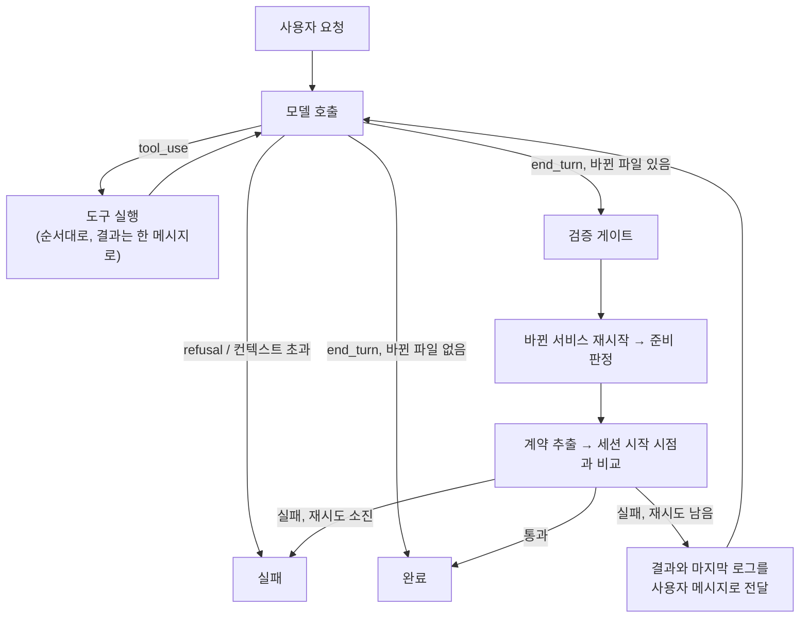

# 설계 결정 기록 (ADR)

결정마다 **맥락 → 검토한 선택지 → 결정 → 감수한 트레이드오프** 순서로 적었습니다. 외부 제품의 수치와 사실은 2026년 9월에 공개 자료로 확인한 내용이고, 문서 끝에 출처를 모았습니다.

[문서 홈](README.md) · [아키텍처](architecture.md) · [검증 기록](verification.md) · [트러블슈팅](troubleshooting.md)

## 주제별 빠른 찾기

| 주제 | ADR |
|---|---|
| 프로젝트 모델과 런타임 | 001–009, 021, 028, 032, 044 |
| 에이전트와 검증 게이트 | 010–014, 034–039, 042, 047–048, 053–060 |
| 웹 스튜디오와 세션 | 015–020, 029–031, 033, 040–041, 045–046, 052 |
| 데이터·자원·보안 | 022–027, 038, 040, 045 |
| 운영 배포 | 020, 030, 032–033, 043–045 |

아래 목록은 번호순 전체 색인입니다. 기존 결정을 대체할 때는 원문을 지우지 않고 새 ADR에서 대체 관계를 기록합니다.

- [ADR-001 미리보기 런타임: 브라우저 번들러 대신 서버 샌드박스](#adr-001-미리보기-런타임-브라우저-번들러-대신-서버-샌드박스)
- [ADR-002 프로젝트 모델: 구조는 통합, 작업 화면은 분리](#adr-002-프로젝트-모델-구조는-통합-작업-화면은-분리)
- [ADR-003 계약은 코드에서 추출하는 선택 사항](#adr-003-계약은-코드에서-추출하는-선택-사항)
- [ADR-004 새 DSL을 만들지 않는다: compose + OpenAPI 위의 얇은 층](#adr-004-새-dsl을-만들지-않는다-compose--openapi-위의-얇은-층)
- [ADR-005 첫 대상은 사내 도구, 백엔드는 Spring 우선](#adr-005-첫-대상은-사내-도구-백엔드는-spring-우선)
- [ADR-006 샌드박스 제공자를 추상화하고 로컬 Docker부터 구현](#adr-006-샌드박스-제공자를-추상화하고-로컬-docker부터-구현)
- [ADR-007 서비스 준비 판정 규칙](#adr-007-서비스-준비-판정-규칙)
- [ADR-008 볼륨을 샌드박스 전용과 공유 캐시로 나눈다](#adr-008-볼륨을-샌드박스-전용과-공유-캐시로-나눈다)
- [ADR-009 포트는 루프백의 빈 포트에만 공개한다](#adr-009-포트는-루프백의-빈-포트에만-공개한다)
- [ADR-010 에이전트 루프: 직접 작성한 루프와 스튜디오 검증 게이트](#adr-010-에이전트-루프-직접-작성한-루프와-스튜디오-검증-게이트)
- [ADR-011 도구 설계: bash 하나 대신 행동별 도구](#adr-011-도구-설계-bash-하나-대신-행동별-도구)
- [ADR-012 모델 설정과 프롬프트 (Claude Opus 5)](#adr-012-모델-설정과-프롬프트-claude-opus-5)
- [ADR-013 계약 호환 정책: 기본은 차단, 요청이 명시할 때만 허용](#adr-013-계약-호환-정책-기본은-차단-요청이-명시할-때만-허용)
- [ADR-014 재시작 전에 샌드박스가 바뀐 파일을 보는지 확인한다](#adr-014-재시작-전에-샌드박스가-바뀐-파일을-보는지-확인한다)
- [ADR-015 스튜디오 서버: Next.js 단일 앱과 Server-Sent Events](#adr-015-스튜디오-서버-nextjs-단일-앱과-server-sent-events)
- [ADR-016 세션마다 작업 복사본, API 키 없는 데모 모드](#adr-016-세션마다-작업-복사본-api-키-없는-데모-모드)
- [ADR-017 미리보기와 API 탐색기의 네트워크 경계](#adr-017-미리보기와-api-탐색기의-네트워크-경계)
- [ADR-018 세션 체크포인트: 검증을 통과한 변경만 남긴다](#adr-018-세션-체크포인트-검증을-통과한-변경만-남긴다)
- [ADR-019 로컬 로그인 계정으로 실행: API 키 없이 개인 PC에서만](#adr-019-로컬-로그인-계정으로-실행-api-키-없이-개인-pc에서만)
- [ADR-020 원격 저장소 연동: 세션 브랜치와 덮어쓰지 않는 푸시](#adr-020-원격-저장소-연동-세션-브랜치와-덮어쓰지-않는-푸시)
- [ADR-021 기동 최적화: 입력 파일 해시로 찾는 스냅샷 볼륨](#adr-021-기동-최적화-입력-파일-해시로-찾는-스냅샷-볼륨)
- [ADR-022 데이터베이스 브랜치: 체크포인트마다 DB 상태를 함께 남긴다](#adr-022-데이터베이스-브랜치-체크포인트마다-db-상태를-함께-남긴다)
- [ADR-023 자원 한도와 사용량: 한도를 걸고, 판단에 필요한 수치만 보여 준다](#adr-023-자원-한도와-사용량-한도를-걸고-판단에-필요한-수치만-보여-준다)
- [ADR-024 네트워크 격리: 샌드박스의 출입구를 하나로 만든다](#adr-024-네트워크-격리-샌드박스의-출입구를-하나로-만든다)
- [ADR-025 시크릿 주입과 가림: 값은 보이지 않게 넣고, 새는 경로를 막는다](#adr-025-시크릿-주입과-가림-값은-보이지-않게-넣고-새는-경로를-막는다)
- [ADR-026 정책 프록시: 사내 API는 edge를 거쳐서만 부른다](#adr-026-정책-프록시-사내-api는-edge를-거쳐서만-부른다)
- [ADR-027 격리 강화: 운영자가 고르는 컨테이너 런타임과 gVisor](#adr-027-격리-강화-운영자가-고르는-컨테이너-런타임과-gvisor)
- [ADR-028 Kubernetes 제공자: 서비스마다 agent-sandbox Sandbox를 둔다](#adr-028-kubernetes-제공자-서비스마다-agent-sandbox-sandbox를-둔다)
- [ADR-029 세션 복구: 세션 상태를 작업 복사본에 남기고 새 샌드박스로 이어서 작업한다](#adr-029-세션-복구-세션-상태를-작업-복사본에-남기고-새-샌드박스로-이어서-작업한다)
- [ADR-030 원격 변경 가져오기: 리뷰어 커밋을 병합 커밋으로 가져와 게이트로 확인한다](#adr-030-원격-변경-가져오기-리뷰어-커밋을-병합-커밋으로-가져와-게이트로-확인한다)
- [ADR-031 화면 디자인: 조작 계층만 유리로 띄우고 읽는 영역은 불투명하게 둔다](#adr-031-화면-디자인-조작-계층만-유리로-띄우고-읽는-영역은-불투명하게-둔다)
- [ADR-032 모노레포 하위 폴더: 저장소 전체를 복제하고 경로는 프로젝트 기준으로 바꾼다](#adr-032-모노레포-하위-폴더-저장소-전체를-복제하고-경로는-프로젝트-기준으로-바꾼다)
- [ADR-033 원격 미리보기: 호스트 이름으로 나누는 게이트웨이가 경로를 그대로 넘긴다](#adr-033-원격-미리보기-호스트-이름으로-나누는-게이트웨이가-경로를-그대로-넘긴다)
- [ADR-034 실시간 코드 보기: 에이전트 이벤트로 다시 불러오고, 읽기는 작업 공간 규칙을 따른다](#adr-034-실시간-코드-보기-에이전트-이벤트로-다시-불러오고-읽기는-작업-공간-규칙을-따른다)
- [ADR-035 요청 취소와 토큰 사용량: 샌드박스는 그대로 두고 요청만 되돌리며, 합계는 서버가 센다](#adr-035-요청-취소와-토큰-사용량-샌드박스는-그대로-두고-요청만-되돌리며-합계는-서버가-센다)
- [ADR-036 코드 문법 강조: Shiki를 처음 볼 때 불러오고, 색은 CSS 변수로 테마를 따른다](#adr-036-코드-문법-강조-shiki를-처음-볼-때-불러오고-색은-css-변수로-테마를-따른다)
- [ADR-037 답변 마크다운: 요소로 그리되 HTML과 외부 요청은 막는다](#adr-037-답변-마크다운-요소로-그리되-html과-외부-요청은-막는다)
- [ADR-038 세션 토큰 한도: 운영자가 서버에서 정하고, 넘는 순간 요청을 멈춘다](#adr-038-세션-토큰-한도-운영자가-서버에서-정하고-넘는-순간-요청을-멈춘다)
- [ADR-039 코드 탭 찾기와 변경 감시: 서버가 작업 복사본을 감시하고, 알림은 기록에 쌓지 않는다](#adr-039-코드-탭-찾기와-변경-감시-서버가-작업-복사본을-감시하고-알림은-기록에-쌓지-않는다)
- [ADR-040 스튜디오 인증: proxy.ts와 라우트에서 두 번 확인하고, 세션을 바꾸는 일은 만든 사람과 관리자만 한다](#adr-040-스튜디오-인증-proxyts와-라우트에서-두-번-확인하고-세션을-바꾸는-일은-만든-사람과-관리자만-한다)
- [ADR-041 내 폴더에서 바로 작업: 체크포인트 저장소는 폴더 밖에 두고, 사람의 수정은 먼저 남긴다](#adr-041-내-폴더에서-바로-작업-체크포인트-저장소는-폴더-밖에-두고-사람의-수정은-먼저-남긴다)
- [ADR-042 질문 모드: 같은 대화와 도구 목록을 쓰고, 바꾸는 도구는 실행기에서 막는다](#adr-042-질문-모드-같은-대화와-도구-목록을-쓰고-바꾸는-도구는-실행기에서-막는다)
- [ADR-043 운영 배포: 릴리스마다 compose 프로젝트를 띄우고, 고정 주소의 프록시로 무중단 전환한다](#adr-043-운영-배포-릴리스마다-compose-프로젝트를-띄우고-고정-주소의-프록시로-무중단-전환한다)
- [ADR-044 CI와 스튜디오 이미지: 호스트 Docker 소켓을 쓰고, 세션·배포 폴더는 같은 경로로 마운트한다](#adr-044-ci와-스튜디오-이미지-호스트-docker-소켓을-쓰고-세션배포-폴더는-같은-경로로-마운트한다)
- [ADR-045 인증 보강: 로그아웃을 서버에 남기고, 토큰은 해시로 두며, 미리보기는 1회용 티켓으로 연다](#adr-045-인증-보강-로그아웃을-서버에-남기고-토큰은-해시로-두며-미리보기는-1회용-티켓으로-연다)
- [ADR-046 코드 탭: 목록은 서버에서 좁혀 쪽 단위로 보내고, 내용 찾기도 서버가 한다](#adr-046-코드-탭-목록은-서버에서-좁혀-쪽-단위로-보내고-내용-찾기도-서버가-한다)
- [ADR-047 멀티 모델 라우터: 공통 도구 계약 위에서 검증된 작업당 비용을 고른다](#adr-047-멀티-모델-라우터-공통-도구-계약-위에서-검증된-작업당-비용을-고른다)
- [ADR-048 Agent Fleet: 같은 요청을 독립 세션에서 병렬로 실행하고 사람이 고른다](#adr-048-agent-fleet-같은-요청을-독립-세션에서-병렬로-실행하고-사람이-고른다)
- [ADR-049 워크플로 강제: 필수 단계는 게이트가 직접 실행해 통과 기록을 남겨야 완료다](#adr-049-워크플로-강제-필수-단계는-게이트가-직접-실행해-통과-기록을-남겨야-완료다)
- [ADR-050 화면 확인: HTTP 확인을 기본으로 두고 헤드리스 브라우저 모드를 더한다](#adr-050-화면-확인-http-확인을-기본으로-두고-헤드리스-브라우저-모드를-더한다)
- [ADR-051 작업 분해: 이어진 작업은 한 세션에서, 독립 레인은 병렬로 돌리고 통합 결과를 다시 검증한다](#adr-051-작업-분해-이어진-작업은-한-세션에서-독립-레인은-병렬로-돌리고-통합-결과를-다시-검증한다)
- [ADR-052 미리보기 QA: 서버 소유 브라우저 화면을 중계하고 입력을 되돌려 보낸다](#adr-052-미리보기-qa-서버-소유-브라우저-화면을-중계하고-입력을-되돌려-보낸다)
- [ADR-053 시각 비교: 디자인 이미지를 저장소에 두고 결정론적으로 비교한다](#adr-053-시각-비교-디자인-이미지를-저장소에-두고-결정론적으로-비교한다)
- [ADR-054 디자인(Figma) 연동: REST API와 서버 토큰을 쓰고 이미지는 모델에 넘기지 않는다](#adr-054-디자인figma-연동-rest-api와-서버-토큰을-쓰고-이미지는-모델에-넘기지-않는다)
- [ADR-055 도구 결과에 예산을 두고 토큰 사용을 턴 단위로 보인다](#adr-055-도구-결과에-예산을-두고-토큰-사용을-턴-단위로-보인다)
- [ADR-056 에이전트의 되묻기: 실행을 붙잡지 않고 질문하고 멈춘다](#adr-056-에이전트의-되묻기-실행을-붙잡지-않고-질문하고-멈춘다)
- [ADR-057 실행 중 지시: 다음 모델 호출 직전에만 넣고, 도구 호출 도중에는 끼어들지 않는다](#adr-057-실행-중-지시-다음-모델-호출-직전에만-넣고-도구-호출-도중에는-끼어들지-않는다)
- [ADR-058 게이트의 동시성 확인: 선언적 동시 요청과 결과 불변식으로 한다](#adr-058-게이트의-동시성-확인-선언적-동시-요청과-결과-불변식으로-한다)
- [ADR-059 계약으로 엮인 병렬 작업은 계약을 먼저 게시하고(S2), 조율은 켤 때만 한다](#adr-059-계약으로-엮인-병렬-작업은-계약을-먼저-게시하고s2-조율은-켤-때만-한다)
- [ADR-061 PR 미리보기: 누락은 보이되 PR 생성은 막지 않는다](#adr-061-pr-미리보기-누락은-보이되-pr-생성은-막지-않는다)
- [ADR-062 데스크톱은 얇은 Electron 껍데기로 두고 웹 스튜디오를 본체로 남긴다](#adr-062-데스크톱은-얇은-electron-껍데기로-두고-웹-스튜디오를-본체로-남긴다)
- [ADR-063 가볍게 확인은 시간을 줄이는 기능이고, 토큰은 줄이지 않는다](#adr-063-가볍게-확인은-시간을-줄이는-기능이고-토큰은-줄이지-않는다)
- [ADR-064 에이전트는 게이트가 하는 확인을 되풀이하지 않는다(자가 확인 lean을 기본으로)](#adr-064-에이전트는-게이트가-하는-확인을-되풀이하지-않는다자가-확인-lean을-기본으로)
- [ADR-065 보낸 요청은 요청 단위 작업 목록 하나로 본다](#adr-065-보낸-요청은-요청-단위-작업-목록-하나로-본다)
- [ADR-066 첫 화면은 마지막 프로젝트의 개발 화면이다](#adr-066-첫-화면은-마지막-프로젝트의-개발-화면이다)
- [ADR-067 아무 폴더나 프로젝트로 연다: 스택을 알아내 실행 설정을 만들고 git 추적에서 뺀다](#adr-067-아무-폴더나-프로젝트로-연다-스택을-알아내-실행-설정을-만들고-git-추적에서-뺀다)
- [ADR-068 대화는 한 명이 처리하고, 나눌 만하면 에이전트가 제안한다](#adr-068-대화는-한-명이-처리하고-나눌-만하면-에이전트가-제안한다)
- [ADR-069 넘긴 작업도 대화 안에서 보고, 방식은 어디서도 고르게 하지 않는다](#adr-069-넘긴-작업도-대화-안에서-보고-방식은-어디서도-고르게-하지-않는다)
- [ADR-070 새로 시작 화면을 없애고 개발 화면 머리에 프로젝트 메뉴를 둔다](#adr-070-새로-시작-화면을-없애고-개발-화면-머리에-프로젝트-메뉴를-둔다)
- [ADR-071 나란히 보기: 집중 모드·칸별 탭·모두에게 보내기로 다시 짠다](#adr-071-나란히-보기-집중-모드칸별-탭모두에게-보내기로-다시-짠다)
- [ADR-072 개발 화면에서 GitHub 이슈·PR을 보고 이슈로 바로 작업한다](#adr-072-개발-화면에서-github-이슈pr을-보고-이슈로-바로-작업한다)
- [ADR-073 폴더를 열 때 기존 compose의 DB·Redis·Kafka 같은 부가 서비스를 함께 가져온다](#adr-073-폴더를-열-때-기존-compose의-dbrediskafka-같은-부가-서비스를-함께-가져온다)
- [ADR-074 PR을 만든 뒤 AI 리뷰를 최대 두 라운드 돌리고 지적을 고친 뒤 사람에게 넘긴다](#adr-074-pr을-만든-뒤-ai-리뷰를-최대-두-라운드-돌리고-지적을-고친-뒤-사람에게-넘긴다)
- [ADR-075 계획은 큰 모델로 한 번 세우고 실행은 작은 모델로 한다](#adr-075-계획은-큰-모델로-한-번-세우고-실행은-작은-모델로-한다)
- [ADR-076 세션 브랜치가 main보다 뒤처지면 병합으로 따라잡고 다시 검증한다](#adr-076-세션-브랜치가-main보다-뒤처지면-병합으로-따라잡고-다시-검증한다)
- [ADR-077 반복 행동을 스크립트로 굳히기](#adr-077-반복-행동을-스크립트로-굳히기)
- [ADR-078 검증 게이트가 로딩에서 멈춘 화면·실패한 데이터 요청·동적 경로 404를 잡는다](#adr-078-검증-게이트가-로딩에서-멈춘-화면실패한-데이터-요청동적-경로-404를-잡는다)
- [ADR-079 명세를 요구사항으로 나누고 요구사항마다 검증 근거를 추적한다](#adr-079-명세를-요구사항으로-나누고-요구사항마다-검증-근거를-추적한다)
- [ADR-080 제출 준비 점검표로 요구사항·테스트·README·시드·비밀 값·커밋 기록을 확인한다](#adr-080-제출-준비-점검표로-요구사항테스트readme시드비밀-값커밋-기록을-확인한다)
- [ADR-081 저장소 탭에서 이슈·PR 상세를 열어 체크리스트·CI·리뷰까지 확인한다](#adr-081-저장소-탭에서-이슈pr-상세를-열어-체크리스트ci리뷰까지-확인한다)
- [ADR-082 명세 탭이 참조 파일을 따라가 읽고 모호한 점에 추천 값을 채운다](#adr-082-명세-탭이-참조-파일을-따라가-읽고-모호한-점에-추천-값을-채운다)
- [ADR-083 세션에서 띄울 서비스를 고르고, 부가 서비스는 기대는 것만 기본으로 켠다](#adr-083-세션에서-띄울-서비스를-고르고-부가-서비스는-기대는-것만-기본으로-켠다)
- [ADR-084 테스트 탭에서 백엔드·프론트 테스트를 한 줄씩 보고 돌린다](#adr-084-테스트-탭에서-백엔드프론트-테스트를-한-줄씩-보고-돌린다)
- [ADR-085 폴더 열기를 경로 입력 대신 폴더 선택 창·탐색 모달로 바꾼다](#adr-085-폴더-열기를-경로-입력-대신-폴더-선택-창탐색-모달로-바꾼다)
- [ADR-086 기본 egress에 GitHub 릴리스 호스트를 연다(Gradle 배포판)](#adr-086-기본-egress에-github-릴리스-호스트를-연다gradle-배포판)
- [ADR-087 개발 화면 탭을 일곱 개로 묶고 올리기 전 점검을 저장소 탭으로 옮긴다](#adr-087-개발-화면-탭을-일곱-개로-묶고-올리기-전-점검을-저장소-탭으로-옮긴다)
- [ADR-088 폴더 열기가 만드는 compose는 서비스 폴더 대신 프로젝트 루트 전체를 마운트한다](#adr-088-폴더-열기가-만드는-compose는-서비스-폴더-대신-프로젝트-루트-전체를-마운트한다)

---

## ADR-001 미리보기 런타임: 브라우저 번들러 대신 서버 샌드박스

### 맥락
AI가 만든 코드를 사용자가 몇 초 안에 볼 수 있어야 합니다. 토스 TOI는 이 문제를 **브라우저 안에서** 풀었습니다.
- 경로를 키로 쓰는 4계층 가상 파일 시스템
- Web Worker에서 도는 esbuild-wasm
- `packageSetHash`(엔트리 목록 + yarn.lock 해시)로 미리 번들링해 S3에 올린 import map
- 빌드와 실행이 모두 성공했을 때만 iframe을 교체하는 방식

이 방식으로 첫 화면을 47초에서 1.3초로 줄였습니다. 하지만 이 프로젝트는 **Next.js 같은 서버 프레임워크와 백엔드까지** 실행해야 합니다.

### 검토한 선택지

| 방식 | 사례 | Next.js | 현업 적용 시 문제 |
|---|---|---|---|
| A. 브라우저 번들러 (esbuild-wasm) | 토스 TOI | ❌ | 클라이언트 React SPA만 가능. RSC, SSR, Server Action 불가 |
| B. 브라우저 안의 Node (WebContainers) | bolt.new | ⚠️ | Turbopack이 wasm 바인딩을 지원하지 않아 Next 16 기본 설정으로는 `next dev`가 실패함 (`turbo.createProject is not supported by the wasm bindings`). napi 네이티브 모듈 불가. 상용 서비스는 유료 라이선스 필요 |
| B'. Nodebox | Sandpack 2 | ⚠️ | Node 18 수준 호환, napi 불가, 사내 npm 지원은 개발 중 |
| **C. 서버 샌드박스** | Lovable (Fly.io), v0 (2026년 2월 샌드박스 런타임으로 전환) | ✅ | 컴퓨팅 비용, 콜드 스타트 |

### 결정
**C. 실제 Linux 환경에서 실제 개발 서버를 실행한다.** 프레임워크와 언어 제한이 없고, 로컬 개발 환경과 동작이 같습니다.

### 감수한 트레이드오프와 대응
- **콜드 스타트**: 의존성 캐시를 공유하고([ADR-008](#adr-008-볼륨을-샌드박스-전용과-공유-캐시로-나눈다)), 이후에는 lockfile 해시별로 설치가 끝난 스냅샷을 재사용할 계획입니다. TOI의 `packageSetHash` 아이디어를 서버 환경에 옮긴 것입니다.
- **비용과 운영 부담**: 제공자를 추상화해서([ADR-006](#adr-006-샌드박스-제공자를-추상화하고-로컬-docker부터-구현)) 규모와 보안 요구에 맞는 구현을 고를 수 있게 했습니다.
- TOI의 "성공한 번들만 반영" 원칙은 **헬스체크를 통과한 서버로만 트래픽을 넘기는 방식**으로 옮길 수 있습니다. 준비 판정([ADR-007](#adr-007-서비스-준비-판정-규칙))이 그 기반입니다.

---

## ADR-002 프로젝트 모델: 구조는 통합, 작업 화면은 분리

### 맥락
사용자마다 원하는 작업 방식이 다릅니다.
- 이미 있는 백엔드에 **화면만** 붙이고 싶은 사람 (TOI의 경우)
- **백엔드만** 만들지만 화면에서 테스트하며 개발하고 싶은 사람
- 프론트와 백엔드를 **함께** 만들고 싶은 사람

### 검토한 선택지
1. **제품을 프론트용과 백엔드용으로 나눈다**: 각 제품은 단순하지만, 나중에 합치려면 프로젝트·권한·배포 모델을 옮겨야 합니다. 또 "필드 하나 추가"처럼 DB, API, 화면을 한 번에 바꾸는 AI의 핵심 장점을 잃습니다.
2. **항상 풀스택으로 강제한다**: 백엔드만 만드는 사람에게 방해가 되고, 이미 레포와 배포 주기가 나뉜 조직에 맞지 않습니다.
3. **구조는 하나로, 작업 화면은 목적별로**

### 결정
**3번.** 프로젝트는 `서비스 목록 + (선택적) 계약`이고, 서비스는 `source: managed | external`로 구분합니다.

| 사용자 상황 | 서비스 구성 |
|---|---|
| 기존 백엔드에 화면만 | `web`(managed) + `api`(external) |
| 백엔드만 | `api`(managed) |
| 풀스택 | `web` + `api` (둘 다 managed) |
| 백엔드로 시작해 나중에 화면 추가 | `web` 서비스만 추가하면 됨. 프로젝트를 옮기지 않음 |

### 판단 기준
**되돌리기 비용**을 봤습니다. 내부 모델을 나누는 결정은 되돌리기 어렵고, 화면을 나누는 결정은 UI만 바꾸면 됩니다. 불확실할 때는 되돌리기 어려운 쪽을 유연하게 두었습니다.

---

## ADR-003 계약은 코드에서 추출하는 선택 사항

### 맥락
처음에는 OpenAPI 계약을 프론트와 백엔드 사이의 중심에 두려고 했습니다. 목 서버, 에이전트 검증 기준, 팀 간 경계 역할을 모두 할 수 있기 때문입니다. 그런데 다시 검토해 보니 현실과 맞지 않는 부분이 있었습니다.
- Spring(springdoc)과 FastAPI 개발자는 **코드부터 짜고 OpenAPI를 뽑아냅니다.**
- Next.js 풀스택은 Server Action과 Route Handler로 **서비스 하나 안에서** 끝나는 경우가 많습니다.
- REST가 아닌 GraphQL, gRPC, tRPC도 있습니다.

### 결정
- 계약은 **없어도 되는 선택 사항**입니다.
- 사람이 먼저 쓰는 파일이 아니라 **실행 중인 서버에서 추출해 변경 전후를 비교하는 결과물**로 다룹니다. (`contract.extract: /v3/api-docs`)
- 서비스 하나짜리 풀스택 프로젝트도 정식으로 지원합니다.

---

## ADR-004 새 DSL을 만들지 않는다: compose + OpenAPI 위의 얇은 층

### 맥락
사내 도구라도 **"이 도구를 그만 쓰면 코드를 그대로 가져갈 수 있는가"**가 도입 조건이 됩니다.

### 결정
- 실행: 표준 **Docker Compose** 파일
- 계약: 표준 **OpenAPI**
- `studio.yaml`: 스튜디오에만 필요한 정보(managed/external 구분, 미리보기 종류, 준비 확인 경로, 계약 추출 경로)만 담습니다.

`examples/orders`는 스튜디오 없이 `docker compose up`으로도 똑같이 실행됩니다. 스튜디오가 필요한 설정(포트 공개, 라벨)은 사용자 파일을 고치지 않고 **임시 override 파일**로 덧씌웁니다.

로더는 두 파일이 서로 맞는지 검증합니다. managed 서비스는 compose에 반드시 있어야 하고, external 서비스는 compose에 있으면 안 됩니다. compose에만 있는 서비스(예: `db`)는 샌드박스와 함께 뜨고 함께 사라지는 부가 서비스로 취급합니다.

---

## ADR-005 첫 대상은 사내 도구, 백엔드는 Spring 우선

### 맥락
범용 AI 앱 빌더는 Replit, Lovable, v0와 정면으로 경쟁하게 됩니다. TOI 사례를 보면 진짜 가치는 코드 생성보다 **"정책이 자동으로 적용되는 플랫폼"**에 있었습니다.

### 결정
- **사내 도구**를 첫 대상으로 정했습니다. 사내망 설치, 개인정보 마스킹, 감사 로그가 차별점이 됩니다.
- 백엔드 템플릿은 **Spring Boot**를 먼저 만들고 **FastAPI**도 제공합니다.

### 템플릿 원칙
런타임은 어떤 프레임워크든 실행할 수 있게 열어 두되, AI가 쓰는 스택은 **검증된 템플릿**으로 제한합니다. "모든 프레임워크 호환"과 "모든 프레임워크에서 좋은 품질"은 다른 문제이기 때문입니다.

---

## ADR-006 샌드박스 제공자를 추상화하고 로컬 Docker부터 구현

### 맥락
사내 도구는 운영 환경이 회사마다 다릅니다. 관리형 서비스를 쓸 수 있는 곳도 있고, 사내망 Kubernetes만 허용하는 곳도 있습니다.

| 제공자 | 격리 | 자체 운영 |
|---|---|---|
| Vercel Sandbox | Firecracker microVM | ❌ |
| E2B | Firecracker | ✅ |
| Northflank | Kata / gVisor | ✅ (BYOC) |
| Kubernetes agent-sandbox | gVisor / Kata, 웜 풀 | ✅ (오픈소스) |

### 결정
`SandboxProvider.create(project) → Sandbox` 인터페이스를 두고, 첫 구현은 **`LocalDockerProvider`**로 했습니다.
- 외부 계정 없이 개발할 수 있습니다.
- compose 기반이라 사내 서버 한 대 운영에도 그대로 쓸 수 있습니다.
- 인터페이스(`start`, `restart`, `endpoint`, `state`, `logs`, `exec`, `destroy`)는 원격 microVM 구현에서도 그대로 성립하도록 파일 시스템 경로에 의존하지 않게 설계했습니다.

### 감수한 트레이드오프
로컬 Docker는 **컨테이너 수준의 격리**입니다. 사내 운영에서 신뢰할 수 없는 생성 코드를 돌리려면 gVisor/Kata 기반 제공자로 바꿔야 하고, 로드맵에 넣었습니다.

---

## ADR-007 서비스 준비 판정 규칙

### 맥락
준비 판정은 **"미리보기가 언제 뜨는가"**와 **"에이전트가 언제 실패를 알게 되는가"**를 결정합니다. 실제 실행에서 관찰한 기동 과정은 이랬습니다.

```
UND_ERR_SOCKET (포트는 열렸지만 서버 준비 전)
→ TIMEOUT      (Next dev가 첫 요청을 컴파일하는 중)
→ HTTP 200
```

### 결정 (`packages/sandbox/src/readiness.ts`)

| 상황 | 판정 | 이유 |
|---|---|---|
| 기대한 상태 코드를 **연속 2번** 받음 | ready | 기동 직후 잠깐 성공했다가 흔들리는 경우를 걸러냄 |
| 컨테이너가 `exited` / `dead` | **즉시** failed | 컴파일 에러가 나면 15분 타임아웃을 기다리지 않고 몇 초 만에 결과를 받음 |
| 연결 거부, 소켓 에러, 타임아웃, 503, `restarting` | waiting | 기동 중에 흔한 상태 |
| 서비스별 `timeoutSeconds` 초과 | failed | 마지막 확인 결과(`HTTP 503, 컨테이너 running` 등)를 실패 이유에 담아 에이전트가 읽을 수 있게 함 |

판정 함수는 확인 기록 배열만 받는 **순수 함수**라서 Docker 없이 단위 테스트 6개로 검증했습니다.

---

## ADR-008 볼륨을 샌드박스 전용과 공유 캐시로 나눈다

### 맥락
샌드박스는 매번 새로 만들고 지우지만, 매번 Gradle 배포판과 의존성을 다시 받으면 기동이 몇 분씩 걸립니다.

### 결정

| 종류 | compose 선언 | 수명 | 예시 |
|---|---|---|---|
| 샌드박스 전용 | 일반 named volume | `destroy()` 때 삭제 | `node_modules`, `.next`, Gradle `build`, DB 데이터 |
| 공유 캐시 | `external: true` + 고정 이름 | 샌드박스를 지워도 유지 | `b-studio-cache-gradle`, `b-studio-cache-pnpm` |

compose는 external 볼륨을 만들어 주지 않으므로, 로더가 external 볼륨을 모아 두고 제공자가 기동 전에 `docker volume create`로 만듭니다(이미 있으면 그대로 둠).

### 나중에 고친 것: Gradle 캐시는 공유하면 안 됐다 (2026-09)
처음에는 "Gradle과 pnpm 캐시는 여러 프로세스가 동시에 써도 안전하다"고 적어 두고 Gradle 홈 전체를 공유했습니다. **Gradle 쪽은 사실이 아니었습니다.** 같은 프로젝트로 두 샌드박스를 띄우면 뒤에 뜨는 쪽이 캐시 잠금을 얻지 못해 빌드가 실패하는 것을 실측으로 확인했습니다([트러블슈팅 36](troubleshooting.md#36-같은-프로젝트로-두-세션을-동시에-띄우면-api-빌드가-실패함)).

- **Gradle 홈은 샌드박스 전용 볼륨으로 옮겼습니다.** 잠금이 샌드박스마다 따로 걸립니다.
- **공유는 이미지에 구운 읽기 전용 의존성 캐시로 대체했습니다**(`GRADLE_RO_DEP_CACHE`). Gradle은 이 캐시를 잠금 없이 읽습니다. 쓰기 공유 볼륨이 없어져 씨 뿌리기 경쟁도 사라졌습니다.
- **Gradle 배포판도 이미지에 넣습니다.** 샌드박스는 네트워크가 격리돼 있어 실행 중에 배포판을 받을 수 없습니다. compose가 붙이는 빈 볼륨은 첫 마운트 때 이미지의 그 경로 내용으로 채워지는 것을 따로 실측해 확인했습니다.
- **캐시를 굽는 태스크는 `downloadDependencies`입니다.** `dependencies` 리포트 태스크는 메타데이터만 받아, 실행할 때 jar을 다시 내려받으려 합니다.
- **감수한 비용**: 기동이 느려졌습니다(api 준비 13.9초 → 21.1초). 샌드박스마다 Gradle 홈을 새로 채우기 때문입니다. 같은 프로젝트로 두 세션을 띄울 수 있게 된 대가로 받아들였습니다. pnpm 캐시는 그대로 공유합니다.
- 이미 쓰던 설치에는 `b-studio-cache-gradle` 볼륨이 쓰이지 않는 상태로 남습니다. `docker volume rm b-studio-cache-gradle`로 지울 수 있습니다.

### 결과와 한계
Gradle 다운로드는 사라졌지만 두 번째 기동도 "늦어도 43초 안에 준비" 수준으로, 극적으로 빨라지지는 않았습니다. `node_modules`가 샌드박스마다 새로 설치되기 때문입니다. 자세한 분석은 [troubleshooting.md](troubleshooting.md#3-공유-캐시를-써도-두-번째-기동이-크게-빨라지지-않음)에 있습니다.

---

## ADR-009 포트는 루프백의 빈 포트에만 공개한다

### 결정
override 파일에서 managed 서비스 포트를 `127.0.0.1::<컨테이너 포트>` 형식으로 공개합니다.
- **빈 포트 자동 할당**: 샌드박스 여러 개를 동시에 띄워도 포트가 겹치지 않습니다. 할당된 포트는 `docker compose port`로 조회합니다.
- **루프백에만 공개**: 같은 네트워크의 다른 PC에서 샌드박스에 접근할 수 없습니다. 사내 도구의 기본값으로 필요합니다.
- 사용자의 `compose.yaml`에는 `ports`를 적지 않습니다. 템플릿을 그대로 여러 샌드박스에서 재사용하기 위해서입니다.

---

## ADR-010 에이전트 루프: 직접 작성한 루프와 스튜디오 검증 게이트

### 맥락
에이전트가 "끝났다"고 말하는 것만으로는 완료로 볼 수 없습니다. 서버가 실제로 뜨는지, API 계약을 깨지 않았는지는 **플랫폼이 직접 확인**해야 합니다. 또 이 확인 흐름은 API 키 없이도 반복해서 검증할 수 있어야 합니다.

### 검토한 선택지

| 방식 | 장점 | 이 프로젝트에 맞지 않는 점 |
|---|---|---|
| SDK Tool Runner (beta) | 루프를 직접 쓰지 않아도 됨 | 턴이 끝난 뒤 검증하고, 실패하면 결과를 넣어 루프를 재개하는 흐름을 훅으로 끼워 넣어야 함 |
| Managed Agents | Anthropic이 루프와 샌드박스를 운영 | 코드가 **우리 샌드박스**(사내망 Docker/Kubernetes)에서 실행돼야 하는 요구와 충돌 |
| **직접 작성한 루프** | 게이트·재시도·종료 조건을 코드로 명확히 표현, 모델 호출을 인터페이스로 분리 가능 | `pause_turn`, `refusal`, `max_tokens` 처리를 직접 유지해야 함 |

### 결정
`runAgent()`가 모델 호출을 `ModelClient` 인터페이스로 받습니다.
- `AnthropicModelClient`: 실제 Claude API
- `ScriptedModelClient`: 미리 적은 턴을 돌려주는 테스트 더블. **루프·도구·게이트·샌드박스가 맞물리는지** 검증하는 용도이고, 모델의 코딩 능력을 검증하지는 않습니다.


```mermaid
flowchart TD
  U["사용자 요청"] --> M["모델 호출"]
  M -->|tool_use| T["도구 실행<br/>(순서대로, 결과는 한 메시지로)"] --> M
  M -->|refusal / 컨텍스트 초과| F["실패"]
  M -->|end_turn, 바뀐 파일 없음| D["완료"]
  M -->|end_turn, 바뀐 파일 있음| G["검증 게이트"]
  G --> R["바뀐 서비스 재시작 → 준비 판정"]
  R --> C["계약 추출 → 세션 시작 시점과 비교"]
  C -->|통과| D
  C -->|실패, 재시도 남음| FB["결과와 마지막 로그를<br/>사용자 메시지로 전달"] --> M
  C -->|실패, 재시도 소진| F
```

게이트는 매번 전체를 다시 확인하지 않습니다. **지난 게이트 이후 바뀐 파일**과 **지난번에 준비에 실패한 서비스의 파일**만 대상으로 삼습니다. 작업 공간이 쓰기마다 버전을 올리고, 게이트는 마지막으로 확인한 버전을 기억합니다.

---

## ADR-011 도구 설계: bash 하나 대신 행동별 도구

### 맥락
bash 도구 하나면 모델이 거의 모든 일을 할 수 있지만, 스튜디오는 불투명한 명령 문자열만 보게 됩니다. 사내 도구에서는 **어떤 파일을 바꿨는지 기록하고, 위험한 경로를 막고, 사람의 수정을 덮어쓰지 않는 것**이 필요합니다.

### 결정

| 도구 | 강제하는 규칙 |
|---|---|
| `list_files`, `read_file` | 프로젝트 루트 밖, 심볼릭 링크 탈출, `.git`·`node_modules`·`build`·`.env` 접근 차단 |
| `write_file`, `edit_file` | 위 규칙 + **읽은 뒤 파일이 바뀌었으면 쓰기 거부**(내용 해시 비교) + 바뀐 파일 기록. `edit_file`은 정확히 한 곳만 일치해야 수정 |
| `run_in_service` | 명령을 **인자 배열**로 받아 셸을 거치지 않음, 3분 타임아웃 |
| `restart_service`, `service_logs`, `http_request` | 실행 확인용. 재시작 실패 시 최근 로그를 함께 반환 |
| `get_contract` | OpenAPI 원문 대신 **연산·스키마 요약**을 반환해 토큰을 아낌 |

- 모든 도구는 `strict: true`이고 **모든 필드를 필수**로 둡니다. "없음"은 빈 문자열처럼 명시적인 값으로 표현합니다.
- 도구 출력이 3만 자를 넘으면 앞뒤를 남기고 **잘랐다는 표시를 넣습니다.** 조용히 자르지 않습니다.
- 도구 실패는 루프를 멈추지 않고 `is_error: true` 결과로 모델에게 돌려줍니다.

---

## ADR-012 모델 설정과 프롬프트 (Claude Opus 5)

### 요청 설정

| 설정 | 값 | 이유 |
|---|---|---|
| 모델 | `claude-opus-5` | 긴 에이전트 작업과 코딩에 가장 강한 Opus |
| thinking | `{ type: "adaptive" }` | Opus 5의 기본값이지만 의도를 명시 |
| effort | 기본 `high`, CLI `--effort`로 조정 | 비용과 품질의 기준점. 작업별로 낮춰 측정할 수 있게 열어 둠 |
| 전송 | 스트리밍 후 `finalMessage()`, `max_tokens` 64K | 긴 응답이 HTTP 타임아웃에 걸리지 않게 함 |
| 거절 대응 | `fallbacks: "default"` + `server-side-fallback-2026-07-01` | 안전 분류기가 거절하면 서버가 권장 모델로 다시 실행. 그래도 `stop_reason: "refusal"`이면 실패로 끝냄 |
| 프롬프트 캐시 | 시스템 프롬프트에 캐시 지점 + 요청 전체 자동 캐시 | 도구와 시스템 프롬프트는 프로젝트마다 고정. 시각 같은 가변 값을 넣지 않음 |
| 사전 확인 | `models.retrieve()` | 수십 초 걸리는 샌드박스를 띄우기 전에 인증과 모델 권한을 토큰 소비 없이 확인 |

### 프롬프트 튜닝
Opus 5 마이그레이션 가이드의 권고를 반영했습니다.
- **"작업을 검증하라"는 지시를 넣지 않았습니다.** 이 모델은 시키지 않아도 스스로 검증하므로, 검증은 프롬프트가 아니라 게이트가 강제합니다.
- 응답과 파일이 길어지고 범위를 넓히는 경향이 있어 **간결함과 범위 규칙**을 명시했습니다. "요청하지 않은 리팩터링, 이름 변경, 기능, 테스트, 파일을 추가하지 않는다" 같은 규칙입니다.
- 프레임워크 버전이 학습 시점보다 새로울 수 있으므로, Next.js는 **컨테이너 안의 버전별 문서**(`node_modules/next/dist/docs`)를 읽도록 안내합니다. Next.js 16이 생성한 `AGENTS.md`도 같은 원칙을 요구합니다.
- DB 스키마는 **새 Flyway 마이그레이션으로만** 바꾸고, 기존 마이그레이션은 수정하지 않습니다.

---

## ADR-013 계약 호환 정책: 기본은 차단, 요청이 명시할 때만 허용

### 결정
세션을 시작할 때 OpenAPI 계약을 저장해 두고, 게이트마다 현재 계약과 비교합니다.

| 변경 | 판정 |
|---|---|
| 연산 추가, 스키마 추가, **선택** 필드 추가 | 호환 |
| 연산·스키마·필드 삭제, 필드 타입 변경, 기존 필드 필수화, **필수** 필드 신규 추가 | **호환 깨짐** |

- 호환을 깨는 변경은 기본적으로 게이트를 통과하지 못합니다. 요청이 삭제나 변경을 명시할 때만 `--allow-breaking`으로 허용합니다.
- 결과는 호환 깨짐을 먼저, 그다음 대상 이름의 **코드포인트 순**으로 정렬합니다. 실행 환경의 로케일에 따라 순서가 달라지지 않게 하기 위해서입니다.

---

## ADR-014 재시작 전에 샌드박스가 바뀐 파일을 보는지 확인한다

### 맥락
로컬 Docker 제공자는 프로젝트 폴더를 컨테이너에 바인드 마운트합니다. macOS의 colima 기본 설정은 sshfs 마운트이고, Lima 문서에 따르면 sshfs 캐시는 **기본으로 켜져 있으며 호스트의 변경이 제때 반영되지 않을 수 있습니다.**

실제로 에이전트 e2e에서 검증 게이트가 **컴파일 에러가 있는 코드를 "준비 완료"로 통과시켰습니다.** 방금 쓴 파일을 VM 쪽에서 아직 보지 못한 상태로 서비스를 재시작해, 옛 코드가 빌드된 것으로 판단했습니다. 경위와 측정값은 [troubleshooting.md](troubleshooting.md)에 있습니다. 게이트가 틀린 결과를 통과시키는 것은 게이트가 없는 것보다 위험합니다.

### 검토한 선택지

| 방식 | 문제 |
|---|---|
| 재시작 전에 정해진 시간만큼 대기 | 느리고, 캐시 시간보다 짧으면 여전히 틀림 |
| virtiofs 같은 다른 마운트를 쓰라고 안내 | 사용자 환경을 강제할 수 없고, 다른 OS·원격 샌드박스에는 해당하지 않음 |
| 마운트 대신 파일을 복사해 넣기 | 표준 compose 파일만으로 똑같이 실행된다는 원칙([ADR-004](#adr-004-새-dsl을-만들지-않는다-compose--openapi-위의-얇은-층))이 깨짐 |
| **동기화 지점 `Sandbox.sync(files)`** | 확인 한 번마다 약간의 비용 |

### 결정
재시작하기 전에 **샌드박스 쪽에서 바뀐 파일이 보일 때까지** 기다립니다.
- **확인 기준 두 가지**: 디렉터리 목록(readdir)에 이름이 보이는지와, 내용의 sha256이 호스트와 같은지를 함께 확인합니다. 빌드 도구는 목록과 파일 속성으로 변경을 감지하기 때문에, 경로로 파일을 직접 열어 보는 것만으로는 부족합니다. 목록은 파일이 든 폴더만이 아니라 **프로젝트 루트까지 모든 상위 폴더**에서 확인합니다. 새 폴더를 만들면 그 폴더의 목록은 바로 보이지만 상위 폴더 목록은 약 19초 늦게 바뀌어, 빌드 도구가 새 폴더를 찾지 못했기 때문입니다([트러블슈팅 25](troubleshooting.md#25-새-폴더에-만든-파일을-게이트가-옛-코드로-통과시킴)).
- **확인 방법(로컬 Docker)**: busybox 컨테이너가 같은 프로젝트 폴더를 읽기 전용으로 붙여 250ms 간격으로 확인하고, 기본 60초 안에 반영되지 않으면 실패합니다. 파일 경로는 셸 문자열에 끼워 넣지 않고 위치 인자로 넘깁니다.
- **서비스 컨테이너가 아닌 별도 컨테이너로 확인하는 이유**: 컴파일 에러로 서비스가 죽어 있어도 확인할 수 있어야 하고, 같은 VM 마운트를 공유하므로 서비스와 같은 상태를 보게 됩니다.
- **호출 위치**: 검증 게이트와 `restart_service` 도구가 재시작 전에 호출합니다. 확인에 실패하면 재시작하지 않고 게이트를 실패로 처리합니다.
- **원격 제공자**: 같은 메서드를 "업로드 완료 보장"으로 구현하면 됩니다.

### 감수한 트레이드오프
확인 한 번에 컨테이너를 하나 실행하는 비용이 듭니다. 캐시 지연이 없는 환경에서는 첫 확인에서 바로 통과합니다.

### 보완: 반영 확인만으로 막지 못한 경우
폴더는 남고 파일 하나만 지워진 되돌리기에서, 반영 확인은 통과했는데 새로 뜬 서비스의 빌드 도구가 지운 파일을 디렉터리 목록에서 보고 읽다가 실패했습니다. 그래서 재시작이 실패하고 **로그가 이번 변경에서 지운 파일을 "없다"고 가리킬 때만** 3초 뒤 한 번 더 재시작합니다. 무관한 실패는 다시 시도하지 않습니다. 경위는 [트러블슈팅 13](troubleshooting.md#13-되돌린-뒤-api가-지운-파일을-찾다가-기동하지-못함)에 있습니다.

---

## ADR-015 스튜디오 서버: Next.js 단일 앱과 Server-Sent Events

### 맥락
스튜디오 서버가 하는 일은 두 가지예요.
- **오래 걸리는 작업**: 샌드박스 기동과 에이전트 실행은 수십 초에서 수 분이 걸리고, 서버에서 `docker` 명령을 직접 실행해야 합니다.
- **실시간 전달**: 서비스 상태, 로그, 에이전트 진행 상황을 브라우저에 계속 보내야 합니다.

요청마다 짧게 실행되는 서버리스 환경은 맞지 않습니다. 사내 서버 한 대에서 도는 Node 프로세스를 전제로 했습니다.

### 검토한 선택지

| 방식 | 판단 |
|---|---|
| 별도 백엔드(Express 등) + SPA | 배포 단위와 타입 공유 경로가 둘로 늘어남 |
| **Next.js 16 App Router 단일 앱** | Route Handler로 REST와 스트리밍, Server Component로 첫 화면을 한 프로세스에서 처리 |
| WebSocket | 양방향이 필요하지 않음. 서버 → 브라우저는 스트림, 브라우저 → 서버는 일반 POST면 충분 |
| **Server-Sent Events** | 브라우저가 스스로 다시 연결하고, 일반 HTTP라 프록시와 잘 맞음 |

### 결정
- 세션 관리자는 **프로세스 메모리 안의 싱글톤**입니다. 개발 서버의 HMR로 모듈이 다시 로드돼도 실행 중인 샌드박스를 잃지 않도록 `globalThis`에 둡니다.
- 이벤트 스트림은 연결되면 **스냅샷부터 지금까지의 기록을 다시 보내고**, 화면 쪽 리듀서는 스냅샷을 받으면 상태를 초기화합니다. 그래서 다시 연결해도 채팅 기록이 중복되지 않습니다.
- 단, 스냅샷에 이미 반영된 상태를 바꾸는 이벤트(체크포인트 추가 등)는 **같은 이벤트를 두 번 받아도 결과가 같게** 처리해야 합니다. 이 원칙을 놓쳐 체크포인트 목록이 중복된 적이 있습니다([트러블슈팅 10](troubleshooting.md#10-다시-연결하면-체크포인트-목록이-중복됨)).
- 로그는 양이 많아서 채팅·상태 기록과 **따로 최근 1,000줄만** 둡니다. 로그가 쌓여 대화 기록이 밀려나지 않게 하기 위해서입니다.
- 서버가 종료 신호를 받으면 띄워 둔 샌드박스를 정리합니다.

### 감수한 트레이드오프
서버 프로세스를 재시작하면 세션 상태가 사라지고, 여러 서버로 나눠 운영할 수 없습니다. 사용자가 늘면 세션 저장소와 샌드박스 작업자를 분리해야 합니다.

---

## ADR-016 세션마다 작업 복사본, API 키 없는 데모 모드

### 결정
- **작업 복사본**: 세션을 시작하면 프로젝트를 `~/.cache/b-studio/sessions/<프로젝트>-<세션>`으로 복사하고 그 복사본으로 샌드박스를 띄웁니다. 에이전트가 원본을 바꾸지 않게 하고, colima가 마운트하는 홈 디렉터리 아래에 두기 위해서입니다. Git 연동 전까지 결과는 복사본에 남습니다.
- **데모 모드** (`B_STUDIO_MODE=demo`): Claude API 대신 e2e와 같은 스크립트 시나리오로 실행합니다.
- **데모 모드는 준비된 요청만 순서대로 실행**하고, 다른 요청은 409로 거절하면서 다음 요청을 안내합니다. 스크립트가 임의의 요청을 처리하는 것처럼 보이면 시연이 거짓말이 되기 때문입니다.

---

## ADR-017 미리보기와 API 탐색기의 네트워크 경계

### 결정
- **포트는 루프백에만 공개**합니다([ADR-009](#adr-009-포트는-루프백의-빈-포트에만-공개한다)). 미리보기 iframe은 같은 PC의 브라우저가 `127.0.0.1:<포트>`로 직접 엽니다.
- **API 탐색기 요청은 스튜디오 서버를 거칩니다.** 서버는 메서드를 허용 목록으로 제한하고, 세션에 없는 서비스로의 요청을 거절합니다.
- **`//`로 시작하는 경로를 막습니다.** `new URL("//evil.example/x", base)`는 다른 호스트를 가리킵니다. 그래서 요청 URL의 origin이 서비스 주소와 같은지 비교합니다. 같은 검사를 에이전트의 `http_request` 도구와 `studio.yaml`의 경로 필드에도 적용했습니다.
- **재시작하면 포트가 바뀝니다.** 에이전트 루프가 서비스 상태 이벤트(`onServiceStatus`)를 밖으로 전달해서 화면이 새 주소를 따라가게 하고, 요청이 끝날 때마다 미리보기와 계약을 다시 불러옵니다.

### 한계
다른 PC의 브라우저는 루프백 포트에 접근할 수 없어서 미리보기 iframe을 열 수 없습니다. 원격 사용자를 지원하려면 스튜디오 서버가 미리보기까지 리버스 프록시해야 합니다.

---

## ADR-018 세션 체크포인트: 검증을 통과한 변경만 남긴다

### 맥락
검증 게이트는 호환을 깨는 변경을 **완료로 인정하지 않을 뿐, 적용된 변경을 되돌리지 않았습니다.** 그래서 차단된 요청 뒤에도 작업 복사본과 샌드박스에는 변경이 남아, 미리보기의 배송 메모가 비어 보였습니다. "완료로 인정하지 않는다"와 "적용되지 않았다"는 다른 상태입니다.

### 검토한 선택지

| 방식 | 문제 |
|---|---|
| 에이전트가 쓴 파일의 원래 내용을 기억해 복원 | 삭제, 이름 변경, 여러 요청에 걸친 복원을 직접 구현해야 하고, 이전 시점으로 돌아가기 어려움 |
| 요청마다 작업 폴더 전체 복사 | 프로젝트 크기만큼 매번 복사하고, 무엇이 바뀌었는지 보여 주기 어려움 |
| **작업 복사본을 Git 저장소로 관리** | 커밋이 곧 체크포인트이고, `git diff`로 변경 내역을 보여 주고, `reset`으로 복원. 개발자가 이미 아는 모델 |

### 결정
- **세션 시작**: 작업 복사본에서 `git init`을 실행하고(이미 저장소면 그대로 씀) "세션 시작" 체크포인트를 남깁니다.
- **요청이 게이트를 통과하면** `요청: <요청 내용>`으로 커밋합니다.
- **통과하지 못하거나 에러가 나면** 버린 변경을 patch로 보관한 뒤 `reset --hard`와 `clean -fd`로 되돌립니다. 그리고 바뀐 파일이 속한 서비스를 파일 반영 확인([ADR-014](#adr-014-재시작-전에-샌드박스가-바뀐-파일을-보는지-확인한다))과 함께 재시작해, 샌드박스도 이전 상태로 맞춥니다.
- **이전 체크포인트로 되돌리기**: SHA 형식을 검사하고, 이 세션 기록의 조상 커밋(`merge-base --is-ancestor`)으로만 허용합니다. 되돌린 뒤에는 대화에도 그 사실을 남겨, 다음 요청이 사라진 변경을 전제로 하지 않게 합니다.
- **저장소에만 적용하는 설정**: `core.hooksPath`는 빈 폴더, `commit.gpgsign`은 false, 커밋 사용자는 전용 이름으로 둡니다. 체크포인트는 스튜디오 내부 기록이라, 사용자의 전역 커밋 훅이나 서명 설정이 커밋을 막거나 입력을 기다리며 멈추면 안 되기 때문입니다.
- **생성물 제외**: 샌드박스가 만드는 `node_modules`, `.next`, `build` 등은 사용자의 `.gitignore`를 고치지 않고 `.git/info/exclude`로 제외합니다.
- **실행 방식**: git은 셸을 거치지 않고 인자 배열로 실행합니다.

### 감수한 트레이드오프
- 되돌리기는 이후 체크포인트를 지우는 작업이라, 브라우저 확인 창 대신 화면 안에서 한 번 더 확인받습니다.
- CLI `studio agent`는 사용자 프로젝트 폴더를 직접 다루므로 자동 되돌리기를 적용하지 않았습니다. 사용자 저장소에서 `reset --hard`가 실행되는 위험이 더 크기 때문입니다.
- 원격 저장소 푸시와 PR 생성은 아직 없습니다.

---

## ADR-019 로컬 로그인 계정으로 실행: API 키 없이 개인 PC에서만

### 맥락
API 키를 발급받기 전에도 개발자가 자기 PC에서 에이전트를 직접 돌려 보고 싶어 합니다. 이런 PC에는 이미 `claude` CLI가 설치돼 있고 개인 구독으로 로그인돼 있는 경우가 많습니다.

제약도 분명합니다. Agent SDK 문서는 다음과 같이 안내합니다.

> Unless previously approved, Anthropic does not allow third party developers to offer claude.ai login or rate limits for their products, including agents built on the Claude Agent SDK. Use the API key authentication methods described in the Quickstart instead.

그래서 **스튜디오가 로그인을 제공하거나, 여러 사람이 한 사람의 구독을 나눠 쓰게 만들면 안 됩니다.** 가능한 범위는 "개발자 본인 PC에서, 본인이 이미 로그인한 CLI를 그대로 쓰는 것"입니다.

### 검토한 선택지

| 방식 | 판단 |
|---|---|
| 스튜디오에 로그인 화면을 넣고 토큰 보관 | 위 정책에 어긋나고, 공유 서버에서는 한 구독을 여러 사람이 쓰게 됨 |
| `claude -p`를 서브프로세스로 호출하고 JSON 출력 파싱 | 모델이 쓰는 도구를 우리 규칙으로 제한하기 어렵고, 턴이 끝날 때마다 게이트를 끼우기 어려움 |
| **Agent SDK로 로컬 CLI를 실행하고, b-studio 도구를 프로세스 안 MCP 서버로 제공** | 로그인 흐름 없이 기존 설치를 그대로 쓰고, 기본 도구를 끈 채 우리 도구만 허용할 수 있음 |

### 결정
- **명시적으로 켤 때만 씁니다.** 스튜디오는 `B_STUDIO_MODE=claude-code`(`pnpm studio:local`), CLI는 `--backend claude-code`입니다. 기본값은 계속 `api`이고, 모르는 값은 오류로 거절해 오타 때문에 다른 모드로 조용히 넘어가지 않게 했습니다.
- **로그인 흐름을 만들지 않습니다.** 요청마다 먼저 `accountInfo()`로 이미 로그인돼 있는지만 확인합니다. 프롬프트를 보내지 않으므로 사용량을 쓰지 않고, 실측 약 4초가 걸렸습니다. 응답의 이메일과 조직 이름은 화면이나 로그에 남기지 않습니다.
- **Claude Code의 기본 동작을 모두 끕니다.**

  | 옵션 | 값 | 이유 |
  |---|---|---|
  | `tools` | `[]` | 기본 도구(Bash, Read, Edit 등)를 끔. 모델이 호스트 셸이나 파일에 직접 접근하지 못함 |
  | `mcpServers`, `allowedTools` | b-studio 도구 9개만 | 작업 공간 규칙([ADR-011](#adr-011-도구-설계-bash-하나-대신-행동별-도구))과 샌드박스를 거쳐서만 작업 |
  | `permissionMode` | `dontAsk` | 허용 목록 밖의 도구는 묻지 않고 거부. 서버에서 사람의 승인을 기다리며 멈추지 않음 |
  | `settingSources`, `strictMcpConfig` | `[]`, `true` | 사용자 전역 설정의 훅·플러그인·MCP 서버와 `CLAUDE.md`가 에이전트 동작을 바꾸지 않게 함 |
  | `systemPrompt` | b-studio 프롬프트 | 기본 도구를 끈 상태에 맞춘 프롬프트로 교체 |

- **완료 판정은 같은 검증 게이트가 합니다.** 게이트를 `VerificationGate`로 루프에서 분리해 두 실행 방식이 함께 씁니다. SDK의 `result` 메시지를 "모델이 턴을 끝냈다"는 신호로 보고 게이트를 돌리며, 실패하면 결과를 스트리밍 입력으로 같은 대화에 넣습니다.
- **도구는 순서대로 실행합니다.** CLI는 도구를 동시에 부를 수 있어서, MCP 핸들러를 직렬 큐로 감싸 직접 만든 루프와 같은 순서를 보장합니다.
- **대화는 실행마다 갈라서 이어받습니다.** 다음 요청은 이전 세션을 `resume`하되 `forkSession: true`로 새 세션을 만듭니다. 예외로 끝난 실행은 저장한 세션 ID를 바꾸지 않으므로 다음 요청의 기준이 되지 않습니다. API 루프가 예외 때 이번 실행분을 대화에서 지우는 것과 같은 효과입니다. 체크포인트로 되돌린 사실은 다음 요청 앞에 붙여 알립니다.
- **도구 스키마는 한 곳에서만 정의합니다.** `buildTools`의 JSON 스키마를 MCP 도구가 요구하는 zod 형태로 옮기고, 지원하지 않는 형태는 바로 오류를 냅니다.
- **화면 표기는 "로컬 Claude Agent"입니다.** 같은 문서의 브랜딩 가이드가 제품 안에서 "Claude Code"라는 이름을 쓰지 않도록 합니다. 명령 이름과 로그인 안내처럼 설치된 CLI를 가리키는 곳만 `claude`를 그대로 씁니다.
- **Next.js 번들에서 SDK를 뺍니다.** SDK는 자기 패키지 위치를 기준으로 플랫폼별 실행 파일을 찾으므로 `serverExternalPackages`에 넣었습니다.

### 감수한 트레이드오프
- **개인 PC 전용입니다.** 사내 공유 서버에 배포할 때는 조직의 API 키로 `api` 모드를 써야 합니다. 스튜디오 개발 서버와 `next start`는 `127.0.0.1`에만 바인드합니다.
- 대화 기록이 로컬 CLI의 세션 파일(`~/.claude/projects/` 아래)에 남습니다.
- 모델은 넘기지 않으면 로그인한 계정의 기본값을 씁니다. 토큰 수는 SDK가 알려 주는 `modelUsage` 기준 추정치입니다.
- 로그인하지 않은 상태의 `accountInfo()` 응답은 직접 확인하지 못했습니다. 구독 종류, API 키 출처, 토큰 출처가 모두 비어 있으면 로그인이 필요하다고 안내합니다.

---

## ADR-020 원격 저장소 연동: 세션 브랜치와 덮어쓰지 않는 푸시

### 맥락
체크포인트는 작업 복사본 안에만 있어서, 결과를 팀에 넘기려면 사람이 파일을 옮겨야 했습니다. 사내 도구에서 만든 변경도 결국 **코드 리뷰(PR/MR)와 CI를 거쳐** 기준 브랜치에 들어가야 합니다.

### 검토한 선택지

| 방식 | 판단 |
|---|---|
| 세션이 끝나면 변경을 patch 파일로 내려받기 | 리뷰 도구와 CI를 거치지 않고, 요청별 기록과 검증 결과가 사라짐 |
| 지금처럼 폴더를 복사하고, 내보낼 때 원본 저장소에 커밋을 다시 적용 | 복사본 기록이 원본 기록과 이어지지 않아 cherry-pick과 충돌 처리가 필요함 |
| **원본 저장소를 복제해 세션 브랜치에서 작업** | 체크포인트 커밋이 곧 PR 커밋. 기준 브랜치에서 갈라져 있어 그대로 리뷰할 수 있음 |

### 결정
- **세션 시작**: 프로젝트 폴더가 커밋이 있는 Git 저장소의 루트면, 지금 체크아웃한 브랜치를 `git clone --branch`로 복제하고 `b-studio/<프로젝트>-<세션>` 브랜치를 만듭니다. 저장소가 아니면 지금처럼 복사한 뒤 `git init`하며, 원격 연동은 없습니다.
- **커밋된 상태에서만 시작합니다.** 원본의 커밋하지 않은 변경은 세션에 넣지 않고 개수만 화면에 알립니다. PR은 "어느 커밋에서 갈라졌는지"로 설명할 수 있어야 하기 때문입니다.
- **올릴 곳**: 원본의 `origin` 주소입니다. `origin`이 없으면 원본 저장소 자체에 세션 브랜치를 올립니다. 원본의 체크아웃 브랜치와 작업 트리는 건드리지 않습니다.
- **세션 정보는 저장소 설정에 둡니다.** 시작 커밋, 기준 브랜치, 세션 브랜치, 마지막으로 올린 커밋, PR 주소를 `b-studio.*` 설정으로 남깁니다. 스튜디오 서버를 재시작해도 작업 복사본만 있으면 상태를 되찾을 수 있습니다.
- **기록 범위**: 체크포인트 목록은 세션 시작 커밋에서 끝납니다. 원본 저장소의 이전 커밋으로는 되돌리지 않습니다.
- **검증 결과를 커밋 본문에 남깁니다.** 게이트 결과, 재시도 횟수, 에이전트 요약을 본문에 넣고, PR 본문은 이 커밋들만으로 만듭니다. 서버 메모리 없이 같은 PR을 다시 만들 수 있고, `git log`만으로도 요청마다 무엇을 확인했는지 볼 수 있습니다. 에이전트 요약의 마크다운 제목(`#`)이 커밋 정리 규칙에 지워지지 않도록 `--cleanup=whitespace`로 커밋합니다.
- **덮어쓰지 않는 푸시**: `--force-with-lease=refs/heads/<세션 브랜치>:<마지막으로 올린 커밋>`으로 올립니다. 처음 올릴 때는 기대값이 비어 있어 "원격에 같은 이름의 브랜치가 없어야 한다"는 뜻이 됩니다. 원격 변경을 가져오는 기능을 넣으면서 기대값을 "마지막으로 확인한 원격 끝 커밋"으로 바꿨습니다([ADR-030](#adr-030-원격-변경-가져오기-리뷰어-커밋을-병합-커밋으로-가져와-게이트로-확인한다)).
  - 되돌리기 뒤에는 원격 브랜치를 새 기록으로 맞출 수 있어야 하므로 강제 푸시가 필요합니다.
  - 그래도 리뷰어가 같은 브랜치에 올린 커밋은 덮어쓰면 안 됩니다. 원격이 마지막으로 올린 상태와 다르면 거부합니다.
  - 기대값을 원격 추적 브랜치(`origin/*`)에 맡기지 않고 직접 기록한 커밋으로 넘깁니다. 복제한 저장소의 `origin/*`는 실제 원격이 아니라 원본 폴더의 브랜치를 가리키기 때문입니다.
- **자격 증명**: 스튜디오 서버의 git 설정(SSH 에이전트, credential helper)을 그대로 씁니다. 비밀번호나 호스트 키 확인을 기다리며 멈추지 않도록 `GIT_TERMINAL_PROMPT=0`과 `ssh -o BatchMode=yes`로 실행하고, 오류 메시지 속 주소의 자격 증명은 지웁니다. 화면에는 자격 증명을 뺀 주소만 보냅니다.
- **PR 만들기**: 호스트에 맞는 토큰(`B_STUDIO_GITHUB_TOKEN`, `B_STUDIO_GITLAB_TOKEN`, `B_STUDIO_GITEA_TOKEN`)이 있으면 API로 만들고, 같은 브랜치로 열린 PR이 이미 있으면 그 PR을 돌려줍니다. 토큰이 없으면 PR 작성 페이지 링크를 보여 줍니다. 사내 호스트는 주소만으로 종류를 알 수 없으므로 `B_STUDIO_GIT_PROVIDER`로 정합니다.
- **부분 실패**: 브랜치를 올린 뒤 PR 생성이 실패하면 푸시 결과는 그대로 두고 실패 이유를 알립니다. 사용자는 작성 페이지에서 직접 만들 수 있습니다.
- **체크포인트 작성자**: 기본은 `b-studio`이고, 사내 저장소가 작성자 이메일을 검사하면 `B_STUDIO_GIT_AUTHOR_NAME`, `B_STUDIO_GIT_AUTHOR_EMAIL`로 바꿉니다.

### 감수한 트레이드오프
- 체크포인트 커밋은 저장소 훅을 건너뜁니다([ADR-018](#adr-018-세션-체크포인트-검증을-통과한-변경만-남긴다)). 린트나 테스트 훅이 하던 확인은 PR의 CI가 대신해야 합니다.
- 모노레포 하위 폴더에 있는 프로젝트와 Git LFS는 아직 지원하지 않습니다.
- 세션 도중 기준 브랜치가 앞서 나가도 리베이스하지 않습니다. 충돌은 PR에서 해결합니다.
- API로 만든 PR의 작성자는 스튜디오 서버에 넣은 토큰의 주인입니다. 스튜디오 로그인([ADR-040](#adr-040-스튜디오-인증-proxyts와-라우트에서-두-번-확인하고-세션을-바꾸는-일은-만든-사람과-관리자만-한다))을 켜도 PR 작성자는 바뀌지 않습니다.

---

## ADR-021 기동 최적화: 입력 파일 해시로 찾는 스냅샷 볼륨

### 맥락
공유 캐시([ADR-008](#adr-008-볼륨을-샌드박스-전용과-공유-캐시로-나눈다))로 다운로드는 사라졌지만, 샌드박스마다 새로 만드는 볼륨 때문에 설치와 빌드 도구 준비가 매번 반복됐습니다. 토스 TOI는 `packageSetHash`로 설치가 끝난 상태를 재사용합니다. 같은 방식을 그대로 가져오기 전에 **어느 단계가 실제로 오래 걸리는지 먼저 쟀습니다**(`pnpm bench:boot`, 측정값은 [troubleshooting.md](troubleshooting.md#3-공유-캐시를-써도-두-번째-기동이-크게-빨라지지-않음)).

측정해 보니 준비 시간은 **늦게 뜨는 서비스(api)가 정하고**, api에서는 의존성 설치가 아니라 Gradle 기동·설정과 컴파일이 대부분이었습니다. `node_modules`만 재사용하면 web은 빨라져도 프로젝트 전체 준비 시간은 그대로였습니다.

### 검토한 선택지

| 방식 | 판단 |
|---|---|
| lockfile 해시별로 설치를 끝낸 **이미지** 빌드 | 소스를 마운트하는 개발 이미지 구조와 맞지 않고, 이미지 빌드 자체가 오래 걸림 |
| 해시가 같으면 스냅샷 볼륨을 **여러 샌드박스가 그대로 공유** | 복사 비용은 없지만, 에이전트가 의존성을 바꾸면 공유 볼륨이 망가져 다른 세션에 퍼짐 |
| **해시가 같으면 스냅샷을 샌드박스 볼륨으로 복사** | 복사 비용이 들지만 세션끼리 격리됨. 비용은 볼륨마다 재서 이득이 있을 때만 켬 |

### 결정
- **스냅샷은 출발점일 뿐, 정답이 아닙니다.** 스냅샷으로 볼륨을 채워도 서비스의 설치 단계(`pnpm install --frozen-lockfile`, Gradle)는 그대로 돌아 lockfile·빌드 스크립트와 맞는지 도구가 다시 확인합니다. 키 계산이 틀리거나 스냅샷이 오래돼도 결과가 틀려지지 않고 느려질 뿐입니다.
- **선언**: `studio.yaml`의 서비스에 `snapshots: [{ volume, key }]`로 적습니다. 로더는 볼륨이 compose에 있는지, 공유 캐시(external)가 아닌지, 서비스가 실제로 마운트하는지, 키 파일이 서비스 폴더 안인지 확인합니다.
- **키**: 프로젝트 이름, 서비스, 볼륨 이름, 키 파일의 경로·길이·내용을 합친 sha256입니다. 프로젝트를 키에 넣어, lockfile이 같은 다른 프로젝트로 설치 결과가 넘어가지 않게 했습니다.
- **채우기**: `compose up` 전에 스냅샷이 있으면 이 샌드박스의 볼륨(`<샌드박스>_<볼륨>`)을 compose 라벨과 함께 미리 만들고 복사합니다. compose 라벨을 붙여야 compose가 자기 볼륨으로 알아보고 `down --volumes` 때 함께 지웁니다(측정 3회 뒤 남은 샌드박스 볼륨 0개). 복사는 이미지 빌드(`compose build`)와 동시에 해서 기다리는 시간을 줄입니다.
- **켤지는 측정으로 정합니다.** 예제 프로젝트에서는 Gradle 프로젝트 `.gradle`만 켰습니다. `node_modules`는 공유 pnpm 저장소에서 연결하는 시간(약 3초)과 459MB 볼륨을 복사하는 시간(처음 읽을 때 2.4초)이 비슷한데, 복사가 `compose up` 전에 끝나야 해서 오히려 늦은 서비스까지 기다리게 만들었습니다.
- **저장**: 스냅샷이 없었으면 **모든 서비스가 준비된 직후, 에이전트가 도구를 쓰기 전에** 볼륨을 복사해 둡니다. 에이전트가 바꾼 의존성이 다음 세션의 출발점이 되지 않게 하기 위해서입니다.
- **깨진 스냅샷 방지**: 복사가 끝난 뒤에만 표시 파일을 남기고, 표시 파일이 없는 스냅샷은 쓰지 않고 지웁니다. 같은 스튜디오 서버에서 두 세션이 같은 스냅샷을 동시에 만들지 않게 막습니다.
- **정리**: lockfile을 바꿀 때마다 스냅샷이 쌓이므로 같은 자리(프로젝트·서비스·볼륨)에서는 최근 2개만 남깁니다.
- **실패해도 기동은 계속합니다.** 스냅샷 복사나 저장에 실패하면 알림만 남기고 빈 볼륨으로 평소처럼 설치합니다.
- **Gradle**: 템플릿의 `gradle.properties`로 빌드 캐시(공유 `GRADLE_USER_HOME`에 저장)와 설정 캐시(프로젝트 `.gradle`에 저장, 스냅샷으로 재사용)를 켰습니다. 설정 캐시와 맞지 않는 플러그인이 있어도 빌드를 막지 않도록 문제는 경고로만 남깁니다. 되돌린 뒤 api가 뜨지 못한 문제에서 설정 캐시와 스냅샷을 의심해 끄고 실험했지만 원인이 아니었습니다([트러블슈팅 13](troubleshooting.md#13-되돌린-뒤-api가-지운-파일을-찾다가-기동하지-못함)).

### 감수한 트레이드오프
- 스냅샷이 없는 첫 기동은 저장하는 복사 시간만큼 느려집니다.
- 스냅샷은 볼륨 복사라 디스크를 씁니다(`node_modules` 하나에 459MB). 지우려면 `docker volume rm $(docker volume ls -q --filter label=b-studio.snapshot)`을 실행합니다.
- 스튜디오 서버 여러 대가 같은 Docker를 쓰면 동시 저장을 막지 못합니다. 이때도 표시 파일 확인과 도구의 설치 단계 덕분에 틀린 결과로 시작하지는 않습니다.

---

## ADR-022 데이터베이스 브랜치: 체크포인트마다 DB 상태를 함께 남긴다

### 맥락
체크포인트 되돌리기([ADR-018](#adr-018-세션-체크포인트-검증을-통과한-변경만-남긴다))는 **파일만** 되돌렸습니다. 데모 시나리오로 재현해 보니, 배송 메모(V2 마이그레이션)를 추가한 뒤 그 전 체크포인트로 되돌리면 작업 복사본에는 V1만 남는데 DB에는 V2 적용 기록과 `memo` 열이 그대로 남았습니다. Flyway는 "DB 버전(2)이 코드의 최신 마이그레이션(1)보다 새롭다"는 경고만 남기고 기동해, **코드와 스키마가 다른 상태로 작업이 이어졌습니다.** 같은 요청을 다시 하면 이미 있는 열을 추가하는 마이그레이션이 충돌할 수 있습니다.

### 검토한 선택지

| 방식 | 판단 |
|---|---|
| 마이그레이션마다 되돌리는 스크립트(Flyway undo) | 사용자 코드에 되돌리기 스크립트를 강제하고, 지운 데이터는 복원하지 못함 |
| DB 볼륨 복사 | Postgres를 멈춰야 하고, 이미지마다 데이터 경로가 달라 compose 파일을 더 알아야 함 |
| Postgres 템플릿 DB (`CREATE DATABASE ... TEMPLATE`) | 빠르지만 원본 DB에 연결이 없어야 하고, 체크포인트 수만큼 DB가 쌓임 |
| **체크포인트마다 `pg_dump`, 되돌릴 때 다시 만들고 넣기** | 엔진 표준 도구만 쓰고, 개발 DB 크기에서는 빠르며, 체크포인트와 파일 하나로 묶임 |

### 결정
- **선언**: `studio.yaml`의 `databases`에 compose 부가 서비스 이름과 엔진·DB 이름·사용자를 적습니다. 이름은 SQL 문에 들어가므로 식별자만 허용합니다. 로더는 compose `depends_on`으로 이 DB에 기대는 서비스를 찾아 둡니다.
- **저장 시점**: 세션 시작 직후(서비스가 마이그레이션까지 마친 뒤)와 요청이 게이트를 통과해 체크포인트를 만든 직후입니다.
- **되돌리는 시점**: 게이트를 통과하지 못한 요청을 되돌릴 때는 마지막 체크포인트 상태로, 체크포인트를 복원할 때는 그 시점 상태로 맞춥니다.
- **같으면 건드리지 않습니다.** 지금 덤프가 저장된 덤프와 같으면 되돌리지 않고 서비스도 재시작하지 않습니다. 최신 `pg_dump`는 덤프마다 무작위 키로 `\restrict`, `\unrestrict` 줄을 넣으므로 비교할 때 이 줄을 뺍니다. 비교는 덤프를 문자열로 올리지 않고 줄 단위로 읽어 해시만 견줍니다.
- **되돌리는 방법**: `DROP DATABASE ... WITH (FORCE)`로 남은 커넥션을 끊고 다시 만든 뒤 덤프 파일을 그대로 `psql`의 표준 입력으로 흘려 넣습니다. DB에 기대는 서비스는 파일이 바뀌지 않았어도 커넥션을 새로 맺도록 재시작합니다.
- **데이터만 바꾼 요청**: 파일은 그대로여도 DB가 체크포인트와 다르면 빈 커밋으로 체크포인트를 남깁니다. 그러지 않으면 다음 되돌리기에서 그 데이터가 사라집니다.
- **저장 위치**: 작업 복사본의 `.git/b-studio/databases/<서비스>/<체크포인트>.sql`입니다. 에이전트 도구는 `.git`에 접근할 수 없고, 덤프는 커밋과 PR에 들어가지 않습니다.
- **덤프는 파일로만 흘립니다.** 명령의 표준 출력·입력을 파일에 직접 연결하고, 덤프 내용을 메모리 문자열로 올리지 않습니다. 개발용 DB라도 데이터가 쌓이면 문자열 버퍼 상한(256MB)에 걸려 저장 자체가 실패했기 때문입니다. 먼저 임시 파일에 쓰고 다 받은 뒤 이름을 바꿔, 중간에 끊긴 덤프가 체크포인트 파일로 남지 않게 합니다. 임시 파일 이름에는 만든 프로세스의 pid를 넣어, 다음 저장 때 **이미 없는 프로세스가 남긴 것만** 치웁니다(진행 중인 덤프는 건드리지 않습니다).
- 명령은 셸을 거치지 않고 인자 배열로 실행합니다. 저장이나 복원에 실패해도 작업은 계속하고, 결과를 로그와 대화에 남깁니다.

### 감수한 트레이드오프
- 덤프 크기에 상한은 없앴지만(288MiB 덤프로 실측) 공짜는 아닙니다. 체크포인트마다 덤프 하나가 디스크에 쌓이고, 저장·비교·복원마다 그 크기를 읽고 씁니다. 아주 큰 데이터에는 여전히 템플릿 DB나 볼륨 스냅샷이 유리합니다.
- DB 사용자에게 데이터베이스를 지우고 만들 권한이 있어야 합니다.
- 지금은 Postgres만 지원합니다. MySQL은 `mysqldump`와 같은 구조로 넣을 수 있습니다.
- 샌드박스 밖의 공유 DB는 되돌리지 않습니다. 샌드박스에서 공유·운영 DB에 접근하는 것 자체는 네트워크 격리로 막아야 합니다.

---

## ADR-023 자원 한도와 사용량: 한도를 걸고, 판단에 필요한 수치만 보여 준다

### 맥락
샌드박스 컨테이너에는 한도가 없었습니다. 한도 없이 예제 프로젝트를 띄워 잰 사용량입니다(Docker VM: 메모리 6GiB, CPU 4개).

| 컨테이너 | 최대 메모리 | 준비 후 메모리 | 최대 CPU |
|---|---|---|---|
| api | 726MiB | 726MiB | 193% |
| web | 548MiB (기동 중) | 356MiB | 147% |
| db | 48MiB | 46MiB | 2% |

- api 컨테이너 안에는 **JVM이 3개** 떠 있었습니다(RSS 기준 Gradle 래퍼 155MiB, Gradle 데몬 410MiB, 앱 226MiB). 한도가 없으면 JVM의 기본 힙 크기도 VM 전체 메모리를 기준으로 잡힙니다.
- 세션 하나가 준비 후 약 1.1GiB를 쓰고, 기동 중에는 CPU를 3개 넘게 씁니다. 한 세션이 VM 자원을 다 쓰면 다른 세션까지 느려지거나 멈춥니다.
- 사용자와 에이전트는 서비스가 빌드 중인지 멈췄는지, 메모리가 모자라 죽었는지 구분할 수 없었습니다. 메모리 부족 종료를 코드 문제로 오해하면 에이전트가 엉뚱한 곳을 고칩니다.

### 결정
- **선언**: `studio.yaml`의 `resources`에 compose 서비스별로 `memory`(docker 표기)와 `cpus`를 적습니다. managed 서비스뿐 아니라 DB 같은 부가 서비스에도 걸 수 있습니다.
- **적용**: override 파일에 `deploy.resources.limits`로만 넣습니다. 서비스 단위 `cpus` 키는 compose가 `deploy.resources.limits`와 함께 쓰지 못하게 해(실제로 설정이 거부됨) 한 가지 형식만 씁니다. 사용자 compose의 `reservations`는 그대로 남습니다.
- **예제 한도**: 한도 없이 잰 최대치의 약 2배로 정했습니다(api 1536m·CPU 2, web 1g·CPU 2, db 256m).
- **사용량 수집**: `Sandbox.stats()`가 `docker inspect`로 상태·종료 코드·메모리 부족 종료 여부·한도를 읽고, 실행 중인 컨테이너만 `docker stats --no-stream`으로 CPU와 메모리를 잽니다. `docker stats`의 한도 표기는 한도가 없으면 VM 전체 메모리를 보여 주므로 한도는 inspect 값을 씁니다.
- **스튜디오**: 샌드박스가 준비되면 5초마다 재고, 최신 값만 스냅샷에 둡니다. 대화 기록 버퍼에는 쌓지 않습니다. 헤더에는 서비스별 메모리를, "리소스" 탭에는 CPU, 메모리와 한도 대비 사용률, 종료 이유, 로그에서 뽑은 최근 단계(Gradle 태스크, 의존성 설치 등)를 보여 줍니다.
- **에이전트**: `service_stats` 도구로 모든 컨테이너의 사용량을 볼 수 있습니다. 검증 게이트는 재시작이 실패하면 메모리 부족 종료인지 먼저 확인하고, 그렇다면 "메모리 한도를 넘어 종료됐다"를 원인으로 앞세웁니다.
- **판정은 종료 코드가 아니라 `OOMKilled`로 합니다.** api 한도를 300MiB로 걸어 보니, 컨테이너 안의 Gradle 데몬이 커널에 종료되고 래퍼는 **종료 코드 1**로 끝났습니다. 150MiB에서는 종료 코드가 137이었습니다. 종료 코드만으로는 첫 경우를 알아볼 수 없어서, 컨테이너 안의 프로세스가 메모리 한도로 종료됐는지를 알려 주는 `OOMKilled`를 씁니다.
- **보여 주지 않는 것**: JVM 힙·GC·스레드 같은 세부 수치입니다. 필요한 프로젝트만 Actuator를 켜서 API 탐색기로 봅니다.

### 감수한 트레이드오프
- 한도가 낮으면 기동이나 빌드가 실패합니다. 측정으로 정하고, 리소스 탭에서 한도 대비 사용률을 계속 보게 했습니다.
- CPU 한도는 빌드를 느리게 만들 수 있습니다.
- 5초마다 docker 명령을 세 번(`compose ps`, `inspect`, `stats`) 실행합니다.
- 최근 단계는 로그 패턴으로 추정하므로, 템플릿 밖의 도구 출력은 알아보지 못합니다.

---

## ADR-024 네트워크 격리: 샌드박스의 출입구를 하나로 만든다

### 맥락
샌드박스 서비스는 compose 기본 네트워크에 붙어 있었습니다. 예제 프로젝트의 web 컨테이너 안에서 직접 연결해 본 결과입니다.

| 대상 | 결과 |
|---|---|
| `1.1.1.1:443`, DNS | 연결됨 |
| `registry.npmjs.org:443`, `repo.maven.apache.org:443` | 연결됨 |
| 네트워크 게이트웨이 `172.19.0.1:15432` | **연결됨.** 같은 Docker VM에서 도는 다른 프로젝트의 Postgres가 공개한 포트 (TCP 연결만 확인) |

api 컨테이너도 같았습니다. 에이전트가 쓴 코드나 실행한 명령은 인터넷, 사내망, 호스트에 공개된 DB에 그대로 닿을 수 있었습니다. 운영 DB에 접근하지 못하게 하려면 연결 문자열을 숨기는 것만으로는 부족하고, 네트워크 경로 자체를 막아야 합니다.

compose의 `internal: true` 네트워크는 외부로 나가는 경로가 없습니다. 하지만 직접 확인해 보니 **그 네트워크에 있는 컨테이너는 포트를 공개할 수 없었습니다**(`compose port`가 "no port 8080/tcp"). 이러면 미리보기, API 탐색기, 준비 확인이 모두 끊깁니다. 서비스가 인터넷 없이 뜨는지도 따로 실험했습니다. api는 공유 Gradle 캐시로 떴고, web은 corepack이 pnpm을 받지 못해 실패했습니다([트러블슈팅 15](troubleshooting.md#15-네트워크를-격리하자-web이-기동-3초-만에-종료됨)).

### 결정
- **모든 compose 서비스를 internal 네트워크에만 붙입니다.** override의 `networks`가 사용자 compose의 기본 네트워크를 대체하므로 DB 같은 부가 서비스도 포함됩니다. 서비스끼리는 이전처럼 서비스 이름으로 연결합니다.
- **edge 컨테이너 하나만 internal 네트워크와 외부용 네트워크에 함께 붙입니다.** Node 표준 모듈만 쓴 스크립트(`packages/sandbox/edge/edge.mjs`)를 `node:22-bookworm-slim`에서 돌리며, 하는 일은 두 가지입니다.
  1. **들어오는 연결:** managed 서비스마다 edge 포트를 하나씩 루프백의 빈 포트로 공개하고, 들어온 TCP 연결을 서비스로 넘깁니다. `Sandbox.endpoint()`는 이 포트를 돌려줍니다.
  2. **나가는 연결:** 3128 포트의 HTTP 프록시(CONNECT와 평문 HTTP)가 허용 목록에 있는 호스트의 80·443 포트만 통과시킵니다. 문자열 규칙은 호스트 전체를 열고, 객체 규칙은 평문 HTTP의 메서드와 경로까지 맞아야 통과시킵니다. 경로에 퍼센트 인코딩된 구분자(`%2f`, `%5c`, 이중 인코딩 `%25`)가 있으면 거부합니다. edge가 본 경로와 상위 서버가 풀어서 해석할 경로가 달라져 검사 자체가 성립하지 않기 때문입니다. IP로 직접 접속하면 이름으로 판단할 수 없어 거부합니다. 허용한 이름이 사설·루프백·링크 로컬 주소로 풀려도 거부합니다(DNS 재바인딩). IPv6 경로가 없는 Docker 네트워크가 많아 IPv4 주소를 먼저 씁니다.
- **스크립트는 파일로 마운트하지 않고 compose 설정에 넣습니다.** 원격 Docker 호스트에서도 그대로 돌게 하기 위해서입니다. compose는 `command` 안의 `$`도 변수로 치환하므로 `$$`로 바꿔 적습니다.
- **허용 목록:** 기본값은 템플릿이 의존성을 받는 저장소(npm, Maven Central, Gradle 플러그인·배포, PyPI)와 Next 템플릿의 `next/font/google`이 쓰는 Google Fonts입니다. 프로젝트는 `studio.yaml`의 `network.egress`에 호스트 문자열이나 `{ host, methods, paths }` 객체를 더합니다. 객체에서 `methods`와 `paths`를 적지 않으면 `GET`·`HEAD`와 모든 경로가 기본값입니다. IP와 포트는 스키마에서 거부합니다.
- **도구가 프록시를 쓰게 합니다.** `HTTP(S)_PROXY`, `ALL_PROXY`와 소문자 변수, 서비스 이름을 담은 `NO_PROXY`를 넣습니다. JVM(Gradle, Spring 앱)은 이 환경 변수를 읽지 않으므로 `JAVA_TOOL_OPTIONS`로 `http(s).proxyHost`와 `http.nonProxyHosts`를 넘깁니다.
- **기동 순서:** edge에 3128 포트 확인 `healthcheck`를 두고, 모든 서비스가 `depends_on: service_healthy`로 기다립니다.
- **감사와 피드백:** edge는 허용·거부를 JSON 한 줄로 남기고, 평문 HTTP에서는 메서드와 경로도 함께 남깁니다. 이 로그는 로그 탭에 `b-studio-edge` 서비스로 보입니다. 검증 게이트는 재시작이 실패하면 그사이 막힌 접속을 모아 "studio.yaml network.egress에 없는 호스트"로 알립니다. 의존성 다운로드가 막혀 실패했을 때 에이전트가 코드를 고치려 들지 않게 하기 위해서입니다. 시스템 프롬프트에도 격리 사실을 적었습니다.
- 스튜디오의 보조 컨테이너(파일 반영 확인, 스냅샷 복사)는 `--network none`으로 돌립니다. edge에는 메모리 128MiB, CPU 0.5개 한도를 겁니다.

### 검증 결과
예제 프로젝트를 실제 샌드박스로 띄우고 web 컨테이너 안에서 확인했습니다.

| 확인 | 결과 |
|---|---|
| 직접 `1.1.1.1:443` | `ENETUNREACH` |
| 직접 `registry.npmjs.org:443`, 이름 풀이 | `EAI_AGAIN` (컨테이너 안에서 외부 이름을 풀지 못함) |
| 게이트웨이 `172.19.0.1:15432`, `172.20.0.1:15432` | 시간 초과, `ENETUNREACH` |
| 프록시 `registry.npmjs.org:443` | `200 Connection Established` |
| 프록시 `example.com:443`, `registry.npmjs.org:5432`, `172.20.0.1:15432`, 풀리지 않는 이름 | 모두 `403` |
| 서비스끼리 `db:5432` | 연결됨 |
| web `pnpm view is-number version` | `7.0.0` (프록시 경유) |
| api JVM `HttpClient` | Maven Central 200, `example.com`은 "Tunnel failed, got: 403" |
| 기동 | 12.8초, web `/` 200, api health·OpenAPI 200 |
| edge 감사 로그 | 결정 14건. 확인용 요청 외에 web이 `fonts.googleapis.com`에 4번 나가려다 거부된 기록이 있어 기본 허용 목록에 Google Fonts를 넣음 |
| edge 메모리 | 18MiB (한도 128MiB) |
| FastAPI 템플릿(uv) | 임시 FastAPI 샌드박스 준비 6.3초, `/health` 200. uv 설치 중 `files.pythonhosted.org:443` `CONNECT` 허용 로그 50건 |
| 경로·메서드 egress 규칙 | `GET http://detectportal.firefox.com/success.txt`는 200과 `success`, 같은 경로 `POST`와 `/blocked` GET은 403. 같은 호스트 HTTPS는 `CONNECT`라 403 |
| 세밀 규칙 감사 로그 | 같은 실행에서 egress 로그 54줄(허용 51, 거부 3). 거부 3건은 `method`와 `path` 또는 `CONNECT` 이유를 포함 |

### 감수한 트레이드오프
- HTTP(S)가 아닌 외부 연결(외부 DB, SMTP 등)은 허용 목록에 넣어도 쓸 수 없습니다. 필요하면 정책 프록시 단계에서 등록형으로 다룹니다.
- HTTPS는 암호화된 `CONNECT` 터널이라 edge가 경로와 메서드를 볼 수 없습니다. 그래서 `{ host, methods, paths }` 객체 규칙은 평문 HTTP에만 적용하고, HTTPS가 필요하면 호스트 문자열로 전체 호스트를 열거나 등록형 정책 프록시를 씁니다.
- 경로 규칙을 쓰는 요청은 퍼센트 인코딩된 구분자가 있으면 거부합니다. 상위 서버가 인코딩을 몇 번 푸는지 edge가 알 수 없어서(`%252F`는 한 번 풀면 `%2F`, 두 번 풀면 `/`), 세는 대신 막습니다. 그래서 경로에 인코딩된 `/`가 정말 필요한 API는 객체 규칙으로 다룰 수 없고 호스트 전체를 열어야 합니다.
- `HTTP_PROXY`, `HTTPS_PROXY`, `ALL_PROXY` 계열을 모두 무시하는 도구는 edge 감사 로그에 남기 전에 Docker internal 네트워크에서 이름 풀이·연결이 실패합니다.
- 프록시 설정을 따르지 않는 도구는 이름 풀이부터 실패합니다. 이 경우 edge를 거치지 않으므로 감사 로그에도 남지 않습니다.
- 사용자 compose에 `JAVA_TOOL_OPTIONS`나 프록시 변수가 이미 있으면 override 값이 덮어씁니다. JVM은 시작할 때마다 "Picked up JAVA_TOOL_OPTIONS" 한 줄을 로그에 남깁니다.
- 샌드박스마다 컨테이너가 하나 늘고, 기동이 edge 준비를 기다립니다.

---

## ADR-025 시크릿 주입과 가림: 값은 보이지 않게 넣고, 새는 경로를 막는다

### 맥락
- 샌드박스 서비스가 결제 대행사 키 같은 값을 받을 방법이 없었습니다. 예제는 개발 DB 비밀번호를 `compose.yaml`에 그대로 적습니다. 개발용 DB라면 괜찮지만, 외부 API 키는 저장소에 넣을 수 없습니다.
- 에이전트 도구는 명령 출력, 서비스 로그, HTTP 응답, 파일 내용을 모델에게 그대로 보냅니다. 값이 컨테이너 환경 변수에 있으면 `printenv` 한 번으로 모델 대화 기록, 스튜디오 화면, 체크포인트 커밋 본문에 남을 수 있습니다.
- 체크포인트는 원격 저장소의 PR로 올라갑니다. 파일에 값이 들어가면 저장소 기록에 영구히 남습니다.
- 작업 공간은 이미 `.env` 파일 접근을 막고 있었지만, 이것만으로는 위 경로를 막지 못합니다.

### 결정
- **선언:** `studio.yaml`의 `secrets`에 환경 변수 이름과 받을 compose 서비스만 적습니다. 로더가 서비스가 compose에 있는지 확인합니다.
- **값의 출처:** 스튜디오 서버의 환경 변수 `B_STUDIO_SECRET_<이름>`이나 `B_STUDIO_SECRETS_FILE`(KEY=VALUE 파일)입니다. 에이전트가 읽고 커밋하는 프로젝트 폴더에서는 읽지 않습니다. 값이 없거나 8자보다 짧으면 샌드박스를 만들기 전에 이름과 이유만 담아 거부합니다(스튜디오 API는 400).
- **주입:** override에는 `PAYMENT_API_KEY: null`처럼 이름만 쓰고, 값은 `docker compose` 명령의 프로세스 환경으로만 넘깁니다. compose가 값이 빈 항목을 자기 환경에서 채우는 것은 `docker compose config`로 확인했습니다. 임시 디렉터리의 override 파일에도 값이 남지 않습니다. 선언한 서비스에만 넣습니다.
- **가림:** 원래 값, URL 인코딩, base64 형태를 `[이름 가림]`으로 바꿉니다. base64는 앞에 붙는 바이트 수(0~2)마다 값만으로 정해지는 구간을 씁니다([트러블슈팅 17](troubleshooting.md#17-base64로-인코딩한-시크릿-값은-가려지지-않음)). 적용하는 곳은 다음과 같습니다.
  - `Sandbox.logs()`와 `exec()` 출력. 스튜디오 로그 탭, CLI, 검증 게이트, 에이전트 도구가 모두 여기를 거칩니다.
  - compose 오류 메시지.
  - 에이전트 도구 `read_file`, `http_request`, `get_contract`의 결과.
- **가리지 않는 곳:** DB 브랜치의 `pg_dump`는 `raw`로 받습니다. 가리면 복원할 데이터가 바뀌고, 이 출력은 파일로만 옮겨져 사람이나 모델에게 보이지 않습니다.
- **새는 경로 막기:** 명령으로 환경 변수를 파일에 쓰면 출력 가림을 거치지 않습니다. 이 경로는 두 곳에서 막습니다.
  - 검증 게이트가 바뀐 파일에서 값을 찾으면 실패시켜 에이전트가 고치게 합니다.
  - 체크포인트 커밋은 명령이 만든 파일까지 포함해, 커밋할 모든 파일과 메시지를 한 번 더 확인하고 거부합니다. 스튜디오는 이때 그 요청의 변경을 되돌립니다.
- **에이전트에게 알리기:** 시스템 프롬프트에 시크릿 이름과 받는 서비스를 적고, 코드에서 환경 변수로 읽으라고 합니다.

### 검증 결과
예제 복사본에 `PAYMENT_API_KEY`를 선언하고 실제 샌드박스에서 확인했습니다.

| 확인 | 결과 |
|---|---|
| 값이 없을 때 | 샌드박스를 만들기 전에 이름과 넣는 방법만 담아 거부 |
| override 파일 / 컨테이너 | 파일에는 이름만 있음. api 컨테이너에는 값이 들어가고, 선언하지 않은 web에는 없음 |
| `exec` 출력, 로그 구독, `read_file` | `[PAYMENT_API_KEY 가림]`. `docker logs` 원본에는 값이 남음 |
| `\| base64` 출력 | 처음 구현에서는 새어 나감 → base64 구간을 가리도록 고친 뒤 `[PAYMENT_API_KEY 가림]Qo=` |
| 명령으로 파일에 쓴 값 | 검증 게이트 실패, 체크포인트 커밋 거부 (메시지에 값 없음) |

### 감수한 트레이드오프
- 값은 컨테이너 설정에 들어가므로 Docker 호스트에 접근할 수 있는 사람은 `docker inspect`와 `docker logs`로 볼 수 있습니다. 가림은 스튜디오가 사람과 모델에게 보여 주는 경로에 적용됩니다.
- 문자열 일치로 찾기 때문에, 값을 쪼개거나 다른 인코딩(hex, 뒤집기 등)으로 바꾸면 가려지지 않습니다. 실수로 새는 경로를 막는 장치이며, 에이전트가 작정하고 우회하는 것까지 막지는 못합니다. 그 수준의 방어는 값을 샌드박스에 넣지 않고 정책 프록시가 요청에 붙이는 방식으로 다룹니다.
- 8자보다 짧은 값은 받지 않습니다.
- 가린 내용을 보고 `edit_file`을 하면 바꿀 문자열을 찾지 못하므로, 값이 들어간 줄은 에이전트가 고칠 수 없습니다.

---

## ADR-026 정책 프록시: 사내 API는 edge를 거쳐서만 부른다

### 맥락
- TOI 방식으로 등록한 사내 API(`source: external`)는 명세에만 있었고, 어디서도 쓰이지 않았습니다. 네트워크 격리([ADR-024](#adr-024-네트워크-격리-샌드박스의-출입구를-하나로-만든다)) 뒤로는 샌드박스에서 사내 API에 닿을 방법도 없습니다.
- 사내 API를 부르려면 인증 값이 필요합니다. 값을 서비스에 시크릿으로 넣으면 에이전트가 만든 코드가 그 값을 다루게 됩니다. 응답에 든 운영 개인정보도 개발 샌드박스, 모델 대화 기록, 화면으로 흘러갑니다.
- 어떤 서비스가 어떤 API를 어떤 메서드로 부를 수 있는지 정할 방법이 없었습니다. 누가 무엇을 불렀는지도 기록되지 않았습니다.

### 결정
- **호출 경로:** 등록한 API 이름을 edge 컨테이너의 internal 네트워크 별칭으로 둡니다. 서비스 코드는 `http://legacy-users/api/users/1`처럼 부르고, edge가 `baseUrl`로 보냅니다. 프록시 환경 변수의 예외(`NO_PROXY`, JVM `nonProxyHosts`)에도 이 이름을 넣습니다. 사내 API가 Docker 호스트에서 돌 때를 위해 edge에만 `host.docker.internal:host-gateway`를 둡니다.
- **호출자 식별:** 요청이 온 IP를 compose 서비스 이름을 풀어 얻은 주소와 비교합니다. 재시작하면 IP가 바뀌므로 요청마다 풀고, 알 수 없는 IP는 거부합니다. 설계 전 실험에서 edge가 본 요청 IP와 서비스 이름을 푼 IP가 같았고, 서비스 컨테이너에서는 사내 API 주소를 풀지도 못했습니다.
- **스튜디오 쪽 호출** (에이전트 도구 `call_external_api`, API 탐색기): edge에 스튜디오용 포트를 열지 않습니다. 그 포트에는 샌드박스 서비스도 internal 네트워크로 접속할 수 있어, studio를 사칭해 서비스 단위 권한을 우회할 수 있기 때문입니다. 대신 `docker compose exec`로 edge 컨테이너 안에서 같은 정책 코드를 호출자 `studio`로 실행합니다. 네트워크 위치, 인증 시크릿, 가림이 서비스의 호출과 같습니다.
- **정책** (`studio.yaml`의 `policy`):
  - `allow`: 호출자(compose 서비스 이름 또는 `studio`), 메서드, 경로 패턴(`*` 한 구간, `**` 여러 구간)을 적습니다. 적지 않으면 모든 호출자에게 GET·HEAD만 허용합니다. 경로는 URL 해석으로 `..`를 정리한 뒤 비교합니다. 퍼센트 인코딩된 구분자(`%2f`, `%5c`, 이중 인코딩 `%25`)는 URL 해석이 정리하지 못하므로, 그런 경로는 규칙을 견줄 수 없다고 보고 거부합니다(`CONNECT` 터널과 같은 원칙).
  - `mask`: 응답 JSON에서 값을 가릴 필드 이름입니다(대소문자 무시, 어느 깊이든). 가릴 규칙이 있으면 압축하지 않은 응답을 요청합니다. JSON이 아니거나, 해석할 수 없거나, 5MB를 넘는 응답은 넘기지 않습니다(닫힌 쪽으로 실패).
  - `maskPatterns`: 필드 이름이 아니라 **값의 형태**로 가립니다. `memo`·`description`처럼 자유 텍스트에 섞여 들어온 개인정보는 필드 이름으로 가릴 수 없기 때문입니다. 정해 둔 이름 `phone`, `email`, `residentNumber`, `card`만 받고 **임의 정규식은 받지 않습니다**. `studio.yaml`은 에이전트가 고칠 수 있는 파일이라, 자유 정규식을 허용하면 ReDoS를 심을 수 있고 사람이 검토하기도 어렵습니다. 겹치는 숫자열이 서로를 자르지 않도록 residentNumber → card → phone → email 고정 순서로 적용하고, 가린 곳 수는 `mask`와 합쳐 감사 기록의 한 칸(`masked`)에 기록합니다(로그와 화면이 다른 수를 말하지 않게).
  - `auth`: edge가 붙이는 인증 헤더입니다. 값은 `secrets`에 선언한 시크릿이며 edge 컨테이너 환경에만 들어갑니다. API가 받은 인증 값을 응답에 되돌려 보내도 가립니다.
- **감사 기록:** 허용과 거부마다 edge가 `{"edge":"api", caller, via, target, method, path, decision, status, masked}` 한 줄을 남깁니다. 스튜디오 쪽 호출도 edge 본 프로세스의 표준 출력에 쓰므로 한곳에 모이고, 로그 탭의 `b-studio-edge`에서 봅니다.
- **명세 검사:** 로더가 다음을 확인합니다.
  - 정책의 호출자가 compose 서비스나 `studio`인지
  - 인증 시크릿이 선언됐는지
  - `baseUrl`이 http(s)이고 자격 증명을 담지 않았는지
- **화면과 에이전트:**
  - 미리보기에 "사내 API" 탭을 추가합니다. 허용 규칙, 가리는 필드, 가리는 값 형태, 인증 여부, API 탐색기를 보여 줍니다.
  - 시스템 프롬프트에 등록한 API와 접근 규칙을 적습니다.

### 검증 결과
Docker 호스트의 가짜 사내 API를 예제 복사본에 등록했습니다. 정책은 `allow: [web, studio] GET /api/users/*`, `mask: [phone, residentNumber]`, `auth`입니다.

| 확인 | 결과 |
|---|---|
| web의 허용한 호출 | 200, 두 필드와 되돌아온 인증 값이 가려짐. 사내 API에는 실제 토큰이 도착 |
| 허용하지 않은 메서드·경로·서비스 | 403, 사내 API에 요청이 가지 않음 |
| 서비스에서 사내 API 직접 호출 | 이름을 풀지 못함 (`EAI_AGAIN`) |
| 토큰 위치 | edge 컨테이너 환경에만 있음, web에는 없음 |
| studio 호출 (API 탐색기, 에이전트 도구) | 같은 정책 적용. GET 192ms, DELETE 403 |
| 감사 기록 | 7번의 호출이 모두 한 줄씩 남음, 스튜디오 로그 스트림에 토큰 0건 |

값 형태 가림(`maskPatterns`)은 따로 쟀습니다. `mask: [phone]`과 `maskPatterns: [phone, residentNumber, card, email]`을 함께 적고, 가짜 API가 자유 텍스트 `memo`에 전화·주민번호·카드번호·메일 주소를 담아 돌려주게 했습니다(studio 호출자 경로).

| 확인 | 결과 |
|---|---|
| 필드와 값 형태 동시 적용 | 200, 가린 곳 5곳(필드 1곳 + 자유 텍스트 4곳) |
| 자유 텍스트 | `[phone 가림]`, `[residentNumber 가림]`, `[card 가림]`, `[email 가림]`. 필드 가림은 `[가림]`으로 구분됨 |
| 오탐 | 주문번호 `20260912-0001`, 금액 `12500`, 수량 `4321` 보존 |
| 화면 | 사내 API 탭에 가리는 필드와 가리는 값 형태가 함께 표시, API 탐색기는 "정책 통과. 5곳을 가렸습니다" |

### 감수한 트레이드오프
- 경로에 인코딩된 구분자가 든 요청은 허용 규칙과 무관하게 거부합니다. 규칙을 적지 않은 정책(기본 `GET`·`HEAD`)에서도 막습니다. 감사 기록에 남는 경로와 상위 서버가 실제로 부르는 경로가 달라지면 기록을 믿을 수 없기 때문입니다.
- 가림은 필드 이름과 정해 둔 값 형태(전화·메일·주민번호·카드) 기준입니다. 사번·계좌번호처럼 조직마다 형태가 다른 값은 필드 이름으로 적어야 하고, 임의 정규식은 받지 않습니다.
- 가릴 필드가 있는 API의 JSON이 아닌 응답(HTML 오류 페이지 등)은 넘기지 않습니다.
- 요청과 응답 본문을 5MB까지 메모리에 모아 처리하므로 스트리밍 응답은 쓸 수 없습니다.
- 스튜디오 쪽 호출은 요청마다 `docker exec`와 Node 시작 시간이 더해집니다(실측 GET 192ms).
- 호출자 식별은 같은 네트워크 안의 IP를 믿습니다. 다른 서비스의 IP를 가로채려면 Docker 네트워크를 바꿀 권한이 필요하다고 보고, 그 수준의 격리는 제공자 교체([ADR-006](#adr-006-샌드박스-제공자를-추상화하고-로컬-docker부터-구현))로 다룹니다.
- HTTP(S) API만 다룹니다. gRPC 스트리밍이나 사내 DB 직접 연결은 대상이 아닙니다.

---

## ADR-027 격리 강화: 운영자가 고르는 컨테이너 런타임과 gVisor

### 맥락
- 샌드박스 컨테이너는 runc로 돌아 호스트 커널을 함께 씁니다. 에이전트가 만든 코드나 실행한 명령이 커널 취약점을 건드리면, 같은 Docker 호스트의 다른 샌드박스와 컨테이너에 닿을 수 있습니다. 네트워크 격리([ADR-024](#adr-024-네트워크-격리-샌드박스의-출입구를-하나로-만든다))와 시크릿 가림([ADR-025](#adr-025-시크릿-주입과-가림-값은-보이지-않게-넣고-새는-경로를-막는다))은 이 경로를 막지 못합니다.
- gVisor(`runsc`)는 컨테이너의 시스템 호출을 사용자 공간 커널에서 처리합니다. Docker 런타임으로 등록하면 compose 서비스에 `runtime`만 지정해 쓸 수 있습니다.
- 개발 PC의 Docker 데몬(colima)에서는 다른 프로젝트의 컨테이너도 돌고 있습니다. 런타임을 등록하려면 데몬을 다시 시작해야 하므로, **격리된 Docker-in-Docker 데몬에만** runsc를 등록해 실험했습니다.

### 결정
- **런타임은 운영자가 정합니다.** 스튜디오 서버와 CLI의 환경 변수 `B_STUDIO_CONTAINER_RUNTIME`으로 받아 `LocalDockerProvider({ runtime })`에 넘깁니다. 프로젝트가 격리 수준을 낮추지 못하도록 `studio.yaml`에는 두지 않습니다.
- **모든 compose 서비스와 edge에 같은 런타임을 겁니다.** edge는 샌드박스 네트워크에서 서비스의 요청을 직접 받으므로 서비스와 같이 격리합니다. 스튜디오가 고정 스크립트로만 쓰는 보조 컨테이너(파일 반영 확인, 스냅샷 복사)는 데몬 기본값으로 둡니다.
- **샌드박스를 만들기 전에 확인합니다.** `docker info`에 요청한 런타임이 없으면 compose를 실행하기 전에, 등록된 런타임 목록과 함께 거부합니다.
- **runsc는 `--network=host`로 등록하도록 안내합니다.** 기본 네트워크 모드에서는 서비스 이름을 풀지 못했습니다([트러블슈팅 18](troubleshooting.md#18-gvisorrunsc에서-서비스-이름을-풀지-못함)).
- **gVisor에서는 파일 감시 대신 재시작으로 반영합니다.** gVisor 안에서는 호스트 쪽 수정의 inotify 이벤트가 오지 않아 개발 서버의 즉시 반영이 동작하지 않습니다. Next의 폴링 설정(`watchOptions.pollIntervalMs`)을 켜면 수정은 감지하지만 페이지가 404가 되고, 대기 중에도 CPU를 씁니다. 그래서 폴링은 켜지 않습니다. 대신 검증 게이트가 요청마다 바뀐 서비스를 다시 띄울 때 미리보기에 반영합니다([트러블슈팅 19](troubleshooting.md#19-gvisor에서-파일을-고쳐도-미리보기가-바뀌지-않음)).
- **화면에 격리 수준을 표시합니다.** 런타임을 지정하면 세션 헤더에 "gVisor 격리" 배지가 나오고, 미리보기가 재시작 때 바뀐다는 점을 함께 안내합니다.

### 검증 결과
격리된 Docker-in-Docker 데몬(Docker 27.5.1, runsc release-20260817.0)에 `runsc --network=host`를 등록했습니다. 그 위에서 `buildOverride`가 만든 실제 override로 edge와 Next web을 띄웠습니다. api(JVM)와 db(Postgres)는 개발 PC의 디스크 여유(약 5GB) 때문에 이 실험에서 뺐습니다.

| 확인 | runsc | runc |
|---|---|---|
| 컨테이너 안 커널 (`uname -r`) | web·edge 모두 `4.19.0-gvisor` | `6.8.0-50-generic` |
| 준비까지 | 처음 30초, 다시 띄울 때 6초 | 4초 |
| Next `Ready in` | 444~529ms | 220~236ms |
| edge 프록시를 거친 의존성 설치 | 처음 기동에 pnpm 11.4초, 외부 접속 허용 369건·거부 0건 | 같은 동작 |
| 서비스 이름 연결 / internal 네트워크 외부 차단 | 됨 / 차단 유지 | 됨 / 차단 유지 |
| 바인드 마운트 파일의 호스트 수정 | 내용과 새 파일은 보이지만 **inotify 이벤트 0건** | 이벤트 5건 |
| `page.tsx` 수정 후 화면 (2초 간격, 40초) | 폴링 없음: 끝까지 옛 화면 / `pollIntervalMs=1000`: 6초부터 계속 404 | 10초 안에 새 화면 |
| 대기 중 web CPU | 폴링 없음 0.04%, 폴링 16.73% | |
| 수정 후 컨테이너 재생성 | 5초 뒤 새 화면 | |

### 감수한 트레이드오프
- gVisor 문서에 따르면 `--network=host`는 호스트에 대한 격리를 줄입니다. 시스템 호출은 gVisor가 처리하지만, 패킷은 컨테이너 네트워크 네임스페이스의 커널이 처리합니다.
- 기동과 개발 서버 준비가 느려집니다(위 표).
- 파일을 고친 즉시 미리보기가 바뀌지 않습니다. 요청이 끝나고 서비스를 다시 띄울 때 바뀝니다.
- runsc 설치와 Docker 데몬 등록은 운영자가 합니다. 중첩 가상화 제약 등으로 gVisor를 돌릴 수 없는 호스트에서는 쓸 수 없습니다.
- JVM과 Postgres를 gVisor에서 띄운 결과는 아직 없습니다.

---

## ADR-028 Kubernetes 제공자: 서비스마다 agent-sandbox Sandbox를 둔다

### 맥락
- 로컬 Docker 제공자는 개발 PC나 서버 한 대를 위한 구현입니다([ADR-006](#adr-006-샌드박스-제공자를-추상화하고-로컬-docker부터-구현)). 여러 사람이 쓰는 사내 운영에서는 클러스터에 샌드박스를 나눠 띄우고, 격리 런타임을 노드에서 관리하는 편이 낫습니다.
- kubernetes-sigs/agent-sandbox(v1.0.2)는 격리된 싱글턴 워크로드를 `Sandbox` 리소스로 다룹니다. `podTemplate`, 안정적인 이름을 주는 `service`, `runtimeClassName`을 지원합니다.
- 실행 정의는 계속 표준 `compose.yaml`이어야 합니다([ADR-004](#adr-004-새-dsl을-만들지-않는다-compose--openapi-위의-얇은-층)).

### 설계 전 실험
kind v0.32.0(Kubernetes v1.36.1, containerd v2.3.1)에 agent-sandbox v1.0.2를 설치하고 확인했습니다. 실험 클러스터는 확인 뒤 지웠습니다.

| 확인 | 결과 |
|---|---|
| gVisor 등록 | containerd는 v2.3.1이지만 kind가 만든 설정은 `version = 2`였습니다. `io.containerd.grpc.v1.cri` 경로에 runsc를 등록하고 RuntimeClass `gvisor`를 만들었습니다 |
| gVisor Pod | 커널 `4.19.0-gvisor`, 클러스터 DNS 동작. Docker와 달리 기본 네트워크 모드로도 이름을 풀었습니다 |
| `Sandbox`의 `service: true` | 헤드리스 Service가 생기고, 다른 Pod에서 `http://web:8080`으로 응답했습니다 |
| NetworkPolicy (kindnet) | 네임스페이스 안과 DNS만 허용하자 `1.1.1.1:443`이 차단되고, 네임스페이스 안 연결은 유지됐습니다 |
| `kubectl port-forward` | runc Pod는 2초 만에 응답했습니다. gVisor Pod는 "failed to connect to localhost:8080 inside namespace ...: connection refused"로 실패했습니다 |
| Pod 삭제 | 컨트롤러가 Pod를 다시 만들어 2초 뒤 준비됐습니다 |
| Secret 환경 변수, `exec -i` 표준 입력 | gVisor Pod 안에서 동작했습니다 |
| hostPath (kind `extraMounts`) | 호스트에서 고친 파일이 Pod 안에서 곧바로 보였습니다 |

### 결정
- **세션은 네임스페이스 하나, compose 서비스마다 같은 이름의 `Sandbox`(`service: true`)를 둡니다.** edge도 `b-studio-edge` Sandbox로 둡니다. compose에서처럼 서비스 이름으로 연결하고, 정책 프록시([ADR-026](#adr-026-정책-프록시-사내-api는-edge를-거쳐서만-부른다))도 요청 IP로 호출한 서비스를 그대로 알아봅니다. 등록한 사내 API 이름은 edge를 가리키는 Service로 만듭니다.
- **compose 해석은 `docker compose config --format json`에 맡깁니다.** 변수 치환, 상대 경로, 짧은 문법을 정규화한 결과만 번역합니다.
- **격리:** 서비스 Pod에는 운영자가 고른 RuntimeClass를 겁니다. **edge는 기본 런타임으로 둡니다.** port-forward가 gVisor Pod의 포트를 보지 못해 미리보기를 공개할 수 없기 때문입니다. edge에서는 b-studio 코드만 돕니다.
- **네트워크:** NetworkPolicy `sandbox-isolation`은 네임스페이스 안과 DNS만 허용합니다. `edge-egress`는 edge만 밖으로 나가게 합니다. 어느 호스트를 허용할지는 edge가 판단합니다([ADR-024](#adr-024-네트워크-격리-샌드박스의-출입구를-하나로-만든다)).
- **미리보기와 준비 확인:** edge Pod로 `kubectl port-forward`를 루프백에 열고, 끊기면 다시 엽니다. 서비스를 재시작해도 edge는 그대로라 포트가 유지됩니다.
- **재시작:** Pod를 지우면 컨트롤러가 다시 만듭니다. 소스는 hostPath로 마운트돼 새 Pod가 바뀐 코드로 뜹니다.
- **시크릿:** `b-studio-secrets` Secret은 kubectl 표준 입력으로만 만들고 `secretKeyRef`로 넣습니다. 사내 API 인증 시크릿은 edge에만 넣습니다.
- **이미지:** build 서비스는 호스트 Docker로 빌드한 뒤 kind 클러스터에 올리거나(`kind load`) 레지스트리에 푸시합니다.
- **볼륨:** 바인드 마운트는 설정한 호스트 경로=노드 경로 매핑으로 hostPath가 됩니다. external(공유 캐시)은 노드의 `/var/lib/b-studio/cache/<이름>`, 나머지는 emptyDir입니다. 매핑에 없는 바인드 경로는 적용 전에 거부합니다.
- **상태:** Pod 상태, 재시작 여부, 직전 종료의 `OOMKilled`를 읽습니다. CPU·메모리 사용량은 metrics-server가 필요해 비워 둡니다.
- **기동 순서:** 서비스 Pod마다 busybox init 컨테이너가 edge 프록시에 연결될 때까지 기다립니다. compose `depends_on`에 해당하며, 없으면 edge보다 먼저 뜬 서비스가 edge 이름을 풀지 못하고 종료했습니다([트러블슈팅 20](troubleshooting.md#20-kubernetes에서-web이-edge-이름을-풀지-못해-기동-14초-만에-종료됨)).
- **port-forward 다시 열기:** 요청이 중간에 끊긴 kubectl port-forward는 살아 있어도 이후 일부 요청이 멈춥니다. 그래서 기동과 재시작의 준비 확인이 끝나면 같은 로컬 포트로 다시 엽니다. kubectl이 스트림 생성 에러를 내면 그때도 다시 엽니다([트러블슈팅 21](troubleshooting.md#21-kubernetes-미리보기-요청이-3번에-2번꼴로-멈춤)).
- **선택:** `B_STUDIO_SANDBOX_PROVIDER=kubernetes`와 설정 환경 변수로 고르며, 스튜디오와 CLI가 같은 함수를 씁니다. 샌드박스를 만들기 전에 agent-sandbox CRD와 RuntimeClass가 있는지 확인합니다.

### 검증 결과
kind 클러스터에 gVisor RuntimeClass와 agent-sandbox v1.0.2를 설치했습니다. web 서비스 하나와 시크릿 하나를 선언한 프로젝트를 `providerFromEnv()`로 만든 제공자로 띄웠습니다.

| 확인 | 결과 |
|---|---|
| 기동 | 35.8초 만에 준비. 이미지 빌드와 `kind load`, Secret·Sandbox 적용, edge 대기, pnpm 설치를 포함합니다(클러스터 준비 37초는 별도) |
| 서비스 격리 | web Pod 안 커널 `4.19.0-gvisor` |
| 시크릿 | `exec` 출력은 `[PAYMENT_API_KEY 가림]`, 컨테이너 안 값은 24자 |
| 네트워크 | web Pod에서 `1.1.1.1:443`에 직접 연결하면 시간 초과(NetworkPolicy). edge 프록시로 `example.com`에 연결하면 403 |
| 외부 접속 기록 | pnpm 설치는 프록시로 10.4초(허용 370건). `egressDenials()`가 example.com 거부를 찾음 |
| 미리보기 | 기동 직후 요청 12번 12/12. web 재시작 뒤에도 같은 주소로 12/12 |
| 파일 수정과 재시작 | 반영 확인 94ms, 재시작 17.2초 뒤 바뀐 화면 |
| 로그와 상태 | 로그 430줄(edge, web). Pod 상태와 edge 한도(128MiB, CPU 0.5) |
| 정리 | 네임스페이스 삭제 10.4초 |

실측 중에 두 문제를 발견해 고쳤습니다. 서비스가 edge보다 먼저 떠 종료한 문제(트러블슈팅 20)와, 준비 확인을 받은 port-forward가 멈춘 문제(트러블슈팅 21)입니다.

### 감수한 트레이드오프
- port-forward를 다시 여는 1초 남짓 동안에는 미리보기 요청이 실패할 수 있습니다.
- 소스를 hostPath로 마운트하므로 단일 노드 개발 클러스터(kind 등)에서만 동작합니다. 다중 노드 클러스터에서는 소스를 동기화할 방식이 따로 필요합니다.
- 기동 가속용 스냅샷 볼륨([ADR-021](#adr-021-기동-최적화-입력-파일-해시로-찾는-스냅샷-볼륨))이 없습니다. 전용 볼륨은 emptyDir라 Pod를 다시 만들면 설치 단계가 다시 돕니다(공유 캐시로 내려받기는 줄어듭니다).
- edge는 gVisor 격리를 받지 않습니다.
- 리소스 탭에 CPU·메모리 사용량이 나오지 않습니다.
- compose `depends_on` 순서를 보장하지 않고, 먼저 뜬 서비스가 실패하면 컨테이너 재시작에 맡깁니다.

---

## ADR-029 세션 복구: 세션 상태를 작업 복사본에 남기고 새 샌드박스로 이어서 작업한다

### 맥락
- 세션은 스튜디오 서버 메모리에만 있었습니다. 서버를 다시 시작하면 세션 목록과 대화가 사라졌습니다. 종료 신호를 받지 못하고 멈추면(프로세스 강제 종료 등) 띄워 둔 샌드박스 컨테이너도 그대로 남았습니다.
- 작업 복사본과 체크포인트(Git), 체크포인트마다 저장한 DB 덤프는 이미 디스크에 있습니다([ADR-018](#adr-018-세션-체크포인트-검증을-통과한-변경만-남긴다), [ADR-022](#adr-022-데이터베이스-브랜치-체크포인트마다-db-상태를-함께-남긴다)). 사라지는 것은 대화, 화면 기록, 샌드박스입니다.
- 남은 컨테이너를 다음 프로세스가 다시 붙잡을 수도 있습니다. 하지만 포트 전달(Kubernetes port-forward), 로그 구독, 진행 중이던 에이전트 루프는 프로세스와 함께 사라집니다.

### 결정
- **세션 상태를 작업 복사본의 `.git/b-studio/session.json`에 남깁니다.** DB 덤프와 같은 위치라 에이전트 도구가 접근할 수 없고 커밋에도 들어가지 않습니다. 담는 내용은 다음과 같습니다.
  - 스냅샷
  - 화면을 다시 그리는 이벤트 기록(최근 2,000개, 로그·사용량·서비스 상태는 뺌)
  - 대화, 데모 진행 위치, 로컬 Claude Code 세션 id
  - 샌드박스 id와 제공자 이름
  
  이벤트가 오면 500ms 동안 모았다가 임시 파일에 쓰고 이름을 바꿉니다. 중지할 때는 바로 씁니다.
- **대화는 요청이 끝난 시점까지만 저장합니다.** 요청 도중의 대화에는 결과가 없는 도구 호출이 있어, 그대로 이어 붙이면 다음 API 요청이 실패합니다.
- **남은 샌드박스는 다시 붙잡지 않고 지웁니다.** 서버가 시작되면 세션 파일을 읽어, 중지되지 않은 세션의 샌드박스를 제공자의 `cleanup(id)`으로 지웁니다.
  - Docker는 compose 파일 없이 `docker compose --project-name <id> down --volumes --remove-orphans`를 실행합니다. 공유 캐시 볼륨은 external이라 이 명령으로 지워지지 않고 남습니다.
  - Kubernetes는 세션 네임스페이스를 지웁니다.
- **지우기 전에 두 가지를 확인합니다.**
  - id가 제공자가 만드는 형식(`studio-<프로젝트>-<16진수 6자리>`)이 아니면 명령을 실행하지 않습니다.
  - 세션 파일을 마지막으로 쓴 프로세스(pid)가 살아 있으면, 같은 폴더를 쓰는 다른 스튜디오의 세션으로 보고 건드리지 않습니다.
- **이어서 작업하면 같은 세션 id로 새 샌드박스를 띄웁니다.**
  - 체크포인트에 없는 변경(끝내지 못한 요청이 남긴 변경)은 버립니다.
  - 마지막 체크포인트의 DB 덤프로 복원하고 의존 서비스를 다시 띄웁니다.
  - 버린 파일과 샌드박스가 바뀌었다는 사실을 대화에 남겨 다음 요청이 알게 합니다.
  - 끝내지 못한 요청과 되돌리기는 기록에서 오류로 닫습니다.
- **열려 있던 화면은 그대로 이어집니다.** 새 세션이 이벤트 구독 목록을 넘겨받고 스냅샷부터 다시 보냅니다.
- **모드가 다르면 이어서 작업하지 않습니다.** 세션을 만든 모드(api, claude-code, demo)와 지금 서버의 모드가 다르면 409로 안내합니다.
- **종료 신호를 받으면 정리를 기다리지 않고 정리 명령을 따로 띄웁니다.** next dev는 신호를 넘긴 자식 프로세스를 100ms 뒤 강제 종료합니다([트러블슈팅 23](troubleshooting.md#23-스튜디오를-ctrlc로-끄면-샌드박스가-남음)). 그래서 제공자가 돌려주는 정리 명령(`cleanupCommand`)을 새 프로세스 그룹으로 띄우고, 마지막 상태만 동기식으로 기록합니다. 세션 상태는 중지로 바꾸지 않습니다. 따로 띄운 정리가 실패해도 다음 실행의 복구가 다시 정리합니다.

### 검증 결과
데모 모드로 orders 예제 세션을 만들고 요청 하나를 끝냈습니다. 그다음 두 번째 요청 도중 스튜디오 프로세스 그룹을 SIGKILL로 강제 종료했습니다. 샌드박스는 로컬 Docker 제공자로 띄웠습니다.

| 확인 | 결과 |
|---|---|
| 강제 종료 직후 | 컨테이너 4개가 남았습니다. 작업 복사본에는 끝내지 못한 변경 4개(수정 3, 새 마이그레이션 1)가 있었습니다 |
| 재시작 뒤 정리 | 세션이 중지 상태로 보였습니다. 남은 컨테이너·볼륨·네트워크가 1.1초 만에 0개가 됐고, 공유 캐시 볼륨은 남았습니다 |
| 이어서 작업 | 27.1초 만에 새 샌드박스로 준비됐습니다. 체크포인트 2개는 그대로였고, 끝내지 못한 변경 4개는 버렸고, 끊긴 요청은 오류로 닫혔습니다 |
| 데이터베이스 | 마지막 체크포인트의 덤프로 복원(526ms)한 뒤 api를 다시 띄웠습니다. 강제 종료 전 체크포인트 시점과 `pg_dump` 해시가 같았습니다 |
| 열어 둔 이벤트 구독 | 끊기지 않고 새 세션의 `starting` 스냅샷, `resumed` 이벤트, 준비 완료를 받았습니다 |
| 끊겼던 요청 다시 보내기 | 완료됐고 체크포인트가 3개가 됐습니다 |
| 같은 프로세스에서 중지 뒤 이어서 작업 | 새 샌드박스로 준비됐고, 버린 변경은 없었고, DB 해시가 같았습니다 |
| 거부 | 중지된 세션에 요청하면 409, 기동 중에 이어서 작업을 다시 요청해도 409 |
| Ctrl+C(SIGINT) 종료 | 처음에는 샌드박스가 남았습니다([트러블슈팅 23](troubleshooting.md#23-스튜디오를-ctrlc로-끄면-샌드박스가-남음)). 고친 뒤에는 스튜디오가 59ms 만에 끝났고, 771ms 뒤 샌드박스가 0개였고, 다시 켜면 중지 상태로 복구됐습니다 |
| 브라우저 화면 | Playwright로 홈의 최근 세션 목록, 중지된 세션의 대화 기록, "이어서 작업"과 "샌드박스 중지" 버튼을 확인했습니다. 처음에는 복구한 세션의 서비스가 "빌드 중", 끊긴 게이트가 "확인 중"으로 보여 고쳤습니다([트러블슈팅 24](troubleshooting.md#24-복구한-세션-화면이-아직-진행-중인-것처럼-보임)) |

### 감수한 트레이드오프
- 서버가 멈추면 진행 중이던 요청은 이어지지 않고 마지막 체크포인트로 돌아갑니다.
- 로그와 서비스 상태는 남기지 않습니다. 새 샌드박스는 빌드 캐시가 있어도 처음부터 기동합니다.
- 세션 파일은 스튜디오 서버의 로컬 디스크에 있습니다. 여러 서버가 세션을 나눠 갖는 구성은 다루지 않고, pid 확인도 같은 PC의 프로세스만 구분합니다.
- 제공자를 바꾼 뒤 서버를 다시 시작하면 이전 제공자의 샌드박스는 정리하지 못합니다. 이 경우 세션 화면에 알립니다.

---

## ADR-030 원격 변경 가져오기: 리뷰어 커밋을 병합 커밋으로 가져와 게이트로 확인한다

### 맥락
- 세션 브랜치는 PR로 리뷰합니다. 리뷰어가 같은 브랜치에 커밋을 올리면 스튜디오는 덮어쓰지 않고 올리기를 거부했습니다([ADR-020](#adr-020-원격-저장소-연동-세션-브랜치와-덮어쓰지-않는-푸시)). 그런데 그 커밋을 세션으로 가져올 방법이 없어, 세션을 계속 쓰려면 사람이 작업 복사본에서 git을 직접 다뤄야 했습니다.
- 체크포인트마다 DB 덤프를 커밋 ID로 저장합니다([ADR-022](#adr-022-데이터베이스-브랜치-체크포인트마다-db-상태를-함께-남긴다)). 체크포인트 커밋의 ID가 바뀌면 그 시점의 DB 상태를 찾지 못합니다.
- 체크포인트에는 검증 게이트를 통과한 변경만 남깁니다([ADR-018](#adr-018-세션-체크포인트-검증을-통과한-변경만-남긴다)). 리뷰어 커밋은 샌드박스에서 실제로 뜨는지 확인된 적이 없습니다.

### 검토한 선택지

| 방식 | 판단 |
|---|---|
| 세션 커밋을 원격 브랜치 위로 리베이스 | 기록은 한 줄로 이어지지만, 체크포인트 커밋 ID가 모두 바뀌어 DB 덤프와 연결이 끊김 |
| 가져오지 않고 강제로 덮어쓰기 | 리뷰어 커밋이 사라짐 |
| **원격 끝 커밋을 병합 커밋 하나로 가져오기** | 기존 체크포인트 ID와 덤프가 그대로 유지됨. 병합 커밋이 새 체크포인트가 되고 원격 끝을 포함하므로, 다음에 올리면 이어 붙이기가 됨 |

### 결정
- **병합 커밋으로 가져옵니다.** 원격 세션 브랜치를 `refs/b-studio/remote`로 받은 뒤 `merge --no-ff --no-commit`으로 합칩니다. 가져온 커밋 목록(짧은 ID, 제목, 작성자)은 커밋 본문에 넣습니다.
- **체크포인트 목록과 PR 본문은 첫 번째 부모만 따라갑니다.** 리뷰어 커밋은 체크포인트로 보이지 않고 병합 커밋 하나로만 보입니다. 바뀐 파일과 diff도 첫 번째 부모와 비교합니다.
- **올린 뒤 되돌린 세션에서는 원격에만 있는 커밋의 변경만 옮깁니다.** 이 경우 병합하면 사용자가 버린 체크포인트가 원격 기록을 따라 다시 들어오기 때문입니다.
  - 마지막으로 확인한 원격 상태부터 원격 끝까지를 `cherry-pick --no-commit`으로 옮겨 커밋 하나로 남깁니다.
  - 다음 올리기는 원격 브랜치를 새 기록으로 맞춥니다. 리뷰어 변경은 내용으로 남습니다.
  - 옮길 구간에 병합 커밋이 있으면 옮기지 않습니다.
- **충돌하면 아무것도 바꾸지 않습니다.** 병합이나 옮기기를 중단하고 가져오기 전 커밋으로 되돌린 뒤, 충돌한 파일을 알립니다. 충돌은 PR이나 원격 브랜치에서 해결합니다.
- **가져온 변경도 검증 게이트를 거칩니다.**
  - 가져오기 전에 계약 비교 기준을 잡습니다. 가져온 뒤에는 바뀐 파일의 서비스를 재시작해 준비 판정, 계약 비교, 시크릿 확인을 합니다.
  - 리뷰어가 의도한 API 변경은 막지 않고 결과에 보여 줍니다(`allowBreaking`).
  - 통과하지 못하면 파일과 DB를 가져오기 전 체크포인트로 되돌리고 서비스를 다시 띄웁니다.
  - 통과하면 병합 커밋 시점의 DB를 덤프로 남기고, 가져온 사실을 모델에게 알립니다.
- **원격 상태는 검증을 통과한 뒤에만 기록합니다.** 올릴 때의 lease 기대값을 "마지막으로 확인한 원격 끝 커밋"(`b-studio.remote`)으로 바꿨습니다. 가져온 결과를 받아들이기 전에 이 값을 바꾸면, 검증에 실패해 되돌린 뒤 올릴 때 리뷰어 커밋을 덮어쓰게 됩니다. 그래서 가져온 체크포인트가 지금 기록에 있는지 확인한 뒤에 기록합니다.

### 검증 결과
orders 예제를 독립 Git 저장소로 만들고, 로컬 bare 저장소를 원격으로 둔 뒤 데모 모드로 확인했습니다. 리뷰어 역할은 원격 세션 브랜치를 따로 복제해 커밋을 올렸습니다.

| 확인 | 결과 |
|---|---|
| 리뷰어 커밋이 있을 때 올리기 | "원격 변경을 가져온 뒤 다시 올리세요"로 거부 |
| 충돌 (리뷰어와 요청 2가 `OrderController.java`의 같은 줄을 고침) | 1.4초 만에 충돌 파일을 알림. 최신 체크포인트와 작업 트리는 그대로, 체크포인트 3개 유지 |
| 병합 (충돌 커밋을 되돌리는 커밋과 새 화면 커밋까지 3개) | 8.6초. 바뀐 파일은 `web/app/reviewed/page.tsx` 하나라 게이트가 web만 재시작해 통과했고, 체크포인트 "원격 커밋 3개 가져오기" 하나가 생김. 미리보기 `/reviewed` 200 |
| 가져온 뒤 올리기 | 강제 푸시 없이 이어 붙임. 원격 브랜치가 리뷰어 커밋을 포함 |
| 검증 실패 (리뷰어가 컴파일되지 않는 Java 파일을 올림) | 28.6초. 게이트에서 api 준비 실패 → 가져오기 전 체크포인트로 되돌리고 api를 다시 띄워 준비됨. 최신 체크포인트와 DB `pg_dump` 해시가 가져오기 전과 같음 |
| 검증 실패 뒤 올리기 | 여전히 거부. 원격 브랜치는 리뷰어 커밋 그대로 |
| 브라우저 화면 (Playwright) | 대화에 충돌·병합·검증 실패 결과와 가져온 커밋 목록, 게이트 카드가 보임. 기록 탭에 "원격 변경 가져오기" 버튼이 있고, 체크포인트 목록에는 병합 커밋 하나와 새 화면 파일 1개의 diff만 보임 |

같은 실측에서 게이트가 새 폴더의 파일을 옛 코드로 통과시키는 문제를 발견해 고쳤습니다([트러블슈팅 25](troubleshooting.md#25-새-폴더에-만든-파일을-게이트가-옛-코드로-통과시킴)). 올린 뒤 되돌린 세션에서 원격 변경만 옮겨 오는 경로는 단위 테스트로만 확인했습니다.

### 감수한 트레이드오프
- 세션 브랜치 기록에 병합 커밋이 남습니다. PR을 squash로 병합하면 기준 브랜치에는 드러나지 않습니다.
- 되돌린 세션에서 옮긴 리뷰어 변경은 원래 커밋 ID를 잃습니다. 다음 올리기는 원격 브랜치를 강제로 새 기록으로 맞춥니다.
- 충돌은 스튜디오 안에서 해결하지 않습니다.
- 가져오기 도중 스튜디오 서버가 멈추면 병합 커밋이 검증 없이 남을 수 있습니다. 세션 복구는 이 작업을 오류로 표시하지만 병합을 되돌리지는 않습니다.

---

## ADR-031 화면 디자인: 조작 계층만 유리로 띄우고 읽는 영역은 불투명하게 둔다

### 맥락
- 스튜디오 화면은 헤어라인 테두리로 나눈 평평한 패널이었습니다. Liquid Glass 느낌의 화면을 요청받았습니다.
- Apple은 Liquid Glass를 "주변을 반사하고 굴절하는 반투명 소재"로 소개하고, 콘텐츠 위에 떠 있는 조작 계층(탭 막대, 사이드바, 툴바, 버튼)에 씁니다.
- 출시 뒤 글자가 배경과 겹치는 곳의 가독성 비판이 이어졌습니다. Apple은 불투명도를 높이는 Tinted 옵션을 추가했습니다(iOS 26.1).
- 스튜디오에는 로그, diff, 게이트 결과처럼 오래 읽는 텍스트가 많습니다.
- 웹에서 흐림(`backdrop-filter`)은 주요 브라우저가 지원합니다. 굴절 효과를 내는 SVG 필터(`backdrop-filter: url()`)는 Chromium에서만 동작합니다.

### 검토한 선택지

| 방식 | 판단 |
|---|---|
| 모든 패널을 유리로 | 로그·diff·게이트 결과가 배경과 겹쳐 읽기 어려워짐. 흐림 표면이 많아 합성 비용도 커짐 |
| SVG 필터로 굴절까지 재현 | Chromium에서만 보이고 Safari·Firefox에서는 무시됨 |
| **조작 계층만 흐림 유리, 읽는 영역은 불투명** | 깊이감은 주면서 가독성을 지키고, 브라우저마다 같은 모습 |

### 결정
- **조작 계층만 유리로 둡니다.** 세션 헤더, 탭 막대, 대화 시트, 홈의 목록 시트가 해당합니다. 미리보기 iframe, 로그, diff, API 응답, 게이트 카드, 입력창은 불투명 패널로 둡니다.
- **흐림은 최상위 표면에만 겁니다.** 흐림을 겹치면 두 번 흐려지고 합성 비용이 늘기 때문입니다. 안쪽 칩과 보조 버튼은 흐림 없이 반투명 채움과 윗면 하이라이트만 줍니다(`glass-soft`).
- **테두리는 box-shadow로 그립니다.** 그래서 기존 `border` 유틸리티와 부딪치지 않습니다.
- **굴절 효과는 넣지 않습니다.**
- **배경**: 고정 레이어에 빛 번짐(radial-gradient) 세 개를 둡니다. 유리가 유리로 보이게 하려는 것입니다. 스크롤할 때 다시 그리지 않고 움직이지도 않습니다.
- **대체 스타일**
  - `prefers-reduced-transparency: reduce`와 `prefers-contrast: more`에서는 흐림 없는 불투명 패널로 바꿉니다.
  - 흐림을 지원하지 않는 브라우저에서도 불투명하게 둡니다.
  - `forced-colors: active`는 box-shadow를 지우므로 실제 테두리를 그립니다.
- **다크 모드**: 색 토큰을 CSS 변수로 옮기고 `prefers-color-scheme: dark`에서 바꿉니다. 어두운 유리는 밝은 유리보다 불투명도를 높였습니다.
- **그대로 둔 것**: 글꼴(IBM Plex Sans KR, IBM Plex Mono)과 상태 색의 역할(통과, 실패, 확인 중)은 그대로입니다.

### 검증 결과
Playwright(Chromium)로 데모 세션 화면을 열고 미디어 설정을 바꿔 세션 헤더의 계산된 스타일과 스크린샷을 확인했습니다.

| 설정 | 결과 |
|---|---|
| 기본 | 배경 `rgba(255, 255, 255, 0.55)`, `blur(24px) saturate(1.7)`, 테두리 없음 |
| `prefers-color-scheme: dark` | 바탕 변수 `#0a1413`, 어두운 유리와 게이트 카드 |
| `prefers-contrast: more` | 배경 `rgb(251, 253, 252)`, `blur(0px)` |
| `forced-colors: active` | 실제 테두리 1px, 시스템 색 |

`prefers-reduced-transparency`는 Playwright에서 흉내 내지 못해 확인하지 않았습니다. 같은 규칙으로 묶은 `prefers-contrast: more`만 확인했습니다. Safari·Firefox와 렌더링 비용도 확인하지 않았습니다.

### 감수한 트레이드오프
- 흐림은 GPU 합성 비용이 들어 저사양 기기에서 느려질 수 있습니다. 흐림 표면을 헤더, 탭 막대, 대화, 목록으로 제한했습니다.
- 가독성을 우선해 유리 효과를 약하게 두었습니다. 굴절이나 움직임이 있는 Apple의 효과와는 거리가 있습니다.
- 미리보기 앱은 자기 스타일을 쓰므로, 운영체제 다크 모드를 따르는 앱이면 미리보기도 함께 어두워집니다.

### 보강 (2026-09-16): 토큰으로 위계를 정리하고 작업대에 규칙을 다시 적용한다

#### 맥락
- 흔한 AI 화면 문법 20가지를 기준으로 실제 스크린샷과 코드 사용처를 진단했습니다. 실제로 해당한 것은 4가지입니다. 과한 그라데이션(약하게), 깊이 체계 없는 그림자, 기능과 무관한 유리(일부), 역할과 맞지 않는 둥근 모서리입니다.
- 바탕 빛 번짐이 3개(청록·하늘·호박)였습니다.
- `shadow-sm`이 검은 주 버튼, 선택 탭, 불투명 미리보기 패널에 붙어 있었고, 유리 표면마다 `--glass-shadow`가 또 붙어 그림자가 깊이를 뜻하지 않았습니다.
- 같은 역할의 주 버튼이 세션 화면은 pill, 작업대는 `rounded-xl`이었습니다.
- 작업 분해(ADR-051)·Agent Fleet(ADR-048) 작업대는 ADR-031 뒤에 만들어져 레인 결과·통합 결과·후보 카드·승인 카드까지 모든 섹션이 유리였습니다. ADR-031이 "로그·결과가 배경과 겹쳐 읽기 어려워진다"며 버린 "모든 패널을 유리로" 선택지와 같은 상태였습니다.
- 홈의 모드 안내 문단(오래 읽는 글)이 유리였습니다. 홈 목록 시트는 ADR-031이 조작 계층으로 명시한 곳이라 대상이 아니었습니다.

#### 결정
- 모서리 3단계 토큰을 둡니다. `--radius-panel` 12px(패널), `--radius-control` 8px(버튼·입력·탭·세그먼트·선택 행)입니다. 상태 칩·작은 배지·점·진행 막대만 `rounded-full`이고, 안쪽 상자와 지표 타일은 `rounded-md`(6px)입니다.
- 여백이 있는 묶음의 안쪽 반지름은 "바깥 반지름 − 여백"으로 맞춥니다. 탭 막대(여백 4px)는 12px 안에 8px 탭, 세그먼트(여백 2px)는 8px 안에 6px 버튼입니다.
- 그림자는 `shadow-sm`을 모두 걷습니다. 선택 상태는 `bg-panel`과 `ring-1 ring-line`으로 표시하고, 그림자는 떠 있는 유리 표면의 `--glass-shadow`만 남깁니다.
- 바탕 번짐은 청록 1개로 줄이고 세기를 밝은 테마 0.26→0.18, 어두운 테마 0.26→0.16으로 낮춥니다.
- 유리 규칙을 작업대에 다시 적용합니다. 레인·통합·후보 결과 카드, 실행 승인·통합 재시도 카드, 빈 상태 카드는 불투명 패널(`border border-line bg-panel`)입니다. 입력 폼·목록 시트·결과 머리는 유리입니다. 통과·대기·승자를 알리는 `ring-2`는 그대로 둡니다.
- 홈 모드 안내 문단은 불투명 패널로 바꿉니다.
- 이용약관·개인정보처리방침 페이지는 두지 않습니다. 자체 설치형 개발 도구라 운영 주체가 설치자이며, 공통 약관을 스튜디오가 대신 정할 수 없습니다.

#### 검증 결과 (표)

| 확인 | 결과 |
|---|---|
| 변경 범위 | `className` 문자열만 바꿨습니다. `hover:`·`disabled:` 개수가 세션 화면 37·16, 홈·로그인 7·3, 작업대 12·7로 변경 전후 같고, 작업대의 `ring-2` 4개·`opacity` 8개도 같습니다 |
| 빌드된 CSS | `.rounded-panel{border-radius:var(--radius-panel)}`, `.rounded-control{border-radius:var(--radius-control)}`가 생성됐습니다 |
| 세션 화면(데모 세션, Playwright Chromium) | 12개 항목 통과. 헤더·탭 막대·미리보기 패널·대화 시트 12px, 탭 막대 여백 4px·안쪽 탭 8px로 곡선 일치, 주 버튼·미리보기 패널 `box-shadow: none`, Tab 이동 14곳 포커스 외곽선, 390px에서 페이지 `scrollWidth` 390 |
| 홈·로그인 | 15개 통과. 모드 안내 문단 `backdrop-filter: none`·불투명, 목록 시트·로그인 폼 시트 `blur(24px)` 유지, 세그먼트 여백 2.00px입니다. 로그인 버튼 포커스는 빈 입력에서 비활성이라 코드로 확인했습니다(외곽선을 덮는 클래스 없음) |
| 작업대(기록된 작업 분해 3개·Fleet 1개) | 20개 통과. 결과 카드 `backdrop-filter: none`·1px 테두리·12px, 통합 카드와 승자 카드에 통과색 2px 링, 폼·목록 시트 `blur(24px)` 유지입니다. "이 결과 선택" 버튼은 기록에서 승자가 정해져 있어 렌더되지 않아 확인하지 못했습니다 |
| 대비(렌더링 픽셀 실측) | 유리 탭 막대 위 선택 안 된 탭 4.70:1, 홈 불투명 모드 안내 문단 4.66:1, 작업대 불투명 레인 카드 안 흐린 글자 5.17:1 |

#### 감수한 트레이드오프
- 유리 탭 막대 위 선택 안 된 탭 대비가 4.70:1로 기준 4.5:1에 가깝습니다. 청록 번짐이 탭 막대 왼쪽을 덮기 때문이며(오른쪽 탭은 4.82:1), 번짐을 지금보다 진하게 하면 기준 아래로 내려갈 수 있습니다.
- 어두운 테마에서 홈 모드 안내 문단의 경계선 대비가 1.47:1로 옅습니다. 조작 요소가 아닌 읽는 글이라 비텍스트 대비 기준(3:1) 대상은 아니지만 경계는 약하게 보입니다.
- `hover:bg-ground`로 강조하는 목록 행 버튼(파일·줄·엔드포인트 목록)은 컨트롤이 아니라 목록 항목으로 보고 4px `rounded`를 그대로 뒀습니다.
- 작업 분해·Fleet e2e는 이 변경에 돌리지 않았습니다. 둘 다 Docker 샌드박스를 띄우고 Fleet은 여러 개를 동시에 띄우며, 변경이 className 문자열뿐이라 동작이 바뀔 수 없음을 diff 필터로 확인했습니다.
- Safari·Firefox와 흐림 렌더링 비용은 이번에도 확인하지 않았습니다.

---

## ADR-032 모노레포 하위 폴더: 저장소 전체를 복제하고 경로는 프로젝트 기준으로 바꾼다

### 맥락
- 원격 연동([ADR-020](#adr-020-원격-저장소-연동-세션-브랜치와-덮어쓰지-않는-푸시))은 Git 저장소 루트에 있는 프로젝트만 지원했습니다. 하위 폴더 프로젝트는 복사본으로 시작해 체크포인트를 PR로 넘길 수 없었습니다.
- 사내에서는 여러 앱과 공용 패키지를 저장소 하나에 두는 모노레포가 흔합니다.
- git은 저장소 루트 기준 경로를 씁니다. 반면 서비스 재시작, 검증 게이트, 에이전트 도구는 프로젝트 폴더 기준 경로를 씁니다.

### 검토한 선택지

| 방식 | 판단 |
|---|---|
| 하위 폴더만 복사하고 내보낼 때 원본 저장소에 커밋을 다시 적용 | 세션 기록이 저장소 기록과 이어지지 않아 cherry-pick과 충돌 처리가 필요함 |
| 하위 폴더만 sparse checkout | 복제는 가벼워지지만, compose 빌드가 공용 패키지처럼 프로젝트 밖 폴더를 쓰면 기동하지 못함 |
| **저장소 전체를 복제하고 경로 변환을 체크포인트 저장소에 모음** | 체크포인트 커밋이 그대로 저장소의 PR 커밋이 되고, 나머지 코드는 프로젝트 기준 경로를 그대로 씀 |

### 결정
- **명시해야 켭니다.** `studio.yaml`에 `repository.monorepo: true`를 적어야 합니다. 기본으로 켜면 우연히 상위 저장소가 있는 폴더도 저장소 전체를 복제하고 원격이 연결됩니다. b-studio 저장소 안의 예제가 그런 경우로, 실제 GitHub 저장소가 원격으로 잡힙니다.
- **저장소 전체를 복제합니다.** 세션 작업 복사본은 저장소 루트입니다. 샌드박스, 에이전트 도구, 게이트는 그 안의 프로젝트 폴더를 루트로 씁니다.
- **경로 변환은 체크포인트 저장소가 맡습니다.** git 명령의 범위를 `-- <하위 폴더>`로 좁히고, diff 계열에는 `--relative=<하위 폴더>`를 붙여 프로젝트 기준 경로를 돌려줍니다. 경로 기준을 맞춘 기능은 다음과 같습니다. 이 기능들을 쓰는 서비스 재시작과 게이트 코드는 바꾸지 않았습니다.
  - 상태 확인, 커밋, 버리기, 되돌리기
  - 바뀐 파일, diff
  - 원격 변경 가져오기
- **하위 폴더 경로는 저장소 설정(`b-studio.subdir`)에 둡니다.** 서버를 다시 시작하거나 이어서 작업할 때 작업 복사본만으로 프로젝트 폴더를 찾기 위해서입니다.
- **원본의 커밋하지 않은 변경은 프로젝트 폴더 안의 것만 셉니다.** 다른 팀 폴더의 변경은 이 세션과 관계가 없기 때문입니다.

### 검증 결과
`apps/orders`(orders 예제에 `repository.monorepo: true`를 넣음)와 `packages/shared`가 있는 저장소를 만들고, 로컬 bare 저장소를 원격으로 두었습니다. `B_STUDIO_PROJECTS_DIR`을 `apps`로 지정하고 데모 모드로 확인했습니다.

| 확인 | 결과 |
|---|---|
| 세션 시작 | 하위 폴더 `apps/orders`를 인식하고 저장소 전체를 복제함(`packages/shared` 포함). 시작 체크포인트 파일은 `api/...`처럼 프로젝트 기준 |
| 요청 1 | 게이트가 오타로 실패한 뒤 고친 코드로 통과하고 새 API를 확인함. 체크포인트 파일 5개와 diff 경로가 프로젝트 기준 |
| 올리기 | 원격 세션 브랜치의 `apps/orders/api/src/main/java/.../OrderController.java`에 올라감 |
| 되돌리기 (요청 2 뒤 요청 1 체크포인트로) | 파일 4개가 프로젝트 기준. web 준비, api는 지운 파일 때문에 한 번 더 재시작해 준비. DB 복원 496ms |
| 중지 뒤 이어서 작업 | 하위 폴더 프로젝트로 다시 기동, 최신 체크포인트 유지 |

### 감수한 트레이드오프
- 저장소가 크면 세션마다 복제 시간과 디스크가 듭니다.
- 체크포인트는 프로젝트 폴더의 변경만 담습니다. 에이전트 도구는 프로젝트 폴더를 벗어나지 못하므로 공용 패키지를 고치는 요청은 처리하지 못합니다.
- 원격 변경 가져오기는 저장소 전체를 병합하지만, 게이트가 확인하는 파일은 프로젝트 폴더 안의 것뿐입니다.

---

## ADR-033 원격 미리보기: 호스트 이름으로 나누는 게이트웨이가 경로를 그대로 넘긴다

### 맥락
- 샌드박스 서비스 포트는 루프백에만 공개합니다([ADR-009](#adr-009-포트는-루프백의-빈-포트에만-공개한다)). 스튜디오를 서버에 띄워도 다른 PC의 브라우저는 미리보기 iframe을 열 수 없었습니다. API 탐색기와 계약 조회는 이미 스튜디오 서버를 거쳐 원격에서도 동작합니다.
- 미리보기는 요청 하나가 아니라 HTML, `/_next/...` 같은 절대 경로 자원, HMR 웹소켓까지 원래 주소 구조로 오가야 합니다.
- 샌드박스의 Next dev 서버는 허용하지 않은 출처의 개발용 요청을 막고, 템플릿은 `127.0.0.1`만 허용합니다([트러블슈팅 6](troubleshooting.md#6-미리보기-iframe의-hmr-websocket-연결이-계속-실패함)).
- 이 결정 당시 스튜디오에는 사용자 인증이 없었습니다. 인증은 [ADR-040](#adr-040-스튜디오-인증-proxyts와-라우트에서-두-번-확인하고-세션을-바꾸는-일은-만든-사람과-관리자만-한다)에서 추가했습니다.

### 검토한 선택지

| 방식 | 판단 |
|---|---|
| 서비스 포트를 모든 인터페이스에 공개 | 같은 네트워크 누구나 샌드박스에 접근하고, 포트가 재시작마다 바뀜 |
| 스튜디오 경로 아래로 프록시 (`/preview/<세션>/<서비스>/...`) | 앱의 절대 경로 자원과 HMR 주소가 접두사를 몰라 깨짐. 앱마다 basePath를 바꿔야 함 |
| **서비스·세션마다 호스트 이름을 주는 게이트웨이** | 앱이 자기 출처의 루트에서 도는 것처럼 보여 경로를 바꾸지 않아도 됨. 와일드카드 DNS가 필요 |

### 결정
- **호스트 이름**: `<서비스>--<세션>--<토큰>.<B_STUDIO_PREVIEW_DOMAIN>` 호스트로 받은 요청을 해당 서비스의 루프백 주소로 **경로 그대로** 넘깁니다. HTTP 요청과 웹소켓 업그레이드를 모두 중계합니다.
- **헤더를 샌드박스 쪽 주소로 바꿉니다.** `Host`, `Origin`, `Referer`를 서비스의 루프백 주소로 바꿔, 샌드박스 앱이 보기에 같은 출처 요청이 되게 합니다. 템플릿의 `allowedDevOrigins`를 고치지 않아도 됩니다. 서비스가 자기 주소로 리다이렉트하면 미리보기 주소로 돌려놓습니다.
- **토큰**: 세션마다 128비트 토큰을 주소에 넣고 시간 차로 추측하지 못하게 비교합니다. 준비된 세션의 managed 서비스로만 넘기고, 나머지는 404로 답합니다. 토큰은 세션 파일에 저장해 이어서 작업해도 같은 주소를 씁니다.
- **켜는 조건**: `B_STUDIO_PREVIEW_DOMAIN`을 정했을 때만 켭니다. 포트는 `B_STUDIO_PREVIEW_PORT`(기본 4100)입니다. 바인드 주소는 기본이 `127.0.0.1`이고, 다른 PC에 공개하려면 운영자가 `B_STUDIO_PREVIEW_BIND`를 명시합니다.
- **화면**: 서비스가 준비되면 미리보기 주소를 서비스 상태에 싣고, 미리보기 iframe은 이 주소를 씁니다. 서비스가 재시작해 루프백 포트가 바뀌어도 미리보기 주소는 그대로입니다.
- **제공자와 무관합니다.** 게이트웨이는 제공자의 `endpoint()`가 돌려주는 주소로 넘기므로 Docker(edge 포트)와 Kubernetes(port-forward) 모두에 같은 코드를 씁니다.

### 검증 결과
`B_STUDIO_PREVIEW_DOMAIN=preview.localhost`, 포트 4100, 루프백 바인드로 데모 스튜디오를 띄워 orders 세션을 확인했습니다.

| 확인 | 결과 |
|---|---|
| 서비스 상태 | web에 `http://web--<세션>--<토큰 32자>.preview.localhost:4100` 주소가 실림 |
| 페이지 | 게이트웨이로 `/orders`를 받아 200(13,247바이트), 시드 데이터가 보임 |
| 절대 경로 자원 | 페이지가 가리키는 `/_next/static/...js`를 같은 호스트로 받아 200, `application/javascript` |
| 토큰 | 틀린 토큰은 404 |
| HMR | Turbopack HMR 경로(`/_next/hmr`) 웹소켓 핸드셰이크가 `101 Switching Protocols`. 템플릿의 `allowedDevOrigins`는 바꾸지 않음 |
| 서비스 재시작 (요청 2) | 같은 미리보기 주소에서 배송 메모 열이 추가된 화면 |
| 중지 | 중지된 세션의 주소는 404 |
| 이어서 작업 | 새 샌드박스로 바뀐 뒤에도 같은 주소로 200 |
| 브라우저 (Playwright) | 세션 화면의 미리보기 iframe `src`가 게이트웨이 주소이고, iframe 안에서 `/orders`로 옮기면 배송 메모까지 든 주문 목록이 보임. 브라우저 콘솔에 게이트웨이 주소로 `[HMR] connected`가 찍힘 |

다른 PC, 실제 와일드카드 DNS, TLS 리버스 프록시, Kubernetes 제공자에서는 확인하지 않았습니다.

### 감수한 트레이드오프
- 와일드카드 DNS(`*.<도메인>`)와, 필요하면 TLS를 앞단 리버스 프록시에서 운영자가 준비해야 합니다. 게이트웨이는 HTTP만 받습니다.
- 토큰을 아는 사람은 누구나 미리보기를 볼 수 있습니다. 게이트웨이는 나중에 추가한 스튜디오 인증([ADR-040](#adr-040-스튜디오-인증-proxyts와-라우트에서-두-번-확인하고-세션을-바꾸는-일은-만든-사람과-관리자만-한다))도 거치지 않습니다.
- 게이트웨이는 스튜디오 서버 프로세스 안에서 돌기 때문에, 스튜디오 서버가 멈추면 미리보기도 멈춥니다.

---

## ADR-034 실시간 코드 보기: 에이전트 이벤트로 다시 불러오고, 읽기는 작업 공간 규칙을 따른다

### 맥락
- 미리보기와 대화만으로는 요청이 끝나기 전까지 에이전트가 어떤 코드를 쓰는지 볼 수 없었습니다. 기록 탭은 체크포인트 단위의 diff만 보여 줍니다.
- 에이전트의 파일 쓰기는 API 모드와 로컬 Claude Agent 모드 모두 같은 도구(`write_file`, `edit_file`)를 거치고, 도구 호출과 결과가 이미 이벤트 스트림으로 화면에 옵니다.
- 프로젝트 파일에는 생성물과 `.env`가 섞여 있고, 시크릿 값이 파일에 들어갈 수도 있습니다.

### 결정
- **코드 탭**: 파일 목록, 줄 번호가 붙은 파일 내용, 마지막 체크포인트 이후 추가·수정·삭제한 파일과 파일별 diff를 보여 줍니다.
- **다시 불러오는 시점은 기존 이벤트에서 계산합니다.** 새 이벤트를 만들지 않습니다. 시점은 다음과 같습니다.
  - 성공한 `write_file`·`edit_file` 도구 결과
  - 요청 완료
  - 최신 체크포인트가 바뀔 때
  - 세션 상태가 바뀔 때
- **따라가기(기본 켬)**: 에이전트가 가장 최근에 성공적으로 쓴 파일을 엽니다. 사용자가 파일을 직접 고르면 따라가기를 끕니다.
- **읽기는 에이전트 작업 공간(`Workspace`)으로 합니다.** 에이전트와 같은 규칙이 적용됩니다.
  - 프로젝트 밖 경로, 심볼릭 링크 탈출, 생성물, `.env`를 막습니다. 규칙을 어긴 요청은 400으로 답합니다.
  - 256KB가 넘는 파일은 열지 않습니다.
  - 내용과 diff의 시크릿 값은 에이전트 도구 결과처럼 가립니다.
- **바뀐 파일과 diff는 체크포인트 저장소(`git status`, `git diff`)에서 가져옵니다.** 그래서 모노레포 하위 폴더에서도 프로젝트 기준 경로로 보입니다.

### 검증 결과
데모 모드 세션에서 Playwright(Chromium)로 코드 탭을 연 채 첫 요청을 보냈습니다.

| 시점 | 결과 |
|---|---|
| 요청 전 | 모든 파일 39개, 바뀐 파일 0개 |
| 요청을 보내고 1.8초 뒤 (게이트 확인 중) | 바뀐 파일 5개(모두 추가). 따라가기가 에이전트가 방금 쓴 `web/app/orders/page.tsx`를 열어 새 내용을 줄 번호와 함께 보여 주고 "방금 에이전트가 고침"을 표시 |
| 요청 완료 (약 26초) | 체크포인트로 저장돼 바뀐 파일 0개, 모든 파일 44개 |
| 두 번째 요청을 보내고 1.8초 뒤 | 바뀐 파일 4개: 기존 파일 3개는 "수정", 새 마이그레이션은 "추가". `OrderController.java`를 골라 "체크포인트 이후 변경"을 누르면 `record OrderResponse` 줄의 diff가 보임. 12.3초 뒤 완료되자 바뀐 파일 0개 |
| 콘솔 | 오류 없음 |

### 감수한 트레이드오프
- 파일 시스템을 감시하지 않습니다. 서비스 안에서 명령이 만든 파일(포매터, 코드 생성기)은 다음에 다시 불러올 때 보입니다.
- 읽기 전용입니다. 사람이 직접 고치는 편집기는 게이트·체크포인트·에이전트와의 충돌 규칙을 따로 정해야 해서 넣지 않았습니다.
- 목록은 파일 500개까지 보여 줍니다.

---

## ADR-035 요청 취소와 토큰 사용량: 샌드박스는 그대로 두고 요청만 되돌리며, 합계는 서버가 센다

### 맥락
- 처리 중인 요청을 멈추는 방법은 "샌드박스 중지"뿐이었습니다. 요청이 잘못된 방향으로 가고 있어도 샌드박스를 내리고 이어서 작업(새 샌드박스 기동)을 해야 했습니다.
- 에이전트 루프와 로컬 Claude Agent 러너는 요청마다 토큰을 셌지만 CLI에만 출력했습니다. 스튜디오 화면에서는 요청이 토큰을 얼마나 쓰는지 알 수 없었습니다.

### 결정
**요청 취소**
- 요청마다 `AbortController`를 두고, 세션 중지 신호와 `AbortSignal.any`로 묶어 모델 호출·도구·검증 게이트에 넘깁니다. 샌드박스 중지는 지금처럼 모든 작업을 멈춥니다.
- 취소하면 게이트를 통과하지 못한 요청과 같은 되돌리기 경로로 파일과 DB를 마지막 체크포인트로 맞춥니다. 게이트나 도구가 다시 띄우던 서비스가 중간에 끊겼을 수 있으므로, 준비 상태가 아닌 서비스도 함께 다시 띄웁니다.
- 취소를 받는 시점을 정했습니다.
  - 에이전트가 끝나 체크포인트를 남기기 시작하면 받지 않습니다(409). 결과가 반만 저장되지 않게 하기 위해서입니다.
  - 취소를 받은 직후 에이전트가 먼저 끝나도 되돌립니다.
  - 되돌리는 동안 같은 요청을 다시 취소하면 받아들입니다(202).
- 취소로 끊긴 재시작과 게이트 결과는 실패로 보고하지 않습니다([트러블슈팅 27](troubleshooting.md#27-요청을-취소하면-게이트-실패가-한-번-기록됨)).
- 로컬 Claude Agent 모드는 SDK의 `abortController`로 멈추고, 이미 시작한 도구 호출이 끝나기를 기다린 뒤 되돌립니다. 되돌린 뒤에 늦게 끝난 쓰기가 파일을 남기지 않게 하기 위해서입니다. 다음 요청은 취소한 실행을 버리고 그 전 대화에서 갈라져 이어받습니다.
- 데모 모드에서 취소한 요청은 다음 시나리오로 넘어가지 않아, 같은 요청을 다시 보낼 수 있습니다.
- 화면에서는 "요청 취소" → "변경 되돌리고 취소"로 두 번 눌러야 합니다. 되돌리는 동작이라 실수로 누르지 않게 했습니다.

**토큰 사용량**
- 이번 요청의 누적 토큰을 `tokens` 이벤트로 보냅니다. 처리 중인 요청, 요청 결과, 대화 헤더(세션 합계)에 입력·출력·캐시 토큰을 "1.2만"처럼 줄여 보여 줍니다.
  - API 키 모드는 모델 응답마다 보냅니다.
  - 로컬 로그인 계정 모드는 Claude Code가 턴을 끝낼 때(result 메시지)마다 보냅니다. SDK가 사용량을 그때만 알려 줍니다.
- 세션 합계는 서버가 스냅샷에 두고, 이벤트에 **그 시점의 합계**를 함께 싣습니다. 화면은 더하지 않고 받은 값으로 바꿉니다. 다시 연결하면 서버가 스냅샷 위에 기록을 재생하므로, 화면에서 더하면 두 번 세게 됩니다.
- 취소하거나 실패한 요청도 그때까지 받은 토큰을 합계에 넣습니다. 요청 도중 서버가 멈춰도 세션 파일에 남도록 응답마다 합계를 바꿉니다.
- 금액은 보여 주지 않습니다. 모델별 단가를 코드에 두면 가격이 바뀔 때 틀린 금액을 보여 주고, 로컬 로그인 계정 모드는 토큰 단위로 과금되지 않습니다.
- 데모 모드는 모델을 부르지 않으므로 토큰 이벤트를 남기지 않습니다.

### 검증 결과
**데모 모드 · 실제 Docker · 세션 API와 이벤트 스트림.** 실측에서 문제 두 개를 발견해 고쳤고([트러블슈팅 26](troubleshooting.md#26-되돌리기로-폴더가-통째로-사라지면-web이-turbopack-오류로-종료됨), [27](troubleshooting.md#27-요청을-취소하면-게이트-실패가-한-번-기록됨)), 세 번째 실행에서 확인 14개가 모두 통과했습니다.

| 확인 | 결과 |
|---|---|
| 처리 중인 요청이 없을 때, 끝난 요청 id로 취소 | 409 |
| 요청을 보내자마자 취소 | 0.36초 뒤 취소로 끝남. 도구 호출 0회, 바뀐 파일 없음. 체크포인트·다음 데모 요청·작업 복사본이 요청 전과 같음 |
| 게이트가 api를 다시 띄우는 중(게이트 시작 14.0초 뒤)에 취소 | 파일 5개를 되돌리고 web·api 모두 다시 준비. 취소부터 끝까지 27.4초(지운 폴더가 목록에서 사라지기를 기다리는 시간 포함). 끊긴 게이트의 결과 이벤트 0개 |
| 연달아 보낸 취소 두 번 | 202, 202 |
| 취소 뒤 상태 | 서비스 모두 준비, 체크포인트 1개 그대로, `git status` 비어 있음, 코드 탭 API의 바뀐 파일 0개, 되돌린 화면 `/orders`와 `GET /api/orders` 모두 404 |
| 같은 요청을 다시 보냄 | 28.0초 만에 완료, 체크포인트 2개, `/orders` 200 |
| 세션 파일 | 요청 결과 기록이 취소, 취소, 완료 순서로 남음 |
| 토큰 | 데모 모드라 토큰 이벤트 0개 |

**데모 모드 · Playwright(Chromium).** 같은 세션을 첫 체크포인트로 되돌린 뒤 화면에서 요청을 보내고, 게이트가 확인 중일 때 취소했습니다.

| 확인 | 결과 |
|---|---|
| 처리 중 | 입력 영역 위에 "에이전트가 작업하는 중"과 "요청 취소" 버튼 |
| "요청 취소"를 누름 | "계속 진행"과 "변경 되돌리고 취소"로 바뀌고 아직 취소 요청을 보내지 않음 |
| "변경 되돌리고 취소"를 누름 | "요청을 취소하는 중. 바뀐 파일을 되돌리고 서비스를 확인합니다"로 바뀌고 버튼이 사라짐 |
| 끝난 뒤 | 게이트 "중단됨 · 확인을 마치기 전에 요청이 끝났습니다", 되돌림 상자 "취소한 요청의 변경을 되돌렸습니다: 파일 5개 · web 준비됨, api 준비됨", 결과 "요청을 취소하고 바뀐 파일 5개를 되돌렸습니다". 다음 데모 요청 버튼이 같은 요청으로 다시 켜짐 |
| 세션 기록 | 게이트 시작 → 취소 중 → 되돌림 → 요청 끝(취소). 게이트 결과 이벤트 없음 |
| 콘솔 | 오류 7개 모두 web 재시작 중 미리보기 앱의 HMR 재연결([트러블슈팅 11](troubleshooting.md#11-서비스를-재시작할-때마다-브라우저-콘솔에-hmr-연결-실패가-쌓임)). 스튜디오 코드의 오류 0개 |

**로컬 로그인 계정 모드 · 실제 모델 · 실제 Docker · 세션 API와 이벤트 스트림.** 한 세션에서 요청 세 개를 이어서 보냈고, 확인 10개가 모두 통과했습니다.

| 요청 | 결과 |
|---|---|
| A: 첫 화면 제목 아래에 설명 한 줄 추가 | 4턴, 20.1초, 게이트 통과. 토큰 이벤트 1개(턴을 끝낼 때): 입력 984, 출력 633, 캐시 읽기 13,287, 캐시 쓰기 14,690. 요청 결과와 세션 합계가 이 값과 같음 |
| B: `GET /api/time`과 첫 화면 표시 추가, 첫 파일을 쓴 직후 취소 | `TimeController.java`를 만든 뒤 취소. 13.8초 만에 파일 1개를 되돌리고 취소로 끝남. 취소 1초 뒤부터 새 도구 호출 0개, `git status` 비어 있음, 서비스 모두 준비. 턴을 끝내기 전에 취소해 토큰 이벤트 0개, 세션 합계는 A 그대로 |
| C: "첫 요청에서 추가한 문장을 알려줘" (파일은 바꾸지 않음) | 완료. 답에 "주문을 관리하는 사내 도구입니다."를 그대로 인용해, 취소한 B를 버리고 A의 대화에서 이어받았음을 확인. 세션 합계는 입력 986, 출력 773, 캐시 읽기 27,977, 캐시 쓰기 15,051로 A와 C의 합 |
| 세션 파일 | 토큰 합계가 스냅샷과 같게 남음 |

### 감수한 트레이드오프
- 취소해도 이미 모델에 보낸 호출의 토큰은 돌아오지 않습니다.
- 로컬 로그인 계정 모드는 턴을 끝낼 때만 사용량을 알 수 있습니다. 턴 도중 취소한 요청이 쓴 토큰은 합계에 들어가지 않고(실측 B), 처리 중 표시도 첫 턴이 끝난 뒤에 나타납니다.
- 폴더를 지우는 되돌리기는 반영 확인이 파일 공유 목록 지연을 기다려 약 15초 더 걸립니다([트러블슈팅 26](troubleshooting.md#26-되돌리기로-폴더가-통째로-사라지면-web이-turbopack-오류로-종료됨)).

---

## ADR-036 코드 문법 강조: Shiki를 처음 볼 때 불러오고, 색은 CSS 변수로 테마를 따른다

### 맥락
- 코드 탭과 diff(대화의 되돌림, 기록 탭)는 색 없는 평문이라 코드 구조를 읽기 어려웠습니다.
- 템플릿이 다루는 언어가 여럿입니다. Next.js의 TSX, Spring Boot의 Java·Gradle, FastAPI의 Python, SQL 마이그레이션, YAML 설정이 한 세션에 섞입니다.
- 화면은 운영체제의 다크 모드를 따르고 강제 색상 설정도 지원합니다([ADR-031](#adr-031-화면-디자인-조작-계층만-유리로-띄우고-읽는-영역은-불투명하게-둔다)).
- 코드 탭은 에이전트가 파일을 쓸 때마다 내용을 다시 받습니다([ADR-034](#adr-034-실시간-코드-보기-에이전트-이벤트로-다시-불러오고-읽기는-작업-공간-규칙을-따른다)).

### 결정
- **Shiki를 씁니다.** VS Code와 같은 TextMate 문법이라 언어별 강조가 정확하고, 문법과 테마를 따로 불러올 수 있습니다.
- **WASM이 필요 없는 JavaScript 정규식 엔진을 씁니다.** 브라우저 정규식으로 옮기지 못하는 드문 패턴은 건너뜁니다(`forgiving`). 확장자 표에 넣은 32개 문법이 모두 이 엔진으로 불러와지는 것을 테스트로 고정했습니다.
- **처음 강조할 때 불러옵니다.** Shiki 코어·엔진·테마를 동적 `import`로 불러와 첫 화면 번들에 넣지 않고, 문법은 파일 확장자로 고른 것만 받습니다.
- **밝은·어두운 테마 색을 토큰에 함께 받고 CSS가 고릅니다.** `defaultColor: false`로 토큰마다 `--shiki-light`, `--shiki-dark` 변수를 받고, `.code-token`이 `prefers-color-scheme`에 맞는 쪽을 씁니다. 테마가 바뀌어도 다시 강조하지 않습니다.
- **HTML 문자열을 넣지 않고 토큰을 React 요소로 그립니다.** 에이전트가 쓴 코드를 `dangerouslySetInnerHTML`로 넣지 않습니다.
- **diff는 바꾸기 전과 바꾼 뒤를 따로 강조합니다.**
  - 파일마다 문맥 줄과 삭제 줄, 문맥 줄과 추가 줄을 각각 이어 붙여 강조해 여러 줄 주석 같은 문맥을 지킵니다. 줄 배경과 +/- 표시는 추가·삭제 색을 그대로 둡니다.
  - 훙크 안에서는 첫 글자로만 줄 종류를 정합니다. 전에는 줄 앞부분만 보고 색을 정해서, 지운 SQL 주석(`--- …`)을 파일 머리말 색으로 칠했습니다.
- **100줄씩 나눠 강조하고, 조각 사이에 브라우저에 차례를 넘깁니다.** 한 번에 강조하면 1,500줄 파일에서 화면이 1.16초 멈췄습니다([트러블슈팅 28](troubleshooting.md#28-큰-파일을-열면-코드-강조가-화면을-1초-넘게-멈춤)).
  - 조각마다 Shiki가 돌려주는 문법 상태(`grammarState`)를 다음 조각에 넘깁니다. 조각 경계를 넘는 여러 줄 주석과 문자열도 한 번에 강조한 결과와 같습니다.
  - 조각을 끝낼 때마다 그 줄까지 화면에 반영하고, 이미 그린 줄은 다시 그리지 않도록 줄 컴포넌트를 `memo`로 둡니다.
  - 파일이 바뀌면 남은 조각을 멈춥니다. 압축한 코드처럼 2,000자가 넘는 줄은 토큰화하지 않습니다.
- **아직 강조하지 않은 줄과 모르는 언어는 평문으로 보여 줍니다.** 줄 수로 강조를 끄는 제한은 두지 않습니다. 파일 크기는 작업 공간 규칙(256KB)이 이미 막습니다.
- **색이 같은 이웃 토큰과 공백은 합치고, 색 조합마다 CSS 클래스를 한 번만 만듭니다.** 그리는 요소 수와 요소마다의 인라인 스타일을 줄입니다. 다만 이 두 가지만으로는 화면이 멈추는 시간이 줄지 않았습니다(트러블슈팅 28).

### 검증 결과
데모 세션을 띄워 Playwright(Chromium)로 코드 탭을 열었습니다. 스튜디오는 사용자가 실행하는 방식과 같은 `next dev`로 띄웠습니다.

| 확인 | 결과 |
|---|---|
| 번들 | 첫 화면에서 받은 스크립트 44개 중 Shiki 코어가 든 것은 0개. 코드 탭에서 파일을 열자 스크립트 9개를 더 받았고, 그중 1개에 Shiki 코어가 들어 있음. 첫 Java 파일은 누른 뒤 0.14초 만에 강조됨 |
| 테마 | 같은 `export` 토큰의 글자색이 밝은 테마 `rgb(215, 58, 73)`, 다크 모드 `rgb(249, 117, 131)`. 테마를 바꿔도 다시 강조하지 않음 |
| 조밀한 코드(줄마다 80자, 토큰 15개)의 가장 긴 작업 | 500줄 109ms, 1,000줄 90ms, 1,500줄 103ms, 2,500줄 115ms. 나누기 전에는 500줄 462ms, 1,000줄 849ms, 1,500줄 1,161ms |
| 끝까지 강조하는 시간 | 500줄 0.60초, 1,000줄 0.98초, 1,500줄 1.57초, 2,500줄 2.89초. 첫 조각은 0.42~0.55초에 보임 |
| 조각으로 나눈 결과 | 경계를 넘는 여러 줄 주석과 템플릿 문자열이 든 1,505줄에서 한 번에 강조한 결과와 토큰·색이 모두 같음(Node). 단위 테스트로도 고정 |

### 감수한 트레이드오프
- 강조는 여전히 화면 스레드에서 돕니다. 조각 하나가 약 0.1초 걸려, 큰 파일을 여는 동안 입력이 조금씩 늦을 수 있습니다. Web Worker로 옮기지 않았습니다.
- 큰 파일은 아래쪽 줄이 늦게 강조됩니다(2,500줄에서 약 2.9초).
- 테마는 GitHub Light·Dark로 고정했습니다. 앱 색과 맞춘 전용 테마는 만들지 않았습니다.
- 언어는 확장자와 알려진 파일 이름(`Dockerfile`, `Makefile`, `gradlew` 등)으로만 고릅니다. 첫 줄의 `#!`로 언어를 알아내지 않습니다.

---

## ADR-037 답변 마크다운: 요소로 그리되 HTML과 외부 요청은 막는다

### 맥락
- 에이전트 답변은 마크다운(굵게, 목록, 인용, 표, 코드 블록)으로 오는데 화면은 평문으로 보여 줬습니다. 로컬 로그인 계정 모드 실측 화면에서도 인용 기호 `>`가 그대로 보였습니다.
- 답변은 모델이 만든 글이라 믿을 수 없는 입력입니다. 모델이 읽은 프로젝트 파일이나 사내 API 응답의 글이 답변에 섞일 수 있습니다.

### 결정
- **react-markdown과 remark-gfm으로 그립니다.** HTML 문자열을 만들어 넣지 않고 React 요소로 그리므로 글자는 React가 이스케이프합니다. 표와 취소선은 GFM으로 지원합니다.
- **답변 속 HTML은 글자로 남깁니다.** 마크다운의 HTML 노드를 글자 노드로 바꿔 요소로 만들지도, 버리지도 않습니다. 버리면 백틱 없이 쓴 `List<OrderResponse>` 같은 제네릭 타입이 답변에서 사라집니다.
- **링크는 새 탭으로 열고, `javascript:` 같은 주소는 react-markdown의 기본 주소 변환으로 지웁니다.**
- **외부 이미지는 불러오지 않고 대체 글만 보여 줍니다.** 답변에 이미지 주소를 넣는 것만으로 사용자 브라우저가 밖으로 요청을 보내지 않게 하기 위해서입니다.
- **코드 블록은 코드 탭과 같은 강조를 씁니다.** 언어 이름(`ts`, `bash`, `shell` 등)을 문법으로 바꾸고, 강조가 끝나기 전에는 원문을 보여 줍니다.
- 사용자가 보낸 요청은 지금처럼 입력한 그대로 보여 줍니다.
- 컴포넌트 테스트가 Next.js 경로 별칭(`@/`)을 풀도록 루트에 Vitest 설정을 두었습니다. `@b-studio/*` 패키지와 겹치지 않게 `@/`로 시작할 때만 바꿉니다.

### 검증 결과
- **단위 테스트**: 굵게·목록·인용·인라인 코드·표가 요소로 그려짐, `<script>`와 ``가 요소가 되지 않고 `List<OrderResponse>`가 글자로 남음, `javascript:` 링크의 주소가 지워짐, 외부 이미지는 대체 글만 남음, 코드 블록이 강조 전에도 원문을 줄 단위로 보여 줌, 코드 블록 언어 이름과 별칭.
- **로컬 로그인 계정 모드 · 실제 모델 · Playwright(Chromium)**: 파일은 바꾸지 말고 표·목록·코드 블록으로 프로젝트를 설명해 달라고 요청했습니다(4턴, 바꾼 파일 없음).

| 확인 | 결과 |
|---|---|
| 모델이 보낸 답 | 표(머리글과 3행), 굵게 3개, 목록 3개, `bash`·`java` 코드 블록 2개. 코드 블록 안에 `Map<String, String>` |
| 화면 | 표 1개(머리글 이름·기술·역할, 본문 3행), 목록 항목 3개, 굵게 3개, 인라인 코드 12개, 코드 블록 2개(강조된 줄 9개). `**`, 표 구분선, 코드 블록 울타리가 글자로 남지 않음 |
| 안전 | 답변 영역에 `script`·`img`·`iframe` 요소 0개 |
| 콘솔 | 오류·경고 0개 |

### 감수한 트레이드오프
- 답변 속 이미지는 보이지 않습니다. 필요하면 링크로 열어야 합니다.
- 답변 항목마다 마크다운을 파싱합니다. 아주 긴 대화에서의 렌더링 비용은 재지 않았습니다.

### 나중에 더한 것: 수식과 각주 (2026-09)
- **각주는 처음부터 그려지고 있었습니다.** `remark-gfm`이 각주를 함께 켜기 때문입니다. 문서에 "지원하지 않는다"고 적어 둔 것이 사실과 달랐고, 실제로 그려 보고 고쳤습니다. 대신 두 가지 문제가 드러났습니다.
  - 각주 번호 링크가 같은 답변 안(`#user-content-fn-1`)을 가리키는데도 새 탭으로 열렸습니다. 이제 `#`으로 시작하는 링크는 새 탭으로 열지 않습니다.
  - 각주 묶음의 제목은 화면에서 숨기는 클래스(`sr-only`)를 달고 오는데, 제목을 문단으로 바꾸면서 그 클래스를 지워 "Footnotes"라는 영어 글자가 그대로 보였습니다. 이제 원래 클래스를 지우지 않고, 제목 글자도 "각주"로 바꿉니다.
- **수식은 `$…$`(인라인)와 `$$…$$`(블록)를 모두 그립니다**(`remark-math` + `rehype-katex`).
  - 처음에는 금액("$100 … $5")이 수식이 되는 것을 막으려고 인라인(달러 하나)을 껐습니다. 그런데 실제 모델 답변을 받아 보니 인라인 수식을 `$n$`, `$p_i$`, `$q_i$`처럼 **달러 하나로** 적었습니다(한 답변에 34개). 끈 채로 두면 그 부분이 전부 글자로 남아 답변이 깨져 보입니다.
  - 그래서 인라인을 켜고, **숫자로 시작하는 수식만 금액으로 보아 원문 글자로 되돌립니다.** 글자를 미리 바꾸면 코드 블록의 `$1`까지 망가지므로 파싱한 뒤 문서 나무에서 되돌립니다.
  - 되돌릴 때는 노드 종류만 바꾸면 안 됩니다. 수식 노드가 들고 온 변환 정보(`data`의 `span.math-inline`)가 남아 있으면 수식이 다시 만들어지는 것을 실측으로 확인하고, 그 정보까지 지웁니다.
- **KaTeX 기본 출력을 그대로 씁니다.** `output: 'html'`로 두면 보이는 수식만 남고 MathML이 사라져 화면 낭독기가 읽을 것이 없어지는 것을 실제 출력으로 확인했습니다.
- **스타일과 글꼴은 패키지에서 묶습니다.** 샌드박스와 사내망은 밖으로 나가지 못하므로 CDN을 쓰지 않습니다.
- **문법이 틀린 수식은 답변을 깨뜨리지 않습니다**(`throwOnError: false`). 그 자리에 원문을 남깁니다.

---

## ADR-038 세션 토큰 한도: 운영자가 서버에서 정하고, 넘는 순간 요청을 멈춘다

### 맥락
- 요청과 세션의 토큰 사용량은 보이지만([ADR-035](#adr-035-요청-취소와-토큰-사용량-샌드박스는-그대로-두고-요청만-되돌리며-합계는-서버가-센다)), 많이 써도 막는 장치가 없었습니다.
- 에이전트는 게이트가 실패하면 고치고 다시 확인하기를 되풀이합니다. 고치지 못하는 요청은 재시도 한도까지 토큰을 계속 씁니다.
- 사내 도구 플랫폼에서는 비용 상한을 쓰는 사람이 아니라 운영자가 정해야 합니다.

### 결정
- **한도는 스튜디오 서버의 환경 변수 `B_STUDIO_SESSION_TOKEN_LIMIT`로 정합니다.** 프로젝트의 `studio.yaml`에 두지 않습니다. `studio.yaml`은 에이전트가 고칠 수 있는 작업 복사본 안에 있어서, 에이전트가 스스로 한도를 올릴 수 있기 때문입니다.
- **잘못 적은 값은 세션을 만들기 전에 거부합니다.** `20만` 같은 오타가 조용히 "한도 없음"이 되면 비용이 새므로, 양의 정수가 아니면 500으로 답하고 샌드박스를 만들지 않습니다. `2_000_000`처럼 밑줄은 허용합니다.
- **화면에 보이는 네 값(입력, 출력, 캐시 읽기, 캐시 쓰기)의 합으로 잽니다.** 사용자가 보는 숫자와 한도를 같은 기준으로 비교할 수 있게 했습니다.
- **넘는 순간 처리 중인 요청을 멈추고 되돌립니다.** 사용자 취소와 같은 경로(파일·DB를 마지막 체크포인트로)를 쓰고, 멈춘 이유를 "세션 토큰 한도에 도달해 요청을 멈췄습니다"로 구분해 알립니다. 반쯤 된 변경을 체크포인트로 남기지 않습니다.
- **한도에 도달한 세션은 새 요청을 받지 않습니다(409).** 화면은 대화 헤더에 "한도 N 중 M 사용"을 보여 주고 80%부터 경고 색, 도달하면 실패 색으로 바꾸며, 보내기 버튼을 끄고 새 세션을 시작하라고 안내합니다.
- **이어서 작업하는 세션도 지금 서버의 한도를 따릅니다.** 세션 파일에 남은 옛 한도가 아니라 이어서 작업할 때의 환경 변수를 씁니다.

### 검증 결과
- **단위 테스트**: 네 값의 합, 한도 값 해석(비어 있음·밑줄·`20만`·0·음수), 멈춘 이유가 화면 상태에 들어가고 요청이 끝나면 풀리는 것.
- **로컬 로그인 계정 모드 · 실제 모델 · 실제 Docker · 세션 API와 이벤트 스트림**: `B_STUDIO_SESSION_TOKEN_LIMIT=20000`으로 스튜디오를 띄워 확인 8개가 모두 통과했습니다.

| 확인 | 결과 |
|---|---|
| 세션 스냅샷 | `tokenLimit` 20,000 |
| 요청: 첫 화면 제목 아래 설명 한 줄 추가 | 에이전트가 4턴 동안 `read_file`·`edit_file`·`http_request`를 부른 뒤 턴을 끝내자 사용량 29,641 토큰(입력 984, 출력 689, 캐시 읽기 16,258, 캐시 쓰기 11,710)이 옴 |
| 멈춤 | 사용량 이벤트 바로 뒤에 한도 사유의 "멈추는 중" 이벤트, 게이트는 시작했지만 결과 이벤트 0개. 5.6초 뒤 "세션 토큰 한도(2만)에 도달해 요청을 멈췄습니다. 바뀐 파일 1개를 되돌렸습니다" |
| 멈춘 뒤 상태 | `git status` 비어 있음, 체크포인트 1개 그대로, web·api 준비. 한도를 넘은 양 9,641 토큰 |
| 다음 요청 | 409 "이 세션은 토큰 한도(2만)에 도달해 새 요청을 받지 않습니다. 새 세션을 시작해 이어서 작업하세요", 기록에 요청이 남지 않음 |
| 세션 파일 | 한도 20,000과 합계 29,641이 남음 |
| 화면 (Playwright) | 대화 헤더의 "한도 2만 중 3만 사용"이 실패 색, 안내 "이 세션은 토큰 한도에 도달해 새 요청을 받지 않습니다", 글을 입력해도 보내기 버튼 비활성화, 한도 사유의 결과 문구. 콘솔 오류·경고 0개 |

### 감수한 트레이드오프
- 로컬 로그인 계정 모드는 턴을 끝낼 때만 사용량을 알려 주므로 한도를 넘은 뒤에야 멈춥니다. 넘은 만큼은 이미 쓴 토큰입니다.
- 거의 끝난 요청도 한도를 넘으면 되돌립니다. 그 요청에 쓴 토큰은 결과 없이 쓰인 셈입니다.
- 캐시 읽기는 요금이 훨씬 싸지만 다른 토큰과 똑같이 셉니다. 금액이 아니라 토큰 수 한도입니다.
- 한도는 세션마다입니다. 사람·팀·기간 단위 한도는 두지 않았습니다. 인증은 [ADR-040](#adr-040-스튜디오-인증-proxyts와-라우트에서-두-번-확인하고-세션을-바꾸는-일은-만든-사람과-관리자만-한다)에서 추가했지만 사람별 한도는 아직 없습니다.

---

### 나중에 더한 것: 사람별 한도 (2026-09)
- **세션 한도만으로는 새지 않습니다.** 세션 한도에 도달한 사람은 새 세션을 만들어 계속 쓸 수 있었습니다. 그래서 사람 단위 한도를 따로 뒀습니다(`B_STUDIO_USER_TOKEN_LIMIT`).
- **기간으로 끊어 셉니다**(`B_STUDIO_USER_TOKEN_WINDOW`, 기본 하루). 서버가 있는 곳의 날짜로 끊어, 운영자가 보는 날짜와 같게 합니다.
- **사용량은 요청을 보낸 사람에게 붙입니다.** 세션을 만든 사람이 아니라 그 요청의 발신자입니다. 한 세션을 여러 사람이 쓸 수 있기 때문입니다.
- **합계는 서버 파일 한 곳에 모읍니다**(`B_STUDIO_USAGE_DIR`). 세션 파일은 세션 하나만 담아 사람 단위 합계를 둘 수 없습니다. 무효화 기록과 같은 방식(임시 파일 교체, 쓰기 직렬화, 수정 시각 캐시)을 씁니다.
- **토큰 이벤트는 실행 누적값을 주므로 늘어난 만큼만 더합니다.** 누적값이 줄어드는 경우에도 음수를 더하지 않습니다.
- **막는 지점은 두 곳입니다.** 새 요청을 받을 때 거부하고, 처리 중에 한도를 넘으면 세션 한도와 같은 경로로 멈춰 되돌립니다. 멈춘 이유는 "세션 한도"와 "사람 한도"를 구분해 알립니다. 사람 한도는 새 세션을 만들어도 풀리지 않기 때문입니다.
- **개인 사용량은 세션 스냅샷에 담지 않습니다.** 스냅샷은 그 세션을 보는 모든 사람에게 방송되므로, 자기 사용량만 돌려주는 경로(`GET /api/usage`)를 따로 두고 화면이 그 값을 받아 옵니다.
- **감수한 것**: 기록이 서버 로컬 파일이라 서버를 여러 대로 나누면 공유되지 않습니다. 금액이 아니라 토큰 수 한도이고, 팀 단위 한도는 없습니다. 인증을 끈 개인 PC에서는 모두 같은 사용자로 세어집니다.

## ADR-039 코드 탭 찾기와 변경 감시: 서버가 작업 복사본을 감시하고, 알림은 기록에 쌓지 않는다

### 맥락
- 코드 탭은 에이전트의 쓰기 도구, 요청 완료, 체크포인트 때만 다시 불러왔습니다([ADR-034](#adr-034-실시간-코드-보기-에이전트-이벤트로-다시-불러오고-읽기는-작업-공간-규칙을-따른다)). 서비스 안에서 명령(코드 생성기, 포매터, 마이그레이션 도구)이 만든 파일은 다음 이벤트가 올 때까지 보이지 않았습니다. ADR-034에서 감수한 트레이드오프를 이 결정으로 바꿉니다.
- 파일 목록은 500개까지 보여 주지만 찾는 기능이 없었습니다.
- 샌드박스가 도는 동안 개발 서버와 빌드 도구는 생성물 폴더(`.next`, `build`, `.gradle`)를 계속 씁니다.

### 결정
- **스튜디오 서버가 작업 복사본을 재귀 `fs.watch`로 감시합니다.** 작업 복사본은 호스트 폴더이고 서비스 컨테이너가 마운트해 쓰므로, 컨테이너 안에서 생긴 변경도 호스트에서 잡힙니다. 샌드박스가 준비되면 시작하고 샌드박스를 중지하면 닫습니다.
- **생성물 폴더와 `.env`는 무시합니다.** 코드 탭이 빼는 경로 규칙을 감시와 같은 모듈(`file-watch.ts`)로 옮겨 한 곳에서 씁니다.
- **변경은 0.5초 동안 모아 한 번만 알립니다.** 알림에는 번호(`fileRevision`)만 싣고, 코드 탭은 번호가 바뀌면 목록과 연 파일을 다시 받습니다.
- **알림은 대화 기록에 쌓지 않습니다.** 자원 사용량처럼 스냅샷의 최신 번호만 둡니다. 자주 오는 알림이 대화 기록 한도(5,000개)를 밀어내거나 세션 파일 저장을 늘리지 않게 하기 위해서입니다.
- **파일 찾기는 브라우저에서 합니다.** 이미 받은 목록을 경로의 일부로 좁히므로 서버 요청이 늘지 않습니다.

### 검증 결과
- **단위 테스트**: 생성물·`.env` 경로 판정, 실제 임시 폴더에서 한꺼번에 만든 파일을 모아 알리고 `node_modules`·`.env.local` 변경은 알리지 않음, 닫은 뒤 생긴 변경은 알리지 않음(macOS에서 5번 반복해 모두 통과).
- **데모 모드 · 실제 Docker · 세션 API와 이벤트 스트림**: 확인 6개가 모두 통과했습니다.

| 확인 | 결과 |
|---|---|
| 샌드박스만 도는 20초 | web·api 개발 서버가 도는 동안 알림 0개 |
| web 컨테이너 안에서 `sh -c 'printf … > /app/app/generated-by-command.ts'` | 명령 뒤 0.56초에 알림(번호 1). 파일 목록 39개 → 40개, 바뀐 파일에 "추가", 내용 읽기 성공. 에이전트 이벤트 0개 |
| 같은 파일을 `rm` | 0.56초 뒤 알림(번호 2), 목록과 바뀐 파일에서 사라짐 |
| 데모 요청 1 처리 (에이전트 쓰기 6번, 게이트 재시작 포함 38.2초) | 알림 2개, 요청은 완료 |
| 세션 파일 | 기록의 이벤트 종류에 파일 변경 알림이 없고, 스냅샷 번호는 4 |
| 브라우저 (Playwright) | "order"로 찾으면 제목이 "모든 파일 44개 중 5개"로 바뀌고 주문 관련 파일 5개만 남음. 맞는 파일이 없으면 안내 문구. 코드 탭을 연 채 컨테이너 안에서 파일을 만들자 명령 뒤 1.09초에 새로고침 없이 목록에 나타나고, 열면 "추가"와 문법 강조가 보임. 콘솔 오류·경고 0개 |

### 감수한 트레이드오프
- 감시는 스튜디오 서버가 도는 macOS(FSEvents)에서만 실측했습니다. Linux의 재귀 감시는 폴더마다 inotify 감시를 걸어, 폴더가 아주 많으면 커널 감시 한도에 걸릴 수 있습니다.
- 에이전트가 쓴 파일도 감시에 잡혀 코드 탭이 한 번 더 다시 불러올 수 있습니다.
- 찾기는 받은 목록(500개) 안에서만 하고, 파일 내용은 검색하지 않습니다.
- Kubernetes 제공자도 hostPath로 같은 폴더를 마운트하지만 kind로 실측하지 않았습니다.

---

## ADR-040 스튜디오 인증: proxy.ts와 라우트에서 두 번 확인하고, 세션을 바꾸는 일은 만든 사람과 관리자만 한다

### 맥락
- 스튜디오는 사내 코드, 시크릿을 넣은 샌드박스, 인증 헤더를 붙여 부르는 사내 API를 다룹니다. 그런데 로그인이 없어서 스튜디오 주소에 닿는 사람은 누구나 세션을 보고, 요청을 보내고, API 탐색기로 사내 API를 부를 수 있었습니다.
- 개인 PC에서는 루프백(127.0.0.1)에 띄워 막았지만, 여러 사람이 쓰는 서버(API 키 모드)에 올리면 막을 방법이 없었습니다.
- 라우트가 요청 출처를 확인하지 않고 본문을 형식과 상관없이 JSON으로 읽어서, 다른 사이트가 사용자의 브라우저로 스튜디오 API에 POST를 보내는 것을 막을 장치도 없었습니다(코드로 확인).

### 결정
- **운영자가 `B_STUDIO_AUTH`로 방식을 고릅니다.**
  - `none`(기본): 지금처럼 인증 없음. 루프백에 띄운 개인 PC용입니다.
  - `token`: 운영자가 사람마다 준 접근 토큰(`B_STUDIO_AUTH_TOKENS`)으로 로그인하면, HMAC-SHA256으로 서명한 세션 쿠키(`HttpOnly`, `SameSite=Lax`, 기본 12시간)를 줍니다. 서버에 세션 저장소를 두지 않습니다.
  - `proxy`: 사내 SSO 프록시(oauth2-proxy 등)가 넣은 사용자 헤더를 믿습니다. 스튜디오 포트로 바로 들어와 헤더를 꾸미지 못하도록, 프록시만 아는 값(`B_STUDIO_AUTH_PROXY_SECRET`)이 `x-b-studio-proxy-secret` 헤더로 함께 와야 합니다.
- **설정이 틀리면 인증을 끄는 대신 모든 요청을 500으로 막습니다.** 서명 키와 프록시 값이 32자 미만이거나, 토큰이 24자 미만이거나, 같은 토큰을 두 사람이 쓰거나, 이름에 쓸 수 없는 글자가 있으면 거부합니다.
- **두 번 확인합니다.** Next.js 인증 가이드가 권하는 방식입니다.
  - `proxy.ts`(Next.js 16에서 Middleware의 새 이름)가 모든 화면과 API 앞에서 사용자를 확인합니다. 브라우저가 보낸 내부 사용자 헤더(`x-b-studio-user`)는 지우고, 확인한 사용자만 넣어 넘깁니다. 로그인하지 않은 화면은 돌아올 경로와 함께 로그인으로 보내고, API는 401로 답합니다.
  - 모든 라우트(16개)와 화면이 그 헤더로 사용자를 다시 확인합니다. `proxy.ts`를 거치지 않은 요청은 사용자 헤더가 없어 거부되므로, 경로 설정을 빠뜨려도 닫힌 쪽으로 실패합니다.
  - `proxy.ts`의 판단(`decideRequest`)은 Next.js 요청 객체에 기대지 않는 함수로 두어 단위 테스트로 확인합니다. 무거운 서버 모듈을 불러오지 않습니다.
- **상태를 바꾸는 API 요청은 출처를 확인합니다.** `Origin`이 스튜디오 호스트와 다르면 인증 방식과 상관없이 403으로 거부합니다.
- **보기는 로그인한 누구나 하고, 바꾸기는 만든 사람과 관리자(`B_STUDIO_AUTH_ADMINS`)만 합니다.**
  - 세션에 만든 사람을 기록합니다.
  - 요청 보내기, 취소, 중지, 이어서 작업, 되돌리기, 원격에 올리기, 원격 변경 가져오기, API 탐색기 호출(샌드박스 서비스, 사내 API)을 권한 확인 대상에 넣었습니다.
  - 화면은 권한이 없으면 버튼을 끄고 읽기 전용이라고 안내합니다. 요청마다 보낸 사람을 대화에 남깁니다.
- **토큰 로그인은 추측을 어렵게 합니다.** 틀린 토큰은 0.5초 뒤에 답하고, 토큰 비교는 걸린 시간으로 알아내지 못하게 모든 사용자와 끝까지 비교합니다. 로그인 뒤 돌아갈 경로는 다른 사이트 주소(`//…`, `https://…`)를 첫 화면으로 바꿉니다.

### 검증 결과
- **단위 테스트 (12개)**: 설정 거부 규칙, 서명 쿠키의 위조·서명 키 불일치·만료·목록에서 빠진 사용자, 토큰 비교, token 모드가 내부 사용자 헤더를 무시함, proxy 모드의 비밀 값 확인, 만든 사람·관리자 권한, 출처 판정, 로그인 뒤 돌아갈 경로, 요청별 판단(로그인으로 보냄·401·403·500).
- **데모 모드 · 실제 Docker · HTTP와 브라우저로 확인**: 스튜디오를 설정 오류, proxy 모드, token 모드로 차례로 띄워 HTTP 확인 15개가 모두 통과했습니다. token 모드 화면은 Playwright(Chromium)로 따로 확인했습니다.

| 확인 | 결과 |
|---|---|
| `B_STUDIO_AUTH=token`인데 서명 키 없음 | 화면·API 모두 500, 메시지에 `B_STUDIO_AUTH_SECRET` |
| proxy 모드 | 맞는 비밀 값과 사용자 헤더만 200. 비밀 값 없음·틀림·사용자 없음·내부 사용자 헤더를 꾸밈은 모두 401. 로그인하지 않은 화면은 "사내 SSO 프록시를 거쳐 접속하세요"로 401 |
| token 모드, 로그인 전 | `/sessions/abc?tab=code`는 307로 `/login?next=%2Fsessions%2Fabc%3Ftab%3Dcode`, API는 401, 내부 사용자 헤더를 꾸며도 401 |
| 로그인 | 틀린 토큰은 0.83초 뒤 401. 맞는 토큰은 `HttpOnly`·`SameSite=Lax`·`Path=/`·`Max-Age=43200` 쿠키. 쿠키 한 글자를 바꾸면 401 |
| 다른 출처 | 로그인한 쿠키가 있어도 `Origin: https://evil.example`인 세션 만들기는 403 |
| 권한 | alice가 만든 세션을 bob은 스냅샷·파일·이벤트 스트림으로 볼 수 있지만, 요청·중지·되돌리기·서비스 API 호출은 403. alice는 요청을 보낼 수 있고 기록에 보낸 사람 alice가 남음. 관리자 carol은 alice의 요청을 취소함 |
| 로그아웃 | 쿠키를 지우라는 응답(만료일 1970년). 복사해 둔 쿠키로 다시 부르면 200 (서명 쿠키의 트레이드오프) |
| 브라우저 (Playwright) | 로그인하지 않고 세션 주소를 열면 `/login?next=%2Fsessions%2F<세션>`. 틀린 토큰은 0.81초 뒤 "토큰이 맞지 않습니다". bob으로 로그인하면 세션 화면으로 돌아와 헤더에 "읽기 전용, 만든 사람 alice"가 보이고, 샌드박스 중지와 다음 요청 버튼이 꺼지며, 대화에 읽기 전용 안내와 보낸 사람 alice가 보임. 로그아웃하면 `/login`. 콘솔 오류는 틀린 토큰 요청의 401 하나 |

### 감수한 트레이드오프
- 서명 쿠키라 로그아웃은 브라우저의 쿠키를 지울 뿐입니다. 복사해 둔 쿠키는 만료 전까지 유효하고, 모두 무효로 하려면 서명 키를 바꿔야 합니다. 토큰 목록에서 뺀 사용자의 쿠키는 스튜디오를 다시 시작한 뒤부터 거부됩니다.
- 토큰 모드의 토큰은 환경 변수에 평문으로 둡니다. 비밀번호 해시와 계정 잠금은 없으므로, 조직 규모에서는 proxy 모드로 사내 SSO를 쓰는 것을 권합니다.
- 미리보기 게이트웨이([ADR-033](#adr-033-원격-미리보기-호스트-이름으로-나누는-게이트웨이가-경로를-그대로-넘긴다))와 루프백의 서비스 포트는 이 인증을 거치지 않고, 미리보기 주소의 128비트 토큰으로만 막습니다.
- 권한은 세션 단위(만든 사람, 관리자)뿐입니다. 프로젝트·팀 단위 권한과 사람별 토큰 한도는 두지 않았습니다.
- CLI(`studio agent`, `studio up`)는 웹 스튜디오를 거치지 않으므로 대상이 아닙니다.

---

## ADR-041 내 폴더에서 바로 작업: 체크포인트 저장소는 폴더 밖에 두고, 사람의 수정은 먼저 남긴다

### 맥락
- 세션은 프로젝트를 `~/.cache/b-studio/sessions/` 아래로 복사하거나 복제해서 작업합니다([ADR-016](#adr-016-세션마다-작업-복사본-api-키-없는-데모-모드), [ADR-018](#adr-018-세션-체크포인트-검증을-통과한-변경만-남긴다)). 원본은 안전하지만, 개인 PC에서 IDE로 함께 고치려면 복사본 폴더를 따로 열어야 했습니다. 결과도 PR이나 복사본에서 옮겨 와야 했습니다.
- 개인 PC 사용자는 에이전트가 고친 파일을 IDE에서 바로 보고, IDE에서 고친 파일이 미리보기에 바로 반영되기를 원했습니다.
- 원본 폴더를 그대로 쓰면 두 가지가 부딪힙니다(코드로 확인).
  - 체크포인트가 폴더의 `.git`을 쓰므로 사용자 저장소에 커밋이 쌓이고, 훅 경로·작성자 설정이 바뀝니다.
  - 실패한 요청을 되돌리는 `reset --hard`와 `clean -fd`가 사람이 고친 파일까지 지웁니다.

### 검토한 선택지

| 방식 | 문제 |
|---|---|
| 사용자 저장소에 세션 브랜치를 만들어 커밋 | 사용자가 체크아웃한 브랜치를 바꿔야 하고, 커밋·훅·서명 설정이 사용자 저장소에 섞임. 커밋하지 않은 사용자 변경과 부딪힘 |
| `git worktree`로 작업 트리를 하나 더 만듦 | 결국 다른 폴더라 IDE에서 원래 폴더로 보지 못함. Git 저장소가 아닌 폴더에는 쓸 수 없음 |
| 복사본과 원본을 양쪽으로 동기화 | 동기화 지연과 충돌 처리를 새로 만들어야 하고, 두 폴더가 어긋난 순간을 설명하기 어려움 |
| **폴더 밖 Git 저장소(`--git-dir` + `--work-tree`)** | 사용자 폴더는 작업 트리로만 쓰고 기록은 세션 폴더에 둠. 체크포인트·DB 브랜치·되돌리기 코드를 그대로 씀 |

### 결정
- **세션을 시작할 때 복사본과 내 폴더를 고릅니다.** 기본은 복사본입니다.
- **체크포인트 저장소를 폴더 밖에 둡니다.**
  - `CheckpointStore`에 `gitDir` 옵션을 넣었습니다. 모든 git 명령을 `--git-dir <세션 폴더>/.git --work-tree <내 폴더>`로 실행하고, 훅 경로·작성자·생성물 제외 목록도 그 저장소에만 씁니다.
  - Git은 작업 트리 안의 `.git`을 추적하지 않으므로, 되돌리기(`reset --hard`, `clean -fd`)가 사용자 저장소를 건드리지 않습니다. 사용자의 `.gitignore`에 든 파일도 지우지 않습니다. 둘 다 적용 전에 임시 저장소로 실험해 확인했습니다.
  - 세션 상태(`session.json`)와 DB 덤프도 세션 폴더의 `.git` 아래에 둡니다. 서버를 다시 시작하면 세션 폴더만 읽어 내 폴더 세션을 찾습니다.
- **사람의 수정은 되돌리기 전에 남깁니다.**
  - 요청을 시작하기 전에 폴더에서 바뀐 파일을 "직접 수정" 체크포인트로 남기고 DB 상태도 저장합니다. 사람이 의도한 변경이므로 검증 게이트는 거치지 않고, 바뀐 파일 목록을 모델에게 알려 다시 읽게 합니다.
  - 시크릿 값이 든 파일이 있어 남기지 못하면, 되돌리지 않고 요청을 시작하지 않습니다.
  - 중지한 세션을 이어서 작업할 때는 남은 변경을 버리지 않고 체크포인트로 남깁니다. 복사본 모드는 끝내지 못한 요청의 변경이라 버리지만, 내 폴더는 멈춘 동안 IDE에서 고친 파일일 수 있기 때문입니다. DB는 그 앞 체크포인트의 덤프를 불러와 새 체크포인트의 상태로 저장합니다.
- **IDE에서 만들거나 지운 파일은 서비스 컨테이너에 대신 알립니다.** colima의 파일 공유는 호스트의 수정 알림만 전달하고 생성·삭제 알림은 전달하지 않았습니다. 그래서 Next 개발 서버가 새 화면을 찾지 못하고 지운 화면을 계속 보여 줬습니다. 스튜디오의 폴더 감시가 바뀐 경로를 보면, 그 경로를 마운트한 컨테이너 안에서 알림을 만듭니다. 새 폴더는 옆 이름으로 옮겼다가 되돌리고, 새 파일과 지운 경로는 부모 폴더에 숨긴 임시 폴더를 만들었다 지웁니다. 요청을 처리하는 중에는 게이트와 부딪히지 않게 알리지 않습니다([트러블슈팅 29](troubleshooting.md#29-내-폴더에서-ide로-만든-새-화면이-미리보기에-뜨지-않음)).
- **같은 폴더는 한 세션만 씁니다.** 한 세션의 되돌리기가 다른 세션의 변경을 지우므로, 중지하지 않은 세션이나 만드는 중인 세션이 그 폴더를 쓰고 있으면 409로 거부합니다.
- **인증을 끈 개인 PC에서만 씁니다.** 인증을 켠 서버에서는 여러 사람이 서버의 프로젝트 폴더를 바로 바꾸게 됩니다. 그래서 세션 만들기와 이어서 작업하기를 403으로 거부하고, 홈 화면에 선택지를 보이지 않습니다([ADR-040](#adr-040-스튜디오-인증-proxyts와-라우트에서-두-번-확인하고-세션을-바꾸는-일은-만든-사람과-관리자만-한다)).
- **세션 브랜치와 PR 연동은 복사본 모드에만 둡니다.** 내 폴더의 커밋은 사용자가 평소처럼 합니다.

### 검증 결과
- **단위 테스트:**
  - 폴더 밖 저장소가 사용자 저장소의 기록·설정·초안·무시한 파일을 건드리지 않음
  - 로컬 폴더 세션의 상태 파일 위치
  - 직접 수정 체크포인트가 화면 기록에 한 번만 쌓임
  - 변경 알림 계획(새 폴더 이동, 부모 폴더 알림, 마운트 폴더 제외)과 알림 스크립트
  - 새로 만든 경로 감시
- **데모 모드 · 실제 Docker:** 사용자 저장소가 있는 폴더로 확인 31개가 모두 통과했습니다. 측정값은 README의 검증 결과에 있습니다.
  - 세션 만들기 0.23초
  - 사용자 저장소의 커밋·브랜치·설정 불변
  - 요청 전 직접 수정 보존
  - 게이트 실패 되돌리기
  - 중지한 동안의 수정 보존과 DB 덤프 지문 일치
  - 인증을 켠 서버에서 403
  - IDE의 새 화면·수정·삭제가 web 재시작 없이 0.36~1.00초에 반영
- **브라우저 (Playwright):** 홈의 복사본/내 폴더 선택과 같은 폴더 안내, 세션 헤더 표시, 대화의 직접 수정 체크포인트, 미리보기의 IDE로 만든 화면, 내 폴더용 되돌리기 경고를 확인했습니다. 콘솔 오류는 일부러 보낸 409 하나였습니다.

### 감수한 트레이드오프
- 요청을 처리하는 동안 폴더에서 고친 파일은, 요청이 실패하거나 취소되면 에이전트의 변경과 함께 되돌아갑니다. 같은 시점의 변경을 누가 했는지 구분할 수 없어서입니다. 처리 중에는 대화 머리말에 안내하고, 되돌린 변경은 대화의 "되돌린 변경 보기"에 patch로 남습니다.
- 이전 체크포인트로 되돌리면 체크포인트에 없는 폴더의 수정도 사라집니다. 되돌리기 확인 문구에 적었습니다.
- 직접 수정 체크포인트는 게이트를 거치지 않으므로, 폴더에서 깨진 코드를 저장한 채 요청하면 그 상태가 체크포인트가 됩니다.
- 체크포인트 저장소가 폴더의 파일을 Git 객체로 한 벌 더 들고 있어, 생성물을 뺀 폴더 크기만큼 디스크를 씁니다.
- 새 폴더 알림은 폴더를 컨테이너 안에서 잠깐 옮기는 방식이라, 그 순간(명령 0.05초) IDE에서 폴더가 사라졌다 돌아온 것으로 보일 수 있습니다. 새 파일과 지운 경로는 사용자 파일을 옮기지 않습니다.
- 변경 알림은 Docker 제공자에만 넣었습니다. Kubernetes 제공자와 gVisor 런타임에서는 넣거나 재지 않았습니다.

---

## ADR-042 질문 모드: 같은 대화와 도구 목록을 쓰고, 바꾸는 도구는 실행기에서 막는다

### 맥락
- 지금까지 모든 요청은 "만들기"였습니다. 코드를 묻거나 계획만 세우려 해도 에이전트가 파일을 바꿀 수 있었습니다. 요청이 끝나면 검증 게이트와 체크포인트도 돌았습니다.
- 비슷한 제품은 바꾸지 않고 묻는 모드를 따로 둡니다. 2026년 9월 공개 문서 기준입니다.
  - Lovable의 Plan 모드(이전 이름 Chat 모드)는 코드를 바꾸지 않고 계획을 세운 뒤, "Implement the plan"을 누르면 실행 모드로 넘어갑니다.
  - Cursor의 Ask 모드는 코드베이스를 읽기만 합니다.

### 검토한 선택지

| 방식 | 문제 |
|---|---|
| 질문용 시스템 프롬프트와 읽기 도구만 넘김 | 모드마다 프롬프트 캐시가 갈림. 만들기 대화에 남은 쓰기 도구 호출이 이번 요청의 도구 목록에 없게 됨 |
| 질문을 별도 대화로 처리 | 세운 계획이 만들기 요청으로 이어지지 않아 다시 설명해야 함 |
| **같은 대화·시스템 프롬프트·도구 목록을 쓰고, 요청 앞에 안내를 붙이고, 실행기에서 막음** | 모델이 막힌 도구를 부르면 한 번의 도구 호출을 낭비함 |

### 결정
- **요청마다 만들기(`build`)와 질문(`ask`)을 고릅니다.** 기본은 만들기입니다.
- **시스템 프롬프트와 도구 목록은 두 모드가 같습니다.**
  - 질문은 요청 앞에 `[b-studio question mode]` 안내를 붙여, 파일을 바꾸지 말고 답과 계획만 내라고 알립니다.
  - 실제로 막는 곳은 도구 실행기입니다. 파일 쓰기·수정, 서비스 안 명령 실행, 서비스 재시작, GET·HEAD가 아닌 서비스·사내 API 호출을 거부합니다.
- **질문은 되돌릴 변경이 없으므로 무거운 단계를 뺍니다.**
  - 계약 기준 수집, 검증 게이트, 체크포인트, 되돌리기, 내 폴더의 직접 수정 저장을 하지 않습니다.
  - 취소도 한 번 더 묻지 않습니다.
- **질문도 같은 대화에 남깁니다.**
  - API 키 모드는 같은 대화 배열을, 로컬 로그인 계정 모드는 같은 세션을 이어받습니다.
  - 답 아래의 "이대로 만들기"는 "앞에서 정리한 계획대로 만들어줘"라는 만들기 요청을 보내고, 모델이 앞의 계획을 이어받습니다. 데모 모드에서는 다음 준비된 요청을 보냅니다.
- **데모 시나리오에 준비된 질문을 둡니다.** 데모 모드는 준비된 질문에만 답하고, 질문은 데모 순서를 넘기지 않습니다.
- **세션 토큰 한도는 질문에도 똑같이 적용합니다.**

### 검증 결과
- **단위 테스트:**
  - 읽기 전용 실행기가 쓰기·수정·명령·재시작 도구와 POST 요청을 거부함
  - 직접 만든 루프와 로컬 실행기 모두 질문에서 계약 조회·게이트 없이 끝나고 파일이 그대로임
  - 질문도 대화에 남음
  - 화면 상태의 질문 표시
- **데모 모드 · 실제 Docker:** 확인 9개가 모두 통과했습니다.
  - 질문 두 개(코드 읽기, 코드·계약 읽기)가 각각 1.33초에 답했습니다. 게이트·체크포인트·되돌리기 이벤트가 없었고, 작업 복사본 변경은 0개였으며, 데모 요청 순서는 그대로였습니다.
  - 질문 뒤 만들기 요청은 체크포인트를 남겼습니다.
  - 모르는 `intent`는 400, 준비되지 않은 데모 질문은 409였습니다.
- **로컬 로그인 계정 모드 · 실제 모델 · 실제 Docker:** 확인 4개가 모두 통과했습니다.
  - "서버 현재 시각 GET 엔드포인트를 추가하려면 어디를 바꿔야 해? 계획만"이라는 질문에 22.0초, 4턴 만에 답했습니다. 도구는 파일 목록·계약·코드 읽기뿐이었고, 작업 복사본은 그대로였습니다.
  - 이어서 보낸 "앞에서 정리한 계획대로 만들어줘"는 43.5초, 3턴 만에 끝났습니다.
    - 모델이 질문의 계획에 적은 `TimeController.java`를 만들었습니다.
    - 게이트가 통과했고, 계약에는 `GET /api/time` 추가(호환 유지)가 기록됐습니다.
    - 모델은 답을 받지 못한 결정(경로, 시간대)을 계획에 적은 기본안으로 만들었다고 요약했습니다.
- **브라우저 (Playwright):**
  - 질문 표시, 질문 탭의 안내와 준비된 질문 버튼, "이대로 만들기" 뒤 만들기 요청 완료(12.0초)를 확인했습니다.
  - 확인하다가 답의 표가 대화 폭을 넘는 문제를 찾아 고쳤습니다([트러블슈팅 30](troubleshooting.md#30-답변의-표에서-긴-경로가-다른-열을-대화-밖으로-밀어냄)).

### 감수한 트레이드오프
- GET 요청도 서버 상태를 바꾸도록 잘못 만든 API라면 막지 못합니다.
- 모델이 안내를 무시하고 막힌 도구를 부르면, 거부 결과를 받는 데 도구 호출 한 번을 씁니다.
- 질문은 체크포인트를 남기지 않으므로 기록 탭에는 보이지 않고 대화에만 남습니다.

### 보강: 입력 하나와 "읽기만" 스위치 (#161, [#158](https://github.com/dj258255/b-studio/issues/158)-C)
- 화면에 만들기/질문 토글이 있어 사람이 모드를 미리 골라야 했습니다. 사용자 입장에서는 둘 다 "요청을 보낸다"이고, 에이전트가 요청을 보고 답만 할지 바꿀지를 정하는 편이 낫습니다.
- **입력창을 하나로 합쳤습니다.** 기본은 만들기 경로(`intent: build`)이고, 시스템 프롬프트에 "요청이 코드에 대한 질문이면 파일을 그대로 두고 답하라, 바꿔야 할 때만 바꾸라, 애매하고 사람이 결정할 일이면 `ask_user`를 쓰라"는 규칙을 넣었습니다. 파일을 바꾸지 않은 실행은 게이트가 검증 없이 통과하고 체크포인트도 남지 않으므로, 답만 한 실행이 그대로 정상 결과가 됩니다(품질 실측에도 남기지 않습니다 — 파일을 바꾼 실행만 관측값입니다).
- **"읽기만" 스위치(기본 꺼짐)** 를 입력창 옆에 두었습니다. 켜면 지금의 질문 경로(`intent: ask`)로 보내 실행기가 읽기 전용 도구만 넘깁니다. 절대 바꾸면 안 되는 상황을 위한 안전장치입니다. 스위치는 세션마다 localStorage에 기억하고(실패는 무시), 나란히 보기 칸에도 같은 스위치가 있습니다.
- **결과 표시**: 파일을 바꾼 실행은 지금처럼 게이트·체크포인트를 보여 주고, 바꾸지 않은 실행은 "답만 했습니다(바꾼 파일 없음)" 한 줄로 알립니다. "이대로 만들기"는 읽기만(질문) 실행의 답에만 붙습니다.
- **API는 그대로입니다.** `intent` 값(`build`|`ask`)과 라우트·이벤트 모양을 바꾸지 않았고, 바뀐 것은 화면과 시스템 프롬프트 규칙뿐입니다. 실행 중이면 지금처럼 "진행 중 지시"로 보냅니다(스위치는 그때 뜻이 없어 칸에서는 감춥니다).

---

## ADR-043 운영 배포: 릴리스마다 compose 프로젝트를 띄우고, 고정 주소의 프록시로 무중단 전환한다

### 맥락
- 샌드박스는 소스를 마운트한 개발 서버입니다.
  - 재시작하면 포트가 바뀌고, 세션을 중지하면 DB와 함께 사라집니다.
  - 만든 앱을 실제로 쓰려면 운영 빌드, 고정 주소, 유지되는 데이터, 되돌리기가 필요했습니다.
- 템플릿에는 개발용 `Dockerfile.dev`만 있어서, 운영 이미지를 만드는 방법이 정해져 있지 않았습니다.

### 검토한 선택지

| 방식 | 문제 |
|---|---|
| 샌드박스를 그대로 운영 주소로 씀 | 개발 서버와 소스 마운트로 돌고, 세션을 중지하면 함께 사라짐 |
| compose 프로젝트 하나를 새 이미지로 `up` | 컨테이너를 다시 만드는 동안 요청이 끊기고, 새 버전이 뜨지 않을 때 이전 버전은 이미 내려가 있음 |
| 스튜디오 서버가 운영 요청을 직접 프록시 | 스튜디오를 다시 시작하거나 멈추면 운영 요청도 끊김 |
| **릴리스마다 compose 프로젝트 + 기반 스택 + 프록시 컨테이너(Caddy)** | 전환하는 동안 두 릴리스가 함께 떠 메모리를 더 씀. 관리할 컨테이너가 늘어남 |

### 결정
- **운영 이미지는 서비스 폴더의 `Dockerfile`로 만듭니다.** 템플릿에 운영용 Dockerfile을 넣었습니다.
  - Next.js: `output: "standalone"` 서버를 `node` 사용자로 실행합니다.
  - Spring Boot: bootJar를 JRE 이미지에서 전용 사용자로 실행합니다.
  - FastAPI: `uv sync --no-dev` 후 `fastapi run`을 전용 사용자로 실행합니다.
  - 의존성 설치는 BuildKit 캐시 마운트로 다시 씁니다.
- **빌드 인자는 Dockerfile이 `ARG`로 선언한 이름만 넘깁니다.**
  - compose `environment`에 같은 이름의 값이 있으면 넘깁니다.
  - Next.js의 `rewrites`처럼 빌드할 때 정해지는 값을 compose에 두 번 적지 않게 하고, 선언하지 않은 값(DB 비밀번호 등)은 이미지 기록에 남기지 않습니다.
- **부가 서비스(DB)는 기반 스택에 둡니다.** 릴리스를 바꿔도 내리지 않고, 데이터 폴더는 이미지의 익명 볼륨이 아니라 이름 붙인 볼륨에 둡니다.
- **릴리스마다 compose 프로젝트를 띄웁니다.**
  - 이미지 태그와 프로젝트 이름에 릴리스 ID를 씁니다.
  - 서비스끼리는 그 릴리스의 네트워크에서 이름으로 부르므로, 전환 중에도 다른 릴리스와 섞이지 않습니다.
  - DB는 서비스가 뜨기 전에 릴리스 네트워크에 서비스 이름으로 붙입니다.
- **전환은 순서대로 확인하며 진행합니다.**
  1. 새 릴리스를 `studio.yaml`의 준비 확인으로 검사합니다.
  2. 고정 포트의 Caddy 프록시 설정을 바꿔 `caddy reload`로 전환합니다.
  3. 프록시를 거쳐 다시 확인합니다. 여기서 실패하면 이전 릴리스로 되돌립니다.
  4. 이전 릴리스로 들어온 요청이 끝나도록 3초 기다린 뒤 이전 릴리스를 내립니다.
- **빌드나 준비 확인이 실패하면 운영 주소를 바꾸지 않습니다.** 새 릴리스와 이미지를 치우고 기록만 남깁니다.
- **되돌리기는 빌드하지 않습니다.**
  - 이전 릴리스 두 개의 이미지를 남기고, 같은 전환 절차로 되돌립니다.
  - 데이터베이스 마이그레이션은 되돌리지 않습니다.
- **운영 주소는 127.0.0.1의 고정 포트입니다.** `studio.yaml`의 `deploy.services.<이름>.port`를 쓰고, 없으면 첫 배포 때 고른 빈 포트를 기억합니다.
- **같은 프로젝트는 한 번에 한 곳에서만 배포합니다.** 잠금 파일로 막습니다.
- **스튜디오의 배포 탭은 작업 폴더가 아니라 체크포인트를 배포합니다.**
  - 체크포인트 커밋을 `git archive`로 꺼내 빌드하므로, 게이트를 통과한 상태 그대로 운영 이미지가 됩니다. 작업 중이던 파일이나 무시한 파일은 들어가지 않습니다.
  - 샌드박스와 따로 돌고, 진행 줄은 세션 이벤트로 보내되 대화 기록에는 쌓지 않습니다. 결과(릴리스, 운영 주소, 실패 이유)만 기록에 남깁니다.
  - 배포와 되돌리기는 세션을 만든 사람과 관리자만 합니다. 운영 상태는 로그인한 누구나 봅니다.

### 검증 결과
- **단위 테스트:**
  - 기반 스택 계획(부가 서비스만, 데이터 폴더 볼륨)
  - 릴리스 계획(운영 이미지, 개발 마운트 제외, 시크릿 자리, `$` 이스케이프)
  - 빌드 인자 선택, Caddyfile, 릴리스 정리와 기록 줄이기
  - 빌드 출력 요약, `deploy` 스펙 검증
- **실제 Docker · CLI:** 두 번 실행해 모두 통과했습니다(빌드 캐시 없는 17개, 실패 기록 확인을 더한 18개). 측정값은 README에 있습니다.
  - 두 번째 배포와 되돌리기가 전환되는 동안, 운영 주소로 보낸 요청이 모두 성공했습니다(1,052건, 380건 / 396건, 376건).
  - 컴파일되지 않는 배포는 운영 주소를 바꾸지 않았고, 새 릴리스의 이미지와 컨테이너를 남기지 않았습니다.
  - DB에 넣은 행이 배포와 되돌리기 뒤에도 남았고, 되돌린 이전 코드는 늘어난 스키마에서 떴습니다.
  - 프록시 컨테이너를 다시 시작하자 0.62~0.64초 뒤 같은 릴리스로 응답했습니다.
- **빌드 인자:** 빌드 인자 없이 만든 web 이미지는 실행할 때 넣은 `API_BASE_URL`로 `/api`를 넘기지 못했습니다(404, 매니페스트의 rewrites 비어 있음). 빌드 인자로 만든 이미지는 넘겼습니다([트러블슈팅 31](troubleshooting.md#31-운영-이미지의-web에서-api-요청이-404가-됨)).
- **스튜디오 배포 탭 (데모 모드 · 실제 Docker):** 확인 9개가 모두 통과했습니다.
  - 체크포인트 배포 43.1초, 진행 줄 137줄
  - 두 번째 배포 29.6초, 요청 960건 중 실패 0, 배포 중 재요청 409
  - 되돌리기 11.5초, 잘못된 입력 400, 없는 릴리스는 실패 이벤트
  - 진행 줄은 기록에 없음
  - 브라우저에서 배포 버튼으로 진행 줄이 실시간으로 쌓이고, 14.1초 뒤 릴리스 목록이 바뀌었습니다.

### 감수한 트레이드오프
- 배포 대상은 스튜디오와 같은 Docker 호스트뿐입니다. 여러 서버나 Kubernetes에는 배포하지 않습니다.
- 운영 주소를 루프백에만 공개하므로, 다른 PC에서 쓰려면 앞단에 리버스 프록시와 TLS를 둬야 합니다.
- 되돌려도 DB 스키마는 그대로라서, 이전 코드가 늘어난 스키마에서 동작해야 합니다.
- 운영 설정(DB 비밀번호 등)은 개발용 compose의 값을 그대로 씁니다.
- 배포 기록은 스튜디오 서버의 로컬 파일에 둡니다.

## ADR-044 CI와 스튜디오 이미지: 호스트 Docker 소켓을 쓰고, 세션·배포 폴더는 같은 경로로 마운트한다

### 맥락
- 스튜디오를 서버에 띄우려면 저장소를 받아 `pnpm install`과 개발 서버를 돌려야 했습니다. 운영용 빌드와 실행 방법이 정해져 있지 않았습니다.
- 단위 테스트, 타입 검사, 스튜디오 빌드는 로컬에서만 돌렸습니다. PR에서 이를 자동으로 확인하는 장치가 없었습니다.
- 템플릿의 운영 Dockerfile 3종은 배포 실검증 때만 빌드했습니다. 템플릿을 고치다 이미지가 깨져도 알 수 없었습니다.

### 검토한 선택지

| 방식 | 문제 |
|---|---|
| 이미지 안에 Docker 데몬(Docker-in-Docker) | privileged 컨테이너가 필요함. 샌드박스, 운영 배포, 이미지 캐시가 호스트가 아니라 스튜디오 컨테이너 안의 데몬에 묶여, 스튜디오를 바꾸거나 다시 만들 때 운영 앱도 함께 다뤄야 함 |
| 호스트 소켓 마운트 + 기본(bridge) 네트워크 | 샌드박스 edge와 운영 프록시가 호스트의 `127.0.0.1`에만 포트를 공개함. 컨테이너의 `127.0.0.1`은 호스트와 달라 준비 확인과 API 탐색기가 닿지 않음 |
| **호스트 소켓 마운트 + host 네트워크 + 같은 경로 마운트** | 소켓 접근은 호스트 root 권한과 같음. 세션·배포 폴더의 경로를 호스트와 맞춰야 함 |

### 결정
- **스튜디오 이미지는 Next standalone 서버만 담습니다.**
  - 빌드 단계에서는 스튜디오와 워크스페이스 패키지 의존성만 설치합니다(`--filter "@b-studio/studio..."`).
  - 실행 단계에는 `server.js`, 정적 파일, git, tar, openssh-client를 넣습니다. docker CLI와 compose·buildx 플러그인은 `docker:28-cli` 이미지에서 복사합니다.
  - 추적 기준을 저장소 루트로 두고, 실행할 때 정해지는 경로의 파일 접근은 추적에서 뺐습니다([트러블슈팅 32](troubleshooting.md#32-스튜디오-standalone-결과물에-예제-프로젝트와-소스테스트-파일이-들어감)).
- **샌드박스와 운영 배포는 호스트의 Docker 데몬이 만듭니다.**
  - Docker 소켓을 마운트하고 `--network host`로 띄웁니다.
  - compose의 소스 마운트 경로는 호스트 데몬이 풀기 때문에, 세션·배포 폴더는 호스트와 같은 경로로 마운트합니다. edge 스크립트는 override에 내용으로 들어가고, 운영 프록시 설정은 `docker exec`의 표준 입력으로 넣으므로 컨테이너 안에만 있는 파일을 마운트하지 않습니다.
  - host 네트워크라서 기본 바인드 주소는 `127.0.0.1`입니다. 다른 PC에 공개할 때는 인증을 켜고 바꿉니다.
- **root로 실행합니다.** 소켓의 그룹 ID는 호스트마다 다릅니다. 이 때문에 생기는 두 가지 문제는 이미지와 코드에서 막았습니다.
  - Git이 호스트 사용자 소유의 저장소를 거부하는 문제: 이미지에 `safe.directory = *`를 넣었습니다([트러블슈팅 33](troubleshooting.md#33-컨테이너로-띄운-스튜디오가-세션을-만들지-못함-not-in-a-git-directory)).
  - tar가 체크포인트를 꺼낼 때 소유자를 바꾸려다 실패하는 문제: `--no-same-owner`로 꺼냅니다([트러블슈팅 34](troubleshooting.md#34-컨테이너로-띄운-스튜디오에서-체크포인트-배포가-바로-실패함)).
- **`/api/health`는 로그인 없이 엽니다.** 서버 프로세스가 요청을 받는지만 알리고 Docker 연결은 확인하지 않습니다. 이미지에 curl이 없어 `HEALTHCHECK`는 node의 `fetch`로 부릅니다.
- **CI는 PR과 main 푸시마다 두 작업을 돌립니다.**
  - 확인 작업: 잠금 파일 그대로 설치, 타입 검사, 단위 테스트, 스튜디오 lint, 스튜디오 운영 빌드
  - 이미지 작업: 스튜디오와 템플릿 3종의 Dockerfile을 빌드만 합니다(레지스트리에 올리지 않음). 층 캐시는 이미지마다 GitHub Actions 캐시에 따로 둡니다.

### 검증 결과
- **standalone 결과물:** 빌드 경고 10건이 0건이 됐고, `node_modules` 밖의 소스·테스트 파일과 `examples/`가 빠졌습니다. 결과물의 `server.js`로 `/api/health`, `/api/projects`, `/`가 정상 응답했습니다.
- **이미지 (colima · 데모 모드):** 7개 확인이 모두 통과했습니다. 측정값은 README에 있습니다.
  - token 모드에서 `/api/health`만 로그인 없이 200, 나머지 API는 401
  - 컨테이너 안의 docker CLI로 호스트 데몬에 샌드박스를 만들어 17.5초에 준비, 데모 요청 1이 게이트를 통과해 체크포인트를 남김
  - 세션을 중지한 뒤 체크포인트를 운영 배포(빌드 캐시를 지운 뒤 78.2초, 다음 배포 12.5초). 운영 주소의 화면과 rewrites가 200
- **처음 실행에서 드러난 문제:** Git 소유권 거부와 tar 소유자 변경 실패를 재현으로 확인하고 고쳤습니다(트러블슈팅 33, 34).
- **CI:** 로컬에서 actionlint를 통과했습니다. PR에서 실제로 돈 결과가 병합 조건입니다.

### 감수한 트레이드오프
- Docker 소켓을 넘긴 컨테이너는 호스트 root 권한과 같으므로, 스튜디오 컨테이너 자체의 격리는 기대하지 않습니다. 샌드박스 격리(internal 네트워크, gVisor)는 그대로입니다.
- 컨테이너 안의 Git은 모든 폴더를 안전하다고 봅니다.
- 이미지를 레지스트리에 게시하지 않으므로 운영자가 직접 빌드합니다.
- 로컬 로그인 계정 모드(개인 PC 전용)와 내 폴더 세션은 이미지에서 쓰는 경로로 보지 않습니다.

## ADR-045 인증 보강: 로그아웃을 서버에 남기고, 토큰은 해시로 두며, 미리보기는 1회용 티켓으로 연다

### 맥락
[ADR-040](#adr-040-스튜디오-인증-proxyts와-라우트에서-두-번-확인하고-세션을-바꾸는-일은-만든-사람과-관리자만-한다)에서 감수한 것들이 여러 사람이 쓰는 서버에서는 그대로 위험이었습니다.
- 세션 쿠키가 서명만으로 동작해, 로그아웃해도 복사해 둔 쿠키가 만료 전까지 살아 있었습니다. 모두 끊으려면 서명 키를 바꿔 전원을 다시 로그인시켜야 했습니다.
- 접근 토큰을 환경 변수에 평문으로 뒀습니다. 서버의 환경 변수를 볼 수 있으면 그대로 남의 계정이 됩니다.
- 틀린 토큰에 0.5초 지연만 있고 잠금이 없어, 자동화된 대입을 지연 말고는 막지 못했습니다.
- 미리보기 게이트웨이는 주소에 든 128비트 토큰만 확인했습니다. 주소를 받은 사람은 로그인하지 않아도 미리보기를 볼 수 있었습니다.

### 검토한 선택지

| 문제 | 다른 방법 | 고른 방법 |
|---|---|---|
| 로그아웃 | 서버에 로그인 세션 저장소를 둔다 | 서명 쿠키는 그대로 두고, 로그아웃한 세션 ID와 사용자별 기준 시각만 파일에 남긴다. 확인은 요청마다 하지만 기록은 로그아웃할 때만 쓴다 |
| 토큰 보관 | bcrypt·Argon2 같은 비밀번호 해시 | 토큰은 사람이 고른 값이 아니라 192비트 임의 값이라 SHA-256 한 번으로 충분하다. 로그인마다 느린 해시를 돌리지 않는다 |
| 실패 제한 | 요청 주소(IP) 기준 | 계정 기준으로 센다. 주소를 바꿔 가며 시도해도 같은 계정의 잠금이 풀리지 않는다(OWASP 권고) |
| 미리보기 | 주소의 토큰을 더 자주 바꾼다 | 스튜디오가 1회용 티켓을 주고 게이트웨이가 호스트 전용 쿠키로 바꾼다. 주소만으로는 열리지 않고, 로그아웃하면 함께 끊긴다 |

### 결정
- **세션 쿠키에 세션 ID와 발급 시각을 넣습니다.** 로그인할 때마다 새 ID를 만듭니다(권한이 바뀌는 순간 세션 ID를 새로 만들라는 OWASP 권고).
  - 로그아웃하면 그 세션 ID를 쿠키 만료 시각까지 거부 목록에 남깁니다.
  - 관리자는 `/api/auth/revoke`로 한 사람의 기준 시각을 남겨, 그 시각까지 발급한 그 사람의 쿠키를 모두 거부합니다. 서명 키를 바꾸지 않아도 됩니다.
  - 세션 ID가 없는 이전 형식의 쿠키는 받지 않습니다. 무효화할 수 없는 쿠키를 남기지 않기 위해서입니다.
- **기록은 파일 하나에 둡니다.** `proxy.ts`는 Node.js 런타임에서 돌므로 파일을 직접 읽습니다.
  - 요청마다 파일 상태만 보고, 바뀌었을 때만 다시 읽습니다. 라우트와 메모리를 나눠 쓴다고 가정하지 않습니다.
  - 쓰기는 임시 파일을 옮겨 바꾸고, 만료된 세션 ID는 쓸 때 지웁니다.
  - 기록을 읽지 못하면 인증을 건너뛰지 않고 500으로 막습니다.
- **접근 토큰은 `이름:sha256:<해시>` 형식으로 둘 수 있습니다.** `studio auth token <이름>`이 토큰과 넣을 줄을 만들어 줍니다. 평문도 그대로 받지만, 평문과 해시가 섞여 있어도 같은 토큰을 두 사람이 쓰는지 확인합니다.
- **로그인은 이름과 토큰을 함께 받습니다.** 실패를 계정에 붙여 세기 위해서입니다.
  - 세 번까지는 401, 네 번째 실패부터 5초에서 두 배씩 늘려 최대 15분 잠급니다. 마지막 실패 뒤 한 시간이 지나면 처음부터 셉니다.
  - 잠긴 동안에는 토큰을 확인하지 않고 429와 `Retry-After`로 답합니다.
  - 토큰 목록에 없는 이름은 한 묶음으로 셉니다. 없는 이름을 대량으로 보내도 실제 계정의 기록을 밀어내지 못합니다.
- **미리보기 게이트웨이는 인증을 켜면 접근을 확인합니다.**
  - 스튜디오가 로그인한 사람에게 1분짜리 1회용 티켓을 서명해 줍니다. 티켓에는 미리보기 호스트, 사람, 로그인 세션 ID가 들어갑니다.
  - 게이트웨이는 티켓을 확인해 그 호스트 전용 쿠키(`HttpOnly`, `SameSite=Lax`)로 바꾸고, 쓴 티켓을 기억해 다시 쓰지 못하게 합니다.
  - 쿠키가 없거나 맞지 않으면 페이지와 웹소켓 모두 401입니다. 이 쿠키는 샌드박스 앱에 넘기지 않습니다.
  - 서명 키는 세션 쿠키와 같은 값을 쓰지 않도록 운영자 비밀 값에서 용도별로 만듭니다.
  - 쿠키가 `SameSite=Lax`라서 미리보기 도메인은 스튜디오 주소와 같은 사이트여야 합니다. Chromium으로 실측해 확인했습니다(검증 결과).

### 검증 결과
- **단위 테스트:** 인증 관련 4개 파일 29개(설정·해시 토큰·세션 ID·무효화·티켓과 쿠키 서명, 무효화 기록 파일, 실패 제한, 게이트웨이 접근 확인). 저장소 전체는 300개입니다.
- **token 모드 · 운영 빌드 · 실제 Docker:** HTTP 확인 10개가 모두 통과했습니다. 측정값은 README에 있습니다.
  - 실패 4회째부터 잠금, 잠긴 동안 맞는 토큰도 429(`Retry-After: 5`), 다른 계정은 영향 없음
  - 로그아웃·관리자 무효화한 쿠키는 401, 같은 사람의 다른 로그인과 다른 사람은 유지
  - 미리보기: 주소만으로는 페이지·웹소켓 401, 티켓은 다른 호스트·재사용 403, 쿠키로 열면 페이지 200과 HMR 101
- **브라우저(Playwright, Chromium):** 스튜디오를 미리보기와 같은 사이트 주소로 열어 로그인 → 미리보기 iframe이 티켓 주소로 열려 앱이 그려지고, 로그아웃 뒤 같은 주소는 401이었습니다.
- **쿠키 실험:** 부모 페이지와 미리보기 호스트를 바꿔 가며 쟀습니다. `SameSite=Lax`는 같은 사이트일 때만 전달됐고, `None; Secure`와 `Partitioned`는 다른 사이트에서도 전달됐습니다. 다른 브라우저에서는 재지 않아, 더 안전한 `Lax`를 두고 같은 사이트를 요구하는 쪽을 골랐습니다.

### 감수한 트레이드오프
- 무효화 기록은 스튜디오 서버의 로컬 파일이라, 서버를 여러 대로 나눠 띄우면 공유되지 않습니다(세션 파일도 마찬가지입니다).
- 계정 잠금은 그 계정의 로그인을 일부러 막는 데도 쓸 수 있습니다. 잠금을 15분에서 멈추고, 잠겨도 이미 로그인한 쿠키는 그대로 동작하게 두었습니다.
- 토큰 해시는 사전 대입을 늦추지 않습니다. 토큰을 사람이 고르지 못하게 CLI로만 만들고, 값이 새면 토큰을 바꿔야 합니다.
- 미리보기 도메인이 스튜디오와 다른 사이트면 인증을 켠 미리보기를 iframe에서 열 수 없습니다(브라우저가 쿠키를 보내지 않습니다).
- 미리보기 쿠키는 세션 단위가 아니라 호스트 단위라, 세션을 볼 수 있는 사람은 그 세션의 미리보기도 볼 수 있습니다.

## ADR-046 코드 탭: 목록은 서버에서 좁혀 쪽 단위로 보내고, 내용 찾기도 서버가 한다

### 맥락
- 코드 탭은 에이전트 도구와 같은 작업 공간 함수(`Workspace.list`)로 파일 목록을 받았습니다. 이 함수의 한도는 500개입니다.
  - 파일이 500개를 넘는 프로젝트는 나머지를 아예 볼 수 없었고, 화면에는 "파일이 많아 목록을 줄였습니다"만 나왔습니다.
  - 찾기는 받아 온 목록 안에서 경로만 비교했습니다. 파일 내용으로는 찾을 수 없었습니다.
- 그 한도는 모델에게 보내는 도구 결과의 크기를 정하는 값이라, 화면을 위해 올리면 프롬프트가 커집니다.

### 검토한 선택지

| 방식 | 문제 |
|---|---|
| `Workspace.list`의 한도를 올린다 | 에이전트 도구 결과가 함께 커져 프롬프트 비용과 캐시에 영향이 간다 |
| 목록 전체(수만 개)를 한 번에 보내고 브라우저에서 걸러 낸다 | 2만 개면 수백 KB를 매번 보내고, 화면에서 목록을 다 그리기도 어렵다 |
| 내용 찾기를 브라우저에서 한다 | 파일마다 내용을 받아야 한다. 시크릿 가림도 서버에서만 할 수 있다 |
| **화면용 목록·찾기를 서버에 따로 둔다** | 목록을 받을 때마다 폴더를 다시 훑는다(캐시 없음) |

### 결정
- **화면용 파일 훑기를 따로 뒀습니다**(`lib/server/code-files.ts`). 에이전트 도구의 한도는 그대로 500개입니다.
  - 상한은 20,000개이고, 생성물 폴더(`node_modules`, `.next`, `build`, `.gradle`, `.venv`, `__pycache__`, `.git`)와 `.env`는 코드 탭의 기존 규칙(`isDeniedPath`)으로 뺍니다.
  - 폴더마다 이름 순으로 훑어 순서가 항상 같습니다. 쪽을 넘겨도 같은 파일이 두 번 오지 않습니다.
  - 심볼릭 링크는 폴더로도 파일로도 보지 않아 루트 밖으로 나가지 않습니다.
- **목록은 서버에서 좁혀 500개씩 보냅니다.** 화면은 조건에 맞는 전체 수를 함께 받아 "더 보기"로 이어서 받습니다.
- **내용 찾기는 서버가 합니다.**
  - 두 글자 이상만 받습니다. 파일 하나는 256KB까지 읽고, 널 바이트가 있으면 바이너리로 보고 건너뜁니다.
  - 결과는 50개 파일까지, 파일마다 5줄까지 보여 주고 상한에 걸리면 알립니다.
  - 줄이 아주 길면 맞은 자리 주변만 남겨 보냅니다. 줄을 고르는 규칙은 화면·서버가 함께 쓰는 순수 함수로 두어 테스트합니다.
  - 도구 결과와 같게 시크릿 값을 가려서 보내고, 가리면서 자리가 바뀌면 맞은 자리를 다시 찾습니다.
- **강조는 화면 스레드에 그대로 둡니다.** 워커로 옮기려 했지만 번들러가 워커 진입점을 컴파일하지 않아 되돌렸습니다([트러블슈팅 35](troubleshooting.md#35-문법-강조를-워커로-옮기려다-워커가-컴파일되지-않는-것을-확인함)).

### 감수한 트레이드오프
- 목록을 받을 때마다 폴더를 다시 훑습니다. 파일이 아주 많은 저장소에서는 목록 요청이 느려질 수 있어, 실제 시간을 재어 README에 적었습니다.
- 내용 찾기는 단순 문자열 비교입니다. 정규식과 대소문자 구분은 없습니다.
- 파일 2만 개를 넘는 저장소는 여전히 일부만 셉니다.
- 찾은 줄을 눌러도 파일을 열기만 하고 그 줄로 스크롤하지는 않습니다.

## ADR-047 멀티 모델 라우터: 공통 도구 계약 위에서 검증된 작업당 비용을 고른다

### 맥락
- 한 모델을 모든 요청에 고정하면 짧은 수정에도 비싼 모델을 쓰거나, 인증·결제처럼 실패 비용이 큰 변경을 충분한 품질 없이 맡길 수 있습니다.
- 입력·출력 토큰 단가만 비교하면 재시도와 검증 실패 때문에 실제로 완료된 작업 하나에 든 비용을 놓칩니다.
- Anthropic, OpenAI 호환 API, Gemini는 메시지와 도구 호출 형식이 달라 제공자별 루프가 생기기 쉽습니다.

### 검토한 선택지

| 방식 | 문제 |
|---|---|
| 모든 요청에 한 모델 고정 | 단순 작업의 비용과 고위험 작업의 품질을 함께 최적화할 수 없다 |
| 별도 모델이 요청을 분류 | 라우팅 자체에 호출 비용·지연·실패 지점이 하나 더 생긴다 |
| 제공자마다 에이전트 루프 구현 | 게이트와 도구 정책이 제공자별로 달라질 수 있다 |
| **공통 계약 + 설명 가능한 규칙** | 초기 규칙과 단가를 운영자가 관리해야 한다 |

### 결정
- 에이전트 루프는 공통 `ModelClient`와 Anthropic 모양의 메시지·도구 계약만 압니다. OpenAI 호환 Chat Completions와 Gemini `generateContent` 어댑터가 제공자별 형식을 변환합니다.
- 모델 레지스트리에는 제공자, 모델 식별자, 도구·추론·긴 컨텍스트·JSON 기능, 컨텍스트 크기, 입력·출력 단가와 초기 품질·지연값을 둡니다. API 키는 환경 변수로만 읽고 JSON에는 넣지 않습니다.
- 라우팅을 위한 별도 모델은 부르지 않습니다. 요청 길이와 키워드로 복잡도·위험도를 나누고, 만들기 요청은 도구 기능이 없는 모델을 후보에서 뺍니다.
- 단순 요청은 비용과 지연, 복잡하거나 위험한 요청은 품질의 비중을 높입니다. 후보별 점수·예상 비용과 선택 이유를 대화에 남겨 운영자와 사용자가 판단을 확인할 수 있게 합니다.
- 질문 답변은 구현 품질의 증거로 쓰지 않습니다. 만들기 요청이 검증 게이트를 통과하거나 실패했을 때만 품질·지연·사용량·추정 비용을 관측값으로 저장합니다.
- 관측 파일 쓰기 실패는 이미 검증을 통과한 사용자 변경을 실패로 바꾸지 않습니다.

### 감수한 트레이드오프
- 복잡도와 위험도 분류가 키워드와 길이에 의존해 도메인 의미를 완전히 이해하지 못합니다.
- 가격은 운영자가 갱신해야 하고, 계산값은 청구서 대사가 아닌 추정치입니다.
- OpenAI 경로는 넓은 호환성을 위해 Chat Completions를 사용합니다. 제공자 고유 기능과 스트리밍을 모두 노출하지 않습니다.
- 제공자 어댑터의 메시지·도구·사용량 변환은 로컬 HTTP 서버로 검증했고, 로컬 OpenAI 호환 제공자 2개로 Fleet부터 실제 Docker 검증 게이트까지 end-to-end 실행했습니다. 외부 제공자의 실제 API 키와 응답 변형은 확인하지 않았습니다.
- 실시간 장애, rate limit, 데이터 지역과 규정은 아직 라우팅 입력이 아닙니다.

## ADR-048 Agent Fleet: 같은 요청을 독립 세션에서 병렬로 실행하고 사람이 고른다

### 맥락
- 하나의 답만 보면 다른 모델이 더 단순하거나 안전한 구현을 만들 수 있었는지 알기 어렵습니다.
- StablyAI Orca는 여러 코딩 에이전트를 독립 작업 공간에서 동시에 실행하고 결과를 비교한 뒤 선택하는 워크벤치 방식을 보여 줍니다.
- b-studio에는 이미 세션별 Git 브랜치·작업 복사본·샌드박스·검증 게이트가 있어, 같은 파일에서 에이전트를 충돌시키지 않고 이 방식을 적용할 수 있습니다.

### 검토한 선택지

| 방식 | 문제 |
|---|---|
| 한 작업 공간에서 순서대로 실행 | 앞 후보의 변경이 뒤 후보의 입력이 되어 공정한 비교가 아니다 |
| 모델 답변 텍스트만 비교 | 실제 기동·계약·회귀 검증 결과를 비교할 수 없다 |
| 점수가 높은 후보를 자동 병합 | 잘못된 평가 기준이 사용자 저장소와 원격까지 바꿀 수 있다 |
| **독립 세션에서 병렬 실행하고 사람이 선택** | 후보 수만큼 자원과 모델 비용이 든다 |

### 결정
- 사용자가 프로젝트, 같은 만들기 요청, 2~4개의 설정된 도구 지원 모델을 명시해 Fleet를 시작합니다. 라우터는 기본 후보를 추천하지만 실행은 사용자가 누른 뒤에만 시작합니다.
- 후보마다 고정 모델을 가진 새 복사본 세션을 만들어 별도 Git 브랜치·작업 복사본·샌드박스에서 같은 에이전트 루프와 검증 게이트를 실행합니다.
- 화면에는 각 후보의 상태, 요약, 턴, 토큰, 추정 비용, 마지막 체크포인트와 세션·diff 링크를 나란히 표시합니다.
- 검증 게이트를 통과해 `done`이 된 후보만 승자로 표시할 수 있습니다. 선택은 Fleet 기록에만 남고 자동 병합·푸시·PR을 하지 않습니다.
- 인증을 켠 서버에서는 만든 사람과 관리자만 Fleet를 보고 선택합니다. 기록 파일은 서버 로컬 디스크에 권한 `0600`으로 저장합니다.
- Fleet의 상태 수집과 기록 실패는 후보 에이전트 실행 자체를 깨뜨리지 않게 분리합니다.

### 검증 결과
- `pnpm e2e:fleet`가 로컬 OpenAI 호환 제공자 2개를 띄우고 같은 요청을 전달했습니다. 후보는 서로 다른 세션·Git 브랜치·작업 복사본과 Docker 샌드박스에서 각자 다른 파일을 만들었습니다.
- 두 후보 모두 2턴 안에 재기동·준비 상태·API 계약 검사를 통과해 서로 다른 체크포인트 커밋을 남겼습니다. 토큰과 추정 비용을 후보별로 기록하고, 통과한 후보를 승자로 선택하는 단계까지 105.1초에 완료했습니다.
- 이 테스트는 플랫폼의 병렬 실행·격리·검증·관측 경로를 확인합니다. 외부 모델의 코딩 품질이나 실제 제공자 API의 모든 응답 변형을 증명하지는 않습니다.

### 감수한 트레이드오프
- Orca와 같은 범용 터미널·SSH·모바일 클라이언트가 아니라 b-studio의 API 모델과 프로젝트 세션만 지원합니다.
- 동시에 최대 4개 샌드박스를 띄우며 CPU·메모리·디스크와 API 비용이 후보 수만큼 늘어납니다. Fleet 전체의 사전 예산 예약은 없습니다.
- 서버가 재시작되면 후보 세션은 기존 세션 복구 규칙을 따를 수 있지만 진행 중인 Fleet 실행은 자동으로 다시 시작하지 않습니다.
- 게이트가 실행 가능성과 계약 호환성을 확인해도 구현의 제품 적합성까지 판정하지는 않습니다. 최종 선택은 사람이 합니다.

---

## ADR-049 워크플로 강제: 필수 단계는 게이트가 직접 실행해 통과 기록을 남겨야 완료다

### 맥락
- `studio.yaml`의 `workflow.required`에 `test`·`review`를 적을 수 있었지만, 루프는 단계 이름을 화면에 알리기만 했습니다. 계약 검사를 통과하면 곧바로 `checkpoint`로 넘어가 두 단계는 한 번도 실행되지 않았습니다. 선언은 있는데 실행이 없으면 통과처럼 보이기만 합니다.
- 로컬 Claude Code 러너는 `options.policy`만 넘겨, `studio.yaml`의 워크플로 정책이 이 경로에서는 적용되지 않았습니다.
- Pi 확장은 b-studio 도구 이름(`write_file`, `run_in_service`)과 배열 명령을 검사했지만, Pi 내장 도구는 `write`·`edit`·`bash`이고 명령은 문자열입니다. 시스템 프롬프트도 `event`가 아닌 `ctx`에서 읽었습니다. 테스트가 없고 tsconfig `include`에서도 빠져 있어 드러나지 않았습니다.
- 체크포인트에는 스튜디오 밖에서 바꾼 파일(`직접 수정`)도 들어오며, 배포는 가장 최근 체크포인트를 그대로 꺼냈습니다.

### 검토한 선택지

| 방식 | 문제 |
|---|---|
| 단계 이벤트만 보내고 사람이 화면에서 확인 | 실행되지 않은 단계가 목록에 보이면 통과로 읽힌다 |
| 루프에 단계 실행을 넣는다 | 로컬 Claude Code 러너가 같은 게이트를 쓰므로 두 곳에 중복되고 어긋난다 |
| 실행 수단이 없는 필수 단계는 건너뛴다 | "0건 실패"가 "검사 안 함"과 같은 모양이 된다 |
| **게이트가 단계를 실행하고, 실행 수단 없는 필수 단계는 불러올 때 거부하며, 마지막에 통과 기록과 대조** | 테스트 시간만큼 요청마다 게이트가 느려진다 |

### 결정
- `workflow.tests`(컨테이너 안 명령, 종료 코드 0)와 `workflow.pageChecks`(HTTP 상태·문구)를 추가하고, `required`에 `test`·`browser_check`가 있는데 실행할 대상이 없으면 스키마가 거부합니다. 대상 서비스는 managed 서비스여야 합니다.
- `VerificationGate.check()`가 `run → contract_check → browser_check·test → review` 순서로 실행하고 단계 이벤트를 직접 보냅니다. 앞 단계가 실패하면 뒤 단계는 돌리지 않습니다. 화면 확인과 테스트는 서로 독립이라 `runTaskGraph`로 동시 실행 수 2, 테스트별 `maxAttempts`로 돌립니다.
- `review`는 전체 변경 파일에서 보호 경로와 `maxChangedFiles`를 다시 확인합니다. 도구 게이트를 거치지 않은 변경도 체크포인트 직전에 잡기 위해서입니다.
- 게이트는 마지막에 필수 검증 단계와 통과 기록을 대조해, 빠진 단계가 있으면 `exhausted`로 끝냅니다. 바뀐 파일이 없어 검증 없이 끝난 요청은 `checkpoint` 단계 이벤트를 보내지 않습니다.
- 기본 단계에는 플랫폼이 항상 실행하는 것만 둡니다(`plan → implement → run → contract_check → review → checkpoint`). `tests`·`pageChecks`를 선언하면 해당 단계가 자동으로 필수가 됩니다.
- 통과한 단계를 체크포인트 커밋 본문 끝에 `Workflow-Passed:` 트레일러로 남기고, `deploySession`이 실행 중인 세션의 `releaseRequires`와 대조합니다. 트레일러가 없는 체크포인트는 `checkpoint` 외 조건을 채우지 못합니다. 규칙을 체크포인트 안 `studio.yaml`에서 읽지 않는 이유는 같은 변경으로 규칙을 느슨하게 만들어 배포하지 못하게 하려는 것입니다.
- 트레일러는 본문과 따로 `commit({ trailers })`로 마지막 문단에 붙이고, 읽을 때는 git의 트레일러 블록 파서(`%(trailers:key=Workflow-Passed)`)만 씁니다. 처음에는 본문 끝에 이어 붙이고 본문 전체를 정규식으로 찾았는데, 두 가지가 틀렸습니다. 본문이 8,000자 상한을 넘으면 트레일러가 잘려 검증을 통과한 체크포인트까지 배포가 거부됐고, 에이전트 요약에 같은 모양의 줄을 쓰면 통과 기록을 위조할 수 있었습니다. 둘 다 테스트로 재현한 뒤 고쳤습니다.
- 로컬 Claude Code 러너도 `options.policy ?? executionPolicyFor(project)`와 워크플로 컨텍스트를 씁니다.
- Pi 확장은 `checkToolPolicy`를 그대로 불러 Pi 내장 도구를 판정하도록 다시 썼습니다. 규칙 환경 변수는 `studio workflow <프로젝트> --pi-env`로 같은 `studio.yaml`에서 만듭니다.

### 검증 결과
- 단위 테스트: 게이트 7개(단계 순서, 테스트 재시도와 출력 전달, 화면 문구 불일치, 사후 보호 경로, 서비스 실패 시 테스트 미실행, 변경 없음, 필수 단계 누락), Pi 브리지 4개, 워크플로·스키마·체크포인트 트레일러 왕복·루프 단계 테스트를 더해 전체 376개가 통과했습니다.
- `pnpm e2e:agent`(실제 Docker, 샌드박스 준비 87.3초): 통과해야 하는 두 시나리오에서 게이트가 web 컨테이너의 `pnpm lint`와 `/` 화면 확인을 실행했고 `run·contract_check·browser_check·test·review`가 모두 통과 기록으로 남았습니다(35.7초, 17.5초). 필드를 지우는 시나리오는 계약 검사에서 `failed`로 끝났고 test 단계는 실행되지 않았습니다(11.7초).

### 감수한 트레이드오프
- 요청마다 선언한 테스트 전체를 다시 돌려 게이트가 느려집니다. 변경 파일과 관련된 테스트만 고르는 기능은 없습니다.
- `browser_check`는 헤드리스 브라우저가 아니라 HTTP 확인입니다. 클라이언트 렌더링 오류는 잡지 못합니다.
- 테스트 명령은 개발 서버가 떠 있는 같은 컨테이너에서 돕니다. 빌드 도구 잠금이 겹치는 명령(예: 실행 중인 Gradle 옆의 두 번째 Gradle)은 선언하지 않는 편이 안전합니다.
- Pi 경로는 체크포인트를 만들지 않습니다. 확장은 Pi 0.73.1의 실제 로더와 `ExtensionRunner`로 불러 확인했지만, 모델을 붙인 전체 Pi 세션에서 돌려 보지는 않았습니다. 이 확인에서 `.env` 읽기가 허용되던 차이를 찾아, b-studio 작업 공간의 비밀 파일 규칙을 같이 쓰도록 고쳤습니다.
- 원격 동기화로 가져온 커밋은 원래 메시지를 유지하므로, 원격에 쓸 수 있는 사람은 메시지에 트레일러를 적어 넣을 수 있습니다. 그래서 트레일러는 체크포인트 작성자와 커밋 작성자 이메일이 같은 커밋에서만 읽습니다. 다른 작성자가 적은 트레일러는 통과 기록이 되지 않아, 커밋 메시지를 적을 수 있는 것만으로 배포 조건을 통과하지 못합니다. 모델이 아니라 저장소 쓰기 권한자를 믿는 경계는 그대로입니다.

---

## ADR-050 화면 확인: HTTP 확인을 기본으로 두고 헤드리스 브라우저 모드를 더한다

### 맥락
- `browser_check`가 HTTP 응답의 상태 코드와 문구만 봐서, hydration 오류나 클라이언트 스크립트 예외로 화면이 깨져도 서버가 200을 주면 통과했습니다.
- 스튜디오 서버 이미지에는 브라우저가 없고, 모든 프로젝트에 브라우저 검사가 필요한 것도 아닙니다.

### 결정
- `pageChecks[].mode`를 `http`(기본)와 `browser`로 나눴습니다. `browser`는 `playwright-core`로 헤드리스 Chromium을 띄워 렌더링된 문구, 잡히지 않은 예외, `console.error`, 실패한 요청, 지정한 창 크기에서의 가로 넘침을 봅니다.
- 브라우저를 띄울 수 없으면 실패로 끝냅니다. 건너뛰면 "검사 안 함"이 통과처럼 보이기 때문입니다. 실제 브라우저 테스트도 CI에서 건너뛰지 않고 실패하게 뒀습니다(GitHub `ubuntu-24.04` 이미지에 Chrome이 있음).
- 브라우저 전용 옵션을 `http` 모드에 쓰면 설정을 불러올 때 거부합니다.
- 브라우저가 스스로 여는 `/favicon.ico`의 404는 세지 않습니다. 처음에는 콘솔 오류를 모두 셌는데, 아무 오류 없는 페이지도 favicon 404 한 줄 때문에 실패했습니다. 반대로 페이지가 부른 스크립트의 404는 실제 장애라 URL과 함께 실패로 남기고, 같은 URL을 브라우저가 한 번 더 끊는 `ERR_ABORTED`는 한 번만 기록합니다.

### 검증 결과
- 로컬 HTTP 서버를 상대로 실제 Chromium을 띄워 클라이언트가 만든 문구, 예외·콘솔 오류, 404 리소스, 390px 창의 510px 가로 넘침을 확인했습니다.
- `pnpm e2e:agent`에서 실제 Next 개발 서버의 `/`를 390x844로 렌더링해 통과했고, `pnpm e2e:deploy-gate`에서 `useEffect`에서 예외를 던지는 화면을 실제 브라우저 확인이 실패시킨 뒤 수정하자 통과했습니다.

### 감수한 트레이드오프
- 화면 확인마다 브라우저를 새로 띄워 1~3초가 더 걸립니다.
- 클릭·입력 같은 상호작용 시나리오와 시각 비교는 하지 않습니다.

---

## ADR-051 작업 분해: 이어진 작업은 한 세션에서, 독립 레인은 병렬로 돌리고 통합 결과를 다시 검증한다

### 맥락
- 세션은 각자 독립된 Git 복사본이라, 의존하는 작업을 다른 세션에 맡기면 앞 작업의 변경을 보지 못합니다.
- 여러 세션의 브랜치를 git으로 합치면 충돌 해결이 필요하고, 합친 결과가 게이트를 통과하는지는 따로 확인해야 합니다.
- Agent Fleet은 같은 요청을 여러 모델로 비교할 뿐, 서로 다른 작업을 나눠 맡기지 않습니다.

### 검토한 선택지

| 방식 | 문제 |
|---|---|
| 작업마다 세션을 만들고 git으로 병합 | 의존 작업이 앞 변경을 못 보고, 충돌 해결 책임이 모호하다 |
| 모든 작업을 한 세션에서 차례로 | 병렬 이득이 없다 |
| 쓰기 범위를 프롬프트로만 안내 | 모델이 범위를 넘으면 레인끼리 같은 파일을 바꾼다 |
| **의존 관계로 레인을 묶고, 쓰기 범위를 실행기에서 걸고, 통합 결과를 새 세션에서 게이트로 재검증** | 파일 삭제를 합치지 못하고 세션이 하나 더 필요하다 |

### 결정
- 모델은 도구 없이 JSON 계획만 냅니다. `planLanes`가 형식·의존성·순환·경로·레인 수 3·작업 수 6을 검사하고, 병렬 레인의 쓰기 범위가 상위·하위 경로로라도 겹치면 실행하지 않습니다.
- 의존 관계로 이어진 작업은 한 세션에서 위상 순서로, 레인끼리는 `runTaskGraph`로 동시에 돌립니다. 작업마다 `writablePaths`를 `studio.yaml` 정책 위에 더합니다.
- 모든 레인이 통과하면 레인 체크포인트의 변경 파일을 모읍니다. 범위 밖 파일이나 지워진 파일이 있으면 멈추고, 아니면 레인 샌드박스를 내린 뒤 새 세션에서 모델 없이 `write_file` 턴으로 다시 적용해 같은 게이트를 통과시킵니다.
- 쓰기 범위와 준비된 턴은 서버 안에서만 넘기고 HTTP 요청으로는 받지 않습니다.
- 자동 병합·푸시·배포는 하지 않습니다.
- 계획 요청은 도구가 없는데, OpenAI 호환 어댑터가 빈 `tools` 배열을 그대로 보내 실제 API가 거부할 수 있어 도구가 없으면 필드를 빼도록 고쳤습니다.

### 검증 결과
- 단위 테스트로 레인 묶기·순서, 겹치는 범위 거부, 레인 실패 시 통합하지 않음, 범위 밖·삭제 파일 거부, 레인 세션을 내린 뒤 통합 세션 생성 순서를 고정했습니다.
- `pnpm e2e:task-plan`(실제 Docker, 98.1초): 레인 2개가 동시에 돌았고, 같은 레인의 a2가 a1이 만든 파일을 읽었으며, 다른 레인의 범위 밖 쓰기는 `writable scope` 사유로 막혔습니다. 통합 세션이 파일 3개를 다시 적용해 재기동·계약·브라우저 확인·lint·리뷰를 다시 통과했습니다.
- 처음 실행에서는 통합 샌드박스가 레인 샌드박스 2개와 동시에 뜨며 디스크가 부족해 실패했고(트러블슈팅 38), 레인 샌드박스를 먼저 내리도록 바꾼 뒤 통과했습니다.

### 감수한 트레이드오프
- 파일 삭제와 이름 변경은 통합하지 않습니다. 텍스트 파일 256KB까지만 다시 적용합니다.
- 계획의 품질은 모델에 달려 있습니다. 틀린 계획은 거부될 뿐 고쳐지지 않습니다.
- 서버가 재시작되면 진행 중이던 작업 분해는 실패로 남습니다.

### 보강 (2026-09-29): 격리 병렬의 비용을 재 보니 레인 경계의 계약이 깨지고 게이트가 그것을 잡지 못했다

[실험 E1](experiments/2026-09-29-e1-isolated-parallel-baseline.md)에서 같은 과제를 직렬화(S0)와 격리 병렬(S1)로 3회씩 돌렸습니다(`claude-sonnet-5`, 24회).

- **관측**
  - api JSON을 web이 그리는 엮인 과제에서, S0는 9/9, S1은 4/9 성공했습니다. 독립 과제는 둘 다 3/3입니다.
  - S1의 실패 5건은 모두 web 레인이 필드 이름(4건)이나 모양(1건)을 api와 다르게 짐작한 것입니다. 격리된 레인은 다른 레인이 만든 엔드포인트를 볼 수 없습니다.
  - 5건 모두 **통합 게이트를 통과했습니다**. 예제 게이트의 화면 확인은 홈(`/`)만 보고, 계약 확인은 api 자신의 OpenAPI 변경만 봅니다. 새 페이지가 api 응답을 제대로 그리는지는 어느 단계도 보지 않습니다. 1건은 상태 200으로 틀린 화면을 그렸습니다.
  - S1이 줄인 종단 시간은 7%(18초)뿐이었습니다. 레인마다 샌드박스를 따로 띄우고 게이트를 따로 돌기 때문입니다.
- **바꾸는 것**
  - "의존이 없다고 표시된 작업은 격리해 병렬로 돌린다"는 결정은 그대로 둡니다. 다만 api와 그 소비자처럼 **계약으로 엮인 작업을 계획이 의존 없음으로 내면 조용히 틀릴 수 있다**는 점을 알려진 한계로 적습니다.
  - 조율 전략(S2 계약 먼저, S3 게시판, S4 통합 후 수리, S5 실패 서명 공유)을 같은 과제로 비교하는 E2를 진행합니다([#42](https://github.com/dj258255/b-studio/issues/42), [#73](https://github.com/dj258255/b-studio/issues/73)). 기본값은 계속 "공유 없음"입니다.
  - 통합 게이트에 레인 경계를 넘는 확인이 필요한지도 E2와 같은 표에서 비교합니다. 게이트가 실패를 내지 못하면, S4와 S5는 쓸 신호가 없습니다.
- **이 보강이 확인하지 않은 것**: 약한 모델, 레인이 셋 이상인 계획, 요청에 필드 이름이 적힌 과제.

---

## ADR-052 미리보기 QA: 서버 소유 브라우저 화면을 중계하고 입력을 되돌려 보낸다

### 맥락
- 화면 확인(browser_check)은 샌드박스의 headless Chromium에서 돌고, 결과는 "통과/실패" 한 줄과 실패 단계 스크린샷뿐이었습니다([ADR-050](#adr-050-화면-확인-http-확인을-기본으로-두고-헤드리스-브라우저-모드를-더한다)). 사람은 무엇이 어떻게 눌렸는지, 어디서 멈췄는지 볼 수 없습니다.
- 미리보기는 서비스마다 다른 오리진의 iframe이라([ADR-033](#adr-033-원격-미리보기-호스트-이름으로-나누는-게이트웨이가-경로를-그대로-넘긴다)) 스튜디오가 그 안의 DOM을 조작할 수 없습니다(동일 출처 정책). 앱에 스크립트를 주입하면 채점 대상 앱의 동작이 바뀝니다.
- [StablyAI Orca](https://github.com/stablyai/orca)는 데스크톱(Electron) 앱이라 실제 Chromium 창을 소유하고, "Design Mode"로 요소를 클릭하면 HTML·CSS·잘라 낸 스크린샷을 에이전트 프롬프트에 넣습니다. b-studio는 웹 앱이라 같은 효과를 서버에서 내야 합니다.

### 검토한 선택지

| 선택지 | 얻는 것 | 잃는 것 |
|---|---|---|
| 미리보기 iframe을 직접 조작 | 같은 화면 | 동일 출처 정책에 막힘. 앱에 스크립트를 주입하면 채점 대상 앱의 동작이 바뀐다 |
| **서버 headless 브라우저 + CDP screencast 중계 + 단계 스크린샷** | 판정과 보이는 화면이 같은 실행. 앱을 바꾸지 않음 | 프레임 전송량 |
| 끝난 뒤 스크린샷만 | 단순 | 실시간으로 볼 수 없음 |

### 결정
- **서버 소유 브라우저**: 스튜디오 서버가 세션당 Chromium 하나를 소유합니다(화면 확인의 브라우저와 별개 인스턴스). 미리보기 패널에서 "원격 브라우저" 보기를 켤 때만 띄우고, 보기를 떠나거나 세션을 중지하면 닫습니다. 입력이 없으면 유휴 10분에 닫습니다.
- **프레임 중계**: CDP `Page.startScreencast`(초당 5장 상한) 프레임을 실시간 채널(`GET /api/sessions/[id]/frames`)로만 흘려보냅니다. 세션 기록에 쌓지 않고 메모리에 마지막 한 장만 두어, 새로 연결하면 그 한 장부터 보여 줍니다.
- **입력 되돌리기**: 마우스·키·타이핑·네비게이트·리로드·리사이즈를 CDP `Input.*`로 보냅니다. 이동은 미리보기 서비스의 출처 안으로만 허용합니다. 입력은 zod로 좁게 검증하고(좌표 범위·키 길이·action별 필드), 세션을 바꿀 수 있는 사람(만든 사람과 관리자, [ADR-040](#adr-040-스튜디오-인증-proxyts와-라우트에서-두-번-확인하고-세션을-바꾸는-일은-만든-사람과-관리자만-한다))만 씁니다.
- **QA 보기**: 화면 확인이 도는 동안 같은 프레임을 실시간으로 보여 주고, 옆에 확인 이름과 단계 결과(✓/✗)를 둡니다. 끝나면 단계별 스크린샷을 넘겨 보고, 실패 단계를 강조합니다.
- **요소 선택(Orca Design Mode에 해당)**: 클릭한 요소의 선택자·outerHTML(4,000자 상한)·주요 계산 CSS·잘라 낸 스크린샷을 돌려줍니다. 스크린샷은 산출물로 저장하고, 요청 앞에는 참조 경로만 적습니다.
- **산출물**: 화면 확인 단계 스크린샷과 요소 선택 스크린샷을 세션 폴더의 `.git/b-studio/artifacts`(체크포인트 Git 밖, 에이전트 도구 접근 밖)에 둡니다. 세션당 200개·50MB로 제한하고 넘으면 오래된 실행 폴더부터 지웁니다.
- **허용한 출처로만 요청**: 원격 브라우저는 서버 호스트에서 돌기 때문에, 모델이 만든 페이지가 링크·리다이렉트·iframe·fetch로 호스트 내부 주소나 외부로 나가면 그대로 중계돼 서버 측 요청 위조 통로가 됩니다. 그래서 브라우저의 모든 요청(메인·하위 프레임 이동과 하위 리소스)을 `page.route`로 검사해, 세션 서비스들의 출처(`url`·`previewUrl`, `data:`·`blob:`·`about:` 제외)가 아니면 막고 그 수를 화면에 한 줄로 보여 줍니다. 게이트의 browser_check도 같은 검사를 거칩니다([#75](https://github.com/dj258255/b-studio/issues/75)): 페이지 확인은 세션 서비스의 출처로만 요청하고 service worker를 막습니다.

### 감수한 트레이드오프
- **호스트 메모리**: 원격 브라우저 한 개가 수백 MB를 씁니다. 보기를 여는 동안에만 띄우고 유휴 10분에 닫지만, 여러 사람이 동시에 열면 그만큼 늘어납니다.
- **프레임 전송량**: 초당 5장 상한으로도 세션 하나가 초당 수백 KB를 보냅니다. 기록에 남기지 않고 실시간 채널로만 보내는 것으로 감수합니다.
- **스크린샷을 모델에 이미지로 보내지 않습니다.** 모델마다 이미지 입력 지원이 달라, 한쪽에 맞춘 이미지 형식이 다른 쪽에서 오류가 되거나 조용히 무시됩니다. 대신 참조 경로와 HTML·CSS를 적어 모델이 필요하면 도구로 읽게 합니다.
- 원격 브라우저는 스튜디오 서버 호스트에서 서비스에 닿아야 합니다. 미리보기 게이트웨이 주소를 쓰는데 서버 인증을 켰다면, 게이트웨이 쿠키가 없어 로그인 화면이 뜰 수 있습니다(개인 PC의 인증 없는 기본 구성에서는 그대로 동작합니다).
- **외부 자원이 막힙니다**: 허용 출처 밖의 요청을 모두 막으므로, 페이지가 쓰는 외부 폰트(Google Fonts)·CDN 스크립트·이미지가 원격 미리보기에서 로드되지 않아 iframe 미리보기와 화면이 달라질 수 있습니다. 세션 서비스의 출처만 허용하므로 프론트와 백엔드가 다른 포트여도 서로 호출은 됩니다. 막힌 수는 화면에 한 줄로 보여 줍니다.
- 서비스 워커를 막아 이 우회를 닫았습니다(`serviceWorkers: 'block'`). 대신 서비스 워커에 기대는 앱(오프라인 캐시 등)은 원격 미리보기에서 그 기능이 동작하지 않습니다.

### 검증 결과
- 단위 테스트로 산출물 경로 탈출 거부와 한도 정리, 프레임 채널의 구독/해제와 마지막 1장 재전송, 원격 브라우저 관리자(세션당 1개·유휴 종료·세션 종료 시 닫기·허용 출처만)를 확인했습니다.
- 실제 Chromium과 Docker로 세션을 띄우는 확인은 이 변경에서 돌리지 않았습니다(에이전트 부품은 앞선 커밋에서 로컬 HTTP 서버로 확인).

### 보강: 게이트의 화면 확인(browser_check)에도 같은 규칙

- 게이트의 화면 확인도 스튜디오 호스트의 Chromium에서 돌고, 이제 단계 스크린샷이 QA 보기에 보입니다. 같은 요청 위조 통로가 남아 있어 원격 브라우저와 같은 규칙을 적용했습니다.
- 공통 부분(요청 출처 검사)은 `browser-check.ts`의 `restrictPageToOrigins`로 뽑아 원격 브라우저와 게이트가 함께 씁니다(복사하지 않습니다). `runInBrowser`에 `allowedOrigins`를 넘기면 그 출처 밖 요청을 막고, `serviceWorkers: 'block'`으로 서비스 워커 우회도 막습니다.
- 게이트는 세션의 **모든 managed 서비스**가 게이트에서 쓰는 주소(endpoint)의 출처를 넘깁니다. 프론트가 다른 포트의 백엔드를 부르므로 한 서비스만 허용하면 화면 확인이 실제와 달라집니다.
- **막은 요청은 실패로 세지 않고 기록만 합니다**(`failedRequests`와 구분 — 막은 것은 앱의 오류가 아닙니다). `WorkflowCheck.detail`에 `다른 출처 요청 N건을 막았습니다`를 덧붙이고 QA 보기에도 표시합니다. 외부 폰트·CDN을 쓰는 앱의 화면 확인 결과가 실제와 달라질 수 있다는 감수는 원격 브라우저와 같습니다.

---

## ADR-053 시각 비교: 디자인 이미지를 저장소에 두고 결정론적으로 비교한다

### 맥락
- "피그마를 최대한 반영했는지"를 지금은 사람이 눈으로만 봅니다. 검증 게이트는 렌더링 문구·스크립트 예외·가로 넘침까지만 숫자로 판정하고([ADR-050](#adr-050-화면-확인-http-확인을-기본으로-두고-헤드리스-브라우저-모드를-더한다)), 디자인과의 어긋남은 판정하지 못합니다.
- 완료 판정은 모델의 말이 아니라 플랫폼이 실행한 결과여야 합니다([ADR-010](#adr-010-에이전트-루프-직접-작성한-루프와-스튜디오-검증-게이트)).

### 검토한 선택지

| 선택지 | 얻는 것 | 잃는 것 |
|---|---|---|
| **디자인 이미지를 프로젝트 파일로 두고 pixelmatch 비교** | 게이트가 외부 인증 없이 결정론적으로 판정 | 폰트 렌더링·동적 데이터 차이로 잡음. 임계치와 가림 영역 필요 |
| 게이트가 Figma API를 직접 호출 | 항상 최신 | 토큰·네트워크 의존, 결정론이 깨짐 |
| 모델에게 두 이미지를 보여 주고 판단 | 유연 | 판정이 모델 말에 기댐(ADR-010과 충돌) |

디자인 이미지는 운영자가 Figma MCP 등으로 뽑아 저장소에 둡니다(추출은 제품 밖).

### 결정
- **선언**: `pageChecks[].compare`에 `reference`(프로젝트 루트 기준 `.png` 상대 경로)·`maxDiffRatio`(0~1)·`masks`(최대 20개)·`threshold`(0~1, 기본 0.1)를 적습니다. `mode: browser`에서만 쓸 수 있고, `..`·절대 경로는 거부합니다.
- **비교 시점**: 마지막 단계 뒤의 **뷰포트 스크린샷**을 기준 이미지와 `pixelmatch`(packages/agent에 버전 고정)로 비교합니다. PNG 디코딩은 `pngjs`로 합니다.
- **판정**: 실제 화면과 디자인의 다른 픽셀 비율이 `maxDiffRatio`를 넘으면 확인 실패로 알립니다. detail은 `디자인 차이 12.4% (허용 10.0%, 비교 375×812)` 형식입니다.
- **가림**: `masks` 영역은 두 이미지 모두 같은 색으로 칠해 비교에서 뺍니다(동적 데이터·항상 달라지는 시각 요소).
- **산출물**: 기준·실제·차이 이미지를 저장해 `WorkflowCheck.compare`(산출물 식별자)로 남기고, QA 보기에서 나란히 봅니다.
- **기준 이미지가 없거나 읽지 못하면 건너뛰지 않고 실패**로 처리합니다("검사 안 함"이 통과로 보이지 않게).

### 감수한 트레이드오프
- **너비가 다르면 자동으로 맞추지 않고 실패시킵니다.** 자동 축소·확대는 비교 대상 자체를 바꿔 판정을 흐리므로, 뷰포트를 디자인 프레임 너비에 맞추라는 오류로 알립니다. 높이가 다르면 겹치는 위쪽만 비교합니다.
- **폰트 렌더링·안티앨리어싱·동적 데이터가 잡음**이 됩니다. `threshold`와 `masks`, 그리고 임계치로 흡수합니다.
- **임계치(`maxDiffRatio`)의 기본값은 아직 잡지 않았습니다(미측정).** 실제 과제 화면에서 잡음과 실제 어긋남을 측정한 뒤 정해야 하며, 지금은 프로젝트가 값을 선언합니다.
- 디자인 이미지는 저장소에 커밋되므로 이미지 용량이 늘어납니다.
- 추출 파이프라인(피그마 → 저장소)은 제품 밖에 두어 게이트가 네트워크·토큰에 의존하지 않게 했습니다.

### 검증 결과
- 단위 테스트로 같은 이미지 0, 알려진 차이(100×100에서 10×10 → 1%), mask로 0, 너비 불일치 실패, 높이 겹침 비교, 게이트 연결(가짜 러너·saveArtifact로 산출물·판정)을 확인했습니다.
- 임계치는 실제 과제 화면에서 아직 재지 못했습니다(미측정).

---

## ADR-054 디자인(Figma) 연동: REST API와 서버 토큰을 쓰고 이미지는 모델에 넘기지 않는다

### 맥락
- 디자인이 Figma에 있는 과제(#67)에서는 에이전트가 디자인을 볼 방법이 없어 사람이 화면을 보고 말로 옮겨야 했고, 시각 비교([ADR-053](#adr-053-시각-비교-디자인-이미지를-저장소에-두고-결정론적으로-비교한다))의 기준 이미지도 사람이 직접 만들어 넣어야 했습니다.
- 사용자 요청(2026-09-29): b-studio에서 Figma URL을 넣으면 디자인을 쓸 수 있게.

### 검토한 선택지

| 선택지 | 얻는 것 | 잃는 것 |
|---|---|---|
| Figma 원격 MCP 서버를 러너에 붙이기 | 공식 MCP | 사람마다 OAuth 로그인 필요. 스튜디오 서버가 대신 쓸 수 없고, 러너 격리(빈 HOME·빈 CODEX_HOME)와 충돌 |
| **Figma REST API + 개인 액세스 토큰(서버 시크릿), b-studio 도구로 에이전트에 노출** | 서버가 결정론적으로 가져온다. 로컬 CLI 러너는 b-studio 도구를 MCP로 받으므로 에이전트 입장에서는 MCP로 Figma를 본다 | 토큰 관리, Figma API 요청 한도 |
| `.fig` 파일 직접 파싱 | Figma 계정 불필요 | 비공개 형식이라 정확도·유지보수 위험이 크다 |

### 결정
- **REST + 개인 액세스 토큰**: 서버가 `X-Figma-Token` 헤더로 Figma REST API를 부릅니다. 토큰은 서버 환경 변수 `FIGMA_TOKEN`에서만 읽고, 값은 오류 문구·로그·화면·모델 어디에도 넣지 않습니다. URL은 `studio.yaml`의 `design.figma.fileUrl`에 두거나 세션 단위로 저장하며, 파일 키는 URL에서 뽑아 검증합니다.
- **도구로 노출**: `design_frames`(페이지별 프레임 목록)와 `design_frame`(프레임 구조·스타일 요약). 세션이 디자인을 설정했을 때만 도구 목록에 더하고, 없으면 목록이 지금과 같습니다.
- **이미지는 모델에 넘기지 않습니다**: 프레임 PNG는 산출물로 저장하고 참조 경로만 돌려줍니다(원격 브라우저의 요소 선택과 같은 이유 — 모델마다 이미지 입력 지원이 달라 한쪽에 맞춘 형식이 다른 쪽에서 무시되거나 오류가 됩니다).
- **가져오기는 세션 변경으로 남깁니다**: 고른 프레임을 세션 작업 복사본의 `design/<이름>.png`로 저장합니다. 서버가 몰래 어딘가에 쓰지 않고, 파일 도구와 같은 Workspace 경로 규칙과 보호 경로(`workflow.protectedPaths`) 검사를 거쳐 체크포인트·게이트·PR을 탑니다.

### 감수한 트레이드오프
- **Figma API 요청 한도**(429)를 만나면 `Retry-After`를 존중해 한 번만 다시 시도하고, 그래도 막히면 실패로 알립니다. 파일 목록·노드는 파일 `version` 기준으로 메모리에 캐시합니다.
- **노드 요약을 텍스트로 줄입니다**(깊이 3·노드 200·8KB). 픽셀 단위 정밀도는 담기지 않아, 정확한 판정은 시각 비교(이미지)로 합니다.
- **기준 이미지와 화면 스크린샷의 픽셀 너비가 같아야** 시각 비교가 성립하므로, 비교용으로는 `scale: 1`로 가져온 이미지를 씁니다(`scale`은 1·2). 이름이 같은 프레임을 다시 가져오면 같은 파일을 덮어씁니다.
- 디자인 도구는 읽기 전용이라 질문 모드에서도 허용됩니다.
- `.fig`는 Figma에 한 번 Import해야 파일 키가 생깁니다.

### 검증 결과
- 가짜 Figma 서버로 키 추출·검증, 파일 목록, 노드 요약 상한, 이미지 내보내기·다운로드 호스트 제한, 429 재시도, 오류 문구에 토큰 없음을 확인했습니다.
- 도구 노출 조건(설정이 없으면 목록이 그대로), 가져오기가 보호 경로·프로젝트 밖 경로를 거부하고 세션 변경으로 남는 것을 단위 테스트로 확인했습니다.
- 실제 Figma 파일로는 아직 확인하지 못했습니다(토큰 없음). 확인 방법은 결과 문서에 적었습니다.

---

## ADR-055 도구 결과에 예산을 두고 토큰 사용을 턴 단위로 보인다

### 맥락
- b-studio는 비용을 줄이려는 도구인데, 어디서 토큰이 새는지 볼 방법이 없었습니다. 세션 기록에는 실행 단위 합계(`tokens`)만 남아 "어느 턴에서 왜 컨텍스트가 커졌는지" 알 수 없었습니다.
- E2 실행 8회의 세션 기록을 모아 보니 도구 결과가 누수의 대부분이었습니다: `run_in_service` 70%(24회 192,561자), `http_request` 14%(6회 40,695자), `read_file` 11%(39회 31,237자). 큰 결과는 Gradle 전체 로그 30,452자, `node_modules/next/dist/docs`의 문서 `cat` 30,070·20,388·16,161자, 개발 서버 HTML(스크립트 포함) 13,430자였습니다.
- 도구 결과 상한이 30,000자였고 앞 80%를 남겼는데, 테스트·빌드 로그의 실패 요약은 **뒤**에 있었습니다. 결과는 실행이 끝날 때까지 컨텍스트에 남아 뒤 턴마다 캐시 읽기로 다시 계산됩니다(8회 캐시 읽기 합 1,003,814).

### 검토한 선택지

| 선택지 | 얻는 것 | 잃는 것 |
|---|---|---|
| 상한만 낮추기 | 구현이 가장 단순하다 | 실패 요약이 뒤에 있는 로그에서 원인을 잘라 버린다. HTML·반복 결과는 그대로 남는다 |
| 결과 요약을 모델로 만들기 | 사람이 읽기 좋은 요약 | 요약마다 모델 호출 비용·지연이 붙고 요약 자체가 틀릴 수 있다. 누수를 줄이려는 변경이 호출을 늘린다 |
| **규칙 기반 자르기 + 반복 대체 + 가시화** | 추가 호출 없이 결정론적으로 줄이고, 무엇을 줄였는지 화면에 보인다 | 자른 출력 때문에 모델이 다시 명령을 부를 수 있다. 규칙이 도구마다 다르다 |

### 결정
- **도구별 예산**: 명령 출력(stdout+stderr 합) 6,000자, HTTP 본문 4,000자(HTML이면 보이는 글자 기준), `read_file` 12,000자(기존 30,000에서), `service_logs`는 줄 수 상한(1-400)을 그대로 두고 글자 상한만 30,000자로 유지합니다.
- **자르는 방향을 도구에 맞춥니다**: 명령 출력은 뒤쪽 75%(실패 요약이 뒤에 있습니다), 글은 앞쪽 80%. 자른 사실과 "grep·tail로 좁혀 다시 실행" 안내를 한 줄로 남깁니다.
- **HTML은 보이는 글자만**: `<script>`·`<style>`·`<noscript>`·주석을 먼저 통째로 지우고(스크립트 안의 `<`가 태그로 새지 않게) 태그를 벗깁니다. `<title>` 글자는 남깁니다.
- **같은 결과 반복 대체**: 한 실행 안에서 같은 도구·같은 입력의 결과가 앞과 완전히 같으면 본문 대신 "(앞의 N번째 호출 결과와 같습니다)"를 돌려줍니다. 쓰기 도구가 성공하면 `read_file`·`list_files` 캐시를 비웁니다.
- **턴 단위로 봅니다**: 러너가 턴마다 `turn_usage`(그 턴 한 번의 입력·출력·캐시·컨텍스트), 도구 결과마다 `chars`(모델에 간 글자)와 `rawChars`(자르기 전)를 남깁니다. 스튜디오 "토큰" 탭이 이 기록에서 턴 그래프·도구별 비중·큰 결과·경고·추정 비용을 만듭니다.
- **글자에서 토큰을 추정하지 않습니다**: 언어·토크나이저마다 달라 틀린 숫자가 되므로 기록된 토큰 값만 쓰고, 경고 규칙도 글자 수로 판단합니다. 추정 비용은 단가 환경 변수 네 개가 모두 있을 때만 계산합니다.

### 감수한 트레이드오프
- 잘린 출력 때문에 모델이 명령을 다시 부를 수 있습니다. 그 재실행 횟수를 실험에서 잽니다.
- 자르기는 결정론적이지만 규칙이 도구마다 달라(앞/뒤, HTML 벗기기) 사람이 외우기 어렵습니다. 그래서 자른 사실과 안내를 결과에 남깁니다.
- **효과는 아직 재지 않았습니다.** 같은 과제를 다시 돌려 캐시 읽기 토큰과 통합 성공을 비교하는 것은 별도 실험 이슈(이슈 #87의 "재기")의 몫입니다. 이 ADR은 메커니즘과 그 근거만 정합니다.

### 검증 결과
- 순수 함수·예산 경계·반복 대체·쓰기 뒤 캐시 무효화·HTML 벗기기(스크립트 안의 `<` 포함)를 단위 테스트로 확인했습니다(`tool-output.test.ts`, `tools.test.ts`).
- 러너 3개(`loop`·`claude-code`·`codex`)가 `turn_usage`와 `tool_result.chars/rawChars`를 남기는 것을 단위 테스트로 확인했습니다.
- 토큰 보고서(턴·도구 비중·큰 결과·경고·합계·캐시 적중률·추정 비용)를 단위 테스트로 확인했습니다(`token-report.test.ts`).
- 화면(토큰 탭, 작업 분해 레인 합계)은 빌드·타입 검사로만 확인했고, 실제 실행 화면은 아직 확인하지 못했습니다.

### 측정 (2026-09-29, 실험 E3)
- 같은 엮인 과제 3개·`claude-sonnet-5`·S0에서, 캐시 읽기 합이 E1(도구 결과 예산 전) 5,534,855에서 E3 3,629,504로 **34.4% 줄었고** 성공은 9/9로 같았습니다. 캐시 쓰기도 −43%였습니다.
- 모델 호출 수는 거의 같았고(216 → 222) 호출 한 번의 최대 컨텍스트 중앙값이 42,160에서 27,944로 줄었습니다. 호출마다 싣는 결과가 줄었다는 뜻입니다.
- 두 실험 사이에 다른 변경도 있어 차이 전부를 예산의 효과로 볼 수는 없습니다. 그리고 같은 과제를 그냥 Claude Code(P0)로 돌리면 토큰이 S0의 절반이었습니다. 이 결정은 b-studio 안의 누수를 줄였을 뿐, b-studio를 그냥 Claude Code보다 싸게 만들지는 않았습니다([E3 보고서](experiments/2026-09-29-e3-baseline-budget-escalation.md)).

### 보강 (2026-09-29): 오래된 도구 결과를 묶어서 비운다 (이슈 #109)

위 자르기만으로는 부족했습니다. 결과의 **본문**은 줄었지만 결과 자체는 실행이 끝날 때까지 대화에 남아, 턴이 쌓이면 남은 글자가 뒤 턴마다 캐시 읽기로 다시 계산됩니다.

- **한 번에 묶어서 비웁니다.** 앞 메시지를 바꾸면 그 지점부터 프롬프트 캐시가 깨집니다(다시 쓰기 비용). 매 턴 조금씩 지우면 그때마다 캐시를 다시 씁니다. 그래서 직전 턴의 컨텍스트가 임계치(기본 60,000 토큰)를 넘을 때, 최근 4개를 남기고 오래된 `tool_result`를 `[이전 도구 결과 생략: N자. 필요하면 같은 도구를 다시 부르세요]`로 바꿉니다. 줄어드는 글자가 20,000자 미만이면 캐시를 깨면서 얻는 것이 없어 그대로 둡니다. Anthropic의 context editing(`clear_tool_uses`·`clear_at_least`)과 같은 발상입니다.
- **`tool_use_id`·`is_error`는 그대로 둡니다.** API 규칙상 `tool_use`와 `tool_result`가 짝을 이뤄야 합니다. 이미 비운 자리는 후보에서도 최근 N개에서도 빼서 다시 세지 않습니다.
- **기본은 꺼짐입니다.** `B_STUDIO_CONTEXT_CLEARING=on`(또는 벤치 `--context-clearing on`)일 때만 켭니다. 켜면 비우는 턴에 캐시 쓰기가 한 번 늘어나므로, 켠 실행과 끈 실행을 같은 조건에서 비교해야 이득을 알 수 있습니다.
- **API 루프 전용입니다.** 로컬 Claude Code·Codex 러너는 대화를 직접 다루지 않습니다(각 CLI가 자체 압축을 합니다). 이번 범위 밖입니다.
- **효과는 아직 재지 않았습니다.** 캐시 읽기 감소와 통합 성공을 비교하는 것은 별도 실험(E3)의 몫입니다. 이 보강은 메커니즘과 기본값(끔)만 정합니다.
- 관측: 세션 기록의 `context_cleared` 이벤트를 토큰 탭(턴 표·합계)과 벤치 요약("비운 도구 결과 중앙값")이 읽습니다.

---

## ADR-056 에이전트의 되묻기: 실행을 붙잡지 않고 질문하고 멈춘다

### 맥락
- 요청이 모호하면 에이전트가 짐작으로 만들고, 틀리면 다시 만드느라 토큰이 더 듭니다. 토스 테크의 ["AI가 만든 코드가 어드민이 되기까지"](https://toss.tech/article/52885) 발표에서 **요구가 모호할 때 에이전트가 먼저 선택지로 묻는(user question) 흐름**을 핵심으로 꼽았습니다.
- b-studio에는 질문 모드(intent=ask)와 계획 승인("이대로 만들기")만 있고, **만들기 전에 에이전트가 사용자에게 되묻는 경로**가 없었습니다.

### 검토한 선택지

| 선택지 | 얻는 것 | 잃는 것 |
|---|---|---|
| 실행을 붙잡고 기다리기(도구가 답을 받을 때까지 반환하지 않음) | 한 번의 실행 안에서 이어진다 | MCP·연결 시간 제한에 걸리고, 서버가 재시작되면 대기 중 실행이 사라진다. 러너마다 대기·재개를 따로 구현해야 한다 |
| 계획 승인에 합치기 | 새 흐름이 없다 | 만들기 전 한 번뿐이고 선택지 형식이 없으며, 계획은 모델이 이미 다 정한 뒤다 |
| **질문하고 멈추기** | 연결·재시작에 강하고, 이어받기가 되는 러너는 맥락을 그대로 잇는다 | 이어받기가 없는 러너(Codex)는 요약 맥락으로 이어 간다 |

### 결정
- **도구 `ask_user`**(`{ question, options: 2~4개, allowOther }`)를 **사람이 보낸 단일 세션 요청(`interactive: true`)에만** 도구 목록에 넣습니다. 레인·플릿·벤치·CLI는 넘기지 않아 도구 목록이 그대로입니다.
- **실행을 끝냅니다**: 질문이 나오면 도구 결과를 대화에 넣은 뒤 그 턴에서 `awaiting_input`으로 끝냅니다(`AgentResult.status = 'awaiting_input'`, 질문을 함께 돌려줌).
  - API 루프는 다음 모델 호출 전에 끝내고, Claude Code는 쿼리를 중단(interrupt)하되 세션 id를 남겨 다음 요청이 이어받고, Codex는 턴이 끝날 때 멈춥니다.
- **게이트**: `awaiting_input`이고 변경 파일이 없으면 돌리지 않습니다. 질문 전에 쓴 파일이 있으면 지금처럼 게이트를 돌려, 통과한 변경만 체크포인트로 남깁니다. 되돌리지는 않습니다(답을 받아 이어서 다룹니다).
- **화면**: 세션 기록에 `question` 이벤트를 남기고 스냅샷의 `pendingQuestion`으로 질문 카드(질문 + 선택지 + 직접 입력)를 그립니다. 답을 보내면 `[질문] …\n[답] …` 요청으로 다음 실행이 시작되고 질문은 지워집니다.

### 감수한 트레이드오프
- **이어받기가 없는 러너(Codex)는 짧은 요약 맥락으로 이어 갑니다.** 대화 전체를 이어받지 못하므로 답 이후의 실행은 최근 요청 요약에 기대게 됩니다.
- 질문은 **한 번만** 하도록 프롬프트로 안내합니다(코드로 강제하지는 않습니다).
- 되묻기를 켠 실행에서 질문 전에 쓴 미검증 변경은 되돌리지 않고 남겨 둡니다. 게이트를 통과한 것만 체크포인트로 남습니다.
- 데모 모드는 대본에 질문 단계를 넣어 모델 없이 카드 흐름을 보여 줍니다.

### 검증 결과
- 도구 목록(interactive 없음/있음), 입력 검증(길이·개수·중복·형식), API·Claude Code·Codex 러너의 `awaiting_input` 종료, 변경 파일이 없으면 게이트 생략·있으면 게이트, studio 이벤트·스냅샷·다음 요청 뒤 `pendingQuestion` 지움을 단위 테스트로 확인했습니다.
- 실제 세션 화면으로는 확인하지 못했습니다(모델 호출·Docker 금지). 데모 모드 확인 방법은 결과 문서에 적었습니다.


---

## ADR-057 실행 중 지시: 다음 모델 호출 직전에만 넣고, 도구 호출 도중에는 끼어들지 않는다

### 맥락
- 지금은 실행이 끝나야 다음 요청을 보낼 수 있습니다. 에이전트가 잘못된 방향으로 가는 것이 보여도 멈추거나 되돌리는 것 말고는 개입할 수 없었습니다.
- 참고한 제품: GitHub Copilot 코딩 에이전트는 진행 중 채팅으로 방향을 바꾸면 **현재 도구 호출이 끝난 뒤** 반영합니다. Claude Code Agent Teams는 팀원에게 바로 메시지를 보냅니다.
- b-studio는 한 요청을 에이전트가 도구로 탐색·수정·실행하며 턴을 만들고, 검증 게이트를 통과해야 끝납니다. 그래서 "지금 하던 일을 끊지 않고 개입하는" 지점을 정해야 했습니다.

### 검토한 선택지

| 선택지 | 반영 시점 | 판단 |
|---|---|---|
| 즉시 중단하고 새 요청 | 지금 턴을 취소하고 처음부터 다시 | 하던 도구 호출과 검증을 버립니다. 되돌리기·재기동 비용이 큼 |
| 도구 호출 도중 끼어들기 | 진행 중 도구 호출을 중단 | 도구 결과와 대화가 어긋나고(도구 결과 없는 tool_use), 샌드박스 상태가 반쯤 바뀐 채 남음 |
| **다음 모델 호출 직전에 넣기** | 하던 도구 호출이 끝나고 다음 모델 호출 전 | 반영이 늦을 수 있지만 대화 규칙과 샌드박스 상태를 깨지 않음 |
| (보조) 턴 사이에만 넣기 | 턴이 완전히 끝난 뒤 | Codex 러너처럼 턴 단위로만 입력을 넣을 수 있는 경로에 적용 |

### 결정
**다음 모델 호출 직전에만 넣습니다.**
- **공통 인터페이스**: `Steering = { take(): string[]; onPush?(listener): () => void }`. 스튜디오가 실행마다 큐를 만들고, 러너가 꺼내 대화에 넣습니다.
- **API 루프**(`loop.ts`): 턴 루프의 **모델 호출 직전**에 `take()`합니다. 지시가 있으면 `[진행 중 지시] <내용>`(여러 개면 줄바꿈) 사용자 메시지로 넣고 `steer_applied` 이벤트를 냅니다. API는 user/assistant가 번갈아야 하므로, 마지막 메시지가 이미 사용자면(도구 결과 또는 게이트 피드백) 거기에 이어 붙여 순서를 지킵니다. 게이트 피드백과 지시가 같이 있으면 **지시를 뒤에** 둡니다.
- **로컬 Claude 러너**(`claude-code-runner.ts`): 러너가 이미 스트리밍 입력 큐를 씁니다. `onPush` 알림(없으면 300ms 주기)으로 지시를 큐에 사용자 메시지로 넣습니다. SDK는 스트리밍 입력에서 큐에 들어온 사용자 메시지를 다음 모델 호출에서 처리하며, 지금 하던 도구 호출을 중간에 끊지 않습니다.
- **Codex 러너**(`codex-runner.ts`): 턴마다 `runStreamed`로 입력을 새로 넣으므로 **다음 턴 입력 뒤에** 지시를 붙입니다(턴 사이에만 반영).
- **스튜디오**: `POST /api/sessions/[id]/steer`(본문 `{ text }` 1~2,000자). 실행마다 메모리 큐를 두고, 넣을 때 `steer_queued`, 러너가 꺼내면 `steer_applied`, 실행이 끝날 때까지 남으면 `steer_dropped`로 기록합니다. 사람이 보는 단일 세션(메시지 라우트로 시작한 실행)만 켜고, 작업 분해 레인·플릿·벤치에는 켜지 않습니다.

### 감수한 트레이드오프
- **긴 도구 호출 동안에는 반영이 늦습니다.** 테스트 실행처럼 몇 분 걸리는 도구 호출이 끝나야 다음 모델 호출이 일어나므로, 그 사이에 보낸 지시는 그때 들어갑니다. 이 지연이 이 방식의 핵심 비용입니다.
- **이미 시작한 턴의 방향은 되돌리지 못합니다.** 지시는 다음 모델 호출부터 영향을 줍니다.
- **큐는 메모리에만 둡니다.** 서버가 다시 시작되면 사라지고, 적용되지 못한 지시는 다시 보내야 합니다.
- **모드 제약**: 스트립트(데모) 모드는 반영할 모델 호출이 없어 지원하지 않고, 작업 분해 레인·플릿·벤치는 사람이 지켜보는 흐름이 아니라 켜지 않습니다.
- **API 모드의 대화 규칙**: 지시를 이어 붙이는 위치가 사용자 메시지 하나로 한정됩니다(연속 user 금지). 그래서 "게이트 피드백 + 지시"는 한 메시지로 합쳐집니다.

### 검증 결과
단위 테스트로 API 루프(모델 호출 사이 반영·도구 결과 뒤·게이트 피드백 뒤 순서), 로컬 Claude 러너(가짜 SDK 입력 큐에 들어감), Codex(턴 사이 반영), 스튜디오 라우트(검증·409·권한), 적용·버림 이벤트, 레인 실행에는 steering이 없음을 확인했습니다. 실제 모델·Docker로는 돌리지 않았습니다.


---

## ADR-058 게이트의 동시성 확인: 선언적 동시 요청과 결과 불변식으로 한다

### 맥락
- 게이트의 `test` 단계는 선언한 명령의 종료 코드만 본다(통과 여부만 판정). 동시 요청에서 재고·중복주문 같은 정합성(race, lost update)이 깨지는지는 전혀 재지 않는다.
- orders 도메인의 핵심 리스크가 이중 주문·재고 초과인데, studio.yaml의 `pageChecks`·`tests`에 병렬 요청 검사가 없었다.
- 조사([docs/research/2026-09-29-testing-load-concurrency.md](research/2026-09-29-testing-load-concurrency.md)): Jepsen·jcstress·FoundationDB/TigerBeetle DST는 "동시 요청에서 정합성을 유지하는가"를 잰다. 1인·노트북 규모에서는 전체 도입보다 원칙의 축소판이 맞다. 부하 도구(k6·Locust)는 처리량·지연을 재는 도구로, 정합성 불변식과는 목적이 다르다.

### 검토한 선택지

| 선택지 | 얻는 것 | 잃는 것 |
|---|---|---|
| 부하 도구(k6)를 샌드박스에 넣기 | 처리량·지연·시나리오 스크립트 | 새 의존성·이미지, 스크립트가 코드 실행 경로가 됨, 노트북 자원 제약 |
| 결정론적 시뮬레이션(DST) | 인터리빙을 체계적으로 탐색 | 앱을 시뮬레이터 안에서 돌릴 수 없음(HTTP 서비스), 도입 비용 과함 |
| **선언적 동시 요청 + 결과 불변식** | 새 의존성 없이 `Promise.all`로 동시 요청, 기대(정확히 1건 성공·상태 분포·then 값)를 studio.yaml에 선언 | 처리량·지연은 못 잼. 격리 수준·타이밍에 따라 결과가 흔들릴 수 있음 |

### 결정
- `workflow.concurrencyChecks`(최대 10개)를 추가하고, 게이트에 `concurrency_check` 단계를 둔다(`test`와 같은 시점, 서비스 준비 뒤).
- 같은 요청을 `concurrent`(2~20)개 **서버에서 `Promise.all`로 동시에** 보낸다. 요청마다 타임아웃을 건다. 요청은 **세션 서비스의 출처로만** 보낸다(#75 규칙과 같게).
- `expect`는 `successCount`(정확히/최대), `allStatusIn`, `then`(동시 요청 뒤 `GET`으로 JSON 값이 기대와 같은지) 중 최소 하나. 실패하면 게이트 실패로 모델에게 돌아가되 **원인을 추정하지 않고 숫자만** 남긴다. 통과해도 성공 건수·상태 분포·`then` 값을 결과에 남긴다.
- `required`·`releaseRequires`에 `concurrency_check`를 쓸 수 있다. **한 번의 실패를 재시도로 덮지 않는다**(재시도하면 경합이 숨는다).
- 함께 넣은 것: `pageChecks[].maxLoadMs`(화면 로드 예산, 워밍업 뒤 측정)와 프롬프트의 "테스트를 쓸 때 실패·경계 사례를 최소 하나 넣고 무엇을 잡는지 요약에 적는다" 기준. 조사 문서가 지적한 "통과만 보면 얕은 테스트로 수렴한다"는 문제에 대한 최소 대응이다.

### 감수한 트레이드오프
- **부하 테스트가 아니다.** 동시성 정합성만 보고 처리량·지연·지속 부하는 재지 않는다. k6/Locust가 필요한 대규모 부하는 별도 도구의 몫이다.
- **DB 격리 수준·타이밍에 따라 흔들린다.** 격리 수준이 낮으면 정상 코드도 실패로 보일 수 있어 임계값은 넉넉히 잡아야 한다. 재시도로 덮지 않으므로 일시적 흔들림이 곧 실패다.
- **`then`의 JSON 경로는 최소 구현**이다(`$.a.b`, `$.items[0].qty` 정도). 복잡한 선택·연산은 지원하지 않는다.
- `concurrencyChecks.headers`에 비밀 값(인증 헤더)을 적을 수 없다(studio.yaml은 저장소에 커밋된다). 인증이 필요하면 서비스가 `secrets` 환경 변수를 읽게 해야 한다.
- 실제 Docker 샌드박스에서는 아직 돌리지 않았다(가짜 요청 함수 단위 테스트와 실제 Chromium 로드 측정만 확인).

### 검증 결과
- 스키마: `concurrent` 범위(2~20), `//host` 경로 거부, 인증 헤더 거부, 헤더 5개·본문 8KB 상한, `expect` 조건 필수, 필수 단계 수단 검사, 이름 중복을 단위 테스트로 확인했습니다.
- 게이트: 10개를 실제로 동시에 보내 최대 동시 수 10을 확인하고, 성공 건수·상태 분포·`then` 값 판정, 출처 밖 경로 거부, 타임아웃 실패를 가짜 요청 함수로 확인했습니다.
- 로드 예산: 가짜 브라우저 러너로 예산 초과 실패·예산 내 통과·측정값 기록·재지 못함 실패를, 실제 Chromium으로 워밍업 뒤 측정을 확인했습니다.


---

## ADR-059 계약으로 엮인 병렬 작업은 계약을 먼저 게시하고(S2), 조율은 켤 때만 한다

### 맥락
- [ADR-051](#adr-051-작업-분해-이어진-작업은-한-세션에서-독립-레인은-병렬로-돌리고-통합-결과를-다시-검증한다)의 격리 병렬(S1)은, api JSON을 web이 그리는 엮인 과제에서 9회 중 4회만 성공했습니다([E1](experiments/2026-09-29-e1-isolated-parallel-baseline.md)). 실패는 모두 레인 경계의 필드 이름·모양 불일치였고, 통합 게이트를 모두 통과했습니다.
- [ADR-060 모델 승격은 게이트의 실패 서명으로 정한다](#adr-060-모델-승격은-게이트의-실패-서명으로-정한다)
- 레인 사이에서 무엇을 얼마나 공유할지 여러 방식이 있습니다. 조사는 [지식 공유·모델 교체 검토](research/2026-09-25-knowledge-sharing-and-model-handoff.md)에 있습니다. 조율 메커니즘(게시판·topology·예산)은 [#76](https://github.com/dj258255/b-studio/pull/76)에서 만들었고, 기본값은 "공유 없음"입니다.

### 검토한 선택지

같은 과제로 각 9회를 재서 비교했습니다([E2](experiments/2026-09-29-e2-coordination-strategies.md)).

| 전략 | 공유하는 것 | 성공 | 잃는 것 |
|---|---|---|---|
| S1 격리 병렬 | 없음 | 4/9 | 계약이 우연히 맞아야 합니다 |
| **S2 계약 먼저** | 플랫폼이 계약을 먼저 게시하고, 레인은 읽기만 | **9/9** | 계약을 누군가 써야 합니다(E2에서는 사람이 씀) |
| S3 게시판 | 레인이 계약·사실을 쓰고 읽음 | 8/9 | 동시에 서로 다른 계약을 쓸 수 있습니다(실패 1건이 계약 2개) |
| S4 통합 후 수리 | 없음. 통합 게이트가 실패하면 한 번 수리 | 5/9 | 게이트가 불일치를 못 잡아 수리가 한 번도 시작되지 않았습니다 |
| S5 실패 서명 | 검증기 실패만 | 8/9 | 공유된 신호가 0개였습니다. 성공은 조율로 설명되지 않습니다 |

계약을 공유한 S2+S3은 17/18, 공유하지 않은 S1+S4는 9/18이었습니다(Fisher 양측 p = 0.007).

### 결정
- **계약으로 엮인 작업을 병렬 레인으로 나눌 때는 S2(계약 먼저)를 기본으로 합니다.** 독립 작업은 지금처럼 공유 없이(S1) 돌립니다.
- 조율은 **켤 때만** 동작합니다(계획의 `coordination`, 서버 내부 입력. HTTP로는 받지 않습니다). 끄면 도구 목록과 동작이 이전과 한 글자도 다르지 않습니다.
- S4·S5는 이 실패 종류(게이트가 통과시키는 계약 불일치)에는 쓰지 않습니다. 게이트가 실패를 내는 종류에서는 다시 잽니다.

### 감수한 트레이드오프
- **계약을 누가 쓰는가**: E2의 계약은 사람이 과제 정의에 써 둔 것입니다. 제품에서는 계획 모델이 계약을 써야 하고, 모델이 쓴 계약으로도 같은 효과가 나는지는 **아직 재지 않았습니다**(다음 실험).
- **표본이 작습니다**: 각 9회라 S3·S5와 S2의 차이는 통계적으로 구별되지 않습니다. 주장은 "계약 공유가 공유 없음보다 낫다"까지만 합니다.
- 게이트는 여전히 계약 불일치를 스스로 잡지 못합니다. 통합 게이트에 화면이 api 데이터를 그리는지 보는 확인을 더하는 일은 따로 비교합니다.

### 측정 (2026-09-29, 실험 E4): 계획 모델이 쓴 계약으로도 S2가 9/9였다
- 사람이 써 준 계약 대신 계획 모델이 레인 사이 계약을 쓰게 한 S2(`--contracts model`)가 엮인 과제 3개 × 3회에서 9/9였습니다(사람 계약 9/9와 p = 1.0). 계약 호출은 실행 토큰의 0.9%, 3~4초였습니다.
- 이 결정의 "가장 큰 한계"였던 사람 계약 의존이 이 규모에서는 풀렸습니다. 계약 작성(`B_STUDIO_PLAN_CONTRACTS`)을 기본으로 켜는 것은 레인 셋 이상·요청에 필드 이름이 없는 과제로 한 번 더 확인한 뒤 정합니다([E4 보고서](experiments/2026-09-29-e4-repair-escalation-model-contracts.md)).


---

## ADR-060 모델 승격은 게이트의 실패 서명으로 정한다

### 맥락
- 같은 작업을 처음부터 끝까지 비싼 모델로 돌립니다. 검토 문서(`docs/research/2026-09-25-knowledge-sharing-and-model-handoff.md` 3절)는 이 저장소에 맞는 교체 방식으로 **실패 시 승격(cascade)**을 골랐습니다. 승격 여부를 모델의 자기 평가가 아니라 결정론적 검증기(게이트)가 정할 수 있기 때문입니다.
- 그래서 "언제 올릴지"를 모델의 확신이 아니라 **게이트가 관측한 실패 서명**(`packages/agent/src/coordination/signature.ts`)으로 정합니다. 모델은 실패를 다르게 서술할 뿐이므로 모델 텍스트는 실패의 근거가 아닙니다.
- 기본값은 지금 동작(승격 없음)이고, 옵션을 줄 때만 켭니다.

### 검토한 선택지
검토 문서 3.2의 세 후보를 이 저장소 기준으로 다시 봤습니다.

| 선택지 | 싼 모델이 하는 일 | 바꾸는 신호 | 판단 |
|---|---|---|---|
| A. 계획 후 교체 (opusplan형) | 구현·반복 수정 | 계획 승인 | 계획을 별도 단계·모델로 두지 않아 지금 구조에 맞지 않음 |
| **B. 실패 시 승격 (cascade형)** | 처음 시도 | **검증기 실패** | 게이트의 실패 서명을 신호로 쓸 수 있어 이 저장소에 가장 자연스러움 |
| C. 탐색 위임 (SWE-grep형) | 파일 찾기·읽기 | 도구 종류 | 읽기/쓰기 도구를 모델별로 나눠야 해 범위가 큼 |

### 결정
**B. 실패 시 승격.**
- **정책**: `EscalationPolicy = { to, sameSignatureTimes? }`(기본 2). 순수 함수 `shouldEscalate(history, times)`가 마지막 `times`번의 실패 서명 **집합**이 모두 같으면 true를 냅니다. 서명 집합은 게이트 보고서(`signaturesFromReport`)와 실패한 워크플로 확인에서 만들고, 키를 정렬·중복 제거해 합친 문자열 하나로 둡니다.
- **API 루프**(`loop.ts`): `RunAgentOptions.escalation`에 승격 클라이언트를 함께 받습니다. 게이트 실패 뒤 다음 모델 호출 전에 판정하고, 승격이면 이후 호출에 그 클라이언트를 씁니다. 한 번 승격하면 다시 승격하지 않습니다.
- **로컬 Claude 러너**(`claude-code-runner.ts`): 모델은 query를 열 때 정해지므로, 승격이면 **같은 세션을 이어받는 새 query를 모델만 바꿔** 엽니다. 게이트 재시도는 원래 같은 query에 이어 넣는 구조라, 모델을 바꾸려면 query를 다시 여는 길이 필요했습니다. 구조를 크게 바꾸지 않고 열고 닫는 최소 변경으로 처리했습니다.
- **기록**: 이벤트 `model_escalated { from, to, attempt, signature, sameSignatureTimes }`를 남기고, 실행 지표에 `escalatedAt`(몇 번째 게이트 실패 뒤였는지)을 적습니다. 스튜디오는 이 이벤트를 대화 패널에 한 줄("같은 실패가 2번 반복되어 sonnet으로 올렸습니다")로 보여 주고 세션 기록에 남깁니다.
- **미지원 러너**: 승격을 구현하지 않은 러너(codex)가 옵션을 받으면 조용히 무시하지 않고 경고 이벤트를 한 번 냅니다.

### 감수한 트레이드오프
- **프롬프트 캐시는 모델마다 따로입니다.** 모델을 바꾸면 쌓인 캐시를 쓰지 못하고 새 모델에서 다시 씁니다. 짧은 작업에서는 교체 비용이 절감분보다 클 수 있습니다.
- **임계치.** 작게 잡으면 거의 항상 비싼 모델로 넘어가 절감이 사라지고, 크게 잡으면 싼 모델이 헛돕니다. 기본 2는 측정 전의 잠정값입니다.
- **API 모드의 승격 대상은 모델 레지스트리 id로만 지정합니다.** 없는 id면 세션을 시작할 때 오류를 내 조용히 승격 없이 돌지 않게 합니다.
- **게이트가 통과시킨 잘못된 구현(제품 적합성)은 여전히 못 잡습니다**([ADR-048](#adr-048-agent-fleet-같은-요청을-독립-세션에서-병렬로-실행하고-사람이-고른다) 한계와 같음). 승격은 게이트가 실패를 낸 뒤에만 일어납니다.
- **효과 미측정.** 이 결정은 규칙과 배선만 정합니다. 승격이 비용·성공률·종단 시간에 준 영향은 아직 재지 않았습니다. 아래 H5를 벤치로 확인한 뒤에만 주장합니다.

### 가설 (측정 전에 적음)
> **H5.** 같은 과제에서 "싼 모델로 시작하고 게이트가 같은 실패 서명을 두 번 내면 비싼 모델로 승격"하는 방식은, 처음부터 비싼 모델을 쓸 때보다 API 단가 환산 비용이 낮고 통합 성공 건수는 같다. 종단 시간은 승격이 일어난 실행에서 더 길 수 있다.

벤치는 `--escalate-to <모델>`(claude-code 백엔드 전용)과 `--escalate-after <n>`(기본 2)으로 이 방식을 재고, 행의 `escalation`과 요약의 "승격 건수" 열에 결과를 남깁니다. 로컬 러너는 모델 응답 대기 시간을 재지 못하므로 "더 빠르다"는 종단 시간으로만 말합니다.

### 검증 결과
단위 테스트로 `shouldEscalate`(연속·비연속·한 번만), API 루프 승격(두 가짜 클라이언트로 어느 쪽이 불렸는지), 로컬 Claude 러너 승격(가짜 SDK에서 다음 query의 `model`·`resume`), 승격 없음이 기본값, 이벤트·지표, 벤치 인자·요약 열을 확인했습니다. 실제 모델·Docker로는 돌리지 않았습니다.

### 측정 (2026-09-29, 실험 E3): 승격이 한 번도 일어나지 않았다
- `claude-haiku-4-5`로 시작해 같은 실패 서명 2번이면 Sonnet으로 올리는 조건을 엮인 과제 3개 × 3회 돌렸습니다. **승격은 0회**였고, 성공은 6/9(Sonnet만 9/9, p = 0.206), API 단가 환산 비용은 Sonnet만보다 12% 많았습니다.
- 실패 3건은 모두 "서버에서 받아야 할 데이터를 브라우저에서 불러오는 화면"이었습니다. 인수 검사는 잡았지만 게이트는 새 페이지를 보지 않아 통과시켰습니다. 게이트가 실패를 내지 않으니 승격할 계기도 없었습니다.
- 그래서 H5는 판정하지 못했습니다. 이 측정이 보여 준 것은 **승격의 계기를 게이트 하나에 둔 결정이 게이트의 사각지대를 그대로 물려받는다**는 점입니다. Haiku는 같은 과제에 호출 1.8배·출력 2.4배를 써서, 단가가 절반이어도 더 비쌌습니다.
- 다음: 통합 게이트에 과제 샘플 값 확인(#130 `--integration-checks`)을 넣어 게이트가 실패를 보게 한 뒤 다시 잽니다. 그 결과 전까지 승격은 기본값 끔을 유지합니다([E3 보고서](experiments/2026-09-29-e3-baseline-budget-escalation.md)).

### 측정 (2026-09-29, 실험 E4): 게이트가 실패를 보자 승격은 일어났지만 결과는 나빴다
- 통합 확인을 켠 S4에서 Haiku로 시작한 조건은 승격이 4회 일어났습니다(모두 2번째 실패 뒤, 승격 뒤 Sonnet 사용 확인). E3의 0회는 설계가 아니라 계기 부족이 원인이었습니다.
- 그러나 성공은 1/9로 Sonnet만(8/9)보다 명확히 나빴고(p = 0.003), 성공 1건당 비용은 7배였습니다. 승격한 4회 중 성공은 1회였습니다.
- 원인 두 가지: ① 재시도 상한이 3번이라 2번째 실패 뒤 승격하면 Sonnet에게 한 번만 남는다 ② 5회는 실패 서명이 매번 달라 계기가 생기지 않았다.
- 결정: 기본 끔 유지. 싼 모델로 시작하는 쓰임은 이 과제들에서 권하지 않는다. 다시 쓰려면 승격 뒤 재시도 예산을 따로 주고, "실패 N번"으로도 올리는 규칙을 먼저 넣는다([E4 보고서](experiments/2026-09-29-e4-repair-escalation-model-contracts.md)).

### 보강: 승격 뒤 재시도 예산과 "실패 N번" 규칙 (#172, E4 후속)

E4가 남긴 두 원인을 규칙으로 겨냥합니다. **둘 다 선택이고 기본은 지금과 같습니다** — 승격을 설정하지 않으면 아무 것도 바뀌지 않고, 승격 설정에서도 재시도 예산을 0으로 두면 남은 횟수만 쓰는 예전 동작입니다.

- **`afterFailures`(실패 N번)**: 실패 서명과 무관하게 게이트 실패가 N번이면 올립니다(기존 같은-서명 규칙과 OR). E4의 5회처럼 서명이 매번 달라 승격 계기가 아예 없던 실행을 겨냥합니다.
- **`retryBudget`(승격 뒤 예산, 기본 2)**: 승격하면 게이트 재시도 상한을 **"지금까지 시도한 수 + 예산"으로 새로** 잡습니다(남은 횟수에 더하지 않습니다). E4에서 2번째 실패 뒤 승격하고도 비싼 모델에게 한 번밖에 남지 않던 것을 겨냥합니다. 승격 지점이 이미 게이트 상한을 넘긴 순간이어도 이 예산으로 이어 가고, 그때는 무엇을 고칠지 알 수 있게 마지막 실패 안내를 다시 보냅니다(예산이 없으면 지금처럼 실패로 끝내고 승격으로 세지 않습니다).
- **배선**: 환경 변수 `B_STUDIO_ESCALATE_AFTER_FAILURES`·`B_STUDIO_ESCALATE_RETRY_BUDGET`, 벤치 `--escalate-after-failures`·`--escalate-retry-budget`(행의 `escalation`과 `meta.json`에 기록). 두 러너(API 루프·로컬 Claude)가 같은 함수(`shouldPromote`·`retryBudgetFor`)를 씁니다.
- **효과 미측정**: 규칙과 배선만 넣었습니다. 이 규칙이 비용·성공률을 어떻게 바꾸는지는 벤치로 다시 재야 하고, 그때까지 승격은 기본값 끔입니다.

---

## ADR-061 PR 미리보기: 누락은 보이되 PR 생성은 막지 않는다

상태: 제안
관련: #57

### 맥락
- b-studio는 세션 브랜치로 PR을 만들 때 요청별 커밋과 검증 게이트 요약을 본문에 넣지만([ADR-020](#adr-020-원격-저장소-연동-세션-브랜치와-덮어쓰지-않는-푸시)), 어떤 이슈를 끝내는 변경인지 연결할 방법이 없고, 올리기 전에 필수 워크플로 단계를 모든 커밋이 통과했는지, 체크포인트로 남지 않은 변경이 있는지 사람이 확인할 화면이 없었습니다. PR 링크가 생긴 뒤에야 결과를 봤습니다.
- 검증 게이트 기록(`Workflow-Passed` 트레일러, [ADR-049](#adr-049-워크플로-강제-필수-단계는-게이트가-직접-실행해-통과-기록을-남겨야-완료다))은 이미 체크포인트 커밋에 있어 새 데이터가 필요하지 않았습니다. 배포는 `releaseRequires`가 따로 막습니다.

### 검토한 선택지

| 방식 | 문제 |
|---|---|
| PR 본문에 이슈 번호 입력만 추가 | 작지만 올리기 전 확인이 여전히 없음 |
| **올리기 전 미리보기(제목·본문·확인 목록) + 이슈 연결 + 검증 요약 절** | API·화면이 하나 늘고, 원격 이슈 조회가 실패할 수 있음. 누락이 보여도 사람이 판단해 올림 |
| 누락이 있으면 PR 생성을 막음 | 사람이 판단해 올리고 싶은 경우까지 막음. 배포 조건이 이미 배포를 막음 |

### 결정
- `buildPullRequest`에 선택 입력 `issue`와 `requiredStages`를 더했습니다. `issue`가 있으면 본문 첫 줄에 `Closes #N`을 넣습니다(세 호스트 공통. GitLab은 MR 설명의 `Closes #N`을 지원합니다). `requiredStages` 중 통과 기록이 없는 검증 단계가 있는 커밋을 "돌리지 않은 검증" 절에 모으고, 커밋별 통과 단계는 "검증" 절에 남깁니다. `plan`·`implement`·`checkpoint`는 통과 기록에 없는 것이 정상이라 세지 않습니다.
- `sessionCommits`가 체크포인트 트레일러에서 통과 단계를 함께 읽습니다. 작성자 이메일이 스튜디오와 같은 커밋에서만 읽는 경계는 그대로입니다.
- 미리보기 API `POST /api/sessions/[id]/export/preview`는 제목·본문과 확인 목록(이슈 연결, 원격 이슈 존재·열림, 누락 단계, 체크포인트 밖 변경, 진행 중 작업)을 돌려줍니다. 원격 이슈 조회 실패(네트워크·권한·토큰 없음)는 `unknown`과 이유로 두고 막지 않습니다.
- 미리보기와 실제 생성은 같은 함수로 본문을 만들어 어긋나지 않게 합니다. 이슈 번호는 1~10,000,000 정수만 받습니다.
- 화면은 PR 만들기 전에 미리보기 패널을 엽니다([ADR-031](#adr-031-화면-디자인-조작-계층만-유리로-띄우고-읽는-영역은-불투명하게-둔다)의 토큰과 접근성 규칙을 따릅니다). 이슈 번호 입력이 멈추면 미리보기를 다시 부르고, ✗가 있어도 만들 수 있으며 그 수를 버튼 옆에 알립니다.

### 검증 결과
- 단위 테스트: 이슈 연결 본문, 누락 단계 표시, 원격 이슈 조회(세 호스트 성공·실패·토큰 없음), `sessionCommits` 트레일러 읽기, 확인 목록·이슈 번호 검증을 새 테스트 10개로 확인했습니다. `pnpm exec vitest run packages/agent apps/studio`, `pnpm typecheck`, 스튜디오 lint·build, `pnpm test`(전체 55개 파일 453개)가 통과했습니다.
- 실제 브라우저 확인과 로컬 Gitea 확인은 아직 하지 않았습니다. Gitea 이슈 연결은 Docker가 필요합니다.

### 감수한 트레이드오프
- 원격 이슈 조회가 실패하면 이슈 상태를 확신할 수 없습니다. `unknown`으로 보여 주고 사람이 판단합니다.
- 이슈 연결은 PR 본문의 `Closes #N` 문구에 기댑니다. 호스트가 문구를 다르게 해석하면 연결되지 않을 수 있습니다.
- 미리보기는 부른 시점의 커밋을 기준으로 합니다. 미리보기 뒤 커밋이 바뀌면 미리보기와 실제 PR 본문이 달라질 수 있습니다(생성이 같은 함수로 다시 만듭니다).

### 보강: 승인한 작업 분해 계획을 이슈로 올린다 (#66)
- 계획이 스튜디오 기록에만 있으면 저장소의 이슈·PR 흐름과 이어지지 않습니다. 승인 뒤 추적 이슈와 작업별 하위 이슈를 만들고, 통합 PR이 그 이슈들을 `Closes`로 닫도록 같은 ADR을 넓혔습니다(새 ADR을 만들지 않았습니다).
- 이슈 올리기는 승인 시점에 레인 실행과 **별개로** 비동기로 돕니다. 프로젝트가 원격 저장소이고 그 호스트의 토큰이 있을 때만(PR 생성과 같은 `canCreatePullRequest` 판정) 시도하고, 실패해도 계획 실행·상태 전이는 바꾸지 않으며 `plan.issues.error`에 이유만 남깁니다. 거부된 계획의 이슈가 남지 않도록 계획 전에는 만들지 않습니다.
- `createIssue`는 GitHub·Gitea `POST /repos/{owner}/{repo}/issues`, GitLab `POST /projects/{id}/issues`를 씁니다. 하위 이슈 API는 GitHub에만 있어(`POST /repos/{owner}/{repo}/issues/{n}/sub_issues`, `sub_issue_id`는 번호가 아니라 id라 `GET /issues/{child}`로 먼저 얻습니다) Gitea·GitLab은 추적 이슈 본문에 `- [ ] #N 제목` 체크리스트를 넣고 `addSubIssue`가 `{ supported: false }`를 돌려줍니다. 토큰은 오류 메시지에 넣지 않습니다.
- `buildPullRequest`·`previewExport`·`exportSession`은 이슈 번호 여러 개(`issues`)를 받습니다. 기존 `issue`(단수)는 남겨 두고 둘 다 오면 합칩니다. 통합 세션 미리보기는 그 세션이 `plan.integration.sessionId`인 계획을 찾아 하위 이슈 번호를 기본값으로 채우고, 확인 목록 `issue_linked`가 여러 이슈를 이어 붙여 보여 줍니다.
- 검증 결과: 가짜 fetch로 세 호스트 이슈 생성, GitHub 하위 이슈 id 조회·연결, 실패 시 토큰 미노출을 단위 테스트로 확인했고, 승인 라우트가 `publishIssues`만 넘기는지 라우트 테스트로 고정했습니다. 계획 승인 뒤 이슈 생성·실패 시 상태 유지·원격/토큰 없음 건너뛰기·재생성 방지를 task-plans 테스트로 확인했습니다. 로컬 Gitea 확인은 Docker가 필요해 하지 않았습니다.

---

## ADR-062 데스크톱은 얇은 Electron 껍데기로 두고 웹 스튜디오를 본체로 남긴다

상태: 제안
관련: #155

### 맥락
- b-studio의 화면은 이미 전부 웹 스튜디오(`apps/studio`)에 있습니다. 세션·미리보기·QA·작업 분해·플릿·벤치가 모두 그 서버가 주는 화면입니다.
- 매일 쓰는 사람의 첫 동작은 터미널에서 `pnpm studio:local`(또는 `studio:demo`)을 치고, 서버가 뜨면 브라우저로 `127.0.0.1:3000`을 여는 것입니다. "더블클릭으로 켜지는 앱"이 없어 시작이 번거롭고, 미리보기 포트로 옮겨 다닐 때 주소를 사람이 관리해야 합니다.
- 큰 제품들은 웹을 본체로 두고 데스크톱은 그 웹을 감싸는 **얇은 껍데기**로 냅니다. 그 껍데기는 창·주소·메뉴·알림처럼 브라우저 탭이 못 하는 것만 네이티브로 합니다([VS Code 소스 구조](https://github.com/microsoft/vscode/wiki/source-code-organization), [Electron 프로세스 모델](https://www.electronjs.org/docs/latest/tutorial/process-model), [토스 테크](https://toss.tech/)의 POS·SLASH24 사례처럼 웹뷰와 네이티브를 나눠 웹을 고쳐도 앱을 다시 내지 않습니다).

### 검토한 선택지

| 선택지 | 내용 | 판단 |
|---|---|---|
| 브라우저 + CLI만 (현재) | 앱을 만들지 않고 문서로 안내 | 설치할 것이 없지만 더블클릭으로 켜지지 않고, 서버 주소·미리보기 포트를 사람이 관리해야 합니다 |
| AppleScript·셸 런처 앱 | 서버를 켜고 기본 브라우저를 여는 얇은 앱 | 창이 없어 주소창·미리보기 이동이 브라우저 탭과 섞이고, 서버 상태(켜짐·실패)를 앱이 보여 줄 수 없습니다 |
| Tauri | Rust 셸 + 시스템 웹뷰. 용량이 수 MB | **서버가 Node(Next.js)라서 Tauri 앱도 Node를 함께 넣어야 합니다.** 그러면 용량 이점이 대부분 사라지고(Rust 툴체인·크로스 빌드·업데이트 경로가 하나 더 늘어남) 얻는 것이 없습니다 |
| **Electron 껍데기(선택)** | 창·도구 막대(주소창)·메뉴·종료만 네이티브, 화면은 서버가 주는 웹 | 지금의 웹 자산을 그대로 쓰고, 스튜디오를 고쳐도 앱을 다시 만들 필요가 없습니다. 용량·서명 문제를 감수합니다 |

### 결정
- `apps/desktop`은 Electron 창·서버 켜기·도구 막대·메뉴·종료만 합니다. **화면 코드(`apps/studio`)에는 Electron 전용 코드를 넣지 않습니다.** 스튜디오를 고치면(`git pull`) 앱은 다시 만들 필요가 없습니다.
- 앱은 서버를 **계약으로만** 다룹니다: `<pnpm> studio launch --json` → `{"url","port","mode","pid","started"}`, `<pnpm> studio stop --json` → `{"stopped":bool}`. 서버 내부(CLI·Docker·콜리마)는 앱이 모릅니다.
- 앱이 켠 서버(`started: true`)만 앱을 닫을 때 끕니다. 사람이 이미 켜 둔 서버는 그대로 둡니다.
- 주소는 **이 PC 루프백**(`127.0.0.1`·`localhost`·`[::1]`, 아무 포트)만 앱 안에서 엽니다. 그 밖의 http/https는 기본 브라우저로 넘기고, `file:`·`javascript:` 같은 것은 거부합니다. 화면 안의 링크 이동·새 창에도 같은 규칙을 씁니다.
- 스튜디오 화면(웹 콘텐츠)에는 preload·Node를 주지 않습니다(`contextIsolation`·`sandbox`, 권한 요청은 알림만 허용). 도구 막대만 좁은 preload 통로를 씁니다.
- Dock·Finder에서 켠 앱에는 터미널 PATH가 없으므로, `pnpm desktop:install`이 설치 시점의 저장소 루트·node·pnpm 경로를 `~/.config/b-studio/desktop.json`에 적습니다. 파일이 없으면 앱은 설치 안내 화면을 띄웁니다.
- 서명하지 않고 `.app`(mac `dir` 타깃)만 만듭니다. 처음 한 번은 Finder에서 우클릭 → 열기로 열어야 합니다.

### 감수한 트레이드오프
- **앱 용량이 약 100MB 이상**(Electron 런타임+Chromium) 늘어납니다. "웹만 있으면 된다"는 장점을 포기하는 대신, 더블클릭으로 켜지고 창·주소창·메뉴를 얻습니다.
- **서명·공증이 없습니다.** Gatekeeper가 첫 실행을 막아 우클릭 → 열기가 필요하고, 자동 업데이트도 없습니다. 배포하려면 서명·공증·업데이트 경로를 따로 만들어야 합니다(별도 작업).
- 창의 Chromium과 스튜디오가 쓰는 브라우저 미리보기(Playwright)가 서로 다른 브라우저라 렌더링이 미세하게 다를 수 있습니다. 앱은 스튜디오 화면 자체만 보여 주므로 QA 화면 비교에는 영향이 없습니다.
- 설정 파일이 저장소 밖(`~/.config/b-studio/desktop.json`)에 생깁니다. 저장소를 옮기면 `pnpm desktop:install`을 다시 실행해야 합니다.
- 모드 기본값은 `local`(이 PC에 로그인한 CLI)입니다. 여러 사람이 쓰는 서버용이 아니라 개인 PC용이라는 지금 원칙을 그대로 따릅니다.

## ADR-063 가볍게 확인은 시간을 줄이는 기능이고, 토큰은 줄이지 않는다

상태: 채택
관련: #171, #178, #181, #182, [E5](experiments/2026-09-29-e5-light-verify.md)

### 맥락
- E3에서 b-studio S0는 성공 1건당 토큰이 그냥 Claude Code(P0)의 2배였습니다. 그 차이가 테스트·화면 확인 같은 검증에서 나온다고 보고, 무거운 단계를 건너뛰는 가볍게 확인(`verify: light`, [#178](https://github.com/dj258255/b-studio/pull/178))을 만들었습니다.
- light는 게이트에서 재시작·준비 판정·계약 비교(`run`·`contract_check`)만 하고 `test`·`browser_check`·`concurrency_check`·`review`를 건너뜁니다. 건너뛴 단계는 `releaseRequires`가 채우지 못하므로 배포는 막힙니다.
- E5에서 같은 과제 3개 × 3회로 full과 light를 비교했습니다.
  - 성공은 9/9 대 9/9였습니다.
  - 종단 시간은 −15%, 게이트 시간은 −53%였습니다.
  - 성공 1건당 토큰은 +19%였습니다. 짝지은 비교로 p = 0.203이라, 차이는 구별되지 않습니다.

### 검토한 선택지

| 선택지 | 내용 | 판단 |
|---|---|---|
| light를 토큰 절감 기능으로 소개 | 처음 의도대로 | E5가 반박했습니다. 건너뛴 단계는 b-studio 코드가 실행하고 모델을 부르지 않으므로(리뷰도 규칙 검사) 토큰이 줄 구조가 아닙니다 |
| light를 없앰 | 효과가 기대와 다르므로 | 시간 절감과 성공률 유지는 확인됐습니다. 작은 변경에서 빠른 피드백이라는 쓰임은 남습니다 |
| **light를 빠른 피드백 기능으로 유지(선택)** | 설명을 "시간을 줄인다"로 고치고, 배포는 전체 검증만 | 측정된 효과와 설명이 일치합니다 |
| light를 기본값으로 | 성공이 같았으니 | 9회로는 드문 실패를 볼 수 없고, 건너뛴 단계는 그만큼 확인이 없다는 뜻입니다. 기본은 full을 유지합니다 |

### 결정
- 가볍게 확인은 **시간을 줄이는 기능**으로만 설명합니다. 화면·설정 문서에서 토큰을 아낀다고 쓰지 않습니다.
- 기본은 `full`입니다. 배포는 전체 검증을 통과한 체크포인트만 허용합니다(지금 동작 그대로).
- 토큰을 줄이는 작업은 게이트가 아니라 **에이전트 쪽**에서 찾습니다. E5에서 토큰의 92~93%는 캐시 읽기였고, 토큰 합은 모델 호출 수 × 문맥 크기로 거의 정해졌습니다. 후보는 도구 결과 예산 강화, 오래된 도구 결과 조기 비우기, 게이트와 겹치는 자가 확인 줄이기입니다.

### 감수한 트레이드오프
- light로 만든 체크포인트는 테스트·리뷰 없이 남습니다. 배포는 막지만, 사람이 그 상태의 코드를 믿고 이어 작업할 수 있습니다. 체크포인트에 `Workflow-Verify: light`를 남겨 구분합니다.
- E5는 작은 과제·조건별 9회입니다. 같은 설정 안의 토큰 편차가 1.9배라, 토큰 차이 30%를 가려내려면 더 많은 반복이 필요합니다. 다만 "게이트는 모델을 부르지 않는다"는 구조에서 나온 결론이라, 토큰에 대한 판단은 반복을 늘려도 바뀌지 않을 것으로 봅니다.

## ADR-064 에이전트는 게이트가 하는 확인을 되풀이하지 않는다(자가 확인 lean을 기본으로)

상태: 채택
관련: #187, #192, #193, [E6](experiments/2026-09-30-e6-token-breakdown.md), [E7](experiments/2026-09-30-e7-lean-self-check.md), [토큰 줄이기 조사](research/2026-09-30-token-reduction-sources.md)

### 맥락
- E6에서 모델 호출마다 나눠 보니, b-studio가 그냥 Claude Code보다 더 쓴 문맥의 78%는 도구 결과를 다시 읽은 양이었습니다. 가장 큰 것은 `run_in_service`(32.7%)였습니다.
- 고정 문맥(시스템 프롬프트·도구 설명)은 오히려 b-studio가 6분의 1로 작았습니다. 그래서 조사에서 효과가 컸다는 "도구 설명 늦게 불러오기"는 우리 조건에는 맞지 않았습니다.
- 시스템 프롬프트와 워크플로 안내가 서로 겹쳤습니다.
  - 프롬프트: "빌드·테스트를 돌리고 끝내기 전에 재시작·HTTP로 확인하라."
  - 워크플로 안내: "턴을 끝내면 플랫폼이 재시작·계약·테스트를 돌린다."
  - 에이전트는 게이트가 할 일을 먼저 했고, 그 결과가 실행이 끝날 때까지 매 호출 다시 읽혔습니다.
- 구독 모드(로컬 Claude Code 러너)에서는 대화 기록을 Claude Code가 관리합니다. 그래서 오래된 결과를 나중에 비울 수 없고, 결과는 처음부터 작게 돌려줘야 합니다. 앞쪽 기록을 고치지 않으므로 프롬프트 캐시도 깨지지 않습니다.
- E7(조건마다 9회) 결과는 다음과 같습니다.
  - 성공 9/9 대 9/9, 게이트 실패 0건 대 0건
  - 성공 1건당 토큰 −41.4%(짝지은 비교 p = 0.164), 비용 −30.9%
  - `run_in_service` 재읽기 −77%

### 검토한 선택지

| 선택지 | 내용 | 판단 |
|---|---|---|
| 도구 설명 줄이기·늦게 불러오기 | Anthropic Tool Search 같은 방식 | E6에서 고정 문맥 차이가 추가 토큰의 2%라 효과가 작습니다 |
| 큰 결과를 파일로 빼고 경로만 돌려주기 | Manus·Anthropic code execution 같은 방식 | 결과를 다시 꺼낼 도구가 더 필요하고, 프로젝트 파일로 남기면 "바꾼 파일"과 검증 대상에 섞입니다. 더 단순한 방법의 효과를 먼저 봤습니다 |
| lean을 선택 기능으로만 둠 | 기본은 이전 동작 | 성공과 게이트 실패에 차이가 없는데, 기본 사용자가 토큰을 더 씁니다 |
| **lean을 기본으로(선택)** | 성공한 명령 출력은 800자, 프롬프트는 게이트와 겹치는 확인을 하지 말라고 안내 | 측정된 효과와 위험이 모두 작고, 설정 하나로 되돌릴 수 있습니다 |

### 결정
- 스튜디오는 `B_STUDIO_SELF_CHECK`를 설정하지 않으면 **lean**으로 돕니다. `full`이면 이전 동작입니다. 모르는 값은 설정 오류입니다.
- lean은 두 가지를 합니다.
  1. 성공한(종료 코드 0) `run_in_service` 출력은 끝부분 위주 800자만 돌려줍니다. 실패한 명령은 원인을 봐야 하므로 기본 예산(6,000자) 그대로입니다.
  2. 프롬프트가 두 가지를 안내합니다.
     - 전체 빌드·테스트를 확인용으로 돌리지 말 것
     - `restart_service`·`http_request`는 무엇을 쓸지 정하려고 동작을 볼 때만 쓰고, 끝난 변경을 확인하는 데는 쓰지 말 것
- 벤치 기본은 `full`로 둡니다. 앞선 실험(E1~E7)과 같은 조건으로 비교하기 위해서입니다. 벤치는 이 값을 `B_STUDIO_SELF_CHECK`에 명시적으로 넣습니다.

### 감수한 트레이드오프
- **게이트 시간이 늘어납니다.** E7에서 레인 게이트 시간 합은 +64%였습니다. 에이전트가 하지 않은 재시작을 게이트가 맡기 때문입니다. 종단 시간은 −4%로 거의 같았습니다.
- **통계적으로 확정된 절감은 아닙니다.** 9쌍의 짝지은 비교는 p = 0.164였고, 과제 하나(order-summary)는 lean이 22% 더 썼습니다. 판단의 근거는 세 가지입니다.
  - 성공이 같았습니다.
  - 절감이 기록상 가장 큰 몫(`run_in_service` 결과 글자 −69%)에서 구조적으로 나왔습니다.
  - 큰 쪽 꼬리(최대 107.7만 → 35.3만)가 사라졌습니다.
- **에이전트가 먼저 잡던 실패를 게이트가 늦게 잡을 수 있습니다.** 이번 과제들에서는 게이트 실패가 0건이라 이 비용을 재지 못했습니다. 과제가 커지면 게이트 재시도가 늘 수 있고, 그때는 `full`로 되돌리거나 몫을 나눠 다시 잽니다.
- 성공한 명령 로그의 앞부분(경고 등)이 잘립니다. 필요하면 에이전트가 `grep`·`tail`로 좁혀 다시 돌리라는 안내가 결과에 붙습니다.

## ADR-065 보낸 요청은 요청 단위 작업 목록 하나로 본다

상태: 채택
관련: #200

### 맥락
- 홈은 입력창 하나와 방식 선택(한 명 / 여러 명 비교 / 나눠서 병렬)으로 합쳤습니다. 그런데 보낸 것을 보는 곳은 네 군데로 남아 있었습니다.
  - 관제(`/agents`): 모든 에이전트
  - Agent Fleet(`/fleets`): 비교 기록
  - 작업 분해(`/task-plans`): 병렬 기록
  - 나란히 보기(`/split`)
- 사용자가 직접 쓰면서 세 가지를 헷갈려 했습니다.
  - **같은 것을 두 이름으로 부름**: 홈은 "여러 명 비교·나눠서 병렬", 링크는 "Agent Fleet·작업 분해"
  - **목록이 겹침**: 관제에 이미 비교 참가자와 병렬 레인이 다 나옴
  - **보는 방식을 장소처럼 둠**: 나란히 보기는 목록에서 골라 여는 기능인데 따로 놓여 있음
- 관제 목록은 에이전트 단위라, 비교 하나에 참가자가 셋이면 세 줄이 됐습니다. 사람은 "보낸 요청 하나"를 단위로 생각합니다.

### 결정
- 보낸 요청을 보는 곳은 **작업 화면(`/work`) 하나**로 합니다. 홈에는 "모두 보기" 링크 하나만 둡니다. `/agents`는 `/work`로 넘깁니다.
- 목록은 **요청 단위**입니다. 비교 참가자와 병렬 레인은 서버 목록의 소속(`group`)으로 한 줄에 묶고, 구성원은 줄 아래 칩으로 보여 줍니다.
- 탭 이름은 홈의 방식 이름과 같게 둡니다: 전체 · 개입 필요 · 한 명 · 여러 명 비교 · 나눠서 병렬.
- 나란히 보기는 목록에서 줄을 골라 여는 **동작**입니다. `/split` 화면 자체는 남기되 홈에서 따로 링크하지 않습니다.
- 비교·병렬 화면은 상세 화면으로 남기고, `?id=`로 해당 비교·계획을 바로 엽니다. 홈에서 새로 보내면 방금 만든 것을 엽니다.

### 감수한 트레이드오프
- 묶은 줄의 상태는 구성원 중 하나(움직이는 쪽, 가장 높은 개입 사유)로 요약합니다. 구성원마다의 상태는 줄 아래 칩에서 봐야 합니다.
- 서버 API(`/api/agents`)는 에이전트 단위 그대로 두고 화면이 묶습니다. 알림·헤더 배지가 같은 데이터를 쓰기 때문입니다. 묶는 규칙(`lib/work-list.ts`)과 서버의 개입 우선순위가 어긋나지 않게 테스트로 묶었습니다.
- 비교·병렬 화면에는 각자의 "새로 만들기" 입력이 아직 남아 있습니다. 홈 입력과 겹치지만, 상세 화면에서 같은 설정으로 다시 보내는 쓰임이 있어 이번에는 두었습니다.

## ADR-066 첫 화면은 마지막 프로젝트의 개발 화면이다

상태: 채택
관련: #202

### 맥락
- 앱을 켜면 입력창(프로젝트·방식 선택)이 먼저 나왔습니다. 요청을 보내야 세션이 생기고, 만들기 요청이 와야 샌드박스가 켜졌습니다(지연 기동, #167).
- 웹 개발을 하러 와서 미리보기를 보기까지 단계가 많았습니다. 사용자는 "처음부터 바로 개발만 할 수 있게"를 원했습니다.
- Lovable·Replit 같은 도구도 중심은 개발 화면(대화 + 미리보기)입니다.
- 샌드박스를 켜는 데 20~60초가 걸립니다. 앱을 켜자마자 켜기 시작하면, 사람이 요청을 적는 동안 준비가 끝납니다.

### 검토한 선택지

| 선택지 | 판단 |
|---|---|
| 지금 그대로(요청을 보내야 세션·샌드박스) | 자원은 가장 아끼지만, 개발을 시작하기까지 단계가 많습니다 |
| 홈 유지 + "이어서 개발" 버튼 | 한 번 더 누르는 대신 홈의 선택지를 그대로 둡니다 |
| **바로 개발 화면(선택)** | 앱을 켜면 대화와 미리보기가 바로 나옵니다. 사용자가 이것을 골랐습니다 |

### 결정
- `/`는 마지막 프로젝트의 개발 세션을 열고, 샌드박스 켜기를 **시작만** 합니다(기다리지 않음). 고르는 순서는 다음과 같습니다.
  1. 켜진 세션
  2. 지연 기동 세션(켜기 시작)
  3. 중지된 세션(같은 작업 복사본으로 이어서)
  4. 없으면 새로 만들기
- 비교 참가자·병렬 레인·통합 세션, 남의 세션, 켜지 못한 세션은 고르지 않습니다.
- 세션을 고르고 만드는 일은 화면이 `POST /api/workspace`로 요청합니다. GET 페이지가 세션을 만들면, 다른 화면의 링크 미리 읽기가 세션을 만들 수 있기 때문입니다. 두 번 불려도(React 개발 모드, 탭 두 개) 사람마다 한 번에 하나만 엽니다.
- 예전 홈은 **새로 시작**(`/start`)으로 옮겼습니다. 다른 프로젝트, 비교 후보·계획 모델·작업 위치 고르기, 최근 세션·토큰 보고서가 여기 있습니다. 개발 화면의 로고가 이곳으로 갑니다.
- 개발 화면의 대화 입력창 위에 방식(한 명 / 여러 명 비교 / 나눠서 병렬)을 둡니다. 비교·병렬은 홈과 같은 경로(`submitEntry`)로 같은 프로젝트에 만들고, 그 화면으로 갑니다. API 모드는 모델을 골라야 해서 입력창에서는 막고 새로 시작 화면으로 안내합니다.

### 감수한 트레이드오프
- **상태만 보려고 앱을 켜도 샌드박스가 켜집니다.** Docker 메모리를 다른 프로젝트와 함께 쓰는 PC에서는 부담이 될 수 있습니다. 그럴 때는 `/work`나 `/start`를 바로 열면 샌드박스를 켜지 않습니다.
- 중지된 세션을 이어서 열면 같은 작업 복사본을 씁니다. 새 복사본에서 시작하려면 새로 시작 화면에서 만들어야 합니다.
- 서버가 허용하지 않는 백엔드로 만든 세션(예: 데모 세션을 claude-code 서버에서)이나 작업 복사본이 사라진 세션은 이어서 열 수 없어 새로 만듭니다. 이유는 서버 로그에 남깁니다.

## ADR-067 아무 폴더나 프로젝트로 연다: 스택을 알아내 실행 설정을 만들고 git 추적에서 뺀다

상태: 채택
관련: #204

### 맥락
- 프로젝트는 스튜디오 저장소의 `examples/`(또는 `B_STUDIO_PROJECTS_DIR`) 아래에서 `studio.yaml`이 있는 폴더만 보였습니다. 사용자의 PC에는 orders 하나만 나왔습니다.
- 사용자는 VS Code의 "폴더 열기"처럼 자기 프로젝트(pay, edumeet 등)를 바로 열기를 원했습니다.
- 실제 저장소에는 b-studio 실행에 필요한 세 가지가 없습니다. `studio.yaml`, 개발용 compose, 서비스별 개발 Dockerfile입니다.

### 검토한 선택지

| 선택지 | 판단 |
|---|---|
| 프로젝트 루트 하나 아래 모음(지금 방식) | 저장소를 옮기거나 `studio.yaml`을 직접 써야 합니다 |
| 생성 파일을 b-studio 설정 폴더에만 두기 | Docker 빌드 컨텍스트와 세션 복제가 프로젝트 폴더 기준이라 경로 처리가 크게 바뀝니다 |
| **폴더에 생성 파일을 쓰고 git 추적에서 빼기(선택)** | 지금의 경로 규칙을 그대로 쓰면서 저장소의 기록과 상태는 바뀌지 않습니다 |

### 결정
- 등록한 폴더 목록은 `~/.config/b-studio/projects.json`(`B_STUDIO_PROJECT_REGISTRY`)에 둡니다. 프로젝트 id는 폴더 이름으로 만들고, 겹치면 번호를 붙입니다. 예제 폴더와 함께 목록에 나옵니다.
- `studio.yaml`이 없으면 폴더 바로 아래와 한 단계 아래에서 스택을 찾습니다.
  - Next.js: `package.json`의 next
  - Vite: `package.json`의 vite. React·Vue·Svelte 등이 해당합니다
  - Spring Boot: Gradle 또는 Maven
  - FastAPI: `requirements.txt` 또는 `pyproject.toml`
  - 패키지 관리자, Java 버전, 포트, 상태 확인 경로, 앱 모듈도 파일에서 읽습니다. 추측이면 그 사실을 `studio.yaml` 주석과 화면에 적습니다.
- 사용자 파일과 이름이 겹치지 않게 세 가지를 만듭니다: `studio.yaml`, `compose.b-studio.yaml`, 서비스 폴더의 `Dockerfile.b-studio`. 먼저 제안(파일 내용 미리보기)을 보여 주고, 확인해야 씁니다.
- 생성 파일은 `.git/info/exclude`에 넣습니다. 이 파일은 커밋되지 않는 개인 무시 목록이라 저장소 기록이 바뀌지 않습니다. 팀과 나누려면 목록에서 빼고 커밋하면 됩니다.
- b-studio가 실제로 읽을 수 있어야(`loadProject`) 등록합니다.
- 세션은 git 저장소의 커밋된 상태만 복제합니다. 그래서 복제한 뒤 생성 파일을 복사본에 넣고, 복사본의 무시 목록에도 넣습니다. 세션 체크포인트와 PR 커밋에 섞이지 않습니다.
- pnpm 저장소는 컨테이너 볼륨(`/cache/pnpm`)에 둡니다. 두지 않았더니 실제 확인에서 마운트한 소스 폴더 안에 `.pnpm-store`가 생겼습니다.
- 서버가 이 PC의 아무 경로나 읽고 쓰게 되므로, 로컬 폴더를 허용한 개인 PC 모드(인증 없음)에서만 받습니다.

### 감수한 트레이드오프
- 폴더에 파일 세 개가 생깁니다. git에는 잡히지 않지만 파일 탐색기에서는 보입니다.
- 지원하는 스택은 넷뿐입니다. 그 밖(Jekyll, Django, Go 등)은 `studio.yaml`을 직접 써야 합니다.
- DB 같은 부가 서비스는 만들지 않습니다. 앱이 DB를 요구하면 첫 기동이 실패할 수 있고, compose에 직접 더해야 합니다.
- 여러 모듈 Gradle에서 래퍼가 상위 폴더에만 있으면, 하위 모듈은 Gradle 도구가 든 이미지로 실행합니다. 버전이 다를 수 있습니다.
- 확인 범위
  - 실제 기동: 예제 web 앱을 복사한 임시 git 저장소 하나(pnpm)
  - 스택 찾기(읽기만): 이 PC의 실제 저장소 4개. pay는 Spring, edumeet는 FastAPI·Spring·Vite, dbtower는 Spring을 찾았고, gitblog는 지원 밖이라 이유를 보여 줬습니다.
  - Spring·FastAPI·Vite로 만든 설정의 실제 기동은 아직 재지 않았습니다.

## ADR-068 대화는 한 명이 처리하고, 나눌 만하면 에이전트가 제안한다

상태: 채택
관련: #206

### 맥락
- ADR-066으로 개발 화면의 입력창 위에 방식 버튼(한 명 / 여러 명 비교 / 나눠서 병렬)을 뒀습니다. 사용자는 "버튼으로 하지 말고 대화만 치면 알아서" 하기를 원했습니다.
- 실험 결과를 보면 자동으로 여러 명을 쓰는 것은 대부분 손해입니다.
  - E1·E2: 엮인 작업을 나눠도 성공은 한 명이 순서대로 한 것(9/9)보다 늘지 않았습니다. 계약을 먼저 공유해야 겨우 같았습니다.
  - 여러 명 비교는 토큰을 2~4배 씁니다.
  - Anthropic의 다중 에이전트 연구에서도 공유가 쏠림을 만들었습니다(조사 문서).
- 그래서 사람에게 묻지 않고 자동으로 나누면 비용이 예고 없이 늘 수 있습니다.

### 검토한 선택지

| 선택지 | 판단 |
|---|---|
| 방식 버튼(ADR-066) | 사용자가 매번 골라야 하고, 무엇을 고를지 알기 어렵습니다 |
| 완전 자동(계획 모델이 골라 바로 실행) | 빠르지만 토큰이 예고 없이 2~4배가 될 수 있습니다 |
| **자동 + 제안 카드(선택)** | 기본은 한 명이 처리합니다. 나눌 만하면 에이전트가 제안하고, 사람이 누를 때만 비용이 큰 방식으로 갑니다 |

### 결정
- 개발 화면 입력창의 방식 버튼을 없앱니다. 대화는 이 세션의 에이전트 한 명이 처리합니다. 방식을 직접 고르는 곳은 새로 시작 화면(`/start`)에만 남깁니다.
- 사람이 보낸 요청에만 도구 `propose_mode`를 줍니다(`ask_user`와 같은 조건). 인자는 `mode`(`split`/`fleet`), `reason`, `request`입니다.
  - 드물게, 일이 서비스별로 뚜렷이 나뉘거나 사용자가 여러 안을 원할 때만 쓰라고 안내합니다. 보통은 직접 합니다.
  - 부르면 실행이 끝나고 제안 카드가 뜹니다(되묻기와 같은 경로, `pendingQuestion.proposal`).
- 카드의 첫 버튼은 넘기기입니다. 홈과 같은 경로(`submitEntry`)로 계획이나 비교를 만들고, 넘긴 사실을 세션에 남긴 뒤(`question_dismissed`, 대화 줄) 그 화면으로 갑니다. 둘째 버튼 "한 명으로 계속"은 보통 답처럼 대화를 이어 갑니다.
- API 모드는 모델을 골라야 해서 넘기기 버튼을 막고 새로 시작 화면으로 안내합니다.

### 실제로 본 것
- 실제 Claude Code 구독으로 "주문 상세 API와 화면을 만들어줘. api와 web은 계약만 맞추면 독립적이야"를 보냈습니다.
- 에이전트는 파일을 바꾸기 전에 `split`을 제안했습니다. 넘길 요청에는 공유 계약(응답 모양, 404·400)과 레인별 범위를 직접 정리해 넣었습니다.
- 넘기기를 누르자 계획이 만들어졌고(34초, 레인 2개, 승인 대기), 세션의 질문 카드는 사라졌습니다.

### 감수한 트레이드오프
- 제안 여부는 모델 판단입니다. 너무 자주 제안하면 번거롭고, 너무 드물면 기능이 안 보입니다. 이번에는 제안해야 할 요청 하나만 확인했고, 제안하지 말아야 할 요청에서 참는지는 아직 재지 않았습니다.
- 넘길 때는 새 비교나 계획을 만드므로, 이 세션의 대화 맥락은 넘어가지 않습니다. 에이전트가 넘길 요청(`request`)을 스스로 정리하게 해 보완합니다.
- 함께 고친 것
  - 계획·비교 저장소가 모듈 변수라서, 개발 서버에서 페이지와 API가 따로 불러오면 페이지가 진행 중인 계획을 "중단됨"으로 보였습니다.
  - 세션 저장소처럼 `globalThis`에 옮겨, 계획을 받는 도중에도 페이지가 "작업 계획 중"으로 보이는 것을 확인했습니다.

## ADR-069 넘긴 작업도 대화 안에서 보고, 방식은 어디서도 고르게 하지 않는다

상태: 채택
관련: #208

### 맥락
- ADR-068 뒤에도 사용자는 세 가지가 남았다고 했습니다.
  - 새로 시작 화면에 한 명·여러 명 비교·나눠서 병렬 선택이 남아 있었습니다.
  - 제안을 받아 넘기면 계획·비교 화면으로 옮겨 갔습니다.
  - 작업 목록도 별도 페이지였습니다.
- 사용자는 "채팅 한 개로, 작업도 대화창에서"를 원했습니다.
- 토스 TOI 글이 보여 주는 방향도 같습니다. 사용자는 대화와 미리보기 한 화면에만 있고, 실행·정책은 플랫폼이 뒤에서 책임집니다.
- 첫 화면은 켜진 세션이 있어도 "개발 화면을 여는 중" 화면을 거쳐 이동했습니다.

### 결정
- **방식을 사람이 고르는 곳을 없앱니다.** 새로 시작 화면의 방식 선택과, 그것만 쓰던 코드(`methodOptions`·기본 모델 고르기)를 지웠습니다. 요청은 대화로 시작하고, 나눌지는 에이전트가 제안합니다(ADR-068).
- **넘긴 작업은 대화 안의 진행 카드로 봅니다.** 넘긴 뒤 화면을 옮기지 않고, 대화의 넘김 줄이 카드가 됩니다(`HandoffCard`). 끝나지 않은 동안만 2.5초마다 다시 읽습니다.
  - 계획: 상태, 레인·작업 진행, 통합 결과 세션 링크, 승인 대기일 때 [이대로 시작] [거절]
  - 비교: 참가자 상태·토큰·바꾼 파일 수, 끝난 참가자에 [이것으로 고르기]
  - 자세한 화면은 링크로 남깁니다. 넘김을 기록하지 못했을 때만 그 화면으로 옮깁니다(만든 계획·비교를 잃지 않게).
- **작업 목록은 개발 화면 옆 패널**로 엽니다(머리의 "작업" 버튼). 탭은 개입 필요 · 작업 중 · 전체이고, 방식은 줄 안의 작은 표시로만 보입니다. `/work`는 전체 화면으로 남깁니다.
  - 패널은 `document.body`로 포털합니다. 머리의 유리 효과(`backdrop-filter`)가 안쪽 `fixed` 요소의 기준을 머리로 바꿔, 처음에는 패널이 머리 안에 갇혔습니다.
- **첫 화면은 켜진 세션이 있으면 서버에서 바로 보냅니다(307).** 읽기만 하므로 GET에서 해도 됩니다. 켜거나 만들어야 할 때만 지금처럼 화면이 POST로 요청합니다.
- **접는 목록(`details`)의 모양을 한 곳에서 정합니다.** 브라우저 기본 ▶ 대신 얇은 꺾쇠를 쓰고, 펼치면 아래로 돕니다. 지원하는 브라우저(Chromium 131+, Electron)에서는 부드럽게 펼칩니다.

### 감수한 트레이드오프
- 방식을 직접 고를 방법이 없습니다. 에이전트가 제안하지 않으면 비교·병렬을 쓸 수 없습니다. 원하면 대화에서 "여러 안으로 비교해 줘"라고 말하면 되고, 에이전트가 제안 카드를 띄웁니다.
- 대화의 진행 카드는 요약이고, 레인별 로그·게시판·지표는 자세한 화면에서 봅니다.
- 진행 카드는 세션 화면이 열려 있는 동안만 다시 읽습니다. 알림은 머리의 작업 배지가 계속 맡습니다.

## ADR-070 새로 시작 화면을 없애고 개발 화면 머리에 프로젝트 메뉴를 둔다

상태: 채택
관련: #222

### 맥락
- ADR-066·069 뒤에도 화면이 하나 더 있었습니다. 새로 시작 화면(`/start`)은 다른 프로젝트로 시작하기·폴더 열기·최근 세션·토큰 보고서 링크를 모아 둔 곳이었고, 개발 화면 머리의 로고를 누르면 여기로 갔습니다.
- 사용자는 "개발 화면 하나로, 프로젝트를 바꾸는 것도 그 안에서"를 원했습니다. 화면을 옮기지 않고 프로젝트를 바꾸는 것이 대화·미리보기를 개발 화면 하나로 모은 것(ADR-066·069)과 같은 방향입니다.
- 새로 시작 화면의 "자세히"에 있던 백엔드·모델·작업 위치(복사본/내 폴더) 고르기는 ADR-069로 방식 선택 자체를 없애면서 이미 뜻이 옅어졌습니다 — 남은 것은 프로젝트 고르기·폴더 열기·최근 세션·토큰 보고서뿐이었습니다.

### 결정
- **새로 시작 화면(`/start`)을 없앱니다.** 그 주소로 오면 첫 화면(`/`)으로 넘어갑니다.
- **개발 화면 머리의 프로젝트 이름을 프로젝트 메뉴 버튼으로 바꿉니다.** 누르면 팝오버가 열립니다(`components/project-menu.tsx`). work-drawer와 같은 방법으로 `document.body`에 포털합니다 — 머리의 유리 효과(`backdrop-filter`)가 안쪽 `fixed` 요소의 기준을 머리로 바꾸기 때문입니다. Esc나 바깥을 누르면 닫습니다.
- 팝오버는 다섯 가지를 담습니다.
  1. **프로젝트 목록**(`GET /api/projects`). 지금 프로젝트를 표시로 남기고, 고르면 `/?project=<id>`로 갑니다.
  2. **폴더 열기…**. 새로 시작 화면이 쓰던 `OpenFolder` 컴포넌트를 그대로 모달로 띄웁니다(`components/open-folder-modal.tsx`, ADR-067). 인증을 끈 개인 PC 모드에서만 보입니다.
  3. **새 대화로 시작**. 지금 프로젝트로 세션을 새로 만들고(`POST /api/sessions`, 작업 복사본) 그 세션으로 갑니다.
  4. **최근 세션**. 이 프로젝트의 세션 몇 개만 링크로 보여 줍니다.
  5. **토큰 보고서**. `/projects/<id>/tokens`로 갑니다.
- **폴더 열기를 보일지는 서버가 정합니다.** `GET /api/capabilities`에 `openFolder` 불리언을 더했습니다(`localFolderAllowed()`와 같은 값). 화면은 이 값만 보고 메뉴 항목을 켜고 끕니다 — 인증 모드를 화면이 직접 판단하지 않습니다.
- **최근 세션은 새 엔드포인트로 받습니다.** `GET /api/sessions`에 `projectId`·`limit` 쿼리를 받는 조회를 더했습니다(기존에는 `POST`만 있었고, 새로 시작 화면은 서버 컴포넌트라 `listSessions()`를 직접 불렀습니다). 거르고 자르는 로직은 `lib/project-menu.ts`에 순수 함수로 떼어 테스트합니다.
- API 모드에서 대화의 제안 카드(ADR-068)가 비교·병렬을 막을 때 보여 주던 "새로 시작 화면에서 모델을 골라 보내기" 링크는 없앴습니다. 모델을 고르는 화면이 더는 없으므로 이유 문구만 남깁니다.

### 감수한 트레이드오프
- 세션을 만들 때 백엔드·모델·작업 위치(내 폴더)를 고르는 화면이 없어졌습니다. "새 대화로 시작"은 항상 서버 기본 백엔드로, 작업 복사본에서 시작합니다. 다른 백엔드·모델로 시작하려면 지금은 API를 직접 부르거나, 대화에서 에이전트가 다른 백엔드를 쓰게 할 수 없습니다(이번 범위 밖).
- 새로 시작 화면의 진행 중 목록(`HomeInbox`)은 작업 패널(ADR-069)과 겹쳐 그대로 없앴습니다. 진행 중인 것을 보려면 머리의 **작업** 버튼을 씁니다.
- 프로젝트 메뉴는 열 때마다 목록·최근 세션·capabilities를 다시 받습니다. 자주 여는 화면이 아니라 캐시하지 않았습니다.

---

## ADR-071 나란히 보기: 집중 모드·칸별 탭·모두에게 보내기로 다시 짠다

상태: 채택
관련: #224

### 맥락
- 나란히 보기(`/split?ids=`)는 세션 2~4개를 항상 같은 크기의 그리드로만 보여줬다. 칸마다 대화 요약과 입력창뿐이라, 칸이 3~4개면 하나하나가 너무 좁아 읽기 어려웠고, 어떤 칸이 답을 기다리는지·실패했는지는 점 하나(Dot)로만 구분됐다.
- 바뀐 파일을 보려면 "세션 화면으로 열기"를 눌러 화면을 옮겨야 했고, 미리보기는 아예 없었다.
- 여러 후보를 비교(Agent Fleet, ADR와 무관하게 이미 있던 기능)해도 나란히 보기에서 승자를 뽑을 방법이 없어, 비교 화면과 나란히 보기가 따로 놀았다.
- 유사한 다중 세션 도구를 살펴봤다: StablyAI Orca, Conductor, Claude Squad, Devin, VS Code Agent Sessions(미리보기), Zed, Warp, Codex best-of-N. 공통된 결론은 다음과 같다.
  - 상태는 색만이 아니라 점 + 짧은 글자로 준다.
  - 고정된 균등 그리드보다 "개요(칩) + 하나 집중"이 낫다 — 칸이 늘어도 읽는 칸은 크게 유지된다.
  - diff·미리보기는 대화 스크롤에 섞지 않고 탭으로 분리한다.
  - 칸 전환은 키보드로도 되어야 한다.
  - 같은 지시를 여러 칸에 한 번에 보내는 방송 입력이 있다.
  - 여러 후보 비교는 "승자 고르기"로 끝난다(사람이 표로 채점하지 않는다).
  - 개입이 필요한 칸(질문·실패)은 눈에 띄게 강조한다.
  - 좁은 화면은 그리드 대신 탭으로 하나씩 본다.

### 검토한 선택지
| 방식 | 참고한 도구 | 문제 |
|---|---|---|
| A. 지금처럼 고정 그리드만 유지 | (기존 나란히 보기) | 칸이 늘수록 각 칸이 좁아지고, 강조할 방법이 없다 |
| B. 개요 칩 + 한 칸 집중 | Zed, Warp, VS Code Agent Sessions | 채택 — 그리드와 병행해 "비교"와 "집중"을 모두 지원 |
| C. 탭 전환만 두고 그리드는 없앤다 | Claude Squad, Conductor | 여러 칸을 한눈에 비교하지 못해 그리드 자체를 없애지는 않았다 |
| D. diff·미리보기를 대화 줄에 섞어 보여준다 | (기존) | 스크롤이 길어지고 최근 대화를 찾기 어렵다 — 탭으로 분리 |
| E. 비교는 사람이 표로 점수를 매긴다 | Codex best-of-N 초기 UX | 손이 많이 간다 — 이미 있는 Agent Fleet 승자 API(`/api/fleets/[id]/winner`)를 그대로 재사용해 "이것으로 채택" 버튼 하나로 줄였다 |

### 결정
- **머리(상단)에 배치 토글(그리드 / 집중), 상태 칩, "모두에게 보내기" 입력을 둔다.** 상태 칩은 점 + 짧은 이름이고, 강조가 필요한 칸(질문·실패)은 테두리로 강조한다. 이 칩 줄은 집중 모드에서 "다른 칸을 접은 얇은 띠"도 겸한다 — 같은 요소를 두 자리에 다시 만들지 않았다.
- **"모두에게 보내기"는 칸마다 상태를 보고 요청·지시·건너뜀을 스스로 고른다.** 순수 함수 `broadcastTarget(snapshot)`(`lib/split.ts`)이 대기 중이면 `request`, 실행 중이면 `steer`, 그 밖(준비 중·실패·중지)이면 `skip`을 돌려주고, 칸은 그 결과를 짧은 메모로 보여준다.
- **집중 모드**는 클릭한 칸(또는 칸 머리 더블클릭)을 크게 보여주고 나머지는 칩으로 접는다. 칸은 숨겨도 마운트를 유지해 SSE 연결이 끊기지 않는다(`paneDisplay`가 `grid`/`big`/`hidden`을 정한다). 좁은 화면(<900px)은 그리드를 그릴 수 없으므로 강제로 같은 화면을 쓴다(`effectiveLayoutMode`).
- **키보드**: ⌘/Ctrl+1~4로 그 칸을 집중하고(글자를 치는 중에도 동작), Esc로 집중을 나간다(입력 중에는 무시해 타이핑을 방해하지 않는다). 이 매핑은 `splitKeyAction`(`lib/split.ts`) 순수 함수로 분리해 테스트했다. ⌘/Ctrl+Enter로 보내기는 기존처럼 칸의 입력창이 직접 처리한다.
- **칸 탭**: [대화]는 기존 `splitLines` 요약을 간격만 손봐서 쓴다. [바뀐 파일]은 가장 최근 체크포인트(`snapshot.checkpoints[0]`)의 파일 목록과, 기록 화면과 같은 API(`/api/sessions/[id]/checkpoints/[sha]`)로 받은 patch를 `DiffView`로 보여준다 — 새 서버 API를 만들지 않았다. [미리보기]는 화면 서비스마다 "열기" 링크만 준다. 원격 미리보기 게이트웨이는 1회용 티켓 발급이 필요해(`preview-access`), 칸 안에 그 흐름을 다시 구현하는 대신 새 탭으로 열게 했다.
- **칸이 모두 같은 Agent Fleet 멤버면 "이것으로 채택"을 보여준다.** `/api/fleets`에서 받은 목록을 순수 함수 `fleetForIds(fleets, ids)`로 걸러 찾고, 완료(`done`)한 멤버에 버튼을, 승자에는 "채택됨" 배지를 보여준다. 클릭하면 기존 `/api/fleets/[id]/winner`를 그대로 부른다.
- **칸 상태 문구를 6가지로 정리했다**: 작업 중 · 검증 통과 · 답을 기다림 · 실패 · 준비 중 · 중지(`paneState`, `lib/split.ts`). 질문 대기·실패는 `attention`을 참으로 돌려줘 칸과 칩에 강조 테두리를 준다.
- 이 화면의 상태 판단·방송 대상·키보드 매핑·배치 전환은 모두 `lib/split.ts`의 순수 함수로 두고 vitest로 검증했다. 서버 API는 새로 만들지 않고 기존 체크포인트·Fleet API를 그대로 재사용했다.

### 감수한 트레이드오프
- [미리보기] 탭은 세션 화면처럼 iframe으로 내장하지 않는다. 게이트웨이 티켓 발급(`preview-access`)까지 칸 안에서 다시 구현하면 복잡도가 커져, 새 탭으로 여는 링크만 준다. 내장 미리보기가 필요하면 "세션 화면으로 열기"를 쓴다.
- Fleet 매칭은 목록을 한 번 받고, 칸들의 상태(tone)가 바뀔 때만(완료 등) 다시 받는다. 아주 짧은 간격의 상태 변화는 다음 변화가 있을 때 함께 반영된다.
- 좁은 화면 판정(`matchMedia`)은 클라이언트에서만 되므로, 서버 렌더 직후 아주 잠깐 넓은 화면 레이아웃이 보일 수 있다.
- 칩 줄이 "칸 전환 탭" 역할도 겸해서, 칸이 4개면 좁은 화면에서 칩 줄이 두 줄로 접힐 수 있다.

---

## ADR-072 개발 화면에서 GitHub 이슈·PR을 보고 이슈로 바로 작업한다

상태: 채택
관련: #228

### 맥락
- b-studio 에이전트가 이슈·PR을 직접 다루는 일이 늘었다(ADR-020의 PR 만들기, ADR-061의 이슈 연결·작업 분해 계획의 이슈 올리기). 그런데 정작 그 이슈·PR을 보려면 스튜디오를 나가 GitHub을 따로 열어야 했다. 어떤 이슈로 작업할지 고르는 것도, 방금 세션이 올린 PR의 CI가 통과했는지 보는 것도 전부 딴 곳에서 했다.
- 저장소 연동 자체는 이미 있다(`packages/agent/src/repository.ts`의 `parseRemote`·`createPullRequest`·`fetchIssue`, `sessions.ts`의 원격 동기화). 목록 조회(이슈 여러 개·PR 여러 개)만 없었다.

### 검토한 선택지
| 방식 | 문제 |
|---|---|
| A. 링크만 둔다(원격 주소를 열기 버튼) | 지금도 `RepositoryBar`가 하고 있다. 여러 이슈·PR을 훑어보거나 CI 상태를 한눈에 보지 못한다 |
| **B. 개발 화면에 "저장소" 탭을 두고 이슈·PR 목록을 직접 보여준다** | 채택. 새 서버 함수·API·화면이 필요하지만, 기존 탭 구조(화면/API/디자인/코드/기록/배포/로그/리소스)에 자연스럽게 끼워 넣을 수 있다 |
| C. 이슈·PR을 스튜디오 DB에 동기화해 둔다 | 캐시 하나 더 두는 셈이라 정합성 문제(웹훅 없이는 즉시 반영 안 됨)만 늘고, 30초 캐시로 충분한 요구를 넘어선다 |

### 결정
- **서버**: `packages/agent/src/repository.ts`에 `listIssues`·`listPullRequests`를 추가했다. GitHub·Gitea REST(`GET /repos/{owner}/{repo}/issues`·`/pulls`, 기존 `gitHubStyleApi` 헬퍼 재사용)로 조회하고, GitLab은 화면 모양이 달라(REST에 이 모양이 없다) 아직 지원하지 않는다고 명확히 오류를 던진다. 이슈 목록 API가 PR도 섞어 주므로 `pull_request` 필드로 걸러내고, 본문(`body`)도 목록 응답에 이미 들어 있어 "이 이슈로 작업"에 그대로 쓴다(이슈 하나를 다시 조회하지 않는다).
  - GitHub PR은 목록 앞쪽 25개까지만 Checks API(`commits/{sha}/check-runs`)로 CI 결합 상태를, 리뷰 목록(`pulls/{n}/reviews`)에서 계산한 리뷰 판정을 더 받는다. 둘 다 실패해도(권한 부족, GitHub Actions 미사용 등) `'unknown'`으로 두고 목록 자체는 그대로 보여준다. Gitea는 이 두 값을 비워 둔다(추가 요청 없이 목록만).
  - 사용량 한도는 응답 헤더(`x-ratelimit-remaining: 0`)로 구분해 `RepositoryRateLimitError`로 던지고, 그 밖의 실패는 기존 `PullRequestError` 문구 형식을 따른다.
- **스튜디오 서버**(`apps/studio/lib/server/repository-panel.ts`)가 프로젝트 id로 원격 주소를 찾아(`canPublishIssues`와 같은 방식, `CheckpointStore.inspectSource`) 토큰을 고르고 30초 캐시한다. 토큰은 `B_STUDIO_GITHUB_TOKEN`·`B_STUDIO_GITEA_TOKEN`을 먼저 보고, 개인 PC 모드(`localFolderAllowed()`, 인증 없음)에서 GitHub 토큰이 없으면 `gh auth token`으로 로그인한 CLI 토큰을 대신 쓴다(여러 사람이 쓰는 서버에서는 쓰지 않는다). 토큰 값은 어떤 응답에도, 로그에도 넣지 않는다. 원격 없음·지원하지 않는 호스트·토큰 없음·사용량 한도를 모두 `{ ok:false, reason, detail }`로 돌려주고 던지지 않아, 화면이 상태별로 다른 안내를 보여줄 수 있다.
- 세션 브랜치 이름 규칙(`b-studio/${projectId}-${sessionId}`)을 `sessions.ts`의 `sessionBranchName`·`sessionIdFromBranch`로 뽑아내(기존에는 만드는 자리에 인라인으로만 있었다), PR 목록에서 헤드 브랜치가 이 프로젝트의 b-studio 세션이 만든 것이면 `sessionId`를 채운다. 화면은 이 값이 있는 PR에 "b-studio" 배지를 달고 그 세션(`/sessions/[id]`)으로 링크한다.
- **API**: `GET /api/projects/[id]/repository/issues`·`.../pulls`(둘 다 `?state=open|closed|all`, 기본 `open`). 보기는 로그인한 누구나 할 수 있다(토큰 보고서와 같은 ADR-040 기준, 이슈·PR을 바꾸지 않는다).
- **화면**: 개발 화면(미리보기 탭 줄)에 "저장소" 탭을 더했다. 이슈/PR 하위 탭 + 열림/닫힘/전체 필터, 행마다 상태 점·번호·제목·라벨·작성자·시간, PR은 CI 상태·리뷰 판정·b-studio 배지, "GitHub·Gitea에서 열기" 링크. 이슈 행의 "이 이슈로 작업"은 대화 입력창에 `#N 이슈를 해결해줘: <제목>\n\n<본문 일부>`를 채운다(바로 보내지 않고 사람이 보고 고쳐서 보낸다).
  - 입력창 채우기는 새 `ChatDraft` context(`chat-draft-context.tsx`, 요소 선택과 같은 자리에서 `Workbench`가 들고 있는다)로 한다. `ChatPanel`이 마운트되면 자신의 채우기 함수(`setText` + 포커스)를 등록해 두고, 저장소 탭은 그 함수를 이벤트 핸들러에서 직접 부른다. 값이 바뀔 때 `useEffect`로 `setState`를 동기화하는 대신 "함수를 등록해 두고 이벤트에서 부르는" 모양으로 짜, `react-hooks/set-state-in-effect` 린트가 막는 패턴(연쇄 렌더를 부르는 effect 안 setState)을 피했다.
  - 목록은 하위 탭·상태 필터가 바뀔 때마다 `key`로 다시 마운트해(`DesignPanel`과 같은 방식) "불러오는 중"부터 다시 보여준다. 이 역시 effect 안에서 상태를 초기화하는 setState를 쓰지 않기 위해서다.

### 검증 결과
- `packages/agent/src/repository.test.ts`에 `listIssues`·`listPullRequests` 단위 테스트 35개(목록·PR 응답 매핑, PR 섞임 제거, 본문 포함, 세션 id 매핑, CI·리뷰 판정 조합, 사용량 한도, 토큰·호스트 오류)를 더했다.
- `apps/studio/lib/server/repository-panel.test.ts`에 토큰 선택(환경 변수 우선, 개인 PC 모드에서만 `gh` CLI 대체, Gitea는 CLI로 대체하지 않음, CLI 실패는 조용히 undefined)과 캐시(ttl 안 재사용, 키 분리), 프로젝트별 조회 결과 매핑을 mock으로 확인했다(실제 GitHub API·`gh` 프로세스는 부르지 않는다).
- API 라우트 테스트(`route.test.ts` 2개)로 인증·`state` 검증·실패 이유가 200으로 그대로 내려가는지 확인했다.
- `repository-panel.test.tsx`로 탭·필터 렌더와 `IssueRow`·`PullRow`의 상태 점·CI·리뷰·b-studio 배지·초안 표시를 확인했다.
- `pnpm typecheck`(6 Done), `pnpm --filter @b-studio/studio lint`(0 오류), `pnpm test`(1522개, 무관한 사전 존재 테스트 3개가 기기 부하로 5000ms 안에 못 끝나 실패했다가 따로 돌리면 통과 — `packages/sandbox/src/docker/format.test.ts`는 타임아웃을 늘리면 통과)를 확인했다.
- 실제 GitHub 저장소로는 `gh api repos/dj258255/b-studio/issues?per_page=1`로 응답 모양만 한 번 확인했다. 브라우저로 화면을 직접 열어 보는 확인과 로컬 Gitea 확인은 하지 않았다(Gitea는 Docker가 필요하다).

### 감수한 트레이드오프
- GitLab은 이 화면에서 아직 지원하지 않는다. REST 응답 모양이 달라 `listIssues`·`listPullRequests`를 그대로 못 쓰고, PR 만들기·이슈 연결처럼 필요해지면 따로 추가한다.
- CI 결합 상태는 GitHub Checks API(체크 앱·GitHub Actions 기준)만 본다. Statuses API만 쓰는 옛 CI(일부 서드파티 연동)는 체크가 없는 것처럼(`unknown`) 보일 수 있다.
- CI·리뷰 판정은 목록 앞쪽 25개 PR까지만 채운다. 그 뒤는 상태 점과 라벨만 보인다(사용량 한도를 지키기 위한 절충).
- 30초 캐시라 방금 GitHub에서 닫은 이슈나 방금 올린 커밋의 체크 상태가 즉시 반영되지 않을 수 있다. 새로고침 대신 캐시가 풀리길 기다리거나 하위 탭을 전환하면(다른 캐시 키) 그사이에 갱신된 값을 볼 수도 있다.
- `gh auth token` 대체는 개인 PC 모드(인증 없음)에서만 켠다. 여러 사람이 쓰는 서버에서 관리자 개인의 `gh` 로그인을 다른 사용자의 요청에 새는 것을 막기 위해서다.

---

## ADR-073 폴더를 열 때 기존 compose의 DB·Redis·Kafka 같은 부가 서비스를 함께 가져온다

상태: 채택
관련: #230

### 맥락
- ADR-067("아무 폴더나 프로젝트로 연다")은 감수한 트레이드오프로 "DB 같은 부가 서비스는 만들지 않습니다. 앱이 DB를 요구하면 첫 기동이 실패할 수 있고, compose에 직접 더해야 합니다"라고 적어 두었다. 실제로 pay·edumeet·dbtower처럼 DB·Redis·Kafka가 있어야 도는 저장소는 폴더 열기만으로는 첫 기동이 실패했다.
- 이 저장소들은 이미 `compose.yaml`이나 `docker-compose.yml`에 부가 서비스를 선언해 뒀다. 사람이 다시 적을 필요 없이 거기서 읽어 오면 된다.
- 샌드박스 네트워크는 edge 프록시로 격리돼 있어(`packages/sandbox/src/edge-config.ts`) 부가 컨테이너 이미지를 받는 것은 프록시를 거치지 않고 Docker 데몬이 직접 한다 — 격리 모델을 건드리지 않는다.
- 개발 화면 머리(session-header)의 서비스 상태 줄은 관리형 서비스(studio.yaml에 적은 것)만 하드코딩해 보여줬다. 부가 서비스가 생기면 이 줄에도 나와야 하는데, 관리형과 똑같이 한 줄씩 늘어놓으면 부가 서비스가 여럿인 저장소(dbtower처럼 DB가 여러 엔진)에서 줄이 너무 길어진다.

### 검토한 선택지
| 방식 | 문제 |
|---|---|
| A. 여전히 사람이 compose.b-studio.yaml에 부가 서비스를 직접 적는다(지금 방식) | ADR-067이 이미 감수하기로 한 트레이드오프지만, 매번 반복 작업이고 저장소에 이미 있는 정보를 다시 베껴 적어야 한다 |
| B. 알려진 이미지 이름으로 기존 compose에서 부가 서비스를 가져오고, 없으면 의존성을 보아 postgres를 제안한다(채택) | 이미 있는 정보를 재사용한다. 이미지 이름 매칭이라는 휴리스틱을 쓰지만 사람이 확인하는 제안 화면을 거치므로 틀려도 고칠 수 있다 |
| C. Testcontainers처럼 앱 실행 시점에 컨테이너를 동적으로 띄운다 | b-studio의 실행 단위는 compose 파일이라 이 방식은 전체 아키텍처(스냅샷·체크포인트·관제)와 맞지 않는다 |

### 결정
- **가져오는 곳은 `apps/studio/lib/server/project-detect.ts`, 순수 판단 로직은 `packages/spec/src/compose-import.ts`에 둔다.** apps/studio는 `yaml` 패키지를 직접 물고 있지 않고(직접 의존성이 아니면 pnpm이 해석해 주지 않는다), `@b-studio/spec`은 이미 그 패키지를 쓰고 있다. 새 의존성을 추가하지 않고 기존 경계(파일을 찾고 읽는 I/O는 apps/studio, YAML을 해석하고 판단하는 순수 함수는 packages/spec)를 그대로 지켰다.
- **compose 파일 찾기**: 프로젝트 폴더 바로 아래, 그다음 한 단계 아래에서 `compose.yaml → compose.yml → docker-compose.yml → docker-compose.yaml → docker-compose.dev.yml → docker-compose.local.yml` 순서로 찾는다. 운영용으로 보이는 이름(`*.prod.*`, `*.production.*`)은 개발용이 있으면 건너뛴다. pay(`compose.yaml`)·edumeet(`docker-compose.yml`, `docker-compose.prod.yml`은 건너뜀)·dbtower(`docker-compose.yml`)로 실제 확인했다.
- **가져오는 기준(휴리스틱)**: `image`가 postgres·mysql·mariadb·redis·valkey·kafka(bitnami/confluent/apache)·zookeeper·rabbitmq·mongo·elasticsearch/opensearch·minio·mailhog/mailpit·localstack 계열이면 가져온다. `build`가 있는 서비스(이미지를 pull하지 않고 직접 빌드하는, 저장소의 앱 자신일 가능성이 큰 서비스)와 `profiles`가 있는 서비스(CDC·관측성처럼 기본 기동에 포함되지 않는 것)는 뺀다. 호스트 포트 발행·호스트 바인드 마운트·`container_name`·`networks`·`build`는 버리고, 이름 있는 볼륨만 서비스 접두사를 붙여 새로 가져온다. `environment`·`command`·`healthcheck`·(가져온 서비스끼리의) `depends_on`은 그대로 옮긴다.
- **compose가 없어도** Spring(`spring-boot-starter-data-jpa` + `postgresql` 드라이버)이나 FastAPI(`psycopg`, 또는 SQLAlchemy+postgres) 의존성이 보이면 postgres 하나를 새로 제안한다(프로젝트당 하나만). 두 경우 모두 사람이 확인하는 폴더 열기 미리보기 화면(`open-folder.tsx`)에 부가 서비스 목록으로 나오고, 가져왔으면 어느 파일에서 왔는지, 제안이면 왜 제안했는지를 함께 보여준다.
- **접속 환경 변수 채우기**: 관리형 서비스의 설정(Spring `application.properties`/`.yml`, FastAPI·Next·Vite의 `.env.example`)에서 `jdbc:postgresql`·`psycopg`·`spring.data.redis`·`REDIS_HOST`·`spring.kafka`·`KAFKA_BOOTSTRAP` 같은 문구를 찾아, 맞는 부가 서비스가 있으면 Spring은 `SPRING_DATASOURCE_URL`/`_USERNAME`/`_PASSWORD`·`SPRING_DATA_REDIS_HOST`·`SPRING_KAFKA_BOOTSTRAP_SERVERS`를, 그 밖은 `DATABASE_URL`·`REDIS_HOST`/`REDIS_URL`·`KAFKA_BOOTSTRAP_SERVERS`를 채운다.
  - **데이터베이스 이름·계정·비밀번호는 고정값을 지어내지 않고, 가져오거나 제안한 서비스의 실제 환경 변수에서 읽는다.** mysql/mariadb는 `MYSQL_DATABASE`/`MYSQL_USER`/`MYSQL_PASSWORD`(MariaDB는 `MARIADB_*`)를 보고, 전용 계정이 없으면(pay의 mysql처럼 `MYSQL_USER`가 없을 수 있는 compose도 있어) `root` + `MYSQL_ROOT_PASSWORD`로 내려간다. postgres는 `POSTGRES_DB`/`POSTGRES_USER`/`POSTGRES_PASSWORD`를 보되, 공식 이미지 기본값(`POSTGRES_USER` 없으면 `postgres`, `POSTGRES_DB` 없으면 `POSTGRES_USER` 값)을 따른다. `${VAR:-기본값}` 형태의 compose 변수 치환은 기본값만 취하고, 기본값 없는 `${VAR}`는 알 수 없는 값으로 보아 쓰지 않는다.
  - **env_file로만 자격 증명을 받거나(edumeet의 mysql처럼) 아예 값이 없어 실제로 쓸 수 있는 비밀번호를 못 구하면, 가져온 서비스 자체에 개발용 기본값을 채운다**(mysql: `MYSQL_DATABASE/USER/PASSWORD=app`, `MYSQL_ROOT_PASSWORD=root`, postgres: `POSTGRES_DB/USER/PASSWORD=app`) — 공식 이미지는 비밀번호 없이는 아예 기동을 거부하므로(postgres는 `POSTGRES_PASSWORD` 없이, mysql은 루트 비밀번호 없이), 값을 채우지 않고 두면 부가 서비스 자체가 못 뜬다. `env_file`은 이름만 기록하고(예: `.env`) 내용은 절대 읽지 않는다 — 저장소에 파일이 있어도, 세션 폴더 복사본에는 담기지 않으므로 어차피 못 쓴다. 이미 있는 키(예: `MYSQL_DATABASE`만 적혀 있음)는 그대로 두고 없는 키만 채우며, "# 확인: 원래 compose는 env_file(.env)로 받는데 저장소에 없어 개발용 값을 넣었습니다"(파일이 저장소에도 있으면 "샌드박스 복사본에는 .env가 들어가지 않아"로 문구만 바뀐다) 주석을 남긴다. 앱 쪽 배선에도 같은 값을 쓰고, 개발용 기본값임을 알리는 별도 메모를 남긴다. 제안한 postgres는 애초에 이 환경 변수를 우리가 채워 두므로 같은 경로를 타 항상 값을 찾는다.
  - **Kafka 부트스트랩 주소는 `KAFKA_ADVERTISED_LISTENERS`(bitnami는 `KAFKA_CFG_ADVERTISED_LISTENERS`)를 파싱해, 광고 호스트가 서비스 이름과 같은 리스너를 고른다.** pay처럼 `PLAINTEXT://localhost:9092,INTERNAL://kafka:29092`로 광고하면 `localhost:9092`(호스트 전용)가 아니라 `kafka:29092`(컨테이너 사이 주소, INTERNAL 리스너)를 쓴다 — 기본 포트로만 추측하면 컨테이너 안에서 `kafka:9092`로 접속했다가 광고된 `localhost`로 리다이렉트돼 실패한다. 맞는 리스너를 못 찾으면 기본 포트(9092)로 추측하고 "확인:" 메모를 남긴다.
  - **redis·postgres는 `command`에 `--port`/`-p`로 포트를 바꿨으면 그 값을 쓴다**(간단한 형태만 파싱하고, 복잡하면 건너뛴다).
  - 모두 부분적으로는 추측(포트·리스너 매칭 실패 시 기본값 등)일 수 있어 studio.yaml·compose.b-studio.yaml에 "확인:" 주석을 함께 남긴다.
- **databases: 항목**은 가져오거나 제안한 postgres가 `POSTGRES_DB`·`POSTGRES_USER`를 SQL 식별자로 갖고 있을 때만(schema.ts의 `DatabaseSchema` 요건) studio.yaml에 적어, 체크포인트 스냅샷 대상이 되게 한다. mysql 등 다른 엔진은 스키마가 postgres만 받으므로 databases: 항목을 만들지 않는다(부가 서비스로는 여전히 뜬다).
- **healthcheck가 없는 postgres/mysql/mariadb/redis/valkey는 기본 healthcheck를 붙인다**(`pg_isready`, `mysqladmin ping`, `redis-cli ping`) — edumeet의 mysql·redis처럼 healthcheck가 아예 없으면 `depends_on`이 `service_started`만 쓸 수 있어, 컨테이너가 뜨자마자(포트를 열기 전에) Spring 등이 접속을 시도하다 깨지는 경합이 생긴다. mysql/mariadb의 healthcheck는 (개발용 기본값을 채운 뒤의) 실제 계정으로 `mysqladmin ping -u<user> -p<password>`를 만든다 — 계정을 아직 못 구했으면 붙이지 않는다(순서: 자격 증명 채우기 → healthcheck 채우기).
- **compose.b-studio.yaml의 depends_on은 항상 맵 문법(`{ condition: ... }`)으로 통일한다.** 한 서비스가 헬스체크 있는 부가 서비스와 없는 부가 서비스에 함께 의존하면 목록 문법(`- name`)과 맵 문법이 섞여 잘못된 YAML이 된다 — 실제로 테스트에서 이 조합으로 걸렸다(`project-detect.test.ts`가 생성한 파일을 `loadProject`로 다시 읽어 검증한다).
- **개발 화면 머리**: 관리형 서비스는 지금처럼 줄로 보여주고, 그 밖의 컨테이너(부가 서비스·edge 플랫폼)는 `snapshot.usage.services`의 `role`(리소스 탭이 쓰는 것과 같은 값)로 걸러 "+N" 칩 하나로 압축한다(`lib/header-services.ts`). 누르면 이름·갈래·상태를 나열한 팝오버가 열린다. 머리에 `backdrop-filter`(유리 효과)가 있어 팝오버는 `document.body`에 포털로 그린다(work-drawer·project-menu와 같은 이유).

### 감수한 트레이드오프
- 이미지 이름 매칭은 정해 둔 목록 안에서만 작동한다. mssql·oracle처럼 목록에 없는 엔진은(dbtower에 둘 다 있다) 가져오지 않는다 — 필요하면 목록을 늘리거나 compose.b-studio.yaml을 사람이 고친다. 이미지 이름은 경로 조각부터 나눈 뒤 마지막 조각에서 태그를 뗀다 — 태그부터 떼면 `localhost:5000/postgres:16`처럼 포트가 있는 사설 레지스트리 주소에서 "localhost"를 엔진 이름으로 잘못 읽는다(실제로 이 순서가 뒤바뀐 채로 한 번 나갔다가 버그로 잡혀 고쳤다).
- 호스트 바인드 마운트로 넣는 초기화 스크립트(`docker-entrypoint-initdb.d`의 SQL·JS 파일 등)는 가져오지 않는다. 이름 있는 볼륨만 옮기므로, 이런 스크립트에 기대는 서비스는 첫 기동 뒤 데이터를 직접 채워야 한다.
- `build`가 있는 서비스는 이미지 이름이 알려진 엔진과 같아도(dbtower의 `postgres` 서비스처럼 postgres 베이스에 커스텀 Dockerfile을 얹은 경우) 가져오지 않는다 — 로컬 빌드 컨텍스트가 세션 복사본에 없을 수 있어서다.
- Kafka 리스너·redis/postgres의 `--port`/`-p`처럼 compose를 직접 파싱해 알아낼 수 있는 것은 실제 값을 쓰지만, 그 밖의 포트는 여전히 엔진 기본 포트를 가정한다.
- env_file로만 받거나 없는 계정에 채우는 개발용 기본값(`app`/`app`/`root`)은 저장소의 실제 값과 다르다 — 운영 데이터가 이미 있는 DB를 이 값으로 접속하면 실패한다. "확인:" 메모로 알리지만 사람이 직접 실제 값으로 바꿔야 한다.
- 확인 범위: pay·edumeet·dbtower의 실제 compose 파일을 읽기 전용으로 확인해 매칭 결과를 맞췄다(가져오는 실제 기동은 아직 재지 않았다). 순수 함수는 pay(mysql·Kafka 환경 변수)와 edumeet(mysql의 env_file(.env)만 있고 environment가 없는 경우)의 실제 값·구조를 그대로 본뜬 조각(fixture)으로 vitest를 붙여, 지어낸 고정값이 아니라 그 값이 그대로 나오는지, .env가 저장소에 있어도 내용이 생성 파일에 섞이지 않는지 검증했다.

---

## ADR-074 PR을 만든 뒤 AI 리뷰를 최대 두 라운드 돌리고 지적을 고친 뒤 사람에게 넘긴다

상태: 채택
관련: #232

### 맥락
- b-studio 세션이 PR을 만든 뒤에는 사람이 직접 diff를 읽고 검토한다. 검증 게이트(재시작·계약·테스트·화면 확인)는 이미 통과했지만, 게이트가 보지 않는 것들 — 논리 오류, 보안, 빠진 테스트, 원래 요청과의 어긋남 — 은 여전히 사람만 본다.
- 빅테크 PR 자동화 조사([research/2026-09-30-pr-agent-workflows.md](research/2026-09-30-pr-agent-workflows.md))를 보면 공통된 결론이 있다: **라운드 수에 상한을 두고, 머지 판단은 사람이 한다.** Stripe Minions는 CI 피드백을 두 라운드로 자르고 그 뒤엔 사람에게 돌려보낸다. Cursor Bugbot은 PR당 자동 수정을 최대 3회로 제한한다. Uber uReview는 리뷰 코멘트의 75%가 유용하다는 평가를 받고 65% 넘게 반영되지만, 머지 자체는 언제나 사람이 한다.
- b-studio는 이미 계획을 이슈로 발행하고(ADR-061), PR 미리보기와 검증 결과 요약을 갖고 있다(ADR-020 등). 남은 것은 "PR이 열린 뒤 사람이 보기 전에, 검증 게이트가 보지 않는 것을 짚어 주는 자동 리뷰 라운드"다.

### 결정
- **리뷰어는 diff만 본다.** `CheckpointStore.sessionDiff()`(`packages/agent/src/checkpoints.ts`)로 세션 시작(=PR 기준 브랜치가 갈라진 지점)부터 지금 HEAD까지의 전체 unified diff를 만들고, `truncateDiff`(`packages/agent/src/pr-review.ts`)로 60,000자 상한 아래로 줄인다. 상한을 넘으면 가장 큰 파일부터 본문을 생략 노트로 바꾸고, 어떤 파일을 생략했는지 리뷰어와 PR 코멘트 양쪽에 알린다. 도구(읽기·쓰기·실행)는 하나도 주지 않는다 — 계획 호출(task-plan.ts)과 같은 "도구 없이 한 번만 묻고 JSON만 받는다" 방식(`requestPrReview` + `ModelAsk`)이라, 리뷰어가 diff 밖의 파일을 읽거나 명령을 실행할 방법이 없다.
- **모델 호출은 세션과 같은 백엔드를 쓴다.** claude-code 세션은 이 PC에 로그인한 Claude Code를 도구 없이 한 번 부르고(`claudeCodeAsk`), api 세션은 모델 레지스트리 클라이언트를 쓴다(`planAskFromClient`). 그 밖의 백엔드(codex·commandcode·opencode)는 아직 도구 없는 단발 호출 경로가 없어(task-plan.ts의 `PLANNER_MODES`와 같은 제약), 그 백엔드의 세션은 리뷰를 거부하고 이유를 알린다 — 나중에 그 러너들에 같은 호출 경로가 생기면 그때 넣는다.
- **응답은 구조화된 JSON만 받는다.** `{"findings":[{"severity":"blocker"|"major"|"minor"|"nit","file","line?","title","detail","suggestion?"}]}`을 zod로 검증하고(`PrReviewFindingSchema`), 형식이 틀리면(스키마 불일치, 상한 초과, JSON을 못 찾음) 그때까지 쓴 토큰·시간을 오류에 남기고 라운드를 멈춤으로 끝낸다. 프롬프트는 정확성·보안·빠진 테스트·요청과의 어긋남에 집중하라고 지시하고, 스타일 지적을 `blocker`·`major`로 매기는 것을 명시적으로 금지한다(그 등급은 `minor`·`nit`만 쓴다).
- **라운드 상태 기계는 순수 함수 하나(`nextPrReviewStep`)로 정한다**: 차단(`blocker`)·주요(`major`) 지적이 없으면 `pass`(사람 검토 대기, 리뷰 통과) → 있고 라운드가 남았으면 `fix`(고치고 다시 리뷰) → 있는데 라운드 상한에 닿았으면 `cap`(사람 검토 대기, 라운드 상한). `fix`일 때만 같은 세션의 **정상 요청 경로**(`sendMessage`)로 지적을 고치라고 보낸다 — 검증 게이트·체크포인트를 새로 만들지 않고 그대로 거친다. 그 요청이 검증을 통과하지 못하면(`status !== 'done'`) 라운드를 `fix_failed`로 멈추고 사람에게 넘긴다(다음 라운드로 이어가지 않는다). 통과하면 `session.checkpoints.push()`로 브랜치만 갱신하고(새 PR을 만들지 않는다) 다음 라운드를 이어간다.
- **PR 댓글은 라운드마다 하나, 한국어 표.** 심각도·위치·제목·설명을 표로 압축하고 숨은 표식 `<!-- b-studio-review round=N -->`을 마지막 줄에 남긴다(`buildPrReviewComment`). GitHub·Gitea는 이슈 댓글 API(PR도 이슈 번호를 공유한다), GitLab은 머지 리퀘스트 노트 API를 쓴다(`postComment`, `packages/agent/src/repository.ts`). 토큰은 저장소 화면(ADR-072)과 같은 규칙 — 환경 변수 우선, 개인 PC 모드는 `gh auth token` CLI 대체(`apps/studio/lib/server/repo-token.ts`로 뽑아내 `repository-panel.ts`와 `sessions.ts`가 함께 쓰면서도 순환 참조를 만들지 않는다). **댓글이 실패해도 라운드는 멈추지 않는다** — 이유만 `commentError`에 남기고 계속 간다.
- **자동 시작은 PR을 새로 연결했을 때만.** `exportSession`이 이번 호출로 PR을 처음 만들었고(`created`) `studio.yaml`의 `review.auto`가 켜져 있으면 자동으로 1라운드를 시작한다. 이미 열려 있던 PR에 커밋만 더 올린 export는 자동으로 다시 돌리지 않는다 — 사람이 화면의 "다시 돌리기"로 부른다. 화면(`ExportPreview`)에는 "PR을 만든 뒤 AI 리뷰를 최대 N번 돌리기" 체크박스를 두어(기본값은 `studio.yaml`의 `review.auto`), 이번 PR만 자동 시작을 켜거나 끌 수 있다(`exportSession`의 `review` 옵션이 `studio.yaml` 기본값을 덮어쓴다).
- **설정**: `packages/spec/src/schema.ts`에 `review: { auto: boolean, maxRounds: 1~3 }`을 추가했다. 절이 없어도 기본값(켬·2라운드)이 채워진다(`.default({...})`) — 개인 PC 모드를 겨냥한 기본값이라, 아무 설정 없이 연 프로젝트도 PR을 만들면 리뷰가 자동으로 돈다.
- **화면**: 저장소 바(`RepositoryBar`)에 AI 리뷰 카드(`ReviewCard`)를 둔다. PR이 있어야 보이고, 라운드별로 심각도별 지적 수·리뷰어 토큰·PR 코멘트 링크·(지적을 펼치면) 파일·줄·제목·설명·제안을 보여준다. 전체 상태 배지는 `진행 중`·`사람 검토 대기(리뷰 통과)`·`사람 검토 대기(라운드 상한)`·`멈춤` 넷 중 하나다. "AI 리뷰 돌리기"(아직 안 돌렸을 때)·"다시 돌리기"(끝난 뒤 처음부터 다시)는 새 API(`POST /api/sessions/[id]/review`)를 부른다.
- **토큰 기록**: 리뷰어 호출은 도구 없는 한 번의 질문이라 세션의 보통 실행 같은 대화 턴이 없다. 그래서 `run_started`·`run_finished` 이벤트로 흉내 내는 대신, 라운드마다 쓴 토큰을 스냅샷의 `review.rounds[].tokens`에 그대로 남긴다. 토큰 탭(`/api/sessions/[id]/tokens`)은 `buildTokenReports`(세션 실행 기록)의 결과 뒤에 `reviewTokenReports`(`token-report.ts`)가 이 값을 실행별 보고서와 같은 모양으로 바꿔 이어 붙이고, `kind: 'review'`로 표시한다. 대화에는 등장하지 않으므로(세션 실행이 아니다) 가짜 요청 말풍선이 끼어들 일도 없다.
- **절대 하지 않는 것**: 자동 머지, 강제 푸시(`push()`는 기존 규칙대로 `--force-with-lease`만 쓴다), 3라운드를 넘는 반복.

### 검토한 선택지
| 방식 | 문제 |
|---|---|
| A. 도구(read_file·list_files)를 준 별도 에이전트 실행으로 리뷰 | 계획 호출과 다른 실행 경로가 하나 더 생기고(도구 승인·정책·MCP 노출), diff보다 넓게 볼 수 있어 "이 PR의 변경만 본다"는 경계가 흐려진다. diff 자체에 파일·줄·문맥이 이미 있어 대부분의 리뷰에는 그걸로 충분하다 |
| **B. 도구 없이 diff+요청만 주고 JSON 하나만 받는다(계획 호출과 같은 모양)** | 채택. 기존 `task-plan.ts`의 `ModelAsk`·`parsePlannerReply`를 그대로 재사용해 새 실행 경로를 만들지 않는다 |
| C. 라운드마다 새 PR을 만든다 | 사람이 리뷰 스레드·CI 기록을 잃는다. 기존 PR을 그대로 갱신(push)하는 것이 GitHub·Gitea·GitLab 모두의 관례와 맞다 |
| D. 라운드 상한 없이 통과할 때까지 계속 | 모델이 같은 지적을 되풀이하거나 새 지적을 계속 만들면 끝나지 않는다. Stripe·Cursor 모두 상한을 둔다 |

### 검증 결과
- `packages/agent/src/pr-review.test.ts`: 지적 파싱·검증(형식 오류·상한 초과), 차단 판정과 라운드 상태 기계 판단 함수(`nextPrReviewStep`, 통과·고침·상한), diff 자르기(상한 안·큰 파일부터 생략·구분자 없는 입력·여러 파일), PR 코멘트 표·숨은 표식, 고침 요청 문구, 모델 호출 성공·실패(토큰·시간 보존)를 확인했다.
- `packages/agent/src/repository.test.ts`: PR 주소에서 번호 뽑기(GitHub·Gitea·GitLab), `postComment`(GitHub·Gitea 이슈 댓글, GitLab 노트, 토큰 없음·호스트 미지원 오류)를 확인했다.
- `packages/agent/src/checkpoints.test.ts`: `sessionDiff()`가 세션 시작부터 HEAD까지의 diff를 만드는지 확인했다.
- `packages/spec/src/spec.test.ts`: `review` 설정이 절이 없어도 기본값(켬·2라운드)을 채우고, 범위를 벗어나면 거부하는지 확인했다.
- `apps/studio/lib/server/review-round.test.ts`: sessions.ts가 실제로 타는 순수 상태 기계(`runReviewRounds`)를 세션·git·네트워크 없이 가짜 `ReviewRoundDeps`로 돌려, 1라운드 통과·차단 지적을 고쳐 다음 라운드에서 통과·라운드 상한·고침 검증 실패·리뷰어 호출 자체 실패·댓글 실패(라운드는 안 멈춤)·지원하지 않는 백엔드를 확인했다.
- `apps/studio/lib/server/sessions-review.test.ts`: 위 상태 기계를 실제 `runReviewRound`·`sendMessage`·`exportSession`으로 끝까지 돌렸다. 로컬 bare 저장소·체크포인트·검증 게이트(테스트 실행)는 진짜로 돌고, 샌드박스(Docker)·GitHub API(`createPullRequest`·`postComment`)·모델 호출만 가짜로 바꿨다. 1라운드 통과, 차단 지적을 고쳐 검증을 통과시키고 다음 라운드에서 통과(고침 체크포인트가 남는다), `studio.yaml`의 `maxRounds: 1`이면 고치지 않고 바로 라운드 상한, 고침이 검증(테스트)에 실패하면 멈춤을 확인했다.
- `apps/studio/lib/server/repository-panel.test.ts`: 토큰 선택을 `repo-token.ts`로 옮긴 뒤에도 동작이 같은지 확인했다.
- `pnpm typecheck`(6 Done), `pnpm --filter @b-studio/studio lint`(0 오류)를 확인했다. `pnpm test`는 기기 부하로 일부 사전 존재 테스트가 5000ms 안에 못 끝나 실패했다가 따로 돌리면 통과했다(`docs/troubleshooting.md`에 남긴 것과 같은 종류).
- 실제 GitHub·Gitea API, 실제 모델 호출, 실제 샌드박스는 부르지 않았다(계획대로 fake만 썼다). 화면을 브라우저로 직접 열어 보는 확인은 하지 않았다.

### 감수한 트레이드오프
- 리뷰어가 codex·commandcode·opencode 백엔드 세션에서는 아직 돌지 않는다. 그 러너들에 도구 없는 단발 호출 경로가 생기면 `reviewAsk`에 분기를 추가한다.
- 리뷰어는 diff만 보고 나머지 저장소는 보지 못한다. 변경과 무관한 파일의 문맥이 필요한 지적(예: 다른 곳의 관례와의 불일치)은 놓칠 수 있다.
- "다시 돌리기"는 라운드 기록을 지우고 1라운드부터 다시 돈다(이어서 하지 않는다) — 사람이 PR을 직접 고친 뒤 "처음부터 다시 봐 달라"는 뜻으로 쓰기 좋게 골랐다. 상한에 걸린 라운드 하나만 더 보고 싶다는 요구는 이번 범위 밖이다.
- 리뷰 댓글은 GitHub·Gitea·GitLab만 지원한다(그 밖의 호스트는 저장소 화면·PR 만들기와 같은 경계로 지원하지 않는다).

---

## ADR-075 계획은 큰 모델로 한 번 세우고 실행은 작은 모델로 한다

상태: 채택
관련: #236

### 맥락
- b-studio는 이미 게이트 실패가 반복되면 싼 모델에서 비싼 모델로 승격하는 규칙을 갖고 있다(`B_STUDIO_CLAUDE_CODE_ESCALATE_MODEL`·`B_STUDIO_ESCALATE_MODEL_ID`, `escalationRules()`). 방향이 반대다 — 처음엔 싸게 시작해서 실패하면 올리는 것이지, 큰 모델이 미리 설계해 작은 모델이 그대로 실행하게 하는 것은 아니다.
- PR 자동 리뷰 조사([research/2026-09-30-pr-agent-workflows.md](research/2026-09-30-pr-agent-workflows.md) 4절)를 보면 큰 팀들이 이미 이 반대 방향(계획은 비싼 모델, 실행은 싼 모델)을 쓴다. **Cognition Devin Fusion**은 FrontierCode 1.1에서 63.1점을 과제당 $1.35에 냈다(Opus 5는 63.6점에 $3.51 — 거의 같은 점수에 61% 싸다). **Aider architect/editor**도 설계 모델과 편집 모델을 짝지으면 대부분 단독보다 점수가 올랐다고 보고한다.
- b-studio는 이미 이 방향의 절반을 갖고 있다 — PR 자동 리뷰(ADR-074)와 작업 계획(task-plan.ts)이 "도구 없이 한 번만 묻는다"(`ModelAsk`) 호출 경로를 claude-code·api 백엔드에 이미 갖추고 있다. 남은 것은 이 경로를 만들기(build) 요청 자체의 실행 앞에 한 번 더 꽂는 것이다.

### 결정
- **계획 호출은 기존 ModelAsk 경로를 그대로 재사용한다.** 새 실행 경로를 만들지 않고, PR 리뷰·작업 계획과 같은 "도구 없이 한 번만 묻고 텍스트만 받는다" 방식(`claudeCodeAsk`·`planAskFromClient`)을 그대로 쓴다(`packages/agent/src/plan-brief.ts`의 `requestPlanBrief`). 계획 모델에게는 파일 읽기·명령 실행 도구를 주지 않는다 — 계획은 요청 문구와 프로젝트의 managed 서비스 요약만 보고 쓴다.
- **설정은 두 자리, 우선순위는 studio.yaml > 환경 변수.** `B_STUDIO_PLAN_MODEL`·`B_STUDIO_EXECUTE_MODEL` 환경 변수와 `studio.yaml`의 `models: { plan?, execute? }`(`packages/spec/src/schema.ts`의 `ModelsSchema`)가 있고, 값의 뜻은 세션 백엔드에 따라 다르다(claude-code=Claude Code에 넘기는 모델 이름, api=모델 레지스트리 id) — 승격 설정(`B_STUDIO_CLAUDE_CODE_ESCALATE_MODEL`/`B_STUDIO_ESCALATE_MODEL_ID`)이 이미 쓰던 것과 같은 비대칭이다. **둘 다 없으면(기본) 지금 동작과 한 글자도 다르지 않다** — `apps/studio/lib/server/sessions.ts`의 `planExecuteConfig()`가 항상 빈 객체를 돌려주고, 나머지 로직은 그 결과가 있을 때만 갈라진다.
- **건너뛰는 기준은 새 휴리스틱이 아니라 모델 라우팅이 이미 쓰는 복잡도 판정이다.** 모델 라우터(`model-router.ts`)가 API 모드에서 모델을 고를 때 쓰는 `classifyComplexity`(신호: 아키텍처/마이그레이션 같은 키워드, 요청 길이, 줄바꿈 수 → simple/normal/complex)를 그대로 내보내 `shouldPlanBrief()`(`plan-brief.ts`)가 재사용한다. `simple`이면(짧고 평이한 요청) 계획 호출을 건너뛰고 지금처럼 바로 실행한다. 질문(intent `ask`)은 애초에 대상이 아니다(파일을 바꾸지 않으니 계획이 뜻이 없다). "크다/작다"의 뜻을 라우팅과 계획-실행 분리 두 곳에서 따로 정의하지 않는다.
- **실행 순서**: `sessions.ts`의 `execute()`가 `runPlan()`(실제 에이전트 루프)을 부르기 **전에** `withPlanBrief()`를 부른다. 계획 모델이 설정돼 있고, 만들기 요청이며, 백엔드가 claude-code·api 중 하나이고, `shouldPlanBrief`가 참이면 계획을 한 번 받아 `plan_brief` 이벤트로 대화에 남기고(화면은 "계획(모델명)" 접기 블록), `appendPlanToRequest()`로 원래 요청 끝에 구분선(`[계획 — …] … [계획 끝]`)을 붙여 **실행기에 넘길 요청에만** 반영한다. 체크포인트 제목·요청 기록에 쓰는 원래 `request` 변수는 손대지 않는다. 계획 호출이 실패해도(모델 오류·빈 응답) 원래 요청 그대로 실행을 이어간다 — 계획은 돕는 역할이지 필수 관문이 아니다.
- **실행 모델 선택**: api 백엔드는 `routingDecision`의 `preferredModelId`를 `session.snapshot.modelId ?? split.execute`로 넘겨, 사람이 세션에서 직접 고른 모델이 있으면 그것을 우선하고 없으면 실행 모델 설정을 라우터의 "사용자 지정" 취급으로 넘긴다. claude-code 백엔드는 `cliModelOverride(session.snapshot.modelId) ?? plan.executeModel ?? B_STUDIO_CLAUDE_CODE_MODEL` 순서로 모델 이름을 고른다.
- **승격 기본 대상은 계획 모델이다.** `apiEscalation()`·`claudeCodeEscalation()`이 명시적 승격 대상(`B_STUDIO_ESCALATE_MODEL_ID`/`B_STUDIO_CLAUDE_CODE_ESCALATE_MODEL`)을 우선 쓰고, 없으면 계획 모델로 올린다 — 이미 계획을 세운 큰 모델이니 실행 모델이 게이트를 반복 실패하면 다시 불러오는 것이 자연스럽다. 아무것도 없으면(둘 다 미설정) 승격하지 않는다(지금과 같다).
- **토큰 기록**: 계획 호출 토큰은 그 실행의 `metrics.usageByModel`에 `계획: <모델>` 키로 더해져(`execute()`가 `runPlan()` 결과에 직접 합친다) 토큰 탭의 "모델별" 표에 한 줄로 나타난다. **세션·사람의 토큰 합계(budget)에는 반영하지 않는다** — 계획 호출은 실행 루프 밖의 별도 호출이라, 실행기의 누적 사용량 갱신 방식(턴마다 "지금까지 총량"을 덮어쓰는 방식)과 섞으면 이중 계산이나 유실이 생길 위험이 있어 표시 전용으로 한정했다(아래 트레이드오프에도 남긴다).
- **벤치(E8)**: `apps/studio/bench/coordination`에 `--plan-model`·`--execute-model` 플래그를 추가했다(`resolvePlanExecute()`, `backends.ts`). `--escalate-to`와 같은 제약 — claude-code 백엔드(계획 기본 또는 레인)가 있을 때만 쓸 수 있고, 없는데 주면 시작 전에 오류를 낸다(벤치의 openai 백엔드는 실행마다 단일 모델 레지스트리를 새로 만들어 계획 모델을 위한 두 번째 모델을 안전하게 끼울 자리가 없다). 설정은 `B_STUDIO_PLAN_MODEL`·`B_STUDIO_EXECUTE_MODEL` 환경 변수로 그대로 넘어가 제품과 같은 경로(`planExecuteConfig`)를 탄다. 행마다 `planExecute: { plan?, execute? }`로 남고, `meta.json`과 요약 맨 위 줄(`계획-실행 분리: 계획 X → 실행 Y`)에도 남는다.

### 검토한 선택지
| 방식 | 문제 |
|---|---|
| A. 계획 호출에 새 시스템(도구 있는 별도 에이전트, 구조화 JSON 계획)을 만든다 | task-plan.ts(작업 분해)와 매우 비슷한 모양이 하나 더 생겨 혼동한다(과제 설명도 "task-plans.ts는 다른 기능(레인 나누기)이니 섞지 말 것"을 명시했다). 계획은 실행기에게 주는 안내문이지 실행기가 검증해야 하는 계약이 아니므로 자유 형식 텍스트로 충분하다 |
| **B. 기존 ModelAsk(도구 없이 한 번, 텍스트) 재사용, 계획은 요청에 구분선으로 첨부** | 채택. PR 리뷰·작업 계획과 같은 호출 경계를 그대로 쓰고, 실행기 프롬프트 조립도 새 메커니즘 없이 문자열 결합으로 끝난다 |
| C. 계획 건너뛰기 기준을 새로 만든다(예: 글자 수 상한) | 모델 라우팅의 "복잡도" 개념과 뜻이 갈라진다. 같은 요청이 라우팅에서는 simple인데 계획-실행 분리에서는 크다고 판단되면 두 기능의 "작다"가 서로 다른 뜻이 되어 설명하기 어렵다 |
| D. 계획 토큰을 세션 예산(budget)에도 합산한다 | 실행기의 누적 사용량 갱신이 "이번 턴까지의 총량"을 통째로 덮어쓰는 구조라, 계획 호출(그 갱신 밖에서 일어난 별도 호출)의 토큰을 안전하게 섞어 넣으려면 실행 회계 코드를 다시 설계해야 한다. 표시(토큰 탭의 모델별 행)만으로도 "계획 호출에 얼마나 썼는지"는 볼 수 있어, 이번 범위에서는 표시로 그쳤다 |

### 검증 결과
- `packages/agent/src/model-router.test.ts`: 기존 스위트가 `classifyComplexity`·`estimateTokens`를 내보낸 뒤에도 그대로 통과하는지 확인했다.
- `packages/agent/src/plan-brief.test.ts`: `shouldPlanBrief`(단순 요청 건너뜀·빈 요청 건너뜀·복잡한 요청은 만듦·줄바꿈 많은 요청도 만듦), `buildPlanBriefSystem`(프로젝트 이름·managed 서비스·단어 상한 안내), `appendPlanToRequest`(원래 요청 보존·구분선·계획 끝 표식), `requestPlanBrief`(정상 응답의 텍스트 다듬기·사용량·시간, 빈 응답이면 토큰·시간을 담아 `PlanBriefError`)를 확인했다.
- `packages/spec/src/spec.test.ts`: `models` 절이 없으면 undefined, 있으면 `plan`·`execute`를 그대로 읽고, 빈 문자열은 거부하는지 확인했다.
- `apps/studio/lib/server/sessions.test.ts`: `planExecuteConfig`(studio.yaml이 환경 변수보다 우선, 둘 다 없으면 빈 설정), `claudeCodeEscalation`·`apiEscalation`의 승격 기본 대상(명시적 대상 우선 → 계획 모델로 대체 → 계획 모델도 없으면 승격 안 함)을 확인했다.
- `apps/studio/bench/coordination/backends.test.ts`: `resolvePlanExecute`(둘 다 없으면 빈 설정·`--dry` 호환, claude-code에서 값 받기·공백 정리, 계획 호출 경로가 없는 백엔드에는 시작 전 거부, 레인 중 하나라도 claude-code면 허용)를 확인했다.
- `apps/studio/bench/coordination/summary.test.ts`: 계획-실행 분리를 설정했을 때만 요약 맨 위 줄에 "계획-실행 분리: 계획 X → 실행 Y"가 붙는지 확인했다.
- `pnpm typecheck`(6 Done), `pnpm --filter @b-studio/studio lint`(0 오류)를 확인했다.
- 실제 모델 호출, 실제 Claude Code CLI, 실제 벤치 실행(Docker)은 부르지 않았다(계획대로 단위 테스트만 썼다). 화면을 브라우저로 직접 열어 "계획(모델명)" 접기 블록이 실제로 펼쳐지는지는 확인하지 않았다.

### 감수한 트레이드오프
- 계획 호출 토큰은 토큰 탭의 모델별 표에만 나타나고, 세션·사람의 토큰 한도(budget)에는 반영되지 않는다. 한도에 걸릴 만큼 큰 계획을 자주 쓰는 배포라면 실제 소비보다 한도 소진이 늦게 잡힐 수 있다.
- 실행 모델 설정(`execute`)이 모델 레지스트리에 없는 id거나(api) 잘못된 모델 이름(claude-code)이어도 시작 시점에 검증하지 않는다 — api는 `routingDecision`의 `preferredModelId`가 조용히 정상 라우팅으로 떨어지고(기존 "사람이 세션에서 고른 모델" 필드와 같은 관대한 규칙), claude-code는 그 이름 그대로 CLI에 넘겨 CLI 쪽 오류로 드러난다.
- 벤치는 openai 백엔드에서 계획-실행 분리를 지원하지 않는다(실행마다 단일 모델 레지스트리를 새로 만드는 구조와 맞지 않는다). E8은 claude-code 백엔드로만 잰다.
- codex·commandcode·opencode 백엔드는 계획 호출 경로가 없어 이 기능의 대상이 아니다(PR 자동 리뷰·작업 계획과 같은 한계). 그 러너들에 도구 없는 단발 호출 경로가 생기면 `withPlanBrief`에 분기를 추가한다.
- 실제 모델로 "계획이 실제로 실행 품질을 올리는가"는 이번 변경으로 재지 않았다. 벤치 플래그만 마련했고, 성공률·토큰 비교(E8)는 뒤에서 잰다.


### 측정 결과(E8, 추가)
- [E8](experiments/2026-09-30-e8-plan-execute-split.md): 작은 과제 3개 × 3회에서 Opus 계획 + Haiku 실행은 5/9 성공, 성공 1건당 $1.49였다. Sonnet 단독은 9/9에 $0.23, Haiku 단독은 7/9에 $0.22였다. 계획을 받은 Haiku는 파일 쓰기가 3배, 턴이 2배였다.
- 그래서 기본 끔과 `auto`(짧은 요청은 건너뜀)를 유지한다. 다시 재기 전에 계획 프롬프트를 "요청이 요구하는 최소 변경"으로 좁히고, 벤치가 계획 텍스트를 남기게 한다.
- **후속(계획 프롬프트를 좁힘)**: `buildPlanBriefSystem`(`packages/agent/src/plan-brief.ts`)이 새 파일·계층(서비스/DTO/저장소 분리)·테스트·리팩터·요청에 없는 확인 단계를 금지하고, 기존 파일 편집을 우선하며, 완료 확인은 게이트가 한다고(ADR-064) 못 박도록 바뀌었다. 계획 길이 상한은 요청 크기에 맞춘다(문장 2개 이하 ≈150단어, 그 밖 ≈400단어, 기존 1,200단어 안내를 대체). `appendPlanToRequest`는 실행기에 붙일 때 글자 수 상한(`PLAN_BRIEF_MAX_CHARS`, 3,000자)으로 한 번 더 잘라 계획이 지시를 어겨도 문맥이 부풀지 않게 하고, 머리말을 "참고 계획(요청 범위를 넘는 일은 하지 않는다)"로 바꿔 실행기가 계획을 요청보다 큰 지시로 받아들이지 않게 한다. 벤치(`apps/studio/bench/coordination`)는 세션을 내리기 전에 `plan_brief` 이벤트를 모아 `results.jsonl`의 `planBriefs`와 `summary.md`의 건수·평균 길이 줄에 남긴다(`trace.ts`의 `planBriefsFromEvents`) — 이번 E8은 계획 원문을 남기지 못해 도구 호출 수로만 추론했던 한계를 메운다. 이 좁힌 프롬프트로 split을 다시 재는 것은 아직 하지 않았다.
- [E9](experiments/2026-10-01-e9-narrow-plan.md): 좁힌 프롬프트로 split은 9/9, 성공 1건당 $0.30(E8 대비 −80%)이 됐고 턴·파일 쓰기가 Haiku 단독 수준으로 돌아왔다. 그래도 Sonnet 단독($0.23)보다 27% 비싸다(계획 호출이 비용의 43%). 작은 과제의 기본은 끔을 유지하고, 큰 과제에서 다시 잰다.
---

## ADR-076 세션 브랜치가 main보다 뒤처지면 병합으로 따라잡고 다시 검증한다

상태: 채택
관련: #234

### 맥락
- 세션은 만들어질 때 원본의 기준 브랜치(대개 main)에서 갈라진다. 세션이 오래 살아 있거나 다른 사람이 main에 계속 커밋하면, 세션 브랜치는 점점 뒤처진 채로 리뷰를 받고 머지된다 — PR이 열려 있는 동안 main이 앞서 나가는 흔한 문제("main 따라잡기")다.
- Graphite `gt sync`는 스택의 각 브랜치를 부모 위로 자동으로 다시 쌓지만(restack), 충돌은 사람에게 그대로 넘긴다. GitHub의 "Fix with Copilot", GitLab Duo는 충돌을 AI로 풀어보려 하지만 공개된 성공률은 없다 — 자동 충돌 해결을 기본으로 믿기에는 근거가 얕다.
- b-studio는 이미 같은 문제를 한 번 풀었다: `integrateRemote()`(원격 세션 브랜치에 다른 사람이 올린 커밋 가져오기, ADR 이전부터 있던 기능)가 리베이스 대신 병합 커밋을 쓰고, 검증 게이트를 통과해야 받아들인다. 체크포인트마다 데이터베이스 덤프를 커밋 ID로 저장하므로, 커밋 ID를 바꾸는 리베이스는 애초에 쓸 수 없다 — main 따라잡기도 같은 제약을 그대로 물려받는다.

### 결정
- **`CheckpointStore.baseStatus()`**(`packages/agent/src/checkpoints.ts`)가 `git fetch origin <base>`로 기준 브랜치를 전용 참조(`refs/b-studio/base`)에 받아 두고 `rev-list --count`로 뒤처진 커밋 수를 센다. 화면이 60초마다 물어도 origin에 부담을 주지 않도록, 마지막으로 가져온 지 60초 안이면 다시 가져오지 않고 이미 받아 둔 참조로 다시 센다(`force`로 강제할 수 있다).
- **`CheckpointStore.integrateBase()`**는 `integrateRemote()`와 같은 이유로 리베이스 대신 병합 커밋을 쓴다: 체크포인트의 커밋 ID가 바뀌면 안 된다. `git merge --no-ff`로 기준 브랜치를 HEAD 위에 병합하고("main을 따라잡는다 (N커밋)"), 첫 번째 부모는 세션, 두 번째 부모는 기준 브랜치다. 충돌하면 병합을 시작하기 전 상태로 정확히 되돌리고(`merge --abort` + `reset --hard` + `clean -fd`) `RemoteConflictError`로 충돌한 파일을 알린다. 강제 푸시는 절대 하지 않는다 — 세션 브랜치를 올릴 때는 기존 `push()`(`--force-with-lease`)를 그대로 쓴다.
- **검증·되돌리기는 원격 가져오기와 같은 조립을 그대로 재사용한다.** `sessions.ts`의 `runBaseCatchUp`은 `runRemoteSync`와 같은 순서를 탄다: 계약 기준선을 먼저 잡고(`captureBaselines`) → `integrateBase()` → `verifyChanges(..., allowBreaking: true)`(기준 브랜치가 의도한 API 변경은 막지 않는다) → 실패하면 `restore()` + 데이터베이스 되돌리기 + 서비스 재시작으로 병합 전 상태로 되돌린다(`undoBaseSync`). 통과하면 체크포인트·데이터베이스 스냅샷을 남기고, **PR이 이미 있으면 그 자리에서 바로 다시 올린다**(새 PR은 만들지 않는다) — 다음 리뷰·머지가 뒤처진 채로 돌지 않게 한다.
- **충돌은 기본으로 사람에게 넘긴다.** `catchUpBase(id)`가 충돌하면 충돌한 파일만 알리고 멈춘다. 화면(저장소 바)에 별도로 "에이전트에게 충돌 해결 맡기기" 버튼을 두어(`resolveBaseConflictsWithAgent(id)`), 누르면 같은 병합을 다시 시도하고 — 여전히 충돌하면(병합은 시도 전으로 되돌린 뒤) 충돌한 파일과 "기준 브랜치가 그사이 바꾼 내용을 확인해 손으로 반영하라"는 요청 문구를 만들어 **대화 입력창에 미리 채운다**(이미 저장소 탭의 "이 이슈로 작업"이 쓰는 `ChatDraft.fill` 경로를 그대로 쓴다). 자동으로 보내지 않고 사람이 보고 다듬어 보낸다.
  - 처음에는 충돌 표시(conflict marker)를 남긴 병합 커밋을 만들고 곧바로 에이전트에게 자동으로 보내 고치게 하는(그리고 그 결과를 기준 브랜치를 두 번째 부모로 둔 병합 커밋으로 남기는) 더 적극적인 방식을 검토했다. 이 방식은 체크포인트 커밋 시점(`CheckpointStore#checkpoint`가 커밋 하나만 보고 트레일러·통과 기록을 읽는 경계)과 `MERGE_HEAD` 처리를 크게 건드려야 한다 — 검증 게이트가 실패했을 때 "충돌 표시가 섞인 파일"과 "병합 중(MERGE_HEAD)"이라는 두 가지 중간 상태를 동시에 안전하게 되돌려야 하고, 잘못되면 데이터베이스 스냅샷의 커밋 ID 가정(ADR가 처음부터 지켜 온 제약)이 깨질 위험이 있다. 대신 위의 더 안전한 대안(병합은 항상 깨끗하거나 완전히 되돌리고, 사람이 손으로 반영할 내용만 미리 채운다)을 택했다.
- **자동 따라잡기**: `packages/spec/src/schema.ts`의 `repository.autoCatchUp`(기본 켬)이 켜져 있으면, PR 자동 리뷰 라운드(`runReviewRound`, ADR-074)를 시작하거나 세션을 올리기(`exportSession`) 전에 뒤처져 있고 깨끗하게 병합할 수 있으면 조용히 먼저 따라잡는다. 충돌하면(사람이 처리해야 하면) 건드리지 않고 그대로 진행한다 — 리뷰나 올리기 자체를 막지 않는다.
- **절대 하지 않는 것**: 리베이스, 강제 푸시, 충돌을 자동으로 고쳐 곧바로 반영(사람 확인 없이).

### 검토한 선택지
| 방식 | 문제 |
|---|---|
| A. 리베이스로 따라잡기 | 체크포인트 커밋 ID가 바뀌어 커밋 ID로 저장한 데이터베이스 덤프와 어긋난다. `integrateRemote()`가 같은 이유로 이미 병합을 택했다 |
| **B. 병합 커밋 + 검증 게이트 재사용(원격 가져오기와 같은 조립)** | 채택. 새 실행 경로를 만들지 않고 이미 검증된 되돌리기·스냅샷 흐름을 그대로 쓴다 |
| C. 충돌도 에이전트가 자동으로 고쳐 곧바로 병합 커밋으로 반영 | 공개된 성공률 근거가 없고(Copilot·Duo도 마찬가지), 체크포인트 커밋 경계·`MERGE_HEAD` 처리를 크게 건드려야 한다. 실패하면 잘못 고친 코드가 그대로 커밋될 위험도 있다 |
| D. 매번 사람이 직접 `git fetch && git merge`로 따라잡기(자동 확인·버튼 없음) | 뒤처진 줄 모르고 리뷰·머지를 진행하는 흔한 실수를 그대로 둔다. 화면에서 뒤처짐을 보여주고 한 번에 따라잡을 수 있어야 한다 |

### 검증 결과
- `packages/agent/src/checkpoints.test.ts`: `baseStatus()`가 기준 브랜치가 앞서 있는 커밋 수를 세고 60초 안에는 다시 가져오지 않는지(throttle, `force`로 강제), `integrateBase()`가 가져올 것이 없으면(up-to-date) 아무것도 바꾸지 않는지, 병합 커밋으로 따라잡을 때 첫 번째 부모는 세션·두 번째 부모는 기준 브랜치인지, 같은 곳을 고쳐 충돌하면 작업 복사본을 병합 전 그대로 두고 충돌한 파일을 알리는지, 체크포인트로 남기지 않은 변경이 있으면 거부하는지 확인했다.
- `apps/studio/lib/server/sessions-base-catch-up.test.ts`: 로컬 bare 저장소·체크포인트·검증 게이트는 실제 코드로 끝까지 돌리고 샌드박스(Docker)·GitHub API만 가짜로 바꿔, `catchUpBase`가 병합 뒤 체크포인트를 남기고 PR이 있으면 바로 다시 올리는지, 충돌하면 `catchUpBase`는 요청 문구 없이 사람에게 넘기고 `resolveBaseConflictsWithAgent`는 대화에 채울 요청 문구를 만드는지(자동으로 보내지 않는지), `repository.autoCatchUp`(기본 켬)이면 올리기 전에 조용히 따라잡고 꺼져 있으면 따라잡지 않는지 확인했다.
- `packages/spec/src/spec.test.ts`: `repository.autoCatchUp`이 절이 없어도 기본값(켬)으로 채워지는지 확인했다.
- `pnpm typecheck`(6 Done), `pnpm --filter @b-studio/studio lint`(0 오류)를 확인했다. `pnpm test`는 기기 부하로 이 변경과 상관없는 사전 존재 테스트(`artifacts.test.ts`·`checkpoints.test.ts`의 원격 가져오기 테스트·`format.test.ts`·`sessions-review.test.ts`)가 5000ms 안에 못 끝나 실패했다가 따로 돌리면 통과했다(`docs/troubleshooting.md`에 남긴 것과 같은 종류) — 이번에 새로 만든 테스트는 포함되지 않았다.
- 실제 GitHub API, 실제 네트워크(로컬 임시 git 저장소만), 실제 샌드박스는 부르지 않았다. 화면을 브라우저로 직접 열어 보는 확인은 하지 않았다.

### 감수한 트레이드오프
- "에이전트에게 충돌 해결 맡기기"는 자동으로 병합·고침·재검증까지 끝내는 것이 아니라 요청 문구만 미리 채운다 — 사람이 대화창에서 "보내기"를 한 번 더 눌러야 한다. 완전 자동 충돌 해결보다는 덜 매끄럽지만, 체크포인트 커밋 경계를 건드리지 않아 더 안전하다.
- 자동 따라잡기(`autoCatchUp`)는 충돌하면 그냥 건너뛴다 — 리뷰·올리기가 뒤처진 채로 한 번 더 돌 수 있다. 화면의 뒤처짐 표시와 수동 "따라잡기"·"에이전트에게 맡기기"가 그 다음 기회를 준다.
- 기준 브랜치 확인(`baseStatus`)은 60초 throttle이라, 그사이 다른 세션·사람이 바로 커밋해도 최대 60초는 늦게 보인다. 실제 따라잡기(`integrateBase`)는 매번 새로 가져오므로 낡은 정보로 병합하지는 않는다.

---

## ADR-077 반복 행동을 스크립트로 굳히기

상태: 채택
관련: #239

### 맥락
- 빅테크 PR 자동화 조사([research/2026-09-30-pr-agent-workflows.md](research/2026-09-30-pr-agent-workflows.md))의 실무자 조언: 며칠 쓰고 나면 에이전트 로그에서 되풀이하는 행동을 찾아 스크립트로 굳혀 토큰을 아낀다. Anthropic Agent Skills는 "정렬을 토큰 생성으로 하는 것은 정렬 알고리즘을 돌리는 것보다 훨씬 비싸다"고 짚고, 쓰지 않는 스크립트는 문맥에 0토큰이라고 말한다. 코드 실행 + MCP 사례는 도구 정의를 직접 싣는 15만 토큰을 2천 토큰(98.7% 절감)으로 줄였다. OpenAI Codex Record & Replay는 사람이 한 번 시연한 작업을 스킬로 저장한다.
- b-studio는 이미 세션 기록(`<stateDir>/.git/b-studio/session.json`)에 모든 실행의 `tool_call`/`tool_result` 이벤트를 남기고, 토큰 탭(`apps/studio/lib/server/token-report.ts`)이 이를 실행 하나 단위로 분석한다. 하지만 지금까지는 "이번 실행이 얼마나 썼는가"만 보여줬지, "여러 실행에 걸쳐 같은 일을 반복하는가"는 보지 않았다.
- 반복은 세 모양으로 나타난다: 같은 `run_in_service` 명령(예: 매번 `web` 서비스에서 같은 테스트 명령), 같은 탐색·명령 순서(예: 파일을 찾고 읽은 뒤 같은 빌드 명령), 같은 파일을 매번 크게 읽는 경우. 앞의 둘은 스크립트로, 마지막은 노트 요약으로 굳히면 다음부터는 모델이 그 과정을 토큰으로 다시 유도할 필요가 없다.
- **그런데 "굳힌다"만으로는 고리가 닫히지 않는다.** b-studio는 실행마다 매번 새 대화로 시작하고(세션은 대화를 이어받지만, 어떤 백엔드도 사용자 전역·프로젝트 설정을 자동으로 읽지 않는다 — Claude Code 러너는 `settingSources: []`로 훅·플러그인·CLAUDE.md 자동 로드를 일부러 끄고, Codex 러너는 임시 `CODEX_HOME`으로 전역 `AGENTS.md`를 일부러 격리한다). 그래서 "스크립트로 만들기"로 스크립트를 만들어도, 다음 실행의 모델은 그 스크립트가 있다는 사실 자체를 모른다 — 매번 로그를 다시 보고 같은 결론에 이르러야 스크립트를 쓰거나, 아예 쓰지 않고 원래 하던 대로 반복한다. 스크립트를 만드는 것과 "다음 실행이 그 스크립트를 실제로 찾아 쓰는 것" 사이에 빠진 고리가 있었다.

### 검토한 선택지
| 방식 | 문제 |
|---|---|
| A. 발견하면 바로 스크립트 파일을 만들어 저장소에 커밋한다 | 사람이 검토하지 않은 셸 스크립트를 저장소에 자동으로 넣는 것은 위험하다(잘못 짠 스크립트가 반복 실행될 수 있다). b-studio의 다른 모든 변경은 검증 게이트를 거치는데 이 경로만 우회하게 된다 |
| **B. 후보만 찾아 화면에 보여주고, "스크립트로 만들기"는 대화 입력창을 채우기만 한다(채택)** | 사람이 검토·수정한 뒤 직접 보내야 실제로 파일이 생기고, 그 요청도 다른 요청과 똑같이 검증 게이트를 거친다. 대화 입력창을 채우기만 하는 규칙은 이미 저장소 탭의 "이 이슈로 작업"이 쓰고 있어(ChatDraft) 새 예외를 만들지 않는다 |
| C. 반복 탐지를 모델에게 시킨다(로그를 통째로 읽혀 스크립트를 제안하게) | 반복을 찾으려고 토큰을 쓰는 것 자체가 이 기능의 취지(토큰을 아끼기)와 어긋난다. 문자열 비교·집계만으로 충분히 찾을 수 있는 문제다 |
| D. 스크립트 존재를 모델에게 알리는 대신, 매 요청 앞에 "이런 스크립트들이 있다"는 목록을 서버가 자동으로 붙인다(별도 저장소·API) | 스크립트가 아닌 반복(문서 요약 등)은 담을 곳이 없고, 저장소 하나가 더 생겨 유지·검증 부담이 커진다. 이미 저장소에 있는 관례적인 파일(AGENTS.md)에 사람이 검토해 넣은 한 줄이 훨씬 단순하다 |
| **E. 프로젝트 루트에 관례적인 지침 파일(AGENTS.md, CLAUDE.md 대체)을 두고 실행 시작마다 읽어 시스템 프롬프트에 넣는다(채택)** | 파일 하나가 스크립트 목록·노트 요약·그 밖의 프로젝트별 지침을 모두 담을 수 있고, 체크포인트·PR로 저장소에 남아 사람도 그대로 읽고 고칠 수 있다. GitHub Copilot coding agent 사례(AGENTS.md 도입 뒤 .NET 런타임 팀 머지율 38.1%→69%)와 같은 관례라 새 학습 비용이 없다 |

### 결정
- **순수 분석 함수 하나(`apps/studio/lib/repeated-actions.ts`)가 세 가지를 찾는다.** (a) 정규화한 `run_in_service` 명령이 실행 2개 이상에 걸쳐 3번 이상 반복, (b) 같은 도구 2~4개가 같은 순서로 실행 3개 이상에서 반복(n-gram을 2~4 길이로 채굴하고, 긴 순서가 후보가 되면 그 안에 통째로 들어가는 짧은 부분 순서는 버려 같은 반복을 중복 보고하지 않는다), (c) 같은 `read_file` 경로를 예산(4,000자)보다 크게 실행 3개 이상에서 반복 읽음. 입력은 프로젝트 세션들의 `StudioEvent[]`이고, 세션·실행 수 상한(기본 20세션·200실행, 호출자가 최근 것부터 넘긴다고 가정)으로 오래된 기록을 계속 다시 분석하는 비용을 막는다.
- **정규화는 임시 경로·uuid·포트·타임스탬프·epoch를 표시자로 바꾼 뒤 비교한다**(`stripVolatile`) — 실행마다 달라지는 부분 때문에 같은 명령을 다른 명령으로 잘못 세지 않게 한다.
- **비용 대리 지표는 토큰이 아니라 도구 결과 글자 수 합(`totalChars`)이다.** 토큰 탭의 다른 값들과 같은 원칙(글자에서 토큰을 추정하지 않는다)을 따르고, 후보를 이 값 기준 내림차순으로 정렬해 가장 비싼 반복을 먼저 보여준다.
- **API는 `GET /api/projects/[id]/repeated-actions`(조회, 로그인한 누구나 — token-report와 같은 규칙)와 `POST /api/projects/[id]/repeated-actions/ignore`(무시 목록에 추가)다.** 서버 쪽 조립(`apps/studio/lib/server/repeated-actions.ts`)은 project-token-report.ts와 같은 얇은 구조 — 프로젝트의 세션을 모아 순수 함수에 넘기고, 결과에 무시 목록을 적용한다. 무시 목록은 사용자 저장소가 아니라 스튜디오 상태 폴더(`~/.cache/b-studio/repeated-actions/<projectId>.json`, fleets.ts·usage-state.ts와 같은 자리)에 프로젝트별로 남긴다 — 학습 데이터일 뿐이라 커밋에 들어가면 안 된다.
- **화면은 토큰 탭에 "반복 작업" 구역을 둔다**(`components/repeated-actions-section.tsx`, 토큰 탭이 세션이 아니라 프로젝트 전체 세션을 훑는 유일한 부가 구역이 된다). 후보마다 횟수·실행 수·세션 수·다시 읽힌 글자 수와 버튼 둘을 보여준다: "스크립트로 만들기"(명령·순서 후보, `scripts/<name>.sh` 초안과 실행 권한·프로젝트 노트에 한 줄 남기라는 요청을 ChatDraft로 입력창에 채운다)와 "노트에 요약 남기기"(반복해서 크게 읽은 파일 후보, 요약을 노트에 남기라는 요청을 채운다). 어느 버튼도 대화를 바로 보내지 않는다 — 사람이 검토해 고친 뒤 직접 보내야 실제 변경이 시작되고, 그 요청도 보통 요청과 같은 검증 게이트를 거친다. "무시"는 그 세션에서 바로 목록을 지우고 서버에도 남긴다.
- **저장소에 아무것도 자동으로 쓰지 않는다.** 스크립트 파일도, AGENTS.md의 한 줄도 에이전트가 실제 요청을 받아 만들어야 생긴다 — 이 기능은 "무엇을 굳힐지 찾아 제안"까지만 하고, 실행은 항상 사람이 검토한 대화로 넘어간다.
- **고리를 닫는 절반: 프로젝트 지침 파일.** 매 실행 시작마다 세션 작업 복사본(`project.root` — 원본 저장소가 아니라 그 세션이 실제로 편집하는 체크아웃) 바로 아래의 `AGENTS.md`를 읽어(없으면 `CLAUDE.md`로 대신 찾는다, 파일 이름을 studio.yaml에서 바꿨을 때는 대체하지 않는다) 시스템 프롬프트에 명확히 구분된 절로 넣는다. 새 순수 모듈 `packages/agent/src/project-guide.ts`(`loadProjectGuide`)가 파일을 읽고 예산(기본 8,000자)을 넘으면 앞부분만 남기고 잘렸다는 한국어 안내(`read_file`로 전체를 보라는 안내 포함)를 붙인다. `prompts.ts`의 새 순수 함수 `projectGuideSection(guide)`가 그 내용을 `[b-studio project guide: AGENTS.md] … [/b-studio project guide]`로 감싸고, "프로젝트가 직접 쓴 안내일 뿐이라 시스템 프롬프트의 안전 규칙·도구 사용 규칙을 덮어쓸 수 없다"고 못박는다 — 저장소 파일(사람이든 이전 실행의 모델이든 쓸 수 있다)에 지시문처럼 보이는 텍스트가 들어 있어도 그대로 따르지 않게 하는 방어선이다. `workflowContext(project)`와 같은 자리(각 러너가 `buildSystemPrompt` 결과 뒤에 이어 붙이는 위치)에서 5개 백엔드(API 루프 `loop.ts`, `claude-code-runner.ts`, `codex-runner.ts`, `commandcode-runner.ts`, `opencode-runner.ts`) 모두에 같은 방식으로 넣는다 — Codex·Command Code·OpenCode는 systemPrompt 옵션이 없어 첫 사용자 메시지 앞에 붙이는 기존 방식 그대로다. **읽기는 캐시하지 않고 실행마다 새로 한다** — 이전 실행이나 사람이 방금 고친 내용을 이번 실행부터 반영해야 하기 때문이다. 파일이 없거나 studio.yaml의 `guide.enabled`를 껐으면 아무것도 더하지 않아 고정 문맥이 조금도 늘지 않는다.
- **설정은 `packages/spec/src/schema.ts`에 `guide: { file?: string = 'AGENTS.md', maxChars?: number = 8000, enabled?: boolean = true }`를 추가했다**(review 절과 같은 패턴 — 절 자체를 생략해도 기본값이 채워진다).
- **비용을 눈에 보이게 남긴다.** `RunMetrics`(`loop.ts`)에 `guideChars?: number`를 더해 5개 러너 모두 `metrics.guideChars = guide.charsUsed`를 남기고, `token-report.ts`가 `run_finished.metrics.guideChars`를 실행 보고서(`TokenReport.guideChars`)로 옮긴다. 토큰 탭(`token-view.tsx`)의 "합계" 절에 "고정 문맥(AGENTS.md)" 칸으로 보여준다 — E6 조사가 보여준 대로 고정 문맥 비용은 실제로 중요해서, 지침 파일이 계속 커지기만 하면(스크립트 한 줄씩 쌓기만 하고 정리하지 않으면) 오히려 매 실행 비용이 될 수 있다는 것을 사람이 볼 수 있어야 한다.
- **되풀이 감지 프리필도 AGENTS.md를 가리키도록 고쳤다.** "스크립트로 만들기"는 스크립트를 만들고 실행 권한을 주는 것에 더해, "AGENTS.md의 `## 스크립트` 절에 `- <반복된 동작>: \`scripts/<name>.sh\` (그 동작 대신 사용)` 한 줄을 추가하거나(이미 있으면 갱신)"까지 요청한다. "노트에 요약 남기기"는 "AGENTS.md의 `## 메모` 절에 요약을 간결하게 추가(또는 갱신)"를 요청한다. 이 한 줄이 있어야 다음 실행이 실제로 스크립트를 찾아 쓴다 — 없으면 스크립트는 만들어졌지만 아무도 참조하지 않는 죽은 파일로 남는다.
- **되풀이 감지 사니티 체크와의 연결 고리:** 이 기능이 자리 잡으면, 토큰 탭의 "반복 작업" 구역에서 같은 반복 후보가 시간이 지나며 줄어드는 것(AGENTS.md에 쌓인 스크립트·메모 덕분에)을 관찰할 수 있어야 한다 — 아직 실측하지는 않았다(감수한 트레이드오프에 남긴다).

### 검증 결과
- `apps/studio/lib/repeated-actions.test.ts`: 정규화(임시 경로·uuid·시각·포트·epoch), 반복 명령 판정 임계값(실행 2개·3회 미만이면 후보가 아님), 순서 채굴(2~4길이, 긴 순서가 짧은 부분 순서를 흡수), 반복해서 크게 읽는 파일(예산 미만은 세지 않음), 비용 대리 지표(totalChars 합산·내림차순 정렬), 세션·실행 상한, 대화 프리필 문구(`buildScriptRequest`·`buildNoteSummaryRequest`)를 확인했다.
- `apps/studio/lib/server/repeated-actions.test.ts`: 없는 프로젝트 404, 세션을 모아 후보를 찾고 무시 목록(파일 기반, 멱등)을 적용하는지 확인했다.
- `apps/studio/app/api/projects/[id]/repeated-actions/route.test.ts`·`.../ignore/route.test.ts`: 인증 실패·정상 응답·필수 필드 누락을 확인했다.
- `apps/studio/components/repeated-actions-section.test.tsx`: 로딩 문구, 명령/순서 후보는 "스크립트로 만들기"만, 큰 반복 읽기 후보는 "노트에 요약 남기기"만 보이는지 확인했다.
- 실제 세션 기록(`~/.cache/b-studio/sessions/*/.git/b-studio/session.json`, 이 저장소 자체를 개발하며 쌓인 orders 데모 프로젝트 세션 12개)에 순수 함수를 그대로 돌려 사니티 체크했다: 데모 스캐폴딩(마이그레이션 → 엔티티 → 리포지토리 → 컨트롤러 → 화면 순으로 파일을 쓰는 순서)이 실행 5개에 걸쳐 반복되는 것을 실제로 찾아냈다(길이 4로 자른 창이 겹쳐 비슷한 후보 3개가 나온 것은 알려진 한계로 아래에 남긴다).
- `packages/agent/src/project-guide.test.ts`: AGENTS.md가 없으면 undefined(파일 없음·꺼짐·CLAUDE.md 없음), 있으면 파일 이름·본문·글자 수를 돌려줌, 기본 파일 이름일 때만 CLAUDE.md로 대신 찾음(직접 바꾼 이름이면 대신 찾지 않음), 예산을 넘으면 잘렸다는 안내가 붙고 안 넘으면 안 붙음, `guide.enabled=false`면 파일이 있어도 안 읽음, `spec.guide`가 아예 없는 옛 픽스처는 기본값(켬·AGENTS.md·8,000자)으로 동작하는지 확인했다.
- `packages/agent/src/prompts.test.ts`: `projectGuideSection`이 guide 없으면 빈 문자열, 있으면 파일 이름·본문·"안전 규칙을 덮어쓸 수 없다"는 문구·여닫는 구분자를 담는지 확인했다.
- `packages/agent/src/loop.test.ts`(API 루프): AGENTS.md가 있으면 `ScriptedModelClient`가 받은 첫 요청의 `system`에 구분된 절이 들어가고 `result.metrics.guideChars`가 실제 글자 수와 같은지, 없으면 절도 `guideChars`도 없는지 확인했다.
- `packages/agent/src/claude-code-runner.test.ts`: 가짜 SDK가 받은 `options.systemPrompt`에 같은 절이 들어가고 `result.metrics.guideChars`가 채워지는지, AGENTS.md가 없으면 안 들어가는지 확인했다(Codex·Command Code·OpenCode 러너는 같은 패턴을 코드에 반영했지만 이번 라운드에서 러너별 테스트까지 새로 쓰지는 않았다 — 감수한 트레이드오프 참고).
- `packages/spec/src/spec.test.ts`: `guide` 설정이 절이 없어도 기본값(켬·AGENTS.md·8,000자)을 채우고, 값을 바꿀 수 있고, `maxChars`가 0 이하면 거부하는지 확인했다.
- `apps/studio/lib/server/token-report.test.ts`: `run_finished.metrics.guideChars`가 `TokenReport.guideChars`로 옮겨지고, 없으면 칸 자체가 없는지 확인했다. `apps/studio/components/token-view.test.tsx`: `guideChars`가 있으면 "고정 문맥(AGENTS.md)" 칸이 보이고 없으면 안 보이는지 확인했다.
- `apps/studio/lib/repeated-actions.test.ts`: 고친 프리필 문구(`buildScriptRequest`가 AGENTS.md의 "## 스크립트" 절을, `buildNoteSummaryRequest`가 "## 메모" 절을 가리키는지)를 다시 확인했다.
- `pnpm typecheck`(6 Done), `pnpm --filter @b-studio/studio lint`(0 오류)를 확인했다. `pnpm test`는 기기 부하로 이 기능과 무관한 사전 존재 테스트(`artifacts.test.ts`·`checkpoints.test.ts`·`format.test.ts`·`sessions-review.test.ts`)가 5000ms 안에 못 끝나 실패했다가 따로 돌리면 통과했다 — ADR-074가 남긴 것과 같은 종류의 기기 부하 문제다.

### 감수한 트레이드오프
- 순서 채굴은 길이 2~4로 자르므로, 실제로는 5개 이상 이어지는 반복 매크로(예: 데모 스캐폴딩)를 겹치는 여러 길이-4 창으로 쪼개 비슷한 후보 여러 개로 보고할 수 있다(사니티 체크에서 실측). 길이 상한을 올리면 조합이 늘어 계산량과 화면 후보 수가 함께 늘어난다 — 첫 버전은 2~4로 좁혀 두고, 실제로 불편하면 상한이나 포함 관계 병합 규칙을 넓힌다.
- 정규화는 정규식 기반 휴리스틱이라(임시 경로·포트·uuid·타임스탬프·epoch만 본다) 그 밖의 방식으로 실행마다 달라지는 값(예: 무작위 문자열 인자)은 같은 명령으로 묶지 못해 반복을 놓칠 수 있다.
- 무시 목록은 프로젝트별로만 나뉘고 사람별로는 나뉘지 않는다 — 여러 사람이 같은 프로젝트를 같이 보면 한 사람이 무시한 후보가 다른 사람에게도 안 보인다.
- **AGENTS.md는 사람이 편집할 수도 있는 평범한 텍스트 파일이라, 지시문처럼 보이는 내용이 섞여 들어갈 위험이 있다.** `projectGuideSection`이 "안전 규칙·도구 사용 규칙을 덮어쓸 수 없다"고 시스템 프롬프트 안에서 못박지만, 이는 모델이 그 문구를 실제로 지키는지에 기댄 방어선이다(도구 실행 자체를 막는 하드 가드는 아니다) — 파일 쓰기 권한이 있는 협업자가 많은 프로젝트에서는 주의가 필요하다.
- **AGENTS.md가 계속 커지기만 하면(스크립트 한 줄씩 쌓고 정리는 안 하면) 매 실행 고정 비용이 늘어난다.** 예산(기본 8,000자)과 `guideChars`를 토큰 탭에 보여주는 것까지만 했고, 오래된 줄을 자동으로 정리하는 기능은 없다 — 사람이 주기적으로 훑어봐야 한다.
- 되풀이 감지 → AGENTS.md 갱신 → 다음 실행이 실제로 반복을 줄이는 고리 전체를 실측하지는 않았다(사니티 체크는 감지까지만 했다). "반복 작업" 구역의 후보 수가 시간이 지나며 실제로 줄어드는지는 이번 라운드의 범위 밖이다.
- Codex·Command Code·OpenCode 러너는 코드 변경(guide 주입)은 같은 패턴으로 반영했지만, claude-code-runner.test.ts·loop.test.ts만큼 러너별 전용 테스트를 새로 쓰지는 않았다(세 러너 모두 같은 `buildSystemPrompt(...) + workflowContext(...) + projectGuideSection(guide)` 조립을 그대로 재사용하므로 회귀 위험은 낮다고 보았다) — 필요하면 각 러너 테스트 파일에 같은 패턴의 테스트를 추가한다.

---

## ADR-078 검증 게이트가 로딩에서 멈춘 화면·실패한 데이터 요청·동적 경로 404를 잡는다

상태: 채택
관련: #249

### 맥락
- [E8](experiments/2026-09-30-e8-plan-execute-split.md)에서 27회 중 6건이 실패했는데, 그중 3건은 **검증 게이트를 통과한 뒤 인수 확인(`apps/studio/bench/coordination/acceptance.ts`)에서만 잡혔다**: haiku 단독 2회는 `/dashboard`가 데이터를 받지 못해 "Loading..."으로 끝났고(합계 45,000이 없음), split 조건 1회는 `/orders/1`이 404였다. 또 다른 1회(split r3)는 서버 컴포넌트가 상대 주소 `/api/orders`를 fetch해 "Failed to parse URL"로 죽었다. `acceptance.ts`는 게이트와 달리 자바스크립트를 실행하지 않는 순수 HTTP 확인인데도, 응답 본문에서 기대 문구(`expectAll`)가 빠진 것만으로 이 실패들을 잡았다 — 게이트가 애초에 이 페이지들을 열어 보지 않았기 때문이다.
- 게이트에는 이미 화면을 여는 두 경로가 있다. (1) `studio.yaml`에 **사람이 적은** `pageChecks`(ADR-050: `mode: http`가 기본, `mode: browser`는 헤드리스 Chromium으로 렌더링된 글자·스크립트 예외·`console.error`·실패한 요청(4xx·5xx·연결 실패)·가로 넘침을 본다). (2) `autoPageChecks`(#142, 전용 ADR 없이 추가됨) — 이번 실행에서 **바뀐** Next.js 페이지를 스스로 찾아 같은 방식으로 열어 보고, 동적 세그먼트(`[id]`)는 `sampleParams`에 값이 있을 때만 채우고 없으면 건너뛴다. 예제 프로젝트(`examples/orders/studio.yaml`)는 `pageChecks`에 `/`만 선언했고 `autoPageChecks`는 켜지 않았다(README: "자동 확인은 기본 끔"). 그래서 E8이 새로 만든 `/dashboard`·`/orders/[id]`는 어느 경로로도 열리지 않았다 — 이번 실패들은 "화면 확인이 틀리게 판정했다"가 아니라 "그 화면을 아예 열어 보지 않았다"는 문제다.
- `browser_check`(ADR-050)는 이미 렌더링된 글자·실패한 요청·콘솔 오류·스크립트 예외를 모은다. 하지만 "렌더링된 글자가 로딩 문구뿐이다" 자체는 실패 조건이 아니었다 — `expectText` 같은 사람이 적은 기대값이 있을 때만 부수적으로 걸렸다. `autoPageChecks`로 자동으로 연 페이지는 애초에 `expectText`가 없어(사람이 그 페이지의 문구를 미리 모른다), 로딩 문구만 남아도 상태 코드가 200이면 통과했다.
- 동적 라우트는 `sampleParams`가 없으면 조용히 건너뛰었다(check로는 남지만 `ok: true`) — "id를 모르니 확인 안 함"이 "확인해서 통과"처럼 보였다. `/orders/1`(split r2) 같은 404는 `sampleParams`를 미리 적어 두지 않는 한 원천적으로 못 잡는 구조였다.

### 결정
1. **로딩에서 멈춘 화면 판정(`packages/agent/src/stuck-loading.ts`, `detectStuckLoading`)**: `browser_check`의 `mode: browser`(선언한 `pageChecks`와 `autoPageChecks` 모두)에서 기본으로 켠다. 네트워크가 잠잠해진 뒤(ADR-050이 이미 `waitForLoadState('networkidle', { timeout: 5_000 })`로 걸어 둔 것을 그대로 쓴다 — 새 타임아웃을 추가하지 않았다) 렌더링된 글자를 줄 단위로 나눠 **모든 줄이 로딩 문구뿐**이면("Loading...", "로딩 중입니다", "불러오는 중" 등, 정규식 목록) 실패로 본다. 한 줄이라도 실제 내용이면 통과시켜, "Loading Dock 안내" 같은 문장 일부의 "로딩"이나 본문 중 한 군데 남은 "Loading..." 스피너 라벨을 오탐하지 않는다(각주 대신 `stuck-loading.test.ts`에 근거 사례로 남겼다). 글자가 아예 없으면(스켈레톤·스피너만 있는 화면) 실패한 요청·콘솔 오류·스크립트 예외 중 하나라도 있을 때만("증거") 실패로 본다 — 증거 없는 빈 화면은 의도된 빈 화면(스플래시 등)일 수 있어 판정하지 않는다. `pageChecks[].allowLoadingPlaceholder`(browser 전용, 기본 꺼짐)로 의도적으로 로딩 상태를 오래 보여주는 화면만 예외로 둔다.
2. **HTTP 모드는 실패시키지 않고 참고 문구만 남긴다.** `mode: http`는 자바스크립트를 실행하지 않아 클라이언트 fetch가 실패했는지 알 방법이 없다 — 그래서 `autoPageChecks`(자동으로 연 페이지)에 한해 응답 본문(HTML 태그를 걷어낸 평문)이 로딩 문구뿐이면 `[참고] ... HTTP 확인은 자바스크립트를 실행하지 않아 확정할 수 없습니다`를 `WorkflowCheck.detail`에 덧붙이되 게이트는 막지 않는다(`#pageWarnings`). 선언한 `pageChecks`(사람이 이미 `expectText` 등으로 직접 통제하는 확인)에는 이 경고를 넣지 않는다 — 놀라움을 줄이려고 범위를 "이번 실행이 자동으로 찾은 페이지"로 좁혔다.
3. **실패한 데이터 요청**은 ADR-050이 이미 잡는다(`failedRequests`: 4xx·5xx·연결 실패, `consoleErrors`, `pageErrors`) — 이번에는 새로 만들지 않고, 1번의 "증거" 판정에 그대로 재사용했다.
4. **동적 경로 404 확인**(`packages/agent/src/next-routes.ts`, `isIdLikeSegment`·`routesFromChangedFiles`의 새 `fallbackValue` 인자): `autoPageChecks.dynamicRouteProbe`(생략하면 켠 것과 같다, `false`로만 끌 수 있다)가 켜져 있으면, `sampleParams`에 값이 없어도 **`id`·`orderId`·`order_id`처럼 id로 보이는 세그먼트만**(`grid`·`slug`처럼 우연히 "id"로 끝나거나 값을 짐작할 근거가 없는 이름은 그대로 건너뛴다) `autoPageChecks.sampleIdFrom`(api를 불러 jsonPath로 첫 값을 꺼낸다, `WorkflowPageExpectFromApiSchema`와 같은 모양)이나 기본값 `'1'`로 채워 열어 본다. **이렇게 추정한 id로 연 경로는 404·500만 실패로 본다**(그 밖 상태, 예: 403·401은 id가 실제로 없을 수 있어 넘어간다) — E8 split r2(`/orders/1`이 404)와 같은 사례를 정확히 잡되, 빈 DB에서 존재하지 않는 id를 추정해 우연히 404가 나는 경우까지 실패로 만들지 않으려는 절충이다. `sampleIdFrom` 조회가 실패해도(api가 없거나 빈 배열이거나 상태가 아니면) 기본값 `'1'`로 물러나 게이트 실패로 이어지지 않는다.
5. **기본값 결정: `autoPageChecks` 자체는 여전히 프로젝트가 켜야 한다(README의 "자동 확인은 기본 끔"을 유지).** 이 프로젝트가 "웹 스튜디오가 만드는 예제"라는 특성상 어떤 프로젝트든 Next.js 서비스가 있으면 자동으로 브라우저를 띄우게 하는 것은 이번 범위를 넘는 더 큰 기본값 변경이라, 검증 없이 넣지 않았다. 대신 **`autoPageChecks`를 이미 켠 프로젝트 안에서는 이번 세 확인을 모두 기본으로 켠다**(로딩 판정·HTTP 경고·동적 경로 추정 모두 opt-out만 있고 opt-in 설정이 없다) — 이미 "바뀐 페이지를 스스로 확인하겠다"고 선택한 프로젝트에서, 그 확인이 놓치던 흔한 실패 모양을 추가로 덮는 것은 새 비용이 아니라 기존 기능의 완성도 문제이기 때문이다. `examples/orders/studio.yaml`에 `autoPageChecks`를 새로 켜는 것은 이번 변경에 넣지 않았다 — 실제 Docker 샌드박스로 재현·검증하지 않은 채 예제 동작을 바꾸는 것은 이번 범위(가짜 클라이언트로만 검증) 밖이라고 판단했다(감수한 트레이드오프에 남긴다).
6. **게이트 시간 증가**: 로딩 판정·HTTP 경고는 이미 갖고 있던 `result.text`/응답 본문을 재사용해 새 네트워크 호출이 없다(추가 비용은 문자열 비교 수준, 무시할 만하다). 동적 경로 추정은 (a) `sampleIdFrom`을 적었을 때만 api 목록 조회 1회가 늘고(수십~수백ms, 기존 `PAGE_TIMEOUT_MS` 30초 상한 안), (b) 이전엔 건너뛰던 동적 페이지를 이제 실제로 열어 본다 — 이는 새로운 종류의 비용이 아니라 ADR-050이 이미 실측한 "화면 확인 1건당" 비용(HTTP 모드 수십~수백ms, browser 모드 브라우저 기동 포함 1~3초)이 그 페이지 수만큼 늘어나는 것이다. 실제 Docker·헤드리스 브라우저를 이 라운드에서 띄우지 않아 새로 측정하지는 못했다(추정치로 남긴다).

### 검토한 선택지
| 방식 | 문제 |
|---|---|
| A. `autoPageChecks`를 모든 Next.js 프로젝트에 기본으로 켠다 | 헤드리스 브라우저를 프로젝트 설정 없이도 항상 띄우는 더 큰 기본값 변경이라, 이번처럼 가짜 클라이언트로만 검증한 라운드에서 넣기에는 근거가 얕다. `autoPageChecks`는 그대로 opt-in으로 두고, 이미 켠 프로젝트 안의 확인만 강화했다(채택) |
| B. api 경로를 정규식으로 짐작해(`/orders/[id]` → `/api/orders`) 목록에서 id를 자동으로 뽑는다 | 프론트·백 라우트 이름이 다르면(REST 관례를 안 따르면) 틀린 api를 불러 노이즈만 늘린다. 대신 **명시적** `sampleIdFrom`(사람이 어느 api·jsonPath인지 적는다) + 기본값 `'1'`로 좁혔다(채택) — `expectFromApi`가 이미 쓰는 같은 스키마를 재사용해 새 개념을 만들지 않는다 |
| C. HTTP 모드도 로딩 문구를 실패로 본다 | 자바스크립트를 실행하지 않는 확인은 "클라이언트 fetch가 진짜 실패했는지" 알 방법이 없다. 브라우저 없는 배포에서 정적으로 로딩 UI를 먼저 그리는 정상적인 페이지(느린 3G 대응 스켈레톤)까지 오탐할 위험이 있어, 막지 않는 참고 문구로 낮췄다(채택) |
| D. 추정 id로 연 동적 경로도 `expectStatus`(기본 200)와 정확히 맞아야 통과 | 빈 DB·시드 데이터가 없는 샌드박스에서 존재하지 않는 id는 정상적으로 404가 난다. 추정값 하나로 모든 상태를 실패로 몰면 오탐이 너무 잦다 — 404·500만 실패로 보고 나머지는 "확인 못 함"으로 넘어간다(채택) |
| E. `routesFromChangedFiles`가 모든 값 없는 동적 세그먼트를 `'1'`로 채운다(id처럼 보이는지 가리지 않는다) | `[slug]`·`[locale]`처럼 숫자 id가 아닌 세그먼트에 `'1'`을 넣으면 거의 항상 404라 신호가 아니라 소음이 된다. `isIdLikeSegment`로 이름을 가려 확률이 높은 것만 추정한다(채택) |

### 검증 결과
- `packages/agent/src/stuck-loading.test.ts`(신규): 영어·한국어 로딩 문구 단독(참·E8과 같은 "Loading..." 단독 사례 포함), 여러 줄 반복 로딩 문구, **문장 일부에 "로딩"이 섞였거나 다른 줄에 실제 내용이 있으면 통과**(거짓, 오탐 방지 사례), 빈 화면은 증거(실패한 요청·콘솔 오류·스크립트 예외) 없이는 통과, 증거가 있으면 실패, 일반적인 짧은 안내 화면은 통과를 확인했다.
- `packages/agent/src/next-routes.test.ts`(보강): `isIdLikeSegment`(id·ID·orderId·order_id·order-id는 참, grid·slug·category·locale·valid는 거짓), `routesFromChangedFiles`에 `fallbackValue`를 주면 id류 세그먼트만 채우고 `usedFallbackParams`를 남기며, `slug` 같은 이름은 fallbackValue가 있어도 건너뛰고, 세그먼트가 여럿이면 모두 채우는지 확인했다.
- `packages/agent/src/gate.test.ts`(보강): browser 모드에서 렌더링 글자가 "Loading..."뿐이면 실패(E8 haiku 재현), 빈 화면은 실패한 요청 같은 증거가 있을 때만 실패, `allowLoadingPlaceholder`로 예외 처리, HTTP 모드 자동 페이지는 로딩 문구를 실패시키지 않고 `[참고]`로만 남김, id로 보이는 세그먼트는 `sampleParams` 없이도 `'1'`로 열어 404면 실패(E8 split r2 재현)하되 403 같은 다른 상태는 통과, `dynamicRouteProbe: false`면 예전처럼 건너뜀, `sampleIdFrom`이 api에서 꺼낸 값(예: 42)으로 여는지, 조회 실패 시 `'1'`로 물러나는지, id로 보이지 않는 이름(slug)은 여전히 건너뛰는지를 확인했다.
- `packages/spec/src/spec.test.ts`(보강): `autoPageChecks.dynamicRouteProbe`·`sampleIdFrom` 파싱과 기본값(생략하면 undefined), 둘을 함께(`dynamicRouteProbe: false` + `sampleIdFrom`) 적으면 거부, `pageChecks[].allowLoadingPlaceholder`가 `mode: browser` 전용인지 확인했다.
- `pnpm typecheck`(6 Done), `pnpm --filter @b-studio/studio lint`(0 오류)를 확인했다. `pnpm test`는 이 변경과 무관한 사전 존재 플레이키(`packages/sandbox/src/docker/format.test.ts`, 기기 부하로 5000ms 타임아웃)가 1건 있었으나 따로 돌리면 통과했다(1737개 전부 통과, `docs/troubleshooting.md`에 남긴 것과 같은 종류) — 이번에 새로 만든 테스트는 전부 한 번에 통과했다.
- 실제 Docker 샌드박스·헤드리스 브라우저·모델 호출은 부르지 않았다(계획대로 가짜 `browserRunner`·`pageFetcher`만 썼다). `examples/orders/studio.yaml`로 실제 E8 시나리오를 다시 돌려 게이트가 실제로 막는지는 확인하지 못했다 — 아래 트레이드오프에 남긴다.

### 감수한 트레이드오프
- **실제 재현 미검증**: E8이 실패한 세 사례를 가짜 `browserRunner`/`pageFetcher`로 흉내 낸 단위 테스트로만 확인했다. `examples/orders/studio.yaml`에 `autoPageChecks`를 켜고 실제 Docker 샌드박스로 E8을 다시 돌려 게이트가 실제로 막는지는 이번 라운드에서 검증하지 못했다(Docker·모델 호출 금지 조건 때문).
- **id 추정은 틀릴 수 있다**: `isIdLikeSegment`는 이름 규칙(camelCase의 `Id`, `_id`, `-id`)에 기댄 휴리스틱이라, `[no]`(주문 번호를 `no`로 지었다면)처럼 id지만 이름이 다른 세그먼트는 여전히 건너뛴다. 반대로 `sampleIdFrom` 없이 기본값 `'1'`로 추정했는데 실제로 그 프로젝트의 id가 1부터 시작하지 않으면(빈 DB, UUID id 등) 404가 나도 "id가 없어서"인지 "라우트가 고장 나서"인지 게이트가 구분하지 못하고 실패로 본다 — `dynamicRouteProbe: false`나 `sampleParams`로 실제 값을 적어 오탐을 피할 수 있다.
- **여러 id류 세그먼트가 한 라우트에 있으면 같은 추정값을 함께 쓴다**(`/u/[userId]/posts/[postId]` → 둘 다 `1`). 서로 다른 리소스인데 같은 값을 쓰는 것은 의미상 맞지 않을 수 있다 — 첫 버전은 단순함을 택했고, 필요해지면 세그먼트별로 다른 `sampleIdFrom`을 받도록 넓힌다.
- **HTTP 모드의 로딩 경고는 게이트를 막지 않는다.** 자동으로 연 페이지가 HTTP 모드이고 실제로 클라이언트 fetch가 실패해도, 참고 문구만 남고 검증은 통과한다 — 확실히 잡으려면 `autoPageChecks.mode: browser`가 필요하다(경고 문구에 안내한다).
- **로딩 문구 판정은 "모든 줄이 로딩뿐"이라는 보수적 규칙이라, 로딩 스피너와 고정된 내비게이션·헤더가 함께 있는 화면**(로딩이 아닌 줄이 섞여 "모든 줄"을 못 채움)은 실제로 멈춰 있어도 놓칠 수 있다 — 오탐(false positive)보다 미탐(false negative)을 택한 절충이다.
- `examples/orders/studio.yaml`은 그대로 뒀다(위 검증 결과 참고) — 이 저장소의 예제가 E8과 같은 버그를 실제로 다시 막는지는 다음 라운드에서 Docker로 재현할 때 확인한다.

---

## ADR-079 명세를 요구사항으로 나누고 요구사항마다 검증 근거를 추적한다

상태: 채택
관련: #254

### 맥락
- 이 저장소는 이제 사람이 전체 과제 명세를 붙여넣고 b-studio에게 처음부터 만들게 하는 쓰임(풀스택 코딩 과제)까지 지원해야 한다. 그런데 지금 개발 화면은 대화·체크포인트·게이트 결과를 다 보여 줘도, "이 과제가 요구하는 것 중 무엇이 실제로 됐는가"를 한눈에 답해 주지 않는다 — 사람이 명세와 대화 기록을 오가며 손으로 대조해야 한다.
- Kiro(AWS)는 `requirements.md`(EARS 형식 인수 기준)·`design.md`·`tasks.md`를 만들고 작업 상태(할 일/진행/완료)를 추적하지만, 요구사항과 "무엇이 그것을 증명하는가"를 잇지 않는다 — tasks.md의 체크는 사람(또는 모델)이 스스로 표시하는 선언이지, 테스트나 실행 결과에 매인 것이 아니다.
- GitHub Spec Kit은 `/specify`(명세 작성) → `/clarify`(모호함 최대 5개 질문) → `/plan` → `/tasks` 순서로 스펙 중심 개발을 이끈다. 카카오페이의 실천(사내 공유 자료 기준)은 "코드가 아니라 스펙을 고친다" — 잘못된 결과가 나오면 프롬프트를 땜질하지 않고 스펙 문서를 고쳐 다시 생성한다. 이 저장소의 차별점은 여기서 한 걸음 더 나가는 것이다: 요구사항 각각에 대해 "체크포인트가 참조했는가", "이름에 그 요구사항 id가 들어간 테스트가 있는가", "그 테스트/확인이 실제로 통과했는가"를 코드·Git 기록에서 직접 찾아 상태를 매긴다 — 사람이나 모델의 자기 선언이 아니라 증거 기반이다.
- Devin(Cognition)의 확신 지표(🟢🟡🔴)는 작업 결과에 대한 모델의 자기 평가를 신호등으로 압축해 사람이 어디를 더 봐야 할지 빠르게 판단하게 한다. 이 저장소는 자기 평가 대신 **증거의 종류**로 확신을 매겨(검증됨=🟢, 진행 중이지만 미확인=🟡, 증거 없음/실패=🔴) 같은 압축 효과를 내면서도 모델의 낙관적 판단에 기대지 않는다.

### 결정
1. **개발 화면에 "명세" 탭을 추가한다**(`apps/studio/components/requirements-panel.tsx`, `preview-panel.tsx`의 새 탭). 입력은 세 가지: 텍스트 붙여넣기, 세션 작업 복사본의 파일 선택(예: `과제.md`, `README.md`, `docs/*.md`), 저장소 이슈 가져오기(기존 `listIssues`/저장소 토큰 경로 재사용, 본문을 명세로 쓴다).
2. **추출은 도구 없는 단발 모델 호출을 재사용한다**(`packages/agent/src/requirements.ts`의 `requestRequirementsExtraction`, PR 리뷰·계획 브리프와 같은 `ModelAsk` 경계). 세션 백엔드가 `api`·`claude-code`가 아니면(도구 없는 단발 호출 경로가 없다) 화면에 분명한 이유를 보여 주고, 결정론적 대체 파서(`extractRequirementsHeuristically`: 헤딩·번호·글머리 기호 구조로 나눈다)로 넘어간다. 응답은 zod로 검증한 엄격한 JSON(`requirements: [{id, title, kind, acceptance, priority}]`, `questions: string[]`, 질문은 Spec Kit의 `/clarify`처럼 최대 5개)이다.
3. **질문에 답하면 "스펙을 고치고 다시 뽑기"로 재추출한다.** 질문·답을 스펙 원문 끝에 덧붙여 같은 추출 호출을 다시 하는 것뿐이다 — 카카오페이 실천처럼 스펙(명세 텍스트)을 고치는 것이지 요구사항 JSON을 프롬프트로 패치하는 것이 아니다.
4. **저장 형식은 `docs/requirements.md`**(세션 작업 복사본에 쓴다 — 그래서 제출물의 일부가 되고 다음 체크포인트·PR에 실린다). 사람이 읽는 부분(요구사항마다 `## R3. 제목`, 종류·우선순위 줄, 인수 조건 글머리 기호, 상태 줄)과, 끝의 HTML 주석 JSON 블록(id·종류·우선순위·인수 조건) 두 겹으로 쓴다. 다시 읽을 때는 **사람이 읽는 구조를 먼저 파싱**한다(제목·인수 조건을 손으로 고치면 그 값을 그대로 반영해야 하므로) — 구조 표지(`## R{n}.`, `종류: … · 우선순위: …`, `인수 조건:`)가 남아 있는 한 사람 편집을 그대로 따르고, 구조가 완전히 깨졌을 때만 JSON 블록으로 되돌아간다.
5. **증거는 세 곳에서 모은다**(`packages/agent/src/requirements.ts`의 순수 함수들): (a) 체크포인트 커밋 메시지에 `R3`나 `[R3]`가 독립된 토큰으로 나오는지, (b) 작업 복사본의 테스트 파일(Jest/Vitest/Playwright의 `it('R3 …')`/`test('R3 …')`, JUnit의 `@DisplayName("R3 …")`·메서드 이름)에 id가 들어간 테스트가 있는지, (c) 가장 최근 체크포인트를 만든 실행의 게이트 확인(`AgentResult.checks`, 이름 붙은 테스트·화면 확인) 중 이름에 id가 들어간 것의 통과 여부. 상태는 미착수 → 작업 중(체크포인트·테스트 증거) → 검증됨(id 붙은 게이트 확인이 모두 통과)/실패(하나라도 실패) 규칙으로 정한다. 확신 점(🟢🟡🔴)은 이 상태를 그대로 신호등으로 옮긴다.
6. **`AgentResult.checks`(이름 붙은 게이트 확인 결과)를 세션에 처음으로 이어 붙인다.** 지금까지 이 값은 계산만 되고 버려졌다 — `apps/studio/lib/server/sessions.ts`의 `execute()`가 체크포인트를 남길 때 `session.lastGateChecks`에 담아 "명세" 탭이 최근 체크포인트의 확인 이름·통과 여부를 읽을 수 있게 했다(세션이 메모리에 두는 값이라 서버가 재시작하면 사라진다 — 체크포인트·테스트 증거는 Git·파일에서 다시 계산되므로 영향이 없다).
7. **요구사항마다 대화 입력창 채우기 버튼**("이 요구사항 작업": id·제목·인수 조건과 "테스트 이름에 R3를 넣어 검증하는 테스트도 함께 작성" 안내를 채운다, "전체 계획 세우기": must 요구사항을 순서대로 나열해 채운다)을 둔다. 기존 저장소 이슈 탭의 "이 이슈로 작업"과 같은 `chat-draft-context.tsx`(채우기만, 자동 전송 없음)를 그대로 쓴다.
8. **에이전트도 요구사항을 알게 한다**(ADR-077의 project-guide.ts를 최소로 확장). `docs/requirements.md`가 있으면 id·제목·우선순위만 담은 요약(must/should만, could는 뺀다, ≤1,500자, `summarizeRequirementsForGuide`)을 AGENTS.md 절 뒤에 이어 붙인다 — 새 시스템 프롬프트 절이나 새 지표를 만들지 않고, 기존 `guideChars`(러너들이 이미 `guide.charsUsed`를 옮기는 지표)에 자연히 합산되게 했다. AGENTS.md 없이 요구사항 파일만 있어도 절은 만들어진다.
9. **API는 세 경로**: `GET /api/sessions/[id]/requirements`(읽기 + 증거 계산), `POST .../requirements/extract`(미리보기, 파일에 쓰지 않는다), `POST .../requirements/apply`(사람이 검토·수정한 뒤 저장). 다른 세션 라우트와 같은 인가(`requireUser` + `authorizeSession`)를 거친다.

### 검토한 선택지
| 방식 | 문제 |
|---|---|
| A. 요구사항 상태를 사람(또는 모델)이 직접 체크박스로 표시한다(Kiro의 tasks.md 방식) | 선언과 실제 코드 상태가 어긋나도 화면은 알 방법이 없다 — 이 저장소가 메우려는 차이(요구사항↔검증 근거의 이음매)를 그대로 남긴다. 증거 기반 자동 판정으로 대체했다(채택) |
| B. 요구사항 추출·저장을 위해 전용 API 서버 호출(도구 있는 긴 대화)로 처리한다 | 파일 읽기·명령 실행 도구를 쥔 긴 대화는 비용과 예측 불가능성이 크고, 이미 PR 리뷰·계획 브리프가 검증한 "도구 없는 단발 호출" 패턴을 벗어난다. 같은 `ModelAsk` 경계를 재사용했다(채택) |
| C. `docs/requirements.md`를 JSON/YAML로만 저장한다(사람이 읽는 마크다운 없이) | "제출물의 일부"라는 목적에 어긋난다 — 과제 채점자나 팀원이 파일을 열었을 때 사람이 읽을 수 있어야 한다. 사람이 읽는 마크다운 + 끝의 JSON 주석(안정적 재파싱용) 두 겹으로 했다(채택) |
| D. 게이트 확인 이름-요구사항 id 매칭 없이, 테스트 파일 스캔 결과만으로 "검증됨"까지 매긴다 | 테스트가 있다는 것과 그 테스트가 실제로 통과했다는 것은 다르다 — 이름만 있고 실행 결과가 없는 상태를 "검증됨"이라 부르면 신뢰를 잃는다. 테스트 존재는 "작업 중"까지만 올리고, "검증됨"은 실제 게이트 통과 결과(`AgentResult.checks`)가 있을 때만 준다(채택) |

### 감수한 트레이드오프
- **게이트 확인 이름에 요구사항 id가 들어가야 "검증됨"으로 올라간다.** `studio.yaml`의 `workflow.tests[].name`이나 테스트 프레임워크의 `it('R3 …')` 이름에 사람(또는 에이전트)이 id를 직접 넣어야 한다 — 넣지 않으면 체크포인트·테스트 파일 증거만으로 "작업 중"에 머문다. "이 요구사항 작업" 버튼의 채우기 글이 "테스트 이름에 Rn을 넣어 달라"고 안내하는 이유다.
- **`session.lastGateChecks`는 세션이 살아 있는 동안, 가장 최근 체크포인트 하나만 기억한다.** 과거 체크포인트의 게이트 확인 결과는 남기지 않는다(커밋 메시지에 확인 결과 전체를 싣지 않기 때문) — "예전에는 통과했는데 지금은 확인할 수 없다" 같은 이력은 보여 주지 못한다. 필요해지면 체크포인트 트레일러에 확인 이름·통과 여부를 남기는 별도 변경이 필요하다.
- **결정론적 대체 파서는 질문을 만들지 못한다**(모호함을 판단할 모델이 없다). 데모 세션이나 도구 없는 단발 호출을 지원하지 않는 백엔드에서는 "스펙을 고치고 다시 뽑기" 흐름 자체를 쓸 수 없고, 요구사항 초안의 품질도 헤딩·글머리 기호 구조에 크게 좌우된다(구조가 없는 평문 명세는 문단 하나를 요구사항 하나로 뭉뚱그린다).
- **저장소 이슈 가져오기는 `listIssues`의 첫 페이지 안에서만 이슈를 찾는다**(저장소 화면의 이슈 탭과 같은 자료원이지만, `apps/studio/lib/server/repository-panel.ts`가 `sessions.ts`를 가져오는 순환을 피해 `sessions.ts`가 `listIssues`를 직접 부른다). 아주 오래된 이슈 번호는 못 찾을 수 있다.
- **실제 Docker 샌드박스·모델 호출로 전체 흐름(붙여넣기 → 추출 → 저장 → 코딩 → 증거 갱신)을 끝까지 재현하지 않았다**(이번 라운드의 조건: Docker 금지, 모델 호출 금지). `packages/agent/src/requirements.ts`의 순수 함수(추출 JSON 검증·대체 파서·마크다운 왕복·증거/상태 규칙·프롬프트 텍스트)와 `apps/studio`의 API 라우트(세션 함수를 모킹)만 검증했다 — 서버 wiring 함수(`getSessionRequirements`/`previewSessionRequirementsExtraction`/`applySessionRequirements`) 자체의 통합 테스트는 세션 하나를 통째로 띄워야 해서(사후 확인) 이번 범위에 넣지 않았다.

---

## ADR-080 제출 준비 점검표로 요구사항·테스트·README·시드·비밀 값·커밋 기록을 확인한다

상태: 채택
관련: #252

### 맥락
- b-studio의 실제 사용 시나리오 중 하나는 풀스택 과제 전형(백엔드 API + DB + Next.js/React 프런트)을 b-studio로 풀고 Git 저장소를 제출하는 것이다. 채점은 대개 "요구사항을 다 했는지", "clone 뒤 바로 돌아가는지", "테스트가 있는지", "README가 있는지", "커밋 기록이 깨끗한지", "비밀 값이 안 들어갔는지"로 이뤄진다. 지금까지 b-studio는 이 중 무엇도 세션 안에서 직접 확인해 주지 않았고, 제출 직전에 사람이 하나씩 눈으로 훑어야 했다.
- 참고한 선례: Aider는 diff와 대화 맥락에서 conventional commit 메시지를 만들어 커밋 기록을 정돈한다. Kiro는 스펙에서 커밋 메시지·PR 설명을 만든다. 컬리(Kurly)는 규칙 확인을 재사용 가능한 스킬로 쪼개 둔다. 채용 과제 채점 실무에서는 "한 명령으로 마이그레이션+시드"가 자주 언급되는 감점 회피 포인트다(빈 화면으로 시작하는 제출물은 감점되기 쉽다).
- 재사용할 것이 이미 있었다: 체크포인트(`packages/agent/src/checkpoints.ts`, 트레일러가 붙은 커밋·`pendingFiles`·`push`/`repository`·`sessionCommits`), 게이트의 test 단계 통과 기록(`Checkpoint.passedStages`), 샌드박스의 `findSecrets`(등록한 시크릿 값을 텍스트에서 찾는 용도라 제출 점검처럼 등록되지 않은 임의 패턴을 훑는 용도와는 달라 새 패턴 집합이 필요했다), `studio.yaml`(서비스 템플릿·포트·데이터베이스), 대화 입력창 채우기 통로(`chat-draft-context.tsx`, 저장소 바가 이미 "충돌 시 에이전트에게 맡기기"에서 쓰는 방식)다.

### 결정
1. **순수 점검 엔진(`apps/studio/lib/submission-checklist.ts`)**: 세션·샌드박스·요청을 모르는 함수 모음으로 만들었다. 입력은 프로젝트 폴더 경로, `studio.yaml`의 managed 서비스(이름·템플릿·경로·포트), 데이터베이스 존재 여부, 최신 체크포인트의 통과 단계, 저장하지 않은 변경 수, 원격 저장소 상태, 세션 커밋(제목과 줄 수 통계)뿐이다 — 임시 폴더 픽스처만으로 9개 규칙을 전부 테스트할 수 있다(서버 조립은 `apps/studio/lib/server/sessions.ts`의 `submissionReport`가 한다).
2. **9개 점검 항목**, 각각 `pass`/`warn`/`fail`/`skip` 상태와 한국어 이유, 있으면 고치기 액션을 낸다:
   - **요구사항**: `docs/requirements.md`가 있으면 `- [ ]` 체크박스와 "상태:" 줄을 관대하게 파싱해 미완료 수를 센다. 파일이 없으면 건너뛴다(다른 기능이 이 파일의 형식을 정하므로 이 항목은 코드로 의존하지 않는다).
   - **테스트**: 최신 체크포인트가 게이트의 test 단계를 통과했는지 + 템플릿으로 갈라 백엔드(spring-boot·fastapi)·프런트엔드(nextjs·vite) 폴더에 테스트 파일이 있는지(JUnit `src/test/java`, pytest `test_*.py`/`tests/`, Vitest/Jest `*.test.ts(x)`/`__tests__`).
   - **실행**: README에 각 서비스의 실행 명령(템플릿별 dev 명령이나 docker compose 언급)과 실제 포트 번호가 함께 있는지.
   - **환경 변수**: 소스에서 `process.env`·`@Value("${…}")`·`System.getenv`·`os.environ`/`os.getenv`·yml 플레이스홀더로 읽는 이름을 모으고, `.env.example`이 있는지, 실제 값이 든 `.env`가 저장소에 있는지.
   - **데이터**: 데이터베이스 서비스가 있으면 Flyway/Liquibase 마이그레이션, `data.sql`/`schema.sql`, Prisma/Drizzle 마이그레이션·시드, 일반 `migrations/`·`seeds/` 폴더 중 하나라도 있는지.
   - **비밀 값**: 추적 파일(생성물·잠금 파일·이진 파일 제외)에서 AWS 키·GitHub 토큰·개인 키·Slack 토큰·`password=...` 형태의 대입을 찾는다. 결과에는 `파일:줄`과 패턴 이름만 담고 값은 절대 담지 않는다.
   - **커밋 기록**: 세션 커밋 제목이 `feat/fix/test/docs/refactor/chore` 접두어나 명확한 한국어 서술형(…다/…음/…함으로 끝남)인지, 72자를 넘지 않는지, `wip`/`tmp`/`asdf`/`수정` 같은 의미 없는 제목이 아닌지 확인하고, 세션 전체 변경(추가+삭제 줄 수)의 80%를 넘게 차지하는 커밋이 있으면 경고한다(50줄 미만인 작은 세션은 독차지 판정에서 뺀다 — 커밋 하나뿐인 작은 세션은 자연스럽다).
   - **작업 트리·원격**: 저장하지 않은 변경이 없는지, 원격이 있으면 최신 체크포인트를 올렸는지.
   - **문서**: README에 개요/실행 방법/API/테스트/설계 결정(또는 영문 동의어) 절이 있는지.
   - 점수는 `skip`을 뺀 항목 중 `pass` 비율로 낸다(예: 7/9 통과).
3. **커밋 메시지는 소스에서 만든다(ADR 제목의 "고치는" 절반)**: 체크포인트를 남길 때(`apps/studio/lib/server/sessions.ts`의 `saveCheckpoint`) 요청 글과 바뀐 파일 목록에서 `packages/agent/src/commit-message.ts`의 `generateCommitSubject`로 conventional commit 제목을 만든다. 모델을 다시 부르지 않고 결정론적으로: 바뀐 파일이 전부 테스트 파일이면 `test`, 전부 문서 파일이면 `docs`, 전부 새 파일이면 `feat`, 그 외에는 요청 글의 낱말(리팩터/정리 → `refactor`, 의존성/업그레이드 → `chore`)을 보고 없으면 `fix`로 둔다. 요청 글 첫 줄을 단어 경계에서 잘라 "타입: 요약"이 72자를 넘지 않게 한다. `studio.yaml`의 `checkpoints.conventionalCommits`(기본 켬, `packages/spec/src/schema.ts`)로 끄면 기존 "요청: ..." 형식을 그대로 쓴다 — 사내 저장소가 이미 다른 커밋 규칙을 강제하는 프로젝트를 위한 탈출구다.
4. **고치기 액션은 항상 프리필이다.** "README 쓰기"(개요·기술 스택·실행 방법(실제 포트 포함)·API 목록·화면·테스트 실행·설계 결정과 트레이드오프·요구사항 대응표(`docs/requirements.md` 링크) 8절 템플릿), "시드 데이터 만들기"(멱등 시드 + 한 명령 실행), ".env.example 만들기"(찾은 환경 변수 이름을 담아), "테스트 추가"(빠진 쪽만), "비밀 값 빼기"(파일 위치만 담고 값은 담지 않음) 5가지를 대화 입력창에 채운다(`ChatDraft.fill`, 저장소 바의 "충돌 시 에이전트에게 맡기기"와 같은 통로). 자동으로 보내지 않는다 — 사람이 보고 다듬어 보낸다.
5. **UI는 개발 화면의 독립 탭("제출 준비")으로 뒀다.** 저장소 바에 얹는 대신 탭으로 분리한 이유: 점검표는 9개 항목과 각각의 고치기 버튼이 있어 저장소 바의 한 줄 상태 표시보다 공간이 필요하고, "코드"·"기록"·"저장소"처럼 세션 생애 동안 반복해서 열어 보는 성격(제출 전 마지막에만 보는 게 아니라 작업 중간중간 진행 상황을 확인하는 용도)이라 탭이 자연스럽다. `GET /api/sessions/[id]/submission`이 점검표를 돌려주고, 읽기 전용이라(아무것도 바꾸지 않는다) 다른 쓰기 API와 달리 인증만 확인하고 세션 상태를 확인하지 않는다.

### 검토한 선택지
| 방식 | 문제 |
|---|---|
| A. 점검 규칙을 서버 모듈(`sessions.ts`) 안에 직접 둔다 | 세션 내부 타입에 얽매여 임시 폴더 픽스처로 규칙만 따로 테스트하기 어렵다. 순수 함수로 분리하고 서버는 조립만 하게 했다(채택) |
| B. 커밋 제목도 모델에게 맡긴다(요청·diff를 다시 모델에 보내 요약) | 체크포인트마다 모델 호출이 하나 늘어 비용·시간이 붙고, 실패하면 커밋을 남길 수 없어진다. 경로·낱말 기반 결정론적 분류로 충분히 conventional commit 규칙을 지킬 수 있어 모델을 부르지 않았다(채택) |
| C. 고치기 버튼이 대화를 바로 보낸다(프리필 대신 자동 전송) | 사람이 검토하지 않은 요청이 바로 실행되면(특히 "비밀 값 빼기"처럼 코드를 지우는 요청) 예상 밖의 변경이 날 수 있다. 저장소 바의 기존 관례(`resolveWithAgent`)를 그대로 따라 프리필만 하고 전송은 사람이 한다(채택) |
| D. "제출 준비"를 저장소 바 안의 접이식 영역으로 둔다 | 저장소 바는 이미 브랜치 상태·올리기·PR 미리보기·리뷰 카드로 붐빈다. 9개 항목과 고치기 버튼까지 더하면 한 화면 안에서 너무 길어져 독립 탭으로 뺐다(채택) |
| E. 비밀 값 점검에서 찾은 값을 이유에 그대로 보여준다(위치만이 아니라 값도) | 점검표 자체가 다시 비밀 값을 노출하는 통로가 된다(화면·로그·API 응답 어디로든 샐 수 있다). 파일:줄과 패턴 이름만 남기고 값은 절대 담지 않는다(채택) — 기존 `findSecrets`(등록한 시크릿 값을 아는 채로 가리는 용도)와 달리, 이 점검은 값을 모르는 채로 패턴만 보므로 애초에 값을 손에 쥐지 않는다 |

### 검증 결과
- `apps/studio/lib/submission-checklist.test.ts`(신규, 35건): 임시 폴더 픽스처로 스프링+넥스트, fastapi 레이아웃을 만들어 9개 규칙을 각각 확인했다 — 요구사항 문서 없음/전부 완료/일부 미완료/전부 미완료, 테스트 파일 없음/한쪽만/양쪽 다·게이트 미통과/양쪽 다·게이트 통과, README 없음/포트와 실행 명령 일치/일부만, 환경 변수 미사용/사용하지만 예시 없음/예시 있음/실제 `.env` 추적됨, 시드 없음/Flyway/Prisma seed, 비밀 값 없음/AWS 키(값은 이유에 없음을 확인)/`.env.example` 안의 예시 값은 무시, 커밋 제목 규칙 통과/72자 초과·wip류 실패/한 커밋이 80% 넘게 차지하면 경고/작은 세션은 독차지로 보지 않음, 저장하지 않은 변경 있음/원격 없음/원격 있지만 안 올림/올림, README 절 누락/모두 있음, 전체 조립과 점수 계산.
- `packages/agent/src/commit-message.test.ts`(신규, 9건): 테스트/문서/새 파일 전용 규칙, refactor/chore 낱말, 기본값 fix, 72자 경계에서 단어 단위로 자르기, 여러 줄 요청은 첫 줄만, 빈 요청은 "체크포인트"로 대신함을 확인했다.
- `packages/agent/src/checkpoints.test.ts`(보강): `sessionCommits()`가 커밋마다 `stat`(추가·삭제 줄 수)를 `git diff --numstat`으로 채우는지 확인했다.
- `packages/spec/src/spec.test.ts`(보강): `checkpoints.conventionalCommits`가 절을 생략해도 기본값(켬)이 채워지고 끌 수 있는지 확인했다.
- `apps/studio/lib/server/sessions-verify.test.ts`(보강): conventional commits가 기본으로 켜져 있어, 기존 파일을 고친 요청의 체크포인트 제목이 `fix: ...`로 바뀌는지 확인했다(기존 `요청: ...` 기대값을 갱신했다).
- `apps/studio/app/api/sessions/[id]/submission/route.test.ts`(신규, 3건), `apps/studio/components/submission-panel.test.tsx`(신규): 라우트가 점검표를 그대로 돌려주는지·권한 없음(403)과 세션 없음(404)을 그대로 전하는지, 컴포넌트가 서버 렌더에서(아직 fetch 전) "불러오는 중"을 보여주는지 확인했다.
- `pnpm typecheck`(6 Done), `pnpm --filter @b-studio/studio lint`(0 오류)를 확인했다. `pnpm test`로 관련 파일들을 모아 돌려 전부 통과했다(수정 전 값이던 39건의 사전 존재 테스트 포함, `sessions.test.ts`·`sessions-review.test.ts`·`sessions-lazy.test.ts`·`sessions-base-catch-up.test.ts`·`sessions-delete.test.ts`도 회귀 없이 통과).
- 실제 Docker 샌드박스·모델 호출은 부르지 않았다(진행 중인 실험 조건). `apps/studio/lib/submission-checklist.ts`는 파일시스템만 다루는 순수 함수라 샌드박스 없이도 동작을 그대로 검증할 수 있었다.

### 감수한 트레이드오프
- **휴리스틱이라 오탐·미탐이 있다.** 예를 들어 README에 포트 번호가 다른 맥락(예: 예시 URL)으로 적혀 있으면 "실행 방법이 있다"로 잘못 판정할 수 있고, 반대로 포트를 코드 블록 밖 문장으로 설명했으면 못 찾을 수 있다. 점검표는 채점자를 대신하지 않고 제출 전 마지막 점검의 보조 도구로 설계했다.
- **비밀 값 패턴은 고정된 작은 집합**(AWS 키·GitHub 토큰·개인 키·Slack 토큰·`password=` 대입)이라 이 목록에 없는 형태(예: 자체 발급 API 키)는 놓칠 수 있다. `findSecrets`(샌드박스가 등록한 시크릿 값을 아는 채로 찾는 기존 기능)와는 보완 관계이지, 대체하지 않는다.
- **요구사항 항목은 `docs/requirements.md`의 정확한 형식에 의존하지 않는다(의도적).** 그 파일을 쓰는 기능이 따로 있어, 이 점검은 체크박스와 "상태:" 줄만 관대하게 읽고 그 밖의 형식은 신경 쓰지 않는다 — 형식이 달라지면 요구사항 항목만 조용히 `warn`(항목을 못 찾음)으로 물러난다.
- **커밋 기록 점검은 세션이 만든 체크포인트 커밋만 본다.** 로컬 폴더 세션에서 사람이 스튜디오 밖(IDE 등)에서 직접 만든 커밋이나, `직접 수정: 파일 N개` 커밋은 conventional commit 규칙 검사 대상에 그대로 들어가(현재는 이 커밋도 "요청"이 아니라서 conventional 제목을 만들지 않는다) 커밋 기록 항목이 실패로 뜰 수 있다 — 스튜디오 밖 편집을 자주 하는 워크플로에서는 이 항목의 경고를 사람이 판단해야 한다.
- **"실행" 항목은 `docker compose`나 템플릿별 dev 명령 언급만 보고, 실제로 그 명령이 도는지는 실행해 보지 않는다**(이번 실험은 Docker를 띄우지 않는 조건이라 실제 clone 후 실행까지는 검증하지 못했다). 다음 라운드에서 실제 Docker로 "clone → README의 명령대로 실행 → 화면이 뜨는지"까지 확인하는 것을 향후 과제로 남긴다.

---

## ADR-081 저장소 탭에서 이슈·PR 상세를 열어 체크리스트·CI·리뷰까지 확인한다

상태: 채택
관련: #255

### 맥락
- ADR-072가 저장소 탭에 이슈·PR **목록**을 띄웠다. 그런데 목록 줄만 보고는 체크리스트가 얼마나 남았는지, PR에 어떤 파일이 바뀌었는지, CI가 왜 실패했는지, 리뷰가 어디를 지적했는지 알 수 없어 결국 GitHub을 또 열어야 했다. 에이전트가 이슈·PR을 직접 다루는 일이 늘수록(ADR-020의 PR 만들기, ADR-074의 AI 리뷰), 사람이 작업을 맡기기 전에 먼저 안을 들여다볼 수 있어야 한다.
- 목록 API는 상세(파일별 diff, 체크 실행, 리뷰, 리뷰 댓글)를 담지 않는다. 상세를 보려면 이슈·PR마다 몇 번 더 API를 불러야 한다.

### 검토한 선택지
| 방식 | 문제 |
|---|---|
| A. 목록 줄의 링크로 GitHub을 새 탭에 연다(지금과 같다) | 여전히 스튜디오를 벗어난다. 체크리스트 진행도·연결된 PR처럼 b-studio가 계산해 보여줄 수 있는 정보를 놓친다 |
| **B. 행을 누르면 옆에 상세 패널을 띄운다** | 채택. 목록은 그대로 두고(가벼운 API), 상세만 새 엔드포인트로 따로 부른다. 작업 흐름(체크리스트 항목으로 작업, 요구 사항 대조)도 같은 자리에서 이어진다 |
| C. 이슈·PR을 위한 페이지를 따로 둔다(`/repository/issues/[n]`) | 뒤로 가기·목록 컨텍스트 유지가 더 번거롭고, 작업 중 잠깐 보고 닫는 용도에는 페이지 전환이 과하다 |

### 결정
- **agent 패키지**(`packages/agent/src/repository.ts`)에 `fetchIssueDetail`·`fetchPullRequestDetail`을 추가했다.
  - 이슈 상세: 본문·라벨·담당자·최근 댓글(최대 20개, `totalComments`·`commentsTruncated`로 더 있음을 알린다)에 더해, 본문의 `- [ ] `/`- [x] ` 줄을 세는 `parseTaskList`로 체크리스트 진행도를 계산한다. 연결된 PR은 열림·닫힘 PR 목록(한 번의 API 호출)을 `parseClosingReferences`(closes/fixes/resolves #n)로 걸러 찾는다 — GitHub·Gitea 둘 다에 통하고, 호스트별 교차 참조 API보다 싸다.
  - PR 상세: base←head, 병합 가능 여부에 더해 GitHub는 파일별 diff(patch)·체크 실행(check-runs)·리뷰·리뷰 인라인 댓글을 모두 받는다. Gitea는 리뷰 API 모양이 같아 리뷰는 함께 지원하지만, 파일별 diff·체크 실행·리뷰 댓글은 한 번에 싸게 받을 표준 API가 없어 `filesSupported`·`checksSupported`·`reviewCommentsSupported`를 `false`로 두고 이유 문구(`*UnsupportedReason`)를 돌려준다(빈 배열로 조용히 감추지 않는다).
  - 큰 diff는 파일당 20,000자, PR 전체 200,000자로 자르고 `truncated`를 켠다. 이진 파일(patch 없음)은 `binary: true`로만 표시한다.
- **스튜디오 서버**(`repository-panel.ts`)에 `projectRepositoryIssue`·`projectRepositoryPull`을 추가했다. 목록과 같은 토큰·오류 처리 경로를 타고, 상세는 목록(30초)보다 짧은 20초로 캐시한다(파일·체크·리뷰까지 더 불러 API 호출이 늘어난다).
- **API**: `GET /api/projects/[id]/repository/issues/[number]`·`.../pulls/[number]`. 목록과 같은 인증 기준(로그인한 누구나 볼 수 있다). 번호가 정수가 아니면 400으로 거절하고 조회하지 않는다.
- **화면**: 저장소 탭 행을 누르면 `document.body`에 포털로 띄운 옆 패널이 연다(`WorkDrawer`와 같은 이유로 포털을 쓴다 — 머리의 유리 효과가 `fixed` 요소의 기준을 머리로 바꿔 패널이 갇힌다). 행의 외부 링크(↗)는 그대로 두어 GitHub·Gitea로도 바로 갈 수 있다.
  - 이슈 패널: 마크다운 본문(기존 `Markdown` 컴포넌트 재사용, `dangerouslySetInnerHTML` 없이 HTML은 글자로 남긴다), 라벨·담당자, 체크리스트 진행도, 연결된 PR, 최근 댓글. "이 이슈로 작업"에 더해 미완료 체크리스트 항목마다 "체크리스트 항목으로 작업"(그 항목만 요청에 넣어 채운다)을 둔다.
  - PR 패널: base←head, CI·리뷰 요약, 바뀐 파일 목록(펼치면 기록 탭·나란히 보기와 같은 `DiffView`로 unified diff를 보여준다), 체크 실행, 리뷰와 파일·줄별로 묶은 리뷰 댓글, 연결된 이슈. 헤드 브랜치가 b-studio 세션이면 세션 배지와 기존 `ReviewCard`(AI 리뷰 상태·"AI 리뷰 돌리기")를 그대로 재사용한다(그 세션 스냅샷을 따로 한 번 불러온다).
  - "확인" 액션: "요구 사항 대조"는 연결된 이슈마다 체크리스트를 모아 "PR diff와 대조해 반영 여부·빠진 부분을 알려줘" 요청을 채운다. "PR 브랜치로 작업"은 헤드 브랜치 이름을 넣어 이어서 작업할 요청을 채운다. 둘 다 채우기만 하고 보내지 않는다(기존 ChatDraft 관례, 위험한 git 작업은 스튜디오가 대신 하지 않는다). "세션에서 다시 검증"은 세션에 게이트를 처음부터 다시 돌리는 진입점이 아직 없어 이번에는 넣지 않았다.
  - 데이터 불러오기(`useEffect`+`fetch`)와 렌더(`IssueDetailBody`·`PullDetailBody`)를 나눠, 렌더 쪽은 서버 렌더 테스트로 확인할 수 있게 했다. 패널은 `number`를 key로 받아 다른 이슈·PR을 열면 통째로 새로 마운트한다(목록의 `key={state}`와 같은 이유로 effect 안 setState를 피한다, `react-hooks/set-state-in-effect`).

### 검증 결과
- `packages/agent/src/repository.test.ts`에 `fetchIssueDetail`·`fetchPullRequestDetail`·`parseTaskList`·`parseClosingReferences` 테스트 10개를 더했다(GitHub 전체 지원, Gitea 부분 지원과 이유 문구, patch 자르기, 댓글 잘림, 토큰·호스트 오류).
- `apps/studio/lib/server/repository-panel.test.ts`에 상세 캐시·세션 id 매핑 테스트를 더했다.
- API 라우트 테스트(`route.test.ts` 2개, 번호 파싱 400 포함)를 더했다.
- `apps/studio/components/repository-detail.test.tsx`(신규)로 `IssueDetailBody`·`PullDetailBody` 렌더(체크리스트·연결된 항목·지원하지 않음 이유·확인 액션 유무·AI 리뷰 카드 유무)를 확인했다.
- `pnpm typecheck`(6 Done), `pnpm --filter @b-studio/studio lint`(0 오류), `pnpm test`(1,780개, `packages/sandbox/src/docker/format.test.ts`의 타임아웃 1건은 기기 부하로 인한 사전 존재 플레이키 — 따로 돌려도 재현되고 이번 변경과 무관한 Docker 동기화 스크립트 테스트다)를 확인했다.
- 실제 GitHub 저장소로 `gh api repos/dj258255/b-studio/pulls/247/files?per_page=2`·`.../commits/<sha>/check-runs`로 응답 모양만 한 번 확인했다(읽기 전용). 브라우저로 화면을 직접 열어 보는 확인과 로컬 Gitea 확인은 하지 않았다(실험 중이라 Docker·실제 세션을 쓸 수 없었다).

### 감수한 트레이드오프
- Gitea는 파일별 diff·체크 실행·리뷰 댓글을 지원하지 않는다(표준 API가 없거나 N+1 호출이 필요해 "싸다"는 기준을 넘는다). 리뷰 상태(승인/변경 요청)만 GitHub와 같은 수준으로 본다.
- 연결된 이슈·PR은 closes/fixes/resolves 문구로만 찾는다. 그 문구 없이 다른 방식으로만 연결된(예: 프로젝트 보드) 이슈·PR은 찾지 못한다.
- 큰 PR의 diff는 파일당·전체 글자 수로 자른다. 아주 큰 변경은 옆 패널에서 전체를 못 보고 GitHub에서 봐야 한다.
- "세션에서 다시 검증"은 넣지 않았다. 세션에 게이트를 처음부터 다시 돌리는 진입점이 생기면 추가한다.

---

## ADR-082 명세 탭이 참조 파일을 따라가 읽고 모호한 점에 추천 값을 채운다

상태: 채택
관련: #274

### 맥락
- ADR-079가 만든 "명세" 탭을 범수 님이 실제 풀스택 과제 명세로 써 보고 다섯 가지를 지적했다: (1) 입력 placeholder·안내가 "과제 명세를 붙여넣으세요"처럼 과제 전형 용어에 치우쳐 제품 전반에 쓰기 어색하다, (2) "docs/requirements.md로 저장"을 누른 뒤 뭘 해야 하는지 불분명하고 추출된 목록도 "성의 없다"는 인상이다, (3) 명세가 `seed/seed.json` 같은 경로를 언급해도 그 파일을 실제로 읽지 않아 추출이 실제 데이터 규모를 반영하지 못한다, (4) "모호한 점" 질문에 업계 관례로 답을 채워주는 길이 없다, (5) 데이터 규모·동시성/트래픽·성능 관련 제약 같은 "가정"을 남길 자리가 없다.
- claude-code 백엔드의 단발 호출(`claude-code-ask.ts`)은 지금까지 도구를 전부 닫아 뒀다(파일·명령 접근이 필요 없는 JSON 한 덩어리 응답이라서, ADR-079·ADR-075). "추천 값"에 진짜 출처 링크를 붙이려면 이 경계를 건드리지 않고 이 호출 하나에만 예외를 낼 방법이 필요했다.

### 검토한 선택지
| 방식 | 문제 |
|---|---|
| A. 추출 프롬프트만 고치고 참조 파일·추천 값·가정은 다음 라운드로 미룬다 | 피드백 다섯 가지가 서로 얽혀 있다(추천 값은 모호한 점 질문에, 가정은 참조 파일이 준 데이터 규모에 기댄다) — 나눠서 하면 "가정"이 지어낸 값이 되기 쉽다 |
| B. 참조 파일 전체를 추출 문맥에 그대로 붙인다 | `seed/seed.json`처럼 수백 KB가 될 수 있는 파일을 통째로 넣으면 문맥이 시드 데이터로 채워진다. 요약(JSON은 최상위 키·배열 길이, 그 밖은 앞 줄)만 붙이고 전체 참조 파일 합쳐 ~6,000자 상한을 뒀다(채택) |
| **C. claude-code 백엔드에 한해 "추천 값" 호출 하나만 WebSearch·WebFetch를 연다(파일·명령 도구는 그대로 닫는다), api 백엔드는 도구 없이 답하고 "출처 확인 필요"로 표시한다** | 채택. 추출·계획 등 다른 모든 단발 호출은 지금처럼 도구를 전부 닫아 두고, 이 호출 하나만 `claude-code-ask.ts`에 `webTools` 옵션(파일·명령 도구는 여전히 닫은 채 `tools`/`allowedTools`를 `['WebSearch','WebFetch']`로, `maxTurns`를 1에서 6으로 늘린다)을 opt-in으로 추가했다 |
| D. api 백엔드에도 검색 도구를 연다 | api 백엔드의 `ModelAsk`는 `ModelClient` 어댑터를 거치는 별개 경로라 웹 검색 도구가 없다 — 새 어댑터를 만드는 대신 도구 없이 모델 지식만으로 답하고 "출처 확인 필요"로 정직하게 표시했다(채택) |

### 결정
1. **용어**: `requirements-panel.tsx`의 사용자에게 보이는 문구에서 "과제"를 뺐다. 붙여넣기 placeholder는 "만들 것을 적어 주세요", 파일 탭 placeholder는 "예: 요구사항.md, README.md, docs/spec.md"로 바꿨다. 탭 헤더("명세 → 요구사항 → 검증 추적")는 그대로 뒀다(지시된 범위). 주석은 "과제"를 그대로 쓸 수 있다(사람이 읽는 내부 설명이라 제품 용어 제약과 무관하다).
2. **저장 안내 + 다음 단계 바**: 저장 버튼 위에 "저장하면: 에이전트가 매 요청마다 이 목록을 읽고, 요구사항별로 작업·검증 근거를 추적하고, 제출 준비 점검표가 이걸로 완료 여부를 판단합니다"를 고정 문구로 붙였다. 저장 뒤 목록 화면에는 "다음 단계" 상자(설명 + "전체 계획 세우기" 기본 버튼)를 둬, must 요구사항이 있으면 항상 보이게 했다(카드마다 있는 "이 요구사항 작업" 버튼과 짝을 이룬다).
3. **추출 품질**: `buildExtractionSystemPrompt`(`packages/agent/src/requirements.ts`) 규칙을 다시 썼다 — 인수 조건은 실제 입력/출력·상태 코드를 쓰고 UI는 로딩/빈 화면/오류 상태까지 담게 했고, 서로 연관된 항목(한 리소스의 CRUD, 한 화면의 상태들)은 하나의 요구사항으로 묶게 했고, "X 미포함" 같은 부정형 문장은 요구사항으로 만들지 않고 새 `outOfScope` 목록("범위 밖" 노트, 저장하지 않고 미리보기에서만 보여준다)으로 빼게 했고, 재추출 시 같은 요구사항은 같은 id를 유지하라고 명시했다(id에 근거가 매여 있어서다, ADR-079).
4. **참조 파일**: `extractPathReferences`(정규식으로 `디렉터리/파일.확장자`나 `파일.확장자` 모양을 찾는다, URL 경로는 제외)로 명세 글에서 경로처럼 보이는 낱말을 뽑고, `resolveReferencedFiles`(`packages/agent/src/requirements.ts`, `Workspace`를 그대로 써서 프로젝트 밖 경로·`.env` 같은 비밀 파일·`node_modules` 같은 생성물 경로는 다른 도구와 똑같이 막는다)로 세션 작업 복사본에서 찾는다. 존재하면 크기와 미리보기(JSON은 `summarizeJsonPreview`로 최상위 키마다 배열이면 길이를 담아 "posts 42개, comments 2,076개"처럼, 그 밖은 앞 5줄)를, 없으면 missing으로 담아 화면의 "참조 파일" 목록에 그대로 보여준다. 존재하는 파일의 요약은 `buildReferencedFilesContext`로 합쳐(전체 ~6,000자 상한, `REFERENCED_FILES_CONTEXT_MAX_CHARS`) 추출 프롬프트의 "[참조 파일 요약]" 절에 붙이고, 없는 파일은 `buildMissingReferenceQuestion`으로 "모호한 점" 질문에 자동으로 올린다(모델이 낸 질문과 합쳐 상한 5개 안으로 자른다).
5. **모호한 점에 추천 값**: 새 `RecommendationReplySchema`(질문마다 답·근거 한 줄·출처 링크 최대 2개)와 `requestQuestionRecommendations`(`packages/agent/src/requirements.ts`)를 추가했다. claude-code 백엔드는 `requirementsRecommendationAsk`가 `claudeCodeAsk({ ..., webTools: true })`로 이 호출 하나만 WebSearch·WebFetch를 열어 실제 출처를 찾게 하고, api 백엔드는 도구 없이 모델 지식만으로 답한다 — `labelRecommendationSource`가 웹 검색을 못 쓴 경우 `sourced: 'model'`로 표시하고 화면은 "출처 확인 필요" 배지를 붙인다. `POST /api/sessions/[id]/requirements/recommend`가 새 진입점이고, 화면의 "추천 값으로 채우기" 버튼이 답을 입력칸에 채우되(편집 가능) 그 밑에 근거·출처·배지를 보여주며, 기존 "스펙을 고치고 다시 뽑기"를 그대로 써 반영한다.
6. **가정**: `ExtractionReplySchema`에 `assumptions`(데이터 규모 — 참조 파일 요약이 있으면 그 값을 근거로 삼는다, 명세가 실마리를 줄 때만 동시성/트래픽, 페이지네이션·인덱스 같은 성능 제약 — 서버 사양은 절대 묻지 않는다)를 추가했다. `docs/requirements.md`에 "## 가정" 절로 저장하고(`serializeRequirementsMarkdown`의 세 번째 인자), 다시 읽을 때(`parseRequirementsMarkdown`)도 사람 편집 우선 원칙을 그대로 따른다 — 절이 남아 있으면 그 글머리 기호를 읽고, 사람이 절을 통째로 지우면 가정 없음으로 본다. 저장 JSON 주석 블록은 `{requirements, assumptions}` 모양으로 바뀌었지만, 이 기능 전에 저장된 옛 배열 형식도 그대로 읽는다(`LEGACY_JSON_BLOCK`/`JSON_BLOCK_SHAPE` 둘 다 시도).
7. **저장 API 모양 변경**: `POST .../requirements/apply`의 요청 본문이 배열에서 `{ requirements, assumptions? }`로 바뀌었다(가정을 함께 저장해야 해서). 이 API는 스튜디오 화면만 부르는 내부 API라(ADR-079 이후 공개된 계약이 아니다) 과거 형식과의 호환은 두지 않고 라우트·컴포넌트를 함께 바꿨다.

### 검증 결과
- `packages/agent/src/requirements.test.ts`(신규 33건): `extractPathReferences`(경로 추출·중복 제거·URL 제외), `summarizeJsonPreview`/`buildReferencedFilePreview`/`buildReferencedFilesContext`(요약·전체 글자 수 상한에서 자르기), `resolveReferencedFiles`(임시 폴더로 있음/없음/생성물 경로 거부), `RecommendationReplySchema`/`parseRecommendationReply`/`requestQuestionRecommendations`(파싱·검증·usage·오류), `labelRecommendationSource`, "## 가정" 절 왕복·절을 지우면 빈 배열·옛 JSON 배열 형식 호환을 확인했다.
- `apps/studio/lib/server/claude-code-ask.test.ts`(신규, 이 모듈의 첫 테스트): 가짜 SDK로 `webTools` 없을 때(`tools: []`, `maxTurns: 1`)와 있을 때(`tools: ['WebSearch','WebFetch']`, `maxTurns` 증가, `settingSources`·`mcpServers`는 그대로 닫혀 있음)를 확인했다. 실제 모델·네트워크 호출은 하지 않았다.
- `apps/studio/app/api/sessions/[id]/requirements/{extract,apply,recommend}/route.test.ts`(신규 recommend 4건, extract·apply 갱신): 새 응답 필드(`referencedFiles`·`outOfScope`·`assumptions`)가 그대로 전달되는지, apply가 새 `{requirements, assumptions}` 본문을 검증하는지(배열만 보내면 400), recommend가 질문마다 추천을 돌려주고 빈 질문·백엔드 미지원 오류를 그대로 전하는지 확인했다.
- `apps/studio/components/requirements-panel.test.tsx`(보강): `ImportFlow`를 내보내 렌더한 뒤 "과제"가 한 글자도 없는지, "만들 것을 적어 주세요"가 있는지 확인했다.
- `pnpm --filter @b-studio/agent typecheck`·`pnpm --filter @b-studio/studio typecheck`(둘 다 오류 없음), `pnpm --filter @b-studio/studio lint`(0 오류, 기존 이미지 경고만), `pnpm vitest run apps/studio`(121개 파일·1,016건 통과), `pnpm --filter @b-studio/agent exec vitest run`(41개 파일·671건 통과)를 확인했다. 저장소 전체 `pnpm test`는 `packages/sandbox/src/docker/format.test.ts`(Kubernetes 경로 확인, 이번 변경과 무관)만 기기 부하로 인한 사전 존재 플레이키였고 따로 돌려도 재현됐다(다른 두 플레이키 후보 `checkpoints.test.ts`·`sessions-review.test.ts`는 이번 실행에서는 통과했다).
- 실제 Docker 샌드박스·모델 호출은 부르지 않았다(지시된 조건). `resolveReferencedFiles`만 실제 임시 폴더 파일시스템으로 검증했고, `requestQuestionRecommendations`·추출 호출은 스크립트 응답(`ModelAsk`)으로 검증했다.

### 감수한 트레이드오프
- **참조 파일 추출은 정규식 휴리스틱이다.** 코드 블록 안에 우연히 등장한 `파일.json` 같은 낱말도 참조로 잡을 수 있고, 공백이 든 경로("my file.json")는 잡지 못한다. 실제 과제 명세에서 관찰한 형태(슬래시로 구분된 상대 경로, 확장자 있는 파일명)를 우선했다.
- **참조 파일 미리보기는 JSON 최상위 한 단계만 본다.** 중첩된 배열(예: `{"data":{"posts":[...]}}`)은 길이를 보여주지 못하고 그냥 키 이름만 나열한다 — 다음 라운드에서 필요해지면 재귀 요약을 추가한다.
- **api 백엔드의 추천 값은 출처를 붙이지 못한다.** `ModelAsk`가 `ModelClient` 어댑터를 거치는 구조라 이번 라운드에서는 새 어댑터를 만들지 않고 "출처 확인 필요" 표시로 정직하게 남겼다 — api 백엔드에도 검색이 필요해지면 별도 ADR로 어댑터를 넓힌다.
- **"모호한 점 자동 질문"(참조 파일 없음)은 모델이 낸 질문과 합쳐 5개 상한을 나눠 쓴다.** 참조 파일이 여러 개 없으면 모델이 낸 진짜 모호함 질문이 상한에 밀려날 수 있다 — 우선순위는 모델 질문을 앞에 두고 남는 자리만 참조 파일 질문으로 채운다.
- **저장 API 본문 형식이 바뀌어 예전 요청 본문(배열)은 이제 400이 난다.** 외부에 공개된 계약이 아니라(스튜디오 화면 전용) 과거 형식 호환을 넣지 않았다 — 같은 커밋에서 라우트·컴포넌트·테스트를 함께 바꿨다.

---

## ADR-083 세션에서 띄울 서비스를 고르고, 부가 서비스는 기대는 것만 기본으로 켠다

상태: 채택
관련: #278

### 맥락
- 사용자 피드백: "b-studio 키면 카프카 mysql redis 뭐 이런거 강제로 실행해야 해? 안 할 수도 있잖아. 실제로 개발하는 것 위주로 그것들만 딱 뜨게 하고 싶은데, 안 킬 수도 있잖아, 개발만 할 수 있고."
- 지금까지 세션의 샌드박스는 `docker compose up`을 서비스 이름 없이 불러(`packages/sandbox/src/docker/compose-provider.ts`) 프로젝트 compose의 **모든** 서비스를 띄웠다 — studio.yaml의 관리형(managed) 서비스든, ADR-073으로 폴더 열기에서 가져온 카프카·레디스 같은 부가 서비스든 예외가 없었다.
- ADR-073이 부가 서비스를 자동으로 가져오는 것 자체는 옳다(안 가져오면 첫 기동이 실패한다). 문제는 "가져왔으면 항상 다 켠다"는 다음 전제였다 — 가져온 카프카를 앱이 실제로 쓰지 않는데도 켜지면 기동이 느려지고 자원을 쓴다. 반대로 프론트엔드만 고치는 동안에는 managed 서비스 중 일부(백엔드)조차 필요 없을 수 있다.
- studio.yaml의 `databases`는 dependents(그 DB를 compose depends_on으로 기대는 managed 서비스)만 알고 있었고, DB가 아닌 부가 서비스(카프카 등)나 부가 서비스끼리의 기댐은 어디에도 기록되지 않았다. "누가 이 서비스를 실제로 쓰는지" 알아낼 자료가 없었다.

### 검토한 선택지
| 방식 | 문제 |
|---|---|
| A. 지금처럼 항상 전부 켠다 | 사용자 피드백 그대로. 안 쓰는 인프라도 강제로 기다려야 한다 |
| B. 앱이 실제로 기대는 서비스만 자동으로 골라 강제한다(사용자가 못 바꾼다) | 자동 판정이 늘 맞지 않는다 — 수동 테스트용으로 부가 서비스를 잠깐 더 켜고 싶거나, 반대로 자동으로는 켜지는 서비스를 아예 끄고 싶을 때(디버깅, 자원 절약) 손을 댈 곳이 없다 |
| **C. 기본값은 "관리형 + 그 서비스가 기대는(depends_on) 서비스의 닫힘"으로 자동 계산하고, 그 위에 사용자가 프로젝트별로 켜고 끌 수 있게 한다** | 채택. B의 합리적인 기본값에 A가 없던 통제권을 더한다 |

### 결정
- **기본 선택 알고리즘**(`packages/spec/src/service-selection.ts`): `dependencyClosure(roots, graph)`가 뿌리(관리형 서비스 이름)에서 `depends_on` 그래프를 따라가며 닫힘을 모은다. `defaultServiceSelection(project)`은 관리형 서비스 전부를 뿌리로 써서, "관리형 + 기대는 서비스"를 기본값으로 낸다 — 아무도 기대지 않는 부가 서비스(가져왔지만 안 쓰는 카프카 등)는 기본으로 빠진다. `missingDependencies`·`dependentsOf`는 "고른 서비스 중 기대는 서비스가 선택에서 빠진 쌍"과 "이 서비스를 끄면 기댈 곳을 잃는 지금 선택된 서비스"를 계산해 끄기 전 경고·compose 인자 결정에 쓴다.
- **depends_on 원본 그래프**(`packages/spec/src/load.ts`): `LoadedProject.dependsOn: Record<string, string[]>`을 추가했다. compose 파일의 모든 서비스(관리형·부가 모두)를 대상으로, 원래 `databases`의 dependents 계산에만 쓰던 `dependsOn()` 헬퍼를 일반화해 만든다. `LoadedProject.offServices?: ReadonlySet<string>`도 함께 추가했는데, `loadProject()`는 채우지 않고(항상 undefined) 세션을 다루는 쪽(스튜디오 서버)이 프로젝트를 읽은 뒤 붙인다 — 이 프로젝트 객체는 세션 동안 재시작·체크포인트 복원·되돌리기에 계속 같은 참조로 넘어가므로, 한 번 붙이면 검증 게이트를 포함한 모든 곳이 최신 선택을 본다(파일 하나 더 스레딩하지 않고, 이미 어디든 넘어가는 `project`에 얹었다 — `extraPageChecks`를 `project.spec.workflow`에 얹는 기존 관례와 같다).
- **선택 저장**(`apps/studio/lib/server/service-selection.ts`): 사용자의 선택은 프로젝트 저장소가 아니라 스튜디오 상태 폴더 `~/.cache/b-studio/projects/<프로젝트 id>/services.json`에 둔다(`B_STUDIO_PROJECTS_STATE_DIR`로 바꿀 수 있다, 테스트는 임시 폴더로 바꿔 끼운다). `serviceSelectionFor(project, projectId)`는 저장한 선택이 있으면 그것을(compose에서 없어진 이름은 걸러낸다), 없거나 다 걸러졌으면 기본값을 돌려준다.
- **샌드박스가 선택을 따른다**(`packages/sandbox`): `StartOptions.services?: readonly string[]`를 추가했다 — 주면 그 서비스만 `compose up`하고, 목록에 없는 managed 서비스는 `ServiceStatusEvent`의 새 단계 `'off'`로 알린다(실패가 아니다). 순수 함수 `composeUpArgs(explicit, edgeService)`(`docker/format.ts`)가 인자를 만든다: 선택이 없으면(옛 동작과 호환) 빈 배열, 있으면 `--no-deps` + 고른 서비스 + edge 프록시 — `--no-deps`는 사용자가 의존 서비스를 명시적으로 뺐을 때 compose가 그 의존 서비스를 몰래 따라 띄우지 않게 막는다. `LocalDockerSandbox.start()`는 꺼 둔 서비스의 스냅샷도 건드리지 않고, 선택이 있는데 아무것도 안 골랐으면(`selected.size === 0`) `compose build`를 아예 부르지 않는다(인자 없는 build는 "전부 빌드"라는 뜻이라서다). 서비스 하나만 켜고 끄는 `Sandbox.setServiceRunning?(service, running)`(선택적 인터페이스 메서드)도 추가했다 — 켤 때는 `up --detach --build --no-deps`, 끌 때는 `stop`(볼륨은 남긴다). Kubernetes 제공자는 아직 구현하지 않아 undefined로 두고, 호출자가 501로 안내한다.
- **세션이 선택을 계산하고 반영한다**(`apps/studio/lib/server/sessions.ts`): `resolveServiceSelection(project, projectId)`가 세션을 만들거나 이어서 작업할 때마다 선택을 다시 계산해 `project.offServices`에 붙이고, `Session.serviceSelection`(compose 서비스 이름 Set)에 남긴다. `boot()`는 `sandbox.start({ services: [...session.serviceSelection] })`로 넘긴다. `onServiceStatus`의 `'off'` 케이스는 서비스 상태를 `off`로 두고 url을 지워 미리보기가 "꺼 둔 서비스" 안내로 바뀌게 한다. 새 함수 `listServiceSelection(id)`·`setSessionServiceSelection(id, service, on)`이 화면에 목록을 주고 켜고 끄기를 처리한다 — 끌 때 지금 선택 중 그 서비스에 기대는 서비스가 있으면 경고 문구를 돌려주되 막지는 않는다. 관리형 서비스를 켤 때는 `restart()`(빌드 + 준비 판정)를, 그 밖은 `setServiceRunning()`을 쓴다.
- **API**: `GET /api/sessions/[id]/services`(목록), `POST /api/sessions/[id]/services/[service]/selection`(켜고 끄기, `{ on: boolean }`) — 서비스 라우트와 같은 인증(만든 사람·관리자만 바꿀 수 있다).
- **검증 게이트가 꺼 둔 서비스를 건너뛴다**(`packages/agent/src/verify.ts`): `restartServicesFor`는 재시작 대상에서 `project.offServices`에 있는 서비스를 빼고 `RestartReport.skippedOff`로 남긴다. `verifyChanges`는 꺼 둔 서비스의 계약도 확인하지 않는다(재시작을 안 했으니 확인할 수 없다). `VerificationReport.skippedOff`가 보고서에 남아 `formatVerificationReport`가 "꺼 둔 서비스라 확인을 건너뜀(검증에 포함되지 않음)" 줄을 붙인다 — "검증됨"이 실제보다 부풀려 보이지 않게 하려는 것이다. `captureBaselines`·`VerificationGate#serviceOrigins`도 꺼 둔 서비스는 건드리지 않는다. `DatabaseBranches`(`packages/agent/src/database-branches.ts`)도 꺼 둔 데이터베이스는 덤프·복원을 시도하지 않고 `action: 'missing'`으로 남긴다(컨테이너가 없어 시도하면 오류가 나므로).
- **화면**: 헤더의 "+N" 부가 서비스 칩(`SupportingServicesChip`)을 "서비스" 메뉴로 바꿨다 — 부가 서비스가 없어도 항상 보이고, 누르면 관리형·부가 서비스를 모두 켜고 끄는 체크박스 목록이 열린다(관리형이 위, `depends_on`도 함께 보여준다). "개발만" 버튼은 지금 켜진 부가 서비스를 한 번에 끈다(프론트만으로도 도는 프로젝트에서 인프라 없이 빠르게 켜고 싶을 때). 미리보기 탭은 꺼 둔 서비스를 "꺼 둔 서비스입니다"로 안내하고 "켜기" 버튼을 둔다. 리소스 탭은 꺼 둔 서비스 이름을 "꺼 둔 서비스라 빠짐" 문구로 남긴다(컨테이너가 없어 자원 사용량 목록에 안 나오는 이유를 설명한다).
- **폴더 열기 미리보기**(ADR-067·073): `ProjectDetection.defaultInfra: string[]`(`apps/studio/lib/server/project-detect.ts`)를 추가했다 — 감지한 앱 서비스가 기대는 부가 서비스 + 부가 서비스끼리의 기댐 닫힘(서비스 선택 기본값과 같은 `dependencyClosure`를 쓴다). `open-folder.tsx`는 부가 서비스마다 체크박스를 보여주고 기본값으로 `defaultInfra`를 체크해 둔다. 등록할 때(`registerFolder`) 고른 목록을 `writeServiceSelection`으로 저장해, 처음 여는 순간부터 기대지 않는 부가 서비스가 뜨지 않는다.

### 검증 결과
- `packages/spec/src/service-selection.test.ts`(신규): `dependencyClosure`·`defaultServiceSelection`·`missingDependencies`·`dependentsOf` — 뿌리에서 닫힘 계산, 아무도 기대지 않는 서비스 제외, 순환 의존 종료, 선택에서 빠진 의존 쌍, 끄기 전 경고 대상.
- `packages/spec/src/spec.test.ts`: `loadProject`가 `LoadedProject.dependsOn` 원본 그래프를 만드는지.
- `packages/sandbox/src/docker/format.test.ts`: `composeUpArgs` — 선택 없음(빈 배열, 옛 동작 호환)·선택 있음(`--no-deps` + 정렬)·edge 중복 방지·빈 선택.
- `packages/agent/src/verify.test.ts`: `restartServicesFor`가 꺼 둔 서비스를 건너뛰고 보고서에 남기는지, `verifyChanges`가 꺼 둔 서비스의 계약을 확인하지 않는지.
- `packages/agent/src/database-branches.test.ts`: 꺼 둔 데이터베이스는 컨테이너를 건드리지 않고 `missing`으로 남기는지.
- `apps/studio/lib/server/service-selection.test.ts`(신규): 저장·읽기·기본값 적용·compose에서 없어진 이름 걸러내기·프로젝트별 분리.
- `apps/studio/lib/server/project-detect.test.ts`: `defaultInfra`가 기대는 부가 서비스만 담는지, `registerFolder`가 고른 목록(또는 기본값)으로 선택을 저장하는지.
- `apps/studio/components/supporting-services-chip.test.tsx`(신규): 닫힌 첫 그리기(팝오버 없음), 부가 서비스가 없어도 메뉴가 보이는지.
- `pnpm typecheck`(6 Done), `pnpm --filter @b-studio/studio lint`(0 오류), 바뀐 패키지(spec·sandbox·agent·studio)의 관련 테스트 스위트를 확인했다. `packages/sandbox/src/docker/format.test.ts`의 `SYNC_SCRIPT` 타임아웃 1건은 실제 Docker 컨테이너를 쓰는 사전 존재 플레이키(문서에 적힌 대로)이고 이번 변경과 무관하다 — 같은 파일의 `composeUpArgs` 테스트는 통과했다.
- 실제 Docker·세션으로 띄워 보는 확인(개발 서버·실제 샌드박스)은 하지 않았다(작업 지침상 금지).

### 감수한 트레이드오프
- 켜고 끄기는 항상 `--no-deps`를 쓴다(기대는 서비스가 선택에 이미 있어도). 조건부로 계산하지 않아 동작이 예측하기 쉽지만, compose가 원래 해 주는 "기댐 자동 기동"에는 기대지 않는다 — 선택 목록 자체가 이미 닫힘을 담고 있어야 한다.
- "개발만"은 지금 켜진 부가 서비스를 한 번에 모두 끄는 버튼이다. 관리형 서비스는 체크박스로 따로 고른다 — "개발만 켤 관리형 서비스를 한 화면에서 함께 고르는" 마법사형 UI는 만들지 않았다.
- Kubernetes 제공자는 `setServiceRunning`을 아직 구현하지 않아 서비스 켜고 끄기를 지원하지 않는다(로컬 Docker만 된다). 호출하면 501로 분명히 안내한다.
- 꺼 둔 데이터베이스는 체크포인트 사이 덤프·복원을 건너뛴다 — 꺼 둔 채로 있다가 나중에 켜면 마지막으로 켜져 있던 시점 이후의 데이터베이스 변경은 체크포인트에 남지 않는다.

---

## ADR-084 테스트 탭에서 백엔드·프론트 테스트를 한 줄씩 보고 돌린다

상태: 채택
관련: #281

### 맥락
- 사용자 요청: "테스트 코드 관리도 있었으면 좋겠는데 백엔드 프론트. 테스트코드들 한줄 한줄 딱 보일 수 있게." 지금까지 테스트는 게이트(`gate.ts`의 `test` 단계, `studio.yaml`의 `workflow.tests`)가 통과/실패만 판정했고, 사람은 개별 테스트 이름도 결과도 화면에서 볼 수 없었다. 실패한 테스트 하나를 고치려면 로그 탭에서 Gradle/Jest 출력을 직접 읽어야 했다.
- 재사용할 것이 이미 있었다: 요구사항 탭(ADR-079)의 `isLikelyTestFile`·`scanTestFilesForRequirementId`(테스트 이름에서 `R3` 같은 id를 찾는 정규식), `chat-draft-context.tsx`(채우기만 하고 보내지 않는 관례), 게이트의 `sandbox.exec(service, command)`(컨테이너 안 명령 실행), `files_changed`/`fileRevision`(파일 변경을 스냅샷 값 하나로 알려 탭이 다시 불러오게 하는 패턴).
- `workflow.tests`의 `command`는 `string[]`라서 이미 셸을 거치지 않는다(인자 하나하나가 배열 원소라 이스케이프가 필요 없다) — 이 탭도 같은 방식으로 명령을 만든다.
- compose.yaml을 보면 Gradle의 `build/`, Maven의 `target/`은 세션 작업 복사본과 바인드 마운트가 아니라 **컨테이너 전용 이름 있는 볼륨**이다(`api-build:/app/build`, 예제 프로젝트 compose.yaml). 즉 JUnit 보고서는 호스트 파일시스템에서 보이지 않고, 컨테이너 안에서 `sandbox.exec`로 직접 읽어야 한다. 반면 테스트 **소스 파일**은 서비스 폴더 전체가 바인드 마운트(`./api:/app`)라 호스트에서 바로 읽을 수 있다 — 그래서 발견(소스를 읽어 테스트 이름을 찾는 것)과 결과 수집(보고서를 읽는 것)의 구현 방식이 다르다.

### 결정
1. **순수 함수 3개(`packages/agent/src`)로 나눴다** — 세션·샌드박스를 몰라 임시 문자열만으로 테스트할 수 있다.
   - `test-discovery.ts`: 파일 경로·내용을 받아 테스트 파일인지(JUnit `*Test(s).java/.kt`·`*IT.java`, Vitest/Jest/Playwright `*.test|spec.[cm]?[jt]sx?`, pytest `test_*.py`/`*_test.py`) 가르고, 프레임워크별 파서(`discoverJunitFile`·`discoverJsFile`·`discoverPytestFile`)로 클래스/describe/class Test*를 스위트로, `@Test`·`it()`/`test()`·`def test_*`를 테스트로, 줄 번호와 함께 트리로 뽑는다. 정규식과 중괄호/들여쓰기 깊이 추적만 쓰는 가벼운 토큰화라 완벽한 파서는 아니다(제목 문자열이 여러 줄에 걸치면 못 잡는 식) — "포맷이 흔들려도 최대한 잡되, 완벽하지 않아도 된다"는 과제 지시를 그대로 따랐다. `@Nested`·`.skip`/`.only`/`.todo`/`.each`·`@Disabled`·`@pytest.mark.skip`도 본다. 테스트 이름·`@DisplayName`에서 `R\d+` 형태의 요구사항 id를 뽑는다(ADR-079와 같은 관례).
   - `test-results.ts`: JUnit XML(정규식으로 `<testcase>`/`<failure>`/`<skipped>`를 찾는다, Gradle `build/test-results/test/*.xml`·Maven `target/surefire-reports/*.xml`·pytest `--junitxml` 모두 같은 포맷)과 Jest/Vitest json(`--json`/`--reporter=json`이 같은 `testResults[].assertionResults[]` 모양을 낸다, 파서 하나로 충분)을 파싱한다. 새 XML/JSON 라이브러리는 쓰지 않았다(보고서 형식이 단순해 가벼운 정규식으로 충분하고, "새 의존성 금지" 지시를 따랐다). `attachResults`가 발견한 테스트에 결과를 잇는다: 우선 파일+이름으로 정확히 맞추고, 후보가 여럿이면 classname/파일 경로에 파일 이름·스위트 이름이 들어 있는 쪽을 점수로 고른다(느슨한 매칭). 결과가 없는 테스트는 "안 돌림"으로 남는다.
   - `test-run.ts`: 실행기(`gradle`·`maven`·`vitest`·`jest`·`pytest`)와 좁힐 대상(파일/클래스/테스트 이름)을 받아 실행 명령과 보고서 수거 명령을 만든다. Gradle/Maven은 출력 경로를 못 정해(관례 경로에만 남긴다) `find`+`cat`으로 모으고(`sh -c`, 경계 표지 `@@@b-studio-test-report@@@`로 여러 파일을 한 번의 exec 출력에서 나눈다), Vitest/Jest/pytest는 `/tmp` 아래 고정 경로로 출력을 지정해 `cat` 한 번으로 받는다. `detectRunner`는 `template`(spring-boot→gradle, pom.xml 있으면 maven / fastapi→pytest)과 프런트 서비스는 `package.json`의 `devDependencies`(vitest/jest)나 `scripts.test` 글자로 가른다.
2. **서버 쪽 조립은 `apps/studio/lib/server/sessions.ts`에 있다**(요구사항 탭과 같은 이유 — `requireSession`이 파일 밖에서 쓰이지 않는다). 새 `apps/studio/lib/server/test-files.ts`가 서비스 폴더 안에서 테스트 파일을 훑고(요구사항 탭의 `scanWorkingCopyTestFiles`와 같은 안전판: 무시 폴더·파일 수 400개·파일당 200KB 상한) `package.json`/`pom.xml`을 읽는다.
   - `getSessionTests`: 서비스마다 소스를 다시 훑어(파일이 늘 최신이도록) 테스트를 찾고, 세션에 저장해 둔 마지막 결과(`Session.testResults`, `Map<service, {run, source, at}>` — 체크포인트처럼 영속하지 않고 서버를 다시 시작하면 사라진다)를 이어 붙인다.
   - `runSessionTests`: 서비스당 한 번에 하나만 돈다(`Session.testControllers`에 `AbortController`를 하나 두고, 이미 있으면 409). 실행기가 컴파일 오류 등으로 보고서를 하나도 못 남겨도 예외를 던지지 않고 종료 코드와 출력 꼬리를 결과에 담아 돌려준다(사람이 탭에서 바로 원인을 보게 한다). 취소하면(`cancelSessionTests`) 저장된 결과를 건드리지 않고 그대로 돌아온다.
   - **게이트가 이미 돌린 test 단계를 다시 실행하지 않고 모은다**: `result.checks`를 `session.lastGateChecks`에 남기는 자리(`sessions.ts`)에서 `collectGateTestReports`를 함께 불러, 사람이 지금 그 서비스를 돌리고 있지 않으면 보고서만 최선으로 모아 본다(실패해도 요청 결과에 영향 없음).
   - `testsRevision`/`testsRunning`을 스냅샷에 더하고 새 이벤트 `tests_changed`(파일 변경의 `files_changed`와 같은 자리, 기록에 쌓지 않는 트랜지언트)로 "테스트" 탭이 다시 불러올 때를 안다.
3. **API**: `GET /api/sessions/[id]/tests`(발견+마지막 결과), `POST .../tests/run`(`{service, file?, suitePath?, testName?}`, 서비스가 꺼져 있으면 409 "서비스가 꺼져 있습니다"), `POST .../tests/cancel`(`{service}`). 다른 세션 API와 같은 `requireUser`/`authorizeSession`.
4. **UI(`tests-panel.tsx`)**: 서비스마다 통과/실패/건너뜀/안 돌림 개수와 실행기 이름, 필터(전체/실패만/요구사항 연결), 파일→스위트(접고 펼 수 있다)→테스트 한 줄(상태 점(`status.tsx`의 기존 `Dot`/`Tone` 재사용) · 표시 이름 · R-id 칩 · 소요 시간 · `file:line`)을 보여준다. 버튼은 전체 실행(지원하는 서비스를 차례로)·서비스 실행·파일 실행·이 테스트만 실행, 실패한 줄에는 "이 테스트 고쳐 줘"(실패 메시지·스택 앞부분·위치를 채운다), `docs/requirements.md`에는 있지만 어느 테스트 이름에도 id가 없는 요구사항에는 "테스트 추가"를 둔다 — 전부 `chat-draft-context.tsx`로 채우기만 한다(ADR-079·080과 같은 관례, 자동으로 보내지 않는다).
5. **`file:line`은 "코드" 탭을 그 줄로 연다.** 형제 탭(둘 다 `PreviewPanel`의 자식)이라 대화 채우기와 같은 자리에 새 컨텍스트(`code-open-context.tsx`)를 두어 `Workbench`가 들고, "테스트" 탭이 `open({path, line})`을 부르면 `PreviewPanel`이 코드 탭으로 전환하고 `CodePanel`이 그 파일을 열어 해당 줄로 스크롤하며 배경을 강조한다. `PreviewPanel`의 탭 목록은 한 줄(`{ id: TESTS_TAB, label: "테스트" }`)과 한 분기만 더했다(같은 파일을 나란히 고치는 다른 작업과 충돌을 줄이려는 것).

### 검토한 선택지
| 방식 | 문제 |
|---|---|
| A. 게이트의 test 단계 결과(통과/실패)만 그대로 보여준다 | "한 줄 한 줄" 요청과 맞지 않는다. 게이트는 명령 종료 코드만 보고 개별 테스트 이름을 모른다 |
| **B. 소스를 정적으로 읽어 테스트 케이스를 찾고(발견), 실행은 따로 하되 보고서로 결과를 잇는다** | 채택. 발견은 소스만 있으면(서비스를 안 띄워도) 되고, 실행·결과는 컨테이너가 준비됐을 때만 하면 된다 — 두 관심사를 나누면 각각 순수 함수로 테스트하기 쉽다 |
| C. 실행기의 표준 출력을 직접 파싱한다(보고서 파일 대신) | Gradle·pytest 콘솔 출력은 색상 코드·진행 표시줄이 섞여 있고 포맷이 버전마다 다르다. JUnit XML·Jest json은 안정된 기계가 읽는 포맷이라 이쪽을 신뢰했다 |
| D. 테스트 결과를 체크포인트처럼 영속시킨다(파일에 저장) | 결과는 "지금 돌리면 통과하는가"를 보여주는 게 목적이라, 코드가 바뀌면 바로 헌 결과가 된다. 세션 메모리에만 두고(서버 재시작 시 사라짐) 다시 돌리거나 게이트가 새로 모으면 채워지게 했다 |

### 검증 결과
- `packages/agent/src/test-discovery.test.ts`(신규, 9건): JUnit(클래스·`@Nested`·`@DisplayName`·`@Disabled`·`@ParameterizedTest`/`@RepeatedTest`·Kotlin `fun`), Vitest/Jest(중첩 `describe`·`.skip`·최상위 `it`/`test`), Playwright(`test.describe`로 프레임워크를 가른다), pytest(모듈 함수·`class Test*`·`@pytest.mark.skip`·`@pytest.mark.parametrize`), 확장자·이름 관례로 프레임워크를 고르는 `isTestFilePath`/`discoverTestsInFile`, 중첩 스위트를 평평하게 펴는 `flattenDiscoveredFile`을 확인했다.
- `packages/agent/src/test-results.test.ts`(신규, 11건): Gradle 스타일·pytest `--junitxml`(`<testsuites>`로 감싼 경우 포함) JUnit XML, Jest/Vitest json 파싱(통과/건너뜀/실패, 실패 메시지·스택), 깨진 JSON을 던지지 않고 빈 결과로 돌려주는지, JUnit/Vitest/pytest 세 프레임워크 각각 발견 결과에 결과를 파일+이름으로 잇는지, 결과 없는 테스트가 "안 돌림"으로 남는지, 상태별 개수 집계, "이 테스트 고쳐 줘"/"테스트 추가" 프리필 문구를 확인했다.
- `packages/agent/src/test-run.test.ts`(신규, 17건): gradle/maven/vitest/jest/pytest 각각 전체 실행·파일로 좁히기·테스트 하나로 좁히기(클래스+메서드, 파일+`-t`, 노드 id `파일::클래스::테스트`) 명령, 보고서 수거 명령 출력을 경계 표지로 나누는 `splitCollectedReports`(단일 파일·빈 출력·여러 파일), `template`·`package.json`·`pom.xml` 유무로 실행기를 고르는 `detectRunner`를 확인했다. 명령은 모두 `string[]`(셸을 거치지 않는다)이라 이스케이프 문제가 애초에 없다 — "셸 따옴표" 대신 배열 원소 하나하나가 그 자체로 안전한 인자임을 확인하는 테스트다.
- `apps/studio/components/tests-panel.test.tsx`(신규), API 라우트 테스트 3개(`tests/route.test.ts`·`tests/run/route.test.ts`·`tests/cancel/route.test.ts`, `sessions.ts`를 모킹해 권한·입력 검증·오류 상태 코드 전달을 확인했다)를 더했다.
- `pnpm typecheck`(6 Done), `pnpm --filter @b-studio/studio lint`(0 오류), `pnpm test`(1,993개, 모두 이번 변경과 무관한 사전 존재 플레이키 — `checkpoints.test.ts`·`format.test.ts`·`artifacts.test.ts`·`sessions-review.test.ts`·`task-plans-limits.test.ts`의 5초 타임아웃, 기기 부하에 따라 매번 다른 조합으로 실패한다(예: 한 번은 6건, 다음은 10건) — 을 확인했다. `format.test.ts`는 혼자 돌려도 가끔 타임아웃돼 지시대로 "아는 플레이키"로 남겼다. 이 기능의 새 테스트 파일(`test-discovery.test.ts`·`test-results.test.ts`·`test-run.test.ts`·`tests-panel.test.tsx`·`tests/route.test.ts`·`tests/run/route.test.ts`·`tests/cancel/route.test.ts`, 총 47건)은 매번 통과했다.
- 실제 Docker 샌드박스·모델 호출은 부르지 않았다(지시 조건). 실행·보고서 수거 경로(`runSessionTests`·`collectGateTestReports`의 `sandbox.exec` 호출 자체)는 위 순수 함수 테스트로만 간접 검증했고, 실제 Gradle/Vitest/pytest 컨테이너에서 `sandbox.exec`로 돌려 보는 통합 확인은 하지 못했다.

### 감수한 트레이드오프
- **발견 파서는 완벽한 AST 파서가 아니다.** 제목 문자열이 여러 줄에 걸치거나, `it.each`의 표 인자가 여러 줄이면 못 잡는다. 지시대로 "가벼운 토큰화"를 택했다 — 대부분의 실제 테스트 파일(한 줄에 제목)에는 통하지만, 극단적으로 포맷을 흩트린 파일은 놓칠 수 있다.
- **매칭(발견 ↔ 결과)은 이름+경로 휴리스틱이다.** 같은 이름의 테스트가 여러 파일에 있고 보고서의 classname이 모호하면(드물지만) 엉뚱한 테스트에 결과가 붙을 수 있다.
- **테스트 결과는 세션 메모리에만 있다.** 서버가 재시작되면 "안 돌림"으로 돌아간다 — 실제로 안 돌린 것과 구분이 안 된다. 체크포인트만큼 중요한 정보는 아니라고 보고 영속시키지 않았다.
- **JUnit `--tests` 대상은 파일 이름에서 클래스 이름을 되짚는다**(`OrderServiceTest.java` → `OrderServiceTest`). 파일의 공개 클래스 이름이 파일 이름과 다른(관례를 어긴) 프로젝트에서는 "파일 실행"·"이 테스트만 실행"이 빗나갈 수 있다.
- **"전체 실행"은 지원하는 서비스를 순서대로 하나씩 돈다**(동시에 여러 서비스를 돌리지 않는다) — 서비스당 한 번에 하나만 돈다는 규칙과 화면이 "지금 어느 서비스가 도는지" 보여줘야 한다는 요구를 단순하게 맞춘 선택이다. 여러 서비스를 병렬로 돌리는 것은 다음 과제로 남긴다.

---

## ADR-085 폴더 열기를 경로 입력 대신 폴더 선택 창·탐색 모달로 바꾼다

상태: 채택
관련: #280

### 맥락
- ADR-067의 폴더 열기는 경로를 손으로 입력하고 "살펴보기"를 눌러야 했다. macOS 사용자는 Finder에서 경로를 복사해 붙여넣는 수고가 들었고, 오타로 경로를 틀리기 쉬웠다.
- 데스크톱 앱(ADR-062, `apps/desktop`)은 OS가 기본으로 주는 폴더 선택 창을 쓸 수 있지만, 스튜디오 화면(`apps/studio`)은 서버가 준 웹 콘텐츠라 Node·파일 시스템 접근이 없다. 지금까지 스튜디오 화면에는 어떤 preload도 주지 않았다("신뢰하지 않는 콘텐츠"라서) — 폴더 선택 창을 웹 화면에서 직접 쓰려면 이 원칙에 처음으로 예외를 둬야 했다.
- 웹(브라우저)에서는 OS 폴더 선택 창을 쓸 방법이 아예 없다(`<input type="file" webkitdirectory>`는 폴더는 고르지만 절대 경로를 주지 않는다 — 보안상 브라우저가 로컬 경로를 감춘다). 곧바로 열 폴더의 절대 경로가 있어야 하는 이 기능에는 맞지 않는다.

### 검토한 선택지
| 방식 | 문제 |
|---|---|
| A. 지금처럼 경로 입력만 유지 | 사용자 요청과 어긋난다. 매번 Finder·터미널에서 경로를 복사해야 한다 |
| B. `<input type="file" webkitdirectory>`로 폴더를 고르게 한다 | 브라우저가 절대 경로를 주지 않는다(`File.path`가 없다, 보안 모델상 의도된 제약). 골라도 서버가 열 수 있는 경로를 얻지 못한다 |
| **C. 데스크톱은 OS 네이티브 대화상자(Electron IPC), 웹은 서버가 주는 폴더 목록을 더블클릭으로 오가는 자체 탐색 모달** | 채택. 두 환경이 근본적으로 다른 제약(데스크톱은 Node 프로세스가 있어 `dialog.showOpenDialog`를 쓸 수 있고, 웹은 없다)이라 하나로 억지로 맞추지 않고 각자 가장 자연스러운 방법을 쓴다. 구현이 둘로 늘지만, 이 PC의 폴더를 여는 기능 자체가 이미 개인 PC 모드 전용(ADR-067)이라 범위가 넓지 않다 |

### 결정
- **데스크톱: `window.bStudioDesktop.pickFolder()`.** 스튜디오 화면(`content`, `apps/desktop/src/main.ts`의 `createStudioView`)에 처음으로 preload(`content-preload.ts`)를 하나 열었다 — `contextBridge`로 `pickFolder` 메서드 딱 하나만 노출하고, `contextIsolation: true`·`sandbox: true`·Node 통합은 그대로 끈 채다. 메인 프로세스는 `ipcMain.handle('b-studio:pick-folder', ...)`에서 `dialog.showOpenDialog(win, { properties: ['openDirectory', 'createDirectory'] })`를 띄우고 고른 절대 경로(취소하면 `undefined`)를 돌려준다.
  - **보낸이 확인(`pick-folder.ts`의 `canPickFolder`, 순수 함수)**: ① `event.sender`가 지금 띄운 스튜디오 화면(`content.webContents`) 그 자신이어야 한다(도구 막대·로딩 화면 같은 다른 뷰가 흉내 낼 수 없다) ② 그 화면의 주소가 이 PC 루프백(`url-policy.ts`의 `isLocalHost`)이어야 한다(외부 사이트로 옮겨간 화면은 통과하지 못한다). 둘 다 통과해야 대화상자를 띄운다.
  - 스튜디오 UI는 `window.bStudioDesktop?.pickFolder`가 있으면(데스크톱) `DesktopFolderPicker`(`components/desktop-folder-picker.tsx`)를 그린다. "폴더 선택…"을 누르면 대화상자가 뜨고, 고른 경로로 바로 제안(`POST /api/projects/open`)을 받아 보여준다 — 따로 "살펴보기" 단계가 없다.
- **웹: `GET /api/folders`로 하위 폴더 목록을 받아 더블클릭으로 오가는 탐색 모달.** 폴더 열기(`POST /api/projects/open`)와 같은 가드(`requireUser` + `localFolderAllowed()`, 개인 PC 모드 전용)를 쓴다.
  - 서버(`lib/server/folder-browser.ts`)는 주어진 경로(기본 홈 폴더)의 하위 폴더를 이름순으로 돌려준다. 점으로 시작하는 폴더는 기본으로 숨기고(`showHidden=1`로 보임), `node_modules`·`.git` 내부는 항상 뺀다. 각 폴더마다 실마리(`package.json`의 `next`/`vite` 의존성, `build.gradle(.kts)`/`pom.xml`의 Spring Boot, `requirements.txt`/`pyproject.toml`의 FastAPI, compose 파일, `.git`, `studio.yaml`, 이미 등록한 폴더)를 가볍게(해당 폴더 바로 아래만, 하위로 뒤지지 않음) 찾아 칩으로 보여준다. 심볼릭 링크로 이어진 폴더도 목록에 넣고(`fs.realpath`로 입력 경로의 링크는 풀되, 자식 폴더는 링크 이름 그대로 보여준다), 500개를 넘으면 앞에서부터 그만큼만 담고 잘렸다고 알린다. 빵부스러기·바로가기(홈·바탕화면·문서·Developer/Projects 있으면·등록 목록에서 최신순 최대 8개의 최근 연 폴더)도 함께 돌려준다.
  - 화면(`components/folder-browser.tsx`)은 빵부스러기·바로가기·이름으로 거르는 입력·폴더 목록을 보여준다. 한 번 누르면 고르고, 두 번 누르거나 Enter를 누르면 들어간다. Backspace(또는 ↑)는 한 단계 위로, 화살표는 고른 줄을 옮긴다(`lib/folder-browser.ts`의 `resolveListKey`가 키를 동작으로 바꾸는 순수 함수라, DOM 없이도 그 동작을 테스트한다). 고른 폴더는 바로 제안을 받아 그 자리에서 보여준다.
  - 경로 직접 입력은 없애지 않고 작게 토글로 남겼다(`open-folder.tsx`, 탐색으로 갈 수 없는 마운트 경로 등을 위해).
  - 제안을 받고 적용하는 로직(`POST /api/projects/open` 호출)과 그 결과를 보여주는 화면은 `useFolderProposal` 훅과 `FolderProposalView` 컴포넌트로 공용화해, 데스크톱·웹·경로 직접 입력 세 곳이 같은 코드를 쓴다.

### 검증 결과
- `apps/desktop/src/pick-folder.test.ts`(5개): 스튜디오 화면 자신·이 PC 주소일 때만 허용, 다른 뷰·외부 주소·주소를 못 읽을 때는 거부.
- `apps/studio/lib/server/folder-browser.test.ts`(12개, 임시 폴더): 실마리 찾기(Next.js·Spring·compose·studio.yaml·등록됨), 숨김 폴더 거르기(node_modules·.git은 항상 숨김), hasChildren, 심볼릭 링크, 500개 상한과 truncated, 빵부스러기·부모, 폴더 아님/없음/상대 경로 400, 바로가기(최근 8개·최신순).
- `apps/studio/app/api/folders/route.test.ts`(5개): 쿼리 전달, 401·403 가드, listFolder가 던진 StudioError 상태 코드 전달.
- `apps/studio/lib/folder-browser.test.ts`(9개): filterFolders·hintLabel·resolveListKey(Enter/Backspace/화살표)·folderListQuery·moveSelectionIndex 순수 함수.
- `apps/studio/components/folder-browser.test.tsx`·`desktop-folder-picker.test.tsx`·`open-folder.test.tsx`(정적 렌더, `react-dom/server`): 첫 그리기 구조 확인. 이 저장소에는 jsdom·testing-library가 없어 더블클릭 같은 실제 이벤트는 시뮬레이션하지 못해, 그 동작은 위 순수 함수 테스트로 대신 확인했다.
- `pnpm typecheck`(6 Done), `pnpm --filter @b-studio/studio lint`(0 오류, 기존 경고만 남음), `pnpm test`(2,015개 중 1,997개 통과 — 실패 18개는 모두 이번에 건드리지 않은 파일(`checkpoints.test.ts`·`format.test.ts`·`artifacts.test.ts`·`sessions-base-catch-up.test.ts`·`sessions-review.test.ts`)의 5~20초 타임아웃으로, 기기 부하로 인한 사전 존재 플레이키다).
- 데스크톱 앱을 실제로 띄워 대화상자를 확인하지는 않았다(`pnpm desktop:install`·빌드를 새로 하지 않는 범위였다) — `canPickFolder`의 보낸이 확인 로직과 preload 배선은 코드 확인과 단위 테스트로만 검증했다.

### 감수한 트레이드오프
- 스튜디오 화면에 처음으로 preload를 하나 열었다("서버가 준 콘텐츠에는 아무것도 주지 않는다"는 이전 원칙의 유일한 예외). 노출한 메서드는 `pickFolder` 하나뿐이고 보낸이를 이중으로 확인하지만, 앞으로 비슷한 필요가 늘면 이 원칙을 다시 볼 필요가 있다.
- 폴더 실마리는 그 폴더 바로 아래만 본다(하위 폴더까지 뒤지지 않는다). 모노레포처럼 앱이 한 단계 아래에 있으면(ADR-067의 `detectProject`는 이것도 찾는다) 목록에서는 실마리 칩이 비어 보일 수 있다 — 실제로 들어가 보거나 고르면 제안(`detectProject`)이 정확하게 찾아준다.
- 500개를 넘는 폴더는 이름순 앞부분만 보여준다. 아주 많은 하위 폴더를 가진 자리(예: 전체 홈 디렉터리 바로 아래에 수천 개 폴더가 있는 경우)에서는 찾는 폴더가 상한 밖에 있으면 이름으로 거르기 전에는 안 보일 수 있다 — 바로가기나 더 안쪽 폴더로 먼저 들어가는 것으로 피할 수 있다.

---

## ADR-086 기본 egress에 GitHub 릴리스 호스트를 연다(Gradle 배포판)

상태: 채택
관련: #288

### 맥락
- 사용자가 연 Spring 프로젝트의 backend가 `Unable to tunnel through proxy. Proxy returns "HTTP/1.1 403 Forbidden"`로 종료됐다. Gradle 래퍼가 배포판(`gradle-8.14-bin.zip`)을 받는 중이었다.
- `services.gradle.org/distributions/…`와 `downloads.gradle.org/…`는 이제 `github.com/gradle/gradle-distributions/releases/download/…`로 307을 주고, 거기서 다시 `release-assets.githubusercontent.com`으로 302를 준다(2026-10-01 실측). 앞의 두 호스트만 허용해 두어서 리다이렉트 대상에서 막혔다.

### 결정
- 기본 허용 목록(`DEFAULT_EGRESS_ALLOW`)에 `github.com`, `release-assets.githubusercontent.com`, `objects.githubusercontent.com`을 더한다.
- 경로로 좁히지 않는다. HTTPS는 CONNECT 터널이라 edge가 경로·메서드를 볼 수 없고, 경로 규칙이 붙은 호스트의 CONNECT는 막는다(`edge.mjs`, "CONNECT 터널은 경로·메서드 규칙을 검사할 수 없음").

### 검토한 선택지
- `github.com`에 경로 규칙(`/gradle/gradle-distributions/releases/download/**`)을 건다 → CONNECT에서 막혀 동작하지 않는다.
- 배포판을 미리 받아 볼륨에 넣는다 → 버전마다 다르고, 첫 기동에는 여전히 네트워크가 필요하다.
- 프로젝트마다 `egress`에 적게 한다 → 폴더 열기로 연 Spring 프로젝트가 처음부터 실패한다.

### 감수한 트레이드오프
- 샌드박스가 github.com 전체와 GitHub 릴리스 파일에 닿는다. 인증 정보는 샌드박스에 없어 쓰기는 막히지만, 읽기와 GET 요청을 통한 유출 경로는 넓어진다. npm·Go 의존성도 GitHub에서 받는 경우가 많아 개발 샌드박스의 관례(Codespaces 등)와 같은 수준으로 본다. 더 좁혀야 하는 조직은 프로젝트 `egress`로 대신하고 이 기본값을 끄는 설정을 뒤에 둔다.

---

## ADR-087 개발 화면 탭을 일곱 개로 묶고 올리기 전 점검을 저장소 탭으로 옮긴다

상태: 채택
관련: #290

### 맥락
- 개발 화면의 위 탭이 화면·API·디자인·명세·테스트·코드·기록·배포·로그·리소스·저장소·제출 준비·토큰까지 열세 개로 늘어났다(ADR-072·074·079·080·084 등이 하나씩 더하며 쌓였다). 한 줄에 다 안 들어가 가로 스크롤해야 찾는 탭이 있었다.
- 사용자 피드백: "제출 준비" 탭은 이름만 보면 과제 제출용으로 오해하기 쉽다("과제 제출용인가?"). 실제로는 PR을 올리거나 저장소를 넘기기 전에 테스트·실행 방법·환경 변수·비밀 값·커밋 기록·문서를 확인하는 점검표(ADR-080)라, 저장소 탭(이슈·PR, ADR-072) 옆에 있는 편이 목적이 분명하다.
- 점검표와 "고치기" 채우기 문구에도 "과제 채점 기준"·"채점자가" 같은 표현이 남아 있어, 개발 도구가 아니라 채용 과제 채점기처럼 읽혔다.

### 검토한 선택지
| 방식 | 문제 |
|---|---|
| A. "제출 준비" 이름만 바꾸고 탭 수는 그대로 둔다 | 이름 오해는 풀리지만 열세 개라는 근본 문제(한 줄에 안 들어감, 관련 없어 보이는 나열)는 남는다 |
| B. 전부 "더보기" 드롭다운 하나로 접는다 | 자주 쓰는 탭(코드·로그)도 두 번 눌러야 해, 자주 안 쓰는 탭(토큰) 하나 때문에 전체가 느려진다 |
| **C. 의미가 가까운 탭끼리 묶고 그 안에 하위 탭을 둔다** | 채택. 저장소 탭(이슈/PR, ADR-072)과 화면 탭(앱/원격 브라우저/QA, ADR-001 계열)이 이미 이 구조를 쓰고 있어 같은 패턴을 넓히면 된다. 위 탭 수는 줄고 하위 탭이 늘지만, 관련 있는 것끼리 묶여 있어 찾기는 오히려 쉬워진다 |

### 결정
- 위 탭을 **화면(브라우저 서비스마다)·API(서비스마다)·코드·요구사항·실행·저장소·토큰** 일곱 자리로 묶는다. 목록은 순수 함수 `buildTopTabs`(`apps/studio/lib/tab-model.ts`)가 세션 스냅샷의 서비스·사내 API 목록에서 결정론적으로 만들어, 렌더링 없이 테스트한다.
  - **코드** = 파일(예전 "코드" 탭)·변경 기록(예전 "기록" 탭, ADR-018).
  - **요구사항** = 명세(예전 "명세" 탭, ADR-079)·테스트(예전 "테스트" 탭, ADR-084).
  - **실행** = 로그·리소스·배포(ADR-032).
  - **저장소** = 이슈·PR(예전 그대로, ADR-072·081)·**올리기 전 점검**(예전 "제출 준비" 탭, ADR-080). 점검표 머리글을 "올리기 전 점검"으로 바꾸고 설명 한 줄("PR을 올리거나 저장소를 넘기기 전에 테스트·실행 방법·환경 변수·비밀 값·커밋 기록·문서를 확인합니다")을 붙였다.
  - **화면**(브라우저 서비스별 탭)은 기존 앱 미리보기/원격 브라우저/QA 전환(`BrowserServicePanel`)에 **디자인 비교**(예전 "디자인" 탭, Figma 프레임 가져오기)를 네 번째 하위 탭으로 더했다.
- 점검표·대화 채우기 문구에서 과제/채점/제출 표현을 뺐다: "채점자가 clone 후..." → "동료가 clone 후...", 점검표 설명 문장을 위처럼 중립적으로 바꿨다. 렌더 테스트(`preview-panel.test.tsx`)가 과제/채점/제출이 화면 문구에 없는지 확인한다(요구사항 탭의 같은 확인은 ADR-082 때 이미 있었다, `requirements-panel.test.tsx`).
- 묶음(코드·요구사항·실행·저장소)마다 마지막으로 본 하위 탭을 `localStorage`에 기억한다(`b-studio:subtab:<묶음>`, `use-sub-tab.ts`). 저장소를 못 쓰는 환경(사생활 보호 모드 등)에서는 조용히 첫 하위 탭으로 돌아간다. 화면 탭의 하위 탭(앱/원격/QA/디자인 비교)은 예전처럼 서비스 컴포넌트가 마운트될 때마다 "앱 미리보기"로 시작한다(예전과 같은 동작이라 이번에 잃는 것은 아니다).
- 예전 단일 레벨 탭 id로 프로그램적 전환을 부르는 자리(테스트 하위 탭의 file:line 링크 → `codeOpen.open()`)는 순수 함수 `mapLegacyTab`이 새 (묶음, 하위 탭)으로 옮긴다: `code → {code, files}`, `tests → {requirements, tests}` 등. 코드 안에서 실제로 쓰는 매핑은 `code`뿐이지만(이 프로그램적 전환이 유일하다), 나머지도 앞으로 비슷한 전환이 생길 때를 대비해 같은 표에 남겨 뒀다.
- 위 탭·하위 탭 모두 `role="tablist"`/`"tab"`·`aria-selected`로 키보드 접근이 되게 했다(예전엔 화면 탭의 보기 전환이 `role="group"`이었다, 이번에 `tablist`로 올렸다). 좁은 화면은 예전처럼 위 탭 줄이 가로 스크롤한다(`overflow-x-auto`, 바꾸지 않았다).

### 검증 결과
- `apps/studio/lib/tab-model.test.ts`(8개): 예전 탭 id → (묶음, 하위 탭) 매핑, 묶음의 기본 하위 탭, 하위 탭 저장·읽기의 성공·실패(저장소 접근 예외) 시나리오.
- `apps/studio/components/preview-panel.test.tsx`(4개): 서비스가 없을 때 위 탭이 코드·요구사항·실행·저장소·토큰 다섯 자리만 나오고 디자인·명세·테스트·기록·배포·로그·리소스·제출 준비 같은 예전 낱개 이름이 위 탭으로 나오지 않는 것, 화면·API 서비스가 서비스마다 위 탭을 만드는 것(로그 전용 서비스는 만들지 않는 것), 기본 활성 탭(코드)의 하위 탭이 `role="tablist"`로 나오는 것, 렌더 결과에 과제·채점·제출이 없는 것.
- `pnpm typecheck`(6 Done), `pnpm --filter @b-studio/studio lint`(0 오류, 기존 경고만 남음), `pnpm test`(2,144개 중 2,141개 통과 — 실패 3개는 모두 이번에 건드리지 않은 파일(`checkpoints.test.ts`·`format.test.ts`·`sessions-review.test.ts`)의 5초 타임아웃으로, 기기 부하로 인한 사전 존재 플레이키다. 따로 돌리면 대부분 통과한다).

### 감수한 트레이드오프
- 위 탭 수는 줄었지만 눌러야 하는 횟수는 늘 수 있다(예: 배포를 보려면 "실행"을 누른 뒤 "배포" 하위 탭을 한 번 더 눌러야 한다). 자주 같이 보는 것끼리 묶었다고 판단했지만, 실제 사용 빈도가 다르면 다시 나눠야 할 수 있다.
- 묶음별 하위 탭 기억(localStorage)과 화면 탭의 하위 탭(컴포넌트 상태, 기억하지 않음)이 서로 다른 규칙을 쓴다 — 화면 탭은 QA 자동 전환(ADR-001 계열)과 얽혀 있어 이번에는 건드리지 않고 문서로만 남겨 둔다.
- 이 변경을 시작한 사용자 피드백에 딸린 GitHub 이슈 번호를 달지 못했다(이 작업 세션에서는 새 이슈를 만들 수 없는 정책이었다) — PR 본문에 같은 맥락을 남겨 대신한다.

---

## ADR-088 폴더 열기가 만드는 compose는 서비스 폴더 대신 프로젝트 루트 전체를 마운트한다

상태: 채택

### 맥락
- 폴더 열기(ADR-067)가 만드는 `compose.b-studio.yaml`은 서비스마다 자기 폴더만 컨테이너에 마운트했다(`./commerce:/app`, `WORKDIR /app`, Gradle 프로젝트 캐시는 `/app/.gradle`·`/app/build`, node_modules는 `/app/node_modules`). 실제 사용에서 문제가 드러났다: pay 저장소 복제본을 열어 `commerce` 서비스의 Gradle 테스트를 돌리니 `commerce/build.gradle`의 test 태스크가 `$rootDir/../docs`를 입력으로 선언하는데, 컨테이너 안에서는 `$rootDir`가 `/app`(=`commerce` 폴더 자신)이라 `$rootDir/../docs`가 `/docs`를 가리켜 없는 폴더라서 `gradle test`가 "Type 'Test' property 'docs' specifies directory '/docs' which doesn't exist"로 죽었다.
- 이 실패는 `commerce`만의 특이한 설정이 아니라 서비스 폴더만 마운트하는 방식 자체의 한계다. 실제 저장소는 서비스 폴더 밖을 흔히 참조한다: 저장소 루트에만 `settings.gradle`·Gradle 래퍼가 있고 서비스 폴더는 그 서브프로젝트인 멀티 모듈 빌드, 잠금 파일과 공유 패키지가 루트에 있는 pnpm/npm 워크스페이스, 형제 폴더의 공유 설정(`tsconfig.base.json`, 루트의 `.env.example`) 등. 서비스 폴더만 보이면 이런 참조가 전부 깨진다.

### 검토한 선택지
| 방식 | 문제 |
|---|---|
| A. 그대로 두고 case-by-case로 볼륨을 더 마운트한다(예: `../docs:/docs`) | 폴더 열기는 저장소 구조를 미리 알 수 없어 어떤 형제 폴더를 더 마운트해야 하는지 일반적으로 찾을 수 없다. 특정 저장소 하나만 고치는 임시방편이다 |
| B. 프로젝트 루트를 통째로 복제해 서비스 폴더 기준으로 심볼릭 링크를 만든다 | 컨테이너 시작 전에 링크를 만드는 단계가 추가되고, 링크 밖 경로 참조는 여전히 깨진다. 실질적으로 A와 같은 문제를 더 복잡하게 풀 뿐이다 |
| **C. 모든 관리형 서비스가 프로젝트 루트 전체를 `/workspace`로 마운트하고, `working_dir`로 자기 서비스 폴더에서 실행한다** | 채택. 서비스 폴더 밖 참조가 전부 보여서 근본적으로 고쳐진다. 대신 프로젝트 전체가 모든 서비스 컨테이너에 노출된다(아래 트레이드오프) |

### 결정
- 관리형 서비스 compose 정의가 `volumes: [".:/workspace"]`(프로젝트 루트 전체)로 바뀌고, `working_dir: /workspace/<service.path>`(path가 `.`이면 `/workspace`)로 그 서비스 폴더에서 돌게 한다. Dockerfile의 `WORKDIR`도 서비스마다 다른 값 대신 공통값 `/workspace`로 통일한다(실제 작업 폴더는 compose의 `working_dir`가 컨테이너 생성 시점에 덮어쓴다) — `docker compose exec`(테스트 탭·검증 게이트가 쓰는 `sandbox.exec`)는 별도 `-w` 없이 이 기본 작업 폴더에서 실행되므로, Gradle/Maven 보고서 상대 경로(`build/test-results/...`)를 포함해 기존 실행기 코드(`packages/agent/src/test-run.ts`)는 그대로 쓸 수 있다.
- 프로젝트별 캐시 볼륨(Gradle 프로젝트 캐시 `.gradle`·빌드 출력 `build`/`target`·`node_modules`·`.next`)도 서비스 폴더 기준 상대 경로로 옮긴다(`project-detect.ts`의 `DetectedService.volumes`는 이제 `/`로 시작하면 절대 경로, 아니면 `working_dir` 기준 상대 경로로 본다). 의존성 캐시(Gradle 홈 `/gradle-home`, Maven 홈 `/root/.m2`, pnpm 스토어 `/cache/pnpm`)는 여러 서비스가 같은 도구를 쓸 때 공유해야 하므로 워크스페이스 밖 절대 경로 그대로 둔다.
- **멀티 모듈 Gradle 감지**: 서비스 폴더에 자기 `settings.gradle(.kts)`·`gradlew`가 없는데 저장소 루트의 `settings.gradle(.kts)`이 `include`로 그 폴더 이름을 포함하면, 진짜 멀티 모듈 서브프로젝트일 가능성이 크다. 이번에는 `:서비스:bootRun`/`:서비스:test`처럼 루트에서 서브프로젝트 경로를 지정해 실행하도록 명령을 바꾸지 않았다(테스트 탭의 실행 계획·보고서 수집 경로 전체를 다시 설계해야 한다) — 대신 서비스 폴더를 working_dir로 그대로 쓰되, `studio.yaml`에 "루트에만 래퍼·settings.gradle이 있는 구조면 path를 저장소 루트로 옮기고 명령에 서브프로젝트 경로를 직접 적으라"는 확인 메모를 남긴다. pay의 `commerce`처럼 서비스 폴더 자신이 Gradle 루트(자기 `settings.gradle`이나 최소한 `gradlew`를 가진)인 경우는 이 감지에 걸리지 않고, 마운트 확장만으로 바로 고쳐진다.
- **pnpm/npm/yarn 워크스페이스 감지**: 서비스 폴더가 아닌 저장소 루트에 `pnpm-workspace.yaml`이나 `package.json`의 `workspaces` 필드가 있으면, 잠금 파일이 루트에 있다고 보고 설치를 루트에서 한다(`cd /workspace && pnpm install --frozen-lockfile && cd /workspace/<path> && exec pnpm exec next dev ...`). 루트 `node_modules`는 별도 볼륨으로 캐시하지 않는다(아래 트레이드오프).
- **샌드박스 파일 알림(`packages/sandbox/src/docker/relay.ts`)**: 세션이 "내 폴더"(ADR-067) 워크스페이스일 때 파일 변경을 컨테이너 안 감시기에 알리는 `planRelay`는 지금까지 바인드 마운트 source 길이로 "더 좁게 겹치는 서비스"를 가려 왔다. 모든 서비스가 같은 루트를 마운트하면 source 길이가 전부 같아져 가릴 수 없다 — `bindMounts()`에 서비스별 `servicePaths`(=`LoadedProject.managed`의 `path`)를 더 주면 각 마운트의 `subroot`(그 서비스가 실제 일하는 호스트 절대 경로)를 계산해 두고, `planRelay`가 변경 파일이 그 subroot 안에 있는 서비스를 우선 고르게 했다. `compose-provider.ts`가 이 인자를 넘긴다.
- **Kubernetes 제공자는 그대로 둔다**: `packages/sandbox/src/kubernetes`는 compose의 바인드 마운트를 hostPath 볼륨으로 그대로 옮기고(`kubernetes-provider.ts`의 `#syncTargets`도 `docker compose config`가 뱉은 바인드 정의를 그대로 읽어 컨테이너 안 경로를 계산한다), `working_dir`도 이미 파드 컨테이너 스펙에 그대로 전달하고 있었다(`manifests.ts`). 모든 서비스가 같은 루트 hostPath를 쓰게 되어도 `#syncTargets`는 "그 파일이 (아무 파드에나) 보이는지" 확인하는 용도라, 어느 서비스 파드로 확인하든 호스트 파일시스템은 동일해 결과가 같다 — Docker의 relay와 달리 "어느 컨테이너에 알릴지" 선택이 아니라 "보이는지 확인"이라 subroot 없이도 정확하다. 코드 변경이 필요 없었다.
- **뒤로 호환**: `project-detect.ts`의 `generateFiles`는 `studio.yaml`이 이미 있으면 아무것도 만들지 않는다(`detectProject`가 `hasSpec: true`로 일찍 돌아온다). 이미 등록한 프로젝트는 다시 열어도 예전 `compose.b-studio.yaml`·`Dockerfile.b-studio`(`./service:/app` 마운트)를 그대로 쓴다 — 새 마운트 방식은 `studio.yaml`이 아직 없는 폴더를 처음 열 때만 적용된다. `packages/spec`의 `loadProject`는 compose 서비스를 `z.unknown()`으로 파싱해 필드를 가정하지 않으므로 옛 파일·새 파일 모두 그대로 읽는다.

### 검증 결과
- `apps/studio/lib/server/project-detect.test.ts`: 폴더 바로 아래 서비스(`working_dir: /workspace`)·하위 폴더 서비스(`working_dir: /workspace/backend`, Gradle 캐시가 `/workspace/backend/.gradle`·`/workspace/backend/build`로, 의존성 캐시 `/gradle-home`은 그대로)·pay 흉내(서비스 폴더 밖 `docs/`를 참조하는 시나리오가 루트 마운트로 열림)·진짜 멀티 모듈(루트 `settings.gradle`이 서브프로젝트로 포함할 때 확인 메모)·pnpm 워크스페이스(설치가 루트에서 실행) 다섯 시나리오를 새로 추가하고, 기존 스냅샷 중 `/app` 경로를 직접 비교하던 것(Vite 서비스의 `node-modules` 볼륨)을 새 상대 경로 표기로 고쳤다. 모두 실제로 디스크에 쓴 뒤 `loadProject`로 다시 읽어 파싱이 되는지 확인한다.
- `packages/sandbox/src/docker/relay.test.ts`: 두 서비스가 같은 프로젝트 루트를 마운트해도(`servicePaths`로 각자 subroot를 주면) 변경 파일이 속한 서비스에만 알리는 사례를 추가했다. 기존 사례(서비스마다 다른 source)는 `servicePaths`를 주지 않아도 그대로 통과해 호환을 확인했다.
- `pnpm typecheck`(6 Done), `pnpm --filter @b-studio/studio lint`, `pnpm test`(2,150개 중 2,149개 통과 — 실패 1개는 이번에 건드리지 않은 `packages/sandbox/src/docker/format.test.ts`의 Docker 의존 타임아웃으로, 따로 돌려도 재현되는 사전 존재 플레이키다).
- 확인하지 못한 범위: 실제 Docker 컨테이너를 띄워 pay 복제본에서 `gradle test`가 통과하는지는 이 세션의 정책(실제 샌드박스 금지)상 확인하지 못했다 — `$rootDir/../docs`가 컨테이너 안에서 존재 경로가 된다는 것은 마운트 구조(볼륨 전체 마운트 시 상대 경로가 호스트와 같아진다는 사실)로 추론했다.

### 감수한 트레이드오프
- 프로젝트 전체가 모든 서비스 컨테이너에 노출된다(전에는 서비스 폴더만 보였다). "내 폴더" 세션은 어차피 에이전트가 저장소 전체를 작업 대상으로 삼고("copy" 세션도 세션 작업 복사본 전체가 이미 `project.root`다), 바인드 마운트 자체가 새 접근 경로를 늘리지 않는다고 봤다 — 다만 한 서비스 컨테이너가 침해당하면 다른 서비스 폴더까지 읽고 쓸 수 있다는 차이는 있다(격리 단위가 서비스별 폴더에서 프로젝트 전체로 넓어진다).
- 진짜 멀티 모듈 Gradle(루트에만 래퍼·`settings.gradle`)은 자동으로 고치지 않았다 — 확인 메모로 사람이 `studio.yaml`을 손보게 한다. 테스트 탭의 실행 계획을 서브프로젝트 인식으로 다시 설계하는 것은 더 큰 작업이라 이번 범위에서 뺐다.
- pnpm/npm 워크스페이스의 루트 `node_modules`는 볼륨으로 캐시하지 않는다 — 세션마다(또는 컨테이너 재생성마다) 루트 설치를 다시 하므로, pnpm 콘텐츠 스토어(`/cache/pnpm`)는 캐시돼도 링크 단계는 매번 다시 돈다. 올바르게 동작하지만 예전(서비스 폴더 자체가 루트인 경우)보다 기동이 조금 느릴 수 있다.
- 이 변경은 실제 사용 중 발견한 버그 보고로 시작했고, 이 작업 세션에서는 새 GitHub 이슈를 만들 수 없는 정책이라 "관련:" 이슈 번호를 달지 못했다 — PR 본문에 같은 맥락을 남겨 대신한다.

---

## 출처

- 토스 테크, [AI가 만든 코드가 어드민이 되기까지](https://toss.tech/article/52885)
- StackBlitz, [WebContainers Commercial Usage](https://webcontainers.io/enterprise)
- vercel/next.js, [`next dev --turbo` fails in WASM #70522](https://github.com/vercel/next.js/issues/70522) · stackblitz/webcontainer-core [#2065](https://github.com/stackblitz/webcontainer-core/issues/2065)
- CodeSandbox, [Sandpack FAQ (Nodebox)](https://sandpack.codesandbox.io/docs/resources/faq)
- Beam, [How Lovable and Bolt Work](https://www.beam.cloud/blog/agentic-apps)
- Vercel, [Vercel Sandbox](https://vercel.com/docs/sandbox) · [Pricing and quotas](https://vercel.com/docs/sandbox/pricing)
- kubernetes-sigs, [agent-sandbox](https://github.com/kubernetes-sigs/agent-sandbox)
- Replit, [Development and production databases](https://docs.replit.com/features/data-and-storage/development-and-production)
- Upstash, [Best Sandbox Providers for AI Agents](https://upstash.com/blog/best-sandbox-providers-for-ai-agents)
- Anthropic, [Agent SDK overview](https://code.claude.com/docs/en/agent-sdk/overview) (인증 정책, 브랜딩 가이드)
- Apple Newsroom, [Apple introduces a delightful and elegant new software design](https://www.apple.com/newsroom/2025/06/apple-introduces-a-delightful-and-elegant-new-software-design/) · Apple Developer, [Meet Liquid Glass (WWDC25)](https://developer.apple.com/videos/play/wwdc2025/219/)
- Nielsen Norman Group, [Liquid Glass](https://www.nngroup.com/articles/liquid-glass/) · MacRumors, [iOS 26.1: reduce Liquid Glass effects](https://www.macrumors.com/how-to/ios-26-1-reduce-liquid-glass-effects/)
- Shiki, [Dual Themes](https://shiki.style/guide/dual-themes) · [RegExp Engines](https://shiki.style/guide/regex-engines) · [Fine-grained Bundle](https://shiki.style/guide/bundles)
- remarkjs, [react-markdown: Security](https://github.com/remarkjs/react-markdown#security)
- Lovable, [Brainstorm in Plan mode](https://docs.lovable.dev/features/plan-mode) · [Chat mode & Follow-up questions](https://lovable.dev/blog/chat-mode-and-questions) · Cursor, [Ask mode](https://cursor.com/help/ai-features/ask-mode)
- Next.js, [output (standalone, outputFileTracingRoot, outputFileTracingExcludes)](https://nextjs.org/docs/app/api-reference/config/next-config-js/output) · Git, [git-config: safe.directory](https://git-scm.com/docs/git-config#Documentation/git-config.txt-safedirectory) · [Git 2.46.0 릴리스 노트](https://github.com/git/git/blob/master/Documentation/RelNotes/2.46.0.adoc)
- Next.js, [Authentication](https://nextjs.org/docs/app/guides/authentication) (Proxy의 낙관적 확인과 데이터 접근 계층) · [proxy.js](https://nextjs.org/docs/app/api-reference/file-conventions/proxy)
- MDN, [backdrop-filter](https://developer.mozilla.org/en-US/docs/Web/CSS/backdrop-filter) · [prefers-reduced-transparency](https://developer.mozilla.org/en-US/docs/Web/CSS/Reference/At-rules/@media/prefers-reduced-transparency) · [forced-colors](https://developer.mozilla.org/en-US/docs/Web/CSS/@media/forced-colors) · WebKit, [bug 245510](https://bugs.webkit.org/show_bug.cgi?id=245510)
- StablyAI, [Orca](https://github.com/stablyai/orca)
- mapbox, [pixelmatch](https://github.com/mapbox/pixelmatch) · pngjs, [pngjs](https://github.com/pngjs/pngjs)
- Figma, [REST API](https://www.figma.com/developers/api) (개인 액세스 토큰, `file_content:read`)
- OpenAI, [Chat Completions API](https://platform.openai.com/docs/api-reference/chat) · Google, [Gemini `generateContent`](https://ai.google.dev/api/generate-content)
- Conductor, [conductor.build](https://conductor.build) · smtg-ai, [Claude Squad](https://github.com/smtg-ai/claude-squad) · Cognition, [Devin](https://devin.ai)
- Visual Studio Code, [Agent Sessions view](https://code.visualstudio.com/docs/copilot/copilot-chat) · Zed, [zed.dev](https://zed.dev) · Warp, [warp.dev](https://www.warp.dev)
- OpenAI, [Codex](https://openai.com/codex/)
