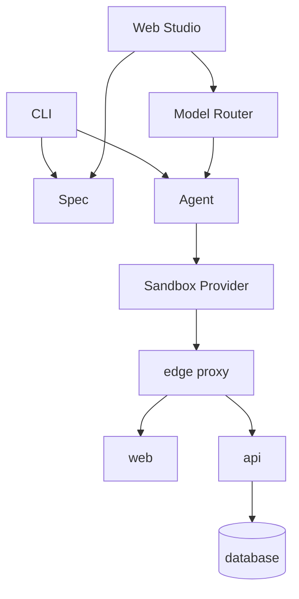

# 아키텍처

## 구성 요소

| 구성 요소 | 역할 |
|---|---|
| `apps/cli` | 기동, 단일 에이전트 요청, 배포, 인증 토큰 |
| `apps/studio` | 세션·대화·미리보기·API·로그 UI와 Agent Fleet |
| `packages/spec` | `studio.yaml` 스키마와 compose 교차 검증 |
| `packages/sandbox` | Docker/Kubernetes, 준비 판정, 네트워크·시크릿·DB |
| `packages/agent` | 모델 도구 루프, 검증 게이트, Git 체크포인트와 원격 연동 |

## 중요한 경계

- compose가 실제 실행 구성을, `studio.yaml`이 스튜디오 정책을 담당합니다.
- managed 서비스는 격리 환경 안에 있고 edge만 루프백 포트를 공개합니다.
- 외부 HTTP(S)는 기본 차단하고 허용 목록과 external 서비스 정책으로 엽니다.
- 모델은 범용 호스트 셸 대신 제한된 파일·명령·HTTP 도구를 받습니다.
- 검증을 통과한 파일과 PostgreSQL 상태만 같은 체크포인트에 남깁니다.
- 원격 저장소는 세션 브랜치와 lease 확인으로 리뷰어 변경을 보호합니다.

## 확장 지점

`SandboxProvider`는 Local Docker와 Kubernetes 구현을, `ModelClient`는 Anthropic·OpenAI 호환 API·Gemini·Claude Code 실행을 교체합니다. 모델이 달라져도 작업 도구와 검증 게이트는 같은 계약을 사용합니다.

상세 요청 흐름은 [저장소 아키텍처 문서](https://github.com/dj258255/b-studio/blob/main/docs/architecture.md), 결정별 비교는 [ADR](https://github.com/dj258255/b-studio/blob/main/docs/decisions.md)를 참고하세요.
