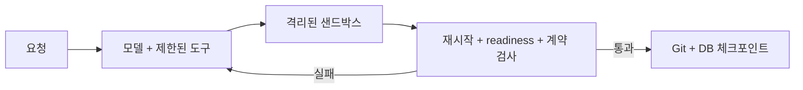

# b-studio Wiki

b-studio는 사내 API와 정책 위에서 프론트엔드·백엔드·데이터베이스를 함께 만들고 실제 실행 결과로 검증하는 AI 앱 빌더입니다.

`studio.yaml`로 프로젝트를 정의하면 Docker 또는 Kubernetes 샌드박스에 서비스를 띄우고, AI가 바꾼 코드를 재시작·준비 상태·OpenAPI 계약으로 확인합니다. 모델이 “완료했다”고 말하는 것만으로는 끝내지 않으며 검증을 통과한 파일과 DB 상태만 체크포인트로 남깁니다.

## 어디서 시작할까요?

| 목적 | 문서 |
|---|---|
| 주문 예제를 바로 실행하고 싶다 | [[시작하기|Getting-Started]] |
| 새 프로젝트의 `studio.yaml`을 쓰고 싶다 | [[프로젝트 설정|Project-Configuration]] |
| 구성 요소와 요청 흐름을 이해하고 싶다 | [[아키텍처|Architecture]] |
| 에이전트가 무엇을 검증하는지 알고 싶다 | [[에이전트와 검증|Agent-and-Verification]] |
| 공유 서버에 배포하고 싶다 | [[운영과 보안|Operations-and-Security]] |
| 실행 오류를 해결하고 싶다 | [[문제 해결|Troubleshooting]] |
| 코드를 고치거나 PR을 보내고 싶다 | [[개발 참여|Development]] |

## 핵심 흐름

## 현재 구현 범위

- Docker와 Kubernetes 샌드박스 제공자
- Next.js·Spring Boot·FastAPI 템플릿
- 웹 스튜디오, CLI, 미리보기, API 탐색기, 로그와 코드 탭
- 검증 게이트, 요청 취소, 체크포인트, DB 복원, 세션 복구
- 원격 브랜치·PR 흐름과 Agent Fleet
- 자원 한도, egress 제어, 시크릿 가림, external API 정책 프록시
- Anthropic·OpenAI 호환 API·Gemini 모델 라우팅과 로컬 Claude Code 실행

소스와 최신 상태는 [GitHub 저장소](https://github.com/dj258255/b-studio), 상세 설계는 [ADR](https://github.com/dj258255/b-studio/blob/main/docs/decisions.md)에서 확인할 수 있습니다.
